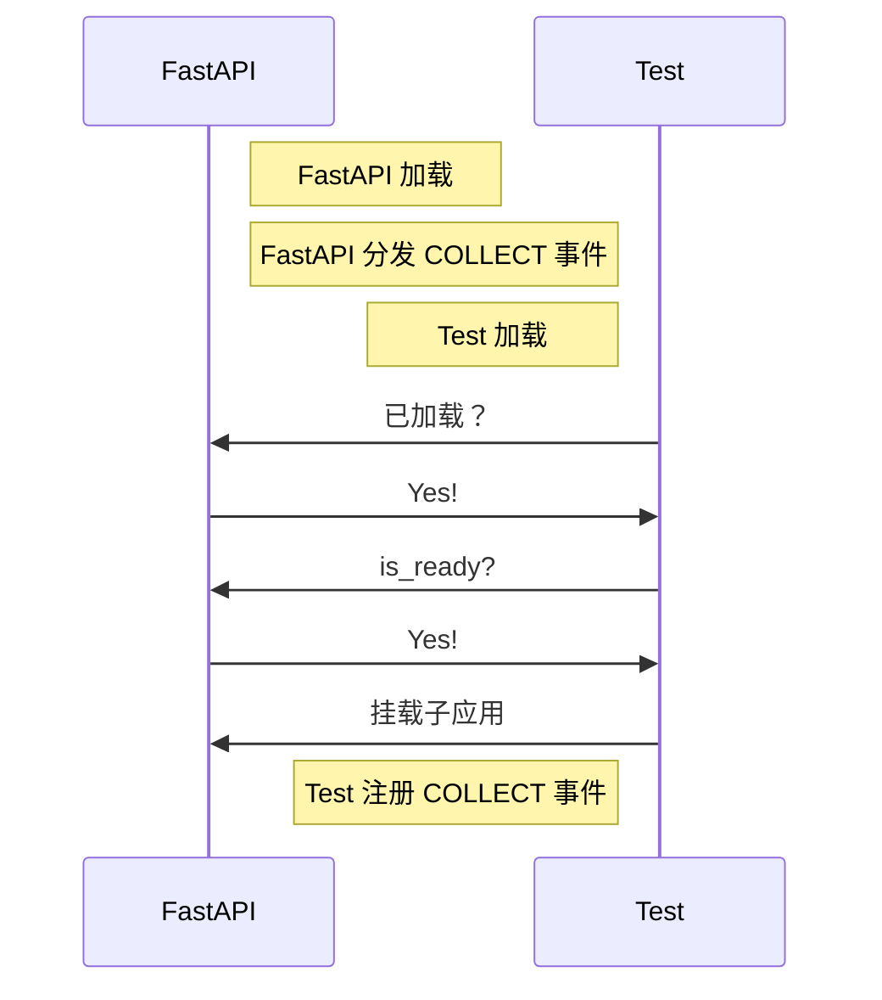
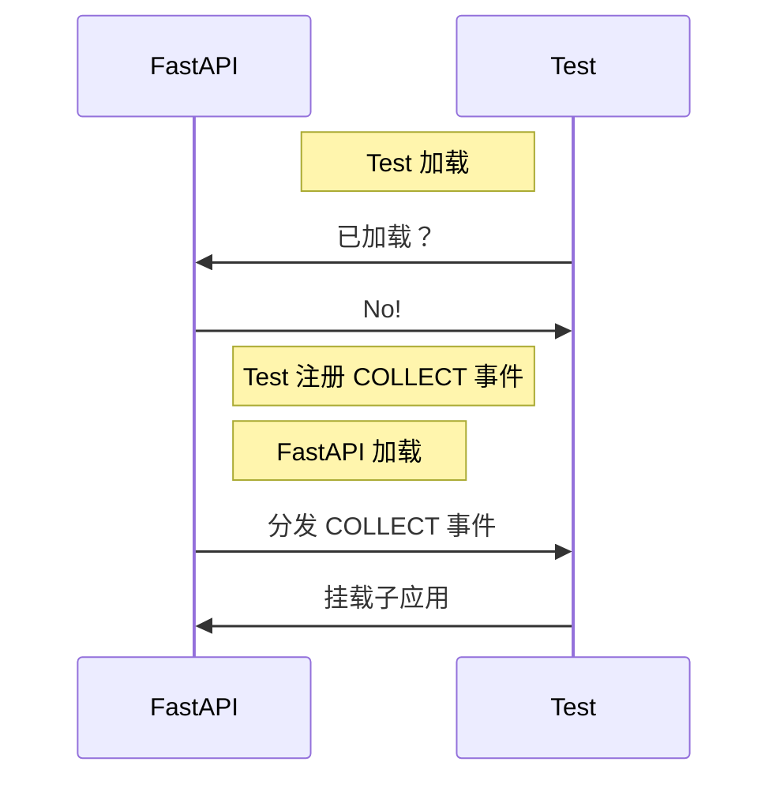
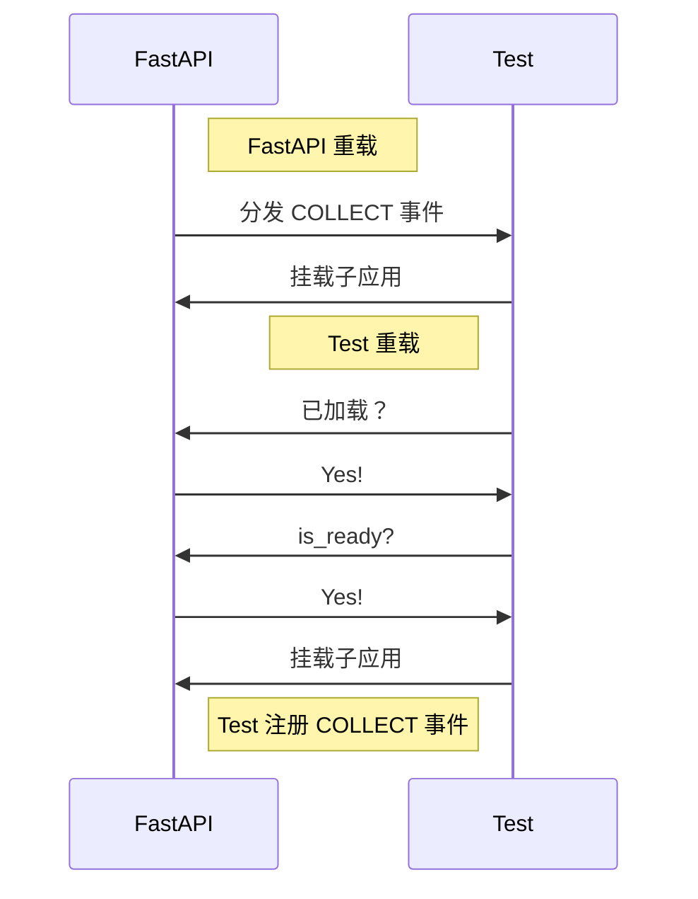
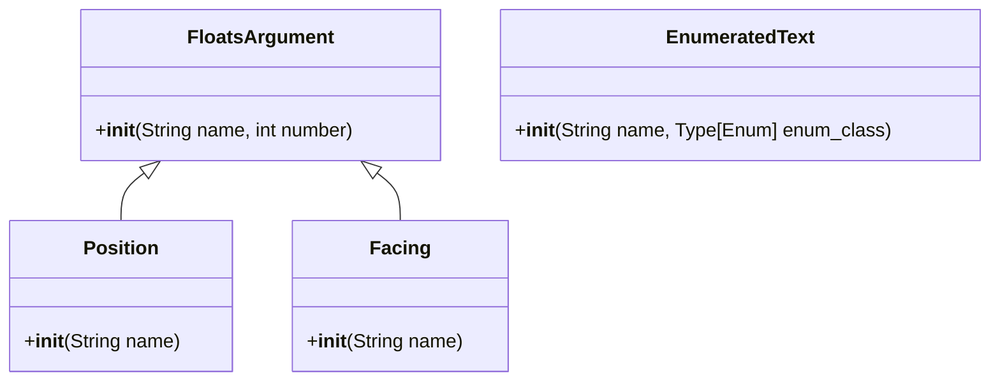

[English](full.md) | **中文**

\>\>\> [回到索引](/readme-zh_cn.md)

# 全插件信息集合

使用 `ctrl-f` 来进行页面中全文搜索，从而找到你感兴趣的东西

## advanced_calculator

### 基本信息

- 插件 ID: `advanced_calculator`
- 插件名: AdvancedCalculator
- 版本: 0.3.1
  - 元数据版本: 0.3.1
  - 发布版本: 0.3.1
- 总下载量: 2033
- 作者: [Andy Zhang](https://github.com/AnzhiZhang)
- 仓库: https://github.com/AnzhiZhang/MCDReforgedPlugins
- 仓库插件页: https://github.com/AnzhiZhang/MCDReforgedPlugins/tree/master/src/advanced_calculator
- 标签: [`工具`](/labels/tool/readme-zh_cn.md)
- 描述: 提供游戏内多种便捷计算

### 插件依赖

| 插件 ID | 依赖需求 |
| --- | --- |

### 包依赖

| Python 包 | 依赖需求 |
| --- | --- |

### 介绍

# AdvancedCalculator

> 提供游戏内多种便捷计算

## 使用

您可以使用 `=<expression>` 直接计算表达式，或使用 `==<count/expression>` 将物品数转换堆叠数。

| 指令 | 用途 | 示例 | 结果 |
| - | - | - | - |
| !!calc \<expression> | 计算表达式 | !!calc 1+1 | 1+1=2 |
| !!calc item \<count/expression> | 物品数转换堆叠数 | !!calc item 1794 | 1794个物品为1盒2组3个 |
| !!calc item \<box> \<stack> \<single> | 堆叠数转换物品数 | !!calc item 1 10 32 | 1盒10组32个为2400个物品 |
| !!calc color \<red> \<green> \<blue> | 10进制RGB转16进制 | !!calc color 255 0 255 | (255, 0, 255) -> #FF00FF |
| !!calc color \<#HEX> | 16十进制RGB转10进制 | !!calc color #00FF00 | #00FF00 -> (0, 255, 0) |

### 下载

> [!IMPORTANT]
> 使用插件之前，先阅读仓库中的 README。

| 文件 | 版本 | 上传时间 (UTC) | 大小 | 下载数 | 操作 |
| --- | --- | --- | --- | --- | --- |
| [AdvancedCalculator-v0.3.1.mcdr](https://github.com/AnzhiZhang/MCDReforgedPlugins/releases/tag/advanced_calculator-v0.3.1) | 0.3.1 | 2023/01/19 17:01:07 | 2.46KB | 1390 | [下载](https://github.com/AnzhiZhang/MCDReforgedPlugins/releases/download/advanced_calculator-v0.3.1/AdvancedCalculator-v0.3.1.mcdr) |
| [AdvancedCalculator-v0.3.0.mcdr](https://github.com/AnzhiZhang/MCDReforgedPlugins/releases/tag/advanced_calculator-v0.3.0) | 0.3.0 | 2022/10/21 20:03:33 | 2.42KB | 302 | [下载](https://github.com/AnzhiZhang/MCDReforgedPlugins/releases/download/advanced_calculator-v0.3.0/AdvancedCalculator-v0.3.0.mcdr) |
| [AdvancedCalculator-v0.2.1.mcdr](https://github.com/AnzhiZhang/MCDReforgedPlugins/releases/tag/advanced_calculator-v0.2.1) | 0.2.1 | 2022/07/21 13:20:06 | 2.38KB | 235 | [下载](https://github.com/AnzhiZhang/MCDReforgedPlugins/releases/download/advanced_calculator-v0.2.1/AdvancedCalculator-v0.2.1.mcdr) |

## advanced_whitelist_r

### 基本信息

- 插件 ID: `advanced_whitelist_r`
- 版本: *数据拉取失败*
- 总下载量: N/A
- 作者: [noionion](https://github.com/2X-ercha), [GamerNoTitle](https://github.com/GamerNoTitle)
- 仓库: https://github.com/EMUnion/AdvancedWhitelistR
- 仓库插件页: https://github.com/EMUnion/AdvancedWhitelistR/tree/master
- 标签: [`管理`](/labels/management/readme-zh_cn.md)
- 描述: *数据拉取失败*

### 插件依赖

*数据拉取失败*

### 包依赖

*数据拉取失败*

### 介绍

离线服务器白名单管理

### 下载

> [!IMPORTANT]
> 使用插件之前，先阅读仓库中的 README。

*数据拉取失败*

## allow_suicide

### 基本信息

- 插件 ID: `allow_suicide`
- 版本: *数据拉取失败*
- 总下载量: N/A
- 作者: [JAs0n](https://github.com/JAs0n319)
- 仓库: https://github.com/JAs0n319/allow_suicide
- 仓库插件页: https://github.com/JAs0n319/allow_suicide/tree/master
- 标签: [`工具`](/labels/tool/readme-zh_cn.md)
- 描述: *数据拉取失败*

### 插件依赖

*数据拉取失败*

### 包依赖

*数据拉取失败*

### 介绍

允许没有op权限的玩家自杀

### 下载

> [!IMPORTANT]
> 使用插件之前，先阅读仓库中的 README。

*数据拉取失败*

## auto_backup

### 基本信息

- 插件 ID: `auto_backup`
- 版本: *数据拉取失败*
- 总下载量: N/A
- 作者: [Kongtu5i](https://github.com/Kongtu5i)
- 仓库: https://github.com/Kongtu5i/AutoBackup
- 仓库插件页: https://github.com/Kongtu5i/AutoBackup/tree/main
- 标签: [`管理`](/labels/management/readme-zh_cn.md)
- 描述: *数据拉取失败*

### 插件依赖

*数据拉取失败*

### 包依赖

*数据拉取失败*

### 介绍

当名单中的玩家加入我的世界服务器时进行自动备份

### 下载

> [!IMPORTANT]
> 使用插件之前，先阅读仓库中的 README。

*数据拉取失败*

## auto_command

### 基本信息

- 插件 ID: `auto_command`
- 版本: *数据拉取失败*
- 总下载量: N/A
- 作者: [bzyyyyyyyy](https://github.com/bzyyyyyyyy)
- 仓库: https://github.com/bzyyyyyyyy/MCDR-AutoCommand
- 仓库插件页: https://github.com/bzyyyyyyyy/MCDR-AutoCommand/tree/master
- 标签: [`工具`](/labels/tool/readme-zh_cn.md)
- 描述: *数据拉取失败*

### 插件依赖

*数据拉取失败*

### 包依赖

*数据拉取失败*

### 介绍

编辑/发送指令堆&自动发送指令
### 下载

> [!IMPORTANT]
> 使用插件之前，先阅读仓库中的 README。

*数据拉取失败*

## auto_execute

### 基本信息

- 插件 ID: `auto_execute`
- 版本: *数据拉取失败*
- 总下载量: N/A
- 作者: [FRUITS-CANDY](https://github.com/FRUITS-CANDY)
- 仓库: https://github.com/Passion-Never-Dissipate/Auto-Execute
- 仓库插件页: https://github.com/Passion-Never-Dissipate/Auto-Execute/tree/master
- 标签: [`工具`](/labels/tool/readme-zh_cn.md)
- 描述: *数据拉取失败*

### 插件依赖

*数据拉取失败*

### 包依赖

*数据拉取失败*

### 介绍

一个以脚本为单位存储各类指令多模式执行的MCDR插件

### 下载

> [!IMPORTANT]
> 使用插件之前，先阅读仓库中的 README。

*数据拉取失败*

## auto_msg_title

### 基本信息

- 插件 ID: `auto_msg_title`
- 版本: *数据拉取失败*
- 总下载量: N/A
- 作者: [zhongbai233](https://github.com/zhongbai2333)
- 仓库: https://github.com/zhongbai2333/AutoMsgTitle
- 仓库插件页: https://github.com/zhongbai2333/AutoMsgTitle/tree/master
- 标签: [`信息`](/labels/information/readme-zh_cn.md)
- 描述: *数据拉取失败*

### 插件依赖

*数据拉取失败*

### 包依赖

*数据拉取失败*

### 介绍

此插件可以为玩家自动弹出标题或消息，如同插件服进入主城后的标题

同时此插件可为一块区域提供自动的说明，如服务器被参观时，参观者进入某区域、机器之后自动弹出此区域、机器的制造者、名字、功能之类的；在玩家进入某一机器时自动为玩家弹出机器说明书……

### 下载

> [!IMPORTANT]
> 使用插件之前，先阅读仓库中的 README。

*数据拉取失败*

## auto_plugin_reloader

### 基本信息

- 插件 ID: `auto_plugin_reloader`
- 版本: *数据拉取失败*
- 总下载量: N/A
- 作者: [Fallen_Breath](https://github.com/Fallen-Breath)
- 仓库: https://github.com/TISUnion/AutoPluginReloader
- 仓库插件页: https://github.com/TISUnion/AutoPluginReloader/tree/master
- 标签: [`管理`](/labels/management/readme-zh_cn.md)
- 描述: *数据拉取失败*

### 插件依赖

*数据拉取失败*

### 包依赖

*数据拉取失败*

### 介绍

它是一个可以自动检测 MCDR 插件文件夹中发生的变更并触发插件重载的插件

它是厌倦了插件文件更新后需要手动执行插件重载的懒人的救星！

### 下载

> [!IMPORTANT]
> 使用插件之前，先阅读仓库中的 README。

*数据拉取失败*

## battery_saver

### 基本信息

- 插件 ID: `battery_saver`
- 版本: *数据拉取失败*
- 总下载量: N/A
- 作者: [Mooling0602](https://github.com/Mooling0602)
- 仓库: https://github.com/Mooling0602/BatterySaver-MCDR
- 仓库插件页: https://github.com/Mooling0602/BatterySaver-MCDR/tree/main
- 标签: [`工具`](/labels/tool/readme-zh_cn.md), [`信息`](/labels/information/readme-zh_cn.md)
- 描述: *数据拉取失败*

### 插件依赖

*数据拉取失败*

### 包依赖

*数据拉取失败*

### 介绍

检查主机的电量并在其低位时自动关闭服务器。

### 下载

> [!IMPORTANT]
> 使用插件之前，先阅读仓库中的 README。

*数据拉取失败*

## bedrock_liteloader_handler

### 基本信息

- 插件 ID: `bedrock_liteloader_handler`
- 版本: *数据拉取失败*
- 总下载量: N/A
- 作者: [Elec glacier](https://github.com/Elec-Glacier), [jiangyan](https://github.com/jiangyan03)
- 仓库: https://github.com/Elec-Glacier/liteloader_handler
- 仓库插件页: https://github.com/Elec-Glacier/liteloader_handler/tree/main
- 标签: [`服务端处理器`](/labels/handler/readme-zh_cn.md)
- 描述: *数据拉取失败*

### 插件依赖

*数据拉取失败*

### 包依赖

*数据拉取失败*

### 介绍

[English](https://github.com/Elec-Glacier/liteloader_handler/blob/main/README.md) | **中文**

# Bedrock Liteloader Handler
一个让基岩版也能使用MCDR及其插件的服务端处理器

## 使用之前
原版的BDS是不能输出玩家聊天的。所以你可以使用行为包或者是更改服务端来实现玩家聊天输出

## 使用说明
1. 从仓库[releases](https://github.com/Elec-Glacier/liteloader_handler/releases)中现在最新版本
2. 将下载的文件放入到MCDR的"plugins"文件夹里
3. 启动MCDR
4. 更改config文件夹中的配置文件，选择处理器（默认是原版处理器）
5. 重载配置文件

## 注意
1.2.0版本后，对PrimeBackup做了专门的适配。你可以在config里关掉。

## MCDR插件安装注意
由于基岩版和Java版判若两个游戏，所以在使用其他插件之前，确保知道其是如何工作的并保证能正常运行。

## 注意事项
由于[BDS-3791](https://bugs.mojang.com/browse/BDS-3791)，你可能需要插件修改服务端进行修复，如[UnicodeFixer](https://www.minebbs.com/resources/unicodefixer.6991/)。

### 下载

> [!IMPORTANT]
> 使用插件之前，先阅读仓库中的 README。

*数据拉取失败*

## beep

### 基本信息

- 插件 ID: `beep`
- 版本: *数据拉取失败*
- 总下载量: N/A
- 作者: [Fallen_Breath](https://github.com/Fallen-Breath), [LucunJi](https://github.com/LucunJi)
- 仓库: https://github.com/TISUnion/Beep
- 仓库插件页: https://github.com/TISUnion/Beep/tree/master
- 标签: [`工具`](/labels/tool/readme-zh_cn.md)
- 描述: *数据拉取失败*

### 插件依赖

*数据拉取失败*

### 包依赖

*数据拉取失败*

### 介绍

# Beep

Beeps when someone is mentioned in text with an `@`

Leave a space before and after name when you use a @, for example `@ Lucun_Ji Hello!`

`@ all ` represents all players in game

Use two `@` for more powerful ping

### 下载

> [!IMPORTANT]
> 使用插件之前，先阅读仓库中的 README。

*数据拉取失败*

## better_backup

### 基本信息

- 插件 ID: `better_backup`
- 版本: *数据拉取失败*
- 总下载量: N/A
- 作者: [z0z0r4](https://github.com/z0z0r4)
- 仓库: https://github.com/z0z0r4/better_backup
- 仓库插件页: https://github.com/z0z0r4/better_backup/tree/master
- 标签: [`管理`](/labels/management/readme-zh_cn.md)
- 描述: *数据拉取失败*

### 插件依赖

*数据拉取失败*

### 包依赖

*数据拉取失败*

### 介绍

⚠️ **已停止维护**：建议用 PrimeBackup 替代

支持文件去重的高效备份/回档插件

一些特性：

- 带注释的备份
- 所有文件只留一份不重复，节省硬盘空间
- 备份大小显示，信息清晰
- 理论上无限制的备份点，只取决于存档改动
### 下载

> [!IMPORTANT]
> 使用插件之前，先阅读仓库中的 README。

*数据拉取失败*

## bili_live_helper

### 基本信息

- 插件 ID: `bili_live_helper`
- 版本: *数据拉取失败*
- 总下载量: N/A
- 作者: [Aimerny](https://github.com/Aimerny)
- 仓库: https://github.com/Aimerny/MCDRPlugins
- 仓库插件页: https://github.com/Aimerny/MCDRPlugins/tree/main/src/bili_live_helper
- 标签: [`信息`](/labels/information/readme-zh_cn.md)
- 描述: *数据拉取失败*

### 插件依赖

*数据拉取失败*

### 包依赖

*数据拉取失败*

### 介绍

# BiliLiveHelper | B站直播助手-弹幕姬

---

支持将b站直播间的弹幕同步到mc中

> [!important]
> 此插件仅用于学习交流,请勿用于违法犯罪或其他不良用途.

# :sparkles: 功能

**BiliLiveHelper**是一款~~功能丰富的~~MCDR插件,能够实现将[bilibili](https://bilibili.com)(以下简称"B站)
直播间中的弹幕信息实时同步到MC聊天板中.

- [x] 全异步拉取B站弹幕
- [x] 支持多个玩家订阅各自的直播间,弹幕消息单独发送,互不干扰
- [x] 玩家可以随时启停弹幕姬
- [ ] 支持查询订阅的直播间的状态
- [ ] admin轻松管理所有玩家的订阅信息
- [x] 游戏内通过直播姬账号发送弹幕,即时回应

# :robot: 指令
```
 ---------- BiliLiveHelper ----------
 >> !!blh [help] - | - 获取帮助
 >> !!blh bind <rid> - | - 绑定直播间id
 >> !!blh on - | - 启动直播弹幕姬
 >> !!blh off - | - 停止直播弹幕姬
 >> !!blh info - | - 查看我的直播间信息
 >> !!blh query - | - 查看其他玩家的直播间信息
 >> !!blh send <danmu> - | - 向直播间发送弹幕
 >> !!blh s <danmu> - | - 向直播间发送弹幕
 ------- Authored by Aimerny --------

```

# :pushpin: 依赖

| python依赖项           | 版本      |
| ------------------- | ------- |
| mcdreforged         | ^2.12.0 |
| bilibili-python-api | ^16.3.0 |

| mcdr依赖项     | 版本      |
| ----------- | ------- |
| mcdreforged | ^2.13.0 |

# :wrench: 配置
```json5
{
    "enable": true,
    "data_file_path": "data.json",
    "console_output": true,
    "account": {
        "uid": 3546688564234249,
        "sessdata": "",
        "bili_jct": "",
        "buvid3": "",
        "ac_time_value": ""
    },
   "send":true
}
```
## 配置说明

1. `data_file_path`: 数据文件的路径.持久化的信息会保存到这个文件
2. `console_output`: 是否将接收到的弹幕输出到服务器控制台,如果设为false则需要在debug模式才能看到
3. `account`: 使用此插件需要一个真实的B站账号.`account`中是一些鉴权信息
   1. `uid`: 你的B站账号UID
   2. 其他: 参考 [获取 Credential 类所需信息](https://nemo2011.github.io/bilibili-api/#/get-credential)
4. `send`: 是否允许服务器成员使用上述配置中的`account`发送消息到对应直播间,默认为true

> [!note]
> B站的账号如果没有在其他地方登录基本不会过期,建议开一个小号做这件事情

# :art: 功能预览

## 消息同步


## MC发送弹幕


### 下载

> [!IMPORTANT]
> 使用插件之前，先阅读仓库中的 README。

*数据拉取失败*

## bingo

### 基本信息

- 插件 ID: `bingo`
- 版本: *数据拉取失败*
- 总下载量: N/A
- 作者: [Andy Zhang](https://github.com/AnzhiZhang)
- 仓库: https://github.com/AnzhiZhang/MCDReforgedPlugins
- 仓库插件页: https://github.com/AnzhiZhang/MCDReforgedPlugins/tree/master/src/bingo
- 标签: [`工具`](/labels/tool/readme-zh_cn.md)
- 描述: *数据拉取失败*

### 插件依赖

*数据拉取失败*

### 包依赖

*数据拉取失败*

### 介绍

# Bingo

> [Bingo](https://www.flytre.net/bingo) 游戏实用工具

## 使用

| 指令 | 用途 |
| - | - |
| !!bingo team \<num> | 随机分组 |
| !!bingo end | 结束游戏 |

### 下载

> [!IMPORTANT]
> 使用插件之前，先阅读仓库中的 README。

*数据拉取失败*

## bkchat_manager

### 基本信息

- 插件 ID: `bkchat_manager`
- 版本: *数据拉取失败*
- 总下载量: N/A
- 作者: [Mooling0602](https://github.com/Mooling0602)
- 仓库: https://github.com/Mooling0602/BukkitChatManager-MCDR
- 仓库插件页: https://github.com/Mooling0602/BukkitChatManager-MCDR/tree/main
- 标签: [`信息`](/labels/information/readme-zh_cn.md), [`管理`](/labels/management/readme-zh_cn.md)
- 描述: *数据拉取失败*

### 插件依赖

*数据拉取失败*

### 包依赖

*数据拉取失败*

### 介绍

# BukkitChatManager-MCDR
在MCDR接管BukkitAPI服务端的游戏内聊天。

## 依赖
- BukkitAPI 插件：[PlayerLog](https://github.com/Mooling0602/BukkitChatManager-MCDR/blob/main/extra/PlayerLog-1.1.jar)
> 已附加到MCDR插件中，MCDR启动或重载此插件时会自动更新或加载，你可能需要重启服务器以使其生效！

## 用法
从Release中安装此MCDR插件，如果出现问题，请确认依赖是否已经正常加载，有报错请反馈到Issues！

## 配置
配置文件位于`config/bkchat_manager/config.json`，你可以在里面修改聊天消息的格式等。

其中，`%player%`表示玩家名；`%message%`表示聊天消息内容或玩家执行的指令内容；`%src_prefix%`表示指令源。

## 注意事项
和类似的BukkitAPI插件冲突，请不要使用这些同类型的插件。

另外，如果有和依赖中作用相同的替代品插件，此MCDR插件可无缝迁移到其他类型的服务端上；Mohist等支持BukkitAPI的混合端也可以使用。

插件有内置专门的服务端处理器，强烈建议启用，同时启用后无法使用其他的服务端处理器，否则会冲突。

## 更新内容
### 历史日志
- `v0.2.1` 对内置的Bukkit插件依赖进行了更新，添加了客户端聊天拦截的动态控制功能，非生产环境下可以使用/chatmsg on|off进行调试，生产环境下请禁止普通玩家的playerlog.chatmsg权限（将于后续优化）！
- `v0.3.0` 更新了兼容模式（compatibility_mode），你可以通过安装此插件并启用聊天兼容模式的方式，使MCDR本身和MCDR的大部分按规范开发的插件，可以兼容各种会修改聊天内容并影响服务端聊天相关日志输出的Bukkit服务端插件如VentureChat等！

### 计划中

经过测试的服务端：Mohist、Paper、Leaves
> 极低版本的服务端尚未测试，理论上支持1.12及以上的所有Bukkit服务端。

### 下载

> [!IMPORTANT]
> 使用插件之前，先阅读仓库中的 README。

*数据拉取失败*

## bot

### 基本信息

- 插件 ID: `bot`
- 版本: *数据拉取失败*
- 总下载量: N/A
- 作者: [Andy Zhang](https://github.com/AnzhiZhang)
- 仓库: https://github.com/AnzhiZhang/MCDReforgedPlugins
- 仓库插件页: https://github.com/AnzhiZhang/MCDReforgedPlugins/tree/master/src/bot
- 标签: [`工具`](/labels/tool/readme-zh_cn.md), [`管理`](/labels/management/readme-zh_cn.md)
- 描述: *数据拉取失败*

### 插件依赖

*数据拉取失败*

### 包依赖

*数据拉取失败*

### 介绍

*数据拉取失败*
### 下载

> [!IMPORTANT]
> 使用插件之前，先阅读仓库中的 README。

*数据拉取失败*

## bot_plugin

### 基本信息

- 插件 ID: `bot_plugin`
- 版本: *数据拉取失败*
- 总下载量: N/A
- 作者: [DancingSnow0517](https://github.com/DancingSnow0517)
- 仓库: https://github.com/DancingSnow0517/Bot_Manager
- 仓库插件页: https://github.com/DancingSnow0517/Bot_Manager/tree/master
- 标签: [`管理`](/labels/management/readme-zh_cn.md), [`工具`](/labels/tool/readme-zh_cn.md)
- 描述: *数据拉取失败*

### 插件依赖

*数据拉取失败*

### 包依赖

*数据拉取失败*

### 介绍

# 一个 MCDR bot管理器。

:warning: **务必在使用前阅读仓库中的 README！**

### 下载

> [!IMPORTANT]
> 使用插件之前，先阅读仓库中的 README。

*数据拉取失败*

## botkikai

### 基本信息

- 插件 ID: `botkikai`
- 版本: *数据拉取失败*
- 总下载量: N/A
- 作者: [Jerry-FaGe](https://github.com/Jerry-FaGe), [RayanceKing](https://github.com/RayanceKing)
- 仓库: https://github.com/RayanceKing/MCDR-BotKikai
- 仓库插件页: https://github.com/RayanceKing/MCDR-BotKikai/tree/master
- 标签: [`工具`](/labels/tool/readme-zh_cn.md), [`管理`](/labels/management/readme-zh_cn.md)
- 描述: *数据拉取失败*

### 插件依赖

*数据拉取失败*

### 包依赖

*数据拉取失败*

### 介绍

# MCDR-BotKikai（Bot機械）

适用于[MCDR](https://github.com/Fallen-Breath/MCDReforged)的将假人存储至列表并提供指令映射，便捷放置，操作界面等功能的插件。
需要安装前置插件[MinecraftDataAPI](https://github.com/MCDReforged/MinecraftDataAPI)（MCDR 1.x）。

特别感谢[AnzhiZhang](https://github.com/AnzhiZhang)的[Bot](https://github.com/AnzhiZhang/MCDReforgedPlugins/tree/master/src/bot)插件提供的部分逻辑。

> 君は道具ではなく、その名が似合う人になろんだ


假如你有一台刷沙机, 开关在[0, 64, 0]的位置。本插件可以实现让你在世界的任何位置输入指令`!!bk 刷沙机 use`都可以随时在指定位置召唤假人以开关这台刷沙机（顺便挂机）。

```MCDR
本插件中!!bk与!!botkikai效果相同，两者可以互相替换
!!bk 显示本帮助信息
!!bk list 显示假人列表
!!bk reload 重载插件配置
!!bk add <name> <kikai> 使用当前玩家参数添加一个名为<name>用于<kikai>的假人
!!bk add <name> <kikai> <dim> <pos> <facing> 使用自定义参数添加一个名为<name>用于<kikai>的假人
!!bk del <kikai> 从假人列表移除用于<kikai>的假人
!!bk <kikai> 输出一个可点击的界面，自动根据假人是否在线改变选项
!!bk <kikai> spawn 召唤一个用于<kikai>的假人
!!bk <kikai> kill 干掉用于<kikai>的假人
!!bk <kikai> use 假人右键一次（执行此条前无需执行spawn，如假人不在线会自动上线）
!!bk <kikai> huse 假人持续右键
!!bk <kikai> hatk 假人持续左键
!!bk <kikai> glowing 假人发光两分钟
!!bk <kikai> stop 假人停止一切动作
```

## 功能补充
* 参数中的`<kikai>`指红石机械，`<name>`指假人的真实名字。

  如果想让`sandbot`控制`刷沙机`，则`<name>`为`sandbot`，`<kikai>`为`刷沙机`。

  假人器械映射，顾名思义，`!!bk sandbot spawn`和`!!bk 刷沙机 spawn`的运作效果是一样的，其他指令同理。

* 本插件支持MCDR的权限系统，可以在文件头部修改使用指令的权限等级。

  默认的权限配置为：user及以上组可以操作假人(spawn,use,kill)，admin及以上组可以操作假人列表(add,remove)

* `!!bk list`: 输出一个类似下面的界面，显示本插件储存的所有假人，可以通过点击进行操作。
  ```MCDR
  ----------- Jerry_FaGe 离线  -----------
  此假人用于: ['Jerry_FaGe', '发哥', '开发者', '作者', 'test']
  [点击召唤]  [点击use]  [查看详情]
  ----------- sandbot 在线  -----------
  此假人用于: ['sandbot', '刷沙机']
  [点击use]  [点击下线]  [查看详情]
  ----------- stonebot 离线  -----------
  此假人用于: ['stonebot', '刷石机']
  [点击召唤]  [点击use]  [查看详情]
  ```
* `!!bk reload`: 重载[BotKikai.json](https://github.com/RayanceKing/MCDR-BotKikai/blob/master/BotKikai.json)配置文件，用于用户修改配置。配置文件详见下文 **关于配置文件**。
* `!!bk add <name> <kikai>`: 使用玩家当前的维度，坐标，朝向添加一个假人。也就是说如果玩家用准星指着开关使用此指令后，召唤出的假人可以直接use开关。
  **注:** 由于carpet本身原因，假人无法use拉杆，如果机器的开关是拉杆形式的请自行替换成音符盒式或其他支持假人use的方式。
* `!!bk add <name> <kikai> <dim> <pos> <facing>`: 使用指令中的自定义参数添加一个假人，可用作挂机点等对假人朝向没有要求的场景。
* `!!bk del <kikai>`: 没啥好说的，从列表删掉这个假人，因为懒所以没写修改功能，加错了可以删了再add。
* `!!bk <kikai>`: 输出一个可点击的界面，自动根据假人是否在线改变选项
  * 假人在线:
    ```
    ----------- sandbot 在线 -----------
    此假人用于: ['sandbot', '刷沙机']
    维度: minecraft:overworld
    坐标: [-2.439826988598193, 7.0, -5.05480960268401]
    朝向: 180.59103 29.550417
    [点击use]  [点击下线]
    ```
  * 假人离线:
    ```
    ----------- stonebot 离线 -----------
    此假人用于: ['stonebot', '刷石机']
    维度: minecraft:overworld
    坐标: [4.589996529809662, 7.0, -4.426900981652432]
    朝向: -214.02008 31.20023
    [点击召唤]  [点击use]
    ```

## 关于配置文件

配置文件[BotKikai.json](https://github.com/RayanceKing/MCDR-BotKikai/blob/master/BotKikai.json)是一个json格式文件，请把它放在`MCDR/config`文件夹下，如果想实现上文中的效果，它的格式应该如下：
```JSON
{
    "Jerry_FaGe": {
        "nick": ["Jerry_FaGe", "发哥", "开发者", "作者", "test"],
        "dim": "minecraft:overworld",
        "pos": [0, 70, 0],
        "facing": "0 0"
    },
    "sandbot": {
        "nick": ["sandbot", "刷沙机"],
        "dim": "minecraft:overworld",
        "pos": [-2.439826988598193, 7.0, -5.05480960268401],
        "facing": "180.59103 29.550417"
    },
    "stonebot": {
        "nick": ["stonebot", "刷石机"],
        "dim": "minecraft:overworld",
        "pos": [4.589996529809662, 7.0, -4.426900981652432],
        "facing": "-214.02008 31.20023"
    }
}
```
除了使用`add`, `del`指令操作假人列表外，用户还可以根据配置文件的格式自行增删改，改完之后去游戏中执行`!!bk reload`即可更新修改后的假人列表。

## 声明

本插件实现的功能只要是装了carpet mod能召唤假人的服务端都可以实现，即便是这样也仍有可能引发争议。烦请想装本插件的腐竹实装前务必了解下成员们的意愿。

TODO:
- [ ] 自动归类同一机器的假人
- [ ] 分开显示离线和在线假人
- [ ] 修复部分操作下指令无反馈
- [ ] 将权限配置文件化

### 下载

> [!IMPORTANT]
> 使用插件之前，先阅读仓库中的 README。

*数据拉取失败*

## carpet_bot_manager

### 基本信息

- 插件 ID: `carpet_bot_manager`
- 版本: *数据拉取失败*
- 总下载量: N/A
- 作者: [YehowahLiu](https://github.com/YehowahLiu)
- 仓库: https://github.com/FAS-Server/CarpetBotManager
- 仓库插件页: https://github.com/FAS-Server/CarpetBotManager/tree/main
- 标签: [`工具`](/labels/tool/readme-zh_cn.md)
- 描述: *数据拉取失败*

### 插件依赖

*数据拉取失败*

### 包依赖

*数据拉取失败*

### 介绍

一个地毯端 bot 管理插件，可以点击召唤 bot 并让其执行系列动作

### 下载

> [!IMPORTANT]
> 使用插件之前，先阅读仓库中的 README。

*数据拉取失败*

## carpet_tick

### 基本信息

- 插件 ID: `carpet_tick`
- 版本: *数据拉取失败*
- 总下载量: N/A
- 作者: [Ivan1F](https://github.com/Ivan-1F)
- 仓库: https://github.com/Ivan-1F/CarpetTick
- 仓库插件页: https://github.com/Ivan-1F/CarpetTick/tree/master
- 标签: [`信息`](/labels/information/readme-zh_cn.md)
- 描述: *数据拉取失败*

### 插件依赖

*数据拉取失败*

### 包依赖

*数据拉取失败*

### 介绍

CarpetTick
-----

A [MCDReforged](https://github.com/Fallen-Breath/MCDReforged) (>=2.x) plugin

Get server status using carpet `/tick` command without enabling `/tick rate` and `/tick wrap`

Designed for carpet mod for 1.13 since there's no `/profile` command

If you are using fabric-carpet, just go ahead and use `/profile` command

## Config

Configure file: `config/carpet_tick/config.json`

`permission`: the minimum permission level to use the command, default: `4`

## Command

`!!tick`: Display help message

`!!tick health [ticks]`: Run `/tick health [ticks]`

`!!tick entities [ticks]`: Run `/tick entities [ticks]`

`!!tick h [ticks]`: Run `/tick health [ticks]`

`!!tick e [ticks]`: Run `/tick entities [ticks]`

---

一个 [MCDReforged](https://github.com/Fallen-Breath/MCDReforged) (>=2.x) 插件

在不启用 `/tick rate` 和 `/tick wrap` 的情况下使用 Carpet Mod 的 `/tick` 指令获取服务器信息

为 1.13 的 carpet mod 设计，因为没有 `/profile` 指令

如果你在使用 fabric-carpet，只需继续使用 `/profile` 命令即可

## 配置

配置文件: `config/carpet_tick/config.json`

`permission`: 执行指令所需要的最小权限等级，默认值：`4`

## Command

`!!tick`: 显示帮助信息

`!!tick health [ticks]`: 执行 `/tick health [ticks]`

`!!tick entities [ticks]`: 执行 `/tick entities [tic`ks]

`!!tick h [ticks]`: 执行 `/tick health [ticks]`

`!!tick e [ticks]`: 执行 `/tick entities [ticks]`

### 下载

> [!IMPORTANT]
> 使用插件之前，先阅读仓库中的 README。

*数据拉取失败*

## carpetbotlist

### 基本信息

- 插件 ID: `carpetbotlist`
- 版本: *数据拉取失败*
- 总下载量: N/A
- 作者: [ZeroKelvin](https://github.com/BelowZeroKelvin)
- 仓库: https://github.com/BelowZeroKelvin/MCDR-CarpetBotList
- 仓库插件页: https://github.com/BelowZeroKelvin/MCDR-CarpetBotList/tree/MCDR-2.x
- 标签: [`工具`](/labels/tool/readme-zh_cn.md)
- 描述: *数据拉取失败*

### 插件依赖

*数据拉取失败*

### 包依赖

*数据拉取失败*

### 介绍

帮助你管理地毯端的假人

### 下载

> [!IMPORTANT]
> 使用插件之前，先阅读仓库中的 README。

*数据拉取失败*

## cato

### 基本信息

- 插件 ID: `cato`
- 版本: *数据拉取失败*
- 总下载量: N/A
- 作者: [Harry-zklcdc](https://github.com/Harry-zklcdc)
- 仓库: https://github.com/Harry-zklcdc/MCDR-Cato
- 仓库插件页: https://github.com/Harry-zklcdc/MCDR-Cato/tree/main
- 标签: [`工具`](/labels/tool/readme-zh_cn.md)
- 描述: *数据拉取失败*

### 插件依赖

*数据拉取失败*

### 包依赖

*数据拉取失败*

### 介绍

使服务器启动时, 自动使用 cato (P2P 连接工具)进行端口映射, 并支持生成 HMCL 联机码

# 特性:

- Cato 官方支持
- 无感 P2P 连接
- HMCl 多人游戏支持
- Cato 崩溃/临时 ID 到期自动重启
- API 接口获取 Cato 连接 ID、HMCL 联机码
- Cato Token 动态更换
- 游戏内获取 Cato 连接 ID、HMCL 联机码

### 下载

> [!IMPORTANT]
> 使用插件之前，先阅读仓库中的 README。

*数据拉取失败*

## chat_with_ai

### 基本信息

- 插件 ID: `chat_with_ai`
- 版本: *数据拉取失败*
- 总下载量: N/A
- 作者: [gubai](https://github.com/gubaiovo)
- 仓库: https://github.com/gubaiovo/MCDR_chat_with_ai
- 仓库插件页: https://github.com/gubaiovo/MCDR_chat_with_ai/tree/main/chat_with_ai
- 标签: [`工具`](/labels/tool/readme-zh_cn.md)
- 描述: *数据拉取失败*

### 插件依赖

*数据拉取失败*

### 包依赖

*数据拉取失败*

### 介绍

# chat_with_ai
DeepSeek 恢复正常后，便尝试编写一个MCDR插件，使MC服务器能够接入DeepSeek。

使用了openai库，理论上支持openai的模型均可使用此插件对接

文章地址：https://blog.gubaiovo.com/posts/ec277bd3.html

## 使用方法

扔进plugins文件夹，然后`!!MCDR plugin reload chat_with_ai`


## Command

`!!dsp help`: 查看帮助

`!!dsp history`: 查看历史消息

`!!dsp clear`: 清空历史消息

`!!dsp system`: 查看ai预设

`!!dsp system <system>`: 设置ai预设

`!!dsp prefix`: 查看ai名称

`!!dsp prefix <prefix>`: 设置ai名称

`!!dsp init system`: 初始化角色预设

`!!dsp init prefix`: 初始化角色预设

`!!dsp init all`: 全部初始化且清空历史记录

`!!dsp <message>`: 与AI对话


## 鸣谢

感谢22年的自己

> 世界生成算法吞下了我的十七岁。
> 
> 那封没寄出的信还在末地折跃门边缘，
> 
> 漂浮如未完成的红石电路。
> 
> 当第一个AI村民说出预设外的对白，
> 
> 我忽然听见2022年的自己，
> 
> 在矿洞深处敲打铁轨的节奏。
> 
> 那些被放弃的坐标参数，
> 
> 正在基岩层下重新编译春天。

### 下载

> [!IMPORTANT]
> 使用插件之前，先阅读仓库中的 README。

*数据拉取失败*

## chatbridge

### 基本信息

- 插件 ID: `chatbridge`
- 版本: *数据拉取失败*
- 总下载量: N/A
- 作者: [Fallen_Breath](https://github.com/Fallen-Breath)
- 仓库: https://github.com/TISUnion/ChatBridge
- 仓库插件页: https://github.com/TISUnion/ChatBridge/tree/master
- 标签: [`工具`](/labels/tool/readme-zh_cn.md)
- 描述: *数据拉取失败*

### 插件依赖

*数据拉取失败*

### 包依赖

*数据拉取失败*

### 介绍

跨服聊天 v2

### 下载

> [!IMPORTANT]
> 使用插件之前，先阅读仓库中的 README。

*数据拉取失败*

## chatbridgereforged_mc

### 基本信息

- 插件 ID: `chatbridgereforged_mc`
- 版本: *数据拉取失败*
- 总下载量: N/A
- 作者: [Ricky](https://github.com/R1ckyH)
- 仓库: https://github.com/R1ckyH/ChatBridgeReforged
- 仓库插件页: https://github.com/R1ckyH/ChatBridgeReforged/tree/master/./ChatBridgeReforged_MC
- 标签: [`工具`](/labels/tool/readme-zh_cn.md)
- 描述: *数据拉取失败*

### 插件依赖

*数据拉取失败*

### 包依赖

*数据拉取失败*

### 介绍

ChatBridge 重制, 用于各个客户端（服务器或者其他bot）之间的交互桥梁，多物互联（不是）

### 下载

> [!IMPORTANT]
> 使用插件之前，先阅读仓库中的 README。

*数据拉取失败*

## cleanroom_handler

### 基本信息

- 插件 ID: `cleanroom_handler`
- 版本: *数据拉取失败*
- 总下载量: N/A
- 作者: [Cmmmmmm](https://github.com/CmmmmmmLau)
- 仓库: https://github.com/CmmmmmmLau/CleanroomHandler
- 仓库插件页: https://github.com/CmmmmmmLau/CleanroomHandler/tree/master
- 标签: [`服务端处理器`](/labels/handler/readme-zh_cn.md)
- 描述: *数据拉取失败*

### 插件依赖

*数据拉取失败*

### 包依赖

*数据拉取失败*

### 介绍

Cleanroom Handler
---------

添加对Cleanroom的服务端处理器支持

Adding server handler support for Cleanroom on Minecraft 1.12.2 with Java 21.

### 下载

> [!IMPORTANT]
> 使用插件之前，先阅读仓库中的 README。

*数据拉取失败*

## colored_chat

### 基本信息

- 插件 ID: `colored_chat`
- 版本: *数据拉取失败*
- 总下载量: N/A
- 作者: [Andy Zhang](https://github.com/AnzhiZhang)
- 仓库: https://github.com/AnzhiZhang/MCDReforgedPlugins
- 仓库插件页: https://github.com/AnzhiZhang/MCDReforgedPlugins/tree/master/src/.archived/ColoredChat
- 标签: [`工具`](/labels/tool/readme-zh_cn.md)
- 描述: *数据拉取失败*

### 插件依赖

*数据拉取失败*

### 包依赖

*数据拉取失败*

### 介绍

# ColoredChat

> 支持原版显示 [格式化代码](https://minecraft.fandom.com/zh/wiki/%E6%A0%BC%E5%BC%8F%E5%8C%96%E4%BB%A3%E7%A0%81)

## 使用

与正常聊天没有区别, 需要格式化时使用 `&` 符号

## 配置

`force_refresh`

是否刷新聊天栏的所有内容, 某些无法被记录的信息可能会被覆盖

默认值: `True`

## API

可以使用 `append_msg(msg)` 方法来插件的广播消息

### 下载

> [!IMPORTANT]
> 使用插件之前，先阅读仓库中的 README。

*数据拉取失败*

## colorful_id

### 基本信息

- 插件 ID: `colorful_id`
- 版本: *数据拉取失败*
- 总下载量: N/A
- 作者: [Apricityx_](https://github.com/Apricityx)
- 仓库: https://github.com/Apricityx/ColorfulID
- 仓库插件页: https://github.com/Apricityx/ColorfulID/tree/master
- 标签: [`工具`](/labels/tool/readme-zh_cn.md)
- 描述: *数据拉取失败*

### 插件依赖

*数据拉取失败*

### 包依赖

*数据拉取失败*

### 介绍

### 这是一个简单的插件，可以让玩家通过以下命令来选择自己的名字颜色：

## 注意：此插件原理是通过让玩家加入不同颜色的队伍来实现，请注意你的服务器是否依赖/team命令。

## 在启用插件后需要执行以下命令来初始化：

```
!!color install
```

这会新增若干个队伍，通过加入队伍来调整名字的颜色。

当不在需要此插件时，执行以下命令来删除队伍：

```
!!color uninstall
```

### 下载

> [!IMPORTANT]
> 使用插件之前，先阅读仓库中的 README。

*数据拉取失败*

## command_aliases

### 基本信息

- 插件 ID: `command_aliases`
- 版本: *数据拉取失败*
- 总下载量: N/A
- 作者: [Andy Zhang](https://github.com/AnzhiZhang)
- 仓库: https://github.com/AnzhiZhang/MCDReforgedPlugins
- 仓库插件页: https://github.com/AnzhiZhang/MCDReforgedPlugins/tree/master/src/command_aliases
- 标签: [`工具`](/labels/tool/readme-zh_cn.md)
- 描述: *数据拉取失败*

### 插件依赖

*数据拉取失败*

### 包依赖

*数据拉取失败*

### 介绍

# Command Aliases

> 根据配置文件为命令添加别名

## 使用

您需要在配置文件中添加所有您想要别名的命令，其中键是别名，值是原始命令。

```json
{
  "alias": {
    "!!mcdr": "!!MCDR"
  }
}
```

现在您可以使用 `!!mcdr` 作为 `!!MCDR` 的别名。

> [!NOTE]
> 命令别名不会有自动补全。如果您需要使用自动补全，您需要使用原始命令。在有自动补全的环境中使用别名是没有意义的。

### 下载

> [!IMPORTANT]
> 使用插件之前，先阅读仓库中的 README。

*数据拉取失败*

## command_exporter

### 基本信息

- 插件 ID: `command_exporter`
- 版本: *数据拉取失败*
- 总下载量: N/A
- 作者: [DancingSnow](https://github.com/DancingSnow0517)
- 仓库: https://github.com/DancingSnow0517/MCDR-Command-Exporter
- 仓库插件页: https://github.com/DancingSnow0517/MCDR-Command-Exporter/tree/master/command_exporter
- 标签: [`工具`](/labels/tool/readme-zh_cn.md)
- 描述: *数据拉取失败*

### 插件依赖

*数据拉取失败*

### 包依赖

*数据拉取失败*

### 介绍

[English](https://github.com/DancingSnow0517/MCDR-Command-Exporter/tree/master/command_exporter/README.MD) | 中文

# MCDR Command Exporter

一个插件用于导出 MCDR 命令树。

与 mod [MCDR-Completion](https://github.com/DancingSnow0517/MCDR-Completion) 配合使用获得游戏内 MCDR 命令补全。

## 用法
1. 去 [release page](https://github.com/DancingSnow0517/MCDR-Command-Exporter/releases) 下载 `MCDRCommandExporter-vX.X.X.mcdr` 插件

   将插件放入 MCDR 的插件文件夹中并重新加载

2. 下载 fabric mod [MCDR-Completion](https://github.com/DancingSnow0517/MCDR-Completion/releases) 并且安装到 `服务端` 和 `客户端` 上

   这个 mod 依赖 [fabric-api](https://modrinth.com/mod/fabric-api)

3. 加入到服务器中并享受它！

### 下载

> [!IMPORTANT]
> 使用插件之前，先阅读仓库中的 README。

*数据拉取失败*

## commandblock_handler

### 基本信息

- 插件 ID: `commandblock_handler`
- 版本: *数据拉取失败*
- 总下载量: N/A
- 作者: [Dainsleif](https://github.com/Dainsleif233)
- 仓库: https://github.com/Dainsleif233/MCDR-Commandblock-Handler
- 仓库插件页: https://github.com/Dainsleif233/MCDR-Commandblock-Handler/tree/master
- 标签: [`服务端处理器`](/labels/handler/readme-zh_cn.md)
- 描述: *数据拉取失败*

### 插件依赖

*数据拉取失败*

### 包依赖

*数据拉取失败*

### 介绍

# MCDR-Commandblock-Handler

使函数和命令方块能使用MCDR命令.

在函数（执行者为Server）或命令方块（执行者为@）中使用/say命令以使用MCDR命令

例：/say !!MCDR

支持的服务端处理器：

    vanilla_handler
    bukkit_handler
    bukkit14_handler
    forge_handler
    cat_server_handler
    arclight_handler

## 权限

可在permission.yml中设置函数("!function")和命令方块("!commandblock")的权限

    admin:
    - '"!commandblock"'
    - '"!function"'

### 下载

> [!IMPORTANT]
> 使用插件之前，先阅读仓库中的 README。

*数据拉取失败*

## connect_core

### 基本信息

- 插件 ID: `connect_core`
- 版本: *数据拉取失败*
- 总下载量: N/A
- 作者: [zhongbai233](https://github.com/zhongbai2333)
- 仓库: https://github.com/zhongbai2333/ConnectCore
- 仓库插件页: https://github.com/zhongbai2333/ConnectCore/tree/master
- 标签: [`API`](/labels/api/readme-zh_cn.md), [`管理`](/labels/management/readme-zh_cn.md)
- 描述: *数据拉取失败*

### 插件依赖

*数据拉取失败*

### 包依赖

*数据拉取失败*

### 介绍

# ConnetCore

这是一个MCDReforged的前置插件，也可以独立使用，用于将你的服务器建立成插件控制群组，主要用于子服务器间插件的通信，比如为跨服聊天提供API和通信支持。拥有较高的安全性和简易的配置，适合各种服务器环境。

[English](https://github.com/zhongbai2333/ConnectCore/tree/master/README.md) | 简中

## 使用方法

### 独立使用

1. 将`ConnectCore.pyz`文件放在一个空文件夹内。
2. 在命令行中运行以下命令：
   `python ConnectCore.pyz server` 或者 `python ConnectCore.pyz client` 以启服务端或客户端。
3. 根据提示进行配置。

### 作为MCDR插件使用

1. 将`ConnectCore.pyz`文件放在MCDR的插件目录内（通常是`plugins`文件夹）。
2. 启动MCDR服务器，然后使用`!!connectcore init`命令来启用初始化程序。
3. 根据提示进行配置。

## 开发

- 详细的中文开发文档可以在[DOCS](https://github.com/zhongbai2333/ConnectCore/tree/master/doc)中找到。
- 样例插件请前往[ExamplePlugin](https://github.com/zhongbai2333/ExamplePlugin)

## 注意事项

- 确保你的服务器和客户端能够正确连接到网络。
- 一组服务器只有一个服务端，可以有多个客户端
- 如果你遇到任何问题，请查看插件的[WIKI](https://github.com/zhongbai2333/ConnectCore/wiki)或联系开发者。

### 下载

> [!IMPORTANT]
> 使用插件之前，先阅读仓库中的 README。

*数据拉取失败*

## cpu_temp

### 基本信息

- 插件 ID: `cpu_temp`
- 版本: *数据拉取失败*
- 总下载量: N/A
- 作者: [Ricky](https://github.com/R1ckyH)
- 仓库: https://github.com/R1ckyH/cpu_temp
- 仓库插件页: https://github.com/R1ckyH/cpu_temp/tree/master
- 标签: [`信息`](/labels/information/readme-zh_cn.md)
- 描述: *数据拉取失败*

### 插件依赖

*数据拉取失败*

### 包依赖

*数据拉取失败*

### 介绍

服务器温度警报插件。

### 下载

> [!IMPORTANT]
> 使用插件之前，先阅读仓库中的 README。

*数据拉取失败*

## cq_qq_api

### 基本信息

- 插件 ID: `cq_qq_api`
- 版本: *数据拉取失败*
- 总下载量: N/A
- 作者: [XueK66](https://github.com/XueK66), [LoosePrince](https://github.com/LoosePrince)
- 仓库: https://github.com/XueK66/PF-cq_qq_api
- 仓库插件页: https://github.com/XueK66/PF-cq_qq_api/tree/master/src
- 标签: [`API`](/labels/api/readme-zh_cn.md)
- 描述: *数据拉取失败*

### 插件依赖

*数据拉取失败*

### 包依赖

*数据拉取失败*

### 介绍


# PF-cq_qq_api

[](https://github.com/XueK66/PF-cq_qq_api/tree/master/src//)
[](https://github.com/XueK66/PF-cq_qq_api/releases/latest/download/YourRepoName.mcdr)
[](https://github.com/XueK66/PF-cq_qq_api/issues)
[](https://github.com/XueK66/PF-cq_qq_api/issues?q=is%3Aissue+is%3Aclosed)
[](https://github.com/XueK66/PF-cq_qq_api/releases)
[](https://github.com/XueK66/PF-cq_qq_api/releases/latest)


> PFingan服务器MCDRQQ机器人插件
> 
> 基于CQ码的**正向Websocket**QQ连接机器人
> 
> 提供MCDR机器人插件接口，方便聊天类机器人的构建

技术支持：XueK__ [前往主页](https://github.com/XueK66)

使用方式：
* 将Release里面的cq_qq_api.mcdr放入`/plugins`
* 加载后，在`/config/cq_qq_api/config.yml`中配置机器人
* 与机器人连接请参考文档：[PF系列插件官方文档 - CQ-QQ-API - 机器人食用指南](https://docs.qq.com/aio/p/sct29j7ammzw142?p=MgrkYFk9OPpK8wZEY8IeBU)

## 依赖
#### Python
- [Python™](https://www.python.org/)
#### Python模块
- 已存储在插件对应的文件夹内的 [requirements.txt](https://github.com/XueK66/PF-cq_qq_api/tree/master/src/requirements.txt) 中, 可以使用 `pip install -r requirements.txt` 安装

基本功能：聊天互相转发

## 使用方式

#### 调用机器人
```
bot = server.get_plugin_instance("cq_qq_api").get_bot()
```

#### 调用例子 - 发送群聊消息
更多接口详情可查看`bot.py`或查看[Onebot_11_API_标准](https://github.com/botuniverse/onebot-11/blob/master/api/public.md)
```
bot = server.get_plugin_instance("cq_qq_api").get_bot()
bot.send_group_msg(group_id, message)
```


## 配置

#### 服务端配置 - Server
- config.json

> | 配置项 | 默认值 | 说明 |
> | - | - | - |
> | host | `127.0.0.1` | 接收数据上报的地址 |
> | port | `8080` | 对应数据上报的端口 | 
> | post_path | "" | 对应数据上报的终点名 |
> | token | "" | 对应数据上报的token，用于加密信息 |
> | language | "zh" | 语言包[zh/en] |
> | max_wait_time | 10 | 最长等待QQAPI的时间（秒） |
```
{
    "host": "127.0.0.1",
    "port": 8080,
    "post_path": "",
    "token": "",
    "language": "zh",
    "max_wait_time": 10
}
```

#### QQ机器人配置
**以下为必要配置！**
> | 配置项 | 默认值 | 说明 |
> | - | - | - |
> | 正向websocket服务端口 | `8080` | 接收数据上报的端口 |
> | 消息上报格式 | CQ码 | 机器人基于CQ码进行解析 |

# 有BUG或是新的IDEA
如果需要更多联动或提交想法和问题请提交 [issues](https://github.com/LoosePrince/PF-GUGUBot/issues) 或 QQ [1377820366](http://wpa.qq.com/msgrd?v=3&uin=1377820366&site=qq&menu=yes) 提交！ <br />
视情况添加，请勿联系他人（开发者：[雪开](https://github.com/XueK66)）

# 致谢
- 消息格式参考 from [go-cqhttp](https://docs.go-cqhttp.org/)
- 接口参考 from [Onebot_11_API](https://github.com/botuniverse/onebot-11/blob/master/api/public.md)
- 消息解析参考 from [qq_api](https://github.com/AnzhiZhang/MCDReforgedPlugins/tree/6049c6a6808383b2d5fb219598a79b975905fa84/qq_api) 作者 [AnzhiZhang](https://github.com/AnzhiZhang)

### 下载

> [!IMPORTANT]
> 使用插件之前，先阅读仓库中的 README。

*数据拉取失败*

## crash_restart

### 基本信息

- 插件 ID: `crash_restart`
- 版本: *数据拉取失败*
- 总下载量: N/A
- 作者: [Fallen_Breath](https://github.com/Fallen-Breath)
- 仓库: https://github.com/TISUnion/CrashRestart
- 仓库插件页: https://github.com/TISUnion/CrashRestart/tree/master
- 标签: [`工具`](/labels/tool/readme-zh_cn.md)
- 描述: *数据拉取失败*

### 插件依赖

*数据拉取失败*

### 包依赖

*数据拉取失败*

### 介绍

A simple plugin to automatically restart the server after the server crashed.

It will stop restarting if the server crashes too frequently. By default maximum allowance is 3 crashes in 5min

The config file is `config/CrashRestart.json`. It will be generated automatically if you forget to create it

Required MCDReorged 0.9.6+

---------

一个简单的在服务端崩溃后自动重启服务器的插件

在服务端崩溃太频繁时将会停止重启。默认情况下最大容忍度为 5 分钟内 3 次崩溃

配置文件为`config/CrashRestart.json`，如果你忘了创建它，它会自动生成

需要 MCDReorged 0.9.6+

### 下载

> [!IMPORTANT]
> 使用插件之前，先阅读仓库中的 README。

*数据拉取失败*

## database_api

### 基本信息

- 插件 ID: `database_api`
- 版本: *数据拉取失败*
- 总下载量: N/A
- 作者: [Andy Zhang](https://github.com/AnzhiZhang)
- 仓库: https://github.com/AnzhiZhang/MCDReforgedPlugins
- 仓库插件页: https://github.com/AnzhiZhang/MCDReforgedPlugins/tree/master/src/database_api
- 标签: [`API`](/labels/api/readme-zh_cn.md)
- 描述: *数据拉取失败*

### 插件依赖

*数据拉取失败*

### 包依赖

*数据拉取失败*

### 介绍

# DatabaseAPI

> 数据库API
> 
> 提供了数据库操作的便捷API

## 环境要求

### Python包

- sqlalchemy

## 开发文档

查看 [Valut](https://github.com/AnzhiZhang/MCDReforgedPlugins/tree/master/src/database_api/../.archived/vault/vault.py) 参考使用方法

提供了以下两个类:

- TableBase
- DataManager

### TableBase

一个数据库表的基类, 写一个你的数据库表并继承这个类来创建一张表

### DataManager

使用本API需要自行实例化这个类

实例化: `__init__(self, file_path: str)`

#### get_session

获取一个数据库会话的上下文管理器, 更多信息请自行查找资料

### 下载

> [!IMPORTANT]
> 使用插件之前，先阅读仓库中的 README。

*数据拉取失败*

## daycount_nbt

### 基本信息

- 插件 ID: `daycount_nbt`
- 版本: *数据拉取失败*
- 总下载量: N/A
- 作者: [Alex3236](https://github.com/alex3236)
- 仓库: https://github.com/alex3236/daycount-NBT
- 仓库插件页: https://github.com/alex3236/daycount-NBT/tree/main/src
- 标签: [`信息`](/labels/information/readme-zh_cn.md), [`API`](/labels/api/readme-zh_cn.md)
- 描述: *数据拉取失败*

### 插件依赖

*数据拉取失败*

### 包依赖

*数据拉取失败*

### 介绍

获取和输出服务器开服时间。

特色功能：
- NBT 模式

:warning: **务必在使用前阅读仓库中的 README！**

### 下载

> [!IMPORTANT]
> 使用插件之前，先阅读仓库中的 README。

*数据拉取失败*

## daytime

### 基本信息

- 插件 ID: `daytime`
- 版本: *数据拉取失败*
- 总下载量: N/A
- 作者: [ZeroKelvin](https://github.com/BelowZeroKelvin)
- 仓库: https://github.com/BelowZeroKelvin/MCDR-Daytime
- 仓库插件页: https://github.com/BelowZeroKelvin/MCDR-Daytime/tree/MCDR-2.x
- 标签: [`工具`](/labels/tool/readme-zh_cn.md)
- 描述: *数据拉取失败*

### 插件依赖

*数据拉取失败*

### 包依赖

*数据拉取失败*

### 介绍

查看游戏中的时间

### 下载

> [!IMPORTANT]
> 使用插件之前，先阅读仓库中的 README。

*数据拉取失败*

## death_back

### 基本信息

- 插件 ID: `death_back`
- 版本: *数据拉取失败*
- 总下载量: N/A
- 作者: [Mooling0602](https://github.com/Mooling0602)
- 仓库: https://github.com/Mooling0602/DeathBack-MCDR
- 仓库插件页: https://github.com/Mooling0602/DeathBack-MCDR/tree/main
- 标签: [`工具`](/labels/tool/readme-zh_cn.md)
- 描述: *数据拉取失败*

### 插件依赖

*数据拉取失败*

### 包依赖

*数据拉取失败*

### 介绍

# DeathBack-MCDR
快速返回死亡点

## 安装
使用`!!MCDR plg install death_back`安装插件。

或从Release下载（更新较快），但是你可能需要手动根据控制台报错处理依赖关系。

## 用法
`!!back`
目前没有设计冷却CD等附加功能，会在后续更新，也欢迎PR。
You can PR translations if you want, and this is quite simple!

## 其他
有bug请直接在Issues反馈。

插件支持作为API使用，具体请参考[Ender Pearl TP](https://github.com/Mooling0602/Ender-Pearl-TP-MCDR)

### 下载

> [!IMPORTANT]
> 使用插件之前，先阅读仓库中的 README。

*数据拉取失败*

## delayexe

### 基本信息

- 插件 ID: `delayexe`
- 版本: *数据拉取失败*
- 总下载量: N/A
- 作者: [zyxkad](https://github.com/zyxkad)
- 仓库: https://github.com/kmcsr/delayexe_mcdr
- 仓库插件页: https://github.com/kmcsr/delayexe_mcdr/tree/master
- 标签: [`工具`](/labels/tool/readme-zh_cn.md), [`API`](/labels/api/readme-zh_cn.md)
- 描述: *数据拉取失败*

### 插件依赖

*数据拉取失败*

### 包依赖

*数据拉取失败*

### 介绍


- [English](https://github.com/kmcsr/delayexe_mcdr/tree/master/README.MD)
- 中文

# Delay ExE

- 一个延迟直到服务器**没有玩家**后执行指定命令的插件
- 可以当做*API*用
- ~~原理非常简单, 就不多介绍了~~

### API示例

```python

import delayexe

def a_method():
	delayexe.add_delay_task('say There are no player online') # 执行minecraft命令
	delayexe.add_delay_task('kill @a') # 不会有任何东西被杀死, 在任何时候
	delayexe.add_delay_task(lambda: print('There are no player online')) # 可以执行python无参函数

	# ...

	delayexe.clear_delay_task() # 清除所有任务

# ...

a_method()

# ...

```

### 下载

> [!IMPORTANT]
> 使用插件之前，先阅读仓库中的 README。

*数据拉取失败*

## diamond_calc

### 基本信息

- 插件 ID: `diamond_calc`
- 版本: *数据拉取失败*
- 总下载量: N/A
- 作者: [Huaji_MUR233](https://github.com/HuajiMUR233)
- 仓库: https://github.com/HuajiMURsMC/DiamondCalc
- 仓库插件页: https://github.com/HuajiMURsMC/DiamondCalc/tree/master
- 标签: [`工具`](/labels/tool/readme-zh_cn.md)
- 描述: *数据拉取失败*

### 插件依赖

*数据拉取失败*

### 包依赖

*数据拉取失败*

### 介绍

# Diamond Calculator

Use: !!diamond \<seed\> \<x\> \<z\>


### 下载

> [!IMPORTANT]
> 使用插件之前，先阅读仓库中的 README。

*数据拉取失败*

## dict_command_registration

### 基本信息

- 插件 ID: `dict_command_registration`
- 版本: *数据拉取失败*
- 总下载量: N/A
- 作者: [Andy Zhang](https://github.com/AnzhiZhang)
- 仓库: https://github.com/AnzhiZhang/MCDReforgedPlugins
- 仓库插件页: https://github.com/AnzhiZhang/MCDReforgedPlugins/tree/master/src/dict_command_registration
- 标签: [`API`](/labels/api/readme-zh_cn.md)
- 描述: *数据拉取失败*

### 插件依赖

*数据拉取失败*

### 包依赖

*数据拉取失败*

### 介绍

# Dict Command Registration

> Register your command with a python dict.

MCDReforged implements a command system like [brigadier](https://github.com/Mojang/brigadier), but it is too difficult to use and not intuitive enough. When the tree becomes large, maintainability and readability become extremely poor. Then you have to split it into multiple child nodes, but when the child nodes become large you need to keep splitting them and end up in an infinite loop.

This plugin provides an API that allows you to register MCDR command trees with python dict, which is also a tree structure - a more intuitive structure, isn't it? It takes the python dict you provide, generates the MCDR Command Node, then register it. You do not have to bother with the huge code tree, just maintain your dict tree.

Incidentally, it can register the [help message](https://mcdreforged.readthedocs.io/en/latest/code_references/PluginServerInterface.html#mcdreforged.plugin.server_interface.PluginServerInterface.register_help_message) for you.

## Quick Start

Let's register this example command in MCDR doc:

```text
Literal('!!email'). \
then(Literal('list')). \
then(Literal('remove'). \
    then(Integer('email_id'))
). \
then(Literal('send'). \
    then(Text('player'). \
        then(GreedyText('message'))
    )
)
```

Write the command dict and call register method.

```python
from dict_command_registration import NodeType, register

command = {
    "name": "!!email",
    "children": [
        {
            "name": "list"
        },
        {
            "name": "remove",
            "children": [
                {
                    "name": "email_id",
                    "type": NodeType.INTEGER
                }
            ]
        },
        {
            "name": "send",
            "children": [
                {
                    "name": "player",
                    "type": NodeType.TEXT,
                    "children": [
                        {
                            "name": "email_id",
                            "type": NodeType.GREEDY_TEXT
                        }
                    ]
                }
            ]
        }
    ]
}

def on_load(server, prev_module):
    register(server, command)
```

All done!

If you want register help message together:

```python
register(server, command, "Email command")
```

## Concepts

### Node

In this plugin, `Node` means a dict which contains data of a MCDR
command node.

See also: [Node](#node-dict)

## API Reference

### Exceptions

#### MissingRequiredAttribute

Raise when missing required attribute in [Node](#node-dict).

### NodeType

MCDR Origin Command Nodes.

| Key | Class |
| - | - |
| LITERAL | [Literal](https://mcdreforged.readthedocs.io/en/latest/code_references/command.html#mcdreforged.command.builder.nodes.basic.Literal) |
| NUMBER | [Number](https://mcdreforged.readthedocs.io/en/latest/code_references/command.html#mcdreforged.command.builder.nodes.arguments.Number) |
| INTEGER | [Integer](https://mcdreforged.readthedocs.io/en/latest/code_references/command.html#mcdreforged.command.builder.nodes.arguments.Integer) |
| FLOAT | [Float](https://mcdreforged.readthedocs.io/en/latest/code_references/command.html#mcdreforged.command.builder.nodes.arguments.Float) |
| TEXT | [Text](https://mcdreforged.readthedocs.io/en/latest/code_references/command.html#mcdreforged.command.builder.nodes.arguments.Text) |
| QUOTABLE_TEXT | [QuotableText](https://mcdreforged.readthedocs.io/en/latest/code_references/command.html#mcdreforged.command.builder.nodes.arguments.QuotableText) |
| GREEDY_TEXT | [GreedyText](https://mcdreforged.readthedocs.io/en/latest/code_references/command.html#mcdreforged.command.builder.nodes.arguments.GreedyText) |
| BOOLEAN | [Boolean](https://mcdreforged.readthedocs.io/en/latest/code_references/command.html#mcdreforged.command.builder.nodes.arguments.Boolean) |
| ENUMERATION | [Enumeration](https://mcdreforged.readthedocs.io/en/latest/code_references/command.html#mcdreforged.command.builder.nodes.arguments.Enumeration) |

### Node (class)

Parse a [Node (dict)](#node-dict), and can cast to MCDR node.

#### __init__(data: Dict[str, Any])

Accept a dict.

#### literal: Union[str, Iterable[str]]

Get literal string or Iterable.

#### to_mcdr_node() -> Union[Literal, ArgumentNode]

To MCDR Node.

### Node (dict)

#### name

> Name of the node.

- Type: `str`

This value is required.

#### node

> MCDR node if you want use exist node.

- Type: [Literal](https://mcdreforged.readthedocs.io/en/latest/code_references/command.html#mcdreforged.command.builder.nodes.basic.Literal) or [ArgumentNode](https://mcdreforged.readthedocs.io/en/latest/code_references/command.html#mcdreforged.command.builder.nodes.basic.ArgumentNode)

#### literal

> Text of a literal node.

- Type: `str` or `Iterable[str]`
- Default: [name](#name) value

You have to set this value if you want use multiple literals (Iterable).

#### type

> Type of this node.

- Type: [NodeType](#nodetype) or [ArgumentNode](https://mcdreforged.readthedocs.io/en/latest/code_references/command.html#mcdreforged.command.builder.nodes.basic.ArgumentNode)
- Default: [NodeType.LITERAL](#literal)

#### enumeration

> Value of [Enumeration](https://mcdreforged.readthedocs.io/en/latest/code_references/command.html#mcdreforged.command.builder.nodes.arguments.Enumeration) node.

- Type: `Dict[str, Any]`
- Default: `[]`

#### args

> Args to create Node if using customize node.

- Type: `List[Any]`
- Default: `[]`

#### kwargs

> Kwargs to create Node if using customize node.

- Type: `Dict[str, Any]`
- Default: `{}`

#### runs

> Set the callback function of this node.

- Type: `Callable`

See also: [AbstractNode.runs()](https://mcdreforged.readthedocs.io/en/latest/code_references/command.html#mcdreforged.command.builder.nodes.basic.AbstractNode.runs).

#### requires

> Set the requirement tester callback of the node.

- Type: `Union[Callable, List[Callable]]`

See also: [AbstractNode.requires()](https://mcdreforged.readthedocs.io/en/latest/code_references/command.html#mcdreforged.command.builder.nodes.basic.AbstractNode.requires).

#### redirects

> Redirect all further child nodes command parsing to another given node.

- Type: [AbstractNode](https://mcdreforged.readthedocs.io/en/latest/code_references/command.html#mcdreforged.command.builder.nodes.basic.AbstractNode)

See also: [AbstractNode.redirects()](https://mcdreforged.readthedocs.io/en/latest/code_references/command.html#mcdreforged.command.builder.nodes.basic.AbstractNode.redirects).

#### suggests

> Set the provider for command suggestions of this node.

- Type: `Callable`

See also: [AbstractNode.suggests()](https://mcdreforged.readthedocs.io/en/latest/code_references/command.html#mcdreforged.command.builder.nodes.basic.AbstractNode.suggests).

#### on_error

> When a command error occurs, the given will invoke the given handler to handle with the error.

- Type: `Dict[str, Any]`

See also: [AbstractNode.on_error()](https://mcdreforged.readthedocs.io/en/latest/code_references/command.html#mcdreforged.command.builder.nodes.basic.AbstractNode.on_error).

Accept three keys in the dict, which are three arguments listed in the doc.

#### on_child_error

> Similar to `on_error()`, but it gets triggered only when the node receives a command error from one of the node’s direct or indirect child.

- Type: `Dict[str, Any]`

See also: [AbstractNode.on_child_error()](https://mcdreforged.readthedocs.io/en/latest/code_references/command.html#mcdreforged.command.builder.nodes.basic.AbstractNode.on_child_error).

Accept three keys in the dict, which are three arguments listed in the doc.

#### children

> Children of this node.

- Type: `List[Dict[str, Any]]`
- Default: `[]`

You can put node in the array to add a child node.

### register

Method to register command.

Params:

- PluginServerInterface server: the PluginServerInterface instance of your plugin, to ensure that this command is registered by your plugin.
- dict command: Command, please find more information in the document.
- str help_message: Provide a string value if you want register
- int help_message_permission: The minimum permission level to see this help message. See also in MCDReforged document.

### 下载

> [!IMPORTANT]
> 使用插件之前，先阅读仓库中的 README。

*数据拉取失败*

## division

### 基本信息

- 插件 ID: `division`
- 版本: *数据拉取失败*
- 总下载量: N/A
- 作者: [bzyyyyyyyy](https://github.com/bzyyyyyyyy)
- 仓库: https://github.com/bzyyyyyyyy/MCDR-Division
- 仓库插件页: https://github.com/bzyyyyyyyy/MCDR-Division/tree/master
- 标签: [`工具`](/labels/tool/readme-zh_cn.md), [`信息`](/labels/information/readme-zh_cn.md)
- 描述: *数据拉取失败*

### 插件依赖

*数据拉取失败*

### 包依赖

*数据拉取失败*

### 介绍


# MCDR-Division
---------

**中文** | [English](https://github.com/bzyyyyyyyy/MCDR-Division/tree/master/./README_en.md)

一个支持将玩家分组&向组/玩家留言的插件

## 功能

- **玩家分组**：支持创建多个不同的组，玩家可以同时进入多个组，支持一键将所有玩家加入组。
- **发送留言**：玩家可以自由地向组或者玩家留言，支持 MC 的[颜色代码](https://zh.minecraft.wiki/w/%E6%A0%BC%E5%BC%8F%E5%8C%96%E4%BB%A3%E7%A0%81)，以及自动将网址转换为可被点击的文字。
- **查看留言**：每次玩家上线时，将会显示留给该玩家和该玩家进入的组的留言，可选以日期顺序或以组顺序排列。
- **多种存储方式**：插件支持使用 JSON 或 [Redis](https://redis.io/) 存储组、玩家以及留言信息。
- **多服共享信息**：使用 [Redis](https://redis.io/) 存储信息支持多个服共享组、玩家以及留言信息。
- **权限设置**：根据MCDR权限限制玩家加入组、退出组、删除留言、删除组的操作。
- **自定义颜色**：支持自定义插件中的组或玩家的颜色，不限于MC自带的16种颜色。
- **最近在线时间显示**：插件将根据最近在线时间对玩家进行排序，并根据此顺序显示玩家列表。
- **时区检测**：插件将根据玩家的ip获取该玩家的时区，并根据时区显示所有插件记录的时间。
- **流畅交互**：大部分操作都能通过点击文字执行。

## 依赖

需要 `v2.1.0` 以上的 [MCDReforged](https://github.com/Fallen-Breath/MCDReforged)

需要 [OnlinePlayerAPI](https://mcdreforged.com/zh-CN/plugin/online_player_api)，[Player IP Logger](https://mcdreforged.com/zh-CN/plugin/player_ip_logger)

Python 包要求：见 [requirements.txt](https://github.com/bzyyyyyyyy/MCDR-Division/tree/master/requirements.txt)

## 命令格式说明

`!!div` 显示帮助信息

`!!div search <keyword> [<page>]` 搜索组/玩家，返回所有匹配项

`!!div list [<page>]` 显示所有组

`!!div ids [<page>]` 显示所有玩家

`!!div info <group/player_id>` 显示组/玩家的信息

`!!div make <group> [<perm>] [<color>]` 创建一个新组

`!!div join <group> [<player_id>]` 加入组/让玩家加入组

`!!div leave <group> [<player_id>]` 离开组/让玩家离开组

`!!div perm <group> <perm>` 更改组的使用权限

`!!div color <group> <color>` 更改组的颜色

`!!div send <group/player_id> <msg>` 向组/玩家留言

`!!div edit <group/player_id> <lineNo.> <msg>` 修改组/玩家的第 `<lineNo.>` 行留言

`!!div del <group/player_id> <lineNo.>` 删除组/玩家的第 `<lineNo.>` 行留言

`!!div del <group/player_id>` 删除组

`!!div confirm` 再次确认是否删除组/留言

`!!div place <group> <pos>` 更改组的显示位置

`!!div check [time/group]` 查看留给自己的言，可选以日期顺序或以组顺序排列

`!!div <keyword> [<page>]` 同 `!!div search`

## 配置文件说明

路径：`config/division/config.json`

#### item_per_page

默认值：`10`

使用 `!!div list <page>` ， `!!div list <page>` 或 `!!div search <keyword> <page>` 后

每一页显示的指令堆数量

#### default_perm

默认值：`1`

使用 `!!div make <group> [<perm>] [<color>]` 不输入 `[<perm>]` 时，默认的权限值

#### default_color

默认值：`"white"`

使用 `!!div make <group> [<perm>] [<color>]` 不输入 `[<color>]` 时，默认的颜色

#### default_sender

默认值：`"server"`

非玩家（如：服务器终端）使用插件时默认的 id

示例：

1. 非玩家使用 `!!div send <group/player_id> <msg>` 时，插件将会把 `server` 储存为发送者

2. 非玩家使用 `!!div join <group>` 时，插件会让 `server` 加入组

3. 非玩家使用 `!!div check [time/group]` 时，插件会显示留给 `server` 的言

#### default_check_mode

默认值：`"time"`

在玩家上线，或者使用 `!!div check` 后，默认的留言排列顺序

| 值       | 含义          |
| ------- | ----------- |
| `time`  | 优先以时间顺序排列留言 |
| `group` | 优先以组的顺序排列留言 |


#### perm_to_modify_all

默认值：`1`

玩家使用 `!!div join <group> All` 或 `!!div leave <group> All` 所需要的权限

#### msg_for_new_player

默认值：`""`

新玩家加入服务器时由插件留给玩家个人的言

#### redis_ip

默认值：`""`

Redis 服务端的ip地址

如果不为 `""` 则使用 Redis 存储组、玩家以及留言信息（示例：`"127.0.0.1"` ）

如果为 `""` 则使用 JSON 存储组、玩家以及留言信息

#### redis_port

默认值：`6379`

Redis 服务端的端口

#### redis_db

默认值：`1`

Redis 服务端的数据库索引

#### redis_password

默认值：`""`

Redis 服务端的密码

## 颜色格式

以下是可以输入参数 `<color>` 的值：

- [MC 颜色](https://zh.minecraft.wiki/w/%E6%A0%BC%E5%BC%8F%E5%8C%96%E4%BB%A3%E7%A0%81)（示例：`white` ， `black`）
- RGB 代码（示例：`00AAFF` ， `0x00AAFF` ， `#00AAFF`）

## 转义符

由于玩家无法在游戏内输入符号 `§` 导致无法使用MC的颜色代码

此插件提供了 `$` 作为转义符

即当玩家在留言时使用 `$` 时，插件会将其转换为符号 `§`

而当玩家需要输入符号 `$` 时，输入 `$$` 即可

## 网址转换

插件会将所有以 `http` 开头，以空格结尾的内容识别为网址

并将其转换为可以被点击的文字

### 下载

> [!IMPORTANT]
> 使用插件之前，先阅读仓库中的 README。

*数据拉取失败*

## easy_bot_manager

### 基本信息

- 插件 ID: `easy_bot_manager`
- 版本: *数据拉取失败*
- 总下载量: N/A
- 作者: [LiuTed](https://github.com/LiuTed)
- 仓库: https://github.com/LiuTed/EasyBotManager
- 仓库插件页: https://github.com/LiuTed/EasyBotManager/tree/main
- 标签: [`工具`](/labels/tool/readme-zh_cn.md)
- 描述: *数据拉取失败*

### 插件依赖

*数据拉取失败*

### 包依赖

*数据拉取失败*

### 介绍

# EasyBotManager

[English](https://github.com/LiuTed/EasyBotManager/tree/main/README_en.md)

---

基于[MCDR](https://github.com/Fallen-Breath/MCDReforged)的支持简单操作carpet端假人的插件

## 为什么使用该插件
---
目前MCDR的Bot管理插件，要么没有建议的在指定位置生成Bot的功能，要么没有存储Bot的功能，并且操作也往往不够简单。本插件相对来说有以下优点：
- 可以在任意指定位置生成Bot并记录，而不需要玩家亲自跑到对应位置。在已知坐标或想加载对应位置区块时可以简化操作。
- 可以在记录的位置处直接生成Bot。可以简化加载的操作。
- 良好的操作界面，可以在`!!bot list`的结果处点击直接召唤，踢出，删除，修改Bot，并可追加注释。

## 如何使用该插件
---
### 控制台/游戏内命令

在游戏或MCDR控制台中输入`!!bot help`来查看帮助

本插件约定以下表示方式：
- []内为可选参数，且只有该参数指定后，该参数之后的可选参数才可以被指定（也就是说不能跳过某个可选参数，直接指定后面的可选参数）
- <>内为非字面量参数名，请不要直接按照字面输入，而是输入对应的数据，如坐标等
- here, online, offline等不被<>包裹的是字面量，请按照字面量直接输入
- | 分割多个可能的选项，请选择其中一个输入
- 位置坐标为一组三个数字（浮点数），中间用空格隔开，如 `1 64.5 -2.5` 代表Minecraft中坐标`[X=1, Y=64.5, Z=-2.5]`对应的位置
- 视线坐标为一组两个数字（浮点数），中间用空格隔开。第一个数字为水平旋转角，第二个数字为俯仰角。如 `180 -45` 代表看向正南方顺时针旋转`180°`（即正北方），向上方`45°`仰视。（详见[实体格式 - Minecraft Wiki](https://minecraft.fandom.com/zh/wiki/%E5%AE%9E%E4%BD%93%E6%A0%BC%E5%BC%8F)中对`Rotation`的解释

```
!!bot或!!bot help: 显示帮助

!!bot list [all]: 列出所有Bot
!!bot list [online|offline]: 只列出在线/离线的Bot

!!bot add <bot> <pos> <view> <dim> [<comment>]: 添加一个名为<bot>的Bot，将其位置设置为<dim>维度下的<pos>，将其视线设置为看向<view>，并为其添加注释<comment>。其中<pos> <view> <dim>既可以是具体的值如'1 64.5 -2.5', '180 -45', 'minecraft:overworld'，也可以是'here'，用来指代玩家当前所在的位置/所看方向/所处维度（缺省值）。注意：如果在控制台输入则不能使用'here'。

!!bot remove <bot>：删除名为<bot>的Bot
!!bot remove <bot> comment: 删除<bot>的注释（不删除<bot>自身）

!!bot set <bot> <pos> <view> <dim> [<comment>]: 将名为<bot>的Bot的位置等参数设置到对应位置，如果<comment>存在则修改注释为<comment>。<pos> <view> <dim>除了如add中一样可以输入具体值或'here'以外，还可以输入'keep'用来表示不改变该项的值。'keep'可以在输入台中使用（'here'仍然不行）
!!bot set <bot> comment <comment>: 修改<bot>的注释为<comment>，该注释不应为空。这是'!!bot set <bot> keep keep keep <comment>'的方便版。

!!bot spawn [<bot>|all]: 召唤名为<bot>的Bot上线到对应位置，或召唤全部Bot上线
!!bot kill [<bot>|all]: 下线名为<bot>的Bot，或下线全部Bot

!!bot refresh: 刷新所有Bot的在线状态（一般不需要手动刷新）
```

---
### 可视化界面

在游戏内输入`!!bot list`后，可以获得如下的Bot列表：


每个Bot一行，以
`<bot>: <dim>: <pos> 看向: <view>[△][▽][☒][▷][?]`
格式表示
```
"<bot>": Bot名称，绿色为在线，灰色为离线
"<dim>: <pos>": Bot的维度与位置，不同的维度对应不同的颜色，点击可以生成传送到该位置的tp命令
"看向: <view>": Bot的视线方向
"[△]": 点击以召唤该Bot
"[▽]": 点击以下线该Bot
"[☒]": 点击以生成删除该Bot的指令，再次按下回车则删除该Bot
"[▷]": 点击以生成将该Bot的位置等参数设置到当前位置的指令，再次按下回车来确认
"[?]": 指向该图标来查看对该Bot的注释，灰色为无注释，紫色为有注释
```

### 下载

> [!IMPORTANT]
> 使用插件之前，先阅读仓库中的 README。

*数据拉取失败*

## ender_pearl_tp

### 基本信息

- 插件 ID: `ender_pearl_tp`
- 版本: *数据拉取失败*
- 总下载量: N/A
- 作者: [Mooling0602](https://github.com/Mooling0602)
- 仓库: https://github.com/Mooling0602/Ender-Pearl-TP-MCDR
- 仓库插件页: https://github.com/Mooling0602/Ender-Pearl-TP-MCDR/tree/main
- 标签: [`工具`](/labels/tool/readme-zh_cn.md)
- 描述: *数据拉取失败*

### 插件依赖

*数据拉取失败*

### 包依赖

*数据拉取失败*

### 介绍

- [English](https://github.com/Mooling0602/Ender-Pearl-TP-MCDR/blob/main/README.md)

# Ender Pearl TP-MCDR
花费一定数量的末影珍珠传送到任何你想去的地方，可指定到坐标或者其他玩家。

本插件理论上适用于所有MCDR支持的服务端。

## Usage
使用 `!!etp <玩家名>` 以传送到其他玩家。
> 目前使用Rcon或OnlinePlayerAPI判定玩家是否在线，若两种方法都无法检测到要传送到的目标玩家是否在线，则插件会拒绝进行传送。
> 可能会在后续增加`!!etp confirm <玩家名>`使玩家可以强制运行传送，但仍然建议配置好MCDR环境。

使用 `!!etp pos <x> <y> <z>` 以传送到指定坐标。

使用 `!!etp back` 以返回传送前所在的位置，但已经花费的末影珍珠不会退还。

## Config
服主可在配置文件`config/ender_pearl_tp/config.json`中将"cost"设置为整数以决定玩家该花多少末影珍珠以传送到他们想去的地方。

默认的花费设置为4末影珍珠。

### 下载

> [!IMPORTANT]
> 使用插件之前，先阅读仓库中的 README。

*数据拉取失败*

## eulagree

### 基本信息

- 插件 ID: `eulagree`
- 版本: *数据拉取失败*
- 总下载量: N/A
- 作者: [Huaji_MUR233](https://github.com/HuajiMUR233)
- 仓库: https://github.com/HuajiMURsMC/EULAgree
- 仓库插件页: https://github.com/HuajiMURsMC/EULAgree/tree/main
- 标签: [`工具`](/labels/tool/readme-zh_cn.md)
- 描述: *数据拉取失败*

### 插件依赖

*数据拉取失败*

### 包依赖

*数据拉取失败*

### 介绍

我总是同意EULA，不要问我
### 下载

> [!IMPORTANT]
> 使用插件之前，先阅读仓库中的 README。

*数据拉取失败*

## fastapi_mcdr

### 基本信息

- 插件 ID: `fastapi_mcdr`
- 版本: *数据拉取失败*
- 总下载量: N/A
- 作者: [Andy Zhang](https://github.com/AnzhiZhang)
- 仓库: https://github.com/AnzhiZhang/MCDReforgedPlugins
- 仓库插件页: https://github.com/AnzhiZhang/MCDReforgedPlugins/tree/master/src/fastapi_mcdr
- 标签: [`API`](/labels/api/readme-zh_cn.md)
- 描述: *数据拉取失败*

### 插件依赖

*数据拉取失败*

### 包依赖

*数据拉取失败*

### 介绍

# FastAPI

[English](https://github.com/AnzhiZhang/MCDReforgedPlugins/tree/master/src/fastapi_mcdr/readme.md)

> 提供 HTTP API。
> 
> 允许插件通过挂载 [子应用](https://fastapi.tiangolo.com/zh/advanced/sub-applications/) 的方式，提供统一的接口。

## 快速开始

总地来说，您需要在您的插件中做两件事：

1. 加载时检查 FastAPI 状态，如已准备好，则直接挂载子应用。
2. 注册 COLLECT 事件的监听器，以便准备好时挂载子应用。

具体地说，您需要添加以下代码：

```python
from fastapi import FastAPI

app = FastAPI()


@app.get("/test")
async def test():
    return "Hello, world!"


def on_load(server, prev_module):
    # mount if fastapi_mcdr is ready
    fastapi_mcdr = server.get_plugin_instance('fastapi_mcdr')
    if fastapi_mcdr is not None and fastapi_mcdr.is_ready():
        mount_app(server)

    # register event listener
    server.register_event_listener(
        fastapi_mcdr.COLLECT_EVENT,
        mount_app
    )


def on_unload(server):
    # save plugin id and fastapi_mcdr instance
    id_ = server.get_self_metadata().id
    fastapi_mcdr = server.get_plugin_instance('fastapi_mcdr')

    # unmount app
    fastapi_mcdr.unmount(id_)


def mount_app(server):
    # save plugin id and fastapi_mcdr instance
    id_ = server.get_self_metadata().id
    fastapi_mcdr = server.get_plugin_instance('fastapi_mcdr')

    # mount app
    fastapi_mcdr.mount(id_, app)
```

访问 <http://localhost:8080/docs> 即可查看 API 文档，各插件的子应用文档则需要访问 <http://localhost:8080/plugin_id/docs>。

## 技术细节

### 加载

理论上来说，对外提供 HTTP API 应当是一种可选功能，这便是需要检查 FastAPI 状态并同时注册 COLLECT 事件监听器的原因。下图展示了 FastAPI 插件和自定义插件先后加载的流程图：

先加载 FastAPI，再加载自定义插件：


```mermaid
sequenceDiagram
    participant FastAPI
    participant Test

    Note right of FastAPI: FastAPI 加载
    Note right of FastAPI: FastAPI 分发 COLLECT 事件

    Note left of Test: Test 加载

    Test ->> FastAPI: 已加载？
    FastAPI ->> Test: Yes!
    Test ->> FastAPI: is_ready?
    FastAPI ->> Test: Yes!
    Test ->> FastAPI: 挂载子应用

    Note left of Test: Test 注册 COLLECT 事件
```

先加载自定义插件，再加载 FastAPI：


```mermaid
sequenceDiagram
    participant FastAPI
    participant Test

    Note left of Test: Test 加载

    Test ->> FastAPI: 已加载？
    FastAPI ->> Test: No!

    Note left of Test: Test 注册 COLLECT 事件

    Note right of FastAPI: FastAPI 加载

    FastAPI ->> Test: 分发 COLLECT 事件
    Test ->> FastAPI: 挂载子应用
```

通过这个设计，即可实现插件的软依赖，且无需考虑插件加载顺序的问题。下图展示了任意插件重载的情况：


```mermaid
sequenceDiagram
    participant FastAPI
    participant Test

    Note right of FastAPI: FastAPI 重载

    FastAPI ->> Test: 分发 COLLECT 事件
    Test ->> FastAPI: 挂载子应用

    Note left of Test: Test 重载

    Test ->> FastAPI: 已加载？
    FastAPI ->> Test: Yes!
    Test ->> FastAPI: is_ready?
    FastAPI ->> Test: Yes!
    Test ->> FastAPI: 挂载子应用

    Note left of Test: Test 注册 COLLECT 事件
```

## 标准

### COLLECT 事件

事件名：`fastapi_mcdr.collect`

该事件的 `PluginEvent` 实例也会以 `COLLECT_EVENT` 名公开。

### 公开函数

#### is_ready

插件准备好接受挂载的状态，如强行挂载则会抛出一个 `RuntimeError`。

#### mount

参数：

- `plugin_id`：插件 id。
- `app`：FastAPI 应用。

子应用会挂载在 `/<plugin_id>` 路径下，文档可以通过访问 `/<plugin_id>/docs` 查看。

参阅：[子应用 - 挂载](https://fastapi.tiangolo.com/zh/advanced/sub-applications/)

#### unmount

参数：

- `plugin_id`：插件 id。

卸载指定插件的子应用。

### 下载

> [!IMPORTANT]
> 使用插件之前，先阅读仓库中的 README。

*数据拉取失败*

## faster_transfer

### 基本信息

- 插件 ID: `faster_transfer`
- 版本: *数据拉取失败*
- 总下载量: N/A
- 作者: [Alex3236](https://github.com/alex3236)
- 仓库: https://github.com/alex3236/FasterTransfer
- 仓库插件页: https://github.com/alex3236/FasterTransfer/tree/master/src
- 标签: [`工具`](/labels/tool/readme-zh_cn.md), [`API`](/labels/api/readme-zh_cn.md)
- 描述: *数据拉取失败*

### 插件依赖

*数据拉取失败*

### 包依赖

*数据拉取失败*

### 介绍

让 **任何 MCDR 插件**，比如 QuickBackupM 的网络文件传输更迅速！

:warning: **务必在使用前阅读仓库中的 README！**

### 下载

> [!IMPORTANT]
> 使用插件之前，先阅读仓库中的 README。

*数据拉取失败*

## fbs_plugin

### 基本信息

- 插件 ID: `fbs_plugin`
- 版本: *数据拉取失败*
- 总下载量: N/A
- 作者: [WalkerTian](https://github.com/Walkersifolia)
- 仓库: https://github.com/Walkersifolia/FastBotSpawn
- 仓库插件页: https://github.com/Walkersifolia/FastBotSpawn/tree/master
- 标签: [`工具`](/labels/tool/readme-zh_cn.md)
- 描述: *数据拉取失败*

### 插件依赖

*数据拉取失败*

### 包依赖

*数据拉取失败*

### 介绍

# FastBotSpawn
-----

一个[MCDReforged](https://github.com/Fallen-Breath/MCDReforged)插件，可以批量召唤假人并设置前缀，最好与fabric-carpet的配置项`fakePlayerNamePrefix`保持一致。

依赖于fabric-carpet

### 指令
```
!!b pre bot_ 设置前缀，bot_可替换，推荐和Carpet配置同步，没有就留空
!!b suf _fake 设置后缀，_fake可替换，推荐和Carpet配置同步，没有就留空
!!b limit [number] 设置最大生成数量，默认为10
!!b clear 清除设置的前缀&后缀
!!b spawn [mini] [max] 批量召唤假人
!!b drop [mini] [max] 批量控制丢出全部物品
!!b kill [mini] [max] 批量下线假人
[mini] [max] 是最小和最大的序号，差值不能超过10，不写默认为1-10
```


### 下载

> [!IMPORTANT]
> 使用插件之前，先阅读仓库中的 README。

*数据拉取失败*

## g0d_of_heads

### 基本信息

- 插件 ID: `g0d_of_heads`
- 版本: *数据拉取失败*
- 总下载量: N/A
- 作者: [FRUITS_CANDY](https://github.com/FRUITS-CANDY), [Seeu_SAMA](https://github.com/SeeU-SAMA)
- 仓库: https://github.com/Passion-Never-Dissipate/G0d-of-Heads
- 仓库插件页: https://github.com/Passion-Never-Dissipate/G0d-of-Heads/tree/master
- 标签: [`工具`](/labels/tool/readme-zh_cn.md)
- 描述: *数据拉取失败*

### 插件依赖

*数据拉取失败*

### 包依赖

*数据拉取失败*

### 介绍

# GOD OF HEADS
---------
一个简单的获取任意数量玩家头颅的插件。1.1.0更新了对MC1.20.5+代替NBT标签的物品堆叠组件的支持，使用1.20.5+服务端请下载1.1.0版本。

需要 `v2.6.0` 以上的 [MCDReforged](https://github.com/Fallen-Breath/MCDReforged)

## 命令基本说明

`!!head <玩家X名称> [数量Y]` 获取玩家X的头颅Y个，当Y未指定时，默认为1。

建议获取数量不要超过一组。

[PND](https://github.com/orgs/Passion-Never-Dissipate/repositories)原版技术生存群组服

QQ交流群：417086159


### 下载

> [!IMPORTANT]
> 使用插件之前，先阅读仓库中的 README。

*数据拉取失败*

## g15t

### 基本信息

- 插件 ID: `g15t`
- 版本: *数据拉取失败*
- 总下载量: N/A
- 作者: [Jel1ySpot](https://github.com/Jel1ySpot)
- 仓库: https://github.com/Jel1ySpot/MCDReforgedPlugins
- 仓库插件页: https://github.com/Jel1ySpot/MCDReforgedPlugins/tree/main/src/G15T
- 标签: [`工具`](/labels/tool/readme-zh_cn.md)
- 描述: *数据拉取失败*

### 插件依赖

*数据拉取失败*

### 包依赖

*数据拉取失败*

### 介绍

# Get Back on Your Feet!

> *從哪裏跌倒，就從那裏站起來*

## 前置插件

- [MinecraftDataAPI](https://github.com/MCDReforged/MinecraftDataAPI)

## 食用方法

### 指令

`!!getback/!!b` 返回死亡地點

### 權限

`user` 以上可用

### 下载

> [!IMPORTANT]
> 使用插件之前，先阅读仓库中的 README。

*数据拉取失败*

## gamemode

### 基本信息

- 插件 ID: `gamemode`
- 版本: *数据拉取失败*
- 总下载量: N/A
- 作者: [Andy Zhang](https://github.com/AnzhiZhang)
- 仓库: https://github.com/AnzhiZhang/MCDReforgedPlugins
- 仓库插件页: https://github.com/AnzhiZhang/MCDReforgedPlugins/tree/master/src/gamemode
- 标签: [`工具`](/labels/tool/readme-zh_cn.md)
- 描述: *数据拉取失败*

### 插件依赖

*数据拉取失败*

### 包依赖

*数据拉取失败*

### 介绍

# Gamemode

> 高级版灵魂出窍(切旁观, 切回生存传送回原位置)

感谢 [方块君](https://github.com/Squaregentleman) 的 [gamemode](https://github.com/Squaregentleman/MCDR-plugins) 插件

## 前置插件

- [MinecraftDataAPI](https://github.com/MCDReforged/MinecraftDataAPI)

## 使用

`!!spec` / `!s` 旁观/生存切换

`!!tp <dimension> [position]` 传送至指定地点

`!!back` 返回上个地点

## 配置

### short_command

默认值: `True`

是否启用短命令

### 其他数字配置是权限

`spec`

默认值: `1`

使用 `!!spec` 的最低权限

`spec_other`

默认值: `2`

使用 `!!spec <player` 的最低权限

`tp`

默认值: `1`

使用 `!!tp <dimension> [position]` 的最低权限

`back`

默认值: `1`

使用 `!!back` 的最低权限

### 下载

> [!IMPORTANT]
> 使用插件之前，先阅读仓库中的 README。

*数据拉取失败*

## gugubot

### 基本信息

- 插件 ID: `gugubot`
- 版本: *数据拉取失败*
- 总下载量: N/A
- 作者: [XueK66](https://github.com/XueK66), [LoosePrince](https://github.com/LoosePrince)
- 仓库: https://github.com/LoosePrince/PF-GUGUBot
- 仓库插件页: https://github.com/LoosePrince/PF-GUGUBot/tree/main/GUGUbot
- 标签: [`信息`](/labels/information/readme-zh_cn.md), [`管理`](/labels/management/readme-zh_cn.md)
- 描述: *数据拉取失败*

### 插件依赖

*数据拉取失败*

### 包依赖

*数据拉取失败*

### 介绍

# PF-QQchat（支持离线服务器）

> PFingan服务器 MCDR的QQ机器人插件，集QQ群管理和白名单管理一体，添加许多功能。

[](https://github.com/LoosePrince/PF-GUGUBot/tree/main/GUGUbot//) 
[](https://github.com/LoosePrince/PF-GUGUBot/tree/main/GUGUbot//)
[](https://github.com/LoosePrince/PF-GUGUBot/tree/main/GUGUbot//) 
[](https://github.com/LoosePrince/PF-GUGUBot/releases/latest/download/GUGUbot.mcdr)
[](https://github.com/LoosePrince/PF-GUGUBot/issues) 
[](https://github.com/LoosePrince/PF-GUGUBot/issues?q=is%3Aissue+is%3Aclosed)
[](https://github.com/LoosePrince/PF-GUGUBot/releases)
[](https://github.com/LoosePrince/PF-GUGUBot/releases/latest)

> [!NOTE]
> 由于 **GUGUbot** 和 **WebUI** 项目庞大，但迄今为止仅有开发者一名，所以我们从现在开始招募有志者加入我们！<br>
> 有意者请加 QQ[1377820366](http://wpa.qq.com/msgrd?v=3&uin=1377820366&site=qq&menu=yes) 或 QQ群[726741344](https://qm.qq.com/q/TqmRHmTmcU)

> [!TIP]
> [腾讯文档] GUGUbot文档<br>
> 此Github文档不再维护详细内容，仅保留必要说明<br>
> 访问腾讯文档查看更详细的说明: https://docs.qq.com/aio/p/sct29j7ammzw142
> 
> 第三方授权文档（编写中）：https://docs.pfingan.com/PF-gugubot/

## 腾讯文档快速导航
### [GUGUbot](https://docs.qq.com/aio/p/sct29j7ammzw142?p=8zf59bKLGJK66HBlVLjqwJ)
1. [前置依赖](https://docs.qq.com/aio/p/sct29j7ammzw142?p=5lMm6oYzWp4nMSHHrcR1DG)
2. [安装（快速开始）](https://docs.qq.com/aio/p/sct29j7ammzw142?p=zdYp7EVd2d04QBQ0FrD7sX)
3. [功能列表](https://docs.qq.com/aio/p/sct29j7ammzw142?p=kKIaQMdRR7IvJ2AMa30Din)
   - [自定义说明](https://docs.qq.com/aio/p/sct29j7ammzw142?p=pEQyDIrFanCo9ErEZZPncf)
4. [配置](https://docs.qq.com/aio/p/sct29j7ammzw142?p=iXyl6g1K1p1dK2rujfGH7u)
5. [疑难解答](https://docs.qq.com/aio/p/sct29j7ammzw142?p=8kJWVjHPK8Zkujhwd73Zbb)
6. [多服互联](https://docs.qq.com/aio/p/sct29j7ammzw142?p=Ply25UKYNFiWqDdNDTLgWY)
7. [开发指南](https://docs.qq.com/aio/p/sct29j7ammzw142?p=EY13Ly9HEWslxTOyB62KdW)
   - [接口](https://docs.qq.com/aio/p/sct29j7ammzw142?p=pTowgV8359jVGjsobNQEst)
8. [贡献](https://docs.qq.com/aio/p/sct29j7ammzw142?p=OreXhO8piOO7Ak7RnpPCMp)
### [CQ-QQ-API](https://docs.qq.com/aio/p/sct29j7ammzw142?p=NJ5GySzVisEJ9xQp7iW8P7)
1. [快速开始](https://docs.qq.com/aio/p/sct29j7ammzw142?p=5PaUIBXxTwyMouazErWqIT)
2. [配置](https://docs.qq.com/aio/p/sct29j7ammzw142?p=vUShdYdligIgQvmxLZu3s8)
3. [群友提供的机器人食用指南](https://docs.qq.com/aio/p/sct29j7ammzw142?p=MgrkYFk9OPpK8wZEY8IeBU)
   - [LiteLoaderQQNT + LLOneBot](https://docs.qq.com/aio/p/sct29j7ammzw142?p=uFoW8O80TsvZ1ccJB7Wxum)
   - [NapCat](https://docs.qq.com/aio/p/sct29j7ammzw142?p=UggIX3zxZcpl4PamYNA1Nd)
4. [开发指南](https://docs.qq.com/aio/p/sct29j7ammzw142?p=kCIVuht8VcP2vDGLqA9VUW)
5. [致谢](https://docs.qq.com/aio/p/sct29j7ammzw142?p=w6BO9iUIonwXPN8xBof94F)

## 安装
#### MCDR快捷安装:
1. MCDR服务端输入 `!!MCDR plugin install gugubot`
2. 加载后，在`/config/cq_qq_api/config.json`中配置接收api
3. 加载后，在`/config/GUGUbot/config.yml`中配置机器人
4. 重载 cq_qq_api: `!!MCDR plugin reload cq_qq_api`

#### github下载安装:
1. 下载[前置插件](#前置插件)并放入`/plugins`
2. 前往[Release](https://github.com/LoosePrince/PF-GUGUBot/releases)下载GUGUbot.mcdr放入`/plugins`
3. 加载后，在`/config/cq_qq_api/config.json`中配置服务
4. 加载后，在`/config/GUGUbot/config.yml`中配置机器人
5. 重载 cq_qq_api: `!!MCDR plugin reload cq_qq_api`

### 必要配置
*机器人*
- **正向websocket服务端口:** 接收数据上报的端口，例如`8080`
- **消息上报格式:** 机器人基于CQ码进行解析

*CQ-qq-api*
- **host:** 接收数据上报的地址，默认 `127.0.0.1`
- **port:** 对应数据上报的端口，默认`8080`

*GUGUbot*
- **admin_id:** 管理员QQ号 默认拥有GUGUbot管理员权限(仅私聊)
- **group_id:** 聊天转发的群

> [!IMPORTANT]
> 注: 如果您在安装完成后启动提示没有配置文件请下载[config_default.yml](https://github.com/LoosePrince/PF-GUGUBot/blob/main/config_default.yml)重名名为`config.yml`放入`/config/GUGUbot/config.yml`再运行<br>
> 请注意，以上仅为必要配置项，如果您想要更加私有的体验，请完整的阅读可选配置项！

## 功能列表
> QQ部分帮助，向QQ机器人发送，可以私聊也可以群聊发送 `#帮助`

#### 基本功能

- **聊天互相转发:** 支持 MCDR 与 QQ 群组/私聊之间的消息互通。
- **白名单绑定:** 支持在QQ群内进行白名单绑定，退群自动解绑；支持离线服务器或者正版与离线的混合服务器。

#### 详细功能

包括但不限于：关键词、机器人风格、服务器管理、违禁词等

- [GUGUbot - 功能列表 - 腾讯文档](https://docs.qq.com/aio/p/sct29j7ammzw142?p=kKIaQMdRR7IvJ2AMa30Din)

## 配置

### 机器人的必要配置
| 配置项 | 默认值 | 说明 |
| - | - | - |
| 正向websocket服务端口 | `8080` | 接收数据上报的端口 |
| 消息上报格式 | CQ码 | 机器人基于CQ码进行解析 |

### 前置cq_qq_api配置

- 请前往：[CQ-QQ-API - 配置 - 腾讯文档](https://docs.qq.com/aio/p/sct29j7ammzw142?p=vUShdYdligIgQvmxLZu3s8)

### GUGUbot机器人配置
> [!IMPORTANT]
> 非常建议看看[默认的配置文件](https://github.com/LoosePrince/PF-GUGUBot/blob/main/config_default.yml)<br>

**QQ相关设置 - 必要项**
- admin_id: 管理员QQ号 默认拥有GUGUbot管理员权限(仅私聊)
- group_id: 聊天转发的群

**QQ相关设置 - 可选项**
- 请前往：[GUGUbot - 配置 - 腾讯文档](https://docs.qq.com/aio/p/sct29j7ammzw142?p=iXyl6g1K1p1dK2rujfGH7u)

# 有BUG或是新的IDEA
如果需要更多联动或提交想法和问题请提交 [issues](https://github.com/LoosePrince/PF-GUGUBot/issues) 或 QQ [1377820366](http://wpa.qq.com/msgrd?v=3&uin=1377820366&site=qq&menu=yes) 提交！ <br />
如需要帮助或者交流请通过 QQ群 [726741344](https://qm.qq.com/q/TqmRHmTmcU) 进行询问或者交流 <br />
视情况添加，请勿联系他人（开发者: [雪开](https://github.com/XueK66)）

# TODO
- [ ] [多服聚合](https://github.com/LoosePrince/PF-GUGUBot/issues/106)
- [ ] [联动WebUI](https://github.com/LoosePrince/PF-GUGUBot/issues/107) & [WebUI的饼](https://github.com/LoosePrince/PF-MCDR-WebUI/issues/8)

# 贡献

代码贡献：[QQChat](https://github.com/AnzhiZhang/MCDReforgedPlugins/tree/master/src/qq_chat) | [AnzhiZhang](https://github.com/AnzhiZhang)

技术支持：[@XueK__](https://github.com/XueK66)

反馈提交：请查发布版本

第三方文档：[@Dreamwxz](https://github.com/Dreamwxz) | [PF-plugins](https://docs.pfingan.com/PF-gugubot/)

### 下载

> [!IMPORTANT]
> 使用插件之前，先阅读仓库中的 README。

*数据拉取失败*

## guguwebui

### 基本信息

- 插件 ID: `guguwebui`
- 版本: *数据拉取失败*
- 总下载量: N/A
- 作者: [XueK66](https://github.com/XueK66), [LoosePrince](https://github.com/LoosePrince)
- 仓库: https://github.com/LoosePrince/PF-MCDR-WebUI
- 仓库插件页: https://github.com/LoosePrince/PF-MCDR-WebUI/tree/main/src
- 标签: [`信息`](/labels/information/readme-zh_cn.md), [`管理`](/labels/management/readme-zh_cn.md)
- 描述: *数据拉取失败*

### 插件依赖

*数据拉取失败*

### 包依赖

*数据拉取失败*

### 介绍

# PF-MCDR-WebUI
为 MCDR 开发的在线 WebUI 插件

[](https://github.com/LoosePrince/PF-MCDR-WebUI/tree/main/src//) 
[](https://github.com/LoosePrince/PF-MCDR-WebUI/tree/main/src//)
[](https://github.com/LoosePrince/PF-MCDR-WebUI/tree/main/src//) 
[](https://github.com/LoosePrince/PF-MCDR-WebUI/releases/latest/)
[](https://github.com/LoosePrince/PF-MCDR-WebUI/issues) 
[](https://github.com/LoosePrince/PF-MCDR-WebUI/issues?q=is%3Aissue+is%3Aclosed)
[](https://github.com/LoosePrince/PF-MCDR-WebUI/releases)
[](https://github.com/LoosePrince/PF-MCDR-WebUI/releases/latest)

> [!NOTE]
> 由于 **GUGUbot** 和 **WebUI** 项目庞大，但迄今为止仅有开发者一名，所以我们从现在开始招募有志者加入我们！<br>
> 有意者请加 QQ[1377820366](http://wpa.qq.com/msgrd?v=3&uin=1377820366&site=qq&menu=yes) 或 QQ群[726741344](https://qm.qq.com/q/TqmRHmTmcU)

## 插件说明

- [x] **主要功能:** 为MCDR提供一个 `在线WebUI管理界面` 和 `MCDR插件管理` 和 `表单配置功能`（可选使用在线编辑器）。
- [x] **本地插件管理:** 提供列出全部插件、一键更新 、启动插件、停止插件、重载插件、插件配置修改（需要符合格式）。
- [x] **在线插件仓库:** 提供一个简化的在线插件仓库，可以查看来自在线仓库的插件的信息和一键安装。
- [x] **配置修改:** 使用在线表单 **或** 在线编辑器进行配置文件的修改（在 **`所有插件`** 选项卡处修改）。
- [x] **支持的配置:** `yaml` 格式或者 `json` 文件。
  - `yml文件` 识别每项上一行注释作为中文标题，使用 `::` 分割，第二项为副标题，例 `标题::副标题` ，请注意，使用的是英文的符号；
  - `json文件` 需要创建同级文件 `需要加标题的配置文件名_lang.josn` 例如 `abc_lang.json` 则会为 `abc.json` 创建中文标题，使用 `[标题,副标题]` 创建标题和副标题，参考示例: [config_lang.json](https://github.com/LoosePrince/PF-MCDR-WebUI/blob/main/config_lang.json)
  - `html格式`, 使用 `main.json` 在其中使用键对值的方式指定每个配置文件对应的 `html文件` ，届时加载时会加载 `html文件内容` ，请不要使用相对路径的文件，如 `/1.css` 、`/2.js` 。
- [x] **主题切换:** 支持`浅色主题`、`深色主题`、`自动`，默认为自动，需要登录后修改显示模式。
- [x] **自定义:** 支持 `全局css和js配置文件` ，在首页提供在线编辑。

> [!IMPORTANT]
> **关于数据:** 重载插件 *本插件* **会** 自动更新 `guguwebui_static` 文件夹中的内容，如果您修改过内部的文件请自行保存，以防您的数据丢失。

## 依赖配置

**Python 包:** 请确保已安装 [Python™](https://www.python.org/) 和 [pip](https://pypi.org/project/pip/) (pip通常在安装完python后会默认安装)。

**Python 模块:** 参考插件目录内的 `requirements.txt` 文件，使用命令 `pip install -r requirements.txt` 进行安装。

**前置插件:** 无

## 使用方式

> 目前未对接GUGUbot账号系统；当账号为QQ号时会显示QQ头像和昵称作为管理员名称和头像。

**创建账户**

```bash
!!webui create <username> <password>
```

**更改密码**

```bash
!!webui change <username> <old password> <newpassword>
```

**临时密码**

```bash
!!webui temp
```

## Q&A 问答

Q:为什么要开发这个插件。<br>
A:因为我乐意。

Q:会支持MC服务器管理的功能吗？如模组管理，玩家管理，白名单等等..<br>
A:并不会深入涉及管理MC服务器，如有这方面的需求请查询MC服务器面板，仅可能会支持很小一部分，例如终端、重启服务器，更多的不在我们的范畴中。

Q:可以加入开发吗？<br>
A:当然可以，您可以提交 pr 或者 参与交流 来参与开发。

Q:UI为什么这么丑（不美观...）<br>
A:实力受限，但是我们提供自定义 css 和 js ，您可以自行修改甚至提交给我们以进行采纳，我们会将你加入贡献名单中。

Q:会支持多语言吗。<br>
A:我只会中文，你要是愿意可以参与。

Q:为什么有私货（有未使用的插件，如gugubot等）。<br>
A:因为这就是为它所开发。

Q:如何获取实时最新版<br>
A:自己打包`src`中的文件到`zip`，修改后缀为`.mcdr`，或者前往 [actions](https://github.com/LoosePrince/PF-MCDR-WebUI/actions/workflows/package-src.yml) 下载

Q:我有个插件，我觉得很适合WebUI，可以作为WebUI的前置吗？<br>
A:WebUI不打算使用任何插件前置，如果有好的方案我们会考虑直接加入WebUI并在关于页感谢贡献。

## 示例图

> 截图来源本地测试


## 开发进度

- 首页:100%
  - 主要功能:100%
  - 最近配置项:取消
- GUGUbot管理:90%
  - 配置:100%
  - 附加功能:0%
- cq-qq-api:80%
  - 配置:100%
  - 文档:0%
  - 附加功能:0%
- MC服务器配置:100%
- MCDR配置:100%
- 本地插件管理:90%
  - 管理:100%
  - 更新:100%
  - 配置修改:100%
  - 附加功能:0%
- 在线插件（插件仓库）:90%
  - 一键安装:100%
  - 搜索:100%
  - 附加功能:0%
- 服务器终端:0%
- Fabric（部分）:0%

# TODO

- [ ] [[更新] 关于后续（饼）](https://github.com/LoosePrince/PF-MCDR-WebUI/issues/8) #8

# 有BUG或是新的IDEA

如果需要更多联动或提交想法和问题请提交 [issues](https://github.com/LoosePrince/PF-MCDR-WebUI/issues) 或 QQ [树梢 (1377820366)](http://wpa.qq.com/msgrd?v=3&uin=1377820366&site=qq&menu=yes) 提交！ <br />
如需要帮助或者交流请通过 QQ群 [726741344](https://qm.qq.com/q/TqmRHmTmcU) 进行询问或者交流 <br />
视情况添加，请勿联系他人。

# 贡献

| 贡献人                                                | 说明                   |
| -------------------------------------------------- | -------------------- |
| [树梢 (LoosePrince)](https://github.com/LoosePrince) | 功能设计、文档编写、Web设计、前端编写 |
| [雪开 (XueK66)](https://github.com/XueK66)           | 代码开发、维护、功能设计         |


| 贡献项目                                                                 | 功能                       | 备注      |
| -------------------------------------------------------------------- | ------------------------ | ------- |
| [Ace Editor](https://ace.c9.io/)                                     | 在线编辑器                    |         |
| [MC-Server-Info](https://github.com/Spark-Code-China/MC-Server-Info) | Python Minecraft 服务器信息查询 | 仓库被作者删除 |


| 特别鸣谢                           | 说明          |
| ------------------------------ | ----------- |
| 反馈者                            | 感谢你们的反馈     |
| [ChatGPT](https://chatgpt.com) | ChatGPT协助编写 |

### 下载

> [!IMPORTANT]
> 使用插件之前，先阅读仓库中的 README。

*数据拉取失败*

## hat

### 基本信息

- 插件 ID: `hat`
- 版本: *数据拉取失败*
- 总下载量: N/A
- 作者: [shuangshun](https://github.com/shuangshun)
- 仓库: https://github.com/shuangshun/Hat
- 仓库插件页: https://github.com/shuangshun/Hat/tree/main
- 标签: [`工具`](/labels/tool/readme-zh_cn.md)
- 描述: *数据拉取失败*

### 插件依赖

*数据拉取失败*

### 包依赖

*数据拉取失败*

### 介绍

# Hat

[](https://github.com/shuangshun/Hat/releases)
[](https://github.com/MrXiaoM/shuangshun/Hat)
[](https://github.com/shuangshun/Hat)

提供一个命令 `!!hat` , 允许玩家将手上的物品戴到头上

------

## 使用

- 安装前置 [Minecraft Data API](https://github.com/Fallen-Breath/MinecraftDataAPI)

- 安装 [Releases](https://github.com/shuangshun/Hat/releases/latest) 中的最新发行版

- 重启服务端或使用 `!!MCDR plugin reloadall` 命令重载所有插件

- 在游戏内拿着任意物品输入 `!!hat` 命令

## 配置说明

- `permission` 设置能够使用 `!!hat` 命令的最低权限等级
> 仅允许输入一个整数值, 详细请看 [权限概览](https://docs.mcdreforged.com/zh-cn/latest/permission.html#overview)

- `cooldown` 设置使用 `!!hat` 命令的冷却时间(单位: 秒)

```json5
{
    "permission": 1, // 默认为 1 , 即普通玩家
    "cooldown": 3 // 默认为 3 秒
}
```

------

> [!Note]
> 注意! 本插件仅适用于 [1.17+](https://zh.minecraft.wiki/w/%E5%91%BD%E4%BB%A4/item#%E5%8E%86%E5%8F%B2)

### 下载

> [!IMPORTANT]
> 使用插件之前，先阅读仓库中的 README。

*数据拉取失败*

## here

### 基本信息

- 插件 ID: `here`
- 版本: *数据拉取失败*
- 总下载量: N/A
- 作者: [Fallen_Breath](https://github.com/Fallen-Breath), [nathan21hz](https://github.com/nathan21hz), [Ra1ny_Yuki](https://github.com/Ra1ny-Yuki)
- 仓库: https://github.com/TISUnion/Here
- 仓库插件页: https://github.com/TISUnion/Here/tree/master
- 标签: [`信息`](/labels/information/readme-zh_cn.md)
- 描述: *数据拉取失败*

### 插件依赖

*数据拉取失败*

### 包依赖

*数据拉取失败*

### 介绍

Here
-------

一个 [MCDReforged](https://github.com/Fallen-Breath/MCDReforged) 的插件

适用版本：1.13 以上服务器

## 命令

`!!here`：显示玩家坐标并使其发光

## 配置文件

部分特性可由配置文件控制，默认自动生成于 `config/here.json`。

修改配置文件之后需要使用`!!MCDR plg reload here`重载方可生效。

`highlight_time`：整数，控制玩家是否高亮（0 即为不高亮）及高亮时长；

`display_voxel_waypoint`：布尔值，为真则显示一小段文本（`[+V]`），点击以高亮坐标，Ctrl+点击以添加坐标点至 [Voxelmap](https://www.curseforge.com/minecraft/mc-mods/voxelmap)；

`display_xaero_waypoint`：布尔值，为真则显示一小段文本（`[+X]`），点击以添加坐标点至 [Xaero's Minimap](https://chocolateminecraft.com/minimap2.php)；

`click_to_teleport`：布尔值，为真则允许玩家点击坐标以传送到对应位置（实为放置传送命令至聊天栏，玩家回车执行，以避免非OP传送、意外传送等问题）

## RCON

当 MCDR 启动 rcon 时，此插件可使用 rcon 来获得玩家信息，响应更快。

## 效果


### 下载

> [!IMPORTANT]
> 使用插件之前，先阅读仓库中的 README。

*数据拉取失败*

## hibernate_r

### 基本信息

- 插件 ID: `hibernate_r`
- 版本: *数据拉取失败*
- 总下载量: N/A
- 作者: [HIM049](https://github.com/HIM049), [sout_Nantang](https://github.com/sout233)
- 仓库: https://github.com/HIM049/MCDR_HibernateR
- 仓库插件页: https://github.com/HIM049/MCDR_HibernateR/tree/master
- 标签: [`管理`](/labels/management/readme-zh_cn.md)
- 描述: *数据拉取失败*

### 插件依赖

*数据拉取失败*

### 包依赖

*数据拉取失败*

### 介绍

在服务器没有人的时候让服务器休眠，有人连接时开启

### 下载

> [!IMPORTANT]
> 使用插件之前，先阅读仓库中的 README。

*数据拉取失败*

## homo_calculator

### 基本信息

- 插件 ID: `homo_calculator`
- 版本: *数据拉取失败*
- 总下载量: N/A
- 作者: [meng877](https://github.com/meng877)
- 仓库: https://github.com/meng877/homo_calculator
- 仓库插件页: https://github.com/meng877/homo_calculator/tree/master
- 标签: [`工具`](/labels/tool/readme-zh_cn.md)
- 描述: *数据拉取失败*

### 插件依赖

*数据拉取失败*

### 包依赖

*数据拉取失败*

### 介绍

# homo_calculator
是一个适用

[MCDReforged](https://github.com/Fallen-Breath/MCDReforged)的恶臭数字论证器，改自[@itorr](https://github.com/itorr)的[恶臭数字论证器](https://github.com/itorr/homo)

只是将js改成python，然后对接一下MCDR罢了

如果你喜欢的话，请给仓库点一个star~~

## 使用方法:

扔进plugins文件夹，然后`!!MCDR plugin reload homo_calculator`

## command:

`!!homo <int>`：使输入的数字变得恶臭

## 特别感谢

[@itorr](https://github.com/itorr)的[恶臭数字论证器](https://github.com/itorr/homo)

如果有更好的思路，欢迎pr或者提出issue

### 下载

> [!IMPORTANT]
> 使用插件之前，先阅读仓库中的 README。

*数据拉取失败*

## hooks

### 基本信息

- 插件 ID: `hooks`
- 版本: *数据拉取失败*
- 总下载量: N/A
- 作者: [OptiJava](https://github.com/OptiJava)
- 仓库: https://github.com/OptiJava/hooks
- 仓库插件页: https://github.com/OptiJava/hooks/tree/master
- 标签: [`管理`](/labels/management/readme-zh_cn.md)
- 描述: *数据拉取失败*

### 插件依赖

*数据拉取失败*

### 包依赖

*数据拉取失败*

### 介绍

为各种脚本提供了一些触发器和接口，让mcdr自动根据某些条件触发脚本，更方便的使用全自动化管理脚本去做各种事情。

追求服务器管理、维护全自动化！

### 下载

> [!IMPORTANT]
> 使用插件之前，先阅读仓库中的 README。

*数据拉取失败*

## im_api

### 基本信息

- 插件 ID: `im_api`
- 版本: *数据拉取失败*
- 总下载量: N/A
- 作者: [Aimerny](https://github.com/Aimerny), [AnzhiZhang](https://github.com/AnzhiZhang)
- 仓库: https://github.com/MCDReforged-Towhee-Community/ImAPI
- 仓库插件页: https://github.com/MCDReforged-Towhee-Community/ImAPI/tree/master
- 标签: [`API`](/labels/api/readme-zh_cn.md)
- 描述: *数据拉取失败*

### 插件依赖

*数据拉取失败*

### 包依赖

*数据拉取失败*

### 介绍


# ImAPI

[English](https://github.com/MCDReforged-Towhee-Community/ImAPI/tree/master/docs/en_us/README.md) | [简体中文](https://github.com/MCDReforged-Towhee-Community/ImAPI/tree/master/docs/zh_cn/README.md)

ImAPI is a unified messaging platform integration plugin for MCDReforged, supporting multiple instant messaging platforms like QQ, Telegram, Discord, Kook, and Matrix.

## Features

- 🔌 **Multi-Platform Support**: Seamlessly integrate with QQ, Telegram, Discord, Kook, and Matrix
- 🔄 **Unified Event System**: Handle messages and events from different platforms in a standardized way
- 🛠 **Extensible Architecture**: Easy to develop downstream plugins (Reactors) with platform-agnostic APIs
- 🔗 **Message Bridge**: Enable cross-platform message forwarding
- 🚀 **Parallel Processing**: Efficient handling of multiple platform drivers

## Platform Support Status

|Feature\Platform|QQ|Telegram|Discord|Kook|Matrix|
|:-:|:-:|:-:|:-:|:-:|:-:|
|Private Message (Receive)|✅|✅|🚧|🚧|🚧|
|Private Message (Send)|✅|✅|🚧|🚧|🚧|
|Group Message (Receive)|✅|✅|🚧|🚧|✅|
|Group Message (Send)|✅|✅|🚧|🚧|✅|
|Join Group Notification|✅|✅|🚧|🚧|🚧|
|Leave Group Notification|✅|✅|🚧|🚧|🚧|

## Documentation

- [Configuration Guide](https://github.com/MCDReforged-Towhee-Community/ImAPI/tree/master/docs/en_us/config.md)
- [Plugin Development Guide](https://github.com/MCDReforged-Towhee-Community/ImAPI/tree/master/docs/en_us/plugin-dev.md)
- [Architecture Overview](https://github.com/MCDReforged-Towhee-Community/ImAPI/tree/master/docs/en_us/platform.md)

## License

Copyright © 2025 [MCDReforged-Towhee-Community](https://github.com/MCDReforged-Towhee-Community) and Contributors

This program is free software: you can redistribute it and/or modify it under the terms of the GNU General Public License as published by the Free Software Foundation, either version 3 of the License, or (at your option) any later version.

This program is distributed in the hope that it will be useful, but WITHOUT ANY WARRANTY; without even the implied warranty of MERCHANTABILITY or FITNESS FOR A PARTICULAR PURPOSE. See the GNU General Public License for more details.

You should have received a copy of the GNU General Public License along with this program. If not, see <https://www.gnu.org/licenses/>.

### 下载

> [!IMPORTANT]
> 使用插件之前，先阅读仓库中的 README。

*数据拉取失败*

## info

### 基本信息

- 插件 ID: `info`
- 版本: *数据拉取失败*
- 总下载量: N/A
- 作者: [Andy Zhang](https://github.com/AnzhiZhang)
- 仓库: https://github.com/AnzhiZhang/MCDReforgedPlugins
- 仓库插件页: https://github.com/AnzhiZhang/MCDReforgedPlugins/tree/master/src/info
- 标签: [`信息`](/labels/information/readme-zh_cn.md)
- 描述: *数据拉取失败*

### 插件依赖

*数据拉取失败*

### 包依赖

*数据拉取失败*

### 介绍

# Info

获取服务器信息

## 支持功能

- 系统版本
- Python版本
- CPU利用率
- 内存使用量
- 存档大小

需要显示更多内容发 Issue

## 使用

使用 `!!info` 获取

## 配置

### world_names

参与存档大小计算的文件夹名

默认值:

```json
[
    "world"
]
```

### 下载

> [!IMPORTANT]
> 使用插件之前，先阅读仓库中的 README。

*数据拉取失败*

## init_server

### 基本信息

- 插件 ID: `init_server`
- 版本: *数据拉取失败*
- 总下载量: N/A
- 作者: [Mooling0602](https://github.com/Mooling0602)
- 仓库: https://github.com/Mooling0602/InitServer-MCDR
- 仓库插件页: https://github.com/Mooling0602/InitServer-MCDR/tree/main
- 标签: [`管理`](/labels/management/readme-zh_cn.md)
- 描述: *数据拉取失败*

### 插件依赖

*数据拉取失败*

### 包依赖

*数据拉取失败*

### 介绍

在MCDR下快速初始化你的MC服务器。

### 下载

> [!IMPORTANT]
> 使用插件之前，先阅读仓库中的 README。

*数据拉取失败*

## ipanel_mcdreforged

### 基本信息

- 插件 ID: `ipanel_mcdreforged`
- 版本: *数据拉取失败*
- 总下载量: N/A
- 作者: [Zaitonn](https://github.com/Zaitonn)
- 仓库: https://github.com/iPanelDev/iPanel-MCDReforged
- 仓库插件页: https://github.com/iPanelDev/iPanel-MCDReforged/tree/master
- 标签: [`管理`](/labels/management/readme-zh_cn.md)
- 描述: *数据拉取失败*

### 插件依赖

*数据拉取失败*

### 包依赖

*数据拉取失败*

### 介绍


适用于MCDReforged的[iPanel](https://ipanel.serein.cc)实例插件，搭配iPanel Host使用可为用户提供网页版控制台

### ⚠ Warning

- 需要搭配[iPanel Host](https://github.com/iPanelDev/iPanel-Host)使用
- 使用前务必阅读[文档](https://ipanel.serein.cc/)

### 下载

> [!IMPORTANT]
> 使用插件之前，先阅读仓库中的 README。

*数据拉取失败*

## iploc

### 基本信息

- 插件 ID: `iploc`
- 版本: *数据拉取失败*
- 总下载量: N/A
- 作者: [Mooling0602](https://github.com/Mooling0602)
- 仓库: https://github.com/Mooling0602/IPLocation-MCDR
- 仓库插件页: https://github.com/Mooling0602/IPLocation-MCDR/tree/main
- 标签: [`信息`](/labels/information/readme-zh_cn.md)
- 描述: *数据拉取失败*

### 插件依赖

*数据拉取失败*

### 包依赖

*数据拉取失败*

### 介绍

# IPLocation-MCDR
本插件适合中国大陆地区用户使用。

启用了此插件后，在玩家上线时，会使用淘宝IP地址库查询并显示其IP归属地。

后续可能会更新与之相关的更多功能。

## 用法
开箱即用。

## 依赖项
- 必需依赖：Pypi包request（多数情况下你的Python环境中已经安装好了）
- 必需依赖：MCDR插件[Player IP Logger](https://mcdreforged.com/zh-CN/plugin/player_ip_logger)（用于获取玩家的IP地址）
- 可选依赖：MCDR插件[MatrixSync](https://mcdreforged.com/zh-CN/plugin/matrix_sync)（可实现IP归属地广播到Matrix房间内）

## 效果
> 控制台效果：
> 
> 游戏内效果：
> 


## 注意
若无法查询出IP归属地，可以尝试增加配置（config/iploc/config.json）中的retry数，默认查询3次应该足以查询出结果了。

目前没有找到可用的获取淘宝IP地址库的访问密钥（accessKey）的方法，因此暂不提供配置，使用通用方案，如果你有可用性更好的访问密钥可以修改源代码并使用。

## 局限性
使用的接口：淘宝IP地址库、百度，精准度和可用性难以保证。

提示语句暂不能自定义，计划于后续进行支持。

## 其他
目前尚无相关的同类MCDR插件，而Spigot插件EssentialsX GeoIP配置比较繁琐且有时提供的信息不完整，因此开发此插件。

如果您有更好的方案，可以自行开发并进行完善，当有更好用的项目出现后，本项目可能会考虑存档并停止更新。

### 下载

> [!IMPORTANT]
> 使用插件之前，先阅读仓库中的 README。

*数据拉取失败*

## join_motd

### 基本信息

- 插件 ID: `join_motd`
- 版本: *数据拉取失败*
- 总下载量: N/A
- 作者: [Fallen_Breath](https://github.com/Fallen-Breath)
- 仓库: https://github.com/TISUnion/joinMOTD
- 仓库插件页: https://github.com/TISUnion/joinMOTD/tree/master
- 标签: [`信息`](/labels/information/readme-zh_cn.md)
- 描述: *数据拉取失败*

### 插件依赖

*数据拉取失败*

### 包依赖

*数据拉取失败*

### 介绍

joinMOTD
---------

一个 MCDReforged 插件，需要 MCDR > 2.0

当玩家加入游戏时向其发送欢迎信息

别忘了填写配置文件 `config/joinMOTD.json`

如果配置文件中指定了 `start_day`（格式：`%Y-%m-%d`，如 `2018-11-09`），则将使用 `start_day` 计算开服时间，否则将尝试导入 daycount 插件进行开服时间获取

-----

A MCDReforged plugin, requires MCDR > 2.0

Send player a MOTD when he joins

Don't forget to fill configure file `config/joinMOTD.json`

If `start_day` (format: `%Y-%m-%d`, e.g. `2018-11-09`) is specified in the config file, `start_day` will be used to calculate the start time, otherwise it will try to import the daycount plugin to get the start time

### 下载

> [!IMPORTANT]
> 使用插件之前，先阅读仓库中的 README。

*数据拉取失败*

## join_motd_next

### 基本信息

- 插件 ID: `join_motd_next`
- 版本: *数据拉取失败*
- 总下载量: N/A
- 作者: [JOZA_ORANGE](https://github.com/JOZA-ORANGE)
- 仓库: https://github.com/JOZA-ORANGE/MCDR-joinMOTDnext
- 仓库插件页: https://github.com/JOZA-ORANGE/MCDR-joinMOTDnext/tree/master
- 标签: [`信息`](/labels/information/readme-zh_cn.md)
- 描述: *数据拉取失败*

### 插件依赖

*数据拉取失败*

### 包依赖

*数据拉取失败*

### 介绍

*Data fetching failed*
### 下载

> [!IMPORTANT]
> 使用插件之前，先阅读仓库中的 README。

*数据拉取失败*

## joinmotd_reforged

### 基本信息

- 插件 ID: `joinmotd_reforged`
- 版本: *数据拉取失败*
- 总下载量: N/A
- 作者: [iXOR Technology](https://github.com/iXORTech/), [Cubik65536](https://github.com/Cubik65536/)
- 仓库: https://github.com/iXORTech/joinMOTD-Reforged
- 仓库插件页: https://github.com/iXORTech/joinMOTD-Reforged/tree/main
- 标签: [`信息`](/labels/information/readme-zh_cn.md)
- 描述: *数据拉取失败*

### 插件依赖

*数据拉取失败*

### 包依赖

*数据拉取失败*

### 介绍

又一个 MCDR 的 MOTD 插件，为 MCDR 2.10+ 构建。基于 [joinMOTD++](https://github.com/alex3236/joinMOTD_Plus) 重置。

特性包括：

- 可自定义的欢迎信息
- 从 DayCount NBT 插件获取服务器天数
- 设置命令执行权限

### 下载

> [!IMPORTANT]
> 使用插件之前，先阅读仓库中的 README。

*数据拉取失败*

## jrrp

### 基本信息

- 插件 ID: `jrrp`
- 版本: *数据拉取失败*
- 总下载量: N/A
- 作者: [Huaji_MUR233](https://github.com/HuajiMUR233)
- 仓库: https://github.com/HuajiMURsMC/jrrp
- 仓库插件页: https://github.com/HuajiMURsMC/jrrp/tree/master
- 标签: [`工具`](/labels/tool/readme-zh_cn.md)
- 描述: *数据拉取失败*

### 插件依赖

*数据拉取失败*

### 包依赖

*数据拉取失败*

### 介绍

不基于 `random.randint(0, 100)` 的今日人品

### 下载

> [!IMPORTANT]
> 使用插件之前，先阅读仓库中的 README。

*数据拉取失败*

## jrrps

### 基本信息

- 插件 ID: `jrrps`
- 版本: *数据拉取失败*
- 总下载量: N/A
- 作者: [SkyDynamic](https://github.com/SkyDynamic)
- 仓库: https://github.com/SkyDynamic/jrrps
- 仓库插件页: https://github.com/SkyDynamic/jrrps/tree/master
- 标签: [`工具`](/labels/tool/readme-zh_cn.md)
- 描述: *数据拉取失败*

### 插件依赖

*数据拉取失败*

### 包依赖

*数据拉取失败*

### 介绍

基于`random.randint(0, 100)`的今日运势

### 下载

> [!IMPORTANT]
> 使用插件之前，先阅读仓库中的 README。

*数据拉取失败*

## just_kill_it

### 基本信息

- 插件 ID: `just_kill_it`
- 版本: *数据拉取失败*
- 总下载量: N/A
- 作者: [alex3236](https://github.com/alex3236)
- 仓库: https://github.com/alex3236/just_kill_it
- 仓库插件页: https://github.com/alex3236/just_kill_it/tree/main
- 标签: [`管理`](/labels/management/readme-zh_cn.md)
- 描述: *数据拉取失败*

### 插件依赖

*数据拉取失败*

### 包依赖

*数据拉取失败*

### 介绍

Just Kill It
-----

一个 [MCDReforged](https://github.com/Fallen-Breath/MCDReforged) 插件

在服务端长时间无法停止时，强制结束服务端

## 配置

配置文件：`config/just_kill_it/config.json`

```json5
{
    "stopping_pattern": "Stopping the server", // 正则表达式（完全匹配）用于判断服务端是否停止
    "save_timeout": 120, // 存档完毕前等待时间，超时结束服务端
    "saved_pattern": ".*All dimensions are saved", // 正则表达式（完全匹配）用于判断服务端是否存档完毕
    "exit_timeout": 10 // 存档完毕后等待时间，超时结束服务端
}
```

### 下载

> [!IMPORTANT]
> 使用插件之前，先阅读仓库中的 README。

*数据拉取失败*

## kook_api

### 基本信息

- 插件 ID: `kook_api`
- 版本: *数据拉取失败*
- 总下载量: N/A
- 作者: [Aimerny](https://github.com/Aimerny)
- 仓库: https://github.com/Aimerny/MCDRPlugins
- 仓库插件页: https://github.com/Aimerny/MCDRPlugins/tree/main/src/kook_api
- 标签: [`API`](/labels/api/readme-zh_cn.md)
- 描述: *数据拉取失败*

### 插件依赖

*数据拉取失败*

### 包依赖

*数据拉取失败*

### 介绍

> [!IMPORTANT]
> 子插件kookin在v1版本后不再依赖此插件,此插件暂停更新,如果你有更好的思路,欢迎pr

# KookAPI
> 一个连接Kook和MCDR的API插件,通过Kook机器人事件代理服务将Kook服务器(频道)的事件接入MCDR

## 功能介绍
1. 实现了Kook文本事件的解析与转发.下游插件通过订阅该插件事件进行处理.(参考插件 -> [KookIn](https://github.com/Aimerny/KookIn))
2. 实现发送频道消息的api,进行MC与Kook双向通信

## 如何开始
1. 启动Kook机器人事件代理服务[Elix](https://github.com/Aimerny/Elix)
2. MCDR服务器启动并加载本插件
3. 修改配置文件以连接到Elix服务

## 配置项
`$MCDR/config/kook_api/conf.json`

| 配置项       | 配置说明            | 示例        |
| --------- | --------------- | --------- |
| kook_host | kook机器人代理地址     | 127.0.0.1 |
| kook_port | kook机器人代理ws端口   | 9000      |
| api_port  | kook机器人代理http端口 | 9001      |

## 接入方式
下游插件通过订阅 `kook_api.on_message`接收事件, 得到对应的 `message` 字面内容 + 完整的`event`数据


### 示例代码:
```python
def on_load(server: PluginServerInterface, old_plg):
    server.register_event_listener('kook_api.on_message', on_message)

def on_message(server: PluginServerInterface, raw_content: str, event: Event):
    server.logger.info(f"kook message event received: {raw_content}, event: {event}")
```

### 下载

> [!IMPORTANT]
> 使用插件之前，先阅读仓库中的 README。

*数据拉取失败*

## kookin

### 基本信息

- 插件 ID: `kookin`
- 版本: *数据拉取失败*
- 总下载量: N/A
- 作者: [Aimerny](https://github.com/Aimerny)
- 仓库: https://github.com/Aimerny/MCDRPlugins
- 仓库插件页: https://github.com/Aimerny/MCDRPlugins/tree/main/src/kookin
- 标签: [`信息`](/labels/information/readme-zh_cn.md), [`管理`](/labels/management/readme-zh_cn.md)
- 描述: *数据拉取失败*

### 插件依赖

*数据拉取失败*

### 包依赖

*数据拉取失败*

### 介绍

# KookIn

~~使用[KookAPI](https://github.com/Aimerny/KookAPI)实现的MCDR服务器管理插件~~

> [!IMPORTANT]
> 自v1.0.0起,此插件增加依赖: [Whitelist API](https://github.com/Aimerny/MCDRPlugins/tree/main/src/kookin/../whitelist_api),移除对[Kook API](https://github.com/Aimerny/MCDRPlugins/tree/main/src/kookin/../kook_api)的依赖
> 
> 更新亮点: v1.0.0摒弃了v0.x版本冗长的链路,从与kook网关的交互到对消息事件的处理全都内聚在Kookin插件中


> 该插件的功能移植自[QQ Chat](https://github.com/AnzhiZhang/MCDReforgedPlugins/tree/master/src/qq_chat)插件

## 功能介绍

### MCDR端

1. 发送消息到指定Kook频道组
2. 将所有MC的聊天消息同步到指定Kook频道组中

### Kook端

- [x] 查看MC服务器中在线玩家列表
- [x] 离线时向服务器中发送消息
- [x] 管理服务器白名单(仅管理员可用)
- [x] 远程执行服务端指令(仅管理员可用)
- [x] 远程执行MCDR指令(仅管理员可用)

#### TODO
- [ ] 支持配置离线/在线服以支持自动加白名单
- [ ] 一套基于Kook的审核,加白,绑定流程
- [ ] 其他小功能(等脑洞打开ing)

## Tips
Q: 如何获取频道ID?

A: 如图,打开网页端Kook,进入指定频道后,这一串数字就是对应的Kook服务器ID(guild_id)和频道ID(channel_id)

例如: `https://www.kookapp.cn/app/channels/8474959284287105/3168870203890905` 中
* guild_id: 8474959284287105
* channel_id: 3168870203890905

> [!NOTE]
> 当前的Kookin配置中,只需要用到`channel_id`,也就是说,可以跨多个Kook服务器使用同一个Kookin实例


## 配置项

`$MCDR/config/kookin/conf.json`

| 配置项               | 配置说明       | 类型                 | 示例                 |
| ----------------- | ---------- | ------------------ | ------------------ |
| token             | 机器人Token   | string             | 从Kook开发者中心的机器人页面获取 |
| prefixes          | 指令的前缀      | Array[string]      | ["/"]              |
| admin_channel     | 服务器管理频道    | Array[channelInfo] | -                  |
| public_channel    | 服务器公共频道    | Array[channelInfo] | -                  |
| sync_chat_channel | 服务器消息同步频道  | Array[channelInfo] | -                  |
| channel_name      | 频道名称备注     | string             | 频道A                |
| channel_id        | 频道ID       | string             | 获取方式见上             |
| admins            | 管理员        | Array[string]      | ["Aimerny#0476"]   |
| server_name       | Kook展示服务器名 | string             | Survival           |


> 1. 只有使用`!!kk` 指令的消息才会被发送到服务器公共频道中
> 2. 在服务器公共频道中的消息只有使用/mc指令的消息才会发送到服务器中
> 3. 所有游戏内消息都会被发送至消息同步频道中,在消息同步频道中发送任何消息也会同步到游戏中,指令除外

## 指令预览

### MCDR端指令

```
!!kk <msg> #发送消息到对应Kook服务器
```

### Kook端指令

```
/help      =>   查询指令
/bind      =>   成员绑定
/whitelist =>   白名单管理
/list      =>   在线玩家列表
```
> 可以使用`/help`查询其他指令的帮助,例如: `/help whitelist`

#### 离线消息

```
/mc <msg> => 发送消息到服务器(需要先绑定账号)
```

#### 执行服务器指令

```
/execute <command> => 执行服务器指令(管理员可用) # 例如: /execute ban Aimerny 或者 /execute whitelist add Aimerny
/mcdr <mcdr_cmd> => 执行mcdr指令(管理员可用) # 例如: /mcdr !!kk 这是通过kook令服务器发送的消息 | /mcdr !!pb make 存档
```

### 下载

> [!IMPORTANT]
> 使用插件之前，先阅读仓库中的 README。

*数据拉取失败*

## kpi

### 基本信息

- 插件 ID: `kpi`
- 版本: *数据拉取失败*
- 总下载量: N/A
- 作者: [zyxkad](https://github.com/zyxkad)
- 仓库: https://github.com/kmcsr/kpi_mcdr
- 仓库插件页: https://github.com/kmcsr/kpi_mcdr/tree/master
- 标签: [`API`](/labels/api/readme-zh_cn.md)
- 描述: *数据拉取失败*

### 插件依赖

*数据拉取失败*

### 包依赖

*数据拉取失败*

### 介绍


# KPI

This is a library for sharing common codes with my MCDR plugins

Feel free to use it in your project (under the LICENSE)

## Feature

- Define command tree by `class` with method wrapper
- Json config support
- Properties file support
- Some little utils, such as `dyn_call`, `new_command`, `join_rtext`, `send_message`, `debug`, etc.
- `JobManager` for sync job execute

## TODO

- Support default argument value for method wrapper
- Listen and pass plugin `on_load` and `on_unload` events

### 下载

> [!IMPORTANT]
> 使用插件之前，先阅读仓库中的 README。

*数据拉取失败*

## lazybing_thb

### 基本信息

- 插件 ID: `lazybing_thb`
- 版本: *数据拉取失败*
- 总下载量: N/A
- 作者: [Ra1ny_Yuki](https://github.com/Ra1ny-Yuki), [Sinbing](https://github.com/Sinbing)
- 仓库: https://github.com/Lazy-Bing-Server/THB-MCDR
- 仓库插件页: https://github.com/Lazy-Bing-Server/THB-MCDR/tree/master
- 标签: [`工具`](/labels/tool/readme-zh_cn.md)
- 描述: *数据拉取失败*

### 插件依赖

*数据拉取失败*

### 包依赖

*数据拉取失败*

### 介绍

支持传送到朋友身边或者直接传回家的传送插件

支持的功能：

- 传送到保存的家坐标
- 请求传送到一个玩家身边
- 撤销上述的传送操作

### 下载

> [!IMPORTANT]
> 使用插件之前，先阅读仓库中的 README。

*数据拉取失败*

## lbs_velocity_handler

### 基本信息

- 插件 ID: `lbs_velocity_handler`
- 版本: *数据拉取失败*
- 总下载量: N/A
- 作者: [Ra1ny_Yuki](https://github.com/Ra1ny-Yuki)
- 仓库: https://github.com/Lazy-Bing-Server/LBSVelocityHandler-MCDR
- 仓库插件页: https://github.com/Lazy-Bing-Server/LBSVelocityHandler-MCDR/tree/master
- 标签: [`服务端处理器`](/labels/handler/readme-zh_cn.md)
- 描述: *数据拉取失败*

### 插件依赖

*数据拉取失败*

### 包依赖

*数据拉取失败*

### 介绍

一个自定义 Velocity 服务端处理器，对 Velocity 插件提供的聊天事件予以支持

### 下载

> [!IMPORTANT]
> 使用插件之前，先阅读仓库中的 README。

*数据拉取失败*

## leader_reforged

### 基本信息

- 插件 ID: `leader_reforged`
- 版本: *数据拉取失败*
- 总下载量: N/A
- 作者: [XavierWah](https://github.com/XavierWah)
- 仓库: https://github.com/Minecraft-AMS/Leader-Reforged
- 仓库插件页: https://github.com/Minecraft-AMS/Leader-Reforged/tree/master
- 标签: [`工具`](/labels/tool/readme-zh_cn.md)
- 描述: *数据拉取失败*

### 插件依赖

*数据拉取失败*

### 包依赖

*数据拉取失败*

### 介绍

这个插件简化并实现了 Leader 的功能，可以指出一个玩家作为导游。

### 下载

> [!IMPORTANT]
> 使用插件之前，先阅读仓库中的 README。

*数据拉取失败*

## leaves_handler

### 基本信息

- 插件 ID: `leaves_handler`
- 版本: *数据拉取失败*
- 总下载量: N/A
- 作者: [Mooling0602](https://github.com/Mooling0602)
- 仓库: https://github.com/Mooling0602/LeavesHandler-MCDR
- 仓库插件页: https://github.com/Mooling0602/LeavesHandler-MCDR/tree/main
- 标签: [`服务端处理器`](/labels/handler/readme-zh_cn.md)
- 描述: *数据拉取失败*

### 插件依赖

*数据拉取失败*

### 包依赖

*数据拉取失败*

### 介绍

# LeavesHandler-MCDR
`en_us` A plugin-build server handler of MCDReforged for Leaves(a fork of Paper).

`zh_cn` 一个为MCDReforged开发的插件式服务端处理器，适用于Leaves（一个Paper的分支）。

## `zh_cn` 提示
当前暂不支持解析启用了中文日志的Leaves服务端，将于后续更新中添加相关支持。

使用此服务端处理器前，确保服务端输出的log语言为`en_us`。


### 下载

> [!IMPORTANT]
> 使用插件之前，先阅读仓库中的 README。

*数据拉取失败*

## ledger_cleaner

### 基本信息

- 插件 ID: `ledger_cleaner`
- 版本: *数据拉取失败*
- 总下载量: N/A
- 作者: [UnknownBits](https://github.com/UnknownBits), [tanh_Heng](https://github.com/tanhHeng)
- 仓库: https://github.com/UnknownBits/LedgerCleaner
- 仓库插件页: https://github.com/UnknownBits/LedgerCleaner/tree/master
- 标签: [`管理`](/labels/management/readme-zh_cn.md)
- 描述: *数据拉取失败*

### 插件依赖

*数据拉取失败*

### 包依赖

*数据拉取失败*

### 介绍

# LedgerCleaner
一个MCDReforged插件，可用于**清理**与**释放**ledger数据库(ledger.sqlite)

需要MCDReforged版本2.6及以上

## 指令

- `!!ledger` `!!ledger help` 显示插件帮助

- `!!ledger size`  获取数据库大小

- `!!ledger connect` 连接到数据库

- `!!ledger close` 断开数据库的连接

- `!!ledger clean <date>` 准备清理数据库

  若未指定\<date>，则会自动清理配置文件中`reserved_days`天前的数据(即保留最近`reserved_days`天的数据)

  *只会清理Actions(行为)表中的数据*

- `!!ledger clean confirm` 确认开始清理

- `!!ledger free` 释放空数据的硬盘空间

  sqlite删除数据后，将会把此部分空间预留给后续的数据，而所占硬盘空间不变。此指令可释放这部分的硬盘空间。

  *耗时较长，原理参见sqlite vacuum指令*

## 配置文件

配置文件位于/plugins/ledger_cleaner/config.json

- `sqlite` ledger数据库路径，默认为`"/server/world/ledger.sqlite"`

- `reserve_days` 自动清理时，清理多少天前的数据(即保留最近多少天的数据)，默认为`30`天

## 注意

使用时的注意事项

- `!!ledger clean` 采用二分查找，占用时间较短；使用`!!ledger clean confirm`后执行清理指令并将操作提交数据库，可能需耗费一段时间

- `!!ledger free` **耗时较长**

- **请勿**在未clean/free完成时卸载插件，可能会导致错误

  *(虽然一般问题不大)*

- clean/free操作**可能**会将ledger.sqlite锁定，不建议在此时使用qb

## 效果


### 下载

> [!IMPORTANT]
> 使用插件之前，先阅读仓库中的 README。

*数据拉取失败*

## let_me_click_and_send

### 基本信息

- 插件 ID: `let_me_click_and_send`
- 版本: *数据拉取失败*
- 总下载量: N/A
- 作者: [Andy Zhang](https://github.com/AnzhiZhang)
- 仓库: https://github.com/AnzhiZhang/MCDReforgedPlugins
- 仓库插件页: https://github.com/AnzhiZhang/MCDReforgedPlugins/tree/master/src/let_me_click_and_send
- 标签: [`信息`](/labels/information/readme-zh_cn.md)
- 描述: *数据拉取失败*

### 插件依赖

*数据拉取失败*

### 包依赖

*数据拉取失败*

### 介绍

# Let Me Click and Send

帮助服主告知玩家如何允许在 1.19 后点击发送任意信息

Help server owners tell players how to allow click to send anything after 1.19

See also: [LetMeClickAndSend](https://github.com/Fallen-Breath/LetMeClickAndSend)

### 下载

> [!IMPORTANT]
> 使用插件之前，先阅读仓库中的 README。

*数据拉取失败*

## lite_file_manager

### 基本信息

- 插件 ID: `lite_file_manager`
- 版本: *数据拉取失败*
- 总下载量: N/A
- 作者: [Fallen_Breath](https://github.com/Fallen-Breath)
- 仓库: https://github.com/TISUnion/LiteFileManager
- 仓库插件页: https://github.com/TISUnion/LiteFileManager/tree/master
- 标签: [`管理`](/labels/management/readme-zh_cn.md)
- 描述: *数据拉取失败*

### 插件依赖

*数据拉取失败*

### 包依赖

*数据拉取失败*

### 介绍

在 Minecraft 中浏览/导入/导出服务器中的文件！

### 下载

> [!IMPORTANT]
> 使用插件之前，先阅读仓库中的 README。

*数据拉取失败*

## location_marker

### 基本信息

- 插件 ID: `location_marker`
- 版本: *数据拉取失败*
- 总下载量: N/A
- 作者: [Fallen_Breath](https://github.com/Fallen-Breath), [Van_Involution](https://github.com/Van-Nya)
- 仓库: https://github.com/TISUnion/LocationMarker
- 仓库插件页: https://github.com/TISUnion/LocationMarker/tree/master
- 标签: [`信息`](/labels/information/readme-zh_cn.md)
- 描述: *数据拉取失败*

### 插件依赖

*数据拉取失败*

### 包依赖

*数据拉取失败*

### 介绍

Location Marker
--------

A server side waypoint manager

Inspired by LucunJi's [Locations](https://github.com/TISUnion/Locations) plugin, and it's compatible with the data of LucunJi's Locations plugin

Marker data file path: `config/location_marker/locations.json`

Marker config file path: `config/location_marker/config.json`

## Requirements

- [MCDReforged](https://github.com/Fallen-Breath/MCDReforged) >= 2.0.0
- [Minecraft Data API](https://github.com/MCDReforged/MinecraftDataAPI)


### 下载

> [!IMPORTANT]
> 使用插件之前，先阅读仓库中的 README。

*数据拉取失败*

## loginproxy

### 基本信息

- 插件 ID: `loginproxy`
- 版本: *数据拉取失败*
- 总下载量: N/A
- 作者: [zyxkad](https://github.com/zyxkad)
- 仓库: https://github.com/kmcsr/login_proxy_mcdr
- 仓库插件页: https://github.com/kmcsr/login_proxy_mcdr/tree/master
- 标签: [`管理`](/labels/management/readme-zh_cn.md), [`API`](/labels/api/readme-zh_cn.md)
- 描述: *数据拉取失败*

### 插件依赖

*数据拉取失败*

### 包依赖

*数据拉取失败*

### 介绍


- [English](https://github.com/kmcsr/login_proxy_mcdr/tree/master/README.MD)
- 中文

# Login Proxy

*如果本插件有用, 请给个star吧 :)*

类似项目: <https://github.com/kmcsr/go-liter>

## 特性

- 使用**反向代理**代理 Minecraft 服务器**登录包**, *不必担心客户端绕开白名单*
- 最好的离线登录白名单插件
- 为 MCDR 最高级的白名单 ~~(没有之一)~~
- 可扩展, 可以监听并自定义玩家登录事件
- 支持 IP Network
- 支持解析并自定义 Minecraft 数据流

## 目前支持的 Minecraft 版本

`1.8 ~ 1.21.4`

## 依赖

| ID                                                             | 下载链接                                                   | 是否可选 |
| -------------------------------------------------------------- | ------------------------------------------------------ | ---- |
| [`kpi`](https://github.com/kmcsr/kpi_mcdr)                     | <https://github.com/kmcsr/kpi_mcdr/releases>           | 必须   |
| [`packet_parser`](https://github.com/kmcsr/packet_parser_mcdr) | <https://github.com/kmcsr/packet_parser_mcdr/releases> | 可选   |

## FAQ

- 问: loginproxy会增加玩家延迟吗?
- 答: 完全没有延迟是**不可能的**. 但loginproxy只会转发数据流, 中间不执行任何格外操作, 所以正常状态下延迟影响**可忽略不计** _(<1ms)_.

- 问: loginproxy的白名单与*原版白名单*兼容吗?
- 答: loginproxy白名单是基于*minecraft服务端连接协议*实现的, **与原版白名单不冲突**.
  您**无法**通过原版白名单指令控制本插件, 本插件也**不会影响到原版白名单的工作**.
  如果您**同时启用**了*本插件白名单*与*原版白名单(或者其他插件/mod的白名单)*, 您必须保证玩家**同时存在每个白名单列表中**才能进行游戏.

- 问: 服务端无法启动怎么办?
- 答: 请确保minecraft服务端IP或端口与loginproxy端口不重复.

## 如何安装&配置

1. 从 [releases](https://github.com/kmcsr/login_proxy_mcdr/releases/) 下载最新的 .mcdr 文件至插件文件夹
2. 调整您的minecraft服务器端口 _(在server.properties)_, 使其不与本插件的`proxy_addr`重复 _(如果您使用spigot等第三方服务端, 请确保端口等基本信息与`server.properties`同步)_
3. 调整您的防火墙配置, 防止外部连接连接您的minecraft服务端 _(或者让您的服务端监听`127.0.0.1`)_
4. 将服务端的 `online-mode` 设为 `false`. 如果需要, 可以启用本插件配置文件中的 `online_mode` 选项.
5. 启动 MCDR

## 指令

| 指令格式                                  | 介绍              |
| ------------------------------------- | --------------- |
| `!!lp help`                           | 显示帮助信息, `!!lp`同 |
| `!!lp list`                           | 列出所有的玩家及其IP     |
| `!!lp query <name>`                   | 查询玩家连接IP        |
| `!!lp banned`                         | 列出黑名单           |
| `!!lp ban <name>`                     | 禁止玩家连接          |
| `!!lp banip <ip>`                     | 禁止IP连接          |
| `!!lp pardon <name>`                  | 允许玩家连接          |
| `!!lp pardonip <ip>`                  | 允许IP连接          |
| `!!lp whitelist`                      | 列出白名单和IP白名单     |
| `!!lp whitelist [enable|disable]`     | 启用/禁用白名单        |
| `!!lp whitelist [enableip|disableip]` | 启用/禁用IP白名单      |
| `!!lp allow <name>`                   | 将玩家添加至白名单       |
| `!!lp allowip <ip>`                   | 将IP添加至IP白名单     |
| `!!lp remove <name>`                  | 将玩家从白名单中移除      |
| `!!lp removeip <ip>`                  | 将IP从IP白名单中移除    |

## 配置文件

#### loginproxy/config.json _(主配置文件)_

```javascript
{
    "minimum_permission_level": { // 指令权限
        "help": 0,
        "list": 1,
        "query": 2,
        "banned": 2,
        "ban": 2,
        "banip": 3,
        "pardon": 3,
        "pardonip": 3,
        "whitelist": 2,
        "enable": 3,
        "disable": 3,
        "allow": 3,
        "allowip": 3,
        "remove": 3,
        "removeip": 3
    },
    "proxy_addr": { // 代理服务器地址&端口. 请注意不要与 Minecraft 服务端重复! 否则服务端将无法启动
        "ip": "", // 代理服务器 IPv4 专用 IP, 设置为 null 禁用 IPv4
        "port": 25565 // IPv4 IP 对应的端口
        "ipv6": "::", // 代理服务器 IPv6 专用 IP, 设置为 null 禁用 IPv6
        "ipv6_port": 25565, // IPv6 IP 对应的端口
    },
    "enable_whitelist": false, // 是否启用白名单
    "enable_ip_whitelist": false, // 是否启用IP白名单
    "whitelist_level": 3, // 当玩家拥有高于或等于此权限时, 忽略白名单
    "kick_cmd": "kick {name} {reason}", // 将在线玩家踢出游戏的指令; 留空为强制断开连接 (不推荐)
    "messages": { // 一些提示消息
        "banned.name": "Your account has been banned", // 当玩家名被禁止时提示
        "banned.ip": "Your ip has been banned", // 当玩家 IP 被禁止时提示
        "whitelist.name": "Your account is not in the whitelist", // 当玩家名不在白名单时提示
        "whitelist.ip": "Your ip is not in the whitelist" // 当 玩家名/IP 不在白名单时提示
    },
    "allow_transfer": true, // 是否允许客户端转移到此服务器.
    "enable_packet_proxy": false, // 是否解析数据包. 必须先安装 packet_parser. 需要为大部分依赖于 LoginProxy 的插件启用.
    "online_mode": false // 是否为在线模式
}
```

#### loginproxy/list.json _(玩家白名单&黑名单列表)_

```javascript
{
    "banned": [], // 被禁止的玩家名
    "bannedip": [], // 被禁止的IP
    "allow": [], // 玩家名白名单
    "allowip": [] // IP白名单
}
```

### 下载

> [!IMPORTANT]
> 使用插件之前，先阅读仓库中的 README。

*数据拉取失败*

## main_storage_searcher

### 基本信息

- 插件 ID: `main_storage_searcher`
- 版本: *数据拉取失败*
- 总下载量: N/A
- 作者: [tanh_Heng](https://github.com/tanhHeng)
- 仓库: https://github.com/LazyAlienServer/MainStorageSearcher
- 仓库插件页: https://github.com/LazyAlienServer/MainStorageSearcher/tree/main
- 标签: [`工具`](/labels/tool/readme-zh_cn.md)
- 描述: *数据拉取失败*

### 插件依赖

*数据拉取失败*

### 包依赖

*数据拉取失败*

### 介绍

# MainStorageSearcher

中文 | [English](https://github.com/LazyAlienServer/MainStorageSearcher/tree/main/./README_en.md)

一个MCDR插件，帮助你在全物品中寻找指定物品~

## 命令

`!!ms` 查看命令帮助

`!!ms create <name>` 识别全物品样式，目前支持常规非混储非编码全物品。详见[识别全物品](#识别全物品)

`!!ms search <name>` 在加载的全物品样式中搜索指定物品并高亮

`!!ms setdefault` 将当前加载的全物品样式设为默认加载，若未加载则取消默认加载

`!!ms list` 列出存储的全物品样式

`!!ms load <name>` 加载全物品样式

`!!ms reload` 重载全物品样式

`!!ms unload` 卸载已加载的全物品样式

## 依赖

**Python**

- `python >= 3.10`

**插件**

- `minecraft_data_api`

## 识别全物品

完整原理说明参见[原理](https://github.com/LazyAlienServer/MainStorageSearcher/tree/main//docs/theory.md)

站在全物品普通单片正中央的通道上使用`!!ms create <name>`后，插件会检测玩家`(x ± 16, y-5 ~ y+16, z ± 16)`的范围，搜索*五个槽位都有物品且第一个槽位的物品数<64，且上方不是漏斗的*漏斗，并按照物品可能的传输顺序找到对应的存储箱子，自动完成全物品识别。

然后，一个存储了这个全物品信息的文件会被保存在`/config/main_storage_searcher/msdata-<name>.json`中。

使用`!!ms load <name>`以加载你刚刚创建的全物品

## ToDo

- [ ] `en_us`语言文件
- [ ] 识别并加载大宗，创建全物品样式组`group`
- [ ] 更优的提示和回显
- [x] 命令权限限制
- [x] 命令帮助
- [x] 自动加载默认全物品配置

### 下载

> [!IMPORTANT]
> 使用插件之前，先阅读仓库中的 README。

*数据拉取失败*

## matrix_sync

### 基本信息

- 插件 ID: `matrix_sync`
- 版本: *数据拉取失败*
- 总下载量: N/A
- 作者: [Mooling0602](https://github.com/Mooling0602)
- 仓库: https://github.com/Mooling0602/MatrixSync-MCDR
- 仓库插件页: https://github.com/Mooling0602/MatrixSync-MCDR/tree/main
- 标签: [`工具`](/labels/tool/readme-zh_cn.md), [`信息`](/labels/information/readme-zh_cn.md)
- 描述: *数据拉取失败*

### 插件依赖

*数据拉取失败*

### 包依赖

*数据拉取失败*

### 介绍

一个使用 Apache-2.0 开源协议的MCDR（全称MCDReforged）插件，用于同步Matrix群组和《我的世界》服务器的线上游戏之间的消息。

### 下载

> [!IMPORTANT]
> 使用插件之前，先阅读仓库中的 README。

*数据拉取失败*

## mc_uuid

### 基本信息

- 插件 ID: `mc_uuid`
- 版本: *数据拉取失败*
- 总下载量: N/A
- 作者: [Huaji_MUR233](https://github.com/HuajiMUR233)
- 仓库: https://github.com/HuajiMURsMC/MCUUID
- 仓库插件页: https://github.com/HuajiMURsMC/MCUUID/tree/master
- 标签: [`API`](/labels/api/readme-zh_cn.md)
- 描述: *数据拉取失败*

### 插件依赖

*数据拉取失败*

### 包依赖

*数据拉取失败*

### 介绍

# Minecraft UUID API

> Minecraft 的在线/离线 UUID 获取

## API

`onlineUUID`：获取在线玩家的UUID

`offlineUUID`：获取离线玩家的UUID

`nameUUIDFromBytes`：就是 Java 里的 nameUUIDFromBytes

`checkPlayerName`：检测玩家名是否合法

### 下载

> [!IMPORTANT]
> 使用插件之前，先阅读仓库中的 README。

*数据拉取失败*

## mcd_seen

### 基本信息

- 插件 ID: `mcd_seen`
- 版本: *数据拉取失败*
- 总下载量: N/A
- 作者: [Pandaria](https://github.com/Pandaria98), [Fallen_Breath](https://github.com/Fallen-Breath), [Ra1ny_Yuki](https://github.com/Ra1ny-Yuki)
- 仓库: https://github.com/TISUnion/Seen
- 仓库插件页: https://github.com/TISUnion/Seen/tree/master
- 标签: [`工具`](/labels/tool/readme-zh_cn.md)
- 描述: *数据拉取失败*

### 插件依赖

*数据拉取失败*

### 包依赖

*数据拉取失败*

### 介绍

工程任务进度管理

### 下载

> [!IMPORTANT]
> 使用插件之前，先阅读仓库中的 README。

*数据拉取失败*

## mcd_task

### 基本信息

- 插件 ID: `mcd_task`
- 版本: *数据拉取失败*
- 总下载量: N/A
- 作者: [Pandaria](https://github.com/Pandaria98), [Fallen_Breath](https://github.com/Fallen-Breath), [Ra1ny_Yuki](https://github.com/Ra1ny-Yuki)
- 仓库: https://github.com/TISUnion/Task
- 仓库插件页: https://github.com/TISUnion/Task/tree/master
- 标签: [`工具`](/labels/tool/readme-zh_cn.md)
- 描述: *数据拉取失败*

### 插件依赖

*数据拉取失败*

### 包依赖

*数据拉取失败*

### 介绍

工程任务进度管理

### 下载

> [!IMPORTANT]
> 使用插件之前，先阅读仓库中的 README。

*数据拉取失败*

## mcdr_announcements

### 基本信息

- 插件 ID: `mcdr_announcements`
- 版本: *数据拉取失败*
- 总下载量: N/A
- 作者: [dodo939](https://github.com/yfy-dodo939)
- 仓库: https://github.com/dodo939/mcdr_announcements
- 仓库插件页: https://github.com/dodo939/mcdr_announcements/tree/main/latest
- 标签: [`信息`](/labels/information/readme-zh_cn.md)
- 描述: *数据拉取失败*

### 插件依赖

*数据拉取失败*

### 包依赖

*数据拉取失败*

### 介绍

一个服务器公告插件，支持彩色文本和多行文本，以及定时循环公告。

### 下载

> [!IMPORTANT]
> 使用插件之前，先阅读仓库中的 README。

*数据拉取失败*

## mcdr_pycraft_bot

### 基本信息

- 插件 ID: `mcdr_pycraft_bot`
- 版本: *数据拉取失败*
- 总下载量: N/A
- 作者: [Fallen_Breath](https://github.com/Fallen-Breath)
- 仓库: https://github.com/TISUnion/MCDR-bot
- 仓库插件页: https://github.com/TISUnion/MCDR-bot/tree/master
- 标签: [`工具`](/labels/tool/readme-zh_cn.md)
- 描述: *数据拉取失败*

### 插件依赖

*数据拉取失败*

### 包依赖

*数据拉取失败*

### 介绍

基于 [pyCraft](https://github.com/ammaraskar/pyCraft) 的假人插件，适用于盗版服务器


### 下载

> [!IMPORTANT]
> 使用插件之前，先阅读仓库中的 README。

*数据拉取失败*

## mcdreforged_plugin_manager

### 基本信息

- 插件 ID: `mcdreforged_plugin_manager`
- 版本: *数据拉取失败*
- 总下载量: N/A
- 作者: [Ivan1F](https://github.com/Ivan-1F)
- 仓库: https://github.com/Ivan-1F/MCDReforgedPluginManager
- 仓库插件页: https://github.com/Ivan-1F/MCDReforgedPluginManager/tree/master
- 标签: [`管理`](/labels/management/readme-zh_cn.md)
- 描述: *数据拉取失败*

### 插件依赖

*数据拉取失败*

### 包依赖

*数据拉取失败*

### 介绍

MCDReforgedPluginManager
-----

> [!TIP]
> Deprecated, use [MCDR's built-in plugin installer](https://docs.mcdreforged.com/en/latest/command/mcdr.html#plugin-catalogue-access) instead

**English** | [中文](https://github.com/Ivan-1F/MCDReforgedPluginManager/tree/master/./README_cn.md)

> Manage your mcdreforged plugins with ease

MCDReforgedPluginManager (short for `mpm`) is a MCDReforged plugin manager based on [PluginCatalogue](https://github.com/MCDReforged/PluginCatalogue)

MCDReforgedPluginManager fetch plugin metadata from [PluginCatalogue](https://github.com/MCDReforged/PluginCatalogue) and update automatically at regular intervals


## Features

- Dependency checking
- Update checking
- Plugin installation & uninstallation
- Plugin upgrading
- Plugin searching

## Requirements

[MCDReforged](https://github.com/Fallen-Breath/MCDReforged) requirement: `>=2.0.0`

Python package requirements: See [requirements.txt](https://github.com/Ivan-1F/MCDReforgedPluginManager/blob/master/requirements.txt)

## Configuration

The configuration file is `config/mcdreforged_plugin_manager/config.yml`

The commented default config file will be generated when mpm is loaded for the first time:

```yaml
# Configure file for MCDReforgedPluginManager


# The minimum permission level to use MPM commands
# 使用 MCDReforgedPluginManager 指令的最低权限
permission: 4

# The source of plugin catalogue to fetch data, should be the url to download the whole meta branch
# 插件仓库数据源，应是下载整个 meta 分支的链接
source: https://github.com/MCDReforged/PluginCatalogue/archive/refs/heads/meta.zip

# The timeout for network requests
# 网络请求的超时时间
timeout: 5

# The time interval between each cache (unit: minute)
# 定时更新插件索引的时间间隔（单位：分钟）
cache_interval: 2

# If set to true, the plugin will check plugin updates after each scheduled cache
# 若设为 true，插件将在每次定时更新插件索引后自动检查更新
check_update: true

# The path to install the plugin, should be one of the value of 'plugin_directories' of the MCDR config
# 安装插件的位置，应是 MCDR 配置中的 'plugin_directories' 中的一个
install_path: plugins

# Proxy addresses, both http and https is optional
# 代理地址，http 与 https 都是可选的
proxy:
  http:
  https:
```

Follow the comments and modify the config, use `!!MCDR plg reload mcdreforged_plugin_manager` to reload the config

## Commands

- `!!mpm`: Display MPM help message
- `!!mpm list [labels]`: List all the plugins.
  - If labels is specified, only plugins with specified labels will be displayed
  - `labels` can be a single label or multiple labels split by `,`. Accepted labels: `information`, `tool`, `management`, `api`
- `!!mpm search <query>`: Search plugins based on the keyword
- `!!mpm info <plugin_id>`: Show detailed information of a plugin
- `!!mpm install <plugin_ids>`: Install plugins, as well plugin dependencies and required python packages
- `!!mpm uninstall <plugin_ids>`: Uninstall plugins
- `!!mpm upgrade <plugin_ids>`: Upgrade plugins to the latest version
- `!!mpm confirm`: Confirm the operation
- `!!mpm checkupdate`: Manually check update for all installed plugins

### 下载

> [!IMPORTANT]
> 使用插件之前，先阅读仓库中的 README。

*数据拉取失败*

## mcdrpost

### 基本信息

- 插件 ID: `mcdrpost`
- 版本: *数据拉取失败*
- 总下载量: N/A
- 作者: [Flyky](https://github.com/Flyky)
- 仓库: https://github.com/Flyky/MCDRpost
- 仓库插件页: https://github.com/Flyky/MCDRpost/tree/master
- 标签: [`工具`](/labels/tool/readme-zh_cn.md)
- 描述: *数据拉取失败*

### 插件依赖

*数据拉取失败*

### 包依赖

*数据拉取失败*

### 介绍

一个用于邮寄/传送物品的MCDR插件

### 下载

> [!IMPORTANT]
> 使用插件之前，先阅读仓库中的 README。

*数据拉取失败*

## mcsm_controller

### 基本信息

- 插件 ID: `mcsm_controller`
- 版本: *数据拉取失败*
- 总下载量: N/A
- 作者: [Dainsleif](https://github.com/Dainsleif233)
- 仓库: https://github.com/Dainsleif233/MCDR-MCSM-Controller
- 仓库插件页: https://github.com/Dainsleif233/MCDR-MCSM-Controller/tree/master
- 标签: [`工具`](/labels/tool/readme-zh_cn.md), [`管理`](/labels/management/readme-zh_cn.md)
- 描述: *数据拉取失败*

### 插件依赖

*数据拉取失败*

### 包依赖

*数据拉取失败*

### 介绍

# MCDR-MCSM-Controller

Use commands to control MCSManager Instance.

使用命令控制MCSM实例.

目前支持实例的状态查询、开启、重启、停止、强制终止

## 配置

配置文件在`config/mcsm_controller/config.ini`

    [MCSM]
    # MCSM的api地址，例如http://demo.net/api
    api_url = 
    #MCSM的APIKEY
    api_key = 
    # 是否验证ssl证书，默认为false
    verify_ssl = false

    [CMD]
    # 命令的权限等级，默认为3
    permission = 3

## 命令

    !!mcsm: 欢迎
    !!mcsm list: 列出可用节点
    !!mcsm list <daemon_name>: 列出指定节点的实例(第一页)
    !!mcsm list <daemon_name> <page>: 列出指定节点的实例
    !!mcsm open <daemon_name> <instance_id>: 开启实例
    !!mcsm stop <daemon_name> <instance_id>: 停止实例
    !!mcsm restart <daemon_name> <instance_id>: 重启实例
    !!mcsm kill <daemon_name> <instance_id>: 强制终止实例

### 下载

> [!IMPORTANT]
> 使用插件之前，先阅读仓库中的 README。

*数据拉取失败*

## mg_events

### 基本信息

- 插件 ID: `mg_events`
- 版本: *数据拉取失败*
- 总下载量: N/A
- 作者: [Mooling0602](https://github.com/Mooling0602)
- 仓库: https://github.com/Mooling0602/MoreGameEvents-MCDR
- 仓库插件页: https://github.com/Mooling0602/MoreGameEvents-MCDR/tree/main
- 标签: [`API`](/labels/api/readme-zh_cn.md)
- 描述: *数据拉取失败*

### 插件依赖

*数据拉取失败*

### 包依赖

*数据拉取失败*

### 介绍

# MoreGameEvents-MCDR
向MCDR添加更多的游戏事件！

目前已经实现监听和派发玩家死亡和完成进度的事件，仅支持Java版。

## 适用范围
各种Java版游戏服务端，非模组端支持最好

README和文档部分默认不会支持简体中文和英文以外的其他语言，但欢迎PR

本插件理论上适合各种类型的服务端使用，包括带有各种第三方模组的服务器，只要服务端会在控制台严格按照指定的语言文件输出相关的事件信息。

注意：插件的死亡事件识别功能会和DieMessage及类似的BukkitAPI插件冲突，因为他们会修改服务端输出的死亡消息内容！

## 为什么需要此插件
- 为消息互通开发提供更丰富的游戏内事件信息
- 结合Minecraft Data API，为诸如“返回死亡点”等更丰富的玩法开发设计提供基础
- 其他（欢迎参与下游开发，或者为此项目做贡献！）

## 工作原理
将控制台输出的死亡、成就等提示消息，根据游戏的语言文件进行解析，并派发成相关事件供下游插件处理。

因此，本插件仅为没有任何实际功能的API，并不能用于直接实现“死亡播报”等功能，需要用户配合开发者开发的下游插件使用。

## 文档（简易版，已存档，不再更新，适用于v0.x）
考虑到多语言支持，插件并不会直接将识别到的info翻译成中文或类似操作，而是在派发的事件中提供以下内容：
- player 玩家名
- event 事件类型（直接使用翻译键名称即key）
- content 事件内容（字典）
- [1]content.lang 事件信息原始info输出的语言类型，你可以据此判断是否需要进行二次翻译
- content.raw 事件信息的原始info输出，如“Steve被僵尸杀死了”
- content.advancement 成就名称（仅成就事件，暂未实现）
- content.death.killer 击杀者（杀死玩家的人或怪物），若没有则返回None
- content.death.weapon 击杀者使用的武器（参考上一条），若没有则返回None

然后，开发者可二次处理这些信息，并将其转发到需要的地方（例如消息互通转发到其他平台）或进行其他的插件开发。

只需要：
```python
from mcdreforged.api.all import *

def on_load(server: PluginServerInterface, prev_module):
    server.register_event_listener("PlayerDeathEvent", on_player_death) # 需要死亡事件时进行注册
    server.register_event_listener("PlayerAdvancementEvent", on_player_advancement) # 需要成就事件时进行注册

def on_player_death(server: PluginServerInterface, player, event, content):
    player: str = player
    event: str = event # 死亡类型（翻译键名称）
    killer: str = content.death.killer # 击杀者，玩家或怪物名称
    weapon: str = content.death.weapon # 击杀者所用武器（保留了中括号）
    # 由于几乎所有服务端都默认输出英文日志，因此需要进行二次开发，使用event对整个死亡消息进行翻译以及翻译killer（若击杀者为怪物）
    # 本人已开发了一个适用于此的插件，开源后将在下方给出链接以供参考
    # 链接：https://github.com/Mooling0602/DeathTips-MCDR
    # 你也可以自行处理这些
    if content.lang == "zh_cn":
        transfer(content.raw) # 当语言区域为简体中文时，下游无需处理，直接转发使用

# 于 v0.2.0 添加
def on_player_advancement(server: PluginServerInterface, player, event, content):
    player: str = player # 玩家名
    event: str = event # 成就类型（翻译键名称）
    advancement: str = content.advancement # 成就内容（保留了中括号）
    if content.lang == "zh_cn":
        transfer(content.raw) # 当语言区域为简体中文时，下游无需处理，直接转发使用

def transfer():
    pass # 实现你的转发逻辑
```

### 备注
[1] 理论上这一部分可以支持输出中文log的服务端，但是这可能导致其他MCDR插件和MCDR本体无法正常解析服务器日志内容，故不推荐启用服务端的中文或其他语言log

## 语言文件要求及适配指南（已存档，不再更新）
- 仅对本插件而言，要求raw_lang（一般为英文，为服务端输出的所用的语言文件）
- 对据本插件进行了二次开发的插件的用户而言，要求raw_lang和tr_lang（用于翻出译文的语言文件，需和raw_lang严格对应），如果两个文件不相同的话
> tr_lang在下游插件使用，需要开发者支持
- 插件将原生支持Geyser互通服，如果检测到Geyser的语言文件路径，会自动使用（最开箱即用的一集）
- 服务端和其中安装的Mod应该含有raw_lang，你必须将这些分散的语言文件合成为一个，并存放在插件的配置目录中
- 客户端和其中安装的Mod应该同时含有raw_lang和tr_lang，你必须将分散的tr_lang合成为一个，并存放在下游插件的配置目录中
- 如果找不到tr_lang（例如Mod没有完成汉化等情况），你大概需要自行翻译或者放弃翻译
- 如果你运行的模组服，准备完这些，待下游插件开发完成后即可使用

### 下载

> [!IMPORTANT]
> 使用插件之前，先阅读仓库中的 README。

*数据拉取失败*

## minecraft_command_register

### 基本信息

- 插件 ID: `minecraft_command_register`
- 版本: *数据拉取失败*
- 总下载量: N/A
- 作者: [Andy Zhang](https://github.com/AnzhiZhang), [ZhuRuoLing](https://github.com/ZhuRuoLing)
- 仓库: https://github.com/AnzhiZhang/MCDReforgedPlugins
- 仓库插件页: https://github.com/AnzhiZhang/MCDReforgedPlugins/tree/master/src/minecraft_command_register
- 标签: [`API`](/labels/api/readme-zh_cn.md)
- 描述: *数据拉取失败*

### 插件依赖

*数据拉取失败*

### 包依赖

*数据拉取失败*

### 介绍

# Minecraft Command Register

> 在 Minecraft 中注册 MCDReforged 指令

例：`!!MCDR` 将被注册为 `/!!MCDR`、`!!qb` 将被注册为 `/!!qb`

<https://user-images.githubusercontent.com/37402126/206166484-891245f2-d148-487d-b7be-1b79766144bd.mp4>

## MCDR 版本对照表

对于特定的 MCDR 版本，您应当使用对应的本插件版本

| MCDR 版本 | 插件版本   |
| ------- | ------ |
| 2.6.0   | 1.2.0  |
| 2.6.1   | 1.2.1  |
| 2.7.0   | 1.2.2  |
| 2.7.1   | 1.2.3  |
| 2.7.2   | 1.2.4  |
| 2.8.0   | None   |
| 2.8.1   | 1.3.0  |
| 2.8.2   | 1.3.1  |
| 2.8.3   | 1.3.2  |
| 2.8.4   | None   |
| 2.9.0   | 1.4.0  |
| 2.9.1   | 1.4.1  |
| 2.10.0  | 1.5.0  |
| 2.10.1  | 1.5.1  |
| 2.11.0  | 1.6.0  |
| 2.12.0  | 1.7.0  |
| 2.12.1  | 1.7.1  |
| 2.12.2  | 1.7.2  |
| 2.12.3  | 1.7.3  |
| 2.13.0  | 2.13.0 |
| 2.13.1  | 2.13.1 |
| 2.13.2  | 2.13.2 |
| 2.14.0  | 2.14.0 |
| 2.14.1  | 2.14.1 |
| 2.14.2  | 2.14.2 |
| 2.14.3  | 2.14.3 |
| 2.14.4  | 2.14.4 |
| 2.14.5  | 2.14.5 |

## 安装指南

### Fabric

安装此插件，并配合 [MCDR Command Fabric](https://modrinth.com/mod/mcdr-command-fabric) 模组使用。

### Forge

Comming soom...

### Bukkit

Comming soom...

### 下载

> [!IMPORTANT]
> 使用插件之前，先阅读仓库中的 README。

*数据拉取失败*

## minecraft_data_api

### 基本信息

- 插件 ID: `minecraft_data_api`
- 版本: *数据拉取失败*
- 总下载量: N/A
- 作者: [Fallen_Breath](https://github.com/Fallen-Breath)
- 仓库: https://github.com/Fallen-Breath/MinecraftDataAPI
- 仓库插件页: https://github.com/Fallen-Breath/MinecraftDataAPI/tree/next
- 标签: [`API`](/labels/api/readme-zh_cn.md)
- 描述: *数据拉取失败*

### 插件依赖

*数据拉取失败*

### 包依赖

*数据拉取失败*

### 介绍

一个用获得玩家信息等数据的的 API

### 下载

> [!IMPORTANT]
> 使用插件之前，先阅读仓库中的 README。

*数据拉取失败*

## minecraft_version_api

### 基本信息

- 插件 ID: `minecraft_version_api`
- 版本: *数据拉取失败*
- 总下载量: N/A
- 作者: [Ivan1F](https://github.com/Ivan-1F)
- 仓库: https://github.com/Ivan-1F/MinecraftVersionAPI
- 仓库插件页: https://github.com/Ivan-1F/MinecraftVersionAPI/tree/master
- 标签: [`API`](/labels/api/readme-zh_cn.md)
- 描述: *数据拉取失败*

### 插件依赖

*数据拉取失败*

### 包依赖

*数据拉取失败*

### 介绍

Minecraft Version API
-----

**English** | [中文](https://github.com/Ivan-1F/MinecraftVersionAPI/tree/master/./README_cn.md)

A MCDReforged api plugin to get the Minecraft server version

Includes a simple version normalizer to normalize Minecraft versions to semver styled versions (inspired by Fabric Loader)

The normalized version can be parsed by the `Version` class of MCDR

**Warning**: This plugin is only tested on vanilla servers with common versions. If you find any capability issue with other server core, please [open an issue](https://github.com/Ivan-1F/MinecraftVersionAPI/issues/new)

## How it works

This plugin will parse the following stdout from the server:

```
[Server thread/INFO]: Starting minecraft server version 1.15.2
```

and the plugin can get the version

## Usage

Import MinecraftVersionAPI first:

```python
import minecraft_version_api
```

You can declare the dependency of this plugin in the plugin metadata:

```json
{
    "dependencies": {
        "minecraft_version_api": "*",
    }
}
```

### API

```python
def get_minecraft_version() -> Optional[Tuple[str, str]]
```

Get the Minecraft server version

Returns a tuple contains the raw version name and the normalized version, or None if the plugin failed to fetch the version

Example: `('22w13a', '1.19-snapshot.22.13.a')`

### 下载

> [!IMPORTANT]
> 使用插件之前，先阅读仓库中的 README。

*数据拉取失败*

## mirror_archive_manager

### 基本信息

- 插件 ID: `mirror_archive_manager`
- 版本: *数据拉取失败*
- 总下载量: N/A
- 作者: [Aimerny](https://github.com/Aimerny)
- 仓库: https://github.com/Aimerny/MCDRPlugins
- 仓库插件页: https://github.com/Aimerny/MCDRPlugins/tree/main/src/mirror_archive_manager
- 标签: [`管理`](/labels/management/readme-zh_cn.md)
- 描述: *数据拉取失败*

### 插件依赖

*数据拉取失败*

### 包依赖

*数据拉取失败*

### 介绍

# MirrorArchiveManager

一个基于Prime_Backup插件的支持管理多个镜像服务器的插件,支持存档同步,启停控制

# 功能
> [!IMPORTANT]
> 该插件不会帮助你自动配置镜像服,请确保你已经配好了可以正常游玩的镜像服再使用本插件.

**MirrorArchiveManager**插件借助[Prime Backup]()插件(以下简称"pb")强大的存档备份及回档机制,实现了以下功能
1. 支持将主服选择pb的存档直接回档到镜像服
2. 主服支持配置多个镜像服
3. 主服可以通过指令直接控制镜像服的启停

## 帮助指令

```
========== Mirror Archive Manager ==========
!!mam start <server_name> -- 启动镜像服 <server_name>
!!mam stop <server_name> -- 停止镜像服 <server_name>
!!mam sync <server_name> <id> -- 将 prime_backup 中的编号#<id>的存档同步到<server_name>
================ by Aimerny ================
```

## 依赖

| python依赖项 | 版本       |
| --------- | -------- |
| requests  | ^2.31.0  |
| fastapi   | ^0.111.1 |

| mcdr依赖项      | 版本      |
| ------------ | ------- |
| mcdreforged  | ^2.12.x |
| prime_backup | ^1.7.4  |

# 使用说明
在MirrorArchiveManager插件(以下简称`mam`)的视角里,服务器有两个角色,分别为`main`和`mirror`.
如果你需要将`main`服务器的pb备份同步到`mirror`服务器,则需要进行一些小小的配置

## 使用前配置

### main服务器配置(未展示的配置无需配置)
```json5
{
    // 需要设置为true
    "main": true,
    // 镜像服配置,可配置多个
    "mirrors": [
        {
            // 镜像服务器名
            "name": "mirror",
            // 镜像服务器地址
            "host": "127.0.0.1",
            // 镜像服务器配置的端口(如下配置中设置了30076)
            "port": 30076
        }
    ],
    // 指令的MCDR权限等级
    "perms": {
        "start": 3,
        "stop": 3,
        "sync": 3
    }
}
```

### mirror服务器配置(未展示的配置无需配置)
```json5
{
    // 需要设置为false
    "main": false,
    // 主服的相对路径或绝对路径
    "main_path": "../main",
    // 控制端口
    "port": 30076
}
```
### 启动主服+镜像服
启动后你会在主服看到如下日志:
```
[MCDR] [03:01:41] [TaskExecutor/INFO] [mirror_archive_manager]: MAM running with main role!
[MCDR] [03:01:41] [TaskExecutor/INFO] [mirror_archive_manager]: MirrorArchiveManager initialization completed!
```
在镜像服会看到如下日志:
```
[MCDR] [03:07:04] [TaskExecutor/INFO] [mirror_archive_manager]: MAM running with mirror role!
[MCDR] [03:07:04] [TaskExecutor/INFO] [mirror_archive_manager]: mirror http server started...
[MCDR] [03:07:04] [TaskExecutor/INFO] [mirror_archive_manager]: mirror process...
[MCDR] [03:07:04] [TaskExecutor/INFO] [mirror_archive_manager]: MirrorArchiveManager initialization completed!
```
此时插件便加载成功了.

## 启停镜像服
> [!IMPORTANT]
> 虽然该插件具有启停镜像服功能,但是要求镜像服处于MCDR进程启动的状态.换而言之,只有通过mam停止的镜像服才能再通过mam启动
### 停止
`!!mam stop <server_name>`: `server_name`非必填,如果没填会用第一个已配置的镜像服
### 启动
`!!mam start <server_name>`: `server_name`非必填,如果没填会用第一个已配置的镜像服

## 指定备份存档同步到镜像服
`!!mam sync <id> <server_name>`
1. `server_name`非必填,如果没填会用第一个已配置的镜像服
2. `id`为pb备份id,**必填**

# 配置详解
| 配置             | 说明                              | 示例                              |
| -------------- | ------------------------------- | ------------------------------- |
| main           | 是否是主服角色,必填                      | true                            |
| mirrors        | 镜像服配置,主服必填                      | []                              |
| mirrors[].name | 主服操作镜像时的名称,必填且唯一                | mirror                          |
| mirrors[].host | 主服连接镜像时的地址,必填                   | 127.0.0.1                       |
| mirrors[].port | 主服连接镜像时访问端口,必填                  | 30076                           |
| main_path      | 镜像服相对主服的文件夹的相对路径或者主服的绝对路径,镜像服必填 | ../main 或者 /Users/aim/mcdr/main |
| port           | 镜像服被主服访问的端口,镜像服必填               | 30076                           |
| perms          | 指令操作权限等级,使用MCDR的权限等级,主服必填       | 3                               |

### 下载

> [!IMPORTANT]
> 使用插件之前，先阅读仓库中的 README。

*数据拉取失败*

## mirror_control

### 基本信息

- 插件 ID: `mirror_control`
- 版本: *数据拉取失败*
- 总下载量: N/A
- 作者: [Chara_SS](https://github.com/charassss/)
- 仓库: https://github.com/humonia-sys/Mirror-Control
- 仓库插件页: https://github.com/humonia-sys/Mirror-Control/tree/master
- 标签: [`管理`](/labels/management/readme-zh_cn.md)
- 描述: *数据拉取失败*

### 插件依赖

*数据拉取失败*

### 包依赖

*数据拉取失败*

### 介绍

Mirror Control
-----
[English version](https://github.com/humonia-sys/Mirror-Control/tree/master/./README.md)
---

#### 用法

* `!!mirror` 显示帮助消息以及便携管理
* `!!mirror start <server_name>` 开启镜像服(包括同步操作)
* `!!mirror restart <server_name>` 重启镜像服(包括同步操作)
* `!!mirror stop <server_name>` 停止镜像服
* `!!mirror sync <server_name>` 同步镜像服

`server_name` 应当是类似于在配置文件中的 *default*

#### 配置文件结构

请在您使用本插件前先修改配置文件 *但是得在你第一次启动后

\* 意味着你需要修改的项目

```
config.json
	|- permission (int 1->4)
	|		|- start
	|		|- sync
	|		|- stop
	|		|- restart
	|
    |- this_server (str dir)
    |    	|- work_directory *
    |
    |- server
    		|- default * (想改成啥改成啥,就是别留个'default'.太丑了)
    		|		|- name * (任何你想要的服务器昵称)
    		|		|- location * (一个绝对地址)
    		|		|- target_server_location * (他的server文件夹地址)
    		|		|- command * (启动命令.可以简单地填入'start.bat'或者'sh start.sh')
    		|		|- rcon
    		|			|- enable * (boolean true)
    		|			|- port * 
    		|			|- passwd *
    		|
    		|- ...
```

### 下载

> [!IMPORTANT]
> 使用插件之前，先阅读仓库中的 README。

*数据拉取失败*

## mirror_mcsmcdr

### 基本信息

- 插件 ID: `mirror_mcsmcdr`
- 版本: *数据拉取失败*
- 总下载量: N/A
- 作者: [tanh_Heng](https://github.com/tanhHeng)
- 仓库: https://github.com/LazyAlienServer/MirrorMcsmcdR
- 仓库插件页: https://github.com/LazyAlienServer/MirrorMcsmcdR/tree/main
- 标签: [`管理`](/labels/management/readme-zh_cn.md)
- 描述: *数据拉取失败*

### 插件依赖

*数据拉取失败*

### 包依赖

*数据拉取失败*

### 介绍

# MirrorMcsmcdR

中文 | [English](https://github.com/LazyAlienServer/MirrorMcsmcdR/tree/main/./README_en.md)

一个**超级完善的**[MCDR](https://github.com/Fallen-Breath/MCDReforged)插件，可通过多种方式对镜像服进行控制与进行文件同步

## 特性

- 插件支持通过[MCSManager](https://github.com/MCSManager/MCSManager)控制镜像服，也可以不依赖MCSM，直接通过终端或RCON对镜像服进行控制（`v1.3.0+`）
  + MCSM控制：支持`MCSM-v9.9.0` `MCSM-v10.2.1+`
  + 终端或RCON控制：支持`Windows` `Linux`系统
- 完善的**多镜像服**控制操作，获取运行状态/启动/停止/强制终止/同步
- 基于哈希的文件同步，只同步镜像服与源服务端不同的文件
- 高可自定义的、配置友好配置文件，多个镜像服配置时只需要书写变化的值

**\[注意\]** 本插件不提供服务端创建/管理功能，请在镜像服创建完成并创建对应的MCSManager实例后再使用本插件。同样，本插件不提供镜像服启动/关闭成功的提示信息，建议搭配vchat等插件使用。

## 依赖

**Python**

`xxhash>=3`

**系统**

当使用[terminal](#terminal-通过命令行启动镜像服终端的配置)启动镜像服且系统为`Linux`时：需要`screen`

## 指令

指令前缀默认为`!!mirror`, 控制多个镜像服时将通过指令前缀区分, 详见[配置文件](#mirror)

`!!mirror` 显示指令帮助

`!!mirror help` 显示指令帮助

`!!mirror status` 获取镜像服实例运行状态，状态未知/已停止/正在停止/正在启动/正在运行

`!!mirror start` 启动镜像服实例

`!!mirror stop` 停止镜像服实例

`!!mirror kill` 强制终止镜像服实例

`!!mirror sync` 进行文件同步

`!!mirror confirm` 确认某指令的操作

`!!mirror reload` 热重载对应镜像服的配置文件

## 配置文件

**此配置文件较长**。我们建议你阅读[快速开始](https://github.com/LazyAlienServer/MirrorMcsmcdR/tree/main//docs/quickstart.md)来完成初步的配置。若你需要查找某一具体配置项的解释，你可以阅读下文。

配置文件在`v1.1.0`支持了热重载, 同时添加了更完善的属性补全功能。当新版本的配置文件中新增了某一选项, 插件将会自动将默认值填写到你的旧配置文件中, 而不需要手动添加。

```json
{
    "!!mirror": {
        "mcsm": {/* MCSManager配置 */},
        "terminal": {/* 通过命令行启动镜像服终端的配置 */},
        "rcon": {/* RCON配置 */},
        "sync": {/* 存档同步配置 */},
        "command": {
            "permission": {/* 指令权限配置 */},
            "action": {/* 指令行为配置 */}
        },
        "display": {/* 显示配置 */}
    }
}
```

### "!!mirror"
在此参数下配置该镜像服的所有配置，同时，此参数也是控制该镜像服的指令前缀。

要添加新的镜像服，如需要通过`!!mirror2`控制镜像服2，在配置文件中再添加一个`"!!mirror2"`即可。

配置文件中的第一个镜像服设置的参数将同时被设置为默认配置，在之后的镜像服的配置文件中，只需要写变化的参数值即可。

**例**

镜像服1为`!!mirror`，同时也是其他镜像服的默认配置文件，那么将`!!mirror`放在配置文件中的第一个

通过`!!mirror2`控制镜像服2，并设置`!!mirror2`的实例id为`abc123`，将`!!mirror2`的服务端名称改为`Mirror2`
```json
{
    "!!mirror": {
        // ...
    },
    "!!mirror2": {
        "mcsm": {
            "uuid": "abc123"
        },
        "display": {
            "server_name": "Mirror2"
        }
    }
}
```
其中，在`!!mirror2`中未设置的参数将会自动地从第一个设置的`!!mirror`中继承，例如`!!mirror2`中并未设置`mcsm`的`url`，那么它将继承自`!!mirror`中的`mcsm`的`url`，即`"http://127.0.0.1:23333/"`

完整的示例详见[多镜像服配置文件示例](#多镜像服配置文件示例)

<br>

### mcsm: MCSManager配置
此配置部分若有疑问，请参见[MCSManager官方文档](https://docs.mcsmanager.com/#/zh-cn/apis/readme)
```json
"mcsm": {
    "enable": false,
    "url": "http://127.0.0.1:23333/",
    "uuid": null,
    "remote_uuid": null,
    "apikey": null
}
```
启用MCSM后，终端与RCON都会弃用。

**enable** `bool`
- 是否启用MCSM，你需要在配置完成此部分后将此选项设置为`true`。

**url** `str`
- MCSManager面板的访问地址，即请求api的地址。

**uuid** `str`
- 服务端实例的id，即实例显示的UID。

**remote_uuid** `str`
- 远程节点的id，即实例显示的GID。

**apikey** `str`
- 调用API接口必需的密钥，通常在用户界面可以查看。

<br>

### terminal: 通过命令行启动镜像服终端的配置
```json
"terminal": {
    "enable": false,
    "launch_path": "./Mirror",
    "launch_command": "python -m mcdreforged",
    "port": null,
    "terminal_name": "Mirror",
    "regex_strict": false,
    "system": null
}
```
在Windows系统下，插件将创建一个新的命令行终端来运行镜像服；在Linux系统下，插件将创建一个新的screen来运行镜像服。镜像服停止后，终端/screen都会自动关闭。

如果你无法通过此命令启动镜像服，尝试按以下步骤检查。其中`terminal_name` `launch_command`都为配置文件中对应key的值
1. 在`launch_path`下执行`launch_command`，并确认能够使镜像服正常启动
2. Linux用户检查是否安装了`screen`，Windows用户检查终端中输入`python`是否能正常启动Python
3. 若以上两项都不能解决，则在当前服务端的MCDR根目录下执行对应系统的完整命令，并检查命令回显
   - Linux `cd "{launch_path}"&&screen -dmS {terminal_name}&&screen -x -S {terminal_name} -p 0 -X stuff "{launch_command}&&exit\n"`
   - Windos `cd "{launch_path}"&&start cmd.exe cmd /C python -c "import os;os.system('title {terminal_name}');os.system('{launch_command}')"`

注意：在Linux系统下，插件可以通过screen关闭镜像服。在Windows系统下，你必须设置MCSM或RCON才能通过插件关闭镜像服。

**enable** `bool`
- 是否启用终端，当MCSM未启用且此选项为`true`时将通过终端启动镜像服。

**launch_path** `str`
- 执行启动命令的路径，通常为镜像服所在的目录。

**launch_command** `str`
- 需要执行的启动命令，若简单的启动命令无法满足需求，你可以创建一个`.bat`（或`.sh`）文件，并将启动命令写在该文件中，然后执行该文件。

**port** `int`
- 镜像服运行的端口，插件将通过检查端口状态的方法检查镜像服的运行状态。

**terminal_name** `str`
- 新终端的标题或新screen的名称，便于镜像服运维。

**regex_strict** `bool`
- 在通过端口检查镜像服运行状态时，是否在找到端口后继续验证进程名必须为`java.exe`。一般情况下无需开启。若不同的进程在不同时间可能同时占用了设置的端口，例如在某一时间段Minecraft运行在端口`port`上，另一时间段有其他程序运行在端口`port`上而Minecraft没有运行，那么此选项可以一定程度上避免将其他进程误判为java进程。

**system** `str`
- 系统类型，若为`null`则将自动获取系统类型。可选：`Linux` `Windows`（需首字母大写）

<br>

### rcon: RCON配置
```json
"rcon": {
    "enable": false,
    "address": null,
    "port": null,
    "password": null
}
```
**enable** `bool`
- 是否启用RCON，当MCSM未启用时，插件将通过RCON执行`stop`指令和获取镜像服状态。若同时启用了RCON和终端，插件将优先通过检查RCON状态来获取镜像服状态，若RCON未连接，则将通过检查端口来获取状态。若RCON状态与端口状态不匹配将会提示。

**address** `str`
- RCON的连接地址，不包含端口。

**port** `int`
- RCON的连接端口

**password** `str`
- RCON的连接密码

<br>

### sync: 文件同步相关的配置文件
```json
"sync": {
    "world": [
	"world"
    ],
    "source": "./server",
    "target": [
        "./Mirror/server"
    ],
    "ignore_inexistent_target_path": false,
    "concurrency": 4,
    "ignore_files": [
        "session.lock"
    ]
}
```

在`sync`中，`./`即指服务端所在的`MCDReforged`根目录。

```
mcdr_root (./)
 ├─ config
 ├─ logs
 ├─ plugins
 ├─ server (./server)
 |   └─ world
 └─ Mirror
     └─ server (./Mirror/server)
         └─ world
```

**world** `list`
- 需要同步的目录，当存档有多个世界文件时需要添加

**source** `str`
- 源服务端目录，通常应为MCDR的[工作目录](https://mcdreforged.readthedocs.io/zh-cn/latest/configuration.html#working-directory)，即默认情况下的`server`目录。文件由`source/world` 同步至==> `target/world`

**target** `str, list`
- 目标服务端目录, 只有一个目录时可只写字符串, 多个目录需为列表。将会为每个目标目录都同步一份源目录的文件。默认情况下镜像服的MCDR工作目录位于当前MCDR的根目录下的`Mirror`目录。

**ignore_inexistent_target_path** `bool`
- 若某个目标服务端目录不存在，当设置为`false`时，将会跳过对该目录的同步。当设置为`true`时，将会新建该目录并继续同步

**concurrency** `int`
- 同步时进行哈希计算的线程数

**ignore_files** `list`
- 不进行同步的文件，若使用`carpet`模组和`plus-carpet-addition(PCA)`模组，建议添加`"carpet.conf"` `"pca.conf"`

<br>

### command: 指令配置

```json
"command": {
    "permission": {/* 指令权限配置 */},
    "action": {/* 指令行为配置 */}
}
```

<br>

### permission: 指令权限配置
```json
"permission": {
    "status": 0,
    "start": 0,
    "stop": 2,
    "kill": 3,
    "sync": 2,
    "confirm": 0,
    "abort": 0
}
```
`int`
- 执行各指令所需的最低MCDR权限等级

<br>

### action: 指令行为配置
```json
"action": {
    "status": {
        "require_confirm": false
    },
    "start": {
        "require_confirm": false
    },
    "stop": {
        "require_confirm": true
    },
    "kill": {
        "require_confirm": true
    },
    "sync": {
        "ensure_server_closed": true,
        "auto_server_restart": false,
        "check_status_interval": 5,
        "max_attempt_times": 3,
        "save_world": {/* 保存世界配置 */},
        "require_confirm": true
    },
    "confirm": {
        "timeout": 30,
        "cancel_anymsg": true
    },
    "abort": {
        "operator": "everyone"
    }
}
```


### 通用配置

**require_confirm** `bool`
- 当此选项为`true`时, 执行该指令后需要输入`!!mirror confirm`以确认操作

### sync配置
**ensure_server_closed** `bool`
- 当此选项为`true`时, 同步时将会检查镜像服是否已停止。当此选项为`false`时, 无论镜像服是否停止, 都将直接进行同步。

**auto_server_restart** `bool`
- 此选项仅在`ensure_server_closed`为`true`时生效。当此选项为`true`时, 如果同步时镜像服未停止, 那么将在尝试自动停止镜像服后进行同步, 并在同步完成后自动重启镜像服

**check_status_interval** `int`
- 此选项仅在`auto_server_restart`生效时生效。同步时停止镜像服后, 插件需确认镜像服是否已停止。此选项为检查镜像服状态的时间间隔

**max_attempt_times** `int`
- 此选项仅在`auto_server_restart`生效时生效。检查镜像服状态的尝试次数, 超过此尝试次数后将不再尝试检查镜像服状态, 并输出`自动关闭失败`及镜像服当前状态信息。等效于超时时间 `timeout = check_status_interval * max_attempt_times`

**save_world** 保存世界配置 *一般无需更改*
```json
"save_world": {
    "turn_off_auto_save": true,
    "commands": {
        "save_all_worlds": "save-all flush",
        "auto_save_off": "save-off",
        "auto_save_on": "save-on"
    },
    "saved_world_regex": "^Saved the game$",
    "save_world_max_wait_sec": 60
}
```
**turn_off_auto_save** `bool`
- 保存世界时关闭自动保存

**commands** 相关指令
- **save_all_worlds** `str`
  + 保存世界的指令
- **auto_save_off** `str`
  + 关闭自动保存的指令
- **auto_save_on** `str`
  + 开启自动保存的指令

**saved_world_regex** `str`
- 匹配服务端"世界保存完成"日志的正则表达式

**save_world_max_wait_sec** `int`
- 保存世界的最大等待时间(秒)，超时将会跳过世界保存并进行同步

### confirm配置
玩家只能确认自己执行的指令

**timeout** `int`
- 需确认的指令经过多少秒后超时取消。若执行某指令后超过`timeout`秒后, 该玩家未进行任何操作, 则此指令超时，自动取消

**cancel_anymsg** `bool`
- 若玩家执行某指令后发送了除`confirm`指令外的消息, 则此指令操作自动取消。除此之外, 若玩家执行了某指令后又执行了对应镜像服的其他指令, 则先前执行的指令自动取消

### abort配置
~此功能仍在开发~

<br>

### display: 显示配置
```json
"display": {
    "server_name": "Mirror"
}
```
**server_name** `str`
- "镜像服"的名称，用以在显示时区分不同的镜像服

<br>

### 多镜像服配置文件示例

```json
{
    "!!mirror": {
        "mcsm": {
            "enable": true,
            "url": "http://127.0.0.1:23333/",
            "uuid": "71154??????????0a1a2f4dd90695609",
            "remote_uuid": "6e927??????????999f0e66bc404071b",
            "apikey": "b8f???????????????????????????ade"
        },
        "terminal": {
            "enable": false,
            "launch_path": "./Mirror",
            "launch_command": "python -m mcdreforged",
            "port": null,
            "terminal_name": "Mirror",
            "regex_strict": false,
            "system": null
        },
        "rcon": {
            "enable": false,
            "address": null,
            "port": null,
            "password": null
        },
        "sync": {
            "world": [
                "world"
            ],
            "source": "./server",
            "target": [
                "./Mirror/server"
            ],
            "ignore_inexistent_target_path": false,
            "concurrency": 4,
            "ignore_files": [
                "session.lock"
            ]
        },
        "command": {
            "permission": {
                "status": 0,
                "start": 0,
                "stop": 2,
                "kill": 3,
                "sync": 2,
                "confirm": 0,
                "abort": 0
            },
            "action": {
                "status": {
                    "require_confirm": false
                },
                "start": {
                    "require_confirm": false
                },
                "stop": {
                    "require_confirm": true
                },
                "kill": {
                    "require_confirm": true
                },
                "sync": {
                    "ensure_server_closed": true,
                    "auto_server_restart": true,
                    "check_status_interval": 5,
                    "max_attempt_times": 3,
                    "save_world": {
                        "turn_off_auto_save": true,
                        "commands": {
                            "save_all_worlds": "save-all flush",
                            "auto_save_off": "save-off",
                            "auto_save_on": "save-on"
                        },
                        "saved_world_regex": "^Saved the game$",
                        "save_world_max_wait_sec": 60
                    },
                    "require_confirm": true
                },
                "confirm": {
                    "timeout": 30,
                    "cancel_anymsg": true
                },
                "abort": {
                    "operator": "everyone"
                }
            }
        },
        "display": {
            "server_name": "Mirror"
        }
    },
    "!!mirror2": {
        "mcsm": {
            "uuid": "83011??????????49c1133fc08a41b80"
        },
        "sync": {
            "target": [
                "./Mirror2/server"
            ]
        },
        "display": {
            "server_name": "Mirror2"
        }
    },
    "!!mirror3": {
        "mcsm": {
            "enable": false
        },
        "sync": {
            "target": [
                "./Mirror3/server"
            ]
        },
        "terminal": {
            "enable": true,
            "launch_path": "./Mirror3",
            "port": 30002,
            "terminal_name": "Mirror3"
        },
        "rcon": {
            "enable": true,
            "address": "127.0.0.1",
            "port": 31002,
            "password": "p@ssw0rd"
        }
    }
}
```

## 致谢

- 哈希比对思路 / [better_backup](https://github.com/z0z0r4/better_backup)
- 配置文件权限配置思路 / [PrimeBackup](https://github.com/TISUnion/PrimeBackup)
- 保存世界思路 / [QuickBackupM](https://github.com/TISUnion/QuickBackupM)

## ToDo

- [x] 指令执行确认
- [ ] 指令执行延迟
- [ ] 禁止同步`!!mirror sync enable/disable reason`
- [x] lang语言文件
- [ ] 指令禁用
- [x] RCON支持
- [x] 无MCSM下通过命令行启动服务端
- [ ] Linux/Windows通过终端执行`kill`指令
- [ ] 历史同步记录显示

### 下载

> [!IMPORTANT]
> 使用插件之前，先阅读仓库中的 README。

*数据拉取失败*

## mirror_server_reforged

### 基本信息

- 插件 ID: `mirror_server_reforged`
- 版本: *数据拉取失败*
- 总下载量: N/A
- 作者: [GamerNoTitle](https://github.com/GamerNoTitle)
- 仓库: https://github.com/EMUnion/MirrorServerReforged
- 仓库插件页: https://github.com/EMUnion/MirrorServerReforged/tree/master
- 标签: [`管理`](/labels/management/readme-zh_cn.md)
- 描述: *数据拉取失败*

### 插件依赖

*数据拉取失败*

### 包依赖

*数据拉取失败*

### 介绍

# MirrorServerReforged


适用于MCDR 2.0+的镜像服插件，主要是有时间摸了，而且自己服务器确实需要这个东西，就写了XD

简单说一下这个插件吧~

## 初次运行

本插件在初次运行的时候会进行一定的初始化，进行的操作如下（文件夹路径可以在配置文件中进行修改）
- 在config文件夹内创建`MirrorServerReforged.json`配置文件并自动填入初始配置
- 创建`Mirror`文件夹以用于存放镜像服文件
- 在`Mirror`文件夹下创建`./server/world/`/`./world`（取决于你是否使用MCDR，默认为使用）

但这些是仅仅不够的，你还需要做以下的操作：（路径可以在配置文件中进行修改）
- 将你的服务器核心以及各种服务器依赖放入`./Mirror/server`内
- 修改你的`./Mirror/`的`config.yml`中的启动命令以及rcon相关信息
- 修改你的`./Mirror/server/server.properties`的内容，特别是要注意端口以及rcon相关内容，避免与主服务器冲突

当然，镜像服务器不一定要使用MCDR，你也可以直接配置一个正常的服务器

## 配置文件

如果需要修改插件配置，只需要修改`config`文件夹下的`MirrorServerReforged.json`即可！

```json
{
  "world":[
    "world"
  ],
  "command":"python3 -m mcdreforged",
  "rcon":{
    "enable":false,
    "host":"localhost",
    "port":25565,
    "password":"password"
  },
  "source": "./server",
  "target': './Mirror/server"
}
```

配置文件的内容说明如下：
- `world`世界列表，对于`Vanilla`类型的服务器可以不用动，但是对于`Bukkit`/`Waterfall`/`Catserver`之类的客户端，它的世界文件夹有多个，则需要逐个填入，例如`world_nether`和`world_the_end`，加上原有的`world`，就应该改成`['world','world_nether','world_the_end']`
- `command` 启动命令，对于默认的启动命令，则是在认为您使用了MCDReforged的情况下填写的，但如果是使用上面说的纯`Vanilla`或者类`Bukkit`服务端，则需要进行修改，例如改成`java -Xmx16G -Xms1G -jar server.jar nogui`
- `rcon`是rcon功能的详细配置，该功能只会被用于远程关闭服务器
  - `enable`是rcon功能的总开关，表示您是否要启用本插件的rcon来进行远程服务器的关闭，参考值为`true`和`false`，当设定为`false`时，`!!msr stop`命令将不可用
  - `host`是rcon功能的宿服务器地址，根据自身需求填写即可
  - `port`是rcon功能的宿服务器端口，根据自身需求填写即可
  - `password`是rcon功能的宿服务器的密码，根据自身需求填写即可
- `source`是你的主服务器的存档位置
- `target`是你镜像服的存档位置

## 命令列表

```
!!msr help - 显示帮助信息
!!msr sync - 同步服务器地图至镜像
!!msr reload - 重载配置文件
!!msr start - 启动镜像服务器
!!msr stop - 关闭镜像服务器（需要开启Rcon）
!!msr init - 初始化镜像服务器（仅MCDR类服务器可用）
!!msr status - 查看镜像服务器状态
```

### 下载

> [!IMPORTANT]
> 使用插件之前，先阅读仓库中的 README。

*数据拉取失败*

## mirror_server_sync

### 基本信息

- 插件 ID: `mirror_server_sync`
- 版本: *数据拉取失败*
- 总下载量: N/A
- 作者: [MRNOBODY-ZST](https://github.com/MRNOBODY-ZST), [Power-tile](https://github.com/Power-tile)
- 仓库: https://github.com/VisualSpliter/MirrorServerSync
- 仓库插件页: https://github.com/VisualSpliter/MirrorServerSync/tree/master
- 标签: [`管理`](/labels/management/readme-zh_cn.md)
- 描述: *数据拉取失败*

### 插件依赖

*数据拉取失败*

### 包依赖

*数据拉取失败*

### 介绍

# Mirror Server Sync

A Simple MCDR Plugin To Sync Map Files Of Minecraft On Different Servers

## 一、使用前配置

本插件适用于Windows系统与Linux系统

在使用本插件前，你需要在你的服务器上安装Rsync

Linux安装方法：`yum -y install rsync`

Windows安装方法：[cwRsync - Rsync for Windows | itefix.net](https://www.itefix.net/cwrsync)下载文件后安装Exe文件，或者安装chololately后通过`choco install rsync`进行安装（需要管理员权限）

一般服务器上默认会安装Rsync，为了保险，手动安装一遍。

请确保您的服务器放行了所有端口以确保Rsync能正常工作

打开终端，执行`ssh-keygen`。无需输入密码，无脑确认即可。再执行`ssh-copy-id Main Server IP`

例如，假如我主服务器的IP为127.0.0.1，命令就为：`ssh-copy-id 127.0.0.1`

之后确认Fingerprint，输入yes后输入对方服务器的密码，一路Enter。

第一次启动时会自动创建mirror_server_sync.json，内容如下

```json
{
    "main_server_ip": "127.0.0.1",
    "world_name": "world",
    "main_server_dir": "/root/fabric_server/server",
    "mirror_server_dir": "/root/my_mcdr_server/server",
    "qb_folder_dir_main": "/root/fabric_server/qb_multi",
    "qb_folder_dir_mirror": "/root/my_mcdr_server/qb_multi",
    "number_of_qb_slots": 5,
    "qb_auto_make" : "True"
}
```

`main_server_ip`修改为主服务器IP

`mirror_server_ip`修改为镜像服IP

`main_server_dir`修改为主服务器MCDR文件夹内server文件夹的绝对路径

`mirror_server_dir`修改为镜像服MCDR文件夹内server文件夹的绝对路径

`qb_folder_dir_main`修改为主服务器MCDR文件夹内qb_multi文件夹的绝对路径

`qb_folder_dir_mirror`修改为镜像服MCDR文件夹内qb_multi文件夹的绝对路径

`qb_auto_back`是是否在使用`!!msync recover`指令的时候自动确认回档信息

`number_of_qb_slots`是qb备份槽数，建议主服务器镜像服保持一致

修改完后就可以启动MCDR

## 二、指令说明

!!msync 显示用法

!!msync peek 查看主服务器qb最新存档信息

!!msync sync 备份当前镜像服存档，并同步主服务器qb最新存档

!!msync recover 回档至同步前存档

!!msync help 显示用法

### 下载

> [!IMPORTANT]
> 使用插件之前，先阅读仓库中的 README。

*数据拉取失败*

## mirror_sync_reforged

### 基本信息

- 插件 ID: `mirror_sync_reforged`
- 版本: *数据拉取失败*
- 总下载量: N/A
- 作者: [Ivan1F](https://github.com/Ivan-1F)
- 仓库: https://github.com/Ivan-1F/MirrorSyncReforged
- 仓库插件页: https://github.com/Ivan-1F/MirrorSyncReforged/tree/master
- 标签: [`管理`](/labels/management/readme-zh_cn.md)
- 描述: *数据拉取失败*

### 插件依赖

*数据拉取失败*

### 包依赖

*数据拉取失败*

### 介绍

MirrorSyncReforged
-----

**English** | [中文](https://github.com/Ivan-1F/MirrorSyncReforged/tree/master/./README_cn.md)

A plugin to sync survival server world to the mirror server

Reforged from [MirrorSync](https://github.com/Ivan-1F/MCDReforged-Plugins/tree/master/MirrorSync)

Remember to put it in the mirror server

## Configure

Configure file: `config/mirror_sync_reforged/config.json`

### `permission_level`

Default value: `4`

The minimum permission level to use the command

### `survival_server_path`

Default value: `../survival/server`

The path to the survival server (source)

### `mirror_server_path`

Default value: `./server`

The path to the mirror server (destination)

### `world_names`

Default value: `['world']`

World list to sync

For Vanilla servers: `["world"]`

For Spigot servers: `['world', 'world_nether', 'world_the_end']`

### `count_down`

Default value: `10`

The countdown after executing `!!mirror confirm`

### `backup`

Default value: `false`

If enabled, [QuickBackupM](https://github.com/TISUnion/QuickBackupM) is required

A backup of the mirror server will be created by [QuickBackupM](https://github.com/TISUnion/QuickBackupM) before syncing the world

### `ignore_session_lock`

If enabled, `session.lock` file will be ignored when copying the world

### Example

File structure:

```
root/
    survival_mcdr/
        plugins/
        server/
            world/
            minecraft_server.jar
        ...
    mirror_mcdr/
        config/
            mirror_sync_reforged/
                config.json
        plugins/
            mirror_sync_reforged.mcdr
        server/
            world/
            minecraft_server.jar
        ...
    ...
```

then `survival_server_path` should be `../survival_mcdr/server` and `mirror_server_path` should be `./server`

## Commands

`!!mirror`: Display help message

`!!mirror sync`: Sync worlds

`!!mirror confirm`: Use after execute back to confirm sync execution

`!!mirror abort`: Abort syncing at anytime

`!!mirror reload`: Reload config file


### 下载

> [!IMPORTANT]
> 使用插件之前，先阅读仓库中的 README。

*数据拉取失败*

## more_command_nodes

### 基本信息

- 插件 ID: `more_command_nodes`
- 版本: *数据拉取失败*
- 总下载量: N/A
- 作者: [Andy Zhang](https://github.com/AnzhiZhang)
- 仓库: https://github.com/AnzhiZhang/MCDReforgedPlugins
- 仓库插件页: https://github.com/AnzhiZhang/MCDReforgedPlugins/tree/master/src/more_command_nodes
- 标签: [`API`](/labels/api/readme-zh_cn.md)
- 描述: *数据拉取失败*

### 插件依赖

*数据拉取失败*

### 包依赖

*数据拉取失败*

### 介绍

# MoreCommandNodes

> 更多指令节点

如果您想要添加更多自定义节点，欢迎提交 PR！

## 节点列表


```mermaid
classDiagram
    class FloatsArgument
    class Position
    class Facing
    class EnumeratedText

    FloatsArgument : +__init__(String name, int number)
    FloatsArgument <|-- Position
    Position : +__init__(String name)
    FloatsArgument <|-- Facing
    Facing : +__init__(String name)

    EnumeratedText : +__init__(String name, Type[Enum] enum_class)
```

### FloatsArgument

连续的多个浮点数节点。

### Position

坐标节点，连续的三个浮点数。

### Facing

朝向节点，连续的两个浮点数。

### EnumeratedText

与 MCDR 的 Enumeration 类似，但是使用 Enum 的值而不是名称作为节点文本。

### 下载

> [!IMPORTANT]
> 使用插件之前，先阅读仓库中的 README。

*数据拉取失败*

## mount

### 基本信息

- 插件 ID: `mount`
- 版本: *数据拉取失败*
- 总下载量: N/A
- 作者: [YehowahLiu](https://github.com/YehowahLiu)
- 仓库: https://github.com/FAS-Server/Mount
- 仓库插件页: https://github.com/FAS-Server/Mount/tree/main
- 标签: [`管理`](/labels/management/readme-zh_cn.md)
- 描述: *数据拉取失败*

### 插件依赖

*数据拉取失败*

### 包依赖

*数据拉取失败*

### 介绍

一个使多个MC服务器可以挂载到一个MCDR实例的插件.

## 特性：

- 在一个MCDR实例中动态挂载不同MC服务器

- 可为每个的MC服务器配置启动脚本、重置路径、handler、mcdr插件等

- 挂载时按需覆盖server.properties，从而使得挂载后的服务器可以在相同的端口启动

- 更多信息, 请参考(README)[https://github.com/FAS-Server/Mount]

### 下载

> [!IMPORTANT]
> 使用插件之前，先阅读仓库中的 README。

*数据拉取失败*

## multi_rcon_api

### 基本信息

- 插件 ID: `multi_rcon_api`
- 版本: *数据拉取失败*
- 总下载量: N/A
- 作者: [YehowahLiu](https://github.com/YehowahLiu)
- 仓库: https://github.com/FAS-Server/MultiRconAPI
- 仓库插件页: https://github.com/FAS-Server/MultiRconAPI/tree/main
- 标签: [`工具`](/labels/tool/readme-zh_cn.md), [`API`](/labels/api/readme-zh_cn.md)
- 描述: *数据拉取失败*

### 插件依赖

*数据拉取失败*

### 包依赖

*数据拉取失败*

### 介绍

# Multi Rcon API

    

[English](https://github.com/FAS-Server/MultiRconAPI/tree/main/README_EN.md) | 简体中文

一个使用rcon来做到对群组服进行简单操作的api

## 配置

1. 配置文件

`broadcast `: 是否将特定事件通过rcon进行广播, 其中 `startup`为服务器启动事件,  `stop` 为服务器关闭事件

`self_server`: 存储此子服务器名称, 用于在通过rcon广播事件时作为标识

`data_file`: 数据文件存放的地址

示例配置文件如下:

```json
{
    "broadcast": {
        "startup": true,
        "stop": false
    },
    "self_server": "Survival",
    "data_file": "config/MultiRconAPI_ServerList.json"
}
```

2. 数据文件

`servers` : 存储群组服务器中所有的rcon信息, 键为服务器名, 建议与跨服中的名称保持一致；值为rcon的 地址/端口/ 密码 等信息

`groups`: 存储自定义服务器分组信息

示例数据文件如下:

```json
{
    "servers": {
        "Survival": {
            "address": "localhost",
            "port": "25565",
            "password": "default_password_please_change"
        },
        "Creative": {
            "address": "localhost",
            "port": "25566",
            "password": "default_password_please_change"
        },
        "Mirror": {
            "address": "localhost",
            "port": "25567",
            "password": "default_password_please_change"
        }
    },
    "groups": {
        "g_creative": ["Creative", "Mirror"]
    }
}
```

### 下载

> [!IMPORTANT]
> 使用插件之前，先阅读仓库中的 README。

*数据拉取失败*

## multi_whitelist

### 基本信息

- 插件 ID: `multi_whitelist`
- 版本: *数据拉取失败*
- 总下载量: N/A
- 作者: [Ricky](https://github.com/R1ckyH)
- 仓库: https://github.com/R1ckyH/multi_whitelist
- 仓库插件页: https://github.com/R1ckyH/multi_whitelist/tree/master
- 标签: [`管理`](/labels/management/readme-zh_cn.md)
- 描述: *数据拉取失败*

### 插件依赖

*数据拉取失败*

### 包依赖

*数据拉取失败*

### 介绍

基于minecraft的白名单功能

### 下载

> [!IMPORTANT]
> 使用插件之前，先阅读仓库中的 README。

*数据拉取失败*

## mutils

### 基本信息

- 插件 ID: `mutils`
- 版本: *数据拉取失败*
- 总下载量: N/A
- 作者: [Mooling0602](https://github.com/Mooling0602)
- 仓库: https://github.com/Mooling0602/MoolingUtils-MCDR
- 仓库插件页: https://github.com/Mooling0602/MoolingUtils-MCDR/tree/main
- 标签: [`API`](/labels/api/readme-zh_cn.md)
- 描述: *数据拉取失败*

### 插件依赖

*数据拉取失败*

### 包依赖

*数据拉取失败*

### 介绍

# MoolingUtils-MCDR
该插件用作木泠个人的MCDR插件开发的工具依赖包，增加了一些自定义和（可能是负）优化过的方法。

如果你愿意的话，亦可随意导入其中的API并使用。
> 不会真有人想用这玩意吧（

## 说明
该插件或许不具有任何可供实际应用的功能，仅作为其他插件尤其是木泠的插件的必须依赖项。

README and documents will not support any other languages.

### 下载

> [!IMPORTANT]
> 使用插件之前，先阅读仓库中的 README。

*数据拉取失败*

## offline_whitelist

### 基本信息

- 插件 ID: `offline_whitelist`
- 版本: *数据拉取失败*
- 总下载量: N/A
- 作者: [skuzow](https://github.com/skuzow)
- 仓库: https://github.com/skuzow/offline-whitelist
- 仓库插件页: https://github.com/skuzow/offline-whitelist/tree/master
- 标签: [`管理`](/labels/management/readme-zh_cn.md)
- 描述: *数据拉取失败*

### 插件依赖

*数据拉取失败*

### 包依赖

*数据拉取失败*

### 介绍

# 📃 Offline Whitelist

[](https://github.com/skuzow/offline-whitelist/blob/master/LICENSE)
[](https://github.com/skuzow/offline-whitelist/actions/workflows/package.yml)
[](https://www.python.org/downloads)

Simple [MCDReforged](https://github.com/Fallen-Breath/MCDReforged) offline whitelist helper plugin.

More plugins in [MCDReforgedPluginsCatalogue](https://github.com/MCDReforged/PluginCatalogue/blob/catalogue/readme.md).

## 🗿 Commands

- `!!offw` Display help message
- `!!offw add <username>` Add player to whitelist
- `!!offw remove <username>` Remove player from whitelist
- `!!offw list` Show players inside whitelist
- `!!offw reload` Reload plugin itself

## 💾 Config

Location: `config/offline_whitelist.json`

```json
{
    "whitelist_path": "./server/whitelist.json",
    "minimum_permission_level": 2 // helper
}
```

## 🗂️ Required Python libraries

- [mcdreforged](https://github.com/Fallen-Breath/MCDReforged) >= 2.0.0

To install them execute:

```bash
  pip install -r requirements.txt
```

### 下载

> [!IMPORTANT]
> 使用插件之前，先阅读仓库中的 README。

*数据拉取失败*

## offline_whitelist_reforged

### 基本信息

- 插件 ID: `offline_whitelist_reforged`
- 版本: *数据拉取失败*
- 总下载量: N/A
- 作者: [Aimerny](https://github.com/Aimerny)
- 仓库: https://github.com/Aimerny/MCDRPlugins
- 仓库插件页: https://github.com/Aimerny/MCDRPlugins/tree/main/src/offline_whitelist_reforged
- 标签: [`管理`](/labels/management/readme-zh_cn.md)
- 描述: *数据拉取失败*

### 插件依赖

*数据拉取失败*

### 包依赖

*数据拉取失败*

### 介绍

# OfflineWhiteListReforged

简单小巧的离线服白名单管理插件

> [!IMPORTANT]
> 自v2.0.0起,此插件增加依赖: [Whitelist API](https://github.com/Aimerny/MCDRPlugins/tree/main/src/offline_whitelist_reforged/../whitelist_api)

## 使用方式
```
!!wr help - 显示帮助消息
!!wr list - 显示全部玩家的白名单
!!wr add <player> - 为<player>添加白名单
!!wr remove <player> - 移除<player>的白名单
!!wr on - 打开白名单
!!wr off - 关闭白名单
```

## 权限要求

使用MCDR的权限系统,权限要求由配置文件配置,默认如下
```json5
{
    "perms": {
        "on": 4, // owner
        "off": 4, // owner
        "list": 2, // helper
        "add": 3, // admin
        "remove": 3 //admin
    }
}
```
`help`: 无权限要求

`list`: helper及以上

`add`,`remove`: admin及以上

`off, on`: 仅owner(控制台权限等同于owner)

### 下载

> [!IMPORTANT]
> 使用插件之前，先阅读仓库中的 README。

*数据拉取失败*

## onebot_api

### 基本信息

- 插件 ID: `onebot_api`
- 版本: *数据拉取失败*
- 总下载量: N/A
- 作者: [Huaji_MUR233](https://github.com/HuajiMUR233)
- 仓库: https://github.com/HuajiMURsMC/OneBotAPI
- 仓库插件页: https://github.com/HuajiMURsMC/OneBotAPI/tree/master
- 标签: [`API`](/labels/api/readme-zh_cn.md)
- 描述: *数据拉取失败*

### 插件依赖

*数据拉取失败*

### 包依赖

*数据拉取失败*

### 介绍

# OneBot API

> 一个“轻量化”的 OneBot 协议封装

## 使用

### 下载

可在 [Releases](https://github.com/HuajiMUR233/OneBotAPI/releases) 中下载最新稳定版本

也可在 [GitHub Actions](https://github.com/HuajiMUR233/OneBotAPI/actions) 中下载最新版本

### 配置 QQ 机器人

推荐使用 [go-cqhttp](https://github.com/Mrs4s/go-cqhttp) 作为 QQ 机器人

首次生成配置文件时请选择 `正向 WebSocket`

生成完请填写配置文件中的 QQ号 与 密码

**示例**：

```yaml
# go-cqhttp 默认配置文件

account: # 账号相关
  uin: 12345 # QQ账号
  password: 'ABCDE' # 密码为空时使用扫码登录
  encrypt: false  # 是否开启密码加密
  status: 0      # 在线状态 请参考 https://docs.go-cqhttp.org/guide/config.html#在线状态
  relogin: # 重连设置
    delay: 3   # 首次重连延迟, 单位秒
    interval: 3   # 重连间隔
    max-times: 0  # 最大重连次数, 0为无限制

  # 是否使用服务器下发的新地址进行重连
  # 注意, 此设置可能导致在海外服务器上连接情况更差
  use-sso-address: true

heartbeat:
  # 心跳频率, 单位秒
  # -1 为关闭心跳
  interval: -1

message:
  # 上报数据类型
  # 可选: string,array
  post-format: string
  # 是否忽略无效的CQ码, 如果为假将原样发送
  ignore-invalid-cqcode: false
  # 是否强制分片发送消息
  # 分片发送将会带来更快的速度
  # 但是兼容性会有些问题
  force-fragment: false
  # 是否将url分片发送
  fix-url: false
  # 下载图片等请求网络代理
  proxy-rewrite: ''
  # 是否上报自身消息
  report-self-message: false
  # 移除服务端的Reply附带的At
  remove-reply-at: false
  # 为Reply附加更多信息
  extra-reply-data: false
  # 跳过 Mime 扫描, 忽略错误数据
  skip-mime-scan: false

output:
  # 日志等级 trace,debug,info,warn,error
  log-level: warn
  # 日志时效 单位天. 超过这个时间之前的日志将会被自动删除. 设置为 0 表示永久保留.
  log-aging: 15
  # 是否在每次启动时强制创建全新的文件储存日志. 为 false 的情况下将会在上次启动时创建的日志文件续写
  log-force-new: true
  # 是否启用 DEBUG
  debug: false # 开启调试模式

# 默认中间件锚点
default-middlewares: &default
  # 访问密钥, 强烈推荐在公网的服务器设置
  access-token: ''
  # 事件过滤器文件目录
  filter: ''
  # API限速设置
  # 该设置为全局生效
  # 原 cqhttp 虽然启用了 rate_limit 后缀, 但是基本没插件适配
  # 目前该限速设置为令牌桶算法, 请参考:
  # https://baike.baidu.com/item/%E4%BB%A4%E7%89%8C%E6%A1%B6%E7%AE%97%E6%B3%95/6597000?fr=aladdin
  rate-limit:
    enabled: false # 是否启用限速
    frequency: 1  # 令牌回复频率, 单位秒
    bucket: 1     # 令牌桶大小

database: # 数据库相关设置
  leveldb:
    # 是否启用内置leveldb数据库
    # 启用将会增加10-20MB的内存占用和一定的磁盘空间
    # 关闭将无法使用 撤回 回复 get_msg 等上下文相关功能
    enable: true

# 连接服务列表
servers:
  # 添加方式，同一连接方式可添加多个，具体配置说明请查看文档
  #- http: # http 通信
  #- ws:   # 正向 Websocket
  #- ws-reverse: # 反向 Websocket
  #- pprof: #性能分析服务器
  # 正向WS设置
  - ws:
      # 正向WS服务器监听地址
      host: 127.0.0.1
      # 正向WS服务器监听端口
      port: 6700
      middlewares:
        <<: *default # 引用默认中间件

```

---

## 指令

`!!ob reload` 重载 OneBot API 插件

---

## 配置文件

**url**

OneBot 实现 的 正向 WebSocket 监听地址与端口

默认：`ws://127.0.0.1:6700`

---

## 开发

请查看 [开发文档](https://github.com/HuajiMURsMC/OneBotAPI/tree/master/./Develop.md)


### 下载

> [!IMPORTANT]
> 使用插件之前，先阅读仓库中的 README。

*数据拉取失败*

## online

### 基本信息

- 插件 ID: `online`
- 版本: *数据拉取失败*
- 总下载量: N/A
- 作者: [A-JiuA](https://github.com/A-JiuA), [Nineking](https://github.com/NineKing32649163), [YehowahLiu](https://github.com/YehowahLiu)
- 仓库: https://github.com/FAS-Server/Online
- 仓库插件页: https://github.com/FAS-Server/Online/tree/master
- 标签: [`信息`](/labels/information/readme-zh_cn.md)
- 描述: *数据拉取失败*

### 插件依赖

*数据拉取失败*

### 包依赖

*数据拉取失败*

### 介绍

为群组服展示所有在线玩家, 同时提供了点击事件以便于快速切换子服

### 下载

> [!IMPORTANT]
> 使用插件之前，先阅读仓库中的 README。

*数据拉取失败*

## online_player_api

### 基本信息

- 插件 ID: `online_player_api`
- 版本: *数据拉取失败*
- 总下载量: N/A
- 作者: [Andy Zhang](https://github.com/AnzhiZhang)
- 仓库: https://github.com/AnzhiZhang/MCDReforgedPlugins
- 仓库插件页: https://github.com/AnzhiZhang/MCDReforgedPlugins/tree/master/src/online_player_api
- 标签: [`API`](/labels/api/readme-zh_cn.md)
- 描述: *数据拉取失败*

### 插件依赖

*数据拉取失败*

### 包依赖

*数据拉取失败*

### 介绍

# OnlinePlayerAPI

> 在线玩家 API

## API

`check_online(player)`

如果玩家在线, 返回 `True`

如果玩家不在线, 返回 `False`

`get_player_list()`

返回一个在线玩家的 list

### 下载

> [!IMPORTANT]
> 使用插件之前，先阅读仓库中的 README。

*数据拉取失败*

## packet_parser

### 基本信息

- 插件 ID: `packet_parser`
- 版本: *数据拉取失败*
- 总下载量: N/A
- 作者: [zyxkad](https://github.com/zyxkad)
- 仓库: https://github.com/kmcsr/packet_parser_mcdr
- 仓库插件页: https://github.com/kmcsr/packet_parser_mcdr/tree/master
- 标签: [`API`](/labels/api/readme-zh_cn.md)
- 描述: *数据拉取失败*

### 插件依赖

*数据拉取失败*

### 包依赖

*数据拉取失败*

### 介绍


# Packet Parser

用于解析 Minecraft JE 数据包的插件.

本插件与 [Login Proxy](https://github.com/kmcsr/login_proxy_mcdr) 配合使用.

辅助 LoginProxy 以及大部分依赖于 LP 的插件解析 Minecraft 数据包

### 下载

> [!IMPORTANT]
> 使用插件之前，先阅读仓库中的 README。

*数据拉取失败*

## pcc

### 基本信息

- 插件 ID: `pcc`
- 版本: *数据拉取失败*
- 总下载量: N/A
- 作者: [zyxkad](https://github.com/zyxkad)
- 仓库: https://github.com/kmcsr/pcc_mcdr
- 仓库插件页: https://github.com/kmcsr/pcc_mcdr/tree/main
- 标签: [`工具`](/labels/tool/readme-zh_cn.md)
- 描述: *数据拉取失败*

### 插件依赖

*数据拉取失败*

### 包依赖

*数据拉取失败*

### 介绍


- [English](https://github.com/kmcsr/pcc_mcdr/tree/main/README.MD)
- 中文

# PCC

一个允许你默默发送 MCDR 指令的插件.  
也允许你在游戏内自动补全 MCDR 指令

需要将 `loginproxy/config.json` 下的 `enable_packet_proxy` 选项设为 `true`

不支持小于 1.19.2 的版本

实测 1.19.2, 1.21.1 可用, 其他版本未知

## 依赖

| ID                                                      | 下载链接                                                 |
| ------------------------------------------------------- | ---------------------------------------------------- |
| [kpi](https://github.com/kmcsr/kpi_mcdr)                | <https://github.com/kmcsr/kpi_mcdr/releases>         |
| [loginproxy](https://github.com/kmcsr/login_proxy_mcdr) | <https://github.com/kmcsr/login_proxy_mcdr/releases> |

## 用法

本插件加载后会在玩家登录后将 MCDR 指令注册到 Minecraft 指令树内,
仅需使用 `/!!` 前缀自动补全 MCDR 指令.

PCC 假设所有以 `!!` 或 `/!!` 开头的文本为 MCDR 指令. 不以 `!!` 开头的 MCDR 指令无法被 PCC 正确代理.

## 选项

### `register_vanilla_command`

启用后, PCC 会在玩家登录后注册一个名为 `<!!MCDR-command>` 的动态指令节点以自动补全使用 Minecraft 指令形式发送的 MCDR 指令.  
默认启用

### `proxy_mcdr_chat_command`

启用后, PCC 会代理文本态的 MCDR 指令, 并阻止其被发送到服务端. 可能会导致部分旧版插件无法执行指令.  
默认启用

### `chat_preview_suggestion`

启用后, PCC 会要求客户端在打开聊天栏时动态发送聊天内容到服务端, 解析 MCDR 指令并返回建议选项.  
默认禁用

### 下载

> [!IMPORTANT]
> 使用插件之前，先阅读仓库中的 README。

*数据拉取失败*

## pcrc

### 基本信息

- 插件 ID: `pcrc`
- 版本: *数据拉取失败*
- 总下载量: N/A
- 作者: [Fallen_Breath](https://github.com/Fallen-Breath)
- 仓库: https://github.com/Fallen-Breath/PCRC
- 仓库插件页: https://github.com/Fallen-Breath/PCRC/tree/master
- 标签: [`工具`](/labels/tool/readme-zh_cn.md)
- 描述: *数据拉取失败*

### 插件依赖

*数据拉取失败*

### 包依赖

*数据拉取失败*

### 介绍

PCRC
--------

**English** | [中文](https://github.com/Fallen-Breath/PCRC/tree/master/readme_cn.md)

> PyCraft based Replay Client

A Minecraft client that can record a replay file (*.mcpr) which can be recognized by [Replay Mod](https://www.replaymod.com/)

Great thanks to [SARC](https://github.com/Robitobi01/SARC) for the replay logic stuffs and [pyCraft](https://github.com/ammaraskar/pyCraft) for the minecraft client stuffs

## Environment

Python version should be python3 and at least it works on Python 3.6 and Python 3.8

### Python modules

- cryptography
- requests
- pynbt
- redbaron
- colorlog
- ruamel.yaml

The requirements are also stored in `requirements.txt`

### Minecraft server

PCRC currently supports connecting to vanilla Minecraft server. Supported versions:

- 1.12 / 1.12.2
- 1.14.4
- 1.15.2
- 1.16.1 ~ 1.16.5
- 1.17.1
- 1.18 ~ 1.18.2

## Advantage

- Can be hosted server side for 24/7 recording
- Has way less performance usage than a regular Minecraft client
- It can be set to record only when the player is nearby
- Multiple options can be set for custom recording
- Restart after raw file size reaches 2048MB or recording time reaches 5 hours to prevent oversize recording
- Since the virtual player (bot) doesn't move, the recording file will not include unnecessary packets related to chunk loading, which can significantly reduce recording file size

## Usage

### Direct Launch

1. Download and unzip the latest PCRC in [Release](https://github.com/Fallen-Breath/PCRC/releases) page
2. Run `python PCRC.pyz` or `PCRC.exe`
- On first start, PCRC will generate default config file and exit. Fill in the config file on demand before launch it again
3. Input `start` in the console to start PCRC
4. (**Recommand**) Set the gamemode of the PCRC bot to spectator
5. Use console or chat in game to control PCRC

### As a MCDR plugin

Requires [MCDReforged](https://github.com/Fallen-Breath/MCDReforged) >= 2.0

Put the `PCRC.pyz` downloaded from [Release](https://github.com/Fallen-Breath/PCRC/releases) into the plugin folder of MCDR and that's it

NOTE: Unloading the plugin will cause PCRC to stop recording and exit the game

## Config

The config file is `config.json`. All settings can be changed in it. Those which are similar to ABC inside it are just comments, don't need to modify them

When used as a plugin for MCDR, the path to the configuration file will be `config/pcrc/config.json`, and `config/pcrc/mcdr_config.json` store the configuration related to MCDR

### Base

`language`: The language that the PCRC bot will speak in the game. Language file should be in folder `lang/`

`recording_temp_file_directory`: Path to the directory where PCRC will store its temporary recording files in

`recording_storage_directory`: Path to the directory where PCRC will save its finished recording files

`debug_mode`: Whether outputs debug info or not

### Account and Server

`authenticate_type`: The way for PCRC to login your account. It can be `offline`, `mojang` or `microsoft`, respectively corresponding to offline account, Mojang account login and Microsoft account login

If you use Microsoft account login, when you connect to the server for the first time after startup, you need to log in with your Microsoft account according to the console output

`username`: The username for offline mode login, or the email address of the Minecraft account if you are using `mojang` type online mode login

`password`: The password of the Minecraft account if you are using `mojang` type online mode login

`store_token`: When set to true and the `authenticate_type` is `microsoft`, the microsoft login token will be saved to file `token.json`. When launching PCRC the stored token will be loaded and used if it's not expired. Noted: The login token will be stored in plaintext

Examples for those account related config entries:

```json5
// Log in with offline mode
{
    "authenticate_type": "offline",
    "username": "MyPlayerName",  // the player name you want to use
    "password": "",  // This entry will not be used and will be ignored
}
```

```json5
// Log in with mojang account
{
    "authenticate_type": "mojang",
    "username": "MyEmail@mail.com",  // your mojang account email address
    "password": "mypassword",  // your mojang account password
}
```

```json5
// Log in with microsoft account
{
    "authenticate_type": "microsoft",
    "username": "",  // This entry will not be used and will be ignored
    "password": "",  // This entry will not be used and will be ignored
}
```

`address`: IP Address of the Minecraft server

`port`: Port of the Minecraft server

`server_name`: The server name showed in replay viewer

`initial_version`: The preferred Minecraft version that used to connect to bungeecord like server

### PCRC Control

`file_size_limit_mb`: The limit of size of the `.tmcpr` file. Every time it is reached, PCRC will restart. Default: `2048`

`file_buffer_size_mb`: The limit of size of file buffer. Every time it is reached, PCRC will flush all content in the buffer into `.tmcpr` file. Default: `8`

`time_recorded_limit_hour`: The limit of actual recording time. Every time it is reached, PCRC will restart. Default: `12`

`delay_before_afk_second`: The time delay between every player leaving and PCRC pausing recording. Default: `15`

`afk_ignore_spectator`: If set to true, PCRC will ignore all packets from spectator players when determining if it should pause recording due to all players have left. Default: `true`

`record_packets_when_afk`: If set to false, PCRC will ignore almost every incoming packets when PCRC pauses recording (SARC's behavior). This can decrease the replay file size a lot but might cause block / entity desync if there will be something happening after player leaves. Default: `true`

`auto_relogin`: If this option is enabled, and the client gets disconnected, PCRC will automatically try to reconnect

`auto_relogin_attempts`: The maximum amount of relogin attempts before login success . Default: `5`

`chat_spam_protect`: Automatically delay between sending chat messages if necessary to prevent being kicked for spamming

`command_prefix`: Any chat message starts with `command_prefix` will be recognize as a command to control PCRC. Default: `!!PCRC`

### PCRC Features

`daytime`: Sets the daytime once to the defined time in the recording and ignores all further changes from the server. If set to `-1` the normal day/night cycle is recorded

`weather`: Turns weather in the recording on or off

`with_player_only`: If set to true, PCRC only record packets if there are players nearby

`remove_items`: If set to true, all dropped items wont be recorded

`remove_bats`: If set to true, bats won't be recorded

`remove_phantoms`: If set to true, phantoms won't be recorded

`on_joined_commands`: A string list storing the commands that the PCRC bot will enter in sequence after it joins the game. You might need this if the server has some kind of login plugin etc.

```json5
// on_joined_commands example
{
    "on_joined_commands": [
        "/login myPassword",
        "/server myServer"
    ],
}
```

### PCRC Whitelist

`enabled`: Whether to enable whitelist

`whitelist`: Whitelist player list

## Command

Command prefix `!!PCRC` can be customized in the config file

### Console Command

Available if launched directly

`help`: Show the list of console command

`start`: Start PCRC and start recording

`stop`: Stop PCRC and stop recording

`restart`: Restart PCRC

`exit`: Exit the program

`reload`: Reload the config file. Notes that not all config entries support hot-reload, e.g. `authenticate_type` is not hot-reload-able

`auth`: Authenticate with minecraft again. Used when the previous authentication failed

`say <text>`: Send text `<text>` to the server as a chat message

`set <option> <value>` Set option to value of PCRC and in the config file

`whitelist [on|off]` Switch the whitelist switch

`whitelist [add|del] <player>` Add or delete a player to(from) the whitelist

`whitelist status` To view the status of the whitelist and the whitelisted player(s)

`status`: Show the status of PCRC

`list`: Show the player list in the server if connected

### MCDR Plugin command

Available if used as a MCDR plugin

`!!PCRC start`: start PCRC and start recording

`!!PCRC stop`: stop PCRC and stop recording. Only works with console command input

`!!PCRC reload`: Reload the config for PCRC and the config file for MCDR. Notes that not all PCRC config entries support hot-reload

`!!PCRC set_redirect_url <url>`: Input the url used in microsoft logging in

Requires permission level 1 to use these commands. The minimum required permission level can be set in the config file for MCDR

### In Game Command

Using normal in game chatting to trigger

`!!PCRC`: show help

`!!PCRC status`: show status

`!!PCRC here`: emit a "!!here" command

`!!PCRC pos`: show position, might not be 100% accurate

`!!PCRC spec`: use the teleport ability in spectator mode to teleport to the player who sent this command

`!!PCRC stop`: stop PCRC

`!!PCRC restart`: restart PCRC

`!!PCRC set`: print all settable option

`!!PCRC set <option> <value>`: set the value of `<option>` to `<value>` which won't write to config file

`!!PCRC name <filename>`: set recording file name to `<filename>`

`!!PCRC respawn`: let PCRC bot try to respawn

## Notes

- There's not any code for processing game content in PCRC so if you want to move the PCRC bot you can only use teleport command like `!!PCRC spec` or `/tp`. You can not use stuffs like piston to move the bot otherwise some wired behaviors like the bot become invisible may occur
- The file size that PCRC shows when recording is the size of `.tmcpr` file, the uncompressed raw packet file size. It's not the size of the final recording file `.mcpr`. The final file size is about 10% to 40% of the original packet file size, depending on the situation

### 下载

> [!IMPORTANT]
> 使用插件之前，先阅读仓库中的 README。

*数据拉取失败*

## permanent_backup

### 基本信息

- 插件 ID: `permanent_backup`
- 版本: *数据拉取失败*
- 总下载量: N/A
- 作者: [Fallen_Breath](https://github.com/Fallen-Breath)
- 仓库: https://github.com/TISUnion/PermanentBackup
- 仓库插件页: https://github.com/TISUnion/PermanentBackup/tree/master
- 标签: [`管理`](/labels/management/readme-zh_cn.md)
- 描述: *数据拉取失败*

### 插件依赖

*数据拉取失败*

### 包依赖

*数据拉取失败*

### 介绍

PermanentBackup
-----

一个用于创建完整备份的 
[MCDReforged](https://github.com/Fallen-Breath/MCDReforged) 插件。备份的存档将会被打包成 `.zip` 格式

与 [QuickBackupM](https://github.com/TISUnion/QuickBackupM) 类似，PermanentBackup 可以指定备份的世界文件夹，也可以修改所需的权限等级

备份的存档将会存放至 perma_backup 文件夹中

## 命令格式说明

`!!backup` 显示帮助信息

`!!backup make [<comment>]` 创建一个备份，comment 为可选备注信息

`!!backup list` 显示最近的十个备份的信息

`!!backup listall` 显示所有备份的信息

## 配置文件

配置文件为 `config/PermanentBackup.json`

具体修改方式类似 [QuickBackupM](https://github.com/TISUnion/QuickBackupM)

默认配置文件：

```json5
{
    "turn_off_auto_save": true,   // 备份时是否关闭 autosave
    "ignore_session_lock": true,  // 是否忽略session.lock
    "backup_path": "./perma_backup",  // 备份文件夹路径
    "server_path": "./server",  //  服务端所在路径
    "world_names": [  // 存档文件名列表。bukkit系服务端使用多个文件夹储存不同的维度
        "world"
    ],
    "minimum_permission_level": {  // 指令权限需求
        "make": 2,
        "list": 0,
        "listall": 2
    }
}
```

### 下载

> [!IMPORTANT]
> 使用插件之前，先阅读仓库中的 README。

*数据拉取失败*

## player_ip_logger

### 基本信息

- 插件 ID: `player_ip_logger`
- 版本: *数据拉取失败*
- 总下载量: N/A
- 作者: [XueK66](https://github.com/XueK66), [LoosePrince](https://github.com/LoosePrince)
- 仓库: https://github.com/LoosePrince/PF-player_ip_logger
- 仓库插件页: https://github.com/LoosePrince/PF-player_ip_logger/tree/main/
- 标签: [`API`](/labels/api/readme-zh_cn.md)
- 描述: *数据拉取失败*

### 插件依赖

*数据拉取失败*

### 包依赖

*数据拉取失败*

### 介绍


# Player IP Logger for MCDReforged

[](https://github.com/LoosePrince/PF-player_ip_logger/tree/main//) 
[](https://github.com/LoosePrince/PF-player_ip_logger/releases/latest)
[](https://github.com/LoosePrince/PF-player_ip_logger/releases)
[](https://github.com/LoosePrince/PF-player_ip_logger/releases/latest)

#### 插件简介
**Player IP Logger** 是一款为 MCDReforged (MCDR) 开发的插件，主要功能是记录玩家的 IP 地址。该插件通过监控玩家的登录和断开连接事件，记录玩家对应的 IP 地址，并提供便捷的 API 供服务器管理员进行查询、封禁或解禁操作。

#### 功能

- **自动记录玩家 IP**: 插件会自动监控玩家的登录和断线信息，捕获并保存 IP 地址。
- **封禁与解禁功能**: 支持通过命令封禁或解禁玩家或 IP 地址，适用于服务器管理。
- **多格式支持**: 支持多种日志格式解析，确保不同场景下都能正确提取玩家的 IP 地址。
- **IP 地址存储**: 将玩家所有历史 IP 地址保存到配置文件中，避免重复记录。
- **支持 API 调用**: 提供了多种 API，方便插件调用，或让管理员查询玩家的 IP 信息。
- **假人判断**： 假人一般没有IP，通过这个特性可以判断出假人，多用于玩家列表筛选。

#### 安装与配置
1. **安装**: 将插件文件放入 MCDReforged 的 `plugins` 目录中，启动服务器。
2. **配置**: 插件会自动生成一个 `config.json` 配置文件，存储玩家和 IP 记录。文件格式如下：

    ```json
    {
        "users": {
            "玩家名称": [
                "玩家的IP1",
                "玩家的IP2"
            ]
        },
        "banned_player": [],
        "banned_ips": []
    }
    ```

#### 命令

- **!!ip ban `<player/ip>`**: 封禁指定玩家或 IP。
- **!!ip pardon `<player/ip>`**: 解禁指定玩家或 IP。
- **!!ip list**: 显示当前封禁的玩家和 IP。

#### 事件处理

- 当玩家登录或断开连接时，插件会自动解析相关日志信息，并提取玩家名称和 IP 地址。
- 如果玩家的 IP 地址尚未记录，将其添加到配置文件中，并自动保存。

#### 支持的事件格式
该插件支持以下日志格式的解析：
- `玩家名[/IP地址:端口] logged in with entity id`
- `Disconnecting 玩家名 (/IP地址:端口)`
- `玩家名 (/IP地址:端口) lost connection`

更多事件请反馈以增加

#### 使用
插件会自动运行并自动监听玩家的登录与断开事件，并记录 IP 地址，不需要任何配置。管理员可以快速对玩家或 IP 进行封禁或解禁操作，或者查看封禁列表。

---

### API 开发

1. **is_player(name: str) -> bool**
   - **描述**: 检查是否是真实玩家（多用于假人判断）
   - **参数**:
     - `name`：玩家名称。
   - **返回**: 如果玩家存在记录返回 `True`，否则返回 `False`。

   **示例**:
   ```python
   if is_player("Shusao"):
       print("Shusao 是 真人玩家")
   else:
       print("Shusao 是 假人")
   ```

2. **get_player_ips(name: str) -> list**
   - **描述**: 获取指定玩家的所有 IP 地址。
   - **参数**:
     - `name`：玩家名称。
   - **返回**: 包含玩家所有历史 IP 地址的列表。如果玩家没有记录，返回空列表。

   **示例**:
   ```python
   ips = get_player_ips("Shusao")
   print(f"Shusao 的 IP 历史: {ips}")
   ```

3. **get_player_names(ip: str) -> list**

   - **描述**: 获取使用该 IP 地址的所有玩家名称。
   - **参数**:
     - `ip`：IP地址。

   - **返回**: 包含玩家名称的列表。

4. **ban_player(name: str) -> None**
   - **描述**: 封禁指定玩家(支持离线玩家), 后续通过该ID登录的IP也会被封。
   - **参数**:
     - 玩家ID。

5. **unban_player(name: str) -> None**
   - **描述**: 解禁指定玩家。
   - **参数**:
     - 玩家ID。

6. **ban_ip(ip: str) -> None**
   - **描述**: 封禁指定IP, 后续通过该IP登录的玩家也会被封。
   - **参数**:
     - 玩家IP。

7. **unban_ip(ip: str) -> None**
   - **描述**: 解禁指定IP。
   - **参数**:
     - 玩家IP。

### API 开发(事件)

1. **player_ip_logger.player_login**
   - **描述**: 玩家登录时分发 `player_ip_logger.player_login` 事件，便于其他插件上报信息
   - **样例**:
      ```python
      def do_something(server: PluginServerInterface, player_name:str, player_ip:str):
          pass

      server.register_event_listener('player_ip_logger.player_login', do_something)
      ```

### 使用此API的插件

- [PF-GUGUbot](https://github.com/LoosePrince/PF-GUGUBot) : MCDR-GUGUBot QQ机器人 群聊管理 聊天互转
  > 用于区分真实玩家

- [IPLocation](https://github.com/Mooling0602/IPLocation-MCDR) : 在玩家上线时查询并显示IP归属地。
  > 获取玩家IP

---

### 贡献
如果发现问题，或希望贡献代码，欢迎在 GitHub 提交 Issue 或 Pull Request。

- 插件初版提供: 树梢（[LoosePrince](https://github.com/LoosePrince)）
- 技术支持: 雪开（[XueK66](https://github.com/XueK66)）
- 文档编写: 树梢（[LoosePrince](https://github.com/LoosePrince)）、 雪开（[XueK66](https://github.com/XueK66)）

---

#### 未来计划
- 暂无

欢迎提建议！

### 下载

> [!IMPORTANT]
> 使用插件之前，先阅读仓库中的 README。

*数据拉取失败*

## player_last_play

### 基本信息

- 插件 ID: `player_last_play`
- 版本: *数据拉取失败*
- 总下载量: N/A
- 作者: [Aimerny](https://github.com/Aimerny)
- 仓库: https://github.com/Aimerny/MCDRPlugins
- 仓库插件页: https://github.com/Aimerny/MCDRPlugins/tree/main/src/player_last_play
- 标签: [`信息`](/labels/information/readme-zh_cn.md)
- 描述: *数据拉取失败*

### 插件依赖

*数据拉取失败*

### 包依赖

*数据拉取失败*

### 介绍

# PlayerLastPlay
统计玩家最后一次上线时间，方便查看玩家活跃度，清理僵尸（bushi

## 使用姿势

```
!!plp [help] #插件帮助
!!plp help #显示帮助消息
!!plp list <index> #获取指定页玩家列表
!!plp get <player> #获取玩家的最后游玩时间
!!plp clean <player> #清除玩家的信息
```
> 清除玩家信息权限需要玩家权限在`Admin`以上

## 配置说明
> 以下注释中的数字均为默认配置，可根据服务器状况自行配置。不同的颜色目前只做提示，并无其他功能

```json5
    {
  // 第一区间，7天内上线过或者当前在线，时间展示为绿色
  "active": 7,
  // 第二区间，介于7-14天之间上线过，时间展示为黄色
  "normal": 14,
  // 第三区间，介于14-21天内上线过，时间展示为红色
  "inactive": 21,
  // 第四区间，21天及以上没上线过，时间展示为灰色
  //plp list时的排序方向，如设为true，优先展示最近上线的玩家，否则优先展示最近没上过线的玩家
  "reverse": true,
  // 分页查询的每页大小,默认为10
  "pageSize": 10,
  // 忽略的玩家名称正则列表
  "ignorePlayerRegexes": [
    "^bot_.*$",
    "^Bot_.*$"
  ],
  //是否开启只统计白名单内玩家
  "only_whitelist_player": false
}
```
> [!note]
> 1. 如果在server/whitelist.json中没有玩家信息的情况下打开`only_whitelist_player`选项，则无法保存任何玩家的统计时间。即使你的服务器并没有开启白名单。
> 
> 3. 如果在之前未开启`only_whitelist_player`选项,已经存入了部分玩家信息，那么plp不会自动清除历史信息

部分Utils及代码风格来自于[离线白名单](https://github.com/EMUnion/AdvancedWhitelistR)以及[QQChat](https://github.com/Aimerny/MCDReforgedPlugins/tree/master/qq_chat)插件

### 下载

> [!IMPORTANT]
> 使用插件之前，先阅读仓库中的 README。

*数据拉取失败*

## player_manager

### 基本信息

- 插件 ID: `player_manager`
- 版本: *数据拉取失败*
- 总下载量: N/A
- 作者: [hail122](https://github.com/linstar-fxt)
- 仓库: https://github.com/PRcT-Server/MCDRPlugins
- 仓库插件页: https://github.com/PRcT-Server/MCDRPlugins/tree/master/PlayerManager
- 标签: [`工具`](/labels/tool/readme-zh_cn.md), [`管理`](/labels/management/readme-zh_cn.md)
- 描述: *数据拉取失败*

### 插件依赖

*数据拉取失败*

### 包依赖

*数据拉取失败*

### 介绍

基于数据库的Carpet假人管理器
### 下载

> [!IMPORTANT]
> 使用插件之前，先阅读仓库中的 README。

*数据拉取失败*

## prime_backup

### 基本信息

- 插件 ID: `prime_backup`
- 版本: *数据拉取失败*
- 总下载量: N/A
- 作者: [Fallen_Breath](https://github.com/Fallen-Breath)
- 仓库: https://github.com/TISUnion/PrimeBackup
- 仓库插件页: https://github.com/TISUnion/PrimeBackup/tree/master
- 标签: [`管理`](/labels/management/readme-zh_cn.md)
- 描述: *数据拉取失败*

### 插件依赖

*数据拉取失败*

### 包依赖

*数据拉取失败*

### 介绍

# Prime Backup

[English](https://github.com/TISUnion/PrimeBackup/tree/master/README.md) | **中文**

一个强大的 MCDR 备份插件，一套先进的 Minecraft 存档备份解决方案

中文文档：https://tisunion.github.io/PrimeBackup/zh/

## Features

- 基于哈希的文件池，只储存有变化的文件。支持无限数量的备份
- 完善的备份操作，包括备份回档、展示删除、导入导出等
- 流畅的游戏内交互，大部分操作都能点点点
- 高可自定义备份清理策略，是 [PBS](https://pbs.proxmox.com/docs/prune-simulator/) 所用策略的同款
- 定时任务，包括自动备份、自动清理等
- 支持作为命令行工具使用，无需 MCDR 即可管理备份


## 依赖

[MCDReforged](https://github.com/Fallen-Breath/MCDReforged) 依赖：`>=2.12.0`

Python 包要求：见 [requirements.txt](https://github.com/TISUnion/PrimeBackup/tree/master/requirements.txt)

## 使用方法

参见文档：https://tisunion.github.io/PrimeBackup/zh/

## 工作原理

Prime Backup 维护了一个自定义的文件池来储存备份文件，池中的每个文件都以其内容的哈希值作为其唯一标识符。
借此，Prime Backup 可以对那些内容相同的文件进行去重，并只存储它们的一份副本，从而有效地减少了磁盘占用的负担

除此之外，Prime Backup 还支持对存储的文件进行压缩，从而进一步减少磁盘占用

Prime Backup 可以存储常见集中的文件类型，包括普通文件、目录和符号链接。对于这三种文件类型：

- 普通文件：Prime Backup 会先计算其哈希值。如果文件池里不存在这个哈希，
  就在池里新建一个数据对象，（压缩）储存该文件的内容。
  对于文件的状态信息，包括 mode、uid、mtime 等，将存储在数据库中
- 文件夹：Prime Backup 将其信息存储在数据库中
- 符号链接：Prime Backup 将存储符号链接本身，而非其所链接的目标对象

## 致谢

基于哈希的文件池这个想法来自 https://github.com/z0z0r4/better_backup

### 下载

> [!IMPORTANT]
> 使用插件之前，先阅读仓库中的 README。

*数据拉取失败*

## qq_api

### 基本信息

- 插件 ID: `qq_api`
- 版本: *数据拉取失败*
- 总下载量: N/A
- 作者: [Andy Zhang](https://github.com/AnzhiZhang)
- 仓库: https://github.com/AnzhiZhang/MCDReforgedPlugins
- 仓库插件页: https://github.com/AnzhiZhang/MCDReforgedPlugins/tree/master/src/qq_api
- 标签: [`API`](/labels/api/readme-zh_cn.md)
- 描述: *数据拉取失败*

### 插件依赖

*数据拉取失败*

### 包依赖

*数据拉取失败*

### 介绍

# QQAPI

> QQ bot development API.

## Usage

QQAPI supports [OneBot](https://onebot.dev/) protocol, choice of QQ Bot is up to you. You may search QQNT and OneBot to find one that works for you.

Regarding Tencent's official Bot, we have noticed they have an official Python SDK. However, group bots registered under an individual are not opened yet. We plan to support it in the future. If you really need it immediately, please open an issue.

### go-cqhttp Configuration

> [!NOTE]  
> [go-cqhttp](https://github.com/Mrs4s/go-cqhttp) has announced stop maintenance, this section is an arcive.

Set qq account and password in `account` field:

```yaml
account:
  uin: 1233456
  password: ''
```

We recommend to use WebSocket, please set `http` in config to `false` and `websocket` to `true`. Then set `ws-reverse` in `servers` field of go-cqhttp config (this example config should match the default config of QQAPI):

```yaml
servers:
  - ws-reverse:
      universal: ws://127.0.0.1:5700/ws/
      reconnect-interval: 3000
```

---

If you wish to use HTTP, set `http` in config to `true` and `websocket` to `false`. Then set `http` in `servers` field of go-cqhttp config (this example config should match the default config of QQAPI):

```yaml
servers:
  - http:
      address: 0.0.0.0:5700
      post:
      - url: http://127.0.0.1:5701/
```

## 配置文件

| 配置项 | 默认值 | 说明 |
| - | - | - |
| http.enable | `false` | 是否使用 HTTP |
| http.post_host | `127.0.0.1` | 接收数据上报的地址 |
| http.post_port | `5701` | 对应 go-cqhttp 的 HTTP 监听端口 |
| http.api_host | `127.0.0.1` | 对应 go-cqhttp 的地址 |
| http.api_port | `5700` | 对应 go-cqhttp `url` 配置的端口 |
| websocket.enable | `true` | 是否使用 WebSocket |
| websocket.host | `127.0.0.1` | 对应 go-cqhttp 的地址 |
| websocket.port | `5700` | 对应 go-cqhttp 的 WebSocket 监听端口 |

### 关于多服使用

`QQBridge` 是一个可以将机器人上报消息分发给多个服务器进行处理的应用。

安装依赖后直接运行 `QQBridge.py` 即可。

#### 指令

| 指令 | 功能 |
| - | - |
| stop | 关闭QQBridge |
| help | 获取帮助 |
| reload config | 重载配置文件 |
| debug thread | 查看线程列表 |

#### 配置

| 配置项 | 默认值 | 说明 |
| - | - | - |
| webscocket | `false` | 是否使用 WebSocket（为 true 则使用 HTTP） |
| host | `127.0.0.1` | 接收数据上报的地址 |
| port | `5700` | 对应 go-cqhttp 的 HTTP 监听端口 |
| server_list | 详见下文 | 需要转发的服务器列表 |
| debug_mode | `false` | 调试模式 |

`server_list`

需要转发的服务器列表, 参照以下格式填写

```yaml
example:
  host: 127.0.0.1
  port: 5701
```

> 你还需要修改 QQAPI 配置文件的 `post_host`, `post_port` 使其与 `server_list` 的内容对应
> 
> 建议从 `5701` 向上增加，如第一个服为 `5701` 第二个服为 `5702`

## 开发

示例模范插件：[QQChat](https://github.com/AnzhiZhang/MCDReforgedPlugins/tree/master/src/qq_api/../qq_chat)

### 事件

当从QQ接收到消息, 会触发以下各类事件

每个事件监听器需要使用 `register_event_listener` API 注册, 事件ID为 `qq_api.事件名`

- `server`：[PluginServerInterface](https://mcdreforged.readthedocs.io/zh_CN/latest/code_references/PluginServerInterface.html)
- `bot`：[CQHttp](https://aiocqhttp.nonebot.dev/module/aiocqhttp/index.html#aiocqhttp.CQHttp)
- `event`：[Event](https://aiocqhttp.nonebot.dev/module/aiocqhttp/index.html#aiocqhttp.Event)，其中 `on_message` 的参数为 `MessageEvent`，增加了 `content` 属性，为处理后的消息。

| 事件 | 参考 |
| - | - |
| on_message(server, bot, event) | [on_message](https://aiocqhttp.nonebot.dev/module/aiocqhttp/index.html#aiocqhttp.CQHttp.on_message) |
| on_notice(server, bot, event) | [on_notice](https://aiocqhttp.nonebot.dev/module/aiocqhttp/index.html#aiocqhttp.CQHttp.on_notice) |
| on_request(server, bot, event) | [on_request](https://aiocqhttp.nonebot.dev/module/aiocqhttp/index.html#aiocqhttp.CQHttp.on_request) |
| on_meta_event(server, bot, event) | [on_meta_event](https://aiocqhttp.nonebot.dev/module/aiocqhttp/index.html#aiocqhttp.CQHttp.on_meta_event) |

### API

#### get_event_loop()

用于获取 `asyncio` 的 `event_loop`。

#### get_bot()

用于获取 `CQHttp` 的实例。

### 下载

> [!IMPORTANT]
> 使用插件之前，先阅读仓库中的 README。

*数据拉取失败*

## qq_bot

### 基本信息

- 插件 ID: `qq_bot`
- 版本: *数据拉取失败*
- 总下载量: N/A
- 作者: [Lonely-Sails](https://github.com/Lonely-Sails), [meng877](https://github.com/meng877)
- 仓库: https://github.com/Minecraft-QQBot/Plugin.McdReforged
- 仓库插件页: https://github.com/Minecraft-QQBot/Plugin.McdReforged/tree/main
- 标签: [`信息`](/labels/information/readme-zh_cn.md), [`管理`](/labels/management/readme-zh_cn.md)
- 描述: *数据拉取失败*

### 插件依赖

*数据拉取失败*

### 包依赖

*数据拉取失败*

### 介绍

# McdReforged

### [**文档**](https://qqbot.bugjump.xyz/文档/安装插件/McdReforged.html)

## 项目简介

**一款基于 Nonebot2 用多种方式与 Minecraft 交互的 Python QQ 机器人**。功能丰富，使用简单且可以自行配置，仅需简单配置即可使用。目前已实现的功能有：

- 多服互联，群服互通。
  - 在不同服务器之间转发消息。
  - 可在游戏内看到 QQ 群的消息。
  - 可使用指令在游戏内向 QQ 群发送消息。
  - 可播报服务器开启、关闭，玩家进入离开服务器以及死亡消息。
- 使用 WebUi 简单配置。
- 戳一戳机器人发送一言卡片。
- 可自行配置指令的开启或关闭。
- 对 QQ 群指令相应。目前已实现的指令有：
  - `luck` 查看今日幸运指数。
  - `list` 查询每个服务器的玩家在线情况。
  - `help` 查看帮助信息。
  - `server` 查看当前在线的服务器并显示对应编号，也可用于查看服务器占用。
  - `bound` 有关绑定白名单的指令。
  - `command` 发送指令到服务器。

更多功能还在探索中……

> [!WARNING]
> 本项目采用 GPL3 许可证，请勿商用！如若修改请务必开源并且注明出处。

本项目为与 [BotServer](https://github.com/Minecraft-QQBot/BotServer) 机器人进行对接的 MCDR 插件。

## 特色功能

- 可以使用 !!qq 发送 QQ 群消息。

> [!TIP]
> 请注意，本插件的玩家列表依赖于原版的 List 指令获取。如果你的 List 指令输出由于模组被篡改，请自行尝试修改代码解决，或是提交 Issues 向作者反馈，但我们并不保证接纳所有的 List 格式。

## 插件安装

你可以到 [Releases](https://github.com/Minecraft-QQBot/Plugin.McdReforged/releases) 下载最新版本 MCDR 服务器插件。

使用此插件前，你需要先安装 `Websocket-Client` 依赖。输入如下指令安装：

```bash
pip3 install websocket-client
```

将下载好的 `QQBot.mcdr` 文拷贝到 MCDR 的 插件文件夹 下，安装完成。

## 插件配置

编辑 配置文件夹 `qq_bot` 下的 `config.json` 文件。配置文件内容参考如下：

```json
{
  "uri": "ws://127.0.0.1:8000/",
  "name": "服务器名称",
  "token": "令牌",
  "reconnect_interval": 5
}
```

其中各个字段的含义如下：

|        字段名         | 类型  |                  含义                   |
| :----------------: | :-: | :-----------------------------------: |
|        uri         | 字符串 | WebSocket 连接的 Uri，格式为 ws://host:port/ |
|        name        | 字符串 |             服务器名称，中英文都可。              |
|       token        | 字符串 |      口令，和服务器配置文件下的 TOKEN 保持一致即可。      |
| reconnect_interval | 整数  |         重连间隔，单位为秒，通常来说不需要修改。          |

其中 Uri 的 host 和 port 就是你的主机名和机器人配置的端口号。

当你看到类似 `身份验证完毕，连接到机器人成功！` 的日志时，说明你的服务器已经成功连接到机器人服务器。若出现错误提示，请确保你的机器人服务器已经开启，或者配置文件的
Port 是否正确。你可以通过 `server` 指令查看服务器是否连接上机器人。

> [!TIP]
> 若插件遇到问题，或有更好的想法，可以加入 QQ 群 [`962802248`](https://qm.qq.com/q/B3kmvJl2xO) 或者提交 Issues
> 向作者反馈。若你有能力，欢迎为本项目提供代码贡献！

### 下载

> [!IMPORTANT]
> 使用插件之前，先阅读仓库中的 README。

*数据拉取失败*

## qq_chat

### 基本信息

- 插件 ID: `qq_chat`
- 版本: *数据拉取失败*
- 总下载量: N/A
- 作者: [Andy Zhang](https://github.com/AnzhiZhang), [Aimerny](https://github.com/Aimerny)
- 仓库: https://github.com/AnzhiZhang/MCDReforgedPlugins
- 仓库插件页: https://github.com/AnzhiZhang/MCDReforgedPlugins/tree/master/src/qq_chat
- 标签: [`信息`](/labels/information/readme-zh_cn.md), [`管理`](/labels/management/readme-zh_cn.md)
- 描述: *数据拉取失败*

### 插件依赖

*数据拉取失败*

### 包依赖

*数据拉取失败*

### 介绍

*数据拉取失败*
### 下载

> [!IMPORTANT]
> 使用插件之前，先阅读仓库中的 README。

*数据拉取失败*

## quick_backup_multi

### 基本信息

- 插件 ID: `quick_backup_multi`
- 版本: *数据拉取失败*
- 总下载量: N/A
- 作者: [Fallen_Breath](https://github.com/Fallen-Breath)
- 仓库: https://github.com/TISUnion/QuickBackupM
- 仓库插件页: https://github.com/TISUnion/QuickBackupM/tree/master
- 标签: [`管理`](/labels/management/readme-zh_cn.md)
- 描述: *数据拉取失败*

### 插件依赖

*数据拉取失败*

### 包依赖

*数据拉取失败*

### 介绍

多槽位备份/回档插件

一些特性：

- 带注释的备份
- 对被删除世界的额外备份
- 插槽时间保护
- 备份大小显示

### 下载

> [!IMPORTANT]
> 使用插件之前，先阅读仓库中的 README。

*数据拉取失败*

## quick_run_cmd

### 基本信息

- 插件 ID: `quick_run_cmd`
- 版本: *数据拉取失败*
- 总下载量: N/A
- 作者: [Ricky](https://github.com/R1ckyH)
- 仓库: https://github.com/R1ckyH/quick_run_cmd
- 仓库插件页: https://github.com/R1ckyH/quick_run_cmd/tree/master
- 标签: [`工具`](/labels/tool/readme-zh_cn.md)
- 描述: *数据拉取失败*

### 插件依赖

*数据拉取失败*

### 包依赖

*数据拉取失败*

### 介绍

一个快速运行自定义脚本的插件

### 下载

> [!IMPORTANT]
> 使用插件之前，先阅读仓库中的 README。

*数据拉取失败*

## quizgate

### 基本信息

- 插件 ID: `quizgate`
- 版本: *数据拉取失败*
- 总下载量: N/A
- 作者: [zhishixiang](https://github.com/zhishixiang)
- 仓库: https://github.com/zhishixiang/QuizGate
- 仓库插件页: https://github.com/zhishixiang/QuizGate/tree/master
- 标签: [`管理`](/labels/management/readme-zh_cn.md)
- 描述: *数据拉取失败*

### 插件依赖

*数据拉取失败*

### 包依赖

*数据拉取失败*

### 介绍

一个用于 Minecraft 服务器白名单申请的自定义问卷系统，帮助新玩家在加入社区前了解服务器规则和游戏机制。

### 下载

> [!IMPORTANT]
> 使用插件之前，先阅读仓库中的 README。

*数据拉取失败*

## region_backup

### 基本信息

- 插件 ID: `region_backup`
- 版本: *数据拉取失败*
- 总下载量: N/A
- 作者: [FRUITS_CANDY](https://github.com/FRUITS-CANDY)
- 仓库: https://github.com/Passion-Never-Dissipate/Region_BackUp
- 仓库插件页: https://github.com/Passion-Never-Dissipate/Region_BackUp/tree/master
- 标签: [`管理`](/labels/management/readme-zh_cn.md)
- 描述: *数据拉取失败*

### 插件依赖

*数据拉取失败*

### 包依赖

*数据拉取失败*

### 介绍

# Region_BackUp
一个以区域为单位备份或回档的MCDR插件
> [!TIP]
> 
> 尽可能的使用最新版本，以避免潜藏的问题
> 
> 发现bug先看看插件是不是有新版本，新版本大概率会修复问题
> 
> 升级版本后虽然配置文件能自动升级，但最好检查下
> 
> 发现问题请提交issue，如果您想为本项目做出贡献，欢迎提交pr

README部分内容参考了[MCDR文档](https://docs.mcdreforged.com/zh-cn/latest/quick_start/index.html)

需要 `v2.7.0` 以上的 [MCDReforged](https://github.com/Fallen-Breath/MCDReforged)

## 升级前需知
如果您是第一次使用使用本插件，你可以跳过这部分。

在您将插件升级到最新版本后(推荐这么做)，由于对自定义维度添加了支持，不再局限于原版的三个维度，以及对spigot，paper一类将world拆分为多个世界的服务端提供了支持，因此备份文件夹的结构被改变。

为了保证1.8.4版本及之前创建的备份能够继续被使用，您需要运行!!rb update_slot指令来将备份升级到新格式以确保能继续使用。

## 用前需知
一个区域文件存储的范围被称为区域（Region），一个区域的大小是32×32区块。

本插件所能操控的最小单位为一个区域，即32x32区块，512x512范围的方块，因此在备份或回档时，最小范围为一个区域

坐标换算 区域x,z坐标=区块x,z坐标除32向下取整 区块x,z坐标=x,z坐标除16向下取整 区域x,z坐标=x,z坐标除512向下取整

本插件旨在提供一种新的备份回档方案，在使用时，应注意以下几点。

1.由于插件备份回档的范围为区域，因此在使用时，明明我只想备份5x5大小的区块，但备份了一个区域，这就导致备份了多余的范围，相应的，在回档时，这多余的范围也会跟着回档。

2.由于上一点，因此该插件产生的备份不建议长时间保存，以下为推荐插件使用场景：

(1)新建造好了机器，准备测试，服务器有可能因此频繁备份回档时。

(2)服务器在线玩家较多，某个区域正在进行机器测试等可能导致全服回档的操作，如果使用全局备份，回档会导致全体玩家进度还原，这时可以使用本插件，影响范围只针对几片区域。

(3)任何你只希望局部备份的地方。

(4) 使用静态备份功能为某块区域内的建筑或机器提供长期备份，便于随时回档

3.插件目前有两种备份模式(动态备份，静态备份)，三种备份指令(半径备份，坐标备份，维度备份)，两种回档指令(槽位回档，撤回回档)，具体见指令说明。除维度备份外，实际使用时备份的范围往往会比你想要的大。

4.在v1.8.4版本插件新增了静态备份功能(即短时间内不会被替换的备份)，静态备份采用独立文件夹存储在```./rb_static```，与之相对的动态备份存储在```./rb_multi```，具体见指令说明。

5.在v1.9.1版本插件新增了多维度支持，原版环境下，0对应主世界，-1对应下界，1对应末地，在您的服务器有其他世界的情况下，您可以自定义一个整数来对应新的维度，这使得您的其他维度能够被插件识别，这个
整数与对应的维度名不能与其他维度的重复。

维度名不能随便填，一个不被minecraft承认的非法维度名将会导致插件无法获取玩家在使用```!!rb make```指令时所对应的维度，导致备份超时，要获取一个维度所对应的维度名有几种方法：

(1) 使用F3调试屏幕：在游戏中按下F3键，可以打开调试屏幕。在调试屏幕的左上角部分，可以看到当前所在维度的信息。


由此可知该玩家所在维度的合法维度名为```twilightforest:twilight_forest```

(2) 使用/data get entity 玩家id Dimension指令来获取玩家当前所在维度名


由此可知该玩家所在维度的合法维度名为```twilightforest:twilight_forest```

以下是一个添加其他维度的例子：

```
"dimension_info": {
        "-2": {
            "dimension": "twilightforest:twilight_forest",
            "world_name": "world",
            "region_folder": [
                "dimensions/twilightforest/twilight_forest/poi",
                "dimensions/twilightforest/twilight_forest/entities",
                "dimensions/twilightforest/twilight_forest/region"
            ]
        },
        "0": {
            "dimension": "minecraft:overworld",
            "world_name": "world",
            "region_folder": [
                "poi",
                "entities",
                "region"
            ]
        },
        "-1": {
            "dimension": "minecraft:the_nether",
            "world_name": "world",
            "region_folder": [
                "DIM-1/poi",
                "DIM-1/entities",
                "DIM-1/region"
            ]
        },
        "1": {
            "dimension": "minecraft:the_end",
            "world_name": "world",
            "region_folder": [
                "DIM1/poi",
                "DIM1/entities",
                "DIM1/region"
            ]
        }
```

由上例可知，```-2```与```twilightforest:twilight_forest```是新增加的一对维度,现在你也可以对该维度使用备份功能了！

我们注意到一个维度数字对应的维度信息包含维度名(```dimension```参数),该维度所在的世界文件夹(```world_name```参数),该维度的区域文件(```r.x.z.mca```)所在的文件夹(```region_folder```参数)

参数说明具体见下文的配置文件说明

因此，该维度的区域文件所在路径应为：

```
./server_path参数/world_name参数/region_folder参数中的任一文件夹/r.x.z.mca
```

根据以上格式，您可以准确的的获取到某个维度的所有参数

对于使用多世界文件夹的服务端，如spigot，paper等，使用插件前应在```region_backup.json```配置文件里将```bukkit_mode```参数设置为true

多世界文件夹服务器端使用的dimension_info与单世界文件夹服务端的不同，见配置文件里的```dimension_info_for_bukkit```

该参数编辑方法与上文的无本质区别，仅是不同维度对应的```world_name```不同

6.插件在非原版端或fabric端上运行时，您需要修改MCDR的配置文件```config.yml```中的服务端处理器```handler```参数选择适合您服务端的处理器，错误的处理器将导致MCDR无法处理来自该服务端的消息。它位于，也应位于 MCDR 的工作目录中。

内置的处理器及其适用的服务端见[服务端处理器列表](https://docs.mcdreforged.com/zh-cn/latest/configuration.html#handler)

7.插件使用时，如果出现乱码，您可能需要保证与服务端相关的一切编解码都用上 UTF-8，具体方法见下：

(1) 让 MCDR 使用 UTF-8 与 Minecraft 服务端通信，即在 MCDR 配置中将```encoding```和```decoding```设置为```utf8```

```
encoding: utf8
decoding: utf8
```

(2) 确保启动 Minecraft 的 JVM 也使用 UTF-8 作为默认字符集。你可以通过以下任一操作来实现：

在MCDR配置文件中```start_command```中的```-jar```参数前面加一个诸如```-Dfile.encoding=UTF-8```的 JVM 属性，以确保服务端运行在一个 UTF-8 的环境中，具体见下

Java >= 19: ```-Dfile.encoding=UTF-8 -Dstdout.encoding=UTF-8 -Dstderr.encoding=UTF-8```

Java = 18: ```-Dfile.encoding=UTF-8 -Dsun.stdout.encoding=UTF-8 -Dsun.stderr.encoding=UTF-8```

Java <= 17: ```-Dfile.encoding=UTF-8```

最后重新加载MCDR的配置文件就可以了

8.如果您的服务端加入了改变消息输出格式的插件或mod导致MCDR无法解析控制台消息或插件功能无法使用，请不要在本仓库发起issue，因为这个问题的发生与MCDR和插件无关，你可以自己写一个服务端处理器。

9.由于插件在备份时会保存区域的方块数据、实体数据和兴趣点数据，因此可能会有玩家用此来刷取物品，因为插件只会备份与区域有关的数据，而不会与其他数据产生交互。

10.尽量不要在插件进行备份回档升级操作时重载插件。

11.备份时会在槽位里创建一个```info.json```文件，该文件存储着槽位的所有信息，请不要删除它，否则该槽位会被认定为无效槽位

12.如果在回档后你想撤销本次回档，你可以使用```!!rb restore```指令，也可以在```./rb_multi```里的```overwrite```文件夹里将回档前的区域文件放到存档里的对应文件夹里来进行还原，注意在还原时不要忘记你想还原的是哪个维度的区域。

## 命令格式说明

`!!rb` 显示帮助信息

`!!rb help` 显示全部指令

`!!rb make <区块半径> <注释>` 以玩家所在区块为中心,备份边长为2倍半径+1的区块所在区域

`!!rb make -s <区块半径> <注释>` 同上,只是创建的备份为静态备份(即永久备份)

`!!rb dim_make <维度:0主世界,-1地狱,1末地> <注释>` 备份给定维度的所有区域,维度间用,做区分 例 0 或 0,-1

`!!rb dim_make -s <维度:0主世界,-1地狱,1末地> <注释>` 同上,只是创建的备份为静态备份(即永久备份)

`!!rb pos_make <x1坐标> <z1坐标> <x2坐标> <z2坐标> <维度> <注释>` 给定两个坐标点，备份以两坐标点对应的区域坐标为顶点形成的矩形区域

`!!rb pos_make -s <x1坐标> <z1坐标> <x2坐标> <z2坐标> <维度> <注释>` 同上,只是创建的备份为静态备份(即永久备份)

`!!rb back <slot>` 回档指定槽位所对应的区域

`!!rb back -s <slot>` 同上,只是回档的对象为静态备份(即永久备份)

`!!rb restore` 使存档还原到回档前状态

`!!rb del <slot>` 删除某槽位

`!!rb del -s <slot>` 同上,只是删除的备份为静态备份(即永久备份)

`!!rb confirm` 再次确认是否回档

`!!rb abort` 在任何时候键入此指令可中断回档

`!!rb list <page>` 显示备份槽位信息

`!!rb list -s <page>` 同上,只是查看的备份为静态备份(即永久备份)

`!!rb update_slot` 将1.8.4版本及之前生成的备份升级到新版本

`!!rb reload` 重载插件

## 配置文件选项说明

配置文件为 `config/region_backup.json`。它会在第一次运行时自动生成

当你修改了配置文件后，记得输入!!rb reload来重载配置文件

### server_path

默认值：`./server`

服务端文件夹的路径。`./server` 即为 MCDR 的默认服务端文件夹路径

### backup_path

默认值：`./rb_multi`

存储动态备份文件的路径

### static_backup_path

默认值：`./rb_static`

存储静态备份文件的路径

### overwrite_backup_folder

默认值: `overwrite`

被覆盖的区域备份的备份位置，在配置文件均为默认值的情况下路径为 `./rb_multi/overwrite`

### bukkit_mode

默认值: `false`

服务端是否为多世界文件夹的服务端，如spigot，paper等插件服务端

### dimension_info

默认值：
```
     {
        "0": {"dimension": "minecraft:overworld",
              "world_name": "world",
              "region_folder": [
                  "poi",
                  "entities",
                  "region"
              ]
              },
        "-1": {"dimension": "minecraft:the_nether",
               "world_name": "world",
               "region_folder": [
                   "DIM-1/poi",
                   "DIM-1/entities",
                   "DIM-1/region"
               ]
               },
        "1": {"dimension": "minecraft:the_end",
              "world_name": "world",
              "region_folder": [
                  "DIM1/poi",
                  "DIM1/entities",
                  "DIM1/region"
              ]
              }
     }
```
`单世界`文件夹服务端所对应的维度信息

### dimension_info_for_bukkit

默认值：

```
     {
        "0": {"dimension": "minecraft:overworld",
              "world_name": "world",
              "region_folder": [
                  "poi",
                  "entities",
                  "region"
              ]
              },
        "-1": {"dimension": "minecraft:the_nether",
               "world_name": "world_the_nether",
               "region_folder": [
                   "DIM-1/poi",
                   "DIM-1/entities",
                   "DIM-1/region"
               ]
               },
        "1": {"dimension": "minecraft:the_end",
              "world_name": "world_the_end",
              "region_folder": [
                  "DIM1/poi",
                  "DIM1/entities",
                  "DIM1/region"
              ]
              }
     }
```
`多世界`文件夹服务端所对应的维度信息

### minimum_permission_level

默认值：

``` 
   {
        "make": 1,
        "pos_make": 1,
        "dim_make": 1,
        "back": 2,
        "restore": 2,
        "del": 2,
        "confirm": 1,
        "abort": 1,
        "reload": 2,
        "list": 0
    }
```
一个字典，代表使用不同类型指令需要权限等级。数值含义见[此处](https://mcdreforged.readthedocs.io/zh_CN/latest/permission.html)

把所有数值设置成 `0` 以让所有人均可操作

### slot
普通备份(即动态备份)的槽位数量

默认值：10

动态槽位数量满了在新创建备份时，会删除最后一个槽位来为新槽位腾出空间

### static_slot

静态备份的槽位数量

默认值：50

静态槽位数量满了在新创建备份时，会撤销此次备份

### 下载

> [!IMPORTANT]
> 使用插件之前，先阅读仓库中的 README。

*数据拉取失败*

## region_file_manager

### 基本信息

- 插件 ID: `region_file_manager`
- 版本: *数据拉取失败*
- 总下载量: N/A
- 作者: [judamar](https://github.com/judamar)
- 仓库: https://github.com/judamar/RegionFileManager
- 仓库插件页: https://github.com/judamar/RegionFileManager/tree/master
- 标签: [`管理`](/labels/management/readme-zh_cn.md)
- 描述: *数据拉取失败*

### 插件依赖

*数据拉取失败*

### 包依赖

*数据拉取失败*

### 介绍

### Introduction to the Region File Manager (RFM) Plugin

The **Region File Manager (RFM)** is a plugin for [MCDReforged](https://github.com/Fallen-Breath/MCDReforged) that allows you to efficiently manage region files on a Minecraft server.

#### Description

The **RFM** plugin simplifies region management in your Minecraft world, enabling you to:

- Save regions to new folders.
- Restore previously saved regions.
- Delete specific region files from the world.
- List all saved regions.
- Remove regions from the list.
- Abort ongoing restoration operations.

#### Commands

The RFM plugin adds the following commands to the server:

- `!!rfm save <x> <z> <dim> <name>`: Save a region to a new folder.
- `!!rfm restore <name>`: Restore the specified region.
- `!!rfm remove <x> <z> <dim>`: Remove the specified region file from the world.
- `!!rfm list`: Show a list of saved regions.
- `!!rfm del <name>`: Delete a region from the list.
- `!!rfm abort`: Abort a currently running restoration operation.

For more details and configuration, refer to the [README](README.md).

### 下载

> [!IMPORTANT]
> 使用插件之前，先阅读仓库中的 README。

*数据拉取失败*

## region_file_updater

### 基本信息

- 插件 ID: `region_file_updater`
- 版本: *数据拉取失败*
- 总下载量: N/A
- 作者: [Fallen_Breath](https://github.com/Fallen-Breath)
- 仓库: https://github.com/TISUnion/RegionFileUpdater
- 仓库插件页: https://github.com/TISUnion/RegionFileUpdater/tree/master
- 标签: [`管理`](/labels/management/readme-zh_cn.md)
- 描述: *数据拉取失败*

### 插件依赖

*数据拉取失败*

### 包依赖

*数据拉取失败*

### 介绍

# Region File Updater

一个更新本服区域文件至生存服 `!!qb` 存档区域文件的插件

需要 [MCDReforged](https://github.com/Fallen-Breath/MCDReforged) v1.0 以上

需要 [MinecraftDataAPI](https://github.com/MCDReforged/MinecraftDataAPI)

A MCDR plugin to help you update region files in game

[MCDReforged](https://github.com/Fallen-Breath/MCDReforged) v1.0+ is required

[MinecraftDataAPI](https://github.com/MCDReforged/MinecraftDataAPI) is needed

# 指令说明 / Command description

`!!region` 显示帮助信息 / show help message

`!!region add` 添加玩家所在位置的区域文件 / add the region file where the player is in

`!!region add [d] [x] [z]` 添加指定的区域文件 / add a specific region file

`!!region del` 删除玩家所在位置的区域文件 / delete the region file where the player is in

`!!region del [d] [x] [z]` 删除指定的区域文件 / delete a specific region file

`!!region delete-all` 删除所有区域文件 / delete all region files

`!!region list` 列出待更新的区域文件 / list all added region files

`!!region history` 输出上一次update的结果 / print the result of the latest update

`!!region update` 更新列表中的区域文件，这将重启服务器 / update all selected region files, which will restart the server

# 参数说明 / Parameter Description

[d]: 维度序号，主世界为0，下界为-1，末地为1 / dimension index, overworld: 0, nether: -1, end: 1

[x] [z]: 区域文件坐标，如r.-3.1.mca的区域文件坐标为x=-3 z=1 / the coordinate of the region file, for example r.-3.1.mca's coordinate is x=-3 z=1

# 例子 / Sample

`!!region add 0 3 2` 添加主世界的r.3.2.mca至更新列表 / add overworld's r.3.2.mca to the updating list

# 配置 / Config

1.17+ 的存档中, 实体相关数据被单独存储到之前的区块数据之外

可以修改配置项 `dimension_region_folder` 如下, 来让实体数据在更新时也进行同步

For 1.17+, the entities data was saved in an specified folder outside region folder.

You can modify the config `dimension_region_folder` to make entities sync during region update

```json5
{
    "enabled": true,
    "source_world_directory": "./qb_multi/slot1/world",
    "destination_world_directory": "./server/world",
    "dimension_region_folder": {
        "-1": ["DIM-1/region", "DIM-1/poi", "DIM-1/entities"],
        "0": ["region", "poi", "entities"],
        "1": ["DIM1/region", "DIM1/poi", "DIM1/entities"]
    }
}
```


### 下载

> [!IMPORTANT]
> 使用插件之前，先阅读仓库中的 README。

*数据拉取失败*

## region_file_updater_multi

### 基本信息

- 插件 ID: `region_file_updater_multi`
- 版本: *数据拉取失败*
- 总下载量: N/A
- 作者: [Ra1ny_Yuki](https://github.com/Ra1ny-Yuki)
- 仓库: https://github.com/Lazy-Bing-Server/RegionFileUpdaterMulti-MCDR
- 仓库插件页: https://github.com/Lazy-Bing-Server/RegionFileUpdaterMulti-MCDR/tree/master
- 标签: [`管理`](/labels/management/readme-zh_cn.md)
- 描述: *数据拉取失败*

### 插件依赖

*数据拉取失败*

### 包依赖

*数据拉取失败*

### 介绍

一个游戏内自其他上游更新本服区域文件的插件

一些功能：

- 可自多个上游更新
- 允许将游戏存档和 [PrimeBackup](https://github.com/TISUnion/PrimeBackup) 数据库作为上游
- 成组增删要更新的区域
- 保护组里的区域，使其不可被随意更新

### 下载

> [!IMPORTANT]
> 使用插件之前，先阅读仓库中的 README。

*数据拉取失败*

## renewability

### 基本信息

- 插件 ID: `renewability`
- 版本: *数据拉取失败*
- 总下载量: N/A
- 作者: [Fidel Yin](https://github.com/Fidelxyz)
- 仓库: https://github.com/Fidelxyz/MCDR-Renewability
- 仓库插件页: https://github.com/Fidelxyz/MCDR-Renewability/tree/main
- 标签: [`工具`](/labels/tool/readme-zh_cn.md)
- 描述: *数据拉取失败*

### 插件依赖

*数据拉取失败*

### 包依赖

*数据拉取失败*

### 介绍

允许玩家复制不可再生物品。
### 下载

> [!IMPORTANT]
> 使用插件之前，先阅读仓库中的 README。

*数据拉取失败*

## requirements

### 基本信息

- 插件 ID: `requirements`
- 版本: *数据拉取失败*
- 总下载量: N/A
- 作者: [awaBlack](https://github.com/Hi-awaBlack)
- 仓库: https://github.com/Hi-awaBlack/Requirements-MCDR
- 仓库插件页: https://github.com/Hi-awaBlack/Requirements-MCDR/tree/main
- 标签: [`API`](/labels/api/readme-zh_cn.md)
- 描述: *数据拉取失败*

### 插件依赖

*数据拉取失败*

### 包依赖

*数据拉取失败*

### 介绍

*数据拉取失败*
### 下载

> [!IMPORTANT]
> 使用插件之前，先阅读仓库中的 README。

*数据拉取失败*

## restartserver

### 基本信息

- 插件 ID: `restartserver`
- 版本: *数据拉取失败*
- 总下载量: N/A
- 作者: [Crystal0404](https://github.com/Crystal0404)
- 仓库: https://github.com/Crystal0404/RestartServer
- 仓库插件页: https://github.com/Crystal0404/RestartServer/tree/main
- 标签: [`工具`](/labels/tool/readme-zh_cn.md)
- 描述: *数据拉取失败*

### 插件依赖

*数据拉取失败*

### 包依赖

*数据拉取失败*

### 介绍

从其他服务器启动你彻底崩溃的服务器!

更多信息，请阅读 [README](https://github.com/Crystal0404/RestartServer/blob/main/README.md)
### 下载

> [!IMPORTANT]
> 使用插件之前，先阅读仓库中的 README。

*数据拉取失败*

## run_some_commands

### 基本信息

- 插件 ID: `run_some_commands`
- 版本: *数据拉取失败*
- 总下载量: N/A
- 作者: [FlyingShuriken](https://github.com/FlyingShuriken)
- 仓库: https://github.com/FlyingShuriken/MCDR-plugins
- 仓库插件页: https://github.com/FlyingShuriken/MCDR-plugins/tree/main
- 标签: [`工具`](/labels/tool/readme-zh_cn.md)
- 描述: *数据拉取失败*

### 插件依赖

*数据拉取失败*

### 包依赖

*数据拉取失败*

### 介绍

讓普通玩家執行已被加入白名單的原版指令
### 下载

> [!IMPORTANT]
> 使用插件之前，先阅读仓库中的 README。

*数据拉取失败*

## seed

### 基本信息

- 插件 ID: `seed`
- 版本: *数据拉取失败*
- 总下载量: N/A
- 作者: [OptiJava](https://github.com/OptiJava)
- 仓库: https://github.com/OptiJava/Seed
- 仓库插件页: https://github.com/OptiJava/Seed/tree/master
- 标签: [`信息`](/labels/information/readme-zh_cn.md)
- 描述: *数据拉取失败*

### 插件依赖

*数据拉取失败*

### 包依赖

*数据拉取失败*

### 介绍

!!seed指令获取服务器种子，无需手动在配置文件中指定种子，插件可以自动获取


### 下载

> [!IMPORTANT]
> 使用插件之前，先阅读仓库中的 README。

*数据拉取失败*

## server_redirect

### 基本信息

- 插件 ID: `server_redirect`
- 版本: *数据拉取失败*
- 总下载量: N/A
- 作者: [Cmmmmmm](https://github.com/CmmmmmmLau)
- 仓库: https://github.com/CmmmmmmLau/ServerRedirect
- 仓库插件页: https://github.com/CmmmmmmLau/ServerRedirect/tree/master
- 标签: [`工具`](/labels/tool/readme-zh_cn.md)
- 描述: *数据拉取失败*

### 插件依赖

*数据拉取失败*

### 包依赖

*数据拉取失败*

### 介绍

一个高版本模组服群组跨服的轻量化方案

### 下载

> [!IMPORTANT]
> 使用插件之前，先阅读仓库中的 README。

*数据拉取失败*

## showshowway

### 基本信息

- 插件 ID: `showshowway`
- 版本: *数据拉取失败*
- 总下载量: N/A
- 作者: [WhiteXero](https://github.com/WhiteXero)
- 仓库: https://github.com/WhiteXero/ShowIt
- 仓库插件页: https://github.com/WhiteXero/ShowIt/tree/main
- 标签: [`工具`](/labels/tool/readme-zh_cn.md)
- 描述: *数据拉取失败*

### 插件依赖

*数据拉取失败*

### 包依赖

*数据拉取失败*

### 介绍

# ShowIt

Get someone's head, or show your item to other players.

You can get a player's head by `!!skull <player>`. For example: `!!skull Notch` can get Notch's head.

And, you can show your handed item in chat by `!!show`.

Your item will display like this:


### 下载

> [!IMPORTANT]
> 使用插件之前，先阅读仓库中的 README。

*数据拉取失败*

## signal_container

### 基本信息

- 插件 ID: `signal_container`
- 版本: *数据拉取失败*
- 总下载量: N/A
- 作者: [Ra1ny_Yuki](https://github.com/Ra1ny-Yuki)
- 仓库: https://github.com/Lazy-Bing-Server/SignalContainer-MCDR
- 仓库插件页: https://github.com/Lazy-Bing-Server/SignalContainer-MCDR/tree/master
- 标签: [`工具`](/labels/tool/readme-zh_cn.md)
- 描述: *数据拉取失败*

### 插件依赖

*数据拉取失败*

### 包依赖

*数据拉取失败*

### 介绍

获取输出指定红石信号强度的容器的 MCDR 插件
### 下载

> [!IMPORTANT]
> 使用插件之前，先阅读仓库中的 README。

*数据拉取失败*

## simple_calculator

### 基本信息

- 插件 ID: `simple_calculator`
- 版本: *数据拉取失败*
- 总下载量: N/A
- 作者: [Fallen_Breath](https://github.com/Fallen-Breath)
- 仓库: https://github.com/TISUnion/Calculator
- 仓库插件页: https://github.com/TISUnion/Calculator/tree/master
- 标签: [`工具`](/labels/tool/readme-zh_cn.md)
- 描述: *数据拉取失败*

### 插件依赖

*数据拉取失败*

### 包依赖

*数据拉取失败*

### 介绍

Simple Calculator
------

A simple in game calculator plugin for [MCDReforged](https://github.com/Fallen-Breath/MCDReforged) >= `2.1.0`

Requires [simpleeval](https://pypi.org/project/simpleeval/) module

Configure file: `config/simple_calculator/config.json`

## Usage

It will calculate the expression with an extra prefix `==` such as `==1+1`. All unrelated chars will be ignored

Try input `==3**4-(1+3.0)` or `==sin(0.5*pi) + (0x1A >> 1)` in game chat and that's it


### 下载

> [!IMPORTANT]
> 使用插件之前，先阅读仓库中的 README。

*数据拉取失败*

## simple_op

### 基本信息

- 插件 ID: `simple_op`
- 版本: *数据拉取失败*
- 总下载量: N/A
- 作者: [Fallen_Breath](https://github.com/Fallen-Breath)
- 仓库: https://github.com/TISUnion/SimpleOP
- 仓库插件页: https://github.com/TISUnion/SimpleOP/tree/master
- 标签: [`工具`](/labels/tool/readme-zh_cn.md)
- 描述: *数据拉取失败*

### 插件依赖

*数据拉取失败*

### 包依赖

*数据拉取失败*

### 介绍

`!!op` give you op

`!!restart` restart the server

Mostly used in creative servers

Config file: `config/simple_op/config.json`, for restart delay (default 5 seconds)

### 下载

> [!IMPORTANT]
> 使用插件之前，先阅读仓库中的 README。

*数据拉取失败*

## simple_test

### 基本信息

- 插件 ID: `simple_test`
- 版本: *数据拉取失败*
- 总下载量: N/A
- 作者: [Ricky](https://github.com/R1ckyH)
- 仓库: https://github.com/R1ckyH/simple_test
- 仓库插件页: https://github.com/R1ckyH/simple_test/tree/master
- 标签: [`信息`](/labels/information/readme-zh_cn.md)
- 描述: *数据拉取失败*

### 插件依赖

*数据拉取失败*

### 包依赖

*数据拉取失败*

### 介绍

服务器基础自检插件。

### 下载

> [!IMPORTANT]
> 使用插件之前，先阅读仓库中的 README。

*数据拉取失败*

## simple_translator

### 基本信息

- 插件 ID: `simple_translator`
- 版本: *数据拉取失败*
- 总下载量: N/A
- 作者: [skuzow](https://github.com/skuzow)
- 仓库: https://github.com/skuzow/simple-translator
- 仓库插件页: https://github.com/skuzow/simple-translator/tree/master
- 标签: [`工具`](/labels/tool/readme-zh_cn.md)
- 描述: *数据拉取失败*

### 插件依赖

*数据拉取失败*

### 包依赖

*数据拉取失败*

### 介绍

# 🌐 Simple Translator

[](https://github.com/skuzow/simple-translator/blob/master/LICENSE)
[](https://github.com/skuzow/simple-translator/actions/workflows/package.yml)
[](https://www.python.org/downloads)

Really simple [MCDReforged](https://github.com/Fallen-Breath/MCDReforged) in-game translator plugin.

More plugins in [MCDReforgedPluginsCatalogue](https://github.com/MCDReforged/PluginCatalogue/blob/catalogue/readme.md).

## 🗿 How it works?

Basically translates from `global_language` to `secondary_language` & all languages to `global_language`.

To use it simply type: `t what you want to translate`


## 💾 Config

Location: `config/simple_translator.json`

```json
{
    "global_language": "en",
    "secondary_language": "es"
}
```

## 🗂️ Required Python libraries

- [mcdreforged](https://github.com/Fallen-Breath/MCDReforged) >= 2.0.0
- [googletrans](https://pypi.org/project/googletrans/4.0.0rc1) == 4.0.0rc1

To install them execute:

```bash
  pip install -r requirements.txt
```

### 下载

> [!IMPORTANT]
> 使用插件之前，先阅读仓库中的 README。

*数据拉取失败*

## skript_command_register

### 基本信息

- 插件 ID: `skript_command_register`
- 版本: *数据拉取失败*
- 总下载量: N/A
- 作者: [Mooling0602](https://github.com/Mooling0602)
- 仓库: https://github.com/Mooling0602/MCDRCmdRegForSkript
- 仓库插件页: https://github.com/Mooling0602/MCDRCmdRegForSkript/tree/main/./src
- 标签: [`工具`](/labels/tool/readme-zh_cn.md)
- 描述: *数据拉取失败*

### 插件依赖

*数据拉取失败*

### 包依赖

*数据拉取失败*

### 介绍

# MCDRCmdRegForSkript
Register MCDR commands to bukkit server by Skript.

## Usage
Install [Skript](https://github.com/SkriptLang/Skript/releases) in your bukkit server, then load this MCDR plugin.

If you installed Skript after this MCDR plugin loaded (and this plugin hasn't unloaded yet), you must do a reload to this MCDR plugin.

Plugin is still developing, real command register and tab complete will update in the future.
> Tab complete need to install SkBee, here is 1.21.3 version link: https://www.spigotmc.org/resources/skbee-skript-addon.75839/

## Screenshot
- Console
```bash
[Server] [14:54:52 INFO]: CleMooling issued server command: /!!info
[Server] [14:54:52 INFO]: <CleMooling> !!info
```
- In-game
  

### 下载

> [!IMPORTANT]
> 使用插件之前，先阅读仓库中的 README。

*数据拉取失败*

## smart_backup

### 基本信息

- 插件 ID: `smart_backup`
- 版本: *数据拉取失败*
- 总下载量: N/A
- 作者: [zyxkad](https://github.com/zyxkad)
- 仓库: https://github.com/kmcsr/smart_backup_mcdr
- 仓库插件页: https://github.com/kmcsr/smart_backup_mcdr/tree/master
- 标签: [`管理`](/labels/management/readme-zh_cn.md)
- 描述: *数据拉取失败*

### 插件依赖

*数据拉取失败*

### 包依赖

*数据拉取失败*

### 介绍


- [English](https://github.com/kmcsr/smart_backup_mcdr/tree/master/README.MD)
- 中文

# Smart Backup

### 特性

- 一个集 *全盘备份* / *增量备份* / *差异备份* 为一体的插件
- 支持**定时备份**
- 支持备份清理功能

### 注意

- 使用`!!smb make(full)`创建的备份**不会**被*自动清理*
- **不要**手动清理/修改`./smt_backup`内部文件, 如果需要, 请将**整个文件夹**都删除
- *插件运行时*若删除`./smt_backup`可能会导致一些*未知错误*

### 下载

> [!IMPORTANT]
> 使用插件之前，先阅读仓库中的 README。

*数据拉取失败*

## smart_servertime

### 基本信息

- 插件 ID: `smart_servertime`
- 版本: *数据拉取失败*
- 总下载量: N/A
- 作者: [zyxkad](https://github.com/zyxkad)
- 仓库: https://github.com/kmcsr/smart_servertime_mcdr
- 仓库插件页: https://github.com/kmcsr/smart_servertime_mcdr/tree/master
- 标签: [`管理`](/labels/management/readme-zh_cn.md)
- 描述: *数据拉取失败*

### 插件依赖

*数据拉取失败*

### 包依赖

*数据拉取失败*

### 介绍


- [English](https://github.com/kmcsr/smart_servertime_mcdr/tree/master/README.MD)
- 中文

# Smart Server Time

*如果本插件有用, 请给个star吧 :)*

## 特性

- 当**所有玩家**离开服务器后, *自动停止*服务器
- 大量节省您服务器的CPU :)
- 当有玩家**尝试连接**服务器时, *自动启动*服务器
- 支持**延时关闭**服务器
- 支持*手动启动/关闭*服务器
- 支持解析*Minecraft消息包*, 可以***正常返回**Ping请求*, 并对*尝试连接的玩家*给予服务器**状态提示**
- 支持**无缝反向代理**模式 _(需将`enable_proxy`设为`true`)_

## 依赖

| ID                                                      | 下载链接                                                 |
| ------------------------------------------------------- | ---------------------------------------------------- |
| [kpi](https://github.com/kmcsr/kpi_mcdr)                | <https://github.com/kmcsr/kpi_mcdr/releases>         |
| [delayexe](https://github.com/kmcsr/delayexe_mcdr)      | <https://github.com/kmcsr/delayexe_mcdr/releases>    |
| [loginproxy](https://github.com/kmcsr/login_proxy_mcdr) | <https://github.com/kmcsr/login_proxy_mcdr/releases> |

## 计划中

### 下载

> [!IMPORTANT]
> 使用插件之前，先阅读仓库中的 README。

*数据拉取失败*

## snapshot_follower

### 基本信息

- 插件 ID: `snapshot_follower`
- 版本: *数据拉取失败*
- 总下载量: N/A
- 作者: [Fallen_Breath](https://github.com/Fallen-Breath)
- 仓库: https://github.com/Fallen-Breath/SnapshotFollower
- 仓库插件页: https://github.com/Fallen-Breath/SnapshotFollower/tree/master
- 标签: [`管理`](/labels/management/readme-zh_cn.md)
- 描述: *数据拉取失败*

### 插件依赖

*数据拉取失败*

### 包依赖

*数据拉取失败*

### 介绍

# Snapshot Follower

[English](https://github.com/Fallen-Breath/SnapshotFollower/tree/master/README.md) | **中文**

让你的 Minecraft 服务器始终保持最新快照版本

该插件会定期从 [Mojang API](https://launchermeta.mojang.com/mc/game/version_manifest.json) 查询最新的 Minecraft 快照版本。
当发现有新的快照时，它会依次进行：下载快照的 `server.jar`、停止正在运行的服务器、替换掉现有的 `server.jar`、
使用最新的 Minecraft 快照 jar 启动服务器

> [!NOTE]
> 当插件加载或服务器启动时，插件会通过读取 `server.jar` 文件中的 `version.json` 来尝试检测当前 Minecraft 版本，
> 从而判断当前运行的 Minecraft 版本是否与最新的快照匹配
> 
> 如果检测失败，插件会假定当前的 Minecraft 版本就是最新的快照版本

可选地，在更新完成后，插件可发起一个 HTTP POST 的 webhook

## Configuration

配置文件路径：`config/snapshot_follower/config.json`

```json5
{
    "enabled": true,  // 插件开关，默认为 true

    "check_interval": 60.0,  // 每次检查的间隔时间
    "server_jar_path": "server/server.jar",  // 服务端 jar 文件的路径，需要可写以便进行更新
    "keep_downloaded_jar": true,  // 更新后是否保留下载的 server.jar 文件。下载的 jar 文件将位于 `config/snapshot_follower/jars`

    "http_proxy": "http://127.0.0.1:1081",  // 可选项，HTTP 请求时使用的 HTTP 代理 URL
    "https_proxy": "http://127.0.0.1:1081",  // 可选项，HTTP 请求时使用的 HTTPS 代理 URL
    "request_timeout": 10.0,  // HTTP 请求超时时间，单位为秒

    "webhook": {
        "enabled": true,  // Webhook 功能开关。插件会在更新完成后会发送一个 HTTP POST 请求
        "use_http_proxy": false,  // Webhook 的 HTTP 请求是否使用上面定义的 HTTP 代理
        "url": "http://127.0.0.1:8080/my/callback",  // webhook 的 URL
        "headers": {  // Webhook 的 HTTP 请求头，可为空
            "Authorization": "Bearer foobar"
        },
        "body": "服务器已更新到 {{version}}"  // Webhook 请求体。占位符 {{version}} 将被替换为更新后的版本号（例如 24w39a）
    }
}
```

## TODO

- [ ] 更新前进行游戏内广播 + 倒计时 + 用户延迟更新支持
- [ ] 更新前备份存档（借助其他插件）

### 下载

> [!IMPORTANT]
> 使用插件之前，先阅读仓库中的 README。

*数据拉取失败*

## sshclient

### 基本信息

- 插件 ID: `sshclient`
- 版本: *数据拉取失败*
- 总下载量: N/A
- 作者: [Mooling0602](https://github.com/Mooling0602)
- 仓库: https://github.com/Mooling0602/SSHClient-MCDR
- 仓库插件页: https://github.com/Mooling0602/SSHClient-MCDR/tree/main
- 标签: [`管理`](/labels/management/readme-zh_cn.md)
- 描述: *数据拉取失败*

### 插件依赖

*数据拉取失败*

### 包依赖

*数据拉取失败*

### 介绍

# SSHClient-MCDR
MCDR的一个SSH客户端实现，仅供娱乐。

> [!CAUTION]
> This plugin is just for fun, and it's unsafe for your Minecraft and ssh server, do not use it in production environment!
> 
> 请注意，本插件设计时未考虑任何安全问题，请不要在生产环境中使用！

Not support English yet, translate yourself.

## 用法
使用`!!ssh connect <地址> <用户名> <密码> <端口（可选）>`连接到ssh会话

连接成功后，即可使用`!!ssh "<可带空格的命令>"`执行命令并获取执行结果

不用了可使用`!!ssh disconnect`退出ssh会话

查看详细帮助可使用`!!ssh help`

## 当前局限
- ssh连接是全局共享的，所有人都能访问
- 未成功建立连接的ssh会话，也需要断开后才能再次建立连接
- 暂不支持使用密钥文件登录，只能使用密码
- 玩家在游戏内尝试连接，将会公屏暴露主机连接信息和用户名密码

### 下载

> [!IMPORTANT]
> 使用插件之前，先阅读仓库中的 README。

*数据拉取失败*

## stats_helper

### 基本信息

- 插件 ID: `stats_helper`
- 版本: *数据拉取失败*
- 总下载量: N/A
- 作者: [Fallen_Breath](https://github.com/Fallen-Breath)
- 仓库: https://github.com/TISUnion/StatsHelper
- 仓库插件页: https://github.com/TISUnion/StatsHelper/tree/master
- 标签: [`工具`](/labels/tool/readme-zh_cn.md), [`信息`](/labels/information/readme-zh_cn.md)
- 描述: *数据拉取失败*

### 插件依赖

*数据拉取失败*

### 包依赖

*数据拉取失败*

### 介绍

使用 `!!stats` 并输入统计信息的类别和名称，来查询统计信息的值/排名，或者显示对应的计分板

### 下载

> [!IMPORTANT]
> 使用插件之前，先阅读仓库中的 README。

*数据拉取失败*

## the_offline_ops

### 基本信息

- 插件 ID: `the_offline_ops`
- 版本: *数据拉取失败*
- 总下载量: N/A
- 作者: [ltBerryshdo](https://github.com/ltBerryshdo)
- 仓库: https://github.com/ltBerryshdo/the_offline_ops
- 仓库插件页: https://github.com/ltBerryshdo/the_offline_ops/tree/main
- 标签: [`管理`](/labels/management/readme-zh_cn.md)
- 描述: *数据拉取失败*

### 插件依赖

*数据拉取失败*

### 包依赖

*数据拉取失败*

### 介绍

## :page_facing_up: Description
Check the player's IP to prevent impersonation of logging into the <strong><em>offline</em></strong> server<br>
检测玩家IP以防止冒名登陆<strong><em>离线</em></strong>服务器<br>
## :telescope: How the plugin work
This plugin will check player's IP when a player join the server. If the IP is NOT match the record, then kick the player and broadcast in server.<br>
这个插件会在玩家进入服务器时检查玩家的IP地址，如果与记录不符，则将玩家踢出并全服广播<br>
## :balloon: Lightweight, plug and play
Simpler, lightweight, plug and play<br>
更简单、轻量化，即插即用<br>
## :exclamation: Warning
Only matches the IP address received by the server and player name, and the player original IP cannot be obtained for similar proxy connections. More details in README file<br>
插件只匹配服务器接收到的的IP地址和玩家名，对类似代理的方式连接则没法获取玩家源IP，详见README文件<br>
## :snake: Commands
**All the commands need MCDR permissions at least level 2**<br>
**所有命令都需要MCDR 2级权限**<br>

| command                                      | description                                          |
| -------------------------------------------- | ---------------------------------------------------- |
| `!!offlineops`                               | view the commands list  查看命令列表                       |
| `!!offlineops` `notOpsPlayerProtect`/ `nopp` | nomal player protect options  非管理员玩家保护开关             |
| `!!offlineops` `protectPlayer`/ `pp`         | add protected player  添加受保护的玩家                       |
| `!!offlineops` `allPlayerProtect`/ `app`     | all players protect options  全体玩家保护开关                |
| `!!offlineops` `multi-ip`                    | get a chance to append new IP 获得追加新IP的机会             |
| `!!offlineops` `delIP`                       | delete player's or all the IP record  清除对应或全部玩家的IP记录 |

### 下载

> [!IMPORTANT]
> 使用插件之前，先阅读仓库中的 README。

*数据拉取失败*

## time_query

### 基本信息

- 插件 ID: `time_query`
- 版本: *数据拉取失败*
- 总下载量: N/A
- 作者: [Mooling0602](https://github.com/Mooling0602)
- 仓库: https://github.com/Mooling0602/TimeQuery-MCDR
- 仓库插件页: https://github.com/Mooling0602/TimeQuery-MCDR/tree/main
- 标签: [`信息`](/labels/information/readme-zh_cn.md)
- 描述: *数据拉取失败*

### 插件依赖

*数据拉取失败*

### 包依赖

*数据拉取失败*

### 介绍

# TimeQuery-MCDR
A MCDR(full name "MCDReforged") plugin use to query the time in real and game.

README will written only by zh_CN, you can translate it yourself.

# 用途
查询现实和游戏内的时间，以24小时制显示。

# 配置
修改config/time_query/config.json中的locale项为zh

English users set "locale" option in config/time_query/config.json to "en".

若不进行配置，显示的内容将缺少部分信息和本地化格式

locale仅支持配置为zh（简中）和en（英文），若设置为其他项将发生报错

# 用法
`!!time` - 查询现实和游戏内（尚未实现）的时间，并分别显示

`!!time real` - 仅查询现实的时间，显示年月日、星期几、具体时间（精确到秒）

`!!time game` - 仅查询游戏内的时间，对应现实24小时制精确到分（尚未实现，后续将更新，有需要直接去装MCDR插件仓库里的Daytime）

# 指令冲突问题
同时注册了`!!time_query:time`等效于`!!time`，若发生冲突可使用这个带上了前缀的指令

> 无法完全解决指令冲突问题，你真的想知道为什么的话，可查看[提示](https://github.com/Mooling0602/TimeQuery-MCDR/blob/main/time_query/tip.txt)


# 其他
MCDR插件仓库中有个能查询游戏时间的，但是没有能查现实时间的，于是自己做（shui）一个出来。

### 下载

> [!IMPORTANT]
> 使用插件之前，先阅读仓库中的 README。

*数据拉取失败*

## timed_quick_backup_multi

### 基本信息

- 插件 ID: `timed_quick_backup_multi`
- 版本: *数据拉取失败*
- 总下载量: N/A
- 作者: [Fallen_Breath](https://github.com/Fallen-Breath)
- 仓库: https://github.com/TISUnion/TimedQBM
- 仓库插件页: https://github.com/TISUnion/TimedQBM/tree/master
- 标签: [`管理`](/labels/management/readme-zh_cn.md)
- 描述: *数据拉取失败*

### 插件依赖

*数据拉取失败*

### 包依赖

*数据拉取失败*

### 介绍

担心备份不频繁导致回档损失严重？快试试这个定时备份插件吧！

### 下载

> [!IMPORTANT]
> 使用插件之前，先阅读仓库中的 README。

*数据拉取失败*

## timed_restart

### 基本信息

- 插件 ID: `timed_restart`
- 版本: *数据拉取失败*
- 总下载量: N/A
- 作者: [QingMo](https://github.com/QingMo-A)
- 仓库: https://github.com/QingMo-A/TimedRestart
- 仓库插件页: https://github.com/QingMo-A/TimedRestart/tree/main
- 标签: [`管理`](/labels/management/readme-zh_cn.md)
- 描述: *数据拉取失败*

### 插件依赖

*数据拉取失败*

### 包依赖

*数据拉取失败*

### 介绍

# TimedRestart ( 定时重启 )

> 一个简单的定时重启插件, 你可以自定义时区, 自定义重启时间点以及提前多久告知 ! ! !


## 介绍

这个插件可以定时重启释放内存, 防止服务器因内存原因崩溃

## 使用

### 指令

1. 重载配置文件：
   ```java
   !!timed_restart reload
   ```
2. 列出全部指令：
   ```java
   !!timed_restart help
   ```
3. 列出当前重启时间点：
   ```java
   !!timed_restart list
   ```
4. 增加重启时间点：
   ```java
   !!timed_restart add <time>
   ```
5. 移除重启时间点：
   ```java
   !!timed_restart remove <time>
   ```
6. 更改时区：
   ```java
   // timed_restart timezone 8 -> UTC+8
   // timed_restart timezone -5 -> UTC-5
   !!timed_restart timezone <timezone>
   ```
### 配置文件 ( config/timed_restart/config.json )
默认:
   ```json
   {
    "restart_times": [
        "06:00",
        "12:00",
        "18:00",
        "00:00"
    ],
    "warning_minutes": [
        5,
        3,
        1
    ],
    "timezone": 8
   }
   ```

### 下载

> [!IMPORTANT]
> 使用插件之前，先阅读仓库中的 README。

*数据拉取失败*

## tips

### 基本信息

- 插件 ID: `tips`
- 版本: *数据拉取失败*
- 总下载量: N/A
- 作者: [Mooling0602](https://github.com/Mooling0602)
- 仓库: https://github.com/Mooling0602/Tips-MCDR
- 仓库插件页: https://github.com/Mooling0602/Tips-MCDR/tree/main
- 标签: [`信息`](/labels/information/readme-zh_cn.md)
- 描述: *数据拉取失败*

### 插件依赖

*数据拉取失败*

### 包依赖

*数据拉取失败*

### 介绍

# Tips-MCDR
`en_us` A simple tipper for MCDReforged.

`zh_cn` 一个简单的随机提示定时发送插件，适用于MCDReforged。

## `en_us` Dependency / `zh_cn` 依赖项
- Pypi: `pyyaml`
> `en_us` Plugin manager built-in MCDR will install that for you, if you install this plugin by it.
> 
> `zh_cn` 使用MCDR内置的插件管理器进行安装，可以自动处理依赖关系。


## `en_us` Usage / `zh_cn` 用法
`en_us`
- Install this plugin, and write tips you want in `config/tips.yml`. You can also set time interval in `config.interval`.
- Use `!!tips` to see command helps.

`zh_cn`
- 安装插件后在`config/tips.yml`编写你想使用的提示语句。你也可以在`config.interval`项设置发送提示的时间间隔。
- 使用`!!tips`以查看指令帮助。

### 下载

> [!IMPORTANT]
> 使用插件之前，先阅读仓库中的 README。

*数据拉取失败*

## tnt_roulette

### 基本信息

- 插件 ID: `tnt_roulette`
- 版本: *数据拉取失败*
- 总下载量: N/A
- 作者: [LBY123165](https://github.com/LBY123165), [daa0v0](https://github.com/daa0v0)
- 仓库: https://github.com/LBY123165/tnt_roulette
- 仓库插件页: https://github.com/LBY123165/tnt_roulette/tree/main/TNT
- 标签: [`工具`](/labels/tool/readme-zh_cn.md)
- 描述: *数据拉取失败*

### 插件依赖

*数据拉取失败*

### 包依赖

*数据拉取失败*

### 介绍

# TNT_Roulette_Plugin
## _一个基于Python随机数的娱乐小游戏_

[](https://travis-ci.org/joemccann/dillinger)

## 功能

- 使用 !!add 加入/创建一场轮盘赌
- 使用 !!tnt 开始游戏
- 使用 !!tnt leave 离开已加入的赌局
- 使用 !!tnt list 查看已经加入赌局的玩家
- 使用 !!tnt clear 清除已经加入的玩家（仅mcdreforged admin级权限以上可使用）

## 原理

- 使用随机数在加入的玩家中随机抽取一人添加50点伤害

> [!WARNING]
> 由于本插件使用了“/damage”指令，所以只能在1.19.4（23w06a）及以上版本使用

## 安装

下载本插件的[发行版](https://github.com/LBY123165/TNT-Plugin/releases)并放入您的plugins文件夹

启动服务器，输入!!add和朋友开始紧张的轮盘赌吧！

### 下载

> [!IMPORTANT]
> 使用插件之前，先阅读仓库中的 README。

*数据拉取失败*

## todolist

### 基本信息

- 插件 ID: `todolist`
- 版本: *数据拉取失败*
- 总下载量: N/A
- 作者: [Flash-Z](https://github.com/Flash-Z)
- 仓库: https://github.com/Flash-Z/MCDReforgedPlugins
- 仓库插件页: https://github.com/Flash-Z/MCDReforgedPlugins/tree/master/ToDoList
- 标签: [`工具`](/labels/tool/readme-zh_cn.md), [`信息`](/labels/information/readme-zh_cn.md)
- 描述: *数据拉取失败*

### 插件依赖

*数据拉取失败*

### 包依赖

*数据拉取失败*

### 介绍

# MCDR-ToDoList
适用于[MCDR](https://github.com/Fallen-Breath/MCDReforged)的ToDoList插件，可查看项目名称、描述、进度及创建者等
## 展示:


## 操作:
| 指令 | 用途 |
| - | - |
| !!td | 展示帮助界面 |
| !!td list | 展示ToDo列表 |
| !!td add \<name> (\<detail> \<progress>) | 添加项目,后两项为可选参数 |
| !!td del \<name> | 删除名为\<name>的项目 |
| !!td reload | 重载配置文件 |
| !!td tag | 列出所有tag |
| !!td tag \<tag> | 列出\<tag>下的项目 |
| !!td tag add \<name> \<tag> | 为\<name>项目添加\<tag> |
| !!td tag del \<name> \<tag> | 为\<name>项目删除\<tag> |
注：指令第二项也可只输入首字母，如 !!td list->!!td l

## ToDo:
1. 分页功能
2. 更加便捷的tag操作（思路不多）

### 下载

> [!IMPORTANT]
> 使用插件之前，先阅读仓库中的 README。

*数据拉取失败*

## tpm

### 基本信息

- 插件 ID: `tpm`
- 版本: *数据拉取失败*
- 总下载量: N/A
- 作者: [zyxkad](https://github.com/zyxkad)
- 仓库: https://github.com/kmcsr/tpmanager_mcdr
- 仓库插件页: https://github.com/kmcsr/tpmanager_mcdr/tree/master
- 标签: [`工具`](/labels/tool/readme-zh_cn.md)
- 描述: *数据拉取失败*

### 插件依赖

*数据拉取失败*

### 包依赖

*数据拉取失败*

### 介绍


- [English](https://github.com/kmcsr/tpmanager_mcdr/tree/master/README.MD)
- 中文

# Tp Manager

*如果本插件有用, 请给个star吧 :)*

## 特性

- 玩家之间的传送
- 游戏内路径点传送

## TODO

- 与login_proxy联动?

## 依赖

| ID                                       | 下载链接                                         |
| ---------------------------------------- | -------------------------------------------- |
| [kpi](https://github.com/kmcsr/kpi_mcdr) | <https://github.com/kmcsr/kpi_mcdr/releases> |

## 指令

> [!TIP]
> 一些插件也注册了 `!!tp` 指令. 故此可使用 `!!tpm` 替换 `!!tp` 节点.

| 指令格式                   | 介绍                     |
| ---------------------- | ---------------------- |
| `!!tp help`            | 显示帮助信息, `!!tp`同        |
| `!!tp pos <x> <y> <z>` | 传送到`<x>`, `<y>`, `<z>` |
| `!!tp ask <name>`      | 请求传送到玩家, `!!tpa`同      |
| `!!tp askhere <name>`  | 请求玩家传送到你, `!!tph`同     |
| `!!tp accept`          | 同意传送请求                 |
| `!!tp reject`          | 拒绝传送请求                 |
| `!!tp cancel`          | 取消传送请求                 |

## 配置文件

#### tpm/config.json

注意, 有些服务器执行 `teleport_xyz_command` 时会把在其他维度的玩家传送到主世界.  
将指令更改为 `execute at {name} run tp {name} {x} {y} {z}` 即可解决该问题

```javascript
{
    "minimum_permission_level": { // 指令权限
        "pos": 2,
        "ask": 1,
        "askhere": 1,
        "accept": 1,
        "reject": 0,
        "cancel": 0
    },
    "teleport_cooldown": 60, // 秒, 传送冷却
    "teleport_expiration": 10, // 秒, 传送请求过期时间
    "teleport_commands": [ // 用于传送到玩家的指令集
        "say Teleporting {src} to {dst} ...",
        "tp {src} {dst}",
    ],
    "teleport_xyz_command": "tp {name} {x} {y} {z}" // 用于传送到坐标的指令
}
```

### 下载

> [!IMPORTANT]
> 使用插件之前，先阅读仓库中的 README。

*数据拉取失败*

## uuid_api

### 基本信息

- 插件 ID: `uuid_api`
- 版本: *数据拉取失败*
- 总下载量: N/A
- 作者: [Andy Zhang](https://github.com/AnzhiZhang)
- 仓库: https://github.com/AnzhiZhang/MCDReforgedPlugins
- 仓库插件页: https://github.com/AnzhiZhang/MCDReforgedPlugins/tree/master/src/uuid_api
- 标签: [`API`](/labels/api/readme-zh_cn.md)
- 描述: *数据拉取失败*

### 插件依赖

*数据拉取失败*

### 包依赖

*数据拉取失败*

### 介绍

# UUIDAPI

> 玩家UUIDAPI

## 依赖的Python模块

- requests

## 使用方法

使用 `get_uuid(name: str)` 获取玩家UUID, 未查到返回 `None`

你不需要考虑服务器正盗版问题, 会自己判断

如果使用了 `BungeeCord` 并开启了正版验证, 或实际的UUID与 `server.properties` 中的 `online-mode` 并不匹配

将插件的 `manual_mode` 手动模式设置为一个布尔值即可覆盖 `server.properties` 的在线模式

### 下载

> [!IMPORTANT]
> 使用插件之前，先阅读仓库中的 README。

*数据拉取失败*

## vault_bot

### 基本信息

- 插件 ID: `vault_bot`
- 版本: *数据拉取失败*
- 总下载量: N/A
- 作者: [meng877](https://github.com/meng877)
- 仓库: https://github.com/meng877/Vault_Bot
- 仓库插件页: https://github.com/meng877/Vault_Bot/tree/main
- 标签: [`工具`](/labels/tool/readme-zh_cn.md)
- 描述: *数据拉取失败*

### 插件依赖

*数据拉取失败*

### 包依赖

*数据拉取失败*

### 介绍

## Vault_Bot
基于MCDR和carpet bot的自动刷宝库方法

## 使用方法


1.建造如图所示结构（活塞后边有个红石粉，投掷器里放钥匙）

2.站在压力板上 面对宝库 输入指令 !!vault start \<name\>

3.挂机

## 注意事项
由于carpet假人生成时会造成大量卡顿，建议在服务器人少时运行

虽然支持同时创建多个任务，但由于卡顿巨大，并不建议这样做

## 命令
"!!vault start \<name\>" #开始刷宝库任务<name>

"!!vault stop \<name\>" #停止刷宝库任务<name>

"!!vault stop all"  #停止所有刷宝库任务

"!!vault task" #列出所有任务

有bug或者更好的实现方法，请发issue或者PR，谢谢

star plz ~

### 下载

> [!IMPORTANT]
> 使用插件之前，先阅读仓库中的 README。

*数据拉取失败*

## venture_chat_handler

### 基本信息

- 插件 ID: `venture_chat_handler`
- 版本: *数据拉取失败*
- 总下载量: N/A
- 作者: [MC_Nirvana](https://github.com/MC-Nirvana)
- 仓库: https://github.com/MC-Nirvana/VentureChatHandler
- 仓库插件页: https://github.com/MC-Nirvana/VentureChatHandler/tree/main
- 标签: [`服务端处理器`](/labels/handler/readme-zh_cn.md)
- 描述: *数据拉取失败*

### 插件依赖

*数据拉取失败*

### 包依赖

*数据拉取失败*

### 介绍

# VentureChatHandler
一款MCDR（全称[MCDReforged](https://mcdreforged.com/)）插件，用于使MCDReforged能够正常解析由VentureChat修改过后的消息。

## 简介
众所周知，MCDReforged是通过解析控制台日志中的玩家消息来进行操作的。而诸如VentureChat之类的聊天前缀插件会修改玩家的聊天信息的输出导致MCDReforged无法正常解析。因此，本插件应运而生。其本质上是一个解析器，用来将经过聊天前缀修改后的消息重新解析为MCDReforged可以识别的格式。

## 开发背景
2024年10月26日晚19:04，我照常对我的服务器的插件、模组进行测试，发现服务器安装的VentureChat插件（一个支持频道功能的聊天前缀插件）会导致MCDReforged的所有功能无法正常使用（初步判断是因为VentureChat修改了聊天信息，导致MCDReforged无法正常解析因此无法正常工作），于是我花了一晚上，写出来了这个解析器。用于解决这个问题。并于10月27日晚23:46将其封装为插件。

## 插件用法
1. 从[releases](https://github.com/MC-Nirvana/VentureChatHandler/releases)中下载最新版本。
2. 在MCDReforged的启动环境中安装好需要的Python依赖。
3. 将插件放进plugins文件夹里面。
4. 调整配置文件以适配服务器的聊天信息格式。
5. 重启服务器。
6. 请尽情使用吧。

## 配置文件
### config.json

| 配置项 | 配置内容 |
| - | - |
| **chat_prefix_regex** | 需要解析的玩家消息正则表达式 |

## 常见问题与解答（FAQ）
- Q: 为什么名称叫VentureChatHandler？是专门为VentureChat制作的吗？不支持其他聊天前缀插件吗？
  - > A: 因为这个插件是我为我自己服务器写的，我自己的服务器采用了VentureChat插件，因此才命名为VentureChatHandler。至于其他聊天前缀插件是否支持......我没测过，如果有兴趣可以自行测试下。理论上应该是支持市面上所有的聊天前缀插件。
- Q: 为什么上面说插件是10月27号做好的，但MCDReforged官方仓库显示是11月5号提交的。中间相差好几天啊，怎么回事？
  - > A: 因为最开始我写插件的时候只是想自己用，再加上当时MCDReforged官方仓库并没有为Handlers插件创建分类。因此没有提交（当时甚至没有创建Git仓库，是后来才创建Git存储库并决定公开的。）
- Q: 为什么我已经使用了VentureChat来修改聊天前缀，并且本插件采用默认配置的情况下依旧无法正常解析消息？
  - > A: 因为这个插件最开始是为我自己服务器所使用的VentureChat插件来设计的，而它的前缀中玩家消息的部分有一个`:`符号，这会导致在服务器启动、关闭的时候额外解析多余的消息（这些消息大多都是控制台的日志）。因此我将其修改为了`>>>`以避免这个问题。如果出现无法正常解析的情况，请根据自己所使用的聊天前缀插件中的内容来修改配置文件中的`chat_prefix_regex`中的正则表达式。

## 鸣谢
1. [Mooling0602](https://github.com/Mooling0602)
   - 在百忙之中指导我如何制作这么一个项目，并给予精神上的支持与鼓励。

### 下载

> [!IMPORTANT]
> 使用插件之前，先阅读仓库中的 README。

*数据拉取失败*

## welcome_msg

### 基本信息

- 插件 ID: `welcome_msg`
- 版本: *数据拉取失败*
- 总下载量: N/A
- 作者: [JAs0n](https://github.com/JAs0n319)
- 仓库: https://github.com/JAs0n319/Welcome_MSG
- 仓库插件页: https://github.com/JAs0n319/Welcome_MSG/tree/master
- 标签: [`信息`](/labels/information/readme-zh_cn.md)
- 描述: *数据拉取失败*

### 插件依赖

*数据拉取失败*

### 包依赖

*数据拉取失败*

### 介绍

发送欢迎消息

### 下载

> [!IMPORTANT]
> 使用插件之前，先阅读仓库中的 README。

*数据拉取失败*

## where2go

### 基本信息

- 插件 ID: `where2go`
- 版本: *数据拉取失败*
- 总下载量: N/A
- 作者: [tanh_Heng](https://github.com/tanhHeng)
- 仓库: https://github.com/LazyAlienServer/Where2go
- 仓库插件页: https://github.com/LazyAlienServer/Where2go/tree/main
- 标签: [`信息`](/labels/information/readme-zh_cn.md)
- 描述: *数据拉取失败*

### 插件依赖

*数据拉取失败*

### 包依赖

*数据拉取失败*

### 介绍

# Where2go
一个功能强大的位置插件，包含共享坐标点、查询玩家位置等功能

# 功能

*README中指令全部按照默认配置文件书写，指令前缀可通过配置文件更改*

## 共享坐标点

`!!wp add <xaero-waypoint>` 添加Xaero坐标点

在Xaero地图中分享坐标点后，插件可**自动识别**。点击临时坐标点后方的`[+]`即可添加。若两个坐标点距离过近，插件会进行提示，以防重复添加。

`!!wp remove <id>` 移除坐标点

`!!wp list [page]` 列出所有的坐标点。`page`为可选项，不填则默认为`1`

`!!wp search <name>` 按照坐标点名称`name`搜索坐标点

`!!wp info <id>` 查看id为`id`的坐标点详情

## 更先进的!!here与!!vris

`!!here` 广播自身位置。若100m内有坐标点，则同时提示"附近的坐标点"

`!!vris <player>` 查询玩家`player`位置。若该玩家100m内有坐标点，则同时提示"附近的坐标点"

此功能用于快速辨别玩家位置，如玩家位于全物品附近。同时在部分情况下可以快速找到该玩家附近的地狱门

## 更”智能“的查询

聊天发送`XXX在哪`即可快速查询坐标点`XXX`或玩家`XXX`的位置

# 演示


# ToDo

- [ ] 将主世界和地狱的两个坐标点进行关联
- [ ] `!!wp add here/<player>`快速将玩家位置添加为坐标点

### 下载

> [!IMPORTANT]
> 使用插件之前，先阅读仓库中的 README。

*数据拉取失败*

## where_is

### 基本信息

- 插件 ID: `where_is`
- 版本: *数据拉取失败*
- 总下载量: N/A
- 作者: [Ra1ny_Yuki](https://github.com/Ra1ny-Yuki)
- 仓库: https://github.com/Lazy-Bing-Server/WhereIs-MCDR
- 仓库插件页: https://github.com/Lazy-Bing-Server/WhereIs-MCDR/tree/master
- 标签: [`信息`](/labels/information/readme-zh_cn.md)
- 描述: *数据拉取失败*

### 插件依赖

*数据拉取失败*

### 包依赖

*数据拉取失败*

### 介绍

**English** | [简体中文](https://github.com/Lazy-Bing-Server/WhereIs-MCDR/tree/master/README_zh.md)

Where Is
-------

A [MCDReforged](https://github.com/Fallen-Breath/MCDReforged) plugin, inspired by [Fallen_Breath's](https://github.com/Fallen-Breath) [Here](https://github.com/TISUnion/Here) and [Ivan-1F's](https://github.com/Ivan-1F) [Where](https://github.com/Ivan-1F/MCDReforged-Plugins/tree/master/where)

## Dependencies

[MinecraftDataAPI](https://github.com/MCDReforged/MinecraftDataAPI/)

[MCDReforged](https://github.com/Fallen-Breath/MCDReforged) >= 2.12.0

> Changed in v2.2:
> 
> No longer supports MCDR v2.11 or earlier

## Commands

1. `!!whereis` or `!!vris`（can be modified in config）：Show coordinate of other player

Command format: `!!whereis <player> [args(optional)]` (multiple players allowed)

​	Optional arguments could be following values (multiple arguments should be divided by space):

​	`-a`, `--all` means broadcasting coordinate to all the players and highlight target player

​	`-s`, `--sudo` allows querying coordinate of protected players

Both 2 arguments requires `admin` permission level in the config file of this plugin

> Changed in v2.2:
> 
> No longer supports arguments like `-as` and `-sa`, multiple players allowed

2. `!!here` (can be modified in config）: Broadcast your current coordinate

> New in v2.1:
> 
> Inline `!!here` command divided by space can be responded if enabled

Optional argument can be used with both commands: (unavailable for inline `!!here`)

​	`-h`, `--highlight` <duration> Set highlight target player time, overrides config settings

> Players won't be highlighted if their location is only queried, not broadcast

> New in v2.2:
> 
> New optional argument `-h <duration>` introduced


## Config File

Several features can be modified with configuration file, which will be generated automatically in `config/where_is/config.json`

Calling `!!MCDR plg reload where_is` to reload is required to make it loaded after modifying

Here is the config items in the file

> [!WARNING]
> These 2 items which are marked with asterisk below should be configured manually before you update to 2.x or you'll lose all the configuration during loading the new version!!! You can ignore this message if you haven't install this plugin before

| Keys                             | Value type                      | Default value           | Introduction                                                                                                                                                                                                                                                          |
| -------------------------------- | ------------------------------- | ----------------------- | --------------------------------------------------------------------------------------------------------------------------------------------------------------------------------------------------------------------------------------------------------------------- |
| `enable_where_is`                | `bool`                          | `true`                  | Set it to `true` to enable query other player location                                                                                                                                                                                                                |
| `enable_here`                    | `bool`                          | `true`                  | Set it to `true` to enable broadcast your location                                                                                                                                                                                                                    |
| `enable_inline_here`             | `bool`                          | `false`                 | Set it to `true` to make inline here enabled.                                                                                                                                                                                                                         |
| *`command_prefix`                | `dict`(which includes 2 items)  | In the following sheets | Command prefix of this plugin                                                                                                                                                                                                                                         |
| `broadcast_to_console`           | `bool`                          | `true`                  | `!!here` or `!!vris <player> -a` will also send message to server console                                                                                                                                                                                             |
| `permission_requirements`        | `dict`(which includes 3 items)  | In the following sheets | Minimum permission of commands                                                                                                                                                                                                                                        |
| *`hightlight_time`               | ``dict`(which includes 2 items) | In the following sheets | Highlight player time when coordinates are broadcasted to all the ones.                                                                                                                                                                                               |
| `display_waypoints`              | `dict`(which includes 2 items)  | In the following sheets | If the text would include waypoint text of minimap                                                                                                                                                                                                                    |
| `query_timeout`                  | `int`                           | `3`                     | Timeout of Minecraft Data API (seconds)                                                                                                                                                                                                                               |
| `click_to_teleport`              | `bool`                          | `true`                  | Allow player click to fill the teleport command (still requires operator permission)                                                                                                                                                                                  |
| `location_protection`            | `dict`(which includes 5 items)  | In the following sheets | Player coordinate protection configuration                                                                                                                                                                                                                            |
| `dimension_translation_mode`     | `Literal['mcdr', 'minecraft']`  | `'mcdr'`                | `mcdr`: MCDReforged translates dimension names; `minecraft`: Minecraft translates dimension names. In 1.19 and later versions, using `mcdr` will avoid translation failure due to these dimension key change.                                                         |
| `custom_dimension_name`          | `Dict[str, Dict[str, str]]`     | Too long to show        | A mapping of dimension name translation for `mcdr` translation mode. This fist layer keys are the languages. The second layer keys are the dimension IDs (Non-vanilla dimensions are allowed. vanilla dimensions are required to fill and should omit the namespace). |
| `custom_vanilla_translation_key` | `Dict[str, str]`                | Too long to show        | A mapping of dimension translation keys for `minecraft` translation mode. (Non-vanilla dimensions are allowed. vanilla dimensions are required to fill and should omit the namespace).                                                                                |

> New in v2.1:
> 
> New configuration items: `inline_here` and `custom_vanilla_translation_key`

In the sheet above, the items which have stable items is showing below:

**The asterisked items contents goes here:**

| Keys of`command_prefix` | Value type | Default value           | Introduction                          |
| ----------------------- | ---------- | ----------------------- | ------------------------------------- |
| `where_is`              | `str`      | ['!!vris', '!!whereis'] | Command prefix to query locations     |
| `here`                  | `str`      | ['!!here']              | Command prefix to broadcast locations |

| Keys of`highlight_time` | Value type | Default value | Introduction                                                               |
| ----------------------- | ---------- | ------------- | -------------------------------------------------------------------------- |
| `where_is`              | `int`      | `0`           | Highlight player time when  querying other player's location and broadcast |
| `here`                  | `int`      | `15`          | Highlight player time when  broadcasting your location                     |

The rest are the regular items:

| Keys of`permission_requirements` | Value type | Default value | Introduction                                                             |
| -------------------------------- | ---------- | ------------- | ------------------------------------------------------------------------ |
| `where_is`                       | `int`      | `1`           | Permissions which allows query location without extra arguments          |
| `here`                           | `int`      | `0`           | Permissions which allows broadcast your location without extra arguments |
| `admin`                          | `int`      | `3`           | Permissions which allows query location with extra arguments             |

| Keys of`display_waypoints` | Value type | Default value | Introduction                                                                                                                                                                        |
| -------------------------- | ---------- | ------------- | ----------------------------------------------------------------------------------------------------------------------------------------------------------------------------------- |
| `voxelmap`                 | `bool`     | `true`        | If it is `true` a text (`[+V]`) will be displayed, click to highlight the location, ctrl-click to add waypoint to [Voxelmap](https://www.curseforge.com/minecraft/mc-mods/voxelmap) |
| `xaero_minimap`            | `bool`     | `true`        | If it is `true` a text (`[+X]`) will be displayed, click to add waypoint to [Xaero's Minimap](https://chocolateminecraft.com/minimap2.php)                                          |

| Keys of`location_protection` | Value type | Default value                                             | Introduction                                                                          |
| ---------------------------- | ---------- | --------------------------------------------------------- | ------------------------------------------------------------------------------------- |
| `enable_whitelist`           | `bool`     | `false`                                                   | Enable querying whitelist, which blocks the player **NOT** in this list being queried |
| `enable_blacklist`           | `bool`     | `true`                                                    | Enable querying whitelist, which blocks the player in this list being queried         |
| `whitelist`                  | `list`     | empty list                                                | whitelist, which blocks the player **NOT** in this list being queried                 |
| `blacklist`                  | `list`     | empty list                                                | Enable querying whitelist, which blocks the player in this list being queried         |
| `protected_text`             | `dict`     | `'en_us': 'He/She\'s in your heart!', 'zh_cn': 'Ta在你心里!'` | Text replied when querying blocked, supports language preference of MCDReforged       |

## Example


### 下载

> [!IMPORTANT]
> 使用插件之前，先阅读仓库中的 README。

*数据拉取失败*

## whisper

### 基本信息

- 插件 ID: `whisper`
- 版本: *数据拉取失败*
- 总下载量: N/A
- 作者: [ltBerryshdo](https://github.com/ltBerryshdo)
- 仓库: https://github.com/ltBerryshdo/Whisper
- 仓库插件页: https://github.com/ltBerryshdo/Whisper/tree/main
- 标签: [`工具`](/labels/tool/readme-zh_cn.md)
- 描述: *数据拉取失败*

### 插件依赖

*数据拉取失败*

### 包依赖

*数据拉取失败*

### 介绍

# Whisper
[English](https://github.com/ltBerryshdo/Whisper/tree/main/./README_EN.md)<br>

A **[MCDReforged](https://github.com/Fallen-Breath/MCDReforged) plugin**<br>
More plugins click *[here](https://github.com/MCDReforged/PluginCatalogue)*

[](https://github.com/ltBerryshdo/Whisper/issues)
[]()
## 简介
更便捷地对一群人同时说悄悄话<br>
大声密谋（bushi)<br>
使用触发器（默认为  <strong>'**'</strong>  ），向玩家指定的所有人发送私密信息。
## 如何使用
1. 使用`!!whisper <player>`命令添加能收到悄悄话的玩家（们）
2. 准备一本 书与笔 并且重命名为 “MCDRwhisper”，将其放在快捷栏中
3. 在书与笔中写下你的悄悄话~，注意不要换行
4. 然后在公共聊天栏输入触发器，默认为 **
5. TA们应该就能收到你的来信了~
6. 在下一次说悄悄话前，记得清空书与笔里的内容 ~~（本来想自动清除的，结果不会用/data命令）~~
7. 就酱，可以不用/tell等命令一条条给不同的人发消息了
## 注意
- 发送的消息请储存在快捷栏里名为 <strong>“ MCDRwhisper ”</strong> 的书与笔中。
- 确保待发送的消息没有 <strong>换行符</strong>
- 在发送下一条消息前，请先 <strong>清空</strong> 书与笔的内容
## 依赖
| Plugin ID                                                                                                                | Requirement |
| ------------------------------------------------------------------------------------------------------------------------ | ----------- |
| [minecraft_data_api](https://github.com/MCDReforged/PluginCatalogue/blob/catalogue/plugins/minecraft_data_api/readme.md) | *           |
## 命令
| command                         | description            |
| ------------------------------- | ---------------------- |
| `!!whisper`                     | 查看命令列表                 |
| `!!whisper` `<player>`          | 添加玩家作为悄悄话的倾听者(可接受多个参数) |
| `!!whisper` `list`              | 列出列表中所有的玩家             |
| `!!whisper` `clear`             | 删除列表和玩家                |
| `!!whisper` `delmum` `<player>` | 删除玩家(可接受多个参数)          |
| `!!whisper` `cp` `<name>`       | 把另一个玩家的通讯录复制过来         |

### 下载

> [!IMPORTANT]
> 使用插件之前，先阅读仓库中的 README。

*数据拉取失败*

## whitelist_api

### 基本信息

- 插件 ID: `whitelist_api`
- 版本: *数据拉取失败*
- 总下载量: N/A
- 作者: [Aimerny](https://github.com/Aimerny)
- 仓库: https://github.com/Aimerny/MCDRPlugins
- 仓库插件页: https://github.com/Aimerny/MCDRPlugins/tree/main/src/whitelist_api
- 标签: [`API`](/labels/api/readme-zh_cn.md)
- 描述: *数据拉取失败*

### 插件依赖

*数据拉取失败*

### 包依赖

*数据拉取失败*

### 介绍

# WhitelistAPI - 通用白名单API

---

# ⭐ 功能
**WhitelistAPI**适用于需要获取服务器白名单的场景.支持常见的白名单操作以及白名单玩家列表获取.
本插件会自动跟踪白名单文件`whitelist.json`的变化而自动同步列表,保证通过api调用得到的白名单列表是最新的

- [x] 获取白名单内所有成员
- [x] 获取白名单内所有成员的玩家名
- [x] 获取白名单内所有成员的uuid列表
- [x] 开启服务器白名单功能
- [x] 关闭服务器白名单功能
- [x] 添加正版玩家白名单
- [x] 添加离线玩家白名单
- [x] 移除玩家白名单
- [x] 根据服务器在线/离线自适应添加白名单

# 📌 依赖
| python依赖    | 版本     |
| ----------- | ------ |
| mcdreforged | ^2.6.0 |
| watchdog    | ^5.0.2 |

# ⌨️ 使用方式
示例代码
```python

def on_load(server, old):
    whitelist_api = server.get_plugin_instance('whitelist_api') # 通过MCDR获取API实例
    whitelist_api.get_whitelist()           # 获取白名单内所有成员
    whitelist_api.get_whitelist_uuids()     # 获取白名单内所有成员的uuid列表
    whitelist_api.get_whitelist_names()     # 获取白名单内所有成员的玩家名
    whitelist_api.add_player('Aimerny')     # 根据目标server的online-mode自适应添加白名单
    whitelist_api.add_offline_player('Aimerny')      # 添加离线玩家白名单
    whitelist_api.add_online_player('Aimerny')       # 添加正版玩家白名单
    whitelist_api.remove_player('Aimerny')           # 移除玩家白名单
    whitelist_api.enable_whitelist()        # 开启服务器白名单功能
    whitelist_api.disable_whitelist()       # 关闭服务器白名单功能
```
# 🎾 使用此api的插件集合

1. [Offline Whitelist Reforged](https://github.com/Aimerny/MCDRPlugins/tree/main/src/whitelist_api/../offline_whitelist_reforged): 简单小巧的离线服白名单插件
2. [KookIn](https://github.com/Aimerny/MCDRPlugins/tree/main/src/whitelist_api/../kookin): Kook平台的MC机器人

### 下载

> [!IMPORTANT]
> 使用插件之前，先阅读仓库中的 README。

*数据拉取失败*

## wiki_request

### 基本信息

- 插件 ID: `wiki_request`
- 版本: *数据拉取失败*
- 总下载量: N/A
- 作者: [DrLee_lihr](https://github.com/DrLee-lihr)
- 仓库: https://github.com/DrLee-lihr/WikiRequest
- 仓库插件页: https://github.com/DrLee-lihr/WikiRequest/tree/master
- 标签: [`信息`](/labels/information/readme-zh_cn.md)
- 描述: *数据拉取失败*

### 插件依赖

*数据拉取失败*

### 包依赖

*数据拉取失败*

### 介绍

这是一个用于查询任意MediaWiki（例如Minecraft Wiki，等等）并返回页面链接及描述的插件。

### 下载

> [!IMPORTANT]
> 使用插件之前，先阅读仓库中的 README。

*数据拉取失败*

## world_copier

### 基本信息

- 插件 ID: `world_copier`
- 版本: *数据拉取失败*
- 总下载量: N/A
- 作者: [Alex3236](https://github.com/alex3236)
- 仓库: https://github.com/MCDReforged/WorldCopier
- 仓库插件页: https://github.com/MCDReforged/WorldCopier/tree/main/src
- 标签: [`管理`](/labels/management/readme-zh_cn.md)
- 描述: *数据拉取失败*

### 插件依赖

*数据拉取失败*

### 包依赖

*数据拉取失败*

### 介绍

🔄 将镜像服与生存服同步。

### 下载

> [!IMPORTANT]
> 使用插件之前，先阅读仓库中的 README。

*数据拉取失败*

## world_eater_manage

### 基本信息

- 插件 ID: `world_eater_manage`
- 版本: *数据拉取失败*
- 总下载量: N/A
- 作者: [FRUITS_CANDY](https://github.com/FRUITS-CANDY), [Bexerlmao](https://github.com/Bexerlmao)
- 仓库: https://github.com/Passion-Never-Dissipate/World_Eater_Manage
- 仓库插件页: https://github.com/Passion-Never-Dissipate/World_Eater_Manage/tree/master
- 标签: [`工具`](/labels/tool/readme-zh_cn.md), [`管理`](/labels/management/readme-zh_cn.md)
- 描述: *数据拉取失败*

### 插件依赖

*数据拉取失败*

### 包依赖

*数据拉取失败*

### 介绍

一个为原版服务器设计的世吞假人管理插件
### 下载

> [!IMPORTANT]
> 使用插件之前，先阅读仓库中的 README。

*数据拉取失败*

## xevents

### 基本信息

- 插件 ID: `xevents`
- 版本: *数据拉取失败*
- 总下载量: N/A
- 作者: [Jel1ySpot](https://github.com/Jel1ySpot)
- 仓库: https://github.com/Jel1ySpot/MCDReforgedPlugins
- 仓库插件页: https://github.com/Jel1ySpot/MCDReforgedPlugins/tree/main/src/xEvents
- 标签: [`API`](/labels/api/readme-zh_cn.md)
- 描述: *数据拉取失败*

### 插件依赖

*数据拉取失败*

### 包依赖

*数据拉取失败*

### 介绍

# xEvents

> 提供了更多的事件

## 前置插件

- [MinecraftDataAPI](https://github.com/MCDReforged/MinecraftDataAPI)

## 事件

### 玩家死亡

| 事件 ID | 回調參數 |
|-|-|
| `xevents.player_death` | `server: PluginServerInterface`, `info: Info` |

### 獲得成就

| 事件 ID | 回調參數 |
|-|-|
| `xevents.get_advancement` | `player: str`, `advancement: str` |


## TODO

- [x] MCDR `0.x` 版本事件復活
- [ ] （？）想到再寫

### 下载

> [!IMPORTANT]
> 使用插件之前，先阅读仓库中的 README。

*数据拉取失败*

## ye_announcement

### 基本信息

- 插件 ID: `ye_announcement`
- 版本: *数据拉取失败*
- 总下载量: N/A
- 作者: [XiaoYeYa](https://github.com/XiaoYeYa)
- 仓库: https://github.com/XiaoYeYa/ye_announcement
- 仓库插件页: https://github.com/XiaoYeYa/ye_announcement/tree/master
- 标签: [`工具`](/labels/tool/readme-zh_cn.md)
- 描述: *数据拉取失败*

### 插件依赖

*数据拉取失败*

### 包依赖

*数据拉取失败*

### 介绍

# ye_announcement
MCDR进服公告插件公告
这是一个进服公告插件

## 使用

- 发布公告：使用 `!!g <公告内容>` 命令发布一条新公告。
- 删除公告：使用 `!!gd <序号>` 命令删除指定序号的公告。
- 修改公告颜色：使用 `!!gc <序号> <颜色>` 命令修改指定序号的公告颜色。
- 查看公告列表：使用 `!!glist` 命令查看当前所有的公告信息，包括序号。
- 获取帮助：使用 `!!ghelp` 命令获取插件的使用教程和所有命令的帮助信息。
- 重载配置文件：`!!gr` 用于重载配置文件。
- 您可以在MCDR目录的`config`文件夹里的`announcements.json`中更改显示服务器名称。

## 温馨提示

- `!!gc <序号> <颜色>`这里的`<颜色>`是使用英文的颜色表示，例如:`!!gc 1 yellow`就是将公告`1`的颜色变为黄色。
- 如果您不想使用`!!gc`去更改您公告的全部颜色，您可以使用MC颜色代码字符串。
- 您可以在公告中输入换行符来进行换行。
- 公告会在玩家进入服务器时显示，以便玩家及时了解到服务器的重要信息。

### 下载

> [!IMPORTANT]
> 使用插件之前，先阅读仓库中的 README。

*数据拉取失败*

## zip_backup

### 基本信息

- 插件 ID: `zip_backup`
- 插件名: Zip Backup
- 版本: 1.0.30
  - 元数据版本: 1.0.30
  - 发布版本: 1.0.30
- 总下载量: 78
- 作者: [XRain666](https://github.com/XRain66)
- 仓库: https://github.com/XRain66/mcdr-zipbackup
- 仓库插件页: https://github.com/XRain66/mcdr-zipbackup/tree/master
- 标签: [`管理`](/labels/management/readme-zh_cn.md)
- 描述: A backup plugin for MCDR

### 插件依赖

| 插件 ID | 依赖需求 |
| --- | --- |
| [mcdreforged](https://github.com/Fallen-Breath/MCDReforged) | \>=2.0.0 |

### 包依赖

| Python 包 | 依赖需求 |
| --- | --- |
| [mcdreforged](https://pypi.org/project/mcdreforged) | \>=2.0.0 |
| [apscheduler](https://pypi.org/project/apscheduler) | \>=3.6.3 |
| [tqdm](https://pypi.org/project/tqdm) | \>=4.65.0 |

```
pip install "mcdreforged>=2.0.0" "apscheduler>=3.6.3" "tqdm>=4.65.0"
```

### 介绍

# MCDR-ZipBackup

> 本插件由 [PermanentBackup](https://github.com/TISUnion/PermanentBackup) 修改而来


一个可以带有定时的可以以压缩包形式备份的MCDR插件

纳西妲好可爱呀(◍•ᴗ•◍)✧*！

## ✨ 特性

- 🔄 多种备份模式
  - ⏱️ 间隔模式：自定义时间间隔（秒/分/时）
  - 📅 日期模式：每日/每周/每月定时备份
- 💾 压缩选项
  - 🚀 极速模式：最快的压缩速度
  - 📦 最佳模式：最高的压缩比
- 📝 备份管理
  - 支持备份注释
  - 备份列表查看
  - 实时进度显示
  - 备份完成后备份文件移动到其他目录
- ⚙️ 高级配置
  - 自定义备份路径
  - 多级权限控制
  - 自动保存控制
  - 自定义移动目标路径

## 🚀 安装/使用

1. 安装依赖
```bash
pip install mcdreforged>=2.0.0
pip install apscheduler>=3.6.3
pip install tqdm>=4.65.0
```

2. 下载插件并放入 plugins 文件夹

3. 基本命令
```
!!zb help             # 显示帮助信息
!!zb make            # 创建备份
!!zb make <注释>     # 创建带注释的备份
!!zb list            # 查看最近的备份
!!zb listall         # 查看所有备份
```

## ⚙️ 配置

插件会在首次运行时自动创建配置文件，你可以在配置文件中修改以下选项：

```json
{
    "turn_off_auto_save": false, # 是否关闭自动保存
    "ignore_session_lock": true, # 是否忽略session.lock
    "backup_path": "./zip_backup", # 备份路径
    "server_path": "./server", # 服务器路径
    "world_names": ["world"], # 世界名称
    "auto_backup_enabled": false, # 是否启用自动备份
    "auto_backup_mode": "interval", # 自动备份模式
    "auto_backup_interval": 3600, # 自动备份间隔
    "auto_backup_unit": "s", # 自动备份单位
    "auto_backup_date_type": "daily", # 自动备份日期类型
    "compression_level": "best", # 压缩等级
    "move_after_backup": false, # 是否备份后移动
    "move_to_path": "./backup_archive", # 移动目标路径
    "delete_after_move": false, # 是否移动后删除原文件
    "check_auto_save_status": true # 是否监测自动保存状态
}
```

## 📝 命令列表

### 基础命令
- `!!zb make [注释]` - 创建备份
- `!!zb list [数量]` - 查看备份列表（默认显示最近10个）
- `!!zb listall` - 查看所有备份
- `!!zb stats` - 查看当前状态

### 定时备份设置
- `!!zb time enable` - 开启自动备份
- `!!zb time disable` - 关闭自动备份
- `!!zb time change interval` - 切换到间隔模式
- `!!zb time change date` - 切换到日期模式
- `!!zb time interval <时间> <单位>` - 设置备份间隔（单位：s秒/m分/h时/d天）
- `!!zb time date <类型>` - 设置备份日期类型 (daily/weekly/monthly)

### 高级设置
- `!!zb ziplevel <level>` - 设置压缩等级 (speed/best)
- `!!zb move enable` - 启用备份后移动功能
- `!!zb move disable` - 禁用备份后移动功能
- `!!zb move path <路径>` - 设置备份移动目标路径
- `!!zb move delete enable` - 启用移动后删除功能
- `!!zb move delete disable` - 禁用移动后删除功能

## 📄 许可证

[MIT License](https://github.com/XRain66/mcdr-zipbackup/tree/master/LICENSE)

## 🤝 贡献

欢迎提交 Issue 和 Pull Request！

### 下载

> [!IMPORTANT]
> 使用插件之前，先阅读仓库中的 README。

| 文件 | 版本 | 上传时间 (UTC) | 大小 | 下载数 | 操作 |
| --- | --- | --- | --- | --- | --- |
| [zip-backup-v1.0.30.mcdr](https://github.com/XRain66/mcdr-zipbackup/releases/tag/v1.0.30) | 1.0.30 | 2025/01/28 16:04:02 | 22.07KB | 28 | [下载](https://github.com/XRain66/mcdr-zipbackup/releases/download/v1.0.30/zip-backup-v1.0.30.mcdr) |
| [zip-backup-v1.0.29.mcdr](https://github.com/XRain66/mcdr-zipbackup/releases/tag/v1.0.29) | 1.0.29 | 2025/01/18 05:49:06 | 21.84KB | 21 | [下载](https://github.com/XRain66/mcdr-zipbackup/releases/download/v1.0.29/zip-backup-v1.0.29.mcdr) |
| [zip-backup-v1.0.28.mcdr](https://github.com/XRain66/mcdr-zipbackup/releases/tag/v1.0.28) | 1.0.28 | 2025/01/09 10:10:23 | 20.82KB | 12 | [下载](https://github.com/XRain66/mcdr-zipbackup/releases/download/v1.0.28/zip-backup-v1.0.28.mcdr) |

