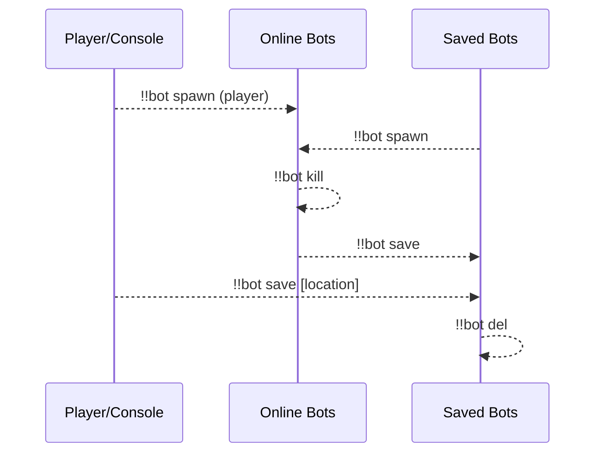
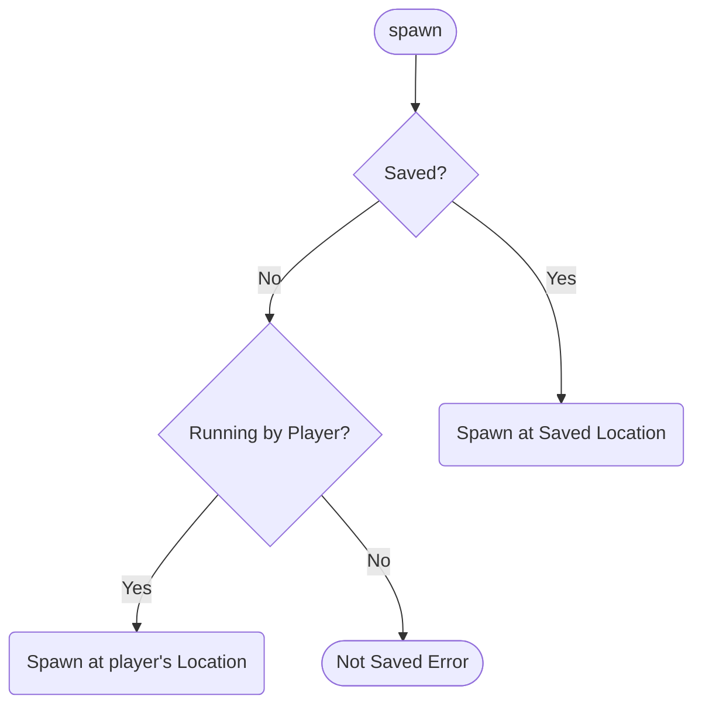
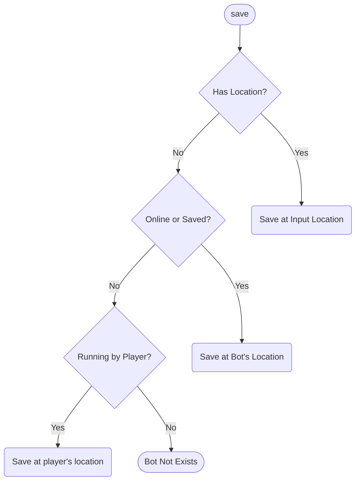
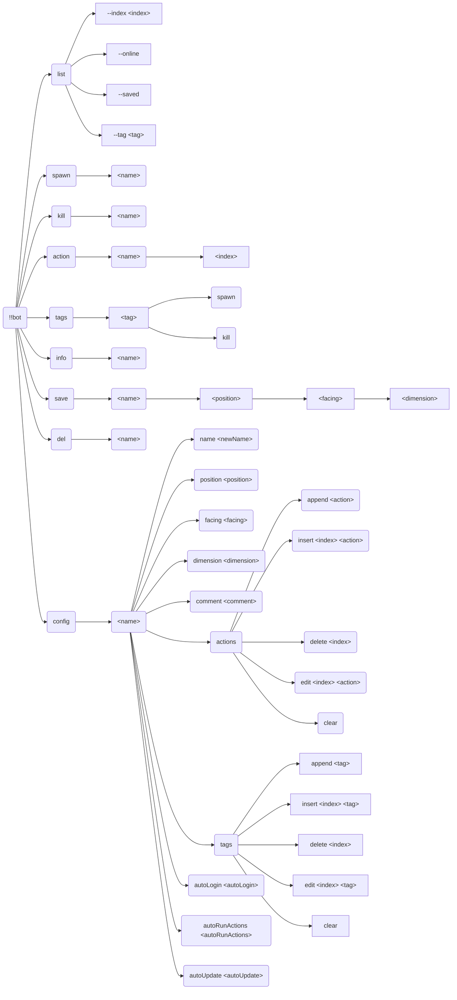
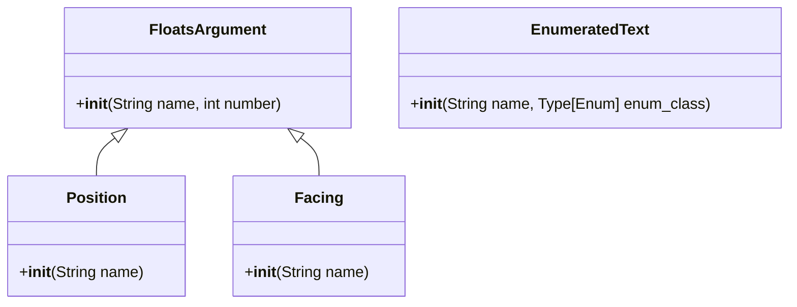

[English](full.md) | **中文**

\>\>\> [回到索引](/readme-zh_cn.md)

# 全插件信息集合

使用 `ctrl-f` 来进行页面中全文搜索，从而找到你感兴趣的东西

## advanced_calculator

### 基本信息

- 插件 ID: `advanced_calculator`
- 插件名: AdvancedCalculator
- 版本: 0.3.1
  - 元数据版本: 0.3.1
  - 发布版本: 0.3.1
- 总下载量: 2384
- 作者: [Andy Zhang](https://github.com/AnzhiZhang)
- 仓库: https://github.com/AnzhiZhang/MCDReforgedPlugins
- 仓库插件页: https://github.com/AnzhiZhang/MCDReforgedPlugins/tree/master/src/advanced_calculator
- 标签: [`工具`](/labels/tool/readme-zh_cn.md)
- 描述: 提供游戏内多种便捷计算

### 插件依赖

| 插件 ID | 依赖需求 |
| --- | --- |

### 包依赖

| Python 包 | 依赖需求 |
| --- | --- |

### 介绍

# AdvancedCalculator

> 提供游戏内多种便捷计算

## 使用

您可以使用 `=<expression>` 直接计算表达式，或使用 `==<count/expression>` 将物品数转换堆叠数。

| 指令 | 用途 | 示例 | 结果 |
| - | - | - | - |
| !!calc \<expression> | 计算表达式 | !!calc 1+1 | 1+1=2 |
| !!calc item \<count/expression> | 物品数转换堆叠数 | !!calc item 1794 | 1794个物品为1盒2组3个 |
| !!calc item \<box> \<stack> \<single> | 堆叠数转换物品数 | !!calc item 1 10 32 | 1盒10组32个为2400个物品 |
| !!calc color \<red> \<green> \<blue> | 10进制RGB转16进制 | !!calc color 255 0 255 | (255, 0, 255) -> #FF00FF |
| !!calc color \<#HEX> | 16十进制RGB转10进制 | !!calc color #00FF00 | #00FF00 -> (0, 255, 0) |

### 下载

> [!IMPORTANT]
> 使用插件之前，先阅读仓库中的 README。

| 文件 | 版本 | 上传时间 (UTC) | 大小 | 下载数 | 操作 |
| --- | --- | --- | --- | --- | --- |
| [AdvancedCalculator-v0.3.1.mcdr](https://github.com/AnzhiZhang/MCDReforgedPlugins/releases/tag/advanced_calculator-v0.3.1) | 0.3.1 | 2023/01/19 17:01:07 | 2.46KB | 1652 | [下载](https://github.com/AnzhiZhang/MCDReforgedPlugins/releases/download/advanced_calculator-v0.3.1/AdvancedCalculator-v0.3.1.mcdr) |
| [AdvancedCalculator-v0.3.0.mcdr](https://github.com/AnzhiZhang/MCDReforgedPlugins/releases/tag/advanced_calculator-v0.3.0) | 0.3.0 | 2022/10/21 20:03:33 | 2.42KB | 331 | [下载](https://github.com/AnzhiZhang/MCDReforgedPlugins/releases/download/advanced_calculator-v0.3.0/AdvancedCalculator-v0.3.0.mcdr) |
| [AdvancedCalculator-v0.2.1.mcdr](https://github.com/AnzhiZhang/MCDReforgedPlugins/releases/tag/advanced_calculator-v0.2.1) | 0.2.1 | 2022/07/21 13:20:06 | 2.38KB | 265 | [下载](https://github.com/AnzhiZhang/MCDReforgedPlugins/releases/download/advanced_calculator-v0.2.1/AdvancedCalculator-v0.2.1.mcdr) |

## advanced_whitelist_r

### 基本信息

- 插件 ID: `advanced_whitelist_r`
- 插件名: AdvancedWhitelistR
- 版本: 1.0.3
  - 元数据版本: 1.0.3
  - 发布版本: 1.0.3
- 总下载量: 847
- 作者: [noionion](https://github.com/2X-ercha), [GamerNoTitle](https://github.com/GamerNoTitle)
- 仓库: https://github.com/EMUnion/AdvancedWhitelistR
- 仓库插件页: https://github.com/EMUnion/AdvancedWhitelistR/tree/master
- 标签: [`管理`](/labels/management/readme-zh_cn.md)
- 描述: For outline-model Whitelist

### 插件依赖

| 插件 ID | 依赖需求 |
| --- | --- |
| [mcdreforged](https://github.com/Fallen-Breath/MCDReforged) | \>=2.1.0 |

### 包依赖

| Python 包 | 依赖需求 |
| --- | --- |

### 介绍

离线服务器白名单管理

### 下载

> [!IMPORTANT]
> 使用插件之前，先阅读仓库中的 README。

| 文件 | 版本 | 上传时间 (UTC) | 大小 | 下载数 | 操作 |
| --- | --- | --- | --- | --- | --- |
| [AdvancedWhitelistR-v1.0.3.mcdr](https://github.com/EMUnion/AdvancedWhitelistR/releases/tag/1.0.3) | 1.0.3 | 2023/01/04 02:59:30 | 3.73KB | 383 | [下载](https://github.com/EMUnion/AdvancedWhitelistR/releases/download/1.0.3/AdvancedWhitelistR-v1.0.3.mcdr) |
| [AdvancedWhitelistR-v1.0.2.mcdr](https://github.com/EMUnion/AdvancedWhitelistR/releases/tag/1.0.2) | 1.0.2 | 2022/01/24 15:38:16 | 3.5KB | 341 | [下载](https://github.com/EMUnion/AdvancedWhitelistR/releases/download/1.0.2/AdvancedWhitelistR-v1.0.2.mcdr) |
| [AdvancedWhitelistR-v1.0.1.mcdr](https://github.com/EMUnion/AdvancedWhitelistR/releases/tag/1.0.1) | 1.0.1 | 2022/01/24 11:46:47 | 3.5KB | 123 | [下载](https://github.com/EMUnion/AdvancedWhitelistR/releases/download/1.0.1/AdvancedWhitelistR-v1.0.1.mcdr) |

## allow_suicide

### 基本信息

- 插件 ID: `allow_suicide`
- 插件名: allow_suicide
- 版本: 1.0.0
  - 元数据版本: 1.0.0
  - 发布版本: 1.0.0
- 总下载量: 1638
- 作者: [JAs0n](https://github.com/JAs0n319)
- 仓库: https://github.com/JAs0n319/allow_suicide
- 仓库插件页: https://github.com/JAs0n319/allow_suicide/tree/master
- 标签: [`工具`](/labels/tool/readme-zh_cn.md)
- 描述: 允许玩家在没有op权限时自杀

### 插件依赖

| 插件 ID | 依赖需求 |
| --- | --- |
| [mcdreforged](https://github.com/Fallen-Breath/MCDReforged) | \>=2.1.0 |

### 包依赖

| Python 包 | 依赖需求 |
| --- | --- |

### 介绍

允许没有op权限的玩家自杀

### 下载

> [!IMPORTANT]
> 使用插件之前，先阅读仓库中的 README。

| 文件 | 版本 | 上传时间 (UTC) | 大小 | 下载数 | 操作 |
| --- | --- | --- | --- | --- | --- |
| [allow_suicide-v1.0.0.mcdr](https://github.com/JAs0n319/allow_suicide/releases/tag/allow_suicide-v1.0.0) | 1.0.0 | 2023/02/03 18:58:31 | 880B | 1638 | [下载](https://github.com/JAs0n319/allow_suicide/releases/download/allow_suicide-v1.0.0/allow_suicide-v1.0.0.mcdr) |

## auto_backup

### 基本信息

- 插件 ID: `auto_backup`
- 插件名: AutoBackup
- 版本: 0.2.0
  - 元数据版本: 0.2.0
  - 发布版本: 0.2.0
- 总下载量: 126
- 作者: [Kongtu5i](https://github.com/Kongtu5i)
- 仓库: https://github.com/Kongtu5i/AutoBackup
- 仓库插件页: https://github.com/Kongtu5i/AutoBackup/tree/main
- 标签: [`管理`](/labels/management/readme-zh_cn.md)
- 描述: 当自动备份名单中的玩家加入服务器时自动备份

### 插件依赖

| 插件 ID | 依赖需求 |
| --- | --- |
| [mcdreforged](https://github.com/Fallen-Breath/MCDReforged) | \>=2.6.0 |

### 包依赖

| Python 包 | 依赖需求 |
| --- | --- |

### 介绍

当名单中的玩家加入我的世界服务器时进行自动备份

### 下载

> [!IMPORTANT]
> 使用插件之前，先阅读仓库中的 README。

| 文件 | 版本 | 上传时间 (UTC) | 大小 | 下载数 | 操作 |
| --- | --- | --- | --- | --- | --- |
| [AutoBackup-v0.2.0.mcdr](https://github.com/Kongtu5i/AutoBackup/releases/tag/v0.2.0) | 0.2.0 | 2024/04/30 10:42:09 | 2.44KB | 126 | [下载](https://github.com/Kongtu5i/AutoBackup/releases/download/v0.2.0/AutoBackup-v0.2.0.mcdr) |

## auto_cleaner

### 基本信息

- 插件 ID: `auto_cleaner`
- 插件名: AutoCleaner
- 版本: 1.0.0
  - 元数据版本: 1.0.0
  - 发布版本: 1.0.0
- 总下载量: 150
- 作者: [xhdlphzr](https://github.com/xhdlphzr)
- 仓库: https://github.com/xhdlphzr/AutoCleaner
- 仓库插件页: https://github.com/xhdlphzr/AutoCleaner/tree/main/source
- 标签: [`工具`](/labels/tool/readme-zh_cn.md)
- 描述: 一个手自一体清理服务器掉落物和苦力怕的插件

### 插件依赖

| 插件 ID | 依赖需求 |
| --- | --- |

### 包依赖

| Python 包 | 依赖需求 |
| --- | --- |

### 介绍

# ClearPlugin插件

[English](https://github.com/xhdlphzr/AutoCleaner/tree/main/source/README.md) | **简中**

## _一个手自一体清理服务器掉落物和苦力怕的插件_

## 功能

- 使用 !!clear creeper 清理服务器苦力怕 (确保开启此功能)
- 使用 !!clear item 清理服务器掉落物 (确保开启此功能)
- 使用 !!switch creeper 开启/关闭此功能 (仅mcdreforged admin级权限及以上可使用)
- 每隔60秒自动清除掉落物

## 安装

下载本插件的[发行版](https://github.com/xhdlphzr/ClearPlugin/releases)并放入您的plugins文件夹

### 下载

> [!IMPORTANT]
> 使用插件之前，先阅读仓库中的 README。

| 文件 | 版本 | 上传时间 (UTC) | 大小 | 下载数 | 操作 |
| --- | --- | --- | --- | --- | --- |
| [AutoCleaner-v1.0.0.mcdr](https://github.com/xhdlphzr/AutoCleaner/releases/tag/v1.0.0) | 1.0.0 | 2025/10/15 13:32:10 | 437B | 150 | [下载](https://github.com/xhdlphzr/AutoCleaner/releases/download/v1.0.0/AutoCleaner-v1.0.0.mcdr) |

## auto_command

### 基本信息

- 插件 ID: `auto_command`
- 插件名: Auto Command
- 版本: 1.3.0
  - 元数据版本: 2.0.0
  - 发布版本: 1.3.0
- 总下载量: 359
- 作者: [bzyyyyyyyy](https://github.com/bzyyyyyyyy)
- 仓库: https://github.com/bzyyyyyyyy/MCDR-AutoCommand
- 仓库插件页: https://github.com/bzyyyyyyyy/MCDR-AutoCommand/tree/master
- 标签: [`工具`](/labels/tool/readme-zh_cn.md)
- 描述: 自动发送指令的插件

### 插件依赖

| 插件 ID | 依赖需求 |
| --- | --- |
| [mcdreforged](https://github.com/Fallen-Breath/MCDReforged) | \>=2.1.0 |
| [minecraft_data_api](/plugins/minecraft_data_api/readme-zh_cn.md) | * |

### 包依赖

| Python 包 | 依赖需求 |
| --- | --- |
| [mcdreforged](https://pypi.org/project/mcdreforged) | \>=2.1.0 |

```
pip install "mcdreforged>=2.1.0"
```

### 介绍

编辑/发送指令堆&自动发送指令
### 下载

> [!IMPORTANT]
> 使用插件之前，先阅读仓库中的 README。

| 文件 | 版本 | 上传时间 (UTC) | 大小 | 下载数 | 操作 |
| --- | --- | --- | --- | --- | --- |
| [AutoCommand-v1.3.0.mcdr](https://github.com/bzyyyyyyyy/MCDR-AutoCommand/releases/tag/v1.3.0) | 1.3.0 | 2023/06/15 17:14:11 | 22.25KB | 310 | [下载](https://github.com/bzyyyyyyyy/MCDR-AutoCommand/releases/download/v1.3.0/AutoCommand-v1.3.0.mcdr) |
| [AutoCommand-v1.0.0.mcdr](https://github.com/bzyyyyyyyy/MCDR-AutoCommand/releases/tag/v1.0.0) | 1.0.0 | 2023/06/08 06:30:33 | 21.45KB | 49 | [下载](https://github.com/bzyyyyyyyy/MCDR-AutoCommand/releases/download/v1.0.0/AutoCommand-v1.0.0.mcdr) |

## auto_execute

### 基本信息

- 插件 ID: `auto_execute`
- 插件名: Auto-Execute
- 版本: 1.1.0
  - 元数据版本: 1.1.0
  - 发布版本: 1.1.0
- 总下载量: 145
- 作者: [FRUITS-CANDY](https://github.com/FRUITS-CANDY)
- 仓库: https://github.com/Passion-Never-Dissipate/Auto-Execute
- 仓库插件页: https://github.com/Passion-Never-Dissipate/Auto-Execute/tree/master
- 标签: [`工具`](/labels/tool/readme-zh_cn.md)
- 描述: 一个以脚本为单位存储各类指令多模式执行的MCDR插件

### 插件依赖

| 插件 ID | 依赖需求 |
| --- | --- |
| [mcdreforged](https://github.com/Fallen-Breath/MCDReforged) | \>=2.6.0 |

### 包依赖

| Python 包 | 依赖需求 |
| --- | --- |
| [mcdreforged](https://pypi.org/project/mcdreforged) | \>=2.6.0 |

```
pip install "mcdreforged>=2.6.0"
```

### 介绍

一个以脚本为单位存储各类指令多模式执行的MCDR插件

### 下载

> [!IMPORTANT]
> 使用插件之前，先阅读仓库中的 README。

| 文件 | 版本 | 上传时间 (UTC) | 大小 | 下载数 | 操作 |
| --- | --- | --- | --- | --- | --- |
| [Auto-Execute-v1.1.0.mcdr](https://github.com/Passion-Never-Dissipate/Auto-Execute/releases/tag/v1.1) | 1.1.0 | 2025/01/21 11:46:47 | 20.46KB | 93 | [下载](https://github.com/Passion-Never-Dissipate/Auto-Execute/releases/download/v1.1/Auto-Execute-v1.1.0.mcdr) |
| [Auto-Execute-v1.0.0.mcdr](https://github.com/Passion-Never-Dissipate/Auto-Execute/releases/tag/v1.0) | 1.0.0 | 2024/03/26 14:34:10 | 20.4KB | 52 | [下载](https://github.com/Passion-Never-Dissipate/Auto-Execute/releases/download/v1.0/Auto-Execute-v1.0.0.mcdr) |

## auto_msg_title

### 基本信息

- 插件 ID: `auto_msg_title`
- 插件名: AutoMsgTitle
- 版本: 0.2.0
  - 元数据版本: 0.2.0
  - 发布版本: 0.2.0
- 总下载量: 507
- 作者: [zhongbai233](https://github.com/zhongbai2333)
- 仓库: https://github.com/zhongbai2333/AutoMsgTitle
- 仓库插件页: https://github.com/zhongbai2333/AutoMsgTitle/tree/master
- 标签: [`信息`](/labels/information/readme-zh_cn.md)
- 描述: 在游戏某些区域自动弹出消息。

### 插件依赖

| 插件 ID | 依赖需求 |
| --- | --- |
| [zhongbais_data_api](/plugins/zhongbais_data_api/readme-zh_cn.md) | * |

### 包依赖

| Python 包 | 依赖需求 |
| --- | --- |
| [mcdreforged](https://pypi.org/project/mcdreforged) | \>=2.12.0 |

```
pip install "mcdreforged>=2.12.0"
```

### 介绍

此插件可以为玩家自动弹出标题或消息，如同插件服进入主城后的标题

同时此插件可为一块区域提供自动的说明，如服务器被参观时，参观者进入某区域、机器之后自动弹出此区域、机器的制造者、名字、功能之类的；在玩家进入某一机器时自动为玩家弹出机器说明书……

### 下载

> [!IMPORTANT]
> 使用插件之前，先阅读仓库中的 README。

| 文件 | 版本 | 上传时间 (UTC) | 大小 | 下载数 | 操作 |
| --- | --- | --- | --- | --- | --- |
| [AutoMsgTitle-v0.2.0.mcdr](https://github.com/zhongbai2333/AutoMsgTitle/releases/tag/v0.2.0) | 0.2.0 | 2025/08/22 16:08:03 | 13.4KB | 82 | [下载](https://github.com/zhongbai2333/AutoMsgTitle/releases/download/v0.2.0/AutoMsgTitle-v0.2.0.mcdr) |
| [AutoMsgTitle-v0.1.4.mcdr](https://github.com/zhongbai2333/AutoMsgTitle/releases/tag/v0.1.4) | 0.1.4 | 2025/02/05 15:26:52 | 8.58KB | 99 | [下载](https://github.com/zhongbai2333/AutoMsgTitle/releases/download/v0.1.4/AutoMsgTitle-v0.1.4.mcdr) |
| [AutoMsgTitle-v0.1.3.mcdr](https://github.com/zhongbai2333/AutoMsgTitle/releases/tag/v0.1.3) | 0.1.3 | 2024/09/20 13:03:35 | 8.2KB | 79 | [下载](https://github.com/zhongbai2333/AutoMsgTitle/releases/download/v0.1.3/AutoMsgTitle-v0.1.3.mcdr) |

## auto_plugin_reloader

### 基本信息

- 插件 ID: `auto_plugin_reloader`
- 插件名: Auto Plugin Reloader
- 版本: 2.0.1
  - 元数据版本: 2.0.1
  - 发布版本: 2.0.1
- 总下载量: 7578
- 作者: [Fallen_Breath](https://github.com/Fallen-Breath)
- 仓库: https://github.com/TISUnion/AutoPluginReloader
- 仓库插件页: https://github.com/TISUnion/AutoPluginReloader/tree/master
- 标签: [`管理`](/labels/management/readme-zh_cn.md)
- 描述: 在文件变更时自动重载插件

### 插件依赖

| 插件 ID | 依赖需求 |
| --- | --- |
| [mcdreforged](https://github.com/Fallen-Breath/MCDReforged) | \>=2.13.0 |

### 包依赖

| Python 包 | 依赖需求 |
| --- | --- |
| [mcdreforged](https://pypi.org/project/mcdreforged) |  |

```
pip install mcdreforged
```

### 介绍

它是一个可以自动检测 MCDR 插件文件夹中发生的变更并触发插件重载的插件

它是厌倦了插件文件更新后需要手动执行插件重载的懒人的救星！

### 下载

> [!IMPORTANT]
> 使用插件之前，先阅读仓库中的 README。

| 文件 | 版本 | 上传时间 (UTC) | 大小 | 下载数 | 操作 |
| --- | --- | --- | --- | --- | --- |
| [AutoPluginReloader-v2.0.1.mcdr](https://github.com/TISUnion/AutoPluginReloader/releases/tag/v2.0.1) | 2.0.1 | 2025/08/22 15:46:04 | 18.7KB | 377 | [下载](https://github.com/TISUnion/AutoPluginReloader/releases/download/v2.0.1/AutoPluginReloader-v2.0.1.mcdr) |
| [AutoPluginReloader-v2.0.0.mcdr](https://github.com/TISUnion/AutoPluginReloader/releases/tag/v2.0.0) | 2.0.0 | 2024/06/30 05:12:37 | 18.57KB | 923 | [下载](https://github.com/TISUnion/AutoPluginReloader/releases/download/v2.0.0/AutoPluginReloader-v2.0.0.mcdr) |
| [AutoPluginReloader-v1.1.3.mcdr](https://github.com/TISUnion/AutoPluginReloader/releases/tag/v1.1.3) | 1.1.3 | 2021/10/01 18:23:47 | 17.58KB | 2283 | [下载](https://github.com/TISUnion/AutoPluginReloader/releases/download/v1.1.3/AutoPluginReloader-v1.1.3.mcdr) |

## battery_saver

### 基本信息

- 插件 ID: `battery_saver`
- 插件名: BatterySaver
- 版本: 0.1.2
  - 元数据版本: 0.1.2
  - 发布版本: 0.1.2
- 总下载量: 204
- 作者: [Mooling0602](https://github.com/Mooling0602)
- 仓库: https://github.com/Mooling0602/BatterySaver-MCDR
- 仓库插件页: https://github.com/Mooling0602/BatterySaver-MCDR/tree/main
- 标签: [`工具`](/labels/tool/readme-zh_cn.md), [`信息`](/labels/information/readme-zh_cn.md)
- 描述: 检查主机的电量并在其低位时自动关闭服务器。

### 插件依赖

| 插件 ID | 依赖需求 |
| --- | --- |
| [mcdreforged](https://github.com/Fallen-Breath/MCDReforged) | \>=2.1.0 |
| [mutils](/plugins/mutils/readme-zh_cn.md) | ==0.0.4 |

### 包依赖

| Python 包 | 依赖需求 |
| --- | --- |
| [psutil](https://pypi.org/project/psutil) |  |

```
pip install psutil
```

### 介绍

检查主机的电量并在其低位时自动关闭服务器。

### 下载

> [!IMPORTANT]
> 使用插件之前，先阅读仓库中的 README。

| 文件 | 版本 | 上传时间 (UTC) | 大小 | 下载数 | 操作 |
| --- | --- | --- | --- | --- | --- |
| [BatterySaver-v0.1.2.mcdr](https://github.com/Mooling0602/BatterySaver-MCDR/releases/tag/0.1.2) | 0.1.2 | 2025/10/19 05:42:43 | 6.1KB | 16 | [下载](https://github.com/Mooling0602/BatterySaver-MCDR/releases/download/0.1.2/BatterySaver-v0.1.2.mcdr) |
| [BatterySaver-v0.1.1.mcdr](https://github.com/Mooling0602/BatterySaver-MCDR/releases/tag/0.1.1) | 0.1.1 | 2025/05/19 03:15:56 | 6.08KB | 47 | [下载](https://github.com/Mooling0602/BatterySaver-MCDR/releases/download/0.1.1/BatterySaver-v0.1.1.mcdr) |
| [BatterySaver-v0.1.0.mcdr](https://github.com/Mooling0602/BatterySaver-MCDR/releases/tag/0.1.0) | 0.1.0 | 2025/03/08 13:35:46 | 5.84KB | 44 | [下载](https://github.com/Mooling0602/BatterySaver-MCDR/releases/download/0.1.0/BatterySaver-v0.1.0.mcdr) |

## bedrock_liteloader_handler

### 基本信息

- 插件 ID: `bedrock_liteloader_handler`
- 插件名: BedrockLiteloaderHandler
- 版本: 1.2.1
  - 元数据版本: 1.2.1
  - 发布版本: 1.2.1
- 总下载量: 281
- 作者: [Elec glacier](https://github.com/Elec-Glacier), [jiangyan](https://github.com/jiangyan03)
- 仓库: https://github.com/Elec-Glacier/liteloader_handler
- 仓库插件页: https://github.com/Elec-Glacier/liteloader_handler/tree/main
- 标签: [`服务端处理器`](/labels/handler/readme-zh_cn.md)
- 描述: 一个让基岩版也能使用MCDR的处理器

### 插件依赖

| 插件 ID | 依赖需求 |
| --- | --- |

### 包依赖

| Python 包 | 依赖需求 |
| --- | --- |
| [mcdreforged](https://pypi.org/project/mcdreforged) | \>=2.13.2 |

```
pip install "mcdreforged>=2.13.2"
```

### 介绍

[English](https://github.com/Elec-Glacier/liteloader_handler/blob/main/README.md) | **中文**

# Bedrock Liteloader Handler
一个让基岩版也能使用MCDR及其插件的服务端处理器

## 使用之前
原版的BDS是不能输出玩家聊天的。所以你可以使用行为包或者是更改服务端来实现玩家聊天输出

## 使用说明
1. 从仓库[releases](https://github.com/Elec-Glacier/liteloader_handler/releases)中现在最新版本
2. 将下载的文件放入到MCDR的"plugins"文件夹里
3. 启动MCDR
4. 更改config文件夹中的配置文件，选择处理器（默认是原版处理器）
5. 重载配置文件

## 注意
LeviLamina的1.0.0版本后，MCDR无法获取更改过的服务端输出。你可以使用一个支持pty的应用作为桥梁。[更多细节](https://github.com/Elec-Glacier/liteloader_handler/issues/13)
1.2.0版本后，对PrimeBackup做了专门的适配。你可以在config里关掉。

## MCDR插件安装注意
由于基岩版和Java版判若两个游戏，所以在使用其他插件之前，确保知道其是如何工作的并保证能正常运行。

## 注意事项
由于[BDS-3791](https://bugs.mojang.com/browse/BDS-3791)，你可能需要插件修改服务端进行修复，如[UnicodeFixer](https://www.minebbs.com/resources/unicodefixer.6991/)。

### 下载

> [!IMPORTANT]
> 使用插件之前，先阅读仓库中的 README。

| 文件 | 版本 | 上传时间 (UTC) | 大小 | 下载数 | 操作 |
| --- | --- | --- | --- | --- | --- |
| [BedrockLiteloaderHandler-v1.2.1.mcdr](https://github.com/Elec-Glacier/liteloader_handler/releases/tag/1.2.1) | 1.2.1 | 2025/03/14 17:56:17 | 6.04KB | 99 | [下载](https://github.com/Elec-Glacier/liteloader_handler/releases/download/1.2.1/BedrockLiteloaderHandler-v1.2.1.mcdr) |
| [BedrockLiteloaderHandler-v1.2.0.mcdr](https://github.com/Elec-Glacier/liteloader_handler/releases/tag/1.2.0) | 1.2.0 | 2025/01/31 13:07:18 | 6.0KB | 41 | [下载](https://github.com/Elec-Glacier/liteloader_handler/releases/download/1.2.0/BedrockLiteloaderHandler-v1.2.0.mcdr) |
| [BedrockLiteloaderHandler-v1.1.2.mcdr](https://github.com/Elec-Glacier/liteloader_handler/releases/tag/1.1.2) | 1.1.2 | 2025/01/05 05:21:18 | 5.69KB | 48 | [下载](https://github.com/Elec-Glacier/liteloader_handler/releases/download/1.1.2/BedrockLiteloaderHandler-v1.1.2.mcdr) |

## beep

### 基本信息

- 插件 ID: `beep`
- 插件名: Beep
- 版本: 1.1.0
  - 元数据版本: 1.1.0
  - 发布版本: 1.1.0
- 总下载量: 7103
- 作者: [Fallen_Breath](https://github.com/Fallen-Breath), [LucunJi](https://github.com/LucunJi)
- 仓库: https://github.com/TISUnion/Beep
- 仓库插件页: https://github.com/TISUnion/Beep/tree/master
- 标签: [`工具`](/labels/tool/readme-zh_cn.md)
- 描述: @某人，@ all可作用于所有玩家。使用两个@@小心被打

### 插件依赖

| 插件 ID | 依赖需求 |
| --- | --- |
| [mcdreforged](https://github.com/Fallen-Breath/MCDReforged) | \>=2.1.0 |

### 包依赖

| Python 包 | 依赖需求 |
| --- | --- |

### 介绍

# Beep

Beeps when someone is mentioned in text with an `@`

Leave a space before and after name when you use a @, for example `@ Lucun_Ji Hello!`

`@ all ` represents all players in game

Use two `@` for more powerful ping

### 下载

> [!IMPORTANT]
> 使用插件之前，先阅读仓库中的 README。

| 文件 | 版本 | 上传时间 (UTC) | 大小 | 下载数 | 操作 |
| --- | --- | --- | --- | --- | --- |
| [Beep-v1.1.0.mcdr](https://github.com/TISUnion/Beep/releases/tag/v1.1.0) | 1.1.0 | 2021/08/26 14:01:49 | 1.74KB | 5646 | [下载](https://github.com/TISUnion/Beep/releases/download/v1.1.0/Beep-v1.1.0.mcdr) |
| [Beep-v1.0.0.mcdr](https://github.com/TISUnion/Beep/releases/tag/v1.0.0) | 1.0.0 | 2021/08/21 15:35:36 | 1.67KB | 1457 | [下载](https://github.com/TISUnion/Beep/releases/download/v1.0.0/Beep-v1.0.0.mcdr) |

## better_backup

### 基本信息

- 插件 ID: `better_backup`
- 插件名: Better Backup
- 版本: 2.1.6
  - 元数据版本: 2.1.7
  - 发布版本: 2.1.6
- 总下载量: 456
- 作者: [z0z0r4](https://github.com/z0z0r4)
- 仓库: https://github.com/z0z0r4/better_backup
- 仓库插件页: https://github.com/z0z0r4/better_backup/tree/master
- 标签: [`管理`](/labels/management/readme-zh_cn.md)
- 描述: 支持文件去重的高效备份/回档插件

### 插件依赖

| 插件 ID | 依赖需求 |
| --- | --- |

### 包依赖

| Python 包 | 依赖需求 |
| --- | --- |
| [mcdreforged](https://pypi.org/project/mcdreforged) | \>=2.1.2 |
| [pydal](https://pypi.org/project/pydal) | ~=20230521.1 |
| [pyzstd](https://pypi.org/project/pyzstd) | ~=0.15.9 |
| [xxhash](https://pypi.org/project/xxhash) | ~=3.4.1 |

```
pip install "mcdreforged>=2.1.2" pydal~=20230521.1 pyzstd~=0.15.9 xxhash~=3.4.1
```

### 介绍

⚠️ **已停止维护**：建议用 PrimeBackup 替代

支持文件去重的高效备份/回档插件

一些特性：

- 带注释的备份
- 所有文件只留一份不重复，节省硬盘空间
- 备份大小显示，信息清晰
- 理论上无限制的备份点，只取决于存档改动
### 下载

> [!IMPORTANT]
> 使用插件之前，先阅读仓库中的 README。

| 文件 | 版本 | 上传时间 (UTC) | 大小 | 下载数 | 操作 |
| --- | --- | --- | --- | --- | --- |
| [Better_Backup-v2.1.6.mcdr](https://github.com/z0z0r4/better_backup/releases/tag/v2.1.6) | 2.1.6 | 2023/08/30 12:35:29 | 17.57KB | 456 | [下载](https://github.com/z0z0r4/better_backup/releases/download/v2.1.6/Better_Backup-v2.1.6.mcdr) |

## bili_live_helper

### 基本信息

- 插件 ID: `bili_live_helper`
- 插件名: BiliLiveHelper
- 版本: 1.3.3
  - 元数据版本: 1.3.3
  - 发布版本: 1.3.3
- 总下载量: 404
- 作者: [Aimerny](https://github.com/Aimerny)
- 仓库: https://github.com/Aimerny/MCDRPlugins
- 仓库插件页: https://github.com/Aimerny/MCDRPlugins/tree/main/src/bili_live_helper
- 标签: [`信息`](/labels/information/readme-zh_cn.md)
- 描述: 一个基于MCDR的b站直播助手

### 插件依赖

| 插件 ID | 依赖需求 |
| --- | --- |
| [mcdreforged](https://github.com/Fallen-Breath/MCDReforged) | \>=2.12.0 |

### 包依赖

| Python 包 | 依赖需求 |
| --- | --- |
| [mcdreforged](https://pypi.org/project/mcdreforged) | \>=2.13.0 |
| [bilibili-api-python](https://pypi.org/project/bilibili-api-python) | \>=16.3.0 |

```
pip install "mcdreforged>=2.13.0" "bilibili-api-python>=16.3.0"
```

### 介绍

# BiliLiveHelper | B站直播助手-弹幕姬

---

支持将b站直播间的弹幕同步到mc中

> [!important]
> 此插件仅用于学习交流,请勿用于违法犯罪或其他不良用途.

# :sparkles: 功能

**BiliLiveHelper**是一款~~功能丰富的~~MCDR插件,能够实现将[bilibili](https://bilibili.com)(以下简称"B站)
直播间中的弹幕信息实时同步到MC聊天板中.

- [x] 全异步拉取B站弹幕
- [x] 支持多个玩家订阅各自的直播间,弹幕消息单独发送,互不干扰
- [x] 玩家可以随时启停弹幕姬
- [ ] 支持查询订阅的直播间的状态
- [ ] admin轻松管理所有玩家的订阅信息
- [x] 游戏内通过直播姬账号发送弹幕,即时回应

# :robot: 指令
```
 ---------- BiliLiveHelper ----------
 >> !!blh [help] - | - 获取帮助
 >> !!blh bind <rid> - | - 绑定直播间id
 >> !!blh on - | - 启动直播弹幕姬
 >> !!blh off - | - 停止直播弹幕姬
 >> !!blh info - | - 查看我的直播间信息
 >> !!blh query - | - 查看其他玩家的直播间信息
 >> !!blh send <danmu> - | - 向直播间发送弹幕
 >> !!blh s <danmu> - | - 向直播间发送弹幕
 ------- Authored by Aimerny --------

```

# :pushpin: 依赖

| python依赖项           | 版本      |
| ------------------- | ------- |
| mcdreforged         | ^2.12.0 |
| bilibili-python-api | ^16.3.0 |

| mcdr依赖项     | 版本      |
| ----------- | ------- |
| mcdreforged | ^2.13.0 |

# :wrench: 配置
```json5
{
    "enable": true,
    "data_file_path": "data.json",
    "console_output": true,
    "account": {
        "uid": 3546688564234249,
        "sessdata": "",
        "bili_jct": "",
        "buvid3": "",
        "ac_time_value": ""
    },
   "send":true
}
```
## 配置说明

1. `data_file_path`: 数据文件的路径.持久化的信息会保存到这个文件
2. `console_output`: 是否将接收到的弹幕输出到服务器控制台,如果设为false则需要在debug模式才能看到
3. `account`: 使用此插件需要一个真实的B站账号.`account`中是一些鉴权信息
   1. `uid`: 你的B站账号UID
   2. 其他: 参考 [获取 Credential 类所需信息](https://nemo2011.github.io/bilibili-api/#/get-credential)
4. `send`: 是否允许服务器成员使用上述配置中的`account`发送消息到对应直播间,默认为true

> [!note]
> B站的账号如果没有在其他地方登录基本不会过期,建议开一个小号做这件事情

# :art: 功能预览

## 消息同步


## MC发送弹幕


### 下载

> [!IMPORTANT]
> 使用插件之前，先阅读仓库中的 README。

| 文件 | 版本 | 上传时间 (UTC) | 大小 | 下载数 | 操作 |
| --- | --- | --- | --- | --- | --- |
| [BiliLiveHelper-v1.3.3.mcdr](https://github.com/Aimerny/MCDRPlugins/releases/tag/bili_live_helper-v1.3.3) | 1.3.3 | 2025/02/06 07:06:36 | 12.74KB | 125 | [下载](https://github.com/Aimerny/MCDRPlugins/releases/download/bili_live_helper-v1.3.3/BiliLiveHelper-v1.3.3.mcdr) |
| [BiliLiveHelper-v1.3.1.mcdr](https://github.com/Aimerny/MCDRPlugins/releases/tag/bili_live_helper-v1.3.1) | 1.3.1 | 2024/09/25 11:48:30 | 12.73KB | 90 | [下载](https://github.com/Aimerny/MCDRPlugins/releases/download/bili_live_helper-v1.3.1/BiliLiveHelper-v1.3.1.mcdr) |
| [BiliLiveHelper-v1.3.0.mcdr](https://github.com/Aimerny/MCDRPlugins/releases/tag/bili_live_helper-v1.3.0) | 1.3.0 | 2024/09/23 18:24:29 | 12.8KB | 37 | [下载](https://github.com/Aimerny/MCDRPlugins/releases/download/bili_live_helper-v1.3.0/BiliLiveHelper-v1.3.0.mcdr) |

## bingo

### 基本信息

- 插件 ID: `bingo`
- 插件名: Bingo
- 版本: 0.0.3
  - 元数据版本: 0.0.3
  - 发布版本: 0.0.3
- 总下载量: 158
- 作者: [Andy Zhang](https://github.com/AnzhiZhang)
- 仓库: https://github.com/AnzhiZhang/MCDReforgedPlugins
- 仓库插件页: https://github.com/AnzhiZhang/MCDReforgedPlugins/tree/master/src/bingo
- 标签: [`工具`](/labels/tool/readme-zh_cn.md)
- 描述: Bingo 游戏实用工具

### 插件依赖

| 插件 ID | 依赖需求 |
| --- | --- |

### 包依赖

| Python 包 | 依赖需求 |
| --- | --- |

### 介绍

# Bingo

> [Bingo](https://www.flytre.net/bingo) 游戏实用工具

## 使用

| 指令 | 用途 |
| - | - |
| !!bingo team \<num> | 随机分组 |
| !!bingo end | 结束游戏 |

### 下载

> [!IMPORTANT]
> 使用插件之前，先阅读仓库中的 README。

| 文件 | 版本 | 上传时间 (UTC) | 大小 | 下载数 | 操作 |
| --- | --- | --- | --- | --- | --- |
| [Bingo-v0.0.3.mcdr](https://github.com/AnzhiZhang/MCDReforgedPlugins/releases/tag/bingo-v0.0.3) | 0.0.3 | 2023/02/26 00:14:39 | 1.3KB | 158 | [下载](https://github.com/AnzhiZhang/MCDReforgedPlugins/releases/download/bingo-v0.0.3/Bingo-v0.0.3.mcdr) |

## bkchat_manager

### 基本信息

- 插件 ID: `bkchat_manager`
- 插件名: BukkitChatManager
- 版本: 0.3.0
  - 元数据版本: 0.3.0
  - 发布版本: 0.3.0
- 总下载量: 274
- 作者: [Mooling0602](https://github.com/Mooling0602)
- 仓库: https://github.com/Mooling0602/BukkitChatManager-MCDR
- 仓库插件页: https://github.com/Mooling0602/BukkitChatManager-MCDR/tree/main
- 标签: [`信息`](/labels/information/readme-zh_cn.md), [`管理`](/labels/management/readme-zh_cn.md)
- 描述: 接管BukkitAPI服务端的游戏内聊天。

### 插件依赖

| 插件 ID | 依赖需求 |
| --- | --- |
| [mcdreforged](https://github.com/Fallen-Breath/MCDReforged) | \>=2.1.0 |

### 包依赖

| Python 包 | 依赖需求 |
| --- | --- |
| [strip_ansi](https://pypi.org/project/strip_ansi) |  |

```
pip install strip_ansi
```

### 介绍

# BukkitChatManager-MCDR
在MCDR接管BukkitAPI服务端的游戏内聊天。

## 依赖
- BukkitAPI 插件：[PlayerLog](https://github.com/Mooling0602/BukkitChatManager-MCDR/blob/main/extra/PlayerLog-1.1.jar)
> 已附加到MCDR插件中，MCDR启动或重载此插件时会自动更新或加载，你可能需要重启服务器以使其生效！

## 用法
从Release中安装此MCDR插件，如果出现问题，请确认依赖是否已经正常加载，有报错请反馈到Issues！

## 配置
配置文件位于`config/bkchat_manager/config.json`，你可以在里面修改聊天消息的格式等。

其中，`%player%`表示玩家名；`%message%`表示聊天消息内容或玩家执行的指令内容；`%src_prefix%`表示指令源。

## 注意事项
和类似的BukkitAPI插件冲突，请不要使用这些同类型的插件。

另外，如果有和依赖中作用相同的替代品插件，此MCDR插件可无缝迁移到其他类型的服务端上；Mohist等支持BukkitAPI的混合端也可以使用。

插件有内置专门的服务端处理器，强烈建议启用，同时启用后无法使用其他的服务端处理器，否则会冲突。

## 更新内容
### 历史日志
- `v0.2.1` 对内置的Bukkit插件依赖进行了更新，添加了客户端聊天拦截的动态控制功能，非生产环境下可以使用/chatmsg on|off进行调试，生产环境下请禁止普通玩家的playerlog.chatmsg权限（将于后续优化）！
- `v0.3.0` 更新了兼容模式（compatibility_mode），你可以通过安装此插件并启用聊天兼容模式的方式，使MCDR本身和MCDR的大部分按规范开发的插件，可以兼容各种会修改聊天内容并影响服务端聊天相关日志输出的Bukkit服务端插件如VentureChat等！

### 计划中

经过测试的服务端：Mohist、Paper、Leaves
> 极低版本的服务端尚未测试，理论上支持1.12及以上的所有Bukkit服务端。

### 下载

> [!IMPORTANT]
> 使用插件之前，先阅读仓库中的 README。

| 文件 | 版本 | 上传时间 (UTC) | 大小 | 下载数 | 操作 |
| --- | --- | --- | --- | --- | --- |
| [BukkitChatManager-v0.3.0.mcdr](https://github.com/Mooling0602/BukkitChatManager-MCDR/releases/tag/0.3.0) | 0.3.0 | 2025/02/06 13:41:06 | 21.15KB | 89 | [下载](https://github.com/Mooling0602/BukkitChatManager-MCDR/releases/download/0.3.0/BukkitChatManager-v0.3.0.mcdr) |
| [BukkitChatManager-v0.2.1.mcdr](https://github.com/Mooling0602/BukkitChatManager-MCDR/releases/tag/0.2.1) | 0.2.1 | 2025/02/05 14:17:30 | 8.38KB | 36 | [下载](https://github.com/Mooling0602/BukkitChatManager-MCDR/releases/download/0.2.1/BukkitChatManager-v0.2.1.mcdr) |
| [BukkitChatManager-v0.2.0.mcdr](https://github.com/Mooling0602/BukkitChatManager-MCDR/releases/tag/0.2.0) | 0.2.0 | 2024/11/22 12:06:32 | 18.83KB | 45 | [下载](https://github.com/Mooling0602/BukkitChatManager-MCDR/releases/download/0.2.0/BukkitChatManager-v0.2.0.mcdr) |

## bot

### 基本信息

- 插件 ID: `bot`
- 插件名: Bot
- 版本: 1.3.1
  - 元数据版本: 1.3.1
  - 发布版本: 1.3.1
- 总下载量: 7295
- 作者: [Andy Zhang](https://github.com/AnzhiZhang)
- 仓库: https://github.com/AnzhiZhang/MCDReforgedPlugins
- 仓库插件页: https://github.com/AnzhiZhang/MCDReforgedPlugins/tree/master/src/bot
- 标签: [`工具`](/labels/tool/readme-zh_cn.md), [`管理`](/labels/management/readme-zh_cn.md)
- 描述: 最好用的地毯模组假人管理器！

### 插件依赖

| 插件 ID | 依赖需求 |
| --- | --- |
| [mcdreforged](https://github.com/Fallen-Breath/MCDReforged) | ^2.6.0 |
| [minecraft_data_api](/plugins/minecraft_data_api/readme-zh_cn.md) | ^1.4.1 |
| [more_command_nodes](/plugins/more_command_nodes/readme-zh_cn.md) | ^1.1.0 |

### 包依赖

| Python 包 | 依赖需求 |
| --- | --- |

### 介绍

# Bot

[English](https://github.com/AnzhiZhang/MCDReforgedPlugins/tree/master/src/bot/readme.md)

> 最好用的地毯模组假人管理器！

## 依赖

- [MinecraftDataAPI](https://github.com/MCDReforged/MinecraftDataAPI)
- [MoreCommandNodes](https://github.com/AnzhiZhang/MCDReforgedPlugins/tree/master/src/bot/../more_command_nodes)

## 使用方法

`!!bot` 查看帮助

`!!bot list [--index <index>] [filters]` 显示假人列表

`!!bot spawn <name>` 上线假人

`!!bot kill <name>` 下线假人

`!!bot action <name> [index]` 执行假人动作

`!!bot tags` 查看可用标签

`!!bot tags <tag> spawn/kill` 上线/下线带有标签的假人

`!!bot info <name>` 查看假人信息

`!!bot save <name> [position] [facing] [dimension]` 保存假人

`!!bot del <name>` 删除保存的假人

`!!bot config <name> <option> <value>` 配置假人

### 工作流



### list

**--index \<index\>**：页码，例如 `--index 1`，默认为 0

**--online**：显示在线假人

**--saved**：显示保存的假人

**--tag \<tag\>**：按标签过滤

### spawn

上线假人



### kill

下线假人

### action

执行假人动作

当指定 `index` 时，执行特定动作而不是全部动作

### tags

查看可用标签和上线/下线带有标签的假人

`!!bot tags` 查看可用标签

`!!bot tags <tag> spawn` 上线带有标签的假人

`!!bot tags <tag> kill` 下线带有标签的假人

### info

查看假人信息

### save

保存假人



### del

删除保存的假人

删除后会备份假人到数据目录中的 `botBin.json` 文件。如果发生误删，可以用于手动恢复。

### config

配置假人

### 完整指令树



## 配置

### gamemode

默认值: `survival`

生成假人的游戏模式

### force_gamemode

默认值: `false`

是否强制所有假人使用 `gamemode` 配置的游戏模式，如果为 `false`，只有已保存的假人会使用 `gamemode` 配置的游戏模式。

### name_prefix

默认值: `bot_`

假人名称前缀

### name_suffix

默认值: 无

假人名称后缀

### post_join_delay

默认值: `0`

假人上线后延迟处理的时间（秒），如果您使用非原版服务端，可能需要调整该值。

### permissions

使用对应指令的最低权限

## FastAPI MCDR

该插件支持 [FastAPI MCDR](https://github.com/AnzhiZhang/MCDReforgedPlugins/tree/master/src/bot/../fastapi_mcdr) 插件（>=2.0.0），当安装 FastAPI MCDR 插件后，该插件会自动注册端点，您可以通过 FastAPI 查看接口定义。

Python 包要求：

```text
pydantic>=2.0
```

您可以利用该功能实现外部控制，例如一个管理假人的网页：


### 下载

> [!IMPORTANT]
> 使用插件之前，先阅读仓库中的 README。

| 文件 | 版本 | 上传时间 (UTC) | 大小 | 下载数 | 操作 |
| --- | --- | --- | --- | --- | --- |
| [Bot-v1.3.1.mcdr](https://github.com/AnzhiZhang/MCDReforgedPlugins/releases/tag/bot-v1.3.1) | 1.3.1 | 2025/02/07 13:37:20 | 18.03KB | 1586 | [下载](https://github.com/AnzhiZhang/MCDReforgedPlugins/releases/download/bot-v1.3.1/Bot-v1.3.1.mcdr) |
| [Bot-v1.3.0.mcdr](https://github.com/AnzhiZhang/MCDReforgedPlugins/releases/tag/bot-v1.3.0) | 1.3.0 | 2024/12/20 22:08:12 | 18.03KB | 384 | [下载](https://github.com/AnzhiZhang/MCDReforgedPlugins/releases/download/bot-v1.3.0/Bot-v1.3.0.mcdr) |
| [Bot-v1.2.4.mcdr](https://github.com/AnzhiZhang/MCDReforgedPlugins/releases/tag/bot-v1.2.4) | 1.2.4 | 2024/09/15 01:24:41 | 17.87KB | 477 | [下载](https://github.com/AnzhiZhang/MCDReforgedPlugins/releases/download/bot-v1.2.4/Bot-v1.2.4.mcdr) |

## bot_kikai

### 基本信息

- 插件 ID: `bot_kikai`
- 插件名: BotKikai
- 版本: 0.5.0
  - 元数据版本: 0.5.0
  - 发布版本: 0.5.0
- 总下载量: 418
- 作者: [Jerry_FaGe](https://github.com/Jerry-FaGe), [RayanceKing](https://github.com/RayanceKing)
- 仓库: https://github.com/Jerry-FaGe/MCDR-BotKikai
- 仓库插件页: https://github.com/Jerry-FaGe/MCDR-BotKikai/tree/master
- 标签: [`工具`](/labels/tool/readme-zh_cn.md), [`管理`](/labels/management/readme-zh_cn.md)
- 描述: 使用中文名称即可将假人精准召唤到任意位置，支持多种动作。

### 插件依赖

| 插件 ID | 依赖需求 |
| --- | --- |
| [mcdreforged](https://github.com/Fallen-Breath/MCDReforged) | \>=2.0.0 |
| [minecraft_data_api](/plugins/minecraft_data_api/readme-zh_cn.md) | \>=1.1.0 |

### 包依赖

| Python 包 | 依赖需求 |
| --- | --- |

### 介绍

# MCDR-BotKikai（Bot機械）

一个基于 [MCDR](https://github.com/Fallen-Breath/MCDReforged) 的 Minecraft 假人管理插件，专注于简化 [Carpet](https://github.com/gnembon/fabric-carpet) 假人的管理和操作。

> 君は道具ではなく、その名が似合う人になろんだ

## 📝 简介

本插件旨在解决以下问题：

- 记不住每个机器的假人名字？
- 不习惯输入英文指令？
- 想在家里快速开关远处、其他维度的机器？

只需为每个假人设置中文别名，就能通过简单的中文名字来操控它们。比如，对于一个叫 `SandBot` 的假人，你可以给它起个别名叫"刷沙机"，这样 `!!bk SandBot spawn` 和 `!!bk 刷沙机 spawn` 的效果是完全一样的！也就是说你不需要记住哪个假人控制哪个机器，只需要确认你想开关哪个机器。

你可以在世界的任意位置输入指令 `!!bk 刷沙机 use` 即可让假人 `SandBot` 自动在刷沙机处上线，并右键开关来开启刷沙机（顺便挂机）。

> 上古版本的[介绍视频](https://www.bilibili.com/video/BV1Rf4y1C776) By: [Nachuan川川](https://space.bilibili.com/107251863)

## 🚀 特性

- 支持假人别名系统（中文、拼音等都可以）
- 方便的假人位置和朝向记录
- 交互式的操作界面
- 支持假人前后缀
- 支持权限管理
- 配置文件热重载

## ⚙️ 依赖

- [MCDReforged](https://github.com/Fallen-Breath/MCDReforged) >= 2.0.0
- [MinecraftDataAPI](https://github.com/Fallen-Breath/MinecraftDataAPI) >= 1.1.0
- Minecraft 服务端需要安装 [Carpet](https://github.com/gnembon/fabric-carpet) 模组

## 📖 命令说明

基础命令（可于配置文件中自定义）：

```minecraft
!!bk
```

所有可用命令：

| 命令                                             | 说明              | 权限等级  |
| ---------------------------------------------- | --------------- | ----- |
| !!bk                                           | 显示帮助信息          | 所有人   |
| !!bk list [online|offline]                     | 显示假人列表，可筛选在线或离线 | 所有人   |
| !!bk reload                                    | 重载插件配置          | admin |
| !!bk add <name\> <kikai\>                      | 使用当前玩家位置添加假人    | admin |
| !!bk add <name\> <kikai\> [dim] [pos] [facing] | 使用自定义参数添加假人     | admin |
| !!bk del <kikai\>                              | 删除指定假人          | admin |
| !!bk <kikai\>                                  | 显示假人详细信息和操作界面   | user  |

假人操作命令：

| 命令                               | 说明                | 权限等级 |
| -------------------------------- | ----------------- | ---- |
| !!bk <kikai\> spawn              | 在对应位置生成假人         | user |
| !!bk <kikai\> kill               | 移除假人              | user |
| !!bk <kikai\> where              | 显示假人位置（会让假人发光2分钟） | user |
| !!bk <kikai\> use                | 假人右键一次            | user |
| !!bk <kikai\> huse [<interval\>] | 假人持续右键，可选间隔时间（gt） | user |
| !!bk <kikai\> atk                | 假人左键一次            | user |
| !!bk <kikai\> hatk [<interval\>] | 假人持续左键，可选间隔时间（gt） | user |
| !!bk <kikai\> stop               | 停止假人的所有动作         | user |

## ⚡ 快速上手

1. 为刷沙机添加一个假人并设置位置：

    ```minecraft
    !!bk add SandBot 刷沙机
    ```

   玩家站在期望的位置和朝向执行此命令，假人的位置和朝向会被自动记录。

   你也可以手动指定位置（不建议，挺麻烦的）：

    ```minecraft
    !!bk add SandBot 刷沙机 minecraft:overworld 0 64 0 -154.43 3.90
    ```

2. 使用假人：

    ```minecraft
    !!bk 刷沙机           # 显示假人信息和操作界面
    !!bk 刷沙机 spawn     # 召唤假人到记录的位置
    !!bk 刷沙机 use       # 让假人右键一次
    !!bk 刷沙机 hatk 12   # 让假人每 12gt 左键一次
    !!bk 刷沙机 stop      # 让假人停止动作
    !!bk 刷沙机 kill      # 让假人下线
    ```

## ⚙️ 配置文件

插件会在 `MCDR/config/bot_kikai` 目录下创建两个配置文件：

1. `config.json` - 插件基础配置：

    ```json
    {
        "prefix_short": "!!bk",
        "spawn_max_wait_time": 10.0,
        "spawn_check_interval": 0.5,
        "bot_name_prefix": "",
        "bot_name_suffix": "",
        "permission": {
            "bot": 1,
            "list": 3
        }
    }
    ```

   配置项说明：

   - prefix_short: 命令前缀
   - spawn_max_wait_time: 等待假人生成的最大时间（秒）
   - spawn_check_interval: 检查假人是否生成的间隔（秒）
   - bot_name_prefix: 在 Carpet 中设置的假人前缀
   - bot_name_suffix: 在 Carpet 中设置的假人后缀
   - permission.bot: 操作假人的最低权限等级
   - permission.list: 管理假人的最低权限等级

2. `bots.json` - 假人数据：

    ```json
    {
        "SandBot": {
            "nicknames": ["SandBot", "刷沙机", "shuashaji"],
            "dimension": "minecraft:overworld",
            "position": [-2.44, 7.0, -5.05],
            "facing": [180.59, 29.55]
        }
    }
    ```

   配置项说明：

   - nicknames: 假人的所有别名列表
   - dimension: 假人所在维度
   - position: 假人的位置坐标 [x, y, z]
   - facing: 假人的朝向角度 [水平角, 垂直角]

## 🔒 权限系统

插件使用 MCDR 的[权限](https://docs.mcdreforged.com/zh-cn/latest/permission.html#permission-file)系统，默认配置：

- 假人操作权限（spawn、use、kill 等）：需要 user 及以上权限
- 假人管理权限（add、remove 等）：需要 admin 及以上权限

权限等级对应关系：

- guest = 0
- user = 1
- helper = 2
- admin = 3
- owner = 4

## 📝 注意事项

- **关于前后缀配置**：
  - 如果服务器开启了假人前后缀，请务必在本插件配置文件中配置相同的前后缀，以防止预期之外的情况发生；
  - 如果服务器没有开启假人前后缀，您依然可以配置本插件的前后缀，这样由本插件创建的假人都会带有配置的前后缀。
- **关于命令点击执行**：
  - 自 Minecraft 1.19.1-rc1 起，由于游戏安全性更新，点击聊天框中的命令按钮将无法直接执行非 `/` 开头的命令
  - 这影响了 MCDR 插件的交互体验，包括本插件在内的绝大部分插件都改用了 `suggest_command`（命令建议）模式
  - 点击命令按钮后，命令会被填充到聊天框中，需要玩家手动按回车执行
  - 这也带来了一个好处：对于类似 `!!bk <kikai> huse [间隔gt]` 这样需要自定义参数的命令，玩家可以在发送前修改参数
  - 具体详见 [MCDReforged #203](https://github.com/MCDReforged/MCDReforged/issues/203)
- 对于某些版本的 Carpet 模组，假人可能无法操作拉杆，建议替换成音符盒式开关或其他支持假人右键的方式。

## ⚠️ 声明

本插件实现的功能只要是装了 Carpet Mod 能召唤假人的服务端都可以实现，即便是这样也仍有可能引发**不香草**争议。烦请想装本插件的腐竹实装前务必了解下成员们的意愿。

## 🤝 致谢

- 感谢 [Fallen_Breath](https://github.com/Fallen-Breath) 开发的 [MCDR](https://github.com/Fallen-Breath/MCDReforged) 框架
- 感谢 [Carpet](https://github.com/gnembon/fabric-carpet) 模组提供的假人功能
- 感谢 [AnzhiZhang](https://github.com/AnzhiZhang) 的 [Bot](https://github.com/AnzhiZhang/MCDReforgedPlugins/tree/master/src/bot) 插件提供的灵感

## 📄 开源协议

[GPL-3.0 License](https://github.com/Jerry-FaGe/MCDR-BotKikai/tree/master/LICENSE)

### 下载

> [!IMPORTANT]
> 使用插件之前，先阅读仓库中的 README。

| 文件 | 版本 | 上传时间 (UTC) | 大小 | 下载数 | 操作 |
| --- | --- | --- | --- | --- | --- |
| [BotKikai-v0.5.0.mcdr](https://github.com/Jerry-FaGe/MCDR-BotKikai/releases/tag/v0.5.0) | 0.5.0 | 2025/09/03 08:49:34 | 21.75KB | 193 | [下载](https://github.com/Jerry-FaGe/MCDR-BotKikai/releases/download/v0.5.0/BotKikai-v0.5.0.mcdr) |
| [BotKikai-v0.4.0.mcdr](https://github.com/Jerry-FaGe/MCDR-BotKikai/releases/tag/v0.4.0) | 0.4.0 | 2025/08/29 09:58:15 | 21.61KB | 33 | [下载](https://github.com/Jerry-FaGe/MCDR-BotKikai/releases/download/v0.4.0/BotKikai-v0.4.0.mcdr) |
| [BotKikai-v0.3.1.mcdr](https://github.com/Jerry-FaGe/MCDR-BotKikai/releases/tag/v0.3.1) | 0.3.1 | 2025/08/21 10:00:20 | 20.7KB | 34 | [下载](https://github.com/Jerry-FaGe/MCDR-BotKikai/releases/download/v0.3.1/BotKikai-v0.3.1.mcdr) |

## bot_plugin

### 基本信息

- 插件 ID: `bot_plugin`
- 插件名: Bot Plugin
- 版本: 1.0.0
  - 元数据版本: 1.1.0
  - 发布版本: 1.0.0
- 总下载量: 920
- 作者: [DancingSnow0517](https://github.com/DancingSnow0517)
- 仓库: https://github.com/DancingSnow0517/Bot_Manager
- 仓库插件页: https://github.com/DancingSnow0517/Bot_Manager/tree/master
- 标签: [`管理`](/labels/management/readme-zh_cn.md), [`工具`](/labels/tool/readme-zh_cn.md)
- 描述: 管理 carpet 机器人

### 插件依赖

| 插件 ID | 依赖需求 |
| --- | --- |
| [mcdreforged](https://github.com/Fallen-Breath/MCDReforged) | \>=2.3.0 |
| [minecraft_data_api](/plugins/minecraft_data_api/readme-zh_cn.md) | \>=1.4.0 |

### 包依赖

| Python 包 | 依赖需求 |
| --- | --- |

### 介绍

# 一个 MCDR bot管理器。

:warning: **务必在使用前阅读仓库中的 README！**

### 下载

> [!IMPORTANT]
> 使用插件之前，先阅读仓库中的 README。

| 文件 | 版本 | 上传时间 (UTC) | 大小 | 下载数 | 操作 |
| --- | --- | --- | --- | --- | --- |
| [BotPlugin-v1.0.0.mcdr](https://github.com/DancingSnow0517/Bot_Manager/releases/tag/1.0.0) | 1.0.0 | 2022/01/09 04:38:06 | 17.24KB | 920 | [下载](https://github.com/DancingSnow0517/Bot_Manager/releases/download/1.0.0/BotPlugin-v1.0.0.mcdr) |

## candy_tools

### 基本信息

- 插件 ID: `candy_tools`
- 插件名: Candy Tools
- 版本: 1.0.0
  - 元数据版本: 1.0.0
  - 发布版本: 1.0.0
- 总下载量: 8
- 作者: [FRUITS_CANDY](https://github.com/FRUITS-CANDY)
- 仓库: https://github.com/Passion-Never-Dissipate/candy_tools
- 仓库插件页: https://github.com/Passion-Never-Dissipate/candy_tools/tree/main
- 标签: [`API`](/labels/api/readme-zh_cn.md)
- 描述: FRUITS_CANDY的MCDR插件的前置api

### 插件依赖

| 插件 ID | 依赖需求 |
| --- | --- |
| [mcdreforged](https://github.com/Fallen-Breath/MCDReforged) | \>=2.7.0 |

### 包依赖

| Python 包 | 依赖需求 |
| --- | --- |
| [mcdreforged](https://pypi.org/project/mcdreforged) | \>=2.7.0 |

```
pip install "mcdreforged>=2.7.0"
```

### 介绍

# Candy Tools

## 概述

本插件主要作为前置api用于FRUITS_CANDY开发的MCDR插件，如果你有兴趣使用可以下载源码查看完整功能。

**⚠️ 重要警告：所有 API 函数都不能在任务执行者 (TaskExecutor) 线程中调用，否则会抛出 `RuntimeError` 异常！**

**注意：部分功能需要安装 Carpet mod 才能使用**

## 功能特性

- ✅ 执行任意命令并根据正则表达式匹配结果
- ✅ 监听服务器输出中的特定消息
- ✅ 支持返回完整字符串或正则匹配对象
- ✅ 获取在线玩家列表（支持筛选假人）
- ✅ 检测服务端上是否加载了 Carpet mod
- ✅ 获取指定坐标范围内所有玩家的 NBT 属性
- ✅ 获取指定坐标范围内所有玩家列表
- ✅ 线程安全，支持插件热重载

## 安装

### 前置要求

- MCDReforged >= 2.7.0
- Minecraft 服务器（支持 Fabric 服务端）（可选）

### 安装步骤

将插件放入 MCDR 的 `plugins` 目录 或使用指令 `!!MCDR plugin install candy_tools` 来安装插件

## API 使用指南

### 基本导入

```python
import candy_tools
# 或者只导入需要的函数
from candy_tools import execute_and_wait, listen_and_wait
```

### 核心功能

#### 1. 执行命令并等待结果

##### 1.1 返回完整字符串

```python
# 获取玩家列表
result = candy_tools.execute_and_wait_str(
    command="list",
    pattern=r"There are \d+ of a max of \d+ players online:.*",
    timeout=5.0
)

if result:
    print(f"服务器返回: {result}")
else:
    print("命令执行超时")
```

##### 1.2 返回正则匹配对象（提取分组）

```python
# 获取世界时间并提取时间值
match = candy_tools.execute_and_wait_match(
    command="time query daytime",
    pattern=r"The time is (\d+)",
    timeout=3.0
)

if match:
    world_time = match.group(1)  # 获取匹配的分组
    print(f"世界时间: {world_time}")
```

##### 1.3 使用命名分组（更清晰）

```python
match = candy_tools.execute_and_wait_match(
    command="list",
    pattern=r"There are (?P<current>\d+) of a max of (?P<max>\d+) players online:(?P<players>.*)",
    timeout=5.0
)

if match:
    current_players = match.group('current')  # 当前在线玩家数
    max_players = match.group('max')         # 最大玩家数
    player_list = match.group('players')     # 玩家名字列表
    print(f"在线: {current_players}/{max_players}")
    print(f"玩家列表: {player_list}")
```

#### 2. 监听服务器消息

##### 2.1 监听特定事件

```python
# 监听玩家加入消息
message = candy_tools.listen_and_wait_str(
    pattern=r"Player (\w+) joined the game",
    timeout=30.0
)

if message:
    print(f"有玩家加入: {message}")

# 监听服务器启动完成
match = candy_tools.listen_and_wait_match(
    pattern=r"Done \((\d+\.\d+)s\)! For help, type \"help\"",
    timeout=60.0
)

if match:
    startup_time = match.group(1)
    print(f"服务器启动完成，耗时: {startup_time}秒")
```

### 3. 其他功能（部分需要 Carpet mod）

#### 3.1 检测 Carpet 模组

```python
# 检测服务器是否加载了 Carpet 模组
has_carpet = candy_tools.query_carpet()
print(f"服务器是否安装 Carpet 模组: {has_carpet}")

```

#### 3.2 获取在线玩家列表（需要 Carpet mod）

```python
# 获取所有在线玩家（包括真人和假人）
players = candy_tools.get_online_players(timeout=5.0)

if players is None:
    print("查询超时")
elif len(players) == 0:
    print("没有在线玩家")
else:
    print(f"在线玩家 ({len(players)}): {players}")

# 仅获取假人玩家
fake_players = candy_tools.get_online_fake_players(timeout=5.0)

if fake_players is None:
    print("查询超时")
elif len(fake_players) == 0:
    print("没有在线假人")
else:
    print(f"在线假人 ({len(fake_players)}): {fake_players}")
```

#### 3.3 获取区域内的玩家信息（需要 Carpet mod）

##### 3.3.1 定义区域字典

```python
# 区域定义示例
regions = {
    # 原版维度使用简写名称
    'overworld': [
        {'x1': -100, 'x2': 100, 'y1': 0, 'y2': 255, 'z1': -100, 'z2': 100},
        {'x1': 200, 'x2': 300, 'z1': 200, 'z2': 300}  # y坐标可省略，表示全高度
    ],
    'the_nether': [
        {'x1': -50, 'x2': 50, 'y1': 0, 'y2': 127, 'z1': -50, 'z2': 50}
    ],
    # 非原版维度使用完整名称
    'twilightforest:twilight_forest': [
        {'x1': -50, 'x2': 50}  # 可只定义x，z，y坐标中的一个
    ]
}
```

##### 3.3.2 获取玩家 NBT 属性

```python
# 获取区域内玩家的UUID
players = candy_tools.get_players_nbt_in_regions(
    region_dict=regions,
    nbt_attribute='uuid',  # 可以是 'uuid', 'health', 'gamemode', 'name' 等
    timeout=10.0
)

if players is None:
    print("查询超时")
elif players == {}:  # 空字典
    print("区域内没有玩家")
else:
    for player_name, uuid in players.items():
        print(f"{player_name}: {uuid}")
```

##### 3.3.3 仅获取玩家名称

```python
# 使用辅助函数获取区域内玩家名称列表
players = candy_tools.get_online_players_in_regions(
    region_dict=regions,
    timeout=10.0
)

if players is None:
    print("查询超时")
elif len(players) == 0:
    print("区域内没有玩家")
else:
    print(f"区域内玩家 ({len(players)}): {players}")
```

##### 3.3.4 获取其他 NBT 属性

```python
# 获取玩家游戏模式
players_gamemode = candy_tools.get_players_nbt_in_regions(
    region_dict=regions,
    nbt_attribute='gamemode',  # 0=生存, 1=创造, 2=冒险, 3=旁观
    timeout=10.0
)

if players_gamemode:
    for player_name, gamemode in players_gamemode.items():
        print(f"{player_name}: 游戏模式={gamemode}")

# 获取玩家生命值
players_health = candy_tools.get_players_nbt_in_regions(
    region_dict=regions,
    nbt_attribute='health',
    timeout=10.0
)

if players_health:
    for player_name, health in players_health.items():
        print(f"{player_name}: 生命值={health}")
```

## 错误处理

### 主线程调用异常

```python
try:
    # 错误：在任务执行者线程中调用
    result = candy_tools.execute_and_wait_str("list", r"players online")
except RuntimeError as e:
    print(f"错误: {e}")
    # 错误信息会是: "Cannot invoke execute_and_wait on the task executor thread"
```

### 正确的线程管理

```python
# 使用MCDR的 @new_thread 装饰器
@new_thread("query-thread")
def safe_query():
    result = candy_tools.execute_and_wait_str("list", r"players online")
    return result

# 使用 Python threading模块
import threading
def safe_query_2():
    def query():
        result = candy_tools.execute_and_wait_str("list", r"players online")
        # 处理结果...

    threading.Thread(target=query, daemon=True).start()
```

### 超时处理

所有 API 函数都有 `timeout` 参数，超时会返回 `None`：

```python
result = candy_tools.execute_and_wait_str("list", r"players online", timeout=2.0)
if result is None:
    print("命令执行超时")
```

### 正则表达式错误

如果提供的正则表达式无效，会记录错误并返回 `None`：

```python
# 错误的正则表达式
result = candy_tools.execute_and_wait_str("list", r"invalid[regex", timeout=2.0)
# result 为 None，控制台会输出错误日志
```

## 故障排除

### 常见问题

1. **API 返回 None**
   - 检查命令是否正确执行
   - 使用的API可能依赖carpet mod
   - 检查正则表达式是否匹配命令输出
   - 增加超时时间

2. **插件加载失败**
   - 检查 MCDReforged 版本是否 >= 2.7.0
   - 检查插件文件是否完整
   - 查看 MCDR 日志中的错误信息

## 贡献与反馈

- 项目地址：https://github.com/Passion-Never-Dissipate/candy_tools
- 问题反馈：在 GitHub Issues 中提交问题
- 功能建议：欢迎提交 Pull Request

---


### 下载

> [!IMPORTANT]
> 使用插件之前，先阅读仓库中的 README。

| 文件 | 版本 | 上传时间 (UTC) | 大小 | 下载数 | 操作 |
| --- | --- | --- | --- | --- | --- |
| [Candy_Tools-v1.0.0.mcdr](https://github.com/Passion-Never-Dissipate/candy_tools/releases/tag/1.0.0) | 1.0.0 | 2026/02/06 14:28:48 | 19.84KB | 8 | [下载](https://github.com/Passion-Never-Dissipate/candy_tools/releases/download/1.0.0/Candy_Tools-v1.0.0.mcdr) |

## carpet_bot_manager

### 基本信息

- 插件 ID: `carpet_bot_manager`
- 插件名: Carpet Bot Manager
- 版本: 0.3.5
  - 元数据版本: 0.3.5
  - 发布版本: 0.3.5
- 总下载量: 2923
- 作者: [YehowahLiu](https://github.com/YehowahLiu)
- 仓库: https://github.com/FAS-Server/CarpetBotManager
- 仓库插件页: https://github.com/FAS-Server/CarpetBotManager/tree/main
- 标签: [`工具`](/labels/tool/readme-zh_cn.md)
- 描述: 一个地毯端bot管理插件, 可以点击召唤bot并让其执行系列动作

### 插件依赖

| 插件 ID | 依赖需求 |
| --- | --- |
| [mcdreforged](https://github.com/Fallen-Breath/MCDReforged) | \>=2.6.0 |
| [minecraft_data_api](/plugins/minecraft_data_api/readme-zh_cn.md) | \>=1.4.0 |

### 包依赖

| Python 包 | 依赖需求 |
| --- | --- |
| [mcdreforged](https://pypi.org/project/mcdreforged) | \>=2.6.0 |

```
pip install "mcdreforged>=2.6.0"
```

### 介绍

一个地毯端 bot 管理插件，可以点击召唤 bot 并让其执行系列动作

### 下载

> [!IMPORTANT]
> 使用插件之前，先阅读仓库中的 README。

| 文件 | 版本 | 上传时间 (UTC) | 大小 | 下载数 | 操作 |
| --- | --- | --- | --- | --- | --- |
| [CarpetBotManager-v0.3.5.pyz](https://github.com/FAS-Server/CarpetBotManager/releases/tag/v0.3.5) | 0.3.5 | 2023/08/17 15:39:44 | 10.32KB | 708 | [下载](https://github.com/FAS-Server/CarpetBotManager/releases/download/v0.3.5/CarpetBotManager-v0.3.5.pyz) |
| [CarpetBotManager-v0.3.4.pyz](https://github.com/FAS-Server/CarpetBotManager/releases/tag/v0.3.4) | 0.3.4 | 2023/07/29 15:54:33 | 10.43KB | 106 | [下载](https://github.com/FAS-Server/CarpetBotManager/releases/download/v0.3.4/CarpetBotManager-v0.3.4.pyz) |
| [CarpetBotManager-v0.3.3.pyz](https://github.com/FAS-Server/CarpetBotManager/releases/tag/v0.3.3) | 0.3.3 | 2023/07/29 15:55:20 | 10.35KB | 50 | [下载](https://github.com/FAS-Server/CarpetBotManager/releases/download/v0.3.3/CarpetBotManager-v0.3.3.pyz) |

## carpet_tick

### 基本信息

- 插件 ID: `carpet_tick`
- 插件名: Carpet Tick
- 版本: 1.1.1
  - 元数据版本: 1.1.1
  - 发布版本: 1.1.1
- 总下载量: 842
- 作者: [Ivan1F](https://github.com/Ivan-1F)
- 仓库: https://github.com/Ivan-1F/CarpetTick
- 仓库插件页: https://github.com/Ivan-1F/CarpetTick/tree/master
- 标签: [`信息`](/labels/information/readme-zh_cn.md)
- 描述: 使用 Carpet Mod 的 /tick 指令获取服务器信息

### 插件依赖

| 插件 ID | 依赖需求 |
| --- | --- |
| [mcdreforged](https://github.com/Fallen-Breath/MCDReforged) | \>=2.1.0-beta |

### 包依赖

| Python 包 | 依赖需求 |
| --- | --- |

### 介绍

CarpetTick
-----

A [MCDReforged](https://github.com/Fallen-Breath/MCDReforged) (>=2.x) plugin

Get server status using carpet `/tick` command without enabling `/tick rate` and `/tick wrap`

Designed for carpet mod for 1.13 since there's no `/profile` command

If you are using fabric-carpet, just go ahead and use `/profile` command

## Config

Configure file: `config/carpet_tick/config.json`

`permission`: the minimum permission level to use the command, default: `4`

## Command

`!!tick`: Display help message

`!!tick health [ticks]`: Run `/tick health [ticks]`

`!!tick entities [ticks]`: Run `/tick entities [ticks]`

`!!tick h [ticks]`: Run `/tick health [ticks]`

`!!tick e [ticks]`: Run `/tick entities [ticks]`

---

一个 [MCDReforged](https://github.com/Fallen-Breath/MCDReforged) (>=2.x) 插件

在不启用 `/tick rate` 和 `/tick wrap` 的情况下使用 Carpet Mod 的 `/tick` 指令获取服务器信息

为 1.13 的 carpet mod 设计，因为没有 `/profile` 指令

如果你在使用 fabric-carpet，只需继续使用 `/profile` 命令即可

## 配置

配置文件: `config/carpet_tick/config.json`

`permission`: 执行指令所需要的最小权限等级，默认值：`4`

## Command

`!!tick`: 显示帮助信息

`!!tick health [ticks]`: 执行 `/tick health [ticks]`

`!!tick entities [ticks]`: 执行 `/tick entities [tic`ks]

`!!tick h [ticks]`: 执行 `/tick health [ticks]`

`!!tick e [ticks]`: 执行 `/tick entities [ticks]`

### 下载

> [!IMPORTANT]
> 使用插件之前，先阅读仓库中的 README。

| 文件 | 版本 | 上传时间 (UTC) | 大小 | 下载数 | 操作 |
| --- | --- | --- | --- | --- | --- |
| [CarpetTick-v1.1.1.mcdr](https://github.com/Ivan-1F/CarpetTick/releases/tag/v1.1.1) | 1.1.1 | 2022/08/27 16:04:57 | 3.46KB | 518 | [下载](https://github.com/Ivan-1F/CarpetTick/releases/download/v1.1.1/CarpetTick-v1.1.1.mcdr) |
| [CarpetTick-v1.1.0.mcdr](https://github.com/Ivan-1F/CarpetTick/releases/tag/v1.1.0) | 1.1.0 | 2022/04/07 09:28:18 | 3.48KB | 203 | [下载](https://github.com/Ivan-1F/CarpetTick/releases/download/v1.1.0/CarpetTick-v1.1.0.mcdr) |
| [CarpetTick-v1.0.0.mcdr](https://github.com/Ivan-1F/CarpetTick/releases/tag/v1.0.0) | 1.0.0 | 2022/03/11 14:50:05 | 3.35KB | 121 | [下载](https://github.com/Ivan-1F/CarpetTick/releases/download/v1.0.0/CarpetTick-v1.0.0.mcdr) |

## carpetbotlist

### 基本信息

- 插件 ID: `carpetbotlist`
- 插件名: CarpetBotList
- 版本: 2.1.1
  - 元数据版本: 2.1.1
  - 发布版本: 2.1.1
- 总下载量: 5231
- 作者: [ZeroKelvin](https://github.com/BelowZeroKelvin)
- 仓库: https://github.com/BelowZeroKelvin/MCDR-CarpetBotList
- 仓库插件页: https://github.com/BelowZeroKelvin/MCDR-CarpetBotList/tree/MCDR-2.x
- 标签: [`工具`](/labels/tool/readme-zh_cn.md)
- 描述: 帮助你管理地毯端假人

### 插件依赖

| 插件 ID | 依赖需求 |
| --- | --- |
| [mcdreforged](https://github.com/Fallen-Breath/MCDReforged) | ^2.0.0-beta.1 |
| [minecraft_data_api](/plugins/minecraft_data_api/readme-zh_cn.md) | * |

### 包依赖

| Python 包 | 依赖需求 |
| --- | --- |

### 介绍

帮助你管理地毯端的假人

### 下载

> [!IMPORTANT]
> 使用插件之前，先阅读仓库中的 README。

| 文件 | 版本 | 上传时间 (UTC) | 大小 | 下载数 | 操作 |
| --- | --- | --- | --- | --- | --- |
| [CarpetBotList-v2.1.1.mcdr](https://github.com/BelowZeroKelvin/MCDR-CarpetBotList/releases/tag/v2.1.1) | 2.1.1 | 2021/08/23 06:17:05 | 1.89KB | 2364 | [下载](https://github.com/BelowZeroKelvin/MCDR-CarpetBotList/releases/download/v2.1.1/CarpetBotList-v2.1.1.mcdr) |
| [CarpetBotList-v2.1.0.mcdr](https://github.com/BelowZeroKelvin/MCDR-CarpetBotList/releases/tag/v2.1.0) | 2.1.0 | 2021/08/16 11:33:40 | 4.08KB | 1430 | [下载](https://github.com/BelowZeroKelvin/MCDR-CarpetBotList/releases/download/v2.1.0/CarpetBotList-v2.1.0.mcdr) |
| [CarpetBotList-v2.0.0.mcdr](https://github.com/BelowZeroKelvin/MCDR-CarpetBotList/releases/tag/v2.0.0) | 2.0.0 | 2021/08/12 07:45:32 | 3.6KB | 1437 | [下载](https://github.com/BelowZeroKelvin/MCDR-CarpetBotList/releases/download/v2.0.0/CarpetBotList-v2.0.0.mcdr) |

## cato

### 基本信息

- 插件 ID: `cato`
- 插件名: Cato Plugin
- 版本: 1.1.0
  - 元数据版本: 1.1.0
  - 发布版本: 1.1.0
- 总下载量: 774
- 作者: [Harry-zklcdc](https://github.com/Harry-zklcdc)
- 仓库: https://github.com/Harry-zklcdc/MCDR-Cato
- 仓库插件页: https://github.com/Harry-zklcdc/MCDR-Cato/tree/main
- 标签: [`工具`](/labels/tool/readme-zh_cn.md)
- 描述: Plugin Cato

### 插件依赖

| 插件 ID | 依赖需求 |
| --- | --- |
| [mcdreforged](https://github.com/Fallen-Breath/MCDReforged) | \>=2.0.0-alpha.1 |

### 包依赖

| Python 包 | 依赖需求 |
| --- | --- |

### 介绍

使服务器启动时, 自动使用 cato (P2P 连接工具)进行端口映射, 并支持生成 HMCL 联机码

# 特性:

- Cato 官方支持
- 无感 P2P 连接
- HMCl 多人游戏支持
- Cato 崩溃/临时 ID 到期自动重启
- API 接口获取 Cato 连接 ID、HMCL 联机码
- Cato Token 动态更换
- 游戏内获取 Cato 连接 ID、HMCL 联机码

### 下载

> [!IMPORTANT]
> 使用插件之前，先阅读仓库中的 README。

| 文件 | 版本 | 上传时间 (UTC) | 大小 | 下载数 | 操作 |
| --- | --- | --- | --- | --- | --- |
| [Cato-v1.1.0.mcdr](https://github.com/Harry-zklcdc/MCDR-Cato/releases/tag/cato-v1.1.0) | 1.1.0 | 2021/10/31 08:31:03 | 2.9KB | 628 | [下载](https://github.com/Harry-zklcdc/MCDR-Cato/releases/download/cato-v1.1.0/Cato-v1.1.0.mcdr) |
| [Cato-v1.0.0.mcdr](https://github.com/Harry-zklcdc/MCDR-Cato/releases/tag/cato-v1.0.0) | 1.0.0 | 2021/10/14 12:15:08 | 2.93KB | 146 | [下载](https://github.com/Harry-zklcdc/MCDR-Cato/releases/download/cato-v1.0.0/Cato-v1.0.0.mcdr) |

## cfgcmd

### 基本信息

- 插件 ID: `cfgcmd`
- 插件名: configCommand
- 版本: 1.3.3
  - 元数据版本: 1.3.3
  - 发布版本: 1.3.3
- 总下载量: 270
- 作者: [wangyupu](https://github.com/wang-yupu)
- 仓库: https://github.com/wang-yupu/configCommand
- 仓库插件页: https://github.com/wang-yupu/configCommand/tree/main
- 标签: [`管理`](/labels/management/readme-zh_cn.md)
- 描述: 使用MCDR指令修改配置文件

### 插件依赖

| 插件 ID | 依赖需求 |
| --- | --- |

### 包依赖

| Python 包 | 依赖需求 |
| --- | --- |
| [pyyaml](https://pypi.org/project/pyyaml) |  |
| [toml](https://pypi.org/project/toml) |  |
| [requests](https://pypi.org/project/requests) |  |

```
pip install pyyaml toml requests
```

### 介绍


# configCommand / cfgcmd

[English](https://github.com/wang-yupu/configCommand/tree/main//README_en.md)  
[Link](https://cfgcmd.wangyupu.com)

在游戏内使用MCDR命令修改其它插件/Mod的配置！

**`1.3.1`版本支持在线编辑器!**

## 权限

目前插件对所有配置内允许的玩家允许使用(MCDR 4级权限)。此插件可以修改**运行MCDR进程的用户有权修改的所有文件**(尤其是`root`)，因此**请控制好权限或者将服务端放入容器运行**。

## 命令

- `!!cfg env <路径，以MCDR根路径开始，可用绝对/相对路径> <配置文件> [可选: 读写器类型]`: 将执行者修改的目标文件设置为对应文件
- `!!cfg quit`: 清空执行者的目标文件
- `!!cfg write`: 写入目标文件
- `!!cfg reload`: 重载目标文件(会覆盖已经进行的所有修改)
- `!!cfg info`: 查看文件信息

---  

- `!!cfg set <key> <value>`: 设置键值对，`<key>`中`.`分割的键将被当做配置树的路径解释(具体见下文示例)，此命令的`key`不支持`..`此类相对路径。类型见下方类型章节
- `!!cfg setTyped <key> <type> <value>`: 具体见下方类型章节。若值无法被解释为指定的类型，则使用`STRING`
- `!!cfg rm <key>`: 删除键对应的内容
- `!!cfg mv <sourceKey> <destKey>`: 移动，也可以当重命名使用
- `!!cfg cp <sourceKey> <destKey>`: 复制粘贴
- `!!cfg cd <key>`: 因为配置文件是树状结构，所以就提供一个类似文件系统操作的`cd`指令。在读写器为`plain`时不可用
- `!!cfg ls [可选: page] [需要前项存在: key]`: 查看当前Object内容。在读写器为`plain`时打印全文。每10行算一页
- `!!cfg lsLong [必选: page] [可选: linePerPage] [需要前项存在: key]`: 同上

---  

- `!!cfg lsDir <路径>`: 以MCDR目录为根目录查看文件列表
- `!!cfg rmFile <文件>`: 删除文件 (**无法撤销**)
- `!!cfg touchFile <文件>`: 创建**空**文件

---  

- `!!cfg editor`: 打开当前文件的在线编辑器，需要配置`enableCloud`为`true`
- `!!cfg editorApply`: 从云端同步已经修改的配置文件
- `!!cfg editorDelete`: 删除云端的会话

> 从`1.3.1`版本以下升级过来的，需要手动为配置文件添加`enableCloud`为`true`才能使用在线编辑器

---  

> 执行`!!cfg env ...`后，不会占用文件  
> 执行`!!cfg info`给出当前文件信息  
> 执行`!!cfg ls`打印指针所在Object的内容  
> 读写器根据文件后缀名判断。没有后缀名或者未知后缀名的会选择使用`plain`读写器  
> 若读写器为`plain`，`<key>`参数指定的就是行号  
> 若`<key>`包含空格且后面还有参数，用英文双引号把它括住。用`\`可以转义。具体见[QuotableText](https://docs.mcdreforged.com/zh-cn/latest/code_references/command.html#mcdreforged.command.builder.nodes.arguments.QuotableText)

### 数值类型

`setTyped`可以指定数值的类型，以下类型可用，部分类型有特殊的行为:

- `STRING`: 基本的字符串
- `INT`: 数字，包含浮点数(`float`)
- `BOOL`: 布尔值，数值大小写不敏感，但是输入必须为`T``True`(解析为真)、`F``False`(解析为假)
- `LIST`: 列表
- `OBJECT`: JS的`Object`，Python的`dict`，YAML的`mapping`
- `AUTO`: 用这个类型 = 直接用`set`子命令

#### `LIST`与`OBJECT`的特殊行为

##### `LIST`

它会将输入的值用英文逗号分开，可以使用`\`转义逗号避免错误的分割。被分割后的项目会自动进行类型推导并创建一个列表。若值是空的，则创建一个空列表

##### `OBJECT`

类似`LIST`，它会将输入的值用英文逗号分开，然后再用`:`分割键值对。可以使用`\`转义逗号避免错误的分割。被分割后的项目会自动进行类型推导(无论是键还是值)并创建一个`OBJECT`。若值是空的，则创建一个空`OBJECT`
> 实际不推荐使用`setTyped OBJECT ...`，因为它会遇到聊天框输入限制。推荐用于创建空的`OBJECT`

#### 类型推导

所有被推导的类型共享一个逻辑:

1. 判断原先值是否不存在或值为`None`(大小写敏感) ? 开始自动推导 : 原有类型可用则以原有类型继续，否则开始自动推导
2. 将数值转换为纯大写后是否为[`T`,`TRUE`,`F`,`FALSE`]中的一项 ? 是布尔值，结束 : 继续
3. 包含非数字字符(小数点、负号、双引号除外) ? 是一个字符串，结束 : 是一个数字，跳到第4步
4. 判断值被双引号括住 ? 是一个字符串式的数字，且去掉开头与结尾的双引号并进行5步的转换，结束 : 继续判断
5. 全是数字(以及可能包含的小数点和开头符号) ? 是数字(小数点取最靠后的那个)，结束 : 这是一个字符串

> `LIST`与`OBJECT`不参与此推导过程，因此自动推导不可能推出`LIST`与`OBJECT`

### 示例

原始配置文件:

```json
1  {
2      "foo": 123,
3      "bar": {
4          "barFoo": "?",
5          "barBar": {
6              "barBarFoo": 456
7          }
8      },
9      "buzz": [
10         "wangyupu","zzfx1166"
11     ]
12 }
```

命令(有顺序):

1. `!!cfg env "config/foo/" bar.json`: 打开文件
2. `!!cfg set foo 1231`: 设置第2行的值为1231
3. `!!cfg set bar.barFoo "!"`: 设置第4行的值为"!"
4. `!!cfg rm buzz.1`: 删除第10行列表的第二项 (0-based index)
5. `!!cfg cd bar.barBar`: 切换目前指针到第5行的Object
6. `!!cfg set barBarFoo 789`: 修改第6行的值为789
7. `!!cfg write`: 写入文件
8. `!!cfg quit`: 离开文件

修改后配置文件:

```json
1  {
2      "foo": 1231,
3      "bar": {
4          "barFoo": "!",
5          "barBar": {
6              "barBarFoo": 789
7          }
8      },
9      "buzz": [
10         "wangyupu"
11     ]
12 }
```

## 插件配置

```yaml
ownerPlayer: 玩家名称
cfgCmdPermission: 4
allowModifyConfig: true
allowOutBound: false
enableLog: true
onlyOwnerPlayer: false
enableCloud: true
```

`ownerPlayer`指定的玩家绕过所有安全控制措施。将其留空以对所有有权限的玩家进行权限控制  
`allowModifyConfig`指定是否允许修改**本插件(`cfgcmd`)的配置**  
`allowOutBound`指定是否允许离开`MCDR`根路径，为`false`时只能访问`MCDR`路径下的文件  
`enableLog`指定是否启用记录功能，记录保存于*MCDR根路径*`/logs/cfgcmdLogs/<YYYY>-<mm>-<dd>_<COUNT>.log`  
`onlyOwnerPlayer`指定是否只允许被指定的`ownerPlayer`才能使用此插件

> `allowModifyConfig`默认为`true`是为了管理员于无法访问后台的情况下也能对插件进行安全配置，建议安装后手动将其改为`false`  
> `enableCloud`在`1.3.1`版本前不存在，因此升级到`1.3.1+`版本时需要自行添加此配置以允许编辑器会话

## 支持的配置文件格式

- `json`
- `yaml`(`yml`)
- `toml`
- 纯文本

### 下载

> [!IMPORTANT]
> 使用插件之前，先阅读仓库中的 README。

| 文件 | 版本 | 上传时间 (UTC) | 大小 | 下载数 | 操作 |
| --- | --- | --- | --- | --- | --- |
| [configCommand-v1.3.3.mcdr](https://github.com/wang-yupu/configCommand/releases/tag/v1.3.3) | 1.3.3 | 2025/04/28 15:26:02 | 19.99KB | 56 | [下载](https://github.com/wang-yupu/configCommand/releases/download/v1.3.3/configCommand-v1.3.3.mcdr) |
| [configCommand-v1.3.2.mcdr](https://github.com/wang-yupu/configCommand/releases/tag/v1.3.2) | 1.3.2 | 2025/04/17 17:44:29 | 19.83KB | 31 | [下载](https://github.com/wang-yupu/configCommand/releases/download/v1.3.2/configCommand-v1.3.2.mcdr) |
| [cfgcmd-v1.2.6.mcdr](https://github.com/wang-yupu/configCommand/releases/tag/v1.2.6) | 1.2.6 | 2025/04/05 03:04:34 | 16.35KB | 24 | [下载](https://github.com/wang-yupu/configCommand/releases/download/v1.2.6/cfgcmd-v1.2.6.mcdr) |

## chat_sync

### 基本信息

- 插件 ID: `chat_sync`
- 插件名: ChatSync
- 版本: 1.2.0
  - 元数据版本: 1.2.0
  - 发布版本: 1.2.0
- 总下载量: 120
- 作者: [sedatemickey](https://github.com/sedatemickey)
- 仓库: https://github.com/sedatemickey/MCDR-ChatSync
- 仓库插件页: https://github.com/sedatemickey/MCDR-ChatSync/tree/main
- 标签: [`工具`](/labels/tool/readme-zh_cn.md)
- 描述: 将你所有的mcdr服务器消息+QQ群消息全部同步

### 插件依赖

| 插件 ID | 依赖需求 |
| --- | --- |
| [mcdreforged](https://github.com/Fallen-Breath/MCDReforged) | \>=2.6.0 |
| [online_player_api](/plugins/online_player_api/readme-zh_cn.md) | \>=1.0.0 |
| [mg_events](/plugins/mg_events/readme-zh_cn.md) | \>=1.1.0 |

### 包依赖

| Python 包 | 依赖需求 |
| --- | --- |
| [nonebot2](https://pypi.org/project/nonebot2) | \>=2.4.0 |
| [nonebot-adapter-onebot](https://pypi.org/project/nonebot-adapter-onebot) | \>=2.4.0 |
| [nonebot2[httpx]](https://pypi.org/project/nonebot2[httpx]) |  |

```
pip install "nonebot2>=2.4.0" "nonebot-adapter-onebot>=2.4.0" "nonebot2[httpx]"
```

### 介绍

# MCDR-ChatSync
一个将你所有的mcdr服务器消息+QQ群消息全部同步的插件

当你在一个mcdr服务器内发送信息/触发死亡或成就等事件时，其他mcdr服务器和QQ群内的用户都能同步看到，当你在QQ群内发送信息时，所有mcdr服务器内的用户也都能看到

在QQ群内使用 `/list` 指令可查看所有mcdr服务器的在线玩家列表


# 使用方法
## 一键安装（推荐）
0. 在你的一堆mcdr服务器中任意选择一个作为主服务器，主服务器要一直处于启动状态才能使消息同步服务正常运行
1. 启动mcdreforged，运行指令 `!!MCDR plugin install chat_sync`
2. 按照下方说明修改 `config\chat_sync\config.json` 中的配置
3. 重启mcdreforged或重载插件

## 手动安装
0. 在你的一堆mcdr服务器中任意选择一个作为主服务器，主服务器要一直处于启动状态才能使消息同步服务正常运行
1. 在 [release](https://github.com/sedatemickey/MCDR-ChatSync/releases) 中下载最新版本的插件，放到 `plugins` 文件夹内
2. 安装前置插件 [online_player_api](https://mcdreforged.com/zh-CN/plugin/online_player_api) 和 [mg_events](https://mcdreforged.com/zh-CN/plugin/mg_events)
3. 运行一次mcdreforged，生成配置文件
4. 按照下方说明修改 `config\chat_sync\config.json` 中的配置
5. 重启mcdreforged或重载插件

# 配置文件说明
~~没标注释的地方还在开发中，暂时不用管~~
```json
{
    "main_server": true, // 是否为主服务器
    "main_server_host": "127.0.0.1", // 主服务器IP地址
    "main_server_port": 29530, // 主服务器端口
    "main_server_password": "123", // 主服务器连接秘钥，请自己设置，所有服务器必须相同
    "qq_bot_enabled": false, // 是否启用QQ机器人功能
    "onebot_ws_host": "127.0.0.1", // WebSocket 服务器地址
    "onebot_ws_port": 8080, // WebSocket 服务器端口
    "onebot_access_token": "", // WebSocket 访问令牌（可选）
    "qq_group_id": [123456, 234567], // 要同步的QQ群ID，多个群用逗号分隔
    "mc_server_name": "我的mc服务器", // 该服务器名称，用于在消息中显示
    "mc_chat_format": "[{server}] <{player}> {message}", // mc中同步玩家聊天消息的格式
    "mc_event_format": "[{server}] {message}", // mc中同步事件消息的格式
    "qq_chat_format": "[QQ] <{player}> {message}", // qq群中同步玩家聊天消息的格式
    "sync_mc_to_qq": true, // 是否同步MC消息到QQ群
    "sync_qq_to_mc": true, // 是否同步QQ消息到MC服务器
    "sync_mc_to_mc": true,
    "sync_qq_to_qq": true, // 是否同步QQ消息到其他QQ群
    "sync_player_join_leave": true, // 是否同步玩家加入/离开事件
    "sync_player_death": true, // 是否同步玩家死亡事件
    "sync_player_advancement": true, // 是否同步玩家成就事件
    "filter_commands": true, // 是否开启消息过滤功能
    "filter_prefixes": [ // 过滤包含下列任意前缀的消息
        "/",
        "!",
        ".",
        "#"
    ],
    "max_message_length": 200 // 最大允许转发的消息长度
}
```

# QQ机器人框架 连接说明

本插件使用Onebot协议，WebSocket 服务器模式，ChatSync作为 WebSocket 服务器，QQ机器人框架作为客户端连接

## 连接地址
- WebSocket 地址：`ws://127.0.0.1:8080/onebot/v11/ws`
- 如果设置了Websocket访问令牌，需要在QQ机器人框架里配置相同令牌

# TODO
- [x] 添加对QQ群消息同步的支持
- [ ] 使用心跳信息维持连接
- [ ] 支持MCDR指令
- [ ] 优化配置文件

### 下载

> [!IMPORTANT]
> 使用插件之前，先阅读仓库中的 README。

| 文件 | 版本 | 上传时间 (UTC) | 大小 | 下载数 | 操作 |
| --- | --- | --- | --- | --- | --- |
| [ChatSync-v1.2.0.mcdr](https://github.com/sedatemickey/MCDR-ChatSync/releases/tag/v1.2.0) | 1.2.0 | 2025/08/07 13:36:57 | 19.9KB | 74 | [下载](https://github.com/sedatemickey/MCDR-ChatSync/releases/download/v1.2.0/ChatSync-v1.2.0.mcdr) |
| [ChatSync-v1.1.1.mcdr](https://github.com/sedatemickey/MCDR-ChatSync/releases/tag/v1.1.1) | 1.1.1 | 2025/08/04 13:17:06 | 17.15KB | 15 | [下载](https://github.com/sedatemickey/MCDR-ChatSync/releases/download/v1.1.1/ChatSync-v1.1.1.mcdr) |
| [ChatSync-v1.1.0.mcdr](https://github.com/sedatemickey/MCDR-ChatSync/releases/tag/v1.1.0) | 1.1.0 | 2025/08/04 09:23:05 | 16.8KB | 13 | [下载](https://github.com/sedatemickey/MCDR-ChatSync/releases/download/v1.1.0/ChatSync-v1.1.0.mcdr) |

## chat_with_ai

### 基本信息

- 插件 ID: `chat_with_ai`
- 插件名: Chat with AI
- 版本: 1.4.2
  - 元数据版本: 1.4.2
  - 发布版本: 1.4.2
- 总下载量: 374
- 作者: [gubai](https://github.com/gubaiovo)
- 仓库: https://github.com/gubaiovo/MCDR_chat_with_ai
- 仓库插件页: https://github.com/gubaiovo/MCDR_chat_with_ai/tree/main/chat_with_ai
- 标签: [`工具`](/labels/tool/readme-zh_cn.md)
- 描述: 让你的服务器接入AI

### 插件依赖

| 插件 ID | 依赖需求 |
| --- | --- |
| [uuid_api](/plugins/uuid_api/readme-zh_cn.md) | \>=0.1.2 |

### 包依赖

| Python 包 | 依赖需求 |
| --- | --- |
| [mcdreforged](https://pypi.org/project/mcdreforged) |  |
| [openai](https://pypi.org/project/openai) |  |
| [requests](https://pypi.org/project/requests) |  |

```
pip install mcdreforged openai requests
```

### 介绍

# chat_with_ai
DeepSeek 恢复正常后，便尝试编写一个MCDR插件，使MC服务器能够接入DeepSeek。

使用了openai库，理论上支持openai的模型均可使用此插件对接

文章地址：https://blog.gubaiovo.com/posts/ec277bd3.html

## 使用方法

扔进plugins文件夹，然后`!!MCDR plugin reload chat_with_ai`


## Command

`!!dsp help`: 查看帮助

`!!dsp history`: 查看历史消息

`!!dsp clear`: 清空历史消息

`!!dsp system`: 查看ai预设

`!!dsp system <system>`: 设置ai预设

`!!dsp prefix`: 查看ai名称

`!!dsp prefix <prefix>`: 设置ai名称

`!!dsp init system`: 初始化角色预设

`!!dsp init prefix`: 初始化角色预设

`!!dsp init all`: 全部初始化且清空历史记录

`!!dsp msg <message>`: 与AI对话


## 鸣谢

感谢22年的自己

> 世界生成算法吞下了我的十七岁。
> 
> 那封没寄出的信还在末地折跃门边缘，
> 
> 漂浮如未完成的红石电路。
> 
> 当第一个AI村民说出预设外的对白，
> 
> 我忽然听见2022年的自己，
> 
> 在矿洞深处敲打铁轨的节奏。
> 
> 那些被放弃的坐标参数，
> 
> 正在基岩层下重新编译春天。

### 下载

> [!IMPORTANT]
> 使用插件之前，先阅读仓库中的 README。

| 文件 | 版本 | 上传时间 (UTC) | 大小 | 下载数 | 操作 |
| --- | --- | --- | --- | --- | --- |
| [chat_with_ai.mcdr](https://github.com/gubaiovo/MCDR_chat_with_ai/releases/tag/1.4.2) | 1.4.2 | 2025/03/12 17:45:36 | 9.25KB | 231 | [下载](https://github.com/gubaiovo/MCDR_chat_with_ai/releases/download/1.4.2/chat_with_ai.mcdr) |
| [chat_with_ai.mcdr](https://github.com/gubaiovo/MCDR_chat_with_ai/releases/tag/1.4.1) | 1.4.1 | 2025/03/12 17:29:36 | 9.26KB | 29 | [下载](https://github.com/gubaiovo/MCDR_chat_with_ai/releases/download/1.4.1/chat_with_ai.mcdr) |
| [chat_with_ai.mcdr](https://github.com/gubaiovo/MCDR_chat_with_ai/releases/tag/1.4.0) | 1.4.0 | 2025/03/03 09:25:05 | 8.61KB | 47 | [下载](https://github.com/gubaiovo/MCDR_chat_with_ai/releases/download/1.4.0/chat_with_ai.mcdr) |

## chatbridge

### 基本信息

- 插件 ID: `chatbridge`
- 插件名: ChatBridge v2 for MCDR
- 版本: 2.6.3
  - 元数据版本: 2.6.3
  - 发布版本: 2.6.3
- 总下载量: 4652
- 作者: [Fallen_Breath](https://github.com/Fallen-Breath)
- 仓库: https://github.com/TISUnion/ChatBridge
- 仓库插件页: https://github.com/TISUnion/ChatBridge/tree/master
- 标签: [`工具`](/labels/tool/readme-zh_cn.md)
- 描述: 跨服聊天

### 插件依赖

| 插件 ID | 依赖需求 |
| --- | --- |
| [mcdreforged](https://github.com/Fallen-Breath/MCDReforged) | \>=2.2.0- |

### 包依赖

| Python 包 | 依赖需求 |
| --- | --- |
| [mcdreforged](https://pypi.org/project/mcdreforged) | \>=2.2.0 |
| [pycryptodome](https://pypi.org/project/pycryptodome) |  |
| [colorlog](https://pypi.org/project/colorlog) |  |

```
pip install "mcdreforged>=2.2.0" pycryptodome colorlog
```

### 介绍

跨服聊天 v2

### 下载

> [!IMPORTANT]
> 使用插件之前，先阅读仓库中的 README。

| 文件 | 版本 | 上传时间 (UTC) | 大小 | 下载数 | 操作 |
| --- | --- | --- | --- | --- | --- |
| [ChatBridge.pyz](https://github.com/TISUnion/ChatBridge/releases/tag/v2.6.3) | 2.6.3 | 2024/07/19 15:11:11 | 44.58KB | 819 | [下载](https://github.com/TISUnion/ChatBridge/releases/download/v2.6.3/ChatBridge.pyz) |
| [ChatBridge.pyz](https://github.com/TISUnion/ChatBridge/releases/tag/v2.6.1) | 2.6.1 | 2024/06/15 19:53:00 | 44.47KB | 177 | [下载](https://github.com/TISUnion/ChatBridge/releases/download/v2.6.1/ChatBridge.pyz) |
| [ChatBridge.pyz](https://github.com/TISUnion/ChatBridge/releases/tag/v2.5.3) | 2.5.3 | 2023/12/23 10:31:21 | 41.18KB | 413 | [下载](https://github.com/TISUnion/ChatBridge/releases/download/v2.5.3/ChatBridge.pyz) |

## chatbridgereforged_mc

### 基本信息

- 插件 ID: `chatbridgereforged_mc`
- 插件名: ChatBridgeReforged_MC
- 版本: 0.2.7-dev032
  - 元数据版本: 0.2.7-dev032
  - 发布版本: 0.2.7-dev032
- 总下载量: 785
- 作者: [Ricky](https://github.com/R1ckyH)
- 仓库: https://github.com/R1ckyH/ChatBridgeReforged
- 仓库插件页: https://github.com/R1ckyH/ChatBridgeReforged/tree/master/./ChatBridgeReforged_MC
- 标签: [`工具`](/labels/tool/readme-zh_cn.md)
- 描述: ChatBridge 重制, 用于各个客户端（服务器或者其他bot）之间的交互桥梁，多服互联（不是）

### 插件依赖

| 插件 ID | 依赖需求 |
| --- | --- |
| [mcdreforged](https://github.com/Fallen-Breath/MCDReforged) | \>=2.0.0 |

### 包依赖

| Python 包 | 依赖需求 |
| --- | --- |
| [mcdreforged](https://pypi.org/project/mcdreforged) |  |
| [pycryptodomex](https://pypi.org/project/pycryptodomex) |  |

```
pip install mcdreforged pycryptodomex
```

### 介绍

ChatBridge 重制, 用于各个客户端（服务器或者其他bot）之间的交互桥梁，多物互联（不是）

### 下载

> [!IMPORTANT]
> 使用插件之前，先阅读仓库中的 README。

| 文件 | 版本 | 上传时间 (UTC) | 大小 | 下载数 | 操作 |
| --- | --- | --- | --- | --- | --- |
| [ChatBridgeReforged_MC.pyz](https://github.com/R1ckyH/ChatBridgeReforged/releases/tag/0.2.7) | 0.2.7-dev032 | 2022/12/20 09:53:31 | 49.35KB | 531 | [下载](https://github.com/R1ckyH/ChatBridgeReforged/releases/download/0.2.7/ChatBridgeReforged_MC.pyz) |
| [ChatBridgeReforged_MC.pyz](https://github.com/R1ckyH/ChatBridgeReforged/releases/tag/0.1.1) | 0.1.1-dev024 | 2022/03/04 06:12:36 | 46.96KB | 134 | [下载](https://github.com/R1ckyH/ChatBridgeReforged/releases/download/0.1.1/ChatBridgeReforged_MC.pyz) |
| [ChatBridgeReforged_MC.pyz](https://github.com/R1ckyH/ChatBridgeReforged/releases/tag/0.0.2) | 0.0.2-dev022 | 2022/01/15 16:33:44 | 44.9KB | 120 | [下载](https://github.com/R1ckyH/ChatBridgeReforged/releases/download/0.0.2/ChatBridgeReforged_MC.pyz) |

## chunk_backup

### 基本信息

- 插件 ID: `chunk_backup`
- 插件名: Chunk BackUp
- 版本: 1.3.8
  - 元数据版本: 1.3.8
  - 发布版本: 1.3.8
- 总下载量: 1057
- 作者: [FRUITS_CANDY](https://github.com/FRUITS-CANDY), [Bexerlmao](https://github.com/Bexerlmao)
- 仓库: https://github.com/Passion-Never-Dissipate/Chunk_BackUp
- 仓库插件页: https://github.com/Passion-Never-Dissipate/Chunk_BackUp/tree/main
- 标签: [`管理`](/labels/management/readme-zh_cn.md)
- 描述: 一个以区块为单位备份或回档的MCDR插件

### 插件依赖

| 插件 ID | 依赖需求 |
| --- | --- |
| [mcdreforged](https://github.com/Fallen-Breath/MCDReforged) | \>=2.7.0 |

### 包依赖

| Python 包 | 依赖需求 |
| --- | --- |
| [mcdreforged](https://pypi.org/project/mcdreforged) | \>=2.7.0 |

```
pip install "mcdreforged>=2.7.0"
```

### 介绍

# Chunk Backup
一个以区块为单位备份或回档的MCDR插件，在开始使用前建议你详细阅读下文档

您在使用过程中遇到任何问题或想提出建议，欢迎加入我们的交流群号: 417086159

> [!WARNING]
> 
> 如果您正在使用1.21.5及以上的minecraft版本，请将MCDR版本升级至2.14.7或更高版本，以确保插件的Rtext能正常工作

> [!TIP]
> 
> README尚未完善，请等待后续完善
> 
> 目前仅支持mca格式与zlib压缩的区域文件
> 
> 尽可能的使用最新版本，以避免潜藏的问题
> 
> 发现bug先看看插件是不是有新版本，新版本大概率会修复问题
> 
> 升级版本后虽然配置文件能自动升级，但最好检查下
> 
> 发现问题请提交issue，如果您想为本项目做出贡献，欢迎提交pr

README部分内容参考了[MCDR文档](https://docs.mcdreforged.com/zh-cn/latest/quick_start/index.html)

需要 `v2.7.0` 以上的 [MCDReforged](https://github.com/Fallen-Breath/MCDReforged)

> [!NOTE]
> ## 使用前你必须知道的！！！
> 
> ### _**位于cb_multi与cb_static内的文件**_
> 
> ### _**<font color="FF0000">千万！**_
> 
> ## _**千万！**_
> 
> # _**千万！**_</font>
> 
> # _**不可以移动**_

## 我们的优势！！！！
* 区块级别(小至16x16范围的方块)备份！支持跨世界备份！支持跨维度备份！

* 对自定义维度添加了支持，不再局限于原版的三个维度，以及对spigot，paper一类将world拆分为多个世界的服务端提供了支持，因此备份文件夹的结构与维度的区域文件夹高度类似。

## 你会在什么时候想起我们？

* 服内新建造好了机器，一测坏了！

  *<font color="FF0000" size=6> 回档！！！！！！*</font>

  一回档就要回整个服务器，你会受到来自其他玩家的问候可是我们是

  *<font color="FF0000" size=5> 区块回档！*</font>,完全互不影响 <del>（区块回档的了MVP）</del>


* 创建区块手办 <del>（新型赛博手办）</del>（如果你想长期保存这个区块，可以使用静态备份）

## 关于区域与区块的详细解析

### 区域（Region）与区块（Chunk）定义：

* 区域文件存储的范围称为区域（Region），每个区域包含32×32个区块。

* 一个区块的x和z范围均为16×16，您可以通过在游戏中按下F3+G查看区块边界。

### 坐标换算规则：

* 区块x,z坐标：通过将x,z坐标除以16并向下取整得到。

* 区域x,z坐标：通过将区块x,z坐标除以32并向下取整得到。

### 备份的最小单位

* 本插件能够操控的最小单位为一个区块，即16×16×256格（在Minecraft 1.18及以上版本为384格）。因此，在备份或回档时，最小范围也是一个区块。

### Chunk_BackUp（cb）的备份机制：

* 假设需要备份主世界的区域文件r.0.0.mca中的区块(1,1)和(2,2)，cb会在备份文件夹中创建r.0.0.region文件来存放这些区块的数据。

* 如果r.0.0.mca文件不存在，cb同样会创建r.0.0.region文件。因为不存在表明这些区块的数据为空，而空的状态也需要被备份。

### 关于区块内容的完整性：

* 玩家加载过的区块中，region(方块数据)必定存在，但entities（实体）与poi（兴趣点）可能不存在。

* 如果在备份区块(1,1)和(2,2)时，只有region存在，而entities与poi不存在，那么在之后的回档过程中，如果(1,1)和(2,2)出现了新的entities与poi，仅回档region数据将导致状态不一致。

* 为了保持区块在备份时与回档后的状态一致，只要region、poi、entities中有不存在的，cb就需要在备份文件夹中创建相应的r.0.0.region文件来保存这些区块的entities与poi的空状态。

### 备份文件的使用：

* 在r.0.0.region文件中，(1,1)和(2,2)位置的偏移量被设为0，其他位置保持默认的0偏移量。

* 在备份时，尽量框选在世界上已生成的区块，否则每个不存在的区块插件都会为其生成对应的空的区域文件来存放该区块的空状态，可能会给服务器带来卡顿

* 使用r.0.0.region对r.0.0.mca进行回档时，这些区块(1,1)和(2,2)会覆盖目标区域文件中的对应区块，而目标区域文件内的其他区块则不会受到影响。

* 如果目标区域文件r.0.0.mca不存在，则会在目标文件夹内新建一个r.0.0.mca文件，并用r.0.0.region中的数据来覆盖新文件中对应的区块。

## 插件使用说明

* 插件目前有两种备份模式(动态备份，静态备份)，四种备份指令(半径备份，坐标备份，维度备份，自定义备份)

* 三种回档指令(槽位回档，子槽位回档，撤回回档)，具体见指令说明

* 本插件具有静态备份功能(即不会被替换的备份)，静态备份采用独立文件夹存储在```./cb_static```，与之相对的动态备份存储在```./cb_multi```，具体见指令说明。

* 本插件支持多维度，原版环境下，0对应主世界，-1对应下界，1对应末地，在您的服务器有其他世界的情况下，您可以自定义一个整数来对应新的维度，这使得您的其他维度能够被插件识别，这个
  整数与对应的维度名不能与其他维度的重复。

  *<font color="FF0000" size=6>维度名不能随便填写！*</font>

> [!TIP]
> 
> (1) 使用F3调试屏幕：在游戏中按下F3键，可以打开调试屏幕。在调试屏幕的左上角部分，可以看到当前所在维度的信息。
> 
> 
> 
> 由此可知该玩家所在维度的合法维度名为```twilightforest:twilight_forest```
> 
> (2) 使用/data get entity 玩家id Dimension指令来获取玩家当前所在维度名
> 
> 
> 
> 由此可知该玩家所在维度的合法维度名为```twilightforest:twilight_forest```
> 
> 以下是一个添加其他维度的例子：
> 
> ```
> "dimension_info": {
>        "-2": {
>            "dimension": "twilightforest:twilight_forest",
>            "world_name": "world",
>            "region_folder": [
>                "dimensions/twilightforest/twilight_forest/poi",
>                "dimensions/twilightforest/twilight_forest/entities",
>                "dimensions/twilightforest/twilight_forest/region"
>            ]
>        },
>        "0": {
>            "dimension": "minecraft:overworld",
>            "world_name": "world",
>            "region_folder": [
>                "poi",
>                "entities",
>                "region"
>            ]
>        },
>        "-1": {
>            "dimension": "minecraft:the_nether",
>            "world_name": "world",
>            "region_folder": [
>                "DIM-1/poi",
>                "DIM-1/entities",
>                "DIM-1/region"
>            ]
>        },
>        "1": {
>            "dimension": "minecraft:the_end",
>           "world_name": "world",
>            "region_folder": [
>                "DIM1/poi",
>                "DIM1/entities",
>                "DIM1/region"
>            ]
>        }
> ```
> 
> 由上例可知，```-2```与```twilightforest:twilight_forest```是新增加的一对维度,现在你也可以对该维度使用备份功能了！
> 
> 我们注意到一个维度数字对应的维度信息包含维度名(```dimension```参数),该维度所在的世界文件夹(```world_name```参数),该维度的区域文件(```r.x.z.mca```)所在的文件夹(```region_folder```参数)

### 参数说明具体见下文的配置文件说明

* 因此，该维度的区域文件所在路径应为：

  ```
  ./server_path参数/world_name参数/region_folder参数中的任一文件夹/r.x.z.mca
  ```

  根据以上格式，您可以准确的的获取到某个维度的所有参数

  对于使用多世界文件夹的服务端，如spigot，paper等，使用插件前应在```chunk_backup.json```配置文件里将```world_name```参数设置为对应维度的存档文件夹

  多世界文件夹服务器端使用的dimension_info与单世界文件夹服务端的相同

  该参数编辑方法与上文的无本质区别，仅是不同维度对应的```world_name```不同

* 插件在非原版端或fabric端上运行时，您需要修改MCDR的配置文件```config.yml```中的服务端处理器```handler```参数选择适合您服务端的处理器，错误的处理器将导致MCDR无法处理来自该服务端的消息。它位于，也应位于 MCDR 的工作目录中。

* 内置的处理器及其适用的服务端见[服务端处理器列表](https://docs.mcdreforged.com/zh-cn/latest/configuration.html#handler)

> [!TIP]
> 
> 插件使用时，如果出现乱码，您可能需要保证与服务端相关的一切编解码都用上 UTF-8，具体方法见下：
> 
> 
> 让 MCDR 使用 UTF-8 与 Minecraft 服务端通信，即在 MCDR 配置中将```encoding```和```decoding```设置为```utf8```
> 
> ```
> encoding: utf8
> decoding: utf8
> ```
> 
> 确保启动 Minecraft 的 JVM 也使用 UTF-8 作为默认字符集。你可以通过以下任一操作来实现：
> 
> 在MCDR配置文件中```start_command```中的```-jar```参数前面加一个诸如```-Dfile.encoding=UTF-8```的 JVM 属性，以确保服务端运行在一个 UTF-8 的环境中，具体见下
> 
> > Java >= 19: ```-Dfile.encoding=UTF-8 -Dstdout.encoding=UTF-8 -Dstderr.encoding=UTF-8```
> 
> > Java = 18: ```-Dfile.encoding=UTF-8 -Dsun.stdout.encoding=UTF-8 -Dsun.stderr.encoding=UTF-8```
> 
> > Java <= 17: ```-Dfile.encoding=UTF-8```
> 
> 最后重新加载MCDR的配置文件就可以了

* 如果您的服务端加入了改变消息输出格式的插件或mod导致MCDR无法解析控制台消息或插件功能无法使用，请不要在本仓库发起issue，因为这个问题的发生与MCDR和插件无关，你可以自己写一个服务端处理器。

* 由于插件在备份时会保存区块的方块数据、实体数据和兴趣点数据，因此可能会有玩家用此来刷取物品，因为插件只会备份与区块有关的数据，而不会与其他数据产生交互。

* 尽量不要在插件进行备份回档升级操作时重载插件。

* 备份时会在槽位里创建一个```info.json```文件，该文件存储着槽位的所有信息，请不要删除它，否则该槽位会被认定为无效槽位

* 如果在回档后你想撤销本次回档，你可以使用```!!cb restore```指令，来将存档还原到回档前状态

## 命令格式说明

`!!cb` 显示帮助信息

`!!cb help` 显示全部指令

`!!cb make <区块半径> <注释>` 以玩家所在区块为中心,备份边长为2倍半径+1的区块所在区块

`!!cb make -s <区块半径> <注释>` 同上,只是创建的备份为静态备份(即永久备份)

`!!cb dmake <维度:0主世界,-1地狱,1末地> <注释>` 备份给定维度的所有区块,维度间用,做区分 例 0 或 0,-1

`!!cb dmake -s <维度:0主世界,-1地狱,1末地> <注释>` 同上,只是创建的备份为静态备份(即永久备份)

`!!cb pmake <x1坐标> <z1坐标> <x2坐标> <z2坐标> in <维度> <注释>` 给定两个坐标点，备份以两坐标点所在的区块坐标为顶点形成的矩形区块

`!!cb pmake -s <x1坐标> <z1坐标> <x2坐标> <z2坐标> in <维度> <注释>` 同上,只是创建的备份为静态备份(即永久备份)

`!!cb back <槽位>` 回档指定槽位所对应的区块

`!!cb back -s <槽位>` 同上,只是回档的对象为静态备份(即永久备份)

`!!cb restore` 使存档还原到回档前状态

`!!cb del <槽位>` 删除某槽位

`!!cb del -s <槽位>` 同上,只是删除的备份为静态备份(即永久备份)

`!!cb confirm` 再次确认是否回档

`!!cb abort` 在任何时候键入此指令可中断回档

`!!cb list` 显示备份槽位信息

`!!cb list -s` 同上,只是查看的备份为静态备份(即永久备份)

`!!cb list <page>` 显示备份槽位信息(太好了可以选择翻页了)

`!!cb list -s <page>` 同上,只是查看的备份为静态备份(即永久备份)

`!!cb show <slot>` 显示给定槽位的所有信息

`!!cb show -s <slot>` 同上,只是显示的信息为静态备份(即永久备份)

`!!cb show overwrite` 显示覆盖备份槽位的所有信息

`!!cb set slot <数量>` 修改动态备份槽位最大数量

`!!cb set slot -s <数量>` 同上,只是修改的数量为静态备份(即永久备份)

`!!cb set max_chunk_length <区块边长>` 修改备份的最大区块边长

`!!cb reload` 重载插件

`!!cb force_reload` 强行重载插件,用于插件功能无法正常使用

`!!cb show <槽位> page <页数>` 分页查看指定槽位的子备份列表

`!!cb show <槽位> <子槽位>` 查看指定子槽位的详细信息

`!!cb show -s <槽位> page <页数>` 分页查看静态备份的子备份列表

`!!cb show -s <槽位> <子槽位>` 查看静态备份的指定子槽位信息

`!!cb back <槽位> <子槽位组>` 回档自定义备份的指定子槽位组（例：1,2,3）

`!!cb back -s <槽位> <子槽位组>` 操作静态备份的子槽位组

`!!cb custom create <自定义备份名>` 创建自定义备份对象

`!!cb custom list` 列出所有自定义备份对象

`!!cb custom save <自定义备份名>` 备份该自定义备份对象

`!!cb custom save -s <自定义备份名>` 参数同上,但保存为静态备份(即永久备份)

`!!cb custom show <自定义备份名> page <页数>` 分页查看自定义备份的子槽位列表

`!!cb custom show <自定义备份名> <子槽位>` 查看自定义备份的指定子槽位信息

`!!cb custom del <自定义备份名>` 删除自定义备份对象

`!!cb custom del <自定义备份名> <子槽位>` 删除自定义备份对象的指定子槽位

`!!cb custom pmake <自定义备份名> <x1> <z1> <x2> <z2> in <维度> [<注释>]` 添加坐标范围子备份

`!!cb custom make <自定义备份名> <半径> [<注释>]` 添加半径模式子备份

`!!cb rollback` 查看上次回档的详细信息

## 配置文件选项说明

* 配置文件为`config/chunk_backup/chunk_backup.json`。它会在第一次运行时自动生成

> 当你修改了配置文件后，记得输入!!cb reload来重载配置文件

* ### server_path

  默认值：`./server`

  服务端文件夹的路径。`./server` 即为 MCDR 的默认服务端文件夹路径

* ### backup_path

  默认值：`./cb_multi`

  存储动态备份文件的路径

* ### static_backup_path

  默认值：`./cb_static`

  存储静态备份文件的路径

* ### overwrite_backup_folder

  默认值: `overwrite`

  被覆盖的区块备份的备份位置，在配置文件均为默认值的情况下路径为 `./cb_multi/overwrite`

* ### prefix

  默认值: !!cb

  插件指令的前缀，在指令未与其他插件起冲突的情况下，你最好不要更改它

* ### dimension_info

  默认值：
> ```
>     {
>        "0": {"dimension": "minecraft:overworld",
>              "world_name": "world",
>              "region_folder": [
>                  "poi",
>                  "entities",
>                  "region"
>              ]
>              },
>        "-1": {"dimension": "minecraft:the_nether",
>               "world_name": "world",
>               "region_folder": [
>                   "DIM-1/poi",
>                   "DIM-1/entities",
>                   "DIM-1/region"
>               ]
>               },
>        "1": {"dimension": "minecraft:the_end",
>              "world_name": "world",
>              "region_folder": [
>                  "DIM1/poi",
>                  "DIM1/entities",
>                  "DIM1/region"
>              ]
>              }
>     }
> ```

`单世界`文件夹服务端所对应的维度信息

* ### data_getter

  默认值：
> ```
>     {
>        "get_pos": "data get entity {name} Pos",
>        "get_dimension": "data get entity {name} Dimension",
>        "save_worlds": "save-all flush",
>        "auto_save_off": "save-off",
>        "auto_save_on": "save-on",
>        "get_pos_regex": "^{name} has the following entity data: \\[(?P<x>-?\\d*\\.?\\d+(?:[eE][-+]?\\d+)?)d, (?P<y>-?\\d*\\.?\\d+(?:[eE][-+]?\\d+)?)d, (?P<z>-?\\d*\\.?\\d+(?:[eE][-+]?\\d+)?)d\\]$",
>        "get_dimension_regex": "^{name} has the following entity data: \"(?P<dimension>[^\"]+)\"$",
>        "save_off_regex": "Automatic saving is now disabled",
>        "saved_world_regex": "Saved the game"
>    }
> ```

一个存储了各种指令及其返回值的字典, 大部分情况下，你不需要修改它

* #### get_pos
  获取玩家坐标的指令，{name}为玩家名，是一个f-string内的变量(不知道请自行查阅)

* #### get_dimension
  获取玩家所在维度的指令

* #### save_worlds
  保存世界的指令

* #### auto_save_off
  关闭自动保存的指令

* #### auto_save_on
  打开自动保存的指令

* #### get_pos_regex
  获取玩家坐标指令的返回值，是一个包含了f-string与正则表达式的字符串，{name}为玩家名，<x> <y> <z>代表了坐标

* #### get_dimension_regex
  获取玩家所在维度指令的返回值，<dimension>代表玩家所在的维度名

* #### save_off_regex
  关闭自动保存指令的返回值，是一个普通字符串，插件会进行全串匹配，不要在这里使用正则表达式

* #### saved_world_regex
  保存世界指令的返回值，是一个普通字符串，插件会进行全串匹配，不要在这里使用正则表达式

* ### minimum_permission_level

默认值：

> ``` 
>   {
>        "make": 1,
>        "pmake": 1,
>        "dmake": 1,
>        "back": 2,
>        "restore": 2,
>        "del": 2,
>        "confirm": 1,
>        "abort": 1,
>        "reload": 2,
>        "force_reload": 3,
>        "list": 0,
>        "show": 1,
>        "set": 2,
>        "custom": 1,
>        "rollback": 1
>    }
> ```

一个字典，代表使用不同类型指令需要权限等级。数值含义见[此处](https://mcdreforged.readthedocs.io/zh_CN/latest/permission.html)

把所有数值设置成 `0` 以让所有人均可操作

* ### max_chunk_length
  框选区块的最大区块边长

  默认值：320

  默认的的最大范围为5120 x 5120大小的方块，说实话，完全够用了

* ### slot
  普通备份(即动态备份)的槽位数量

  默认值：10

  动态槽位数量满了在新创建备份时，会删除最后一个槽位来为新槽位腾出空间

* ### static_slot

  静态备份的槽位数量

  默认值：50

  静态槽位数量满了在新创建备份时，会撤销此次备份


* ### max_works

  进行文件复制时的并行处理线程数

  默认值：4

  在进行备份或回档操作时，最大同时调用的线程数，建议不超过cpu线程数量的一半

### 下载

> [!IMPORTANT]
> 使用插件之前，先阅读仓库中的 README。

| 文件 | 版本 | 上传时间 (UTC) | 大小 | 下载数 | 操作 |
| --- | --- | --- | --- | --- | --- |
| [Chunk_BackUp-v1.3.8.mcdr](https://github.com/Passion-Never-Dissipate/Chunk_BackUp/releases/tag/v1.3.8) | 1.3.8 | 2025/08/28 13:20:18 | 48.98KB | 245 | [下载](https://github.com/Passion-Never-Dissipate/Chunk_BackUp/releases/download/v1.3.8/Chunk_BackUp-v1.3.8.mcdr) |
| [Chunk_BackUp-v1.3.7.mcdr](https://github.com/Passion-Never-Dissipate/Chunk_BackUp/releases/tag/v1.3.7) | 1.3.7 | 2025/08/06 17:16:34 | 48.97KB | 84 | [下载](https://github.com/Passion-Never-Dissipate/Chunk_BackUp/releases/download/v1.3.7/Chunk_BackUp-v1.3.7.mcdr) |
| [Chunk_BackUp-v1.3.6.mcdr](https://github.com/Passion-Never-Dissipate/Chunk_BackUp/releases/tag/v1.3.6) | 1.3.6 | 2025/07/27 13:43:18 | 48.9KB | 78 | [下载](https://github.com/Passion-Never-Dissipate/Chunk_BackUp/releases/download/v1.3.6/Chunk_BackUp-v1.3.6.mcdr) |

## cleanroom_handler

### 基本信息

- 插件 ID: `cleanroom_handler`
- 插件名: CleanRoom Server Handler
- 版本: 1.0.0
  - 元数据版本: 1.0.0
  - 发布版本: 1.0.0
- 总下载量: 46
- 作者: [Cmmmmmm](https://github.com/CmmmmmmLau)
- 仓库: https://github.com/CmmmmmmLau/CleanroomHandler
- 仓库插件页: https://github.com/CmmmmmmLau/CleanroomHandler/tree/master
- 标签: [`服务端处理器`](/labels/handler/readme-zh_cn.md)
- 描述: A Server Handler for CleanRoom in Minecraft 1.12.2 on Java21

### 插件依赖

| 插件 ID | 依赖需求 |
| --- | --- |

### 包依赖

| Python 包 | 依赖需求 |
| --- | --- |
| [mcdreforged](https://pypi.org/project/mcdreforged) | \>=2.10.2 |

```
pip install "mcdreforged>=2.10.2"
```

### 介绍

Cleanroom Handler
---------

添加对Cleanroom的服务端处理器支持

Adding server handler support for Cleanroom on Minecraft 1.12.2 with Java 21.

### 下载

> [!IMPORTANT]
> 使用插件之前，先阅读仓库中的 README。

| 文件 | 版本 | 上传时间 (UTC) | 大小 | 下载数 | 操作 |
| --- | --- | --- | --- | --- | --- |
| [CleanRoomServerHandler-v1.0.0.mcdr](https://github.com/CmmmmmmLau/CleanroomHandler/releases/tag/v1.0.0) | 1.0.0 | 2024/11/04 11:29:04 | 1.63KB | 46 | [下载](https://github.com/CmmmmmmLau/CleanroomHandler/releases/download/v1.0.0/CleanRoomServerHandler-v1.0.0.mcdr) |

## clear_player_data

### 基本信息

- 插件 ID: `clear_player_data`
- 插件名: player_data_clearer
- 版本: 1.0.0
  - 元数据版本: 1.0.0
  - 发布版本: 1.0.0
- 总下载量: 48
- 作者: [tch](https://github.com/god-what-is-that)
- 仓库: https://github.com/god-what-is-that/mcdr-player-data-clearer
- 仓库插件页: https://github.com/god-what-is-that/mcdr-player-data-clearer/tree/main/player_data_clearer
- 标签: [`管理`](/labels/management/readme-zh_cn.md), [`工具`](/labels/tool/readme-zh_cn.md)
- 描述: 清除指定UUID的玩家数据

### 插件依赖

| 插件 ID | 依赖需求 |
| --- | --- |
| [mcdreforged](https://github.com/Fallen-Breath/MCDReforged) | \>=2.0.0 |
| [uuid_api_remake](/plugins/uuid_api_remake/readme-zh_cn.md) | \>=2.0.0 |

### 包依赖

| Python 包 | 依赖需求 |
| --- | --- |
| [pyyaml](https://pypi.org/project/pyyaml) |  |
| [requests](https://pypi.org/project/requests) |  |

```
pip install pyyaml requests
```

### 介绍

# mcdr-player-data-clearer
依赖uuid_api_remake插件。  
在配置文件中添加你需要删除的玩家数据位置以及后缀。默认会删除world/playerdata/uuid.dat+dat_old、advancements/uuid.json、stats/uuid.json。  
!!cpd uuid [uuid], 清除指定UUID的玩家数据。  
!!cpd playerid [playerid], 清除指定玩家数据。  
!!cpd clean [day]，清除多少天没修改的玩家数据。不是查的usercache.json，是直接查world的playerdata的修改日期。

### 下载

> [!IMPORTANT]
> 使用插件之前，先阅读仓库中的 README。

| 文件 | 版本 | 上传时间 (UTC) | 大小 | 下载数 | 操作 |
| --- | --- | --- | --- | --- | --- |
| [player_data_clearer-v1.0.0.mcdr](https://github.com/god-what-is-that/mcdr-player-data-clearer/releases/tag/1.0.0) | 1.0.0 | 2025/07/17 14:08:04 | 4.86KB | 48 | [下载](https://github.com/god-what-is-that/mcdr-player-data-clearer/releases/download/1.0.0/player_data_clearer-v1.0.0.mcdr) |

## colored_chat

### 基本信息

- 插件 ID: `colored_chat`
- 插件名: ColoredChat
- 版本: 0.0.3
  - 元数据版本: 0.0.3
  - 发布版本: 0.0.3
- 总下载量: 540
- 作者: [Andy Zhang](https://github.com/AnzhiZhang)
- 仓库: https://github.com/AnzhiZhang/MCDReforgedPlugins
- 仓库插件页: https://github.com/AnzhiZhang/MCDReforgedPlugins/tree/master/src/.archived/ColoredChat
- 标签: [`工具`](/labels/tool/readme-zh_cn.md)
- 描述: 支持原版显示格式化代码

### 插件依赖

| 插件 ID | 依赖需求 |
| --- | --- |

### 包依赖

| Python 包 | 依赖需求 |
| --- | --- |

### 介绍

# ColoredChat

> 支持原版显示 [格式化代码](https://minecraft.fandom.com/zh/wiki/%E6%A0%BC%E5%BC%8F%E5%8C%96%E4%BB%A3%E7%A0%81)

## 使用

与正常聊天没有区别, 需要格式化时使用 `&` 符号

## 配置

`force_refresh`

是否刷新聊天栏的所有内容, 某些无法被记录的信息可能会被覆盖

默认值: `True`

## API

可以使用 `append_msg(msg)` 方法来插件的广播消息

### 下载

> [!IMPORTANT]
> 使用插件之前，先阅读仓库中的 README。

| 文件 | 版本 | 上传时间 (UTC) | 大小 | 下载数 | 操作 |
| --- | --- | --- | --- | --- | --- |
| [ColoredChat-v0.0.3.mcdr](https://github.com/AnzhiZhang/MCDReforgedPlugins/releases/tag/colored_chat-v0.0.3) | 0.0.3 | 2023/02/26 00:06:36 | 1.54KB | 540 | [下载](https://github.com/AnzhiZhang/MCDReforgedPlugins/releases/download/colored_chat-v0.0.3/ColoredChat-v0.0.3.mcdr) |

## colorful_id

### 基本信息

- 插件 ID: `colorful_id`
- 版本: *数据拉取失败*
- 总下载量: 359
- 作者: [Apricityx_](https://github.com/Apricityx)
- 仓库: https://github.com/Apricityx/ColorMe
- 仓库插件页: https://github.com/Apricityx/ColorMe/tree/master
- 标签: [`工具`](/labels/tool/readme-zh_cn.md)
- 描述: *数据拉取失败*

### 插件依赖

*数据拉取失败*

### 包依赖

*数据拉取失败*

### 介绍

[中文] | [[英文]](https://github.com/Apricityx/ColorMe/tree/master/./introduction-zh_cn.md)
### 这是一个简单的插件，可以让玩家通过以下命令来选择自己的名字颜色：

## 注意：此插件原理是通过让玩家加入不同颜色的队伍来实现，请注意你的服务器是否依赖/team命令。

## 在启用插件后需要执行以下命令来初始化：

```
!!color install
```

这会新增若干个队伍，通过加入队伍来调整名字的颜色。

当不在需要此插件时，执行以下命令来删除队伍：

```
!!color uninstall
```

### 下载

> [!IMPORTANT]
> 使用插件之前，先阅读仓库中的 README。

| 文件 | 版本 | 上传时间 (UTC) | 大小 | 下载数 | 操作 |
| --- | --- | --- | --- | --- | --- |
| [Colorful_ID-v1.0.1.mcdr](https://github.com/Apricityx/ColorMe/releases/tag/1.0.0) | 1.0.0 | 2024/01/21 14:55:52 | 7.91MB | 359 | [下载](https://github.com/Apricityx/ColorMe/releases/download/1.0.0/Colorful_ID-v1.0.1.mcdr) |

## command_aliases

### 基本信息

- 插件 ID: `command_aliases`
- 插件名: Command Aliases
- 版本: 1.0.0
  - 元数据版本: 1.0.0
  - 发布版本: 1.0.0
- 总下载量: 184
- 作者: [Andy Zhang](https://github.com/AnzhiZhang)
- 仓库: https://github.com/AnzhiZhang/MCDReforgedPlugins
- 仓库插件页: https://github.com/AnzhiZhang/MCDReforgedPlugins/tree/master/src/command_aliases
- 标签: [`工具`](/labels/tool/readme-zh_cn.md)
- 描述: 为命令添加别名

### 插件依赖

| 插件 ID | 依赖需求 |
| --- | --- |

### 包依赖

| Python 包 | 依赖需求 |
| --- | --- |

### 介绍

# Command Aliases

> 根据配置文件为命令添加别名

## 使用

您需要在配置文件中添加所有您想要别名的命令，其中键是别名，值是原始命令。

```json
{
  "alias": {
    "!!mcdr": "!!MCDR"
  }
}
```

现在您可以使用 `!!mcdr` 作为 `!!MCDR` 的别名。

> [!NOTE]
> 命令别名不会有自动补全。如果您需要使用自动补全，您需要使用原始命令。在有自动补全的环境中使用别名是没有意义的。

### 下载

> [!IMPORTANT]
> 使用插件之前，先阅读仓库中的 README。

| 文件 | 版本 | 上传时间 (UTC) | 大小 | 下载数 | 操作 |
| --- | --- | --- | --- | --- | --- |
| [CommandAliases-v1.0.0.mcdr](https://github.com/AnzhiZhang/MCDReforgedPlugins/releases/tag/command_aliases-v1.0.0) | 1.0.0 | 2024/07/22 11:54:39 | 947B | 184 | [下载](https://github.com/AnzhiZhang/MCDReforgedPlugins/releases/download/command_aliases-v1.0.0/CommandAliases-v1.0.0.mcdr) |

## command_exporter

### 基本信息

- 插件 ID: `command_exporter`
- 插件名: MCDR Command Exporter
- 版本: 1.2.0
  - 元数据版本: 1.2.0
  - 发布版本: 1.2.0
- 总下载量: 600
- 作者: [DancingSnow](https://github.com/DancingSnow0517)
- 仓库: https://github.com/DancingSnow0517/MCDR-Command-Exporter
- 仓库插件页: https://github.com/DancingSnow0517/MCDR-Command-Exporter/tree/master/command_exporter
- 标签: [`工具`](/labels/tool/readme-zh_cn.md)
- 描述: A plugin is used to export the MCDR command tree

### 插件依赖

| 插件 ID | 依赖需求 |
| --- | --- |
| [mcdreforged](https://github.com/Fallen-Breath/MCDReforged) | \>=2.7.0 |

### 包依赖

| Python 包 | 依赖需求 |
| --- | --- |

### 介绍

[English](https://github.com/DancingSnow0517/MCDR-Command-Exporter/tree/master/command_exporter/README.MD) | 中文

# MCDR Command Exporter

一个插件用于导出 MCDR 命令树。

与 mod [MCDR-Completion](https://github.com/DancingSnow0517/MCDR-Completion) 配合使用获得游戏内 MCDR 命令补全。

## 用法
1. 去 [release page](https://github.com/DancingSnow0517/MCDR-Command-Exporter/releases) 下载 `MCDRCommandExporter-vX.X.X.mcdr` 插件

   将插件放入 MCDR 的插件文件夹中并重新加载

2. 下载 fabric mod [MCDR-Completion](https://github.com/DancingSnow0517/MCDR-Completion/releases) 并且安装到 `服务端` 和 `客户端` 上

   这个 mod 依赖 [fabric-api](https://modrinth.com/mod/fabric-api)

3. 加入到服务器中并享受它！

### 下载

> [!IMPORTANT]
> 使用插件之前，先阅读仓库中的 README。

| 文件 | 版本 | 上传时间 (UTC) | 大小 | 下载数 | 操作 |
| --- | --- | --- | --- | --- | --- |
| [MCDRCommandExporter-v1.2.0.mcdr](https://github.com/DancingSnow0517/MCDR-Command-Exporter/releases/tag/1.2.0) | 1.2.0 | 2023/02/04 17:28:11 | 1.85KB | 343 | [下载](https://github.com/DancingSnow0517/MCDR-Command-Exporter/releases/download/1.2.0/MCDRCommandExporter-v1.2.0.mcdr) |
| [MCDRCommandExporter-v1.1.0.mcdr](https://github.com/DancingSnow0517/MCDR-Command-Exporter/releases/tag/1.1.0) | 1.1.0 | 2023/01/22 02:25:45 | 1.85KB | 123 | [下载](https://github.com/DancingSnow0517/MCDR-Command-Exporter/releases/download/1.1.0/MCDRCommandExporter-v1.1.0.mcdr) |
| [MCDRCommandExporter-v1.0.0.mcdr](https://github.com/DancingSnow0517/MCDR-Command-Exporter/releases/tag/1.0.0) | 1.0.0 | 2023/01/18 13:25:58 | 1.83KB | 134 | [下载](https://github.com/DancingSnow0517/MCDR-Command-Exporter/releases/download/1.0.0/MCDRCommandExporter-v1.0.0.mcdr) |

## command_suggest

### 基本信息

- 插件 ID: `command_suggest`
- 插件名: CommandSuggest
- 版本: 1.0.4
  - 元数据版本: 1.0.4
  - 发布版本: 1.0.4
- 总下载量: 387
- 作者: [PairZhu](https://github.com/PairZhu)
- 仓库: https://github.com/PairZhu/CommandSuggest-MCDR
- 仓库插件页: https://github.com/PairZhu/CommandSuggest-MCDR/tree/master
- 标签: [`工具`](/labels/tool/readme-zh_cn.md)
- 描述: 支持参数提示的MCDR命令补全插件。

### 插件依赖

| 插件 ID | 依赖需求 |
| --- | --- |
| [mcdreforged](https://github.com/Fallen-Breath/MCDReforged) | \>=2.12.0 |

### 包依赖

| Python 包 | 依赖需求 |
| --- | --- |
| [uvicorn](https://pypi.org/project/uvicorn) |  |
| [fastapi](https://pypi.org/project/fastapi) |  |
| [mcdreforged](https://pypi.org/project/mcdreforged) |  |

```
pip install uvicorn fastapi mcdreforged
```

### 介绍

# 🚀 CommandSuggest-MCDR

**[English](https://github.com/PairZhu/CommandSuggest-MCDR/tree/master/./README.en.md) | 简体中文**

[
](https://modrinth.com/mod/mcdrcmdsuggest)

## ✨ 更优雅的MCDR命令补全实现

需要配合[McdrCmdSuggest](https://modrinth.com/mod/mcdrcmdsuggest)服务端Mod使用。

CommandSuggest-MCDR是一个MCDR插件，为[MCDReforged](https://github.com/Fallen-Breath/MCDReforged)提供更优雅的命令补全功能。通过在Minecraft服务端中注册MCDR命令并发送到客户端，使玩家可以获得原生的命令补全体验。


## 🛠️ 特性

- ⚡ 原生命令补全体验：将MCDR命令注册为Minecraft原生命令，允许静默发送MCDR命令
- 💡 支持参数建议补全（MCDR插件中的suggests方法）
- 🖥️ 纯服务端Mod，客户端无需安装，支持原版客户端
- 🛡️ 不依赖mixins，更易于维护多版本，**1.14 ~ 1.21.8**正式版全版本支持
- ⚙️ 默认配置全自动，无需手动配置也可开箱即用

## 📦 安装

1. 从[Modrinth](https://modrinth.com/mod/mcdrcmdsuggest)或[GitHub Releases](https://github.com/PairZhu/McdrCmdSuggest/releases)下载最新版本的McdrCmdSuggest
2. 将下载的jar文件放入Minecraft服务端的mods文件夹中
3. 在服务器端安装此插件`!!MCDR plugin install command_suggest`
4. 重启服务器

## ⚙️ 配置
| 配置项          | 描述                            | 默认值         |
| ------------ | ----------------------------- | ----------- |
| `mode`       | 通信模式，目前仅支持`http`              | `http`      |
| `host`       | http服务器监听的主机地址                | `localhost` |
| `port`       | http服务器监听的端口号，设置为0则自动选择一个可用端口 | `0`         |
| `force_load` | 是否强制加载插件，即使未检测到Mod也尝试连接Mod服务器 | `false`     |


## 📝 使用方法

将原有的MCDR命令以`/`开头的Minecraft标准命令形式输入，然后在游戏中使用Tab键进行命令补全即可。例如`/!!help`, `/!!MCDR xxx`（无需配置其它插件或修改插件代码）。

## 🔍 与其他模组的比较

与其他MCDR命令补全模组相比，McdrCmdSuggest提供了以下优势：

- **更优雅的实现**：直接利用Minecraft原生的命令系统，提供更流畅的用户体验
- **更全面的功能**：支持参数建议补全，适应更多复杂的命令结构
- **更好的兼容性**：MCDR命令不以"!"或"!!"开头也可补全，兼容更多的插件
- **更少的依赖项**：不依赖mixins，减少潜在的维护成本，无需客户端Mod

## 🧩 技术细节

McdrCmdSuggest通过以下方式实现命令补全：

1. 注册一个特殊的命令`__mcdrcmdsuggest_register`，用于接收服务器发送的命令注册信息
2. 根据接收到的信息，动态注册Minecraft命令
3. 如果命令包含参数建议（suggests），则将为其添加suggests方法，向配套的MCDR插件查询建议结果（默认使用http，仅服务端和MCDR进行本地通讯，无需暴露端口），客户端的建议由Minecraft自带的通讯协议传输

## 🤝 贡献

欢迎提交问题报告和功能请求！

## 🙏 致谢

- [MCDReforged](https://github.com/Fallen-Breath/MCDReforged) - 强大的Minecraft服务器管理框架
- [ZhuRuoLing/MCDRCommandCompletionReforged-Mod](https://github.com/ZhuRuoLing/MCDRCommandCompletionReforged-Mod) - 提供了参考实现
- [AnzhiZhang/MCDRCommandFabric](https://github.com/AnzhiZhang/MCDRCommandFabric) - 提供了参考实现

## 📄 声明

本模组大量参考了 [ZhuRuoLing/MCDRCommandCompletionReforged-Mod](https://github.com/ZhuRuoLing/MCDRCommandCompletionReforged-Mod) 和 [AnzhiZhang/MCDRCommandFabric](https://github.com/AnzhiZhang/MCDRCommandFabric) 的代码和实现。没有他们的工作，这个模组不可能实现。

### 下载

> [!IMPORTANT]
> 使用插件之前，先阅读仓库中的 README。

| 文件 | 版本 | 上传时间 (UTC) | 大小 | 下载数 | 操作 |
| --- | --- | --- | --- | --- | --- |
| [CommandSuggest-v1.0.4.mcdr](https://github.com/PairZhu/CommandSuggest-MCDR/releases/tag/v1.0.4) | 1.0.4 | 2026/01/16 06:00:38 | 16.8KB | 100 | [下载](https://github.com/PairZhu/CommandSuggest-MCDR/releases/download/v1.0.4/CommandSuggest-v1.0.4.mcdr) |
| [CommandSuggest-v1.0.3.mcdr](https://github.com/PairZhu/CommandSuggest-MCDR/releases/tag/v1.0.3) | 1.0.3 | 2025/11/23 18:38:29 | 16.76KB | 143 | [下载](https://github.com/PairZhu/CommandSuggest-MCDR/releases/download/v1.0.3/CommandSuggest-v1.0.3.mcdr) |
| [CommandSuggest-v1.0.2.mcdr](https://github.com/PairZhu/CommandSuggest-MCDR/releases/tag/v1.0.2) | 1.0.2 | 2025/10/07 03:51:56 | 16.51KB | 86 | [下载](https://github.com/PairZhu/CommandSuggest-MCDR/releases/download/v1.0.2/CommandSuggest-v1.0.2.mcdr) |

## commandblock_handler

### 基本信息

- 插件 ID: `commandblock_handler`
- 插件名: Commandblock Handler
- 版本: 1.0.1
  - 元数据版本: 1.0.1
  - 发布版本: 1.0.1
- 总下载量: 101
- 作者: [Dainsleif](https://github.com/Dainsleif233)
- 仓库: https://github.com/Dainsleif233/MCDR-Commandblock-Handler
- 仓库插件页: https://github.com/Dainsleif233/MCDR-Commandblock-Handler/tree/master
- 标签: [`服务端处理器`](/labels/handler/readme-zh_cn.md)
- 描述: 使函数和命令方块能使用MCDR命令.

### 插件依赖

| 插件 ID | 依赖需求 |
| --- | --- |
| [mcdreforged](https://github.com/Fallen-Breath/MCDReforged) | \>=2.0.0-alpha.1 |

### 包依赖

| Python 包 | 依赖需求 |
| --- | --- |
| [mcdreforged](https://pypi.org/project/mcdreforged) | \>=2.0.0a1 |

```
pip install "mcdreforged>=2.0.0a1"
```

### 介绍

# MCDR-Commandblock-Handler

使函数和命令方块能使用MCDR命令.

在函数（执行者为Server）或命令方块（执行者为@）中使用/say命令以使用MCDR命令

例：/say !!MCDR

支持的服务端处理器：

    vanilla_handler
    bukkit_handler
    bukkit14_handler
    forge_handler
    cat_server_handler
    arclight_handler

## 权限

可在permission.yml中设置函数("!function")和命令方块("!commandblock")的权限

    admin:
    - '"!commandblock"'
    - '"!function"'

### 下载

> [!IMPORTANT]
> 使用插件之前，先阅读仓库中的 README。

| 文件 | 版本 | 上传时间 (UTC) | 大小 | 下载数 | 操作 |
| --- | --- | --- | --- | --- | --- |
| [MCDR-Commandblock-Handler-v1.0.1.mcdr](https://github.com/Dainsleif233/MCDR-Commandblock-Handler/releases/tag/v1.0.1) | 1.0.1 | 2025/02/13 09:51:32 | 13.98KB | 70 | [下载](https://github.com/Dainsleif233/MCDR-Commandblock-Handler/releases/download/v1.0.1/MCDR-Commandblock-Handler-v1.0.1.mcdr) |
| [MCDR-Commandblock-Handler-v1.0.0.mcdr](https://github.com/Dainsleif233/MCDR-Commandblock-Handler/releases/tag/v1.0.0) | 1.0.0 | 2025/02/13 08:04:25 | 14.02KB | 31 | [下载](https://github.com/Dainsleif233/MCDR-Commandblock-Handler/releases/download/v1.0.0/MCDR-Commandblock-Handler-v1.0.0.mcdr) |

## connect_core

### 基本信息

- 插件 ID: `connect_core`
- 插件名: ConnectCore
- 版本: 0.2.6
  - 元数据版本: 0.2.6
  - 发布版本: 0.2.6
- 总下载量: 620
- 作者: [zhongbai233](https://github.com/zhongbai2333)
- 仓库: https://github.com/zhongbai2333/ConnectCore
- 仓库插件页: https://github.com/zhongbai2333/ConnectCore/tree/master
- 标签: [`API`](/labels/api/readme-zh_cn.md), [`管理`](/labels/management/readme-zh_cn.md)
- 描述: 将你的Minecraft Server连接到一起并控制。

### 插件依赖

| 插件 ID | 依赖需求 |
| --- | --- |

### 包依赖

| Python 包 | 依赖需求 |
| --- | --- |
| [cryptography](https://pypi.org/project/cryptography) |  |
| [mcdreforged](https://pypi.org/project/mcdreforged) |  |
| [prompt_toolkit](https://pypi.org/project/prompt_toolkit) |  |
| [psutil](https://pypi.org/project/psutil) |  |
| [PyYAML](https://pypi.org/project/PyYAML) |  |
| [websockets](https://pypi.org/project/websockets) |  |

```
pip install cryptography mcdreforged prompt_toolkit psutil PyYAML websockets
```

### 介绍

# ConnetCore

这是一个MCDReforged的前置插件，也可以独立使用，用于将你的服务器建立成插件控制群组，主要用于子服务器间插件的通信，比如为跨服聊天提供API和通信支持。拥有较高的安全性和简易的配置，适合各种服务器环境。

[English](https://github.com/zhongbai2333/ConnectCore/tree/master/README.md) | 简中

## 使用方法

### 独立使用

1. 将`ConnectCore.pyz`文件放在一个空文件夹内。
2. 在命令行中运行以下命令：
   `python ConnectCore.pyz server` 或者 `python ConnectCore.pyz client` 以启服务端或客户端。
3. 根据提示进行配置。

### 作为MCDR插件使用

1. 将`ConnectCore.pyz`文件放在MCDR的插件目录内（通常是`plugins`文件夹）。
2. 启动MCDR服务器，然后使用`!!connectcore init`命令来启用初始化程序。
3. 根据提示进行配置。

## 开发

- 详细的中文开发文档可以在[DOCS](https://github.com/zhongbai2333/ConnectCore/tree/master/doc)中找到。
- 样例插件请前往[ExamplePlugin](https://github.com/zhongbai2333/ExamplePlugin)

## 注意事项

- 确保你的服务器和客户端能够正确连接到网络。
- 一组服务器只有一个服务端，可以有多个客户端
- 如果你遇到任何问题，请查看插件的[WIKI](https://github.com/zhongbai2333/ConnectCore/wiki)或联系开发者。

### 下载

> [!IMPORTANT]
> 使用插件之前，先阅读仓库中的 README。

| 文件 | 版本 | 上传时间 (UTC) | 大小 | 下载数 | 操作 |
| --- | --- | --- | --- | --- | --- |
| [ConnectCore-v0.2.6.pyz](https://github.com/zhongbai2333/ConnectCore/releases/tag/v0.2.6) | 0.2.6 | 2025/06/26 09:27:16 | 58.69KB | 48 | [下载](https://github.com/zhongbai2333/ConnectCore/releases/download/v0.2.6/ConnectCore-v0.2.6.pyz) |
| [ConnectCore-v0.2.4.pyz](https://github.com/zhongbai2333/ConnectCore/releases/tag/v0.2.4) | 0.2.4 | 2025/05/04 17:14:44 | 57.72KB | 47 | [下载](https://github.com/zhongbai2333/ConnectCore/releases/download/v0.2.4/ConnectCore-v0.2.4.pyz) |
| [ConnectCore-v0.2.3.pyz](https://github.com/zhongbai2333/ConnectCore/releases/tag/v0.2.3) | 0.2.3 | 2025/05/04 05:11:58 | 57.64KB | 34 | [下载](https://github.com/zhongbai2333/ConnectCore/releases/download/v0.2.3/ConnectCore-v0.2.3.pyz) |

## cpu_temp

### 基本信息

- 插件 ID: `cpu_temp`
- 插件名: cpu_temp
- 版本: 3.0.2
  - 元数据版本: 3.0.2
  - 发布版本: 3.0.2
- 总下载量: 755
- 作者: [Ricky](https://github.com/R1ckyH)
- 仓库: https://github.com/R1ckyH/cpu_temp
- 仓库插件页: https://github.com/R1ckyH/cpu_temp/tree/master
- 标签: [`信息`](/labels/information/readme-zh_cn.md)
- 描述: 服务器温度警报插件。

### 插件依赖

| 插件 ID | 依赖需求 |
| --- | --- |
| [mcdreforged](https://github.com/Fallen-Breath/MCDReforged) | \>=2.0.0 |

### 包依赖

| Python 包 | 依赖需求 |
| --- | --- |
| [psutil](https://pypi.org/project/psutil) |  |
| [mcdreforged](https://pypi.org/project/mcdreforged) |  |
| [APScheduler](https://pypi.org/project/APScheduler) |  |

```
pip install psutil mcdreforged APScheduler
```

### 介绍

服务器温度警报插件。

### 下载

> [!IMPORTANT]
> 使用插件之前，先阅读仓库中的 README。

| 文件 | 版本 | 上传时间 (UTC) | 大小 | 下载数 | 操作 |
| --- | --- | --- | --- | --- | --- |
| [cpu_temp-3.0.2.mcdr](https://github.com/R1ckyH/cpu_temp/releases/tag/v3.0.2) | 3.0.2 | 2021/10/26 07:30:51 | 8.42KB | 755 | [下载](https://github.com/R1ckyH/cpu_temp/releases/download/v3.0.2/cpu_temp-3.0.2.mcdr) |

## cq_qq_api

### 基本信息

- 插件 ID: `cq_qq_api`
- 插件名: cq_qq_api
- 版本: 1.6.0
  - 元数据版本: 1.6.0
  - 发布版本: 1.6.0
- 总下载量: 1461
- 作者: [XueK66](https://github.com/XueK66), [LoosePrince](https://github.com/LoosePrince)
- 仓库: https://github.com/XueK66/PF-cq_qq_api
- 仓库插件页: https://github.com/XueK66/PF-cq_qq_api/tree/master/src
- 标签: [`API`](/labels/api/readme-zh_cn.md)
- 描述: 处理QQ通信的websocket应用

### 插件依赖

| 插件 ID | 依赖需求 |
| --- | --- |

### 包依赖

| Python 包 | 依赖需求 |
| --- | --- |
| [websocket-client](https://pypi.org/project/websocket-client) | \>=1.4.0 |

```
pip install "websocket-client>=1.4.0"
```

### 介绍


# PF-cq_qq_api

[](https://github.com/XueK66/PF-cq_qq_api/tree/master/src//)
[](https://github.com/XueK66/PF-cq_qq_api/releases/latest/download/YourRepoName.mcdr)
[](https://github.com/XueK66/PF-cq_qq_api/issues)
[](https://github.com/XueK66/PF-cq_qq_api/issues?q=is%3Aissue+is%3Aclosed)
[](https://github.com/XueK66/PF-cq_qq_api/releases)
[](https://github.com/XueK66/PF-cq_qq_api/releases/latest)


> PFingan服务器MCDRQQ机器人插件
> 
> 基于CQ码的**正向Websocket**QQ连接机器人
> 
> 提供MCDR机器人插件接口，方便聊天类机器人的构建

技术支持：XueK__ [前往主页](https://github.com/XueK66)

使用方式：
* 将Release里面的cq_qq_api.mcdr放入`/plugins`
* 加载后，在`/config/cq_qq_api/config.yml`中配置机器人
* 与机器人连接请参考文档：[PF系列插件官方文档 - CQ-QQ-API - 机器人食用指南](https://pf-doc.pfingan.com/main.html?path=PF-cq-api%2F%E6%9C%BA%E5%99%A8%E4%BA%BA%E9%A3%9F%E7%94%A8%E6%8C%87%E5%8D%97%2FREADME.md)

## 依赖
#### Python
- [Python™](https://www.python.org/)
#### Python模块
- 已存储在插件对应的文件夹内的 [requirements.txt](https://github.com/XueK66/PF-cq_qq_api/tree/master/src/requirements.txt) 中, 可以使用 `pip install -r requirements.txt` 安装

基本功能：聊天互相转发

## 使用方式

#### 调用机器人
```
bot = server.get_plugin_instance("cq_qq_api").get_bot()
```

#### 调用例子 - 发送群聊消息
更多接口详情可查看`bot.py`或查看[Onebot_11_API_标准](https://github.com/botuniverse/onebot-11/blob/master/api/public.md)
```
bot = server.get_plugin_instance("cq_qq_api").get_bot()
bot.send_group_msg(group_id, message)
```


## 配置

#### 服务端配置 - Server
- config.json

> | 配置项 | 默认值 | 说明 |
> | - | - | - |
> | host | `127.0.0.1` | 接收数据上报的地址 |
> | port | `8080` | 对应数据上报的端口 | 
> | post_path | "" | 对应数据上报的终点名 |
> | token | "" | 对应数据上报的token，用于加密信息 |
> | language | "zh" | 语言包[zh/en] |
> | max_wait_time | 10 | 最长等待QQAPI的时间（秒） |
```
{
    "host": "127.0.0.1",
    "port": 8080,
    "post_path": "",
    "token": "",
    "language": "zh",
    "max_wait_time": 10
}
```

#### QQ机器人配置
**以下为必要配置！**
> | 配置项 | 默认值 | 说明 |
> | - | - | - |
> | 正向websocket服务端口 | `8080` | 接收数据上报的端口 |
> | 消息上报格式 | CQ码 | 机器人基于CQ码进行解析 |

# 有BUG或是新的IDEA
如果需要更多联动或提交想法和问题请提交 [issues](https://github.com/LoosePrince/PF-GUGUBot/issues) 或 QQ [1377820366](http://wpa.qq.com/msgrd?v=3&uin=1377820366&site=qq&menu=yes) 提交！ <br />
视情况添加，请勿联系他人（开发者：[雪开](https://github.com/XueK66)）

# 致谢
- 消息格式参考 from [go-cqhttp](https://docs.go-cqhttp.org/)
- 接口参考 from [Onebot_11_API](https://github.com/botuniverse/onebot-11/blob/master/api/public.md)
- 消息解析参考 from [qq_api](https://github.com/AnzhiZhang/MCDReforgedPlugins/tree/6049c6a6808383b2d5fb219598a79b975905fa84/qq_api) 作者 [AnzhiZhang](https://github.com/AnzhiZhang)

### 下载

> [!IMPORTANT]
> 使用插件之前，先阅读仓库中的 README。

| 文件 | 版本 | 上传时间 (UTC) | 大小 | 下载数 | 操作 |
| --- | --- | --- | --- | --- | --- |
| [cq_qq_api-v1.6.0.mcdr](https://github.com/XueK66/PF-cq_qq_api/releases/tag/v1.6.0) | 1.6.0 | 2025/10/09 03:44:52 | 29.94KB | 132 | [下载](https://github.com/XueK66/PF-cq_qq_api/releases/download/v1.6.0/cq_qq_api-v1.6.0.mcdr) |
| [cq_qq_api-v1.5.0.mcdr](https://github.com/XueK66/PF-cq_qq_api/releases/tag/v1.5.0) | 1.5.0 | 2025/08/20 01:54:20 | 27.88KB | 149 | [下载](https://github.com/XueK66/PF-cq_qq_api/releases/download/v1.5.0/cq_qq_api-v1.5.0.mcdr) |
| [cq_qq_api-v1.4.0.mcdr](https://github.com/XueK66/PF-cq_qq_api/releases/tag/v1.4.0) | 1.4.0 | 2025/08/10 21:17:52 | 27.84KB | 64 | [下载](https://github.com/XueK66/PF-cq_qq_api/releases/download/v1.4.0/cq_qq_api-v1.4.0.mcdr) |

## crash_restart

### 基本信息

- 插件 ID: `crash_restart`
- 插件名: Crash Restart
- 版本: 1.0.1
  - 元数据版本: 1.0.1
  - 发布版本: 1.0.1
- 总下载量: 6605
- 作者: [Fallen_Breath](https://github.com/Fallen-Breath)
- 仓库: https://github.com/TISUnion/CrashRestart
- 仓库插件页: https://github.com/TISUnion/CrashRestart/tree/master
- 标签: [`工具`](/labels/tool/readme-zh_cn.md)
- 描述: 在服务端崩溃后自动重启服务器的插件

### 插件依赖

| 插件 ID | 依赖需求 |
| --- | --- |

### 包依赖

| Python 包 | 依赖需求 |
| --- | --- |

### 介绍

A simple plugin to automatically restart the server after the server crashed.

It will stop restarting if the server crashes too frequently. By default maximum allowance is 3 crashes in 5min

The config file is `config/CrashRestart.json`. It will be generated automatically if you forget to create it

Required MCDReorged 0.9.6+

---------

一个简单的在服务端崩溃后自动重启服务器的插件

在服务端崩溃太频繁时将会停止重启。默认情况下最大容忍度为 5 分钟内 3 次崩溃

配置文件为`config/CrashRestart.json`，如果你忘了创建它，它会自动生成

需要 MCDReorged 0.9.6+

### 下载

> [!IMPORTANT]
> 使用插件之前，先阅读仓库中的 README。

| 文件 | 版本 | 上传时间 (UTC) | 大小 | 下载数 | 操作 |
| --- | --- | --- | --- | --- | --- |
| [CrashRestart-v1.0.1.mcdr](https://github.com/TISUnion/CrashRestart/releases/tag/v1.0.1) | 1.0.1 | 2025/08/22 15:36:34 | 13.37KB | 653 | [下载](https://github.com/TISUnion/CrashRestart/releases/download/v1.0.1/CrashRestart-v1.0.1.mcdr) |
| [CrashRestart-v1.0.0.mcdr](https://github.com/TISUnion/CrashRestart/releases/tag/v1.0.0) | 1.0.0 | 2021/08/22 04:31:25 | 13.33KB | 5952 | [下载](https://github.com/TISUnion/CrashRestart/releases/download/v1.0.0/CrashRestart-v1.0.0.mcdr) |

## cushion_of_backup

### 基本信息

- 插件 ID: `cushion_of_backup`
- 插件名: Cushion of Backup
- 版本: 1.0.0
  - 元数据版本: 1.0.0
  - 发布版本: 1.0.0
- 总下载量: 31
- 作者: [HeTao_yz](https://github.com/HeTao-yz)
- 仓库: https://github.com/HeTao-yz/Cushion-of-Backup
- 仓库插件页: https://github.com/HeTao-yz/Cushion-of-Backup/tree/main
- 标签: [`管理`](/labels/management/readme-zh_cn.md)
- 描述: 优化服务器回档/重启时的玩家处理逻辑，让玩家游戏体验连贯顺畅

### 插件依赖

| 插件 ID | 依赖需求 |
| --- | --- |
| [mcdreforged](https://github.com/Fallen-Breath/MCDReforged) | \>=2.0.0 |

### 包依赖

| Python 包 | 依赖需求 |
| --- | --- |
| [mcdreforged ](https://pypi.org/project/mcdreforged ) | \>= 2.0.0 |
| [rcon](https://pypi.org/project/rcon) |  |

```
pip install "mcdreforged >= 2.0.0" rcon
```

### 介绍

# Cushion of Backup - 回档缓冲

[English](https://github.com/HeTao-yz/Cushion-of-Backup/blob/main/README_EN.md)

优化服务器回档/重启时的玩家处理逻辑，让玩家游戏体验连贯顺畅

## 前言

> 请注意：该插件并不提供新的回档方式，而是基于现有需要重启服务器的回档方式上的回档体验改善插件。

在多人服务器中，回档/重启是不可避免的事情。但每次回档都需要重启服务器，玩家会被迫退出，回到服务器列表。 不仅体验被迫中断，还得反复手动重连，更不知道要等到什么时候才能再次进入…

作者想改变普遍如此的不良体验。于是尝试做出了一些改善。希望这个插件能为您，或是您所在的服务器，带来回档体验上的改善。

## 如何优化

演示视频：[也许是生电服中最好的回档体验](https://www.bilibili.com/video/BV1kD6ABjEwc)

Velocity下，当生存服（主服）重启时，玩家将被转移至大厅服（可以是任何子服务器，大厅仅为名字，无特别含义，于功能意义上为暂时转移玩家的服务器）。

当生存服回档成功，准备启动时和启动成功后，都将发送提示信息到大厅服。随后将玩家自动返回至生存服。从而实现在生存服重启时让玩家游戏体验连贯顺畅。

## 安装

### 先决条件

- 需要配置Velocity反代端，且需要安装 [Velocircon](https://modrinth.com/plugin/velocircon) 插件使其支持并配置rcon控制。

- 生存服和大厅服均为Velocity子服，且大厅服需要打开并配置rcon控制

- Velocity配置文件 try 块中，需要添加生存服和大厅服

### 注意

**需要将该插件安装在生存服（主服）**

## 配置文件

插件首次加载时会自动生成配置文件 `config/cushion_of_backup.json`。

```json
{
    "velocity_host": "127.0.0.1",
    "velocity_port": 25581,
    "velocity_passwd": "password123",
    "lobby_host": "127.0.0.1",
    "lobby_port": 25576,
    "lobby_passwd": "password123",
    "lobby_server": "lobby",
    "survival_server": "survival",
    "survival_server_start": "生存服正在启动中...",
    "survival_server_startup": "启动完成！正在将玩家返回至生存服...",
    "survival_server_failure": "生存服崩溃！请反馈至管理员解决。生存服将继续尝试启动。"
}
```

### 配置项说明

| 配置项                       | 类型     | 默认值                           | 说明                    |
| ------------------------- | ------ | ----------------------------- | --------------------- |
| `velocity_host`           | string | `127.0.0.1`                   | Velocity 服务器地址        |
| `velocity_port`           | int    | `25575`                       | Velocity RCON 端口      |
| `velocity_passwd`         | string | `password`                    | Velocity RCON 密码      |
| `lobby_host`              | string | `127.0.0.1`                   | 大厅服地址                 |
| `lobby_port`              | int    | `25575`                       | 大厅服 RCON 端口           |
| `lobby_passwd`            | string | `password`                    | 大厅服 RCON 密码           |
| `lobby_server`            | string | `lobby`                       | 大厅服在 Velocity 中的服务器名称 |
| `survival_server`         | string | `survival`                    | 生存服在 Velocity 中的服务器名称 |
| `survival_server_start`   | string | `生存服正在启动中...`                 | 生存服开始启动时向大厅服发送的消息     |
| `survival_server_startup` | string | `启动完成！正在将玩家返回至生存服...`         | 生存服启动完成时向大厅服发送的消息     |
| `survival_server_failure` | string | `生存服崩溃！请反馈至管理员解决。生存服将继续尝试启动。` | 生存服崩溃时向大厅服发送的消息       |

## 其他

初次开发插件有不熟练之处或不完善之处。若使用时有bug或其他建议，欢迎至Github插件源仓库处提交Issue。

### 下载

> [!IMPORTANT]
> 使用插件之前，先阅读仓库中的 README。

| 文件 | 版本 | 上传时间 (UTC) | 大小 | 下载数 | 操作 |
| --- | --- | --- | --- | --- | --- |
| [Cushion-of-Backup_v1.0.0.mcdr](https://github.com/HeTao-yz/Cushion-of-Backup/releases/tag/v1.0.0) | 1.0.0 | 2026/01/31 05:26:23 | 15.19KB | 31 | [下载](https://github.com/HeTao-yz/Cushion-of-Backup/releases/download/v1.0.0/Cushion-of-Backup_v1.0.0.mcdr) |

## database_api

### 基本信息

- 插件 ID: `database_api`
- 插件名: DatabaseAPI
- 版本: 0.1.1
  - 元数据版本: 0.1.1
  - 发布版本: 0.1.1
- 总下载量: 390
- 作者: [Andy Zhang](https://github.com/AnzhiZhang)
- 仓库: https://github.com/AnzhiZhang/MCDReforgedPlugins
- 仓库插件页: https://github.com/AnzhiZhang/MCDReforgedPlugins/tree/master/src/database_api
- 标签: [`API`](/labels/api/readme-zh_cn.md)
- 描述: 访问数据库 API

### 插件依赖

| 插件 ID | 依赖需求 |
| --- | --- |

### 包依赖

| Python 包 | 依赖需求 |
| --- | --- |
| [sqlalchemy](https://pypi.org/project/sqlalchemy) |  |

```
pip install sqlalchemy
```

### 介绍

# DatabaseAPI

> 数据库API
> 
> 提供了数据库操作的便捷API

## 环境要求

### Python包

- sqlalchemy

## 开发文档

查看 [Valut](https://github.com/AnzhiZhang/MCDReforgedPlugins/tree/master/src/database_api/../.archived/vault/vault.py) 参考使用方法

提供了以下两个类:

- TableBase
- DataManager

### TableBase

一个数据库表的基类, 写一个你的数据库表并继承这个类来创建一张表

### DataManager

使用本API需要自行实例化这个类

实例化: `__init__(self, file_path: str)`

#### get_session

获取一个数据库会话的上下文管理器, 更多信息请自行查找资料

### 下载

> [!IMPORTANT]
> 使用插件之前，先阅读仓库中的 README。

| 文件 | 版本 | 上传时间 (UTC) | 大小 | 下载数 | 操作 |
| --- | --- | --- | --- | --- | --- |
| [DatabaseAPI-v0.1.1.mcdr](https://github.com/AnzhiZhang/MCDReforgedPlugins/releases/tag/database_api-v0.1.1) | 0.1.1 | 2022/06/30 06:31:33 | 1.25KB | 266 | [下载](https://github.com/AnzhiZhang/MCDReforgedPlugins/releases/download/database_api-v0.1.1/DatabaseAPI-v0.1.1.mcdr) |
| [DatabaseAPI-v0.1.0.mcdr](https://github.com/AnzhiZhang/MCDReforgedPlugins/releases/tag/database_api-v0.1.0) | 0.1.0 | 2022/06/30 04:17:28 | 1.13KB | 124 | [下载](https://github.com/AnzhiZhang/MCDReforgedPlugins/releases/download/database_api-v0.1.0/DatabaseAPI-v0.1.0.mcdr) |

## daycount_nbt

### 基本信息

- 插件 ID: `daycount_nbt`
- 插件名: DayCount NBT
- 版本: 2.2.1
  - 元数据版本: 2.2.1
  - 发布版本: 2.2.1
- 总下载量: 7599
- 作者: [Alex3236](https://github.com/alex3236)
- 仓库: https://github.com/alex3236/daycount-NBT
- 仓库插件页: https://github.com/alex3236/daycount-NBT/tree/main/src
- 标签: [`信息`](/labels/information/readme-zh_cn.md), [`API`](/labels/api/readme-zh_cn.md)
- 描述: :calendar: 获取和输出服务器开服时间。

### 插件依赖

| 插件 ID | 依赖需求 |
| --- | --- |
| [mcdreforged](https://github.com/Fallen-Breath/MCDReforged) | \>=2.2.0 |

### 包依赖

| Python 包 | 依赖需求 |
| --- | --- |

### 介绍

获取和输出服务器开服时间。

特色功能：
- NBT 模式

:warning: **务必在使用前阅读仓库中的 README！**

### 下载

> [!IMPORTANT]
> 使用插件之前，先阅读仓库中的 README。

| 文件 | 版本 | 上传时间 (UTC) | 大小 | 下载数 | 操作 |
| --- | --- | --- | --- | --- | --- |
| [DayCountNBT-v2.2.1.mcdr](https://github.com/alex3236/daycount-NBT/releases/tag/v2.2.1) | 2.2.1 | 2022/10/01 02:10:09 | 1.48KB | 3090 | [下载](https://github.com/alex3236/daycount-NBT/releases/download/v2.2.1/DayCountNBT-v2.2.1.mcdr) |
| [DayCountNBT-v2.1.1.mcdr](https://github.com/alex3236/daycount-NBT/releases/tag/v2.1.1) | 2.1.1 | 2021/11/08 14:26:50 | 1.33KB | 265 | [下载](https://github.com/alex3236/daycount-NBT/releases/download/v2.1.1/DayCountNBT-v2.1.1.mcdr) |
| [DayCountNBT-v2.1.0.mcdr](https://github.com/alex3236/daycount-NBT/releases/tag/v2.1) | 2.1.0 | 2021/10/01 06:12:46 | 1.31KB | 260 | [下载](https://github.com/alex3236/daycount-NBT/releases/download/v2.1/DayCountNBT-v2.1.0.mcdr) |

## daytime

### 基本信息

- 插件 ID: `daytime`
- 插件名: Daytime
- 版本: 1.1.0
  - 元数据版本: 1.1.0
  - 发布版本: 1.1.0
- 总下载量: 2496
- 作者: [ZeroKelvin](https://github.com/BelowZeroKelvin)
- 仓库: https://github.com/BelowZeroKelvin/MCDR-Daytime
- 仓库插件页: https://github.com/BelowZeroKelvin/MCDR-Daytime/tree/MCDR-2.x
- 标签: [`工具`](/labels/tool/readme-zh_cn.md)
- 描述: 显示游戏中的时间

### 插件依赖

| 插件 ID | 依赖需求 |
| --- | --- |
| [mcdreforged](https://github.com/Fallen-Breath/MCDReforged) | ^2.0.0-beta.1 |

### 包依赖

| Python 包 | 依赖需求 |
| --- | --- |

### 介绍

查看游戏中的时间

### 下载

> [!IMPORTANT]
> 使用插件之前，先阅读仓库中的 README。

| 文件 | 版本 | 上传时间 (UTC) | 大小 | 下载数 | 操作 |
| --- | --- | --- | --- | --- | --- |
| [Daytime-v1.1.0.mcdr](https://github.com/BelowZeroKelvin/MCDR-Daytime/releases/tag/v1.1.0) | 1.1.0 | 2021/08/18 04:36:17 | 1.07KB | 2496 | [下载](https://github.com/BelowZeroKelvin/MCDR-Daytime/releases/download/v1.1.0/Daytime-v1.1.0.mcdr) |

## death_back

### 基本信息

- 插件 ID: `death_back`
- 插件名: DeathBack
- 版本: 0.1.0
  - 元数据版本: 0.1.0
  - 发布版本: 0.1.0
- 总下载量: 470
- 作者: [Mooling0602](https://github.com/Mooling0602)
- 仓库: https://github.com/Mooling0602/DeathBack-MCDR
- 仓库插件页: https://github.com/Mooling0602/DeathBack-MCDR/tree/main
- 标签: [`工具`](/labels/tool/readme-zh_cn.md)
- 描述: 快速返回上次你死亡的地点。

### 插件依赖

| 插件 ID | 依赖需求 |
| --- | --- |
| [mcdreforged](https://github.com/Fallen-Breath/MCDReforged) | \>=2.1.0 |
| [mg_events](/plugins/mg_events/readme-zh_cn.md) | \>=0.2.1 |
| [minecraft_data_api](/plugins/minecraft_data_api/readme-zh_cn.md) | \>=1.4 |

### 包依赖

| Python 包 | 依赖需求 |
| --- | --- |

### 介绍

# DeathBack-MCDR
快速返回死亡点

## 安装
使用`!!MCDR plg install death_back`安装插件。

或从Release下载（更新较快），但是你可能需要手动根据控制台报错处理依赖关系。

## 用法
`!!back`
目前没有设计冷却CD等附加功能，会在后续更新，也欢迎PR。
You can PR translations if you want, and this is quite simple!

## 其他
有bug请直接在Issues反馈。

插件支持作为API使用，具体请参考[Ender Pearl TP](https://github.com/Mooling0602/Ender-Pearl-TP-MCDR)

### 下载

> [!IMPORTANT]
> 使用插件之前，先阅读仓库中的 README。

| 文件 | 版本 | 上传时间 (UTC) | 大小 | 下载数 | 操作 |
| --- | --- | --- | --- | --- | --- |
| [DeathBack-v0.1.0.mcdr](https://github.com/Mooling0602/DeathBack-MCDR/releases/tag/0.1.0) | 0.1.0 | 2024/12/10 16:25:38 | 13.92KB | 440 | [下载](https://github.com/Mooling0602/DeathBack-MCDR/releases/download/0.1.0/DeathBack-v0.1.0.mcdr) |
| [DeathBack-v0.0.1.mcdr](https://github.com/Mooling0602/DeathBack-MCDR/releases/tag/0.0.1) | 0.0.1 | 2024/11/30 18:05:24 | 1.34KB | 30 | [下载](https://github.com/Mooling0602/DeathBack-MCDR/releases/download/0.0.1/DeathBack-v0.0.1.mcdr) |

## delayexe

### 基本信息

- 插件 ID: `delayexe`
- 插件名: Delay Exe
- 版本: 1.4.1
  - 元数据版本: 1.4.1
  - 发布版本: 1.4.1
- 总下载量: 1156
- 作者: [zyxkad](https://github.com/zyxkad)
- 仓库: https://github.com/kmcsr/delayexe_mcdr
- 仓库插件页: https://github.com/kmcsr/delayexe_mcdr/tree/master
- 标签: [`工具`](/labels/tool/readme-zh_cn.md), [`API`](/labels/api/readme-zh_cn.md)
- 描述: 延迟执行命令, 直到所有玩家都离开游戏

### 插件依赖

| 插件 ID | 依赖需求 |
| --- | --- |
| [mcdreforged](https://github.com/Fallen-Breath/MCDReforged) | ^2.14.0 |
| [kpi](/plugins/kpi/readme-zh_cn.md) | ~1.5.0 |

### 包依赖

| Python 包 | 依赖需求 |
| --- | --- |

### 介绍


- [English](https://github.com/kmcsr/delayexe_mcdr/tree/master/README.MD)
- 中文

# Delay ExE

- 一个延迟直到服务器**没有玩家**后执行指定命令的插件
- 可以当做*API*用
- ~~原理非常简单, 就不多介绍了~~

### API示例

```python

import delayexe

def a_method():
	delayexe.add_delay_task('say There are no player online') # 执行minecraft命令
	delayexe.add_delay_task('kill @a') # 不会有任何东西被杀死, 在任何时候
	delayexe.add_delay_task(lambda: print('There are no player online')) # 可以执行python无参函数

	# ...

	delayexe.clear_delay_task() # 清除所有任务

# ...

a_method()

# ...

```

### 下载

> [!IMPORTANT]
> 使用插件之前，先阅读仓库中的 README。

| 文件 | 版本 | 上传时间 (UTC) | 大小 | 下载数 | 操作 |
| --- | --- | --- | --- | --- | --- |
| [DelayExe-v1.4.1.mcdr](https://github.com/kmcsr/delayexe_mcdr/releases/tag/v1.4.1) | 1.4.1 | 2025/02/01 20:19:10 | 4.92KB | 62 | [下载](https://github.com/kmcsr/delayexe_mcdr/releases/download/v1.4.1/DelayExe-v1.4.1.mcdr) |
| [DelayExe-v1.4.0.mcdr](https://github.com/kmcsr/delayexe_mcdr/releases/tag/v1.4.0) | 1.4.0 | 2025/02/01 20:18:20 | 4.91KB | 38 | [下载](https://github.com/kmcsr/delayexe_mcdr/releases/download/v1.4.0/DelayExe-v1.4.0.mcdr) |
| [DelayExe-v1.3.2.mcdr](https://github.com/kmcsr/delayexe_mcdr/releases/tag/v1.3.2) | 1.3.2 | 2023/08/27 01:27:19 | 4.77KB | 183 | [下载](https://github.com/kmcsr/delayexe_mcdr/releases/download/v1.3.2/DelayExe-v1.3.2.mcdr) |

## diamond_calc

### 基本信息

- 插件 ID: `diamond_calc`
- 插件名: Diamond Calculator
- 版本: 1.0.0
  - 元数据版本: 1.0.0
  - 发布版本: N/A
- 总下载量: 0
- 作者: [Huaji_MUR233](https://github.com/HuajiMUR233)
- 仓库: https://github.com/HuajiMURsMC/DiamondCalc
- 仓库插件页: https://github.com/HuajiMURsMC/DiamondCalc/tree/master
- 标签: [`工具`](/labels/tool/readme-zh_cn.md)
- 描述: *无*

### 插件依赖

| 插件 ID | 依赖需求 |
| --- | --- |

### 包依赖

| Python 包 | 依赖需求 |
| --- | --- |

### 介绍

# Diamond Calculator

Use: !!diamond \<seed\> \<x\> \<z\>


### 下载

> [!IMPORTANT]
> 使用插件之前，先阅读仓库中的 README。

| 文件 | 版本 | 上传时间 (UTC) | 大小 | 下载数 | 操作 |
| --- | --- | --- | --- | --- | --- |

## dict_command_registration

### 基本信息

- 插件 ID: `dict_command_registration`
- 插件名: Dict Command Registration
- 版本: 1.1.0
  - 元数据版本: 1.1.0
  - 发布版本: 1.1.0
- 总下载量: 1456
- 作者: [Andy Zhang](https://github.com/AnzhiZhang)
- 仓库: https://github.com/AnzhiZhang/MCDReforgedPlugins
- 仓库插件页: https://github.com/AnzhiZhang/MCDReforgedPlugins/tree/master/src/dict_command_registration
- 标签: [`API`](/labels/api/readme-zh_cn.md)
- 描述: 用 Python 字典注册您的指令

### 插件依赖

| 插件 ID | 依赖需求 |
| --- | --- |
| [mcdreforged](https://github.com/Fallen-Breath/MCDReforged) | ^2.7.0 |

### 包依赖

| Python 包 | 依赖需求 |
| --- | --- |

### 介绍

# Dict Command Registration

> Register your command with a python dict.

MCDReforged implements a command system like [brigadier](https://github.com/Mojang/brigadier), but it is too difficult to use and not intuitive enough. When the tree becomes large, maintainability and readability become extremely poor. Then you have to split it into multiple child nodes, but when the child nodes become large you need to keep splitting them and end up in an infinite loop.

This plugin provides an API that allows you to register MCDR command trees with python dict, which is also a tree structure - a more intuitive structure, isn't it? It takes the python dict you provide, generates the MCDR Command Node, then register it. You do not have to bother with the huge code tree, just maintain your dict tree.

Incidentally, it can register the [help message](https://mcdreforged.readthedocs.io/en/latest/code_references/PluginServerInterface.html#mcdreforged.plugin.server_interface.PluginServerInterface.register_help_message) for you.

## Quick Start

Let's register this example command in MCDR doc:

```text
Literal('!!email'). \
then(Literal('list')). \
then(Literal('remove'). \
    then(Integer('email_id'))
). \
then(Literal('send'). \
    then(Text('player'). \
        then(GreedyText('message'))
    )
)
```

Write the command dict and call register method.

```python
from dict_command_registration import NodeType, register

command = {
    "name": "!!email",
    "children": [
        {
            "name": "list"
        },
        {
            "name": "remove",
            "children": [
                {
                    "name": "email_id",
                    "type": NodeType.INTEGER
                }
            ]
        },
        {
            "name": "send",
            "children": [
                {
                    "name": "player",
                    "type": NodeType.TEXT,
                    "children": [
                        {
                            "name": "email_id",
                            "type": NodeType.GREEDY_TEXT
                        }
                    ]
                }
            ]
        }
    ]
}

def on_load(server, prev_module):
    register(server, command)
```

All done!

If you want register help message together:

```python
register(server, command, "Email command")
```

## Concepts

### Node

In this plugin, `Node` means a dict which contains data of a MCDR
command node.

See also: [Node](#node-dict)

## API Reference

### Exceptions

#### MissingRequiredAttribute

Raise when missing required attribute in [Node](#node-dict).

### NodeType

MCDR Origin Command Nodes.

| Key | Class |
| - | - |
| LITERAL | [Literal](https://mcdreforged.readthedocs.io/en/latest/code_references/command.html#mcdreforged.command.builder.nodes.basic.Literal) |
| NUMBER | [Number](https://mcdreforged.readthedocs.io/en/latest/code_references/command.html#mcdreforged.command.builder.nodes.arguments.Number) |
| INTEGER | [Integer](https://mcdreforged.readthedocs.io/en/latest/code_references/command.html#mcdreforged.command.builder.nodes.arguments.Integer) |
| FLOAT | [Float](https://mcdreforged.readthedocs.io/en/latest/code_references/command.html#mcdreforged.command.builder.nodes.arguments.Float) |
| TEXT | [Text](https://mcdreforged.readthedocs.io/en/latest/code_references/command.html#mcdreforged.command.builder.nodes.arguments.Text) |
| QUOTABLE_TEXT | [QuotableText](https://mcdreforged.readthedocs.io/en/latest/code_references/command.html#mcdreforged.command.builder.nodes.arguments.QuotableText) |
| GREEDY_TEXT | [GreedyText](https://mcdreforged.readthedocs.io/en/latest/code_references/command.html#mcdreforged.command.builder.nodes.arguments.GreedyText) |
| BOOLEAN | [Boolean](https://mcdreforged.readthedocs.io/en/latest/code_references/command.html#mcdreforged.command.builder.nodes.arguments.Boolean) |
| ENUMERATION | [Enumeration](https://mcdreforged.readthedocs.io/en/latest/code_references/command.html#mcdreforged.command.builder.nodes.arguments.Enumeration) |

### Node (class)

Parse a [Node (dict)](#node-dict), and can cast to MCDR node.

#### __init__(data: Dict[str, Any])

Accept a dict.

#### literal: Union[str, Iterable[str]]

Get literal string or Iterable.

#### to_mcdr_node() -> Union[Literal, ArgumentNode]

To MCDR Node.

### Node (dict)

#### name

> Name of the node.

- Type: `str`

This value is required.

#### node

> MCDR node if you want use exist node.

- Type: [Literal](https://mcdreforged.readthedocs.io/en/latest/code_references/command.html#mcdreforged.command.builder.nodes.basic.Literal) or [ArgumentNode](https://mcdreforged.readthedocs.io/en/latest/code_references/command.html#mcdreforged.command.builder.nodes.basic.ArgumentNode)

#### literal

> Text of a literal node.

- Type: `str` or `Iterable[str]`
- Default: [name](#name) value

You have to set this value if you want use multiple literals (Iterable).

#### type

> Type of this node.

- Type: [NodeType](#nodetype) or [ArgumentNode](https://mcdreforged.readthedocs.io/en/latest/code_references/command.html#mcdreforged.command.builder.nodes.basic.ArgumentNode)
- Default: [NodeType.LITERAL](#literal)

#### enumeration

> Value of [Enumeration](https://mcdreforged.readthedocs.io/en/latest/code_references/command.html#mcdreforged.command.builder.nodes.arguments.Enumeration) node.

- Type: `Dict[str, Any]`
- Default: `[]`

#### args

> Args to create Node if using customize node.

- Type: `List[Any]`
- Default: `[]`

#### kwargs

> Kwargs to create Node if using customize node.

- Type: `Dict[str, Any]`
- Default: `{}`

#### runs

> Set the callback function of this node.

- Type: `Callable`

See also: [AbstractNode.runs()](https://mcdreforged.readthedocs.io/en/latest/code_references/command.html#mcdreforged.command.builder.nodes.basic.AbstractNode.runs).

#### requires

> Set the requirement tester callback of the node.

- Type: `Union[Callable, List[Callable]]`

See also: [AbstractNode.requires()](https://mcdreforged.readthedocs.io/en/latest/code_references/command.html#mcdreforged.command.builder.nodes.basic.AbstractNode.requires).

#### redirects

> Redirect all further child nodes command parsing to another given node.

- Type: [AbstractNode](https://mcdreforged.readthedocs.io/en/latest/code_references/command.html#mcdreforged.command.builder.nodes.basic.AbstractNode)

See also: [AbstractNode.redirects()](https://mcdreforged.readthedocs.io/en/latest/code_references/command.html#mcdreforged.command.builder.nodes.basic.AbstractNode.redirects).

#### suggests

> Set the provider for command suggestions of this node.

- Type: `Callable`

See also: [AbstractNode.suggests()](https://mcdreforged.readthedocs.io/en/latest/code_references/command.html#mcdreforged.command.builder.nodes.basic.AbstractNode.suggests).

#### on_error

> When a command error occurs, the given will invoke the given handler to handle with the error.

- Type: `Dict[str, Any]`

See also: [AbstractNode.on_error()](https://mcdreforged.readthedocs.io/en/latest/code_references/command.html#mcdreforged.command.builder.nodes.basic.AbstractNode.on_error).

Accept three keys in the dict, which are three arguments listed in the doc.

#### on_child_error

> Similar to `on_error()`, but it gets triggered only when the node receives a command error from one of the node’s direct or indirect child.

- Type: `Dict[str, Any]`

See also: [AbstractNode.on_child_error()](https://mcdreforged.readthedocs.io/en/latest/code_references/command.html#mcdreforged.command.builder.nodes.basic.AbstractNode.on_child_error).

Accept three keys in the dict, which are three arguments listed in the doc.

#### children

> Children of this node.

- Type: `List[Dict[str, Any]]`
- Default: `[]`

You can put node in the array to add a child node.

### register

Method to register command.

Params:

- PluginServerInterface server: the PluginServerInterface instance of your plugin, to ensure that this command is registered by your plugin.
- dict command: Command, please find more information in the document.
- str help_message: Provide a string value if you want register
- int help_message_permission: The minimum permission level to see this help message. See also in MCDReforged document.

### 下载

> [!IMPORTANT]
> 使用插件之前，先阅读仓库中的 README。

| 文件 | 版本 | 上传时间 (UTC) | 大小 | 下载数 | 操作 |
| --- | --- | --- | --- | --- | --- |
| [DictCommandRegistration-v1.1.0.mcdr](https://github.com/AnzhiZhang/MCDReforgedPlugins/releases/tag/dict_command_registration-v1.1.0) | 1.1.0 | 2023/01/15 11:00:37 | 3.11KB | 1059 | [下载](https://github.com/AnzhiZhang/MCDReforgedPlugins/releases/download/dict_command_registration-v1.1.0/DictCommandRegistration-v1.1.0.mcdr) |
| [DictCommandRegistration-v1.0.2.mcdr](https://github.com/AnzhiZhang/MCDReforgedPlugins/releases/tag/dict_command_registration-v1.0.2) | 1.0.2 | 2022/12/29 14:27:40 | 3.03KB | 219 | [下载](https://github.com/AnzhiZhang/MCDReforgedPlugins/releases/download/dict_command_registration-v1.0.2/DictCommandRegistration-v1.0.2.mcdr) |
| [DictCommandRegistration-v1.0.1.mcdr](https://github.com/AnzhiZhang/MCDReforgedPlugins/releases/tag/dict_command_registration-v1.0.1) | 1.0.1 | 2022/12/29 11:10:08 | 3.01KB | 117 | [下载](https://github.com/AnzhiZhang/MCDReforgedPlugins/releases/download/dict_command_registration-v1.0.1/DictCommandRegistration-v1.0.1.mcdr) |

## division

### 基本信息

- 插件 ID: `division`
- 插件名: Division
- 版本: 1.0.0
  - 元数据版本: 1.0.0
  - 发布版本: 1.0.0
- 总下载量: 98
- 作者: [bzyyyyyyyy](https://github.com/bzyyyyyyyy)
- 仓库: https://github.com/bzyyyyyyyy/MCDR-Division
- 仓库插件页: https://github.com/bzyyyyyyyy/MCDR-Division/tree/master
- 标签: [`工具`](/labels/tool/readme-zh_cn.md), [`信息`](/labels/information/readme-zh_cn.md)
- 描述: 玩家分组和留言

### 插件依赖

| 插件 ID | 依赖需求 |
| --- | --- |
| [online_player_api](/plugins/online_player_api/readme-zh_cn.md) | * |
| [player_ip_logger](/plugins/player_ip_logger/readme-zh_cn.md) | * |
| [mcdreforged](https://github.com/Fallen-Breath/MCDReforged) | \>=2.1.0 |

### 包依赖

| Python 包 | 依赖需求 |
| --- | --- |
| [mcdreforged](https://pypi.org/project/mcdreforged) | \>=2.1.0 |
| [requests](https://pypi.org/project/requests) | \>=2.30.0 |
| [pytz](https://pypi.org/project/pytz) | \>=2023.3 |
| [redis](https://pypi.org/project/redis) | \>=4.0.0 |

```
pip install "mcdreforged>=2.1.0" "requests>=2.30.0" "pytz>=2023.3" "redis>=4.0.0"
```

### 介绍


# MCDR-Division
---------

**中文** | [English](https://github.com/bzyyyyyyyy/MCDR-Division/tree/master/./README_en.md)

一个支持将玩家分组&向组/玩家留言的插件

## 功能

- **玩家分组**：支持创建多个不同的组，玩家可以同时进入多个组，支持一键将所有玩家加入组。
- **发送留言**：玩家可以自由地向组或者玩家留言，支持 MC 的[颜色代码](https://zh.minecraft.wiki/w/%E6%A0%BC%E5%BC%8F%E5%8C%96%E4%BB%A3%E7%A0%81)，以及自动将网址转换为可被点击的文字。
- **查看留言**：每次玩家上线时，将会显示留给该玩家和该玩家进入的组的留言，可选以日期顺序或以组顺序排列。
- **多种存储方式**：插件支持使用 JSON 或 [Redis](https://redis.io/) 存储组、玩家以及留言信息。
- **多服共享信息**：使用 [Redis](https://redis.io/) 存储信息支持多个服共享组、玩家以及留言信息。
- **权限设置**：根据MCDR权限限制玩家加入组、退出组、删除留言、删除组的操作。
- **自定义颜色**：支持自定义插件中的组或玩家的颜色，不限于MC自带的16种颜色。
- **最近在线时间显示**：插件将根据最近在线时间对玩家进行排序，并根据此顺序显示玩家列表。
- **时区检测**：插件将根据玩家的ip获取该玩家的时区，并根据时区显示所有插件记录的时间。
- **流畅交互**：大部分操作都能通过点击文字执行。

## 依赖

需要 `v2.1.0` 以上的 [MCDReforged](https://github.com/Fallen-Breath/MCDReforged)

需要 [OnlinePlayerAPI](https://mcdreforged.com/zh-CN/plugin/online_player_api)，[Player IP Logger](https://mcdreforged.com/zh-CN/plugin/player_ip_logger)

Python 包要求：见 [requirements.txt](https://github.com/bzyyyyyyyy/MCDR-Division/tree/master/requirements.txt)

## 命令格式说明

`!!div` 显示帮助信息

`!!div search <keyword> [<page>]` 搜索组/玩家，返回所有匹配项

`!!div list [<page>]` 显示所有组

`!!div ids [<page>]` 显示所有玩家

`!!div info <group/player_id>` 显示组/玩家的信息

`!!div make <group> [<perm>] [<color>]` 创建一个新组

`!!div join <group> [<player_id>]` 加入组/让玩家加入组

`!!div leave <group> [<player_id>]` 离开组/让玩家离开组

`!!div perm <group> <perm>` 更改组的使用权限

`!!div color <group> <color>` 更改组的颜色

`!!div send <group/player_id> <msg>` 向组/玩家留言

`!!div edit <group/player_id> <lineNo.> <msg>` 修改组/玩家的第 `<lineNo.>` 行留言

`!!div del <group/player_id> <lineNo.>` 删除组/玩家的第 `<lineNo.>` 行留言

`!!div del <group/player_id>` 删除组

`!!div confirm` 再次确认是否删除组/留言

`!!div place <group> <pos>` 更改组的显示位置

`!!div check [time/group]` 查看留给自己的言，可选以日期顺序或以组顺序排列

`!!div <keyword> [<page>]` 同 `!!div search`

## 配置文件说明

路径：`config/division/config.json`

#### item_per_page

默认值：`10`

使用 `!!div list <page>` ， `!!div list <page>` 或 `!!div search <keyword> <page>` 后

每一页显示的指令堆数量

#### default_perm

默认值：`1`

使用 `!!div make <group> [<perm>] [<color>]` 不输入 `[<perm>]` 时，默认的权限值

#### default_color

默认值：`"white"`

使用 `!!div make <group> [<perm>] [<color>]` 不输入 `[<color>]` 时，默认的颜色

#### default_sender

默认值：`"server"`

非玩家（如：服务器终端）使用插件时默认的 id

示例：

1. 非玩家使用 `!!div send <group/player_id> <msg>` 时，插件将会把 `server` 储存为发送者

2. 非玩家使用 `!!div join <group>` 时，插件会让 `server` 加入组

3. 非玩家使用 `!!div check [time/group]` 时，插件会显示留给 `server` 的言

#### default_check_mode

默认值：`"time"`

在玩家上线，或者使用 `!!div check` 后，默认的留言排列顺序

| 值       | 含义          |
| ------- | ----------- |
| `time`  | 优先以时间顺序排列留言 |
| `group` | 优先以组的顺序排列留言 |


#### perm_to_modify_all

默认值：`1`

玩家使用 `!!div join <group> All` 或 `!!div leave <group> All` 所需要的权限

#### msg_for_new_player

默认值：`""`

新玩家加入服务器时由插件留给玩家个人的言

#### redis_ip

默认值：`""`

Redis 服务端的ip地址

如果不为 `""` 则使用 Redis 存储组、玩家以及留言信息（示例：`"127.0.0.1"` ）

如果为 `""` 则使用 JSON 存储组、玩家以及留言信息

#### redis_port

默认值：`6379`

Redis 服务端的端口

#### redis_db

默认值：`1`

Redis 服务端的数据库索引

#### redis_password

默认值：`""`

Redis 服务端的密码

## 颜色格式

以下是可以输入参数 `<color>` 的值：

- [MC 颜色](https://zh.minecraft.wiki/w/%E6%A0%BC%E5%BC%8F%E5%8C%96%E4%BB%A3%E7%A0%81)（示例：`white` ， `black`）
- RGB 代码（示例：`00AAFF` ， `0x00AAFF` ， `#00AAFF`）

## 转义符

由于玩家无法在游戏内输入符号 `§` 导致无法使用MC的颜色代码

此插件提供了 `$` 作为转义符

即当玩家在留言时使用 `$` 时，插件会将其转换为符号 `§`

而当玩家需要输入符号 `$` 时，输入 `$$` 即可

## 网址转换

插件会将所有以 `http` 开头，以空格结尾的内容识别为网址

并将其转换为可以被点击的文字

### 下载

> [!IMPORTANT]
> 使用插件之前，先阅读仓库中的 README。

| 文件 | 版本 | 上传时间 (UTC) | 大小 | 下载数 | 操作 |
| --- | --- | --- | --- | --- | --- |
| [Division-v1.0.0.mcdr](https://github.com/bzyyyyyyyy/MCDR-Division/releases/tag/v1.0.0) | 1.0.0 | 2024/12/22 06:12:49 | 59.96KB | 98 | [下载](https://github.com/bzyyyyyyyy/MCDR-Division/releases/download/v1.0.0/Division-v1.0.0.mcdr) |

## easy_bot_manager

### 基本信息

- 插件 ID: `easy_bot_manager`
- 插件名: Easy Bot Manager
- 版本: 0.2
  - 元数据版本: 0.2
  - 发布版本: 0.2
- 总下载量: 389
- 作者: [LiuTed](https://github.com/LiuTed)
- 仓库: https://github.com/LiuTed/EasyBotManager
- 仓库插件页: https://github.com/LiuTed/EasyBotManager/tree/main
- 标签: [`工具`](/labels/tool/readme-zh_cn.md)
- 描述: Easy-to-use Carpet Bot Manager Plugin

### 插件依赖

| 插件 ID | 依赖需求 |
| --- | --- |
| [mcdreforged](https://github.com/Fallen-Breath/MCDReforged) | \>=2.0.0 |
| [minecraft_data_api](/plugins/minecraft_data_api/readme-zh_cn.md) | \>=1.4.0 |

### 包依赖

| Python 包 | 依赖需求 |
| --- | --- |
| [mcdreforged ](https://pypi.org/project/mcdreforged ) | \>= 2.0.0 |

```
pip install "mcdreforged >= 2.0.0"
```

### 介绍

# EasyBotManager

[English](https://github.com/LiuTed/EasyBotManager/tree/main/README_en.md)

---

基于[MCDR](https://github.com/Fallen-Breath/MCDReforged)的支持简单操作carpet端假人的插件

## 为什么使用该插件
---
目前MCDR的Bot管理插件，要么没有建议的在指定位置生成Bot的功能，要么没有存储Bot的功能，并且操作也往往不够简单。本插件相对来说有以下优点：
- 可以在任意指定位置生成Bot并记录，而不需要玩家亲自跑到对应位置。在已知坐标或想加载对应位置区块时可以简化操作。
- 可以在记录的位置处直接生成Bot。可以简化加载的操作。
- 良好的操作界面，可以在`!!bot list`的结果处点击直接召唤，踢出，删除，修改Bot，并可追加注释。

## 如何使用该插件
---
### 控制台/游戏内命令

在游戏或MCDR控制台中输入`!!bot help`来查看帮助

本插件约定以下表示方式：
- []内为可选参数，且只有该参数指定后，该参数之后的可选参数才可以被指定（也就是说不能跳过某个可选参数，直接指定后面的可选参数）
- <>内为非字面量参数名，请不要直接按照字面输入，而是输入对应的数据，如坐标等
- here, online, offline等不被<>包裹的是字面量，请按照字面量直接输入
- | 分割多个可能的选项，请选择其中一个输入
- 位置坐标为一组三个数字（浮点数），中间用空格隔开，如 `1 64.5 -2.5` 代表Minecraft中坐标`[X=1, Y=64.5, Z=-2.5]`对应的位置
- 视线坐标为一组两个数字（浮点数），中间用空格隔开。第一个数字为水平旋转角，第二个数字为俯仰角。如 `180 -45` 代表看向正南方顺时针旋转`180°`（即正北方），向上方`45°`仰视。（详见[实体格式 - Minecraft Wiki](https://minecraft.fandom.com/zh/wiki/%E5%AE%9E%E4%BD%93%E6%A0%BC%E5%BC%8F)中对`Rotation`的解释

```
!!bot或!!bot help: 显示帮助

!!bot list [all]: 列出所有Bot
!!bot list [online|offline]: 只列出在线/离线的Bot

!!bot add <bot> <pos> <view> <dim> [<comment>]: 添加一个名为<bot>的Bot，将其位置设置为<dim>维度下的<pos>，将其视线设置为看向<view>，并为其添加注释<comment>。其中<pos> <view> <dim>既可以是具体的值如'1 64.5 -2.5', '180 -45', 'minecraft:overworld'，也可以是'here'，用来指代玩家当前所在的位置/所看方向/所处维度（缺省值）。注意：如果在控制台输入则不能使用'here'。

!!bot remove <bot>：删除名为<bot>的Bot
!!bot remove <bot> comment: 删除<bot>的注释（不删除<bot>自身）

!!bot set <bot> <pos> <view> <dim> [<comment>]: 将名为<bot>的Bot的位置等参数设置到对应位置，如果<comment>存在则修改注释为<comment>。<pos> <view> <dim>除了如add中一样可以输入具体值或'here'以外，还可以输入'keep'用来表示不改变该项的值。'keep'可以在输入台中使用（'here'仍然不行）
!!bot set <bot> comment <comment>: 修改<bot>的注释为<comment>，该注释不应为空。这是'!!bot set <bot> keep keep keep <comment>'的方便版。

!!bot spawn [<bot>|all]: 召唤名为<bot>的Bot上线到对应位置，或召唤全部Bot上线
!!bot kill [<bot>|all]: 下线名为<bot>的Bot，或下线全部Bot

!!bot refresh: 刷新所有Bot的在线状态（一般不需要手动刷新）
```

---
### 可视化界面

在游戏内输入`!!bot list`后，可以获得如下的Bot列表：


每个Bot一行，以
`<bot>: <dim>: <pos> 看向: <view>[△][▽][☒][▷][?]`
格式表示
```
"<bot>": Bot名称，绿色为在线，灰色为离线
"<dim>: <pos>": Bot的维度与位置，不同的维度对应不同的颜色，点击可以生成传送到该位置的tp命令
"看向: <view>": Bot的视线方向
"[△]": 点击以召唤该Bot
"[▽]": 点击以下线该Bot
"[☒]": 点击以生成删除该Bot的指令，再次按下回车则删除该Bot
"[▷]": 点击以生成将该Bot的位置等参数设置到当前位置的指令，再次按下回车来确认
"[?]": 指向该图标来查看对该Bot的注释，灰色为无注释，紫色为有注释
```

### 下载

> [!IMPORTANT]
> 使用插件之前，先阅读仓库中的 README。

| 文件 | 版本 | 上传时间 (UTC) | 大小 | 下载数 | 操作 |
| --- | --- | --- | --- | --- | --- |
| [EasyBotManager-v0.2.mcdr](https://github.com/LiuTed/EasyBotManager/releases/tag/v0.2) | 0.2 | 2022/06/23 07:16:44 | 9.15KB | 278 | [下载](https://github.com/LiuTed/EasyBotManager/releases/download/v0.2/EasyBotManager-v0.2.mcdr) |
| [EasyBotManager-v0.1.mcdr](https://github.com/LiuTed/EasyBotManager/releases/tag/v0.1) | 0.1 | 2022/06/23 07:15:45 | 7.37KB | 111 | [下载](https://github.com/LiuTed/EasyBotManager/releases/download/v0.1/EasyBotManager-v0.1.mcdr) |

## easybot_mcdr

### 基本信息

- 插件 ID: `easybot_mcdr`
- 插件名: EasyBot
- 版本: 1.2.1
  - 元数据版本: 1.2.1
  - 发布版本: 1.2.1
- 总下载量: 729
- 作者: [MiuxuE](https://github.com/easybot-team)
- 仓库: https://github.com/easybot-team/easybot-mcdr
- 仓库插件页: https://github.com/easybot-team/easybot-mcdr/tree/main
- 标签: [`信息`](/labels/information/readme-zh_cn.md), [`管理`](/labels/management/readme-zh_cn.md)
- 描述: 一款集消息同步、自定义命令、绑定管理、高级权限控制、群组互动、自定义模板支持以及自定义插件支持等全方位功能于一体的服务器管理工具，全方位优化游戏社区体验!

### 插件依赖

| 插件 ID | 依赖需求 |
| --- | --- |
| [mcdreforged](https://github.com/Fallen-Breath/MCDReforged) | \>=2.14 |

### 包依赖

| Python 包 | 依赖需求 |
| --- | --- |
| [websockets](https://pypi.org/project/websockets) | \>=14.2 |
| [requests](https://pypi.org/project/requests) | ~=2.32.3 |

```
pip install "websockets>=14.2" requests~=2.32.3
```

### 介绍

# EasyBot 机器人插件

> 一款支持全方位功能于一体的服务器管理工具，全方位优化游戏社区体验!
> 目前功能包括消息同步、自定义命令、绑定管理、高级权限控制、群组互动、自定义模板支持以及自定义插件支持等

## 文档

[点我查看](https://docs.inectar.cn/docs/easybot/quick_start/plugin/mcdr/install_mcdr)

## 开发环境

- `Python`: `3.12.8`
- `MCDR`: `2.14.5`

## 适用服务器

> 得益于 MCDR 的工作机制, 你可以在绝大部分服务器上使用 EasyBot。

## 兼容性

`EasyBot_MCDR`是`EasyBot`插件的一个分支,由于实现原理不同,他的特性与功能与`EasyBot-Bukkit`有所不同。


| 特性             | 原因                             |
| -------------- | ------------------------------ |
| 死亡同步           | ❌ 不同服务器实现原理不同,无法稳定判断死亡原因       |
| PlaceholderAPI | ⚠ 不完全支持: 目前只支持 `%player_name%` |

| 特性       | MCDR 解决方案 |
| -------- | --------- |
| 消息同步     | ✅ 支持      |
| 进入退出通知   | ✅ 支持      |
| 强制绑定     | ✅ 支持      |
| 使用命令绑定账号 | ✅ 支持      |
| 命令模式消息同步 | ✅ 支持      |
| 热重载      | ✅ 支持      |
| 执行命令     | ✅ 支持      |
| 绑定时执行命令  | ✅ 支持      |
| 联动原版白名单  | ✅ 支持      |
| 解绑时执行命令  | ✅ 支持      |

## PlaceholderAPI?

PlaceholderAPI 是一个用于 `Bukkit/Spigot` 服务器端的 API，它提供了许多占位符。  
在MCDR中`EasyBot`只实现了`%player_name%`

### 未来计划

> ⚠ 此功能正在开发

检测到服务器安装了PlaceholderAPI 时, 使用RCON执行解析变量。

### 下载

> [!IMPORTANT]
> 使用插件之前，先阅读仓库中的 README。

| 文件 | 版本 | 上传时间 (UTC) | 大小 | 下载数 | 操作 |
| --- | --- | --- | --- | --- | --- |
| [EasyBot-MCDR-v1.2.1.mcdr](https://github.com/easybot-team/easybot-mcdr/releases/tag/v1.2.1) | 1.2.1 | 2026/01/01 03:00:34 | 40.01KB | 53 | [下载](https://github.com/easybot-team/easybot-mcdr/releases/download/v1.2.1/EasyBot-MCDR-v1.2.1.mcdr) |
| [EasyBot-v1.2.0-release.1.mcdr](https://github.com/easybot-team/easybot-mcdr/releases/tag/v1.2.0-release.1) | 1.2.0-release.1 | 2025/12/06 13:16:49 | 32.59KB | 35 | [下载](https://github.com/easybot-team/easybot-mcdr/releases/download/v1.2.0-release.1/EasyBot-v1.2.0-release.1.mcdr) |
| [EasyBot-v1.1.7-release.2.mcdr](https://github.com/easybot-team/easybot-mcdr/releases/tag/v1.1.7-release.2) | 1.1.7-release.2 | 2025/11/22 10:30:17 | 31.05KB | 28 | [下载](https://github.com/easybot-team/easybot-mcdr/releases/download/v1.1.7-release.2/EasyBot-v1.1.7-release.2.mcdr) |

## ender_pearl_tp

### 基本信息

- 插件 ID: `ender_pearl_tp`
- 插件名: Ender Pearl TP
- 版本: 0.2.0
  - 元数据版本: 0.2.0
  - 发布版本: 0.2.0
- 总下载量: 222
- 作者: [Mooling0602](https://github.com/Mooling0602)
- 仓库: https://github.com/Mooling0602/Ender-Pearl-TP-MCDR
- 仓库插件页: https://github.com/Mooling0602/Ender-Pearl-TP-MCDR/tree/main
- 标签: [`工具`](/labels/tool/readme-zh_cn.md)
- 描述: 花费一定数量的末影珍珠传送到任意坐标！

### 插件依赖

| 插件 ID | 依赖需求 |
| --- | --- |
| [mcdreforged](https://github.com/Fallen-Breath/MCDReforged) | \>=2.0 |
| [minecraft_data_api](/plugins/minecraft_data_api/readme-zh_cn.md) | \>=1.4 |
| [more_command_nodes](/plugins/more_command_nodes/readme-zh_cn.md) | \>=1.0 |

### 包依赖

| Python 包 | 依赖需求 |
| --- | --- |

### 介绍

- [English](https://github.com/Mooling0602/Ender-Pearl-TP-MCDR/blob/main/README.md)

# Ender Pearl TP-MCDR
花费一定数量的末影珍珠传送到任何你想去的地方，可指定到坐标或者其他玩家。

本插件理论上适用于所有MCDR支持的服务端。

## Usage
使用 `!!etp <玩家名>` 以传送到其他玩家。
> 目前使用Rcon或OnlinePlayerAPI判定玩家是否在线，若两种方法都无法检测到要传送到的目标玩家是否在线，则插件会拒绝进行传送。
> 可能会在后续增加`!!etp confirm <玩家名>`使玩家可以强制运行传送，但仍然建议配置好MCDR环境。

使用 `!!etp pos <x> <y> <z>` 以传送到指定坐标。

使用 `!!etp back` 以返回传送前所在的位置，但已经花费的末影珍珠不会退还。

## Config
服主可在配置文件`config/ender_pearl_tp/config.json`中将"cost"设置为整数以决定玩家该花多少末影珍珠以传送到他们想去的地方。

默认的花费设置为4末影珍珠。

### 下载

> [!IMPORTANT]
> 使用插件之前，先阅读仓库中的 README。

| 文件 | 版本 | 上传时间 (UTC) | 大小 | 下载数 | 操作 |
| --- | --- | --- | --- | --- | --- |
| [Ender-Pearl-TP-v0.2.0.mcdr](https://github.com/Mooling0602/Ender-Pearl-TP-MCDR/releases/tag/0.2.0) | 0.2.0 | 2024/12/10 13:04:38 | 24.24KB | 122 | [下载](https://github.com/Mooling0602/Ender-Pearl-TP-MCDR/releases/download/0.2.0/Ender-Pearl-TP-v0.2.0.mcdr) |
| [Ender-Pearl-TP-v0.1.1.mcdr](https://github.com/Mooling0602/Ender-Pearl-TP-MCDR/releases/tag/0.1.1) | 0.1.1 | 2024/12/07 15:30:10 | 16.04KB | 35 | [下载](https://github.com/Mooling0602/Ender-Pearl-TP-MCDR/releases/download/0.1.1/Ender-Pearl-TP-v0.1.1.mcdr) |
| [Ender-Pearl-TP-v0.1.0.mcdr](https://github.com/Mooling0602/Ender-Pearl-TP-MCDR/releases/tag/0.1.0) | 0.1.0 | 2024/11/21 12:29:59 | 8.83KB | 36 | [下载](https://github.com/Mooling0602/Ender-Pearl-TP-MCDR/releases/download/0.1.0/Ender-Pearl-TP-v0.1.0.mcdr) |

## eulagree

### 基本信息

- 插件 ID: `eulagree`
- 插件名: EULAgree
- 版本: 1.0.0
  - 元数据版本: 1.0.0
  - 发布版本: 1.0.0
- 总下载量: 468
- 作者: [Huaji_MUR233](https://github.com/HuajiMUR233)
- 仓库: https://github.com/HuajiMURsMC/EULAgree
- 仓库插件页: https://github.com/HuajiMURsMC/EULAgree/tree/main
- 标签: [`工具`](/labels/tool/readme-zh_cn.md)
- 描述: 我总是同意EULA，不要问我

### 插件依赖

| 插件 ID | 依赖需求 |
| --- | --- |

### 包依赖

| Python 包 | 依赖需求 |
| --- | --- |
| [ruamel.yaml](https://pypi.org/project/ruamel.yaml) | ~=0.17 |

```
pip install ruamel.yaml~=0.17
```

### 介绍

我总是同意EULA，不要问我
### 下载

> [!IMPORTANT]
> 使用插件之前，先阅读仓库中的 README。

| 文件 | 版本 | 上传时间 (UTC) | 大小 | 下载数 | 操作 |
| --- | --- | --- | --- | --- | --- |
| [EULAgree-v1.0.0.mcdr](https://github.com/HuajiMURsMC/EULAgree/releases/tag/1.0.0) | 1.0.0 | 2022/12/09 01:21:21 | 899B | 468 | [下载](https://github.com/HuajiMURsMC/EULAgree/releases/download/1.0.0/EULAgree-v1.0.0.mcdr) |

## extra_backup

### 基本信息

- 插件 ID: `extra_backup`
- 插件名: Extra Backup
- 版本: 1.0.1
  - 元数据版本: 1.1.0
  - 发布版本: 1.0.1
- 总下载量: 53
- 作者: [AVJANO](https://github.com/AVJANO)
- 仓库: https://github.com/AVJANO/ExtraBackup
- 仓库插件页: https://github.com/AVJANO/ExtraBackup/tree/main
- 标签: [`管理`](/labels/management/readme-zh_cn.md)
- 描述: 一个基于PrimeBackup的分布式存档备份插件，可以自动导出存档并备份到不同位置

### 插件依赖

| 插件 ID | 依赖需求 |
| --- | --- |
| [mcdreforged](https://github.com/Fallen-Breath/MCDReforged) | \>=2.14.7 |
| [prime_backup](/plugins/prime_backup/readme-zh_cn.md) | \>=1.10.3 |

### 包依赖

| Python 包 | 依赖需求 |
| --- | --- |
| [schedule](https://pypi.org/project/schedule) | \>=1.2.2 |

```
pip install "schedule>=1.2.2"
```

### 介绍

# ExtraBackup

> **ExtraBackup------为你的存档找一个（好几个）温馨的家**\
> 基于 MCDR
> 实现的分布式备份插件，可将备份自动上传至本地硬盘、NAS、甚至百度网盘（未来），用于防止服务器硬盘突然暴毙
> :P

> 注意：需要搭配PrimeBackup插件使用，没有Fallen的前置工作，这个插件不可能实现

当前版本仅实现了**本地硬盘备份**的功能；FTP 等模式仍在开发中。

------------------------------------------------------------------------

## 📦 功能简介

- 自动上传并导出 PrimeBackup 的备份文件
- 分布式存储（支持多个备份路径）
- 自动跳过重复文件
- 支持下载、删除、清理、语言切换
- 支持按时间间隔的定时任务（上传 & 清理）

------------------------------------------------------------------------

## 🧭 指令教程

### `!!exb upload <id> [tag]`

上传备份文件夹（通常是 `pb_files/export`）中的指定文件
- `id` 支持 `latest`、`~3` 等 PrimeBackup 特殊 ID
- `tag` 为备份文件的自定义标签（可不写）

------------------------------------------------------------------------

### `!!exb uploadall`

上传备份文件夹中的 **所有备份文件**，自动跳过重复文件。

------------------------------------------------------------------------

### `!!exb download <file_name> [from]`

从指定备份路径下载文件到本地
- `file_name`: 备份文件名
- `from`: 备份路径名称（可留空，留空则从任意可用路径随机下载）

------------------------------------------------------------------------

### `!!exb list [location]`

列出指定备份路径下的所有文件
- `location` 留空 → 列出本地备份文件

------------------------------------------------------------------------

### `!!exb prune [id]`

清理过时文件
- 指定 `id` → 清理该备份（无视是否过时）
- 留空 → 清理所有过时文件
- 过时时间由配置文件设定

------------------------------------------------------------------------

### `!!exb delete <file_name> <location>`

删除指定备份路径下的指定备份。

------------------------------------------------------------------------

### `!!exb lang <language>`

切换语言。\
支持：

- `zh_cn`（中文）
- `en_us`（英文）

------------------------------------------------------------------------

## ⚙️ 配置教程

### 主配置 `config.json`

``` jsonc
{
    "enable": "false",            // 是否启用该插件
    "language": "zh_cn",          // 默认语言
    "max_thread": "-1",           // 上传/下载最大线程数，-1 为无限制

    "schedule_backup": {
        "enable": "false",        // 是否启用定时上传备份
        "interval": "30m"         // 上传时间间隔
    },

    "schedule_prune": {
        "enable": "false",        // 是否启用定时清理
        "interval": "1d",         // 定时清理时间间隔
        "max_lifetime": "3d",     // 文件最大生命时间

        "prune_downloads": "true", // 是否清理 exb_downloads 文件夹
        "prune_exports": "true"   // 是否清理 pb 导出文件夹
    }
}
```

------------------------------------------------------------------------

## 📁 备份路径配置 `backup_path.json`

``` jsonc
{
    "Name1": {                          // 备份路径名称（支持中文）
        "enable": "false",              // 是否启用这个备份路径
        "mode": "ftp",                  // 备份模式："local" = 本地路径；"ftp" = FTP 远程模式
        "address": "ftp://example.com/folder", // local: 写本地路径；ftp: 写服务器地址
        "username": "username",         // FTP 用户名；local 模式留空（保留双引号）
        "password": "123456"            // FTP 密码；local 模式留空（保留双引号）
    },

    "Name2": {
        "enable": "true",
        "mode": "local",
        "address": "/folder/example",   // 本地地址
        "username": "",                 // local 留空（但双引号必须保留）
        "password": ""                  // local 留空
    }
}
                                        // 可自行扩展更多备份路径
```

### 下载

> [!IMPORTANT]
> 使用插件之前，先阅读仓库中的 README。

| 文件 | 版本 | 上传时间 (UTC) | 大小 | 下载数 | 操作 |
| --- | --- | --- | --- | --- | --- |
| [ExtraBackup-v1.0.1.pyz](https://github.com/AVJANO/ExtraBackup/releases/tag/v1.0.1) | 1.0.1 | 2025/11/21 01:09:59 | 97.55KB | 39 | [下载](https://github.com/AVJANO/ExtraBackup/releases/download/v1.0.1/ExtraBackup-v1.0.1.pyz) |
| [ExtraBackup-v0.1.7-alpha.pyz](https://github.com/AVJANO/ExtraBackup/releases/tag/v0.1.7) | 0.1.7 | 2025/09/02 13:38:38 | 109.68KB | 14 | [下载](https://github.com/AVJANO/ExtraBackup/releases/download/v0.1.7/ExtraBackup-v0.1.7-alpha.pyz) |

## extra_prime_backup

### 基本信息

- 插件 ID: `extra_prime_backup`
- 插件名: Extra Prime Backup
- 版本: 0.0.2
  - 元数据版本: 0.0.2
  - 发布版本: 0.0.2
- 总下载量: 120
- 作者: [esunyao](https://github.com/esunyao)
- 仓库: https://github.com/GloryRedstoneUnion/MCDR-ExtraPrimeBackup
- 仓库插件页: https://github.com/GloryRedstoneUnion/MCDR-ExtraPrimeBackup/tree/master
- 标签: [`管理`](/labels/management/readme-zh_cn.md)
- 描述: 一个简单的PrimeBackup拓展插件，用于在备份前监测机器是否开启

### 插件依赖

| 插件 ID | 依赖需求 |
| --- | --- |
| [mcdreforged](https://github.com/Fallen-Breath/MCDReforged) | \>=2.12.0 |
| [prime_backup](/plugins/prime_backup/readme-zh_cn.md) | \>=1.5 |
| [minecraft_data_api](/plugins/minecraft_data_api/readme-zh_cn.md) | * |

### 包依赖

| Python 包 | 依赖需求 |
| --- | --- |

### 介绍

# 🧱 ExtraPrimeBackup - Minecraft 机器状态备份管理器

<p align="center">
  <strong>✨ 确保您的红石机器在备份前正确关闭 ✨</strong>
</p>

<p align="center">
  
  
  
</p>

## 🚀 概述

ExtraPrimeBackup 是一个强大的 MCDReforged 插件，专为 Minecraft 服务器管理员设计。它扩展了 PrimeBackup 的功能，通过智能监控方块状态，确保在执行备份前所有重要红石机器都已正确关闭。

~~这是一个全部由AI写的项目~~

> 💡 **核心价值**：防止备份包含正在运行的机器，避免恢复后出现物品复制或机器故障问题

## 🌟 功能亮点

- 🗂️ **树状检查点管理** - 支持多级分组结构
- 🌍 **多维度支持** - 主世界、下界、末地全覆盖
- 📊 **可视化状态检查** - 精美树状格式显示状态详情
- ⚡ **无缝集成** - 完美兼容 PrimeBackup
- 🔄 **自动迁移** - 无缝升级旧版本数据
- ⏱️ **智能检测** - 自动识别玩家所在维度
- 🛡️ **双重模式** - 线程守护/事件触发可选
- 🚨 **异常预警** - 实时广播未关机机器

## 📦 安装要求

- [MCDReforged](https://github.com/Fallen-Breath/MCDReforged) 2.x 或更高版本
- [PrimeBackup](https://github.com/TISUnion/PrimeBackup) 插件
- [minecraft_data_api](https://github.com/Fallen-Breath/MinecraftDataAPI) 插件

## ⚙️ 配置说明

```json
// config/check_point.json
{
  "tree": {
    "factory": {
      "type": "group",
      "description": "主要工厂区域",
      "children": {
        "redstone": {
          "type": "group",
          "description": "红石机器",
          "children": {
            "piston_door": {
              "type": "checkpoint",
              "x": 150,
              "y": 64,
              "z": 250,
              "world": "overworld",
              "block": "minecraft:piston",
              "data": {"extended": "false"}
            }
          }
        }
      }
    }
  },
  "override_mode": "event",
  "check_point": {},
  "groups": {}
}
```

### 🔧 配置选项

| 参数              | 类型     | 默认值       | 说明                                                             |
| --------------- | ------ | --------- | -------------------------------------------------------------- |
| `override_mode` | string | `"event"` | PrimeBackup 覆写模式：<br>`"thread"` - 线程守护模式<br>`"event"` - 事件触发模式 |
| `tree`          | object | `{}`      | 树状结构存储检查点和分组                                                   |
| `check_point`   | object | `{}`      | 旧版检查点数据（兼容）                                                    |
| `groups`        | object | `{}`      | 旧版分组数据（兼容）                                                     |

## ⌨️ 指令大全

### 🆘 帮助指令
| 指令                       | 说明         |
| ------------------------ | ---------- |
| `!!pb cp help`           | 显示完整帮助信息   |
| `!!pb cp help <command>` | 显示特定指令详细帮助 |

### 🌳 树状管理
| 指令             | 说明        |
| -------------- | --------- |
| `!!pb cp list` | 显示检查点树状结构 |
| `!!pb cp ls`   | 列表形式显示检查点 |

### 📍 检查点操作
| 指令                                       | 说明      |
| ---------------------------------------- | ------- |
| `!!pb cp add <x> <y> <z> <name> [world]` | 添加根级检查点 |
| `!!pb cp status <name>`                  | 查看检查点状态 |
| `!!pb cp update <name>`                  | 更新检查点状态 |
| `!!pb cp del <name>`                     | 删除检查点   |

### 📂 分组管理
| 指令                                                      | 说明        |
| ------------------------------------------------------- | --------- |
| `!!pb cp add g <group_path>`                            | 创建新分组     |
| `!!pb cp add g <group_path> <x> <y> <z> <name> [world]` | 在分组中添加检查点 |

### ⚡ 备份操作
| 指令                 | 说明           |
| ------------------ | ------------ |
| `!!pb make [备注]`   | 正常备份（检查机器状态） |
| `!!pb ignore [备注]` | 强制备份（忽略机器状态） |

## 🎯 使用示例

### 创建检查点
```bash
# 自动检测维度添加检查点
!!pb cp add 100 64 200 wheat_farm

# 指定下界维度添加检查点
!!pb cp add 50 80 -100 nether_portal the_nether
```

### 创建分组结构
```bash
# 创建主分组
!!pb cp add g industrial_area

# 创建子分组
!!pb cp add g industrial_area.factories

# 在子分组中添加检查点
!!pb cp add g industrial_area.factories 120 65 180 auto_smelter
```

### 检查状态
```bash
# 列出所有检查点
!!pb cp list

# 查看具体检查点状态
!!pb cp status industrial_area.factories.auto_smelter

# 更新检查点状态
!!pb cp update industrial_area.factories.auto_smelter
```

### 执行备份
```bash
# 正常备份（检查机器状态）
!!pb make "每日例行备份"

# 强制备份（忽略机器状态）
!!pb ignore "紧急故障修复备份"
```

## 🌐 支持的世界

| 世界名称         | 对应维度 | 备注   |
| ------------ | ---- | ---- |
| `overworld`  | 主世界  | 默认维度 |
| `the_nether` | 下界   | 地狱维度 |
| `the_end`    | 末地   | 末地维度 |

## 🔍 状态显示示例

```
§a=== 检查点状态：factory.redstone.piston ===
§6├─ 🧭 基本信息
§7│  ├─ 📍 坐标: §e(150, 64, 250)
§7│  ├─ 🌍 世界: §eoverworld
§7│  └─ ✅ 获取状态: §a成功
§6├─ ⚙️ 配置数据
§7│  ├─ 🧱 方块类型: §eminecraft:piston
§7│  └─ 🔧 方块属性:
§7│     └─ §bextended§7: §efalse
§6├─ 🔍 实际数据
§7│  ├─ 🧱 方块类型: §eminecraft:piston
§7│  └─ 🔧 方块属性:
§7│     └─ §bextended§7: §efalse
§6├─ 📊 状态分析
§7│  ├─ 🧱 方块类型匹配: §a✔️ 是
§7│  ├─ 🔧 方块属性匹配: §a✔️ 是
§7│  └─ 💡 整体状态: §a🛑 机器已关闭
§6└─ ⚡ 操作选项
§7   🔴 [删除] 🟡 [更新]
```

## ⚠️ 注意事项

1. 确保已安装所有依赖插件
2. 方块状态检查需要服务器支持 `/info block` 命令
3. 建议在服务器低负载时更新检查点
4. 强制备份会在备注中标注未关机机器
5. 首次使用会自动迁移旧版数据

## 📜 开源许可

本项目采用 [GNU General Public License v3.0](https://github.com/GloryRedstoneUnion/MCDR-ExtraPrimeBackup/tree/master/LICENSE) 开源

## 🤝 贡献指南

欢迎通过以下方式参与项目：
1. 提交 Issue 报告问题或建议
2. 发起 Pull Request 贡献代码
3. 分享使用经验和配置技巧

---

**让您的每一次备份都安心无忧！** 🛡️

### 下载

> [!IMPORTANT]
> 使用插件之前，先阅读仓库中的 README。

| 文件 | 版本 | 上传时间 (UTC) | 大小 | 下载数 | 操作 |
| --- | --- | --- | --- | --- | --- |
| [ExtraPrimeBackup-v0.0.2.mcdr](https://github.com/GloryRedstoneUnion/MCDR-ExtraPrimeBackup/releases/tag/v0.0.2) | 0.0.2 | 2025/07/11 04:59:38 | 10.84KB | 120 | [下载](https://github.com/GloryRedstoneUnion/MCDR-ExtraPrimeBackup/releases/download/v0.0.2/ExtraPrimeBackup-v0.0.2.mcdr) |

## fastapi_mcdr

### 基本信息

- 插件 ID: `fastapi_mcdr`
- 插件名: FastAPI MCDR
- 版本: 2.0.0
  - 元数据版本: 2.0.0
  - 发布版本: 2.0.0
- 总下载量: 300
- 作者: [Andy Zhang](https://github.com/AnzhiZhang)
- 仓库: https://github.com/AnzhiZhang/MCDReforgedPlugins
- 仓库插件页: https://github.com/AnzhiZhang/MCDReforgedPlugins/tree/master/src/fastapi_mcdr
- 标签: [`API`](/labels/api/readme-zh_cn.md)
- 描述: 提供 HTTP API。

### 插件依赖

| 插件 ID | 依赖需求 |
| --- | --- |

### 包依赖

| Python 包 | 依赖需求 |
| --- | --- |
| [fastapi](https://pypi.org/project/fastapi) |  |
| [uvicorn](https://pypi.org/project/uvicorn) |  |

```
pip install fastapi uvicorn
```

### 介绍

# FastAPI

[English](https://github.com/AnzhiZhang/MCDReforgedPlugins/tree/master/src/fastapi_mcdr/readme.md)

> 提供 HTTP API。
> 
> 允许插件通过挂载 [子应用](https://fastapi.tiangolo.com/zh/advanced/sub-applications/) 的方式，提供统一的接口。

## 快速开始

总地来说，您需要在您的插件中做两件事：

1. 加载时检查 FastAPI 状态，如已准备好，则直接挂载子应用。
2. 注册 COLLECT 事件的监听器，以便准备好时挂载子应用。

具体地说，您需要添加以下代码：

```python
from fastapi import FastAPI

app = FastAPI()


@app.get("/test")
async def test():
    return "Hello, world!"


def on_load(server, prev_module):
    # mount if fastapi_mcdr is ready
    fastapi_mcdr = server.get_plugin_instance('fastapi_mcdr')
    if fastapi_mcdr is not None and fastapi_mcdr.is_ready():
        mount_app(server)

    # register event listener
    server.register_event_listener(
        fastapi_mcdr.COLLECT_EVENT,
        mount_app
    )


def on_unload(server):
    # save plugin id and fastapi_mcdr instance
    id_ = server.get_self_metadata().id
    fastapi_mcdr = server.get_plugin_instance('fastapi_mcdr')

    # unmount app
    fastapi_mcdr.unmount(id_)


def mount_app(server):
    # save plugin id and fastapi_mcdr instance
    id_ = server.get_self_metadata().id
    fastapi_mcdr = server.get_plugin_instance('fastapi_mcdr')

    # mount app
    fastapi_mcdr.mount(id_, app)
```

访问 <http://localhost:8080/docs> 即可查看 API 文档，各插件的子应用文档则需要访问 <http://localhost:8080/plugin_id/docs>。

## 技术细节

### 加载

理论上来说，对外提供 HTTP API 应当是一种可选功能，这便是需要检查 FastAPI 状态并同时注册 COLLECT 事件监听器的原因。下图展示了 FastAPI 插件和自定义插件先后加载的流程图：

先加载 FastAPI，再加载自定义插件：

```mermaid
sequenceDiagram
    participant FastAPI
    participant Test

    Note right of FastAPI: FastAPI 加载
    Note right of FastAPI: FastAPI 分发 COLLECT 事件

    Note left of Test: Test 加载

    Test ->> FastAPI: 已加载？
    FastAPI ->> Test: Yes!
    Test ->> FastAPI: is_ready?
    FastAPI ->> Test: Yes!
    Test ->> FastAPI: 挂载子应用

    Note left of Test: Test 注册 COLLECT 事件
```



先加载自定义插件，再加载 FastAPI：

```mermaid
sequenceDiagram
    participant FastAPI
    participant Test

    Note left of Test: Test 加载

    Test ->> FastAPI: 已加载？
    FastAPI ->> Test: No!

    Note left of Test: Test 注册 COLLECT 事件

    Note right of FastAPI: FastAPI 加载

    FastAPI ->> Test: 分发 COLLECT 事件
    Test ->> FastAPI: 挂载子应用
```



通过这个设计，即可实现插件的软依赖，且无需考虑插件加载顺序的问题。下图展示了任意插件重载的情况：

```mermaid
sequenceDiagram
    participant FastAPI
    participant Test

    Note right of FastAPI: FastAPI 重载

    FastAPI ->> Test: 分发 COLLECT 事件
    Test ->> FastAPI: 挂载子应用

    Note left of Test: Test 重载

    Test ->> FastAPI: 已加载？
    FastAPI ->> Test: Yes!
    Test ->> FastAPI: is_ready?
    FastAPI ->> Test: Yes!
    Test ->> FastAPI: 挂载子应用

    Note left of Test: Test 注册 COLLECT 事件
```



## 标准

### COLLECT 事件

事件名：`fastapi_mcdr.collect`

该事件的 `PluginEvent` 实例也会以 `COLLECT_EVENT` 名公开。

### 公开函数

#### is_ready

插件准备好接受挂载的状态，如强行挂载则会抛出一个 `RuntimeError`。

#### mount

参数：

- `plugin_id`：插件 id。
- `app`：FastAPI 应用。

子应用会挂载在 `/<plugin_id>` 路径下，文档可以通过访问 `/<plugin_id>/docs` 查看。

参阅：[子应用 - 挂载](https://fastapi.tiangolo.com/zh/advanced/sub-applications/)

#### unmount

参数：

- `plugin_id`：插件 id。

卸载指定插件的子应用。

### 下载

> [!IMPORTANT]
> 使用插件之前，先阅读仓库中的 README。

| 文件 | 版本 | 上传时间 (UTC) | 大小 | 下载数 | 操作 |
| --- | --- | --- | --- | --- | --- |
| [FastAPIMCDR-v2.0.0.mcdr](https://github.com/AnzhiZhang/MCDReforgedPlugins/releases/tag/fastapi_mcdr-v2.0.0) | 2.0.0 | 2024/09/14 16:12:12 | 1.85KB | 204 | [下载](https://github.com/AnzhiZhang/MCDReforgedPlugins/releases/download/fastapi_mcdr-v2.0.0/FastAPIMCDR-v2.0.0.mcdr) |
| [FastAPIMCDR-v1.0.0.mcdr](https://github.com/AnzhiZhang/MCDReforgedPlugins/releases/tag/fastapi_mcdr-v1.0.0) | 1.0.0 | 2023/12/21 16:38:12 | 2.29KB | 96 | [下载](https://github.com/AnzhiZhang/MCDReforgedPlugins/releases/download/fastapi_mcdr-v1.0.0/FastAPIMCDR-v1.0.0.mcdr) |

## faster_transfer

### 基本信息

- 插件 ID: `faster_transfer`
- 插件名: Faster Transfer
- 版本: 0.1.0
  - 元数据版本: 0.1.0
  - 发布版本: 0.1.0
- 总下载量: 615
- 作者: [Alex3236](https://github.com/alex3236)
- 仓库: https://github.com/alex3236/FasterTransfer
- 仓库插件页: https://github.com/alex3236/FasterTransfer/tree/master/src
- 标签: [`工具`](/labels/tool/readme-zh_cn.md), [`API`](/labels/api/readme-zh_cn.md)
- 描述: :rocket: 让任何 MCDR 插件的网络文件传输更迅速！

### 插件依赖

| 插件 ID | 依赖需求 |
| --- | --- |
| [mcdreforged](https://github.com/Fallen-Breath/MCDReforged) | \>=2.2.0 |

### 包依赖

| Python 包 | 依赖需求 |
| --- | --- |
| [speedcopy](https://pypi.org/project/speedcopy) |  |

```
pip install speedcopy
```

### 介绍

让 **任何 MCDR 插件**，比如 QuickBackupM 的网络文件传输更迅速！

:warning: **务必在使用前阅读仓库中的 README！**

### 下载

> [!IMPORTANT]
> 使用插件之前，先阅读仓库中的 README。

| 文件 | 版本 | 上传时间 (UTC) | 大小 | 下载数 | 操作 |
| --- | --- | --- | --- | --- | --- |
| [FasterTransfer-v0.1.0.mcdr](https://github.com/alex3236/FasterTransfer/releases/tag/v0.1) | 0.1.0 | 2021/10/04 07:59:17 | 935B | 615 | [下载](https://github.com/alex3236/FasterTransfer/releases/download/v0.1/FasterTransfer-v0.1.0.mcdr) |

## fbs_plugin

### 基本信息

- 插件 ID: `fbs_plugin`
- 插件名: FastBotSpawn
- 版本: 1.1.3
  - 元数据版本: 1.1.3
  - 发布版本: 1.1.3
- 总下载量: 598
- 作者: [WalkerTian](https://github.com/Walkersifolia)
- 仓库: https://github.com/Walkersifolia/FastBotSpawn
- 仓库插件页: https://github.com/Walkersifolia/FastBotSpawn/tree/master
- 标签: [`工具`](/labels/tool/readme-zh_cn.md)
- 描述: A plugin with multiple functions

### 插件依赖

| 插件 ID | 依赖需求 |
| --- | --- |

### 包依赖

| Python 包 | 依赖需求 |
| --- | --- |

### 介绍

# FastBotSpawn
-----

一个[MCDReforged](https://github.com/Fallen-Breath/MCDReforged)插件，可以批量召唤假人并设置前缀，最好与fabric-carpet的配置项`fakePlayerNamePrefix`保持一致。

依赖于fabric-carpet

### 指令
```
!!b pre bot_ 设置前缀，bot_可替换，推荐和Carpet配置同步，没有就留空
!!b suf _fake 设置后缀，_fake可替换，推荐和Carpet配置同步，没有就留空
!!b limit [number] 设置最大生成数量，默认为10
!!b clear 清除设置的前缀&后缀
!!b spawn [mini] [max] 批量召唤假人
!!b drop [mini] [max] 批量控制丢出全部物品
!!b kill [mini] [max] 批量下线假人
[mini] [max] 是最小和最大的序号，差值不能超过10，不写默认为1-10
```


### 下载

> [!IMPORTANT]
> 使用插件之前，先阅读仓库中的 README。

| 文件 | 版本 | 上传时间 (UTC) | 大小 | 下载数 | 操作 |
| --- | --- | --- | --- | --- | --- |
| [FastBotSpawn-v1.1.3.mcdr](https://github.com/Walkersifolia/FastBotSpawn/releases/tag/1.1.3) | 1.1.3 | 2024/06/25 20:24:15 | 2.61KB | 296 | [下载](https://github.com/Walkersifolia/FastBotSpawn/releases/download/1.1.3/FastBotSpawn-v1.1.3.mcdr) |
| [FastBotSpawn-v1.1.2.mcdr](https://github.com/Walkersifolia/FastBotSpawn/releases/tag/1.1.2) | 1.1.2 | 2024/04/26 13:05:38 | 2.52KB | 80 | [下载](https://github.com/Walkersifolia/FastBotSpawn/releases/download/1.1.2/FastBotSpawn-v1.1.2.mcdr) |
| [FastBotSpawn-v1.1.1.mcdr](https://github.com/Walkersifolia/FastBotSpawn/releases/tag/1.1.1) | 1.1.1 | 2023/09/23 17:49:10 | 2.52KB | 138 | [下载](https://github.com/Walkersifolia/FastBotSpawn/releases/download/1.1.1/FastBotSpawn-v1.1.1.mcdr) |

## file_manager

### 基本信息

- 插件 ID: `file_manager`
- 插件名: FileManager
- 版本: 1.0.0
  - 元数据版本: 1.0.0
  - 发布版本: 1.0.0
- 总下载量: 99
- 作者: [Eason120806](https://github.com/Eason120806)
- 仓库: https://github.com/Eason120806/FileManager-MCDR
- 仓库插件页: https://github.com/Eason120806/FileManager-MCDR/tree/main
- 标签: [`信息`](/labels/information/readme-zh_cn.md), [`工具`](/labels/tool/readme-zh_cn.md), [`管理`](/labels/management/readme-zh_cn.md)
- 描述: 游戏内服务器文件管理器

### 插件依赖

| 插件 ID | 依赖需求 |
| --- | --- |
| [mcdreforged](https://github.com/Fallen-Breath/MCDReforged) | \>=2.0.0 |

### 包依赖

| Python 包 | 依赖需求 |
| --- | --- |

### 介绍


# MCDR 文件管理器插件


一个功能强大的MCDR插件，允许管理员在Minecraft游戏中直接浏览、查看、编辑和删除服务器文件。

## 功能特性

- 🗂️ **交互式文件浏览** - 以分页方式浏览服务器目录结构
- 📄 **文件内容查看** - 支持行号高亮和分页查看大型文件
- ✏️ **行级文件编辑** - 精确编辑文件的特定行
- 🗑️ **安全文件删除** - 防止误删受保护文件
- 🛡️ **权限管理** - 可配置允许操作的玩家名单
- 🔒 **文件保护** - 防止修改或删除重要配置文件
- 🖱️ **点击操作** - 大部分操作可通过点击文本完成

## 安装方法

1. 确保已安装 [MCDReforged](https://github.com/Fallen-Breath/MCDReforged)
2. 将 `FileManager.mcdr` 放入服务器的 `plugins` 文件夹
3. 重启服务器或使用 `!!MCDR plugin reload file_manager` 重载插件

### 输入!!fm显示帮助菜单
### 由于聊天框机制问题，目前不支持编辑或预览带缩进的行


### 下载

> [!IMPORTANT]
> 使用插件之前，先阅读仓库中的 README。

| 文件 | 版本 | 上传时间 (UTC) | 大小 | 下载数 | 操作 |
| --- | --- | --- | --- | --- | --- |
| [FileManager.mcdr](https://github.com/Eason120806/FileManager-MCDR/releases/tag/1.0.0) | 1.0.0 | 2025/06/21 09:13:55 | 4.79KB | 99 | [下载](https://github.com/Eason120806/FileManager-MCDR/releases/download/1.0.0/FileManager.mcdr) |

## ftp_backup

### 基本信息

- 插件 ID: `ftp_backup`
- 插件名: ftp Backup
- 版本: 0.0.4
  - 元数据版本: 0.0.4
  - 发布版本: 0.0.4
- 总下载量: 154
- 作者: [yhy-yangyang](https://github.com/yhy-yangyang)
- 仓库: https://github.com/yhy-yangyang/mcdr-ftpbackup
- 仓库插件页: https://github.com/yhy-yangyang/mcdr-ftpbackup/tree/main
- 标签: [`管理`](/labels/management/readme-zh_cn.md)
- 描述: A backup plugin for MCDR

### 插件依赖

| 插件 ID | 依赖需求 |
| --- | --- |
| [mcdreforged](https://github.com/Fallen-Breath/MCDReforged) | \>=2.7.0 |

### 包依赖

| Python 包 | 依赖需求 |
| --- | --- |
| [mcdreforged](https://pypi.org/project/mcdreforged) |  |
| [chardet](https://pypi.org/project/chardet) |  |
| [paramiko](https://pypi.org/project/paramiko) |  |
| [apscheduler](https://pypi.org/project/apscheduler) |  |

```
pip install mcdreforged chardet paramiko apscheduler
```

### 介绍

# MCDR-FTPBackup

一个为 Minecraft 服务器提供备份与 FTP 远程同步功能的 MCDReforged 插件。

---

## 功能特性
- **一键备份**：自动压缩服务器文件并支持断连保护
- **远程同步**：将备份文件上传至远程FTP/SFTP服务器
- **匹配编码**：自动匹配FTP服务器的编码
- **智能清理**：保留指定数量的本地备份文件
- **安全模式**：关闭服务器后再执行备份（可在配置文件内修改）
- **权限管理**：可配置不同命令的权限等级

---

## 安装指南
1. 将插件文件放置于 MCDR 的 `plugins` 目录
2. 首次运行会自动生成配置文件 `config/config.json`
3. 根据服务器环境修改配置文件（配置说明见下文）

---

## 配置说明
```
{
    "stop_server": true,                // 是否在备份前停服
    "protocol": "ftp",                  // 选择协议 大小写均可
    "host": "ftp.example.com",          // FTP/SFTP 服务器地址
    "port": 21,                         // FTP/SFTP 端口
    "timeout": 10,                      // 超时时间  
    "username": "anonymous",            // 登录用户名
    "private_key_path": "",             // SFTP服务器秘钥路径
    "password": "",                     // 登录密码
    "prefix": "!!fb",                   // 命令前缀
    "server_dir": "./server",           // 服务器目录
    "keep_local_backups": 3,            // 本地保留备份数量
    "required_permission": 3,           // 操作所需权限等级
    "exclude_patterns": [               // 需要排除的文件
        "logs",
        "*.tmp",
        "*.lock"
    ]
    remote_path : str = '/'             // 指定远程备份路径
    local_path: str = './backups'       // 指定本地备份路径
    auto_backup: bool = False           // 是否开启定时备份功能
    cron_expression: str = '0 0 * * *'  // 定时备份时间
}
```

---

## 命令列表
<font size="3">注意:本文档假定你使用`!!fb`作为 MCDR 命令的前缀</font>

- `!!fb` - 显示帮助信息
- `!!fb test` - 测试与FTP服务器的连接
- `!!fb make` - 创建一个备份并上传到FTP服务器
- `!!fb inquire` - 查询备份进度
- `!!fb reload` - 热重载配置
- `!!fb abort` - 终止备份
---

## 注意事项
1. 首次使用前需要在`config.json`文件中修改FTP/SFTP服务器有关设置
2. 备份完毕后会在`backups`文件夹内保留备份，保留数量可在配置文件内修改
3. 排除的文件以unix shell风格匹配
4. 定时备份表达式为一个 crontab 字符串，可以使用 <https://crontab.guru/> 来创建一个 crontab 字符串

---

## 许可证
本项目基于 Apache License 2.0 发布

---

## 贡献
欢迎提交 Issue 和 Pull Request！

---

## TODO
- [x] 支持sftp协议
- [x] 添加定时备份功能
- [x] 使用`@new_thread`实现多线程(~~不仔细看文档的后果~~)

---

## 友商项目
- [八宝粥 (多)MC服务端管理面板](https://github.com/babaozhouO/BBZ-MCServers-Manager)

### 下载

> [!IMPORTANT]
> 使用插件之前，先阅读仓库中的 README。

| 文件 | 版本 | 上传时间 (UTC) | 大小 | 下载数 | 操作 |
| --- | --- | --- | --- | --- | --- |
| [ftp_backup-v0.0.4.mcdr](https://github.com/yhy-yangyang/mcdr-ftpbackup/releases/tag/v0.0.4) | 0.0.4 | 2025/05/01 07:33:30 | 22.67KB | 68 | [下载](https://github.com/yhy-yangyang/mcdr-ftpbackup/releases/download/v0.0.4/ftp_backup-v0.0.4.mcdr) |
| [ftp_backup-v0.0.3.mcdr](https://github.com/yhy-yangyang/mcdr-ftpbackup/releases/tag/v0.0.3) | 0.0.3 | 2025/04/19 12:07:08 | 7.58KB | 32 | [下载](https://github.com/yhy-yangyang/mcdr-ftpbackup/releases/download/v0.0.3/ftp_backup-v0.0.3.mcdr) |
| [ftp_backup-v0.0.2.mcdr](https://github.com/yhy-yangyang/mcdr-ftpbackup/releases/tag/v0.0.2) | 0.0.2 | 2025/04/19 07:14:00 | 7.01KB | 28 | [下载](https://github.com/yhy-yangyang/mcdr-ftpbackup/releases/download/v0.0.2/ftp_backup-v0.0.2.mcdr) |

## g0d_of_heads

### 基本信息

- 插件 ID: `g0d_of_heads`
- 插件名: G0d of Heads
- 版本: 2.0.0
  - 元数据版本: 2.0.0
  - 发布版本: 2.0.0
- 总下载量: 510
- 作者: [FRUITS_CANDY](https://github.com/FRUITS-CANDY), [Seeu_SAMA](https://github.com/SeeU-SAMA)
- 仓库: https://github.com/Passion-Never-Dissipate/G0d-of-Heads
- 仓库插件页: https://github.com/Passion-Never-Dissipate/G0d-of-Heads/tree/master
- 标签: [`工具`](/labels/tool/readme-zh_cn.md)
- 描述: 获取任意玩家的任意数量的头颅，适配全版本

### 插件依赖

| 插件 ID | 依赖需求 |
| --- | --- |
| [mcdreforged](https://github.com/Fallen-Breath/MCDReforged) | \>=2.6.0 |

### 包依赖

| Python 包 | 依赖需求 |
| --- | --- |

### 介绍

# GOD OF HEADS
---------
一个简单的获取任意数量玩家头颅的插件。

重要更新，请下载最新版。

v2.0.0更改日志：

1，修复了1.20.5-1.20.6因为从NBT更新到物品堆叠组件导致无法使用插件的问题。

2，更改了部分文本描述。

3，重构了主要代码。

需要 `v2.6.0` 以上的 [MCDReforged](https://github.com/Fallen-Breath/MCDReforged)

## 命令基本说明

`!!head <玩家X名称> [数量Y]` 获取玩家X的头颅Y个，当Y未指定时，默认为1。

建议获取数量不要超过一组。

[PND](https://github.com/orgs/Passion-Never-Dissipate/repositories)原版技术生存群组服

QQ交流群：417086159


### 下载

> [!IMPORTANT]
> 使用插件之前，先阅读仓库中的 README。

| 文件 | 版本 | 上传时间 (UTC) | 大小 | 下载数 | 操作 |
| --- | --- | --- | --- | --- | --- |
| [G0d-of-Heads-v2.0.0.mcdr](https://github.com/Passion-Never-Dissipate/G0d-of-Heads/releases/tag/2.0.0) | 2.0.0 | 2025/03/08 17:34:44 | 15.81KB | 355 | [下载](https://github.com/Passion-Never-Dissipate/G0d-of-Heads/releases/download/2.0.0/G0d-of-Heads-v2.0.0.mcdr) |
| [G0d-of-Heads-v1.1.0.mcdr](https://github.com/Passion-Never-Dissipate/G0d-of-Heads/releases/tag/1.1.0) | 1.1.0 | 2025/02/18 04:12:31 | 13.32KB | 78 | [下载](https://github.com/Passion-Never-Dissipate/G0d-of-Heads/releases/download/1.1.0/G0d-of-Heads-v1.1.0.mcdr) |
| [G0d-of-Heads-v1.0.0.mcdr](https://github.com/Passion-Never-Dissipate/G0d-of-Heads/releases/tag/1.0.0) | 1.0.0 | 2025/01/31 13:36:15 | 13.28KB | 77 | [下载](https://github.com/Passion-Never-Dissipate/G0d-of-Heads/releases/download/1.0.0/G0d-of-Heads-v1.0.0.mcdr) |

## g15t

### 基本信息

- 插件 ID: `g15t`
- 插件名: G15T
- 版本: 1.0.1
  - 元数据版本: 1.0.1
  - 发布版本: N/A
- 总下载量: 0
- 作者: [Jel1ySpot](https://github.com/Jel1ySpot)
- 仓库: https://github.com/Jel1ySpot/MCDReforgedPlugins
- 仓库插件页: https://github.com/Jel1ySpot/MCDReforgedPlugins/tree/main/src/G15T
- 标签: [`工具`](/labels/tool/readme-zh_cn.md)
- 描述: 返回死亡地點

### 插件依赖

| 插件 ID | 依赖需求 |
| --- | --- |
| [minecraft_data_api](/plugins/minecraft_data_api/readme-zh_cn.md) | \>=1.4 |
| [xevents](/plugins/xevents/readme-zh_cn.md) | \>=1.0.0 |
| [mcdreforged](https://github.com/Fallen-Breath/MCDReforged) | \>=2.1.0 |

### 包依赖

| Python 包 | 依赖需求 |
| --- | --- |

### 介绍

# Get Back on Your Feet!

> *從哪裏跌倒，就從那裏站起來*

## 前置插件

- [MinecraftDataAPI](https://github.com/MCDReforged/MinecraftDataAPI)

## 食用方法

### 指令

`!!getback/!!b` 返回死亡地點

### 權限

`user` 以上可用

### 下载

> [!IMPORTANT]
> 使用插件之前，先阅读仓库中的 README。

| 文件 | 版本 | 上传时间 (UTC) | 大小 | 下载数 | 操作 |
| --- | --- | --- | --- | --- | --- |

## gamemode

### 基本信息

- 插件 ID: `gamemode`
- 插件名: Gamemode
- 版本: 1.4.1
  - 元数据版本: 1.4.1
  - 发布版本: 1.4.1
- 总下载量: 5047
- 作者: [Andy Zhang](https://github.com/AnzhiZhang)
- 仓库: https://github.com/AnzhiZhang/MCDReforgedPlugins
- 仓库插件页: https://github.com/AnzhiZhang/MCDReforgedPlugins/tree/master/src/gamemode
- 标签: [`工具`](/labels/tool/readme-zh_cn.md)
- 描述: 旁观者模式以旁观，返回生存时传送回原坐标

### 插件依赖

| 插件 ID | 依赖需求 |
| --- | --- |
| [mcdreforged](https://github.com/Fallen-Breath/MCDReforged) | ^2.7.0 |
| [minecraft_data_api](/plugins/minecraft_data_api/readme-zh_cn.md) | ^1.4.0 |
| [online_player_api](/plugins/online_player_api/readme-zh_cn.md) | ^1.2.0 |

### 包依赖

| Python 包 | 依赖需求 |
| --- | --- |

### 介绍

# Gamemode

> 高级版灵魂出窍（切旁观，切回生存传送回原位置）

感谢 [方块君](https://github.com/Squaregentleman) 的 [gamemode](https://github.com/Squaregentleman/MCDR-plugins) 插件

## 前置插件

- [MinecraftDataAPI](https://github.com/MCDReforged/MinecraftDataAPI)

## 使用

`!!spec` 切换旁观/生存

`!!spec <player>` 切换他人模式

`!!tp <player>` 传送至指定玩家

`!!tp <dimension>` 传送至指定维度（主世界与下界自动换算坐标）

`!!tp [dimension] <x> <y> <z>` 传送至（指定维度的）指定坐标

`!!back` 返回上个地点

若启用了 `short_commands`，可使用配置的短命令（如: `!s`）替代 `!!spec`

## 配置

默认配置如下:

```json
{
    "version": 2,
    "data_path": null,
    "short_commands": [
        "!s"
    ],
    "permissions": {
        "spec": 1,
        "spec_other": 2,
        "tp": 1,
        "back": 1
    },
    "range_limit": {
        "check_interval": 0,
        "x": 50,
        "y": 50,
        "z": 50
    }
}
```

### version

配置文件版本，请不要更改

### data_path

默认值: `null`

用于设置存储正处于旁观模式的玩家的信息（如: 他们生存切旁观时的位置）等数据的文件的位置，默认（`null`）存储于插件配置文件夹中。

如果你同时安装了其他备份插件（如 Prime Backup），则建议将此项设置为存档内的文件，防止回档后玩家的 "旁观" 没有回档，例如 `server/world/mcdr-plugin-config/gamemode/data.json`。

### permissions

各种操作所需的最低权限

#### spec

默认值: `1`

使用 `!!spec` 与 `short_command` (若启用) 的最低权限

#### spec_other

默认值: `2`

使用 `!!spec <player>` 的最低权限

#### tp

默认值: `1`

使用 `!!tp <player>`、`!!tp <dimension>`、`!!tp [dimension] <x> <y> <z>` 的最低权限

#### back

默认值: `1`

使用 `!!back` 的最低权限

### short_commands

默认值: `["!s"]`

短命令列表，`!!spec` 的别名，运行此命令的权限要求与 `!!spec` 相同。

### range_limit

活动范围限制（切旁观时限制活动范围在一个长方体内），超过限制范围将自动传回到最近的边界，仅对无 tp 权限的玩家生效。

#### check_interval

默认值: `0`

检查间隔（秒），`0` 表示禁用活动范围限制，推荐不大于 `5`

#### x

默认值: `50`

x 方向活动半径，`0` 代表不限制此方向上的活动范围

#### y

默认值: `50`

y 方向活动半径，`0` 代表不限制此方向上的活动范围

#### z

默认值: `50`

z 方向活动半径，`0` 代表不限制此方向上的活动范围

### 下载

> [!IMPORTANT]
> 使用插件之前，先阅读仓库中的 README。

| 文件 | 版本 | 上传时间 (UTC) | 大小 | 下载数 | 操作 |
| --- | --- | --- | --- | --- | --- |
| [Gamemode-v1.4.1.mcdr](https://github.com/AnzhiZhang/MCDReforgedPlugins/releases/tag/gamemode-v1.4.1) | 1.4.1 | 2025/08/24 18:59:35 | 6.18KB | 876 | [下载](https://github.com/AnzhiZhang/MCDReforgedPlugins/releases/download/gamemode-v1.4.1/Gamemode-v1.4.1.mcdr) |
| [Gamemode-v1.4.0.mcdr](https://github.com/AnzhiZhang/MCDReforgedPlugins/releases/tag/gamemode-v1.4.0) | 1.4.0 | 2025/08/19 01:29:32 | 6.21KB | 109 | [下载](https://github.com/AnzhiZhang/MCDReforgedPlugins/releases/download/gamemode-v1.4.0/Gamemode-v1.4.0.mcdr) |
| [Gamemode-v1.3.0.mcdr](https://github.com/AnzhiZhang/MCDReforgedPlugins/releases/tag/gamemode-v1.3.0) | 1.3.0 | 2025/08/17 22:16:22 | 4.19KB | 52 | [下载](https://github.com/AnzhiZhang/MCDReforgedPlugins/releases/download/gamemode-v1.3.0/Gamemode-v1.3.0.mcdr) |

## gugubot

### 基本信息

- 插件 ID: `gugubot`
- 插件名: GUGUbot
- 版本: 2.0.29
  - 元数据版本: 2.0.29
  - 发布版本: 2.0.29
- 总下载量: 4684
- 作者: [XueK66](https://github.com/XueK66), [LoosePrince](https://github.com/LoosePrince)
- 仓库: https://github.com/PFingan-Code/PF-GUGUBot
- 仓库插件页: https://github.com/PFingan-Code/PF-GUGUBot/tree/main/GUGUbot
- 标签: [`信息`](/labels/information/readme-zh_cn.md), [`管理`](/labels/management/readme-zh_cn.md)
- 描述: 一个QQ和MC互通的机器人（支持离线服务器）

### 插件依赖

| 插件 ID | 依赖需求 |
| --- | --- |
| [whitelist_api](/plugins/whitelist_api/readme-zh_cn.md) | \>=1.3.0 |
| [mg_events](/plugins/mg_events/readme-zh_cn.md) | \>=0.2.3 |
| [player_ip_logger](/plugins/player_ip_logger/readme-zh_cn.md) | \>=1.1.0 |

### 包依赖

| Python 包 | 依赖需求 |
| --- | --- |
| [requests](https://pypi.org/project/requests) |  |
| [ruamel.yaml](https://pypi.org/project/ruamel.yaml) |  |
| [websocket-client](https://pypi.org/project/websocket-client) | \>=1.0.0 |
| [websocket-server](https://pypi.org/project/websocket-server) | \>=0.6.0 |
| [mcstatus](https://pypi.org/project/mcstatus) | \>=11.0.0 |

```
pip install requests ruamel.yaml "websocket-client>=1.0.0" "websocket-server>=0.6.0" "mcstatus>=11.0.0"
```

### 介绍

# GUGUBot

<div align="center">

[]

[](https://github.com/PFingan-Code/PF-GUGUBot/tree/main/GUGUbot//)
[](https://github.com/PFingan-Code/PF-GUGUBot/tree/main/GUGUbot//) 
[](https://github.com/PFingan-Code/PF-GUGUBot/releases/latest/download/GUGUbot.mcdr)
[](https://github.com/PFingan-Code/PF-GUGUBot/issues) 
[](https://github.com/PFingan-Code/PF-GUGUBot/issues?q=is%3Aissue+is%3Aclosed)
[](https://github.com/PFingan-Code/PF-GUGUBot/releases)
[](https://github.com/PFingan-Code/PF-GUGUBot/releases/latest)

**一个功能强大的 MCDR 插件，实现 Minecraft 服务器与 QQ 群的无缝互通**

[快速开始](#快速开始) • [功能特性](#功能特性) • [完整文档](https://pfingan-code.github.io/PF-GUGUBot/) • [问题反馈](https://github.com/PFingan-Code/PF-GUGUBot/issues)

</div>

---

## 简介

GUGUBot 是一个专为 MCDReforged 设计的 QQ 机器人插件，支持离线服务器和正版/离线混合服务器。它不仅实现了游戏内外的聊天互通，还集成了白名单管理、玩家绑定、违禁词过滤等实用功能，让服务器管理更加便捷。

### 核心特性

- **🔄 双向聊天转发** - MC 服务器与 QQ 群消息实时互通，支持图片、表情等多种消息类型
- **👥 智能绑定系统** - 玩家 QQ 与游戏 ID 绑定，支持 Java 版和基岩版，退群自动解绑
- **🎯 白名单管理** - 完善的白名单系统，支持在线/离线/基岩版模式
- **🛡️ 违禁词过滤** - 自动检测并撤回包含违禁词的消息
- **🤖 多机器人风格** - 可切换的机器人回复风格，个性化定制
- **🔗 多服互联** - 支持多个 Minecraft 服务器之间的消息互通
- **📊 玩家管理** - 在线玩家查询、不活跃玩家检查、未绑定用户检查
- **⚙️ 命令执行** - 远程执行 MC 命令和 MCDR 命令（管理员权限）
- **📝 关键词回复** - 自定义关键词触发自动回复
- **✅ 待办管理** - 群内协作待办事项系统

> [!NOTE]
> **招募贡献者**
> 
> GUGUbot 和 WebUI 项目正在招募有志者加入开发！
> 
> 有意者请加 QQ [1377820366](http://wpa.qq.com/msgrd?v=3&uin=1377820366&site=qq&menu=yes) 或 QQ群 [726741344](https://qm.qq.com/q/TqmRHmTmcU)

---

## 快速开始

### 前置依赖

在安装 GUGUBot 之前，请确保已安装以下依赖：

| 依赖项                                                                                     | 版本要求    | 说明                |
| --------------------------------------------------------------------------------------- | ------- | ----------------- |
| [MCDReforged](https://github.com/Fallen-Breath/MCDReforged)                             | ≥ 2.0.0 | Minecraft 服务器管理框架 |
| [whitelist_api](https://github.com/TISUnion/whitelist_api)                              | ≥ 1.3.0 | 白名单 API 插件        |
| [mg_events](https://github.com/AnzhiZhang/MCDReforgedPlugins/tree/master/src/mg_events) | ≥ 0.2.3 | 游戏事件监听插件          |

### 安装方式

#### 方式一：MCDR 一键安装（推荐）

```bash
!!MCDR plugin install gugubot
```

安装完成后：
1. 配置 `/config/GUGUbot/config.yml`（配置机器人基本信息）
2. 重载 gugubot：`!!MCDR plugin reload gugubot`

#### 方式二：手动安装

1. 下载前置插件并放入 `/plugins` 目录
2. 前往 [Releases](https://github.com/PFingan-Code/PF-GUGUBot/releases) 下载 `gugubot-vX.X.X.mcdr`
3. 将 `gugubot-vX.X.X.mcdr` 放入 `/plugins` 目录
4. 按照上述步骤配置文件
5. 重启或重载插件

### 基础配置

#### 1. QQ 机器人配置

选择以下任一方案配置 QQ 机器人：

- **[NapCat](https://napneko.github.io/)** - 推荐，稳定高效
- **[LiteLoaderQQNT + LLOneBot](https://github.com/LLOneBot/LLOneBot)** - 轻量级方案

配置 WebSocket 服务端口（如 `8080`），消息上报格式选择 **CQ 码** 或者 **消息体**。

#### 3. GUGUBot 配置

编辑 `/config/GUGUbot/config.yml`，配置以下必要项：

```yaml
connector:
  QQ:
    connection:
      port: 8777  # WebSocket 服务端口
    permissions:
      admin_ids:  # 管理员 QQ 号
        - 1234567890
      group_ids:  # 要监听的 QQ 群号
        - 123456789
```

> [!TIP]
> 完整配置说明请查看 [在线文档 - 配置指南](https://pfingan-code.github.io/PF-GUGUBot/configuration/)

---

## 功能特性

### 聊天系统

- **双向消息转发**：游戏内聊天实时同步到 QQ 群，QQ 群消息显示在游戏内
- **多媒体支持**：支持图片、表情等多种消息类型
- **自定义模板**：可自定义消息格式和显示样式
- **游戏事件转发**：玩家加入/离开、成就、死亡消息等

### 玩家绑定系统

```
#绑定 <游戏ID> [基岩]     # 绑定自己的游戏账号
#绑定 [@QQ号] <游戏ID>    # 管理员为他人绑定
#解绑 [游戏ID]            # 解绑账号
#绑定 列表                # 查看绑定列表
```

- 支持 Java 版和基岩版账号分别绑定
- 退群自动解绑（可配置）
- 绑定时自动添加白名单（可配置）

### 白名单管理

```
#白名单 添加 <玩家名> [模式]   # 添加白名单
#白名单 删除 <玩家名>          # 删除白名单
#白名单 列表                   # 查看白名单
#白名单 开启/关闭              # 启用/禁用白名单
```

支持三种模式：
- `online` / `正版` - 正版验证
- `offline` / `离线` - 离线模式
- `bedrock` / `基岩` - 基岩版

### 命令执行系统

```
#执行 <MC命令>            # 执行 Minecraft 命令
#mcdr <MCDR命令>          # 执行 MCDR 命令
#执行@服务器名 <命令>      # 跨服执行（多服互联）
```

> 仅管理员可用

### 其他功能

- **关键词回复**：自定义关键词触发特定回复
- **违禁词过滤**：自动检测并处理违禁内容
- **风格系统**：切换机器人回复风格
- **待办管理**：群内协作管理待办事项
- **玩家列表查询**：查询当前在线玩家
- **不活跃检查**：定期检查不活跃玩家并通知
- **未绑定提醒**：提醒新成员绑定账号

查看更多功能详情，请访问 [完整文档 - 功能列表](https://pfingan-code.github.io/PF-GUGUBot/features/)

---

## 多服互联

GUGUBot 支持多个 Minecraft 服务器之间的消息互通，实现跨服聊天和命令执行。

配置示例：

```yaml
connector:
  minecraft_bridge:
    enable: true
    is_main_server: true  # 主服务器
    connection:
      host: 127.0.0.1
      port: 8787
```

详细配置请参考 [多服互联教程](https://pfingan-code.github.io/PF-GUGUBot/multi-server/)

---

## 文档

- 📖 [完整在线文档](https://pfingan-code.github.io/PF-GUGUBot/)
- 📝 [安装指南](https://pfingan-code.github.io/PF-GUGUBot/installation/)
- ⚙️ [配置说明](https://pfingan-code.github.io/PF-GUGUBot/configuration/)
- 🎯 [功能详解](https://pfingan-code.github.io/PF-GUGUBot/features/)
- 🔧 [API 文档](https://pfingan-code.github.io/PF-GUGUBot/api/)
- ❓ [疑难解答](https://pfingan-code.github.io/PF-GUGUBot/troubleshooting/)
- 🔗 [多服互联](https://pfingan-code.github.io/PF-GUGUBot/multi-server/)

---

## 开发与贡献

### 开发指南

GUGUBot 提供了丰富的 API 接口，方便开发者进行二次开发或集成。

查看 [API 文档](https://pfingan-code.github.io/PF-GUGUBot/api/) 了解更多。

### 贡献代码

欢迎提交 Pull Request！在提交之前，请确保：

1. 代码符合项目的编码规范
2. 添加必要的注释和文档
3. 测试新功能或修复

### 项目结构

```
PF-GUGUBot/
├── GUGUbot/
│   ├── gugubot/          # 核心代码
│   │   ├── builder/      # 消息构建器
│   │   ├── config/       # 配置管理
│   │   ├── connector/    # 连接器（QQ、MC、Bridge）
│   │   ├── logic/        # 逻辑系统
│   │   │   ├── system/   # 核心系统（绑定、白名单等）
│   │   │   └── plugins/  # 插件功能
│   │   ├── parser/       # 消息解析器
│   │   ├── utils/        # 工具类
│   │   └── ws/           # WebSocket 服务
│   ├── lang/             # 多语言支持
│   └── requirements.txt  # 依赖列表
├── docs/                 # 文档源文件
└── tests/                # 测试文件
```

---

## 问题反馈与支持

### 遇到问题？

1. 查看 [疑难解答](https://pfingan-code.github.io/PF-GUGUBot/troubleshooting/)
2. 搜索 [已有 Issues](https://github.com/PFingan-Code/PF-GUGUBot/issues)
3. 提交新的 [Issue](https://github.com/PFingan-Code/PF-GUGUBot/issues/new)

### 联系方式

- **QQ**：[1377820366](http://wpa.qq.com/msgrd?v=3&uin=1377820366&site=qq&menu=yes)
- **QQ 群**：[726741344](https://qm.qq.com/q/TqmRHmTmcU)
- **GitHub Issues**：[提交问题](https://github.com/PFingan-Code/PF-GUGUBot/issues)

---

## 致谢

### 代码贡献

- [QQChat](https://github.com/AnzhiZhang/MCDReforgedPlugins/tree/master/src/qq_chat) | [AnzhiZhang](https://github.com/AnzhiZhang) - 原始代码基础

### 技术支持

- [@XueK__](https://github.com/XueK66) - 核心开发与技术支持

### 文档贡献

- [@Dreamwxz](https://github.com/Dreamwxz) - 第三方文档 [PF-plugins](https://docs.pfingan.com/PF-gugubot/)

### 社区反馈

感谢所有提交 Issue、Pull Request 和提供反馈的用户！

---

## TODO

- [ ] [多服聚合](https://github.com/PFingan-Code/PF-GUGUBot/issues/106)
- [ ] [联动 WebUI](https://github.com/PFingan-Code/PF-GUGUBot/issues/107) & [WebUI 开发](https://github.com/LoosePrince/PF-MCDR-WebUI/issues/8)

---

## 许可证

本项目基于 GPL-3.0 许可证开源。详见 [LICENSE](https://github.com/PFingan-Code/PF-GUGUBot/tree/main/GUGUbot/LICENSE.txt)。

---

<div align="center">

**⭐ 如果这个项目对你有帮助，请给我们一个 Star！**

Made with ❤️ by [LoosePrince](https://github.com/LoosePrince) & [XueK__](https://github.com/XueK66)

</div>

### 下载

> [!IMPORTANT]
> 使用插件之前，先阅读仓库中的 README。

| 文件 | 版本 | 上传时间 (UTC) | 大小 | 下载数 | 操作 |
| --- | --- | --- | --- | --- | --- |
| [gugubot-v2.0.29.mcdr](https://github.com/PFingan-Code/PF-GUGUBot/releases/tag/v2.0.29) | 2.0.29 | 2026/02/19 05:32:21 | 197.88KB | 22 | [下载](https://github.com/PFingan-Code/PF-GUGUBot/releases/download/v2.0.29/gugubot-v2.0.29.mcdr) |
| [gugubot-v2.0.28.mcdr](https://github.com/PFingan-Code/PF-GUGUBot/releases/tag/v2.0.28) | 2.0.28 | 2026/02/10 05:51:49 | 192.22KB | 57 | [下载](https://github.com/PFingan-Code/PF-GUGUBot/releases/download/v2.0.28/gugubot-v2.0.28.mcdr) |
| [gugubot-v2.0.27.mcdr](https://github.com/PFingan-Code/PF-GUGUBot/releases/tag/v2.0.27) | 2.0.27 | 2026/02/08 05:42:53 | 190.77KB | 27 | [下载](https://github.com/PFingan-Code/PF-GUGUBot/releases/download/v2.0.27/gugubot-v2.0.27.mcdr) |

## guguwebui

### 基本信息

- 插件 ID: `guguwebui`
- 插件名: GUGU WebUI
- 版本: 1.7.9
  - 元数据版本: 1.7.9
  - 发布版本: 1.7.9
- 总下载量: 2642
- 作者: [XueK66](https://github.com/XueK66), [LoosePrince](https://github.com/LoosePrince)
- 仓库: https://github.com/PFingan-Code/PF-MCDR-WebUI
- 仓库插件页: https://github.com/PFingan-Code/PF-MCDR-WebUI/tree/main/src
- 标签: [`信息`](/labels/information/readme-zh_cn.md), [`管理`](/labels/management/readme-zh_cn.md)
- 描述: 通过webui来管理所有插件、MCDR配置、在线安装、终端等多种功能

### 插件依赖

| 插件 ID | 依赖需求 |
| --- | --- |

### 包依赖

| Python 包 | 依赖需求 |
| --- | --- |

### 介绍

# PF-MCDR-WebUI

为 MCDReforged (MCDR) 开发的现代化、功能丰富的 Web 管理界面插件。

[](https://github.com/PFingan-Code/PF-MCDR-WebUI/tree/main/src//)
[](https://github.com/PFingan-Code/PF-MCDR-WebUI/releases/latest/)
[](https://github.com/PFingan-Code/PF-MCDR-WebUI/issues)
[](https://github.com/PFingan-Code/PF-MCDR-WebUI/issues?q=is%3Aissue+is%3Aclosed)
[](https://github.com/PFingan-Code/PF-MCDR-WebUI/releases)

> [!TIP]
> 
> **文档中心**: [点击访问](https://pf-doc.pfingan.com/main/#PF-webui/)

---

## ✨ 主要功能

### 📦 插件与依赖管理
- **本地管理**: 实时列出插件状态，支持启动、停止、重载及一键更新。
- **在线仓库**: 集成插件安装管理器 (PIM)，支持多仓库搜索、安装、卸载及版本切换。
- **环境维护**: 自 v1.4.0 起自动处理 Python 依赖 (pip)。

### ⚙️ 配置与表单系统
- **动态表单**: 自动将 `json`、`yaml` 配置文件解析为直观的可视化表单。
- **在线编辑器**: 内置 Web 代码编辑器，支持直接修改原始配置文件。

### 💻 运维与监控
- **实时终端**: 提供支持 RCON 反馈和历史记录的服务器控制台。
- **AI 辅助分析**: 集成 AI 接口，支持自动化日志分析与故障排查。
- **兼容性增强**: 联动 `player_ip_logger` 显示详细在线玩家状态与验证信息。

### 💬 社交与 UI
- **公开聊天页**: 游戏消息实时同步，支持玩家通过验证后在 Web 端交互。
- **个性化体验**: 支持浅色与深色主题无缝切换。

---

## 🚀 快速开始

### 安装与更新
1. 从 [Releases](https://github.com/PFingan-Code/PF-MCDR-WebUI/releases) 下载最新的 `.mcdr` 文件。
2. 放入 MCDR 的 `plugins` 文件夹。
3. 重启 MCDR 或在控制台执行 `!!MCDR admin reload all`。

> [!IMPORTANT]
> **升级提示 (v1.3.0+和v1.7.0+)**: 如果从旧版本升级，请删除 `guguwebui_static` 文件夹内文件和文件夹，仅保留 `db.json`。
> **数据说明**: 重载本插件会同步更新静态资源。若手动修改过插件目录内的文件，请注意备份。

### 账户初始化
在游戏内使用以下指令管理 WebUI 访问权限：
- **创建管理员**: `!!webui create <用户名> <密码>`
- **修改密码**: `!!webui change <用户名> <旧密码> <新密码>`
- **临时登录**: `!!webui temp` (生成一次性授权链接)

#### GUGUBot 集成（可选）
如果已安装 [GUGUBot](https://github.com/PFingan-Code/GUGUBot) 插件，可通过 QQ 使用以下命令：
- **显示帮助**: `#webui` （命令前缀根据 GUGUBot 命令前缀配置变化）
- **设置密码**: `#webui 设置密码 <密码>` - 设置或更新 WebUI 账户密码（用户名使用QQ号）
- **获取临时码**: `#webui 临时码` - 生成临时登录码（15分钟有效，自动关联QQ号）

> [!NOTE]
> GUGUBot 命令需要在 QQ 中对机器人发送（私聊机器人），且需要管理员权限。临时码会自动关联您的QQ号，登录时将显示QQ号作为用户名。

### 公开聊天页使用流程
1. 访问 `/chat` 路径。
2. 点击生成验证码，并在游戏内发送 `!!webui verify <验证码>`。
3. 回到页面设置独立密码并登录。

---

## 🛠️ 开发者指南

### 事件系统
WebUI 提供事件分发机制，允许其他插件监听或向 WebUI 发送消息：
- 核心事件: `webui.chat_message_sent`
- 详细参考: [WebUI 事件系统文档](https://github.com/PFingan-Code/PF-MCDR-WebUI/tree/main/src/docs/WebUI事件系统.md)
- 示例代码: [examples/](https://github.com/PFingan-Code/PF-MCDR-WebUI/tree/main/src/examples/)

### 框架兼容
- **fastapi_mcdr**: 检测到该插件时，WebUI 将自动挂载为其子应用。
- **PIM (内置)**: 已集成插件安装管理功能，亦可根据需要安装到外部。

---

## ❓ 常见问题 (FAQ)

**Q: 为什么要开发这个插件？** <br>
A: 因为我乐意。

**Q: 会支持MC服务器管理的功能吗？如模组管理、玩家管理、白名单等等……** <br>
A: 并不会深入涉及管理MC服务器，如有这方面的需求请查询MC服务器面板，仅可能会支持很小一部分，例如终端、重启服务器，更多的不在我们的范畴中。

**Q: 可以加入开发吗？** <br>
A: 当然可以，您可以提交 [pr](https://github.com/PFingan-Code/PF-MCDR-WebUI/pulls) 或者参与交流来参与开发。

**Q: 会支持我的语言吗？** <br>
A: 我只会中文，你要是愿意可以参与，目前已有中文（zh-CN）和英文（en-US），在 [i18n/locales 文件夹](https://github.com/PFingan-Code/PF-MCDR-WebUI/tree/main/src/guguwebui/frontend/src/i18n/locales)。

**Q: 如何获取正在测试的开发版？** <br>
A: 前往 [Releases页面](https://github.com/PFingan-Code/PF-MCDR-WebUI/releases?q=beta+build) 下载最新的预发布版本（Pre-release），这些版本会在每次代码更新后自动生成。或者你也可以自己打包`src`中的文件到`zip`，修改后缀为`.mcdr`。

**Q: 我有个插件，我觉得很适合WebUI，可以作为WebUI的前置吗？** <br>
A: WebUI不打算使用任何插件前置，如果有好的方案我们会考虑直接加入WebUI并在关于页感谢贡献。

**Q: WebUI中提到的[PIM插件](https://github.com/PFingan-Code/PF-MCDR-WebUI/tree/main/src/guguwebui/PIM) 是什么？** <br>
A: [PIM插件](https://github.com/PFingan-Code/PF-MCDR-WebUI/tree/main/src/guguwebui/PIM) 是WebUI的插件安装管理器，它可以帮助您安装、卸载、更新插件，并且可以查看插件信息。请注意，这并非MCDR内置的PIM，这是两个不同的东西。

**Q: 对于开发者如何提供配置文件以支持多语言（中文、英文等）描述？** <br>
A: 查看 [插件兼容](https://pf-doc.pfingan.com/main/#/PF-webui/开发/插件兼容) 文档。

---

## 🤝 贡献与致谢

| 贡献人                                                                        | 说明                   |
| -------------------------------------------------------------------------- | -------------------- |
| [树梢 (LoosePrince)](https://github.com/LoosePrince)                         | 功能设计、文档编写、Web设计、前端编写 |
| [雪开 (XueK66)](https://github.com/XueK66)                                   | 代码开发、维护、功能设计         |
| 见 [贡献者](https://github.com/PFingan-Code/PF-MCDR-WebUI/graphs/contributors) | 贡献者                  |

| 贡献项目                                                                 | 功能                            | 备注                                   |
| -------------------------------------------------------------------- | ----------------------------- | ------------------------------------ |
| [MCDR 插件仓库](https://mcdreforged.com/zh-CN/plugins)                   | 插件生态                          | 提供了丰富的 MCDR 插件生态，是本项目功能的基础           |
| [MC-Server-Info](https://github.com/Spark-Code-China/MC-Server-Info) | Minecraft 服务器信息查询 [v1.6.8及以下] | 用于获取服务器状态与玩家信息的基础实现（仓库被作者删除）         |
| [MCDReforged](https://mcdreforged.com/)                              | MCDR 本体                       | 本插件所依赖的运行平台                          |
| [WolfgangFahl](https://github.com/zauberzeug/nicegui/issues/1956)    | uvicorn 线程化                   | 参考了其在 uvicorn 线程化运行方面的实现思路           |
| [Minecraft Wiki（文本组件）](https://zh.minecraft.wiki/w/文本组件)             | 文本组件格式规范                      | RText 解析器所依据的格式规范                    |
| [mcstatus](https://github.com/py-mine/mcstatus)                      | Minecraft 服务器状态查询             | 用于查询 Minecraft Java 版服务器状态的 Python 库 |

| 特别鸣谢 | 说明      |
| ---- | ------- |
| 反馈者  | 感谢你们的反馈 |

## 有BUG或是新的IDEA

如果需要更多联动或提交想法和问题请提交 [issues](https://github.com/PFingan-Code/PF-MCDR-WebUI/issues) 或 QQ [树梢 (1377820366)](http://wpa.qq.com/msgrd?v=3&uin=1377820366&site=qq&menu=yes) 提交！ <br />
如需要帮助或者交流请通过 QQ群 [726741344](https://qm.qq.com/q/TqmRHmTmcU) 进行询问或者交流 <br />
视情况添加，请勿联系他人。

### 下载

> [!IMPORTANT]
> 使用插件之前，先阅读仓库中的 README。

| 文件 | 版本 | 上传时间 (UTC) | 大小 | 下载数 | 操作 |
| --- | --- | --- | --- | --- | --- |
| [guguweb_v1.7.9.mcdr](https://github.com/PFingan-Code/PF-MCDR-WebUI/releases/tag/v1.7.9) | 1.7.9 | 2026/02/20 09:55:38 | 571.96KB | 20 | [下载](https://github.com/PFingan-Code/PF-MCDR-WebUI/releases/download/v1.7.9/guguweb_v1.7.9.mcdr) |
| [guguweb_v1.7.8.mcdr](https://github.com/PFingan-Code/PF-MCDR-WebUI/releases/tag/v1.7.8) | 1.7.8 | 2026/02/17 05:56:25 | 564.43KB | 32 | [下载](https://github.com/PFingan-Code/PF-MCDR-WebUI/releases/download/v1.7.8/guguweb_v1.7.8.mcdr) |
| [guguweb_v1.7.7.mcdr](https://github.com/PFingan-Code/PF-MCDR-WebUI/releases/tag/v1.7.7) | 1.7.7 | 2026/02/11 13:20:39 | 575.9KB | 52 | [下载](https://github.com/PFingan-Code/PF-MCDR-WebUI/releases/download/v1.7.7/guguweb_v1.7.7.mcdr) |

## hat

### 基本信息

- 插件 ID: `hat`
- 插件名: Hat
- 版本: 1.1.8
  - 元数据版本: 1.1.8
  - 发布版本: 1.1.8
- 总下载量: 1514
- 作者: [shuangshun](https://github.com/shuangshun)
- 仓库: https://github.com/shuangshun/Hat
- 仓库插件页: https://github.com/shuangshun/Hat/tree/main
- 标签: [`工具`](/labels/tool/readme-zh_cn.md)
- 描述: 将手中的物品戴到头上

### 插件依赖

| 插件 ID | 依赖需求 |
| --- | --- |
| [minecraft_data_api](/plugins/minecraft_data_api/readme-zh_cn.md) | * |

### 包依赖

| Python 包 | 依赖需求 |
| --- | --- |
| [nbtlib](https://pypi.org/project/nbtlib) | \>=2.0.4 |

```
pip install "nbtlib>=2.0.4"
```

### 介绍

# Hat

[](https://github.com/shuangshun/Hat/releases)
[](https://github.com/shuangshun/Hat)
[](https://github.com/shuangshun/Hat)

[English](https://github.com/shuangshun/Hat/tree/main/README.md) | **中文**

提供一个命令 `!!hat` , 允许玩家将手上的物品戴到头上

------

## 使用

- 安装好插件及所需的全部依赖

- 在游戏内拿着任意物品输入 `!!hat` 命令

## 配置说明

- `permission` 设置能够使用 `!!hat` 命令的最低权限等级
> 仅允许输入一个整数值, 详细请看 [权限概览](https://docs.mcdreforged.com/zh-cn/latest/permission.html#overview)

- `cooldown` 设置使用 `!!hat` 命令的冷却时间(单位: 秒)

```json5
{
    "permission": 1, // 默认为 1, 即普通玩家
    "cooldown": 3 // 默认为 3 秒
}
```

------

> [!Warning]
> 注意! 本插件仅适用于 [1.17+](https://zh.minecraft.wiki/w/%E5%91%BD%E4%BB%A4/item#%E5%8E%86%E5%8F%B2)

### 下载

> [!IMPORTANT]
> 使用插件之前，先阅读仓库中的 README。

| 文件 | 版本 | 上传时间 (UTC) | 大小 | 下载数 | 操作 |
| --- | --- | --- | --- | --- | --- |
| [Hat-v1.1.8.mcdr](https://github.com/shuangshun/Hat/releases/tag/v1.1.8) | 1.1.8 | 2025/09/30 13:28:32 | 4.25KB | 357 | [下载](https://github.com/shuangshun/Hat/releases/download/v1.1.8/Hat-v1.1.8.mcdr) |
| [Hat-v1.1.7.mcdr](https://github.com/shuangshun/Hat/releases/tag/v1.1.7) | 1.1.7 | 2025/09/14 03:30:45 | 4.03KB | 79 | [下载](https://github.com/shuangshun/Hat/releases/download/v1.1.7/Hat-v1.1.7.mcdr) |
| [Hat-v1.1.6.mcdr](https://github.com/shuangshun/Hat/releases/tag/v1.1.6) | 1.1.6 | 2025/08/12 12:31:19 | 4.09KB | 144 | [下载](https://github.com/shuangshun/Hat/releases/download/v1.1.6/Hat-v1.1.6.mcdr) |

## here

### 基本信息

- 插件 ID: `here`
- 插件名: Here
- 版本: 1.2.2
  - 元数据版本: 1.2.2
  - 发布版本: 1.2.2
- 总下载量: 11872
- 作者: [Fallen_Breath](https://github.com/Fallen-Breath), [nathan21hz](https://github.com/nathan21hz), [Ra1ny_Yuki](https://github.com/Ra1ny-Yuki)
- 仓库: https://github.com/TISUnion/Here
- 仓库插件页: https://github.com/TISUnion/Here/tree/master
- 标签: [`信息`](/labels/information/readme-zh_cn.md)
- 描述: 显示坐标并高亮玩家

### 插件依赖

| 插件 ID | 依赖需求 |
| --- | --- |

### 包依赖

| Python 包 | 依赖需求 |
| --- | --- |

### 介绍

Here
-------

一个 [MCDReforged](https://github.com/Fallen-Breath/MCDReforged) 的插件

适用版本：1.13 以上服务器

## 命令

`!!here`：显示玩家坐标并使其发光

## 配置文件

部分特性可由配置文件控制，默认自动生成于 `config/here.json`。

修改配置文件之后需要使用`!!MCDR plg reload here`重载方可生效。

`highlight_time`：整数，控制玩家是否高亮（0 即为不高亮）及高亮时长；

`display_voxel_waypoint`：布尔值，为真则显示一小段文本（`[+V]`），点击以高亮坐标，Ctrl+点击以添加坐标点至 [Voxelmap](https://www.curseforge.com/minecraft/mc-mods/voxelmap)；

`display_xaero_waypoint`：布尔值，为真则显示一小段文本（`[+X]`），点击以添加坐标点至 [Xaero's Minimap](https://chocolateminecraft.com/minimap2.php)；

`click_to_teleport`：布尔值，为真则允许玩家点击坐标以传送到对应位置（实为放置传送命令至聊天栏，玩家回车执行，以避免非OP传送、意外传送等问题）

## RCON

当 MCDR 启动 rcon 时，此插件可使用 rcon 来获得玩家信息，响应更快。

## 效果


### 下载

> [!IMPORTANT]
> 使用插件之前，先阅读仓库中的 README。

| 文件 | 版本 | 上传时间 (UTC) | 大小 | 下载数 | 操作 |
| --- | --- | --- | --- | --- | --- |
| [Here-v1.2.2.mcdr](https://github.com/TISUnion/Here/releases/tag/v1.2.2) | 1.2.2 | 2021/11/05 10:52:58 | 15.71KB | 5847 | [下载](https://github.com/TISUnion/Here/releases/download/v1.2.2/Here-v1.2.2.mcdr) |
| [Here-v1.2.1.mcdr](https://github.com/TISUnion/Here/releases/tag/v1.2.1) | 1.2.1 | 2021/09/01 15:21:46 | 15.69KB | 1638 | [下载](https://github.com/TISUnion/Here/releases/download/v1.2.1/Here-v1.2.1.mcdr) |
| [Here-v1.2.0.mcdr](https://github.com/TISUnion/Here/releases/tag/v1.2.0) | 1.2.0 | 2021/08/27 05:30:36 | 15.38KB | 1459 | [下载](https://github.com/TISUnion/Here/releases/download/v1.2.0/Here-v1.2.0.mcdr) |

## hibernate_r

### 基本信息

- 插件 ID: `hibernate_r`
- 插件名: HibernateR
- 版本: 1.2.4
  - 元数据版本: 1.2.4
  - 发布版本: 1.2.4
- 总下载量: 824
- 作者: [HIM049](https://github.com/HIM049), [sout_Nantang](https://github.com/sout233)
- 仓库: https://github.com/HIM049/MCDR_HibernateR
- 仓库插件页: https://github.com/HIM049/MCDR_HibernateR/tree/master
- 标签: [`管理`](/labels/management/readme-zh_cn.md)
- 描述: 一个MCDReforged插件，可以根据服务器内玩家情况自动开启或关闭服务器

### 插件依赖

| 插件 ID | 依赖需求 |
| --- | --- |
| [online_player_api](/plugins/online_player_api/readme-zh_cn.md) | * |
| [mcdreforged](https://github.com/Fallen-Breath/MCDReforged) | \>=2.0.0-beta.3 |

### 包依赖

| Python 包 | 依赖需求 |
| --- | --- |
| [mcdreforged](https://pypi.org/project/mcdreforged) | \>=2.0.0b3 |

```
pip install "mcdreforged>=2.0.0b3"
```

### 介绍

在服务器没有人的时候让服务器休眠，有人连接时开启

### 下载

> [!IMPORTANT]
> 使用插件之前，先阅读仓库中的 README。

| 文件 | 版本 | 上传时间 (UTC) | 大小 | 下载数 | 操作 |
| --- | --- | --- | --- | --- | --- |
| [HibernateR.v1.2.4.mcdr](https://github.com/HIM049/MCDR_HibernateR/releases/tag/1.2.4) | 1.2.4 | 2025/03/07 15:16:24 | 13.62KB | 204 | [下载](https://github.com/HIM049/MCDR_HibernateR/releases/download/1.2.4/HibernateR.v1.2.4.mcdr) |
| [HibernateR.v1.2.3.mcdr](https://github.com/HIM049/MCDR_HibernateR/releases/tag/1.2.3) | 1.2.3 | 2025/02/20 15:56:27 | 22.46KB | 58 | [下载](https://github.com/HIM049/MCDR_HibernateR/releases/download/1.2.3/HibernateR.v1.2.3.mcdr) |
| [MCDR_HibernateR-1.2.2.mcdr](https://github.com/HIM049/MCDR_HibernateR/releases/tag/1.2.2) | 1.2.2 | 2024/11/16 10:28:46 | 10.31KB | 147 | [下载](https://github.com/HIM049/MCDR_HibernateR/releases/download/1.2.2/MCDR_HibernateR-1.2.2.mcdr) |

## hitokoto

### 基本信息

- 插件 ID: `hitokoto`
- 插件名: hitokoto
- 版本: 1.0.0
  - 元数据版本: 1.0.0
  - 发布版本: 1.0.0
- 总下载量: 56
- 作者: [gubai](https://github.com/gubaiovo)
- 仓库: https://github.com/gubaiovo/MCDR_hitokoto
- 仓库插件页: https://github.com/gubaiovo/MCDR_hitokoto/tree/main/hitokoto
- 标签: [`API`](/labels/api/readme-zh_cn.md), [`工具`](/labels/tool/readme-zh_cn.md)
- 描述: 自动推送一言至你的服务器

### 插件依赖

| 插件 ID | 依赖需求 |
| --- | --- |

### 包依赖

| Python 包 | 依赖需求 |
| --- | --- |
| [mcdreforged](https://pypi.org/project/mcdreforged) |  |
| [re](https://pypi.org/project/re) |  |
| [urllib](https://pypi.org/project/urllib) |  |
| [time](https://pypi.org/project/time) |  |
| [json](https://pypi.org/project/json) |  |

```
pip install mcdreforged re urllib time json
```

### 介绍

# Hitokoto
调用[Hitokoto](https://hitokoto.cn/)接口，并自动输出到服务器

### 配置文件

```json
{
    "interval": "10s",
    "parameters": {},
    "base_url": "https://v1.hitokoto.cn/",
    "from_where": true
}
```

- `interval` : 获取间隔，支持单位：s、m、h。最少10s
- `base_url` : api地址
- `parameters` : 调用参数，参考 [#接口说明](https://developer.hitokoto.cn/sentence/#%E6%8E%A5%E5%8F%A3%E8%AF%B4%E6%98%8E)
- `from_where` : 是否显示来源

示例配置文件

```json
{
    "interval": "1m",
    "parameters": {
        "c": ["a", "c"],
        "max_length": 10
    },
    "base_url": "https://v1.hitokoto.cn/",
    "from_where": true
}
```


### API 调用

插件提供 `get_hitokoto()` 函数调用api

使用示例

```python
import hitokoto

message = hitokoto.get_hitokoto()
print(message)
```


### 下载

> [!IMPORTANT]
> 使用插件之前，先阅读仓库中的 README。

| 文件 | 版本 | 上传时间 (UTC) | 大小 | 下载数 | 操作 |
| --- | --- | --- | --- | --- | --- |
| [hitokoto.mcdr](https://github.com/gubaiovo/MCDR_hitokoto/releases/tag/v1.0.0) | 1.0.0 | 2025/03/19 13:25:50 | 10.57KB | 56 | [下载](https://github.com/gubaiovo/MCDR_hitokoto/releases/download/v1.0.0/hitokoto.mcdr) |

## homo_calculator

### 基本信息

- 插件 ID: `homo_calculator`
- 插件名: homo_calculator
- 版本: 11.45.14
  - 元数据版本: 11.45.14
  - 发布版本: 11.45.14
- 总下载量: 149
- 作者: [meng877](https://github.com/meng877)
- 仓库: https://github.com/meng877/homo_calculator
- 仓库插件页: https://github.com/meng877/homo_calculator/tree/master
- 标签: [`工具`](/labels/tool/readme-zh_cn.md)
- 描述: !!homo \<int\> 将任何数字转化为114514四则运算的形式

### 插件依赖

| 插件 ID | 依赖需求 |
| --- | --- |

### 包依赖

| Python 包 | 依赖需求 |
| --- | --- |

### 介绍

# homo_calculator
是一个适用

[MCDReforged](https://github.com/Fallen-Breath/MCDReforged)的恶臭数字论证器，改自[@itorr](https://github.com/itorr)的[恶臭数字论证器](https://github.com/itorr/homo)

只是将js改成python，然后对接一下MCDR罢了

如果你喜欢的话，请给仓库点一个star~~

## 使用方法:

扔进plugins文件夹，然后`!!MCDR plugin reload homo_calculator`

## command:

`!!homo <int>`：使输入的数字变得恶臭

## 特别感谢

[@itorr](https://github.com/itorr)的[恶臭数字论证器](https://github.com/itorr/homo)

如果有更好的思路，欢迎pr或者提出issue

### 下载

> [!IMPORTANT]
> 使用插件之前，先阅读仓库中的 README。

| 文件 | 版本 | 上传时间 (UTC) | 大小 | 下载数 | 操作 |
| --- | --- | --- | --- | --- | --- |
| [homo_calculator.mcdr](https://github.com/meng877/homo_calculator/releases/tag/homo_calculator-11.45.14) | 11.45.14 | 2024/03/09 05:31:37 | 5.21KB | 149 | [下载](https://github.com/meng877/homo_calculator/releases/download/homo_calculator-11.45.14/homo_calculator.mcdr) |

## hooks

### 基本信息

- 插件 ID: `hooks`
- 插件名: hooks
- 版本: 2.1.2
  - 元数据版本: 2.1.2
  - 发布版本: 2.1.2
- 总下载量: 511
- 作者: [OptiJava](https://github.com/OptiJava)
- 仓库: https://github.com/OptiJava/hooks
- 仓库插件页: https://github.com/OptiJava/hooks/tree/master
- 标签: [`管理`](/labels/management/readme-zh_cn.md)
- 描述: 让MCDR按照指定的规则自动触发脚本，全自动执行任务

### 插件依赖

| 插件 ID | 依赖需求 |
| --- | --- |
| [mcdreforged](https://github.com/Fallen-Breath/MCDReforged) | \>=2.9.0 |

### 包依赖

| Python 包 | 依赖需求 |
| --- | --- |

### 介绍

为各种脚本提供了一些触发器和接口，让mcdr自动根据某些条件触发脚本，更方便的使用全自动化管理脚本去做各种事情。

追求服务器管理、维护全自动化！

### 下载

> [!IMPORTANT]
> 使用插件之前，先阅读仓库中的 README。

| 文件 | 版本 | 上传时间 (UTC) | 大小 | 下载数 | 操作 |
| --- | --- | --- | --- | --- | --- |
| [hooks-v2.1.2.mcdr](https://github.com/OptiJava/hooks/releases/tag/v2.1.2) | 2.1.2 | 2024/02/07 01:50:05 | 16.18KB | 102 | [下载](https://github.com/OptiJava/hooks/releases/download/v2.1.2/hooks-v2.1.2.mcdr) |
| [hooks-v2.1.1.mcdr](https://github.com/OptiJava/hooks/releases/tag/v2.1.1) | 2.1.1 | 2023/07/29 04:23:07 | 16.13KB | 88 | [下载](https://github.com/OptiJava/hooks/releases/download/v2.1.1/hooks-v2.1.1.mcdr) |
| [hooks-v2.1.0.mcdr](https://github.com/OptiJava/hooks/releases/tag/v2.1.0) | 2.1.0 | 2023/07/08 07:08:22 | 16.1KB | 59 | [下载](https://github.com/OptiJava/hooks/releases/download/v2.1.0/hooks-v2.1.0.mcdr) |

## huhobot

### 基本信息

- 插件 ID: `huhobot`
- 插件名: HuHoBot MCDR Adapter
- 版本: 1.0.1
  - 元数据版本: 1.0.1
  - 发布版本: 1.0.1
- 总下载量: 9
- 作者: [HuoHuas001](https://github.com/HuoHuas001)
- 仓库: https://github.com/HuHoBot/MCDRAdapter
- 仓库插件页: https://github.com/HuHoBot/MCDRAdapter/tree/main
- 标签: [`管理`](/labels/management/readme-zh_cn.md), [`工具`](/labels/tool/readme-zh_cn.md)
- 描述: HuHoBot MCDR Adapter

### 插件依赖

| 插件 ID | 依赖需求 |
| --- | --- |
| [mcdreforged](https://github.com/Fallen-Breath/MCDReforged) | \>=2.0.0-alpha.1 |

### 包依赖

| Python 包 | 依赖需求 |
| --- | --- |
| [websockets](https://pypi.org/project/websockets) |  |

```
pip install websockets
```

### 介绍

# HuHoBot Mcdreforged Adapter

[](https://github.com/HuHoBot/MCDRAdapter/releases)
[](https://github.com/HuHoBot/MCDRAdapter/blob/main/LICENSE)
[](https://github.com/HuHoBot/MCDRAdapter/actions)

新一代Minecraft服务器管理机器人解决方案，突破传统机器人框架限制，提供更安全稳定的交互体验。

## 🌟 核心优势

| 特性     | 传统方案             | HuHoBot           |
| ------ | ---------------- | ----------------- |
| 账号安全   | ❌ 需要实体QQ号，存在封号风险 | ✅ 无QQ第三方客户端依赖，零风控 |
| 部署复杂度  | ❌ 需搭建完整机器人框架     | ✅ 即装即用，一键绑定       |
| 服务器兼容性 | ❌ 部分面板服不支持       | ✅ 全平台兼容，有网即用      |
| 协议更新影响 | ❌ 需要频繁适配新协议      | ✅ 协议无关设计，相对稳定     |

## 🚀 功能特性

### 核心功能

- **无缝绑定**：通过WebSocket实现服务器与控制端即时绑定
- **多平台支持**：适配Mcdreforged 2.0+ 全版本
- **智能风控规避**：基于事件驱动的非侵入式通信协议

### 功能列表

<details>
<summary>📜 点我查看</summary>

| 命令     | 描述             |
| ------ | -------------- |
| /添加白名单 | 向服务器内添加一个白名单   |
| /删除白名单 | 向服务器内删除一个白名单   |
| /绑定    | 绑定服务器          |
| /设置名称  | 设置自己在本群群服互通的名称 |
| /发信息   | 群服互通向服务器内发送消息  |
| /执行命令  | 向服务器发送执行命令的请求  |
| /查白名单  | 查询服务器内置白名单     |
| /查在线   | 查询服务器在线名单      |
| /在线服务器 | 查询在线服务器        |
| /执行    | 执行自定义指令        |
| /管理员执行 | 以管理员身份运行自定义内容  |

</details>

### 进阶功能

- **扩展API**
  - 自定义命令系统(详见下文)

## 📥 安装指南

### 环境要求

- Python `3.9+`

### 快速开始

1. **访问 GitHub Releases 页面**：
- 打开浏览器，访问 [HuHoBot-Adapter Releases](https://github.com/HuHoBot/MCDRAdapter/releases)
- 下载最新版本的 `HuHoBot-vx.x.x.mcdr` 文件

2. **放置插件文件**：
- 将下载的 `HuHoBot-vx.x.x.mcdr` 文件放入服务器的 `plugins` 目录中

3. **重启服务器**：
- 重启你的 Minecraft 服务器以加载新插件

4. **添加机器人**
- [加入交流群](http://qm.qq.com/cgi-bin/qm/qr?_wv=1027&k=N6tVRxGR8sDwYHBx9YgAhkqRTp1gseyk&authKey=M7Fd3Op6nHjXjSXefBtHBPqIq2wtX8AfufZor9DrfRrJkhyS2rohkt7iuOSwbtn8&noverify=0&group_code=1005746321) 点击HuHo_Bot头像并添加到群聊

5. **完成绑定**：
- 按照控制台提示完成服务器与机器人的绑定操作

### 高级配置（可选）

- 如果需要自定义功能，请参考`⚙️ 配置示例`进行详细设置

---

## ⚙️ 配置示例

```yaml
#不用管
serverId: null
#不用管
hashKey: null

chatFormat:
  from_game: "<{name}> {msg}" #服内消息转发到群内时的文本
  from_group: "群:<{nick}> {msg}" #群内消息转发到服内时的文本
  post_chat: true #是否在群内发送消息到服务器内
  post_prefix: "" #群内消息转发到服内时的前缀

motd:
  server_ip: "play.hypixel.net" #使用"/查在线"时的Motd图片地址（改成你的进服地址）
  server_port: 25565 #使用"/查在线"时的Motd图片端口（改成你的进服端口）
  api: "https://motdbe.blackbe.work/status_img/java?host={server_ip}:{server_port}" #使用"/查在线"时的Motd图片地址Api（无特殊需求勿动）（必须返回图片）
  text: "共{online}人在线" #使用"/查在线"时的Motd文本，可使用PlaceholderAPI，留空不显示
  output_online_list: true #是否显示在线列表
  post_img: true #是否显示Motd图片

whiteList: #Allay与Nukkit无该配置项
  add: "whitelist add {name}" #添加白名单的指令
  del: "whitelist remove {name}" #删除白名单的指令

#自定义执行命令
customCommand:
  - key: "加白名" #执行关键词，可使用"/执行 关键词 参数1 参数2"来执行自定义命令
    command: "whitelist add &1" #&1为参数占位符，第一个参数为&1，第二个&2，以此类推
    permission: 0 #0是普通权限，大于0则为管理员权限

  - key: "管理加白名"
    command: "whitelist add &1"
    permission: 1

```

## ❓ 常见问题

<details>
<summary>🤔 需要准备QQ号吗？</summary>
完全不需要！本方案采用全新的通信协议，彻底摆脱对第三方聊天平台的依赖。
</details>

<details>
<summary>🔧 如何更新配置？</summary>
支持热重载配置：<code>!!huhobot reload</code>
</details>

<details>
<summary>💬 关于群服消息互通</summary>
当调用`/发信息`时，可以在`五分钟内`回复`5次`该消息，机器人会优先选择最新的消息进行回复
<br/>
如果没有找到可以回复的消息，则无法发送消息
</details>

<details>
<summary>🌐 查在线显示其他服务器信息？</summary>
请修改配置文件中的 <code>motdUrl</code> 字段为你的服务器地址  
示例：<code>motdUrl: "play.yourserver.com:25565"</code>
</details>

<details>
<summary>🔍 查在线无反应怎么办？</summary>
排查步骤：  

1. 检查连接状态，使用 <code>!!huhobot reload</code> 重连

2. 尝试清空 motdUrl 字段：<code>"motdUrl": ""</code>

</details>

<details>
<summary>⌨️ 执行命令无响应？</summary>
注意命令格式区别：  

- <code>/执行 加白</code> → 用于自定义指令回调

- <code>/执行命令 list</code> → 向控制台发送命令

</details>

<details>
<summary>👥 允许玩家自助加白名单？</summary>
请按上文配置文件示例配置customCommand字段

使用方式：<code>/执行 加白 "玩家ID"</code>（带空格参数需加引号）

</details>

<details>
<summary>👮 如何设置管理员？</summary>
在群内使用指令：  
<code>/管理帮助</code> → 查看管理指令列表
</details>

<details>
<summary>🏰 是否支持多个服务器？</summary>
当前版本每个群仅支持绑定一个服务器，多服务器绑定功能正在开发中  
如需管理多服务器，建议为每个服务器创建独立群组
</details>

### 配置自定义命令

#### 通过配置文件设置

在 `config.yml` 文件中，你可以通过 `customCommand` 字段来定义自定义命令。每个自定义命令包含以下属性：

- **key**：触发命令的关键词（字符串）
- **command**：实际执行的服务器命令（字符串）
- **permission**：权限级别（整数）

示例配置如下：

```yaml
customCommand:
  - key: "加白名" #执行关键词，可使用"/执行 关键词 参数1 参数2"来执行自定义命令
    command: "whitelist add &1" #&1为参数占位符，第一个参数为&1，第二个&2，以此类推
    permission: 0 #0是普通权限，大于0则为管理员权限

  - key: "管理加白名"
    command: "whitelist add &1"
    permission: 1
```

## 📄 开源协议

[GNU General Public License v3.0](https://github.com/HuHoBot/MCDRAdapter/tree/main/LICENSE) - 自由使用、修改和分发，但需遵守以下条款：

- **开源义务**：任何衍生作品必须保持开源
- **相同许可**：修改后的版本必须使用相同许可证
- **版权声明**：必须保留原始版权声明

完整协议文本请查看 [LICENSE](https://github.com/HuHoBot/MCDRAdapter/tree/main/LICENSE) 文件

## 🤝 参与贡献

欢迎提交PR或通过[Discussions](https://github.com/HuHoBot/MCDRAdapter/discussions)提出建议


### 下载

> [!IMPORTANT]
> 使用插件之前，先阅读仓库中的 README。

| 文件 | 版本 | 上传时间 (UTC) | 大小 | 下载数 | 操作 |
| --- | --- | --- | --- | --- | --- |
| [HuHoBot-MCDR-v1.0.1.mcdr](https://github.com/HuHoBot/MCDRAdapter/releases/tag/v1.0.1) | 1.0.1 | 2026/02/17 07:03:16 | 25.16KB | 4 | [下载](https://github.com/HuHoBot/MCDRAdapter/releases/download/v1.0.1/HuHoBot-MCDR-v1.0.1.mcdr) |
| [HuHoBot-MCDR-v1.0.0.mcdr](https://github.com/HuHoBot/MCDRAdapter/releases/tag/v1.0.0) | 1.0.0 | 2026/02/17 06:43:22 | 13.5KB | 5 | [下载](https://github.com/HuHoBot/MCDRAdapter/releases/download/v1.0.0/HuHoBot-MCDR-v1.0.0.mcdr) |

## im_api

### 基本信息

- 插件 ID: `im_api`
- 插件名: ImAPI
- 版本: 0.2.0
  - 元数据版本: 0.2.0
  - 发布版本: 0.2.0
- 总下载量: 306
- 作者: [Aimerny](https://github.com/Aimerny), [AnzhiZhang](https://github.com/AnzhiZhang)
- 仓库: https://github.com/MCDReforged-Towhee-Community/ImAPI
- 仓库插件页: https://github.com/MCDReforged-Towhee-Community/ImAPI/tree/master
- 标签: [`API`](/labels/api/readme-zh_cn.md)
- 描述: 跨平台即时通信API

### 插件依赖

| 插件 ID | 依赖需求 |
| --- | --- |
| [mcdreforged](https://github.com/Fallen-Breath/MCDReforged) | \>=2.13.0 |

### 包依赖

| Python 包 | 依赖需求 |
| --- | --- |
| [setuptools](https://pypi.org/project/setuptools) | \>=68.2.0 |
| [mcdreforged](https://pypi.org/project/mcdreforged) | \>=2.13.0 |
| [aiocqhttp](https://pypi.org/project/aiocqhttp) | \>=1.4.4 |
| [aiohttp](https://pypi.org/project/aiohttp) | \>=3.8.0 |
| [matrix-nio](https://pypi.org/project/matrix-nio) | \>=0.25.2 |
| [pyyaml](https://pypi.org/project/pyyaml) | \>=6.0.1 |
| [python-telegram-bot](https://pypi.org/project/python-telegram-bot) | \>=21.10 |

```
pip install "setuptools>=68.2.0" "mcdreforged>=2.13.0" "aiocqhttp>=1.4.4" "aiohttp>=3.8.0" "matrix-nio>=0.25.2" "pyyaml>=6.0.1" "python-telegram-bot>=21.10"
```

### 介绍


# ImAPI

[English](https://github.com/MCDReforged-Towhee-Community/ImAPI/tree/master/docs/en_us/README.md) | [简体中文](https://github.com/MCDReforged-Towhee-Community/ImAPI/tree/master/docs/zh_cn/README.md)

ImAPI is a unified messaging platform integration plugin for MCDReforged, supporting multiple instant messaging platforms like QQ, Telegram, Discord, Kook, and Matrix.

## Features

- 🔌 **Multi-Platform Support**: Seamlessly integrate with QQ, Telegram, Discord, Kook, and Matrix
- 🔄 **Unified Event System**: Handle messages and events from different platforms in a standardized way
- 🛠 **Extensible Architecture**: Easy to develop downstream plugins (Reactors) with platform-agnostic APIs
- 🔗 **Message Bridge**: Enable cross-platform message forwarding
- 🚀 **Parallel Processing**: Efficient handling of multiple platform drivers

## Platform Support Status

|Feature\Platform|QQ|Telegram|Discord|Kook|Matrix|
|:-:|:-:|:-:|:-:|:-:|:-:|
|Private Message (Receive)|✅|✅|🚧|🚧|🚧|
|Private Message (Send)|✅|✅|🚧|🚧|🚧|
|Group Message (Receive)|✅|✅|🚧|🚧|✅|
|Group Message (Send)|✅|✅|🚧|🚧|✅|
|Join Group Notification|✅|✅|🚧|🚧|🚧|
|Leave Group Notification|✅|✅|🚧|🚧|🚧|

## Documentation

- [Configuration Guide](https://github.com/MCDReforged-Towhee-Community/ImAPI/tree/master/docs/en_us/config.md)
- [Plugin Development Guide](https://github.com/MCDReforged-Towhee-Community/ImAPI/tree/master/docs/en_us/plugin-dev.md)
- [Architecture Overview](https://github.com/MCDReforged-Towhee-Community/ImAPI/tree/master/docs/en_us/platform.md)

## License

Copyright © 2025 [MCDReforged-Towhee-Community](https://github.com/MCDReforged-Towhee-Community) and Contributors

This program is free software: you can redistribute it and/or modify it under the terms of the GNU General Public License as published by the Free Software Foundation, either version 3 of the License, or (at your option) any later version.

This program is distributed in the hope that it will be useful, but WITHOUT ANY WARRANTY; without even the implied warranty of MERCHANTABILITY or FITNESS FOR A PARTICULAR PURPOSE. See the GNU General Public License for more details.

You should have received a copy of the GNU General Public License along with this program. If not, see <https://www.gnu.org/licenses/>.

### 下载

> [!IMPORTANT]
> 使用插件之前，先阅读仓库中的 README。

| 文件 | 版本 | 上传时间 (UTC) | 大小 | 下载数 | 操作 |
| --- | --- | --- | --- | --- | --- |
| [ImAPI-v0.2.0.mcdr](https://github.com/MCDReforged-Towhee-Community/ImAPI/releases/tag/im_api-v0.2.0) | 0.2.0 | 2025/02/20 07:07:40 | 22.02KB | 229 | [下载](https://github.com/MCDReforged-Towhee-Community/ImAPI/releases/download/im_api-v0.2.0/ImAPI-v0.2.0.mcdr) |
| [ImAPI-v0.1.0.mcdr](https://github.com/MCDReforged-Towhee-Community/ImAPI/releases/tag/im_api-v0.1.0) | 0.1.0 | 2025/02/06 16:13:15 | 20.62KB | 77 | [下载](https://github.com/MCDReforged-Towhee-Community/ImAPI/releases/download/im_api-v0.1.0/ImAPI-v0.1.0.mcdr) |

## im_share_chat

### 基本信息

- 插件 ID: `im_share_chat`
- 插件名: ImShareChat
- 版本: 0.1.0
  - 元数据版本: 0.1.0
  - 发布版本: 0.1.0
- 总下载量: 237
- 作者: [Mooling0602](https://github.com/Mooling0602), [XueK66](https://github.com/XueK66)
- 仓库: https://github.com/Mooling0602/ImShareChat
- 仓库插件页: https://github.com/Mooling0602/ImShareChat/tree/main
- 标签: [`工具`](/labels/tool/readme-zh_cn.md), [`信息`](/labels/information/readme-zh_cn.md)
- 描述: 一个跨平台共享即时消息的MCDReforged插件。

### 插件依赖

| 插件 ID | 依赖需求 |
| --- | --- |
| [mcdreforged](https://github.com/Fallen-Breath/MCDReforged) | \>=2.1.0 |
| [im_api](/plugins/im_api/readme-zh_cn.md) | \>=0.1.0 |

### 包依赖

| Python 包 | 依赖需求 |
| --- | --- |

### 介绍

# ImShareChat
一个跨平台共享即时消息的MCDReforged插件。

## 前置
**im_api>0.1.0**或[**ImAPI-MatrixDriver**](https://github.com/Mooling0602/ImAPI-MatrixDriver)

用于连接到外部IM平台或其他MCDReforged实例。

后续随着插件功能的增加和开发需要，将会引入更多前置。

## 用法
在配置文件设置你想共享消息的目标平台的频道（群聊/房间）识别信息，例如QQ群号码或者Matrix房间ID。

关于详细的配置和使用文档，请参见[Docs](https://github.com/Mooling0602/ImShareChat/tree/main/DOCS.md)。

## 警告
此插件不考虑兼容其他同类插件（消息互通类插件），包括仅支持单外部IM平台的插件，如果同时使用可能会出现消息重复等体验问题，请选择弃用此插件或其他同类插件，或者自行解决！

此类问题不要在Issues或者其他任何渠道进行反馈！

## 功能
### 已实现
- 平台之间消息双向同步
- 服务器状态同步到外部IM平台
- 可配置消息转发格式
> 包括服务器启停消息、玩家上下线消息、聊天消息
- 同步玩家死亡和达成进度时的消息到外部IM平台（需要额外安装MoreGameEvents后启用相关配置）
- 执行服务器和MCDR命令，且支持权限配置

### 开发中
- 可配置消息转发方向
> 高级配置功能，预计将于v0.1.x版本更新
- 玩家上线时同步其IP归属地到外部IM平台
- 支持跨服互通游戏消息
> 需要上游提供相关的API支持，目前没有明确的预期时间

### 未计划
- 基于人工智能接口的服务
> 接受PR
- 私聊功能
> 不接受PR
- 推送功能（Webhook等）
> 接受PR
- 外部IM平台频道（群聊/房间）内成员管理功能
> 包括邀请/同意他人加入和踢出指定成员，不接受PR
- 面板（网页、GUI等）支持
> 不接受PR
- 其他

### 下载

> [!IMPORTANT]
> 使用插件之前，先阅读仓库中的 README。

| 文件 | 版本 | 上传时间 (UTC) | 大小 | 下载数 | 操作 |
| --- | --- | --- | --- | --- | --- |
| [ImShareChat-v0.1.0.mcdr](https://github.com/Mooling0602/ImShareChat/releases/tag/0.1.0) | 0.1.0 | 2025/06/07 08:26:28 | 11.13KB | 46 | [下载](https://github.com/Mooling0602/ImShareChat/releases/download/0.1.0/ImShareChat-v0.1.0.mcdr) |
| [ImShareChat-v0.0.6.mcdr](https://github.com/Mooling0602/ImShareChat/releases/tag/0.0.6) | 0.0.6 | 2025/04/24 18:06:37 | 6.99KB | 33 | [下载](https://github.com/Mooling0602/ImShareChat/releases/download/0.0.6/ImShareChat-v0.0.6.mcdr) |
| [ImShareChat-v0.0.5.mcdr](https://github.com/Mooling0602/ImShareChat/releases/tag/0.0.5) | 0.0.5 | 2025/04/03 10:18:47 | 6.94KB | 40 | [下载](https://github.com/Mooling0602/ImShareChat/releases/download/0.0.5/ImShareChat-v0.0.5.mcdr) |

## info

### 基本信息

- 插件 ID: `info`
- 插件名: Info
- 版本: 0.2.4
  - 元数据版本: 0.2.4
  - 发布版本: 0.2.4
- 总下载量: 3258
- 作者: [Andy Zhang](https://github.com/AnzhiZhang)
- 仓库: https://github.com/AnzhiZhang/MCDReforgedPlugins
- 仓库插件页: https://github.com/AnzhiZhang/MCDReforgedPlugins/tree/master/src/info
- 标签: [`信息`](/labels/information/readme-zh_cn.md)
- 描述: 获取服务器信息

### 插件依赖

| 插件 ID | 依赖需求 |
| --- | --- |

### 包依赖

| Python 包 | 依赖需求 |
| --- | --- |
| [psutil](https://pypi.org/project/psutil) |  |
| [py-cpuinfo](https://pypi.org/project/py-cpuinfo) |  |

```
pip install psutil py-cpuinfo
```

### 介绍

# Info

获取服务器信息

## 支持功能

- 系统版本
- Python版本
- CPU利用率
- 内存使用量
- 存档大小

需要显示更多内容发 Issue

## 使用

使用 `!!info` 获取

## 配置

### world_names

参与存档大小计算的文件夹名

默认值:

```json
[
    "world"
]
```

### 下载

> [!IMPORTANT]
> 使用插件之前，先阅读仓库中的 README。

| 文件 | 版本 | 上传时间 (UTC) | 大小 | 下载数 | 操作 |
| --- | --- | --- | --- | --- | --- |
| [Info-v0.2.4.mcdr](https://github.com/AnzhiZhang/MCDReforgedPlugins/releases/tag/info-v0.2.4) | 0.2.4 | 2025/08/24 19:23:26 | 2.3KB | 481 | [下载](https://github.com/AnzhiZhang/MCDReforgedPlugins/releases/download/info-v0.2.4/Info-v0.2.4.mcdr) |
| [Info-v0.2.3.mcdr](https://github.com/AnzhiZhang/MCDReforgedPlugins/releases/tag/info-v0.2.3) | 0.2.3 | 2025/08/23 05:56:32 | 2.22KB | 42 | [下载](https://github.com/AnzhiZhang/MCDReforgedPlugins/releases/download/info-v0.2.3/Info-v0.2.3.mcdr) |
| [Info-v0.2.2.mcdr](https://github.com/AnzhiZhang/MCDReforgedPlugins/releases/tag/info-v0.2.2) | 0.2.2 | 2024/11/18 13:01:01 | 2.2KB | 764 | [下载](https://github.com/AnzhiZhang/MCDReforgedPlugins/releases/download/info-v0.2.2/Info-v0.2.2.mcdr) |

## init_server

### 基本信息

- 插件 ID: `init_server`
- 插件名: InitServer
- 版本: 0.1.0
  - 元数据版本: 0.1.0
  - 发布版本: 0.1.0
- 总下载量: 85
- 作者: [Mooling0602](https://github.com/Mooling0602)
- 仓库: https://github.com/Mooling0602/InitServer-MCDR
- 仓库插件页: https://github.com/Mooling0602/InitServer-MCDR/tree/main
- 标签: [`管理`](/labels/management/readme-zh_cn.md)
- 描述: 在MCDR下快速初始化你的MC服务器。

### 插件依赖

| 插件 ID | 依赖需求 |
| --- | --- |
| [mcdreforged](https://github.com/Fallen-Breath/MCDReforged) | \>=2.1.0 |

### 包依赖

| Python 包 | 依赖需求 |
| --- | --- |
| [javaproperties](https://pypi.org/project/javaproperties) |  |

```
pip install javaproperties
```

### 介绍

在MCDR下快速初始化你的MC服务器。

### 下载

> [!IMPORTANT]
> 使用插件之前，先阅读仓库中的 README。

| 文件 | 版本 | 上传时间 (UTC) | 大小 | 下载数 | 操作 |
| --- | --- | --- | --- | --- | --- |
| [InitServer-v0.1.0.mcdr](https://github.com/Mooling0602/InitServer-MCDR/releases/tag/0.1.0) | 0.1.0 | 2025/03/01 20:42:38 | 10.88KB | 85 | [下载](https://github.com/Mooling0602/InitServer-MCDR/releases/download/0.1.0/InitServer-v0.1.0.mcdr) |

## ipanel_mcdreforged

### 基本信息

- 插件 ID: `ipanel_mcdreforged`
- 插件名: iPanel-MCDReforged
- 版本: 2.3.0.0
  - 元数据版本: 2.3.0.0
  - 发布版本: 2.3.0.0
- 总下载量: 310
- 作者: [Zaitonn](https://github.com/Zaitonn)
- 仓库: https://github.com/iPanelDev/iPanel-MCDReforged
- 仓库插件页: https://github.com/iPanelDev/iPanel-MCDReforged/tree/master
- 标签: [`管理`](/labels/management/readme-zh_cn.md)
- 描述: 适用于MCDReforged的iPanel实例插件，搭配iPanel使用可为用户提供网页版控制台

### 插件依赖

| 插件 ID | 依赖需求 |
| --- | --- |

### 包依赖

| Python 包 | 依赖需求 |
| --- | --- |
| [psutil](https://pypi.org/project/psutil) | \>=5.8.0 |
| [websocket-client](https://pypi.org/project/websocket-client) | \>=1.6.1 |

```
pip install "psutil>=5.8.0" "websocket-client>=1.6.1"
```

### 介绍


适用于MCDReforged的[iPanel](https://ipanel.serein.cc)实例插件，搭配iPanel Host使用可为用户提供网页版控制台

### ⚠ Warning

- 需要搭配[iPanel Host](https://github.com/iPanelDev/iPanel-Host)使用
- 使用前务必阅读[文档](https://ipanel.serein.cc/)

### 下载

> [!IMPORTANT]
> 使用插件之前，先阅读仓库中的 README。

| 文件 | 版本 | 上传时间 (UTC) | 大小 | 下载数 | 操作 |
| --- | --- | --- | --- | --- | --- |
| [iPanel-MCDReforged-v2.3.0.0.mcdr](https://github.com/iPanelDev/iPanel-MCDReforged/releases/tag/2.3.0) | 2.3.0.0 | 2023/12/02 10:14:58 | 6.95KB | 229 | [下载](https://github.com/iPanelDev/iPanel-MCDReforged/releases/download/2.3.0/iPanel-MCDReforged-v2.3.0.0.mcdr) |
| [iPanel-MCDReforged-v2.1.7.29.mcdr](https://github.com/iPanelDev/iPanel-MCDReforged/releases/tag/2.1) | 2.1.7.29 | 2023/08/01 04:43:03 | 6.55KB | 81 | [下载](https://github.com/iPanelDev/iPanel-MCDReforged/releases/download/2.1/iPanel-MCDReforged-v2.1.7.29.mcdr) |

## iploc

### 基本信息

- 插件 ID: `iploc`
- 插件名: IPLocation
- 版本: 0.1.6
  - 元数据版本: 0.1.6
  - 发布版本: 0.1.6
- 总下载量: 532
- 作者: [Mooling0602](https://github.com/Mooling0602)
- 仓库: https://github.com/Mooling0602/IPLocation-MCDR
- 仓库插件页: https://github.com/Mooling0602/IPLocation-MCDR/tree/main
- 标签: [`信息`](/labels/information/readme-zh_cn.md)
- 描述: 使用多种API，在玩家上线时显示其IP归属地。

### 插件依赖

| 插件 ID | 依赖需求 |
| --- | --- |
| [mcdreforged](https://github.com/Fallen-Breath/MCDReforged) | \>=2.0.0-alpha.1 |
| [player_ip_logger](/plugins/player_ip_logger/readme-zh_cn.md) | \>=1.2.0 |

### 包依赖

| Python 包 | 依赖需求 |
| --- | --- |
| [requests](https://pypi.org/project/requests) |  |

```
pip install requests
```

### 介绍

# IPLocation-MCDR
本插件适合中国大陆地区用户使用。

启用了此插件后，在玩家上线时，会使用淘宝IP地址库查询并显示其IP归属地。

后续可能会更新与之相关的更多功能。

## 用法
开箱即用。

## 依赖项
- 必需依赖：Pypi包request（多数情况下你的Python环境中已经安装好了）
- 必需依赖：MCDR插件[Player IP Logger](https://mcdreforged.com/zh-CN/plugin/player_ip_logger)（用于获取玩家的IP地址）
- 可选依赖：MCDR插件[MatrixSync](https://mcdreforged.com/zh-CN/plugin/matrix_sync)（可实现IP归属地广播到Matrix房间内）

## 效果
> 控制台效果：
> 
> 游戏内效果：
> 


## 注意
若无法查询出IP归属地，可以尝试增加配置（config/iploc/config.json）中的retry数，默认查询3次应该足以查询出结果了。

目前没有找到可用的获取淘宝IP地址库的访问密钥（accessKey）的方法，因此暂不提供配置，使用通用方案，如果你有可用性更好的访问密钥可以修改源代码并使用。

## 局限性
使用的接口：淘宝IP地址库、百度，精准度和可用性难以保证。

提示语句暂不能自定义，计划于后续进行支持。

## 其他
目前尚无相关的同类MCDR插件，而Spigot插件EssentialsX GeoIP配置比较繁琐且有时提供的信息不完整，因此开发此插件。

如果您有更好的方案，可以自行开发并进行完善，当有更好用的项目出现后，本项目可能会考虑存档并停止更新。

### 下载

> [!IMPORTANT]
> 使用插件之前，先阅读仓库中的 README。

| 文件 | 版本 | 上传时间 (UTC) | 大小 | 下载数 | 操作 |
| --- | --- | --- | --- | --- | --- |
| [IPLocation-v0.1.6.mcdr](https://github.com/Mooling0602/IPLocation-MCDR/releases/tag/0.1.6) | 0.1.6 | 2024/12/24 05:52:36 | 17.32KB | 269 | [下载](https://github.com/Mooling0602/IPLocation-MCDR/releases/download/0.1.6/IPLocation-v0.1.6.mcdr) |
| [IPLocation-v0.1.4.mcdr](https://github.com/Mooling0602/IPLocation-MCDR/releases/tag/0.1.4) | 0.1.4 | 2024/12/07 15:40:19 | 17.19KB | 45 | [下载](https://github.com/Mooling0602/IPLocation-MCDR/releases/download/0.1.4/IPLocation-v0.1.4.mcdr) |
| [IPLocation-v0.1.3.mcdr](https://github.com/Mooling0602/IPLocation-MCDR/releases/tag/0.1.3) | 0.1.3 | 2024/11/18 14:44:19 | 17.26KB | 53 | [下载](https://github.com/Mooling0602/IPLocation-MCDR/releases/download/0.1.3/IPLocation-v0.1.3.mcdr) |

## join_motd

### 基本信息

- 插件 ID: `join_motd`
- 插件名: Join MOTD
- 版本: 1.4.0
  - 元数据版本: 1.4.0
  - 发布版本: 1.4.0
- 总下载量: 5605
- 作者: [Fallen_Breath](https://github.com/Fallen-Breath)
- 仓库: https://github.com/TISUnion/joinMOTD
- 仓库插件页: https://github.com/TISUnion/joinMOTD/tree/master
- 标签: [`信息`](/labels/information/readme-zh_cn.md)
- 描述: 当玩家加入游戏时向其发送欢迎信息

### 插件依赖

| 插件 ID | 依赖需求 |
| --- | --- |
| [mcdreforged](https://github.com/Fallen-Breath/MCDReforged) | \>=2.9.0 |

### 包依赖

| Python 包 | 依赖需求 |
| --- | --- |

### 介绍

joinMOTD
---------

一个 MCDReforged 插件，需要 MCDR > 2.0

当玩家加入游戏时向其发送欢迎信息

别忘了填写配置文件 `config/joinMOTD.json`

如果配置文件中指定了 `start_day`（格式：`%Y-%m-%d`，如 `2018-11-09`），则将使用 `start_day` 计算开服时间，否则将尝试导入 daycount 插件进行开服时间获取

-----

A MCDReforged plugin, requires MCDR > 2.0

Send player a MOTD when he joins

Don't forget to fill configure file `config/joinMOTD.json`

If `start_day` (format: `%Y-%m-%d`, e.g. `2018-11-09`) is specified in the config file, `start_day` will be used to calculate the start time, otherwise it will try to import the daycount plugin to get the start time

### 下载

> [!IMPORTANT]
> 使用插件之前，先阅读仓库中的 README。

| 文件 | 版本 | 上传时间 (UTC) | 大小 | 下载数 | 操作 |
| --- | --- | --- | --- | --- | --- |
| [JoinMOTD-v1.4.0.mcdr](https://github.com/TISUnion/joinMOTD/releases/tag/v1.4.0) | 1.4.0 | 2025/07/03 17:52:18 | 2.37KB | 675 | [下载](https://github.com/TISUnion/joinMOTD/releases/download/v1.4.0/JoinMOTD-v1.4.0.mcdr) |
| [JoinMOTD-v1.3.0.mcdr](https://github.com/TISUnion/joinMOTD/releases/tag/v1.3.0) | 1.3.0 | 2022/05/22 11:07:50 | 1.83KB | 2965 | [下载](https://github.com/TISUnion/joinMOTD/releases/download/v1.3.0/JoinMOTD-v1.3.0.mcdr) |
| [JoinMOTD-v1.2.0.mcdr](https://github.com/TISUnion/joinMOTD/releases/tag/v1.2.0) | 1.2.0 | 2021/08/22 04:18:37 | 1.53KB | 1965 | [下载](https://github.com/TISUnion/joinMOTD/releases/download/v1.2.0/JoinMOTD-v1.2.0.mcdr) |

## join_motd_next

### 基本信息

- 插件 ID: `join_motd_next`
- 插件名: join MOTD next
- 版本: 0.2.1
  - 元数据版本: 0.2.1
  - 发布版本: 0.2.1
- 总下载量: 890
- 作者: [JOZA_ORANGE](https://github.com/JOZA-ORANGE)
- 仓库: https://github.com/JOZA-ORANGE/MCDR-joinMOTDnext
- 仓库插件页: https://github.com/JOZA-ORANGE/MCDR-joinMOTDnext/tree/master
- 标签: [`信息`](/labels/information/readme-zh_cn.md)
- 描述: 在玩家加入游戏时向其发送更加多样的信息

### 插件依赖

| 插件 ID | 依赖需求 |
| --- | --- |
| [daycount_nbt](/plugins/daycount_nbt/readme-zh_cn.md) | \>=2.2.1 |

### 包依赖

| Python 包 | 依赖需求 |
| --- | --- |

### 介绍

join MOTD next
---------

在玩家进入/退出服务器时，发送更加多样的信息

### 配置文件:join_motd_next.json

```python
{
  # 假人前缀:具有此前缀的玩家将被认为是假人,自动过滤以此前缀开头的玩家
  "bot_prefix": "bot_",
  # 当玩家加入服务器时
  "player_join": {
    # 是否启用这个信息提示
    "enable": True,
    # 消息提示范围(个人:player/全服:all)
    "scope": "player",
    # 提示的信息
    "message": [
      "<text>§5{player}§r加入了游戏</text>"
    ]
  },
  # 当玩家离开服务器时
  "player_left": {
    # 是否启用这个信息提示
    "enable": True,
    # 消息提示范围(个人:player/全服:all)
    "scope": "player",
    # 提示的信息
    "message": [
      "<text>§5{player}§r离开了游戏</text>"
    ]
  },
  # 随机文本
  "random_text": {
    "hitokoto": [
       "内心湛然，则无往而不乐",
       "万法缘生，皆系缘分",
    ]
  }
}
```

### message支持的标签:

| 值               | 含义           | 支持的属性                           |
| --------------- | ------------ | ------------------------------- |
| `text`、`t`      | 直接发送文本       | `hover`:设置悬浮文本                  |
| `url`、`u`       | 打开给定链接       | `hover`:设置悬浮文本,`value`:设置要访问的网址 |
| `copy`、`c`      | 将给定文本复制到剪切板  | `hover`:设置悬浮文本,`value`:设置被复制的文本 |
| `command`、`cmd` | 将给定的文本作为指令运行 | `hover`:设置悬浮文本,`value`:设置要执行的指令 |
| `fill`、`f`      | 使用给定的文本填充聊天栏 | `hover`:设置悬浮文本,`value`:设置被填充的文本 |

⚠️注意:  
对 `command` 标签的说明：
* 对于`Minecraft <1.19.1`，如果给定的文本不以 `"/"` 开头，给定的文本将会被当做聊天信息发送至服务端。借此，玩家在点击被修饰的文本后可以自动执行 MCDR 指令
* 对于`Minecraft >=1.19.1`，只有以 `"/"` 开头的字符串，即代表指令的字符串，可以被用作 `run_command` 动作的值  
  对于其他不以 `"/"` 开头的字符串，客户端将拒接发送对应的聊天消息<sub> [[Issue #203](https://github.com/Fallen-Breath/MCDReforged/issues/203)]</sub>

### message支持的变量:

| 值               | 含义                                                                                  |
| --------------- | ----------------------------------------------------------------------------------- |
| `{player}`      | 获取玩家名称                                                                              |
| `{date}`        | 获取该服务器自建立以来已经运行了多少天（需要 [daycount-NBT](https://github.com/alex3236/daycount-NBT) 插件） |
| `{random_text}` | 匹配random_text中的键，在对应的值(list)中随机选择一项（注：list中的文本不支持message标签，仅可使用纯文本和颜色/格式化代码）        |
### message支持的颜色/格式化代码:

[表格来源](https://minecraft.fandom.com/zh/wiki/%E6%A0%BC%E5%BC%8F%E5%8C%96%E4%BB%A3%E7%A0%81)

| 代码  | 名称       |
| --- | -------- |
| §0  | 黑色       |
| §1  | 深蓝色      |
| §2  | 深绿色      |
| §3  | 湖蓝色      |
| §4  | 深红色      |
| §5  | 紫色       |
| §6  | 金色       |
| §7  | 灰色       |
| §8  | 深灰色      |
| §9  | 蓝色       |
| §a  | 绿色       |
| §b  | 天蓝色      |
| §c  | 红色       |
| §d  | 粉红色      |
| §e  | 黄色       |
| §f  | 白色       |
| §g  | 硬币金[仅BE] |

| 代码  | 格式效果        |
| --- | ----------- |
| §k  | 随机字符        |
| §l  | 粗体          |
| §m  | 删除线[仅Java版] |
| §n  | 下划线[仅Java版] |
| §o  | 斜体          |
| §r  | 重置文字样式      |

### message示例:

```python
{
  "message": [
    "<text>§5{player}§r加入了游戏</text>",
    "<url(h=打开百度)(v=https://www.baidu.com)>打开链接</url>",
    "<copy(h=种子)(v=20030119)>点我复制种子</copy>",
    "<fill(h=填充你的名字)(v={player})>获取名字</fill>",
    "<text>§3获取名字：§r</text><fill(h=填充你的名字)(v={player})>点我</fill>",
    "<fill(h=填充你的名字)(v={player})>点我获取§1名字§r</fill>"
  ]
}
```

---

### 当前支持的指令

| 指令               | 说明                            |
| ---------------- | ----------------------------- |
| !!motd reload    | 重载配置文件                        |
| !!motd test join | 测试用指令:在游戏内执行，可以直接输出玩家加入后显示的信息 |
| !!motd test left | 测试用指令:在游戏内执行，可以直接输出玩家退出后显示的信息 |

---

1. 如果遇到BUG请及时提交issue,我看到后会及时修改,跪谢🙏
2. 如果有好的建议也可以提交issue,如果我能实现会采纳建议
3. 代码写的可能不好看or有一些会让人高血压的问题,如果可以的话,也可以提issue,指出我的错误/代码中的不妥之处

### 下载

> [!IMPORTANT]
> 使用插件之前，先阅读仓库中的 README。

| 文件 | 版本 | 上传时间 (UTC) | 大小 | 下载数 | 操作 |
| --- | --- | --- | --- | --- | --- |
| [joinMOTDnext-v0.2.1.mcdr](https://github.com/JOZA-ORANGE/MCDR-joinMOTDnext/releases/tag/0.2.1) | 0.2.1 | 2023/08/03 02:06:04 | 2.94KB | 718 | [下载](https://github.com/JOZA-ORANGE/MCDR-joinMOTDnext/releases/download/0.2.1/joinMOTDnext-v0.2.1.mcdr) |
| [joinMOTDnext-v0.1.0.mcdr](https://github.com/JOZA-ORANGE/MCDR-joinMOTDnext/releases/tag/0.1.0) | 0.1.0 | 2023/06/19 04:47:12 | 2.17KB | 172 | [下载](https://github.com/JOZA-ORANGE/MCDR-joinMOTDnext/releases/download/0.1.0/joinMOTDnext-v0.1.0.mcdr) |

## joinmotd_reforged

### 基本信息

- 插件 ID: `joinmotd_reforged`
- 插件名: Join MOTD Reforged
- 版本: 1.0.0
  - 元数据版本: 1.0.0
  - 发布版本: 1.0.0
- 总下载量: 830
- 作者: [iXOR Technology](https://github.com/iXORTech/), [Cubik65536](https://github.com/Cubik65536/)
- 仓库: https://github.com/iXORTech/joinMOTD-Reforged
- 仓库插件页: https://github.com/iXORTech/joinMOTD-Reforged/tree/main
- 标签: [`信息`](/labels/information/readme-zh_cn.md)
- 描述: 当玩家加入游戏时向其发送欢迎信息

### 插件依赖

| 插件 ID | 依赖需求 |
| --- | --- |
| [mcdreforged](https://github.com/Fallen-Breath/MCDReforged) | \>=2.10.0 |
| [daycount_nbt](/plugins/daycount_nbt/readme-zh_cn.md) | ^2.2.1 |

### 包依赖

| Python 包 | 依赖需求 |
| --- | --- |
| [mcdreforged ](https://pypi.org/project/mcdreforged ) | \>= 2.10.0 |
| [nbtlib ](https://pypi.org/project/nbtlib ) | \>= 2.0.0 |

```
pip install "mcdreforged >= 2.10.0" "nbtlib >= 2.0.0"
```

### 介绍

又一个 MCDR 的 MOTD 插件，为 MCDR 2.10+ 构建。基于 [joinMOTD++](https://github.com/alex3236/joinMOTD_Plus) 重置。

特性包括：

- 可自定义的欢迎信息
- 从 DayCount NBT 插件获取服务器天数
- 设置命令执行权限

### 下载

> [!IMPORTANT]
> 使用插件之前，先阅读仓库中的 README。

| 文件 | 版本 | 上传时间 (UTC) | 大小 | 下载数 | 操作 |
| --- | --- | --- | --- | --- | --- |
| [joinMOTD-Reforged-v1.0.0+b93f2ec.mcdr](https://github.com/iXORTech/joinMOTD-Reforged/releases/tag/v1.0.0) | 1.0.0 | 2023/12/17 23:07:43 | 5.52KB | 830 | [下载](https://github.com/iXORTech/joinMOTD-Reforged/releases/download/v1.0.0/joinMOTD-Reforged-v1.0.0%2Bb93f2ec.mcdr) |

## jrrp

### 基本信息

- 插件 ID: `jrrp`
- 插件名: Jrrp
- 版本: 3.0.0
  - 元数据版本: 3.0.0
  - 发布版本: 3.0.0
- 总下载量: 1213
- 作者: [Huaji_MUR233](https://github.com/HuajiMUR233)
- 仓库: https://github.com/HuajiMURsMC/jrrp
- 仓库插件页: https://github.com/HuajiMURsMC/jrrp/tree/master
- 标签: [`工具`](/labels/tool/readme-zh_cn.md)
- 描述: 《今日人品》

### 插件依赖

| 插件 ID | 依赖需求 |
| --- | --- |
| [mcdreforged](https://github.com/Fallen-Breath/MCDReforged) | \>=2.1.4 |
| [mc_uuid](/plugins/mc_uuid/readme-zh_cn.md) | \>=1.0.0 |

### 包依赖

| Python 包 | 依赖需求 |
| --- | --- |
| [mcdreforged](https://pypi.org/project/mcdreforged) | \>=2.1.4 |

```
pip install "mcdreforged>=2.1.4"
```

### 介绍

不基于 `random.randint(0, 100)` 的今日人品

### 下载

> [!IMPORTANT]
> 使用插件之前，先阅读仓库中的 README。

| 文件 | 版本 | 上传时间 (UTC) | 大小 | 下载数 | 操作 |
| --- | --- | --- | --- | --- | --- |
| [Jrrp-v3.0.0.mcdr](https://github.com/HuajiMURsMC/jrrp/releases/tag/3.0.0) | 3.0.0 | 2022/08/28 11:29:45 | 13.98KB | 1213 | [下载](https://github.com/HuajiMURsMC/jrrp/releases/download/3.0.0/Jrrp-v3.0.0.mcdr) |

## jrrps

### 基本信息

- 插件 ID: `jrrps`
- 插件名: Jrrps Plg
- 版本: 2.3.2
  - 元数据版本: 2.3.2
  - 发布版本: N/A
- 总下载量: 0
- 作者: [SkyDynamic](https://github.com/SkyDynamic)
- 仓库: https://github.com/SkyDynamic/jrrps
- 仓库插件页: https://github.com/SkyDynamic/jrrps/tree/master
- 标签: [`工具`](/labels/tool/readme-zh_cn.md)
- 描述: 测试今天的运势

### 插件依赖

| 插件 ID | 依赖需求 |
| --- | --- |
| [mcdreforged](https://github.com/Fallen-Breath/MCDReforged) | \>=2.0.0 |
| [apscheduler](/plugins/apscheduler/readme-zh_cn.md) | \>=3.9.1 |

### 包依赖

| Python 包 | 依赖需求 |
| --- | --- |

### 介绍

基于`random.randint(0, 100)`的今日运势

### 下载

> [!IMPORTANT]
> 使用插件之前，先阅读仓库中的 README。

| 文件 | 版本 | 上传时间 (UTC) | 大小 | 下载数 | 操作 |
| --- | --- | --- | --- | --- | --- |

## just_kill_it

### 基本信息

- 插件 ID: `just_kill_it`
- 插件名: Just Kill It
- 版本: 1.1.0
  - 元数据版本: 1.1.0
  - 发布版本: 1.1.0
- 总下载量: 245
- 作者: [alex3236](https://github.com/alex3236)
- 仓库: https://github.com/alex3236/just_kill_it
- 仓库插件页: https://github.com/alex3236/just_kill_it/tree/main
- 标签: [`管理`](/labels/management/readme-zh_cn.md)
- 描述: 服务端关闭时间过长时杀死进程

### 插件依赖

| 插件 ID | 依赖需求 |
| --- | --- |
| [mcdreforged](https://github.com/Fallen-Breath/MCDReforged) | \>=2.13.0 |

### 包依赖

| Python 包 | 依赖需求 |
| --- | --- |
| [mcdreforged](https://pypi.org/project/mcdreforged) |  |

```
pip install mcdreforged
```

### 介绍

Just Kill It
-----

一个 [MCDReforged](https://github.com/Fallen-Breath/MCDReforged) 插件

在服务端长时间无法停止时，强制结束服务端

## 配置

配置文件：`config/just_kill_it/config.json`

```json5
{
    "stopping_pattern": "Stopping the server", // 正则表达式（完全匹配）用于判断服务端是否停止
    "save_timeout": 120, // 存档完毕前等待时间，超时结束服务端
    "saved_pattern": ".*All dimensions are saved", // 正则表达式（完全匹配）用于判断服务端是否存档完毕
    "exit_timeout": 10 // 存档完毕后等待时间，超时结束服务端
}
```

### 下载

> [!IMPORTANT]
> 使用插件之前，先阅读仓库中的 README。

| 文件 | 版本 | 上传时间 (UTC) | 大小 | 下载数 | 操作 |
| --- | --- | --- | --- | --- | --- |
| [JustKillIt-v1.1.0.mcdr](https://github.com/alex3236/just_kill_it/releases/tag/1.1.0) | 1.1.0 | 2025/04/08 10:30:53 | 14.48KB | 135 | [下载](https://github.com/alex3236/just_kill_it/releases/download/1.1.0/JustKillIt-v1.1.0.mcdr) |
| [JustKillIt-v1.0.0.mcdr](https://github.com/alex3236/just_kill_it/releases/tag/1.0.0) | 1.0.0 | 2024/08/18 11:42:56 | 14.25KB | 110 | [下载](https://github.com/alex3236/just_kill_it/releases/download/1.0.0/JustKillIt-v1.0.0.mcdr) |

## kill_server

### 基本信息

- 插件 ID: `kill_server`
- 插件名: KillServer
- 版本: 0.1.2
  - 元数据版本: 0.1.2
  - 发布版本: 0.1.2
- 总下载量: 12
- 作者: [xieyuen](https://github.com/xieyuen)
- 仓库: https://github.com/xieyuen/MCDR-Plugins
- 仓库插件页: https://github.com/xieyuen/MCDR-Plugins/tree/master/src/KillServer
- 标签: [`管理`](/labels/management/readme-zh_cn.md)
- 描述: 强制关闭 Minecraft 服务端

### 插件依赖

| 插件 ID | 依赖需求 |
| --- | --- |
| [python](/plugins/python/readme-zh_cn.md) | \>=3.12 |
| [mcdreforged](https://github.com/Fallen-Breath/MCDReforged) | \>=2.15 |

### 包依赖

| Python 包 | 依赖需求 |
| --- | --- |
| [dowhen](https://pypi.org/project/dowhen) |  |
| [mcdreforged](https://pypi.org/project/mcdreforged) | \>=2.15.0 |

```
pip install dowhen "mcdreforged>=2.15.0"
```

### 介绍

# KillServer

在关服卡死时强制关闭服务器

> [!WARNING]
> 此插件使用 [dowhen](http://github.com/gaogaotiantian/dowhen/) 模块实现, 可能不够稳定

## 介绍

对于下面的两种情况(实际可能还有更多适用的情况):

1. Fabric 服务器卡死不关闭
   - [MCDReforged/MCDReforged#150](https://github.com/MCDReforged/MCDReforged/issues/150)
   - [EngineHub/WorldEdit#2459](https://github.com/EngineHub/WorldEdit/issues/2459)
2. `pause` 命令诱发用户Ctrl+C操作，导致 MCDR 关闭与存档恢复冲突，最终致使存档损坏
   - [TISUnion/PrimeBackup#85](https://github.com/TISUnion/PrimeBackup/issues/85)

本插件提供监听服务器关闭并且在这些情况下强制关闭服务器的功能, 给小白腐竹们提供一个简单且无脑的解决方案

## 配置

|      配置项       |   类型    |  默认值   | 含义                 | 注释      |
| :------------: | :-----: | :----: | ------------------ | ------- |
|    `enable`    | `bool`  | `True` | 是否启用插件             | 不影响事件分发 |
| `waiting_time` | `float` |  `60`  | 等待服务器关闭的时间, 超时强制关闭 | 单位为秒    |

## 使用方法

直接安装到 MCDR 的插件文件夹下即可, 可以从 [GitHub](https://github/xieyuen/MCDR-Plugins)
或 [PluginCatalogue](https://mcdreforged.com/zh-CN/plugin/kill_server) 手动下载插件文件

你也可以用下面的 MCDR 命令安装 KillServer

```mcdr
!!MCDR plg install kill_server
```

安装后只需要注意服务器关闭不要用 Minecraft 原生的 `/stop` 命令, 换用 MCDR 命令来关闭,
比如 `!!MCDR server stop` `!!MCDR server restart`

> 你都用 MCDR 了竟然还不知道原生 `/stop` 会让 MCDR 关闭吗?<br>
> 你都用 MCDR 了竟然还用不支持运行时回档的备份模组而不是 PrimeBackup、QuickBackupM 吗?

## 新的事件

KillServer 创建了三个字面量事件 [`ServerStoppingEvent`](#serverstoppingevent),
[`PluginStoppingServerEvent`](#pluginstoppingserverevent)
和 [`WorldSavedEvent`](#worldsavedevent)

```python
from kill_server import ServerStoppingEvent, PluginStoppingServerEvent, WorldSavedEvent
```

### ServerStoppingEvent

KillServer 创建了一个字面量事件 `ServerStoppingEvent = LiteralEvent("kill_server.server_stopping")`
用以监听服务器关闭, 这个事件会在服务器关闭时 (例如 `/stop` 被调用时) 分发

- **事件 ID**: `kill_server.server_stopping`
- **回调参数**: `PluginServerInterface`

### PluginStoppingServerEvent

KillServer 创建了一个字面量事件 `PluginStoppingServerEvent = LiteralEvent("kill_server.plugin_stopping_server")`
用以监听 ***由插件或调用 MCDR 命令*** 导致的服务器关闭, 这个事件会在服务器关闭时 (例如 `!!MCDR server stop` 被调用时) 分发

- **事件 ID**: `kill_server.plugin_stopping_server`
- **回调参数**: `PluginServerInterface`

### WorldSavedEvent

KillServer 创建了一个字面量事件 `WorldSavedEvent = LiteralEvent("kill_server.world_saved")`
用以监听服务器是否将世界保存好, 这个事件会在服务器保存世界完成时 (例如 `/save` 被调用之后) 分发

- **事件 ID**: `kill_server.world_saved`
- **回调参数**: `PluginServerInterface`

> [!TIP]
> 如果你只是需要各个事件而不需要强制关闭功能的话可以把配置中的 `enable` 项设定为 `false`,
> 该配置只会影响强制关闭功能而不会停止事件分发

### 下载

> [!IMPORTANT]
> 使用插件之前，先阅读仓库中的 README。

| 文件 | 版本 | 上传时间 (UTC) | 大小 | 下载数 | 操作 |
| --- | --- | --- | --- | --- | --- |
| [KillServer-v0.1.2.mcdr](https://github.com/xieyuen/MCDR-Plugins/releases/tag/kill_server-v0.1.2) | 0.1.2 | 2026/02/20 08:50:05 | 1.94KB | 2 | [下载](https://github.com/xieyuen/MCDR-Plugins/releases/download/kill_server-v0.1.2/KillServer-v0.1.2.mcdr) |
| [KillServer-v0.1.1.mcdr](https://github.com/xieyuen/MCDR-Plugins/releases/tag/kill_server-v0.1.1) | 0.1.1 | 2026/02/18 13:01:21 | 1.4KB | 3 | [下载](https://github.com/xieyuen/MCDR-Plugins/releases/download/kill_server-v0.1.1/KillServer-v0.1.1.mcdr) |
| [KillServer-v0.1.0.mcdr](https://github.com/xieyuen/MCDR-Plugins/releases/tag/kill_server-v0.1.0) | 0.1.0 | 2026/02/17 15:29:27 | 1.39KB | 7 | [下载](https://github.com/xieyuen/MCDR-Plugins/releases/download/kill_server-v0.1.0/KillServer-v0.1.0.mcdr) |

## kookin

### 基本信息

- 插件 ID: `kookin`
- 插件名: Kookin
- 版本: 1.1.3
  - 元数据版本: 1.1.3
  - 发布版本: 1.1.3
- 总下载量: 294
- 作者: [Aimerny](https://github.com/Aimerny)
- 仓库: https://github.com/Aimerny/MCDRPlugins
- 仓库插件页: https://github.com/Aimerny/MCDRPlugins/tree/main/src/kookin
- 标签: [`信息`](/labels/information/readme-zh_cn.md), [`管理`](/labels/management/readme-zh_cn.md)
- 描述: 一个使用KookAPI对接Kook机器人的MCDR插件

### 插件依赖

| 插件 ID | 依赖需求 |
| --- | --- |
| [online_player_api](/plugins/online_player_api/readme-zh_cn.md) | ^1.0.0 |
| [whitelist_api](/plugins/whitelist_api/readme-zh_cn.md) | ^1.2.0 |

### 包依赖

| Python 包 | 依赖需求 |
| --- | --- |
| [mcdreforged](https://pypi.org/project/mcdreforged) | \>=2.6.0 |
| [khl.py](https://pypi.org/project/khl.py) | \>=0.3.17 |

```
pip install "mcdreforged>=2.6.0" "khl.py>=0.3.17"
```

### 介绍

# KookIn

~~使用[KookAPI](https://github.com/Aimerny/KookAPI)实现的MCDR服务器管理插件~~

> [!IMPORTANT]
> 自v1.0.0起,此插件增加依赖: [Whitelist API](https://github.com/Aimerny/MCDRPlugins/tree/main/src/kookin/../whitelist_api),移除对[Kook API](https://github.com/Aimerny/MCDRPlugins/tree/main/src/kookin/../kook_api)的依赖
> 
> 更新亮点: v1.0.0摒弃了v0.x版本冗长的链路,从与kook网关的交互到对消息事件的处理全都内聚在Kookin插件中


> 该插件的功能移植自[QQ Chat](https://github.com/AnzhiZhang/MCDReforgedPlugins/tree/master/src/qq_chat)插件

## 功能介绍

### MCDR端

1. 发送消息到指定Kook频道组
2. 将所有MC的聊天消息同步到指定Kook频道组中

### Kook端

- [x] 查看MC服务器中在线玩家列表
- [x] 离线时向服务器中发送消息
- [x] 管理服务器白名单(仅管理员可用)
- [x] 远程执行服务端指令(仅管理员可用)
- [x] 远程执行MCDR指令(仅管理员可用)

#### TODO
- [ ] 支持配置离线/在线服以支持自动加白名单
- [ ] 一套基于Kook的审核,加白,绑定流程
- [ ] 其他小功能(等脑洞打开ing)

## Tips
Q: 如何获取频道ID?

A: 如图,打开网页端Kook,进入指定频道后,这一串数字就是对应的Kook服务器ID(guild_id)和频道ID(channel_id)

例如: `https://www.kookapp.cn/app/channels/8474959284287105/3168870203890905` 中
* guild_id: 8474959284287105
* channel_id: 3168870203890905

> [!NOTE]
> 当前的Kookin配置中,只需要用到`channel_id`,也就是说,可以跨多个Kook服务器使用同一个Kookin实例


## 配置项

`$MCDR/config/kookin/conf.json`

| 配置项               | 配置说明       | 类型                 | 示例                 |
| ----------------- | ---------- | ------------------ | ------------------ |
| token             | 机器人Token   | string             | 从Kook开发者中心的机器人页面获取 |
| prefixes          | 指令的前缀      | Array[string]      | ["/"]              |
| admin_channel     | 服务器管理频道    | Array[channelInfo] | -                  |
| public_channel    | 服务器公共频道    | Array[channelInfo] | -                  |
| sync_chat_channel | 服务器消息同步频道  | Array[channelInfo] | -                  |
| channel_name      | 频道名称备注     | string             | 频道A                |
| channel_id        | 频道ID       | string             | 获取方式见上             |
| admins            | 管理员        | Array[string]      | ["Aimerny#0476"]   |
| server_name       | Kook展示服务器名 | string             | Survival           |


> 1. 只有使用`!!kk` 指令的消息才会被发送到服务器公共频道中
> 2. 在服务器公共频道中的消息只有使用/mc指令的消息才会发送到服务器中
> 3. 所有游戏内消息都会被发送至消息同步频道中,在消息同步频道中发送任何消息也会同步到游戏中,指令除外

## 指令预览

### MCDR端指令

```
!!kk <msg> #发送消息到对应Kook服务器
```

### Kook端指令

```
/help      =>   查询指令
/bind      =>   成员绑定
/whitelist =>   白名单管理
/list      =>   在线玩家列表
```
> 可以使用`/help`查询其他指令的帮助,例如: `/help whitelist`

#### 离线消息

```
/mc <msg> => 发送消息到服务器(需要先绑定账号)
```

#### 执行服务器指令

```
/execute <command> => 执行服务器指令(管理员可用) # 例如: /execute ban Aimerny 或者 /execute whitelist add Aimerny
/mcdr <mcdr_cmd> => 执行mcdr指令(管理员可用) # 例如: /mcdr !!kk 这是通过kook令服务器发送的消息 | /mcdr !!pb make 存档
```

### 下载

> [!IMPORTANT]
> 使用插件之前，先阅读仓库中的 README。

| 文件 | 版本 | 上传时间 (UTC) | 大小 | 下载数 | 操作 |
| --- | --- | --- | --- | --- | --- |
| [Kookin-v1.1.3.mcdr](https://github.com/Aimerny/MCDRPlugins/releases/tag/kookin-v1.1.3) | 1.1.3 | 2025/02/06 07:03:28 | 9.41KB | 91 | [下载](https://github.com/Aimerny/MCDRPlugins/releases/download/kookin-v1.1.3/Kookin-v1.1.3.mcdr) |
| [Kookin-v1.1.2.mcdr](https://github.com/Aimerny/MCDRPlugins/releases/tag/kookin-v1.1.2) | 1.1.2 | 2024/12/20 08:12:13 | 9.39KB | 44 | [下载](https://github.com/Aimerny/MCDRPlugins/releases/download/kookin-v1.1.2/Kookin-v1.1.2.mcdr) |
| [Kookin-v1.1.1.mcdr](https://github.com/Aimerny/MCDRPlugins/releases/tag/kookin-v1.1.1) | 1.1.1 | 2024/10/16 15:02:03 | 9.39KB | 39 | [下载](https://github.com/Aimerny/MCDRPlugins/releases/download/kookin-v1.1.1/Kookin-v1.1.1.mcdr) |

## kpi

### 基本信息

- 插件 ID: `kpi`
- 插件名: KPI
- 版本: 1.5.5
  - 元数据版本: 1.5.5
  - 发布版本: 1.5.5
- 总下载量: 774
- 作者: [zyxkad](https://github.com/zyxkad)
- 仓库: https://github.com/kmcsr/kpi_mcdr
- 仓库插件页: https://github.com/kmcsr/kpi_mcdr/tree/master
- 标签: [`API`](/labels/api/readme-zh_cn.md)
- 描述: 一个MCDR插件代码共享库

### 插件依赖

| 插件 ID | 依赖需求 |
| --- | --- |
| [mcdreforged](https://github.com/Fallen-Breath/MCDReforged) | ^2.14.0 |
| [python](/plugins/python/readme-zh_cn.md) | ^3.12 |

### 包依赖

| Python 包 | 依赖需求 |
| --- | --- |

### 介绍


# KPI

This is a library for sharing common codes with my MCDR plugins

Feel free to use it in your project (under the LICENSE)

## Feature

- Define command tree by `class` with method wrapper
- Json config support
- Properties file support
- Some little utils, such as `dyn_call`, `new_command`, `join_rtext`, `send_message`, `debug`, etc.
- `JobManager` for sync job execute

## TODO

- Support default argument value for method wrapper
- Listen and pass plugin `on_load` and `on_unload` events

### 下载

> [!IMPORTANT]
> 使用插件之前，先阅读仓库中的 README。

| 文件 | 版本 | 上传时间 (UTC) | 大小 | 下载数 | 操作 |
| --- | --- | --- | --- | --- | --- |
| [KPI-v1.5.5.mcdr](https://github.com/kmcsr/kpi_mcdr/releases/tag/v1.5.5) | 1.5.5 | 2025/04/29 18:34:51 | 26.67KB | 774 | [下载](https://github.com/kmcsr/kpi_mcdr/releases/download/v1.5.5/KPI-v1.5.5.mcdr) |

## lazybing_thb

### 基本信息

- 插件 ID: `lazybing_thb`
- 插件名: LazyBing THB
- 版本: 1.0.1
  - 元数据版本: 1.0.1
  - 发布版本: 1.0.1
- 总下载量: 326
- 作者: [Ra1ny_Yuki](https://github.com/Ra1ny-Yuki), [Sinbing](https://github.com/Sinbing)
- 仓库: https://github.com/Lazy-Bing-Server/THB-MCDR
- 仓库插件页: https://github.com/Lazy-Bing-Server/THB-MCDR/tree/master
- 标签: [`工具`](/labels/tool/readme-zh_cn.md)
- 描述: TPA, Home & Back for MCDReforged

### 插件依赖

| 插件 ID | 依赖需求 |
| --- | --- |
| [mcdreforged](https://github.com/Fallen-Breath/MCDReforged) | \>=2.6.0 |
| [minecraft_data_api](/plugins/minecraft_data_api/readme-zh_cn.md) | * |

### 包依赖

| Python 包 | 依赖需求 |
| --- | --- |
| [mcdreforged](https://pypi.org/project/mcdreforged) |  |

```
pip install mcdreforged
```

### 介绍

支持传送到朋友身边或者直接传回家的传送插件

支持的功能：

- 传送到保存的家坐标
- 请求传送到一个玩家身边
- 撤销上述的传送操作

### 下载

> [!IMPORTANT]
> 使用插件之前，先阅读仓库中的 README。

| 文件 | 版本 | 上传时间 (UTC) | 大小 | 下载数 | 操作 |
| --- | --- | --- | --- | --- | --- |
| [LazyBingTHB-v1.0.1.mcdr](https://github.com/Lazy-Bing-Server/THB-MCDR/releases/tag/1.0.1) | 1.0.1 | 2023/12/07 01:55:01 | 21.02KB | 283 | [下载](https://github.com/Lazy-Bing-Server/THB-MCDR/releases/download/1.0.1/LazyBingTHB-v1.0.1.mcdr) |
| [LazyBingTHB-v1.0.0.mcdr](https://github.com/Lazy-Bing-Server/THB-MCDR/releases/tag/1.0.0) | 1.0.0 | 2023/12/02 16:06:23 | 20.97KB | 43 | [下载](https://github.com/Lazy-Bing-Server/THB-MCDR/releases/download/1.0.0/LazyBingTHB-v1.0.0.mcdr) |

## lbs_velocity_handler

### 基本信息

- 插件 ID: `lbs_velocity_handler`
- 插件名: LBS Velocity Handler
- 版本: 1.0.0
  - 元数据版本: 1.0.0
  - 发布版本: 1.0.0
- 总下载量: 70
- 作者: [Ra1ny_Yuki](https://github.com/Ra1ny-Yuki)
- 仓库: https://github.com/Lazy-Bing-Server/LBSVelocityHandler-MCDR
- 仓库插件页: https://github.com/Lazy-Bing-Server/LBSVelocityHandler-MCDR/tree/master
- 标签: [`服务端处理器`](/labels/handler/readme-zh_cn.md)
- 描述: 更好的 Velocity 服务端处理器

### 插件依赖

| 插件 ID | 依赖需求 |
| --- | --- |
| [mcdreforged](https://github.com/Fallen-Breath/MCDReforged) | \>=2.13.0-alpha.1 |

### 包依赖

| Python 包 | 依赖需求 |
| --- | --- |
| [mcdreforged](https://pypi.org/project/mcdreforged) | \>=2.13.0a1.dev |
| [parse](https://pypi.org/project/parse) |  |

```
pip install "mcdreforged>=2.13.0a1.dev" parse
```

### 介绍

一个自定义 Velocity 服务端处理器，对 Velocity 插件提供的聊天事件予以支持

### 下载

> [!IMPORTANT]
> 使用插件之前，先阅读仓库中的 README。

| 文件 | 版本 | 上传时间 (UTC) | 大小 | 下载数 | 操作 |
| --- | --- | --- | --- | --- | --- |
| [LBSVelocityHandler-v1.0.0.mcdr](https://github.com/Lazy-Bing-Server/LBSVelocityHandler-MCDR/releases/tag/1.0.0) | 1.0.0 | 2024/11/05 08:30:35 | 6.58KB | 70 | [下载](https://github.com/Lazy-Bing-Server/LBSVelocityHandler-MCDR/releases/download/1.0.0/LBSVelocityHandler-v1.0.0.mcdr) |

## leader_reforged

### 基本信息

- 插件 ID: `leader_reforged`
- 插件名: Leader Reforged
- 版本: 1.1.2
  - 元数据版本: 1.1.2
  - 发布版本: 1.1.2
- 总下载量: 892
- 作者: [XavierWah](https://github.com/XavierWah)
- 仓库: https://github.com/Minecraft-AMS/Leader-Reforged
- 仓库插件页: https://github.com/Minecraft-AMS/Leader-Reforged/tree/master
- 标签: [`工具`](/labels/tool/readme-zh_cn.md)
- 描述: 这个插件简化并实现了 Leader 的功能，使得可以指出一个玩家作为导游。

### 插件依赖

| 插件 ID | 依赖需求 |
| --- | --- |
| [mcdreforged](https://github.com/Fallen-Breath/MCDReforged) | \>=2.0.0 |

### 包依赖

| Python 包 | 依赖需求 |
| --- | --- |

### 介绍

这个插件简化并实现了 Leader 的功能，可以指出一个玩家作为导游。

### 下载

> [!IMPORTANT]
> 使用插件之前，先阅读仓库中的 README。

| 文件 | 版本 | 上传时间 (UTC) | 大小 | 下载数 | 操作 |
| --- | --- | --- | --- | --- | --- |
| [leader_reforged-v1.1.2.mcdr](https://github.com/Minecraft-AMS/Leader-Reforged/releases/tag/v1.1.2) | 1.1.2 | 2022/04/09 08:33:45 | 10.28KB | 426 | [下载](https://github.com/Minecraft-AMS/Leader-Reforged/releases/download/v1.1.2/leader_reforged-v1.1.2.mcdr) |
| [leader_reforged-v1.1.1.mcdr](https://github.com/Minecraft-AMS/Leader-Reforged/releases/tag/v1.1.1) | 1.1.1 | 2022/03/31 06:34:39 | 10.13KB | 116 | [下载](https://github.com/Minecraft-AMS/Leader-Reforged/releases/download/v1.1.1/leader_reforged-v1.1.1.mcdr) |
| [leader_reforged-v1.1.0-patched.mcdr](https://github.com/Minecraft-AMS/Leader-Reforged/releases/tag/v1.1.0-patched) | 1.1.0-patched | 2022/03/22 06:09:16 | 9.69KB | 109 | [下载](https://github.com/Minecraft-AMS/Leader-Reforged/releases/download/v1.1.0-patched/leader_reforged-v1.1.0-patched.mcdr) |

## leaves_handler

### 基本信息

- 插件 ID: `leaves_handler`
- 插件名: LeavesHandler
- 版本: 0.1.1
  - 元数据版本: 0.1.1
  - 发布版本: 0.1.1
- 总下载量: 169
- 作者: [Mooling0602](https://github.com/Mooling0602)
- 仓库: https://github.com/Mooling0602/LeavesHandler-MCDR
- 仓库插件页: https://github.com/Mooling0602/LeavesHandler-MCDR/tree/main
- 标签: [`服务端处理器`](/labels/handler/readme-zh_cn.md)
- 描述: 适用于Leaves（Paper的一个分支）的服务端处理器。

### 插件依赖

| 插件 ID | 依赖需求 |
| --- | --- |
| [mcdreforged](https://github.com/Fallen-Breath/MCDReforged) | \>=2.13.0 |

### 包依赖

| Python 包 | 依赖需求 |
| --- | --- |

### 介绍

# LeavesHandler-MCDR
`en_us` A plugin-build server handler of MCDReforged for Leaves(a fork of Paper).

`zh_cn` 一个为MCDReforged开发的插件式服务端处理器，适用于Leaves（一个Paper的分支）。

## `zh_cn` 提示
当前暂不支持解析启用了中文日志的Leaves服务端，将于后续更新中添加相关支持。

使用此服务端处理器前，确保服务端输出的log语言为`en_us`。


### 下载

> [!IMPORTANT]
> 使用插件之前，先阅读仓库中的 README。

| 文件 | 版本 | 上传时间 (UTC) | 大小 | 下载数 | 操作 |
| --- | --- | --- | --- | --- | --- |
| [LeavesHandler-v0.1.1.mcdr](https://github.com/Mooling0602/LeavesHandler-MCDR/releases/tag/0.1.1) | 0.1.1 | 2025/01/27 12:11:46 | 1.54KB | 124 | [下载](https://github.com/Mooling0602/LeavesHandler-MCDR/releases/download/0.1.1/LeavesHandler-v0.1.1.mcdr) |
| [LeavesHandler-v0.1.0.mcdr](https://github.com/Mooling0602/LeavesHandler-MCDR/releases/tag/0.1.0) | 0.1.0 | 2024/12/10 10:02:12 | 1.78KB | 45 | [下载](https://github.com/Mooling0602/LeavesHandler-MCDR/releases/download/0.1.0/LeavesHandler-v0.1.0.mcdr) |

## ledger_cleaner

### 基本信息

- 插件 ID: `ledger_cleaner`
- 插件名: Ledger Cleaner
- 版本: 0.1.0
  - 元数据版本: 0.1.0
  - 发布版本: 0.1.0
- 总下载量: 284
- 作者: [UnknownBits](https://github.com/UnknownBits), [tanh_Heng](https://github.com/tanhHeng)
- 仓库: https://github.com/UnknownBits/LedgerCleaner
- 仓库插件页: https://github.com/UnknownBits/LedgerCleaner/tree/master
- 标签: [`管理`](/labels/management/readme-zh_cn.md)
- 描述: 清理与释放ledger数据库

### 插件依赖

| 插件 ID | 依赖需求 |
| --- | --- |
| [mcdreforged](https://github.com/Fallen-Breath/MCDReforged) | \>=2.6.0 |

### 包依赖

| Python 包 | 依赖需求 |
| --- | --- |

### 介绍

# LedgerCleaner
一个MCDReforged插件，可用于**清理**与**释放**ledger数据库(ledger.sqlite)

需要MCDReforged版本2.6及以上

## 指令

- `!!ledger` `!!ledger help` 显示插件帮助

- `!!ledger size`  获取数据库大小

- `!!ledger connect` 连接到数据库

- `!!ledger close` 断开数据库的连接

- `!!ledger clean <date>` 准备清理数据库

  若未指定\<date>，则会自动清理配置文件中`reserved_days`天前的数据(即保留最近`reserved_days`天的数据)

  *只会清理Actions(行为)表中的数据*

- `!!ledger clean confirm` 确认开始清理

- `!!ledger free` 释放空数据的硬盘空间

  sqlite删除数据后，将会把此部分空间预留给后续的数据，而所占硬盘空间不变。此指令可释放这部分的硬盘空间。

  *耗时较长，原理参见sqlite vacuum指令*

## 配置文件

配置文件位于/plugins/ledger_cleaner/config.json

- `sqlite` ledger数据库路径，默认为`"/server/world/ledger.sqlite"`

- `reserve_days` 自动清理时，清理多少天前的数据(即保留最近多少天的数据)，默认为`30`天

## 注意

使用时的注意事项

- `!!ledger clean` 采用二分查找，占用时间较短；使用`!!ledger clean confirm`后执行清理指令并将操作提交数据库，可能需耗费一段时间

- `!!ledger free` **耗时较长**

- **请勿**在未clean/free完成时卸载插件，可能会导致错误

  *(虽然一般问题不大)*

- clean/free操作**可能**会将ledger.sqlite锁定，不建议在此时使用qb

## 效果


### 下载

> [!IMPORTANT]
> 使用插件之前，先阅读仓库中的 README。

| 文件 | 版本 | 上传时间 (UTC) | 大小 | 下载数 | 操作 |
| --- | --- | --- | --- | --- | --- |
| [LedgerCleaner-v0.1.0.mcdr](https://github.com/UnknownBits/LedgerCleaner/releases/tag/v0.1.0) | 0.1.0 | 2023/07/13 05:21:57 | 3.31KB | 284 | [下载](https://github.com/UnknownBits/LedgerCleaner/releases/download/v0.1.0/LedgerCleaner-v0.1.0.mcdr) |

## let_me_click_and_send

### 基本信息

- 插件 ID: `let_me_click_and_send`
- 插件名: Let Me Click and Send
- 版本: 1.0.0
  - 元数据版本: 1.0.0
  - 发布版本: 1.0.0
- 总下载量: 581
- 作者: [Andy Zhang](https://github.com/AnzhiZhang)
- 仓库: https://github.com/AnzhiZhang/MCDReforgedPlugins
- 仓库插件页: https://github.com/AnzhiZhang/MCDReforgedPlugins/tree/master/src/let_me_click_and_send
- 标签: [`信息`](/labels/information/readme-zh_cn.md)
- 描述: 允许在 1.19 点击发送任意信息

### 插件依赖

| 插件 ID | 依赖需求 |
| --- | --- |

### 包依赖

| Python 包 | 依赖需求 |
| --- | --- |

### 介绍

# Let Me Click and Send

帮助服主告知玩家如何允许在 1.19 后点击发送任意信息

Help server owners tell players how to allow click to send anything after 1.19

See also: [LetMeClickAndSend](https://github.com/Fallen-Breath/LetMeClickAndSend)

### 下载

> [!IMPORTANT]
> 使用插件之前，先阅读仓库中的 README。

| 文件 | 版本 | 上传时间 (UTC) | 大小 | 下载数 | 操作 |
| --- | --- | --- | --- | --- | --- |
| [LetMeClickandSend-v1.0.0.mcdr](https://github.com/AnzhiZhang/MCDReforgedPlugins/releases/tag/let_me_click_and_send-v1.0.0) | 1.0.0 | 2023/02/25 19:08:54 | 2.31KB | 581 | [下载](https://github.com/AnzhiZhang/MCDReforgedPlugins/releases/download/let_me_click_and_send-v1.0.0/LetMeClickandSend-v1.0.0.mcdr) |

## lite_file_manager

### 基本信息

- 插件 ID: `lite_file_manager`
- 插件名: Lite File Manager
- 版本: 1.3.0
  - 元数据版本: 1.3.0
  - 发布版本: 1.3.0
- 总下载量: 4629
- 作者: [Fallen_Breath](https://github.com/Fallen-Breath)
- 仓库: https://github.com/TISUnion/LiteFileManager
- 仓库插件页: https://github.com/TISUnion/LiteFileManager/tree/master
- 标签: [`管理`](/labels/management/readme-zh_cn.md)
- 描述: 一个轻量级的游戏内文件管理器

### 插件依赖

| 插件 ID | 依赖需求 |
| --- | --- |
| [mcdreforged](https://github.com/Fallen-Breath/MCDReforged) | \>=2.1.0-beta |

### 包依赖

| Python 包 | 依赖需求 |
| --- | --- |
| [mcdreforged](https://pypi.org/project/mcdreforged) | \>=2.0.0b7 |
| [requests](https://pypi.org/project/requests) |  |

```
pip install "mcdreforged>=2.0.0b7" requests
```

### 介绍

在 Minecraft 中浏览/导入/导出服务器中的文件！

### 下载

> [!IMPORTANT]
> 使用插件之前，先阅读仓库中的 README。

| 文件 | 版本 | 上传时间 (UTC) | 大小 | 下载数 | 操作 |
| --- | --- | --- | --- | --- | --- |
| [LiteFileManager-v1.3.0.mcdr](https://github.com/TISUnion/LiteFileManager/releases/tag/v1.3.0) | 1.3.0 | 2021/08/26 13:57:51 | 24.63KB | 1803 | [下载](https://github.com/TISUnion/LiteFileManager/releases/download/v1.3.0/LiteFileManager-v1.3.0.mcdr) |
| [LiteFileManager-v1.2.1.mcdr](https://github.com/TISUnion/LiteFileManager/releases/tag/v1.2.1) | 1.2.1 | 2021/08/16 17:09:01 | 24.56KB | 1421 | [下载](https://github.com/TISUnion/LiteFileManager/releases/download/v1.2.1/LiteFileManager-v1.2.1.mcdr) |
| [LiteFileManager-v1.2.0.mcdr](https://github.com/TISUnion/LiteFileManager/releases/tag/v1.2.0) | 1.2.0 | 2021/08/16 17:07:34 | 12.46KB | 1405 | [下载](https://github.com/TISUnion/LiteFileManager/releases/download/v1.2.0/LiteFileManager-v1.2.0.mcdr) |

## llm_translator

### 基本信息

- 插件 ID: `llm_translator`
- 插件名: LLM_Translator
- 版本: 1.4.0
  - 元数据版本: 1.4.0
  - 发布版本: 1.4.0
- 总下载量: 52
- 作者: [HeTao_yz](https://github.com/HeTao-yz)
- 仓库: https://github.com/HeTao-yz/llm-translator
- 仓库插件页: https://github.com/HeTao-yz/llm-translator/tree/main
- 标签: [`工具`](/labels/tool/readme-zh_cn.md), [`信息`](/labels/information/readme-zh_cn.md)
- 描述: 在游戏内使用大语言模型进行翻译。支持翻译玩家对话，游戏内木牌文字，讲台上的书籍内容。

### 插件依赖

| 插件 ID | 依赖需求 |
| --- | --- |
| [mcdreforged](https://github.com/Fallen-Breath/MCDReforged) | \>=2.0.0 |
| [minecraft_data_api](/plugins/minecraft_data_api/readme-zh_cn.md) | \>=1.4.0 |

### 包依赖

| Python 包 | 依赖需求 |
| --- | --- |
| [mcdreforged ](https://pypi.org/project/mcdreforged ) | \>= 2.0.0 |
| [openai](https://pypi.org/project/openai) |  |
| [nbtlib](https://pypi.org/project/nbtlib) |  |

```
pip install "mcdreforged >= 2.0.0" openai nbtlib
```

### 介绍

# LLM-Translator

[English](https://github.com/HeTao-yz/llm-translator/blob/main/README_EN.md)

> 本插件的开发灵感来源于 MCDR插件 [SimpleTranslator - 插件仓库 - MCDReforged](https://mcdreforged.com/zh-CN/plugin/simple_translator)

使用大语言模型进行提供游戏内玩家对话翻译，木牌文字翻译，书籍翻译。

插件默认使用 deepseek-chat 大语言模型进行翻译工作。

## 介绍

当服务器内有不同语种玩家时，使用此插件可以良好改善沟通情况。玩家聊天信息支持多服同步转发。使用大语言模型翻译，精准度相较传统机器翻译准确率更高，适应性更强。

支持翻译游戏内：

- 玩家对话信息

- 木牌文字

- 讲台上的书籍信息

## 配置

1. 插件第一次加载成功后，将在 `/config/llm-translator/` 文件夹下生成配置文件

2. 配置文件默认使用 `deepseek-chat` 模型进行中英翻译，若符合此需求，仅需在api_key处填写你的api密钥即可使用。否则请参考下方配置文件进行修改。

```json
{
    "first_language": "zh_cn",
    "secondary_language": "en_us",
    "base_url": "https://api.deepseek.com",
    "model": "deepseek-chat",
    "api_key": "enter-your-api-key",
    "is_proxy_to_other_servers": false,
    "proxy_servers": [
        {
            "address": "127.0.0.1",
            "port": 25575,
            "password": ""
        },
        {
            "address": "127.0.0.1",
            "port": 25576,
            "password": ""
        }
    ]
}
```

| 字段名                           | 数据类型       | 默认值                          | 说明                     |
| ----------------------------- | ---------- | ---------------------------- | ---------------------- |
| **first_language**            | string     | `"zh_cn"`                    | 主要语言，通常设置为用户的母语或主要使用语言 |
| **secondary_language**        | string     | `"en_us"`                    | 次要语言，需要翻译成的目标语言        |
| **base_url**                  | string     | `"https://api.deepseek.com"` | 基础请求地址                 |
| **model**                     | string     | `"deepseek-chat"`            | 语言模型名称                 |
| **api_key**                   | string     | *无默认值*                       | API 访问密钥               |
| **is_proxy_to_other_servers** | boolean    | `false`                      | 是否转发聊天翻译信息至其他服务器       |
| **proxy_servers**             | list[dict] | `[]`                         | 转发服务器配置列表。需要启用rcon     |

**proxy_servers** 的rcon服务器配置：

| 字段名          | 数据类型   | 默认值           | 说明             |
| ------------ | ------ | ------------- | -------------- |
| **address**  | string | `"127.0.0.1"` | 转发服务器地址        |
| **port**     | int    | *无默认值*        | 转发服务器端口号       |
| **password** | string | `""`          | 转发服务器认证密码（如需要） |

### 配置说明

1. **基础需求**：只需填写 `api_key` 即可使用默认的 DeepSeek 模型进行玩家对话中英翻译
2. **其他语言支持**：通过修改 `first_language` 和 `secondary_language` 可支持其他语言对的翻译
3. **多模型支持**：更换 `base_url` 和 `model` 可切换到其他 LLM 服务商
4. **聊天翻译信息转发功能**：玩家信息转发至其他服务器（通常适用于Velocity等代理端多子服且已经配置了聊天信息转发的服务器），请设置 `is_proxy_to_other_servers` 为 `true` 并配置 `proxy_servers` 列表

## 使用说明

### 玩家对话翻译

游戏内聊天信息添加前缀 **`t` 和空格** 发送即可翻译。


### 木牌信息及书籍信息翻译

*书籍信息：书需要放在讲台上才能翻译*

使用指令 `!!tr <x> <y> <z>` 即可翻译（ <x> <y> <z> 参数为木牌或讲台上书籍坐标，参数可使用 ~ 来代指当前玩家坐标）


## 其他

初次开发插件有不熟练之处或不完善之处。若使用时有bug或其他建议，欢迎至Github插件源仓库处提交Issue。

### 下载

> [!IMPORTANT]
> 使用插件之前，先阅读仓库中的 README。

| 文件 | 版本 | 上传时间 (UTC) | 大小 | 下载数 | 操作 |
| --- | --- | --- | --- | --- | --- |
| [LLM_Translator_v1.4.0.mcdr](https://github.com/HeTao-yz/llm-translator/releases/tag/v1.4.0) | 1.4.0 | 2025/12/09 15:29:28 | 9.5KB | 22 | [下载](https://github.com/HeTao-yz/llm-translator/releases/download/v1.4.0/LLM_Translator_v1.4.0.mcdr) |
| [LLM_Translator_v1.3.1.mcdr](https://github.com/HeTao-yz/llm-translator/releases/tag/v1.3.1) | 1.3.1 | 2025/11/27 05:42:59 | 7.09KB | 15 | [下载](https://github.com/HeTao-yz/llm-translator/releases/download/v1.3.1/LLM_Translator_v1.3.1.mcdr) |
| [llm-translator-v1.0.0.mcdr](https://github.com/HeTao-yz/llm-translator/releases/tag/v1.0.0) | 1.0.0 | 2025/11/24 15:00:48 | 5.63KB | 15 | [下载](https://github.com/HeTao-yz/llm-translator/releases/download/v1.0.0/llm-translator-v1.0.0.mcdr) |

## location_api

### 基本信息

- 插件 ID: `location_api`
- 插件名: LocationAPI
- 版本: 0.4.4
  - 元数据版本: 0.4.4
  - 发布版本: 0.4.4
- 总下载量: 65
- 作者: [Mooling0602](https://github.com/Mooling0602)
- 仓库: https://github.com/Mooling0602/LocationAPI-MCDR
- 仓库插件页: https://github.com/Mooling0602/LocationAPI-MCDR/tree/main
- 标签: [`API`](/labels/api/readme-zh_cn.md)
- 描述: 一个用于定义路标和位置点的API。

### 插件依赖

| 插件 ID | 依赖需求 |
| --- | --- |
| [moolings_rcon_api](/plugins/moolings_rcon_api/readme-zh_cn.md) | \>=0.1.0 |
| [mcdreforged](https://github.com/Fallen-Breath/MCDReforged) | \>=2.1.0 |
| [python](/plugins/python/readme-zh_cn.md) | \>=3.11 |

### 包依赖

| Python 包 | 依赖需求 |
| --- | --- |
| [mcdreforged](https://pypi.org/project/mcdreforged) | \>=2.14.1 |
| [beartype](https://pypi.org/project/beartype) |  |
| [returns](https://pypi.org/project/returns) |  |
| [primitive-type](https://pypi.org/project/primitive-type) | \>=0.1.2 |

```
pip install "mcdreforged>=2.14.1" beartype returns "primitive-type>=0.1.2"
```

### 介绍

# LocationAPI-MCDR

An API to define location or positon points.

Documentation is [here](https://docs.clemooling.top/location_api).
> 可点击蓝色字体进入文档，支持中文，会自动根据浏览器环境提供正确的语言。

## 描述

LocationAPI是一个用于定义Minecraft中位置点的API。它提供了Point2D、Point3D、MCPosition和Location类，可以方便地表示游戏中的坐标和位置信息。

LocationAPI同时也是ModernTeleport（现代化传送）插件的核心依赖。

### 下载

> [!IMPORTANT]
> 使用插件之前，先阅读仓库中的 README。

| 文件 | 版本 | 上传时间 (UTC) | 大小 | 下载数 | 操作 |
| --- | --- | --- | --- | --- | --- |
| [LocationAPI-v0.4.4.mcdr](https://github.com/Mooling0602/LocationAPI-MCDR/releases/tag/v0.4.4) | 0.4.4 | 2026/02/12 09:23:33 | 6.04KB | 6 | [下载](https://github.com/Mooling0602/LocationAPI-MCDR/releases/download/v0.4.4/LocationAPI-v0.4.4.mcdr) |
| [LocationAPI-v0.4.3.mcdr](https://github.com/Mooling0602/LocationAPI-MCDR/releases/tag/v0.4.3) | 0.4.3 | 2026/02/12 09:05:48 | 6.03KB | 2 | [下载](https://github.com/Mooling0602/LocationAPI-MCDR/releases/download/v0.4.3/LocationAPI-v0.4.3.mcdr) |
| [LocationAPI-v0.4.2.mcdr](https://github.com/Mooling0602/LocationAPI-MCDR/releases/tag/v0.4.2) | 0.4.2 | 2026/02/12 08:49:48 | 6.02KB | 2 | [下载](https://github.com/Mooling0602/LocationAPI-MCDR/releases/download/v0.4.2/LocationAPI-v0.4.2.mcdr) |

## location_marker

### 基本信息

- 插件 ID: `location_marker`
- 插件名: Location Marker
- 版本: 1.3.2
  - 元数据版本: 1.3.2
  - 发布版本: 1.3.2
- 总下载量: 4260
- 作者: [Fallen_Breath](https://github.com/Fallen-Breath), [Van_Involution](https://github.com/Van-Nya)
- 仓库: https://github.com/TISUnion/LocationMarker
- 仓库插件页: https://github.com/TISUnion/LocationMarker/tree/master
- 标签: [`信息`](/labels/information/readme-zh_cn.md)
- 描述: 一个服务端共享路标点管理器

### 插件依赖

| 插件 ID | 依赖需求 |
| --- | --- |
| [minecraft_data_api](/plugins/minecraft_data_api/readme-zh_cn.md) | * |
| [mcdreforged](https://github.com/Fallen-Breath/MCDReforged) | \>=2.0.0-beta.12 |

### 包依赖

| Python 包 | 依赖需求 |
| --- | --- |

### 介绍

Location Marker
--------

A server side waypoint manager

Inspired by LucunJi's [Locations](https://github.com/TISUnion/Locations) plugin, and it's compatible with the data of LucunJi's Locations plugin

Marker data file path: `config/location_marker/locations.json`

Marker config file path: `config/location_marker/config.json`

## Requirements

- [MCDReforged](https://github.com/Fallen-Breath/MCDReforged) >= 2.0.0
- [Minecraft Data API](https://github.com/MCDReforged/MinecraftDataAPI)


### 下载

> [!IMPORTANT]
> 使用插件之前，先阅读仓库中的 README。

| 文件 | 版本 | 上传时间 (UTC) | 大小 | 下载数 | 操作 |
| --- | --- | --- | --- | --- | --- |
| [LocationMarker-v1.3.2.mcdr](https://github.com/TISUnion/LocationMarker/releases/tag/v1.3.2) | 1.3.2 | 2023/06/06 16:04:30 | 18.87KB | 1522 | [下载](https://github.com/TISUnion/LocationMarker/releases/download/v1.3.2/LocationMarker-v1.3.2.mcdr) |
| [LocationMarker-v1.3.1.mcdr](https://github.com/TISUnion/LocationMarker/releases/tag/v1.3.1) | 1.3.1 | 2021/08/16 17:09:34 | 17.38KB | 2738 | [下载](https://github.com/TISUnion/LocationMarker/releases/download/v1.3.1/LocationMarker-v1.3.1.mcdr) |

## loginproxy

### 基本信息

- 插件 ID: `loginproxy`
- 插件名: LoginProxy
- 版本: 0.9.0
  - 元数据版本: 0.9.0
  - 发布版本: 0.9.0
- 总下载量: 3157
- 作者: [zyxkad](https://github.com/zyxkad)
- 仓库: https://github.com/kmcsr/login_proxy_mcdr
- 仓库插件页: https://github.com/kmcsr/login_proxy_mcdr/tree/master
- 标签: [`管理`](/labels/management/readme-zh_cn.md), [`API`](/labels/api/readme-zh_cn.md)
- 描述: Minecraft 服务器登录代理兼白名单插件

### 插件依赖

| 插件 ID | 依赖需求 |
| --- | --- |
| [mcdreforged](https://github.com/Fallen-Breath/MCDReforged) | ^2.3.0 |
| [python](/plugins/python/readme-zh_cn.md) | ^3.12 |
| [kpi](/plugins/kpi/readme-zh_cn.md) | ~1.5.1 |

### 包依赖

| Python 包 | 依赖需求 |
| --- | --- |
| [pycryptodome](https://pypi.org/project/pycryptodome) | \>=3.21.0 |

```
pip install "pycryptodome>=3.21.0"
```

### 介绍


- [English](https://github.com/kmcsr/login_proxy_mcdr/tree/master/README.MD)
- 中文

# Login Proxy

*如果本插件有用, 请给个star吧 :)*

类似项目: <https://github.com/kmcsr/go-liter>

## 特性

- 使用**反向代理**代理 Minecraft 服务器**登录包**, *不必担心客户端绕开白名单*
- 最好的离线登录白名单插件
- 为 MCDR 最高级的白名单 ~~(没有之一)~~
- 可扩展, 可以监听并自定义玩家登录事件
- 支持 IP Network
- 支持解析并自定义 Minecraft 数据流

## 目前支持的 Minecraft 版本

`1.8 ~ 1.21.4`

## 依赖

| ID                                                             | 下载链接                                                   | 是否可选 |
| -------------------------------------------------------------- | ------------------------------------------------------ | ---- |
| [`kpi`](https://github.com/kmcsr/kpi_mcdr)                     | <https://github.com/kmcsr/kpi_mcdr/releases>           | 必须   |
| [`packet_parser`](https://github.com/kmcsr/packet_parser_mcdr) | <https://github.com/kmcsr/packet_parser_mcdr/releases> | 可选   |

## FAQ

- 问: loginproxy会增加玩家延迟吗?
- 答: 完全没有延迟是**不可能的**. 但loginproxy只会转发数据流, 中间不执行任何格外操作, 所以正常状态下延迟影响**可忽略不计** _(<1ms)_.

- 问: loginproxy的白名单与*原版白名单*兼容吗?
- 答: loginproxy白名单是基于*minecraft服务端连接协议*实现的, **与原版白名单不冲突**.
  您**无法**通过原版白名单指令控制本插件, 本插件也**不会影响到原版白名单的工作**.
  如果您**同时启用**了*本插件白名单*与*原版白名单(或者其他插件/mod的白名单)*, 您必须保证玩家**同时存在每个白名单列表中**才能进行游戏.

- 问: 服务端无法启动怎么办?
- 答: 请确保minecraft服务端IP或端口与loginproxy端口不重复.

## 如何安装&配置

1. 从 [releases](https://github.com/kmcsr/login_proxy_mcdr/releases/) 下载最新的 .mcdr 文件至插件文件夹
2. 调整您的minecraft服务器端口 _(在server.properties)_, 使其不与本插件的`proxy_addr`重复 _(如果您使用spigot等第三方服务端, 请确保端口等基本信息与`server.properties`同步)_
3. 调整您的防火墙配置, 防止外部连接连接您的minecraft服务端 _(或者让您的服务端监听`127.0.0.1`)_
4. 将服务端的 `online-mode` 设为 `false`. 如果需要, 可以启用本插件配置文件中的 `online_mode` 选项.
5. 启动 MCDR

## 指令

| 指令格式                                  | 介绍              |
| ------------------------------------- | --------------- |
| `!!lp help`                           | 显示帮助信息, `!!lp`同 |
| `!!lp list`                           | 列出所有的玩家及其IP     |
| `!!lp query <name>`                   | 查询玩家连接IP        |
| `!!lp banned`                         | 列出黑名单           |
| `!!lp ban <name>`                     | 禁止玩家连接          |
| `!!lp banip <ip>`                     | 禁止IP连接          |
| `!!lp pardon <name>`                  | 允许玩家连接          |
| `!!lp pardonip <ip>`                  | 允许IP连接          |
| `!!lp whitelist`                      | 列出白名单和IP白名单     |
| `!!lp whitelist [enable|disable]`     | 启用/禁用白名单        |
| `!!lp whitelist [enableip|disableip]` | 启用/禁用IP白名单      |
| `!!lp allow <name>`                   | 将玩家添加至白名单       |
| `!!lp allowip <ip>`                   | 将IP添加至IP白名单     |
| `!!lp remove <name>`                  | 将玩家从白名单中移除      |
| `!!lp removeip <ip>`                  | 将IP从IP白名单中移除    |

## 配置文件

#### loginproxy/config.json _(主配置文件)_

```javascript
{
    "minimum_permission_level": { // 指令权限
        "help": 0,
        "list": 1,
        "query": 2,
        "banned": 2,
        "ban": 2,
        "banip": 3,
        "pardon": 3,
        "pardonip": 3,
        "whitelist": 2,
        "enable": 3,
        "disable": 3,
        "allow": 3,
        "allowip": 3,
        "remove": 3,
        "removeip": 3
    },
    "proxy_addr": { // 代理服务器地址&端口. 请注意不要与 Minecraft 服务端重复! 否则服务端将无法启动
        "ip": "", // 代理服务器 IPv4 专用 IP, 设置为 null 禁用 IPv4
        "port": 25565 // IPv4 IP 对应的端口
        "ipv6": "::", // 代理服务器 IPv6 专用 IP, 设置为 null 禁用 IPv6
        "ipv6_port": 25565, // IPv6 IP 对应的端口
    },
    "enable_whitelist": false, // 是否启用白名单
    "enable_ip_whitelist": false, // 是否启用IP白名单
    "whitelist_level": 3, // 当玩家拥有高于或等于此权限时, 忽略白名单
    "kick_cmd": "kick {name} {reason}", // 将在线玩家踢出游戏的指令; 留空为强制断开连接 (不推荐)
    "messages": { // 一些提示消息
        "banned.name": "Your account has been banned", // 当玩家名被禁止时提示
        "banned.ip": "Your ip has been banned", // 当玩家 IP 被禁止时提示
        "whitelist.name": "Your account is not in the whitelist", // 当玩家名不在白名单时提示
        "whitelist.ip": "Your ip is not in the whitelist" // 当 玩家名/IP 不在白名单时提示
    },
    "allow_transfer": true, // 是否允许客户端转移到此服务器.
    "enable_packet_proxy": false, // 是否解析数据包. 必须先安装 packet_parser. 需要为大部分依赖于 LoginProxy 的插件启用.
    "online_mode": false, // 是否为在线模式
    "identify_by_online_uuid": true, // 使用 uuid 而非用户名判断玩家身份 (在黑白名单中使用)
    "uuid_cache_ttl": 3600 // uuid 查询缓存时间 (秒)
}
```

#### loginproxy/list.json _(玩家白名单&黑名单列表)_

```javascript
{
    "banned": [], // 被禁止的玩家名
    "bannedip": [], // 被禁止的IP
    "allow": [], // 玩家名白名单
    "allowip": [] // IP白名单
}
```

### 下载

> [!IMPORTANT]
> 使用插件之前，先阅读仓库中的 README。

| 文件 | 版本 | 上传时间 (UTC) | 大小 | 下载数 | 操作 |
| --- | --- | --- | --- | --- | --- |
| [LoginProxy-v0.9.0.mcdr](https://github.com/kmcsr/login_proxy_mcdr/releases/tag/v0.9.0) | 0.9.0 | 2025/04/20 03:09:08 | 37.64KB | 600 | [下载](https://github.com/kmcsr/login_proxy_mcdr/releases/download/v0.9.0/LoginProxy-v0.9.0.mcdr) |
| [LoginProxy-v0.8.7.mcdr](https://github.com/kmcsr/login_proxy_mcdr/releases/tag/v0.8.7) | 0.8.7 | 2025/02/08 04:56:27 | 36.39KB | 207 | [下载](https://github.com/kmcsr/login_proxy_mcdr/releases/download/v0.8.7/LoginProxy-v0.8.7.mcdr) |
| [LoginProxy-v0.8.6.mcdr](https://github.com/kmcsr/login_proxy_mcdr/releases/tag/v0.8.6) | 0.8.6 | 2025/02/08 03:43:45 | 36.5KB | 32 | [下载](https://github.com/kmcsr/login_proxy_mcdr/releases/download/v0.8.6/LoginProxy-v0.8.6.mcdr) |

## main_storage_searcher

### 基本信息

- 插件 ID: `main_storage_searcher`
- 插件名: MS-Searcher
- 版本: 0.2.1
  - 元数据版本: 0.2.1
  - 发布版本: 0.2.1
- 总下载量: 200
- 作者: [tanh_Heng](https://github.com/tanhHeng)
- 仓库: https://github.com/LazyAlienServer/MainStorageSearcher
- 仓库插件页: https://github.com/LazyAlienServer/MainStorageSearcher/tree/main
- 标签: [`工具`](/labels/tool/readme-zh_cn.md)
- 描述: 帮助你在全物品中寻找指定物品

### 插件依赖

| 插件 ID | 依赖需求 |
| --- | --- |
| [mcdreforged](https://github.com/Fallen-Breath/MCDReforged) | \>=2.6.0 |
| [minecraft_data_api](/plugins/minecraft_data_api/readme-zh_cn.md) | * |

### 包依赖

| Python 包 | 依赖需求 |
| --- | --- |

### 介绍

# MainStorageSearcher

中文 | [English](https://github.com/LazyAlienServer/MainStorageSearcher/tree/main/./README_en.md)

一个MCDR插件，帮助你在全物品中寻找指定物品~

## 命令

`!!ms` 查看命令帮助

`!!ms create <name>` 识别全物品样式，目前支持常规非混储非编码全物品。详见[识别全物品](#识别全物品)

`!!ms search <name>` 在加载的全物品样式中搜索指定物品并高亮

`!!ms setdefault` 将当前加载的全物品样式设为默认加载，若未加载则取消默认加载

`!!ms list` 列出存储的全物品样式

`!!ms load <name>` 加载全物品样式

`!!ms reload` 重载全物品样式

`!!ms unload` 卸载已加载的全物品样式

## 依赖

**Python**

- `python >= 3.10`

**插件**

- `minecraft_data_api`

## 识别全物品

完整原理说明参见[原理](https://github.com/LazyAlienServer/MainStorageSearcher/tree/main//docs/theory.md)

站在全物品普通单片正中央的通道上使用`!!ms create <name>`后，插件会检测玩家`(x ± 16, y-5 ~ y+16, z ± 16)`的范围，搜索*五个槽位都有物品且第一个槽位的物品数<64，且上方不是漏斗的*漏斗，并按照物品可能的传输顺序找到对应的存储箱子，自动完成全物品识别。

然后，一个存储了这个全物品信息的文件会被保存在`/config/main_storage_searcher/msdata-<name>.json`中。

使用`!!ms load <name>`以加载你刚刚创建的全物品

## ToDo

- [ ] `en_us`语言文件
- [ ] 识别并加载大宗，创建全物品样式组`group`
- [ ] 更优的提示和回显
- [x] 命令权限限制
- [x] 命令帮助
- [x] 自动加载默认全物品配置

### 下载

> [!IMPORTANT]
> 使用插件之前，先阅读仓库中的 README。

| 文件 | 版本 | 上传时间 (UTC) | 大小 | 下载数 | 操作 |
| --- | --- | --- | --- | --- | --- |
| [MS-Searcher-v0.2.1.mcdr](https://github.com/LazyAlienServer/MainStorageSearcher/releases/tag/v0.2.1) | 0.2.1 | 2025/05/17 09:36:44 | 37.71KB | 98 | [下载](https://github.com/LazyAlienServer/MainStorageSearcher/releases/download/v0.2.1/MS-Searcher-v0.2.1.mcdr) |
| [MS-Searcher-v0.2.0.mcdr](https://github.com/LazyAlienServer/MainStorageSearcher/releases/tag/v0.2.0) | 0.2.0 | 2024/09/15 11:30:28 | 36.94KB | 102 | [下载](https://github.com/LazyAlienServer/MainStorageSearcher/releases/download/v0.2.0/MS-Searcher-v0.2.0.mcdr) |

## matrix_sync

### 基本信息

- 插件 ID: `matrix_sync`
- 插件名: MatrixSync
- 版本: 2.5.4
  - 元数据版本: 2.5.4
  - 发布版本: 2.5.4
- 总下载量: 1112
- 作者: [Mooling0602](https://github.com/Mooling0602)
- 仓库: https://github.com/Mooling0602/MatrixSync-MCDR
- 仓库插件页: https://github.com/Mooling0602/MatrixSync-MCDR/tree/main
- 标签: [`工具`](/labels/tool/readme-zh_cn.md), [`信息`](/labels/information/readme-zh_cn.md)
- 描述: 同步Matrix群组和线上游戏的消息。

### 插件依赖

| 插件 ID | 依赖需求 |
| --- | --- |
| [mcdreforged](https://github.com/Fallen-Breath/MCDReforged) | \>=2.14.0 |
| [mutils](/plugins/mutils/readme-zh_cn.md) | \>=0.0.1 |

### 包依赖

| Python 包 | 依赖需求 |
| --- | --- |
| [matrix-nio](https://pypi.org/project/matrix-nio) |  |
| [aiofiles](https://pypi.org/project/aiofiles) |  |
| [asyncio](https://pypi.org/project/asyncio) |  |
| [mcdreforged](https://pypi.org/project/mcdreforged) | \>=2.14 |

```
pip install matrix-nio aiofiles asyncio "mcdreforged>=2.14"
```

### 介绍

一个使用 Apache-2.0 开源协议的MCDR（全称MCDReforged）插件，用于同步Matrix群组和《我的世界》服务器的线上游戏之间的消息。

### 下载

> [!IMPORTANT]
> 使用插件之前，先阅读仓库中的 README。

| 文件 | 版本 | 上传时间 (UTC) | 大小 | 下载数 | 操作 |
| --- | --- | --- | --- | --- | --- |
| [MatrixSync-v2.5.4.mcdr](https://github.com/Mooling0602/MatrixSync-MCDR/releases/tag/2.5.4) | 2.5.4 | 2025/05/18 06:25:12 | 11.7KB | 58 | [下载](https://github.com/Mooling0602/MatrixSync-MCDR/releases/download/2.5.4/MatrixSync-v2.5.4.mcdr) |
| [MatrixSync-v2.5.3.mcdr](https://github.com/Mooling0602/MatrixSync-MCDR/releases/tag/2.5.3) | 2.5.3 | 2025/01/07 08:49:49 | 21.77KB | 50 | [下载](https://github.com/Mooling0602/MatrixSync-MCDR/releases/download/2.5.3/MatrixSync-v2.5.3.mcdr) |
| [MatrixSync-v2.5.2.mcdr](https://github.com/Mooling0602/MatrixSync-MCDR/releases/tag/2.5.2) | 2.5.2 | 2025/01/01 12:36:48 | 21.66KB | 44 | [下载](https://github.com/Mooling0602/MatrixSync-MCDR/releases/download/2.5.2/MatrixSync-v2.5.2.mcdr) |

## mc_uuid

### 基本信息

- 插件 ID: `mc_uuid`
- 插件名: Minecraft UUID API
- 版本: 1.0.0
  - 元数据版本: 1.0.0
  - 发布版本: 1.0.0
- 总下载量: 2835
- 作者: [Huaji_MUR233](https://github.com/HuajiMUR233)
- 仓库: https://github.com/HuajiMURsMC/MCUUID
- 仓库插件页: https://github.com/HuajiMURsMC/MCUUID/tree/master
- 标签: [`API`](/labels/api/readme-zh_cn.md)
- 描述: Minecraft UUID API

### 插件依赖

| 插件 ID | 依赖需求 |
| --- | --- |

### 包依赖

| Python 包 | 依赖需求 |
| --- | --- |
| [requests](https://pypi.org/project/requests) | \>=2.25.1 |

```
pip install "requests>=2.25.1"
```

### 介绍

# Minecraft UUID API

> Minecraft 的在线/离线 UUID 获取

## API

`onlineUUID`：获取在线玩家的UUID

`offlineUUID`：获取离线玩家的UUID

`nameUUIDFromBytes`：就是 Java 里的 nameUUIDFromBytes

`checkPlayerName`：检测玩家名是否合法

### 下载

> [!IMPORTANT]
> 使用插件之前，先阅读仓库中的 README。

| 文件 | 版本 | 上传时间 (UTC) | 大小 | 下载数 | 操作 |
| --- | --- | --- | --- | --- | --- |
| [MinecraftUUIDAPI-v1.0.0.mcdr](https://github.com/HuajiMURsMC/MCUUID/releases/tag/1.0.0) | 1.0.0 | 2021/08/16 15:53:02 | 1.85KB | 2835 | [下载](https://github.com/HuajiMURsMC/MCUUID/releases/download/1.0.0/MinecraftUUIDAPI-v1.0.0.mcdr) |

## mccr

### 基本信息

- 插件 ID: `mccr`
- 插件名: MCDR Command Completer Reforged
- 版本: 1.1.1
  - 元数据版本: 1.1.1
  - 发布版本: 1.1.1
- 总下载量: 201
- 作者: [DancingSnow](https://github.com/DancingSnow0517), [ZhuRuoLing](https://github.com/ZhuRuoLing)
- 仓库: https://github.com/DancingSnow0517/MCDRCommandCompleterReforged
- 仓库插件页: https://github.com/DancingSnow0517/MCDRCommandCompleterReforged/tree/master
- 标签: [`工具`](/labels/tool/readme-zh_cn.md)
- 描述: MCDR Command Completer

### 插件依赖

| 插件 ID | 依赖需求 |
| --- | --- |
| [mcdreforged](https://github.com/Fallen-Breath/MCDReforged) | \>2.14.0 |

### 包依赖

| Python 包 | 依赖需求 |
| --- | --- |
| [fastapi](https://pypi.org/project/fastapi) |  |
| [uvicorn](https://pypi.org/project/uvicorn) |  |

```
pip install fastapi uvicorn
```

### 介绍

<div align="center">

# MCDRCommandCompletion Reforged
_✨ 另一种奇妙实现的客户端MCDR命令补全 ✨_

</div>

[Readme en_US](https://github.com/DancingSnow0517/MCDRCommandCompleterReforged/tree/master//README_en.md)

> [!WARNING]  
> 需要搭配 [FabricMod-MCDRCommandCompletionReforged-Mod](https://github.com/ZhuRuoLing/MCDRCommandCompletionReforged-Mod) 使用

## 使用
- 从 [Release](https://github.com/DancingSnow0517/MCDRCommandCompleterReforged/releases) 处下载本插件的最新发布版并安装。
- 确保阁下加入的服务器安装了本模组以及本模组配套插件
- 在聊天栏中使用`!`触发补全。

## 配置
配置文件从 `config/mccr/config.json` 找到

* ### http_port
  #### `http_port` 代表着 http 服务器所使用的端口, 该值会自动使用命令自动配置到 `服务端mod` 上
  - 类型: `int`
  - 任意 `1-65535` 的整数
  - 默认值: `8080`

## 许可
本项目遵循 GNU LGPL V3 许可

### 下载

> [!IMPORTANT]
> 使用插件之前，先阅读仓库中的 README。

| 文件 | 版本 | 上传时间 (UTC) | 大小 | 下载数 | 操作 |
| --- | --- | --- | --- | --- | --- |
| [MCDRCommandCompleterReforged-v1.1.1.mcdr](https://github.com/DancingSnow0517/MCDRCommandCompleterReforged/releases/tag/1.1.1) | 1.1.1 | 2025/03/20 02:29:54 | 4.67KB | 140 | [下载](https://github.com/DancingSnow0517/MCDRCommandCompleterReforged/releases/download/1.1.1/MCDRCommandCompleterReforged-v1.1.1.mcdr) |
| [MCDRCommandCompleterReforged-v1.1.0.mcdr](https://github.com/DancingSnow0517/MCDRCommandCompleterReforged/releases/tag/1.1.0) | 1.1.0 | 2025/03/19 11:32:09 | 4.65KB | 28 | [下载](https://github.com/DancingSnow0517/MCDRCommandCompleterReforged/releases/download/1.1.0/MCDRCommandCompleterReforged-v1.1.0.mcdr) |
| [MCDRCommandCompleterReforged-v1.0.0.mcdr](https://github.com/DancingSnow0517/MCDRCommandCompleterReforged/releases/tag/1.0.0) | 1.0.0 | 2025/03/18 18:13:33 | 4.63KB | 33 | [下载](https://github.com/DancingSnow0517/MCDRCommandCompleterReforged/releases/download/1.0.0/MCDRCommandCompleterReforged-v1.0.0.mcdr) |

## mcd_seen

### 基本信息

- 插件 ID: `mcd_seen`
- 插件名: Seen
- 版本: 1.2.2
  - 元数据版本: 1.2.2
  - 发布版本: 1.2.2
- 总下载量: 2383
- 作者: [Pandaria](https://github.com/Pandaria98), [Fallen_Breath](https://github.com/Fallen-Breath), [Ra1ny_Yuki](https://github.com/Ra1ny-Yuki)
- 仓库: https://github.com/TISUnion/Seen
- 仓库插件页: https://github.com/TISUnion/Seen/tree/master
- 标签: [`工具`](/labels/tool/readme-zh_cn.md)
- 描述: Show laziness rank easily

### 插件依赖

| 插件 ID | 依赖需求 |
| --- | --- |
| [mcdreforged](https://github.com/Fallen-Breath/MCDReforged) | \>=2.1.0 |

### 包依赖

| Python 包 | 依赖需求 |
| --- | --- |
| [mcdreforged](https://pypi.org/project/mcdreforged) | \>=2.0.0b12 |
| [parse](https://pypi.org/project/parse) |  |

```
pip install "mcdreforged>=2.0.0b12" parse
```

### 介绍

工程任务进度管理

### 下载

> [!IMPORTANT]
> 使用插件之前，先阅读仓库中的 README。

| 文件 | 版本 | 上传时间 (UTC) | 大小 | 下载数 | 操作 |
| --- | --- | --- | --- | --- | --- |
| [Seen-v1.2.2.mcdr](https://github.com/TISUnion/Seen/releases/tag/1.2.2) | 1.2.2 | 2024/02/27 11:27:48 | 55.2KB | 188 | [下载](https://github.com/TISUnion/Seen/releases/download/1.2.2/Seen-v1.2.2.mcdr) |
| [Seen-v1.2.1.mcdr](https://github.com/TISUnion/Seen/releases/tag/1.2.1) | 1.2.1 | 2023/01/19 02:49:00 | 10.94KB | 394 | [下载](https://github.com/TISUnion/Seen/releases/download/1.2.1/Seen-v1.2.1.mcdr) |
| [Seen-v1.2.0.mcdr](https://github.com/TISUnion/Seen/releases/tag/1.2.0) | 1.2.0 | 2022/11/23 15:34:38 | 10.95KB | 171 | [下载](https://github.com/TISUnion/Seen/releases/download/1.2.0/Seen-v1.2.0.mcdr) |

## mcd_task

### 基本信息

- 插件 ID: `mcd_task`
- 插件名: Task
- 版本: 2.3.6+build.240207
  - 元数据版本: 2.3.6-dev+build.68
  - 发布版本: 2.3.6+build.240207
- 总下载量: 5147
- 作者: [Pandaria](https://github.com/Pandaria98), [Fallen_Breath](https://github.com/Fallen-Breath), [Ra1ny_Yuki](https://github.com/Ra1ny-Yuki)
- 仓库: https://github.com/TISUnion/Task
- 仓库插件页: https://github.com/TISUnion/Task/tree/master
- 标签: [`工具`](/labels/tool/readme-zh_cn.md)
- 描述: 用于展示进行中的工程任务的插件

### 插件依赖

| 插件 ID | 依赖需求 |
| --- | --- |
| [mcdreforged](https://github.com/Fallen-Breath/MCDReforged) | \>=2.1.3 |

### 包依赖

| Python 包 | 依赖需求 |
| --- | --- |
| [mcdreforged](https://pypi.org/project/mcdreforged) | \>=2.1.3 |
| [parse](https://pypi.org/project/parse) |  |

```
pip install "mcdreforged>=2.1.3" parse
```

### 介绍

工程任务进度管理

### 下载

> [!IMPORTANT]
> 使用插件之前，先阅读仓库中的 README。

| 文件 | 版本 | 上传时间 (UTC) | 大小 | 下载数 | 操作 |
| --- | --- | --- | --- | --- | --- |
| [Task-v2.3.6+build.240207.mcdr](https://github.com/TISUnion/Task/releases/tag/2.3.6) | 2.3.6+build.240207 | 2024/02/07 02:04:17 | 18.62KB | 599 | [下载](https://github.com/TISUnion/Task/releases/download/2.3.6/Task-v2.3.6%2Bbuild.240207.mcdr) |
| [Task-v2.3.5+build.67.mcdr](https://github.com/TISUnion/Task/releases/tag/2.3.5) | 2.3.5+build.67 | 2022/12/15 01:59:58 | 18.48KB | 780 | [下载](https://github.com/TISUnion/Task/releases/download/2.3.5/Task-v2.3.5%2Bbuild.67.mcdr) |
| [Task-v2.3.4+build.66.mcdr](https://github.com/TISUnion/Task/releases/tag/2.3.4) | 2.3.4+build.66 | 2022/11/10 16:35:38 | 18.45KB | 174 | [下载](https://github.com/TISUnion/Task/releases/download/2.3.4/Task-v2.3.4%2Bbuild.66.mcdr) |

## mcdr_announcements

### 基本信息

- 插件 ID: `mcdr_announcements`
- 插件名: Announcements
- 版本: 1.2.2
  - 元数据版本: 1.3.0
  - 发布版本: 1.2.2
- 总下载量: 241
- 作者: [dodo939](https://github.com/yfy-dodo939)
- 仓库: https://github.com/dodo939/mcdr_announcements
- 仓库插件页: https://github.com/dodo939/mcdr_announcements/tree/main/latest
- 标签: [`信息`](/labels/information/readme-zh_cn.md)
- 描述: A plugin running on MCDR to send announcements on time.

### 插件依赖

| 插件 ID | 依赖需求 |
| --- | --- |
| [mcdreforged](https://github.com/Fallen-Breath/MCDReforged) | \>=2.6.0 |

### 包依赖

| Python 包 | 依赖需求 |
| --- | --- |

### 介绍

一个服务器公告插件，支持彩色文本和多行文本，以及定时循环公告。

### 下载

> [!IMPORTANT]
> 使用插件之前，先阅读仓库中的 README。

| 文件 | 版本 | 上传时间 (UTC) | 大小 | 下载数 | 操作 |
| --- | --- | --- | --- | --- | --- |
| [announcements-1.2.2.mcdr](https://github.com/dodo939/mcdr_announcements/releases/tag/mcdr_announcements-1.2.2) | 1.2.2 | 2023/12/13 15:49:10 | 4.35KB | 151 | [下载](https://github.com/dodo939/mcdr_announcements/releases/download/mcdr_announcements-1.2.2/announcements-1.2.2.mcdr) |
| [announcements-1.2.1.mcdr](https://github.com/dodo939/mcdr_announcements/releases/tag/mcdr_announcements-1.2.1) | 1.2.1 | 2023/10/24 08:57:36 | 3.78KB | 45 | [下载](https://github.com/dodo939/mcdr_announcements/releases/download/mcdr_announcements-1.2.1/announcements-1.2.1.mcdr) |
| [announcements-1.2.0.mcdr](https://github.com/dodo939/mcdr_announcements/releases/tag/mcdr_announcements-1.2.0) | 1.2.0 | 2023/10/18 03:22:45 | 3.41KB | 45 | [下载](https://github.com/dodo939/mcdr_announcements/releases/download/mcdr_announcements-1.2.0/announcements-1.2.0.mcdr) |

## mcdr_pycraft_bot

### 基本信息

- 插件 ID: `mcdr_pycraft_bot`
- 插件名: MCDR Bot
- 版本: 1.2.0
  - 元数据版本: 1.2.0
  - 发布版本: 1.2.0
- 总下载量: 3680
- 作者: [Fallen_Breath](https://github.com/Fallen-Breath)
- 仓库: https://github.com/TISUnion/MCDR-bot
- 仓库插件页: https://github.com/TISUnion/MCDR-bot/tree/master
- 标签: [`工具`](/labels/tool/readme-zh_cn.md)
- 描述: 使用 pycraft 的假人插件

### 插件依赖

| 插件 ID | 依赖需求 |
| --- | --- |

### 包依赖

| Python 包 | 依赖需求 |
| --- | --- |
| [cryptography](https://pypi.org/project/cryptography) | \>=1.5 |
| [requests](https://pypi.org/project/requests) |  |
| [PyNBT](https://pypi.org/project/PyNBT) |  |

```
pip install "cryptography>=1.5" requests PyNBT
```

### 介绍

基于 [pyCraft](https://github.com/ammaraskar/pyCraft) 的假人插件，适用于盗版服务器


### 下载

> [!IMPORTANT]
> 使用插件之前，先阅读仓库中的 README。

| 文件 | 版本 | 上传时间 (UTC) | 大小 | 下载数 | 操作 |
| --- | --- | --- | --- | --- | --- |
| [MCDRBot-v1.2.0.mcdr](https://github.com/TISUnion/MCDR-bot/releases/tag/v1.2.0) | 1.2.0 | 2021/08/19 01:18:23 | 75.07KB | 2265 | [下载](https://github.com/TISUnion/MCDR-bot/releases/download/v1.2.0/MCDRBot-v1.2.0.mcdr) |
| [MCDRBot-v1.1.0.mcdr](https://github.com/TISUnion/MCDR-bot/releases/tag/v1.1.0) | 1.1.0 | 2021/08/17 01:19:33 | 74.62KB | 1415 | [下载](https://github.com/TISUnion/MCDR-bot/releases/download/v1.1.0/MCDRBot-v1.1.0.mcdr) |

## mcdreforged_plugin_manager

### 基本信息

- 插件 ID: `mcdreforged_plugin_manager`
- 插件名: MCDReforged Plugin Manager
- 版本: 2.2.0
  - 元数据版本: 2.2.0
  - 发布版本: 2.2.0
- 总下载量: 2415
- 作者: [Ivan1F](https://github.com/Ivan-1F)
- 仓库: https://github.com/Ivan-1F/MCDReforgedPluginManager
- 仓库插件页: https://github.com/Ivan-1F/MCDReforgedPluginManager/tree/master
- 标签: [`管理`](/labels/management/readme-zh_cn.md)
- 描述: 轻松管理你的 MCDReforged 插件

### 插件依赖

| 插件 ID | 依赖需求 |
| --- | --- |
| [mcdreforged](https://github.com/Fallen-Breath/MCDReforged) | \>=2.0.0 |

### 包依赖

| Python 包 | 依赖需求 |
| --- | --- |
| [mcdreforged](https://pypi.org/project/mcdreforged) | \>=2.0.0 |
| [requests](https://pypi.org/project/requests) |  |

```
pip install "mcdreforged>=2.0.0" requests
```

### 介绍

MCDReforgedPluginManager
-----

> [!TIP]
> Deprecated, use [MCDR's built-in plugin installer](https://docs.mcdreforged.com/en/latest/command/mcdr.html#plugin-catalogue-access) instead

**English** | [中文](https://github.com/Ivan-1F/MCDReforgedPluginManager/tree/master/./README_cn.md)

> Manage your mcdreforged plugins with ease

MCDReforgedPluginManager (short for `mpm`) is a MCDReforged plugin manager based on [PluginCatalogue](https://github.com/MCDReforged/PluginCatalogue)

MCDReforgedPluginManager fetch plugin metadata from [PluginCatalogue](https://github.com/MCDReforged/PluginCatalogue) and update automatically at regular intervals


## Features

- Dependency checking
- Update checking
- Plugin installation & uninstallation
- Plugin upgrading
- Plugin searching

## Requirements

[MCDReforged](https://github.com/Fallen-Breath/MCDReforged) requirement: `>=2.0.0`

Python package requirements: See [requirements.txt](https://github.com/Ivan-1F/MCDReforgedPluginManager/blob/master/requirements.txt)

## Configuration

The configuration file is `config/mcdreforged_plugin_manager/config.yml`

The commented default config file will be generated when mpm is loaded for the first time:

```yaml
# Configure file for MCDReforgedPluginManager


# The minimum permission level to use MPM commands
# 使用 MCDReforgedPluginManager 指令的最低权限
permission: 4

# The source of plugin catalogue to fetch data, should be the url to download the whole meta branch
# 插件仓库数据源，应是下载整个 meta 分支的链接
source: https://github.com/MCDReforged/PluginCatalogue/archive/refs/heads/meta.zip

# The timeout for network requests
# 网络请求的超时时间
timeout: 5

# The time interval between each cache (unit: minute)
# 定时更新插件索引的时间间隔（单位：分钟）
cache_interval: 2

# If set to true, the plugin will check plugin updates after each scheduled cache
# 若设为 true，插件将在每次定时更新插件索引后自动检查更新
check_update: true

# The path to install the plugin, should be one of the value of 'plugin_directories' of the MCDR config
# 安装插件的位置，应是 MCDR 配置中的 'plugin_directories' 中的一个
install_path: plugins

# Proxy addresses, both http and https is optional
# 代理地址，http 与 https 都是可选的
proxy:
  http:
  https:
```

Follow the comments and modify the config, use `!!MCDR plg reload mcdreforged_plugin_manager` to reload the config

## Commands

- `!!mpm`: Display MPM help message
- `!!mpm list [labels]`: List all the plugins.
  - If labels is specified, only plugins with specified labels will be displayed
  - `labels` can be a single label or multiple labels split by `,`. Accepted labels: `information`, `tool`, `management`, `api`
- `!!mpm search <query>`: Search plugins based on the keyword
- `!!mpm info <plugin_id>`: Show detailed information of a plugin
- `!!mpm install <plugin_ids>`: Install plugins, as well plugin dependencies and required python packages
- `!!mpm uninstall <plugin_ids>`: Uninstall plugins
- `!!mpm upgrade <plugin_ids>`: Upgrade plugins to the latest version
- `!!mpm confirm`: Confirm the operation
- `!!mpm checkupdate`: Manually check update for all installed plugins

### 下载

> [!IMPORTANT]
> 使用插件之前，先阅读仓库中的 README。

| 文件 | 版本 | 上传时间 (UTC) | 大小 | 下载数 | 操作 |
| --- | --- | --- | --- | --- | --- |
| [MCDReforgedPluginManager-v2.2.0.mcdr](https://github.com/Ivan-1F/MCDReforgedPluginManager/releases/tag/v2.2.0) | 2.2.0 | 2024/07/01 05:36:50 | 22.81KB | 411 | [下载](https://github.com/Ivan-1F/MCDReforgedPluginManager/releases/download/v2.2.0/MCDReforgedPluginManager-v2.2.0.mcdr) |
| [MCDReforgedPluginManager-v2.1.1.mcdr](https://github.com/Ivan-1F/MCDReforgedPluginManager/releases/tag/v2.1.1) | 2.1.1 | 2024/06/23 09:29:28 | 22.62KB | 88 | [下载](https://github.com/Ivan-1F/MCDReforgedPluginManager/releases/download/v2.1.1/MCDReforgedPluginManager-v2.1.1.mcdr) |
| [MCDReforgedPluginManager-v2.1.0.mcdr](https://github.com/Ivan-1F/MCDReforgedPluginManager/releases/tag/v2.1.0) | 2.1.0 | 2024/06/18 12:28:23 | 22.62KB | 73 | [下载](https://github.com/Ivan-1F/MCDReforgedPluginManager/releases/download/v2.1.0/MCDReforgedPluginManager-v2.1.0.mcdr) |

## mcdrpost

### 基本信息

- 插件 ID: `mcdrpost`
- 插件名: MCDRpost
- 版本: 3.4.0
  - 元数据版本: 3.4.0
  - 发布版本: 3.4.0
- 总下载量: 95
- 作者: [Flyky](https://github.com/Flyky), [xieyuen](https://github.com/xieyuen)
- 仓库: https://github.com/xieyuen/MCDR-Plugins
- 仓库插件页: https://github.com/xieyuen/MCDR-Plugins/tree/master/src/MCDRpost
- 标签: [`工具`](/labels/tool/readme-zh_cn.md)
- 描述: 一个用于邮寄/传送物品的MCDR插件

### 插件依赖

| 插件 ID | 依赖需求 |
| --- | --- |
| [python](/plugins/python/readme-zh_cn.md) | \>=3.10 |
| [mcdreforged](https://github.com/Fallen-Breath/MCDReforged) | \>=2.15.6 |
| [minecraft_data_api](/plugins/minecraft_data_api/readme-zh_cn.md) | * |

### 包依赖

| Python 包 | 依赖需求 |
| --- | --- |
| [mcdreforged](https://pypi.org/project/mcdreforged) | \>=2.15.6 |

```
pip install "mcdreforged>=2.15.6"
```

### 介绍

一个用于邮寄/传送物品的MCDR插件

### 下载

> [!IMPORTANT]
> 使用插件之前，先阅读仓库中的 README。

| 文件 | 版本 | 上传时间 (UTC) | 大小 | 下载数 | 操作 |
| --- | --- | --- | --- | --- | --- |
| [MCDRpost-v3.4.0.mcdr](https://github.com/xieyuen/MCDR-Plugins/releases/tag/mcdrpost-v3.4.0) | 3.4.0 | 2026/01/24 11:14:56 | 32.48KB | 16 | [下载](https://github.com/xieyuen/MCDR-Plugins/releases/download/mcdrpost-v3.4.0/MCDRpost-v3.4.0.mcdr) |
| [MCDRpost-v3.3.3.mcdr](https://github.com/xieyuen/MCDR-Plugins/releases/tag/mcdrpost-v3.3.3) | 3.3.3 | 2025/10/02 16:14:43 | 26.46KB | 38 | [下载](https://github.com/xieyuen/MCDR-Plugins/releases/download/mcdrpost-v3.3.3/MCDRpost-v3.3.3.mcdr) |
| [MCDRpost-v3.3.1.mcdr](https://github.com/xieyuen/MCDR-Plugins/releases/tag/mcdrpost-v3.3.1) | 3.3.1 | 2025/08/27 17:33:29 | 21.53KB | 21 | [下载](https://github.com/xieyuen/MCDR-Plugins/releases/download/mcdrpost-v3.3.1/MCDRpost-v3.3.1.mcdr) |

## mcsm_controller

### 基本信息

- 插件 ID: `mcsm_controller`
- 插件名: MCSM Controller
- 版本: 1.0.1
  - 元数据版本: 1.0.1
  - 发布版本: 1.0.1
- 总下载量: 80
- 作者: [Dainsleif](https://github.com/Dainsleif233)
- 仓库: https://github.com/Dainsleif233/MCDR-MCSM-Controller
- 仓库插件页: https://github.com/Dainsleif233/MCDR-MCSM-Controller/tree/master
- 标签: [`工具`](/labels/tool/readme-zh_cn.md), [`管理`](/labels/management/readme-zh_cn.md)
- 描述: 使用命令控制MCSM实例.

### 插件依赖

| 插件 ID | 依赖需求 |
| --- | --- |
| [mcdreforged](https://github.com/Fallen-Breath/MCDReforged) | \>=2.0.0-alpha.1 |

### 包依赖

| Python 包 | 依赖需求 |
| --- | --- |
| [mcdreforged](https://pypi.org/project/mcdreforged) | \>=2.0.0a1 |

```
pip install "mcdreforged>=2.0.0a1"
```

### 介绍

# MCDR-MCSM-Controller

Use commands to control MCSManager Instance.

使用命令控制MCSM实例.

目前支持实例的状态查询、开启、重启、停止、强制终止

## 配置

配置文件在`config/mcsm_controller/config.ini`

    [MCSM]
    # MCSM的api地址，例如http://demo.net/api
    api_url = 
    #MCSM的APIKEY
    api_key = 
    # 是否验证ssl证书，默认为false
    verify_ssl = false

    [CMD]
    # 命令的权限等级，默认为3
    permission = 3

## 命令

    !!mcsm: 欢迎
    !!mcsm list: 列出可用节点
    !!mcsm list <daemon_name>: 列出指定节点的实例(第一页)
    !!mcsm list <daemon_name> <page>: 列出指定节点的实例
    !!mcsm open <daemon_name> <instance_id>: 开启实例
    !!mcsm stop <daemon_name> <instance_id>: 停止实例
    !!mcsm restart <daemon_name> <instance_id>: 重启实例
    !!mcsm kill <daemon_name> <instance_id>: 强制终止实例

### 下载

> [!IMPORTANT]
> 使用插件之前，先阅读仓库中的 README。

| 文件 | 版本 | 上传时间 (UTC) | 大小 | 下载数 | 操作 |
| --- | --- | --- | --- | --- | --- |
| [MCDR-MCSM-Controller-v1.0.1.mcdr](https://github.com/Dainsleif233/MCDR-MCSM-Controller/releases/tag/v1.0.1) | 1.0.1 | 2025/05/10 13:04:51 | 18.39KB | 44 | [下载](https://github.com/Dainsleif233/MCDR-MCSM-Controller/releases/download/v1.0.1/MCDR-MCSM-Controller-v1.0.1.mcdr) |
| [MCDR-MCSM-Controller-v1.0.0.mcdr](https://github.com/Dainsleif233/MCDR-MCSM-Controller/releases/tag/v1.0.0) | 1.0.0 | 2025/02/10 05:29:12 | 18.39KB | 36 | [下载](https://github.com/Dainsleif233/MCDR-MCSM-Controller/releases/download/v1.0.0/MCDR-MCSM-Controller-v1.0.0.mcdr) |

## meowtiwhitelist

### 基本信息

- 插件 ID: `meowtiwhitelist`
- 插件名: MeowtiWhitelist
- 版本: 2.4.0
  - 元数据版本: 2.4.0
  - 发布版本: 2.4.0
- 总下载量: 410
- 作者: [MliroLirrorsIngenuity](https://github.com/MliroLirrorsIngenuity)
- 仓库: https://github.com/MliroLirrorsIngenuity/MeowtiWhitelist
- 仓库插件页: https://github.com/MliroLirrorsIngenuity/MeowtiWhitelist/tree/main
- 标签: [`管理`](/labels/management/readme-zh_cn.md)
- 描述: 一个多验证服务(Yggdrasil)白名单管理插件。

### 插件依赖

| 插件 ID | 依赖需求 |
| --- | --- |

### 包依赖

| Python 包 | 依赖需求 |
| --- | --- |
| [mcdreforged](https://pypi.org/project/mcdreforged) | \>=2.12.0 |
| [requests](https://pypi.org/project/requests) | \>=2.31.0 |
| [PyYAML](https://pypi.org/project/PyYAML) | \>=6.0.2 |

```
pip install "mcdreforged>=2.12.0" "requests>=2.31.0" "PyYAML>=6.0.2"
```

### 介绍

<div align="center">
  <h1 align="center">MeowtiWhitelist</h1>
  <p align="center">
    一款基于 <a href="https://mcdreforged.com/"><strong>MCDReforged</strong></a> 开发的多验证服务白名单管理插件，解决多验证服务环境下的白名单问题。
    <br />
    <br />
    <a href="https://github.com/MliroLirrorsIngenuity/MeowtiWhitelist/blob/main/README.md">简体中文</a>
    |
    <a href="https://github.com/MliroLirrorsIngenuity/MeowtiWhitelist/blob/main/README_EN.md">English</a>
  </p>
</div>

<details>
  <summary>目录</summary>

- [特性](#特性)
- [使用方式](#使用方式)
  - [依赖](#依赖)
  - [安装](#安装)
  - [配置&指令&API](#配置指令api)
- [提问前必看](#提问前必看)
- [贡献者](#贡献者)
- [致谢](#致谢)

</details>

## 特性

- 解决使用多个不同 **Yggdrasil** 验证服务导致的UUID冲突或不正确的问题。
- 使用简单命令，管理来自不同 **Yggdrasil** 验证来源的白名单添加。
- 不再需要手动添加对应验证来源的正确UUID到 `whitelist.json` 。 ~~不是哥们谁又手动改`whitelist.json`~~
- 我们提供了一系列API供开发者调用，你可以使用本插件来管理并获取多个来源的UUID。

## 使用方式

### 依赖

`MCDReforged`>=2.12.0

`requests`>=2.31.0

`PyYAML`>=6.0.2

### 安装

在运行的 MCDReforged 实例中执行以下命令，根据提示引导进行安装。
```
!!MCDR plugin install meowtiwhitelist
```

如果服务端网络环境访问安装源存在困难或出于其他原因，可以尝试下面的手动安装

<details>
  <summary>手动安装</summary>

1. 从 [GitHub Releases](https://github.com/MliroLirrorsIngenuity/MeowtiWhitelist/releases)中下载最新版本的 MeowtiWhitelist
2. 将下载的插件放入MCDR的`plugins`目录中
3. 安装所需的[依赖](#依赖)
4. [通过MCDReforged启动服务器](https://docs.mcdreforged.com/zh-cn/latest/quick_start/first_run.html#run)

</details>

## 配置&指令&API
详见 [Wiki](https://github.com/MliroLirrorsIngenuity/MeowtiWhitelist/wiki)

## 提问前必看

在提问之前，请确保：

- 已经尝试了所有可能的解决方案

- 已经尝试搜索了解决方案（包括但不限于本仓库的[Issues](https://github.com/MliroLirrorsIngenuity/MeowtiWhitelist/issues)）

- 你提供了**足够的信息**帮助开发人员定位问题，包括但不限于下列：

  - 服务端日志（MCDR日志、服务端日志等）

  - 插件配置文件

  - 插件列表

  - MCDR 版本号、Minecraft 服务端版本号和插件版本号

- 提问渠道说明
  - **使用问题/配置疑问/其他问题** → [Discussions](https://github.com/MliroLirrorsIngenuity/MeowtiWhitelist/discussions)
  - **Bug/功能请求** → [Issues](https://github.com/MliroLirrorsIngenuity/MeowtiWhitelist/issues)

## 贡献者
<a href="https://github.com/MliroLirrorsIngenuity/MeowtiWhitelist/graphs/contributors">
  
</a>

## 致谢

[Lazy-Bing-Server/MCDR-offline-whitelist-manager](https://github.com/Lazy-Bing-Server/MCDR-offline-whitelist-manager)：提供了插件主体构建思路

[CaaMoe/MultiLogin](https://github.com/CaaMoe/MultiLogin)：提供了配置插件的方案灵感

### 下载

> [!IMPORTANT]
> 使用插件之前，先阅读仓库中的 README。

| 文件 | 版本 | 上传时间 (UTC) | 大小 | 下载数 | 操作 |
| --- | --- | --- | --- | --- | --- |
| [MeowtiWhitelist-v2.4.0.mcdr](https://github.com/MliroLirrorsIngenuity/MeowtiWhitelist/releases/tag/v2.4.0) | 2.4.0 | 2025/10/16 19:41:27 | 11.68KB | 52 | [下载](https://github.com/MliroLirrorsIngenuity/MeowtiWhitelist/releases/download/v2.4.0/MeowtiWhitelist-v2.4.0.mcdr) |
| [MeowtiWhitelist-v2.3.1.mcdr](https://github.com/MliroLirrorsIngenuity/MeowtiWhitelist/releases/tag/v2.3.1) | 2.3.1 | 2025/10/05 10:34:13 | 11.41KB | 19 | [下载](https://github.com/MliroLirrorsIngenuity/MeowtiWhitelist/releases/download/v2.3.1/MeowtiWhitelist-v2.3.1.mcdr) |
| [MeowtiWhitelist-v2.3.0.mcdr](https://github.com/MliroLirrorsIngenuity/MeowtiWhitelist/releases/tag/v2.3.0) | 2.3.0 | 2025/06/26 16:24:12 | 11.48KB | 80 | [下载](https://github.com/MliroLirrorsIngenuity/MeowtiWhitelist/releases/download/v2.3.0/MeowtiWhitelist-v2.3.0.mcdr) |

## mg_events

### 基本信息

- 插件 ID: `mg_events`
- 插件名: MoreGameEvents
- 版本: 1.1.2
  - 元数据版本: 1.1.1
  - 发布版本: 1.1.2
- 总下载量: 1624
- 作者: [Mooling0602](https://github.com/Mooling0602)
- 仓库: https://github.com/Mooling0602/MoreGameEvents-MCDR
- 仓库插件页: https://github.com/Mooling0602/MoreGameEvents-MCDR/tree/main
- 标签: [`API`](/labels/api/readme-zh_cn.md)
- 描述: 向MCDR添加更多的游戏事件！

### 插件依赖

| 插件 ID | 依赖需求 |
| --- | --- |
| [mcdreforged](https://github.com/Fallen-Breath/MCDReforged) | \>=2.1.0 |
| [online_player_api](/plugins/online_player_api/readme-zh_cn.md) | \>=1.0.0 |

### 包依赖

| Python 包 | 依赖需求 |
| --- | --- |

### 介绍

# MoreGameEvents-MCDR
向MCDR添加更多的游戏事件！

目前已经实现监听和派发玩家死亡和完成进度的事件，仅支持Java版高版本。

v1.0.0版本现已发布，保留了基础事件格式的兼容，并支持i18n，但原content部分进行了重构，无法兼容旧版本，对接此插件的消息互通类插件需要重新适配！

> [!CAUTION]
> 1.0.0和0.x版本完全不兼容，包括旧有的配置文件！
> 
> 如果你使用对接此插件的Im类插件，在相关插件发布适配更新以前，请继续使用0.3.1版本；如果你使用诸如返回死亡点（[DeathBack](https://mcdreforged.com/zh-CN/plugin/death_back)）的功能性插件，则可以直接更新

## 适用范围
各种Java版游戏服务端，非模组端支持最好

README和文档部分默认不会支持简体中文以外的其他语言，但欢迎PR

本插件理论上适合各种类型的服务端使用，包括带有各种第三方模组的服务器，只要服务端会在控制台严格按照指定的语言文件输出相关的事件信息。

注意：插件的死亡事件识别功能会和DieMessage及类似的BukkitAPI插件冲突，因为他们会修改服务端输出的死亡消息内容！

## 为什么需要此插件
- 为消息互通开发提供更丰富的游戏内事件信息
- 结合Minecraft Data API，为诸如“返回死亡点”等更丰富的玩法开发设计提供基础
- 其他（欢迎参与下游开发，或者为此项目做贡献！）

## 工作原理
将控制台输出的死亡、成就等提示消息，根据游戏的语言文件进行解析，并派发成相关事件供下游插件处理。

关于多语言和事件消息处理：见文档部分。

现在若服务端的语言和你的本地语言不同，插件会在解析完游戏事件后在控制台发送一条翻译后的事件消息以供参考，你需要将MCDR的语言设置为你的本地语言以使用此功能。

> [!CAUTION]
> 若服务端日志中存在游戏事件内容，但未触发此插件的日志，视为插件工作异常，请立即在此仓库发起Issue进行反馈以帮助解决问题！

## 文档（简易版）
插件在派发的事件中按以下固定的参数来提供有用的信息：
- player 玩家名（为字符串）
- event 事件类型（直接使用翻译键名称即字典key名，为字符串）
- content 事件内容（列表，下面i代表列表中的任意对象）
- i.locale 事件信息原始info输出的语言类型，如`"zh_cn"`
- i.raw 事件信息的原始info输出，如`"Steve被僵尸杀死了"`
- i.advancement 成就名称（仅在玩家成就事件中，不含字符颜色和中括号）
- i.killer 击杀者（杀死玩家的人或怪物），若没有则返回None（仅在玩家死亡事件中）
- i.weapon 击杀者使用的武器（参考上一条），若没有则返回None（仅在玩家死亡事件中）

然后，开发者可将需要的内容转发到需要的地方（例如消息互通转发到其他平台）或进行更多的插件开发。

简单示例：
```python
from mcdreforged.api.all import *

def on_load(server: PluginServerInterface, prev_module):
    server.register_event_listener("PlayerDeathEvent", on_player_death) # 需要死亡事件时进行注册
    server.register_event_listener("PlayerAdvancementEvent", on_player_advancement) # 需要成就事件时进行注册

def on_player_death(server: PluginServerInterface, player, event, content):
    player: str = player
    event: str = event # 死亡类型（翻译键名称）
    for i in content:
        if i.locale == 'zh_cn': # 需要明确指定你要使用哪种语言
            killer = i.killer
            weapon = i.weapon
            transfer(i.raw) # 转发原版死亡消息文本

def on_player_advancement(server: PluginServerInterface, player, event, content):
    player: str = player # 玩家名
    event: str = event # 成就类型（翻译键名称）
    for i in content:
        if i.locale == 'zh_cn': # 需要明确指定你要使用哪种语言
            advancement = i.advancement
            transfer(i.raw) # 转发原版成就消息文本

# 成就消息文本默认匹配了原版的格式，使用了格式化代码
# 如果你要转发到外部Im平台，需要手动移除，或提醒用户修改此插件配置以禁用文本颜色

def transfer():
    pass # 实现你的转发逻辑
```

## 语言文件要求及适配指南
- 插件一般会内置最新正式版的游戏语言文件，开箱即用
- 互通服可以修改插件配置将语言文件的路径改到Geyser下，以便使用Geyser获取的语言文件，更新更及时
- 语言文件的文件名必须是合法的语言类型，如`zh_cn`
- 没有提供语言文件的语言类型，无法支持
- 你必须指定一个语言文件（大部分情况下为`en_us`）用于识别，且该文件的语言类型必须匹配服务端的日志输出
> 插件工作的基础

## 其他
插件的README和文档部分的文本内容风格需要改善，欢迎PR！

### 下载

> [!IMPORTANT]
> 使用插件之前，先阅读仓库中的 README。

| 文件 | 版本 | 上传时间 (UTC) | 大小 | 下载数 | 操作 |
| --- | --- | --- | --- | --- | --- |
| [MoreGameEvents-v1.1.2.mcdr](https://github.com/Mooling0602/MoreGameEvents-MCDR/releases/tag/1.1.2) | 1.1.2 | 2025/10/06 04:39:55 | 209.08KB | 493 | [下载](https://github.com/Mooling0602/MoreGameEvents-MCDR/releases/download/1.1.2/MoreGameEvents-v1.1.2.mcdr) |
| [MoreGameEvents-v1.1.1.mcdr](https://github.com/Mooling0602/MoreGameEvents-MCDR/releases/tag/1.1.1) | 1.1.1 | 2025/08/18 04:58:49 | 194.74KB | 219 | [下载](https://github.com/Mooling0602/MoreGameEvents-MCDR/releases/download/1.1.1/MoreGameEvents-v1.1.1.mcdr) |
| [MoreGameEvents-v1.1.0.mcdr](https://github.com/Mooling0602/MoreGameEvents-MCDR/releases/tag/1.1.0) | 1.1.0 | 2025/04/17 12:34:20 | 195.51KB | 348 | [下载](https://github.com/Mooling0602/MoreGameEvents-MCDR/releases/download/1.1.0/MoreGameEvents-v1.1.0.mcdr) |

## minecraft_command_register

### 基本信息

- 插件 ID: `minecraft_command_register`
- 插件名: Minecraft Command Register
- 版本: 2.15.7
  - 元数据版本: 2.15.7
  - 发布版本: 2.15.7
- 总下载量: 4759
- 作者: [Andy Zhang](https://github.com/AnzhiZhang), [ZhuRuoLing](https://github.com/ZhuRuoLing)
- 仓库: https://github.com/AnzhiZhang/MCDReforgedPlugins
- 仓库插件页: https://github.com/AnzhiZhang/MCDReforgedPlugins/tree/master/src/minecraft_command_register
- 标签: [`工具`](/labels/tool/readme-zh_cn.md)
- 描述: 在 Minecraft 中注册 MCDReforged 指令

### 插件依赖

| 插件 ID | 依赖需求 |
| --- | --- |
| [mcdreforged](https://github.com/Fallen-Breath/MCDReforged) | 2.15.7 |

### 包依赖

| Python 包 | 依赖需求 |
| --- | --- |

### 介绍

# Minecraft Command Register

> 在 Minecraft 中注册 MCDReforged 指令

例：`!!MCDR` 将被注册为 `/!!MCDR`、`!!qb` 将被注册为 `/!!qb`

<https://user-images.githubusercontent.com/37402126/206166484-891245f2-d148-487d-b7be-1b79766144bd.mp4>

## MCDR 版本对照表

对于特定的 MCDR 版本，您应当使用对应的本插件版本

| MCDR 版本 | 插件版本   |
| ------- | ------ |
| 2.6.0   | 1.2.0  |
| 2.6.1   | 1.2.1  |
| 2.7.0   | 1.2.2  |
| 2.7.1   | 1.2.3  |
| 2.7.2   | 1.2.4  |
| 2.8.0   | None   |
| 2.8.1   | 1.3.0  |
| 2.8.2   | 1.3.1  |
| 2.8.3   | 1.3.2  |
| 2.8.4   | None   |
| 2.9.0   | 1.4.0  |
| 2.9.1   | 1.4.1  |
| 2.10.0  | 1.5.0  |
| 2.10.1  | 1.5.1  |
| 2.11.0  | 1.6.0  |
| 2.12.0  | 1.7.0  |
| 2.12.1  | 1.7.1  |
| 2.12.2  | 1.7.2  |
| 2.12.3  | 1.7.3  |
| 2.13.0  | 2.13.0 |
| 2.13.1  | 2.13.1 |
| 2.13.2  | 2.13.2 |
| 2.14.0  | 2.14.0 |
| 2.14.1  | 2.14.1 |
| 2.14.2  | 2.14.2 |
| 2.14.3  | 2.14.3 |
| 2.14.4  | 2.14.4 |
| 2.14.5  | 2.14.5 |
| 2.14.7  | 2.14.7 |
| 2.15.0  | 2.15.0 |
| 2.15.1  | 2.15.1 |
| 2.15.2  | 2.15.2 |
| 2.15.3  | 2.15.3 |
| 2.15.4  | 2.15.4 |
| 2.15.5  | 2.15.5 |
| 2.15.6  | 2.15.6 |
| 2.15.7  | 2.15.7 |

## 安装指南

### Fabric

安装此插件，并配合 [MCDR Command Fabric](https://modrinth.com/mod/mcdr-command-fabric) 模组使用。

### Forge

Comming soon...

### Bukkit

Comming soon...

### 下载

> [!IMPORTANT]
> 使用插件之前，先阅读仓库中的 README。

| 文件 | 版本 | 上传时间 (UTC) | 大小 | 下载数 | 操作 |
| --- | --- | --- | --- | --- | --- |
| [MinecraftCommandRegister-v2.15.7.mcdr](https://github.com/AnzhiZhang/MCDReforgedPlugins/releases/tag/minecraft_command_register-v2.15.7) | 2.15.7 | 2026/01/12 21:36:12 | 1.6KB | 146 | [下载](https://github.com/AnzhiZhang/MCDReforgedPlugins/releases/download/minecraft_command_register-v2.15.7/MinecraftCommandRegister-v2.15.7.mcdr) |
| [MinecraftCommandRegister-v2.15.6.mcdr](https://github.com/AnzhiZhang/MCDReforgedPlugins/releases/tag/minecraft_command_register-v2.15.6) | 2.15.6 | 2026/01/02 16:42:32 | 1.6KB | 39 | [下载](https://github.com/AnzhiZhang/MCDReforgedPlugins/releases/download/minecraft_command_register-v2.15.6/MinecraftCommandRegister-v2.15.6.mcdr) |
| [MinecraftCommandRegister-v2.15.5.mcdr](https://github.com/AnzhiZhang/MCDReforgedPlugins/releases/tag/minecraft_command_register-v2.15.5) | 2.15.5 | 2025/10/21 21:07:37 | 1.6KB | 240 | [下载](https://github.com/AnzhiZhang/MCDReforgedPlugins/releases/download/minecraft_command_register-v2.15.5/MinecraftCommandRegister-v2.15.5.mcdr) |

## minecraft_data_api

### 基本信息

- 插件 ID: `minecraft_data_api`
- 插件名: Minecraft Data API
- 版本: 1.6.1
  - 元数据版本: 1.5.0
  - 发布版本: 1.6.1
- 总下载量: 14801
- 作者: [Fallen_Breath](https://github.com/Fallen-Breath)
- 仓库: https://github.com/Fallen-Breath/MinecraftDataAPI
- 仓库插件页: https://github.com/Fallen-Breath/MinecraftDataAPI/tree/next
- 标签: [`API`](/labels/api/readme-zh_cn.md)
- 描述: 一个用获得玩家信息等数据的的 API

### 插件依赖

| 插件 ID | 依赖需求 |
| --- | --- |
| [mcdreforged](https://github.com/Fallen-Breath/MCDReforged) | \>=2.0.0 |

### 包依赖

| Python 包 | 依赖需求 |
| --- | --- |
| [mcdreforged](https://pypi.org/project/mcdreforged) | \>=2.0.0b3 |
| [hjson](https://pypi.org/project/hjson) |  |
| [parse](https://pypi.org/project/parse) |  |

```
pip install "mcdreforged>=2.0.0b3" hjson parse
```

### 介绍

一个用获得玩家信息等数据的的 API

### 下载

> [!IMPORTANT]
> 使用插件之前，先阅读仓库中的 README。

| 文件 | 版本 | 上传时间 (UTC) | 大小 | 下载数 | 操作 |
| --- | --- | --- | --- | --- | --- |
| [MinecraftDataAPI-v1.6.1.mcdr](https://github.com/Fallen-Breath/MinecraftDataAPI/releases/tag/v1.6.1) | 1.6.1 | 2024/08/27 06:30:15 | 18.6KB | 5182 | [下载](https://github.com/Fallen-Breath/MinecraftDataAPI/releases/download/v1.6.1/MinecraftDataAPI-v1.6.1.mcdr) |
| [MinecraftDataAPI-v1.6.0.mcdr](https://github.com/Fallen-Breath/MinecraftDataAPI/releases/tag/v1.6.0) | 1.6.0 | 2024/08/27 06:30:00 | 18.39KB | 69 | [下载](https://github.com/Fallen-Breath/MinecraftDataAPI/releases/download/v1.6.0/MinecraftDataAPI-v1.6.0.mcdr) |
| [MinecraftDataAPI-v1.5.0.mcdr](https://github.com/Fallen-Breath/MinecraftDataAPI/releases/tag/v1.5.0) | 1.5.0 | 2023/07/10 18:29:01 | 17.75KB | 3453 | [下载](https://github.com/Fallen-Breath/MinecraftDataAPI/releases/download/v1.5.0/MinecraftDataAPI-v1.5.0.mcdr) |

## minecraft_version_api

### 基本信息

- 插件 ID: `minecraft_version_api`
- 插件名: Minecraft Version API
- 版本: 1.1.1
  - 元数据版本: 1.1.1
  - 发布版本: 1.1.1
- 总下载量: 520
- 作者: [Ivan1F](https://github.com/Ivan-1F)
- 仓库: https://github.com/Ivan-1F/MinecraftVersionAPI
- 仓库插件页: https://github.com/Ivan-1F/MinecraftVersionAPI/tree/master
- 标签: [`API`](/labels/api/readme-zh_cn.md)
- 描述: 一个用于获取 Minecraft 服务端版本的 API 插件

### 插件依赖

| 插件 ID | 依赖需求 |
| --- | --- |
| [mcdreforged](https://github.com/Fallen-Breath/MCDReforged) | \>=2.0.0 |

### 包依赖

| Python 包 | 依赖需求 |
| --- | --- |
| [parse](https://pypi.org/project/parse) |  |

```
pip install parse
```

### 介绍

Minecraft Version API
-----

**English** | [中文](https://github.com/Ivan-1F/MinecraftVersionAPI/tree/master/./README_cn.md)

A MCDReforged api plugin to get the Minecraft server version

Includes a simple version normalizer to normalize Minecraft versions to semver styled versions (inspired by Fabric Loader)

The normalized version can be parsed by the `Version` class of MCDR

**Warning**: This plugin is only tested on vanilla servers with common versions. If you find any capability issue with other server core, please [open an issue](https://github.com/Ivan-1F/MinecraftVersionAPI/issues/new)

## How it works

This plugin will parse the following stdout from the server:

```
[Server thread/INFO]: Starting minecraft server version 1.15.2
```

and the plugin can get the version

## Usage

Import MinecraftVersionAPI first:

```python
import minecraft_version_api
```

You can declare the dependency of this plugin in the plugin metadata:

```json
{
    "dependencies": {
        "minecraft_version_api": "*",
    }
}
```

### API

```python
def get_minecraft_version() -> Optional[Tuple[str, str]]
```

Get the Minecraft server version

Returns a tuple contains the raw version name and the normalized version, or None if the plugin failed to fetch the version

Example: `('22w13a', '1.19-snapshot.22.13.a')`

### 下载

> [!IMPORTANT]
> 使用插件之前，先阅读仓库中的 README。

| 文件 | 版本 | 上传时间 (UTC) | 大小 | 下载数 | 操作 |
| --- | --- | --- | --- | --- | --- |
| [MinecraftVersionAPI-v1.1.1.mcdr](https://github.com/Ivan-1F/MinecraftVersionAPI/releases/tag/v1.1.1) | 1.1.1 | 2022/08/27 15:59:41 | 3.05KB | 268 | [下载](https://github.com/Ivan-1F/MinecraftVersionAPI/releases/download/v1.1.1/MinecraftVersionAPI-v1.1.1.mcdr) |
| [MinecraftVersionAPI-v1.1.0.mcdr](https://github.com/Ivan-1F/MinecraftVersionAPI/releases/tag/v1.1.0) | 1.1.0 | 2022/04/05 05:25:12 | 3.08KB | 152 | [下载](https://github.com/Ivan-1F/MinecraftVersionAPI/releases/download/v1.1.0/MinecraftVersionAPI-v1.1.0.mcdr) |
| [MinecraftVersionAPI-v1.0.0.mcdr](https://github.com/Ivan-1F/MinecraftVersionAPI/releases/tag/v1.0.0) | 1.0.0 | 2022/04/02 16:19:02 | 2.97KB | 100 | [下载](https://github.com/Ivan-1F/MinecraftVersionAPI/releases/download/v1.0.0/MinecraftVersionAPI-v1.0.0.mcdr) |

## mirror_archive_manager

### 基本信息

- 插件 ID: `mirror_archive_manager`
- 插件名: MirrorArchiveManager
- 版本: 0.1.4
  - 元数据版本: 0.1.4
  - 发布版本: 0.1.4
- 总下载量: 476
- 作者: [Aimerny](https://github.com/Aimerny)
- 仓库: https://github.com/Aimerny/MCDRPlugins
- 仓库插件页: https://github.com/Aimerny/MCDRPlugins/tree/main/src/mirror_archive_manager
- 标签: [`管理`](/labels/management/readme-zh_cn.md)
- 描述: 基于prime_backup的镜像服存档管理插件.支持管理多个镜像服存档

### 插件依赖

| 插件 ID | 依赖需求 |
| --- | --- |
| [mcdreforged](https://github.com/Fallen-Breath/MCDReforged) | \>=2.12.0 |
| [prime_backup](/plugins/prime_backup/readme-zh_cn.md) | \>=1.7.4 |

### 包依赖

| Python 包 | 依赖需求 |
| --- | --- |
| [mcdreforged](https://pypi.org/project/mcdreforged) | \>=2.12.0 |
| [requests](https://pypi.org/project/requests) | \>=2.31.0 |
| [fastapi](https://pypi.org/project/fastapi) | \>=0.111.1 |
| [uvicorn](https://pypi.org/project/uvicorn) | \>=0.31.0 |

```
pip install "mcdreforged>=2.12.0" "requests>=2.31.0" "fastapi>=0.111.1" "uvicorn>=0.31.0"
```

### 介绍

# MirrorArchiveManager

一个基于Prime_Backup插件的支持管理多个镜像服务器的插件,支持存档同步,启停控制

# 功能
> [!IMPORTANT]
> 该插件不会帮助你自动配置镜像服,请确保你已经配好了可以正常游玩的镜像服再使用本插件.

**MirrorArchiveManager**插件借助[Prime Backup]()插件(以下简称"pb")强大的存档备份及回档机制,实现了以下功能
1. 支持将主服选择pb的存档直接回档到镜像服
2. 主服支持配置多个镜像服
3. 主服可以通过指令直接控制镜像服的启停

## 帮助指令

```
========== Mirror Archive Manager ==========
!!mam start <server_name> -- 启动镜像服 <server_name>
!!mam stop <server_name> -- 停止镜像服 <server_name>
!!mam sync <server_name> <id> -- 将 prime_backup 中的编号#<id>的存档同步到<server_name>
================ by Aimerny ================
```

## 依赖

| python依赖项 | 版本       |
| --------- | -------- |
| requests  | ^2.31.0  |
| fastapi   | ^0.111.1 |

| mcdr依赖项      | 版本      |
| ------------ | ------- |
| mcdreforged  | ^2.12.x |
| prime_backup | ^1.7.4  |

# 使用说明
在MirrorArchiveManager插件(以下简称`mam`)的视角里,服务器有两个角色,分别为`main`和`mirror`.
如果你需要将`main`服务器的pb备份同步到`mirror`服务器,则需要进行一些小小的配置

## 使用前配置

### main服务器配置(未展示的配置无需配置)
```json5
{
    // 需要设置为true
    "main": true,
    // 镜像服配置,可配置多个
    "mirrors": [
        {
            // 镜像服务器名
            "name": "mirror",
            // 镜像服务器地址
            "host": "127.0.0.1",
            // 镜像服务器配置的端口(如下配置中设置了30076)
            "port": 30076
        }
    ],
    // 指令的MCDR权限等级
    "perms": {
        "start": 3,
        "stop": 3,
        "sync": 3
    }
}
```

### mirror服务器配置(未展示的配置无需配置)
```json5
{
    // 需要设置为false
    "main": false,
    // 主服的相对路径或绝对路径
    "main_path": "../main",
    // 控制端口
    "port": 30076
}
```
### 启动主服+镜像服
启动后你会在主服看到如下日志:
```
[MCDR] [03:01:41] [TaskExecutor/INFO] [mirror_archive_manager]: MAM running with main role!
[MCDR] [03:01:41] [TaskExecutor/INFO] [mirror_archive_manager]: MirrorArchiveManager initialization completed!
```
在镜像服会看到如下日志:
```
[MCDR] [03:07:04] [TaskExecutor/INFO] [mirror_archive_manager]: MAM running with mirror role!
[MCDR] [03:07:04] [TaskExecutor/INFO] [mirror_archive_manager]: mirror http server started...
[MCDR] [03:07:04] [TaskExecutor/INFO] [mirror_archive_manager]: mirror process...
[MCDR] [03:07:04] [TaskExecutor/INFO] [mirror_archive_manager]: MirrorArchiveManager initialization completed!
```
此时插件便加载成功了.

## 启停镜像服
> [!IMPORTANT]
> 虽然该插件具有启停镜像服功能,但是要求镜像服处于MCDR进程启动的状态.换而言之,只有通过mam停止的镜像服才能再通过mam启动
### 停止
`!!mam stop <server_name>`: `server_name`非必填,如果没填会用第一个已配置的镜像服
### 启动
`!!mam start <server_name>`: `server_name`非必填,如果没填会用第一个已配置的镜像服

## 指定备份存档同步到镜像服
`!!mam sync <id> <server_name>`
1. `server_name`非必填,如果没填会用第一个已配置的镜像服
2. `id`为pb备份id,**必填**

# 配置详解
| 配置             | 说明                              | 示例                              |
| -------------- | ------------------------------- | ------------------------------- |
| main           | 是否是主服角色,必填                      | true                            |
| mirrors        | 镜像服配置,主服必填                      | []                              |
| mirrors[].name | 主服操作镜像时的名称,必填且唯一                | mirror                          |
| mirrors[].host | 主服连接镜像时的地址,必填                   | 127.0.0.1                       |
| mirrors[].port | 主服连接镜像时访问端口,必填                  | 30076                           |
| main_path      | 镜像服相对主服的文件夹的相对路径或者主服的绝对路径,镜像服必填 | ../main 或者 /Users/aim/mcdr/main |
| port           | 镜像服被主服访问的端口,镜像服必填               | 30076                           |
| perms          | 指令操作权限等级,使用MCDR的权限等级,主服必填       | 3                               |

### 下载

> [!IMPORTANT]
> 使用插件之前，先阅读仓库中的 README。

| 文件 | 版本 | 上传时间 (UTC) | 大小 | 下载数 | 操作 |
| --- | --- | --- | --- | --- | --- |
| [MirrorArchiveManager-v0.1.4.mcdr](https://github.com/Aimerny/MCDRPlugins/releases/tag/mirror_archive_manager-v0.1.4) | 0.1.4 | 2025/02/06 07:05:04 | 11.94KB | 246 | [下载](https://github.com/Aimerny/MCDRPlugins/releases/download/mirror_archive_manager-v0.1.4/MirrorArchiveManager-v0.1.4.mcdr) |
| [MirrorArchiveManager-v0.1.3.mcdr](https://github.com/Aimerny/MCDRPlugins/releases/tag/mirror_archive_manager-v0.1.3) | 0.1.3 | 2024/12/20 07:04:52 | 11.91KB | 95 | [下载](https://github.com/Aimerny/MCDRPlugins/releases/download/mirror_archive_manager-v0.1.3/MirrorArchiveManager-v0.1.3.mcdr) |
| [MirrorArchiveManager-v0.1.2.mcdr](https://github.com/Aimerny/MCDRPlugins/releases/tag/mirror_archive_manager-v0.1.2) | 0.1.2 | 2024/09/29 07:15:11 | 11.9KB | 60 | [下载](https://github.com/Aimerny/MCDRPlugins/releases/download/mirror_archive_manager-v0.1.2/MirrorArchiveManager-v0.1.2.mcdr) |

## mirror_control

### 基本信息

- 插件 ID: `mirror_control`
- 插件名: Mirror Control
- 版本: 1.0.4
  - 元数据版本: 1.0.4
  - 发布版本: 1.0.4
- 总下载量: 793
- 作者: [Chara_SS](https://github.com/charassss/)
- 仓库: https://github.com/humonia-sys/Mirror-Control
- 仓库插件页: https://github.com/humonia-sys/Mirror-Control/tree/master
- 标签: [`管理`](/labels/management/readme-zh_cn.md)
- 描述: 一个控制镜像服务器的插件

### 插件依赖

| 插件 ID | 依赖需求 |
| --- | --- |
| [mcdreforged](https://github.com/Fallen-Breath/MCDReforged) | \>=2.13.0 |

### 包依赖

| Python 包 | 依赖需求 |
| --- | --- |
| [mcdreforged](https://pypi.org/project/mcdreforged) | \>=2.13.0 |

```
pip install "mcdreforged>=2.13.0"
```

### 介绍

Mirror Control
-----
[English version](https://github.com/humonia-sys/Mirror-Control/tree/master/./README.md)
---

#### 用法

* `!!mirror` 显示帮助消息以及便携管理
* `!!mirror start <server_name>` 开启镜像服(包括同步操作)
* `!!mirror restart <server_name>` 重启镜像服(包括同步操作)
* `!!mirror stop <server_name>` 停止镜像服
* `!!mirror sync <server_name>` 同步镜像服

`server_name` 应当是类似于在配置文件中的 *default*

#### 配置文件结构

请在您使用本插件前先修改配置文件 *但是得在你第一次启动后

\* 意味着你需要修改的项目

```
config.json
	|- permission (int 1->4)
	|		|- start
	|		|- sync
	|		|- stop
	|		|- restart
	|
    |- this_server (str dir)
    |    	|- work_directory *
    |
    |- server
    		|- default * (想改成啥改成啥,就是别留个'default'.太丑了)
    		|		|- name * (任何你想要的服务器昵称)
    		|		|- location * (一个绝对地址)
    		|		|- target_server_location * (他的server文件夹地址)
    		|		|- command * (启动命令.可以简单地填入'start.bat'或者'sh start.sh')
    		|		|- rcon
    		|			|- enable * (boolean true)
    		|			|- port * 
    		|			|- passwd *
    		|
    		|- ...
```

### 下载

> [!IMPORTANT]
> 使用插件之前，先阅读仓库中的 README。

| 文件 | 版本 | 上传时间 (UTC) | 大小 | 下载数 | 操作 |
| --- | --- | --- | --- | --- | --- |
| [MirrorControl-v1.0.4.mcdr](https://github.com/humonia-sys/Mirror-Control/releases/tag/v1.0.4) | 1.0.4 | 2024/07/30 14:17:51 | 4.16KB | 169 | [下载](https://github.com/humonia-sys/Mirror-Control/releases/download/v1.0.4/MirrorControl-v1.0.4.mcdr) |
| [MirrorControl-v1.0.3.mcdr](https://github.com/humonia-sys/Mirror-Control/releases/tag/v1.0.3) | 1.0.3 | 2022/12/13 11:07:37 | 4.15KB | 332 | [下载](https://github.com/humonia-sys/Mirror-Control/releases/download/v1.0.3/MirrorControl-v1.0.3.mcdr) |
| [MirrorControl-v1.0.2.mcdr](https://github.com/humonia-sys/Mirror-Control/releases/tag/v1.0.2) | 1.0.2 | 2022/12/07 09:26:32 | 4.16KB | 102 | [下载](https://github.com/humonia-sys/Mirror-Control/releases/download/v1.0.2/MirrorControl-v1.0.2.mcdr) |

## mirror_mcsmcdr

### 基本信息

- 插件 ID: `mirror_mcsmcdr`
- 插件名: MirrorMcsmcdR
- 版本: 1.4.1
  - 元数据版本: 1.4.1
  - 发布版本: 1.4.1
- 总下载量: 993
- 作者: [tanh_Heng](https://github.com/tanhHeng)
- 仓库: https://github.com/LazyAlienServer/MirrorMcsmcdR
- 仓库插件页: https://github.com/LazyAlienServer/MirrorMcsmcdR/tree/main
- 标签: [`管理`](/labels/management/readme-zh_cn.md)
- 描述: 一个多功能的完善的控制镜像服的MCDR插件

### 插件依赖

| 插件 ID | 依赖需求 |
| --- | --- |
| [mcdreforged](https://github.com/Fallen-Breath/MCDReforged) | \>=2.6.0 |

### 包依赖

| Python 包 | 依赖需求 |
| --- | --- |
| [xxhash](https://pypi.org/project/xxhash) | \>=3 |

```
pip install "xxhash>=3"
```

### 介绍

# MirrorMcsmcdR

中文 | [English](https://github.com/LazyAlienServer/MirrorMcsmcdR/tree/main/./README_en.md)

一个**超级完善的**[MCDR](https://github.com/Fallen-Breath/MCDReforged)插件，可通过多种方式对镜像服进行控制与进行文件同步

## 特性

- 插件支持通过[MCSManager](https://github.com/MCSManager/MCSManager)控制镜像服，也可以不依赖MCSM，直接通过终端或RCON对镜像服进行控制（`v1.3.0+`）
  + MCSM控制：支持`MCSM-v9.9.0` `MCSM-v10.2.1+`
  + 终端或RCON控制：支持`Windows` `Linux`系统
- 完善的**多镜像服**控制操作，获取运行状态/启动/停止/强制终止/同步
- 基于哈希的文件同步，只同步镜像服与源服务端不同的文件
- 高可自定义的、配置友好配置文件，多个镜像服配置时只需要书写变化的值

**\[注意\]** 本插件不提供服务端创建/管理功能，请在镜像服创建完成并创建对应的MCSManager实例后再使用本插件。同样，本插件不提供镜像服启动/关闭成功的提示信息，建议搭配vchat等插件使用。

## 依赖

**Python**

`xxhash>=3`

**系统**

当使用[terminal](#terminal-通过命令行启动镜像服终端的配置)启动镜像服且系统为`Linux`时：需要`screen`

## 指令

指令前缀默认为`!!mirror`, 控制多个镜像服时将通过指令前缀区分, 详见[配置文件](#mirror)

`!!mirror` 显示指令帮助

`!!mirror help` 显示指令帮助

`!!mirror status` 获取镜像服实例运行状态，状态未知/已停止/正在停止/正在启动/正在运行

`!!mirror start` 启动镜像服实例

`!!mirror stop` 停止镜像服实例

`!!mirror kill` 强制终止镜像服实例

`!!mirror sync` 进行文件同步

`!!mirror confirm` 确认某指令的操作

`!!mirror reload` 热重载对应镜像服的配置文件

## 配置文件

**此配置文件较长**。我们建议你阅读[快速开始](https://github.com/LazyAlienServer/MirrorMcsmcdR/tree/main//docs/quickstart.md)来完成初步的配置。若你需要查找某一具体配置项的解释，你可以阅读下文。

配置文件在`v1.1.0`支持了热重载, 同时添加了更完善的属性补全功能。当新版本的配置文件中新增了某一选项, 插件将会自动将默认值填写到你的旧配置文件中, 而不需要手动添加。

```jsonc
{
    "!!mirror": {
        "mcsm": {/* MCSManager配置 */},
        "terminal": {/* 通过命令行启动镜像服终端的配置 */},
        "rcon": {/* RCON配置 */},
        "sync": {/* 存档同步配置 */},
        "command": {
            "permission": {/* 指令权限配置 */},
            "action": {/* 指令行为配置 */}
        },
        "display": {/* 显示配置 */}
    }
}
```

### "!!mirror"
在此参数下配置该镜像服的所有配置，同时，此参数也是控制该镜像服的指令前缀。

要添加新的镜像服，如需要通过`!!mirror2`控制镜像服2，在配置文件中再添加一个`"!!mirror2"`即可。

配置文件中的第一个镜像服设置的参数将同时被设置为默认配置，在之后的镜像服的配置文件中，只需要写变化的参数值即可。

**例**

镜像服1为`!!mirror`，同时也是其他镜像服的默认配置文件，那么将`!!mirror`放在配置文件中的第一个

通过`!!mirror2`控制镜像服2，并设置`!!mirror2`的实例id为`abc123`，将`!!mirror2`的服务端名称改为`Mirror2`
```jsonc
{
    "!!mirror": {
        // ...
    },
    "!!mirror2": {
        "mcsm": {
            "uuid": "abc123"
        },
        "display": {
            "server_name": "Mirror2"
        }
    }
}
```
其中，在`!!mirror2`中未设置的参数将会自动地从第一个设置的`!!mirror`中继承，例如`!!mirror2`中并未设置`mcsm`的`url`，那么它将继承自`!!mirror`中的`mcsm`的`url`，即`"http://127.0.0.1:23333/"`

完整的示例详见[多镜像服配置文件示例](#多镜像服配置文件示例)

<br>

### mcsm: MCSManager配置
此配置部分若有疑问，请参见[MCSManager官方文档](https://docs.mcsmanager.com/#/zh-cn/apis/readme)
```jsonc
"mcsm": {
    "enable": false,
    "url": "http://127.0.0.1:23333/",
    "uuid": null,
    "remote_uuid": null,
    "apikey": null
}
```
启用MCSM后，终端与RCON都会弃用。

**enable** `bool`
- 是否启用MCSM，你需要在配置完成此部分后将此选项设置为`true`。

**url** `str`
- MCSManager面板的访问地址，即请求api的地址。

**uuid** `str`
- 服务端实例的id，即实例显示的UID。

**remote_uuid** `str`
- 远程节点的id，即实例显示的GID。

**apikey** `str`
- 调用API接口必需的密钥，通常在用户界面可以查看。

<br>

### terminal: 通过命令行启动镜像服终端的配置
```jsonc
"terminal": {
    "enable": false,
    "launch_path": "./Mirror",
    "launch_command": "python -m mcdreforged",
    "port": null,
    "terminal_name": "Mirror",
    "regex_strict": false,
    "system": null
}
```
在Windows系统下，插件将创建一个新的命令行终端来运行镜像服；在Linux系统下，插件将创建一个新的screen来运行镜像服。镜像服停止后，终端/screen都会自动关闭。

如果你无法通过此命令启动镜像服，尝试按以下步骤检查。其中`terminal_name` `launch_command`都为配置文件中对应key的值
1. 在`launch_path`下执行`launch_command`，并确认能够使镜像服正常启动
2. Linux用户检查是否安装了`screen`，Windows用户检查终端中输入`python`是否能正常启动Python
3. 若以上两项都不能解决，则在当前服务端的MCDR根目录下执行对应系统的完整命令，并检查命令回显
   - Linux `cd "{launch_path}"&&screen -dmS {terminal_name}&&screen -x -S {terminal_name} -p 0 -X stuff "{launch_command}&&exit\n"`
   - Windos `cd "{launch_path}"&&start cmd.exe cmd /C python -c "import os;os.system('title {terminal_name}');os.system('{launch_command}')"`

注意：在Linux系统下，插件可以通过screen关闭镜像服。在Windows系统下，你必须设置MCSM或RCON才能通过插件关闭镜像服。

**enable** `bool`
- 是否启用终端，当MCSM未启用且此选项为`true`时将通过终端启动镜像服。

**launch_path** `str`
- 执行启动命令的路径，通常为镜像服所在的目录。

**launch_command** `str`
- 需要执行的启动命令，若简单的启动命令无法满足需求，你可以创建一个`.bat`（或`.sh`）文件，并将启动命令写在该文件中，然后执行该文件。

**port** `int`
- 镜像服运行的端口，插件将通过检查端口状态的方法检查镜像服的运行状态。

**terminal_name** `str`
- 新终端的标题或新screen的名称，便于镜像服运维。

**regex_strict** `bool`
- 在通过端口检查镜像服运行状态时，是否在找到端口后继续验证进程名必须为`java.exe`。一般情况下无需开启。若不同的进程在不同时间可能同时占用了设置的端口，例如在某一时间段Minecraft运行在端口`port`上，另一时间段有其他程序运行在端口`port`上而Minecraft没有运行，那么此选项可以一定程度上避免将其他进程误判为java进程。

**system** `str`
- 系统类型，若为`null`则将自动获取系统类型。可选：`Linux` `Windows`（需首字母大写）

<br>

### rcon: RCON配置
```jsonc
"rcon": {
    "enable": false,
    "address": null,
    "port": null,
    "password": null
}
```
**enable** `bool`
- 是否启用RCON，当MCSM未启用时，插件将通过RCON执行`stop`指令和获取镜像服状态。若同时启用了RCON和终端，插件将优先通过检查RCON状态来获取镜像服状态，若RCON未连接，则将通过检查端口来获取状态。若RCON状态与端口状态不匹配将会提示。

**address** `str`
- RCON的连接地址，不包含端口。

**port** `int`
- RCON的连接端口

**password** `str`
- RCON的连接密码

<br>

### sync: 文件同步相关的配置文件
```jsonc
"sync": {
    "world": [
	"world"
    ],
    "source": "./server",
    "target": [
        "./Mirror/server"
    ],
    "ignore_inexistent_target_path": false,
    "concurrency": 4,
    "ignore_files": [
        "session.lock"
    ]
}
```

在`sync`中，`./`即指服务端所在的`MCDReforged`根目录。

```
mcdr_root (./)
 ├─ config
 ├─ logs
 ├─ plugins
 ├─ server (./server)
 |   └─ world
 └─ Mirror
     └─ server (./Mirror/server)
         └─ world
```

**world** `list`
- 需要同步的目录，当存档有多个世界文件时需要添加

**source** `str`
- 源服务端目录，通常应为MCDR的[工作目录](https://mcdreforged.readthedocs.io/zh-cn/latest/configuration.html#working-directory)，即默认情况下的`server`目录。文件由`source/world` 同步至==> `target/world`

**target** `str, list`
- 目标服务端目录, 只有一个目录时可只写字符串, 多个目录需为列表。将会为每个目标目录都同步一份源目录的文件。默认情况下镜像服的MCDR工作目录位于当前MCDR的根目录下的`Mirror`目录。

**ignore_inexistent_target_path** `bool`
- 若某个目标服务端目录不存在，当设置为`false`时，将会跳过对该目录的同步。当设置为`true`时，将会新建该目录并继续同步

**concurrency** `int`
- 同步时进行哈希计算的线程数

**ignore_files** `list`
- 不进行同步的文件，若使用`carpet`模组和`plus-carpet-addition(PCA)`模组，建议添加`"carpet.conf"` `"pca.conf"`

<br>

### command: 指令配置

```jsonc
"command": {
    "permission": {/* 指令权限配置 */},
    "action": {/* 指令行为配置 */}
}
```

<br>

### permission: 指令权限配置
```jsonc
"permission": {
    "status": 0,
    "start": 0,
    "stop": 2,
    "kill": 3,
    "sync": 2,
    "confirm": 0,
    "abort": 0
}
```
`int`
- 执行各指令所需的最低MCDR权限等级

<br>

### action: 指令行为配置
```jsonc
"action": {
    "status": {
        "require_confirm": false
    },
    "start": {
        "require_confirm": false
    },
    "stop": {
        "require_confirm": true
    },
    "kill": {
        "require_confirm": true
    },
    "sync": {
        "ensure_server_closed": true,
        "auto_server_restart": false,
        "check_status_interval": 5,
        "max_attempt_times": 3,
        "save_world": {/* 保存世界配置 */},
        "require_confirm": true
    },
    "confirm": {
        "timeout": 30,
        "cancel_anymsg": true
    },
    "abort": {
        "operator": "everyone"
    }
}
```


### 通用配置

**require_confirm** `bool`
- 当此选项为`true`时, 执行该指令后需要输入`!!mirror confirm`以确认操作

### sync配置
**ensure_server_closed** `bool`
- 当此选项为`true`时, 同步时将会检查镜像服是否已停止。当此选项为`false`时, 无论镜像服是否停止, 都将直接进行同步。

**auto_server_restart** `bool`
- 此选项仅在`ensure_server_closed`为`true`时生效。当此选项为`true`时, 如果同步时镜像服未停止, 那么将在尝试自动停止镜像服后进行同步, 并在同步完成后自动重启镜像服

**check_status_interval** `int`
- 此选项仅在`auto_server_restart`生效时生效。同步时停止镜像服后, 插件需确认镜像服是否已停止。此选项为检查镜像服状态的时间间隔

**max_attempt_times** `int`
- 此选项仅在`auto_server_restart`生效时生效。检查镜像服状态的尝试次数, 超过此尝试次数后将不再尝试检查镜像服状态, 并输出`自动关闭失败`及镜像服当前状态信息。等效于超时时间 `timeout = check_status_interval * max_attempt_times`

**save_world** 保存世界配置 *一般无需更改*
```jsonc
"save_world": {
    "turn_off_auto_save": true,
    "commands": {
        "save_all_worlds": "save-all flush",
        "auto_save_off": "save-off",
        "auto_save_on": "save-on"
    },
    "saved_world_regex": "^Saved the game$",
    "save_world_max_wait_sec": 60
}
```
**turn_off_auto_save** `bool`
- 保存世界时关闭自动保存

**commands** 相关指令
- **save_all_worlds** `str`
  + 保存世界的指令
- **auto_save_off** `str`
  + 关闭自动保存的指令
- **auto_save_on** `str`
  + 开启自动保存的指令

**saved_world_regex** `str`
- 匹配服务端"世界保存完成"日志的正则表达式

**save_world_max_wait_sec** `int`
- 保存世界的最大等待时间(秒)，超时将会跳过世界保存并进行同步

### confirm配置
玩家只能确认自己执行的指令

**timeout** `int`
- 需确认的指令经过多少秒后超时取消。若执行某指令后超过`timeout`秒后, 该玩家未进行任何操作, 则此指令超时，自动取消

**cancel_anymsg** `bool`
- 若玩家执行某指令后发送了除`confirm`指令外的消息, 则此指令操作自动取消。除此之外, 若玩家执行了某指令后又执行了对应镜像服的其他指令, 则先前执行的指令自动取消

### abort配置
~此功能仍在开发~

<br>

### display: 显示配置
```jsonc
"display": {
    "server_name": "Mirror"
}
```
**server_name** `str`
- "镜像服"的名称，用以在显示时区分不同的镜像服

<br>

### 多镜像服配置文件示例

```jsonc
{
    "!!mirror": {
        "mcsm": {
            "enable": true,
            "url": "http://127.0.0.1:23333/",
            "uuid": "71154??????????0a1a2f4dd90695609",
            "remote_uuid": "6e927??????????999f0e66bc404071b",
            "apikey": "b8f???????????????????????????ade"
        },
        "terminal": {
            "enable": false,
            "launch_path": "./Mirror",
            "launch_command": "python -m mcdreforged",
            "port": null,
            "terminal_name": "Mirror",
            "regex_strict": false,
            "system": null
        },
        "rcon": {
            "enable": false,
            "address": null,
            "port": null,
            "password": null
        },
        "sync": {
            "world": [
                "world"
            ],
            "source": "./server",
            "target": [
                "./Mirror/server"
            ],
            "ignore_inexistent_target_path": false,
            "concurrency": 4,
            "ignore_files": [
                "session.lock"
            ]
        },
        "command": {
            "permission": {
                "status": 0,
                "start": 0,
                "stop": 2,
                "kill": 3,
                "sync": 2,
                "confirm": 0,
                "abort": 0
            },
            "action": {
                "status": {
                    "require_confirm": false
                },
                "start": {
                    "require_confirm": false
                },
                "stop": {
                    "require_confirm": true
                },
                "kill": {
                    "require_confirm": true
                },
                "sync": {
                    "ensure_server_closed": true,
                    "auto_server_restart": true,
                    "check_status_interval": 5,
                    "max_attempt_times": 3,
                    "save_world": {
                        "turn_off_auto_save": true,
                        "commands": {
                            "save_all_worlds": "save-all flush",
                            "auto_save_off": "save-off",
                            "auto_save_on": "save-on"
                        },
                        "saved_world_regex": "^Saved the game$",
                        "save_world_max_wait_sec": 60
                    },
                    "require_confirm": true
                },
                "confirm": {
                    "timeout": 30,
                    "cancel_anymsg": true
                },
                "abort": {
                    "operator": "everyone"
                }
            }
        },
        "display": {
            "server_name": "Mirror"
        }
    },
    "!!mirror2": {
        "mcsm": {
            "uuid": "83011??????????49c1133fc08a41b80"
        },
        "sync": {
            "target": [
                "./Mirror2/server"
            ]
        },
        "display": {
            "server_name": "Mirror2"
        }
    },
    "!!mirror3": {
        "mcsm": {
            "enable": false
        },
        "sync": {
            "target": [
                "./Mirror3/server"
            ]
        },
        "terminal": {
            "enable": true,
            "launch_path": "./Mirror3",
            "port": 30002,
            "terminal_name": "Mirror3"
        },
        "rcon": {
            "enable": true,
            "address": "127.0.0.1",
            "port": 31002,
            "password": "p@ssw0rd"
        }
    }
}
```

## 致谢

- 哈希比对思路 / [better_backup](https://github.com/z0z0r4/better_backup)
- 配置文件权限配置思路 / [PrimeBackup](https://github.com/TISUnion/PrimeBackup)
- 保存世界思路 / [QuickBackupM](https://github.com/TISUnion/QuickBackupM)

## ToDo

- [x] 指令执行确认
- [ ] 指令执行延迟
- [ ] 禁止同步`!!mirror sync enable/disable reason`
- [x] lang语言文件
- [ ] 指令禁用
- [x] RCON支持
- [x] 无MCSM下通过命令行启动服务端
- [ ] Linux/Windows通过终端执行`kill`指令
- [ ] 历史同步记录显示

### 下载

> [!IMPORTANT]
> 使用插件之前，先阅读仓库中的 README。

| 文件 | 版本 | 上传时间 (UTC) | 大小 | 下载数 | 操作 |
| --- | --- | --- | --- | --- | --- |
| [MirrorMcsmcdR-v1.4.1.mcdr](https://github.com/LazyAlienServer/MirrorMcsmcdR/releases/tag/v1.4.1) | 1.4.1 | 2025/08/23 08:52:40 | 31.28KB | 182 | [下载](https://github.com/LazyAlienServer/MirrorMcsmcdR/releases/download/v1.4.1/MirrorMcsmcdR-v1.4.1.mcdr) |
| [MirrorMcsmcdR-v1.4.0.mcdr](https://github.com/LazyAlienServer/MirrorMcsmcdR/releases/tag/v1.4.0) | 1.4.0 | 2025/05/23 17:10:05 | 27.64KB | 119 | [下载](https://github.com/LazyAlienServer/MirrorMcsmcdR/releases/download/v1.4.0/MirrorMcsmcdR-v1.4.0.mcdr) |
| [MirrorMcsmcdR-v1.3.6.mcdr](https://github.com/LazyAlienServer/MirrorMcsmcdR/releases/tag/v1.3.6) | 1.3.6 | 2024/08/30 11:48:35 | 25.34KB | 167 | [下载](https://github.com/LazyAlienServer/MirrorMcsmcdR/releases/download/v1.3.6/MirrorMcsmcdR-v1.3.6.mcdr) |

## mirror_server_reforged

### 基本信息

- 插件 ID: `mirror_server_reforged`
- 插件名: MirrorServerReforged
- 版本: 1.0.8-alpha
  - 元数据版本: 1.0.8-alpha
  - 发布版本: 1.0.8-alpha
- 总下载量: 2819
- 作者: [GamerNoTitle](https://github.com/GamerNoTitle)
- 仓库: https://github.com/EMUnion/MirrorServerReforged
- 仓库插件页: https://github.com/EMUnion/MirrorServerReforged/tree/master
- 标签: [`管理`](/labels/management/readme-zh_cn.md)
- 描述: [MCDR-Mirror-Server](https://github.com/GamerNoTitle/MCDR-Mirror-Server)的重置版，适用于MCDR 2.6.0+的镜像服插件

### 插件依赖

| 插件 ID | 依赖需求 |
| --- | --- |
| [mcdreforged](https://github.com/Fallen-Breath/MCDReforged) | \>=2.6.0 |

### 包依赖

| Python 包 | 依赖需求 |
| --- | --- |

### 介绍

# MirrorServerReforged


适用于MCDR 2.0+的镜像服插件，主要是有时间摸了，而且自己服务器确实需要这个东西，就写了XD

简单说一下这个插件吧~

## 初次运行

本插件在初次运行的时候会进行一定的初始化，进行的操作如下（文件夹路径可以在配置文件中进行修改）
- 在config文件夹内创建`MirrorServerReforged.json`配置文件并自动填入初始配置
- 创建`Mirror`文件夹以用于存放镜像服文件
- 在`Mirror`文件夹下创建`./server/world/`/`./world`（取决于你是否使用MCDR，默认为使用）

但这些是仅仅不够的，你还需要做以下的操作：（路径可以在配置文件中进行修改）
- 将你的服务器核心以及各种服务器依赖放入`./Mirror/server`内
- 修改你的`./Mirror/`的`config.yml`中的启动命令以及rcon相关信息
- 修改你的`./Mirror/server/server.properties`的内容，特别是要注意端口以及rcon相关内容，避免与主服务器冲突

当然，镜像服务器不一定要使用MCDR，你也可以直接配置一个正常的服务器

## 配置文件

如果需要修改插件配置，只需要修改`config`文件夹下的`MirrorServerReforged.json`即可！

```json
{
  "world":[
    "world"
  ],
  "command":"python3 -m mcdreforged",
  "rcon":{
    "enable":false,
    "host":"localhost",
    "port":25565,
    "password":"password"
  },
  "source": "./server",
  "target': './Mirror/server"
}
```

配置文件的内容说明如下：
- `world`世界列表，对于`Vanilla`类型的服务器可以不用动，但是对于`Bukkit`/`Waterfall`/`Catserver`之类的客户端，它的世界文件夹有多个，则需要逐个填入，例如`world_nether`和`world_the_end`，加上原有的`world`，就应该改成`['world','world_nether','world_the_end']`
- `command` 启动命令，对于默认的启动命令，则是在认为您使用了MCDReforged的情况下填写的，但如果是使用上面说的纯`Vanilla`或者类`Bukkit`服务端，则需要进行修改，例如改成`java -Xmx16G -Xms1G -jar server.jar nogui`
- `rcon`是rcon功能的详细配置，该功能只会被用于远程关闭服务器
  - `enable`是rcon功能的总开关，表示您是否要启用本插件的rcon来进行远程服务器的关闭，参考值为`true`和`false`，当设定为`false`时，`!!msr stop`命令将不可用
  - `host`是rcon功能的宿服务器地址，根据自身需求填写即可
  - `port`是rcon功能的宿服务器端口，根据自身需求填写即可
  - `password`是rcon功能的宿服务器的密码，根据自身需求填写即可
- `source`是你的主服务器的存档位置
- `target`是你镜像服的存档位置

## 命令列表

```
!!msr help - 显示帮助信息
!!msr sync - 同步服务器地图至镜像
!!msr reload - 重载配置文件
!!msr start - 启动镜像服务器
!!msr stop - 关闭镜像服务器（需要开启Rcon）
!!msr init - 初始化镜像服务器（仅MCDR类服务器可用）
!!msr status - 查看镜像服务器状态
```

### 下载

> [!IMPORTANT]
> 使用插件之前，先阅读仓库中的 README。

| 文件 | 版本 | 上传时间 (UTC) | 大小 | 下载数 | 操作 |
| --- | --- | --- | --- | --- | --- |
| [MirrorServerReforged-v1.0.8-alpha.mcdr](https://github.com/EMUnion/MirrorServerReforged/releases/tag/1.0.8-alpha) | 1.0.8-alpha | 2024/07/15 04:04:01 | 9.11KB | 602 | [下载](https://github.com/EMUnion/MirrorServerReforged/releases/download/1.0.8-alpha/MirrorServerReforged-v1.0.8-alpha.mcdr) |
| [MirrorServerReforged-v1.0.7.mcdr](https://github.com/EMUnion/MirrorServerReforged/releases/tag/1.0.7) | 1.0.7 | 2023/02/24 03:17:23 | 15.6KB | 903 | [下载](https://github.com/EMUnion/MirrorServerReforged/releases/download/1.0.7/MirrorServerReforged-v1.0.7.mcdr) |
| [MirrorServerReforged-v1.0.6.mcdr](https://github.com/EMUnion/MirrorServerReforged/releases/tag/1.0.6) | 1.0.6 | 2023/02/23 07:25:33 | 15.48KB | 122 | [下载](https://github.com/EMUnion/MirrorServerReforged/releases/download/1.0.6/MirrorServerReforged-v1.0.6.mcdr) |

## mirror_server_sync

### 基本信息

- 插件 ID: `mirror_server_sync`
- 插件名: Mirror Server Sync
- 版本: 1.0.1
  - 元数据版本: 1.0.1
  - 发布版本: 1.0.1
- 总下载量: 298
- 作者: [MRNOBODY-ZST](https://github.com/MRNOBODY-ZST), [Power-tile](https://github.com/Power-tile)
- 仓库: https://github.com/VisualSpliter/MirrorServerSync
- 仓库插件页: https://github.com/VisualSpliter/MirrorServerSync/tree/master
- 标签: [`管理`](/labels/management/readme-zh_cn.md)
- 描述: 一个简单的MCDR插件，用于同步Minecraft地图文件

### 插件依赖

| 插件 ID | 依赖需求 |
| --- | --- |

### 包依赖

| Python 包 | 依赖需求 |
| --- | --- |

### 介绍

# Mirror Server Sync

A Simple MCDR Plugin To Sync Map Files Of Minecraft On Different Servers

## 一、使用前配置

本插件适用于Windows系统与Linux系统

在使用本插件前，你需要在你的服务器上安装Rsync

Linux安装方法：`yum -y install rsync`

Windows安装方法：[cwRsync - Rsync for Windows | itefix.net](https://www.itefix.net/cwrsync)下载文件后安装Exe文件，或者安装chololately后通过`choco install rsync`进行安装（需要管理员权限）

一般服务器上默认会安装Rsync，为了保险，手动安装一遍。

请确保您的服务器放行了所有端口以确保Rsync能正常工作

打开终端，执行`ssh-keygen`。无需输入密码，无脑确认即可。再执行`ssh-copy-id Main Server IP`

例如，假如我主服务器的IP为127.0.0.1，命令就为：`ssh-copy-id 127.0.0.1`

之后确认Fingerprint，输入yes后输入对方服务器的密码，一路Enter。

第一次启动时会自动创建mirror_server_sync.json，内容如下

```json
{
    "main_server_ip": "127.0.0.1",
    "world_name": "world",
    "main_server_dir": "/root/fabric_server/server",
    "mirror_server_dir": "/root/my_mcdr_server/server",
    "qb_folder_dir_main": "/root/fabric_server/qb_multi",
    "qb_folder_dir_mirror": "/root/my_mcdr_server/qb_multi",
    "number_of_qb_slots": 5,
    "qb_auto_make" : "True"
}
```

`main_server_ip`修改为主服务器IP

`mirror_server_ip`修改为镜像服IP

`main_server_dir`修改为主服务器MCDR文件夹内server文件夹的绝对路径

`mirror_server_dir`修改为镜像服MCDR文件夹内server文件夹的绝对路径

`qb_folder_dir_main`修改为主服务器MCDR文件夹内qb_multi文件夹的绝对路径

`qb_folder_dir_mirror`修改为镜像服MCDR文件夹内qb_multi文件夹的绝对路径

`qb_auto_back`是是否在使用`!!msync recover`指令的时候自动确认回档信息

`number_of_qb_slots`是qb备份槽数，建议主服务器镜像服保持一致

修改完后就可以启动MCDR

## 二、指令说明

!!msync 显示用法

!!msync peek 查看主服务器qb最新存档信息

!!msync sync 备份当前镜像服存档，并同步主服务器qb最新存档

!!msync recover 回档至同步前存档

!!msync help 显示用法

### 下载

> [!IMPORTANT]
> 使用插件之前，先阅读仓库中的 README。

| 文件 | 版本 | 上传时间 (UTC) | 大小 | 下载数 | 操作 |
| --- | --- | --- | --- | --- | --- |
| [MirrorServerSync-v1.0.1.mcdr](https://github.com/VisualSpliter/MirrorServerSync/releases/tag/v1.0.1) | 1.0.1 | 2022/05/18 06:23:05 | 3.28KB | 200 | [下载](https://github.com/VisualSpliter/MirrorServerSync/releases/download/v1.0.1/MirrorServerSync-v1.0.1.mcdr) |
| [MirrorServerSync-v1.0.0.mcdr](https://github.com/VisualSpliter/MirrorServerSync/releases/tag/v1.0.0) | 1.0.0 | 2022/05/17 08:58:02 | 3.24KB | 98 | [下载](https://github.com/VisualSpliter/MirrorServerSync/releases/download/v1.0.0/MirrorServerSync-v1.0.0.mcdr) |

## mirror_sync_reforged

### 基本信息

- 插件 ID: `mirror_sync_reforged`
- 插件名: Mirror Sync Reforged
- 版本: 1.3.0
  - 元数据版本: 1.3.0
  - 发布版本: 1.3.0
- 总下载量: 1123
- 作者: [Ivan1F](https://github.com/Ivan-1F)
- 仓库: https://github.com/Ivan-1F/MirrorSyncReforged
- 仓库插件页: https://github.com/Ivan-1F/MirrorSyncReforged/tree/master
- 标签: [`管理`](/labels/management/readme-zh_cn.md)
- 描述: 一个用于同步生存服存档至镜像服的插件

### 插件依赖

| 插件 ID | 依赖需求 |
| --- | --- |
| [mcdreforged](https://github.com/Fallen-Breath/MCDReforged) | \>=2.0.0 |

### 包依赖

| Python 包 | 依赖需求 |
| --- | --- |

### 介绍

MirrorSyncReforged
-----

**English** | [中文](https://github.com/Ivan-1F/MirrorSyncReforged/tree/master/./README_cn.md)

A plugin to sync survival server world to the mirror server

Reforged from [MirrorSync](https://github.com/Ivan-1F/MCDReforged-Plugins/tree/master/MirrorSync)

Remember to put it in the mirror server

## Configure

Configure file: `config/mirror_sync_reforged/config.json`

### `permission_level`

Default value: `4`

The minimum permission level to use the command

### `survival_server_path`

Default value: `../survival/server`

The path to the survival server (source)

### `mirror_server_path`

Default value: `./server`

The path to the mirror server (destination)

### `world_names`

Default value: `['world']`

World list to sync

For Vanilla servers: `["world"]`

For Spigot servers: `['world', 'world_nether', 'world_the_end']`

### `count_down`

Default value: `10`

The countdown after executing `!!mirror confirm`

### `backup`

Default value: `false`

If enabled, [QuickBackupM](https://github.com/TISUnion/QuickBackupM) is required

A backup of the mirror server will be created by [QuickBackupM](https://github.com/TISUnion/QuickBackupM) before syncing the world

### `ignore_session_lock`

If enabled, `session.lock` file will be ignored when copying the world

### Example

File structure:

```
root/
    survival_mcdr/
        plugins/
        server/
            world/
            minecraft_server.jar
        ...
    mirror_mcdr/
        config/
            mirror_sync_reforged/
                config.json
        plugins/
            mirror_sync_reforged.mcdr
        server/
            world/
            minecraft_server.jar
        ...
    ...
```

then `survival_server_path` should be `../survival_mcdr/server` and `mirror_server_path` should be `./server`

## Commands

`!!mirror`: Display help message

`!!mirror sync`: Sync worlds

`!!mirror confirm`: Use after execute back to confirm sync execution

`!!mirror abort`: Abort syncing at anytime

`!!mirror reload`: Reload config file


### 下载

> [!IMPORTANT]
> 使用插件之前，先阅读仓库中的 README。

| 文件 | 版本 | 上传时间 (UTC) | 大小 | 下载数 | 操作 |
| --- | --- | --- | --- | --- | --- |
| [MirrorSyncReforged-v1.3.0.mcdr](https://github.com/Ivan-1F/MirrorSyncReforged/releases/tag/v1.3.0) | 1.3.0 | 2022/07/23 18:25:53 | 5.1KB | 608 | [下载](https://github.com/Ivan-1F/MirrorSyncReforged/releases/download/v1.3.0/MirrorSyncReforged-v1.3.0.mcdr) |
| [MirrorSyncReforged-v1.2.2.mcdr](https://github.com/Ivan-1F/MirrorSyncReforged/releases/tag/v1.2.2) | 1.2.2 | 2022/06/26 10:33:41 | 5.01KB | 139 | [下载](https://github.com/Ivan-1F/MirrorSyncReforged/releases/download/v1.2.2/MirrorSyncReforged-v1.2.2.mcdr) |
| [MirrorSyncReforged-v1.2.1.mcdr](https://github.com/Ivan-1F/MirrorSyncReforged/releases/tag/v1.2.1) | 1.2.1 | 2022/04/07 09:33:53 | 5.03KB | 165 | [下载](https://github.com/Ivan-1F/MirrorSyncReforged/releases/download/v1.2.1/MirrorSyncReforged-v1.2.1.mcdr) |

## moolings_rcon_api

### 基本信息

- 插件 ID: `moolings_rcon_api`
- 插件名: MoolingsRconAPI
- 版本: 0.1.0
  - 元数据版本: 0.1.0
  - 发布版本: 0.1.0
- 总下载量: 28
- 作者: [Mooling0602](https://github.com/Mooling0602)
- 仓库: https://github.com/Mooling0602/MoolingsRconAPI-MCDR
- 仓库插件页: https://github.com/Mooling0602/MoolingsRconAPI-MCDR/tree/main
- 标签: [`API`](/labels/api/readme-zh_cn.md)
- 描述: 木泠编写的MCDR Rcon接口。

### 插件依赖

| 插件 ID | 依赖需求 |
| --- | --- |
| [mcdreforged](https://github.com/Fallen-Breath/MCDReforged) | \>=2.14.1 |
| [python](/plugins/python/readme-zh_cn.md) | \>=3.11 |

### 包依赖

| Python 包 | 依赖需求 |
| --- | --- |
| [mcdreforged](https://pypi.org/project/mcdreforged) | \>=2.14.1 |
| [asyncrcon](https://pypi.org/project/asyncrcon) |  |
| [returns](https://pypi.org/project/returns) |  |
| [javaproperties](https://pypi.org/project/javaproperties) |  |

```
pip install "mcdreforged>=2.14.1" asyncrcon returns javaproperties
```

### 介绍

# MoolingsRconAPI-MCDR

Mooling's Rcon API for MCDReforged.

**NOTE**: The documentation only exposes stable asynchronous interfaces.

### 下载

> [!IMPORTANT]
> 使用插件之前，先阅读仓库中的 README。

| 文件 | 版本 | 上传时间 (UTC) | 大小 | 下载数 | 操作 |
| --- | --- | --- | --- | --- | --- |
| [MoolingsRconAPI-v0.1.0.mcdr](https://github.com/Mooling0602/MoolingsRconAPI-MCDR/releases/tag/v0.1.0) | 0.1.0 | 2026/02/01 14:10:45 | 7.85KB | 11 | [下载](https://github.com/Mooling0602/MoolingsRconAPI-MCDR/releases/download/v0.1.0/MoolingsRconAPI-v0.1.0.mcdr) |
| [MoolingsRconAPI-v0.0.4.mcdr](https://github.com/Mooling0602/MoolingsRconAPI-MCDR/releases/tag/v0.0.4) | 0.0.4 | 2026/01/29 08:47:54 | 5.52KB | 4 | [下载](https://github.com/Mooling0602/MoolingsRconAPI-MCDR/releases/download/v0.0.4/MoolingsRconAPI-v0.0.4.mcdr) |
| [MoolingsRconAPI-v0.0.3.mcdr](https://github.com/Mooling0602/MoolingsRconAPI-MCDR/releases/tag/v0.0.3) | 0.0.3 | 2026/01/29 04:45:09 | 5.33KB | 4 | [下载](https://github.com/Mooling0602/MoolingsRconAPI-MCDR/releases/download/v0.0.3/MoolingsRconAPI-v0.0.3.mcdr) |

## more_command_nodes

### 基本信息

- 插件 ID: `more_command_nodes`
- 插件名: MoreCommandNodes
- 版本: 1.1.2
  - 元数据版本: 1.1.2
  - 发布版本: 1.1.2
- 总下载量: 4694
- 作者: [Andy Zhang](https://github.com/AnzhiZhang)
- 仓库: https://github.com/AnzhiZhang/MCDReforgedPlugins
- 仓库插件页: https://github.com/AnzhiZhang/MCDReforgedPlugins/tree/master/src/more_command_nodes
- 标签: [`API`](/labels/api/readme-zh_cn.md)
- 描述: 更多的指令节点

### 插件依赖

| 插件 ID | 依赖需求 |
| --- | --- |
| [mcdreforged](https://github.com/Fallen-Breath/MCDReforged) | ^2.5 |

### 包依赖

| Python 包 | 依赖需求 |
| --- | --- |

### 介绍

# MoreCommandNodes

> 更多指令节点

如果您想要添加更多自定义节点，欢迎提交 PR！

## 节点列表



### FloatsArgument

连续的多个浮点数节点。

### Position

坐标节点，连续的三个浮点数。

### Facing

朝向节点，连续的两个浮点数。

### EnumeratedText

与 MCDR 的 Enumeration 类似，但是使用 Enum 的值而不是名称作为节点文本。

### 下载

> [!IMPORTANT]
> 使用插件之前，先阅读仓库中的 README。

| 文件 | 版本 | 上传时间 (UTC) | 大小 | 下载数 | 操作 |
| --- | --- | --- | --- | --- | --- |
| [MoreCommandNodes-v1.1.2.mcdr](https://github.com/AnzhiZhang/MCDReforgedPlugins/releases/tag/more_command_nodes-v1.1.2) | 1.1.2 | 2024/07/01 15:39:32 | 1.38KB | 2217 | [下载](https://github.com/AnzhiZhang/MCDReforgedPlugins/releases/download/more_command_nodes-v1.1.2/MoreCommandNodes-v1.1.2.mcdr) |
| [MoreCommandNodes-v1.1.1.mcdr](https://github.com/AnzhiZhang/MCDReforgedPlugins/releases/tag/more_command_nodes-v1.1.1) | 1.1.1 | 2024/07/01 11:43:07 | 1.4KB | 68 | [下载](https://github.com/AnzhiZhang/MCDReforgedPlugins/releases/download/more_command_nodes-v1.1.1/MoreCommandNodes-v1.1.1.mcdr) |
| [MoreCommandNodes-v1.1.0.mcdr](https://github.com/AnzhiZhang/MCDReforgedPlugins/releases/tag/more_command_nodes-v1.1.0) | 1.1.0 | 2022/07/18 15:27:09 | 1.39KB | 2026 | [下载](https://github.com/AnzhiZhang/MCDReforgedPlugins/releases/download/more_command_nodes-v1.1.0/MoreCommandNodes-v1.1.0.mcdr) |

## mount

### 基本信息

- 插件 ID: `mount`
- 插件名: Mount
- 版本: 0.3.1
  - 元数据版本: 0.3.1
  - 发布版本: 0.3.1
- 总下载量: 510
- 作者: [YehowahLiu](https://github.com/YehowahLiu)
- 仓库: https://github.com/FAS-Server/Mount
- 仓库插件页: https://github.com/FAS-Server/Mount/tree/main
- 标签: [`管理`](/labels/management/readme-zh_cn.md)
- 描述: 将不同的MC服务器挂载进入一个mcdr服务器, 同时能够重写服务器配置!

### 插件依赖

| 插件 ID | 依赖需求 |
| --- | --- |
| [mcdreforged](https://github.com/Fallen-Breath/MCDReforged) | \>=2.7.0 |

### 包依赖

| Python 包 | 依赖需求 |
| --- | --- |
| [jproperties](https://pypi.org/project/jproperties) |  |
| [mcdreforged](https://pypi.org/project/mcdreforged) |  |

```
pip install jproperties mcdreforged
```

### 介绍

一个使多个MC服务器可以挂载到一个MCDR实例的插件.

## 特性：

- 在一个MCDR实例中动态挂载不同MC服务器

- 可为每个的MC服务器配置启动脚本、重置路径、handler、mcdr插件等

- 挂载时按需覆盖server.properties，从而使得挂载后的服务器可以在相同的端口启动

- 更多信息, 请参考(README)[https://github.com/FAS-Server/Mount]

### 下载

> [!IMPORTANT]
> 使用插件之前，先阅读仓库中的 README。

| 文件 | 版本 | 上传时间 (UTC) | 大小 | 下载数 | 操作 |
| --- | --- | --- | --- | --- | --- |
| [Mount-v0.3.1.pyz](https://github.com/FAS-Server/Mount/releases/tag/v0.3.1) | 0.3.1 | 2024/01/23 13:05:13 | 30.14KB | 112 | [下载](https://github.com/FAS-Server/Mount/releases/download/v0.3.1/Mount-v0.3.1.pyz) |
| [Mount-v0.3.0.pyz](https://github.com/FAS-Server/Mount/releases/tag/v0.3.0) | 0.3.0 | 2023/12/23 15:05:33 | 60.82KB | 62 | [下载](https://github.com/FAS-Server/Mount/releases/download/v0.3.0/Mount-v0.3.0.pyz) |
| [Mount-v0.2.0.pyz](https://github.com/FAS-Server/Mount/releases/tag/v0.2.0) | 0.2.0 | 2023/02/20 09:14:32 | 27.21KB | 146 | [下载](https://github.com/FAS-Server/Mount/releases/download/v0.2.0/Mount-v0.2.0.pyz) |

## multi_rcon_api

### 基本信息

- 插件 ID: `multi_rcon_api`
- 插件名: MultiRconAPI
- 版本: 2.0.1
  - 元数据版本: 2.0.1
  - 发布版本: 2.0.1
- 总下载量: 2394
- 作者: [YehowahLiu](https://github.com/YehowahLiu)
- 仓库: https://github.com/FAS-Server/MultiRconAPI
- 仓库插件页: https://github.com/FAS-Server/MultiRconAPI/tree/main
- 标签: [`工具`](/labels/tool/readme-zh_cn.md), [`API`](/labels/api/readme-zh_cn.md)
- 描述: 一个使用rcon来做到对群组服进行简单操作的api

### 插件依赖

| 插件 ID | 依赖需求 |
| --- | --- |
| [mcdreforged](https://github.com/Fallen-Breath/MCDReforged) | \>=2.1.2 |

### 包依赖

| Python 包 | 依赖需求 |
| --- | --- |
| [mcdreforged](https://pypi.org/project/mcdreforged) | \>=2.1.2 |

```
pip install "mcdreforged>=2.1.2"
```

### 介绍

# Multi Rcon API

    

[English](https://github.com/FAS-Server/MultiRconAPI/tree/main/README_EN.md) | 简体中文

一个使用rcon来做到对群组服进行简单操作的api

## 配置

1. 配置文件

`broadcast `: 是否将特定事件通过rcon进行广播, 其中 `startup`为服务器启动事件,  `stop` 为服务器关闭事件

`self_server`: 存储此子服务器名称, 用于在通过rcon广播事件时作为标识

`data_file`: 数据文件存放的地址

示例配置文件如下:

```json
{
    "broadcast": {
        "startup": true,
        "stop": false
    },
    "self_server": "Survival",
    "data_file": "config/MultiRconAPI_ServerList.json"
}
```

2. 数据文件

`servers` : 存储群组服务器中所有的rcon信息, 键为服务器名, 建议与跨服中的名称保持一致；值为rcon的 地址/端口/ 密码 等信息

`groups`: 存储自定义服务器分组信息

示例数据文件如下:

```json
{
    "servers": {
        "Survival": {
            "address": "localhost",
            "port": "25565",
            "password": "default_password_please_change"
        },
        "Creative": {
            "address": "localhost",
            "port": "25566",
            "password": "default_password_please_change"
        },
        "Mirror": {
            "address": "localhost",
            "port": "25567",
            "password": "default_password_please_change"
        }
    },
    "groups": {
        "g_creative": ["Creative", "Mirror"]
    }
}
```

### 下载

> [!IMPORTANT]
> 使用插件之前，先阅读仓库中的 README。

| 文件 | 版本 | 上传时间 (UTC) | 大小 | 下载数 | 操作 |
| --- | --- | --- | --- | --- | --- |
| [MultiRconAPI-V2.0.1.pyz](https://github.com/FAS-Server/MultiRconAPI/releases/tag/v2.0.1) | 2.0.1 | 2022/02/02 13:08:08 | 4.32KB | 914 | [下载](https://github.com/FAS-Server/MultiRconAPI/releases/download/v2.0.1/MultiRconAPI-V2.0.1.pyz) |
| [MultiRconAPI-V2.0.0.pyz](https://github.com/FAS-Server/MultiRconAPI/releases/tag/v2.0.0) | 2.0.0 | 2022/01/20 17:52:27 | 4.17KB | 126 | [下载](https://github.com/FAS-Server/MultiRconAPI/releases/download/v2.0.0/MultiRconAPI-V2.0.0.pyz) |
| [MultiRconAPI-v1.0.0.mcdr](https://github.com/FAS-Server/MultiRconAPI/releases/tag/v1.0.0) | 1.0.0 | 2021/09/05 16:39:11 | 3.82KB | 1354 | [下载](https://github.com/FAS-Server/MultiRconAPI/releases/download/v1.0.0/MultiRconAPI-v1.0.0.mcdr) |

## multi_whitelist

### 基本信息

- 插件 ID: `multi_whitelist`
- 插件名: multi_whitelist
- 版本: 3.0.0
  - 元数据版本: 3.0.0
  - 发布版本: 3.0.0
- 总下载量: 481
- 作者: [Ricky](https://github.com/R1ckyH)
- 仓库: https://github.com/R1ckyH/multi_whitelist
- 仓库插件页: https://github.com/R1ckyH/multi_whitelist/tree/master
- 标签: [`管理`](/labels/management/readme-zh_cn.md)
- 描述: 基于minecraft的白名单功能。

### 插件依赖

| 插件 ID | 依赖需求 |
| --- | --- |
| [mcdreforged](https://github.com/Fallen-Breath/MCDReforged) | \>=2.0.0 |

### 包依赖

| Python 包 | 依赖需求 |
| --- | --- |
| [mcdreforged](https://pypi.org/project/mcdreforged) |  |

```
pip install mcdreforged
```

### 介绍

基于minecraft的白名单功能

### 下载

> [!IMPORTANT]
> 使用插件之前，先阅读仓库中的 README。

| 文件 | 版本 | 上传时间 (UTC) | 大小 | 下载数 | 操作 |
| --- | --- | --- | --- | --- | --- |
| [multi_whitelist-3.0.0.mcdr](https://github.com/R1ckyH/multi_whitelist/releases/tag/v3.0.0) | 3.0.0 | 2021/10/26 16:12:21 | 16.99KB | 481 | [下载](https://github.com/R1ckyH/multi_whitelist/releases/download/v3.0.0/multi_whitelist-3.0.0.mcdr) |

## mutils

### 基本信息

- 插件 ID: `mutils`
- 插件名: MoolingUtils
- 版本: 0.0.4
  - 元数据版本: 0.0.4
  - 发布版本: 0.0.4
- 总下载量: 150
- 作者: [Mooling0602](https://github.com/Mooling0602)
- 仓库: https://github.com/Mooling0602/MoolingUtils-MCDR
- 仓库插件页: https://github.com/Mooling0602/MoolingUtils-MCDR/tree/main
- 标签: [`API`](/labels/api/readme-zh_cn.md)
- 描述: 木泠的MCDR插件开发库。

### 插件依赖

| 插件 ID | 依赖需求 |
| --- | --- |
| [mcdreforged](https://github.com/Fallen-Breath/MCDReforged) | \>=2.1.0 |

### 包依赖

| Python 包 | 依赖需求 |
| --- | --- |
| [mcdreforged](https://pypi.org/project/mcdreforged) | \>=2.1.0 |

```
pip install "mcdreforged>=2.1.0"
```

### 介绍

# MoolingUtils-MCDR
该插件用作木泠个人的MCDR插件开发的工具依赖包，增加了一些自定义和（可能是负）优化过的方法。

如果你愿意的话，亦可查看源代码并随意导入其中的API并将此插件作为前置依赖。
> 不会真有人想用这玩意吧（

## 说明
该插件或许不具有任何可供实际应用的功能，仅作为其他插件尤其是木泠的插件的必须依赖项。

README and documents will not support any other languages, please use translate tools.

### 下载

> [!IMPORTANT]
> 使用插件之前，先阅读仓库中的 README。

| 文件 | 版本 | 上传时间 (UTC) | 大小 | 下载数 | 操作 |
| --- | --- | --- | --- | --- | --- |
| [MoolingUtils-v0.0.4.mcdr](https://github.com/Mooling0602/MoolingUtils-MCDR/releases/tag/0.0.4) | 0.0.4 | 2025/03/09 11:52:15 | 4.46KB | 63 | [下载](https://github.com/Mooling0602/MoolingUtils-MCDR/releases/download/0.0.4/MoolingUtils-v0.0.4.mcdr) |
| [MoolingUtils-v0.0.3.mcdr](https://github.com/Mooling0602/MoolingUtils-MCDR/releases/tag/0.0.3) | 0.0.3 | 2025/03/03 14:37:47 | 4.45KB | 30 | [下载](https://github.com/Mooling0602/MoolingUtils-MCDR/releases/download/0.0.3/MoolingUtils-v0.0.3.mcdr) |
| [MoolingUtils-v0.0.2.mcdr](https://github.com/Mooling0602/MoolingUtils-MCDR/releases/tag/0.0.2) | 0.0.2 | 2025/02/09 08:17:47 | 3.56KB | 29 | [下载](https://github.com/Mooling0602/MoolingUtils-MCDR/releases/download/0.0.2/MoolingUtils-v0.0.2.mcdr) |

## ndp

### 基本信息

- 插件 ID: `ndp`
- 插件名: NDP
- 版本: 1.7.7
  - 元数据版本: 1.7.4
  - 发布版本: 1.7.7
- 总下载量: 288
- 作者: [EXE_autumnwind](https://github.com/EXE-autumnwind)
- 仓库: https://github.com/No-Danger-Player-Project/NDP-MCDR
- 仓库插件页: https://github.com/No-Danger-Player-Project/NDP-MCDR/tree/main
- 标签: [`管理`](/labels/management/readme-zh_cn.md), [`工具`](/labels/tool/readme-zh_cn.md)
- 描述: NDP联合封禁系统客户端

### 插件依赖

| 插件 ID | 依赖需求 |
| --- | --- |
| [mcdreforged](https://github.com/Fallen-Breath/MCDReforged) | \>=2.0.0 |
| [online_player_api](/plugins/online_player_api/readme-zh_cn.md) | \>=1.0.0 |
| [player_ip_logger](/plugins/player_ip_logger/readme-zh_cn.md) | \>=1.0.0 |
| [minecraft_data_api](/plugins/minecraft_data_api/readme-zh_cn.md) | \>=1.6.0 |

### 包依赖

| Python 包 | 依赖需求 |
| --- | --- |
| [requests](https://pypi.org/project/requests) | \>=2.26.0 |

```
pip install "requests>=2.26.0"
```

### 介绍

No Danger Player(NDP) 是一款开源的跨服务器封禁插件，旨在实时同步多个服务器之间的封禁名单，防止恶意玩家进入任何已连接的服务器。通过集中管理玩家封禁数据，显著提升服务器网络的安全性和管理效率。

#TIPS:如果你的服务端或主城为插件端,那么强烈建议你安装[NDP-plugin](https://modrinth.com/plugin/ndp-plugins)(不是MCDR插件)。

### 下载

> [!IMPORTANT]
> 使用插件之前，先阅读仓库中的 README。

| 文件 | 版本 | 上传时间 (UTC) | 大小 | 下载数 | 操作 |
| --- | --- | --- | --- | --- | --- |
| [ndp.mcdr](https://github.com/No-Danger-Player-Project/NDP-MCDR/releases/tag/v1.7.7) | 1.7.7 | 2025/08/02 06:06:21 | 6.82KB | 79 | [下载](https://github.com/No-Danger-Player-Project/NDP-MCDR/releases/download/v1.7.7/ndp.mcdr) |
| [ndp.mcdr](https://github.com/No-Danger-Player-Project/NDP-MCDR/releases/tag/v1.7.6) | 1.7.6 | 2025/08/01 15:45:48 | 6.84KB | 31 | [下载](https://github.com/No-Danger-Player-Project/NDP-MCDR/releases/download/v1.7.6/ndp.mcdr) |
| [ndp.mcdr](https://github.com/No-Danger-Player-Project/NDP-MCDR/releases/tag/v1.7.5) | 1.7.5 | 2025/07/24 10:49:31 | 6.85KB | 40 | [下载](https://github.com/No-Danger-Player-Project/NDP-MCDR/releases/download/v1.7.5/ndp.mcdr) |

## offline_whitelist

### 基本信息

- 插件 ID: `offline_whitelist`
- 插件名: OfflineWhitelist
- 版本: 0.1.4
  - 元数据版本: 0.1.4
  - 发布版本: 0.1.4
- 总下载量: 183
- 作者: [skuzow](https://github.com/skuzow)
- 仓库: https://github.com/skuzow/offline-whitelist
- 仓库插件页: https://github.com/skuzow/offline-whitelist/tree/master
- 标签: [`管理`](/labels/management/readme-zh_cn.md)
- 描述: Offline whitelist helper

### 插件依赖

| 插件 ID | 依赖需求 |
| --- | --- |
| [mcdreforged](https://github.com/Fallen-Breath/MCDReforged) | \>=2.0.0 |

### 包依赖

| Python 包 | 依赖需求 |
| --- | --- |
| [mcdreforged](https://pypi.org/project/mcdreforged) | \>=2.0.0 |

```
pip install "mcdreforged>=2.0.0"
```

### 介绍

# 📃 Offline Whitelist

[](https://github.com/skuzow/offline-whitelist/blob/master/LICENSE)
[](https://github.com/skuzow/offline-whitelist/actions/workflows/package.yml)
[](https://www.python.org/downloads)

Simple [MCDReforged](https://github.com/Fallen-Breath/MCDReforged) offline whitelist helper plugin.

More plugins in [MCDReforgedPluginsCatalogue](https://github.com/MCDReforged/PluginCatalogue/blob/catalogue/readme.md).

## 🗿 Commands

- `!!offw` Display help message
- `!!offw add <username>` Add player to whitelist
- `!!offw remove <username>` Remove player from whitelist
- `!!offw list` Show players inside whitelist
- `!!offw reload` Reload plugin itself

## 💾 Config

Location: `config/offline_whitelist.json`

```json
{
    "whitelist_path": "./server/whitelist.json",
    "minimum_permission_level": 2 // helper
}
```

## 🗂️ Required Python libraries

- [mcdreforged](https://github.com/Fallen-Breath/MCDReforged) >= 2.0.0

To install them execute:

```bash
  pip install -r requirements.txt
```

### 下载

> [!IMPORTANT]
> 使用插件之前，先阅读仓库中的 README。

| 文件 | 版本 | 上传时间 (UTC) | 大小 | 下载数 | 操作 |
| --- | --- | --- | --- | --- | --- |
| [OfflineWhitelist-v0.1.4.mcdr](https://github.com/skuzow/offline-whitelist/releases/tag/v0.1.4) | 0.1.4 | 2022/07/11 13:07:56 | 16.03KB | 183 | [下载](https://github.com/skuzow/offline-whitelist/releases/download/v0.1.4/OfflineWhitelist-v0.1.4.mcdr) |

## offline_whitelist_reforged

### 基本信息

- 插件 ID: `offline_whitelist_reforged`
- 插件名: OfflineWhitelistReforged
- 版本: 2.0.3
  - 元数据版本: 2.0.3
  - 发布版本: 2.0.3
- 总下载量: 657
- 作者: [Aimerny](https://github.com/Aimerny)
- 仓库: https://github.com/Aimerny/MCDRPlugins
- 仓库插件页: https://github.com/Aimerny/MCDRPlugins/tree/main/src/offline_whitelist_reforged
- 标签: [`管理`](/labels/management/readme-zh_cn.md)
- 描述: 离线服的白名单管理插件

### 插件依赖

| 插件 ID | 依赖需求 |
| --- | --- |
| [mcdreforged](https://github.com/Fallen-Breath/MCDReforged) | ^2.6.0 |
| [whitelist_api](/plugins/whitelist_api/readme-zh_cn.md) | ^1.3.0 |

### 包依赖

| Python 包 | 依赖需求 |
| --- | --- |
| [mcdreforged](https://pypi.org/project/mcdreforged) | \>=2.6.0 |

```
pip install "mcdreforged>=2.6.0"
```

### 介绍

# OfflineWhiteListReforged

简单小巧的离线服白名单管理插件

> [!IMPORTANT]
> 自v2.0.0起,此插件增加依赖: [Whitelist API](https://github.com/Aimerny/MCDRPlugins/tree/main/src/offline_whitelist_reforged/../whitelist_api)

## 使用方式
```
!!wr help - 显示帮助消息
!!wr list - 显示全部玩家的白名单
!!wr add <player> - 为<player>添加白名单
!!wr remove <player> - 移除<player>的白名单
!!wr on - 打开白名单
!!wr off - 关闭白名单
```

## 权限要求

使用MCDR的权限系统,权限要求由配置文件配置,默认如下
```json5
{
    "perms": {
        "on": 4, // owner
        "off": 4, // owner
        "list": 2, // helper
        "add": 3, // admin
        "remove": 3 //admin
    }
}
```
`help`: 无权限要求

`list`: helper及以上

`add`,`remove`: admin及以上

`off, on`: 仅owner(控制台权限等同于owner)

### 下载

> [!IMPORTANT]
> 使用插件之前，先阅读仓库中的 README。

| 文件 | 版本 | 上传时间 (UTC) | 大小 | 下载数 | 操作 |
| --- | --- | --- | --- | --- | --- |
| [OfflineWhitelistReforged-v2.0.3.mcdr](https://github.com/Aimerny/MCDRPlugins/releases/tag/offline_whitelist_reforged-v2.0.3) | 2.0.3 | 2025/02/06 07:10:53 | 3.79KB | 355 | [下载](https://github.com/Aimerny/MCDRPlugins/releases/download/offline_whitelist_reforged-v2.0.3/OfflineWhitelistReforged-v2.0.3.mcdr) |
| [OfflineWhitelistReforged-v2.0.2.mcdr](https://github.com/Aimerny/MCDRPlugins/releases/tag/offline_whitelist_reforged-v2.0.2) | 2.0.2 | 2024/10/29 07:08:14 | 3.77KB | 128 | [下载](https://github.com/Aimerny/MCDRPlugins/releases/download/offline_whitelist_reforged-v2.0.2/OfflineWhitelistReforged-v2.0.2.mcdr) |
| [OfflineWhitelistReforged-v2.0.1.mcdr](https://github.com/Aimerny/MCDRPlugins/releases/tag/offline_whitelist_reforged-v2.0.1) | 2.0.1 | 2024/10/01 17:56:43 | 3.76KB | 63 | [下载](https://github.com/Aimerny/MCDRPlugins/releases/download/offline_whitelist_reforged-v2.0.1/OfflineWhitelistReforged-v2.0.1.mcdr) |

## ollama_chat

### 基本信息

- 插件 ID: `ollama_chat`
- 插件名: OllamaChat
- 版本: 1.0.0-pre2
  - 元数据版本: 1.0.0-pre2
  - 发布版本: 1.0.0-pre2
- 总下载量: 108
- 作者: [xwwsdd](https://github.com/mcraftbbs)
- 仓库: https://github.com/mcraftbbs/OllamaChat_MCDR
- 仓库插件页: https://github.com/mcraftbbs/OllamaChat_MCDR/tree/main
- 标签: [`工具`](/labels/tool/readme-zh_cn.md)
- 描述: 让你的服务器接入 Ollama 或 OpenAI 进行AI对话

### 插件依赖

| 插件 ID | 依赖需求 |
| --- | --- |
| [uuid_api](/plugins/uuid_api/readme-zh_cn.md) | \>=0.1.2 |

### 包依赖

| Python 包 | 依赖需求 |
| --- | --- |
| [mcdreforged](https://pypi.org/project/mcdreforged) |  |
| [openai](https://pypi.org/project/openai) |  |
| [requests](https://pypi.org/project/requests) |  |

```
pip install mcdreforged openai requests
```

### 介绍

Some code writing techniques are inspired by reference: https://github.com/gubaiovo/MCDR_chat_with_ai
# OllamaChat

[The officially developed OllamaChat plugin MCDR version]

📜 LICENSE: **GNU GPLv3** [](https://www.gnu.org/licenses/gpl-3.0)

A Minecraft server plugin for MCDReforged that enables players to chat with AI using either Ollama or OpenAI.

## 📦 Dependencies
- Main Dependency: [MCDReforged](https://github.com/MCDReforged/MCDReforged) v2.x
- *Required Dependency*: [uuid_api](https://github.com/AnzhiZhang/MCDReforgedPlugins/tree/master/src/uuid_api) (GPLv3)

## Features
- Chat with AI in Minecraft.
- Supports both Ollama (local) and OpenAI (API) backends.
- Customizable AI label and setup prompts.
- View and reset chat history.

## Installation
1. Ensure [MCDReforged](https://github.com/MCDReforged/MCDReforged) is installed on your server.
2. Install required Python dependencies:
   ```bash
   pip install openai requests
   ```
3. Place the plugin files in the `plugins` folder of your MCDReforged server.
4. Restart the server to generate the default configuration.

## Commands
All commands are prefixed with `!!oc` and can only be used by players.

| Command               | Description             | Example        |
| --------------------- | ----------------------- | -------------- |
| `!!oc guide`          | Show this command guide | `!!oc guide`   |
| `!!oc records`        | View chat history       | `!!oc records` |
| `!!oc reset`          | Clear chat history      | `!!oc reset`   |
| `!!oc chat <message>` | Chat with the AI        | `!!oc chat Hi` |

## Support
- Report issues or suggest features on GitHub/[community server](https://chat.sarskin.cn/invite/iHgI6LTX)..

### 下载

> [!IMPORTANT]
> 使用插件之前，先阅读仓库中的 README。

| 文件 | 版本 | 上传时间 (UTC) | 大小 | 下载数 | 操作 |
| --- | --- | --- | --- | --- | --- |
| [ollama_chat.mcdr](https://github.com/mcraftbbs/OllamaChat_MCDR/releases/tag/1.0.0-pre2) | 1.0.0-pre2 | 2025/03/12 19:59:13 | 6.38KB | 80 | [下载](https://github.com/mcraftbbs/OllamaChat_MCDR/releases/download/1.0.0-pre2/ollama_chat.mcdr) |
| [ollama_chat.mcdr](https://github.com/mcraftbbs/OllamaChat_MCDR/releases/tag/1.0.0-pre1) | 1.0.0-pre1 | 2025/03/11 14:16:32 | 6.62KB | 28 | [下载](https://github.com/mcraftbbs/OllamaChat_MCDR/releases/download/1.0.0-pre1/ollama_chat.mcdr) |

## onebot_api

### 基本信息

- 插件 ID: `onebot_api`
- 插件名: OneBot API
- 版本: 1.1.1
  - 元数据版本: 1.1.1
  - 发布版本: 1.1.1
- 总下载量: 1460
- 作者: [Huaji_MUR233](https://github.com/HuajiMUR233)
- 仓库: https://github.com/HuajiMURsMC/OneBotAPI
- 仓库插件页: https://github.com/HuajiMURsMC/OneBotAPI/tree/master
- 标签: [`API`](/labels/api/readme-zh_cn.md)
- 描述: OneBot in MCDReforged

### 插件依赖

| 插件 ID | 依赖需求 |
| --- | --- |
| [mcdreforged](https://github.com/Fallen-Breath/MCDReforged) | \>=2.0.4 |

### 包依赖

| Python 包 | 依赖需求 |
| --- | --- |
| [websocket-client](https://pypi.org/project/websocket-client) | \>=1.2.0 |
| [mcdreforged](https://pypi.org/project/mcdreforged) | \>=2.0.4 |

```
pip install "websocket-client>=1.2.0" "mcdreforged>=2.0.4"
```

### 介绍

# OneBot API

> 一个“轻量化”的 OneBot 协议封装

## 使用

### 下载

可在 [Releases](https://github.com/HuajiMUR233/OneBotAPI/releases) 中下载最新稳定版本

也可在 [GitHub Actions](https://github.com/HuajiMUR233/OneBotAPI/actions) 中下载最新版本

### 配置 QQ 机器人

推荐使用 [go-cqhttp](https://github.com/Mrs4s/go-cqhttp) 作为 QQ 机器人

首次生成配置文件时请选择 `正向 WebSocket`

生成完请填写配置文件中的 QQ号 与 密码

**示例**：

```yaml
# go-cqhttp 默认配置文件

account: # 账号相关
  uin: 12345 # QQ账号
  password: 'ABCDE' # 密码为空时使用扫码登录
  encrypt: false  # 是否开启密码加密
  status: 0      # 在线状态 请参考 https://docs.go-cqhttp.org/guide/config.html#在线状态
  relogin: # 重连设置
    delay: 3   # 首次重连延迟, 单位秒
    interval: 3   # 重连间隔
    max-times: 0  # 最大重连次数, 0为无限制

  # 是否使用服务器下发的新地址进行重连
  # 注意, 此设置可能导致在海外服务器上连接情况更差
  use-sso-address: true

heartbeat:
  # 心跳频率, 单位秒
  # -1 为关闭心跳
  interval: -1

message:
  # 上报数据类型
  # 可选: string,array
  post-format: string
  # 是否忽略无效的CQ码, 如果为假将原样发送
  ignore-invalid-cqcode: false
  # 是否强制分片发送消息
  # 分片发送将会带来更快的速度
  # 但是兼容性会有些问题
  force-fragment: false
  # 是否将url分片发送
  fix-url: false
  # 下载图片等请求网络代理
  proxy-rewrite: ''
  # 是否上报自身消息
  report-self-message: false
  # 移除服务端的Reply附带的At
  remove-reply-at: false
  # 为Reply附加更多信息
  extra-reply-data: false
  # 跳过 Mime 扫描, 忽略错误数据
  skip-mime-scan: false

output:
  # 日志等级 trace,debug,info,warn,error
  log-level: warn
  # 日志时效 单位天. 超过这个时间之前的日志将会被自动删除. 设置为 0 表示永久保留.
  log-aging: 15
  # 是否在每次启动时强制创建全新的文件储存日志. 为 false 的情况下将会在上次启动时创建的日志文件续写
  log-force-new: true
  # 是否启用 DEBUG
  debug: false # 开启调试模式

# 默认中间件锚点
default-middlewares: &default
  # 访问密钥, 强烈推荐在公网的服务器设置
  access-token: ''
  # 事件过滤器文件目录
  filter: ''
  # API限速设置
  # 该设置为全局生效
  # 原 cqhttp 虽然启用了 rate_limit 后缀, 但是基本没插件适配
  # 目前该限速设置为令牌桶算法, 请参考:
  # https://baike.baidu.com/item/%E4%BB%A4%E7%89%8C%E6%A1%B6%E7%AE%97%E6%B3%95/6597000?fr=aladdin
  rate-limit:
    enabled: false # 是否启用限速
    frequency: 1  # 令牌回复频率, 单位秒
    bucket: 1     # 令牌桶大小

database: # 数据库相关设置
  leveldb:
    # 是否启用内置leveldb数据库
    # 启用将会增加10-20MB的内存占用和一定的磁盘空间
    # 关闭将无法使用 撤回 回复 get_msg 等上下文相关功能
    enable: true

# 连接服务列表
servers:
  # 添加方式，同一连接方式可添加多个，具体配置说明请查看文档
  #- http: # http 通信
  #- ws:   # 正向 Websocket
  #- ws-reverse: # 反向 Websocket
  #- pprof: #性能分析服务器
  # 正向WS设置
  - ws:
      # 正向WS服务器监听地址
      host: 127.0.0.1
      # 正向WS服务器监听端口
      port: 6700
      middlewares:
        <<: *default # 引用默认中间件

```

---

## 指令

`!!ob reload` 重载 OneBot API 插件

---

## 配置文件

**url**

OneBot 实现 的 正向 WebSocket 监听地址与端口

默认：`ws://127.0.0.1:6700`

---

## 开发

请查看 [开发文档](https://github.com/HuajiMURsMC/OneBotAPI/tree/master/./Develop.md)


### 下载

> [!IMPORTANT]
> 使用插件之前，先阅读仓库中的 README。

| 文件 | 版本 | 上传时间 (UTC) | 大小 | 下载数 | 操作 |
| --- | --- | --- | --- | --- | --- |
| [OneBotAPI-v1.1.1.mcdr](https://github.com/HuajiMURsMC/OneBotAPI/releases/tag/1.1.1) | 1.1.1 | 2022/11/16 13:02:15 | 3.71KB | 178 | [下载](https://github.com/HuajiMURsMC/OneBotAPI/releases/download/1.1.1/OneBotAPI-v1.1.1.mcdr) |
| [OneBotAPI-v1.0.1.mcdr](https://github.com/HuajiMURsMC/OneBotAPI/releases/tag/1.0.1) | 1.0.1 | 2021/09/06 13:06:15 | 14.8KB | 1282 | [下载](https://github.com/HuajiMURsMC/OneBotAPI/releases/download/1.0.1/OneBotAPI-v1.0.1.mcdr) |

## online

### 基本信息

- 插件 ID: `online`
- 插件名: Online
- 版本: 1.4.0
  - 元数据版本: 1.4.1-alpha1
  - 发布版本: 1.4.0
- 总下载量: 4679
- 作者: [A-JiuA](https://github.com/A-JiuA), [Nineking](https://github.com/NineKing32649163), [YehowahLiu](https://github.com/YehowahLiu)
- 仓库: https://github.com/FAS-Server/Online
- 仓库插件页: https://github.com/FAS-Server/Online/tree/master
- 标签: [`信息`](/labels/information/readme-zh_cn.md)
- 描述: 为群组服展示所有在线玩家, 同时提供了点击事件以便于快速切换子服

### 插件依赖

| 插件 ID | 依赖需求 |
| --- | --- |
| [mcdreforged](https://github.com/Fallen-Breath/MCDReforged) | \>=2.1.3 |
| [multi_rcon_api](/plugins/multi_rcon_api/readme-zh_cn.md) | \>=1.0.0 |

### 包依赖

| Python 包 | 依赖需求 |
| --- | --- |
| [mcdreforged](https://pypi.org/project/mcdreforged) | \>=2.1.3 |
| [parse](https://pypi.org/project/parse) | \>=1.19.0 |

```
pip install "mcdreforged>=2.1.3" "parse>=1.19.0"
```

### 介绍

为群组服展示所有在线玩家, 同时提供了点击事件以便于快速切换子服

### 下载

> [!IMPORTANT]
> 使用插件之前，先阅读仓库中的 README。

| 文件 | 版本 | 上传时间 (UTC) | 大小 | 下载数 | 操作 |
| --- | --- | --- | --- | --- | --- |
| [Online-v1.4.0.mcdr](https://github.com/FAS-Server/Online/releases/tag/v1.4.0) | 1.4.0 | 2021/09/07 18:29:49 | 2.55KB | 2052 | [下载](https://github.com/FAS-Server/Online/releases/download/v1.4.0/Online-v1.4.0.mcdr) |
| [Online-v1.3.0.mcdr](https://github.com/FAS-Server/Online/releases/tag/v1.3.0) | 1.3.0 | 2021/09/07 03:11:37 | 1.96KB | 1206 | [下载](https://github.com/FAS-Server/Online/releases/download/v1.3.0/Online-v1.3.0.mcdr) |
| [online-v1.2.0.mcdr](https://github.com/FAS-Server/Online/releases/tag/v1.2.0) | 1.2.0 | 2021/08/21 11:06:24 | 2.78KB | 1421 | [下载](https://github.com/FAS-Server/Online/releases/download/v1.2.0/online-v1.2.0.mcdr) |

## online_player_api

### 基本信息

- 插件 ID: `online_player_api`
- 插件名: OnlinePlayerAPI
- 版本: 1.2.0
  - 元数据版本: 1.2.0
  - 发布版本: 1.2.0
- 总下载量: 4384
- 作者: [Andy Zhang](https://github.com/AnzhiZhang)
- 仓库: https://github.com/AnzhiZhang/MCDReforgedPlugins
- 仓库插件页: https://github.com/AnzhiZhang/MCDReforgedPlugins/tree/master/src/online_player_api
- 标签: [`API`](/labels/api/readme-zh_cn.md)
- 描述: 在线玩家 API

### 插件依赖

| 插件 ID | 依赖需求 |
| --- | --- |

### 包依赖

| Python 包 | 依赖需求 |
| --- | --- |

### 介绍

# OnlinePlayerAPI

> 在线玩家 API

## API

### is_online(player: str, case_sensitive: bool = True)

如果玩家在线, 返回 `True`。

如果玩家不在线, 返回 `False`。

`case_sensitive` 是否忽略大小写。

### check_online(player: str, case_sensitive: bool = True)

与 `is_online(player)` 相同。

### get_player_list()

返回所有在线玩家的列表。

### normalize_player_name(player: str)

返回给定玩家名称的正确大小写形式。

如果玩家不在线，则引发 ValueError。

### 下载

> [!IMPORTANT]
> 使用插件之前，先阅读仓库中的 README。

| 文件 | 版本 | 上传时间 (UTC) | 大小 | 下载数 | 操作 |
| --- | --- | --- | --- | --- | --- |
| [OnlinePlayerAPI-v1.2.0.mcdr](https://github.com/AnzhiZhang/MCDReforgedPlugins/releases/tag/online_player_api-v1.2.0) | 1.2.0 | 2025/08/18 20:29:00 | 1.1KB | 1378 | [下载](https://github.com/AnzhiZhang/MCDReforgedPlugins/releases/download/online_player_api-v1.2.0/OnlinePlayerAPI-v1.2.0.mcdr) |
| [OnlinePlayerAPI-v1.1.0.mcdr](https://github.com/AnzhiZhang/MCDReforgedPlugins/releases/tag/online_player_api-v1.1.0) | 1.1.0 | 2025/08/18 02:45:08 | 888B | 41 | [下载](https://github.com/AnzhiZhang/MCDReforgedPlugins/releases/download/online_player_api-v1.1.0/OnlinePlayerAPI-v1.1.0.mcdr) |
| [OnlinePlayerAPI-v1.0.0.mcdr](https://github.com/AnzhiZhang/MCDReforgedPlugins/releases/tag/online_player_api-v1.0.0) | 1.0.0 | 2023/02/03 20:33:11 | 877B | 2965 | [下载](https://github.com/AnzhiZhang/MCDReforgedPlugins/releases/download/online_player_api-v1.0.0/OnlinePlayerAPI-v1.0.0.mcdr) |

## packet_parser

### 基本信息

- 插件 ID: `packet_parser`
- 插件名: PacketParser
- 版本: 0.0.4
  - 元数据版本: 0.0.4
  - 发布版本: 0.0.4
- 总下载量: 478
- 作者: [zyxkad](https://github.com/zyxkad)
- 仓库: https://github.com/kmcsr/packet_parser_mcdr
- 仓库插件页: https://github.com/kmcsr/packet_parser_mcdr/tree/master
- 标签: [`API`](/labels/api/readme-zh_cn.md)
- 描述: 辅助解析 Minecraft JE 数据包

### 插件依赖

| 插件 ID | 依赖需求 |
| --- | --- |
| [mcdreforged](https://github.com/Fallen-Breath/MCDReforged) | ^2.3.0 |
| [kpi](/plugins/kpi/readme-zh_cn.md) | ~1.5.1 |
| [loginproxy](/plugins/loginproxy/readme-zh_cn.md) | ^0.8.0 |

### 包依赖

| Python 包 | 依赖需求 |
| --- | --- |

### 介绍


# Packet Parser

用于解析 Minecraft JE 数据包的插件.

本插件与 [Login Proxy](https://github.com/kmcsr/login_proxy_mcdr) 配合使用.

辅助 LoginProxy 以及大部分依赖于 LP 的插件解析 Minecraft 数据包

### 下载

> [!IMPORTANT]
> 使用插件之前，先阅读仓库中的 README。

| 文件 | 版本 | 上传时间 (UTC) | 大小 | 下载数 | 操作 |
| --- | --- | --- | --- | --- | --- |
| [PacketParser-v0.0.4.mcdr](https://github.com/kmcsr/packet_parser_mcdr/releases/tag/v0.0.4) | 0.0.4 | 2025/03/10 15:14:08 | 73.93KB | 371 | [下载](https://github.com/kmcsr/packet_parser_mcdr/releases/download/v0.0.4/PacketParser-v0.0.4.mcdr) |
| [PacketParser-v0.0.3.mcdr](https://github.com/kmcsr/packet_parser_mcdr/releases/tag/v0.0.3) | 0.0.3 | 2025/02/08 04:55:37 | 73.84KB | 55 | [下载](https://github.com/kmcsr/packet_parser_mcdr/releases/download/v0.0.3/PacketParser-v0.0.3.mcdr) |
| [PacketParser-v0.0.2.mcdr](https://github.com/kmcsr/packet_parser_mcdr/releases/tag/v0.0.2) | 0.0.2 | 2025/02/07 23:46:49 | 73.51KB | 24 | [下载](https://github.com/kmcsr/packet_parser_mcdr/releases/download/v0.0.2/PacketParser-v0.0.2.mcdr) |

## pcc

### 基本信息

- 插件 ID: `pcc`
- 插件名: ProxiedChatConnection
- 版本: 0.3.5
  - 元数据版本: 0.3.5
  - 发布版本: 0.3.5
- 总下载量: 713
- 作者: [zyxkad](https://github.com/zyxkad)
- 仓库: https://github.com/kmcsr/pcc_mcdr
- 仓库插件页: https://github.com/kmcsr/pcc_mcdr/tree/main
- 标签: [`工具`](/labels/tool/readme-zh_cn.md)
- 描述: 允许你默默发送以及自动补全MCDR指令

### 插件依赖

| 插件 ID | 依赖需求 |
| --- | --- |
| [mcdreforged](https://github.com/Fallen-Breath/MCDReforged) | ^2.14.0 |
| [kpi](/plugins/kpi/readme-zh_cn.md) | ~1.5.1 |
| [loginproxy](/plugins/loginproxy/readme-zh_cn.md) | ~0.9.0 |
| [packet_parser](/plugins/packet_parser/readme-zh_cn.md) | ~0.0.3 |

### 包依赖

| Python 包 | 依赖需求 |
| --- | --- |

### 介绍


- [English](https://github.com/kmcsr/pcc_mcdr/tree/main/README.MD)
- 中文

# PCC

一个允许你默默发送 MCDR 指令的插件.  
也允许你在游戏内自动补全 MCDR 指令

需要将 `loginproxy/config.json` 下的 `enable_packet_proxy` 选项设为 `true`

不支持小于 1.19.2 的版本

实测 1.19.2, 1.21.1 可用, 其他版本未知

## 特性

- 动态补全
- 完整的权限检查

## 依赖

| ID                                                      | 下载链接                                                 |
| ------------------------------------------------------- | ---------------------------------------------------- |
| [kpi](https://github.com/kmcsr/kpi_mcdr)                | <https://github.com/kmcsr/kpi_mcdr/releases>         |
| [loginproxy](https://github.com/kmcsr/login_proxy_mcdr) | <https://github.com/kmcsr/login_proxy_mcdr/releases> |

## 用法

本插件加载后会在玩家登录后将 MCDR 指令注册到 Minecraft 指令树内,
仅需使用 `/!!` 前缀自动补全 MCDR 指令.

PCC 假设所有以 `!!` 或 `/!!` 开头的文本为 MCDR 指令. 不以 `!!` 开头的 MCDR 指令无法被 PCC 正确代理.

## 选项

### `register_vanilla_command`

启用后, PCC 会在玩家登录后注册一个名为 `<!!MCDR-command>` 的动态指令节点以自动补全使用 Minecraft 指令形式发送的 MCDR 指令.  
默认启用

### `proxy_mcdr_chat_command`

启用后, PCC 会代理文本态的 MCDR 指令, 并阻止其被发送到服务端. 可能会导致部分旧版插件无法执行指令.  
默认启用

### `chat_preview_suggestion`

启用后, PCC 会要求客户端在打开聊天栏时动态发送聊天内容到服务端, 解析 MCDR 指令并返回建议选项.  
默认禁用

### 下载

> [!IMPORTANT]
> 使用插件之前，先阅读仓库中的 README。

| 文件 | 版本 | 上传时间 (UTC) | 大小 | 下载数 | 操作 |
| --- | --- | --- | --- | --- | --- |
| [ProxiedChatConnection-v0.3.5.mcdr](https://github.com/kmcsr/pcc_mcdr/releases/tag/v0.3.5) | 0.3.5 | 2025/04/23 15:46:25 | 17.76KB | 337 | [下载](https://github.com/kmcsr/pcc_mcdr/releases/download/v0.3.5/ProxiedChatConnection-v0.3.5.mcdr) |
| [ProxiedChatConnection-v0.3.4.mcdr](https://github.com/kmcsr/pcc_mcdr/releases/tag/v0.3.4) | 0.3.4 | 2025/04/15 16:34:15 | 17.76KB | 49 | [下载](https://github.com/kmcsr/pcc_mcdr/releases/download/v0.3.4/ProxiedChatConnection-v0.3.4.mcdr) |
| [ProxiedChatConnection-v0.3.3.mcdr](https://github.com/kmcsr/pcc_mcdr/releases/tag/v0.3.3) | 0.3.3 | 2025/03/10 15:15:32 | 17.77KB | 110 | [下载](https://github.com/kmcsr/pcc_mcdr/releases/download/v0.3.3/ProxiedChatConnection-v0.3.3.mcdr) |

## pcrc

### 基本信息

- 插件 ID: `pcrc`
- 插件名: PCRC
- 版本: 1.4.1
  - 元数据版本: 1.4.1
  - 发布版本: 1.4.1
- 总下载量: 1825
- 作者: [Fallen_Breath](https://github.com/Fallen-Breath)
- 仓库: https://github.com/Fallen-Breath/PCRC
- 仓库插件页: https://github.com/Fallen-Breath/PCRC/tree/master
- 标签: [`工具`](/labels/tool/readme-zh_cn.md)
- 描述: 基于PyCraft的Replay客户端

### 插件依赖

| 插件 ID | 依赖需求 |
| --- | --- |

### 包依赖

| Python 包 | 依赖需求 |
| --- | --- |
| [cryptography](https://pypi.org/project/cryptography) |  |
| [requests](https://pypi.org/project/requests) |  |
| [pynbt](https://pypi.org/project/pynbt) |  |
| [redbaron](https://pypi.org/project/redbaron) |  |
| [colorlog](https://pypi.org/project/colorlog) |  |
| [ruamel.yaml](https://pypi.org/project/ruamel.yaml) |  |

```
pip install cryptography requests pynbt redbaron colorlog ruamel.yaml
```

### 介绍

PCRC
--------

**English** | [中文](https://github.com/Fallen-Breath/PCRC/tree/master/readme_cn.md)

> PyCraft based Replay Client

A Minecraft client that can record a replay file (*.mcpr) which can be recognized by [Replay Mod](https://www.replaymod.com/)

Great thanks to [SARC](https://github.com/Robitobi01/SARC) for the replay logic stuffs and [pyCraft](https://github.com/ammaraskar/pyCraft) for the minecraft client stuffs

## Environment

Python version should be python3 and at least it works on Python 3.6 and Python 3.8

### Python modules

- cryptography
- requests
- pynbt
- redbaron
- colorlog
- ruamel.yaml

The requirements are also stored in `requirements.txt`

### Minecraft server

PCRC currently supports connecting to vanilla Minecraft server. Supported versions:

- 1.12 / 1.12.2
- 1.14.4
- 1.15.2
- 1.16.1 ~ 1.16.5
- 1.17.1
- 1.18 ~ 1.18.2

## Advantage

- Can be hosted server side for 24/7 recording
- Has way less performance usage than a regular Minecraft client
- It can be set to record only when the player is nearby
- Multiple options can be set for custom recording
- Restart after raw file size reaches 2048MB or recording time reaches 5 hours to prevent oversize recording
- Since the virtual player (bot) doesn't move, the recording file will not include unnecessary packets related to chunk loading, which can significantly reduce recording file size

## Usage

### Direct Launch

1. Download and unzip the latest PCRC in [Release](https://github.com/Fallen-Breath/PCRC/releases) page
2. Run `python PCRC.pyz` or `PCRC.exe`
- On first start, PCRC will generate default config file and exit. Fill in the config file on demand before launch it again
3. Input `start` in the console to start PCRC
4. (**Recommand**) Set the gamemode of the PCRC bot to spectator
5. Use console or chat in game to control PCRC

### As a MCDR plugin

Requires [MCDReforged](https://github.com/Fallen-Breath/MCDReforged) >= 2.0

Put the `PCRC.pyz` downloaded from [Release](https://github.com/Fallen-Breath/PCRC/releases) into the plugin folder of MCDR and that's it

NOTE: Unloading the plugin will cause PCRC to stop recording and exit the game

## Config

The config file is `config.json`. All settings can be changed in it. Those which are similar to ABC inside it are just comments, don't need to modify them

When used as a plugin for MCDR, the path to the configuration file will be `config/pcrc/config.json`, and `config/pcrc/mcdr_config.json` store the configuration related to MCDR

### Base

`language`: The language that the PCRC bot will speak in the game. Language file should be in folder `lang/`

`recording_temp_file_directory`: Path to the directory where PCRC will store its temporary recording files in

`recording_storage_directory`: Path to the directory where PCRC will save its finished recording files

`debug_mode`: Whether outputs debug info or not

### Account and Server

`authenticate_type`: The way for PCRC to login your account. It can be `offline`, `mojang` or `microsoft`, respectively corresponding to offline account, Mojang account login and Microsoft account login

If you use Microsoft account login, when you connect to the server for the first time after startup, you need to log in with your Microsoft account according to the console output

`username`: The username for offline mode login, or the email address of the Minecraft account if you are using `mojang` type online mode login

`password`: The password of the Minecraft account if you are using `mojang` type online mode login

`store_token`: When set to true and the `authenticate_type` is `microsoft`, the microsoft login token will be saved to file `token.json`. When launching PCRC the stored token will be loaded and used if it's not expired. Noted: The login token will be stored in plaintext

Examples for those account related config entries:

```json5
// Log in with offline mode
{
    "authenticate_type": "offline",
    "username": "MyPlayerName",  // the player name you want to use
    "password": "",  // This entry will not be used and will be ignored
}
```

```json5
// Log in with mojang account
{
    "authenticate_type": "mojang",
    "username": "MyEmail@mail.com",  // your mojang account email address
    "password": "mypassword",  // your mojang account password
}
```

```json5
// Log in with microsoft account
{
    "authenticate_type": "microsoft",
    "username": "",  // This entry will not be used and will be ignored
    "password": "",  // This entry will not be used and will be ignored
}
```

`address`: IP Address of the Minecraft server

`port`: Port of the Minecraft server

`server_name`: The server name showed in replay viewer

`initial_version`: The preferred Minecraft version that used to connect to bungeecord like server

### PCRC Control

`file_size_limit_mb`: The limit of size of the `.tmcpr` file. Every time it is reached, PCRC will restart. Default: `2048`

`file_buffer_size_mb`: The limit of size of file buffer. Every time it is reached, PCRC will flush all content in the buffer into `.tmcpr` file. Default: `8`

`time_recorded_limit_hour`: The limit of actual recording time. Every time it is reached, PCRC will restart. Default: `12`

`delay_before_afk_second`: The time delay between every player leaving and PCRC pausing recording. Default: `15`

`afk_ignore_spectator`: If set to true, PCRC will ignore all packets from spectator players when determining if it should pause recording due to all players have left. Default: `true`

`record_packets_when_afk`: If set to false, PCRC will ignore almost every incoming packets when PCRC pauses recording (SARC's behavior). This can decrease the replay file size a lot but might cause block / entity desync if there will be something happening after player leaves. Default: `true`

`auto_relogin`: If this option is enabled, and the client gets disconnected, PCRC will automatically try to reconnect

`auto_relogin_attempts`: The maximum amount of relogin attempts before login success . Default: `5`

`chat_spam_protect`: Automatically delay between sending chat messages if necessary to prevent being kicked for spamming

`command_prefix`: Any chat message starts with `command_prefix` will be recognize as a command to control PCRC. Default: `!!PCRC`

### PCRC Features

`daytime`: Sets the daytime once to the defined time in the recording and ignores all further changes from the server. If set to `-1` the normal day/night cycle is recorded

`weather`: Turns weather in the recording on or off

`with_player_only`: If set to true, PCRC only record packets if there are players nearby

`remove_items`: If set to true, all dropped items wont be recorded

`remove_bats`: If set to true, bats won't be recorded

`remove_phantoms`: If set to true, phantoms won't be recorded

`on_joined_commands`: A string list storing the commands that the PCRC bot will enter in sequence after it joins the game. You might need this if the server has some kind of login plugin etc.

```json5
// on_joined_commands example
{
    "on_joined_commands": [
        "/login myPassword",
        "/server myServer"
    ],
}
```

### PCRC Whitelist

`enabled`: Whether to enable whitelist

`whitelist`: Whitelist player list

## Command

Command prefix `!!PCRC` can be customized in the config file

### Console Command

Available if launched directly

`help`: Show the list of console command

`start`: Start PCRC and start recording

`stop`: Stop PCRC and stop recording

`restart`: Restart PCRC

`exit`: Exit the program

`reload`: Reload the config file. Notes that not all config entries support hot-reload, e.g. `authenticate_type` is not hot-reload-able

`auth`: Authenticate with minecraft again. Used when the previous authentication failed

`say <text>`: Send text `<text>` to the server as a chat message

`set <option> <value>` Set option to value of PCRC and in the config file

`whitelist [on|off]` Switch the whitelist switch

`whitelist [add|del] <player>` Add or delete a player to(from) the whitelist

`whitelist status` To view the status of the whitelist and the whitelisted player(s)

`status`: Show the status of PCRC

`list`: Show the player list in the server if connected

### MCDR Plugin command

Available if used as a MCDR plugin

`!!PCRC start`: start PCRC and start recording

`!!PCRC stop`: stop PCRC and stop recording. Only works with console command input

`!!PCRC reload`: Reload the config for PCRC and the config file for MCDR. Notes that not all PCRC config entries support hot-reload

`!!PCRC set_redirect_url <url>`: Input the url used in microsoft logging in

Requires permission level 1 to use these commands. The minimum required permission level can be set in the config file for MCDR

### In Game Command

Using normal in game chatting to trigger

`!!PCRC`: show help

`!!PCRC status`: show status

`!!PCRC here`: emit a "!!here" command

`!!PCRC pos`: show position, might not be 100% accurate

`!!PCRC spec`: use the teleport ability in spectator mode to teleport to the player who sent this command

`!!PCRC stop`: stop PCRC

`!!PCRC restart`: restart PCRC

`!!PCRC set`: print all settable option

`!!PCRC set <option> <value>`: set the value of `<option>` to `<value>` which won't write to config file

`!!PCRC name <filename>`: set recording file name to `<filename>`

`!!PCRC respawn`: let PCRC bot try to respawn

## Notes

- There's not any code for processing game content in PCRC so if you want to move the PCRC bot you can only use teleport command like `!!PCRC spec` or `/tp`. You can not use stuffs like piston to move the bot otherwise some wired behaviors like the bot become invisible may occur
- The file size that PCRC shows when recording is the size of `.tmcpr` file, the uncompressed raw packet file size. It's not the size of the final recording file `.mcpr`. The final file size is about 10% to 40% of the original packet file size, depending on the situation

### 下载

> [!IMPORTANT]
> 使用插件之前，先阅读仓库中的 README。

| 文件 | 版本 | 上传时间 (UTC) | 大小 | 下载数 | 操作 |
| --- | --- | --- | --- | --- | --- |
| [PCRC.pyz](https://github.com/Fallen-Breath/PCRC/releases/tag/v1.4.1) | 1.4.1 | 2024/04/23 03:48:16 | 102.97KB | 242 | [下载](https://github.com/Fallen-Breath/PCRC/releases/download/v1.4.1/PCRC.pyz) |
| [PCRC.pyz](https://github.com/Fallen-Breath/PCRC/releases/tag/v1.4.0) | 1.4.0 | 2022/09/30 15:07:46 | 103.03KB | 721 | [下载](https://github.com/Fallen-Breath/PCRC/releases/download/v1.4.0/PCRC.pyz) |
| [PCRC.pyz](https://github.com/Fallen-Breath/PCRC/releases/tag/v1.3.0) | 1.3.0 | 2022/06/19 10:33:00 | 102.35KB | 352 | [下载](https://github.com/Fallen-Breath/PCRC/releases/download/v1.3.0/PCRC.pyz) |

## permanent_backup

### 基本信息

- 插件 ID: `permanent_backup`
- 插件名: Permanent Backup
- 版本: 1.0.3
  - 元数据版本: 1.0.3
  - 发布版本: 1.0.3
- 总下载量: 5567
- 作者: [Fallen_Breath](https://github.com/Fallen-Breath)
- 仓库: https://github.com/TISUnion/PermanentBackup
- 仓库插件页: https://github.com/TISUnion/PermanentBackup/tree/master
- 标签: [`管理`](/labels/management/readme-zh_cn.md)
- 描述: 创建永久的用 zip 压缩的备份

### 插件依赖

| 插件 ID | 依赖需求 |
| --- | --- |
| [mcdreforged](https://github.com/Fallen-Breath/MCDReforged) | \>=2.0.0- |

### 包依赖

| Python 包 | 依赖需求 |
| --- | --- |

### 介绍

PermanentBackup
-----

一个用于创建完整备份的 
[MCDReforged](https://github.com/Fallen-Breath/MCDReforged) 插件。备份的存档将会被打包成 `.zip` 格式

与 [QuickBackupM](https://github.com/TISUnion/QuickBackupM) 类似，PermanentBackup 可以指定备份的世界文件夹，也可以修改所需的权限等级

备份的存档将会存放至 perma_backup 文件夹中

## 命令格式说明

`!!backup` 显示帮助信息

`!!backup make [<comment>]` 创建一个备份，comment 为可选备注信息

`!!backup list` 显示最近的十个备份的信息

`!!backup listall` 显示所有备份的信息

## 配置文件

配置文件为 `config/PermanentBackup.json`

具体修改方式类似 [QuickBackupM](https://github.com/TISUnion/QuickBackupM)

默认配置文件：

```json5
{
    "turn_off_auto_save": true,   // 备份时是否关闭 autosave
    "ignore_session_lock": true,  // 是否忽略session.lock
    "backup_path": "./perma_backup",  // 备份文件夹路径
    "server_path": "./server",  //  服务端所在路径
    "world_names": [  // 存档文件名列表。bukkit系服务端使用多个文件夹储存不同的维度
        "world"
    ],
    "minimum_permission_level": {  // 指令权限需求
        "make": 2,
        "list": 0,
        "listall": 2
    }
}
```

### 下载

> [!IMPORTANT]
> 使用插件之前，先阅读仓库中的 README。

| 文件 | 版本 | 上传时间 (UTC) | 大小 | 下载数 | 操作 |
| --- | --- | --- | --- | --- | --- |
| [PermanentBackup-v1.0.3.mcdr](https://github.com/TISUnion/PermanentBackup/releases/tag/v1.0.3) | 1.0.3 | 2021/08/17 05:50:35 | 15.44KB | 2737 | [下载](https://github.com/TISUnion/PermanentBackup/releases/download/v1.0.3/PermanentBackup-v1.0.3.mcdr) |
| [PermanentBackup-v1.0.2.mcdr](https://github.com/TISUnion/PermanentBackup/releases/tag/v1.0.2) | 1.0.2 | 2021/08/17 05:34:54 | 15.54KB | 1421 | [下载](https://github.com/TISUnion/PermanentBackup/releases/download/v1.0.2/PermanentBackup-v1.0.2.mcdr) |
| [PermanentBackup-v1.0.1.mcdr](https://github.com/TISUnion/PermanentBackup/releases/tag/v1.0.1) | 1.0.1 | 2021/08/16 17:05:01 | 15.5KB | 1409 | [下载](https://github.com/TISUnion/PermanentBackup/releases/download/v1.0.1/PermanentBackup-v1.0.1.mcdr) |

## pip_installer

### 基本信息

- 插件 ID: `pip_installer`
- 插件名: PiPInstaller
- 版本: 0.2.2
  - 元数据版本: 0.2.2
  - 发布版本: 0.2.2
- 总下载量: 151
- 作者: [Mooling0602](https://github.com/Mooling0602)
- 仓库: https://github.com/Mooling0602/PiPInstaller-MCDR
- 仓库插件页: https://github.com/Mooling0602/PiPInstaller-MCDR/tree/main
- 标签: [`管理`](/labels/management/readme-zh_cn.md)
- 描述: 在MCDR控制台中安装Python包依赖！

### 插件依赖

| 插件 ID | 依赖需求 |
| --- | --- |
| [mcdreforged](https://github.com/Fallen-Breath/MCDReforged) | \>=2.1.0 |

### 包依赖

| Python 包 | 依赖需求 |
| --- | --- |
| [mcdreforged](https://pypi.org/project/mcdreforged) | \>=2.1.0 |

```
pip install "mcdreforged>=2.1.0"
```

### 介绍

# PiPInstaller-MCDR

为面板服解决Python依赖安装问题！

> For English users: I'm sorry but please translate by yourself, AI tools would be fine.
> 
> PRs for translation are welcome.

## 用法

**注意：使用前通过插件报错和使用文档等信息，确认你需要额外安装的Python依赖的PyPI包名！**

**对于较为复杂需要较长安装时间的Python包，你应该另开终端/控制台/Shell手动安装和管理会话！**

在MCDR的控制台上使用`!!pipi <包名（可限定版本）>`或`!!pip install <包名（可限定版本）>`从PyPI安装所需的Python依赖。使用空格分隔多个包名。
> 目前不支持在游戏客户端中执行这些指令，如果你这么做，插件将提示请在控制台上执行。

### 安装过程控制

> 于0.2.1添加

安装插件Command Aliases后，可以通过`!!pipi enable_aliases`启用命令别名。
> 使用`!!MCDR plg install command_aliases --confirm`来安装此可选依赖。

命令别名将被注册到`config/command_aliases/config.json`中。

> 于v0.2.0添加

`!!pip install <package> [-q]` - 安装Python（PyPI）包，支持空格分割多个包名，支持用`-q`参数静默安装。
> 也可以使用`!!pipi <package> [-q]`

`!!pip cancel` - 取消当前进行中的安装任务
> 在启用命令别名后，也可以使用`!!pipc`

`!!pip status` - 查看当前进行中的安装任务状态
> 在启用命令别名后，也可以使用`!!pips`

## 声明

- **MCDReforged的开发者没有计划提供类似直接补全安装插件缺失的PyPI依赖的功能，因此不要向他们发出于此相关的任何功能请求。**
- **若在使用插件的命令时遇到问题，可在此仓库发起Issues进行反馈；若在MCDR外使用变相解决的办法，则你需要自行确认MCDR的命令是否在你的操作环境中可用，并且你应该知道这种做法是不受推荐的，请不要因为在使用此方法遇到问题时向MCDR的开发者反馈**
- **你应该详细阅读这篇[安装相关文档](https://docs.mcdreforged.com/zh-cn/latest/quick_start/install.html#)，构建完整的Python环境管理体系，这才是解决Python依赖问题的根本所在**

### 下载

> [!IMPORTANT]
> 使用插件之前，先阅读仓库中的 README。

| 文件 | 版本 | 上传时间 (UTC) | 大小 | 下载数 | 操作 |
| --- | --- | --- | --- | --- | --- |
| [PiPInstaller-v0.2.2.mcdr](https://github.com/Mooling0602/PiPInstaller-MCDR/releases/tag/0.2.2) | 0.2.2 | 2025/10/21 07:26:29 | 3.02KB | 91 | [下载](https://github.com/Mooling0602/PiPInstaller-MCDR/releases/download/0.2.2/PiPInstaller-v0.2.2.mcdr) |
| [PiPInstaller-v0.2.1.mcdr](https://github.com/Mooling0602/PiPInstaller-MCDR/releases/tag/0.2.1) | 0.2.1 | 2025/10/18 07:19:39 | 2.82KB | 9 | [下载](https://github.com/Mooling0602/PiPInstaller-MCDR/releases/download/0.2.1/PiPInstaller-v0.2.1.mcdr) |
| [PiPInstaller-v0.2.0.mcdr](https://github.com/Mooling0602/PiPInstaller-MCDR/releases/tag/0.2.0) | 0.2.0 | 2025/10/18 05:31:56 | 2.22KB | 4 | [下载](https://github.com/Mooling0602/PiPInstaller-MCDR/releases/download/0.2.0/PiPInstaller-v0.2.0.mcdr) |

## player_batch

### 基本信息

- 插件 ID: `player_batch`
- 插件名: PlayerBatch
- 版本: 1.0.6
  - 元数据版本: 1.0.7
  - 发布版本: 1.0.6
- 总下载量: 349
- 作者: [Eason120806](https://github.com/Eason120806)
- 仓库: https://github.com/Eason120806/player_batch-MCDR
- 仓库插件页: https://github.com/Eason120806/player_batch-MCDR/tree/main
- 标签: [`工具`](/labels/tool/readme-zh_cn.md), [`管理`](/labels/management/readme-zh_cn.md)
- 描述: MCDR假人批量操作插件

### 插件依赖

| 插件 ID | 依赖需求 |
| --- | --- |
| [mcdreforged](https://github.com/Fallen-Breath/MCDReforged) | \>=2.0.0 |

### 包依赖

| Python 包 | 依赖需求 |
| --- | --- |

### 介绍

# PlayerBatch - MCDR假人批量操作插件

🎮 一个基于MCDReforged的插件，提供强大的Carpet假人批量操作功能


## 📦 功能特性

- **批量基础操作**：同时控制多个假人执行任意指令
- **智能排列生成**：支持直线/方阵排列生成假人
- **初始化序列**：定制化生成+执行动作+自动清理流程
- **多维度配置**：可自定义假人命名规则和操作间隔
- **权限管理**：通过配置文件控制命令使用权限

## 🛠️ 安装方法

1. 确保已安装 [MCDReforged]
2. 下载最新版 `PlayerBatch.pyz`
3. 放入MCDR的plugins目录
4. 重启MCDR服务端

## ⚙️ 配置文件

路径：`config/player_batch.json`

```json
{
    "base_name": "bot_",
    "permission": 0,
    "interval": 1.0
}
```
## 🎯 命令列表

### 基础命令
```text
!!plb <名称> <起始> <结束> <动作>
!!playerbatch <名称> <起始> <结束> <动作>
```

### 直线生成
```text
!!plb l <名称> <起始> <长度> <方向> <间隔>
!!playerbatch l <名称> <起始> <长度> <方向> <间隔>
```

### 方阵生成
```text
!!plb s <名称> <起始> <长> <宽> <方向1> <方向2> <间隔>
!!playerbatch s <名称> <起始> <长> <宽> <方向1> <方向2> <间隔>
```

### 初始化序列
```text
!!plb init <名称> <起始> <长度> <间隔1> <间隔2> <x> <y> <z> <动作>
!!playerbatch init <名称> <起始> <长度> <间隔1> <间隔2> <x> <y> <z> <动作>
```

### 停止命令
```text
!!plb stop
!!playerbatch stop
```


## ⚠️ 注意事项

1. 需要安装Carpet Mod及其假人功能
2. 间隔时间影响服务器性能，请合理设置
3. 假人名称格式：前缀 + 自定义名 + 序号

### 下载

> [!IMPORTANT]
> 使用插件之前，先阅读仓库中的 README。

| 文件 | 版本 | 上传时间 (UTC) | 大小 | 下载数 | 操作 |
| --- | --- | --- | --- | --- | --- |
| [player_batch.pyz](https://github.com/Eason120806/player_batch-MCDR/releases/tag/1.0.6) | 1.0.6 | 2025/05/02 11:59:23 | 10.74KB | 174 | [下载](https://github.com/Eason120806/player_batch-MCDR/releases/download/1.0.6/player_batch.pyz) |
| [player_batch.pyz](https://github.com/Eason120806/player_batch-MCDR/releases/tag/1.0.5) | 1.0.5 | 2025/05/02 09:59:45 | 10.68KB | 28 | [下载](https://github.com/Eason120806/player_batch-MCDR/releases/download/1.0.5/player_batch.pyz) |
| [player_batch.pyz](https://github.com/Eason120806/player_batch-MCDR/releases/tag/1.0.4) | 1.0.4 | 2025/05/02 07:56:25 | 10.23KB | 26 | [下载](https://github.com/Eason120806/player_batch-MCDR/releases/download/1.0.4/player_batch.pyz) |

## player_ip_logger

### 基本信息

- 插件 ID: `player_ip_logger`
- 插件名: Player IP Logger
- 版本: 1.2.1
  - 元数据版本: 1.2.1
  - 发布版本: 1.2.1
- 总下载量: 1306
- 作者: [XueK66](https://github.com/XueK66), [LoosePrince](https://github.com/LoosePrince)
- 仓库: https://github.com/PFingan-Code/PF-player_ip_logger
- 仓库插件页: https://github.com/PFingan-Code/PF-player_ip_logger/tree/main/
- 标签: [`API`](/labels/api/readme-zh_cn.md)
- 描述: 记录玩家IP地址

### 插件依赖

| 插件 ID | 依赖需求 |
| --- | --- |

### 包依赖

| Python 包 | 依赖需求 |
| --- | --- |

### 介绍


# Player IP Logger for MCDReforged

[](https://github.com/PFingan-Code/PF-player_ip_logger/tree/main//) 
[](https://github.com/LoosePrince/PF-player_ip_logger/releases/latest)
[](https://github.com/LoosePrince/PF-player_ip_logger/releases)
[](https://github.com/LoosePrince/PF-player_ip_logger/releases/latest)

#### 插件简介
**Player IP Logger** 是一款为 MCDReforged (MCDR) 开发的插件，主要功能是记录玩家的 IP 地址。该插件通过监控玩家的登录和断开连接事件，记录玩家对应的 IP 地址，并提供便捷的 API 供服务器管理员进行查询、封禁或解禁操作。

#### 功能

- **自动记录玩家 IP**: 插件会自动监控玩家的登录和断线信息，捕获并保存 IP 地址。
- **封禁与解禁功能**: 支持通过命令封禁或解禁玩家或 IP 地址，适用于服务器管理。
- **多格式支持**: 支持多种日志格式解析，确保不同场景下都能正确提取玩家的 IP 地址。
- **IP 地址存储**: 将玩家所有历史 IP 地址保存到配置文件中，避免重复记录。
- **支持 API 调用**: 提供了多种 API，方便插件调用，或让管理员查询玩家的 IP 信息。
- **假人判断**： 假人一般没有IP，通过这个特性可以判断出假人，多用于玩家列表筛选。

#### 安装与配置
1. **安装**: 将插件文件放入 MCDReforged 的 `plugins` 目录中，启动服务器。
2. **配置**: 插件会自动生成一个 `config.json` 配置文件，存储玩家和 IP 记录。文件格式如下：

    ```json
    {
        "users": {
            "玩家名称": [
                "玩家的IP1",
                "玩家的IP2"
            ]
        },
        "banned_player": [],
        "banned_ips": []
    }
    ```

#### 命令

- **!!ip ban `<player/ip>`**: 封禁指定玩家或 IP。
- **!!ip pardon `<player/ip>`**: 解禁指定玩家或 IP。
- **!!ip list**: 显示当前封禁的玩家和 IP。

#### 事件处理

- 当玩家登录或断开连接时，插件会自动解析相关日志信息，并提取玩家名称和 IP 地址。
- 如果玩家的 IP 地址尚未记录，将其添加到配置文件中，并自动保存。

#### 支持的事件格式
该插件支持以下日志格式的解析：
- `玩家名[/IP地址:端口] logged in with entity id`
- `Disconnecting 玩家名 (/IP地址:端口)`
- `玩家名 (/IP地址:端口) lost connection`

更多事件请反馈以增加

#### 使用
插件会自动运行并自动监听玩家的登录与断开事件，并记录 IP 地址，不需要任何配置。管理员可以快速对玩家或 IP 进行封禁或解禁操作，或者查看封禁列表。

---

### API 开发

1. **is_player(name: str) -> bool**
   - **描述**: 检查是否是真实玩家（多用于假人判断）
   - **参数**:
     - `name`：玩家名称。
   - **返回**: 如果玩家存在记录返回 `True`，否则返回 `False`。

   **示例**:
   ```python
   if is_player("Shusao"):
       print("Shusao 是 真人玩家")
   else:
       print("Shusao 是 假人")
   ```

2. **get_player_ips(name: str) -> list**
   - **描述**: 获取指定玩家的所有 IP 地址。
   - **参数**:
     - `name`：玩家名称。
   - **返回**: 包含玩家所有历史 IP 地址的列表。如果玩家没有记录，返回空列表。

   **示例**:
   ```python
   ips = get_player_ips("Shusao")
   print(f"Shusao 的 IP 历史: {ips}")
   ```

3. **get_player_names(ip: str) -> list**

   - **描述**: 获取使用该 IP 地址的所有玩家名称。
   - **参数**:
     - `ip`：IP地址。

   - **返回**: 包含玩家名称的列表。

4. **ban_player(name: str) -> None**
   - **描述**: 封禁指定玩家(支持离线玩家), 后续通过该ID登录的IP也会被封。
   - **参数**:
     - 玩家ID。

5. **unban_player(name: str) -> None**
   - **描述**: 解禁指定玩家。
   - **参数**:
     - 玩家ID。

6. **ban_ip(ip: str) -> None**
   - **描述**: 封禁指定IP, 后续通过该IP登录的玩家也会被封。
   - **参数**:
     - 玩家IP。

7. **unban_ip(ip: str) -> None**
   - **描述**: 解禁指定IP。
   - **参数**:
     - 玩家IP。

### API 开发(事件)

1. **player_ip_logger.player_login**
   - **描述**: 玩家登录时分发 `player_ip_logger.player_login` 事件，便于其他插件上报信息
   - **样例**:
      ```python
      def do_something(server: PluginServerInterface, player_name:str, player_ip:str):
          pass

      server.register_event_listener('player_ip_logger.player_login', do_something)
      ```

### 使用此API的插件

- [PF-GUGUbot](https://github.com/LoosePrince/PF-GUGUBot) : MCDR-GUGUBot QQ机器人 群聊管理 聊天互转
  > 用于区分真实玩家

- [IPLocation](https://github.com/Mooling0602/IPLocation-MCDR) : 在玩家上线时查询并显示IP归属地。
  > 获取玩家IP

- [NDP](https://github.com/No-Danger-Player-Project/NDP-MCDR) : NDP联合封禁系统客户端
  > 获取玩家IP

---

### 贡献
如果发现问题，或希望贡献代码，欢迎在 GitHub 提交 Issue 或 Pull Request。

- 插件初版提供: 树梢（[LoosePrince](https://github.com/LoosePrince)）
- 技术支持: 雪开（[XueK66](https://github.com/XueK66)）
- 文档编写: 树梢（[LoosePrince](https://github.com/LoosePrince)）、 雪开（[XueK66](https://github.com/XueK66)）

---

#### 未来计划
- 暂无

欢迎提建议！

### 下载

> [!IMPORTANT]
> 使用插件之前，先阅读仓库中的 README。

| 文件 | 版本 | 上传时间 (UTC) | 大小 | 下载数 | 操作 |
| --- | --- | --- | --- | --- | --- |
| [player_ip_logger.mcdr](https://github.com/PFingan-Code/PF-player_ip_logger/releases/tag/v1.2.1) | 1.2.1 | 2025/06/06 06:19:17 | 5.42KB | 696 | [下载](https://github.com/PFingan-Code/PF-player_ip_logger/releases/download/v1.2.1/player_ip_logger.mcdr) |
| [player_ip_logger.mcdr](https://github.com/PFingan-Code/PF-player_ip_logger/releases/tag/v1.2.0) | 1.2.0 | 2024/11/05 07:06:15 | 2.74KB | 535 | [下载](https://github.com/PFingan-Code/PF-player_ip_logger/releases/download/v1.2.0/player_ip_logger.mcdr) |
| [player_ip_logger.mcdr](https://github.com/PFingan-Code/PF-player_ip_logger/releases/tag/v1.1.0) | 1.1.0 | 2024/10/21 15:25:50 | 2.6KB | 75 | [下载](https://github.com/PFingan-Code/PF-player_ip_logger/releases/download/v1.1.0/player_ip_logger.mcdr) |

## player_last_play

### 基本信息

- 插件 ID: `player_last_play`
- 插件名: PlayerLastPlay
- 版本: 1.3.0
  - 元数据版本: 1.3.0
  - 发布版本: 1.3.0
- 总下载量: 926
- 作者: [Aimerny](https://github.com/Aimerny)
- 仓库: https://github.com/Aimerny/MCDRPlugins
- 仓库插件页: https://github.com/Aimerny/MCDRPlugins/tree/main/src/player_last_play
- 标签: [`信息`](/labels/information/readme-zh_cn.md)
- 描述: 记录与查询玩家最近游玩时间,方便检查服务器玩家活跃度

### 插件依赖

| 插件 ID | 依赖需求 |
| --- | --- |
| [online_player_api](/plugins/online_player_api/readme-zh_cn.md) | ^1.0.0 |

### 包依赖

| Python 包 | 依赖需求 |
| --- | --- |
| [mcdreforged](https://pypi.org/project/mcdreforged) | \>=2.6.0 |

```
pip install "mcdreforged>=2.6.0"
```

### 介绍

# PlayerLastPlay
统计玩家最后一次上线时间与累计在线时长，方便查看玩家活跃度，清理僵尸（bushi

## 使用姿势

```
!!plp [help] #插件帮助
!!plp help #显示帮助消息
!!plp list <index> #获取指定页玩家列表
!!plp get <player> #获取玩家的最后游玩时间与总在线时长
!!plp clean <player> #清除玩家的信息
!!plp reset <player> #重置玩家的累计在线时长
```
> 清除或重置玩家信息需要玩家权限在`Admin`以上

## 配置说明
> 以下注释中的数字均为默认配置，可根据服务器状况自行配置。不同的颜色目前只做提示，并无其他功能

```json5
    {
  // 第一区间，7天内上线过或者当前在线，时间展示为绿色
  "active": 7,
  // 第二区间，介于7-14天之间上线过，时间展示为黄色
  "normal": 14,
  // 第三区间，介于14-21天内上线过，时间展示为红色
  "inactive": 21,
  // 第四区间，21天及以上没上线过，时间展示为灰色
  //plp list时的排序方向，如设为true，优先展示最近上线的玩家，否则优先展示最近没上过线的玩家
  "reverse": true,
  // 分页查询的每页大小,默认为10
  "pageSize": 10,
  // 忽略的玩家名称正则列表
  "ignorePlayerRegexes": [
    "^bot_.*$",
    "^Bot_.*$"
  ],
  //是否开启只统计白名单内玩家
  "only_whitelist_player": false
}
```
> [!note]
> 1. 如果在server/whitelist.json中没有玩家信息的情况下打开`only_whitelist_player`选项，则无法保存任何玩家的统计时间。即使你的服务器并没有开启白名单。
> 
> 3. 如果在之前未开启`only_whitelist_player`选项,已经存入了部分玩家信息，那么plp不会自动清除历史信息

部分Utils及代码风格来自于[离线白名单](https://github.com/EMUnion/AdvancedWhitelistR)以及[QQChat](https://github.com/Aimerny/MCDReforgedPlugins/tree/master/qq_chat)插件

### 下载

> [!IMPORTANT]
> 使用插件之前，先阅读仓库中的 README。

| 文件 | 版本 | 上传时间 (UTC) | 大小 | 下载数 | 操作 |
| --- | --- | --- | --- | --- | --- |
| [PlayerLastPlay-v1.3.0.mcdr](https://github.com/Aimerny/MCDRPlugins/releases/tag/player_last_play-v1.3.0) | 1.3.0 | 2025/10/29 10:17:23 | 6.73KB | 223 | [下载](https://github.com/Aimerny/MCDRPlugins/releases/download/player_last_play-v1.3.0/PlayerLastPlay-v1.3.0.mcdr) |
| [PlayerLastPlay-v1.2.2.mcdr](https://github.com/Aimerny/MCDRPlugins/releases/tag/player_last_play-v1.2.2) | 1.2.2 | 2025/04/23 15:59:23 | 5.51KB | 286 | [下载](https://github.com/Aimerny/MCDRPlugins/releases/download/player_last_play-v1.2.2/PlayerLastPlay-v1.2.2.mcdr) |
| [PlayerLastPlay-v1.2.1.mcdr](https://github.com/Aimerny/MCDRPlugins/releases/tag/player_last_play-v1.2.1) | 1.2.1 | 2025/02/06 07:00:02 | 5.51KB | 139 | [下载](https://github.com/Aimerny/MCDRPlugins/releases/download/player_last_play-v1.2.1/PlayerLastPlay-v1.2.1.mcdr) |

## player_manager

### 基本信息

- 插件 ID: `player_manager`
- 插件名: Player Manager
- 版本: 1.2.1
  - 元数据版本: 1.2.1
  - 发布版本: 1.2.1
- 总下载量: 383
- 作者: [hail122](https://github.com/linstar-fxt)
- 仓库: https://github.com/PRcT-Server/MCDRPlugins
- 仓库插件页: https://github.com/PRcT-Server/MCDRPlugins/tree/master/PlayerManager
- 标签: [`工具`](/labels/tool/readme-zh_cn.md), [`管理`](/labels/management/readme-zh_cn.md)
- 描述: 帮助你管理假人

### 插件依赖

| 插件 ID | 依赖需求 |
| --- | --- |
| [mcdreforged](https://github.com/Fallen-Breath/MCDReforged) | \>=2.0.0-beta.3 |
| [minecraft_data_api](/plugins/minecraft_data_api/readme-zh_cn.md) | * |

### 包依赖

| Python 包 | 依赖需求 |
| --- | --- |
| [mcdreforged](https://pypi.org/project/mcdreforged) | \>=2.0.0b3 |
| [sqlalchemy](https://pypi.org/project/sqlalchemy) |  |
| [parse](https://pypi.org/project/parse) |  |
| [hjson](https://pypi.org/project/hjson) |  |
| [nbt](https://pypi.org/project/nbt) |  |

```
pip install "mcdreforged>=2.0.0b3" sqlalchemy parse hjson nbt
```

### 介绍

基于数据库的Carpet假人管理器
### 下载

> [!IMPORTANT]
> 使用插件之前，先阅读仓库中的 README。

| 文件 | 版本 | 上传时间 (UTC) | 大小 | 下载数 | 操作 |
| --- | --- | --- | --- | --- | --- |
| [PlayerManager.mcdr](https://github.com/PRcT-Server/MCDRPlugins/releases/tag/player_manager-v1.2.1) | 1.2.1 | 2022/07/08 07:01:25 | 5.51KB | 285 | [下载](https://github.com/PRcT-Server/MCDRPlugins/releases/download/player_manager-v1.2.1/PlayerManager.mcdr) |
| [PlayerManager.mcdr](https://github.com/PRcT-Server/MCDRPlugins/releases/tag/player_manager-v1.2.0) | 1.2.0 | 2022/07/08 00:56:25 | 5.38KB | 98 | [下载](https://github.com/PRcT-Server/MCDRPlugins/releases/download/player_manager-v1.2.0/PlayerManager.mcdr) |

## player_watchdog

### 基本信息

- 插件 ID: `player_watchdog`
- 插件名: Watch_dog_online_players_with_coords_and_dim
- 版本: 1.0.2
  - 元数据版本: 1.0.2
  - 发布版本: 1.0.2
- 总下载量: 57
- 作者: [LinHouyu](https://github.com/LinHouYu)
- 仓库: https://github.com/LinHouYu/Watch_dog_online_players_with_coords_and_dim
- 仓库插件页: https://github.com/LinHouYu/Watch_dog_online_players_with_coords_and_dim/tree/main
- 标签: [`管理`](/labels/management/readme-zh_cn.md), [`信息`](/labels/information/readme-zh_cn.md)
- 描述: *无*

### 插件依赖

| 插件 ID | 依赖需求 |
| --- | --- |
| [minecraft_data_api](/plugins/minecraft_data_api/readme-zh_cn.md) | * |

### 包依赖

| Python 包 | 依赖需求 |
| --- | --- |

### 介绍

# Player Watchdog

一个基于 [MCDReforged](https://mcdreforged.com/) 的插件，用于定时记录在线玩家的坐标、维度和物品信息，并保存为 CSV 文件，方便用 Excel 查看和分析。

## 功能特性
- **自动记录在线玩家信息**  
  每隔固定时间（默认 5 秒）获取所有在线玩家的：
  - 坐标（X, Y, Z）
  - 所在维度（主世界 / 地狱 / 末地）
  - 物品栏（Inventory）
- **CSV 格式输出**
  - 文件体积小，长期保存无压力
  - 可直接用 Excel 打开，支持筛选、排序、统计
  - 字段：时间、玩家、维度、X、Y、Z、物品
  - 

## 使用方法
1. 将本插件文件夹放入 `plugins/` 目录
2. 确保已安装并启用 [Minecraft Data API](https://mcdreforged.com/zh-CN/plugin/minecraft_data_api) 插件
3. 在 MCDR 的 Python 环境中安装依赖：
   ```bash
   pip install hjson
   ```

### 下载

> [!IMPORTANT]
> 使用插件之前，先阅读仓库中的 README。

| 文件 | 版本 | 上传时间 (UTC) | 大小 | 下载数 | 操作 |
| --- | --- | --- | --- | --- | --- |
| [player_watchdog.mcdr](https://github.com/LinHouYu/Watch_dog_online_players_with_coords_and_dim/releases/tag/v1.0.2) | 1.0.2 | 2025/08/30 05:53:28 | 90.05KB | 38 | [下载](https://github.com/LinHouYu/Watch_dog_online_players_with_coords_and_dim/releases/download/v1.0.2/player_watchdog.mcdr) |
| [player_watchdog.mcdr](https://github.com/LinHouYu/Watch_dog_online_players_with_coords_and_dim/releases/tag/v1.0.1) | 1.0.1 | 2025/08/25 04:08:28 | 5.67KB | 11 | [下载](https://github.com/LinHouYu/Watch_dog_online_players_with_coords_and_dim/releases/download/v1.0.1/player_watchdog.mcdr) |
| [player_watchdog.mcdr](https://github.com/LinHouYu/Watch_dog_online_players_with_coords_and_dim/releases/tag/v1.0.0) | 1.0.0 | 2025/08/25 03:46:34 | 5.64KB | 8 | [下载](https://github.com/LinHouYu/Watch_dog_online_players_with_coords_and_dim/releases/download/v1.0.0/player_watchdog.mcdr) |

## prime_backup

### 基本信息

- 插件 ID: `prime_backup`
- 插件名: Prime Backup
- 版本: 1.12.0
  - 元数据版本: 1.12.0
  - 发布版本: 1.12.0
- 总下载量: 12125
- 作者: [Fallen_Breath](https://github.com/Fallen-Breath)
- 仓库: https://github.com/TISUnion/PrimeBackup
- 仓库插件页: https://github.com/TISUnion/PrimeBackup/tree/master
- 标签: [`管理`](/labels/management/readme-zh_cn.md)
- 描述: 一个强大的MCDR备份插件，一套先进的Minecraft存档备份解决方案

### 插件依赖

| 插件 ID | 依赖需求 |
| --- | --- |
| [mcdreforged](https://github.com/Fallen-Breath/MCDReforged) | \>=2.12.0 |

### 包依赖

| Python 包 | 依赖需求 |
| --- | --- |
| [APScheduler](https://pypi.org/project/APScheduler) | \>=3.8,\<4 |
| [SQLAlchemy](https://pypi.org/project/SQLAlchemy) | \>=2 |
| [mcdreforged](https://pypi.org/project/mcdreforged) | \>=2.12.0 |
| [pathspec](https://pypi.org/project/pathspec) |  |
| [psutil](https://pypi.org/project/psutil) |  |
| [pydantic](https://pypi.org/project/pydantic) | \>=2 |
| [pytz](https://pypi.org/project/pytz) |  |
| [typing_extensions](https://pypi.org/project/typing_extensions) |  |
| [xxhash](https://pypi.org/project/xxhash) | \>=3 |
| [zstandard](https://pypi.org/project/zstandard) |  |

```
pip install "APScheduler>=3.8,<4" "SQLAlchemy>=2" "mcdreforged>=2.12.0" pathspec psutil "pydantic>=2" pytz typing_extensions "xxhash>=3" zstandard
```

### 介绍

# Prime Backup

[English](https://github.com/TISUnion/PrimeBackup/tree/master/README.md) | **中文**

一个强大的 MCDR 备份插件，一套先进的 Minecraft 存档备份解决方案

中文文档：https://tisunion.github.io/PrimeBackup/zh/

## Features

- 基于哈希的文件池，只储存有变化的文件。支持无限数量的备份
- 完善的备份操作，包括备份回档、展示删除、导入导出等
- 流畅的游戏内交互，大部分操作都能点点点
- 高可自定义备份清理策略，是 [PBS](https://pbs.proxmox.com/docs/prune-simulator/) 所用策略的同款
- 定时任务，包括自动备份、自动清理等
- 支持作为命令行工具使用，无需 MCDR 即可管理备份


## 依赖

[MCDReforged](https://github.com/Fallen-Breath/MCDReforged) 依赖：`>=2.12.0`

Python 包要求：见 [requirements.txt](https://github.com/TISUnion/PrimeBackup/tree/master/requirements.txt)

## 使用方法

参见文档：https://tisunion.github.io/PrimeBackup/zh/

## 工作原理

Prime Backup 维护了一个自定义的文件池来储存备份文件，池中的每个文件都以其内容的哈希值作为其唯一标识符。
借此，Prime Backup 可以对那些内容相同的文件进行去重，并只存储它们的一份副本，从而有效地减少了磁盘占用的负担

除此之外，Prime Backup 还支持对存储的文件进行压缩，从而进一步减少磁盘占用

Prime Backup 可以存储常见集中的文件类型，包括普通文件、目录和符号链接。对于这三种文件类型：

- 普通文件：Prime Backup 会先计算其哈希值。如果文件池里不存在这个哈希，
  就在池里新建一个数据对象，（压缩）储存该文件的内容。
  对于文件的状态信息，包括 mode、uid、mtime 等，将存储在数据库中
- 文件夹：Prime Backup 将其信息存储在数据库中
- 符号链接：Prime Backup 将存储符号链接本身，而非其所链接的目标对象

## 致谢

基于哈希的文件池这个想法来自 https://github.com/z0z0r4/better_backup

### 下载

> [!IMPORTANT]
> 使用插件之前，先阅读仓库中的 README。

| 文件 | 版本 | 上传时间 (UTC) | 大小 | 下载数 | 操作 |
| --- | --- | --- | --- | --- | --- |
| [PrimeBackup-v1.12.0.pyz](https://github.com/TISUnion/PrimeBackup/releases/tag/v1.12.0) | 1.12.0 | 2025/12/14 17:24:45 | 218.39KB | 1135 | [下载](https://github.com/TISUnion/PrimeBackup/releases/download/v1.12.0/PrimeBackup-v1.12.0.pyz) |
| [PrimeBackup-v1.11.0.pyz](https://github.com/TISUnion/PrimeBackup/releases/tag/v1.11.0) | 1.11.0 | 2025/08/30 17:39:56 | 210.03KB | 1401 | [下载](https://github.com/TISUnion/PrimeBackup/releases/download/v1.11.0/PrimeBackup-v1.11.0.pyz) |
| [PrimeBackup-v1.10.3.pyz](https://github.com/TISUnion/PrimeBackup/releases/tag/v1.10.3) | 1.10.3 | 2025/08/02 14:59:01 | 208.04KB | 621 | [下载](https://github.com/TISUnion/PrimeBackup/releases/download/v1.10.3/PrimeBackup-v1.10.3.pyz) |

## qq_api

### 基本信息

- 插件 ID: `qq_api`
- 插件名: QQAPI
- 版本: 1.4.0
  - 元数据版本: 1.4.0
  - 发布版本: 1.4.0
- 总下载量: 1952
- 作者: [Andy Zhang](https://github.com/AnzhiZhang)
- 仓库: https://github.com/AnzhiZhang/MCDReforgedPlugins
- 仓库插件页: https://github.com/AnzhiZhang/MCDReforgedPlugins/tree/master/src/qq_api
- 标签: [`API`](/labels/api/readme-zh_cn.md)
- 描述: 连接 MC 与 QQ

### 插件依赖

| 插件 ID | 依赖需求 |
| --- | --- |

### 包依赖

| Python 包 | 依赖需求 |
| --- | --- |
| [aiocqhttp](https://pypi.org/project/aiocqhttp) |  |
| [uvicorn](https://pypi.org/project/uvicorn) |  |

```
pip install aiocqhttp uvicorn
```

### 介绍

# QQAPI

> QQ bot development API.

## Usage

QQAPI supports [OneBot](https://onebot.dev/) protocol, choice of QQ Bot is up to you. You may search QQNT and OneBot to find one that works for you.

Regarding Tencent's official Bot, we have noticed they have an official Python SDK. However, group bots registered under an individual are not opened yet. We plan to support it in the future. If you really need it immediately, please open an issue.

### go-cqhttp Configuration

> [!NOTE]  
> [go-cqhttp](https://github.com/Mrs4s/go-cqhttp) has announced stop maintenance, this section is an arcive.

Set qq account and password in `account` field:

```yaml
account:
  uin: 1233456
  password: ''
```

We recommend to use WebSocket, please set `http` in config to `false` and `websocket` to `true`. Then set `ws-reverse` in `servers` field of go-cqhttp config (this example config should match the default config of QQAPI):

```yaml
servers:
  - ws-reverse:
      universal: ws://127.0.0.1:5700/ws/
      reconnect-interval: 3000
```

---

If you wish to use HTTP, set `http` in config to `true` and `websocket` to `false`. Then set `http` in `servers` field of go-cqhttp config (this example config should match the default config of QQAPI):

```yaml
servers:
  - http:
      address: 0.0.0.0:5700
      post:
      - url: http://127.0.0.1:5701/
```

## 配置文件

| 配置项 | 默认值 | 说明 |
| - | - | - |
| http.enable | `false` | 是否使用 HTTP |
| http.post_host | `127.0.0.1` | 接收数据上报的地址 |
| http.post_port | `5701` | 对应 go-cqhttp 的 HTTP 监听端口 |
| http.api_host | `127.0.0.1` | 对应 go-cqhttp 的地址 |
| http.api_port | `5700` | 对应 go-cqhttp `url` 配置的端口 |
| websocket.enable | `true` | 是否使用 WebSocket |
| websocket.host | `127.0.0.1` | 对应 go-cqhttp 的地址 |
| websocket.port | `5700` | 对应 go-cqhttp 的 WebSocket 监听端口 |

### 关于多服使用

`QQBridge` 是一个可以将机器人上报消息分发给多个服务器进行处理的应用。

安装依赖后直接运行 `QQBridge.py` 即可。

#### 指令

| 指令 | 功能 |
| - | - |
| stop | 关闭QQBridge |
| help | 获取帮助 |
| reload config | 重载配置文件 |
| debug thread | 查看线程列表 |

#### 配置

| 配置项 | 默认值 | 说明 |
| - | - | - |
| webscocket | `false` | 是否使用 WebSocket（为 true 则使用 HTTP） |
| host | `127.0.0.1` | 接收数据上报的地址 |
| port | `5700` | 对应 go-cqhttp 的 HTTP 监听端口 |
| server_list | 详见下文 | 需要转发的服务器列表 |
| debug_mode | `false` | 调试模式 |

`server_list`

需要转发的服务器列表, 参照以下格式填写

```yaml
example:
  host: 127.0.0.1
  port: 5701
```

> 你还需要修改 QQAPI 配置文件的 `post_host`, `post_port` 使其与 `server_list` 的内容对应
> 
> 建议从 `5701` 向上增加，如第一个服为 `5701` 第二个服为 `5702`

## 开发

示例模范插件：[QQChat](https://github.com/AnzhiZhang/MCDReforgedPlugins/tree/master/src/qq_api/../qq_chat)

### 事件

当从QQ接收到消息, 会触发以下各类事件

每个事件监听器需要使用 `register_event_listener` API 注册, 事件ID为 `qq_api.事件名`

- `server`：[PluginServerInterface](https://mcdreforged.readthedocs.io/zh_CN/latest/code_references/PluginServerInterface.html)
- `bot`：[CQHttp](https://aiocqhttp.nonebot.dev/module/aiocqhttp/index.html#aiocqhttp.CQHttp)
- `event`：[Event](https://aiocqhttp.nonebot.dev/module/aiocqhttp/index.html#aiocqhttp.Event)，其中 `on_message` 的参数为 `MessageEvent`，增加了 `content` 属性，为处理后的消息。

| 事件 | 参考 |
| - | - |
| on_message(server, bot, event) | [on_message](https://aiocqhttp.nonebot.dev/module/aiocqhttp/index.html#aiocqhttp.CQHttp.on_message) |
| on_notice(server, bot, event) | [on_notice](https://aiocqhttp.nonebot.dev/module/aiocqhttp/index.html#aiocqhttp.CQHttp.on_notice) |
| on_request(server, bot, event) | [on_request](https://aiocqhttp.nonebot.dev/module/aiocqhttp/index.html#aiocqhttp.CQHttp.on_request) |
| on_meta_event(server, bot, event) | [on_meta_event](https://aiocqhttp.nonebot.dev/module/aiocqhttp/index.html#aiocqhttp.CQHttp.on_meta_event) |

### API

#### get_event_loop()

用于获取 `asyncio` 的 `event_loop`。

#### get_bot()

用于获取 `CQHttp` 的实例。

### 下载

> [!IMPORTANT]
> 使用插件之前，先阅读仓库中的 README。

| 文件 | 版本 | 上传时间 (UTC) | 大小 | 下载数 | 操作 |
| --- | --- | --- | --- | --- | --- |
| [QQAPI-v1.4.0.mcdr](https://github.com/AnzhiZhang/MCDReforgedPlugins/releases/tag/qq_api-v1.4.0) | 1.4.0 | 2024/08/31 23:43:27 | 2.36KB | 358 | [下载](https://github.com/AnzhiZhang/MCDReforgedPlugins/releases/download/qq_api-v1.4.0/QQAPI-v1.4.0.mcdr) |
| [QQAPI-v1.3.1.mcdr](https://github.com/AnzhiZhang/MCDReforgedPlugins/releases/tag/qq_api-v1.3.1) | 1.3.1 | 2023/07/18 13:55:47 | 2.06KB | 659 | [下载](https://github.com/AnzhiZhang/MCDReforgedPlugins/releases/download/qq_api-v1.3.1/QQAPI-v1.3.1.mcdr) |
| [QQAPI-v1.3.0.mcdr](https://github.com/AnzhiZhang/MCDReforgedPlugins/releases/tag/qq_api-v1.3.0) | 1.3.0 | 2023/06/27 03:28:57 | 2.07KB | 147 | [下载](https://github.com/AnzhiZhang/MCDReforgedPlugins/releases/download/qq_api-v1.3.0/QQAPI-v1.3.0.mcdr) |

## qq_bot

### 基本信息

- 插件 ID: `qq_bot`
- 插件名: QQBot
- 版本: 2.0.7
  - 元数据版本: 2.0.7
  - 发布版本: 2.0.7
- 总下载量: 793
- 作者: [Lonely-Sails](https://github.com/Lonely-Sails), [meng877](https://github.com/meng877)
- 仓库: https://github.com/Minecraft-QQBot/Plugin.McdReforged
- 仓库插件页: https://github.com/Minecraft-QQBot/Plugin.McdReforged/tree/main
- 标签: [`信息`](/labels/information/readme-zh_cn.md), [`管理`](/labels/management/readme-zh_cn.md)
- 描述: 一个基于 Nonebot2 的 Minecraft 服务器 QQ 机器人，支持多服使用

### 插件依赖

| 插件 ID | 依赖需求 |
| --- | --- |

### 包依赖

| Python 包 | 依赖需求 |
| --- | --- |
| [websockets](https://pypi.org/project/websockets) | ^=15.0.0 |
| [mcdreforged](https://pypi.org/project/mcdreforged) | ^=2.14.7 |

```
pip install websockets^=15.0.0 mcdreforged^=2.14.7
```

### 介绍

# McdReforged

### [**文档**](https://qqbot.bugjump.xyz/文档/安装插件/McdReforged.html)

## 项目简介

**一款基于 Nonebot2 用多种方式与 Minecraft 交互的 Python QQ 机器人**。功能丰富，使用简单且可以自行配置，仅需简单配置即可使用。目前已实现的功能有：

- 多服互联，群服互通。
  - 在不同服务器之间转发消息。
  - 可在游戏内看到 QQ 群的消息。
  - 可使用指令在游戏内向 QQ 群发送消息。
  - 可播报服务器开启、关闭，玩家进入离开服务器以及死亡消息。
- 使用 WebUi 简单配置。
- 戳一戳机器人发送一言卡片。
- 可自行配置指令的开启或关闭。
- 对 QQ 群指令相应。目前已实现的指令有：
  - `luck` 查看今日幸运指数。
  - `list` 查询每个服务器的玩家在线情况。
  - `help` 查看帮助信息。
  - `server` 查看当前在线的服务器并显示对应编号，也可用于查看服务器占用。
  - `bound` 有关绑定白名单的指令。
  - `command` 发送指令到服务器。

更多功能还在探索中……

> [!WARNING]
> 本项目采用 GPL3 许可证，请勿商用！如若修改请务必开源并且注明出处。

本项目为与 [BotServer](https://github.com/Minecraft-QQBot/BotServer) 机器人进行对接的 MCDR 插件。

## 特色功能

- 可以使用 !!qq 发送 QQ 群消息。

> [!TIP]
> 请注意，本插件的玩家列表依赖于原版的 List 指令获取。如果你的 List 指令输出由于模组被篡改，请自行尝试修改代码解决，或是提交 Issues 向作者反馈，但我们并不保证接纳所有的 List 格式。

## 插件安装

你可以到 [Releases](https://github.com/Minecraft-QQBot/Plugin.McdReforged/releases) 下载最新版本 MCDR 服务器插件。

使用此插件前，你需要先安装 `Websockets` 依赖。输入如下指令安装：

```bash
pip3 install websockets
```

将下载好的 `QQBot.mcdr` 文拷贝到 MCDR 的 插件文件夹 下，安装完成。

## 插件配置

编辑 配置文件夹 `qq_bot` 下的 `config.json` 文件。配置文件内容参考如下：

```json
{
  "uri": "ws://127.0.0.1:8000/",
  "name": "服务器名称",
  "token": "令牌",
  "reconnect_interval": 5
}
```

其中各个字段的含义如下：

|        字段名         | 类型  |                  含义                   |
| :----------------: | :-: | :-----------------------------------: |
|        uri         | 字符串 | WebSocket 连接的 Uri，格式为 ws://host:port/ |
|        name        | 字符串 |             服务器名称，中英文都可。              |
|       token        | 字符串 |      口令，和服务器配置文件下的 TOKEN 保持一致即可。      |
| reconnect_interval | 整数  |         重连间隔，单位为秒，通常来说不需要修改。          |

其中 Uri 的 host 和 port 就是你的主机名和机器人配置的端口号。

当你看到类似 `身份验证完毕，连接到机器人成功！` 的日志时，说明你的服务器已经成功连接到机器人服务器。若出现错误提示，请确保你的机器人服务器已经开启，或者配置文件的
Port 是否正确。你可以通过 `server` 指令查看服务器是否连接上机器人。

> [!TIP]
> 若插件遇到问题，或有更好的想法，可以加入 QQ 群 [`962802248`](https://qm.qq.com/q/B3kmvJl2xO) 或者提交 Issues
> 向作者反馈。若你有能力，欢迎为本项目提供代码贡献！

### 下载

> [!IMPORTANT]
> 使用插件之前，先阅读仓库中的 README。

| 文件 | 版本 | 上传时间 (UTC) | 大小 | 下载数 | 操作 |
| --- | --- | --- | --- | --- | --- |
| [QQBot-v2.0.7.mcdr](https://github.com/Minecraft-QQBot/Plugin.McdReforged/releases/tag/v2.0.7) | 2.0.7 | 2025/07/09 08:40:42 | 6.77KB | 123 | [下载](https://github.com/Minecraft-QQBot/Plugin.McdReforged/releases/download/v2.0.7/QQBot-v2.0.7.mcdr) |
| [QQBot-v2.0.6.mcdr](https://github.com/Minecraft-QQBot/Plugin.McdReforged/releases/tag/v2.0.6) | 2.0.6 | 2025/01/24 06:35:50 | 5.98KB | 222 | [下载](https://github.com/Minecraft-QQBot/Plugin.McdReforged/releases/download/v2.0.6/QQBot-v2.0.6.mcdr) |
| [QQBot-v2.0.5.mcdr](https://github.com/Minecraft-QQBot/Plugin.McdReforged/releases/tag/v2.0.5) | 2.0.5 | 2024/08/30 08:04:59 | 6.02KB | 210 | [下载](https://github.com/Minecraft-QQBot/Plugin.McdReforged/releases/download/v2.0.5/QQBot-v2.0.5.mcdr) |

## qq_chat

### 基本信息

- 插件 ID: `qq_chat`
- 插件名: QQChat
- 版本: 3.0.2
  - 元数据版本: 3.0.2
  - 发布版本: 3.0.2
- 总下载量: 2006
- 作者: [Andy Zhang](https://github.com/AnzhiZhang), [Aimerny](https://github.com/Aimerny)
- 仓库: https://github.com/AnzhiZhang/MCDReforgedPlugins
- 仓库插件页: https://github.com/AnzhiZhang/MCDReforgedPlugins/tree/master/src/qq_chat
- 标签: [`信息`](/labels/information/readme-zh_cn.md), [`管理`](/labels/management/readme-zh_cn.md)
- 描述: QQ 相关实用功能

### 插件依赖

| 插件 ID | 依赖需求 |
| --- | --- |
| [im_api](/plugins/im_api/readme-zh_cn.md) | ^0.0.1 |
| [online_player_api](/plugins/online_player_api/readme-zh_cn.md) | ^1.0.0 |

### 包依赖

| Python 包 | 依赖需求 |
| --- | --- |
| [aiocqhttp](https://pypi.org/project/aiocqhttp) |  |

```
pip install aiocqhttp
```

### 介绍

<!-- markdownlint-disable-file MD033 -->
# QQChat

> 用于连接 `Minecraft` 和 `QQ` 的插件

## 功能说明

### 名词定义

| 名词 | 含义 | 备注 |
| - | - | - |
| **群成员** | QQ群聊中的玩家 | |
| **玩家** | MC服务器中的玩家 | |
| **管理** | 管理员（请勿与 MC 或 MCDR 权限混淆） | `admins` |
| **主群** | 服务器的主要交流群 | `main_group` 一般指服务器最大的群，包括所有人，最多一个，如配置多个群将取第一个 |
| **管理群** | 服务器管理群 | `manage_groups` 此群成员无论是否配置为管理，在此群中都具有管理的权限 |
| **同步群** | 服务器聊天同步群 | `message_sync_groups` 同步所有玩家的发言，在此群中发送非命令的消息也会同步到服务器 |

### 场景说明

1. 管理可以在任何场景下（包括群聊和私聊）都具有所有指令的权限。

2. 管理群中，所有人均获得管理权限，即使有的人没有在 `admins` 中。

3. MCDR指令的执行没有返回信息，不太适用于需要交互的场景（除非你知道MCDR会输出什么），请自行判断与使用，以下给出一些使用场景：

   - 场景1：无管理在线的时候紧急回档
   - 场景2：离线服务器为新玩家添加白名单（采用MCDR离线白名单插件时）

   > 注意：由于MCDR指令默认是通过控制台执行，**已配置的 admin 及服务器管理群中的所有成员将在 MCDR 层面拥有和 owner 等同的权限**

## 配置说明

| 配置项 | 含义 | 默认值 | 注意事项 |
| - | - | - | - |
| `main_group` | 主群 | `[123456]` | 最多填一个，多填取首个 |
| `manage_groups` | 管理群 | `[1234563, 1234564]` | 非必填 |
| `message_sync_groups` | 同步群 | `[1234567, 1234568]` | 非必填 |
| `server_name` | 服务器名 | `'survival'` | 发送到qq时会加上server_name的前缀 |
| `admins` | 管理列表 | `[1234565, 1234566]` | 理论上非必填（ |
| `sync_group_only_admin:` | 同步群是否只包含管理 | `true` | 如果关闭，成员权限同主群<br />如果打开。成员权限同管理群 |
| `whitelist_add_with_bound` | 群成员绑定游戏 id 时自动添加白名单 | `false` | 离线服使用大概率有问题 |
| `whitelist_remove_with_leave` | 玩家退群自动移除白名单 | `true` | 须防止冒名绑定游戏 id |
| `command` | 开启 `/command` 指令 | `true` | |
| `list` | 开启 `/list` 指令 | `true` | |
| `mc` | 开启 `/mc` 指令 | `true` | |
| `qq` | 开启 `/qq` 指令 | `true` | |
| `mcdr` | 开启 `/mcdr` 指令 | `false` | 仅建议紧急运维时使用，**没有返回信息** |
| `command_prefix` | 触发机器人指令的前缀 | `['/']` | 配置单字符如 `'/'` 或 `'#'` 时，指令格式为 `/list` 等<br />配置多字符如 `'mc'` 或 `'bot'` 时，指令格式为 `mc list`，需在前缀与指令之间添加空格 |
| `player_list_regex` | 使用 `/list` 指令时将玩家分组的正则表达式 | 略 | 请避免冲突，`其它` 为保留名 |

## 命令帮助

**注：以前缀为 `'/'` 为例，实际指令请参考配置文件**

> 普通玩家命令帮助如下

`/server` 查看当前连接到群组服中哪个子服

`/server <server_name>` 连接到群组服中的对应子服

`/list` 获取在线玩家列表

`/bound <ID>` 绑定你的游戏ID

`/mc <msg>` 向游戏内发送消息

`!!qq <msg>` 游戏内向主群发送消息

> 管理员命令帮助如下

`/bound` 查看绑定相关帮助

`/whitelist` 查看白名单相关帮助

`/command <command>` 执行任意指令

`/mc <msg>` 向游戏内发送消息

`/mcdr <mcdr command>` 执行mcdr指令（可不添加 `!!` 前缀，无回显，谨慎使用）

> bound 指令帮助

`/bound list` 查看绑定列表

`/bound check <qq number>` 查询绑定 ID

`/bound unbound <qq number>` 解除绑定

`/bound <qq number> <ID>` 绑定新 ID

> whitelist 指令帮助

`/whitelist add <target>` 添加白名单成员

`/whitelist list` 列出白名单成员

`/whitelist off` 关闭白名单

`/whitelist on` 开启白名单

`/whitelist reload` 重载白名单

`/whitelist remove <target>` 删除白名单成员

注: `<target>` 可以是玩家名/目标选择器/UUID

## 迁移说明

您自己想办法吧

### 下载

> [!IMPORTANT]
> 使用插件之前，先阅读仓库中的 README。

| 文件 | 版本 | 上传时间 (UTC) | 大小 | 下载数 | 操作 |
| --- | --- | --- | --- | --- | --- |
| [QQChat-v3.0.2.mcdr](https://github.com/AnzhiZhang/MCDReforgedPlugins/releases/tag/qq_chat-v3.0.2) | 3.0.2 | 2025/02/20 07:22:12 | 5.34KB | 266 | [下载](https://github.com/AnzhiZhang/MCDReforgedPlugins/releases/download/qq_chat-v3.0.2/QQChat-v3.0.2.mcdr) |
| [QQChat-v3.0.1.mcdr](https://github.com/AnzhiZhang/MCDReforgedPlugins/releases/tag/qq_chat-v3.0.1) | 3.0.1 | 2025/02/13 06:31:53 | 5.26KB | 66 | [下载](https://github.com/AnzhiZhang/MCDReforgedPlugins/releases/download/qq_chat-v3.0.1/QQChat-v3.0.1.mcdr) |
| [QQChat-v3.0.0.mcdr](https://github.com/AnzhiZhang/MCDReforgedPlugins/releases/tag/qq_chat-v3.0.0) | 3.0.0 | 2025/02/07 11:27:25 | 5.37KB | 49 | [下载](https://github.com/AnzhiZhang/MCDReforgedPlugins/releases/download/qq_chat-v3.0.0/QQChat-v3.0.0.mcdr) |

## quick_backup_multi

### 基本信息

- 插件 ID: `quick_backup_multi`
- 插件名: Quick Backup Multi
- 版本: 1.10.1
  - 元数据版本: 1.10.1
  - 发布版本: 1.10.1
- 总下载量: 18379
- 作者: [Fallen_Breath](https://github.com/Fallen-Breath)
- 仓库: https://github.com/TISUnion/QuickBackupM
- 仓库插件页: https://github.com/TISUnion/QuickBackupM/tree/master
- 标签: [`管理`](/labels/management/readme-zh_cn.md)
- 描述: 多槽位备份/回档插件

### 插件依赖

| 插件 ID | 依赖需求 |
| --- | --- |
| [mcdreforged](https://github.com/Fallen-Breath/MCDReforged) | \>=2.1.2 |

### 包依赖

| Python 包 | 依赖需求 |
| --- | --- |
| [mcdreforged](https://pypi.org/project/mcdreforged) | \>=2.0.1 |

```
pip install "mcdreforged>=2.0.1"
```

### 介绍

多槽位备份/回档插件

一些特性：

- 带注释的备份
- 对被删除世界的额外备份
- 插槽时间保护
- 备份大小显示

### 下载

> [!IMPORTANT]
> 使用插件之前，先阅读仓库中的 README。

| 文件 | 版本 | 上传时间 (UTC) | 大小 | 下载数 | 操作 |
| --- | --- | --- | --- | --- | --- |
| [QuickBackupM-v1.10.1.mcdr](https://github.com/TISUnion/QuickBackupM/releases/tag/v1.10.1) | 1.10.1 | 2023/12/22 18:20:12 | 23.74KB | 4440 | [下载](https://github.com/TISUnion/QuickBackupM/releases/download/v1.10.1/QuickBackupM-v1.10.1.mcdr) |
| [QuickBackupM-v1.10.0.mcdr](https://github.com/TISUnion/QuickBackupM/releases/tag/v1.10.0) | 1.10.0 | 2023/12/07 07:06:25 | 23.72KB | 188 | [下载](https://github.com/TISUnion/QuickBackupM/releases/download/v1.10.0/QuickBackupM-v1.10.0.mcdr) |
| [QuickBackupM-v1.9.0.mcdr](https://github.com/TISUnion/QuickBackupM/releases/tag/v1.9.0) | 1.9.0 | 2023/05/10 17:55:42 | 22.98KB | 2414 | [下载](https://github.com/TISUnion/QuickBackupM/releases/download/v1.9.0/QuickBackupM-v1.9.0.mcdr) |

## quick_run_cmd

### 基本信息

- 插件 ID: `quick_run_cmd`
- 插件名: quick_run_cmd
- 版本: 2.0.0
  - 元数据版本: 2.0.0
  - 发布版本: 2.0.0
- 总下载量: 312
- 作者: [Ricky](https://github.com/R1ckyH)
- 仓库: https://github.com/R1ckyH/quick_run_cmd
- 仓库插件页: https://github.com/R1ckyH/quick_run_cmd/tree/master
- 标签: [`工具`](/labels/tool/readme-zh_cn.md)
- 描述: 一个快速运行自定义脚本的插件。

### 插件依赖

| 插件 ID | 依赖需求 |
| --- | --- |
| [mcdreforged](https://github.com/Fallen-Breath/MCDReforged) | \>=2.0.0 |

### 包依赖

| Python 包 | 依赖需求 |
| --- | --- |
| [mcdreforged](https://pypi.org/project/mcdreforged) |  |

```
pip install mcdreforged
```

### 介绍

一个快速运行自定义脚本的插件

### 下载

> [!IMPORTANT]
> 使用插件之前，先阅读仓库中的 README。

| 文件 | 版本 | 上传时间 (UTC) | 大小 | 下载数 | 操作 |
| --- | --- | --- | --- | --- | --- |
| [quick_run_cmd-2.0.0.mcdr](https://github.com/R1ckyH/quick_run_cmd/releases/tag/2.0.0) | 2.0.0 | 2021/12/24 12:37:07 | 9.28KB | 312 | [下载](https://github.com/R1ckyH/quick_run_cmd/releases/download/2.0.0/quick_run_cmd-2.0.0.mcdr) |

## quizgate

### 基本信息

- 插件 ID: `quizgate`
- 插件名: quizgate
- 版本: 0.0.3
  - 元数据版本: 0.0.3
  - 发布版本: 0.0.3
- 总下载量: 69
- 作者: [zhishixiang](https://github.com/zhishixiang)
- 仓库: https://github.com/zhishixiang/QuizGate
- 仓库插件页: https://github.com/zhishixiang/QuizGate/tree/master
- 标签: [`管理`](/labels/management/readme-zh_cn.md)
- 描述: 一个简单的白名单申请问卷系统，帮助新玩家在加入社区前了解服务器规则和游戏机制。

### 插件依赖

| 插件 ID | 依赖需求 |
| --- | --- |

### 包依赖

| Python 包 | 依赖需求 |
| --- | --- |
| [websockets](https://pypi.org/project/websockets) |  |
| [mcdreforged](https://pypi.org/project/mcdreforged) |  |

```
pip install websockets mcdreforged
```

### 介绍

一个用于 Minecraft 服务器白名单申请的自定义问卷系统，帮助新玩家在加入社区前了解服务器规则和游戏机制。

### 下载

> [!IMPORTANT]
> 使用插件之前，先阅读仓库中的 README。

| 文件 | 版本 | 上传时间 (UTC) | 大小 | 下载数 | 操作 |
| --- | --- | --- | --- | --- | --- |
| [quizgate-0.0.3.mcdr](https://github.com/zhishixiang/QuizGate/releases/tag/0.0.3) | 0.0.3 | 2024/12/12 15:06:10 | 3.29KB | 69 | [下载](https://github.com/zhishixiang/QuizGate/releases/download/0.0.3/quizgate-0.0.3.mcdr) |

## region_backup

### 基本信息

- 插件 ID: `region_backup`
- 插件名: Region BackUp
- 版本: 1.9.3
  - 元数据版本: 1.9.3
  - 发布版本: 1.9.3
- 总下载量: 916
- 作者: [FRUITS_CANDY](https://github.com/FRUITS-CANDY)
- 仓库: https://github.com/Passion-Never-Dissipate/Region_BackUp
- 仓库插件页: https://github.com/Passion-Never-Dissipate/Region_BackUp/tree/master
- 标签: [`管理`](/labels/management/readme-zh_cn.md)
- 描述: 一个以区域为单位备份或回档的MCDR插件

### 插件依赖

| 插件 ID | 依赖需求 |
| --- | --- |
| [mcdreforged](https://github.com/Fallen-Breath/MCDReforged) | \>=2.7.0 |

### 包依赖

| Python 包 | 依赖需求 |
| --- | --- |
| [mcdreforged](https://pypi.org/project/mcdreforged) | \>=2.7.0 |

```
pip install "mcdreforged>=2.7.0"
```

### 介绍

# Region_BackUp
一个以区域为单位备份或回档的MCDR插件

> [!NOTE]
> Region BackUp 已停止更新，后续不会有任何维护
> 
> 请使用功能更多的 [Chunk Backup](https://github.com/Passion-Never-Dissipate/Chunk_BackUp) 插件，它基于Region_BackUp开发，
> 
> 支持区块备份，不管从哪个方面来说都是区域备份比不上的。


> [!TIP]
> 
> 尽可能的使用最新版本，以避免潜藏的问题
> 
> 发现bug先看看插件是不是有新版本，新版本大概率会修复问题
> 
> 升级版本后虽然配置文件能自动升级，但最好检查下
> 
> 发现问题请提交issue，如果您想为本项目做出贡献，欢迎提交pr

README部分内容参考了[MCDR文档](https://docs.mcdreforged.com/zh-cn/latest/quick_start/index.html)

需要 `v2.7.0` 以上的 [MCDReforged](https://github.com/Fallen-Breath/MCDReforged)

## 升级前需知
如果您是第一次使用使用本插件，你可以跳过这部分。

在您将插件升级到最新版本后(推荐这么做)，由于对自定义维度添加了支持，不再局限于原版的三个维度，以及对spigot，paper一类将world拆分为多个世界的服务端提供了支持，因此备份文件夹的结构被改变。

为了保证1.8.4版本及之前创建的备份能够继续被使用，您需要运行!!rb update_slot指令来将备份升级到新格式以确保能继续使用。

## 用前需知
一个区域文件存储的范围被称为区域（Region），一个区域的大小是32×32区块。

本插件所能操控的最小单位为一个区域，即32x32区块，512x512范围的方块，因此在备份或回档时，最小范围为一个区域

坐标换算 区域x,z坐标=区块x,z坐标除32向下取整 区块x,z坐标=x,z坐标除16向下取整 区域x,z坐标=x,z坐标除512向下取整

本插件旨在提供一种新的备份回档方案，在使用时，应注意以下几点。

1.由于插件备份回档的范围为区域，因此在使用时，明明我只想备份5x5大小的区块，但备份了一个区域，这就导致备份了多余的范围，相应的，在回档时，这多余的范围也会跟着回档。

2.由于上一点，因此该插件产生的备份不建议长时间保存，以下为推荐插件使用场景：

(1)新建造好了机器，准备测试，服务器有可能因此频繁备份回档时。

(2)服务器在线玩家较多，某个区域正在进行机器测试等可能导致全服回档的操作，如果使用全局备份，回档会导致全体玩家进度还原，这时可以使用本插件，影响范围只针对几片区域。

(3)任何你只希望局部备份的地方。

(4) 使用静态备份功能为某块区域内的建筑或机器提供长期备份，便于随时回档

3.插件目前有两种备份模式(动态备份，静态备份)，三种备份指令(半径备份，坐标备份，维度备份)，两种回档指令(槽位回档，撤回回档)，具体见指令说明。除维度备份外，实际使用时备份的范围往往会比你想要的大。

4.在v1.8.4版本插件新增了静态备份功能(即短时间内不会被替换的备份)，静态备份采用独立文件夹存储在```./rb_static```，与之相对的动态备份存储在```./rb_multi```，具体见指令说明。

5.在v1.9.1版本插件新增了多维度支持，原版环境下，0对应主世界，-1对应下界，1对应末地，在您的服务器有其他世界的情况下，您可以自定义一个整数来对应新的维度，这使得您的其他维度能够被插件识别，这个
整数与对应的维度名不能与其他维度的重复。

维度名不能随便填，一个不被minecraft承认的非法维度名将会导致插件无法获取玩家在使用```!!rb make```指令时所对应的维度，导致备份超时，要获取一个维度所对应的维度名有几种方法：

(1) 使用F3调试屏幕：在游戏中按下F3键，可以打开调试屏幕。在调试屏幕的左上角部分，可以看到当前所在维度的信息。


由此可知该玩家所在维度的合法维度名为```twilightforest:twilight_forest```

(2) 使用/data get entity 玩家id Dimension指令来获取玩家当前所在维度名


由此可知该玩家所在维度的合法维度名为```twilightforest:twilight_forest```

以下是一个添加其他维度的例子：

```
"dimension_info": {
        "-2": {
            "dimension": "twilightforest:twilight_forest",
            "world_name": "world",
            "region_folder": [
                "dimensions/twilightforest/twilight_forest/poi",
                "dimensions/twilightforest/twilight_forest/entities",
                "dimensions/twilightforest/twilight_forest/region"
            ]
        },
        "0": {
            "dimension": "minecraft:overworld",
            "world_name": "world",
            "region_folder": [
                "poi",
                "entities",
                "region"
            ]
        },
        "-1": {
            "dimension": "minecraft:the_nether",
            "world_name": "world",
            "region_folder": [
                "DIM-1/poi",
                "DIM-1/entities",
                "DIM-1/region"
            ]
        },
        "1": {
            "dimension": "minecraft:the_end",
            "world_name": "world",
            "region_folder": [
                "DIM1/poi",
                "DIM1/entities",
                "DIM1/region"
            ]
        }
```

由上例可知，```-2```与```twilightforest:twilight_forest```是新增加的一对维度,现在你也可以对该维度使用备份功能了！

我们注意到一个维度数字对应的维度信息包含维度名(```dimension```参数),该维度所在的世界文件夹(```world_name```参数),该维度的区域文件(```r.x.z.mca```)所在的文件夹(```region_folder```参数)

参数说明具体见下文的配置文件说明

因此，该维度的区域文件所在路径应为：

```
./server_path参数/world_name参数/region_folder参数中的任一文件夹/r.x.z.mca
```

根据以上格式，您可以准确的的获取到某个维度的所有参数

对于使用多世界文件夹的服务端，如spigot，paper等，使用插件前应在```region_backup.json```配置文件里将```bukkit_mode```参数设置为true

多世界文件夹服务器端使用的dimension_info与单世界文件夹服务端的不同，见配置文件里的```dimension_info_for_bukkit```

该参数编辑方法与上文的无本质区别，仅是不同维度对应的```world_name```不同

6.插件在非原版端或fabric端上运行时，您需要修改MCDR的配置文件```config.yml```中的服务端处理器```handler```参数选择适合您服务端的处理器，错误的处理器将导致MCDR无法处理来自该服务端的消息。它位于，也应位于 MCDR 的工作目录中。

内置的处理器及其适用的服务端见[服务端处理器列表](https://docs.mcdreforged.com/zh-cn/latest/configuration.html#handler)

7.插件使用时，如果出现乱码，您可能需要保证与服务端相关的一切编解码都用上 UTF-8，具体方法见下：

(1) 让 MCDR 使用 UTF-8 与 Minecraft 服务端通信，即在 MCDR 配置中将```encoding```和```decoding```设置为```utf8```

```
encoding: utf8
decoding: utf8
```

(2) 确保启动 Minecraft 的 JVM 也使用 UTF-8 作为默认字符集。你可以通过以下任一操作来实现：

在MCDR配置文件中```start_command```中的```-jar```参数前面加一个诸如```-Dfile.encoding=UTF-8```的 JVM 属性，以确保服务端运行在一个 UTF-8 的环境中，具体见下

Java >= 19: ```-Dfile.encoding=UTF-8 -Dstdout.encoding=UTF-8 -Dstderr.encoding=UTF-8```

Java = 18: ```-Dfile.encoding=UTF-8 -Dsun.stdout.encoding=UTF-8 -Dsun.stderr.encoding=UTF-8```

Java <= 17: ```-Dfile.encoding=UTF-8```

最后重新加载MCDR的配置文件就可以了

8.如果您的服务端加入了改变消息输出格式的插件或mod导致MCDR无法解析控制台消息或插件功能无法使用，请不要在本仓库发起issue，因为这个问题的发生与MCDR和插件无关，你可以自己写一个服务端处理器。

9.由于插件在备份时会保存区域的方块数据、实体数据和兴趣点数据，因此可能会有玩家用此来刷取物品，因为插件只会备份与区域有关的数据，而不会与其他数据产生交互。

10.尽量不要在插件进行备份回档升级操作时重载插件。

11.备份时会在槽位里创建一个```info.json```文件，该文件存储着槽位的所有信息，请不要删除它，否则该槽位会被认定为无效槽位

12.如果在回档后你想撤销本次回档，你可以使用```!!rb restore```指令，也可以在```./rb_multi```里的```overwrite```文件夹里将回档前的区域文件放到存档里的对应文件夹里来进行还原，注意在还原时不要忘记你想还原的是哪个维度的区域。

## 命令格式说明

`!!rb` 显示帮助信息

`!!rb help` 显示全部指令

`!!rb make <区块半径> <注释>` 以玩家所在区块为中心,备份边长为2倍半径+1的区块所在区域

`!!rb make -s <区块半径> <注释>` 同上,只是创建的备份为静态备份(即永久备份)

`!!rb dim_make <维度:0主世界,-1地狱,1末地> <注释>` 备份给定维度的所有区域,维度间用,做区分 例 0 或 0,-1

`!!rb dim_make -s <维度:0主世界,-1地狱,1末地> <注释>` 同上,只是创建的备份为静态备份(即永久备份)

`!!rb pos_make <x1坐标> <z1坐标> <x2坐标> <z2坐标> <维度> <注释>` 给定两个坐标点，备份以两坐标点对应的区域坐标为顶点形成的矩形区域

`!!rb pos_make -s <x1坐标> <z1坐标> <x2坐标> <z2坐标> <维度> <注释>` 同上,只是创建的备份为静态备份(即永久备份)

`!!rb back <slot>` 回档指定槽位所对应的区域

`!!rb back -s <slot>` 同上,只是回档的对象为静态备份(即永久备份)

`!!rb restore` 使存档还原到回档前状态

`!!rb del <slot>` 删除某槽位

`!!rb del -s <slot>` 同上,只是删除的备份为静态备份(即永久备份)

`!!rb confirm` 再次确认是否回档

`!!rb abort` 在任何时候键入此指令可中断回档

`!!rb list <page>` 显示备份槽位信息

`!!rb list -s <page>` 同上,只是查看的备份为静态备份(即永久备份)

`!!rb update_slot` 将1.8.4版本及之前生成的备份升级到新版本

`!!rb reload` 重载插件

## 配置文件选项说明

配置文件为 `config/region_backup.json`。它会在第一次运行时自动生成

当你修改了配置文件后，记得输入!!rb reload来重载配置文件

### server_path

默认值：`./server`

服务端文件夹的路径。`./server` 即为 MCDR 的默认服务端文件夹路径

### backup_path

默认值：`./rb_multi`

存储动态备份文件的路径

### static_backup_path

默认值：`./rb_static`

存储静态备份文件的路径

### overwrite_backup_folder

默认值: `overwrite`

被覆盖的区域备份的备份位置，在配置文件均为默认值的情况下路径为 `./rb_multi/overwrite`

### bukkit_mode

默认值: `false`

服务端是否为多世界文件夹的服务端，如spigot，paper等插件服务端

### dimension_info

默认值：
```
     {
        "0": {"dimension": "minecraft:overworld",
              "world_name": "world",
              "region_folder": [
                  "poi",
                  "entities",
                  "region"
              ]
              },
        "-1": {"dimension": "minecraft:the_nether",
               "world_name": "world",
               "region_folder": [
                   "DIM-1/poi",
                   "DIM-1/entities",
                   "DIM-1/region"
               ]
               },
        "1": {"dimension": "minecraft:the_end",
              "world_name": "world",
              "region_folder": [
                  "DIM1/poi",
                  "DIM1/entities",
                  "DIM1/region"
              ]
              }
     }
```
`单世界`文件夹服务端所对应的维度信息

### dimension_info_for_bukkit

默认值：

```
     {
        "0": {"dimension": "minecraft:overworld",
              "world_name": "world",
              "region_folder": [
                  "poi",
                  "entities",
                  "region"
              ]
              },
        "-1": {"dimension": "minecraft:the_nether",
               "world_name": "world_the_nether",
               "region_folder": [
                   "DIM-1/poi",
                   "DIM-1/entities",
                   "DIM-1/region"
               ]
               },
        "1": {"dimension": "minecraft:the_end",
              "world_name": "world_the_end",
              "region_folder": [
                  "DIM1/poi",
                  "DIM1/entities",
                  "DIM1/region"
              ]
              }
     }
```
`多世界`文件夹服务端所对应的维度信息

### minimum_permission_level

默认值：

``` 
   {
        "make": 1,
        "pos_make": 1,
        "dim_make": 1,
        "back": 2,
        "restore": 2,
        "del": 2,
        "confirm": 1,
        "abort": 1,
        "reload": 2,
        "list": 0
    }
```
一个字典，代表使用不同类型指令需要权限等级。数值含义见[此处](https://mcdreforged.readthedocs.io/zh_CN/latest/permission.html)

把所有数值设置成 `0` 以让所有人均可操作

### slot
普通备份(即动态备份)的槽位数量

默认值：10

动态槽位数量满了在新创建备份时，会删除最后一个槽位来为新槽位腾出空间

### static_slot

静态备份的槽位数量

默认值：50

静态槽位数量满了在新创建备份时，会撤销此次备份

### 下载

> [!IMPORTANT]
> 使用插件之前，先阅读仓库中的 README。

| 文件 | 版本 | 上传时间 (UTC) | 大小 | 下载数 | 操作 |
| --- | --- | --- | --- | --- | --- |
| [Region-BackUp-v1.9.3.mcdr](https://github.com/Passion-Never-Dissipate/Region_BackUp/releases/tag/v1.9.3) | 1.9.3 | 2025/03/03 08:55:05 | 24.54KB | 121 | [下载](https://github.com/Passion-Never-Dissipate/Region_BackUp/releases/download/v1.9.3/Region-BackUp-v1.9.3.mcdr) |
| [Region-BackUp-v1.9.2.mcdr](https://github.com/Passion-Never-Dissipate/Region_BackUp/releases/tag/v1.9.2) | 1.9.2 | 2025/02/18 12:39:47 | 24.53KB | 66 | [下载](https://github.com/Passion-Never-Dissipate/Region_BackUp/releases/download/v1.9.2/Region-BackUp-v1.9.2.mcdr) |
| [Region-BackUp-v1.9.1.mcdr](https://github.com/Passion-Never-Dissipate/Region_BackUp/releases/tag/1.9.1) | 1.9.1 | 2025/02/17 13:25:48 | 24.38KB | 57 | [下载](https://github.com/Passion-Never-Dissipate/Region_BackUp/releases/download/1.9.1/Region-BackUp-v1.9.1.mcdr) |

## region_file_manager

### 基本信息

- 插件 ID: `region_file_manager`
- 插件名: RegionFileManager
- 版本: 1.1.0
  - 元数据版本: 1.1.0
  - 发布版本: 1.1.0
- 总下载量: 77
- 作者: [judamar](https://github.com/judamar)
- 仓库: https://github.com/judamar/RegionFileManager
- 仓库插件页: https://github.com/judamar/RegionFileManager/tree/master
- 标签: [`管理`](/labels/management/readme-zh_cn.md)
- 描述: Plugin to magement of region files in the world.

### 插件依赖

| 插件 ID | 依赖需求 |
| --- | --- |

### 包依赖

| Python 包 | 依赖需求 |
| --- | --- |

### 介绍

### Introduction to the Region File Manager (RFM) Plugin

The **Region File Manager (RFM)** is a plugin for [MCDReforged](https://github.com/Fallen-Breath/MCDReforged) that allows you to efficiently manage region files on a Minecraft server.

#### Description

The **RFM** plugin simplifies region management in your Minecraft world, enabling you to:

- Save regions to new folders.
- Restore previously saved regions.
- Delete specific region files from the world.
- List all saved regions.
- Remove regions from the list.
- Abort ongoing restoration operations.

#### Commands

The RFM plugin adds the following commands to the server:

- `!!rfm save <x> <z> <dim> <name>`: Save a region to a new folder.
- `!!rfm restore <name>`: Restore the specified region.
- `!!rfm remove <x> <z> <dim>`: Remove the specified region file from the world.
- `!!rfm list`: Show a list of saved regions.
- `!!rfm del <name>`: Delete a region from the list.
- `!!rfm abort`: Abort a currently running restoration operation.

For more details and configuration, refer to the [README](README.md).

### 下载

> [!IMPORTANT]
> 使用插件之前，先阅读仓库中的 README。

| 文件 | 版本 | 上传时间 (UTC) | 大小 | 下载数 | 操作 |
| --- | --- | --- | --- | --- | --- |
| [RegionFileManager-v1.1.0.mcdr](https://github.com/judamar/RegionFileManager/releases/tag/v1.1.0) | 1.1.0 | 2024/06/21 04:07:14 | 4.2KB | 77 | [下载](https://github.com/judamar/RegionFileManager/releases/download/v1.1.0/RegionFileManager-v1.1.0.mcdr) |

## region_file_updater

### 基本信息

- 插件 ID: `region_file_updater`
- 插件名: Region file Updater
- 版本: 1.5.2
  - 元数据版本: 1.5.2
  - 发布版本: 1.5.2
- 总下载量: 2304
- 作者: [Fallen_Breath](https://github.com/Fallen-Breath)
- 仓库: https://github.com/TISUnion/RegionFileUpdater
- 仓库插件页: https://github.com/TISUnion/RegionFileUpdater/tree/master
- 标签: [`管理`](/labels/management/readme-zh_cn.md)
- 描述: 一个从指定位置拉取region文件至本服存档的插件

### 插件依赖

| 插件 ID | 依赖需求 |
| --- | --- |
| [minecraft_data_api](/plugins/minecraft_data_api/readme-zh_cn.md) | * |

### 包依赖

| Python 包 | 依赖需求 |
| --- | --- |

### 介绍

# Region File Updater

一个更新本服区域文件至生存服 `!!qb` 存档区域文件的插件

需要 [MCDReforged](https://github.com/Fallen-Breath/MCDReforged) v1.0 以上

需要 [MinecraftDataAPI](https://github.com/MCDReforged/MinecraftDataAPI)

A MCDR plugin to help you update region files in game

[MCDReforged](https://github.com/Fallen-Breath/MCDReforged) v1.0+ is required

[MinecraftDataAPI](https://github.com/MCDReforged/MinecraftDataAPI) is needed

# 指令说明 / Command description

`!!region` 显示帮助信息 / show help message

`!!region add` 添加玩家所在位置的区域文件 / add the region file where the player is in

`!!region add [d] [x] [z]` 添加指定的区域文件 / add a specific region file

`!!region del` 删除玩家所在位置的区域文件 / delete the region file where the player is in

`!!region del [d] [x] [z]` 删除指定的区域文件 / delete a specific region file

`!!region delete-all` 删除所有区域文件 / delete all region files

`!!region list` 列出待更新的区域文件 / list all added region files

`!!region history` 输出上一次update的结果 / print the result of the latest update

`!!region update` 更新列表中的区域文件，这将重启服务器 / update all selected region files, which will restart the server

# 参数说明 / Parameter Description

[d]: 维度序号，主世界为0，下界为-1，末地为1 / dimension index, overworld: 0, nether: -1, end: 1

[x] [z]: 区域文件坐标，如r.-3.1.mca的区域文件坐标为x=-3 z=1 / the coordinate of the region file, for example r.-3.1.mca's coordinate is x=-3 z=1

# 例子 / Sample

`!!region add 0 3 2` 添加主世界的r.3.2.mca至更新列表 / add overworld's r.3.2.mca to the updating list

# 配置 / Config

1.17+ 的存档中, 实体相关数据被单独存储到之前的区块数据之外

可以修改配置项 `dimension_region_folder` 如下, 来让实体数据在更新时也进行同步

For 1.17+, the entities data was saved in an specified folder outside region folder.

You can modify the config `dimension_region_folder` to make entities sync during region update

```json5
{
    "enabled": true,
    "source_world_directory": "./qb_multi/slot1/world",
    "destination_world_directory": "./server/world",
    "dimension_region_folder": {
        "-1": ["DIM-1/region", "DIM-1/poi", "DIM-1/entities"],
        "0": ["region", "poi", "entities"],
        "1": ["DIM1/region", "DIM1/poi", "DIM1/entities"]
    }
}
```


### 下载

> [!IMPORTANT]
> 使用插件之前，先阅读仓库中的 README。

| 文件 | 版本 | 上传时间 (UTC) | 大小 | 下载数 | 操作 |
| --- | --- | --- | --- | --- | --- |
| [RegionfileUpdater-v1.5.2.mcdr](https://github.com/TISUnion/RegionFileUpdater/releases/tag/v1.5.2) | 1.5.2 | 2022/03/08 15:17:36 | 15.67KB | 331 | [下载](https://github.com/TISUnion/RegionFileUpdater/releases/download/v1.5.2/RegionfileUpdater-v1.5.2.mcdr) |
| [RegionfileUpdater-v1.5.1.mcdr](https://github.com/TISUnion/RegionFileUpdater/releases/tag/v1.5.1) | 1.5.1 | 2021/11/02 15:03:27 | 15.59KB | 196 | [下载](https://github.com/TISUnion/RegionFileUpdater/releases/download/v1.5.1/RegionfileUpdater-v1.5.1.mcdr) |
| [RegionfileUpdater-v1.5.0.mcdr](https://github.com/TISUnion/RegionFileUpdater/releases/tag/v1.5.0) | 1.5.0 | 2021/09/26 17:59:10 | 15.6KB | 341 | [下载](https://github.com/TISUnion/RegionFileUpdater/releases/download/v1.5.0/RegionfileUpdater-v1.5.0.mcdr) |

## region_file_updater_multi

### 基本信息

- 插件 ID: `region_file_updater_multi`
- 插件名: Region File Updater Multi
- 版本: 1.0.3
  - 元数据版本: 1.0.3
  - 发布版本: 1.0.3
- 总下载量: 229
- 作者: [Ra1ny_Yuki](https://github.com/Ra1ny-Yuki)
- 仓库: https://github.com/Lazy-Bing-Server/RegionFileUpdaterMulti-MCDR
- 仓库插件页: https://github.com/Lazy-Bing-Server/RegionFileUpdaterMulti-MCDR/tree/master
- 标签: [`管理`](/labels/management/readme-zh_cn.md)
- 描述: 一个从多个位置拉取 region 文件至本服存档的插件

### 插件依赖

| 插件 ID | 依赖需求 |
| --- | --- |
| [mcdreforged](https://github.com/Fallen-Breath/MCDReforged) | \>=2.12.0 |

### 包依赖

| Python 包 | 依赖需求 |
| --- | --- |
| [mcdreforged](https://pypi.org/project/mcdreforged) |  |
| [psutil](https://pypi.org/project/psutil) |  |
| [parse](https://pypi.org/project/parse) |  |
| [apscheduler](https://pypi.org/project/apscheduler) |  |
| [ruamel.yaml](https://pypi.org/project/ruamel.yaml) |  |

```
pip install mcdreforged psutil parse apscheduler ruamel.yaml
```

### 介绍

一个游戏内自其他上游更新本服区域文件的插件

一些功能：

- 可自多个上游更新
- 允许将游戏存档和 [PrimeBackup](https://github.com/TISUnion/PrimeBackup) 数据库作为上游
- 成组增删要更新的区域
- 保护组里的区域，使其不可被随意更新

### 下载

> [!IMPORTANT]
> 使用插件之前，先阅读仓库中的 README。

| 文件 | 版本 | 上传时间 (UTC) | 大小 | 下载数 | 操作 |
| --- | --- | --- | --- | --- | --- |
| [RegionFileUpdaterMulti-v1.0.3.mcdr](https://github.com/Lazy-Bing-Server/RegionFileUpdaterMulti-MCDR/releases/tag/1.0.3) | 1.0.3 | 2024/11/17 01:50:52 | 69.76KB | 56 | [下载](https://github.com/Lazy-Bing-Server/RegionFileUpdaterMulti-MCDR/releases/download/1.0.3/RegionFileUpdaterMulti-v1.0.3.mcdr) |
| [RegionFileUpdaterMulti-v1.0.2.mcdr](https://github.com/Lazy-Bing-Server/RegionFileUpdaterMulti-MCDR/releases/tag/1.0.2) | 1.0.2 | 2024/08/27 01:27:28 | 71.65KB | 55 | [下载](https://github.com/Lazy-Bing-Server/RegionFileUpdaterMulti-MCDR/releases/download/1.0.2/RegionFileUpdaterMulti-v1.0.2.mcdr) |
| [RegionFileUpdaterMulti-v1.0.1.mcdr](https://github.com/Lazy-Bing-Server/RegionFileUpdaterMulti-MCDR/releases/tag/1.0.1) | 1.0.1 | 2024/06/05 15:20:07 | 69.25KB | 67 | [下载](https://github.com/Lazy-Bing-Server/RegionFileUpdaterMulti-MCDR/releases/download/1.0.1/RegionFileUpdaterMulti-v1.0.1.mcdr) |

## renewability

### 基本信息

- 插件 ID: `renewability`
- 插件名: Renewability
- 版本: 1.1.0
  - 元数据版本: 1.1.0
  - 发布版本: 1.1.0
- 总下载量: 1347
- 作者: [Fidel Yin](https://github.com/Fidelxyz)
- 仓库: https://github.com/Fidelxyz/MCDR-Renewability
- 仓库插件页: https://github.com/Fidelxyz/MCDR-Renewability/tree/main
- 标签: [`工具`](/labels/tool/readme-zh_cn.md)
- 描述: A plugin that allows players to clone non-renewable items

### 插件依赖

| 插件 ID | 依赖需求 |
| --- | --- |
| [mcdreforged](https://github.com/Fallen-Breath/MCDReforged) | \>=2.0.0-alpha.1 |
| [minecraft_data_api](/plugins/minecraft_data_api/readme-zh_cn.md) | * |

### 包依赖

| Python 包 | 依赖需求 |
| --- | --- |

### 介绍

允许玩家复制不可再生物品。
### 下载

> [!IMPORTANT]
> 使用插件之前，先阅读仓库中的 README。

| 文件 | 版本 | 上传时间 (UTC) | 大小 | 下载数 | 操作 |
| --- | --- | --- | --- | --- | --- |
| [Renewability.mcdr](https://github.com/Fidelxyz/MCDR-Renewability/releases/tag/v1.1.0) | 1.1.0 | 2021/09/08 03:43:00 | 6.04KB | 1347 | [下载](https://github.com/Fidelxyz/MCDR-Renewability/releases/download/v1.1.0/Renewability.mcdr) |

## replay_helper

### 基本信息

- 插件 ID: `replay_helper`
- 插件名: ReplayHelper
- 版本: 1.0.0
  - 元数据版本: 1.0.0
  - 发布版本: 1.0.0
- 总下载量: 113
- 作者: [EXE_autumnwind](https://github.com/EXE-autumnwind)
- 仓库: https://github.com/EXE-autumnwind/ReplayHelper
- 仓库插件页: https://github.com/EXE-autumnwind/ReplayHelper/tree/main
- 标签: [`工具`](/labels/tool/readme-zh_cn.md)
- 描述: 一个ServerReplay控制器,为每位玩家单独录制并自动切断

### 插件依赖

| 插件 ID | 依赖需求 |
| --- | --- |
| [mcdreforged](https://github.com/Fallen-Breath/MCDReforged) | \>=2.0.0 |

### 包依赖

| Python 包 | 依赖需求 |
| --- | --- |

### 介绍

# ReplayHelper

一个简单的[ServerReplay](https://modrinth.com/mod/server-replay)Mod 控制插件，以 `.mcpr` 为每位玩家单独录制并自动切断。

## 功能特点

- **自动录制**：无需手动操作，插件会自动记录所有玩家。
- **排除假人**：插件会排除以_fake结尾的玩家
- **自动裁切**：插件每两小时会自动裁切录像

### 下载

> [!IMPORTANT]
> 使用插件之前，先阅读仓库中的 README。

| 文件 | 版本 | 上传时间 (UTC) | 大小 | 下载数 | 操作 |
| --- | --- | --- | --- | --- | --- |
| [Replayhelper.mcdr](https://github.com/EXE-autumnwind/ReplayHelper/releases/tag/1.0.0) | 1.0.0 | 2025/05/14 05:43:02 | 2.66KB | 113 | [下载](https://github.com/EXE-autumnwind/ReplayHelper/releases/download/1.0.0/Replayhelper.mcdr) |

## requirements

### 基本信息

- 插件 ID: `requirements`
- 插件名: Requirements
- 版本: 1.1.0-beta.1
  - 元数据版本: 1.1.0-beta.1
  - 发布版本: N/A
- 总下载量: 0
- 作者: [awaBlack](https://github.com/Hi-awaBlack)
- 仓库: https://github.com/Hi-awaBlack/Requirements-MCDR
- 仓库插件页: https://github.com/Hi-awaBlack/Requirements-MCDR/tree/main
- 标签: [`API`](/labels/api/readme-zh_cn.md)
- 描述: Auto install dependencies.

### 插件依赖

| 插件 ID | 依赖需求 |
| --- | --- |
| [mcdreforged](https://github.com/Fallen-Breath/MCDReforged) | \>=2.0.0-alpha.1 |

### 包依赖

| Python 包 | 依赖需求 |
| --- | --- |

### 介绍

*数据拉取失败*
### 下载

> [!IMPORTANT]
> 使用插件之前，先阅读仓库中的 README。

| 文件 | 版本 | 上传时间 (UTC) | 大小 | 下载数 | 操作 |
| --- | --- | --- | --- | --- | --- |

## restartserver

### 基本信息

- 插件 ID: `restartserver`
- 插件名: RestartServer
- 版本: 1.0.0
  - 元数据版本: 1.0.0
  - 发布版本: 1.0.0
- 总下载量: 181
- 作者: [Crystal0404](https://github.com/Crystal0404)
- 仓库: https://github.com/Crystal0404/RestartServer
- 仓库插件页: https://github.com/Crystal0404/RestartServer/tree/main
- 标签: [`工具`](/labels/tool/readme-zh_cn.md)
- 描述: Restart Server

### 插件依赖

| 插件 ID | 依赖需求 |
| --- | --- |
| [mcdreforged](https://github.com/Fallen-Breath/MCDReforged) | \>=2.6.0 |

### 包依赖

| Python 包 | 依赖需求 |
| --- | --- |

### 介绍

从其他服务器启动你彻底崩溃的服务器!

更多信息，请阅读 [README](https://github.com/Crystal0404/RestartServer/blob/main/README.md)
### 下载

> [!IMPORTANT]
> 使用插件之前，先阅读仓库中的 README。

| 文件 | 版本 | 上传时间 (UTC) | 大小 | 下载数 | 操作 |
| --- | --- | --- | --- | --- | --- |
| [RestartServer-1.0.0.mcdr](https://github.com/Crystal0404/RestartServer/releases/tag/1.0.0) | 1.0.0 | 2023/12/12 13:43:10 | 11.28KB | 181 | [下载](https://github.com/Crystal0404/RestartServer/releases/download/1.0.0/RestartServer-1.0.0.mcdr) |

## roulette

### 基本信息

- 插件 ID: `roulette`
- 插件名: Roulette
- 版本: 1.4.0
  - 元数据版本: 1.4.0
  - 发布版本: 1.4.0
- 总下载量: 66
- 作者: [LBY123165](https://github.com/LBY123165), [daa0v0](https://github.com/daa0v0), [xhdlphzr](https://github.com/xhdlphzr)
- 仓库: https://github.com/xhdlphzr/Roulette
- 仓库插件页: https://github.com/xhdlphzr/Roulette/tree/main/source
- 标签: [`工具`](/labels/tool/readme-zh_cn.md)
- 描述: 一个基于Python随机数的赛博轮盘赌插件

### 插件依赖

| 插件 ID | 依赖需求 |
| --- | --- |

### 包依赖

| Python 包 | 依赖需求 |
| --- | --- |

### 介绍

# Roulette

[English](https://github.com/xhdlphzr/Roulette/tree/main/source/README.md) | 简中

## _一个基于Python随机数的娱乐小游戏_

## 功能

- 使用 !!add 加入/创建一场轮盘赌
- 使用 !!tnt 开始游戏
- 使用 !!tnt leave 离开已加入的赌局
- 使用 !!tnt list 查看已经加入赌局的玩家
- 使用 !!tnt clear 清除已经加入的玩家（仅mcdreforged admin级权限以上可使用）
- 使用 !!fuck 开启作弊模式（仅mcdreforged admin级权限以上可使用）
- 使用 !!god 设置服主以便!!tnt直接与服主对决（仅mcdreforged admin级权限以上可使用）

## 原理

- 使用随机数在加入的玩家中随机抽取一人添加500点伤害

> [!WARNING]
> 由于本插件使用了“/damage”指令，所以只能在1.19.4（23w06a）及以上版本使用

## 安装

下载本插件的[发行版](https://github.com/xhdlphzr/Roulette/releases)并放入您的plugins文件夹

启动服务器，输入!!add和朋友开始紧张的轮盘赌吧！

### 下载

> [!IMPORTANT]
> 使用插件之前，先阅读仓库中的 README。

| 文件 | 版本 | 上传时间 (UTC) | 大小 | 下载数 | 操作 |
| --- | --- | --- | --- | --- | --- |
| [Roulette-v1.4.0.mcdr](https://github.com/xhdlphzr/Roulette/releases/tag/v1.4.0) | 1.4.0 | 2025/10/15 12:57:08 | 2.7KB | 46 | [下载](https://github.com/xhdlphzr/Roulette/releases/download/v1.4.0/Roulette-v1.4.0.mcdr) |
| [Roulette-v1.3.0.mcdr](https://github.com/xhdlphzr/Roulette/releases/tag/v1.3.0) | 1.3.0 | 2025/10/12 13:13:30 | 2.7KB | 20 | [下载](https://github.com/xhdlphzr/Roulette/releases/download/v1.3.0/Roulette-v1.3.0.mcdr) |

## run_some_commands

### 基本信息

- 插件 ID: `run_some_commands`
- 插件名: Run Some Commands
- 版本: 1.0.0
  - 元数据版本: 1.0.0
  - 发布版本: 1.0.0
- 总下载量: 1956
- 作者: [FlyingShuriken](https://github.com/FlyingShuriken)
- 仓库: https://github.com/FlyingShuriken/MCDR-plugins
- 仓库插件页: https://github.com/FlyingShuriken/MCDR-plugins/tree/main
- 标签: [`工具`](/labels/tool/readme-zh_cn.md)
- 描述: 讓普通玩家執行已被加入白名單的原版指令

### 插件依赖

| 插件 ID | 依赖需求 |
| --- | --- |

### 包依赖

| Python 包 | 依赖需求 |
| --- | --- |

### 介绍

讓普通玩家執行已被加入白名單的原版指令
### 下载

> [!IMPORTANT]
> 使用插件之前，先阅读仓库中的 README。

| 文件 | 版本 | 上传时间 (UTC) | 大小 | 下载数 | 操作 |
| --- | --- | --- | --- | --- | --- |
| [run_some_commands_v1.0.0.mcdr](https://github.com/FlyingShuriken/MCDR-plugins/releases/tag/v1.0.0) | 1.0.0 | 2021/08/20 14:56:00 | 2.7KB | 1956 | [下载](https://github.com/FlyingShuriken/MCDR-plugins/releases/download/v1.0.0/run_some_commands_v1.0.0.mcdr) |

## securercon

### 基本信息

- 插件 ID: `securercon`
- 插件名: SecureRCON
- 版本: 1.0.3
  - 元数据版本: 1.0.3
  - 发布版本: 1.0.3
- 总下载量: 89
- 作者: [wangyupu](https://github.com/wang-yupu)
- 仓库: https://github.com/wang-yupu/SecureRCON
- 仓库插件页: https://github.com/wang-yupu/SecureRCON/tree/main
- 标签: [`管理`](/labels/management/readme-zh_cn.md)
- 描述: 加密你的RCON连接

### 插件依赖

| 插件 ID | 依赖需求 |
| --- | --- |
| [mcdreforged](https://github.com/Fallen-Breath/MCDReforged) | \>=2.1.0 |
| [python](/plugins/python/readme-zh_cn.md) | \>=3.10.0 |

### 包依赖

| Python 包 | 依赖需求 |
| --- | --- |
| [cryptography](https://pypi.org/project/cryptography) | \>=44.0.0 |
| [javaproperties](https://pypi.org/project/javaproperties) | \>=0.8.0 |
| [pydantic](https://pypi.org/project/pydantic) | \>=2.10.0 |
| [pyyaml](https://pypi.org/project/pyyaml) | \>=6.0.0 |

```
pip install "cryptography>=44.0.0" "javaproperties>=0.8.0" "pydantic>=2.10.0" "pyyaml>=6.0.0"
```

### 介绍


# SecureRCON

一个MCDR插件，加密你的RCON访问，扩展RCON功能

## Why?

原版的RCON是明文传输的（包括密钥与内容），因此加密RCON是有用的。扩展RCON后，可以执行MCDR指令和聊天。

## 加密方法和访问方法

此MCDR插件安装后会作为原始RCON的一个*代理*，替代鉴权部分，同时提供加密支持。  
安装此插件后，如果机器的任意端口都暴露到网络，请使用防火墙进行拦截(e.g. ufw / firewalled / iptables)，同时设定一个较强的RCON密码。本插件会自动读取RCON密码，并监听一个端口(默认25576)，此端口的协议兼容原始RCON，若依然使用原版RCON客户端，可以使用固定强密码或者动态密码。

### SecureMCRCON Python Package

> 执行 `pip install securemcrcon` 以安装，然后使用`smcrcon`命令  
> [Repo](https://github.com/wang-yupu/SecureMCRCON)  
> [PyPI](https://pypi.org/project/securemcrcon/)

CLI客户端

### MCRCON App

> Coming soon (第二优先级)

<!-- [GitHub](https://github.com/wang-yupu/)
此应用支持Windows / macOS(Coming Soon) / Linux(Coming Soon) / Android，可以用此应用进行加密RCON连接，本身也是一个不错的RCON图形化客户端 -->

### 下载

> [!IMPORTANT]
> 使用插件之前，先阅读仓库中的 README。

| 文件 | 版本 | 上传时间 (UTC) | 大小 | 下载数 | 操作 |
| --- | --- | --- | --- | --- | --- |
| [SecureRCON-v1.0.3.mcdr](https://github.com/wang-yupu/SecureRCON/releases/tag/v1.0.3) | 1.0.3 | 2025/12/07 07:16:57 | 10.96KB | 17 | [下载](https://github.com/wang-yupu/SecureRCON/releases/download/v1.0.3/SecureRCON-v1.0.3.mcdr) |
| [SecureRCON-v1.0.2.mcdr](https://github.com/wang-yupu/SecureRCON/releases/tag/v1.0.2) | 1.0.2 | 2025/05/23 18:02:10 | 10.91KB | 37 | [下载](https://github.com/wang-yupu/SecureRCON/releases/download/v1.0.2/SecureRCON-v1.0.2.mcdr) |
| [SecureRCON-v1.0.1.mcdr](https://github.com/wang-yupu/SecureRCON/releases/tag/v1.0.1) | 1.0.1 | 2025/05/01 04:48:52 | 11.6KB | 35 | [下载](https://github.com/wang-yupu/SecureRCON/releases/download/v1.0.1/SecureRCON-v1.0.1.mcdr) |

## seed

### 基本信息

- 插件 ID: `seed`
- 插件名: Seed
- 版本: 1.2.0
  - 元数据版本: 1.2.0
  - 发布版本: 1.2.0
- 总下载量: 1826
- 作者: [OptiJava](https://github.com/OptiJava)
- 仓库: https://github.com/OptiJava/Seed
- 仓库插件页: https://github.com/OptiJava/Seed/tree/master
- 标签: [`信息`](/labels/information/readme-zh_cn.md)
- 描述: 在没有op权限的情况下获取种子

### 插件依赖

| 插件 ID | 依赖需求 |
| --- | --- |
| [mcdreforged](https://github.com/Fallen-Breath/MCDReforged) | \>=2.5.0 |

### 包依赖

| Python 包 | 依赖需求 |
| --- | --- |

### 介绍

!!seed指令获取服务器种子，无需手动在配置文件中指定种子，插件可以自动获取


### 下载

> [!IMPORTANT]
> 使用插件之前，先阅读仓库中的 README。

| 文件 | 版本 | 上传时间 (UTC) | 大小 | 下载数 | 操作 |
| --- | --- | --- | --- | --- | --- |
| [seed-v1.2.0.mcdr](https://github.com/OptiJava/Seed/releases/tag/v1.2.0) | 1.2.0 | 2023/03/23 13:14:02 | 2.96KB | 1608 | [下载](https://github.com/OptiJava/Seed/releases/download/v1.2.0/seed-v1.2.0.mcdr) |
| [seed-v1.1.0.mcdr](https://github.com/OptiJava/Seed/releases/tag/v1.1.0) | 1.1.0 | 2023/02/26 11:08:24 | 2.89KB | 92 | [下载](https://github.com/OptiJava/Seed/releases/download/v1.1.0/seed-v1.1.0.mcdr) |
| [seed-v1.0.1.mcdr](https://github.com/OptiJava/Seed/releases/tag/v1.0.1) | 1.0.1 | 2023/02/26 01:41:02 | 2.48KB | 64 | [下载](https://github.com/OptiJava/Seed/releases/download/v1.0.1/seed-v1.0.1.mcdr) |

## server_redirect

### 基本信息

- 插件 ID: `server_redirect`
- 插件名: Server Redirect
- 版本: 1.0.3
  - 元数据版本: 1.0.3
  - 发布版本: 1.0.3
- 总下载量: 196
- 作者: [Cmmmmmm](https://github.com/CmmmmmmLau)
- 仓库: https://github.com/CmmmmmmLau/ServerRedirect
- 仓库插件页: https://github.com/CmmmmmmLau/ServerRedirect/tree/master
- 标签: [`工具`](/labels/tool/readme-zh_cn.md)
- 描述: An plugin for use with ServerDirect Mod in Minecraft

### 插件依赖

| 插件 ID | 依赖需求 |
| --- | --- |
| [mcdreforged](https://github.com/Fallen-Breath/MCDReforged) | \>=2.13 |

### 包依赖

| Python 包 | 依赖需求 |
| --- | --- |
| [mcdreforged](https://pypi.org/project/mcdreforged) | \>=2.0.0a1 |

```
pip install "mcdreforged>=2.0.0a1"
```

### 介绍

一个高版本模组服群组跨服的轻量化方案

### 下载

> [!IMPORTANT]
> 使用插件之前，先阅读仓库中的 README。

| 文件 | 版本 | 上传时间 (UTC) | 大小 | 下载数 | 操作 |
| --- | --- | --- | --- | --- | --- |
| [ServerRedirect-v1.0.3.mcdr](https://github.com/CmmmmmmLau/ServerRedirect/releases/tag/v1.0.3) | 1.0.3 | 2024/09/11 15:38:03 | 20.23KB | 64 | [下载](https://github.com/CmmmmmmLau/ServerRedirect/releases/download/v1.0.3/ServerRedirect-v1.0.3.mcdr) |
| [ServerRedirect-v1.0.2.mcdr](https://github.com/CmmmmmmLau/ServerRedirect/releases/tag/v1.0.2) | 1.0.2 | 2023/10/10 08:29:08 | 20.21KB | 70 | [下载](https://github.com/CmmmmmmLau/ServerRedirect/releases/download/v1.0.2/ServerRedirect-v1.0.2.mcdr) |
| [ServerRedirect-v1.0.1.mcdr](https://github.com/CmmmmmmLau/ServerRedirect/releases/tag/v1.0.1) | 1.0.1 | 2023/09/13 01:44:42 | 20.21KB | 62 | [下载](https://github.com/CmmmmmmLau/ServerRedirect/releases/download/v1.0.1/ServerRedirect-v1.0.1.mcdr) |

## server_switcher

### 基本信息

- 插件 ID: `server_switcher`
- 插件名: Server Switcher
- 版本: 1.0.0
  - 元数据版本: 1.0.0
  - 发布版本: 1.0.0
- 总下载量: 46
- 作者: [meng_877](https://github.com/meng877)
- 仓库: https://github.com/meng877/server_switcher
- 仓库插件页: https://github.com/meng877/server_switcher/tree/main
- 标签: [`管理`](/labels/management/readme-zh_cn.md)
- 描述: 在单个 MCDR 实例中切换服务器。

### 插件依赖

| 插件 ID | 依赖需求 |
| --- | --- |
| [mcdreforged](https://github.com/Fallen-Breath/MCDReforged) | \>=2.1.2 |

### 包依赖

| Python 包 | 依赖需求 |
| --- | --- |
| [mcdreforged](https://pypi.org/project/mcdreforged) | \>=2.0.1 |

```
pip install "mcdreforged>=2.0.1"
```

### 介绍

在单个 MCDR 实例中的服务器软件之间切换。

### 下载

> [!IMPORTANT]
> 使用插件之前，先阅读仓库中的 README。

| 文件 | 版本 | 上传时间 (UTC) | 大小 | 下载数 | 操作 |
| --- | --- | --- | --- | --- | --- |
| [ServerSwitcher-v1.0.0.mcdr](https://github.com/meng877/server_switcher/releases/tag/1.0.0) | 1.0.0 | 2025/07/13 13:52:38 | 7.01KB | 46 | [下载](https://github.com/meng877/server_switcher/releases/download/1.0.0/ServerSwitcher-v1.0.0.mcdr) |

## showshowway

### 基本信息

- 插件 ID: `showshowway`
- 插件名: ShowIt
- 版本: 1.2.0
  - 元数据版本: 1.2.0
  - 发布版本: 1.2.0
- 总下载量: 1435
- 作者: [WhiteXero](https://github.com/WhiteXero)
- 仓库: https://github.com/WhiteXero/ShowIt
- 仓库插件页: https://github.com/WhiteXero/ShowIt/tree/main
- 标签: [`工具`](/labels/tool/readme-zh_cn.md)
- 描述: 获取玩家的头，或者展示手上的物品

### 插件依赖

| 插件 ID | 依赖需求 |
| --- | --- |
| [mcdreforged](https://github.com/Fallen-Breath/MCDReforged) | \>=2.1.0 |

### 包依赖

| Python 包 | 依赖需求 |
| --- | --- |

### 介绍

# ShowIt

Get someone's head, or show your item to other players.

You can get a player's head by `!!skull <player>`. For example: `!!skull Notch` can get Notch's head.

And, you can show your handed item in chat by `!!show`.

Your item will display like this:


### 下载

> [!IMPORTANT]
> 使用插件之前，先阅读仓库中的 README。

| 文件 | 版本 | 上传时间 (UTC) | 大小 | 下载数 | 操作 |
| --- | --- | --- | --- | --- | --- |
| [ShowIt.mcdr](https://github.com/WhiteXero/ShowIt/releases/tag/1.2.0) | 1.2.0 | 2024/01/21 06:11:27 | 4.2KB | 1061 | [下载](https://github.com/WhiteXero/ShowIt/releases/download/1.2.0/ShowIt.mcdr) |
| [ShowShowWay.mcdr](https://github.com/WhiteXero/ShowIt/releases/tag/1.1.0) | 1.1.0 | 2023/07/06 10:55:22 | 1.55KB | 374 | [下载](https://github.com/WhiteXero/ShowIt/releases/download/1.1.0/ShowShowWay.mcdr) |

## signal_container

### 基本信息

- 插件 ID: `signal_container`
- 插件名: Signal Container
- 版本: 1.0.1
  - 元数据版本: 1.0.1
  - 发布版本: 1.0.1
- 总下载量: 107
- 作者: [Ra1ny_Yuki](https://github.com/Ra1ny-Yuki)
- 仓库: https://github.com/Lazy-Bing-Server/SignalContainer-MCDR
- 仓库插件页: https://github.com/Lazy-Bing-Server/SignalContainer-MCDR/tree/master
- 标签: [`工具`](/labels/tool/readme-zh_cn.md)
- 描述: Obtain container that could output specified container

### 插件依赖

| 插件 ID | 依赖需求 |
| --- | --- |

### 包依赖

| Python 包 | 依赖需求 |
| --- | --- |
| [mcdreforged](https://pypi.org/project/mcdreforged) |  |

```
pip install mcdreforged
```

### 介绍

获取输出指定红石信号强度的容器的 MCDR 插件
### 下载

> [!IMPORTANT]
> 使用插件之前，先阅读仓库中的 README。

| 文件 | 版本 | 上传时间 (UTC) | 大小 | 下载数 | 操作 |
| --- | --- | --- | --- | --- | --- |
| [SignalContainer-v1.0.1.mcdr](https://github.com/Lazy-Bing-Server/SignalContainer-MCDR/releases/tag/1.0.1) | 1.0.1 | 2024/09/23 13:26:46 | 10.78KB | 53 | [下载](https://github.com/Lazy-Bing-Server/SignalContainer-MCDR/releases/download/1.0.1/SignalContainer-v1.0.1.mcdr) |
| [SignalContainer-v1.0.0.mcdr](https://github.com/Lazy-Bing-Server/SignalContainer-MCDR/releases/tag/1.0.0) | 1.0.0 | 2024/09/23 09:21:00 | 10.79KB | 54 | [下载](https://github.com/Lazy-Bing-Server/SignalContainer-MCDR/releases/download/1.0.0/SignalContainer-v1.0.0.mcdr) |

## simple_calculator

### 基本信息

- 插件 ID: `simple_calculator`
- 插件名: Simple in-game calculator
- 版本: 1.2.0
  - 元数据版本: 1.2.0
  - 发布版本: 1.2.0
- 总下载量: 4473
- 作者: [Fallen_Breath](https://github.com/Fallen-Breath)
- 仓库: https://github.com/TISUnion/Calculator
- 仓库插件页: https://github.com/TISUnion/Calculator/tree/master
- 标签: [`工具`](/labels/tool/readme-zh_cn.md)
- 描述: 一个简单的游戏内计算器

### 插件依赖

| 插件 ID | 依赖需求 |
| --- | --- |
| [mcdreforged](https://github.com/Fallen-Breath/MCDReforged) | \>=2.1.0-beta |

### 包依赖

| Python 包 | 依赖需求 |
| --- | --- |
| [simpleeval](https://pypi.org/project/simpleeval) |  |

```
pip install simpleeval
```

### 介绍

Simple Calculator
------

A simple in game calculator plugin for [MCDReforged](https://github.com/Fallen-Breath/MCDReforged) >= `2.1.0`

Requires [simpleeval](https://pypi.org/project/simpleeval/) module

Configure file: `config/simple_calculator/config.json`

## Usage

It will calculate the expression with an extra prefix `==` such as `==1+1`. All unrelated chars will be ignored

Try input `==3**4-(1+3.0)` or `==sin(0.5*pi) + (0x1A >> 1)` in game chat and that's it


### 下载

> [!IMPORTANT]
> 使用插件之前，先阅读仓库中的 README。

| 文件 | 版本 | 上传时间 (UTC) | 大小 | 下载数 | 操作 |
| --- | --- | --- | --- | --- | --- |
| [SimpleCalculator-v1.2.0.mcdr](https://github.com/TISUnion/Calculator/releases/tag/v1.2.0) | 1.2.0 | 2021/08/26 13:59:56 | 15.54KB | 3007 | [下载](https://github.com/TISUnion/Calculator/releases/download/v1.2.0/SimpleCalculator-v1.2.0.mcdr) |
| [SimpleCalculator-v1.1.0.mcdr](https://github.com/TISUnion/Calculator/releases/tag/v1.1.0) | 1.1.0 | 2021/08/21 16:39:21 | 15.5KB | 1466 | [下载](https://github.com/TISUnion/Calculator/releases/download/v1.1.0/SimpleCalculator-v1.1.0.mcdr) |

## simple_op

### 基本信息

- 插件 ID: `simple_op`
- 插件名: Simple OP
- 版本: 1.3.0
  - 元数据版本: 1.3.0
  - 发布版本: 1.3.0
- 总下载量: 6028
- 作者: [Fallen_Breath](https://github.com/Fallen-Breath)
- 仓库: https://github.com/TISUnion/SimpleOP
- 仓库插件页: https://github.com/TISUnion/SimpleOP/tree/master
- 标签: [`工具`](/labels/tool/readme-zh_cn.md)
- 描述: !!op 以获取op, !!restart 以重启服务器

### 插件依赖

| 插件 ID | 依赖需求 |
| --- | --- |
| [mcdreforged](https://github.com/Fallen-Breath/MCDReforged) | \>=2.14.0 |

### 包依赖

| Python 包 | 依赖需求 |
| --- | --- |

### 介绍

# SimpleOP

`!!op` give you op

`!!restart` restart the server

Mostly used in creative servers

Config file: `config/simple_op/config.json`

```json5
{
    "enabled": true,     // The global switch of the plugin
    "restart_delay": 5,  // `!!restart` restart countdown duration in second
    "permissions": {     // command minimum required permissions
        "op": 1,
        "restart": 1
    }
}
```

### 下载

> [!IMPORTANT]
> 使用插件之前，先阅读仓库中的 README。

| 文件 | 版本 | 上传时间 (UTC) | 大小 | 下载数 | 操作 |
| --- | --- | --- | --- | --- | --- |
| [SimpleOP-v1.3.0.mcdr](https://github.com/TISUnion/SimpleOP/releases/tag/v1.3.0) | 1.3.0 | 2025/04/22 17:54:44 | 2.15KB | 729 | [下载](https://github.com/TISUnion/SimpleOP/releases/download/v1.3.0/SimpleOP-v1.3.0.mcdr) |
| [SimpleOP-v1.2.0.mcdr](https://github.com/TISUnion/SimpleOP/releases/tag/v1.2.0) | 1.2.0 | 2021/08/26 13:44:28 | 1.93KB | 3851 | [下载](https://github.com/TISUnion/SimpleOP/releases/download/v1.2.0/SimpleOP-v1.2.0.mcdr) |
| [SimpleOP-v1.1.0.mcdr](https://github.com/TISUnion/SimpleOP/releases/tag/v1.1.0) | 1.1.0 | 2021/08/22 03:50:39 | 1.89KB | 1448 | [下载](https://github.com/TISUnion/SimpleOP/releases/download/v1.1.0/SimpleOP-v1.1.0.mcdr) |

## simple_test

### 基本信息

- 插件 ID: `simple_test`
- 插件名: simple_test
- 版本: 3.0.0
  - 元数据版本: 3.0.0
  - 发布版本: 3.0.0
- 总下载量: 674
- 作者: [Ricky](https://github.com/R1ckyH)
- 仓库: https://github.com/R1ckyH/simple_test
- 仓库插件页: https://github.com/R1ckyH/simple_test/tree/master
- 标签: [`信息`](/labels/information/readme-zh_cn.md)
- 描述: 服务器基础自检插件。

### 插件依赖

| 插件 ID | 依赖需求 |
| --- | --- |
| [mcdreforged](https://github.com/Fallen-Breath/MCDReforged) | \>=2.0.0 |

### 包依赖

| Python 包 | 依赖需求 |
| --- | --- |
| [javaproperties](https://pypi.org/project/javaproperties) |  |
| [mcdreforged](https://pypi.org/project/mcdreforged) |  |

```
pip install javaproperties mcdreforged
```

### 介绍

服务器基础自检插件。

### 下载

> [!IMPORTANT]
> 使用插件之前，先阅读仓库中的 README。

| 文件 | 版本 | 上传时间 (UTC) | 大小 | 下载数 | 操作 |
| --- | --- | --- | --- | --- | --- |
| [simple_test-3.0.0.mcdr](https://github.com/R1ckyH/simple_test/releases/tag/v3.0.0) | 3.0.0 | 2021/10/25 09:03:07 | 6.45KB | 674 | [下载](https://github.com/R1ckyH/simple_test/releases/download/v3.0.0/simple_test-3.0.0.mcdr) |

## simple_tp

### 基本信息

- 插件 ID: `simple_tp`
- 插件名: Simple TP
- 版本: 1.3.3
  - 元数据版本: 1.3.3
  - 发布版本: 1.3.3
- 总下载量: 545
- 作者: [PairZhu](https://github.com/PairZhu)
- 仓库: https://github.com/PairZhu/SimpleTP-MCDR
- 仓库插件页: https://github.com/PairZhu/SimpleTP-MCDR/tree/master
- 标签: [`工具`](/labels/tool/readme-zh_cn.md)
- 描述: 一个简单的传送插件，用于创建传送点并实现EssentialsX的传送功能。

### 插件依赖

| 插件 ID | 依赖需求 |
| --- | --- |
| [mcdreforged](https://github.com/Fallen-Breath/MCDReforged) | \>=2.12.0 |
| [minecraft_data_api](/plugins/minecraft_data_api/readme-zh_cn.md) | * |
| [mg_events](/plugins/mg_events/readme-zh_cn.md) | \>=1.0.0 |

### 包依赖

| Python 包 | 依赖需求 |
| --- | --- |
| [mcdreforged](https://pypi.org/project/mcdreforged) | \>=2.14.7 |
| [readerwriterlock](https://pypi.org/project/readerwriterlock) | ==1.0.9 |

```
pip install "mcdreforged>=2.14.7" readerwriterlock==1.0.9
```

### 介绍

# SimpleTP
[English](https://github.com/PairZhu/SimpleTP-MCDR/tree/master/README.md) | **简体中文**

一个简单的传送插件，用于创建传送点并实现EssentialsX的传送功能。

## 预览


## 特点
- 支持个人传送点，玩家可以创建和管理自己的传送点，仅对自己可见
- 支持全局传送点（公共传送点），所有玩家可见，适用于公共区域
- 可配置插件启用的维度，支持Mod中的异维度世界（暮色森林、永恒星光等）
- 支持死亡后返回死亡位置和回到传送前的位置
- 支持大部分命令的点击操作，方便快捷
- easytp语法糖，自动识别传送目标，优先级为`个人传送点 > 公共传送点 > 玩家`
- 支持完善的命令参数补全，可以使用Tab键补全传送点名称和玩家名称（需要配合插件 [command_suggest](https://mcdreforged.com/zh-CN/plugin/command_suggest) 使用）

## 命令
下文以默认前缀"!!stp"为例，实际使用时请根据配置文件中的前缀进行调整。
- !!stp help 查看帮助信息

预览命令请查看 [语言文件](https://github.com/PairZhu/SimpleTP-MCDR/tree/master/./lang/zh_cn.yml) 中的 help 部分。


## 配置文件
配置文件位于`config/SimpleTP/config.json`
- **prefix**: 命令前缀，默认为`!!stp`
- **back_on_death**: 是否在玩家死亡后自动记录位置，默认为`true`
- **save_interval**: 定时保存传送点数据的间隔时间，单位为秒，默认为`30`秒
- **permissions**: 权限配置
- **worlds**: 支持的维度列表（支持Mod中的异维度世界），默认为`["minecraft:overworld", "minecraft:the_nether", "minecraft:the_end"]`，不在此列表中的维度将无法使用传送功能，如要禁用某个维度的传送功能，将其从列表中移除即可。
- **extra_dimensions**: ***仅 1.16以前的 Minecraft 版本需要配置此项***，配置格式为`{<dimension_id>: "<dimension_name>"}`，例如`{0: "minecraft:overworld", 1: "minecraft:the_nether", 2: "minecraft:the_end"}`。此配置用于支持旧版 Minecraft 中Mod中的异维度世界。
- **easy_tp**: 是否启用 easytp 语法糖，默认为`true`。

### 权限配置
- **back**: 使用`!!stp back`命令的权限
- **tpa**: 使用`!!stp tpa`命令的权限
- **tpahere**: 使用`!!stp tpahere`命令的权限
- **tp**: 使用`!!stp tp <player>`命令的权限
- **tphere**: 使用`!!stp tphere <player>`命令的权限
- **personal_waypoint**: 设置/删除 个人传送点相关命令的权限
- **global_waypoint**: 设置/删除 全局传送点相关命令的权限
- **cross_world_tp**: 跨维度传送的权限

## 依赖插件
- **minecraft_data_api**: 用于获取玩家信息
- **mg_events**: 用于监听玩家死亡事件

## 常见问题
- **点击传送按钮没有反应**
  MCDR对高版本MC的点击执行支持有问题，需要安装 [LetMeClickAndSendForServer](https://github.com/Fallen-Breath/LetMeClickAndSendForServer)(服务端) 或 [LetMeClickAndSend](https://github.com/Fallen-Breath/LetMeClickAndSend)(客户端)。
- **有时死亡后back指令无法回到上一个位置**
  一些Mod的死亡消息比较特殊，可能无法被mg_events监听到。需要手动在mg_events的语言文件中添加对应的死亡消息。例如 [永恒星光](https://www.curseforge.com/minecraft/mc-mods/eternal-starlight) Mod 中，玩家在以太中死亡需要在 `config/mg_events/lang/zh_cn.json` 中添加 `"death.attack.ether": "%1$s飘然而去",`, 在 `config/mg_events/lang/en_us.json` 中添加 `"death.attack.ether": "%1$s drifts away"`。
- **日志输出Player {player} is in a dimension not enabled in config: {dimension}**
  这表示玩家处于一个未在配置文件中启用的维度。请检查 `config/SimpleTP/config.json` 中的 `worlds` 配置，确保包含了此维度。
- **日志输出Player {player} is in an unknown dimension with ID {dimension}**
  服务端 Minecraft 版本为 1.16 以前且安装了异维度 Mod 时，可能会出现此错误。请检查 `config/SimpleTP/config.json` 中的 `extra_dimensions` 配置，确保包含了此维度。维度ID可以通过 `/data get entity <player> Dimension` 命令获取。

## TODO
如有更多功能需求或对某个计划中的功能有兴趣，可以在 issues 中提出🚀
按照优先级排序：
- [x] 支持传送点的点击操作
- [x] back 命令支持往返传送
- [x] 传送点记录玩家的维度（下界、主世界、末地）
- [x] 是否允许跨维度传送配置
- [x] 定时保存传送点数据（防崩溃丢失）
- [x] tp/tphere 功能
- [x] tpa/tpahere 功能
- [x] 多语言支持
- [x] 帮助信息
- [ ] 传送点记录玩家的朝向
- [ ] 添加传送点的描述信息
- [ ] 传送冷却配置
- [ ] 传送点的最大数量限制配置
- [ ] 传送点的名称长度限制配置
- [ ] 传送点安全检测，如传送点在危险位置则提示确认或传送到附近安全位置
- [ ] 传送代价配置 (消耗自定义的物品或经验)(基础消耗+距离消耗)

### 下载

> [!IMPORTANT]
> 使用插件之前，先阅读仓库中的 README。

| 文件 | 版本 | 上传时间 (UTC) | 大小 | 下载数 | 操作 |
| --- | --- | --- | --- | --- | --- |
| [SimpleTP-v1.3.3.mcdr](https://github.com/PairZhu/SimpleTP-MCDR/releases/tag/v1.3.3) | 1.3.3 | 2025/09/10 05:48:09 | 15.97KB | 265 | [下载](https://github.com/PairZhu/SimpleTP-MCDR/releases/download/v1.3.3/SimpleTP-v1.3.3.mcdr) |
| [SimpleTP-v1.3.2.mcdr](https://github.com/PairZhu/SimpleTP-MCDR/releases/tag/v1.3.2) | 1.3.2 | 2025/09/06 10:11:37 | 15.92KB | 32 | [下载](https://github.com/PairZhu/SimpleTP-MCDR/releases/download/v1.3.2/SimpleTP-v1.3.2.mcdr) |
| [SimpleTP-v1.3.1.mcdr](https://github.com/PairZhu/SimpleTP-MCDR/releases/tag/v1.3.1) | 1.3.1 | 2025/09/04 09:31:42 | 15.87KB | 19 | [下载](https://github.com/PairZhu/SimpleTP-MCDR/releases/download/v1.3.1/SimpleTP-v1.3.1.mcdr) |

## simple_translator

### 基本信息

- 插件 ID: `simple_translator`
- 插件名: SimpleTranslator
- 版本: 1.3.1
  - 元数据版本: 1.3.1
  - 发布版本: 1.3.1
- 总下载量: 273
- 作者: [skuzow](https://github.com/skuzow)
- 仓库: https://github.com/skuzow/simple-translator
- 仓库插件页: https://github.com/skuzow/simple-translator/tree/master
- 标签: [`工具`](/labels/tool/readme-zh_cn.md)
- 描述: In-game translator

### 插件依赖

| 插件 ID | 依赖需求 |
| --- | --- |
| [mcdreforged](https://github.com/Fallen-Breath/MCDReforged) | \>=2.0.0 |

### 包依赖

| Python 包 | 依赖需求 |
| --- | --- |
| [mcdreforged ](https://pypi.org/project/mcdreforged ) | \>= 2.0.0 |
| [googletrans ](https://pypi.org/project/googletrans ) | == 4.0.0rc1 |

```
pip install "mcdreforged >= 2.0.0" "googletrans == 4.0.0rc1"
```

### 介绍

# 🌐 Simple Translator

[](https://github.com/skuzow/simple-translator/blob/master/LICENSE)
[](https://github.com/skuzow/simple-translator/actions/workflows/package.yml)
[](https://www.python.org/downloads)

Really simple [MCDReforged](https://github.com/Fallen-Breath/MCDReforged) in-game translator plugin.

More plugins in [MCDReforgedPluginsCatalogue](https://github.com/MCDReforged/PluginCatalogue/blob/catalogue/readme.md).

## 🗿 How it works?

Basically translates from `global_language` to `secondary_language` & all languages to `global_language`.

To use it simply type: `t what you want to translate`


## 💾 Config

Location: `config/simple_translator.json`

```json
{
    "global_language": "en",
    "secondary_language": "es"
}
```

## 🗂️ Required Python libraries

- [mcdreforged](https://github.com/Fallen-Breath/MCDReforged) >= 2.0.0
- [googletrans](https://pypi.org/project/googletrans/4.0.0rc1) == 4.0.0rc1

To install them execute:

```bash
  pip install -r requirements.txt
```

### 下载

> [!IMPORTANT]
> 使用插件之前，先阅读仓库中的 README。

| 文件 | 版本 | 上传时间 (UTC) | 大小 | 下载数 | 操作 |
| --- | --- | --- | --- | --- | --- |
| [SimpleTranslator-v1.3.1.mcdr](https://github.com/skuzow/simple-translator/releases/tag/v1.3.1) | 1.3.1 | 2022/07/12 11:30:33 | 13.5KB | 206 | [下载](https://github.com/skuzow/simple-translator/releases/download/v1.3.1/SimpleTranslator-v1.3.1.mcdr) |
| [SimpleTranslator-v1.3.0.mcdr](https://github.com/skuzow/simple-translator/releases/tag/v1.3.0) | 1.3.0 | 2022/07/02 21:09:53 | 13.5KB | 67 | [下载](https://github.com/skuzow/simple-translator/releases/download/v1.3.0/SimpleTranslator-v1.3.0.mcdr) |

## skript_command_register

### 基本信息

- 插件 ID: `skript_command_register`
- 插件名: Skript Command Register
- 版本: 0.1.0
  - 元数据版本: 0.1.0
  - 发布版本: 0.1.0
- 总下载量: 196
- 作者: [Mooling0602](https://github.com/Mooling0602)
- 仓库: https://github.com/Mooling0602/MCDRCmdRegForSkript
- 仓库插件页: https://github.com/Mooling0602/MCDRCmdRegForSkript/tree/main/./src
- 标签: [`工具`](/labels/tool/readme-zh_cn.md)
- 描述: 通过 Skript 在 Bukkit 服务器中注册 MCDReforged 指令

### 插件依赖

| 插件 ID | 依赖需求 |
| --- | --- |
| [mcdreforged](https://github.com/Fallen-Breath/MCDReforged) | \>=2.13 |
| [minecraft_command_register](/plugins/minecraft_command_register/readme-zh_cn.md) | \>=2.13.2 |

### 包依赖

| Python 包 | 依赖需求 |
| --- | --- |

### 介绍

# MCDRCmdRegForSkript
Register MCDR commands to bukkit server by Skript.

## Usage
Install [Skript](https://github.com/SkriptLang/Skript/releases) in your bukkit server, then load this MCDR plugin.

If you installed Skript after this MCDR plugin loaded (and this plugin hasn't unloaded yet), you must do a reload to this MCDR plugin.

Plugin is still developing, real command register and tab complete will update in the future.
> Tab complete need to install SkBee, here is 1.21.3 version link: https://www.spigotmc.org/resources/skbee-skript-addon.75839/

## Screenshot
- Console
```bash
[Server] [14:54:52 INFO]: CleMooling issued server command: /!!info
[Server] [14:54:52 INFO]: <CleMooling> !!info
```
- In-game
  

### 下载

> [!IMPORTANT]
> 使用插件之前，先阅读仓库中的 README。

| 文件 | 版本 | 上传时间 (UTC) | 大小 | 下载数 | 操作 |
| --- | --- | --- | --- | --- | --- |
| [SkriptCommandRegister-v0.1.0.mcdr](https://github.com/Mooling0602/MCDRCmdRegForSkript/releases/tag/0.1.0) | 0.1.0 | 2024/12/13 12:27:59 | 5.04KB | 102 | [下载](https://github.com/Mooling0602/MCDRCmdRegForSkript/releases/download/0.1.0/SkriptCommandRegister-v0.1.0.mcdr) |
| [SkriptCommandRegister-v0.0.2.mcdr](https://github.com/Mooling0602/MCDRCmdRegForSkript/releases/tag/0.0.2) | 0.0.2 | 2024/12/13 07:11:38 | 3.55KB | 47 | [下载](https://github.com/Mooling0602/MCDRCmdRegForSkript/releases/download/0.0.2/SkriptCommandRegister-v0.0.2.mcdr) |
| [SkriptCommandRegister-v0.0.1.mcdr](https://github.com/Mooling0602/MCDRCmdRegForSkript/releases/tag/0.0.1) | 0.0.1 | 2024/12/13 06:46:28 | 3.49KB | 47 | [下载](https://github.com/Mooling0602/MCDRCmdRegForSkript/releases/download/0.0.1/SkriptCommandRegister-v0.0.1.mcdr) |

## smart_backup

### 基本信息

- 插件 ID: `smart_backup`
- 插件名: SmartBackup
- 版本: 1.4.2
  - 元数据版本: 1.4.2
  - 发布版本: 1.4.2
- 总下载量: 1043
- 作者: [zyxkad](https://github.com/zyxkad)
- 仓库: https://github.com/kmcsr/smart_backup_mcdr
- 仓库插件页: https://github.com/kmcsr/smart_backup_mcdr/tree/master
- 标签: [`管理`](/labels/management/readme-zh_cn.md)
- 描述: 一个多功能Minecraft存档备份插件

### 插件依赖

| 插件 ID | 依赖需求 |
| --- | --- |
| [mcdreforged](https://github.com/Fallen-Breath/MCDReforged) | \>=2.0.0 |

### 包依赖

| Python 包 | 依赖需求 |
| --- | --- |

### 介绍


- [English](https://github.com/kmcsr/smart_backup_mcdr/tree/master/README.MD)
- 中文

# Smart Backup

### 特性

- 一个集 *全盘备份* / *增量备份* / *差异备份* 为一体的插件
- 支持**定时备份**
- 支持备份清理功能

### 注意

- 使用`!!smb make(full)`创建的备份**不会**被*自动清理*
- **不要**手动清理/修改`./smt_backup`内部文件, 如果需要, 请将**整个文件夹**都删除
- *插件运行时*若删除`./smt_backup`可能会导致一些*未知错误*

### 下载

> [!IMPORTANT]
> 使用插件之前，先阅读仓库中的 README。

| 文件 | 版本 | 上传时间 (UTC) | 大小 | 下载数 | 操作 |
| --- | --- | --- | --- | --- | --- |
| [SmartBackup-v1.4.2.mcdr](https://github.com/kmcsr/smart_backup_mcdr/releases/tag/v1.4.2) | 1.4.2 | 2022/05/11 17:33:33 | 26.41KB | 479 | [下载](https://github.com/kmcsr/smart_backup_mcdr/releases/download/v1.4.2/SmartBackup-v1.4.2.mcdr) |
| [SmartBackup-v1.4.1.mcdr](https://github.com/kmcsr/smart_backup_mcdr/releases/tag/v1.4.1) | 1.4.1 | 2022/05/09 01:49:49 | 12.93KB | 78 | [下载](https://github.com/kmcsr/smart_backup_mcdr/releases/download/v1.4.1/SmartBackup-v1.4.1.mcdr) |
| [SmartBackup-v1.4.0.mcdr](https://github.com/kmcsr/smart_backup_mcdr/releases/tag/v1.4.0) | 1.4.0 | 2022/05/07 19:37:53 | 12.93KB | 74 | [下载](https://github.com/kmcsr/smart_backup_mcdr/releases/download/v1.4.0/SmartBackup-v1.4.0.mcdr) |

## smart_servertime

### 基本信息

- 插件 ID: `smart_servertime`
- 插件名: SmartServerTime
- 版本: 1.5.0
  - 元数据版本: 1.5.0
  - 发布版本: 1.5.0
- 总下载量: 1983
- 作者: [zyxkad](https://github.com/zyxkad)
- 仓库: https://github.com/kmcsr/smart_servertime_mcdr
- 仓库插件页: https://github.com/kmcsr/smart_servertime_mcdr/tree/master
- 标签: [`管理`](/labels/management/readme-zh_cn.md)
- 描述: 一个Minecraft自动停起服务器插件

### 插件依赖

| 插件 ID | 依赖需求 |
| --- | --- |
| [mcdreforged](https://github.com/Fallen-Breath/MCDReforged) | ^2.14.0 |
| [kpi](/plugins/kpi/readme-zh_cn.md) | ~1.5.0 |
| [loginproxy](/plugins/loginproxy/readme-zh_cn.md) | ~0.9.0 |

### 包依赖

| Python 包 | 依赖需求 |
| --- | --- |

### 介绍


- [English](https://github.com/kmcsr/smart_servertime_mcdr/tree/master/README.MD)
- 中文

# Smart Server Time

*如果本插件有用, 请给个star吧 :)*

## 特性

- 当**所有玩家**离开服务器后, *自动停止*服务器
- 大量节省您服务器的CPU :)
- 当有玩家**尝试连接**服务器时, *自动启动*服务器
- 支持**延时关闭**服务器
- 支持*手动启动/关闭*服务器
- 支持解析*Minecraft消息包*, 可以***正常返回**Ping请求*, 并对*尝试连接的玩家*给予服务器**状态提示**

## 依赖

| ID                                                      | 下载链接                                                 |
| ------------------------------------------------------- | ---------------------------------------------------- |
| [kpi](https://github.com/kmcsr/kpi_mcdr)                | <https://github.com/kmcsr/kpi_mcdr/releases>         |
| [loginproxy](https://github.com/kmcsr/login_proxy_mcdr) | <https://github.com/kmcsr/login_proxy_mcdr/releases> |

## 计划中

### 下载

> [!IMPORTANT]
> 使用插件之前，先阅读仓库中的 README。

| 文件 | 版本 | 上传时间 (UTC) | 大小 | 下载数 | 操作 |
| --- | --- | --- | --- | --- | --- |
| [SmartServerTime-v1.5.0.mcdr](https://github.com/kmcsr/smart_servertime_mcdr/releases/tag/v1.5.0) | 1.5.0 | 2025/04/22 12:36:29 | 17.76KB | 221 | [下载](https://github.com/kmcsr/smart_servertime_mcdr/releases/download/v1.5.0/SmartServerTime-v1.5.0.mcdr) |
| [SmartServerTime-v1.4.1.mcdr](https://github.com/kmcsr/smart_servertime_mcdr/releases/tag/v1.4.1) | 1.4.1 | 2025/02/08 01:44:13 | 17.76KB | 72 | [下载](https://github.com/kmcsr/smart_servertime_mcdr/releases/download/v1.4.1/SmartServerTime-v1.4.1.mcdr) |
| [SmartServerTime-v1.4.0.mcdr](https://github.com/kmcsr/smart_servertime_mcdr/releases/tag/v1.4.0) | 1.4.0 | 2025/02/06 21:04:16 | 17.77KB | 53 | [下载](https://github.com/kmcsr/smart_servertime_mcdr/releases/download/v1.4.0/SmartServerTime-v1.4.0.mcdr) |

## snapshot_follower

### 基本信息

- 插件 ID: `snapshot_follower`
- 插件名: Snapshot Follower
- 版本: 1.2.0
  - 元数据版本: 1.2.0
  - 发布版本: 1.2.0
- 总下载量: 97
- 作者: [Fallen_Breath](https://github.com/Fallen-Breath)
- 仓库: https://github.com/Fallen-Breath/SnapshotFollower
- 仓库插件页: https://github.com/Fallen-Breath/SnapshotFollower/tree/master
- 标签: [`管理`](/labels/management/readme-zh_cn.md)
- 描述: Keep your Minecraft server up-to-date with the latest snapshot

### 插件依赖

| 插件 ID | 依赖需求 |
| --- | --- |

### 包依赖

| Python 包 | 依赖需求 |
| --- | --- |
| [mcdreforged](https://pypi.org/project/mcdreforged) |  |
| [requests](https://pypi.org/project/requests) |  |

```
pip install mcdreforged requests
```

### 介绍

# Snapshot Follower

[English](https://github.com/Fallen-Breath/SnapshotFollower/tree/master/README.md) | **中文**

让你的 Minecraft 服务器始终保持最新快照版本

该插件会定期从 [Mojang API](https://launchermeta.mojang.com/mc/game/version_manifest.json) 查询最新的 Minecraft 快照版本。
当发现有新的快照时，它会依次进行：下载快照的 `server.jar`、停止正在运行的服务器、替换掉现有的 `server.jar`、
使用最新的 Minecraft 快照 jar 启动服务器

> [!NOTE]
> 当插件加载或服务器启动时，插件会通过读取 `server.jar` 文件中的 `version.json` 来尝试检测当前 Minecraft 版本，
> 从而判断当前运行的 Minecraft 版本是否与最新的快照匹配
> 
> 如果检测失败，插件会假定当前的 Minecraft 版本就是最新的快照版本

可选地，在更新完成后，插件可发起一个 HTTP POST 的 webhook

## Configuration

配置文件路径：`config/snapshot_follower/config.json`

```json5
{
    "enabled": true,  // 插件开关，默认为 true

    "check_interval": 60.0,  // 每次检查的间隔时间
    "server_jar_path": "server/server.jar",  // 服务端 jar 文件的路径，需要可写以便进行更新
    "keep_downloaded_jar": true,  // 更新后是否保留下载的 server.jar 文件。下载的 jar 文件将位于 `config/snapshot_follower/jars`
    "version_blacklist": [],  // 版本黑名单。位于里面的版本号会被忽略。如果你希望跳过某些快照版本，就可以用这个黑名单

    "http_proxy": "http://127.0.0.1:1081",  // 可选项，HTTP 请求时使用的 HTTP 代理 URL
    "https_proxy": "http://127.0.0.1:1081",  // 可选项，HTTP 请求时使用的 HTTPS 代理 URL
    "request_timeout": 10.0,  // HTTP 请求超时时间，单位为秒

    "webhook": {
        "enabled": true,  // Webhook 功能开关。插件会在更新完成后会发送一个 HTTP POST 请求
        "use_http_proxy": false,  // Webhook 的 HTTP 请求是否使用上面定义的 HTTP 代理
        "url": "http://127.0.0.1:8080/my/callback",  // webhook 的 URL
        "headers": {  // Webhook 的 HTTP 请求头，可为空
            "Authorization": "Bearer foobar"
        },
        "body": "服务器已更新到 {{version}}"  // Webhook 请求体。占位符 {{version}} 将被替换为更新后的版本号（例如 24w39a）
    }
}
```

## TODO

- [ ] 更新前进行游戏内广播 + 倒计时 + 用户延迟更新支持
- [ ] 更新前备份存档（借助其他插件）

### 下载

> [!IMPORTANT]
> 使用插件之前，先阅读仓库中的 README。

| 文件 | 版本 | 上传时间 (UTC) | 大小 | 下载数 | 操作 |
| --- | --- | --- | --- | --- | --- |
| [SnapshotFollower-v1.2.0.mcdr](https://github.com/Fallen-Breath/SnapshotFollower/releases/tag/v1.2.0) | 1.2.0 | 2025/04/02 19:02:45 | 7.54KB | 44 | [下载](https://github.com/Fallen-Breath/SnapshotFollower/releases/download/v1.2.0/SnapshotFollower-v1.2.0.mcdr) |
| [SnapshotFollower-v1.1.0.mcdr](https://github.com/Fallen-Breath/SnapshotFollower/releases/tag/v1.1.0) | 1.1.0 | 2024/10/01 17:59:34 | 7.35KB | 53 | [下载](https://github.com/Fallen-Breath/SnapshotFollower/releases/download/v1.1.0/SnapshotFollower-v1.1.0.mcdr) |

## spawn_fixer

### 基本信息

- 插件 ID: `spawn_fixer`
- 插件名: SpawnFixer
- 版本: 0.0.1
  - 元数据版本: 0.0.1
  - 发布版本: 0.0.1
- 总下载量: 10
- 作者: [Mooling0602](https://github.com/Mooling0602)
- 仓库: https://github.com/Mooling0602/SpawnFixer-MCDR
- 仓库插件页: https://github.com/Mooling0602/SpawnFixer-MCDR/tree/main
- 标签: [`工具`](/labels/tool/readme-zh_cn.md)
- 描述: 自动修复每个玩家的全局生成点。

### 插件依赖

| 插件 ID | 依赖需求 |
| --- | --- |
| [mcdreforged](https://github.com/Fallen-Breath/MCDReforged) | \>=2.1.0 |

### 包依赖

| Python 包 | 依赖需求 |
| --- | --- |

### 介绍

自动修复每个玩家的全局生成点。

### 下载

> [!IMPORTANT]
> 使用插件之前，先阅读仓库中的 README。

| 文件 | 版本 | 上传时间 (UTC) | 大小 | 下载数 | 操作 |
| --- | --- | --- | --- | --- | --- |
| [SpawnFixer-v0.0.1.mcdr](https://github.com/Mooling0602/SpawnFixer-MCDR/releases/tag/0.0.1) | 0.0.1 | 2025/06/02 07:47:18 | 5.8KB | 10 | [下载](https://github.com/Mooling0602/SpawnFixer-MCDR/releases/download/0.0.1/SpawnFixer-v0.0.1.mcdr) |

## spectator_tp

### 基本信息

- 插件 ID: `spectator_tp`
- 插件名: Spectator TP
- 版本: 1.1.0
  - 元数据版本: 1.1.0
  - 发布版本: 1.1.0
- 总下载量: 118
- 作者: [FRUITS_CANDY](https://github.com/FRUITS-CANDY), [SeeU-SAMA](https://github.com/SeeU-SAMA)
- 仓库: https://github.com/Passion-Never-Dissipate/SpectatorTP
- 仓库插件页: https://github.com/Passion-Never-Dissipate/SpectatorTP/tree/main
- 标签: [`工具`](/labels/tool/readme-zh_cn.md)
- 描述: 一个专为为观察者模式设计的多模式传送插件

### 插件依赖

| 插件 ID | 依赖需求 |
| --- | --- |
| [mcdreforged](https://github.com/Fallen-Breath/MCDReforged) | \>=2.7.0 |
| [minecraft_data_api](/plugins/minecraft_data_api/readme-zh_cn.md) | * |

### 包依赖

| Python 包 | 依赖需求 |
| --- | --- |
| [mcdreforged](https://pypi.org/project/mcdreforged) | \>=2.7.0 |

```
pip install "mcdreforged>=2.7.0"
```

### 介绍

# SpectatorTP
> 你还在为观察者模式下无法tp观察者玩家烦恼吗？还在为观察者模式下无法穿过地狱门而烦恼吗？来看看这款插件吧

一个专为观察者模式设计的多模式传送插件，在开始使用前建议你详细阅读下文档

您在使用过程中遇到任何问题或想提出建议，欢迎加入我们的交流群号: 417086159

> [!WARNING]
> 
> 使用此插件前，请确保您的服务端已经安装能够在生存模式与观察者模式间来回切换的插件，如[Gamemode](https://github.com/AnzhiZhang/MCDReforgedPlugins/tree/master/src/gamemode)
> 
> 本插件只能在观察者模式或创造模式下工作。

## 前置插件
* [MinecraftDataAPI](https://github.com/Fallen-Breath/MinecraftDataAPI)

## 指令使用说明

`!!st help` 显示帮助信息

`!!st`/`!d` 根据当前坐标在地狱和主世界间快速切换，自身必须是非生存模式且处于地狱与主世界间的任一维度

`!!st id <玩家>` 传送到某个玩家，自身必须是非生存模式

`!!st id <玩家1> <玩家2>` 将玩家1传送到玩家2，玩家1必须是非生存模式

`!!st <x> <y> <z>` 传送到自身所在维度的指定坐标,自身必须是非生存模式

`!!st <x> <y> <z> in <维度:0主世界,-1地狱,1末地>` 传送到某个维度的指定坐标,自身必须是非生存模式

## 配置文件说明

* ### dim_convert

  默认值：

> ``` 
>   {
>        "0": "minecraft:overworld",
>        "-1": "minecraft:the_nether",
>        "1": "minecraft:the_end"
>    }
> ```

一个字典，代表维度数字id与维度名称之间的映射，原版环境下你不需要修改它

* ### dim_translation

  默认值：

> ``` 
>   {
>        "minecraft:overworld": "主世界",
>        "minecraft:the_nether": "下界",
>        "minecraft:the_end": "末地"
>    }
> ```

一个字典，代表维度名称与维度翻译文本之间的映射，原版环境下你不需要修改它

* ### prefix

  默认值: !!st

  插件指令的前缀，在指令未与其他插件起冲突的情况下，你最好不要更改它

* ### short_prefix

  默认值: !d

  短命令的前缀，如果你不知道它是什么，不要更改它

* ### short_prefix_enable

  默认值: true

  短命令的开关

### 下载

> [!IMPORTANT]
> 使用插件之前，先阅读仓库中的 README。

| 文件 | 版本 | 上传时间 (UTC) | 大小 | 下载数 | 操作 |
| --- | --- | --- | --- | --- | --- |
| [SpectatorTP-v1.1.0.mcdr](https://github.com/Passion-Never-Dissipate/SpectatorTP/releases/tag/v1.1.0) | 1.1.0 | 2025/08/06 15:51:06 | 18.0KB | 91 | [下载](https://github.com/Passion-Never-Dissipate/SpectatorTP/releases/download/v1.1.0/SpectatorTP-v1.1.0.mcdr) |
| [SpectatorTP-v1.0.0.mcdr](https://github.com/Passion-Never-Dissipate/SpectatorTP/releases/tag/v1.0.0) | 1.0.0 | 2025/08/05 14:14:39 | 18.05KB | 27 | [下载](https://github.com/Passion-Never-Dissipate/SpectatorTP/releases/download/v1.0.0/SpectatorTP-v1.0.0.mcdr) |

## sshclient

### 基本信息

- 插件 ID: `sshclient`
- 插件名: SSHClient
- 版本: 0.0.1
  - 元数据版本: 0.0.1
  - 发布版本: 0.0.1
- 总下载量: 66
- 作者: [Mooling0602](https://github.com/Mooling0602)
- 仓库: https://github.com/Mooling0602/SSHClient-MCDR
- 仓库插件页: https://github.com/Mooling0602/SSHClient-MCDR/tree/main
- 标签: [`管理`](/labels/management/readme-zh_cn.md)
- 描述: 一个MCDR的SSH客户端实例

### 插件依赖

| 插件 ID | 依赖需求 |
| --- | --- |
| [mcdreforged](https://github.com/Fallen-Breath/MCDReforged) | \>=2.1.0 |

### 包依赖

| Python 包 | 依赖需求 |
| --- | --- |
| [paramiko](https://pypi.org/project/paramiko) |  |

```
pip install paramiko
```

### 介绍

# SSHClient-MCDR
MCDR的一个SSH客户端实现，仅供娱乐。

> [!CAUTION]
> This plugin is just for fun, and it's unsafe for your Minecraft and ssh server, do not use it in production environment!
> 
> 请注意，本插件设计时未考虑任何安全问题，请不要在生产环境中使用！

Not support English yet, translate yourself.

## 用法
使用`!!ssh connect <地址> <用户名> <密码> <端口（可选）>`连接到ssh会话

连接成功后，即可使用`!!ssh "<可带空格的命令>"`执行命令并获取执行结果

不用了可使用`!!ssh disconnect`退出ssh会话

查看详细帮助可使用`!!ssh help`

## 当前局限
- ssh连接是全局共享的，所有人都能访问
- 未成功建立连接的ssh会话，也需要断开后才能再次建立连接
- 暂不支持使用密钥文件登录，只能使用密码
- 玩家在游戏内尝试连接，将会公屏暴露主机连接信息和用户名密码

### 下载

> [!IMPORTANT]
> 使用插件之前，先阅读仓库中的 README。

| 文件 | 版本 | 上传时间 (UTC) | 大小 | 下载数 | 操作 |
| --- | --- | --- | --- | --- | --- |
| [SSHClient-v0.0.1.mcdr](https://github.com/Mooling0602/SSHClient-MCDR/releases/tag/0.0.1) | 0.0.1 | 2024/09/21 07:21:45 | 2.09KB | 66 | [下载](https://github.com/Mooling0602/SSHClient-MCDR/releases/download/0.0.1/SSHClient-v0.0.1.mcdr) |

## stats_helper

### 基本信息

- 插件 ID: `stats_helper`
- 插件名: Stats Helper
- 版本: 7.5.1
  - 元数据版本: 7.5.1
  - 发布版本: 7.5.1
- 总下载量: 10492
- 作者: [Fallen_Breath](https://github.com/Fallen-Breath)
- 仓库: https://github.com/TISUnion/StatsHelper
- 仓库插件页: https://github.com/TISUnion/StatsHelper/tree/master
- 标签: [`工具`](/labels/tool/readme-zh_cn.md), [`信息`](/labels/information/readme-zh_cn.md)
- 描述: 一个 Minecraft 统计信息助手

### 插件依赖

| 插件 ID | 依赖需求 |
| --- | --- |
| [mcdreforged](https://github.com/Fallen-Breath/MCDReforged) | \>=2.1.0-beta.1 |

### 包依赖

| Python 包 | 依赖需求 |
| --- | --- |
| [mcdreforged](https://pypi.org/project/mcdreforged) | \>=2.0.0b7 |

```
pip install "mcdreforged>=2.0.0b7"
```

### 介绍

使用 `!!stats` 并输入统计信息的类别和名称，来查询统计信息的值/排名，或者显示对应的计分板

### 下载

> [!IMPORTANT]
> 使用插件之前，先阅读仓库中的 README。

| 文件 | 版本 | 上传时间 (UTC) | 大小 | 下载数 | 操作 |
| --- | --- | --- | --- | --- | --- |
| [StatsHelper-v7.5.1.mcdr](https://github.com/TISUnion/StatsHelper/releases/tag/v7.5.1) | 7.5.1 | 2022/05/18 15:22:34 | 23.14KB | 3657 | [下载](https://github.com/TISUnion/StatsHelper/releases/download/v7.5.1/StatsHelper-v7.5.1.mcdr) |
| [StatsHelper-v7.5.0.mcdr](https://github.com/TISUnion/StatsHelper/releases/tag/v7.5.0) | 7.5.0 | 2022/04/01 14:29:58 | 23.08KB | 272 | [下载](https://github.com/TISUnion/StatsHelper/releases/download/v7.5.0/StatsHelper-v7.5.0.mcdr) |
| [StatsHelper-v7.4.0.mcdr](https://github.com/TISUnion/StatsHelper/releases/tag/v7.4.0) | 7.4.0 | 2022/03/08 15:06:34 | 22.95KB | 205 | [下载](https://github.com/TISUnion/StatsHelper/releases/download/v7.4.0/StatsHelper-v7.4.0.mcdr) |

## telegram_chat

### 基本信息

- 插件 ID: `telegram_chat`
- 插件名: TelegramChat
- 版本: 2.0.4
  - 元数据版本: 2.0.4
  - 发布版本: 2.0.4
- 总下载量: 128
- 作者: [SALTWOOD](https://github.com/SALTWOOD)
- 仓库: https://github.com/SALTWOOD/TelegramChat
- 仓库插件页: https://github.com/SALTWOOD/TelegramChat/tree/master
- 标签: [`API`](/labels/api/readme-zh_cn.md), [`信息`](/labels/information/readme-zh_cn.md), [`管理`](/labels/management/readme-zh_cn.md)
- 描述: 一个可扩展的 TG 机器人

### 插件依赖

| 插件 ID | 依赖需求 |
| --- | --- |
| [online_player_api](/plugins/online_player_api/readme-zh_cn.md) | ^1.0.0 |
| [python](/plugins/python/readme-zh_cn.md) | \>=3.10 |

### 包依赖

| Python 包 | 依赖需求 |
| --- | --- |
| [python-telegram-bot](https://pypi.org/project/python-telegram-bot) | \>=21.10 |

```
pip install "python-telegram-bot>=21.10"
```

### 介绍

<div align="center">


# TelegramChat
✨🎉 **基于 python-telegram-bot 的、可拓展的 Telegram 机器人插件！** 🎉✨
</div>

> [!WARNING]
> 因为有点大病的腾讯，所以整个插件转向 Telegram 方向进行开发，旧版本的基于 QQ 的将会被废弃。
> 为 SaltyQQChat 编写的插件仍可以使用，只需要更改一点点代码即可。

# 简介
这是一个使用 [python-telegram-bot](https://github.com/python-telegram-bot/python-telegram-bot) 的 Telegram 机器人插件。

同时，它还支持通过 **API 调用**的方式，简单地扩展机器人，添加属于你的命令！

拥有的功能：
- [x] 支持通过 `/ban` `/pardon` 拒绝响应某用户
- [x] 支持通过机器人执行更多原版命令而不使用 `/command`（如 `/ban` `/pardon`）
- [x] 支持通过机器人启停服务器
- [x] 支持艾特机器人进行答复，而不是发一句什么命令就答复
- [x] 支持 MC 内执行机器人命令
- [x] 通过 `/ping` 命令、`/info` 命令检查机器人状态
- [x] **[开发特性]** 通过 `/reload` 远程重载插件
- [x] 可自定义的单向/双向 MC <==> Telegram 群转发
- [x] 基于正则表达式的易扩展命令树
- [x] 自动处理加群、加好友、邀请入群申请
- [x] 绑定玩家时验证正版玩家档案是否存在
- [x] 中文和数字、英文之间做了间隔，且语气更加诙谐

没有的功能：
- [x] 没有“管理群”、“主群”、“消息同步群”的功能，改为多群同步（不过一般就一个群而已）
- [x] 没有“MultiServer”特性，因为会导致难以预料的 bug 且应用面小

# 使用
## 通过 MCDR 安装
在 MCDR 控制台使用 `!!MCDR plugin install telegram_chat`，然后 `!!MCDR confirm`。

## 通过 Release 安装
在 [Releases 页面](https://github.com/SALTWOOD/TelegramChat/releases) 下载对应版本的 `.mcdr` 文件，放入 `plugins` 文件夹重载。

## 通过源代码
在 `plugins` 下执行 `git clone https://github.com/SALTWOOD/TelegramChat` 或者 `git clone git@github.com:SALTWOOD/TelegramChat`，然后重载插件。

# API
这是这个插件最有意思的功能之一，可以通过添加其他 MCDR 插件的方式为这个插件添加自定义命令。
这里展出一个单文件插件的代码作为示例：
```Python
from typing import Any, Callable, List

from mcdreforged.api.types import PluginServerInterface
from telegram import Update
from telegram.ext import ContextTypes

import re

PLUGIN_METADATA = {
    'id': 'tc_extension',
    'version': '1.0.0',
    'name': 'TC extension plugin',
    'description': 'TelegramChat\'s extension plugin',
    'author': 'NONE',
    'link': 'https://github.com',
    'dependencies': {
        'telegram_chat': '>=2.0.0'
    }
}

plugin: Any
send_to: Callable

def on_load(server: PluginServerInterface, old):
    global plugin, send_to
    plugin = server.get_plugin_instance("telegram_chat")

    send_to = plugin.tools.send_to

    plugin.command_tree.add_command(re.compile(r'/你的命令 (.*)'), [str], handler)

async def handler(server: PluginServerInterface, event: Update, context: ContextTypes.DEFAULT_TYPE, command: List[str],
                  event_type: MessageType):
    message = command[0]
    await send_to(
        event,
        context,
        f"你提供的参数是：\"{message}\""
    )
```

# 特别鸣谢
- [QQChat](https://github.com/AnzhiZhang/MCDReforgedPlugins/tree/master/src/qq_chat) - TelegramChat 前身的前身
- [python-telegram-bot](https://github.com/python-telegram-bot/python-telegram-bot) - 提供接入到 Telegram 的接口
- **SALTWO∅D 服务器的各位** - 帮我测试机器人，还赶在发布 Release 之前帮我发现了越权漏洞（

### 下载

> [!IMPORTANT]
> 使用插件之前，先阅读仓库中的 README。

| 文件 | 版本 | 上传时间 (UTC) | 大小 | 下载数 | 操作 |
| --- | --- | --- | --- | --- | --- |
| [TelegramChat-v2.0.4.mcdr](https://github.com/SALTWOOD/TelegramChat/releases/tag/v2.0.4) | 2.0.4 | 2025/07/19 12:43:38 | 22.09KB | 37 | [下载](https://github.com/SALTWOOD/TelegramChat/releases/download/v2.0.4/TelegramChat-v2.0.4.mcdr) |
| [TelegramChat-v2.0.3.mcdr](https://github.com/SALTWOOD/TelegramChat/releases/tag/v2.0.3) | 2.0.3 | 2025/07/18 11:36:32 | 21.99KB | 26 | [下载](https://github.com/SALTWOOD/TelegramChat/releases/download/v2.0.3/TelegramChat-v2.0.3.mcdr) |
| [TelegramChat-v2.0.2.mcdr](https://github.com/SALTWOOD/TelegramChat/releases/tag/v2.0.2) | 2.0.2 | 2025/07/15 10:23:48 | 21.98KB | 25 | [下载](https://github.com/SALTWOOD/TelegramChat/releases/download/v2.0.2/TelegramChat-v2.0.2.mcdr) |

## the_offline_ops

### 基本信息

- 插件 ID: `the_offline_ops`
- 插件名: The Offline ops
- 版本: 1.1
  - 元数据版本: 1.1
  - 发布版本: 1.1
- 总下载量: 562
- 作者: [ltBerryshdo](https://github.com/ltBerryshdo)
- 仓库: https://github.com/ltBerryshdo/the_offline_ops
- 仓库插件页: https://github.com/ltBerryshdo/the_offline_ops/tree/main
- 标签: [`管理`](/labels/management/readme-zh_cn.md)
- 描述: 检测玩家IP以防止冒名登陆离线服务器

### 插件依赖

| 插件 ID | 依赖需求 |
| --- | --- |
| [mcdreforged](https://github.com/Fallen-Breath/MCDReforged) | \>=2.6.0 |

### 包依赖

| Python 包 | 依赖需求 |
| --- | --- |

### 介绍

## :page_facing_up: Description
Check the player's IP to prevent impersonation of logging into the <strong><em>offline</em></strong> server<br>
检测玩家IP以防止冒名登陆<strong><em>离线</em></strong>服务器<br>
## :telescope: How the plugin work
This plugin will check player's IP when a player join the server. If the IP is NOT match the record, then kick the player and broadcast in server.<br>
这个插件会在玩家进入服务器时检查玩家的IP地址，如果与记录不符，则将玩家踢出并全服广播<br>
## :balloon: Lightweight, plug and play
Simpler, lightweight, plug and play<br>
更简单、轻量化，即插即用<br>
## :exclamation: Warning
Only matches the IP address received by the server and player name, and the player original IP cannot be obtained for similar proxy connections. More details in README file<br>
插件只匹配服务器接收到的的IP地址和玩家名，对类似代理的方式连接则没法获取玩家源IP，详见README文件<br>
## :snake: Commands
**All the commands need MCDR permissions at least level 2**<br>
**所有命令都需要MCDR 2级权限**<br>

| command                                      | description                                          |
| -------------------------------------------- | ---------------------------------------------------- |
| `!!offlineops`                               | view the commands list  查看命令列表                       |
| `!!offlineops` `notOpsPlayerProtect`/ `nopp` | nomal player protect options  非管理员玩家保护开关             |
| `!!offlineops` `protectPlayer`/ `pp`         | add protected player  添加受保护的玩家                       |
| `!!offlineops` `allPlayerProtect`/ `app`     | all players protect options  全体玩家保护开关                |
| `!!offlineops` `multi-ip`                    | get a chance to append new IP 获得追加新IP的机会             |
| `!!offlineops` `delIP`                       | delete player's or all the IP record  清除对应或全部玩家的IP记录 |

### 下载

> [!IMPORTANT]
> 使用插件之前，先阅读仓库中的 README。

| 文件 | 版本 | 上传时间 (UTC) | 大小 | 下载数 | 操作 |
| --- | --- | --- | --- | --- | --- |
| [TheOfflineops-v1.1.mcdr](https://github.com/ltBerryshdo/the_offline_ops/releases/tag/v1.1) | 1.1 | 2023/02/04 11:32:36 | 5.57KB | 464 | [下载](https://github.com/ltBerryshdo/the_offline_ops/releases/download/v1.1/TheOfflineops-v1.1.mcdr) |
| [TheOfflineops-v1.0.mcdr](https://github.com/ltBerryshdo/the_offline_ops/releases/tag/v1.0) | 1.0 | 2023/01/20 12:45:15 | 5.33KB | 98 | [下载](https://github.com/ltBerryshdo/the_offline_ops/releases/download/v1.0/TheOfflineops-v1.0.mcdr) |

## tick_and_update

### 基本信息

- 插件 ID: `tick_and_update`
- 插件名: Tick and Update Controller
- 版本: 1.0.0
  - 元数据版本: 1.0.0
  - 发布版本: 1.0.0
- 总下载量: 47
- 作者: [czw63](https://github.com/czw63/)
- 仓库: https://github.com/czw63/tick_and_update
- 仓库插件页: https://github.com/czw63/tick_and_update/tree/main/src
- 标签: [`工具`](/labels/tool/readme-zh_cn.md)
- 描述: 添加了!!tick指令来切换tick freeze和unfreeze以及!!update来切换carpet interactionUpdates

### 插件依赖

| 插件 ID | 依赖需求 |
| --- | --- |
| [mcdreforged](https://github.com/Fallen-Breath/MCDReforged) | \>=2.0.0 |

### 包依赖

| Python 包 | 依赖需求 |
| --- | --- |

### 介绍

# Tick and Update Controller / 游戏刻与更新控制器


> 专为生电服务器设计的懒人工具 - 无需复杂更新抑制器

一个简化 Carpet Mod 功能的 MCDR 插件，让游戏刻控制和交互更新优化变得简单易用。


## 功能特性 / Features

### !!tick 命令
- 冻结/解冻游戏刻
- 无需手动执行 `/tick freeze`
- 全服广播状态变更

### !!update 命令
- 查询交互更新状态
- 设置交互更新优化（true/false）
- 自动广播当前状态

### 生电友好
- 为懒得制作更新抑制器的玩家提供便利
- 减少技术性操作，专注游戏体验
- 权限控制确保操作安全

---

### !!tick Command
- Freeze/unfreeze game ticks
- No need to manually type `/tick freeze`
- Broadcasts state change to entire server

### !!update Command
- Query interaction updates status
- Set interaction updates optimization (true/false)
- Automatically broadcasts current status

### Survival Technical Friendly
- Convenient for players who don't want to build update suppressors
- Reduce technical operations, focus on gameplay
- Permission control ensures safe operation

#### this plugins was made by Deepseek
#### 这个插件是借助deepseek完成的

### 下载

> [!IMPORTANT]
> 使用插件之前，先阅读仓库中的 README。

| 文件 | 版本 | 上传时间 (UTC) | 大小 | 下载数 | 操作 |
| --- | --- | --- | --- | --- | --- |
| [tick_and_update.mcdr](https://github.com/czw63/tick_and_update/releases/tag/1.0.0) | 1.0.0 | 2025/07/09 07:21:31 | 2.95KB | 47 | [下载](https://github.com/czw63/tick_and_update/releases/download/1.0.0/tick_and_update.mcdr) |

## time_query

### 基本信息

- 插件 ID: `time_query`
- 插件名: TimeQuery
- 版本: 0.0.4
  - 元数据版本: 0.0.4
  - 发布版本: 0.0.4
- 总下载量: 148
- 作者: [Mooling0602](https://github.com/Mooling0602)
- 仓库: https://github.com/Mooling0602/TimeQuery-MCDR
- 仓库插件页: https://github.com/Mooling0602/TimeQuery-MCDR/tree/main
- 标签: [`信息`](/labels/information/readme-zh_cn.md)
- 描述: 快速查询现实和游戏内的时间，并以24小时制显示。

### 插件依赖

| 插件 ID | 依赖需求 |
| --- | --- |
| [mcdreforged](https://github.com/Fallen-Breath/MCDReforged) | \>=2.1.0 |

### 包依赖

| Python 包 | 依赖需求 |
| --- | --- |
| [arrow](https://pypi.org/project/arrow) |  |

```
pip install arrow
```

### 介绍

# TimeQuery-MCDR
A MCDR(full name "MCDReforged") plugin use to query the time in real and game.

README will written only by zh_CN, you can translate it yourself.

# 用途
查询现实和游戏内的时间，以24小时制显示。

# 配置
修改config/time_query/config.json中的locale项为zh

English users set "locale" option in config/time_query/config.json to "en".

若不进行配置，显示的内容将缺少部分信息和本地化格式

locale仅支持配置为zh（简中）和en（英文），若设置为其他项将发生报错

# 用法
`!!time` - 查询现实和游戏内（尚未实现）的时间，并分别显示

`!!time real` - 仅查询现实的时间，显示年月日、星期几、具体时间（精确到秒）

`!!time game` - 仅查询游戏内的时间，对应现实24小时制精确到分（尚未实现，后续将更新，有需要直接去装MCDR插件仓库里的Daytime）

# 指令冲突问题
同时注册了`!!time_query:time`等效于`!!time`，若发生冲突可使用这个带上了前缀的指令

> 无法完全解决指令冲突问题，你真的想知道为什么的话，可查看[提示](https://github.com/Mooling0602/TimeQuery-MCDR/blob/main/time_query/tip.txt)


# 其他
MCDR插件仓库中有个能查询游戏时间的，但是没有能查现实时间的，于是自己做（shui）一个出来。

### 下载

> [!IMPORTANT]
> 使用插件之前，先阅读仓库中的 README。

| 文件 | 版本 | 上传时间 (UTC) | 大小 | 下载数 | 操作 |
| --- | --- | --- | --- | --- | --- |
| [TimeQuery-v0.0.4.mcdr](https://github.com/Mooling0602/TimeQuery-MCDR/releases/tag/0.0.4) | 0.0.4 | 2024/09/20 13:06:00 | 14.47KB | 148 | [下载](https://github.com/Mooling0602/TimeQuery-MCDR/releases/download/0.0.4/TimeQuery-v0.0.4.mcdr) |

## timed_quick_backup_multi

### 基本信息

- 插件 ID: `timed_quick_backup_multi`
- 插件名: Timed QBM
- 版本: 1.3.0
  - 元数据版本: 1.3.0
  - 发布版本: 1.3.0
- 总下载量: 6640
- 作者: [Fallen_Breath](https://github.com/Fallen-Breath)
- 仓库: https://github.com/TISUnion/TimedQBM
- 仓库插件页: https://github.com/TISUnion/TimedQBM/tree/master
- 标签: [`管理`](/labels/management/readme-zh_cn.md)
- 描述: 一个QuickBackupM插件的扩展，用于定时触发QBM从而进行自动备份

### 插件依赖

| 插件 ID | 依赖需求 |
| --- | --- |
| [quick_backup_multi](/plugins/quick_backup_multi/readme-zh_cn.md) | \>=1.1.0 |

### 包依赖

| Python 包 | 依赖需求 |
| --- | --- |

### 介绍

担心备份不频繁导致回档损失严重？快试试这个定时备份插件吧！

### 下载

> [!IMPORTANT]
> 使用插件之前，先阅读仓库中的 README。

| 文件 | 版本 | 上传时间 (UTC) | 大小 | 下载数 | 操作 |
| --- | --- | --- | --- | --- | --- |
| [TimedQBM-v1.3.0.mcdr](https://github.com/TISUnion/TimedQBM/releases/tag/v1.3.0) | 1.3.0 | 2023/03/26 04:25:52 | 17.84KB | 3002 | [下载](https://github.com/TISUnion/TimedQBM/releases/download/v1.3.0/TimedQBM-v1.3.0.mcdr) |
| [TimedQBM-v1.2.0.mcdr](https://github.com/TISUnion/TimedQBM/releases/tag/v1.2.0) | 1.2.0 | 2023/01/24 16:36:46 | 17.61KB | 388 | [下载](https://github.com/TISUnion/TimedQBM/releases/download/v1.2.0/TimedQBM-v1.2.0.mcdr) |
| [TimedQBM-v1.1.0.mcdr](https://github.com/TISUnion/TimedQBM/releases/tag/v1.1.0) | 1.1.0 | 2022/03/05 06:45:06 | 16.95KB | 1355 | [下载](https://github.com/TISUnion/TimedQBM/releases/download/v1.1.0/TimedQBM-v1.1.0.mcdr) |

## timed_restart

### 基本信息

- 插件 ID: `timed_restart`
- 插件名: Timed Restart
- 版本: 1.0.0
  - 元数据版本: 1.0.0
  - 发布版本: 1.0.0
- 总下载量: 207
- 作者: [QingMo](https://github.com/QingMo-A)
- 仓库: https://github.com/QingMo-A/TimedRestart
- 仓库插件页: https://github.com/QingMo-A/TimedRestart/tree/main
- 标签: [`管理`](/labels/management/readme-zh_cn.md)
- 描述: 定时重启服务器

### 插件依赖

| 插件 ID | 依赖需求 |
| --- | --- |
| [mcdreforged](https://github.com/Fallen-Breath/MCDReforged) | \>=2.6.0 |

### 包依赖

| Python 包 | 依赖需求 |
| --- | --- |

### 介绍

# TimedRestart ( 定时重启 )

> 一个简单的定时重启插件, 你可以自定义时区, 自定义重启时间点以及提前多久告知 ! ! !


## 介绍

这个插件可以定时重启释放内存, 防止服务器因内存原因崩溃

## 使用

### 指令

1. 重载配置文件：
   ```java
   !!timed_restart reload
   ```
2. 列出全部指令：
   ```java
   !!timed_restart help
   ```
3. 列出当前重启时间点：
   ```java
   !!timed_restart list
   ```
4. 增加重启时间点：
   ```java
   !!timed_restart add <time>
   ```
5. 移除重启时间点：
   ```java
   !!timed_restart remove <time>
   ```
6. 更改时区：
   ```java
   // timed_restart timezone 8 -> UTC+8
   // timed_restart timezone -5 -> UTC-5
   !!timed_restart timezone <timezone>
   ```
### 配置文件 ( config/timed_restart/config.json )
默认:
   ```json
   {
    "restart_times": [
        "06:00",
        "12:00",
        "18:00",
        "00:00"
    ],
    "warning_minutes": [
        5,
        3,
        1
    ],
    "timezone": 8
   }
   ```

### 下载

> [!IMPORTANT]
> 使用插件之前，先阅读仓库中的 README。

| 文件 | 版本 | 上传时间 (UTC) | 大小 | 下载数 | 操作 |
| --- | --- | --- | --- | --- | --- |
| [timed_restart.mcdr](https://github.com/QingMo-A/TimedRestart/releases/tag/v1.0.0) | 1.0.0 | 2025/02/13 10:43:50 | 4.79KB | 207 | [下载](https://github.com/QingMo-A/TimedRestart/releases/download/v1.0.0/timed_restart.mcdr) |

## tips

### 基本信息

- 插件 ID: `tips`
- 插件名: Tips
- 版本: 0.0.2
  - 元数据版本: 0.0.2
  - 发布版本: 0.0.2
- 总下载量: 296
- 作者: [Mooling0602](https://github.com/Mooling0602)
- 仓库: https://github.com/Mooling0602/Tips-MCDR
- 仓库插件页: https://github.com/Mooling0602/Tips-MCDR/tree/main
- 标签: [`信息`](/labels/information/readme-zh_cn.md)
- 描述: 向在线玩家发送随机提示。

### 插件依赖

| 插件 ID | 依赖需求 |
| --- | --- |
| [mcdreforged](https://github.com/Fallen-Breath/MCDReforged) | \>=2.1.0 |

### 包依赖

| Python 包 | 依赖需求 |
| --- | --- |
| [pyyaml](https://pypi.org/project/pyyaml) |  |

```
pip install pyyaml
```

### 介绍

# Tips-MCDR
`en_us` A simple tipper for MCDReforged.

`zh_cn` 一个简单的随机提示定时发送插件，适用于MCDReforged。

## `en_us` Dependency / `zh_cn` 依赖项
- Pypi: `pyyaml`
> `en_us` Plugin manager built-in MCDR will install that for you, if you install this plugin by it.
> 
> `zh_cn` 使用MCDR内置的插件管理器进行安装，可以自动处理依赖关系。


## `en_us` Usage / `zh_cn` 用法
`en_us`
- Install this plugin, and write tips you want in `config/tips.yml`. You can also set time interval in `config.interval`.
- Use `!!tips` to see command helps.

`zh_cn`
- 安装插件后在`config/tips.yml`编写你想使用的提示语句。你也可以在`config.interval`项设置发送提示的时间间隔。
- 使用`!!tips`以查看指令帮助。

### 下载

> [!IMPORTANT]
> 使用插件之前，先阅读仓库中的 README。

| 文件 | 版本 | 上传时间 (UTC) | 大小 | 下载数 | 操作 |
| --- | --- | --- | --- | --- | --- |
| [Tips-v0.0.2.mcdr](https://github.com/Mooling0602/Tips-MCDR/releases/tag/0.0.2) | 0.0.2 | 2025/04/14 06:55:35 | 2.99KB | 195 | [下载](https://github.com/Mooling0602/Tips-MCDR/releases/download/0.0.2/Tips-v0.0.2.mcdr) |
| [Tips-v0.0.1.mcdr](https://github.com/Mooling0602/Tips-MCDR/releases/tag/0.0.1) | 0.0.1 | 2024/12/11 10:37:33 | 2.84KB | 101 | [下载](https://github.com/Mooling0602/Tips-MCDR/releases/download/0.0.1/Tips-v0.0.1.mcdr) |

## tnt_roulette

### 基本信息

- 插件 ID: `tnt_roulette`
- 插件名: tnt_roulette_plugin
- 版本: 1.1.0
  - 元数据版本: 1.1.0
  - 发布版本: 1.1.0
- 总下载量: 218
- 作者: [LBY123165](https://github.com/LBY123165), [daa0v0](https://github.com/daa0v0)
- 仓库: https://github.com/LBY123165/tnt_roulette
- 仓库插件页: https://github.com/LBY123165/tnt_roulette/tree/main/TNT
- 标签: [`工具`](/labels/tool/readme-zh_cn.md)
- 描述: 一个基于python随机数的赛博轮盘赌插件

### 插件依赖

| 插件 ID | 依赖需求 |
| --- | --- |

### 包依赖

| Python 包 | 依赖需求 |
| --- | --- |

### 介绍

# TNT_Roulette_Plugin
## _一个基于Python随机数的娱乐小游戏_

[](https://travis-ci.org/joemccann/dillinger)

## 功能

- 使用 !!add 加入/创建一场轮盘赌
- 使用 !!tnt 开始游戏
- 使用 !!tnt leave 离开已加入的赌局
- 使用 !!tnt list 查看已经加入赌局的玩家
- 使用 !!tnt clear 清除已经加入的玩家（仅mcdreforged admin级权限以上可使用）

## 原理

- 使用随机数在加入的玩家中随机抽取一人添加50点伤害

> [!WARNING]
> 由于本插件使用了“/damage”指令，所以只能在1.19.4（23w06a）及以上版本使用

## 安装

下载本插件的[发行版](https://github.com/LBY123165/TNT-Plugin/releases)并放入您的plugins文件夹

启动服务器，输入!!add和朋友开始紧张的轮盘赌吧！

### 下载

> [!IMPORTANT]
> 使用插件之前，先阅读仓库中的 README。

| 文件 | 版本 | 上传时间 (UTC) | 大小 | 下载数 | 操作 |
| --- | --- | --- | --- | --- | --- |
| [tnt_roulette.mcdr](https://github.com/LBY123165/tnt_roulette/releases/tag/V1.1.0) | 1.1.0 | 2024/10/03 10:31:57 | 2.53KB | 218 | [下载](https://github.com/LBY123165/tnt_roulette/releases/download/V1.1.0/tnt_roulette.mcdr) |

## todolist

### 基本信息

- 插件 ID: `todolist`
- 插件名: ToDoList
- 版本: 1.1.1
  - 元数据版本: 1.1.1
  - 发布版本: 1.1.1
- 总下载量: 1289
- 作者: [Flash-Z](https://github.com/Flash-Z)
- 仓库: https://github.com/Flash-Z/MCDReforgedPlugins
- 仓库插件页: https://github.com/Flash-Z/MCDReforgedPlugins/tree/master/ToDoList
- 标签: [`工具`](/labels/tool/readme-zh_cn.md), [`信息`](/labels/information/readme-zh_cn.md)
- 描述: ToDoList，待办清单

### 插件依赖

| 插件 ID | 依赖需求 |
| --- | --- |

### 包依赖

| Python 包 | 依赖需求 |
| --- | --- |

### 介绍

# MCDR-ToDoList
适用于[MCDR](https://github.com/Fallen-Breath/MCDReforged)的ToDoList插件，可查看项目名称、描述、进度及创建者等
## 展示:


## 操作:
| 指令 | 用途 |
| - | - |
| !!td | 展示帮助界面 |
| !!td list | 展示ToDo列表 |
| !!td add \<name> (\<detail> \<progress>) | 添加项目,后两项为可选参数 |
| !!td del \<name> | 删除名为\<name>的项目 |
| !!td reload | 重载配置文件 |
| !!td tag | 列出所有tag |
| !!td tag \<tag> | 列出\<tag>下的项目 |
| !!td tag add \<name> \<tag> | 为\<name>项目添加\<tag> |
| !!td tag del \<name> \<tag> | 为\<name>项目删除\<tag> |
注：指令第二项也可只输入首字母，如 !!td list->!!td l

## ToDo:
1. 分页功能
2. 更加便捷的tag操作（思路不多）

### 下载

> [!IMPORTANT]
> 使用插件之前，先阅读仓库中的 README。

| 文件 | 版本 | 上传时间 (UTC) | 大小 | 下载数 | 操作 |
| --- | --- | --- | --- | --- | --- |
| [ToDoList-v1.1.1.mcdr](https://github.com/Flash-Z/MCDReforgedPlugins/releases/tag/todolist-v1.1.1) | 1.1.1 | 2023/03/19 05:37:52 | 4.02KB | 708 | [下载](https://github.com/Flash-Z/MCDReforgedPlugins/releases/download/todolist-v1.1.1/ToDoList-v1.1.1.mcdr) |
| [ToDoList-v1.0.3.mcdr](https://github.com/Flash-Z/MCDReforgedPlugins/releases/tag/todolist-v1.0.3) | 1.0.3 | 2023/02/15 09:50:19 | 3.32KB | 154 | [下载](https://github.com/Flash-Z/MCDReforgedPlugins/releases/download/todolist-v1.0.3/ToDoList-v1.0.3.mcdr) |
| [ToDoList-v1.0.2.mcdr](https://github.com/Flash-Z/MCDReforgedPlugins/releases/tag/todolist-v1.0.2) | 1.0.2 | 2023/02/05 06:01:13 | 3.27KB | 148 | [下载](https://github.com/Flash-Z/MCDReforgedPlugins/releases/download/todolist-v1.0.2/ToDoList-v1.0.2.mcdr) |

## tpm

### 基本信息

- 插件 ID: `tpm`
- 插件名: TpManager
- 版本: 0.5.4
  - 元数据版本: 0.5.4
  - 发布版本: 0.5.4
- 总下载量: 2959
- 作者: [zyxkad](https://github.com/zyxkad)
- 仓库: https://github.com/kmcsr/tpmanager_mcdr
- 仓库插件页: https://github.com/kmcsr/tpmanager_mcdr/tree/master
- 标签: [`工具`](/labels/tool/readme-zh_cn.md)
- 描述: 一个Minecraft服务器传送管理

### 插件依赖

| 插件 ID | 依赖需求 |
| --- | --- |
| [mcdreforged](https://github.com/Fallen-Breath/MCDReforged) | ^2.3.0 |
| [kpi](/plugins/kpi/readme-zh_cn.md) | ^1.5.2 |

### 包依赖

| Python 包 | 依赖需求 |
| --- | --- |

### 介绍


- [English](https://github.com/kmcsr/tpmanager_mcdr/tree/master/README.MD)
- 中文

# Tp Manager

*如果本插件有用, 请给个star吧 :)*

## 特性

- 玩家之间的传送
- 游戏内路径点传送

## TODO

- 与login_proxy联动?

## 依赖

| ID                                       | 下载链接                                         |
| ---------------------------------------- | -------------------------------------------- |
| [kpi](https://github.com/kmcsr/kpi_mcdr) | <https://github.com/kmcsr/kpi_mcdr/releases> |

## 指令

> [!TIP]
> 一些插件也注册了 `!!tp` 指令. 故此可使用 `!!tpm` 替换 `!!tp` 节点.

| 指令格式                                             | 介绍                     |
| ------------------------------------------------ | ---------------------- |
| `!!tp help`                                      | 显示帮助信息, `!!tp`同        |
| `!!tp pos <x> <y> <z>`                           | 传送到`<x>`, `<y>`, `<z>` |
| `!!tp ask <name>`                                | 请求传送到玩家, `!!tpa`同      |
| `!!tp askhere <name>`                            | 请求玩家传送到你, `!!tph`同     |
| `!!tp accept`                                    | 同意传送请求                 |
| `!!tp reject`                                    | 拒绝传送请求                 |
| `!!tp cancel`                                    | 取消传送请求                 |
| `!!tp warp <point>`                              | 传送到坐标点, `!!warp`同      |
| `!!tp warps list`                                | 列出所有坐标点                |
| `!!tp warps add <point> <x> <y> <z> <dimension>` | 添加或设置坐标点               |
| `!!tp warps remove <point>`                      | 删除坐标点                  |

## 配置文件

#### tpm/config.json

注意, 有些服务器执行 `teleport_xyz_command` 时会把在其他维度的玩家传送到主世界.  
将指令更改为 `execute at {name} run tp {name} {x} {y} {z}` 即可解决该问题

```javascript
{
    "minimum_permission_level": { // 指令权限
        "pos": 2,
        "ask": 1,
        "askhere": 1,
        "accept": 1,
        "reject": 0,
        "cancel": 0
    },
    "teleport_cooldown": 60, // 秒, 传送冷却
    "teleport_expiration": 10, // 秒, 传送请求过期时间
    "teleport_commands": [ // 用于传送到玩家的指令集
        "say Teleporting {src} to {dst} ...",
        "tp {src} {dst}",
    ],
    "teleport_xyz_command": "tp {name} {x} {y} {z}" // 用于传送到坐标的指令
}
```

### 下载

> [!IMPORTANT]
> 使用插件之前，先阅读仓库中的 README。

| 文件 | 版本 | 上传时间 (UTC) | 大小 | 下载数 | 操作 |
| --- | --- | --- | --- | --- | --- |
| [TpManager-v0.5.4.mcdr](https://github.com/kmcsr/tpmanager_mcdr/releases/tag/v0.5.4) | 0.5.4 | 2025/08/04 14:10:47 | 19.17KB | 204 | [下载](https://github.com/kmcsr/tpmanager_mcdr/releases/download/v0.5.4/TpManager-v0.5.4.mcdr) |
| [TpManager-v0.5.3.mcdr](https://github.com/kmcsr/tpmanager_mcdr/releases/tag/v0.5.3) | 0.5.3 | 2025/03/12 14:23:08 | 19.16KB | 304 | [下载](https://github.com/kmcsr/tpmanager_mcdr/releases/download/v0.5.3/TpManager-v0.5.3.mcdr) |
| [TpManager-v0.5.2.mcdr](https://github.com/kmcsr/tpmanager_mcdr/releases/tag/v0.5.2) | 0.5.2 | 2025/03/12 14:11:08 | 19.09KB | 54 | [下载](https://github.com/kmcsr/tpmanager_mcdr/releases/download/v0.5.2/TpManager-v0.5.2.mcdr) |

## unlock_recipe

### 基本信息

- 插件 ID: `unlock_recipe`
- 插件名: UnlockRecipe
- 版本: 1.0.0
  - 元数据版本: 1.0.0
  - 发布版本: 1.0.0
- 总下载量: 64
- 作者: [uerhu](https://uerhu.cn)
- 仓库: https://github.com/uerhu/MCDR-UnlockRecipe
- 仓库插件页: https://github.com/uerhu/MCDR-UnlockRecipe/tree/master
- 标签: [`工具`](/labels/tool/readme-zh_cn.md)
- 描述: 允许玩家使用!!recipe解锁配方

### 插件依赖

| 插件 ID | 依赖需求 |
| --- | --- |
| [mcdreforged](https://github.com/Fallen-Breath/MCDReforged) | \>=2.1.0 |

### 包依赖

| Python 包 | 依赖需求 |
| --- | --- |

### 介绍

# UnlockRecipe
[English](https://github.com/uerhu/MCDR-UnlockRecipe/tree/master/README.md)

---
## 简介
* JEI, REI等mod查看配方时，可能无法查看未解锁的配方
* 使用该插件可以使非op玩家解锁配方
---
## 命令
* `!!recipe`解锁自己的所有配方（仅限玩家）
---
## 配置文件
config.json （默认配置文件）
```json5
{
    "permission": 1,  // 玩家权限等级
    "announce": true,  // 是否在玩家进入游戏时通知玩家
    "announce_once": true  // 是否只通知一次
}
```
announced_players.json (记录已通知的玩家)
```json5
{
  "announced_players": [
    "player1",
    "player2"
    ]
}
```

### 下载

> [!IMPORTANT]
> 使用插件之前，先阅读仓库中的 README。

| 文件 | 版本 | 上传时间 (UTC) | 大小 | 下载数 | 操作 |
| --- | --- | --- | --- | --- | --- |
| [UnlockRecipe-1.0.0.mcdr](https://github.com/uerhu/MCDR-UnlockRecipe/releases/tag/1.0.0) | 1.0.0 | 2025/08/22 09:35:59 | 4.02KB | 64 | [下载](https://github.com/uerhu/MCDR-UnlockRecipe/releases/download/1.0.0/UnlockRecipe-1.0.0.mcdr) |

## url_preview

### 基本信息

- 插件 ID: `url_preview`
- 插件名: URLPreviewAPI
- 版本: 0.0.3
  - 元数据版本: 0.0.3
  - 发布版本: 0.0.3
- 总下载量: 225
- 作者: [Mooling0602](https://github.com/Mooling0602)
- 仓库: https://github.com/Mooling0602/URLPreviewAPI-MCDR
- 仓库插件页: https://github.com/Mooling0602/URLPreviewAPI-MCDR/tree/main
- 标签: [`API`](/labels/api/readme-zh_cn.md), [`信息`](/labels/information/readme-zh_cn.md)
- 描述: 在游戏聊天中预览URL的文本或图片内容。

### 插件依赖

| 插件 ID | 依赖需求 |
| --- | --- |
| [mcdreforged](https://github.com/Fallen-Breath/MCDReforged) | \>=2.1.0 |

### 包依赖

| Python 包 | 依赖需求 |
| --- | --- |
| [bs4](https://pypi.org/project/bs4) |  |

```
pip install bs4
```

### 介绍

在游戏聊天中预览URL的文本或图片内容。

### 下载

> [!IMPORTANT]
> 使用插件之前，先阅读仓库中的 README。

| 文件 | 版本 | 上传时间 (UTC) | 大小 | 下载数 | 操作 |
| --- | --- | --- | --- | --- | --- |
| [URLPreviewAPI-v0.0.3.mcdr](https://github.com/Mooling0602/URLPreviewAPI-MCDR/releases/tag/0.0.3) | 0.0.3 | 2025/10/19 06:45:49 | 3.57KB | 83 | [下载](https://github.com/Mooling0602/URLPreviewAPI-MCDR/releases/download/0.0.3/URLPreviewAPI-v0.0.3.mcdr) |
| [URLPreviewAPI-v0.0.2.mcdr](https://github.com/Mooling0602/URLPreviewAPI-MCDR/releases/tag/0.0.2) | 0.0.2 | 2025/03/09 12:43:26 | 3.55KB | 142 | [下载](https://github.com/Mooling0602/URLPreviewAPI-MCDR/releases/download/0.0.2/URLPreviewAPI-v0.0.2.mcdr) |

## urlparser

### 基本信息

- 插件 ID: `urlparser`
- 插件名: urlparser
- 版本: 1.0.0
  - 元数据版本: 1.0.0
  - 发布版本: 1.0.0
- 总下载量: 90
- 作者: [Laman28](https://github.com/Lone-Air)
- 仓库: https://github.com/Lone-Air/urlparser
- 仓库插件页: https://github.com/Lone-Air/urlparser/tree/master
- 标签: [`信息`](/labels/information/readme-zh_cn.md)
- 描述: 一个游戏内的URL解析器

### 插件依赖

| 插件 ID | 依赖需求 |
| --- | --- |
| [mcdreforged](https://github.com/Fallen-Breath/MCDReforged) | ^2.3.0 |

### 包依赖

| Python 包 | 依赖需求 |
| --- | --- |

### 介绍

# URLParser

一个游戏内的url解析器，为客户端没有解析url mod的玩家准备 <br />
服务端接收并处理玩家信息，将其中的url单独提取出来发送至服务器聊天栏中，以提供点击即可打开url的功能

### 下载

> [!IMPORTANT]
> 使用插件之前，先阅读仓库中的 README。

| 文件 | 版本 | 上传时间 (UTC) | 大小 | 下载数 | 操作 |
| --- | --- | --- | --- | --- | --- |
| [urlparser-v1.0.0.mcdr](https://github.com/Lone-Air/urlparser/releases/tag/v1.0.0) | 1.0.0 | 2025/06/06 20:26:48 | 13.39KB | 90 | [下载](https://github.com/Lone-Air/urlparser/releases/download/v1.0.0/urlparser-v1.0.0.mcdr) |

## uuid_api

### 基本信息

- 插件 ID: `uuid_api`
- 插件名: UUIDAPI
- 版本: 1.0.0
  - 元数据版本: 1.0.0
  - 发布版本: 1.0.0
- 总下载量: 826
- 作者: [Andy Zhang](https://github.com/AnzhiZhang)
- 仓库: https://github.com/AnzhiZhang/MCDReforgedPlugins
- 仓库插件页: https://github.com/AnzhiZhang/MCDReforgedPlugins/tree/master/src/uuid_api
- 标签: [`API`](/labels/api/readme-zh_cn.md), [`工具`](/labels/tool/readme-zh_cn.md)
- 描述: UUID API

### 插件依赖

| 插件 ID | 依赖需求 |
| --- | --- |

### 包依赖

| Python 包 | 依赖需求 |
| --- | --- |
| [requests](https://pypi.org/project/requests) |  |

```
pip install requests
```

### 介绍

# UUID API

> 玩家 UUID API

## 依赖的 Python 模块

- requests

## 使用方法

```python
get_uuid(name: str) -> UUID | None
```

未查到时返回 `None`。

示例：

```python
uuid_api = server.get_plugin_instance('uuid_api')
uuid = uuid_api.get_uuid('Steve')
server.logger.warning(uuid)
```

## 配置

### use_usercache

默认值: `true`

是否使用 `usercache.json` 文件中的数据做为缓存来获取玩家 UUID。

### override_online_mode

默认值: `false`

是否覆盖 `server.properties` 中的 `online-mode` 设置。

如果设置为 `true`，则插件将忽略 `server.properties` 中的在线模式设置，并使用插件配置中的 `override_online_mode_value`。

如果使用了 BungeeCord 或 Velocity 等代理服务器，并开启了正版验证, 或实际的 UUID 与 `server.properties` 中的 `online-mode` 并不匹配，设置该值确保插件正确处理在线模式。

### override_online_mode_value

默认值: `true`

如果 `override_online_mode` 设置为 `true`，则此值将决定插件是否认为服务器处于在线模式。

## 鸣谢

部分代码改编自 <https://github.com/gubaiovo/MCDR_uuid_api_remake>

### 下载

> [!IMPORTANT]
> 使用插件之前，先阅读仓库中的 README。

| 文件 | 版本 | 上传时间 (UTC) | 大小 | 下载数 | 操作 |
| --- | --- | --- | --- | --- | --- |
| [UUIDAPI-v1.0.0.mcdr](https://github.com/AnzhiZhang/MCDReforgedPlugins/releases/tag/uuid_api-v1.0.0) | 1.0.0 | 2025/07/07 02:51:16 | 2.22KB | 151 | [下载](https://github.com/AnzhiZhang/MCDReforgedPlugins/releases/download/uuid_api-v1.0.0/UUIDAPI-v1.0.0.mcdr) |
| [UUIDAPI-v0.1.2.mcdr](https://github.com/AnzhiZhang/MCDReforgedPlugins/releases/tag/uuid_api-v0.1.2) | 0.1.2 | 2023/07/18 13:53:49 | 1.53KB | 302 | [下载](https://github.com/AnzhiZhang/MCDReforgedPlugins/releases/download/uuid_api-v0.1.2/UUIDAPI-v0.1.2.mcdr) |
| [UUIDAPI-v0.1.1.mcdr](https://github.com/AnzhiZhang/MCDReforgedPlugins/releases/tag/uuid_api-v0.1.1) | 0.1.1 | 2022/06/30 12:08:40 | 1.41KB | 221 | [下载](https://github.com/AnzhiZhang/MCDReforgedPlugins/releases/download/uuid_api-v0.1.1/UUIDAPI-v0.1.1.mcdr) |

## uuid_api_remake

### 基本信息

- 插件 ID: `uuid_api_remake`
- 插件名: UUID API Remake
- 版本: 2.1.1
  - 元数据版本: 2.1.0
  - 发布版本: 2.1.1
- 总下载量: 244
- 作者: [gubai](https://github.com/gubaiovo)
- 仓库: https://github.com/gubaiovo/MCDR_uuid_api_remake
- 仓库插件页: https://github.com/gubaiovo/MCDR_uuid_api_remake/tree/main/uuid_api_remake
- 标签: [`API`](/labels/api/readme-zh_cn.md), [`工具`](/labels/tool/readme-zh_cn.md)
- 描述: 获取玩家的UUID

### 插件依赖

| 插件 ID | 依赖需求 |
| --- | --- |

### 包依赖

| Python 包 | 依赖需求 |
| --- | --- |
| [mcdreforged](https://pypi.org/project/mcdreforged) |  |
| [requests](https://pypi.org/project/requests) |  |

```
pip install mcdreforged requests
```

### 介绍

*数据拉取失败*
### 下载

> [!IMPORTANT]
> 使用插件之前，先阅读仓库中的 README。

| 文件 | 版本 | 上传时间 (UTC) | 大小 | 下载数 | 操作 |
| --- | --- | --- | --- | --- | --- |
| [uuid_api_remake.mcdr](https://github.com/gubaiovo/MCDR_uuid_api_remake/releases/tag/v2.1.1) | 2.1.1 | 2026/01/20 08:43:44 | 4.15KB | 20 | [下载](https://github.com/gubaiovo/MCDR_uuid_api_remake/releases/download/v2.1.1/uuid_api_remake.mcdr) |
| [uuid_api_remake.mcdr](https://github.com/gubaiovo/MCDR_uuid_api_remake/releases/tag/v2.1.0) | 2.1.0 | 2025/07/24 02:20:29 | 4.07KB | 87 | [下载](https://github.com/gubaiovo/MCDR_uuid_api_remake/releases/download/v2.1.0/uuid_api_remake.mcdr) |
| [uuid_api_remake.mcdr](https://github.com/gubaiovo/MCDR_uuid_api_remake/releases/tag/v2.0.0) | 2.0.0 | 2025/07/17 10:33:37 | 3.9KB | 35 | [下载](https://github.com/gubaiovo/MCDR_uuid_api_remake/releases/download/v2.0.0/uuid_api_remake.mcdr) |

## vanilla_team_handler

### 基本信息

- 插件 ID: `vanilla_team_handler`
- 插件名: VanillaTeamHandler
- 版本: 0.0.1
  - 元数据版本: 0.0.1
  - 发布版本: 0.0.1
- 总下载量: 27
- 作者: [Mooling0602](https://github.com/Mooling0602)
- 仓库: https://github.com/Mooling0602/VanillaTeamHandler-MCDR
- 仓库插件页: https://github.com/Mooling0602/VanillaTeamHandler-MCDR/tree/main
- 标签: [`服务端处理器`](/labels/handler/readme-zh_cn.md)
- 描述: 用于解析队伍成员的聊天消息的MCDReforged服务端处理器。

### 插件依赖

| 插件 ID | 依赖需求 |
| --- | --- |
| [mcdreforged](https://github.com/Fallen-Breath/MCDReforged) | \>=2.1.0 |

### 包依赖

| Python 包 | 依赖需求 |
| --- | --- |
| [mcdreforged](https://pypi.org/project/mcdreforged) | \>=2.1.0 |

```
pip install "mcdreforged>=2.1.0"
```

### 介绍

# 介绍

> 这里是简化版的说明文件，要了解更详细的信息，请查看[README](https://github.com/Mooling0602/VanillaTeamHandler-MCDR/tree/main/README_zh.md)

用于解析队伍成员的聊天消息的MCDReforged服务端处理器。

## 快速安装

MCDReforged 控制台环境：`!!MCDR plg install vanilla_team_handler --confirm`

### 下载

> [!IMPORTANT]
> 使用插件之前，先阅读仓库中的 README。

| 文件 | 版本 | 上传时间 (UTC) | 大小 | 下载数 | 操作 |
| --- | --- | --- | --- | --- | --- |
| [VanillaTeamHandler-v0.0.1.mcdr](https://github.com/Mooling0602/VanillaTeamHandler-MCDR/releases/tag/0.0.1) | 0.0.1 | 2025/09/30 16:31:52 | 2.01KB | 27 | [下载](https://github.com/Mooling0602/VanillaTeamHandler-MCDR/releases/download/0.0.1/VanillaTeamHandler-v0.0.1.mcdr) |

## vault_bot

### 基本信息

- 插件 ID: `vault_bot`
- 插件名: Vault Bot
- 版本: 1.0.1
  - 元数据版本: 1.0.1
  - 发布版本: 1.0.1
- 总下载量: 184
- 作者: [meng877](https://github.com/meng877)
- 仓库: https://github.com/meng877/Vault_Bot
- 仓库插件页: https://github.com/meng877/Vault_Bot/tree/main
- 标签: [`工具`](/labels/tool/readme-zh_cn.md)
- 描述: 基于MCDR和carpet bot的自动刷宝库方法

### 插件依赖

| 插件 ID | 依赖需求 |
| --- | --- |

### 包依赖

| Python 包 | 依赖需求 |
| --- | --- |

### 介绍

## Vault_Bot
基于MCDR和carpet bot的自动刷宝库方法

## 使用方法


1.建造如图所示结构（活塞后边有个红石粉，投掷器里放钥匙）

2.站在压力板上 面对宝库 输入指令 !!vault start \<name\>

3.挂机

## 注意事项
由于carpet假人生成时会造成大量卡顿，建议在服务器人少时运行

虽然支持同时创建多个任务，但由于卡顿巨大，并不建议这样做

## 命令
"!!vault start \<name\>" #开始刷宝库任务<name>

"!!vault stop \<name\>" #停止刷宝库任务<name>

"!!vault stop all"  #停止所有刷宝库任务

"!!vault task" #列出所有任务

有bug或者更好的实现方法，请发issue或者PR，谢谢

star plz ~

### 下载

> [!IMPORTANT]
> 使用插件之前，先阅读仓库中的 README。

| 文件 | 版本 | 上传时间 (UTC) | 大小 | 下载数 | 操作 |
| --- | --- | --- | --- | --- | --- |
| [vault_bot-1.0.1.mcdr](https://github.com/meng877/Vault_Bot/releases/tag/1.0.1) | 1.0.1 | 2025/05/23 17:02:04 | 2.68KB | 89 | [下载](https://github.com/meng877/Vault_Bot/releases/download/1.0.1/vault_bot-1.0.1.mcdr) |
| [vault_bot.mcdr](https://github.com/meng877/Vault_Bot/releases/tag/1.0.0) | 1.0.0 | 2024/07/06 17:42:36 | 1.97KB | 95 | [下载](https://github.com/meng877/Vault_Bot/releases/download/1.0.0/vault_bot.mcdr) |

## welcome_msg

### 基本信息

- 插件 ID: `welcome_msg`
- 插件名: welcome_msg
- 版本: 1.2.0
  - 元数据版本: 1.2.0
  - 发布版本: 1.2.0
- 总下载量: 1358
- 作者: [JAs0n](https://github.com/JAs0n319)
- 仓库: https://github.com/JAs0n319/Welcome_MSG
- 仓库插件页: https://github.com/JAs0n319/Welcome_MSG/tree/master
- 标签: [`信息`](/labels/information/readme-zh_cn.md)
- 描述: 入服欢迎消息

### 插件依赖

| 插件 ID | 依赖需求 |
| --- | --- |
| [mcdreforged](https://github.com/Fallen-Breath/MCDReforged) | \>=2.1.0 |

### 包依赖

| Python 包 | 依赖需求 |
| --- | --- |

### 介绍

发送欢迎消息

### 下载

> [!IMPORTANT]
> 使用插件之前，先阅读仓库中的 README。

| 文件 | 版本 | 上传时间 (UTC) | 大小 | 下载数 | 操作 |
| --- | --- | --- | --- | --- | --- |
| [welcome_msg-v1.2.0.mcdr](https://github.com/JAs0n319/Welcome_MSG/releases/tag/welcome_msg-v1.2.0) | 1.2.0 | 2023/11/06 00:29:51 | 1.35KB | 697 | [下载](https://github.com/JAs0n319/Welcome_MSG/releases/download/welcome_msg-v1.2.0/welcome_msg-v1.2.0.mcdr) |
| [welcome_msg-v1.1.0.mcdr](https://github.com/JAs0n319/Welcome_MSG/releases/tag/welcome_msg-v1.1.0) | 1.1.0 | 2023/02/03 09:05:01 | 1.36KB | 534 | [下载](https://github.com/JAs0n319/Welcome_MSG/releases/download/welcome_msg-v1.1.0/welcome_msg-v1.1.0.mcdr) |
| [welcome_msg-v1.0.0.mcdr](https://github.com/JAs0n319/Welcome_MSG/releases/tag/welcome_msg-v1.0.0) | 1.0.0 | 2023/02/02 03:52:13 | 1.29KB | 127 | [下载](https://github.com/JAs0n319/Welcome_MSG/releases/download/welcome_msg-v1.0.0/welcome_msg-v1.0.0.mcdr) |

## where2go

### 基本信息

- 插件 ID: `where2go`
- 插件名: Where2go
- 版本: 0.6.0
  - 元数据版本: 0.6.0
  - 发布版本: 0.6.0
- 总下载量: 1727
- 作者: [tanh_Heng](https://github.com/tanhHeng)
- 仓库: https://github.com/LazyAlienServer/Where2go
- 仓库插件页: https://github.com/LazyAlienServer/Where2go/tree/main
- 标签: [`信息`](/labels/information/readme-zh_cn.md)
- 描述: 一个功能强大的位置插件，包含共享坐标点、查询玩家位置等功能

### 插件依赖

| 插件 ID | 依赖需求 |
| --- | --- |
| [mcdreforged](https://github.com/Fallen-Breath/MCDReforged) | \>=2.6.0 |
| [minecraft_data_api](/plugins/minecraft_data_api/readme-zh_cn.md) | * |

### 包依赖

| Python 包 | 依赖需求 |
| --- | --- |

### 介绍

# Where2go
一个功能强大的位置插件，包含共享坐标点、查询玩家位置等功能

# 依赖

**Python**

- `Python >= 3.10`

**MCDR插件**

- [MinecraftDataAPI](https://github.com/Fallen-Breath/MinecraftDataAPI)

# 功能

*README中指令全部按照默认配置文件书写，指令前缀可通过配置文件更改*

## 共享坐标点

`!!wp add <xaero-waypoint>` 添加Xaero坐标点

在Xaero地图中分享坐标点后，插件可**自动识别**。点击临时坐标点后方的`[+]`即可添加。若两个坐标点距离过近，插件会进行提示，以防重复添加。

`!!wp addpos <x> <y> <z> <dimension> <name>`

添加名为`name`，坐标为`(x, y, z)`，位于`dimension`维度的坐标点。对于原版维度，`dimension`可以为`overworld` `the_nether` `the_end`或分别简写为`o` `n` `e`

`!!wp addhere <name>` 将玩家当前位置添加为名为`name`的坐标点

`!!wp remove <id>` 移除坐标点

`!!wp link <id> <target_id>` 建立两个坐标点之间的连接。例如连接下界传送门的两侧，或末地折跃门的两端。连接后查询坐标点时会自动显示对应维度的链接目标

`!!wp unlink <id>` 解除坐标点的连接

`!!wp autolink [page]` 自动为未连接的坐标点寻找合适的连接目标

`!!wp list [page]` 列出所有的坐标点。`page`为可选项，不填则默认为`1`

`!!wp search <name>` 按照坐标点名称`name`搜索坐标点

`!!wp info <id>` 查看id为`id`的坐标点详情

## 更先进的!!here与!!vris

`!!here` 广播自身位置。若100m内有坐标点，则同时提示"附近的坐标点"

`!!vris <player>` 查询玩家`player`位置。若该玩家100m内有坐标点，则同时提示"附近的坐标点"

此功能用于快速辨别玩家位置，如玩家位于全物品附近。同时在部分情况下可以快速找到该玩家附近的地狱门

## 更”智能“的查询

聊天发送`XXX在哪`即可快速查询坐标点`XXX`或玩家`XXX`的位置

## 演示


## 配置文件

### xaero

**click_event_format** `str`, `list`

- 添加Xaero坐标点的按钮格式。可选：
  + `"old"`：样式为金色的`[+X]`，支持 Xaero's Minimap v24.x及以下版本。
  + `"new"`：样式为黄色的`[+X]`，支持 Xaero's Minimap v25.x及以上的版本。
  + 列表格式，如`["old", "new"]`，样式为`[+X]（金色） [+X]（黄色）`，点击前一个按钮可以使旧版Xaero添加坐标点，点击后一个按钮可以使新版Xaero添加坐标点。
- **[注意]**：客户端请务必安装[LetMeClickAndSend](https://modrinth.com/mod/let-me-click-and-send)模组

### command

**waypoints** `str`
- 坐标点相关指令的指令前缀

**whereis** `str`
- 查询玩家位置的指令前缀

**here** `str`
- 发送自身位置的指令

**fastsearch_regex** `str`
- 快速询问的正则匹配。如果你想要支持英文，可以改成像这样：`[wW]here ((is)|(are)|(r)) (?P<name>\w+)\??`

**fastsearch_prompt** `str`
- 快速询问在MCDR的`!!help`界面显示的命令帮助

### player_api

获取玩家位置等指令、识别指令回显相关。一般服务端无需更改。

###

# ToDo

- [x] 将主世界和地狱的两个坐标点进行关联
- [x] `!!wp add here/<player>`快速将玩家位置添加为坐标点

### 下载

> [!IMPORTANT]
> 使用插件之前，先阅读仓库中的 README。

| 文件 | 版本 | 上传时间 (UTC) | 大小 | 下载数 | 操作 |
| --- | --- | --- | --- | --- | --- |
| [Where2go-v0.6.0.mcdr](https://github.com/LazyAlienServer/Where2go/releases/tag/v0.6.0) | 0.6.0 | 2026/01/25 14:01:23 | 28.32KB | 75 | [下载](https://github.com/LazyAlienServer/Where2go/releases/download/v0.6.0/Where2go-v0.6.0.mcdr) |
| [Where2go-v0.5.0.mcdr](https://github.com/LazyAlienServer/Where2go/releases/tag/v0.5.0) | 0.5.0 | 2026/01/01 09:44:42 | 24.36KB | 79 | [下载](https://github.com/LazyAlienServer/Where2go/releases/download/v0.5.0/Where2go-v0.5.0.mcdr) |
| [Where2go-v0.4.2.mcdr](https://github.com/LazyAlienServer/Where2go/releases/tag/v0.4.2) | 0.4.2 | 2025/12/28 14:29:36 | 23.72KB | 24 | [下载](https://github.com/LazyAlienServer/Where2go/releases/download/v0.4.2/Where2go-v0.4.2.mcdr) |

## where_is

### 基本信息

- 插件 ID: `where_is`
- 插件名: Where Is
- 版本: 2.2.2
  - 元数据版本: 2.2.2
  - 发布版本: 2.2.2
- 总下载量: 4618
- 作者: [Ra1ny_Yuki](https://github.com/Ra1ny-Yuki)
- 仓库: https://github.com/Lazy-Bing-Server/WhereIs-MCDR
- 仓库插件页: https://github.com/Lazy-Bing-Server/WhereIs-MCDR/tree/master
- 标签: [`信息`](/labels/information/readme-zh_cn.md)
- 描述: 查询玩家的坐标

### 插件依赖

| 插件 ID | 依赖需求 |
| --- | --- |
| [minecraft_data_api](/plugins/minecraft_data_api/readme-zh_cn.md) | * |
| [mcdreforged](https://github.com/Fallen-Breath/MCDReforged) | \>=2.12.0 |

### 包依赖

| Python 包 | 依赖需求 |
| --- | --- |
| [mcdreforged](https://pypi.org/project/mcdreforged) | \>=2.1.3 |

```
pip install "mcdreforged>=2.1.3"
```

### 介绍

**English** | [简体中文](https://github.com/Lazy-Bing-Server/WhereIs-MCDR/tree/master/README_zh.md)

Where Is
-------

A [MCDReforged](https://github.com/Fallen-Breath/MCDReforged) plugin, inspired by [Fallen_Breath's](https://github.com/Fallen-Breath) [Here](https://github.com/TISUnion/Here) and [Ivan-1F's](https://github.com/Ivan-1F) [Where](https://github.com/Ivan-1F/MCDReforged-Plugins/tree/master/where)

## Dependencies

[MinecraftDataAPI](https://github.com/MCDReforged/MinecraftDataAPI/)

[MCDReforged](https://github.com/Fallen-Breath/MCDReforged) >= 2.12.0

> Changed in v2.2:
> 
> No longer supports MCDR v2.11 or earlier

## Commands

1. `!!whereis` or `!!vris`（can be modified in config）：Show coordinate of other player

Command format: `!!whereis <player> [args(optional)]` (multiple players allowed)

​	Optional arguments could be following values (multiple arguments should be divided by space):

​	`-a`, `--all` means broadcasting coordinate to all the players and highlight target player

​	`-s`, `--sudo` allows querying coordinate of protected players

Both 2 arguments requires `admin` permission level in the config file of this plugin

> Changed in v2.2:
> 
> No longer supports arguments like `-as` and `-sa`, multiple players allowed

2. `!!here` (can be modified in config）: Broadcast your current coordinate

> New in v2.1:
> 
> Inline `!!here` command divided by space can be responded if enabled

Optional argument can be used with both commands: (unavailable for inline `!!here`)

​	`-h`, `--highlight` <duration> Set highlight target player time, overrides config settings

> Players won't be highlighted if their location is only queried, not broadcast

> New in v2.2:
> 
> New optional argument `-h <duration>` introduced


## Config File

Several features can be modified with configuration file, which will be generated automatically in `config/where_is/config.json`

Calling `!!MCDR plg reload where_is` to reload is required to make it loaded after modifying

Here is the config items in the file

> [!WARNING]
> These 2 items which are marked with asterisk below should be configured manually before you update to 2.x or you'll lose all the configuration during loading the new version!!! You can ignore this message if you haven't install this plugin before

| Keys                             | Value type                      | Default value           | Introduction                                                                                                                                                                                                                                                          |
| -------------------------------- | ------------------------------- | ----------------------- | --------------------------------------------------------------------------------------------------------------------------------------------------------------------------------------------------------------------------------------------------------------------- |
| `enable_where_is`                | `bool`                          | `true`                  | Set it to `true` to enable query other player location                                                                                                                                                                                                                |
| `enable_here`                    | `bool`                          | `true`                  | Set it to `true` to enable broadcast your location                                                                                                                                                                                                                    |
| `enable_inline_here`             | `bool`                          | `false`                 | Set it to `true` to make inline here enabled.                                                                                                                                                                                                                         |
| *`command_prefix`                | `dict`(which includes 2 items)  | In the following sheets | Command prefix of this plugin                                                                                                                                                                                                                                         |
| `broadcast_to_console`           | `bool`                          | `true`                  | `!!here` or `!!vris <player> -a` will also send message to server console                                                                                                                                                                                             |
| `permission_requirements`        | `dict`(which includes 3 items)  | In the following sheets | Minimum permission of commands                                                                                                                                                                                                                                        |
| *`hightlight_time`               | ``dict`(which includes 2 items) | In the following sheets | Highlight player time when coordinates are broadcasted to all the ones.                                                                                                                                                                                               |
| `display_waypoints`              | `dict`(which includes 2 items)  | In the following sheets | If the text would include waypoint text of minimap                                                                                                                                                                                                                    |
| `query_timeout`                  | `int`                           | `3`                     | Timeout of Minecraft Data API (seconds)                                                                                                                                                                                                                               |
| `click_to_teleport`              | `bool`                          | `true`                  | Allow player click to fill the teleport command (still requires operator permission)                                                                                                                                                                                  |
| `location_protection`            | `dict`(which includes 5 items)  | In the following sheets | Player coordinate protection configuration                                                                                                                                                                                                                            |
| `dimension_translation_mode`     | `Literal['mcdr', 'minecraft']`  | `'mcdr'`                | `mcdr`: MCDReforged translates dimension names; `minecraft`: Minecraft translates dimension names. In 1.19 and later versions, using `mcdr` will avoid translation failure due to these dimension key change.                                                         |
| `custom_dimension_name`          | `Dict[str, Dict[str, str]]`     | Too long to show        | A mapping of dimension name translation for `mcdr` translation mode. This fist layer keys are the languages. The second layer keys are the dimension IDs (Non-vanilla dimensions are allowed. vanilla dimensions are required to fill and should omit the namespace). |
| `custom_vanilla_translation_key` | `Dict[str, str]`                | Too long to show        | A mapping of dimension translation keys for `minecraft` translation mode. (Non-vanilla dimensions are allowed. vanilla dimensions are required to fill and should omit the namespace).                                                                                |

> New in v2.1:
> 
> New configuration items: `inline_here` and `custom_vanilla_translation_key`

In the sheet above, the items which have stable items is showing below:

**The asterisked items contents goes here:**

| Keys of`command_prefix` | Value type | Default value           | Introduction                          |
| ----------------------- | ---------- | ----------------------- | ------------------------------------- |
| `where_is`              | `str`      | ['!!vris', '!!whereis'] | Command prefix to query locations     |
| `here`                  | `str`      | ['!!here']              | Command prefix to broadcast locations |

| Keys of`highlight_time` | Value type | Default value | Introduction                                                               |
| ----------------------- | ---------- | ------------- | -------------------------------------------------------------------------- |
| `where_is`              | `int`      | `0`           | Highlight player time when  querying other player's location and broadcast |
| `here`                  | `int`      | `15`          | Highlight player time when  broadcasting your location                     |

The rest are the regular items:

| Keys of`permission_requirements` | Value type | Default value | Introduction                                                             |
| -------------------------------- | ---------- | ------------- | ------------------------------------------------------------------------ |
| `where_is`                       | `int`      | `1`           | Permissions which allows query location without extra arguments          |
| `here`                           | `int`      | `0`           | Permissions which allows broadcast your location without extra arguments |
| `admin`                          | `int`      | `3`           | Permissions which allows query location with extra arguments             |

| Keys of`display_waypoints` | Value type | Default value | Introduction                                                                                                                                                                        |
| -------------------------- | ---------- | ------------- | ----------------------------------------------------------------------------------------------------------------------------------------------------------------------------------- |
| `voxelmap`                 | `bool`     | `true`        | If it is `true` a text (`[+V]`) will be displayed, click to highlight the location, ctrl-click to add waypoint to [Voxelmap](https://www.curseforge.com/minecraft/mc-mods/voxelmap) |
| `xaero_minimap`            | `bool`     | `true`        | If it is `true` a text (`[+X]`) will be displayed, click to add waypoint to [Xaero's Minimap](https://chocolateminecraft.com/minimap2.php)                                          |

| Keys of`location_protection` | Value type | Default value                                             | Introduction                                                                          |
| ---------------------------- | ---------- | --------------------------------------------------------- | ------------------------------------------------------------------------------------- |
| `enable_whitelist`           | `bool`     | `false`                                                   | Enable querying whitelist, which blocks the player **NOT** in this list being queried |
| `enable_blacklist`           | `bool`     | `true`                                                    | Enable querying whitelist, which blocks the player in this list being queried         |
| `whitelist`                  | `list`     | empty list                                                | whitelist, which blocks the player **NOT** in this list being queried                 |
| `blacklist`                  | `list`     | empty list                                                | Enable querying whitelist, which blocks the player in this list being queried         |
| `protected_text`             | `dict`     | `'en_us': 'He/She\'s in your heart!', 'zh_cn': 'Ta在你心里!'` | Text replied when querying blocked, supports language preference of MCDReforged       |

## Example


### 下载

> [!IMPORTANT]
> 使用插件之前，先阅读仓库中的 README。

| 文件 | 版本 | 上传时间 (UTC) | 大小 | 下载数 | 操作 |
| --- | --- | --- | --- | --- | --- |
| [WhereIs-v2.2.2.mcdr](https://github.com/Lazy-Bing-Server/WhereIs-MCDR/releases/tag/2.2.2) | 2.2.2 | 2025/08/17 11:17:38 | 24.56KB | 393 | [下载](https://github.com/Lazy-Bing-Server/WhereIs-MCDR/releases/download/2.2.2/WhereIs-v2.2.2.mcdr) |
| [WhereIs-v2.2.1.mcdr](https://github.com/Lazy-Bing-Server/WhereIs-MCDR/releases/tag/2.2.1) | 2.2.1 | 2024/06/04 09:26:47 | 24.47KB | 1149 | [下载](https://github.com/Lazy-Bing-Server/WhereIs-MCDR/releases/download/2.2.1/WhereIs-v2.2.1.mcdr) |
| [WhereIs-v2.2.0+build.12.mcdr](https://github.com/Lazy-Bing-Server/WhereIs-MCDR/releases/tag/2.2.0) | 2.2.0+build.12 | 2024/04/07 14:36:41 | 24.39KB | 229 | [下载](https://github.com/Lazy-Bing-Server/WhereIs-MCDR/releases/download/2.2.0/WhereIs-v2.2.0%2Bbuild.12.mcdr) |

## whisper

### 基本信息

- 插件 ID: `whisper`
- 插件名: Whisper
- 版本: 1.0
  - 元数据版本: 1.0
  - 发布版本: 1.0
- 总下载量: 194
- 作者: [ltBerryshdo](https://github.com/ltBerryshdo)
- 仓库: https://github.com/ltBerryshdo/Whisper
- 仓库插件页: https://github.com/ltBerryshdo/Whisper/tree/main
- 标签: [`工具`](/labels/tool/readme-zh_cn.md)
- 描述: （原版功能扩展）更快速地对一群人说悄悄话

### 插件依赖

| 插件 ID | 依赖需求 |
| --- | --- |
| [mcdreforged](https://github.com/Fallen-Breath/MCDReforged) | \>=2.6.0 |
| [minecraft_data_api](/plugins/minecraft_data_api/readme-zh_cn.md) | * |

### 包依赖

| Python 包 | 依赖需求 |
| --- | --- |

### 介绍

# Whisper
[English](https://github.com/ltBerryshdo/Whisper/tree/main/./README_EN.md)<br>

A **[MCDReforged](https://github.com/Fallen-Breath/MCDReforged) plugin**<br>
More plugins click *[here](https://github.com/MCDReforged/PluginCatalogue)*

[](https://github.com/ltBerryshdo/Whisper/issues)
[]()
## 简介
更便捷地对一群人同时说悄悄话<br>
大声密谋（bushi)<br>
使用触发器（默认为  <strong>'**'</strong>  ），向玩家指定的所有人发送私密信息。
## 如何使用
1. 使用`!!whisper <player>`命令添加能收到悄悄话的玩家（们）
2. 准备一本 书与笔 并且重命名为 “MCDRwhisper”，将其放在快捷栏中
3. 在书与笔中写下你的悄悄话~，注意不要换行
4. 然后在公共聊天栏输入触发器，默认为 **
5. TA们应该就能收到你的来信了~
6. 在下一次说悄悄话前，记得清空书与笔里的内容 ~~（本来想自动清除的，结果不会用/data命令）~~
7. 就酱，可以不用/tell等命令一条条给不同的人发消息了
## 注意
- 发送的消息请储存在快捷栏里名为 <strong>“ MCDRwhisper ”</strong> 的书与笔中。
- 确保待发送的消息没有 <strong>换行符</strong>
- 在发送下一条消息前，请先 <strong>清空</strong> 书与笔的内容
## 依赖
| Plugin ID                                                                                                                | Requirement |
| ------------------------------------------------------------------------------------------------------------------------ | ----------- |
| [minecraft_data_api](https://github.com/MCDReforged/PluginCatalogue/blob/catalogue/plugins/minecraft_data_api/readme.md) | *           |
## 命令
| command                         | description            |
| ------------------------------- | ---------------------- |
| `!!whisper`                     | 查看命令列表                 |
| `!!whisper` `<player>`          | 添加玩家作为悄悄话的倾听者(可接受多个参数) |
| `!!whisper` `list`              | 列出列表中所有的玩家             |
| `!!whisper` `clear`             | 删除列表和玩家                |
| `!!whisper` `delmum` `<player>` | 删除玩家(可接受多个参数)          |
| `!!whisper` `cp` `<name>`       | 把另一个玩家的通讯录复制过来         |

### 下载

> [!IMPORTANT]
> 使用插件之前，先阅读仓库中的 README。

| 文件 | 版本 | 上传时间 (UTC) | 大小 | 下载数 | 操作 |
| --- | --- | --- | --- | --- | --- |
| [Whisper-v1.0.mcdr](https://github.com/ltBerryshdo/Whisper/releases/tag/v1.0) | 1.0 | 2023/02/20 13:29:03 | 3.46KB | 194 | [下载](https://github.com/ltBerryshdo/Whisper/releases/download/v1.0/Whisper-v1.0.mcdr) |

## whitelist_api

### 基本信息

- 插件 ID: `whitelist_api`
- 插件名: WhitelistAPI
- 版本: 1.4.0
  - 元数据版本: 1.4.0
  - 发布版本: 1.4.0
- 总下载量: 1862
- 作者: [Aimerny](https://github.com/Aimerny)
- 仓库: https://github.com/Aimerny/MCDRPlugins
- 仓库插件页: https://github.com/Aimerny/MCDRPlugins/tree/main/src/whitelist_api
- 标签: [`API`](/labels/api/readme-zh_cn.md)
- 描述: 通用的白名单API

### 插件依赖

| 插件 ID | 依赖需求 |
| --- | --- |
| [mcdreforged](https://github.com/Fallen-Breath/MCDReforged) | ^2.6.0 |

### 包依赖

| Python 包 | 依赖需求 |
| --- | --- |
| [watchdog](https://pypi.org/project/watchdog) | \>=5.0.2 |
| [pathlib](https://pypi.org/project/pathlib) | \>=1.0.1 |

```
pip install "watchdog>=5.0.2" "pathlib>=1.0.1"
```

### 介绍

# WhitelistAPI - 通用白名单API

---

# ⭐ 功能
**WhitelistAPI**适用于需要获取服务器白名单的场景.支持常见的白名单操作以及白名单玩家列表获取.
本插件会自动跟踪白名单文件`whitelist.json`的变化而自动同步列表,保证通过api调用得到的白名单列表是最新的

- [x] 获取白名单内所有成员
- [x] 获取白名单内所有成员的玩家名
- [x] 获取白名单内所有成员的uuid列表
- [x] 开启服务器白名单功能
- [x] 关闭服务器白名单功能
- [x] 添加正版玩家白名单
- [x] 添加离线玩家白名单
- [x] 移除玩家白名单
- [x] 根据服务器在线/离线自适应添加白名单

# 📌 依赖
| python依赖    | 版本     |
| ----------- | ------ |
| mcdreforged | ^2.6.0 |
| watchdog    | ^5.0.2 |

# ⌨️ 使用方式
示例代码
```python

def on_load(server, old):
    whitelist_api = server.get_plugin_instance('whitelist_api') # 通过MCDR获取API实例
    whitelist_api.get_whitelist()           # 获取白名单内所有成员
    whitelist_api.get_whitelist_uuids()     # 获取白名单内所有成员的uuid列表
    whitelist_api.get_whitelist_names()     # 获取白名单内所有成员的玩家名
    whitelist_api.add_player('Aimerny')     # 根据目标server的online-mode自适应添加白名单(仅限Java版)
    whitelist_api.add_offline_player('Aimerny')      # 添加离线玩家白名单(仅限Java版)
    whitelist_api.add_online_player('Aimerny')       # 添加正版玩家白名单(仅限Java版)
    whitelist_api.remove_player('Aimerny')           # 移除玩家白名单
    whitelist_api.enable_whitelist()        # 开启服务器白名单功能
    whitelist_api.disable_whitelist()       # 关闭服务器白名单功能

    # 如果需要为通过floodgate加入的玩家添加白名单
    whitelist_api.add_floodgate_player('Aimerny')
    whitelist_api.add_floodgate_player('Aimerny', '#')
```
# 🎾 使用此api的插件集合

1. [Offline Whitelist Reforged](https://github.com/Aimerny/MCDRPlugins/tree/main/src/whitelist_api/../offline_whitelist_reforged): 简单小巧的离线服白名单插件
2. [KookIn](https://github.com/Aimerny/MCDRPlugins/tree/main/src/whitelist_api/../kookin): Kook平台的MC机器人
3. [GUGUBot](https://github.com/LoosePrince/PF-GUGUBot): GUGUBot插件

### 下载

> [!IMPORTANT]
> 使用插件之前，先阅读仓库中的 README。

| 文件 | 版本 | 上传时间 (UTC) | 大小 | 下载数 | 操作 |
| --- | --- | --- | --- | --- | --- |
| [WhitelistAPI-v1.4.0.mcdr](https://github.com/Aimerny/MCDRPlugins/releases/tag/whitelist_api-v1.4.0) | 1.4.0 | 2025/06/09 16:58:30 | 3.09KB | 811 | [下载](https://github.com/Aimerny/MCDRPlugins/releases/download/whitelist_api-v1.4.0/WhitelistAPI-v1.4.0.mcdr) |
| [WhitelistAPI-v1.3.4.mcdr](https://github.com/Aimerny/MCDRPlugins/releases/tag/whitelist_api-v1.3.4) | 1.3.4 | 2025/02/06 07:04:09 | 3.05KB | 311 | [下载](https://github.com/Aimerny/MCDRPlugins/releases/download/whitelist_api-v1.3.4/WhitelistAPI-v1.3.4.mcdr) |
| [WhitelistAPI-v1.3.3.mcdr](https://github.com/Aimerny/MCDRPlugins/releases/tag/whitelist_api-v1.3.3) | 1.3.3 | 2024/12/23 05:12:23 | 3.04KB | 235 | [下载](https://github.com/Aimerny/MCDRPlugins/releases/download/whitelist_api-v1.3.3/WhitelistAPI-v1.3.3.mcdr) |

## wiki_request

### 基本信息

- 插件 ID: `wiki_request`
- 插件名: Wiki Request
- 版本: 3.0
  - 元数据版本: 3.0
  - 发布版本: 3.0
- 总下载量: 783
- 作者: [DrLee_lihr](https://github.com/DrLee-lihr)
- 仓库: https://github.com/DrLee-lihr/WikiRequest
- 仓库插件页: https://github.com/DrLee-lihr/WikiRequest/tree/master
- 标签: [`信息`](/labels/information/readme-zh_cn.md)
- 描述: 一个用来查MediaWiki的插件

### 插件依赖

| 插件 ID | 依赖需求 |
| --- | --- |
| [mcdreforged](https://github.com/Fallen-Breath/MCDReforged) | \>=2.0.0-alpha.1 |

### 包依赖

| Python 包 | 依赖需求 |
| --- | --- |
| [requests](https://pypi.org/project/requests) | \>=2.26.0 |

```
pip install "requests>=2.26.0"
```

### 介绍

这是一个用于查询任意MediaWiki（例如Minecraft Wiki，等等）并返回页面链接及描述的插件。

### 下载

> [!IMPORTANT]
> 使用插件之前，先阅读仓库中的 README。

| 文件 | 版本 | 上传时间 (UTC) | 大小 | 下载数 | 操作 |
| --- | --- | --- | --- | --- | --- |
| [WikiRequest-v3.0.mcdr](https://github.com/DrLee-lihr/WikiRequest/releases/tag/v3.0) | 3.0 | 2021/10/17 10:56:07 | 2.8KB | 783 | [下载](https://github.com/DrLee-lihr/WikiRequest/releases/download/v3.0/WikiRequest-v3.0.mcdr) |

## world_copier

### 基本信息

- 插件 ID: `world_copier`
- 插件名: World Copier
- 版本: 0.1.0
  - 元数据版本: 0.1.0
  - 发布版本: 0.1.0
- 总下载量: 462
- 作者: [Alex3236](https://github.com/alex3236)
- 仓库: https://github.com/alex3236/WorldCopier
- 仓库插件页: https://github.com/alex3236/WorldCopier/tree/main/src
- 标签: [`管理`](/labels/management/readme-zh_cn.md)
- 描述: 同步生存服和镜像服

### 插件依赖

| 插件 ID | 依赖需求 |
| --- | --- |
| [mcdreforged](https://github.com/Fallen-Breath/MCDReforged) | \>=2.2.0 |

### 包依赖

| Python 包 | 依赖需求 |
| --- | --- |

### 介绍

🔄 将镜像服与生存服同步。

### 下载

> [!IMPORTANT]
> 使用插件之前，先阅读仓库中的 README。

| 文件 | 版本 | 上传时间 (UTC) | 大小 | 下载数 | 操作 |
| --- | --- | --- | --- | --- | --- |
| [WorldCopier-v0.1.0.mcdr](https://github.com/alex3236/WorldCopier/releases/tag/v0.1.0) | 0.1.0 | 2022/04/03 07:41:35 | 3.07KB | 462 | [下载](https://github.com/alex3236/WorldCopier/releases/download/v0.1.0/WorldCopier-v0.1.0.mcdr) |

## world_eater_manage

### 基本信息

- 插件 ID: `world_eater_manage`
- 插件名: World Eater Manage
- 版本: 1.4.2
  - 元数据版本: 1.4.2
  - 发布版本: 1.4.2
- 总下载量: 942
- 作者: [FRUITS_CANDY](https://github.com/FRUITS-CANDY), [Bexerlmao](https://github.com/Bexerlmao)
- 仓库: https://github.com/Passion-Never-Dissipate/World_Eater_Manage
- 仓库插件页: https://github.com/Passion-Never-Dissipate/World_Eater_Manage/tree/master
- 标签: [`工具`](/labels/tool/readme-zh_cn.md), [`管理`](/labels/management/readme-zh_cn.md)
- 描述: 一个为原版服务器设计的世吞假人管理插件

### 插件依赖

| 插件 ID | 依赖需求 |
| --- | --- |
| [mcdreforged](https://github.com/Fallen-Breath/MCDReforged) | \>=2.7.0 |

### 包依赖

| Python 包 | 依赖需求 |
| --- | --- |
| [mcdreforged](https://pypi.org/project/mcdreforged) | \>=2.7.0 |
| [ruamel.yaml](https://pypi.org/project/ruamel.yaml) |  |

```
pip install "mcdreforged>=2.7.0" ruamel.yaml
```

### 介绍

一个为原版服务器设计的世吞假人管理插件
### 下载

> [!IMPORTANT]
> 使用插件之前，先阅读仓库中的 README。

| 文件 | 版本 | 上传时间 (UTC) | 大小 | 下载数 | 操作 |
| --- | --- | --- | --- | --- | --- |
| [world_eater_manage-1.4.2.mcdr](https://github.com/Passion-Never-Dissipate/World_Eater_Manage/releases/tag/1.4.2) | 1.4.2 | 2025/08/28 09:47:13 | 21.07KB | 159 | [下载](https://github.com/Passion-Never-Dissipate/World_Eater_Manage/releases/download/1.4.2/world_eater_manage-1.4.2.mcdr) |
| [world_eater_manage-1.4.1.mcdr](https://github.com/Passion-Never-Dissipate/World_Eater_Manage/releases/tag/1.4.1) | 1.4.1 | 2025/03/03 09:41:13 | 19.61KB | 193 | [下载](https://github.com/Passion-Never-Dissipate/World_Eater_Manage/releases/download/1.4.1/world_eater_manage-1.4.1.mcdr) |
| [world_eater_manage-1.4.0.mcdr](https://github.com/Passion-Never-Dissipate/World_Eater_Manage/releases/tag/1.4.0) | 1.4.0 | 2025/03/01 16:50:17 | 19.6KB | 64 | [下载](https://github.com/Passion-Never-Dissipate/World_Eater_Manage/releases/download/1.4.0/world_eater_manage-1.4.0.mcdr) |

## xevents

### 基本信息

- 插件 ID: `xevents`
- 插件名: xEvents
- 版本: 1.0.0
  - 元数据版本: 1.0.0
  - 发布版本: N/A
- 总下载量: 0
- 作者: [Jel1ySpot](https://github.com/Jel1ySpot)
- 仓库: https://github.com/Jel1ySpot/MCDReforgedPlugins
- 仓库插件页: https://github.com/Jel1ySpot/MCDReforgedPlugins/tree/main/src/xEvents
- 标签: [`API`](/labels/api/readme-zh_cn.md)
- 描述: 更多事件

### 插件依赖

| 插件 ID | 依赖需求 |
| --- | --- |
| [minecraft_data_api](/plugins/minecraft_data_api/readme-zh_cn.md) | \>=1.4 |

### 包依赖

| Python 包 | 依赖需求 |
| --- | --- |

### 介绍

# xEvents

> 提供了更多的事件

## 前置插件

- [MinecraftDataAPI](https://github.com/MCDReforged/MinecraftDataAPI)

## 事件

### 玩家死亡

| 事件 ID | 回調參數 |
|-|-|
| `xevents.player_death` | `server: PluginServerInterface`, `info: Info` |

### 獲得成就

| 事件 ID | 回調參數 |
|-|-|
| `xevents.get_advancement` | `player: str`, `advancement: str` |


## TODO

- [x] MCDR `0.x` 版本事件復活
- [ ] （？）想到再寫

### 下载

> [!IMPORTANT]
> 使用插件之前，先阅读仓库中的 README。

| 文件 | 版本 | 上传时间 (UTC) | 大小 | 下载数 | 操作 |
| --- | --- | --- | --- | --- | --- |

## ye_announcement

### 基本信息

- 插件 ID: `ye_announcement`
- 插件名: Ye_announcement
- 版本: 1.4.1
  - 元数据版本: 1.4.1
  - 发布版本: 1.4.1
- 总下载量: 526
- 作者: [XiaoYeYa](https://github.com/XiaoYeYa)
- 仓库: https://github.com/XiaoYeYa/ye_announcement
- 仓库插件页: https://github.com/XiaoYeYa/ye_announcement/tree/master
- 标签: [`工具`](/labels/tool/readme-zh_cn.md)
- 描述: 当玩家加入游戏时向其发公告

### 插件依赖

| 插件 ID | 依赖需求 |
| --- | --- |

### 包依赖

| Python 包 | 依赖需求 |
| --- | --- |

### 介绍

# ye_announcement
MCDR进服公告插件公告
这是一个进服公告插件

## 使用

- 发布公告：使用 `!!g <公告内容>` 命令发布一条新公告。
- 删除公告：使用 `!!gd <序号>` 命令删除指定序号的公告。
- 修改公告颜色：使用 `!!gc <序号> <颜色>` 命令修改指定序号的公告颜色。
- 查看公告列表：使用 `!!glist` 命令查看当前所有的公告信息，包括序号。
- 获取帮助：使用 `!!ghelp` 命令获取插件的使用教程和所有命令的帮助信息。
- 重载配置文件：`!!gr` 用于重载配置文件。
- 您可以在MCDR目录的`config`文件夹里的`announcements.json`中更改显示服务器名称。

## 温馨提示

- `!!gc <序号> <颜色>`这里的`<颜色>`是使用英文的颜色表示，例如:`!!gc 1 yellow`就是将公告`1`的颜色变为黄色。
- 如果您不想使用`!!gc`去更改您公告的全部颜色，您可以使用MC颜色代码字符串。
- 您可以在公告中输入换行符来进行换行。
- 公告会在玩家进入服务器时显示，以便玩家及时了解到服务器的重要信息。

### 下载

> [!IMPORTANT]
> 使用插件之前，先阅读仓库中的 README。

| 文件 | 版本 | 上传时间 (UTC) | 大小 | 下载数 | 操作 |
| --- | --- | --- | --- | --- | --- |
| [ye_announcement-v1.4.1.mcdr](https://github.com/XiaoYeYa/ye_announcement/releases/tag/v1.4.1) | 1.4.1 | 2024/04/11 13:17:13 | 2.17KB | 420 | [下载](https://github.com/XiaoYeYa/ye_announcement/releases/download/v1.4.1/ye_announcement-v1.4.1.mcdr) |
| [ye_announcement.mcdr](https://github.com/XiaoYeYa/ye_announcement/releases/tag/v1.3.0) | 1.3.0 | 2024/03/27 13:43:55 | 1.94KB | 106 | [下载](https://github.com/XiaoYeYa/ye_announcement/releases/download/v1.3.0/ye_announcement.mcdr) |

## zhongbais_data_api

### 基本信息

- 插件 ID: `zhongbais_data_api`
- 插件名: zhongbaisDataAPI
- 版本: 0.2.4
  - 元数据版本: 0.2.4
  - 发布版本: 0.2.4
- 总下载量: 195
- 作者: [zhongbai233](https://github.com/zhongbai2333)
- 仓库: https://github.com/zhongbai2333/zhongbais-Data-API
- 仓库插件页: https://github.com/zhongbai2333/zhongbais-Data-API/tree/main
- 标签: [`API`](/labels/api/readme-zh_cn.md)
- 描述: 轮询 /data 命令相关API

### 插件依赖

| 插件 ID | 依赖需求 |
| --- | --- |

### 包依赖

| Python 包 | 依赖需求 |
| --- | --- |
| [mcdreforged](https://pypi.org/project/mcdreforged) |  |

```
pip install mcdreforged
```

### 介绍

# zhongbais Data API

一个基于 MCDReforged 的玩家位置信息获取与回调 API，封装了定时拉取等功能，方便其他插件或脚本统一访问和订阅玩家位置、维度、朝向等数据变化。

[English](https://github.com/zhongbai2333/zhongbais-Data-API/tree/main/README.md) | 简中

---

## 特性

- **定时拉取**：自动按配置的间隔通过 RCON 获取所有在线玩家的 NBT 数据
- **回调机制**：封装了回调列表，支持按需订阅玩家信息变化或在线列表增减

---

## 快速上手

```python
from mcdreforged.api.all import PluginServerInterface, new_thread
from zhongbais_data_api import zbDataAPI

def on_load(self, server: PluginServerInterface, old):
    # 监听所有NBT的信息变化
    zbDataAPI.register_player_info_callback(self.on_player_update)
    # 也可以只监听部分NBT的信息变化
    # zbDataAPI.register_player_info_callback(self.on_player_update, ['Pos', 'Dimension', ...])

    # 监听在线玩家列表变化
    zbDataAPI.register_player_list_callback(self.on_player_list_change)

def on_player_update(self, name: str, info: dict):
    """
    name: 玩家名
    info: {
      "Pos": [...],         # 位置 [x, y, z]
      "Rotation": [...],    # 朝向 [yaw, pitch]
      "Dimension": "...",   # 维度
      …                     # 可根据配置添加其他字段
    }
    """
    self.server.logger.info(f"[PlayerUpdate] {name} -> {info}")

def on_player_list_change(self, player: str, current_list: list):
    # player: 新增或离线的玩家名
    # current_list: 当前所有在线玩家列表
    self.server.logger.info(f"[PlayerList] {player} changed, now: {current_list}")

# 在需要时手动触发一次拉取（例如测试时）
zbDataAPI.refresh_getpos()
```

---

## 配置说明

以下仅列出与“机器人玩家识别”相关的配置项，其他保持默认即可：

- bot_keyword（机器人过滤关键字）
  - 用于识别并忽略机器人玩家名。
  - 支持通配符（glob）匹配：`*`, `?`, `[]`。
  - 若不包含通配符，则按“子串包含”判断（与旧版本一致）。
  - 匹配不区分大小写。
  - 示例：
    - `bot_*`：匹配以 `bot_` 开头的名字，如 `bot_alice`。
    - `*_bot`：匹配以 `_bot` 结尾的名字，如 `helper_bot`。
    - `Bot??Bot*`：匹配形如 `Bot` + 任意两字符 + `Bot` + 任意后缀，例如 `Bot12BotX`、`BotA3Bot_something`。

> 提示：如果你希望延续旧行为，让任意包含 `bot_` 的名字都视为机器人，请将该项配置为 `bot_`（不带通配符）。

---

## API 文档

### `zbDataAPI.register_player_info_callback(func, list=[]) -> None`

自动回传玩家的 NBT 信息（位置、维度、朝向等）。
如果 `list` 为空（默认），监听所有NBT；否则仅对 `list` 中的NBT回传。

> **参数**
> 
> - `func(name: str, info: dict)`：回调函数，`name` 是玩家名，`info` 是该玩家的最新信息字典。
> - `list: list`（可选）：要监听的NBT列表，默认 `[]`。

---

### `zbDataAPI.get_player_list() -> list`

获取当前所有在线玩家的名字列表。

```python
players = zbDataAPI.get_player_list()
```

---

### `zbDataAPI.register_player_list_callback(func) -> None`

当有玩家上线或下线时触发。

> **参数**
> 
> - `func(player: str, current_list: list)`：回调函数，`player` 是发生变化的玩家名，`current_list` 是最新的在线玩家列表。

---

### `zbDataAPI.refresh_getpos() -> None`

手动触发一次玩家信息拉取，与内部定时拉取逻辑等效。

---

## 开发与贡献

1. Fork 本仓库
2. 新建分支 `feature/xxx`
3. 提交改动并发起 Pull Request

欢迎提交 issue 和 PR，让这个 API 更加完善！

---

## 许可协议

本项目遵循 GPLv3 许可，详情见 [LICENSE](https://github.com/zhongbai2333/zhongbais-Data-API/tree/main/./LICENSE) 文件。

### 下载

> [!IMPORTANT]
> 使用插件之前，先阅读仓库中的 README。

| 文件 | 版本 | 上传时间 (UTC) | 大小 | 下载数 | 操作 |
| --- | --- | --- | --- | --- | --- |
| [zhongbaisDataAPI-v0.2.4.mcdr](https://github.com/zhongbai2333/zhongbais-Data-API/releases/tag/v0.2.4) | 0.2.4 | 2026/01/12 02:51:14 | 19.9KB | 20 | [下载](https://github.com/zhongbai2333/zhongbais-Data-API/releases/download/v0.2.4/zhongbaisDataAPI-v0.2.4.mcdr) |
| [zhongbaisDataAPI-v0.2.3.mcdr](https://github.com/zhongbai2333/zhongbais-Data-API/releases/tag/v0.2.3) | 0.2.3 | 2025/10/25 05:32:41 | 19.85KB | 24 | [下载](https://github.com/zhongbai2333/zhongbais-Data-API/releases/download/v0.2.3/zhongbaisDataAPI-v0.2.3.mcdr) |
| [zhongbaisDataAPI-v0.2.2.mcdr](https://github.com/zhongbai2333/zhongbais-Data-API/releases/tag/v0.2.2) | 0.2.2 | 2025/08/22 13:34:28 | 19.25KB | 47 | [下载](https://github.com/zhongbai2333/zhongbais-Data-API/releases/download/v0.2.2/zhongbaisDataAPI-v0.2.2.mcdr) |

## zip_backup

### 基本信息

- 插件 ID: `zip_backup`
- 插件名: Zip Backup
- 版本: 1.0.30
  - 元数据版本: 1.0.30
  - 发布版本: 1.0.30
- 总下载量: 352
- 作者: [XRain666](https://github.com/XRain66)
- 仓库: https://github.com/Trirrin/mcdr-zipbackup
- 仓库插件页: https://github.com/Trirrin/mcdr-zipbackup/tree/master
- 标签: [`管理`](/labels/management/readme-zh_cn.md)
- 描述: A backup plugin for MCDR

### 插件依赖

| 插件 ID | 依赖需求 |
| --- | --- |
| [mcdreforged](https://github.com/Fallen-Breath/MCDReforged) | \>=2.0.0 |

### 包依赖

| Python 包 | 依赖需求 |
| --- | --- |
| [mcdreforged](https://pypi.org/project/mcdreforged) | \>=2.0.0 |
| [apscheduler](https://pypi.org/project/apscheduler) | \>=3.6.3 |
| [tqdm](https://pypi.org/project/tqdm) | \>=4.65.0 |

```
pip install "mcdreforged>=2.0.0" "apscheduler>=3.6.3" "tqdm>=4.65.0"
```

### 介绍

# MCDR-ZipBackup

> 本插件由 [PermanentBackup](https://github.com/TISUnion/PermanentBackup) 修改而来


一个可以带有定时的可以以压缩包形式备份的MCDR插件

纳西妲好可爱呀(◍•ᴗ•◍)✧*！

## ✨ 特性

- 🔄 多种备份模式
  - ⏱️ 间隔模式：自定义时间间隔（秒/分/时）
  - 📅 日期模式：每日/每周/每月定时备份
- 💾 压缩选项
  - 🚀 极速模式：最快的压缩速度
  - 📦 最佳模式：最高的压缩比
- 📝 备份管理
  - 支持备份注释
  - 备份列表查看
  - 实时进度显示
  - 备份完成后备份文件移动到其他目录
- ⚙️ 高级配置
  - 自定义备份路径
  - 多级权限控制
  - 自动保存控制
  - 自定义移动目标路径

## 🚀 安装/使用

1. 安装依赖
```bash
pip install mcdreforged>=2.0.0
pip install apscheduler>=3.6.3
pip install tqdm>=4.65.0
```

2. 下载插件并放入 plugins 文件夹

3. 基本命令
```
!!zb help             # 显示帮助信息
!!zb make            # 创建备份
!!zb make <注释>     # 创建带注释的备份
!!zb list            # 查看最近的备份
!!zb listall         # 查看所有备份
```

## ⚙️ 配置

插件会在首次运行时自动创建配置文件，你可以在配置文件中修改以下选项：

```json
{
    "turn_off_auto_save": false, # 是否关闭自动保存
    "ignore_session_lock": true, # 是否忽略session.lock
    "backup_path": "./zip_backup", # 备份路径
    "server_path": "./server", # 服务器路径
    "world_names": ["world"], # 世界名称
    "auto_backup_enabled": false, # 是否启用自动备份
    "auto_backup_mode": "interval", # 自动备份模式
    "auto_backup_interval": 3600, # 自动备份间隔
    "auto_backup_unit": "s", # 自动备份单位
    "auto_backup_date_type": "daily", # 自动备份日期类型
    "compression_level": "best", # 压缩等级
    "move_after_backup": false, # 是否备份后移动
    "move_to_path": "./backup_archive", # 移动目标路径
    "delete_after_move": false, # 是否移动后删除原文件
    "check_auto_save_status": true # 是否监测自动保存状态
}
```

## 📝 命令列表

### 基础命令
- `!!zb make [注释]` - 创建备份
- `!!zb list [数量]` - 查看备份列表（默认显示最近10个）
- `!!zb listall` - 查看所有备份
- `!!zb stats` - 查看当前状态

### 定时备份设置
- `!!zb time enable` - 开启自动备份
- `!!zb time disable` - 关闭自动备份
- `!!zb time change interval` - 切换到间隔模式
- `!!zb time change date` - 切换到日期模式
- `!!zb time interval <时间> <单位>` - 设置备份间隔（单位：s秒/m分/h时/d天）
- `!!zb time date <类型>` - 设置备份日期类型 (daily/weekly/monthly)

### 高级设置
- `!!zb ziplevel <level>` - 设置压缩等级 (speed/best)
- `!!zb move enable` - 启用备份后移动功能
- `!!zb move disable` - 禁用备份后移动功能
- `!!zb move path <路径>` - 设置备份移动目标路径
- `!!zb move delete enable` - 启用移动后删除功能
- `!!zb move delete disable` - 禁用移动后删除功能

## 📄 许可证

[MIT License](https://github.com/Trirrin/mcdr-zipbackup/tree/master/LICENSE)

## 🤝 贡献

欢迎提交 Issue 和 Pull Request！

### 下载

> [!IMPORTANT]
> 使用插件之前，先阅读仓库中的 README。

| 文件 | 版本 | 上传时间 (UTC) | 大小 | 下载数 | 操作 |
| --- | --- | --- | --- | --- | --- |
| [zip-backup-v1.0.30.mcdr](https://github.com/Trirrin/mcdr-zipbackup/releases/tag/v1.0.30) | 1.0.30 | 2025/01/28 16:04:02 | 22.07KB | 151 | [下载](https://github.com/Trirrin/mcdr-zipbackup/releases/download/v1.0.30/zip-backup-v1.0.30.mcdr) |
| [zip-backup-v1.0.29.mcdr](https://github.com/Trirrin/mcdr-zipbackup/releases/tag/v1.0.29) | 1.0.29 | 2025/01/18 05:49:06 | 21.84KB | 73 | [下载](https://github.com/Trirrin/mcdr-zipbackup/releases/download/v1.0.29/zip-backup-v1.0.29.mcdr) |
| [zip-backup-v1.0.28.mcdr](https://github.com/Trirrin/mcdr-zipbackup/releases/tag/v1.0.28) | 1.0.28 | 2025/01/09 10:10:23 | 20.82KB | 62 | [下载](https://github.com/Trirrin/mcdr-zipbackup/releases/download/v1.0.28/zip-backup-v1.0.28.mcdr) |

