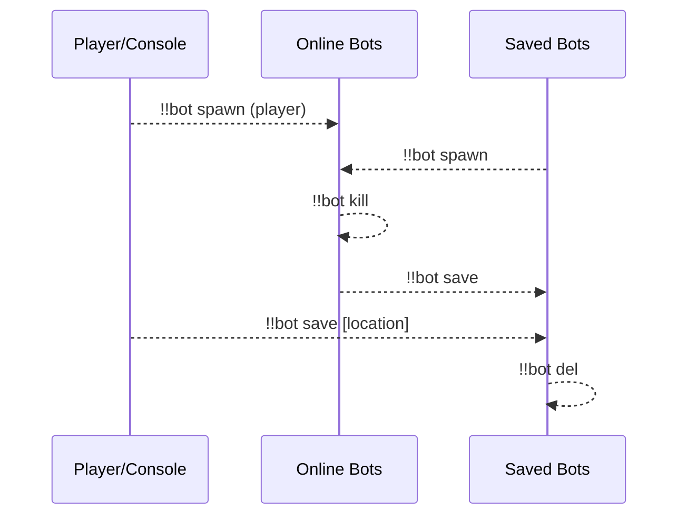
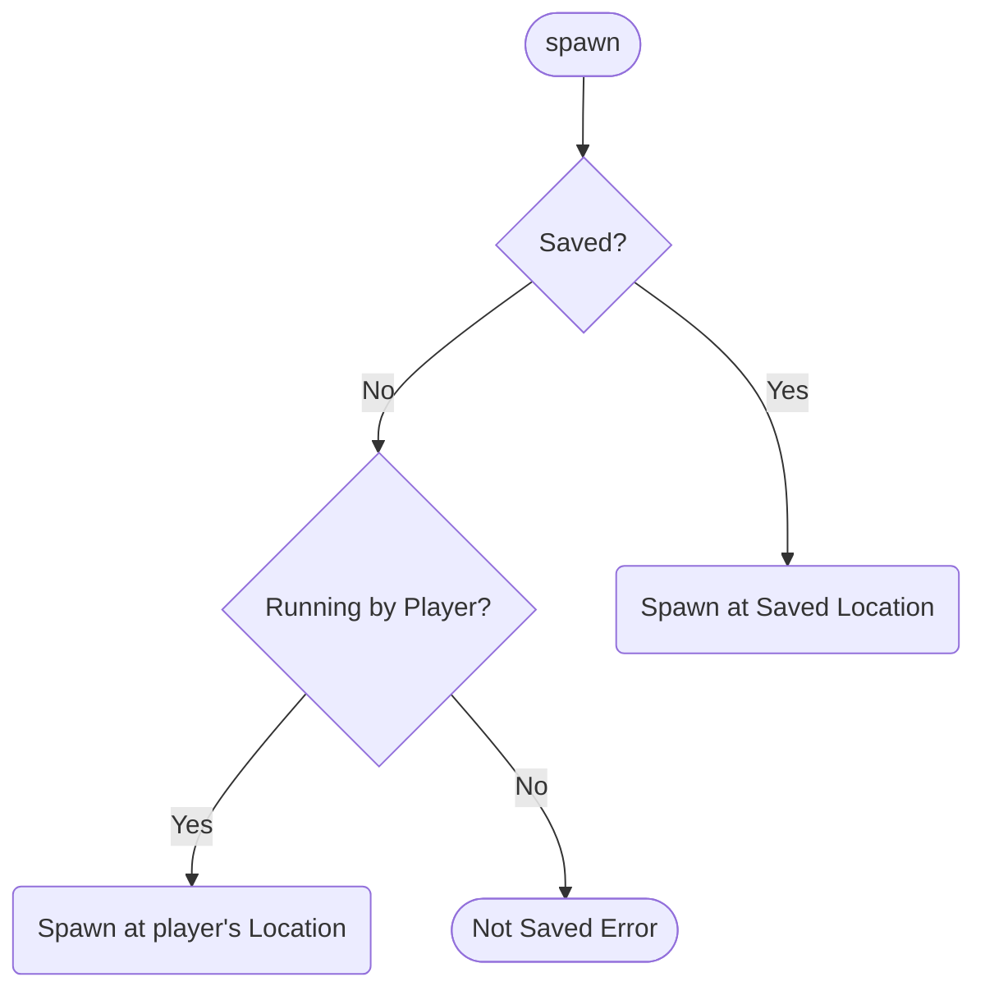
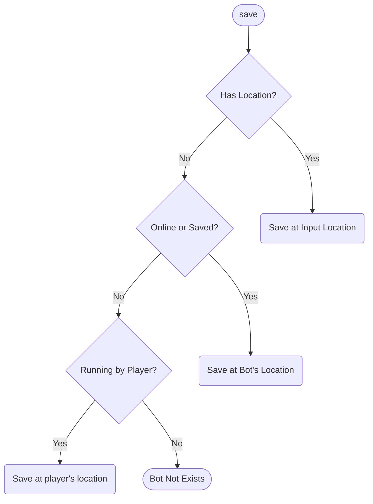
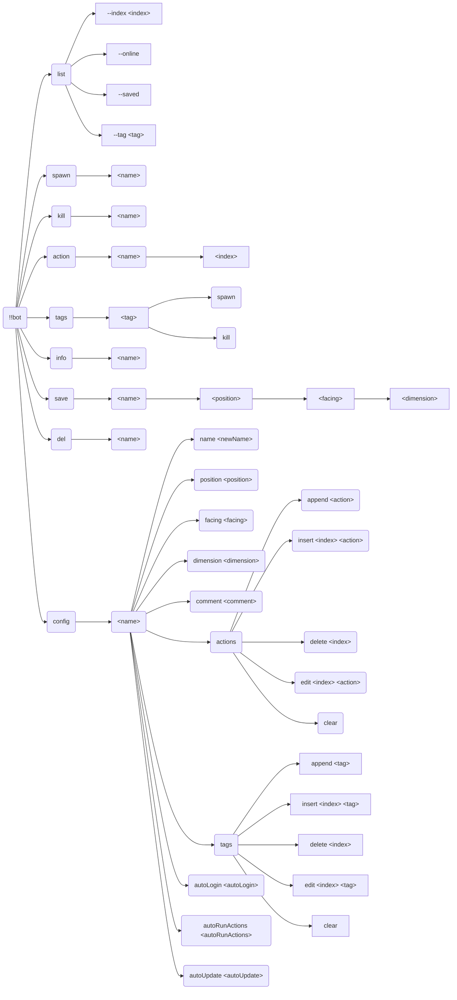
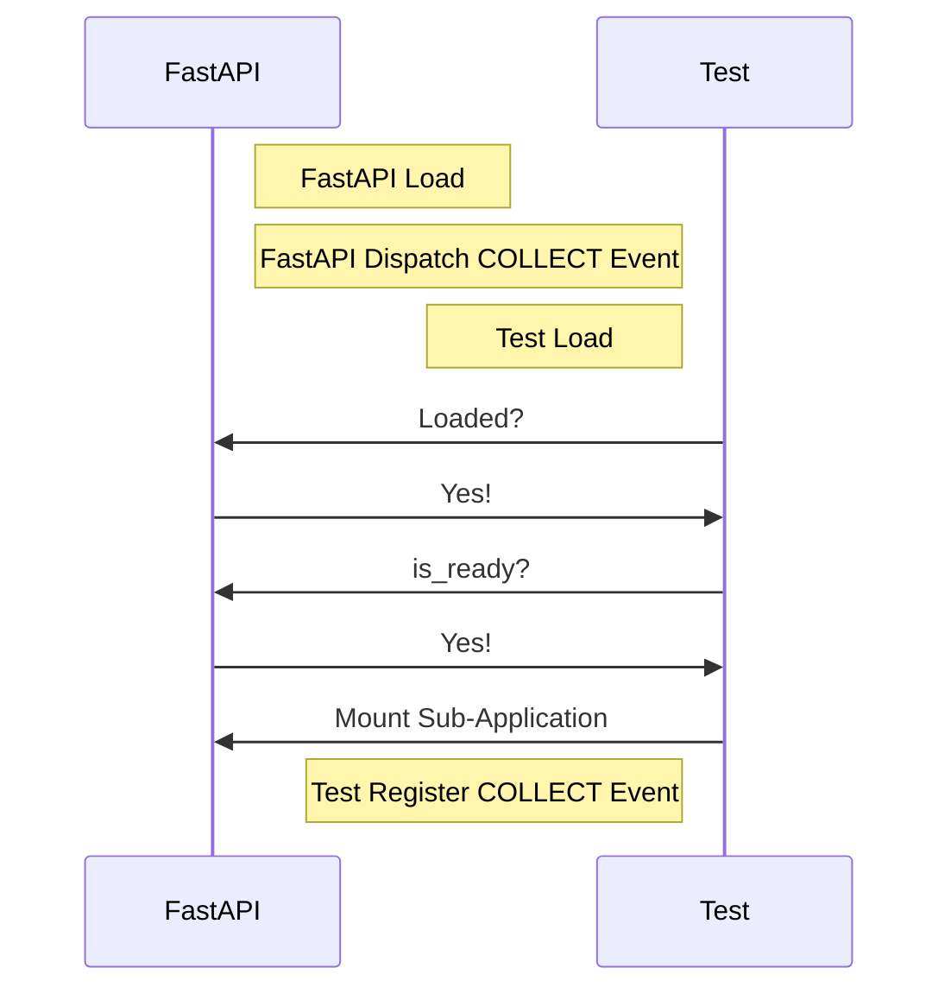
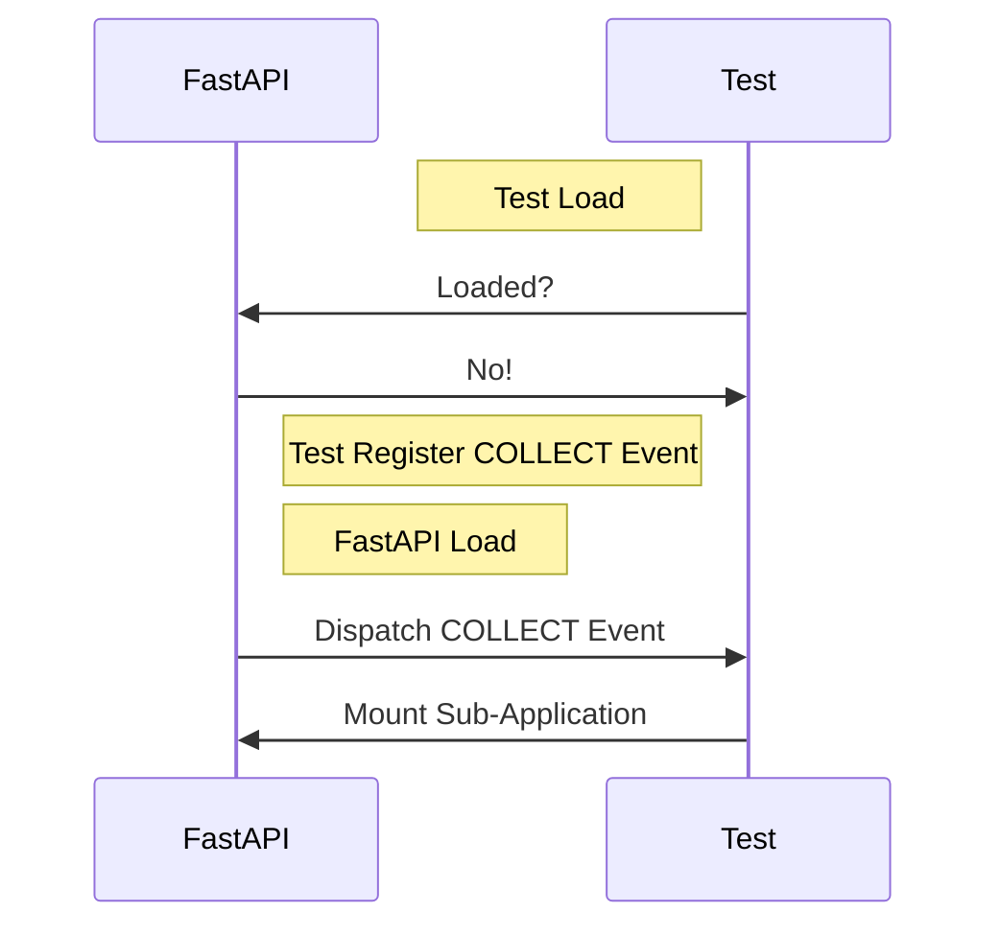
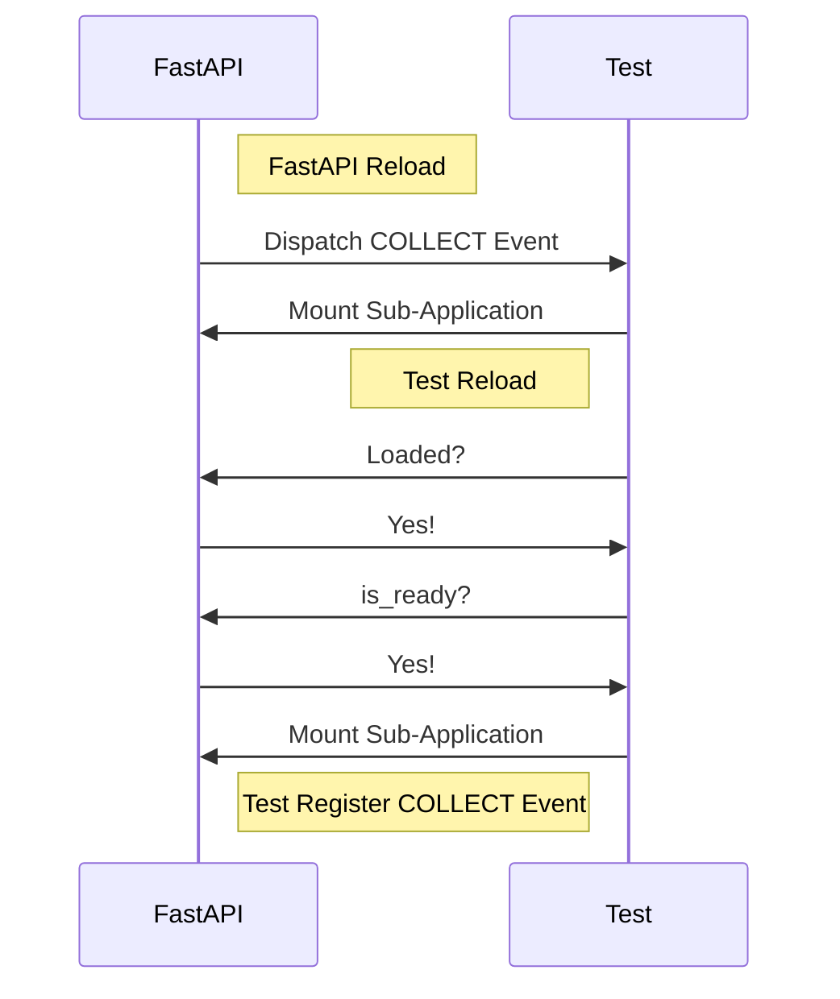
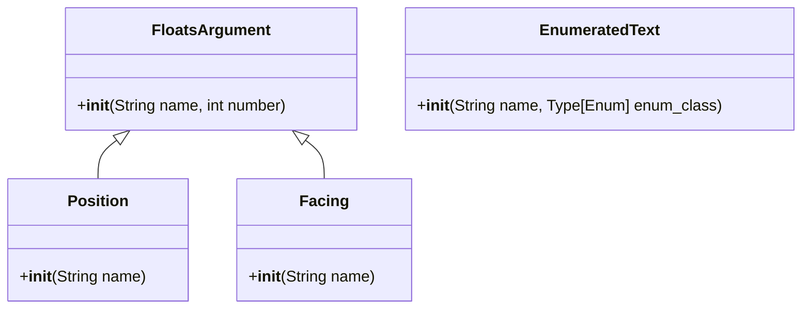

**English** | [中文](full-zh_cn.md)

\>\>\> [Back to index](/readme.md)

# Full Plugin Information Collection

Use `ctrl-f` to performance an in-page search, for what you are interested in

## advanced_calculator

### Basic Information

- Plugin ID: `advanced_calculator`
- Version: *Data fetching failed*
- Total downloads: 2039
- Authors: [Andy Zhang](https://github.com/AnzhiZhang)
- Repository: https://github.com/AnzhiZhang/MCDReforgedPlugins
- Repository plugin page: https://github.com/AnzhiZhang/MCDReforgedPlugins/tree/master/src/advanced_calculator
- Labels: [`Tool`](/labels/tool/readme.md)
- Description: *Data fetching failed*

### Dependencies

*Data fetching failed*

### Requirements

*Data fetching failed*

### Introduction

# AdvancedCalculator

> 提供游戏内多种便捷计算

## 使用

您可以使用 `=<expression>` 直接计算表达式，或使用 `==<count/expression>` 将物品数转换堆叠数。

| 指令 | 用途 | 示例 | 结果 |
| - | - | - | - |
| !!calc \<expression> | 计算表达式 | !!calc 1+1 | 1+1=2 |
| !!calc item \<count/expression> | 物品数转换堆叠数 | !!calc item 1794 | 1794个物品为1盒2组3个 |
| !!calc item \<box> \<stack> \<single> | 堆叠数转换物品数 | !!calc item 1 10 32 | 1盒10组32个为2400个物品 |
| !!calc color \<red> \<green> \<blue> | 10进制RGB转16进制 | !!calc color 255 0 255 | (255, 0, 255) -> #FF00FF |
| !!calc color \<#HEX> | 16十进制RGB转10进制 | !!calc color #00FF00 | #00FF00 -> (0, 255, 0) |

### Download

> [!IMPORTANT]
> Read the README file in plugin repository before using it.

| File | Version | Upload Time (UTC) | Size | Downloads | Operations |
| --- | --- | --- | --- | --- | --- |
| [AdvancedCalculator-v0.3.1.mcdr](https://github.com/AnzhiZhang/MCDReforgedPlugins/releases/tag/advanced_calculator-v0.3.1) | 0.3.1 | 2023/01/19 17:01:07 | 2.46KB | 1395 | [Download](https://github.com/AnzhiZhang/MCDReforgedPlugins/releases/download/advanced_calculator-v0.3.1/AdvancedCalculator-v0.3.1.mcdr) |
| [AdvancedCalculator-v0.3.0.mcdr](https://github.com/AnzhiZhang/MCDReforgedPlugins/releases/tag/advanced_calculator-v0.3.0) | 0.3.0 | 2022/10/21 20:03:33 | 2.42KB | 302 | [Download](https://github.com/AnzhiZhang/MCDReforgedPlugins/releases/download/advanced_calculator-v0.3.0/AdvancedCalculator-v0.3.0.mcdr) |
| [AdvancedCalculator-v0.2.1.mcdr](https://github.com/AnzhiZhang/MCDReforgedPlugins/releases/tag/advanced_calculator-v0.2.1) | 0.2.1 | 2022/07/21 13:20:06 | 2.38KB | 236 | [Download](https://github.com/AnzhiZhang/MCDReforgedPlugins/releases/download/advanced_calculator-v0.2.1/AdvancedCalculator-v0.2.1.mcdr) |

## advanced_whitelist_r

### Basic Information

- Plugin ID: `advanced_whitelist_r`
- Version: *Data fetching failed*
- Total downloads: 724
- Authors: [noionion](https://github.com/2X-ercha), [GamerNoTitle](https://github.com/GamerNoTitle)
- Repository: https://github.com/EMUnion/AdvancedWhitelistR
- Repository plugin page: https://github.com/EMUnion/AdvancedWhitelistR/tree/master
- Labels: [`Management`](/labels/management/readme.md)
- Description: *Data fetching failed*

### Dependencies

*Data fetching failed*

### Requirements

*Data fetching failed*

### Introduction

Offline server whitelist management

### Download

> [!IMPORTANT]
> Read the README file in plugin repository before using it.

| File | Version | Upload Time (UTC) | Size | Downloads | Operations |
| --- | --- | --- | --- | --- | --- |
| [AdvancedWhitelistR-v1.0.3.mcdr](https://github.com/EMUnion/AdvancedWhitelistR/releases/tag/1.0.3) | 1.0.3 | 2023/01/04 02:59:30 | 3.73KB | 330 | [Download](https://github.com/EMUnion/AdvancedWhitelistR/releases/download/1.0.3/AdvancedWhitelistR-v1.0.3.mcdr) |
| [AdvancedWhitelistR-v1.0.2.mcdr](https://github.com/EMUnion/AdvancedWhitelistR/releases/tag/1.0.2) | 1.0.2 | 2022/01/24 15:38:16 | 3.5KB | 305 | [Download](https://github.com/EMUnion/AdvancedWhitelistR/releases/download/1.0.2/AdvancedWhitelistR-v1.0.2.mcdr) |
| [AdvancedWhitelistR-v1.0.1.mcdr](https://github.com/EMUnion/AdvancedWhitelistR/releases/tag/1.0.1) | 1.0.1 | 2022/01/24 11:46:47 | 3.5KB | 89 | [Download](https://github.com/EMUnion/AdvancedWhitelistR/releases/download/1.0.1/AdvancedWhitelistR-v1.0.1.mcdr) |

## allow_suicide

### Basic Information

- Plugin ID: `allow_suicide`
- Version: *Data fetching failed*
- Total downloads: 1334
- Authors: [JAs0n](https://github.com/JAs0n319)
- Repository: https://github.com/JAs0n319/allow_suicide
- Repository plugin page: https://github.com/JAs0n319/allow_suicide/tree/master
- Labels: [`Tool`](/labels/tool/readme.md)
- Description: *Data fetching failed*

### Dependencies

*Data fetching failed*

### Requirements

*Data fetching failed*

### Introduction

Allow player suicide without op

### Download

> [!IMPORTANT]
> Read the README file in plugin repository before using it.

| File | Version | Upload Time (UTC) | Size | Downloads | Operations |
| --- | --- | --- | --- | --- | --- |
| [allow_suicide-v1.0.0.mcdr](https://github.com/JAs0n319/allow_suicide/releases/tag/allow_suicide-v1.0.0) | 1.0.0 | 2023/02/03 18:58:31 | 880B | 1334 | [Download](https://github.com/JAs0n319/allow_suicide/releases/download/allow_suicide-v1.0.0/allow_suicide-v1.0.0.mcdr) |

## auto_backup

### Basic Information

- Plugin ID: `auto_backup`
- Version: *Data fetching failed*
- Total downloads: 60
- Authors: [Kongtu5i](https://github.com/Kongtu5i)
- Repository: https://github.com/Kongtu5i/AutoBackup
- Repository plugin page: https://github.com/Kongtu5i/AutoBackup/tree/main
- Labels: [`Management`](/labels/management/readme.md)
- Description: *Data fetching failed*

### Dependencies

*Data fetching failed*

### Requirements

*Data fetching failed*

### Introduction

Automatically making a backup when players in the list join minecraft server

### Download

> [!IMPORTANT]
> Read the README file in plugin repository before using it.

| File | Version | Upload Time (UTC) | Size | Downloads | Operations |
| --- | --- | --- | --- | --- | --- |
| [AutoBackup-v0.2.0.mcdr](https://github.com/Kongtu5i/AutoBackup/releases/tag/v0.2.0) | 0.2.0 | 2024/04/30 10:42:09 | 2.44KB | 60 | [Download](https://github.com/Kongtu5i/AutoBackup/releases/download/v0.2.0/AutoBackup-v0.2.0.mcdr) |

## auto_command

### Basic Information

- Plugin ID: `auto_command`
- Version: *Data fetching failed*
- Total downloads: 247
- Authors: [bzyyyyyyyy](https://github.com/bzyyyyyyyy)
- Repository: https://github.com/bzyyyyyyyy/MCDR-AutoCommand
- Repository plugin page: https://github.com/bzyyyyyyyy/MCDR-AutoCommand/tree/master
- Labels: [`Tool`](/labels/tool/readme.md)
- Description: *Data fetching failed*

### Dependencies

*Data fetching failed*

### Requirements

*Data fetching failed*

### Introduction

Edit/send command stack & automatically send commands
### Download

> [!IMPORTANT]
> Read the README file in plugin repository before using it.

| File | Version | Upload Time (UTC) | Size | Downloads | Operations |
| --- | --- | --- | --- | --- | --- |
| [AutoCommand-v1.3.0.mcdr](https://github.com/bzyyyyyyyy/MCDR-AutoCommand/releases/tag/v1.3.0) | 1.3.0 | 2023/06/15 17:14:11 | 22.25KB | 233 | [Download](https://github.com/bzyyyyyyyy/MCDR-AutoCommand/releases/download/v1.3.0/AutoCommand-v1.3.0.mcdr) |
| [AutoCommand-v1.0.0.mcdr](https://github.com/bzyyyyyyyy/MCDR-AutoCommand/releases/tag/v1.0.0) | 1.0.0 | 2023/06/08 06:30:33 | 21.45KB | 14 | [Download](https://github.com/bzyyyyyyyy/MCDR-AutoCommand/releases/download/v1.0.0/AutoCommand-v1.0.0.mcdr) |

## auto_execute

### Basic Information

- Plugin ID: `auto_execute`
- Version: *Data fetching failed*
- Total downloads: 22
- Authors: [FRUITS-CANDY](https://github.com/FRUITS-CANDY)
- Repository: https://github.com/Passion-Never-Dissipate/Auto-Execute
- Repository plugin page: https://github.com/Passion-Never-Dissipate/Auto-Execute/tree/master
- Labels: [`Tool`](/labels/tool/readme.md)
- Description: *Data fetching failed*

### Dependencies

*Data fetching failed*

### Requirements

*Data fetching failed*

### Introduction

An MCDR plugin that stores various instructions for multimodal execution based on scripts
### Download

> [!IMPORTANT]
> Read the README file in plugin repository before using it.

| File | Version | Upload Time (UTC) | Size | Downloads | Operations |
| --- | --- | --- | --- | --- | --- |
| [Auto-Execute-v1.1.0.mcdr](https://github.com/Passion-Never-Dissipate/Auto-Execute/releases/tag/v1.1) | 1.1.0 | 2025/01/21 11:46:47 | 20.46KB | 12 | [Download](https://github.com/Passion-Never-Dissipate/Auto-Execute/releases/download/v1.1/Auto-Execute-v1.1.0.mcdr) |
| [Auto-Execute-v1.0.0.mcdr](https://github.com/Passion-Never-Dissipate/Auto-Execute/releases/tag/v1.0) | 1.0.0 | 2024/03/26 14:34:10 | 20.4KB | 10 | [Download](https://github.com/Passion-Never-Dissipate/Auto-Execute/releases/download/v1.0/Auto-Execute-v1.0.0.mcdr) |

## auto_msg_title

### Basic Information

- Plugin ID: `auto_msg_title`
- Version: *Data fetching failed*
- Total downloads: 184
- Authors: [zhongbai233](https://github.com/zhongbai2333)
- Repository: https://github.com/zhongbai2333/AutoMsgTitle
- Repository plugin page: https://github.com/zhongbai2333/AutoMsgTitle/tree/master
- Labels: [`Information`](/labels/information/readme.md)
- Description: *Data fetching failed*

### Dependencies

*Data fetching failed*

### Requirements

*Data fetching failed*

### Introduction

This plugin can automatically pop up titles or messages for players, just like the title after the plugin server enters the Lobby.

At the same time, this plugin can provide automatic instructions for a certain area, such as when the server is visited, visitors enter a certain area, the machine automatically pops up this area, the manufacturer, name, function of the machine, etc; Automatically pop up the machine manual for players when they enter a certain machine.

### Download

> [!IMPORTANT]
> Read the README file in plugin repository before using it.

| File | Version | Upload Time (UTC) | Size | Downloads | Operations |
| --- | --- | --- | --- | --- | --- |
| [AutoMsgTitle-v0.1.4.mcdr](https://github.com/zhongbai2333/AutoMsgTitle/releases/tag/v0.1.4) | 0.1.4 | 2025/02/05 15:26:52 | 8.58KB | 20 | [Download](https://github.com/zhongbai2333/AutoMsgTitle/releases/download/v0.1.4/AutoMsgTitle-v0.1.4.mcdr) |
| [AutoMsgTitle-v0.1.3.mcdr](https://github.com/zhongbai2333/AutoMsgTitle/releases/tag/v0.1.3) | 0.1.3 | 2024/09/20 13:03:35 | 8.2KB | 46 | [Download](https://github.com/zhongbai2333/AutoMsgTitle/releases/download/v0.1.3/AutoMsgTitle-v0.1.3.mcdr) |
| [AutoMsgTitle-v0.1.2.mcdr](https://github.com/zhongbai2333/AutoMsgTitle/releases/tag/v0.1.2) | 0.1.2 | 2024/06/27 20:21:52 | 8.19KB | 65 | [Download](https://github.com/zhongbai2333/AutoMsgTitle/releases/download/v0.1.2/AutoMsgTitle-v0.1.2.mcdr) |

## auto_plugin_reloader

### Basic Information

- Plugin ID: `auto_plugin_reloader`
- Version: *Data fetching failed*
- Total downloads: 6700
- Authors: [Fallen_Breath](https://github.com/Fallen-Breath)
- Repository: https://github.com/TISUnion/AutoPluginReloader
- Repository plugin page: https://github.com/TISUnion/AutoPluginReloader/tree/master
- Labels: [`Management`](/labels/management/readme.md)
- Description: *Data fetching failed*

### Dependencies

*Data fetching failed*

### Requirements

*Data fetching failed*

### Introduction

It's a plugin that automatically detects changes made in the MCDR plugin folders and triggers plugin reload

It's a savior for lazy people who are tired of having to manually perform plugin reloads after plugin file updates!

### Download

> [!IMPORTANT]
> Read the README file in plugin repository before using it.

| File | Version | Upload Time (UTC) | Size | Downloads | Operations |
| --- | --- | --- | --- | --- | --- |
| [AutoPluginReloader-v2.0.0.mcdr](https://github.com/TISUnion/AutoPluginReloader/releases/tag/v2.0.0) | 2.0.0 | 2024/06/30 05:12:37 | 18.57KB | 605 | [Download](https://github.com/TISUnion/AutoPluginReloader/releases/download/v2.0.0/AutoPluginReloader-v2.0.0.mcdr) |
| [AutoPluginReloader-v1.1.3.mcdr](https://github.com/TISUnion/AutoPluginReloader/releases/tag/v1.1.3) | 1.1.3 | 2021/10/01 18:23:47 | 17.58KB | 2245 | [Download](https://github.com/TISUnion/AutoPluginReloader/releases/download/v1.1.3/AutoPluginReloader-v1.1.3.mcdr) |
| [AutoPluginReloader-v1.1.2.mcdr](https://github.com/TISUnion/AutoPluginReloader/releases/tag/v1.1.2) | 1.1.2 | 2021/09/30 10:02:54 | 17.59KB | 178 | [Download](https://github.com/TISUnion/AutoPluginReloader/releases/download/v1.1.2/AutoPluginReloader-v1.1.2.mcdr) |

## battery_saver

### Basic Information

- Plugin ID: `battery_saver`
- Version: *Data fetching failed*
- Total downloads: 28
- Authors: [Mooling0602](https://github.com/Mooling0602)
- Repository: https://github.com/Mooling0602/BatterySaver-MCDR
- Repository plugin page: https://github.com/Mooling0602/BatterySaver-MCDR/tree/main
- Labels: [`Tool`](/labels/tool/readme.md), [`Information`](/labels/information/readme.md)
- Description: *Data fetching failed*

### Dependencies

*Data fetching failed*

### Requirements

*Data fetching failed*

### Introduction

*Data fetching failed*
### Download

> [!IMPORTANT]
> Read the README file in plugin repository before using it.

| File | Version | Upload Time (UTC) | Size | Downloads | Operations |
| --- | --- | --- | --- | --- | --- |
| [BatterySaver-v0.1.0.mcdr](https://github.com/Mooling0602/BatterySaver-MCDR/releases/tag/0.1.0) | 0.1.0 | 2025/03/08 13:35:46 | 5.84KB | 1 | [Download](https://github.com/Mooling0602/BatterySaver-MCDR/releases/download/0.1.0/BatterySaver-v0.1.0.mcdr) |
| [BatterySaver-v0.0.3.mcdr](https://github.com/Mooling0602/BatterySaver-MCDR/releases/tag/0.0.3) | 0.0.3 | 2025/03/04 07:35:56 | 2.75KB | 4 | [Download](https://github.com/Mooling0602/BatterySaver-MCDR/releases/download/0.0.3/BatterySaver-v0.0.3.mcdr) |
| [BatterySaver.mcdr](https://github.com/Mooling0602/BatterySaver-MCDR/releases/tag/0.0.1) | 0.0.1 | 2024/05/30 17:01:11 | 2.13KB | 23 | [Download](https://github.com/Mooling0602/BatterySaver-MCDR/releases/download/0.0.1/BatterySaver.mcdr) |

## bedrock_liteloader_handler

### Basic Information

- Plugin ID: `bedrock_liteloader_handler`
- Version: *Data fetching failed*
- Total downloads: 48
- Authors: [Elec glacier](https://github.com/Elec-Glacier), [jiangyan](https://github.com/jiangyan03)
- Repository: https://github.com/Elec-Glacier/liteloader_handler
- Repository plugin page: https://github.com/Elec-Glacier/liteloader_handler/tree/main
- Labels: [`Handler`](/labels/handler/readme.md)
- Description: *Data fetching failed*

### Dependencies

*Data fetching failed*

### Requirements

*Data fetching failed*

### Introduction

**English** | [中文](https://github.com/Elec-Glacier/liteloader_handler/blob/main/README_cn.md)

# Bedrock Liteloader Handler
A handler which allows BDS(bedrock dedicated server) to use MCDR and its plugins.

## Before you use
Vanilla BDS does not have the function to print out player chat log.
So it is recommended to use a behavior pack or modify BDS to std out your chat log

## Usage
1. Download the latest version from [releases](https://github.com/Elec-Glacier/liteloader_handler/releases)
2. Place this plugin in your MCDR "plugins" directory
3. Start MCDR
4. Change and choose the handler in mcdreforged "config" directory
5. reload the config

## Notice
After version 1.2.0, this handler has adapted to PrimeBackup. You can turn it off in config.

## MCDR plugins installation notice
Since Bedrock and Java edition are different in many aspects, so read the introductions of other MCDR plugins you want to use and make sure them would work correctly before you place them into plugins directory.

## Attentions
Due to a [BDS bug](https://bugs.mojang.com/browse/BDS-3791), you might need to use some server modified plugins to let MCDR work correctly, such as [UnicodeFixer](https://www.minebbs.com/resources/unicodefixer.6991/).

### Download

> [!IMPORTANT]
> Read the README file in plugin repository before using it.

| File | Version | Upload Time (UTC) | Size | Downloads | Operations |
| --- | --- | --- | --- | --- | --- |
| [BedrockLiteloaderHandler-v1.2.0.mcdr](https://github.com/Elec-Glacier/liteloader_handler/releases/tag/1.2.0) | 1.2.0 | 2025/01/31 13:07:18 | 6.0KB | 7 | [Download](https://github.com/Elec-Glacier/liteloader_handler/releases/download/1.2.0/BedrockLiteloaderHandler-v1.2.0.mcdr) |
| [BedrockLiteloaderHandler-v1.1.2.mcdr](https://github.com/Elec-Glacier/liteloader_handler/releases/tag/1.1.2) | 1.1.2 | 2025/01/05 05:21:18 | 5.69KB | 15 | [Download](https://github.com/Elec-Glacier/liteloader_handler/releases/download/1.1.2/BedrockLiteloaderHandler-v1.1.2.mcdr) |
| [BedrockLiteloaderHandler-v1.1.1.mcdr](https://github.com/Elec-Glacier/liteloader_handler/releases/tag/1.1.1) | 1.1.1 | 2024/12/14 11:34:03 | 4.32KB | 10 | [Download](https://github.com/Elec-Glacier/liteloader_handler/releases/download/1.1.1/BedrockLiteloaderHandler-v1.1.1.mcdr) |

## beep

### Basic Information

- Plugin ID: `beep`
- Version: *Data fetching failed*
- Total downloads: 6458
- Authors: [Fallen_Breath](https://github.com/Fallen-Breath), [LucunJi](https://github.com/LucunJi)
- Repository: https://github.com/TISUnion/Beep
- Repository plugin page: https://github.com/TISUnion/Beep/tree/master
- Labels: [`Tool`](/labels/tool/readme.md)
- Description: *Data fetching failed*

### Dependencies

*Data fetching failed*

### Requirements

*Data fetching failed*

### Introduction

# Beep

Beeps when someone is mentioned in text with an `@`

Leave a space before and after name when you use a @, for example `@ Lucun_Ji Hello!`

`@ all ` represents all players in game

Use two `@` for more powerful ping

### Download

> [!IMPORTANT]
> Read the README file in plugin repository before using it.

| File | Version | Upload Time (UTC) | Size | Downloads | Operations |
| --- | --- | --- | --- | --- | --- |
| [Beep-v1.1.0.mcdr](https://github.com/TISUnion/Beep/releases/tag/v1.1.0) | 1.1.0 | 2021/08/26 14:01:49 | 1.74KB | 5040 | [Download](https://github.com/TISUnion/Beep/releases/download/v1.1.0/Beep-v1.1.0.mcdr) |
| [Beep-v1.0.0.mcdr](https://github.com/TISUnion/Beep/releases/tag/v1.0.0) | 1.0.0 | 2021/08/21 15:35:36 | 1.67KB | 1418 | [Download](https://github.com/TISUnion/Beep/releases/download/v1.0.0/Beep-v1.0.0.mcdr) |

## better_backup

### Basic Information

- Plugin ID: `better_backup`
- Version: *Data fetching failed*
- Total downloads: 409
- Authors: [z0z0r4](https://github.com/z0z0r4)
- Repository: https://github.com/z0z0r4/better_backup
- Repository plugin page: https://github.com/z0z0r4/better_backup/tree/master
- Labels: [`Management`](/labels/management/readme.md)
- Description: *Data fetching failed*

### Dependencies

*Data fetching failed*

### Requirements

*Data fetching failed*

### Introduction

⚠️ **ARCHIVED**: Use PrimeBackup instead

A plugin that supports efficient backup/rollback with file deduplication

Features:

- Annotated backup
- Keep only one copy of all files without duplication, saving hard disk space
- Backup size display, clear information
- Theoretically unlimited backup points, only depends on save changes

### Download

> [!IMPORTANT]
> Read the README file in plugin repository before using it.

| File | Version | Upload Time (UTC) | Size | Downloads | Operations |
| --- | --- | --- | --- | --- | --- |
| [Better_Backup-v2.1.6.mcdr](https://github.com/z0z0r4/better_backup/releases/tag/v2.1.6) | 2.1.6 | 2023/08/30 12:35:29 | 17.57KB | 409 | [Download](https://github.com/z0z0r4/better_backup/releases/download/v2.1.6/Better_Backup-v2.1.6.mcdr) |

## bili_live_helper

### Basic Information

- Plugin ID: `bili_live_helper`
- Version: *Data fetching failed*
- Total downloads: 96
- Authors: [Aimerny](https://github.com/Aimerny)
- Repository: https://github.com/Aimerny/MCDRPlugins
- Repository plugin page: https://github.com/Aimerny/MCDRPlugins/tree/main/src/bili_live_helper
- Labels: [`Information`](/labels/information/readme.md)
- Description: *Data fetching failed*

### Dependencies

*Data fetching failed*

### Requirements

*Data fetching failed*

### Introduction

# BiliLiveHelper | B站直播助手-弹幕姬

---

支持将b站直播间的弹幕同步到mc中

> [!important]
> 此插件仅用于学习交流,请勿用于违法犯罪或其他不良用途.

# :sparkles: 功能

**BiliLiveHelper**是一款~~功能丰富的~~MCDR插件,能够实现将[bilibili](https://bilibili.com)(以下简称"B站)
直播间中的弹幕信息实时同步到MC聊天板中.

- [x] 全异步拉取B站弹幕
- [x] 支持多个玩家订阅各自的直播间,弹幕消息单独发送,互不干扰
- [x] 玩家可以随时启停弹幕姬
- [ ] 支持查询订阅的直播间的状态
- [ ] admin轻松管理所有玩家的订阅信息
- [x] 游戏内通过直播姬账号发送弹幕,即时回应

# :robot: 指令
```
 ---------- BiliLiveHelper ----------
 >> !!blh [help] - | - 获取帮助
 >> !!blh bind <rid> - | - 绑定直播间id
 >> !!blh on - | - 启动直播弹幕姬
 >> !!blh off - | - 停止直播弹幕姬
 >> !!blh info - | - 查看我的直播间信息
 >> !!blh query - | - 查看其他玩家的直播间信息
 >> !!blh send <danmu> - | - 向直播间发送弹幕
 >> !!blh s <danmu> - | - 向直播间发送弹幕
 ------- Authored by Aimerny --------

```

# :pushpin: 依赖

| python依赖项           | 版本      |
| ------------------- | ------- |
| mcdreforged         | ^2.12.0 |
| bilibili-python-api | ^16.3.0 |

| mcdr依赖项     | 版本      |
| ----------- | ------- |
| mcdreforged | ^2.13.0 |

# :wrench: 配置
```json5
{
    "enable": true,
    "data_file_path": "data.json",
    "console_output": true,
    "account": {
        "uid": 3546688564234249,
        "sessdata": "",
        "bili_jct": "",
        "buvid3": "",
        "ac_time_value": ""
    },
   "send":true
}
```
## 配置说明

1. `data_file_path`: 数据文件的路径.持久化的信息会保存到这个文件
2. `console_output`: 是否将接收到的弹幕输出到服务器控制台,如果设为false则需要在debug模式才能看到
3. `account`: 使用此插件需要一个真实的B站账号.`account`中是一些鉴权信息
   1. `uid`: 你的B站账号UID
   2. 其他: 参考 [获取 Credential 类所需信息](https://nemo2011.github.io/bilibili-api/#/get-credential)
4. `send`: 是否允许服务器成员使用上述配置中的`account`发送消息到对应直播间,默认为true

> [!note]
> B站的账号如果没有在其他地方登录基本不会过期,建议开一个小号做这件事情

# :art: 功能预览

## 消息同步


## MC发送弹幕


### Download

> [!IMPORTANT]
> Read the README file in plugin repository before using it.

| File | Version | Upload Time (UTC) | Size | Downloads | Operations |
| --- | --- | --- | --- | --- | --- |
| [BiliLiveHelper-v1.3.3.mcdr](https://github.com/Aimerny/MCDRPlugins/releases/tag/bili_live_helper-v1.3.3) | 1.3.3 | 2025/02/06 07:06:36 | 12.74KB | 9 | [Download](https://github.com/Aimerny/MCDRPlugins/releases/download/bili_live_helper-v1.3.3/BiliLiveHelper-v1.3.3.mcdr) |
| [BiliLiveHelper-v1.3.1.mcdr](https://github.com/Aimerny/MCDRPlugins/releases/tag/bili_live_helper-v1.3.1) | 1.3.1 | 2024/09/25 11:48:30 | 12.73KB | 56 | [Download](https://github.com/Aimerny/MCDRPlugins/releases/download/bili_live_helper-v1.3.1/BiliLiveHelper-v1.3.1.mcdr) |
| [BiliLiveHelper-v1.3.0.mcdr](https://github.com/Aimerny/MCDRPlugins/releases/tag/bili_live_helper-v1.3.0) | 1.3.0 | 2024/09/23 18:24:29 | 12.8KB | 5 | [Download](https://github.com/Aimerny/MCDRPlugins/releases/download/bili_live_helper-v1.3.0/BiliLiveHelper-v1.3.0.mcdr) |

## bingo

### Basic Information

- Plugin ID: `bingo`
- Version: *Data fetching failed*
- Total downloads: 112
- Authors: [Andy Zhang](https://github.com/AnzhiZhang)
- Repository: https://github.com/AnzhiZhang/MCDReforgedPlugins
- Repository plugin page: https://github.com/AnzhiZhang/MCDReforgedPlugins/tree/master/src/bingo
- Labels: [`Tool`](/labels/tool/readme.md)
- Description: *Data fetching failed*

### Dependencies

*Data fetching failed*

### Requirements

*Data fetching failed*

### Introduction

# Bingo

> [Bingo](https://www.flytre.net/bingo) 游戏实用工具

## 使用

| 指令 | 用途 |
| - | - |
| !!bingo team \<num> | 随机分组 |
| !!bingo end | 结束游戏 |

### Download

> [!IMPORTANT]
> Read the README file in plugin repository before using it.

| File | Version | Upload Time (UTC) | Size | Downloads | Operations |
| --- | --- | --- | --- | --- | --- |
| [Bingo-v0.0.3.mcdr](https://github.com/AnzhiZhang/MCDReforgedPlugins/releases/tag/bingo-v0.0.3) | 0.0.3 | 2023/02/26 00:14:39 | 1.3KB | 112 | [Download](https://github.com/AnzhiZhang/MCDReforgedPlugins/releases/download/bingo-v0.0.3/Bingo-v0.0.3.mcdr) |

## bkchat_manager

### Basic Information

- Plugin ID: `bkchat_manager`
- Version: *Data fetching failed*
- Total downloads: 57
- Authors: [Mooling0602](https://github.com/Mooling0602)
- Repository: https://github.com/Mooling0602/BukkitChatManager-MCDR
- Repository plugin page: https://github.com/Mooling0602/BukkitChatManager-MCDR/tree/main
- Labels: [`Information`](/labels/information/readme.md), [`Management`](/labels/management/readme.md)
- Description: *Data fetching failed*

### Dependencies

*Data fetching failed*

### Requirements

*Data fetching failed*

### Introduction

# BukkitChatManager-MCDR
在MCDR接管BukkitAPI服务端的游戏内聊天。

## 依赖
- BukkitAPI 插件：[PlayerLog](https://github.com/Mooling0602/BukkitChatManager-MCDR/blob/main/extra/PlayerLog-1.1.jar)
> 已附加到MCDR插件中，MCDR启动或重载此插件时会自动更新或加载，你可能需要重启服务器以使其生效！

## 用法
从Release中安装此MCDR插件，如果出现问题，请确认依赖是否已经正常加载，有报错请反馈到Issues！

## 配置
配置文件位于`config/bkchat_manager/config.json`，你可以在里面修改聊天消息的格式等。

其中，`%player%`表示玩家名；`%message%`表示聊天消息内容或玩家执行的指令内容；`%src_prefix%`表示指令源。

## 注意事项
和类似的BukkitAPI插件冲突，请不要使用这些同类型的插件。

另外，如果有和依赖中作用相同的替代品插件，此MCDR插件可无缝迁移到其他类型的服务端上；Mohist等支持BukkitAPI的混合端也可以使用。

插件有内置专门的服务端处理器，强烈建议启用，同时启用后无法使用其他的服务端处理器，否则会冲突。

## 更新内容
### 历史日志
- `v0.2.1` 对内置的Bukkit插件依赖进行了更新，添加了客户端聊天拦截的动态控制功能，非生产环境下可以使用/chatmsg on|off进行调试，生产环境下请禁止普通玩家的playerlog.chatmsg权限（将于后续优化）！
- `v0.3.0` 更新了兼容模式（compatibility_mode），你可以通过安装此插件并启用聊天兼容模式的方式，使MCDR本身和MCDR的大部分按规范开发的插件，可以兼容各种会修改聊天内容并影响服务端聊天相关日志输出的Bukkit服务端插件如VentureChat等！

### 计划中

经过测试的服务端：Mohist、Paper、Leaves
> 极低版本的服务端尚未测试，理论上支持1.12及以上的所有Bukkit服务端。

### Download

> [!IMPORTANT]
> Read the README file in plugin repository before using it.

| File | Version | Upload Time (UTC) | Size | Downloads | Operations |
| --- | --- | --- | --- | --- | --- |
| [BukkitChatManager-v0.3.0.mcdr](https://github.com/Mooling0602/BukkitChatManager-MCDR/releases/tag/0.3.0) | 0.3.0 | 2025/02/06 13:41:06 | 21.15KB | 15 | [Download](https://github.com/Mooling0602/BukkitChatManager-MCDR/releases/download/0.3.0/BukkitChatManager-v0.3.0.mcdr) |
| [BukkitChatManager-v0.2.1.mcdr](https://github.com/Mooling0602/BukkitChatManager-MCDR/releases/tag/0.2.1) | 0.2.1 | 2025/02/05 14:17:30 | 8.38KB | 7 | [Download](https://github.com/Mooling0602/BukkitChatManager-MCDR/releases/download/0.2.1/BukkitChatManager-v0.2.1.mcdr) |
| [BukkitChatManager-v0.2.0.mcdr](https://github.com/Mooling0602/BukkitChatManager-MCDR/releases/tag/0.2.0) | 0.2.0 | 2024/11/22 12:06:32 | 18.83KB | 14 | [Download](https://github.com/Mooling0602/BukkitChatManager-MCDR/releases/download/0.2.0/BukkitChatManager-v0.2.0.mcdr) |

## bot

### Basic Information

- Plugin ID: `bot`
- Version: *Data fetching failed*
- Total downloads: 5262
- Authors: [Andy Zhang](https://github.com/AnzhiZhang)
- Repository: https://github.com/AnzhiZhang/MCDReforgedPlugins
- Repository plugin page: https://github.com/AnzhiZhang/MCDReforgedPlugins/tree/master/src/bot
- Labels: [`Tool`](/labels/tool/readme.md), [`Management`](/labels/management/readme.md)
- Description: *Data fetching failed*

### Dependencies

*Data fetching failed*

### Requirements

*Data fetching failed*

### Introduction

# Bot

[简体中文](https://github.com/AnzhiZhang/MCDReforgedPlugins/tree/master/src/bot/readme_cn.md)

> The best carpet bot manager!

## Dependencies

- [MinecraftDataAPI](https://github.com/MCDReforged/MinecraftDataAPI)
- [MoreCommandNodes](https://github.com/AnzhiZhang/MCDReforgedPlugins/tree/master/src/bot/../more_command_nodes)

## Usage

`!!bot` View help

`!!bot list [--index <index>] [filters]` Show bot list

`!!bot spawn <name>` Spawn bot

`!!bot kill <name>` Kill bot

`!!bot action <name> [index]` Execute bot action(s)

`!!bot tags` View available tags

`!!bot tags <tag> spawn/kill` Spawn/kill bot(s) with tag

`!!bot info <name>` View bot info

`!!bot save <name> [position] [facing] [dimension]` Save bot

`!!bot del <name>` Delete saved bot

`!!bot config <name> <option> <value>` Config bot

### Workflow


```mermaid
sequenceDiagram
    participant Player/Console
    participant Online Bots
    participant Saved Bots

    Player/Console-->>Online Bots: !!bot spawn (player)
    Saved Bots-->>Online Bots: !!bot spawn
    Online Bots-->>Online Bots: !!bot kill
    Online Bots-->>Saved Bots: !!bot save
    Player/Console-->>Saved Bots: !!bot save [location]
    Saved Bots-->>Saved Bots: !!bot del
```

### list

**--index \<index\>**: Page number, e.g. `--index 1`, default is 0

**--online**: Show online bots

**--saved**: Show saved bots

**--tag \<tag\>**: Filter by tag

### spawn

Spawn bot


```mermaid
flowchart TD
    start([spawn])
    is_saved{Saved?}
    is_player{Running by Player?}

    start --> is_saved
    is_saved -->|Yes| spawn1(Spawn at Saved Location)
    is_saved -->|No| is_player
    is_player -->|Yes| spawn2(Spawn at player's Location)
    is_player -->|No| error1([Not Saved Error])
```

### kill

Kill bot

### action

Execute bot action(s)

When `index` is specified, execute specific action(s) instead of all actions

### tags

View available tags and spawn/kill bot(s) with tag

`!!bot tags` View available tags

`!!bot tags <tag> spawn` Spawn bot(s) with tag

`!!bot tags <tag> kill` Kill bot(s) with tag

### info

View bot info

### save

Save bot


```mermaid
flowchart TD
    start([save])
    with_location{Has Location?}
    online{Online or Saved?}
    is_player{Running by Player?}

    start --> with_location
    with_location -->|Yes| save3(Save at Input Location)
    with_location -->|No| online

    online -->|Yes| save1(Save at Bot's Location)
    online -->|No| is_player
    is_player -->|Yes| save2(Save at player's location)
    is_player -->|No| error1([Bot Not Exists])
```

### del

Delete saved bot

After deletion, the bot will be backed up to the `botBin.json` file in the data directory. If you delete it by mistake, you can use it for manual recovery.

### config

Config bot

### Full Command Tree


```mermaid
flowchart LR
    start(!!bot)

    start --> list(list)
    list --> list_index["--index &lt;index&gt;"]
    list --> list_online[--online]
    list --> list_saved[--saved]
    list --> list_tag["--tag &lt;tag&gt;"]

    start --> spawn(spawn)
    spawn --> spawn_name("&lt;name&gt;")

    start --> kill(kill)
    kill --> kill_name("&lt;name&gt;")

    start --> action(action)
    action --> action_name("&lt;name&gt;")
    action_name --> action_name_index["&lt;index&gt;"]

    start --> tags(tags)
    tags --> tags_tag["&lt;tag&gt;"]
    tags_tag --> tags_tag_spawn(spawn)
    tags_tag --> tags_tag_kill(kill)

    start --> info(info)
    info --> info_name("&lt;name&gt;")

    start --> save(save)
    save --> save_name("&lt;name&gt;")
    save_name --> save_name_position["&lt;position&gt;"]
    save_name_position --> save_name_position_facing["&lt;facing&gt;"]
    save_name_position_facing --> save_name_position_facing_dimension["&lt;dimension&gt;"]

    start --> del(del)
    del --> del_name("&lt;name&gt;")

    start --> config(config)
    config --> config_name("&lt;name&gt;")
    config_name --> config_name_name("name &lt;newName&gt;")
    config_name --> config_name_position("position &lt;position&gt;")
    config_name --> config_name_facing("facing &lt;facing&gt;")
    config_name --> config_name_dimension("dimension &lt;dimension&gt;")
    config_name --> config_name_comment("comment &lt;comment&gt;")
    config_name --> config_name_actions(actions)
    config_name --> config_name_tags(tags)
    config_name --> config_name_autoLogin("autoLogin &lt;autoLogin&gt;")
    config_name --> config_name_autoRunActions("autoRunActions &lt;autoRunActions&gt;")
    config_name --> config_name_autoUpdate("autoUpdate &lt;autoUpdate&gt;")

    config_name_actions --> config_name_actions_append("append &lt;action&gt;")
    config_name_actions --> config_name_actions_insert("insert &lt;index&gt; &lt;action&gt;")
    config_name_actions --> config_name_actions_delete("delete &lt;index&gt")
    config_name_actions --> config_name_actions_edit("edit &lt;index&gt; &lt;action&gt;")
    config_name_actions --> config_name_actions_clear(clear)

    config_name_tags --> config_name_tags_append["append &lt;tag&gt;"]
    config_name_tags --> config_name_tags_insert["insert &lt;index&gt; &lt;tag&gt;"]
    config_name_tags --> config_name_tags_delete["delete &lt;index&gt"]
    config_name_tags --> config_name_tags_edit["edit &lt;index&gt; &lt;tag&gt;"]
    config_name_tags --> config_name_tags_clear[clear]
```

## Config

### gamemode

Default: `survival`

Game mode of bot

### force_gamemode

Default: `false`

Forcing all bots to use the game mode configured by `gamemode`, if `false`, only saved bots will use the game mode configured by `gamemode`.

### name_prefix

Default: `bot_`

Prefix of bot name

### name_suffix

Default: None

Suffix of bot name

### post_join_delay

Default: `0`

Delay time (seconds) for processing after bot joined. If you are using a non-vanilla server, you may need to adjust this value.

### permissions

Minimum permission to use corresponding command

## FastAPI MCDR

The plugin supports the [FastAPI MCDR](https://github.com/AnzhiZhang/MCDReforgedPlugins/tree/master/src/bot/../fastapi_mcdr) plugin (>=2.0.0). After installing the FastAPI MCDR plugin, the plugin will automatically register endpoints. You can view the API definition through FastAPI.

Python packages required:

```text
pydantic>=2.0
```

You can use this feature to implement external control, such as a web page for managing bots:


### Download

> [!IMPORTANT]
> Read the README file in plugin repository before using it.

| File | Version | Upload Time (UTC) | Size | Downloads | Operations |
| --- | --- | --- | --- | --- | --- |
| [Bot-v1.3.1.mcdr](https://github.com/AnzhiZhang/MCDReforgedPlugins/releases/tag/bot-v1.3.1) | 1.3.1 | 2025/02/07 13:37:20 | 18.03KB | 189 | [Download](https://github.com/AnzhiZhang/MCDReforgedPlugins/releases/download/bot-v1.3.1/Bot-v1.3.1.mcdr) |
| [Bot-v1.3.0.mcdr](https://github.com/AnzhiZhang/MCDReforgedPlugins/releases/tag/bot-v1.3.0) | 1.3.0 | 2024/12/20 22:08:12 | 18.03KB | 341 | [Download](https://github.com/AnzhiZhang/MCDReforgedPlugins/releases/download/bot-v1.3.0/Bot-v1.3.0.mcdr) |
| [Bot-v1.2.4.mcdr](https://github.com/AnzhiZhang/MCDReforgedPlugins/releases/tag/bot-v1.2.4) | 1.2.4 | 2024/09/15 01:24:41 | 17.87KB | 446 | [Download](https://github.com/AnzhiZhang/MCDReforgedPlugins/releases/download/bot-v1.2.4/Bot-v1.2.4.mcdr) |

## bot_plugin

### Basic Information

- Plugin ID: `bot_plugin`
- Version: *Data fetching failed*
- Total downloads: 854
- Authors: [DancingSnow0517](https://github.com/DancingSnow0517)
- Repository: https://github.com/DancingSnow0517/Bot_Manager
- Repository plugin page: https://github.com/DancingSnow0517/Bot_Manager/tree/master
- Labels: [`Management`](/labels/management/readme.md), [`Tool`](/labels/tool/readme.md)
- Description: *Data fetching failed*

### Dependencies

*Data fetching failed*

### Requirements

*Data fetching failed*

### Introduction

# A MCDR bot manager。

:warning: **Read README in repository before use!**

### Download

> [!IMPORTANT]
> Read the README file in plugin repository before using it.

| File | Version | Upload Time (UTC) | Size | Downloads | Operations |
| --- | --- | --- | --- | --- | --- |
| [BotPlugin-v1.0.0.mcdr](https://github.com/DancingSnow0517/Bot_Manager/releases/tag/1.0.0) | 1.0.0 | 2022/01/09 04:38:06 | 17.24KB | 854 | [Download](https://github.com/DancingSnow0517/Bot_Manager/releases/download/1.0.0/BotPlugin-v1.0.0.mcdr) |

## botkikai

### Basic Information

- Plugin ID: `botkikai`
- Version: *Data fetching failed*
- Total downloads: 0
- Authors: [Jerry-FaGe](https://github.com/Jerry-FaGe), [RayanceKing](https://github.com/RayanceKing)
- Repository: https://github.com/RayanceKing/MCDR-BotKikai
- Repository plugin page: https://github.com/RayanceKing/MCDR-BotKikai/tree/master
- Labels: [`Tool`](/labels/tool/readme.md), [`Management`](/labels/management/readme.md)
- Description: *Data fetching failed*

### Dependencies

*Data fetching failed*

### Requirements

*Data fetching failed*

### Introduction

# MCDR-BotKikai（Bot機械）

适用于[MCDR](https://github.com/Fallen-Breath/MCDReforged)的将假人存储至列表并提供指令映射，便捷放置，操作界面等功能的插件。
需要安装前置插件[MinecraftDataAPI](https://github.com/MCDReforged/MinecraftDataAPI)（MCDR 1.x）。

特别感谢[AnzhiZhang](https://github.com/AnzhiZhang)的[Bot](https://github.com/AnzhiZhang/MCDReforgedPlugins/tree/master/src/bot)插件提供的部分逻辑。

> 君は道具ではなく、その名が似合う人になろんだ


假如你有一台刷沙机, 开关在[0, 64, 0]的位置。本插件可以实现让你在世界的任何位置输入指令`!!bk 刷沙机 use`都可以随时在指定位置召唤假人以开关这台刷沙机（顺便挂机）。

```MCDR
本插件中!!bk与!!botkikai效果相同，两者可以互相替换
!!bk 显示本帮助信息
!!bk list 显示假人列表
!!bk reload 重载插件配置
!!bk add <name> <kikai> 使用当前玩家参数添加一个名为<name>用于<kikai>的假人
!!bk add <name> <kikai> <dim> <pos> <facing> 使用自定义参数添加一个名为<name>用于<kikai>的假人
!!bk del <kikai> 从假人列表移除用于<kikai>的假人
!!bk <kikai> 输出一个可点击的界面，自动根据假人是否在线改变选项
!!bk <kikai> spawn 召唤一个用于<kikai>的假人
!!bk <kikai> kill 干掉用于<kikai>的假人
!!bk <kikai> use 假人右键一次（执行此条前无需执行spawn，如假人不在线会自动上线）
!!bk <kikai> huse 假人持续右键
!!bk <kikai> hatk 假人持续左键
!!bk <kikai> glowing 假人发光两分钟
!!bk <kikai> stop 假人停止一切动作
```

## 功能补充
* 参数中的`<kikai>`指红石机械，`<name>`指假人的真实名字。

  如果想让`sandbot`控制`刷沙机`，则`<name>`为`sandbot`，`<kikai>`为`刷沙机`。

  假人器械映射，顾名思义，`!!bk sandbot spawn`和`!!bk 刷沙机 spawn`的运作效果是一样的，其他指令同理。

* 本插件支持MCDR的权限系统，可以在文件头部修改使用指令的权限等级。

  默认的权限配置为：user及以上组可以操作假人(spawn,use,kill)，admin及以上组可以操作假人列表(add,remove)

* `!!bk list`: 输出一个类似下面的界面，显示本插件储存的所有假人，可以通过点击进行操作。
  ```MCDR
  ----------- Jerry_FaGe 离线  -----------
  此假人用于: ['Jerry_FaGe', '发哥', '开发者', '作者', 'test']
  [点击召唤]  [点击use]  [查看详情]
  ----------- sandbot 在线  -----------
  此假人用于: ['sandbot', '刷沙机']
  [点击use]  [点击下线]  [查看详情]
  ----------- stonebot 离线  -----------
  此假人用于: ['stonebot', '刷石机']
  [点击召唤]  [点击use]  [查看详情]
  ```
* `!!bk reload`: 重载[BotKikai.json](https://github.com/RayanceKing/MCDR-BotKikai/blob/master/BotKikai.json)配置文件，用于用户修改配置。配置文件详见下文 **关于配置文件**。
* `!!bk add <name> <kikai>`: 使用玩家当前的维度，坐标，朝向添加一个假人。也就是说如果玩家用准星指着开关使用此指令后，召唤出的假人可以直接use开关。
  **注:** 由于carpet本身原因，假人无法use拉杆，如果机器的开关是拉杆形式的请自行替换成音符盒式或其他支持假人use的方式。
* `!!bk add <name> <kikai> <dim> <pos> <facing>`: 使用指令中的自定义参数添加一个假人，可用作挂机点等对假人朝向没有要求的场景。
* `!!bk del <kikai>`: 没啥好说的，从列表删掉这个假人，因为懒所以没写修改功能，加错了可以删了再add。
* `!!bk <kikai>`: 输出一个可点击的界面，自动根据假人是否在线改变选项
  * 假人在线:
    ```
    ----------- sandbot 在线 -----------
    此假人用于: ['sandbot', '刷沙机']
    维度: minecraft:overworld
    坐标: [-2.439826988598193, 7.0, -5.05480960268401]
    朝向: 180.59103 29.550417
    [点击use]  [点击下线]
    ```
  * 假人离线:
    ```
    ----------- stonebot 离线 -----------
    此假人用于: ['stonebot', '刷石机']
    维度: minecraft:overworld
    坐标: [4.589996529809662, 7.0, -4.426900981652432]
    朝向: -214.02008 31.20023
    [点击召唤]  [点击use]
    ```

## 关于配置文件

配置文件[BotKikai.json](https://github.com/RayanceKing/MCDR-BotKikai/blob/master/BotKikai.json)是一个json格式文件，请把它放在`MCDR/config`文件夹下，如果想实现上文中的效果，它的格式应该如下：
```JSON
{
    "Jerry_FaGe": {
        "nick": ["Jerry_FaGe", "发哥", "开发者", "作者", "test"],
        "dim": "minecraft:overworld",
        "pos": [0, 70, 0],
        "facing": "0 0"
    },
    "sandbot": {
        "nick": ["sandbot", "刷沙机"],
        "dim": "minecraft:overworld",
        "pos": [-2.439826988598193, 7.0, -5.05480960268401],
        "facing": "180.59103 29.550417"
    },
    "stonebot": {
        "nick": ["stonebot", "刷石机"],
        "dim": "minecraft:overworld",
        "pos": [4.589996529809662, 7.0, -4.426900981652432],
        "facing": "-214.02008 31.20023"
    }
}
```
除了使用`add`, `del`指令操作假人列表外，用户还可以根据配置文件的格式自行增删改，改完之后去游戏中执行`!!bk reload`即可更新修改后的假人列表。

## 声明

本插件实现的功能只要是装了carpet mod能召唤假人的服务端都可以实现，即便是这样也仍有可能引发争议。烦请想装本插件的腐竹实装前务必了解下成员们的意愿。

TODO:
- [ ] 自动归类同一机器的假人
- [ ] 分开显示离线和在线假人
- [ ] 修复部分操作下指令无反馈
- [ ] 将权限配置文件化

### Download

> [!IMPORTANT]
> Read the README file in plugin repository before using it.

| File | Version | Upload Time (UTC) | Size | Downloads | Operations |
| --- | --- | --- | --- | --- | --- |

## carpet_bot_manager

### Basic Information

- Plugin ID: `carpet_bot_manager`
- Version: *Data fetching failed*
- Total downloads: 2574
- Authors: [YehowahLiu](https://github.com/YehowahLiu)
- Repository: https://github.com/FAS-Server/CarpetBotManager
- Repository plugin page: https://github.com/FAS-Server/CarpetBotManager/tree/main
- Labels: [`Tool`](/labels/tool/readme.md)
- Description: *Data fetching failed*

### Dependencies

*Data fetching failed*

### Requirements

*Data fetching failed*

### Introduction

A carpet bot manage plugin, able to spawn bot and make it execute actions

### Download

> [!IMPORTANT]
> Read the README file in plugin repository before using it.

| File | Version | Upload Time (UTC) | Size | Downloads | Operations |
| --- | --- | --- | --- | --- | --- |
| [CarpetBotManager-v0.3.5.pyz](https://github.com/FAS-Server/CarpetBotManager/releases/tag/v0.3.5) | 0.3.5 | 2023/08/17 15:39:44 | 10.32KB | 528 | [Download](https://github.com/FAS-Server/CarpetBotManager/releases/download/v0.3.5/CarpetBotManager-v0.3.5.pyz) |
| [CarpetBotManager-v0.3.4.pyz](https://github.com/FAS-Server/CarpetBotManager/releases/tag/v0.3.4) | 0.3.4 | 2023/07/29 15:54:33 | 10.43KB | 69 | [Download](https://github.com/FAS-Server/CarpetBotManager/releases/download/v0.3.4/CarpetBotManager-v0.3.4.pyz) |
| [CarpetBotManager-v0.3.3.pyz](https://github.com/FAS-Server/CarpetBotManager/releases/tag/v0.3.3) | 0.3.3 | 2023/07/29 15:55:20 | 10.35KB | 17 | [Download](https://github.com/FAS-Server/CarpetBotManager/releases/download/v0.3.3/CarpetBotManager-v0.3.3.pyz) |

## carpet_tick

### Basic Information

- Plugin ID: `carpet_tick`
- Version: *Data fetching failed*
- Total downloads: 723
- Authors: [Ivan1F](https://github.com/Ivan-1F)
- Repository: https://github.com/Ivan-1F/CarpetTick
- Repository plugin page: https://github.com/Ivan-1F/CarpetTick/tree/master
- Labels: [`Information`](/labels/information/readme.md)
- Description: *Data fetching failed*

### Dependencies

*Data fetching failed*

### Requirements

*Data fetching failed*

### Introduction

CarpetTick
-----

A [MCDReforged](https://github.com/Fallen-Breath/MCDReforged) (>=2.x) plugin

Get server status using carpet `/tick` command without enabling `/tick rate` and `/tick wrap`

Designed for carpet mod for 1.13 since there's no `/profile` command

If you are using fabric-carpet, just go ahead and use `/profile` command

## Config

Configure file: `config/carpet_tick/config.json`

`permission`: the minimum permission level to use the command, default: `4`

## Command

`!!tick`: Display help message

`!!tick health [ticks]`: Run `/tick health [ticks]`

`!!tick entities [ticks]`: Run `/tick entities [ticks]`

`!!tick h [ticks]`: Run `/tick health [ticks]`

`!!tick e [ticks]`: Run `/tick entities [ticks]`

---

一个 [MCDReforged](https://github.com/Fallen-Breath/MCDReforged) (>=2.x) 插件

在不启用 `/tick rate` 和 `/tick wrap` 的情况下使用 Carpet Mod 的 `/tick` 指令获取服务器信息

为 1.13 的 carpet mod 设计，因为没有 `/profile` 指令

如果你在使用 fabric-carpet，只需继续使用 `/profile` 命令即可

## 配置

配置文件: `config/carpet_tick/config.json`

`permission`: 执行指令所需要的最小权限等级，默认值：`4`

## Command

`!!tick`: 显示帮助信息

`!!tick health [ticks]`: 执行 `/tick health [ticks]`

`!!tick entities [ticks]`: 执行 `/tick entities [tic`ks]

`!!tick h [ticks]`: 执行 `/tick health [ticks]`

`!!tick e [ticks]`: 执行 `/tick entities [ticks]`

### Download

> [!IMPORTANT]
> Read the README file in plugin repository before using it.

| File | Version | Upload Time (UTC) | Size | Downloads | Operations |
| --- | --- | --- | --- | --- | --- |
| [CarpetTick-v1.1.1.mcdr](https://github.com/Ivan-1F/CarpetTick/releases/tag/v1.1.1) | 1.1.1 | 2022/08/27 16:04:57 | 3.46KB | 464 | [Download](https://github.com/Ivan-1F/CarpetTick/releases/download/v1.1.1/CarpetTick-v1.1.1.mcdr) |
| [CarpetTick-v1.1.0.mcdr](https://github.com/Ivan-1F/CarpetTick/releases/tag/v1.1.0) | 1.1.0 | 2022/04/07 09:28:18 | 3.48KB | 170 | [Download](https://github.com/Ivan-1F/CarpetTick/releases/download/v1.1.0/CarpetTick-v1.1.0.mcdr) |
| [CarpetTick-v1.0.0.mcdr](https://github.com/Ivan-1F/CarpetTick/releases/tag/v1.0.0) | 1.0.0 | 2022/03/11 14:50:05 | 3.35KB | 89 | [Download](https://github.com/Ivan-1F/CarpetTick/releases/download/v1.0.0/CarpetTick-v1.0.0.mcdr) |

## carpetbotlist

### Basic Information

- Plugin ID: `carpetbotlist`
- Version: *Data fetching failed*
- Total downloads: 5051
- Authors: [ZeroKelvin](https://github.com/BelowZeroKelvin)
- Repository: https://github.com/BelowZeroKelvin/MCDR-CarpetBotList
- Repository plugin page: https://github.com/BelowZeroKelvin/MCDR-CarpetBotList/tree/MCDR-2.x
- Labels: [`Tool`](/labels/tool/readme.md)
- Description: *Data fetching failed*

### Dependencies

*Data fetching failed*

### Requirements

*Data fetching failed*

### Introduction

Help you manage your carpet fake player

### Download

> [!IMPORTANT]
> Read the README file in plugin repository before using it.

| File | Version | Upload Time (UTC) | Size | Downloads | Operations |
| --- | --- | --- | --- | --- | --- |
| [CarpetBotList-v2.1.1.mcdr](https://github.com/BelowZeroKelvin/MCDR-CarpetBotList/releases/tag/v2.1.1) | 2.1.1 | 2021/08/23 06:17:05 | 1.89KB | 2250 | [Download](https://github.com/BelowZeroKelvin/MCDR-CarpetBotList/releases/download/v2.1.1/CarpetBotList-v2.1.1.mcdr) |
| [CarpetBotList-v2.1.0.mcdr](https://github.com/BelowZeroKelvin/MCDR-CarpetBotList/releases/tag/v2.1.0) | 2.1.0 | 2021/08/16 11:33:40 | 4.08KB | 1397 | [Download](https://github.com/BelowZeroKelvin/MCDR-CarpetBotList/releases/download/v2.1.0/CarpetBotList-v2.1.0.mcdr) |
| [CarpetBotList-v2.0.0.mcdr](https://github.com/BelowZeroKelvin/MCDR-CarpetBotList/releases/tag/v2.0.0) | 2.0.0 | 2021/08/12 07:45:32 | 3.6KB | 1404 | [Download](https://github.com/BelowZeroKelvin/MCDR-CarpetBotList/releases/download/v2.0.0/CarpetBotList-v2.0.0.mcdr) |

## cato

### Basic Information

- Plugin ID: `cato`
- Version: *Data fetching failed*
- Total downloads: 676
- Authors: [Harry-zklcdc](https://github.com/Harry-zklcdc)
- Repository: https://github.com/Harry-zklcdc/MCDR-Cato
- Repository plugin page: https://github.com/Harry-zklcdc/MCDR-Cato/tree/main
- Labels: [`Tool`](/labels/tool/readme.md)
- Description: *Data fetching failed*

### Dependencies

*Data fetching failed*

### Requirements

*Data fetching failed*

### Introduction

When the server starts, it automatically uses Cato (P2P connection tool) for port mapping, and supports the generation of HMCL Multiplayer code

# Features:

- Cato official support
- Non inductive P2P connection
- HMCL Multiplayer Support
- Cato crash / temporary ID expires restart automatically
- API interface to obtain Cato connection ID and HMCL Multiplayer code
- Cato token hot replacement
- Get Cato connection ID and HMCL Multiplayer code in the game

### Download

> [!IMPORTANT]
> Read the README file in plugin repository before using it.

| File | Version | Upload Time (UTC) | Size | Downloads | Operations |
| --- | --- | --- | --- | --- | --- |
| [Cato-v1.1.0.mcdr](https://github.com/Harry-zklcdc/MCDR-Cato/releases/tag/cato-v1.1.0) | 1.1.0 | 2021/10/31 08:31:03 | 2.9KB | 569 | [Download](https://github.com/Harry-zklcdc/MCDR-Cato/releases/download/cato-v1.1.0/Cato-v1.1.0.mcdr) |
| [Cato-v1.0.0.mcdr](https://github.com/Harry-zklcdc/MCDR-Cato/releases/tag/cato-v1.0.0) | 1.0.0 | 2021/10/14 12:15:08 | 2.93KB | 107 | [Download](https://github.com/Harry-zklcdc/MCDR-Cato/releases/download/cato-v1.0.0/Cato-v1.0.0.mcdr) |

## chat_with_ai

### Basic Information

- Plugin ID: `chat_with_ai`
- Version: *Data fetching failed*
- Total downloads: 38
- Authors: [gubai](https://github.com/gubaiovo)
- Repository: https://github.com/gubaiovo/MCDR_chat_with_ai
- Repository plugin page: https://github.com/gubaiovo/MCDR_chat_with_ai/tree/main/chat_with_ai
- Labels: [`Tool`](/labels/tool/readme.md)
- Description: *Data fetching failed*

### Dependencies

*Data fetching failed*

### Requirements

*Data fetching failed*

### Introduction

# chat_with_ai

After DeepSeek resumed normal service, I attempted to develop an MCDR plugin to connect DeepSeek with Minecraft servers.

Utilizing the openai library, this plugin theoretically supports all OpenAI-compatible models.

Article: https://blog.gubaiovo.com/posts/ec277bd3.html

## Usage

Drop into the plugins folder, then execute !!MCDR plugin reload chat_with_ai

Commands

`!!dsp help`: View help

`!!dsp history`: View chat history

`!!dsp clear`: Clear chat history

`!!dsp system`: View AI preset

`!!dsp system <system>`: Set AI preset

`!!dsp prefix`: View AI name

`!!dsp prefix <prefix>`: Set AI name

`!!dsp init system`: Initialize role preset

`!!dsp init prefix`: Initialize role preset

`!!dsp init all`: Initialize all and clear chat history

`!!dsp msg <message>`: Chat with AI

## Acknowledgments

To my 2022 self:

> The world generation algorithm swallowed my seventeenth year.
> 
> That unsent letter still hovers at the edge of the End Gateway,
> 
> adrift like unfinished redstone circuits.
> 
> When the first AI villager spoke unscripted dialogue,
> 
> I suddenly heard my 2022 self
> 
> hammering rail rhythms deep in the mine shafts.
> 
> Those abandoned coordinate parameters
> 
> are recompiling spring beneath the bedrock layer.

### Download

> [!IMPORTANT]
> Read the README file in plugin repository before using it.

| File | Version | Upload Time (UTC) | Size | Downloads | Operations |
| --- | --- | --- | --- | --- | --- |
| [chat_with_ai.mcdr](https://github.com/gubaiovo/MCDR_chat_with_ai/releases/tag/1.4.0) | 1.4.0 | 2025/03/03 09:25:05 | 8.61KB | 17 | [Download](https://github.com/gubaiovo/MCDR_chat_with_ai/releases/download/1.4.0/chat_with_ai.mcdr) |
| [chat_with_ai.mcdr](https://github.com/gubaiovo/MCDR_chat_with_ai/releases/tag/1.3.0) | 1.3.0 | 2025/03/02 07:05:08 | 4.88KB | 10 | [Download](https://github.com/gubaiovo/MCDR_chat_with_ai/releases/download/1.3.0/chat_with_ai.mcdr) |
| [chat_with_ai.mcdr](https://github.com/gubaiovo/MCDR_chat_with_ai/releases/tag/1.2.0) | 1.2.0 | 2025/03/02 02:56:11 | 3.4KB | 11 | [Download](https://github.com/gubaiovo/MCDR_chat_with_ai/releases/download/1.2.0/chat_with_ai.mcdr) |

## chatbridge

### Basic Information

- Plugin ID: `chatbridge`
- Version: *Data fetching failed*
- Total downloads: 3810
- Authors: [Fallen_Breath](https://github.com/Fallen-Breath)
- Repository: https://github.com/TISUnion/ChatBridge
- Repository plugin page: https://github.com/TISUnion/ChatBridge/tree/master
- Labels: [`Tool`](/labels/tool/readme.md)
- Description: *Data fetching failed*

### Dependencies

*Data fetching failed*

### Requirements

*Data fetching failed*

### Introduction

Chatbridge v2

### Download

> [!IMPORTANT]
> Read the README file in plugin repository before using it.

| File | Version | Upload Time (UTC) | Size | Downloads | Operations |
| --- | --- | --- | --- | --- | --- |
| [ChatBridge.pyz](https://github.com/TISUnion/ChatBridge/releases/tag/v2.6.3) | 2.6.3 | 2024/07/19 15:11:11 | 44.58KB | 457 | [Download](https://github.com/TISUnion/ChatBridge/releases/download/v2.6.3/ChatBridge.pyz) |
| [ChatBridge.pyz](https://github.com/TISUnion/ChatBridge/releases/tag/v2.6.1) | 2.6.1 | 2024/06/15 19:53:00 | 44.47KB | 142 | [Download](https://github.com/TISUnion/ChatBridge/releases/download/v2.6.1/ChatBridge.pyz) |
| [ChatBridge.pyz](https://github.com/TISUnion/ChatBridge/releases/tag/v2.5.3) | 2.5.3 | 2023/12/23 10:31:21 | 41.18KB | 380 | [Download](https://github.com/TISUnion/ChatBridge/releases/download/v2.5.3/ChatBridge.pyz) |

## chatbridgereforged_mc

### Basic Information

- Plugin ID: `chatbridgereforged_mc`
- Version: *Data fetching failed*
- Total downloads: 639
- Authors: [Ricky](https://github.com/R1ckyH)
- Repository: https://github.com/R1ckyH/ChatBridgeReforged
- Repository plugin page: https://github.com/R1ckyH/ChatBridgeReforged/tree/master/./ChatBridgeReforged_MC
- Labels: [`Tool`](/labels/tool/readme.md)
- Description: *Data fetching failed*

### Dependencies

*Data fetching failed*

### Requirements

*Data fetching failed*

### Introduction

Reforged of ChatBridge, interaction with other clients(such as minecraft server, discord bot or other things).

### Download

> [!IMPORTANT]
> Read the README file in plugin repository before using it.

| File | Version | Upload Time (UTC) | Size | Downloads | Operations |
| --- | --- | --- | --- | --- | --- |
| [ChatBridgeReforged_MC.pyz](https://github.com/R1ckyH/ChatBridgeReforged/releases/tag/0.2.7) | 0.2.7-dev032 | 2022/12/20 09:53:31 | 49.35KB | 456 | [Download](https://github.com/R1ckyH/ChatBridgeReforged/releases/download/0.2.7/ChatBridgeReforged_MC.pyz) |
| [ChatBridgeReforged_MC.pyz](https://github.com/R1ckyH/ChatBridgeReforged/releases/tag/0.1.1) | 0.1.1-dev024 | 2022/03/04 06:12:36 | 46.96KB | 99 | [Download](https://github.com/R1ckyH/ChatBridgeReforged/releases/download/0.1.1/ChatBridgeReforged_MC.pyz) |
| [ChatBridgeReforged_MC.pyz](https://github.com/R1ckyH/ChatBridgeReforged/releases/tag/0.0.2) | 0.0.2-dev022 | 2022/01/15 16:33:44 | 44.9KB | 84 | [Download](https://github.com/R1ckyH/ChatBridgeReforged/releases/download/0.0.2/ChatBridgeReforged_MC.pyz) |

## chunk_backup

### Basic Information

- Plugin ID: `chunk_backup`
- Version: *Data fetching failed*
- Total downloads: 9
- Authors: [FRUITS_CANDY](https://github.com/FRUITS-CANDY), [Bexerlmao](https://github.com/Bexerlmao)
- Repository: https://github.com/Passion-Never-Dissipate/Chunk_BackUp
- Repository plugin page: https://github.com/Passion-Never-Dissipate/Chunk_BackUp/tree/main
- Labels: [`Management`](/labels/management/readme.md)
- Description: *Data fetching failed*

### Dependencies

*Data fetching failed*

### Requirements

*Data fetching failed*

### Introduction

# Chunk Backup
一个以区块为单位备份或回档的MCDR插件，在开始使用前建议你详细阅读下文档

您在使用过程中遇到任何问题或想提出建议，欢迎加入我们的交流群号: 417086159

> [!TIP]
> 
> README尚未完善，请等待后续完善
> 
> 目前仅支持mca格式与zlib压缩的区域文件
> 
> 尽可能的使用最新版本，以避免潜藏的问题
> 
> 发现bug先看看插件是不是有新版本，新版本大概率会修复问题
> 
> 升级版本后虽然配置文件能自动升级，但最好检查下
> 
> 发现问题请提交issue，如果您想为本项目做出贡献，欢迎提交pr

README部分内容参考了[MCDR文档](https://docs.mcdreforged.com/zh-cn/latest/quick_start/index.html)

需要 `v2.7.0` 以上的 [MCDReforged](https://github.com/Fallen-Breath/MCDReforged)

> [!NOTE]
> ## 使用前你必须知道的！！！
> 
> ### _**位于cb_multi与cb_static内的文件**_
> 
> ### _**<font color="FF0000">千万！**_
> 
> ## _**千万！**_
> 
> # _**千万！**_</font>
> 
> # _**不可以移动**_

## 我们的优势！！！！
* 区块级别(小至16x16范围的方块)备份！支持跨世界备份！支持跨维度备份！

* 对自定义维度添加了支持，不再局限于原版的三个维度，以及对spigot，paper一类将world拆分为多个世界的服务端提供了支持，因此备份文件夹的结构与维度的区域文件夹高度类似。

## 你会在什么时候想起我们？

* 服内新建造好了机器，一测坏了！

  *<font color="FF0000" size=6> 回档！！！！！！*</font>

  一回档就要回整个服务器，你会受到来自其他玩家的问候可是我们是

  *<font color="FF0000" size=5> 区块回档！*</font>,完全互不影响 <del>（区块回档的了MVP）</del>


* 创建区块手办 <del>（新型赛博手办）</del>（如果你想长期保存这个区块，可以使用静态备份）

## 关于区域与区块的详细解析

### 区域（Region）与区块（Chunk）定义：

* 区域文件存储的范围称为区域（Region），每个区域包含32×32个区块。

* 一个区块的x和z范围均为16×16，您可以通过在游戏中按下F3+G查看区块边界。

### 坐标换算规则：

* 区块x,z坐标：通过将x,z坐标除以16并向下取整得到。

* 区域x,z坐标：通过将区块x,z坐标除以32并向下取整得到。

### 备份的最小单位

* 本插件能够操控的最小单位为一个区块，即16×16×256格（在Minecraft 1.18及以上版本为384格）。因此，在备份或回档时，最小范围也是一个区块。

### Chunk_BackUp（cb）的备份机制：

* 假设需要备份主世界的区域文件r.0.0.mca中的区块(1,1)和(2,2)，cb会在备份文件夹中创建r.0.0.region文件来存放这些区块的数据。

* 如果r.0.0.mca文件不存在，cb同样会创建r.0.0.region文件。因为不存在表明这些区块的数据为空，而空的状态也需要被备份。

### 关于区块内容的完整性：

* 玩家加载过的区块中，region(方块数据)必定存在，但entities（实体）与poi（兴趣点）可能不存在。

* 如果在备份区块(1,1)和(2,2)时，只有region存在，而entities与poi不存在，那么在之后的回档过程中，如果(1,1)和(2,2)出现了新的entities与poi，仅回档region数据将导致状态不一致。

* 为了保持区块在备份时与回档后的状态一致，只要region、poi、entities中有不存在的，cb就需要在备份文件夹中创建相应的r.0.0.region文件来保存这些区块的entities与poi的空状态。

### 备份文件的使用：

* 在r.0.0.region文件中，(1,1)和(2,2)位置的偏移量被设为0，其他位置保持默认的0偏移量。

* 在备份时，尽量框选在世界上已生成的区块，否则每个不存在的区块插件都会为其生成对应的空的区域文件来存放该区块的空状态，可能会给服务器带来卡顿

* 使用r.0.0.region对r.0.0.mca进行回档时，这些区块(1,1)和(2,2)会覆盖目标区域文件中的对应区块，而目标区域文件内的其他区块则不会受到影响。

* 如果目标区域文件r.0.0.mca不存在，则会在目标文件夹内新建一个r.0.0.mca文件，并用r.0.0.region中的数据来覆盖新文件中对应的区块。

## 插件使用说明

* 插件目前有两种备份模式(动态备份，静态备份)，三种备份指令(半径备份，坐标备份，维度备份)

* 两种回档指令(槽位回档，撤回回档)，具体见指令说明

* 本插件具有静态备份功能(即不会被替换的备份)，静态备份采用独立文件夹存储在```./cb_static```，与之相对的动态备份存储在```./cb_multi```，具体见指令说明。

* 本插件支持多维度，原版环境下，0对应主世界，-1对应下界，1对应末地，在您的服务器有其他世界的情况下，您可以自定义一个整数来对应新的维度，这使得您的其他维度能够被插件识别，这个
  整数与对应的维度名不能与其他维度的重复。

  *<font color="FF0000" size=6>维度名不能随便填写！*</font>

> [!TIP]
> 
> (1) 使用F3调试屏幕：在游戏中按下F3键，可以打开调试屏幕。在调试屏幕的左上角部分，可以看到当前所在维度的信息。
> 
> 
> 
> 由此可知该玩家所在维度的合法维度名为```twilightforest:twilight_forest```
> 
> (2) 使用/data get entity 玩家id Dimension指令来获取玩家当前所在维度名
> 
> 
> 
> 由此可知该玩家所在维度的合法维度名为```twilightforest:twilight_forest```
> 
> 以下是一个添加其他维度的例子：
> 
> ```
> "dimension_info": {
>        "-2": {
>            "dimension": "twilightforest:twilight_forest",
>            "world_name": "world",
>            "region_folder": [
>                "dimensions/twilightforest/twilight_forest/poi",
>                "dimensions/twilightforest/twilight_forest/entities",
>                "dimensions/twilightforest/twilight_forest/region"
>            ]
>        },
>        "0": {
>            "dimension": "minecraft:overworld",
>            "world_name": "world",
>            "region_folder": [
>                "poi",
>                "entities",
>                "region"
>            ]
>        },
>        "-1": {
>            "dimension": "minecraft:the_nether",
>            "world_name": "world",
>            "region_folder": [
>                "DIM-1/poi",
>                "DIM-1/entities",
>                "DIM-1/region"
>            ]
>        },
>        "1": {
>            "dimension": "minecraft:the_end",
>           "world_name": "world",
>            "region_folder": [
>                "DIM1/poi",
>                "DIM1/entities",
>                "DIM1/region"
>            ]
>        }
> ```
> 
> 由上例可知，```-2```与```twilightforest:twilight_forest```是新增加的一对维度,现在你也可以对该维度使用备份功能了！
> 
> 我们注意到一个维度数字对应的维度信息包含维度名(```dimension```参数),该维度所在的世界文件夹(```world_name```参数),该维度的区域文件(```r.x.z.mca```)所在的文件夹(```region_folder```参数)

### 参数说明具体见下文的配置文件说明

* 因此，该维度的区域文件所在路径应为：

  ```
  ./server_path参数/world_name参数/region_folder参数中的任一文件夹/r.x.z.mca
  ```

  根据以上格式，您可以准确的的获取到某个维度的所有参数

  对于使用多世界文件夹的服务端，如spigot，paper等，使用插件前应在```chunk_backup.json```配置文件里将```world_name```参数设置为对应维度的存档文件夹

  多世界文件夹服务器端使用的dimension_info与单世界文件夹服务端的相同

  该参数编辑方法与上文的无本质区别，仅是不同维度对应的```world_name```不同

* 插件在非原版端或fabric端上运行时，您需要修改MCDR的配置文件```config.yml```中的服务端处理器```handler```参数选择适合您服务端的处理器，错误的处理器将导致MCDR无法处理来自该服务端的消息。它位于，也应位于 MCDR 的工作目录中。

* 内置的处理器及其适用的服务端见[服务端处理器列表](https://docs.mcdreforged.com/zh-cn/latest/configuration.html#handler)

> [!TIP]
> 
> 插件使用时，如果出现乱码，您可能需要保证与服务端相关的一切编解码都用上 UTF-8，具体方法见下：
> 
> 
> 让 MCDR 使用 UTF-8 与 Minecraft 服务端通信，即在 MCDR 配置中将```encoding```和```decoding```设置为```utf8```
> 
> ```
> encoding: utf8
> decoding: utf8
> ```
> 
> 确保启动 Minecraft 的 JVM 也使用 UTF-8 作为默认字符集。你可以通过以下任一操作来实现：
> 
> 在MCDR配置文件中```start_command```中的```-jar```参数前面加一个诸如```-Dfile.encoding=UTF-8```的 JVM 属性，以确保服务端运行在一个 UTF-8 的环境中，具体见下
> 
> > Java >= 19: ```-Dfile.encoding=UTF-8 -Dstdout.encoding=UTF-8 -Dstderr.encoding=UTF-8```
> 
> > Java = 18: ```-Dfile.encoding=UTF-8 -Dsun.stdout.encoding=UTF-8 -Dsun.stderr.encoding=UTF-8```
> 
> > Java <= 17: ```-Dfile.encoding=UTF-8```
> 
> 最后重新加载MCDR的配置文件就可以了

* 如果您的服务端加入了改变消息输出格式的插件或mod导致MCDR无法解析控制台消息或插件功能无法使用，请不要在本仓库发起issue，因为这个问题的发生与MCDR和插件无关，你可以自己写一个服务端处理器。

* 由于插件在备份时会保存区块的方块数据、实体数据和兴趣点数据，因此可能会有玩家用此来刷取物品，因为插件只会备份与区块有关的数据，而不会与其他数据产生交互。

* 尽量不要在插件进行备份回档升级操作时重载插件。

* 备份时会在槽位里创建一个```info.json```文件，该文件存储着槽位的所有信息，请不要删除它，否则该槽位会被认定为无效槽位

* 如果在回档后你想撤销本次回档，你可以使用```!!cb restore```指令，来将存档还原到回档前状态

## 命令格式说明

`!!cb` 显示帮助信息

`!!cb help` 显示全部指令

`!!cb make <区块半径> <注释>` 以玩家所在区块为中心,备份边长为2倍半径+1的区块所在区块

`!!cb make -s <区块半径> <注释>` 同上,只是创建的备份为静态备份(即永久备份)

`!!cb dmake <维度:0主世界,-1地狱,1末地> <注释>` 备份给定维度的所有区块,维度间用,做区分 例 0 或 0,-1

`!!cb dmake -s <维度:0主世界,-1地狱,1末地> <注释>` 同上,只是创建的备份为静态备份(即永久备份)

`!!cb pmake <x1坐标> <z1坐标> <x2坐标> <z2坐标> in <维度> <注释>` 给定两个坐标点，备份以两坐标点所在的区块坐标为顶点形成的矩形区块

`!!cb pmake -s <x1坐标> <z1坐标> <x2坐标> <z2坐标> in <维度> <注释>` 同上,只是创建的备份为静态备份(即永久备份)

`!!cb back <槽位>` 回档指定槽位所对应的区块

`!!cb back -s <槽位>` 同上,只是回档的对象为静态备份(即永久备份)

`!!cb restore` 使存档还原到回档前状态

`!!cb del <槽位>` 删除某槽位

`!!cb del -s <槽位>` 同上,只是删除的备份为静态备份(即永久备份)

`!!cb confirm` 再次确认是否回档

`!!cb abort` 在任何时候键入此指令可中断回档

`!!cb list` 显示备份槽位信息

`!!cb list -s` 同上,只是查看的备份为静态备份(即永久备份)

`!!cb list <page>` 显示备份槽位信息(太好了可以选择翻页了)

`!!cb list -s <page>` 同上,只是查看的备份为静态备份(即永久备份)

`!!cb reload` 重载插件

`!!cb force_reload` 强行重载插件,用于插件功能无法正常使用

## 配置文件选项说明

* 配置文件为`config/chunk_backup/chunk_backup.json`。它会在第一次运行时自动生成

> 当你修改了配置文件后，记得输入!!cb reload来重载配置文件

* ### server_path

  默认值：`./server`

  服务端文件夹的路径。`./server` 即为 MCDR 的默认服务端文件夹路径

* ### backup_path

  默认值：`./cb_multi`

  存储动态备份文件的路径

* ### static_backup_path

  默认值：`./cb_static`

  存储静态备份文件的路径

* ### overwrite_backup_folder

  默认值: `overwrite`

  被覆盖的区块备份的备份位置，在配置文件均为默认值的情况下路径为 `./cb_multi/overwrite`

* ### prefix

  默认值: !!cb

  插件指令的前缀，在指令未与其他插件起冲突的情况下，你最好不要更改它

* ### dimension_info

  默认值：
> ```
>     {
>        "0": {"dimension": "minecraft:overworld",
>              "world_name": "world",
>              "region_folder": [
>                  "poi",
>                  "entities",
>                  "region"
>              ]
>              },
>        "-1": {"dimension": "minecraft:the_nether",
>               "world_name": "world",
>               "region_folder": [
>                   "DIM-1/poi",
>                   "DIM-1/entities",
>                   "DIM-1/region"
>               ]
>               },
>        "1": {"dimension": "minecraft:the_end",
>              "world_name": "world",
>              "region_folder": [
>                  "DIM1/poi",
> 
>                  "DIM1/region"
>              ]
>              }
>     }
> ```
> `单世界`文件夹服务端所对应的维度信息

* ### minimum_permission_level

> 默认值：
> 
> ``` 
>   {
>        "make": 1,
>        "pos_make": 1,
>        "dim_make": 1,
>        "back": 2,
>        "restore": 2,
>        "del": 2,
>        "confirm": 1,
>        "abort": 1,
>        "reload": 2,
>        "force_reload": 3,
>        "list": 0
>    }
> ```
> 一个字典，代表使用不同类型指令需要权限等级。数值含义见[此处](https://mcdreforged.readthedocs.io/zh_CN/latest/permission.html)
> 
> 把所有数值设置成 `0` 以让所有人均可操作

* ### max_chunk_length
  框选区块的最大区块边长

  默认值：320

  默认的的最大范围为5120 x 5120大小的方块，说实话，完全够用了

* ### slot
  普通备份(即动态备份)的槽位数量

  默认值：10

  动态槽位数量满了在新创建备份时，会删除最后一个槽位来为新槽位腾出空间

* ### static_slot

  静态备份的槽位数量

  默认值：50

  静态槽位数量满了在新创建备份时，会撤销此次备份

### Download

> [!IMPORTANT]
> Read the README file in plugin repository before using it.

| File | Version | Upload Time (UTC) | Size | Downloads | Operations |
| --- | --- | --- | --- | --- | --- |
| [Chunk_BackUp-v1.1.1.mcdr](https://github.com/Passion-Never-Dissipate/Chunk_BackUp/releases/tag/v1.1.1) | 1.1.1 | 2025/03/10 08:29:59 | 37.47KB | 1 | [Download](https://github.com/Passion-Never-Dissipate/Chunk_BackUp/releases/download/v1.1.1/Chunk_BackUp-v1.1.1.mcdr) |
| [Chunk_BackUp-v1.1.0.mcdr](https://github.com/Passion-Never-Dissipate/Chunk_BackUp/releases/tag/v1.1.0) | 1.1.0 | 2025/03/09 12:20:39 | 34.43KB | 6 | [Download](https://github.com/Passion-Never-Dissipate/Chunk_BackUp/releases/download/v1.1.0/Chunk_BackUp-v1.1.0.mcdr) |
| [Chunk_BackUp-v1.0.0.mcdr](https://github.com/Passion-Never-Dissipate/Chunk_BackUp/releases/tag/v1.0.0) | 1.0.0 | 2025/03/08 15:46:23 | 33.37KB | 2 | [Download](https://github.com/Passion-Never-Dissipate/Chunk_BackUp/releases/download/v1.0.0/Chunk_BackUp-v1.0.0.mcdr) |

## cleanroom_handler

### Basic Information

- Plugin ID: `cleanroom_handler`
- Version: *Data fetching failed*
- Total downloads: 12
- Authors: [Cmmmmmm](https://github.com/CmmmmmmLau)
- Repository: https://github.com/CmmmmmmLau/CleanroomHandler
- Repository plugin page: https://github.com/CmmmmmmLau/CleanroomHandler/tree/master
- Labels: [`Handler`](/labels/handler/readme.md)
- Description: *Data fetching failed*

### Dependencies

*Data fetching failed*

### Requirements

*Data fetching failed*

### Introduction

Cleanroom Handler
---------

添加对Cleanroom的服务端处理器支持

Adding server handler support for Cleanroom on Minecraft 1.12.2 with Java 21.

### Download

> [!IMPORTANT]
> Read the README file in plugin repository before using it.

| File | Version | Upload Time (UTC) | Size | Downloads | Operations |
| --- | --- | --- | --- | --- | --- |
| [CleanRoomServerHandler-v1.0.0.mcdr](https://github.com/CmmmmmmLau/CleanroomHandler/releases/tag/v1.0.0) | 1.0.0 | 2024/11/04 11:29:04 | 1.63KB | 12 | [Download](https://github.com/CmmmmmmLau/CleanroomHandler/releases/download/v1.0.0/CleanRoomServerHandler-v1.0.0.mcdr) |

## colored_chat

### Basic Information

- Plugin ID: `colored_chat`
- Version: *Data fetching failed*
- Total downloads: 457
- Authors: [Andy Zhang](https://github.com/AnzhiZhang)
- Repository: https://github.com/AnzhiZhang/MCDReforgedPlugins
- Repository plugin page: https://github.com/AnzhiZhang/MCDReforgedPlugins/tree/master/src/.archived/ColoredChat
- Labels: [`Tool`](/labels/tool/readme.md)
- Description: *Data fetching failed*

### Dependencies

*Data fetching failed*

### Requirements

*Data fetching failed*

### Introduction

*Data fetching failed*
### Download

> [!IMPORTANT]
> Read the README file in plugin repository before using it.

| File | Version | Upload Time (UTC) | Size | Downloads | Operations |
| --- | --- | --- | --- | --- | --- |
| [ColoredChat-v0.0.3.mcdr](https://github.com/AnzhiZhang/MCDReforgedPlugins/releases/tag/colored_chat-v0.0.3) | 0.0.3 | 2023/02/26 00:06:36 | 1.54KB | 457 | [Download](https://github.com/AnzhiZhang/MCDReforgedPlugins/releases/download/colored_chat-v0.0.3/ColoredChat-v0.0.3.mcdr) |

## colorful_id

### Basic Information

- Plugin ID: `colorful_id`
- Version: *Data fetching failed*
- Total downloads: 207
- Authors: [Apricityx_](https://github.com/Apricityx)
- Repository: https://github.com/Apricityx/ColorfulID
- Repository plugin page: https://github.com/Apricityx/ColorfulID/tree/master
- Labels: [`Tool`](/labels/tool/readme.md)
- Description: *Data fetching failed*

### Dependencies

*Data fetching failed*

### Requirements

*Data fetching failed*

### Introduction

### A simple plugin that makes players able to choose their own nickname color by commands below:

```
!!color <color>
```

## BEWARE: This plugin works by making players join different teams, please make sure your server doesn't rely on /team command.

## After enabling this plugin, you need to run the following command to initialize:
```
!!color install
```

This will create several teams for players to join and adjust their nickname color.

When you don't need this plugin anymore, run the following command to remove the teams:

```
!!color uninstall
```

### Download

> [!IMPORTANT]
> Read the README file in plugin repository before using it.

| File | Version | Upload Time (UTC) | Size | Downloads | Operations |
| --- | --- | --- | --- | --- | --- |
| [Colorful_ID-v1.0.1.mcdr](https://github.com/Apricityx/ColorfulID/releases/tag/1.0.0) | 1.0.0 | 2024/01/21 14:55:52 | 7.91MB | 207 | [Download](https://github.com/Apricityx/ColorfulID/releases/download/1.0.0/Colorful_ID-v1.0.1.mcdr) |

## command_aliases

### Basic Information

- Plugin ID: `command_aliases`
- Version: *Data fetching failed*
- Total downloads: 98
- Authors: [Andy Zhang](https://github.com/AnzhiZhang)
- Repository: https://github.com/AnzhiZhang/MCDReforgedPlugins
- Repository plugin page: https://github.com/AnzhiZhang/MCDReforgedPlugins/tree/master/src/command_aliases
- Labels: [`Tool`](/labels/tool/readme.md)
- Description: *Data fetching failed*

### Dependencies

*Data fetching failed*

### Requirements

*Data fetching failed*

### Introduction

*Data fetching failed*
### Download

> [!IMPORTANT]
> Read the README file in plugin repository before using it.

| File | Version | Upload Time (UTC) | Size | Downloads | Operations |
| --- | --- | --- | --- | --- | --- |
| [CommandAliases-v1.0.0.mcdr](https://github.com/AnzhiZhang/MCDReforgedPlugins/releases/tag/command_aliases-v1.0.0) | 1.0.0 | 2024/07/22 11:54:39 | 947B | 98 | [Download](https://github.com/AnzhiZhang/MCDReforgedPlugins/releases/download/command_aliases-v1.0.0/CommandAliases-v1.0.0.mcdr) |

## command_exporter

### Basic Information

- Plugin ID: `command_exporter`
- Version: *Data fetching failed*
- Total downloads: 477
- Authors: [DancingSnow](https://github.com/DancingSnow0517)
- Repository: https://github.com/DancingSnow0517/MCDR-Command-Exporter
- Repository plugin page: https://github.com/DancingSnow0517/MCDR-Command-Exporter/tree/master/command_exporter
- Labels: [`Tool`](/labels/tool/readme.md)
- Description: *Data fetching failed*

### Dependencies

*Data fetching failed*

### Requirements

*Data fetching failed*

### Introduction

*Data fetching failed*
### Download

> [!IMPORTANT]
> Read the README file in plugin repository before using it.

| File | Version | Upload Time (UTC) | Size | Downloads | Operations |
| --- | --- | --- | --- | --- | --- |
| [MCDRCommandExporter-v1.2.0.mcdr](https://github.com/DancingSnow0517/MCDR-Command-Exporter/releases/tag/1.2.0) | 1.2.0 | 2023/02/04 17:28:11 | 1.85KB | 292 | [Download](https://github.com/DancingSnow0517/MCDR-Command-Exporter/releases/download/1.2.0/MCDRCommandExporter-v1.2.0.mcdr) |
| [MCDRCommandExporter-v1.1.0.mcdr](https://github.com/DancingSnow0517/MCDR-Command-Exporter/releases/tag/1.1.0) | 1.1.0 | 2023/01/22 02:25:45 | 1.85KB | 88 | [Download](https://github.com/DancingSnow0517/MCDR-Command-Exporter/releases/download/1.1.0/MCDRCommandExporter-v1.1.0.mcdr) |
| [MCDRCommandExporter-v1.0.0.mcdr](https://github.com/DancingSnow0517/MCDR-Command-Exporter/releases/tag/1.0.0) | 1.0.0 | 2023/01/18 13:25:58 | 1.83KB | 97 | [Download](https://github.com/DancingSnow0517/MCDR-Command-Exporter/releases/download/1.0.0/MCDRCommandExporter-v1.0.0.mcdr) |

## commandblock_handler

### Basic Information

- Plugin ID: `commandblock_handler`
- Version: *Data fetching failed*
- Total downloads: 16
- Authors: [Dainsleif](https://github.com/Dainsleif233)
- Repository: https://github.com/Dainsleif233/MCDR-Commandblock-Handler
- Repository plugin page: https://github.com/Dainsleif233/MCDR-Commandblock-Handler/tree/master
- Labels: [`Handler`](/labels/handler/readme.md)
- Description: *Data fetching failed*

### Dependencies

*Data fetching failed*

### Requirements

*Data fetching failed*

### Introduction

# MCDR-Commandblock-Handler

使函数和命令方块能使用MCDR命令.

在函数（执行者为Server）或命令方块（执行者为@）中使用/say命令以使用MCDR命令

例：/say !!MCDR

支持的服务端处理器：

    vanilla_handler
    bukkit_handler
    bukkit14_handler
    forge_handler
    cat_server_handler
    arclight_handler

## 权限

可在permission.yml中设置函数("!function")和命令方块("!commandblock")的权限

    admin:
    - '"!commandblock"'
    - '"!function"'

### Download

> [!IMPORTANT]
> Read the README file in plugin repository before using it.

| File | Version | Upload Time (UTC) | Size | Downloads | Operations |
| --- | --- | --- | --- | --- | --- |
| [MCDR-Commandblock-Handler-v1.0.1.mcdr](https://github.com/Dainsleif233/MCDR-Commandblock-Handler/releases/tag/v1.0.1) | 1.0.1 | 2025/02/13 09:51:32 | 13.98KB | 14 | [Download](https://github.com/Dainsleif233/MCDR-Commandblock-Handler/releases/download/v1.0.1/MCDR-Commandblock-Handler-v1.0.1.mcdr) |
| [MCDR-Commandblock-Handler-v1.0.0.mcdr](https://github.com/Dainsleif233/MCDR-Commandblock-Handler/releases/tag/v1.0.0) | 1.0.0 | 2025/02/13 08:04:25 | 14.02KB | 2 | [Download](https://github.com/Dainsleif233/MCDR-Commandblock-Handler/releases/download/v1.0.0/MCDR-Commandblock-Handler-v1.0.0.mcdr) |

## connect_core

### Basic Information

- Plugin ID: `connect_core`
- Version: *Data fetching failed*
- Total downloads: 24
- Authors: [zhongbai233](https://github.com/zhongbai2333)
- Repository: https://github.com/zhongbai2333/ConnectCore
- Repository plugin page: https://github.com/zhongbai2333/ConnectCore/tree/master
- Labels: [`API`](/labels/api/readme.md), [`Management`](/labels/management/readme.md)
- Description: *Data fetching failed*

### Dependencies

*Data fetching failed*

### Requirements

*Data fetching failed*

### Introduction

*Data fetching failed*
### Download

> [!IMPORTANT]
> Read the README file in plugin repository before using it.

| File | Version | Upload Time (UTC) | Size | Downloads | Operations |
| --- | --- | --- | --- | --- | --- |
| [ConnectCore-v0.1.6.pyz](https://github.com/zhongbai2333/ConnectCore/releases/tag/v0.1.6) | 0.1.6 | 2025/02/07 08:21:06 | 53.61KB | 6 | [Download](https://github.com/zhongbai2333/ConnectCore/releases/download/v0.1.6/ConnectCore-v0.1.6.pyz) |
| [ConnectCore-v0.1.5.pyz](https://github.com/zhongbai2333/ConnectCore/releases/tag/v0.1.5) | 0.1.5 | 2025/02/06 15:15:40 | 53.58KB | 2 | [Download](https://github.com/zhongbai2333/ConnectCore/releases/download/v0.1.5/ConnectCore-v0.1.5.pyz) |
| [ConnectCore-v0.1.4.pyz](https://github.com/zhongbai2333/ConnectCore/releases/tag/v0.1.4) | 0.1.4 | 2025/02/04 14:44:35 | 53.3KB | 4 | [Download](https://github.com/zhongbai2333/ConnectCore/releases/download/v0.1.4/ConnectCore-v0.1.4.pyz) |

## cpu_temp

### Basic Information

- Plugin ID: `cpu_temp`
- Version: *Data fetching failed*
- Total downloads: 671
- Authors: [Ricky](https://github.com/R1ckyH)
- Repository: https://github.com/R1ckyH/cpu_temp
- Repository plugin page: https://github.com/R1ckyH/cpu_temp/tree/master
- Labels: [`Information`](/labels/information/readme.md)
- Description: *Data fetching failed*

### Dependencies

*Data fetching failed*

### Requirements

*Data fetching failed*

### Introduction

*Data fetching failed*
### Download

> [!IMPORTANT]
> Read the README file in plugin repository before using it.

| File | Version | Upload Time (UTC) | Size | Downloads | Operations |
| --- | --- | --- | --- | --- | --- |
| [cpu_temp-3.0.2.mcdr](https://github.com/R1ckyH/cpu_temp/releases/tag/v3.0.2) | 3.0.2 | 2021/10/26 07:30:51 | 8.42KB | 671 | [Download](https://github.com/R1ckyH/cpu_temp/releases/download/v3.0.2/cpu_temp-3.0.2.mcdr) |

## cq_qq_api

### Basic Information

- Plugin ID: `cq_qq_api`
- Version: *Data fetching failed*
- Total downloads: 455
- Authors: [XueK66](https://github.com/XueK66), [LoosePrince](https://github.com/LoosePrince)
- Repository: https://github.com/XueK66/PF-cq_qq_api
- Repository plugin page: https://github.com/XueK66/PF-cq_qq_api/tree/master/src
- Labels: [`API`](/labels/api/readme.md)
- Description: *Data fetching failed*

### Dependencies

*Data fetching failed*

### Requirements

*Data fetching failed*

### Introduction

*Data fetching failed*
### Download

> [!IMPORTANT]
> Read the README file in plugin repository before using it.

| File | Version | Upload Time (UTC) | Size | Downloads | Operations |
| --- | --- | --- | --- | --- | --- |
| [cq_qq_api-v1.2.1.mcdr](https://github.com/XueK66/PF-cq_qq_api/releases/tag/v1.2.1) | 1.2.1 | 2025/02/11 06:55:35 | 10.99KB | 46 | [Download](https://github.com/XueK66/PF-cq_qq_api/releases/download/v1.2.1/cq_qq_api-v1.2.1.mcdr) |
| [cq_qq_api-v1.1.0.mcdr](https://github.com/XueK66/PF-cq_qq_api/releases/tag/v1.1.0) | 1.1.0 | 2025/01/06 04:03:12 | 24.72KB | 115 | [Download](https://github.com/XueK66/PF-cq_qq_api/releases/download/v1.1.0/cq_qq_api-v1.1.0.mcdr) |
| [cq_qq_api-v1.0.5.mcdr](https://github.com/XueK66/PF-cq_qq_api/releases/tag/v1.0.5) | 1.0.5 | 2024/11/08 05:11:50 | 10.09KB | 116 | [Download](https://github.com/XueK66/PF-cq_qq_api/releases/download/v1.0.5/cq_qq_api-v1.0.5.mcdr) |

## crash_restart

### Basic Information

- Plugin ID: `crash_restart`
- Version: *Data fetching failed*
- Total downloads: 5473
- Authors: [Fallen_Breath](https://github.com/Fallen-Breath)
- Repository: https://github.com/TISUnion/CrashRestart
- Repository plugin page: https://github.com/TISUnion/CrashRestart/tree/master
- Labels: [`Tool`](/labels/tool/readme.md)
- Description: *Data fetching failed*

### Dependencies

*Data fetching failed*

### Requirements

*Data fetching failed*

### Introduction

*Data fetching failed*
### Download

> [!IMPORTANT]
> Read the README file in plugin repository before using it.

| File | Version | Upload Time (UTC) | Size | Downloads | Operations |
| --- | --- | --- | --- | --- | --- |
| [CrashRestart-v1.0.0.mcdr](https://github.com/TISUnion/CrashRestart/releases/tag/v1.0.0) | 1.0.0 | 2021/08/22 04:31:25 | 13.33KB | 5473 | [Download](https://github.com/TISUnion/CrashRestart/releases/download/v1.0.0/CrashRestart-v1.0.0.mcdr) |

## database_api

### Basic Information

- Plugin ID: `database_api`
- Version: *Data fetching failed*
- Total downloads: 319
- Authors: [Andy Zhang](https://github.com/AnzhiZhang)
- Repository: https://github.com/AnzhiZhang/MCDReforgedPlugins
- Repository plugin page: https://github.com/AnzhiZhang/MCDReforgedPlugins/tree/master/src/database_api
- Labels: [`API`](/labels/api/readme.md)
- Description: *Data fetching failed*

### Dependencies

*Data fetching failed*

### Requirements

*Data fetching failed*

### Introduction

*Data fetching failed*
### Download

> [!IMPORTANT]
> Read the README file in plugin repository before using it.

| File | Version | Upload Time (UTC) | Size | Downloads | Operations |
| --- | --- | --- | --- | --- | --- |
| [DatabaseAPI-v0.1.1.mcdr](https://github.com/AnzhiZhang/MCDReforgedPlugins/releases/tag/database_api-v0.1.1) | 0.1.1 | 2022/06/30 06:31:33 | 1.25KB | 228 | [Download](https://github.com/AnzhiZhang/MCDReforgedPlugins/releases/download/database_api-v0.1.1/DatabaseAPI-v0.1.1.mcdr) |
| [DatabaseAPI-v0.1.0.mcdr](https://github.com/AnzhiZhang/MCDReforgedPlugins/releases/tag/database_api-v0.1.0) | 0.1.0 | 2022/06/30 04:17:28 | 1.13KB | 91 | [Download](https://github.com/AnzhiZhang/MCDReforgedPlugins/releases/download/database_api-v0.1.0/DatabaseAPI-v0.1.0.mcdr) |

## daycount_nbt

### Basic Information

- Plugin ID: `daycount_nbt`
- Version: *Data fetching failed*
- Total downloads: 6879
- Authors: [Alex3236](https://github.com/alex3236)
- Repository: https://github.com/alex3236/daycount-NBT
- Repository plugin page: https://github.com/alex3236/daycount-NBT/tree/main/src
- Labels: [`Information`](/labels/information/readme.md), [`API`](/labels/api/readme.md)
- Description: *Data fetching failed*

### Dependencies

*Data fetching failed*

### Requirements

*Data fetching failed*

### Introduction

Get and export server opening times.

Feature:
- NBT Mode

:warning: **Read README in repository before use!**

### Download

> [!IMPORTANT]
> Read the README file in plugin repository before using it.

| File | Version | Upload Time (UTC) | Size | Downloads | Operations |
| --- | --- | --- | --- | --- | --- |
| [DayCountNBT-v2.2.1.mcdr](https://github.com/alex3236/daycount-NBT/releases/tag/v2.2.1) | 2.2.1 | 2022/10/01 02:10:09 | 1.48KB | 2535 | [Download](https://github.com/alex3236/daycount-NBT/releases/download/v2.2.1/DayCountNBT-v2.2.1.mcdr) |
| [DayCountNBT-v2.1.1.mcdr](https://github.com/alex3236/daycount-NBT/releases/tag/v2.1.1) | 2.1.1 | 2021/11/08 14:26:50 | 1.33KB | 230 | [Download](https://github.com/alex3236/daycount-NBT/releases/download/v2.1.1/DayCountNBT-v2.1.1.mcdr) |
| [DayCountNBT-v2.1.0.mcdr](https://github.com/alex3236/daycount-NBT/releases/tag/v2.1) | 2.1.0 | 2021/10/01 06:12:46 | 1.31KB | 227 | [Download](https://github.com/alex3236/daycount-NBT/releases/download/v2.1/DayCountNBT-v2.1.0.mcdr) |

## daytime

### Basic Information

- Plugin ID: `daytime`
- Version: *Data fetching failed*
- Total downloads: 2383
- Authors: [ZeroKelvin](https://github.com/BelowZeroKelvin)
- Repository: https://github.com/BelowZeroKelvin/MCDR-Daytime
- Repository plugin page: https://github.com/BelowZeroKelvin/MCDR-Daytime/tree/MCDR-2.x
- Labels: [`Tool`](/labels/tool/readme.md)
- Description: *Data fetching failed*

### Dependencies

*Data fetching failed*

### Requirements

*Data fetching failed*

### Introduction

Show time in Minecraft

### Download

> [!IMPORTANT]
> Read the README file in plugin repository before using it.

| File | Version | Upload Time (UTC) | Size | Downloads | Operations |
| --- | --- | --- | --- | --- | --- |
| [Daytime-v1.1.0.mcdr](https://github.com/BelowZeroKelvin/MCDR-Daytime/releases/tag/v1.1.0) | 1.1.0 | 2021/08/18 04:36:17 | 1.07KB | 2383 | [Download](https://github.com/BelowZeroKelvin/MCDR-Daytime/releases/download/v1.1.0/Daytime-v1.1.0.mcdr) |

## death_back

### Basic Information

- Plugin ID: `death_back`
- Version: *Data fetching failed*
- Total downloads: 151
- Authors: [Mooling0602](https://github.com/Mooling0602)
- Repository: https://github.com/Mooling0602/DeathBack-MCDR
- Repository plugin page: https://github.com/Mooling0602/DeathBack-MCDR/tree/main
- Labels: [`Tool`](/labels/tool/readme.md)
- Description: *Data fetching failed*

### Dependencies

*Data fetching failed*

### Requirements

*Data fetching failed*

### Introduction

*Data fetching failed*
### Download

> [!IMPORTANT]
> Read the README file in plugin repository before using it.

| File | Version | Upload Time (UTC) | Size | Downloads | Operations |
| --- | --- | --- | --- | --- | --- |
| [DeathBack-v0.1.0.mcdr](https://github.com/Mooling0602/DeathBack-MCDR/releases/tag/0.1.0) | 0.1.0 | 2024/12/10 16:25:38 | 13.92KB | 146 | [Download](https://github.com/Mooling0602/DeathBack-MCDR/releases/download/0.1.0/DeathBack-v0.1.0.mcdr) |
| [DeathBack-v0.0.1.mcdr](https://github.com/Mooling0602/DeathBack-MCDR/releases/tag/0.0.1) | 0.0.1 | 2024/11/30 18:05:24 | 1.34KB | 5 | [Download](https://github.com/Mooling0602/DeathBack-MCDR/releases/download/0.0.1/DeathBack-v0.0.1.mcdr) |

## delayexe

### Basic Information

- Plugin ID: `delayexe`
- Version: *Data fetching failed*
- Total downloads: 728
- Authors: [zyxkad](https://github.com/zyxkad)
- Repository: https://github.com/kmcsr/delayexe_mcdr
- Repository plugin page: https://github.com/kmcsr/delayexe_mcdr/tree/master
- Labels: [`Tool`](/labels/tool/readme.md), [`API`](/labels/api/readme.md)
- Description: *Data fetching failed*

### Dependencies

*Data fetching failed*

### Requirements

*Data fetching failed*

### Introduction


- English
- [中文](https://github.com/kmcsr/delayexe_mcdr/tree/master/README_zh.MD)

# Delay ExE

- A plugin for delay execute command until all player have left
- You can use it as a API

### Example for API

```python

import delayexe

def a_method():
	delayexe.add_delay_task('say There are no player online') # run minecraft command
	delayexe.add_delay_task('kill @a') # Must nothing to kill
	delayexe.add_delay_task(lambda: print('There are no player online')) # run python method

	# ...

	delayexe.clear_delay_task() # clear all delay tasks, the top of three commands will never run, if any player is online

# ...

a_method()

# ...

```


### Download

> [!IMPORTANT]
> Read the README file in plugin repository before using it.

| File | Version | Upload Time (UTC) | Size | Downloads | Operations |
| --- | --- | --- | --- | --- | --- |
| [DelayExe-v1.4.1.mcdr](https://github.com/kmcsr/delayexe_mcdr/releases/tag/v1.4.1) | 1.4.1 | 2025/02/01 20:19:10 | 4.92KB | 13 | [Download](https://github.com/kmcsr/delayexe_mcdr/releases/download/v1.4.1/DelayExe-v1.4.1.mcdr) |
| [DelayExe-v1.4.0.mcdr](https://github.com/kmcsr/delayexe_mcdr/releases/tag/v1.4.0) | 1.4.0 | 2025/02/01 20:18:20 | 4.91KB | 4 | [Download](https://github.com/kmcsr/delayexe_mcdr/releases/download/v1.4.0/DelayExe-v1.4.0.mcdr) |
| [DelayExe-v1.3.2.mcdr](https://github.com/kmcsr/delayexe_mcdr/releases/tag/v1.3.2) | 1.3.2 | 2023/08/27 01:27:19 | 4.77KB | 148 | [Download](https://github.com/kmcsr/delayexe_mcdr/releases/download/v1.3.2/DelayExe-v1.3.2.mcdr) |

## diamond_calc

### Basic Information

- Plugin ID: `diamond_calc`
- Version: *Data fetching failed*
- Total downloads: 0
- Authors: [Huaji_MUR233](https://github.com/HuajiMUR233)
- Repository: https://github.com/HuajiMUR233/DiamondCalc
- Repository plugin page: https://github.com/HuajiMUR233/DiamondCalc/tree/master
- Labels: [`Tool`](/labels/tool/readme.md)
- Description: *Data fetching failed*

### Dependencies

*Data fetching failed*

### Requirements

*Data fetching failed*

### Introduction

# Diamond Calculator

Use: !!diamond \<seed\> \<x\> \<z\>


### Download

> [!IMPORTANT]
> Read the README file in plugin repository before using it.

| File | Version | Upload Time (UTC) | Size | Downloads | Operations |
| --- | --- | --- | --- | --- | --- |

## dict_command_registration

### Basic Information

- Plugin ID: `dict_command_registration`
- Version: *Data fetching failed*
- Total downloads: 1347
- Authors: [Andy Zhang](https://github.com/AnzhiZhang)
- Repository: https://github.com/AnzhiZhang/MCDReforgedPlugins
- Repository plugin page: https://github.com/AnzhiZhang/MCDReforgedPlugins/tree/master/src/dict_command_registration
- Labels: [`API`](/labels/api/readme.md)
- Description: *Data fetching failed*

### Dependencies

*Data fetching failed*

### Requirements

*Data fetching failed*

### Introduction

*Data fetching failed*
### Download

> [!IMPORTANT]
> Read the README file in plugin repository before using it.

| File | Version | Upload Time (UTC) | Size | Downloads | Operations |
| --- | --- | --- | --- | --- | --- |
| [DictCommandRegistration-v1.1.0.mcdr](https://github.com/AnzhiZhang/MCDReforgedPlugins/releases/tag/dict_command_registration-v1.1.0) | 1.1.0 | 2023/01/15 11:00:37 | 3.11KB | 1025 | [Download](https://github.com/AnzhiZhang/MCDReforgedPlugins/releases/download/dict_command_registration-v1.1.0/DictCommandRegistration-v1.1.0.mcdr) |
| [DictCommandRegistration-v1.0.2.mcdr](https://github.com/AnzhiZhang/MCDReforgedPlugins/releases/tag/dict_command_registration-v1.0.2) | 1.0.2 | 2022/12/29 14:27:40 | 3.03KB | 193 | [Download](https://github.com/AnzhiZhang/MCDReforgedPlugins/releases/download/dict_command_registration-v1.0.2/DictCommandRegistration-v1.0.2.mcdr) |
| [DictCommandRegistration-v1.0.1.mcdr](https://github.com/AnzhiZhang/MCDReforgedPlugins/releases/tag/dict_command_registration-v1.0.1) | 1.0.1 | 2022/12/29 11:10:08 | 3.01KB | 92 | [Download](https://github.com/AnzhiZhang/MCDReforgedPlugins/releases/download/dict_command_registration-v1.0.1/DictCommandRegistration-v1.0.1.mcdr) |

## division

### Basic Information

- Plugin ID: `division`
- Version: *Data fetching failed*
- Total downloads: 20
- Authors: [bzyyyyyyyy](https://github.com/bzyyyyyyyy)
- Repository: https://github.com/bzyyyyyyyy/MCDR-Division
- Repository plugin page: https://github.com/bzyyyyyyyy/MCDR-Division/tree/master
- Labels: [`Tool`](/labels/tool/readme.md), [`Information`](/labels/information/readme.md)
- Description: *Data fetching failed*

### Dependencies

*Data fetching failed*

### Requirements

*Data fetching failed*

### Introduction

*Data fetching failed*
### Download

> [!IMPORTANT]
> Read the README file in plugin repository before using it.

| File | Version | Upload Time (UTC) | Size | Downloads | Operations |
| --- | --- | --- | --- | --- | --- |
| [Division-v1.0.0.mcdr](https://github.com/bzyyyyyyyy/MCDR-Division/releases/tag/v1.0.0) | 1.0.0 | 2024/12/22 06:12:49 | 59.96KB | 20 | [Download](https://github.com/bzyyyyyyyy/MCDR-Division/releases/download/v1.0.0/Division-v1.0.0.mcdr) |

## easy_bot_manager

### Basic Information

- Plugin ID: `easy_bot_manager`
- Version: *Data fetching failed*
- Total downloads: 304
- Authors: [LiuTed](https://github.com/LiuTed)
- Repository: https://github.com/LiuTed/EasyBotManager
- Repository plugin page: https://github.com/LiuTed/EasyBotManager/tree/main
- Labels: [`Tool`](/labels/tool/readme.md)
- Description: *Data fetching failed*

### Dependencies

*Data fetching failed*

### Requirements

*Data fetching failed*

### Introduction

# EasyBotManager

[English](https://github.com/LiuTed/EasyBotManager/tree/main/README_en.md)

---

基于[MCDR](https://github.com/Fallen-Breath/MCDReforged)的支持简单操作carpet端假人的插件

## 为什么使用该插件
---
目前MCDR的Bot管理插件，要么没有建议的在指定位置生成Bot的功能，要么没有存储Bot的功能，并且操作也往往不够简单。本插件相对来说有以下优点：
- 可以在任意指定位置生成Bot并记录，而不需要玩家亲自跑到对应位置。在已知坐标或想加载对应位置区块时可以简化操作。
- 可以在记录的位置处直接生成Bot。可以简化加载的操作。
- 良好的操作界面，可以在`!!bot list`的结果处点击直接召唤，踢出，删除，修改Bot，并可追加注释。

## 如何使用该插件
---
### 控制台/游戏内命令

在游戏或MCDR控制台中输入`!!bot help`来查看帮助

本插件约定以下表示方式：
- []内为可选参数，且只有该参数指定后，该参数之后的可选参数才可以被指定（也就是说不能跳过某个可选参数，直接指定后面的可选参数）
- <>内为非字面量参数名，请不要直接按照字面输入，而是输入对应的数据，如坐标等
- here, online, offline等不被<>包裹的是字面量，请按照字面量直接输入
- | 分割多个可能的选项，请选择其中一个输入
- 位置坐标为一组三个数字（浮点数），中间用空格隔开，如 `1 64.5 -2.5` 代表Minecraft中坐标`[X=1, Y=64.5, Z=-2.5]`对应的位置
- 视线坐标为一组两个数字（浮点数），中间用空格隔开。第一个数字为水平旋转角，第二个数字为俯仰角。如 `180 -45` 代表看向正南方顺时针旋转`180°`（即正北方），向上方`45°`仰视。（详见[实体格式 - Minecraft Wiki](https://minecraft.fandom.com/zh/wiki/%E5%AE%9E%E4%BD%93%E6%A0%BC%E5%BC%8F)中对`Rotation`的解释

```
!!bot或!!bot help: 显示帮助

!!bot list [all]: 列出所有Bot
!!bot list [online|offline]: 只列出在线/离线的Bot

!!bot add <bot> <pos> <view> <dim> [<comment>]: 添加一个名为<bot>的Bot，将其位置设置为<dim>维度下的<pos>，将其视线设置为看向<view>，并为其添加注释<comment>。其中<pos> <view> <dim>既可以是具体的值如'1 64.5 -2.5', '180 -45', 'minecraft:overworld'，也可以是'here'，用来指代玩家当前所在的位置/所看方向/所处维度（缺省值）。注意：如果在控制台输入则不能使用'here'。

!!bot remove <bot>：删除名为<bot>的Bot
!!bot remove <bot> comment: 删除<bot>的注释（不删除<bot>自身）

!!bot set <bot> <pos> <view> <dim> [<comment>]: 将名为<bot>的Bot的位置等参数设置到对应位置，如果<comment>存在则修改注释为<comment>。<pos> <view> <dim>除了如add中一样可以输入具体值或'here'以外，还可以输入'keep'用来表示不改变该项的值。'keep'可以在输入台中使用（'here'仍然不行）
!!bot set <bot> comment <comment>: 修改<bot>的注释为<comment>，该注释不应为空。这是'!!bot set <bot> keep keep keep <comment>'的方便版。

!!bot spawn [<bot>|all]: 召唤名为<bot>的Bot上线到对应位置，或召唤全部Bot上线
!!bot kill [<bot>|all]: 下线名为<bot>的Bot，或下线全部Bot

!!bot refresh: 刷新所有Bot的在线状态（一般不需要手动刷新）
```

---
### 可视化界面

在游戏内输入`!!bot list`后，可以获得如下的Bot列表：


每个Bot一行，以
`<bot>: <dim>: <pos> 看向: <view>[△][▽][☒][▷][?]`
格式表示
```
"<bot>": Bot名称，绿色为在线，灰色为离线
"<dim>: <pos>": Bot的维度与位置，不同的维度对应不同的颜色，点击可以生成传送到该位置的tp命令
"看向: <view>": Bot的视线方向
"[△]": 点击以召唤该Bot
"[▽]": 点击以下线该Bot
"[☒]": 点击以生成删除该Bot的指令，再次按下回车则删除该Bot
"[▷]": 点击以生成将该Bot的位置等参数设置到当前位置的指令，再次按下回车来确认
"[?]": 指向该图标来查看对该Bot的注释，灰色为无注释，紫色为有注释
```

### Download

> [!IMPORTANT]
> Read the README file in plugin repository before using it.

| File | Version | Upload Time (UTC) | Size | Downloads | Operations |
| --- | --- | --- | --- | --- | --- |
| [EasyBotManager-v0.2.mcdr](https://github.com/LiuTed/EasyBotManager/releases/tag/v0.2) | 0.2 | 2022/06/23 07:16:44 | 9.15KB | 226 | [Download](https://github.com/LiuTed/EasyBotManager/releases/download/v0.2/EasyBotManager-v0.2.mcdr) |
| [EasyBotManager-v0.1.mcdr](https://github.com/LiuTed/EasyBotManager/releases/tag/v0.1) | 0.1 | 2022/06/23 07:15:45 | 7.37KB | 78 | [Download](https://github.com/LiuTed/EasyBotManager/releases/download/v0.1/EasyBotManager-v0.1.mcdr) |

## ender_pearl_tp

### Basic Information

- Plugin ID: `ender_pearl_tp`
- Version: *Data fetching failed*
- Total downloads: 53
- Authors: [Mooling0602](https://github.com/Mooling0602)
- Repository: https://github.com/Mooling0602/Ender-Pearl-TP-MCDR
- Repository plugin page: https://github.com/Mooling0602/Ender-Pearl-TP-MCDR/tree/main
- Labels: [`Tool`](/labels/tool/readme.md)
- Description: *Data fetching failed*

### Dependencies

*Data fetching failed*

### Requirements

*Data fetching failed*

### Introduction

*Data fetching failed*
### Download

> [!IMPORTANT]
> Read the README file in plugin repository before using it.

| File | Version | Upload Time (UTC) | Size | Downloads | Operations |
| --- | --- | --- | --- | --- | --- |
| [Ender-Pearl-TP-v0.2.0.mcdr](https://github.com/Mooling0602/Ender-Pearl-TP-MCDR/releases/tag/0.2.0) | 0.2.0 | 2024/12/10 13:04:38 | 24.24KB | 36 | [Download](https://github.com/Mooling0602/Ender-Pearl-TP-MCDR/releases/download/0.2.0/Ender-Pearl-TP-v0.2.0.mcdr) |
| [Ender-Pearl-TP-v0.1.1.mcdr](https://github.com/Mooling0602/Ender-Pearl-TP-MCDR/releases/tag/0.1.1) | 0.1.1 | 2024/12/07 15:30:10 | 16.04KB | 6 | [Download](https://github.com/Mooling0602/Ender-Pearl-TP-MCDR/releases/download/0.1.1/Ender-Pearl-TP-v0.1.1.mcdr) |
| [Ender-Pearl-TP-v0.1.0.mcdr](https://github.com/Mooling0602/Ender-Pearl-TP-MCDR/releases/tag/0.1.0) | 0.1.0 | 2024/11/21 12:29:59 | 8.83KB | 9 | [Download](https://github.com/Mooling0602/Ender-Pearl-TP-MCDR/releases/download/0.1.0/Ender-Pearl-TP-v0.1.0.mcdr) |

## eulagree

### Basic Information

- Plugin ID: `eulagree`
- Version: *Data fetching failed*
- Total downloads: 395
- Authors: [Huaji_MUR233](https://github.com/HuajiMUR233)
- Repository: https://github.com/HuajiMURsMC/EULAgree
- Repository plugin page: https://github.com/HuajiMURsMC/EULAgree/tree/main
- Labels: [`Tool`](/labels/tool/readme.md)
- Description: *Data fetching failed*

### Dependencies

*Data fetching failed*

### Requirements

*Data fetching failed*

### Introduction

I always agree with EULA, don't ask me
### Download

> [!IMPORTANT]
> Read the README file in plugin repository before using it.

| File | Version | Upload Time (UTC) | Size | Downloads | Operations |
| --- | --- | --- | --- | --- | --- |
| [EULAgree-v1.0.0.mcdr](https://github.com/HuajiMURsMC/EULAgree/releases/tag/1.0.0) | 1.0.0 | 2022/12/09 01:21:21 | 899B | 395 | [Download](https://github.com/HuajiMURsMC/EULAgree/releases/download/1.0.0/EULAgree-v1.0.0.mcdr) |

## fastapi_mcdr

### Basic Information

- Plugin ID: `fastapi_mcdr`
- Version: *Data fetching failed*
- Total downloads: 150
- Authors: [Andy Zhang](https://github.com/AnzhiZhang)
- Repository: https://github.com/AnzhiZhang/MCDReforgedPlugins
- Repository plugin page: https://github.com/AnzhiZhang/MCDReforgedPlugins/tree/master/src/fastapi_mcdr
- Labels: [`API`](/labels/api/readme.md)
- Description: *Data fetching failed*

### Dependencies

*Data fetching failed*

### Requirements

*Data fetching failed*

### Introduction

# FastAPI

[简体中文](https://github.com/AnzhiZhang/MCDReforgedPlugins/tree/master/src/fastapi_mcdr/readme_cn.md)

> Provides HTTP API
> 
> Allows plugins to provide a unified interface by mounting [sub-application](https://fastapi.tiangolo.com/advanced/sub-applications/).

## Quick Start

In general, there are two things you need to do in your plugin:

1. Check FastAPI's status when loading. If it's ready, directly mount the sub-application.
2. Register a listener for the COLLECT event to  mount the sub-application when it becomes ready.

Specifically, you need to add the following code:

```python
from fastapi import FastAPI

app = FastAPI()


@app.get("/test")
async def test():
    return "Hello, world!"


def on_load(server, prev_module):
    # mount if fastapi_mcdr is ready
    fastapi_mcdr = server.get_plugin_instance('fastapi_mcdr')
    if fastapi_mcdr is not None and fastapi_mcdr.is_ready():
        mount_app(server)

    # register event listener
    server.register_event_listener(
        fastapi_mcdr.COLLECT_EVENT,
        mount_app
    )


def on_unload(server):
    # save plugin id and fastapi_mcdr instance
    id_ = server.get_self_metadata().id
    fastapi_mcdr = server.get_plugin_instance('fastapi_mcdr')

    # unmount app
    fastapi_mcdr.unmount(id_)


def mount_app(server):
    # save plugin id and fastapi_mcdr instance
    id_ = server.get_self_metadata().id
    fastapi_mcdr = server.get_plugin_instance('fastapi_mcdr')

    # mount app
    fastapi_mcdr.mount(id_, app)
```

Visit <http://localhost:8080/docs> to view the API documentation, and visit <http://localhost:8080/plugin_id/docs> to view the sub application documentation for each plugin.

## Technical Details

### Loading

In theory, providing an HTTP API externally should be an optional feature. That's why checking FastAPI's status and registering an COLLECT event listener are necessary. The following diagram illustrates the process of loading FastAPI and custom plugins:

Load FastAPI first, then load custom plugins:


```mermaid
sequenceDiagram
    participant FastAPI
    participant Test

    Note right of FastAPI: FastAPI Load
    Note right of FastAPI: FastAPI Dispatch COLLECT Event

    Note left of Test: Test Load

    Test ->> FastAPI: Loaded?
    FastAPI ->> Test: Yes!
    Test ->> FastAPI: is_ready?
    FastAPI ->> Test: Yes!
    Test ->> FastAPI: Mount Sub-Application

    Note left of Test: Test Register COLLECT Event
```

Load custom plugins first, then load FastAPI:


```mermaid
sequenceDiagram
    participant FastAPI
    participant Test

    Note left of Test: Test Load

    Test ->> FastAPI: Loaded?
    FastAPI ->> Test: No!

    Note left of Test: Test Register COLLECT Event

    Note right of FastAPI: FastAPI Load

    FastAPI ->> Test: Dispatch COLLECT Event
    Test ->> FastAPI: Mount Sub-Application
```

With this design, you can achieve soft plugin dependency without worrying about the order of plugin loading. The following diagram shows the scenario of any plugin being reloaded:


```mermaid
sequenceDiagram
    participant FastAPI
    participant Test

    Note right of FastAPI: FastAPI Reload

    FastAPI ->> Test: Dispatch COLLECT Event
    Test ->> FastAPI: Mount Sub-Application

    Note left of Test: Test Reload

    Test ->> FastAPI: Loaded?
    FastAPI ->> Test: Yes!
    Test ->> FastAPI: is_ready?
    FastAPI ->> Test: Yes!
    Test ->> FastAPI: Mount Sub-Application

    Note left of Test: Test Register COLLECT Event
```

## Standards

### COLLECT Event

Event name: `fastapi_mcdr.collect`

An instance of `PluginEvent` for this event is also exposed as `COLLECT_EVENT`.

### Public Functions

#### is_ready

The plugin's status if ready to mount. If forcefully mounted, it will raise a `RuntimeError`.

#### mount

Arguments:

- `plugin_id`: Plugin ID.
- `app`: FastAPI App.

The sub-application will be mounted at the `/<plugin_id>` path, and the documentation can be viewed by visiting `/<plugin_id>/docs`.

See: [Sub Applications - Mounts](https://fastapi.tiangolo.com/advanced/sub-applications/)

#### unmount

Arguments:

- `plugin_id`: Plugin ID.

Unmount the sub-application of the specified plugin.

### Download

> [!IMPORTANT]
> Read the README file in plugin repository before using it.

| File | Version | Upload Time (UTC) | Size | Downloads | Operations |
| --- | --- | --- | --- | --- | --- |
| [FastAPIMCDR-v2.0.0.mcdr](https://github.com/AnzhiZhang/MCDReforgedPlugins/releases/tag/fastapi_mcdr-v2.0.0) | 2.0.0 | 2024/09/14 16:12:12 | 1.85KB | 85 | [Download](https://github.com/AnzhiZhang/MCDReforgedPlugins/releases/download/fastapi_mcdr-v2.0.0/FastAPIMCDR-v2.0.0.mcdr) |
| [FastAPIMCDR-v1.0.0.mcdr](https://github.com/AnzhiZhang/MCDReforgedPlugins/releases/tag/fastapi_mcdr-v1.0.0) | 1.0.0 | 2023/12/21 16:38:12 | 2.29KB | 65 | [Download](https://github.com/AnzhiZhang/MCDReforgedPlugins/releases/download/fastapi_mcdr-v1.0.0/FastAPIMCDR-v1.0.0.mcdr) |

## faster_transfer

### Basic Information

- Plugin ID: `faster_transfer`
- Version: *Data fetching failed*
- Total downloads: 560
- Authors: [Alex3236](https://github.com/alex3236)
- Repository: https://github.com/alex3236/FasterTransfer
- Repository plugin page: https://github.com/alex3236/FasterTransfer/tree/master/src
- Labels: [`Tool`](/labels/tool/readme.md), [`API`](/labels/api/readme.md)
- Description: *Data fetching failed*

### Dependencies

*Data fetching failed*

### Requirements

*Data fetching failed*

### Introduction

*Data fetching failed*
### Download

> [!IMPORTANT]
> Read the README file in plugin repository before using it.

| File | Version | Upload Time (UTC) | Size | Downloads | Operations |
| --- | --- | --- | --- | --- | --- |
| [FasterTransfer-v0.1.0.mcdr](https://github.com/alex3236/FasterTransfer/releases/tag/v0.1) | 0.1.0 | 2021/10/04 07:59:17 | 935B | 560 | [Download](https://github.com/alex3236/FasterTransfer/releases/download/v0.1/FasterTransfer-v0.1.0.mcdr) |

## fbs_plugin

### Basic Information

- Plugin ID: `fbs_plugin`
- Version: *Data fetching failed*
- Total downloads: 328
- Authors: [WalkerTian](https://github.com/Walkersifolia)
- Repository: https://github.com/Walkersifolia/FastBotSpawn
- Repository plugin page: https://github.com/Walkersifolia/FastBotSpawn/tree/master
- Labels: [`Tool`](/labels/tool/readme.md)
- Description: *Data fetching failed*

### Dependencies

*Data fetching failed*

### Requirements

*Data fetching failed*

### Introduction

*Data fetching failed*
### Download

> [!IMPORTANT]
> Read the README file in plugin repository before using it.

| File | Version | Upload Time (UTC) | Size | Downloads | Operations |
| --- | --- | --- | --- | --- | --- |
| [FastBotSpawn-v1.1.3.mcdr](https://github.com/Walkersifolia/FastBotSpawn/releases/tag/1.1.3) | 1.1.3 | 2024/06/25 20:24:15 | 2.61KB | 125 | [Download](https://github.com/Walkersifolia/FastBotSpawn/releases/download/1.1.3/FastBotSpawn-v1.1.3.mcdr) |
| [FastBotSpawn-v1.1.2.mcdr](https://github.com/Walkersifolia/FastBotSpawn/releases/tag/1.1.2) | 1.1.2 | 2024/04/26 13:05:38 | 2.52KB | 46 | [Download](https://github.com/Walkersifolia/FastBotSpawn/releases/download/1.1.2/FastBotSpawn-v1.1.2.mcdr) |
| [FastBotSpawn-v1.1.1.mcdr](https://github.com/Walkersifolia/FastBotSpawn/releases/tag/1.1.1) | 1.1.1 | 2023/09/23 17:49:10 | 2.52KB | 105 | [Download](https://github.com/Walkersifolia/FastBotSpawn/releases/download/1.1.1/FastBotSpawn-v1.1.1.mcdr) |

## g0d_of_heads

### Basic Information

- Plugin ID: `g0d_of_heads`
- Version: *Data fetching failed*
- Total downloads: 74
- Authors: [FRUITS_CANDY](https://github.com/FRUITS-CANDY), [Seeu_SAMA](https://github.com/SeeU-SAMA)
- Repository: https://github.com/Passion-Never-Dissipate/G0d-of-Heads
- Repository plugin page: https://github.com/Passion-Never-Dissipate/G0d-of-Heads/tree/master
- Labels: [`Tool`](/labels/tool/readme.md)
- Description: *Data fetching failed*

### Dependencies

*Data fetching failed*

### Requirements

*Data fetching failed*

### Introduction

# GOD OF HEADS
---------
一个简单的获取任意数量玩家头颅的插件。

重要更新，请下载最新版。

v2.0.0更改日志：

1，修复了1.20.5-1.20.6因为从NBT更新到物品堆叠组件导致无法使用插件的问题。

2，更改了部分文本描述。

3，重构了主要代码。

需要 `v2.6.0` 以上的 [MCDReforged](https://github.com/Fallen-Breath/MCDReforged)

## 命令基本说明

`!!head <玩家X名称> [数量Y]` 获取玩家X的头颅Y个，当Y未指定时，默认为1。

建议获取数量不要超过一组。

[PND](https://github.com/orgs/Passion-Never-Dissipate/repositories)原版技术生存群组服

QQ交流群：417086159


### Download

> [!IMPORTANT]
> Read the README file in plugin repository before using it.

| File | Version | Upload Time (UTC) | Size | Downloads | Operations |
| --- | --- | --- | --- | --- | --- |
| [G0d-of-Heads-v2.0.0.mcdr](https://github.com/Passion-Never-Dissipate/G0d-of-Heads/releases/tag/2.0.0) | 2.0.0 | 2025/03/08 17:34:44 | 15.81KB | 4 | [Download](https://github.com/Passion-Never-Dissipate/G0d-of-Heads/releases/download/2.0.0/G0d-of-Heads-v2.0.0.mcdr) |
| [G0d-of-Heads-v1.1.0.mcdr](https://github.com/Passion-Never-Dissipate/G0d-of-Heads/releases/tag/1.1.0) | 1.1.0 | 2025/02/18 04:12:31 | 13.32KB | 29 | [Download](https://github.com/Passion-Never-Dissipate/G0d-of-Heads/releases/download/1.1.0/G0d-of-Heads-v1.1.0.mcdr) |
| [G0d-of-Heads-v1.0.0.mcdr](https://github.com/Passion-Never-Dissipate/G0d-of-Heads/releases/tag/1.0.0) | 1.0.0 | 2025/01/31 13:36:15 | 13.28KB | 41 | [Download](https://github.com/Passion-Never-Dissipate/G0d-of-Heads/releases/download/1.0.0/G0d-of-Heads-v1.0.0.mcdr) |

## g15t

### Basic Information

- Plugin ID: `g15t`
- Version: *Data fetching failed*
- Total downloads: 0
- Authors: [Jel1ySpot](https://github.com/Jel1ySpot)
- Repository: https://github.com/Jel1ySpot/MCDReforgedPlugins
- Repository plugin page: https://github.com/Jel1ySpot/MCDReforgedPlugins/tree/main/src/G15T
- Labels: [`Tool`](/labels/tool/readme.md)
- Description: *Data fetching failed*

### Dependencies

*Data fetching failed*

### Requirements

*Data fetching failed*

### Introduction

# Get Back on Your Feet!

> *從哪裏跌倒，就從那裏站起來*

## 前置插件

- [MinecraftDataAPI](https://github.com/MCDReforged/MinecraftDataAPI)

## 食用方法

### 指令

`!!getback/!!b` 返回死亡地點

### 權限

`user` 以上可用

### Download

> [!IMPORTANT]
> Read the README file in plugin repository before using it.

| File | Version | Upload Time (UTC) | Size | Downloads | Operations |
| --- | --- | --- | --- | --- | --- |

## gamemode

### Basic Information

- Plugin ID: `gamemode`
- Version: *Data fetching failed*
- Total downloads: 3168
- Authors: [Andy Zhang](https://github.com/AnzhiZhang)
- Repository: https://github.com/AnzhiZhang/MCDReforgedPlugins
- Repository plugin page: https://github.com/AnzhiZhang/MCDReforgedPlugins/tree/master/src/gamemode
- Labels: [`Tool`](/labels/tool/readme.md)
- Description: *Data fetching failed*

### Dependencies

*Data fetching failed*

### Requirements

*Data fetching failed*

### Introduction

*Data fetching failed*
### Download

> [!IMPORTANT]
> Read the README file in plugin repository before using it.

| File | Version | Upload Time (UTC) | Size | Downloads | Operations |
| --- | --- | --- | --- | --- | --- |
| [Gamemode-v1.1.0.mcdr](https://github.com/AnzhiZhang/MCDReforgedPlugins/releases/tag/gamemode-v1.1.0) | 1.1.0 | 2023/12/26 11:40:57 | 3.17KB | 1418 | [Download](https://github.com/AnzhiZhang/MCDReforgedPlugins/releases/download/gamemode-v1.1.0/Gamemode-v1.1.0.mcdr) |
| [Gamemode-v1.0.1.mcdr](https://github.com/AnzhiZhang/MCDReforgedPlugins/releases/tag/gamemode-v1.0.1) | 1.0.1 | 2023/03/18 15:38:32 | 3.1KB | 941 | [Download](https://github.com/AnzhiZhang/MCDReforgedPlugins/releases/download/gamemode-v1.0.1/Gamemode-v1.0.1.mcdr) |
| [Gamemode-v1.0.0.mcdr](https://github.com/AnzhiZhang/MCDReforgedPlugins/releases/tag/gamemode-v1.0.0) | 1.0.0 | 2022/12/02 14:11:43 | 3.06KB | 437 | [Download](https://github.com/AnzhiZhang/MCDReforgedPlugins/releases/download/gamemode-v1.0.0/Gamemode-v1.0.0.mcdr) |

## gugubot

### Basic Information

- Plugin ID: `gugubot`
- Version: *Data fetching failed*
- Total downloads: 898
- Authors: [XueK66](https://github.com/XueK66), [LoosePrince](https://github.com/LoosePrince)
- Repository: https://github.com/LoosePrince/PF-GUGUBot
- Repository plugin page: https://github.com/LoosePrince/PF-GUGUBot/tree/main/GUGUbot
- Labels: [`Information`](/labels/information/readme.md), [`Management`](/labels/management/readme.md)
- Description: *Data fetching failed*

### Dependencies

*Data fetching failed*

### Requirements

*Data fetching failed*

### Introduction

*数据拉取失败*
### Download

> [!IMPORTANT]
> Read the README file in plugin repository before using it.

| File | Version | Upload Time (UTC) | Size | Downloads | Operations |
| --- | --- | --- | --- | --- | --- |
| [GUGUbot-v1.9.12.mcdr](https://github.com/LoosePrince/PF-GUGUBot/releases/tag/v1.9.12) | 1.9.12 | 2025/03/07 06:24:15 | 11.79MB | 14 | [Download](https://github.com/LoosePrince/PF-GUGUBot/releases/download/v1.9.12/GUGUbot-v1.9.12.mcdr) |
| [GUGUbot-v1.9.11.mcdr](https://github.com/LoosePrince/PF-GUGUBot/releases/tag/v1.9.11) | 1.9.11 | 2025/02/12 06:54:27 | 11.93MB | 51 | [Download](https://github.com/LoosePrince/PF-GUGUBot/releases/download/v1.9.11/GUGUbot-v1.9.11.mcdr) |
| [GUGUbot-v1.9.10.mcdr](https://github.com/LoosePrince/PF-GUGUBot/releases/tag/v1.9.10) | 1.9.10 | 2025/02/11 07:04:25 | 11.93MB | 3 | [Download](https://github.com/LoosePrince/PF-GUGUBot/releases/download/v1.9.10/GUGUbot-v1.9.10.mcdr) |

## guguwebui

### Basic Information

- Plugin ID: `guguwebui`
- Version: *Data fetching failed*
- Total downloads: 217
- Authors: [XueK66](https://github.com/XueK66), [LoosePrince](https://github.com/LoosePrince)
- Repository: https://github.com/LoosePrince/PF-MCDR-WebUI
- Repository plugin page: https://github.com/LoosePrince/PF-MCDR-WebUI/tree/main/src
- Labels: [`Information`](/labels/information/readme.md), [`Management`](/labels/management/readme.md)
- Description: *Data fetching failed*

### Dependencies

*Data fetching failed*

### Requirements

*Data fetching failed*

### Introduction

# PF-MCDR-WebUI
为 MCDR 开发的在线 WebUI 插件

[](https://github.com/LoosePrince/PF-MCDR-WebUI/tree/main/src//) 
[](https://github.com/LoosePrince/PF-MCDR-WebUI/tree/main/src//)
[](https://github.com/LoosePrince/PF-MCDR-WebUI/tree/main/src//) 
[](https://github.com/LoosePrince/PF-MCDR-WebUI/releases/latest/)
[](https://github.com/LoosePrince/PF-MCDR-WebUI/issues) 
[](https://github.com/LoosePrince/PF-MCDR-WebUI/issues?q=is%3Aissue+is%3Aclosed)
[](https://github.com/LoosePrince/PF-MCDR-WebUI/releases)
[](https://github.com/LoosePrince/PF-MCDR-WebUI/releases/latest)

> [!NOTE]
> 由于 **GUGUbot** 和 **WebUI** 项目庞大，但迄今为止仅有开发者一名，所以我们从现在开始招募有志者加入我们！<br>
> 有意者请加 QQ[1377820366](http://wpa.qq.com/msgrd?v=3&uin=1377820366&site=qq&menu=yes) 或 QQ群[726741344](https://qm.qq.com/q/TqmRHmTmcU)

## 插件说明

- [x] **主要功能:** 为MCDR提供一个 `在线WebUI管理界面` 和 `MCDR插件管理` 和 `表单配置功能`（可选使用在线编辑器）。
- [x] **本地插件管理:** 提供列出全部插件、一键更新 、启动插件、停止插件、重载插件、插件配置修改（需要符合格式）。
- [x] **在线插件仓库:** 提供一个简化的在线插件仓库，可以查看来自在线仓库的插件的信息和一键安装。
- [x] **配置修改:** 使用在线表单 **或** 在线编辑器进行配置文件的修改（在 **`所有插件`** 选项卡处修改）。
- [x] **支持的配置:** `yaml` 格式或者 `json` 文件。
  - `yml文件` 识别每项上一行注释作为中文标题，使用 `::` 分割，第二项为副标题，例 `标题::副标题` ，请注意，使用的是英文的符号；
  - `json文件` 需要创建同级文件 `需要加标题的配置文件名_lang.josn` 例如 `abc_lang.json` 则会为 `abc.json` 创建中文标题，使用 `[标题,副标题]` 创建标题和副标题，参考示例: [config_lang.json](https://github.com/LoosePrince/PF-MCDR-WebUI/blob/main/config_lang.json)
  - `html格式`, 使用 `main.json` 在其中使用键对值的方式指定每个配置文件对应的 `html文件` ，届时加载时会加载 `html文件内容` ，请不要使用相对路径的文件，如 `/1.css` 、`/2.js` 。
- [x] **主题切换:** 支持`浅色主题`、`深色主题`、`自动`，默认为自动，需要登录后修改显示模式。
- [x] **自定义:** 支持 `全局css和js配置文件` ，在首页提供在线编辑。

> [!IMPORTANT]
> **关于数据:** 重载插件 *本插件* **会** 自动更新 `guguwebui_static` 文件夹中的内容，如果您修改过内部的文件请自行保存，以防您的数据丢失。

## 依赖配置

**Python 包:** 请确保已安装 [Python™](https://www.python.org/) 和 [pip](https://pypi.org/project/pip/) (pip通常在安装完python后会默认安装)。

**Python 模块:** 参考插件目录内的 `requirements.txt` 文件，使用命令 `pip install -r requirements.txt` 进行安装。

**前置插件:** 无

## 使用方式

> 目前未对接GUGUbot账号系统；当账号为QQ号时会显示QQ头像和昵称作为管理员名称和头像。

**创建账户**

```bash
!!webui create <username> <password>
```

**更改密码**

```bash
!!webui change <username> <old password> <newpassword>
```

**临时密码**

```bash
!!webui temp
```

## Q&A 问答

Q:为什么要开发这个插件。<br>
A:因为我乐意。

Q:会支持MC服务器管理的功能吗？如模组管理，玩家管理，白名单等等..<br>
A:并不会深入涉及管理MC服务器，如有这方面的需求请查询MC服务器面板，仅可能会支持很小一部分，例如终端、重启服务器，更多的不在我们的范畴中。

Q:可以加入开发吗？<br>
A:当然可以，您可以提交 pr 或者 参与交流 来参与开发。

Q:UI为什么这么丑（不美观...）<br>
A:实力受限，但是我们提供自定义 css 和 js ，您可以自行修改甚至提交给我们以进行采纳，我们会将你加入贡献名单中。

Q:会支持多语言吗。<br>
A:我只会中文，你要是愿意可以参与。

Q:为什么有私货（有未使用的插件，如gugubot等）。<br>
A:因为这就是为它所开发。

Q:如何获取实时最新版<br>
A:自己打包`src`中的文件到`zip`，修改后缀为`.mcdr`，或者前往 [actions](https://github.com/LoosePrince/PF-MCDR-WebUI/actions/workflows/package-src.yml) 下载

Q:我有个插件，我觉得很适合WebUI，可以作为WebUI的前置吗？<br>
A:WebUI不打算使用任何插件前置，如果有好的方案我们会考虑直接加入WebUI并在关于页感谢贡献。

## 示例图

> 截图来源本地测试


## 开发进度

- 首页:100%
  - 主要功能:100%
  - 最近配置项:取消
- GUGUbot管理:90%
  - 配置:100%
  - 附加功能:0%
- cq-qq-api:80%
  - 配置:100%
  - 文档:0%
  - 附加功能:0%
- MC服务器配置:100%
- MCDR配置:100%
- 本地插件管理:90%
  - 管理:100%
  - 更新:100%
  - 配置修改:100%
  - 附加功能:0%
- 在线插件（插件仓库）:90%
  - 一键安装:100%
  - 搜索:100%
  - 附加功能:0%
- 服务器终端:0%
- Fabric（部分）:0%

# TODO

- [ ] [[更新] 关于后续（饼）](https://github.com/LoosePrince/PF-MCDR-WebUI/issues/8) #8

# 有BUG或是新的IDEA

如果需要更多联动或提交想法和问题请提交 [issues](https://github.com/LoosePrince/PF-MCDR-WebUI/issues) 或 QQ [树梢 (1377820366)](http://wpa.qq.com/msgrd?v=3&uin=1377820366&site=qq&menu=yes) 提交！ <br />
如需要帮助或者交流请通过 QQ群 [726741344](https://qm.qq.com/q/TqmRHmTmcU) 进行询问或者交流 <br />
视情况添加，请勿联系他人。

# 贡献

| 贡献人                                                | 说明                   |
| -------------------------------------------------- | -------------------- |
| [树梢 (LoosePrince)](https://github.com/LoosePrince) | 功能设计、文档编写、Web设计、前端编写 |
| [雪开 (XueK66)](https://github.com/XueK66)           | 代码开发、维护、功能设计         |


| 贡献项目                                                                 | 功能                       | 备注      |
| -------------------------------------------------------------------- | ------------------------ | ------- |
| [Ace Editor](https://ace.c9.io/)                                     | 在线编辑器                    |         |
| [MC-Server-Info](https://github.com/Spark-Code-China/MC-Server-Info) | Python Minecraft 服务器信息查询 | 仓库被作者删除 |


| 特别鸣谢                           | 说明          |
| ------------------------------ | ----------- |
| 反馈者                            | 感谢你们的反馈     |
| [ChatGPT](https://chatgpt.com) | ChatGPT协助编写 |

### Download

> [!IMPORTANT]
> Read the README file in plugin repository before using it.

| File | Version | Upload Time (UTC) | Size | Downloads | Operations |
| --- | --- | --- | --- | --- | --- |
| [guguwebui-v1.2.5.mcdr](https://github.com/LoosePrince/PF-MCDR-WebUI/releases/tag/v1.2.5) | 1.2.5 | 2025/01/30 09:21:52 | 107.55KB | 64 | [Download](https://github.com/LoosePrince/PF-MCDR-WebUI/releases/download/v1.2.5/guguwebui-v1.2.5.mcdr) |
| [guguwebui-v1.2.4.mcdr](https://github.com/LoosePrince/PF-MCDR-WebUI/releases/tag/v1.2.4) | 1.2.4 | 2025/01/25 12:56:01 | 105.43KB | 8 | [Download](https://github.com/LoosePrince/PF-MCDR-WebUI/releases/download/v1.2.4/guguwebui-v1.2.4.mcdr) |
| [guguwebui-v1.2.3.mcdr](https://github.com/LoosePrince/PF-MCDR-WebUI/releases/tag/v1.2.3) | 1.2.3 | 2025/01/22 15:03:59 | 97.76KB | 37 | [Download](https://github.com/LoosePrince/PF-MCDR-WebUI/releases/download/v1.2.3/guguwebui-v1.2.3.mcdr) |

## hat

### Basic Information

- Plugin ID: `hat`
- Version: *Data fetching failed*
- Total downloads: 315
- Authors: [shuangshun](https://github.com/shuangshun)
- Repository: https://github.com/shuangshun/Hat
- Repository plugin page: https://github.com/shuangshun/Hat/tree/main
- Labels: [`Tool`](/labels/tool/readme.md)
- Description: *Data fetching failed*

### Dependencies

*Data fetching failed*

### Requirements

*Data fetching failed*

### Introduction

# Hat

[](https://github.com/shuangshun/Hat/releases)
[](https://github.com/MrXiaoM/shuangshun/Hat)
[](https://github.com/shuangshun/Hat)

提供一个命令 `!!hat` , 允许玩家将手上的物品戴到头上

------

## 使用

- 安装前置 [Minecraft Data API](https://github.com/Fallen-Breath/MinecraftDataAPI)

- 安装 [Releases](https://github.com/shuangshun/Hat/releases/latest) 中的最新发行版

- 重启服务端或使用 `!!MCDR plugin reloadall` 命令重载所有插件

- 在游戏内拿着任意物品输入 `!!hat` 命令

## 配置说明

- `permission` 设置能够使用 `!!hat` 命令的最低权限等级
> 仅允许输入一个整数值, 详细请看 [权限概览](https://docs.mcdreforged.com/zh-cn/latest/permission.html#overview)

- `cooldown` 设置使用 `!!hat` 命令的冷却时间(单位: 秒)

```json5
{
    "permission": 1, // 默认为 1 , 即普通玩家
    "cooldown": 3 // 默认为 3 秒
}
```

------

> [!Note]
> 注意! 本插件仅适用于 [1.17+](https://zh.minecraft.wiki/w/%E5%91%BD%E4%BB%A4/item#%E5%8E%86%E5%8F%B2)

### Download

> [!IMPORTANT]
> Read the README file in plugin repository before using it.

| File | Version | Upload Time (UTC) | Size | Downloads | Operations |
| --- | --- | --- | --- | --- | --- |
| [Hat-v1.1.4.mcdr](https://github.com/shuangshun/Hat/releases/tag/v1.1.4) | 1.1.4 | 2025/01/22 12:44:46 | 3.63KB | 137 | [Download](https://github.com/shuangshun/Hat/releases/download/v1.1.4/Hat-v1.1.4.mcdr) |
| [Hat-v1.1.3.mcdr](https://github.com/shuangshun/Hat/releases/tag/v1.1.3) | 1.1.3 | 2025/01/21 14:34:27 | 3.63KB | 9 | [Download](https://github.com/shuangshun/Hat/releases/download/v1.1.3/Hat-v1.1.3.mcdr) |
| [Hat-v1.1.2.mcdr](https://github.com/shuangshun/Hat/releases/tag/v1.1.2) | 1.1.2 | 2025/01/17 15:06:08 | 3.4KB | 29 | [Download](https://github.com/shuangshun/Hat/releases/download/v1.1.2/Hat-v1.1.2.mcdr) |

## here

### Basic Information

- Plugin ID: `here`
- Version: *Data fetching failed*
- Total downloads: 10962
- Authors: [Fallen_Breath](https://github.com/Fallen-Breath), [nathan21hz](https://github.com/nathan21hz), [Ra1ny_Yuki](https://github.com/Ra1ny-Yuki)
- Repository: https://github.com/TISUnion/Here
- Repository plugin page: https://github.com/TISUnion/Here/tree/master
- Labels: [`Information`](/labels/information/readme.md)
- Description: *Data fetching failed*

### Dependencies

*Data fetching failed*

### Requirements

*Data fetching failed*

### Introduction

*Data fetching failed*
### Download

> [!IMPORTANT]
> Read the README file in plugin repository before using it.

| File | Version | Upload Time (UTC) | Size | Downloads | Operations |
| --- | --- | --- | --- | --- | --- |
| [Here-v1.2.2.mcdr](https://github.com/TISUnion/Here/releases/tag/v1.2.2) | 1.2.2 | 2021/11/05 10:52:58 | 15.71KB | 5090 | [Download](https://github.com/TISUnion/Here/releases/download/v1.2.2/Here-v1.2.2.mcdr) |
| [Here-v1.2.1.mcdr](https://github.com/TISUnion/Here/releases/tag/v1.2.1) | 1.2.1 | 2021/09/01 15:21:46 | 15.69KB | 1598 | [Download](https://github.com/TISUnion/Here/releases/download/v1.2.1/Here-v1.2.1.mcdr) |
| [Here-v1.2.0.mcdr](https://github.com/TISUnion/Here/releases/tag/v1.2.0) | 1.2.0 | 2021/08/27 05:30:36 | 15.38KB | 1419 | [Download](https://github.com/TISUnion/Here/releases/download/v1.2.0/Here-v1.2.0.mcdr) |

## hibernate_r

### Basic Information

- Plugin ID: `hibernate_r`
- Version: *Data fetching failed*
- Total downloads: 487
- Authors: [HIM049](https://github.com/HIM049), [sout_Nantang](https://github.com/sout233)
- Repository: https://github.com/HIM049/MCDR_HibernateR
- Repository plugin page: https://github.com/HIM049/MCDR_HibernateR/tree/master
- Labels: [`Management`](/labels/management/readme.md)
- Description: *Data fetching failed*

### Dependencies

*Data fetching failed*

### Requirements

*Data fetching failed*

### Introduction

在服务器没有人的时候让服务器休眠，有人连接时开启

### Download

> [!IMPORTANT]
> Read the README file in plugin repository before using it.

| File | Version | Upload Time (UTC) | Size | Downloads | Operations |
| --- | --- | --- | --- | --- | --- |
| [HibernateR.v1.2.4.mcdr](https://github.com/HIM049/MCDR_HibernateR/releases/tag/1.2.4) | 1.2.4 | 2025/03/07 15:16:24 | 13.62KB | 6 | [Download](https://github.com/HIM049/MCDR_HibernateR/releases/download/1.2.4/HibernateR.v1.2.4.mcdr) |
| [HibernateR.v1.2.3.mcdr](https://github.com/HIM049/MCDR_HibernateR/releases/tag/1.2.3) | 1.2.3 | 2025/02/20 15:56:27 | 22.46KB | 22 | [Download](https://github.com/HIM049/MCDR_HibernateR/releases/download/1.2.3/HibernateR.v1.2.3.mcdr) |
| [MCDR_HibernateR-1.2.2.mcdr](https://github.com/HIM049/MCDR_HibernateR/releases/tag/1.2.2) | 1.2.2 | 2024/11/16 10:28:46 | 10.31KB | 111 | [Download](https://github.com/HIM049/MCDR_HibernateR/releases/download/1.2.2/MCDR_HibernateR-1.2.2.mcdr) |

## homo_calculator

### Basic Information

- Plugin ID: `homo_calculator`
- Version: *Data fetching failed*
- Total downloads: 88
- Authors: [meng877](https://github.com/meng877)
- Repository: https://github.com/meng877/homo_calculator
- Repository plugin page: https://github.com/meng877/homo_calculator/tree/master
- Labels: [`Tool`](/labels/tool/readme.md)
- Description: *Data fetching failed*

### Dependencies

*Data fetching failed*

### Requirements

*Data fetching failed*

### Introduction

# homo_calculator
是一个适用

[MCDReforged](https://github.com/Fallen-Breath/MCDReforged)的恶臭数字论证器，改自[@itorr](https://github.com/itorr)的[恶臭数字论证器](https://github.com/itorr/homo)

只是将js改成python，然后对接一下MCDR罢了

如果你喜欢的话，请给仓库点一个star~~

## 使用方法:

扔进plugins文件夹，然后`!!MCDR plugin reload homo_calculator`

## command:

`!!homo <int>`：使输入的数字变得恶臭

## 特别感谢

[@itorr](https://github.com/itorr)的[恶臭数字论证器](https://github.com/itorr/homo)

如果有更好的思路，欢迎pr或者提出issue

### Download

> [!IMPORTANT]
> Read the README file in plugin repository before using it.

| File | Version | Upload Time (UTC) | Size | Downloads | Operations |
| --- | --- | --- | --- | --- | --- |
| [homo_calculator.mcdr](https://github.com/meng877/homo_calculator/releases/tag/homo_calculator-11.45.14) | 11.45.14 | 2024/03/09 05:31:37 | 5.21KB | 88 | [Download](https://github.com/meng877/homo_calculator/releases/download/homo_calculator-11.45.14/homo_calculator.mcdr) |

## hooks

### Basic Information

- Plugin ID: `hooks`
- Version: *Data fetching failed*
- Total downloads: 251
- Authors: [OptiJava](https://github.com/OptiJava)
- Repository: https://github.com/OptiJava/hooks
- Repository plugin page: https://github.com/OptiJava/hooks/tree/master
- Labels: [`Management`](/labels/management/readme.md)
- Description: *Data fetching failed*

### Dependencies

*Data fetching failed*

### Requirements

*Data fetching failed*

### Introduction

Provides some triggers and interfaces for various scripts, allowing MCDR to automatically trigger scripts based on certain conditions, making it more convenient to use fully automated management scripts to do various things.

Pursuing full automation in server management and maintenance!

### Download

> [!IMPORTANT]
> Read the README file in plugin repository before using it.

| File | Version | Upload Time (UTC) | Size | Downloads | Operations |
| --- | --- | --- | --- | --- | --- |
| [hooks-v2.1.2.mcdr](https://github.com/OptiJava/hooks/releases/tag/v2.1.2) | 2.1.2 | 2024/02/07 01:50:05 | 16.18KB | 59 | [Download](https://github.com/OptiJava/hooks/releases/download/v2.1.2/hooks-v2.1.2.mcdr) |
| [hooks-v2.1.1.mcdr](https://github.com/OptiJava/hooks/releases/tag/v2.1.1) | 2.1.1 | 2023/07/29 04:23:07 | 16.13KB | 57 | [Download](https://github.com/OptiJava/hooks/releases/download/v2.1.1/hooks-v2.1.1.mcdr) |
| [hooks-v2.1.0.mcdr](https://github.com/OptiJava/hooks/releases/tag/v2.1.0) | 2.1.0 | 2023/07/08 07:08:22 | 16.1KB | 26 | [Download](https://github.com/OptiJava/hooks/releases/download/v2.1.0/hooks-v2.1.0.mcdr) |

## im_api

### Basic Information

- Plugin ID: `im_api`
- Version: *Data fetching failed*
- Total downloads: 65
- Authors: [Aimerny](https://github.com/Aimerny), [AnzhiZhang](https://github.com/AnzhiZhang)
- Repository: https://github.com/MCDReforged-Towhee-Community/ImAPI
- Repository plugin page: https://github.com/MCDReforged-Towhee-Community/ImAPI/tree/master
- Labels: [`API`](/labels/api/readme.md)
- Description: *Data fetching failed*

### Dependencies

*Data fetching failed*

### Requirements

*Data fetching failed*

### Introduction

*Data fetching failed*
### Download

> [!IMPORTANT]
> Read the README file in plugin repository before using it.

| File | Version | Upload Time (UTC) | Size | Downloads | Operations |
| --- | --- | --- | --- | --- | --- |
| [ImAPI-v0.2.0.mcdr](https://github.com/MCDReforged-Towhee-Community/ImAPI/releases/tag/im_api-v0.2.0) | 0.2.0 | 2025/02/20 07:07:40 | 22.02KB | 20 | [Download](https://github.com/MCDReforged-Towhee-Community/ImAPI/releases/download/im_api-v0.2.0/ImAPI-v0.2.0.mcdr) |
| [ImAPI-v0.1.0.mcdr](https://github.com/MCDReforged-Towhee-Community/ImAPI/releases/tag/im_api-v0.1.0) | 0.1.0 | 2025/02/06 16:13:15 | 20.62KB | 45 | [Download](https://github.com/MCDReforged-Towhee-Community/ImAPI/releases/download/im_api-v0.1.0/ImAPI-v0.1.0.mcdr) |

## im_share_chat

### Basic Information

- Plugin ID: `im_share_chat`
- Version: *Data fetching failed*
- Total downloads: 15
- Authors: [Mooling0602](https://github.com/Mooling0602), [XueK66](https://github.com/XueK66)
- Repository: https://github.com/Mooling0602/ImShareChat
- Repository plugin page: https://github.com/Mooling0602/ImShareChat/tree/main
- Labels: [`Tool`](/labels/tool/readme.md), [`Information`](/labels/information/readme.md)
- Description: *Data fetching failed*

### Dependencies

*Data fetching failed*

### Requirements

*Data fetching failed*

### Introduction

*Data fetching failed*
### Download

> [!IMPORTANT]
> Read the README file in plugin repository before using it.

| File | Version | Upload Time (UTC) | Size | Downloads | Operations |
| --- | --- | --- | --- | --- | --- |
| [ImShareChat-v0.0.3.mcdr](https://github.com/Mooling0602/ImShareChat/releases/tag/0.0.3) | 0.0.3 | 2025/03/04 12:20:44 | 6.56KB | 6 | [Download](https://github.com/Mooling0602/ImShareChat/releases/download/0.0.3/ImShareChat-v0.0.3.mcdr) |
| [ImShareChat-v0.0.2.mcdr](https://github.com/Mooling0602/ImShareChat/releases/tag/0.0.2) | 0.0.2 | 2025/02/10 06:33:48 | 5.03KB | 5 | [Download](https://github.com/Mooling0602/ImShareChat/releases/download/0.0.2/ImShareChat-v0.0.2.mcdr) |
| [ImShareChat-v0.0.1.mcdr](https://github.com/Mooling0602/ImShareChat/releases/tag/0.0.1) | 0.0.1 | 2025/02/10 04:30:16 | 4.36KB | 4 | [Download](https://github.com/Mooling0602/ImShareChat/releases/download/0.0.1/ImShareChat-v0.0.1.mcdr) |

## info

### Basic Information

- Plugin ID: `info`
- Version: *Data fetching failed*
- Total downloads: 2212
- Authors: [Andy Zhang](https://github.com/AnzhiZhang)
- Repository: https://github.com/AnzhiZhang/MCDReforgedPlugins
- Repository plugin page: https://github.com/AnzhiZhang/MCDReforgedPlugins/tree/master/src/info
- Labels: [`Information`](/labels/information/readme.md)
- Description: *Data fetching failed*

### Dependencies

*Data fetching failed*

### Requirements

*Data fetching failed*

### Introduction

# Info

获取服务器信息

## 支持功能

- 系统版本
- Python版本
- CPU利用率
- 内存使用量
- 存档大小

需要显示更多内容发 Issue

## 使用

使用 `!!info` 获取

## 配置

### world_names

参与存档大小计算的文件夹名

默认值:

```json
[
    "world"
]
```

### Download

> [!IMPORTANT]
> Read the README file in plugin repository before using it.

| File | Version | Upload Time (UTC) | Size | Downloads | Operations |
| --- | --- | --- | --- | --- | --- |
| [Info-v0.2.2.mcdr](https://github.com/AnzhiZhang/MCDReforgedPlugins/releases/tag/info-v0.2.2) | 0.2.2 | 2024/11/18 13:01:01 | 2.2KB | 335 | [Download](https://github.com/AnzhiZhang/MCDReforgedPlugins/releases/download/info-v0.2.2/Info-v0.2.2.mcdr) |
| [Info-v0.2.1.mcdr](https://github.com/AnzhiZhang/MCDReforgedPlugins/releases/tag/info-v0.2.1) | 0.2.1 | 2024/11/09 13:05:35 | 2.18KB | 38 | [Download](https://github.com/AnzhiZhang/MCDReforgedPlugins/releases/download/info-v0.2.1/Info-v0.2.1.mcdr) |
| [Info-v0.2.0.mcdr](https://github.com/AnzhiZhang/MCDReforgedPlugins/releases/tag/info-v0.2.0) | 0.2.0 | 2023/02/22 23:35:16 | 2.17KB | 1291 | [Download](https://github.com/AnzhiZhang/MCDReforgedPlugins/releases/download/info-v0.2.0/Info-v0.2.0.mcdr) |

## init_server

### Basic Information

- Plugin ID: `init_server`
- Version: *Data fetching failed*
- Total downloads: 10
- Authors: [Mooling0602](https://github.com/Mooling0602)
- Repository: https://github.com/Mooling0602/InitServer-MCDR
- Repository plugin page: https://github.com/Mooling0602/InitServer-MCDR/tree/main
- Labels: [`Management`](/labels/management/readme.md)
- Description: *Data fetching failed*

### Dependencies

*Data fetching failed*

### Requirements

*Data fetching failed*

### Introduction

*Data fetching failed*
### Download

> [!IMPORTANT]
> Read the README file in plugin repository before using it.

| File | Version | Upload Time (UTC) | Size | Downloads | Operations |
| --- | --- | --- | --- | --- | --- |
| [InitServer-v0.1.0.mcdr](https://github.com/Mooling0602/InitServer-MCDR/releases/tag/0.1.0) | 0.1.0 | 2025/03/01 20:42:38 | 10.88KB | 10 | [Download](https://github.com/Mooling0602/InitServer-MCDR/releases/download/0.1.0/InitServer-v0.1.0.mcdr) |

## ipanel_mcdreforged

### Basic Information

- Plugin ID: `ipanel_mcdreforged`
- Version: *Data fetching failed*
- Total downloads: 232
- Authors: [Zaitonn](https://github.com/Zaitonn)
- Repository: https://github.com/iPanelDev/iPanel-MCDReforged
- Repository plugin page: https://github.com/iPanelDev/iPanel-MCDReforged/tree/master
- Labels: [`Management`](/labels/management/readme.md)
- Description: *Data fetching failed*

### Dependencies

*Data fetching failed*

### Requirements

*Data fetching failed*

### Introduction


适用于MCDReforged的[iPanel](https://ipanel.serein.cc)实例插件，搭配iPanel Host使用可为用户提供网页版控制台

### ⚠ Warning

- 需要搭配[iPanel Host](https://github.com/iPanelDev/iPanel-Host)使用
- 使用前务必阅读[文档](https://ipanel.serein.cc/)

### Download

> [!IMPORTANT]
> Read the README file in plugin repository before using it.

| File | Version | Upload Time (UTC) | Size | Downloads | Operations |
| --- | --- | --- | --- | --- | --- |
| [iPanel-MCDReforged-v2.3.0.0.mcdr](https://github.com/iPanelDev/iPanel-MCDReforged/releases/tag/2.3.0) | 2.3.0.0 | 2023/12/02 10:14:58 | 6.95KB | 180 | [Download](https://github.com/iPanelDev/iPanel-MCDReforged/releases/download/2.3.0/iPanel-MCDReforged-v2.3.0.0.mcdr) |
| [iPanel-MCDReforged-v2.1.7.29.mcdr](https://github.com/iPanelDev/iPanel-MCDReforged/releases/tag/2.1) | 2.1.7.29 | 2023/08/01 04:43:03 | 6.55KB | 52 | [Download](https://github.com/iPanelDev/iPanel-MCDReforged/releases/download/2.1/iPanel-MCDReforged-v2.1.7.29.mcdr) |

## iploc

### Basic Information

- Plugin ID: `iploc`
- Version: *Data fetching failed*
- Total downloads: 176
- Authors: [Mooling0602](https://github.com/Mooling0602)
- Repository: https://github.com/Mooling0602/IPLocation-MCDR
- Repository plugin page: https://github.com/Mooling0602/IPLocation-MCDR/tree/main
- Labels: [`Information`](/labels/information/readme.md)
- Description: *Data fetching failed*

### Dependencies

*Data fetching failed*

### Requirements

*Data fetching failed*

### Introduction

*Data fetching failed*
### Download

> [!IMPORTANT]
> Read the README file in plugin repository before using it.

| File | Version | Upload Time (UTC) | Size | Downloads | Operations |
| --- | --- | --- | --- | --- | --- |
| [IPLocation-v0.1.6.mcdr](https://github.com/Mooling0602/IPLocation-MCDR/releases/tag/0.1.6) | 0.1.6 | 2024/12/24 05:52:36 | 17.32KB | 79 | [Download](https://github.com/Mooling0602/IPLocation-MCDR/releases/download/0.1.6/IPLocation-v0.1.6.mcdr) |
| [IPLocation-v0.1.4.mcdr](https://github.com/Mooling0602/IPLocation-MCDR/releases/tag/0.1.4) | 0.1.4 | 2024/12/07 15:40:19 | 17.19KB | 18 | [Download](https://github.com/Mooling0602/IPLocation-MCDR/releases/download/0.1.4/IPLocation-v0.1.4.mcdr) |
| [IPLocation-v0.1.3.mcdr](https://github.com/Mooling0602/IPLocation-MCDR/releases/tag/0.1.3) | 0.1.3 | 2024/11/18 14:44:19 | 17.26KB | 25 | [Download](https://github.com/Mooling0602/IPLocation-MCDR/releases/download/0.1.3/IPLocation-v0.1.3.mcdr) |

## join_motd

### Basic Information

- Plugin ID: `join_motd`
- Version: *Data fetching failed*
- Total downloads: 4690
- Authors: [Fallen_Breath](https://github.com/Fallen-Breath)
- Repository: https://github.com/TISUnion/joinMOTD
- Repository plugin page: https://github.com/TISUnion/joinMOTD/tree/master
- Labels: [`Information`](/labels/information/readme.md)
- Description: *Data fetching failed*

### Dependencies

*Data fetching failed*

### Requirements

*Data fetching failed*

### Introduction

*Data fetching failed*
### Download

> [!IMPORTANT]
> Read the README file in plugin repository before using it.

| File | Version | Upload Time (UTC) | Size | Downloads | Operations |
| --- | --- | --- | --- | --- | --- |
| [JoinMOTD-v1.3.0.mcdr](https://github.com/TISUnion/joinMOTD/releases/tag/v1.3.0) | 1.3.0 | 2022/05/22 11:07:50 | 1.83KB | 2755 | [Download](https://github.com/TISUnion/joinMOTD/releases/download/v1.3.0/JoinMOTD-v1.3.0.mcdr) |
| [JoinMOTD-v1.2.0.mcdr](https://github.com/TISUnion/joinMOTD/releases/tag/v1.2.0) | 1.2.0 | 2021/08/22 04:18:37 | 1.53KB | 1935 | [Download](https://github.com/TISUnion/joinMOTD/releases/download/v1.2.0/JoinMOTD-v1.2.0.mcdr) |

## join_motd_next

### Basic Information

- Plugin ID: `join_motd_next`
- Version: *Data fetching failed*
- Total downloads: 687
- Authors: [JOZA_ORANGE](https://github.com/JOZA-ORANGE)
- Repository: https://github.com/JOZA-ORANGE/MCDR-joinMOTDnext
- Repository plugin page: https://github.com/JOZA-ORANGE/MCDR-joinMOTDnext/tree/master
- Labels: [`Information`](/labels/information/readme.md)
- Description: *Data fetching failed*

### Dependencies

*Data fetching failed*

### Requirements

*Data fetching failed*

### Introduction

*Data fetching failed*
### Download

> [!IMPORTANT]
> Read the README file in plugin repository before using it.

| File | Version | Upload Time (UTC) | Size | Downloads | Operations |
| --- | --- | --- | --- | --- | --- |
| [joinMOTDnext-v0.2.1.mcdr](https://github.com/JOZA-ORANGE/MCDR-joinMOTDnext/releases/tag/0.2.1) | 0.2.1 | 2023/08/03 02:06:04 | 2.94KB | 543 | [Download](https://github.com/JOZA-ORANGE/MCDR-joinMOTDnext/releases/download/0.2.1/joinMOTDnext-v0.2.1.mcdr) |
| [joinMOTDnext-v0.1.0.mcdr](https://github.com/JOZA-ORANGE/MCDR-joinMOTDnext/releases/tag/0.1.0) | 0.1.0 | 2023/06/19 04:47:12 | 2.17KB | 144 | [Download](https://github.com/JOZA-ORANGE/MCDR-joinMOTDnext/releases/download/0.1.0/joinMOTDnext-v0.1.0.mcdr) |

## joinmotd_reforged

### Basic Information

- Plugin ID: `joinmotd_reforged`
- Version: *Data fetching failed*
- Total downloads: 561
- Authors: [iXOR Technology](https://github.com/iXORTech/), [Cubik65536](https://github.com/Cubik65536/)
- Repository: https://github.com/iXORTech/joinMOTD-Reforged
- Repository plugin page: https://github.com/iXORTech/joinMOTD-Reforged/tree/main
- Labels: [`Information`](/labels/information/readme.md)
- Description: *Data fetching failed*

### Dependencies

*Data fetching failed*

### Requirements

*Data fetching failed*

### Introduction

Yet another Join MOTD plugin for MCDR, built for MCDR 2.10+. Reforged from [joinMOTD++](https://github.com/alex3236/joinMOTD_Plus).

Features include:

- Customizable welcome message
- Get server day count from DayCount NBT plugin
- Command permission customization

### Download

> [!IMPORTANT]
> Read the README file in plugin repository before using it.

| File | Version | Upload Time (UTC) | Size | Downloads | Operations |
| --- | --- | --- | --- | --- | --- |
| [joinMOTD-Reforged-v1.0.0+b93f2ec.mcdr](https://github.com/iXORTech/joinMOTD-Reforged/releases/tag/v1.0.0) | 1.0.0 | 2023/12/17 23:07:43 | 5.52KB | 561 | [Download](https://github.com/iXORTech/joinMOTD-Reforged/releases/download/v1.0.0/joinMOTD-Reforged-v1.0.0%2Bb93f2ec.mcdr) |

## jrrp

### Basic Information

- Plugin ID: `jrrp`
- Version: *Data fetching failed*
- Total downloads: 999
- Authors: [Huaji_MUR233](https://github.com/HuajiMUR233)
- Repository: https://github.com/HuajiMURsMC/jrrp
- Repository plugin page: https://github.com/HuajiMURsMC/jrrp/tree/master
- Labels: [`Tool`](/labels/tool/readme.md)
- Description: *Data fetching failed*

### Dependencies

*Data fetching failed*

### Requirements

*Data fetching failed*

### Introduction

不基于 `random.randint(0, 100)` 的今日人品

### Download

> [!IMPORTANT]
> Read the README file in plugin repository before using it.

| File | Version | Upload Time (UTC) | Size | Downloads | Operations |
| --- | --- | --- | --- | --- | --- |
| [Jrrp-v3.0.0.mcdr](https://github.com/HuajiMURsMC/jrrp/releases/tag/3.0.0) | 3.0.0 | 2022/08/28 11:29:45 | 13.98KB | 999 | [Download](https://github.com/HuajiMURsMC/jrrp/releases/download/3.0.0/Jrrp-v3.0.0.mcdr) |

## jrrps

### Basic Information

- Plugin ID: `jrrps`
- Version: *Data fetching failed*
- Total downloads: 0
- Authors: [SkyDynamic](https://github.com/SkyDynamic)
- Repository: https://github.com/SkyDynamic/jrrps
- Repository plugin page: https://github.com/SkyDynamic/jrrps/tree/master
- Labels: [`Tool`](/labels/tool/readme.md)
- Description: *Data fetching failed*

### Dependencies

*Data fetching failed*

### Requirements

*Data fetching failed*

### Introduction

Today's horoscope based on `random.randint(0, 100)`

### Download

> [!IMPORTANT]
> Read the README file in plugin repository before using it.

| File | Version | Upload Time (UTC) | Size | Downloads | Operations |
| --- | --- | --- | --- | --- | --- |

## just_kill_it

### Basic Information

- Plugin ID: `just_kill_it`
- Version: *Data fetching failed*
- Total downloads: 78
- Authors: [alex3236](https://github.com/alex3236)
- Repository: https://github.com/alex3236/just_kill_it
- Repository plugin page: https://github.com/alex3236/just_kill_it/tree/main
- Labels: [`Management`](/labels/management/readme.md)
- Description: *Data fetching failed*

### Dependencies

*Data fetching failed*

### Requirements

*Data fetching failed*

### Introduction

### Just Kill It
-----

Forces the server to stop when it fails to stop gracefully after a long period of time.

## Configuration

Configuration file: `config/just_kill_it/config.json`

```json5
{
    "stopping_pattern": "Stopping the server", // Regex (fullmatch) to determine if the server is stopping
    "save_timeout": 120, // Timeout before the server is forcibly stopped if saving has not completed
    "saved_pattern": ".*All dimensions are saved", // Regex (fullmatch) to determine if the server has finished saving
    "exit_timeout": 10 // Timeout after saving has completed before the server is forcibly stopped
}
```

### Download

> [!IMPORTANT]
> Read the README file in plugin repository before using it.

| File | Version | Upload Time (UTC) | Size | Downloads | Operations |
| --- | --- | --- | --- | --- | --- |
| [JustKillIt-v1.0.0.mcdr](https://github.com/alex3236/just_kill_it/releases/tag/1.0.0) | 1.0.0 | 2024/08/18 11:42:56 | 14.25KB | 78 | [Download](https://github.com/alex3236/just_kill_it/releases/download/1.0.0/JustKillIt-v1.0.0.mcdr) |

## kook_api

### Basic Information

- Plugin ID: `kook_api`
- Version: *Data fetching failed*
- Total downloads: 13
- Authors: [Aimerny](https://github.com/Aimerny)
- Repository: https://github.com/Aimerny/MCDRPlugins
- Repository plugin page: https://github.com/Aimerny/MCDRPlugins/tree/main/src/kook_api
- Labels: [`API`](/labels/api/readme.md)
- Description: *Data fetching failed*

### Dependencies

*Data fetching failed*

### Requirements

*Data fetching failed*

### Introduction

*Data fetching failed*
### Download

> [!IMPORTANT]
> Read the README file in plugin repository before using it.

| File | Version | Upload Time (UTC) | Size | Downloads | Operations |
| --- | --- | --- | --- | --- | --- |
| [KookAPI-v0.2.1.mcdr](https://github.com/Aimerny/MCDRPlugins/releases/tag/kook_api-v0.2.1) | 0.2.1 | 2025/02/06 07:05:54 | 34.26KB | 1 | [Download](https://github.com/Aimerny/MCDRPlugins/releases/download/kook_api-v0.2.1/KookAPI-v0.2.1.mcdr) |
| [KookAPI-v0.2.0.mcdr](https://github.com/Aimerny/MCDRPlugins/releases/tag/kook_api-v0.2.0) | 0.2.0 | 2024/08/30 03:44:15 | 34.23KB | 7 | [Download](https://github.com/Aimerny/MCDRPlugins/releases/download/kook_api-v0.2.0/KookAPI-v0.2.0.mcdr) |
| [KookAPI-v0.1.4.mcdr](https://github.com/Aimerny/MCDRPlugins/releases/tag/kook_api-v0.1.4) | 0.1.4 | 2024/08/28 17:51:46 | 88.66KB | 5 | [Download](https://github.com/Aimerny/MCDRPlugins/releases/download/kook_api-v0.1.4/KookAPI-v0.1.4.mcdr) |

## kookin

### Basic Information

- Plugin ID: `kookin`
- Version: *Data fetching failed*
- Total downloads: 52
- Authors: [Aimerny](https://github.com/Aimerny)
- Repository: https://github.com/Aimerny/MCDRPlugins
- Repository plugin page: https://github.com/Aimerny/MCDRPlugins/tree/main/src/kookin
- Labels: [`Information`](/labels/information/readme.md), [`Management`](/labels/management/readme.md)
- Description: *Data fetching failed*

### Dependencies

*Data fetching failed*

### Requirements

*Data fetching failed*

### Introduction

*Data fetching failed*
### Download

> [!IMPORTANT]
> Read the README file in plugin repository before using it.

| File | Version | Upload Time (UTC) | Size | Downloads | Operations |
| --- | --- | --- | --- | --- | --- |
| [Kookin-v1.1.3.mcdr](https://github.com/Aimerny/MCDRPlugins/releases/tag/kookin-v1.1.3) | 1.1.3 | 2025/02/06 07:03:28 | 9.41KB | 8 | [Download](https://github.com/Aimerny/MCDRPlugins/releases/download/kookin-v1.1.3/Kookin-v1.1.3.mcdr) |
| [Kookin-v1.1.2.mcdr](https://github.com/Aimerny/MCDRPlugins/releases/tag/kookin-v1.1.2) | 1.1.2 | 2024/12/20 08:12:13 | 9.39KB | 17 | [Download](https://github.com/Aimerny/MCDRPlugins/releases/download/kookin-v1.1.2/Kookin-v1.1.2.mcdr) |
| [Kookin-v1.1.1.mcdr](https://github.com/Aimerny/MCDRPlugins/releases/tag/kookin-v1.1.1) | 1.1.1 | 2024/10/16 15:02:03 | 9.39KB | 10 | [Download](https://github.com/Aimerny/MCDRPlugins/releases/download/kookin-v1.1.1/Kookin-v1.1.1.mcdr) |

## kpi

### Basic Information

- Plugin ID: `kpi`
- Version: *Data fetching failed*
- Total downloads: 2462
- Authors: [zyxkad](https://github.com/zyxkad)
- Repository: https://github.com/kmcsr/kpi_mcdr
- Repository plugin page: https://github.com/kmcsr/kpi_mcdr/tree/master
- Labels: [`API`](/labels/api/readme.md)
- Description: *Data fetching failed*

### Dependencies

*Data fetching failed*

### Requirements

*Data fetching failed*

### Introduction

*Data fetching failed*
### Download

> [!IMPORTANT]
> Read the README file in plugin repository before using it.

| File | Version | Upload Time (UTC) | Size | Downloads | Operations |
| --- | --- | --- | --- | --- | --- |
| [KPI-v1.5.1.mcdr](https://github.com/kmcsr/kpi_mcdr/releases/tag/v1.5.1) | 1.5.1 | 2025/02/06 14:45:00 | 26.4KB | 129 | [Download](https://github.com/kmcsr/kpi_mcdr/releases/download/v1.5.1/KPI-v1.5.1.mcdr) |
| [KPI-v1.5.0.mcdr](https://github.com/kmcsr/kpi_mcdr/releases/tag/v1.5.0) | 1.5.0 | 2025/02/01 20:07:34 | 26.4KB | 20 | [Download](https://github.com/kmcsr/kpi_mcdr/releases/download/v1.5.0/KPI-v1.5.0.mcdr) |
| [KPI-v1.4.12.mcdr](https://github.com/kmcsr/kpi_mcdr/releases/tag/v1.4.12) | 1.4.12 | 2025/01/12 18:33:45 | 26.42KB | 46 | [Download](https://github.com/kmcsr/kpi_mcdr/releases/download/v1.4.12/KPI-v1.4.12.mcdr) |

## lazybing_thb

### Basic Information

- Plugin ID: `lazybing_thb`
- Version: *Data fetching failed*
- Total downloads: 226
- Authors: [Ra1ny_Yuki](https://github.com/Ra1ny-Yuki), [Sinbing](https://github.com/Sinbing)
- Repository: https://github.com/Lazy-Bing-Server/THB-MCDR
- Repository plugin page: https://github.com/Lazy-Bing-Server/THB-MCDR/tree/master
- Labels: [`Tool`](/labels/tool/readme.md)
- Description: *Data fetching failed*

### Dependencies

*Data fetching failed*

### Requirements

*Data fetching failed*

### Introduction

A plugin that allow you to teleport to your friends, or just back home

Features:

- Save & teleport to home
- Ask to teleport to a player
- Undo the teleport actions mentioned above

### Download

> [!IMPORTANT]
> Read the README file in plugin repository before using it.

| File | Version | Upload Time (UTC) | Size | Downloads | Operations |
| --- | --- | --- | --- | --- | --- |
| [LazyBingTHB-v1.0.1.mcdr](https://github.com/Lazy-Bing-Server/THB-MCDR/releases/tag/1.0.1) | 1.0.1 | 2023/12/07 01:55:01 | 21.02KB | 211 | [Download](https://github.com/Lazy-Bing-Server/THB-MCDR/releases/download/1.0.1/LazyBingTHB-v1.0.1.mcdr) |
| [LazyBingTHB-v1.0.0.mcdr](https://github.com/Lazy-Bing-Server/THB-MCDR/releases/tag/1.0.0) | 1.0.0 | 2023/12/02 16:06:23 | 20.97KB | 15 | [Download](https://github.com/Lazy-Bing-Server/THB-MCDR/releases/download/1.0.0/LazyBingTHB-v1.0.0.mcdr) |

## lbs_velocity_handler

### Basic Information

- Plugin ID: `lbs_velocity_handler`
- Version: *Data fetching failed*
- Total downloads: 22
- Authors: [Ra1ny_Yuki](https://github.com/Ra1ny-Yuki)
- Repository: https://github.com/Lazy-Bing-Server/LBSVelocityHandler-MCDR
- Repository plugin page: https://github.com/Lazy-Bing-Server/LBSVelocityHandler-MCDR/tree/master
- Labels: [`Handler`](/labels/handler/readme.md)
- Description: *Data fetching failed*

### Dependencies

*Data fetching failed*

### Requirements

*Data fetching failed*

### Introduction

A custom Velocity server handler, that supports chat event provided by Velocity plugins
### Download

> [!IMPORTANT]
> Read the README file in plugin repository before using it.

| File | Version | Upload Time (UTC) | Size | Downloads | Operations |
| --- | --- | --- | --- | --- | --- |
| [LBSVelocityHandler-v1.0.0.mcdr](https://github.com/Lazy-Bing-Server/LBSVelocityHandler-MCDR/releases/tag/1.0.0) | 1.0.0 | 2024/11/05 08:30:35 | 6.58KB | 22 | [Download](https://github.com/Lazy-Bing-Server/LBSVelocityHandler-MCDR/releases/download/1.0.0/LBSVelocityHandler-v1.0.0.mcdr) |

## leader_reforged

### Basic Information

- Plugin ID: `leader_reforged`
- Version: *Data fetching failed*
- Total downloads: 632
- Authors: [XavierWah](https://github.com/XavierWah)
- Repository: https://github.com/Minecraft-AMS/Leader-Reforged
- Repository plugin page: https://github.com/Minecraft-AMS/Leader-Reforged/tree/master
- Labels: [`Tool`](/labels/tool/readme.md)
- Description: *Data fetching failed*

### Dependencies

*Data fetching failed*

### Requirements

*Data fetching failed*

### Introduction

A simplified and reforged version for Leader, allowing to mark a leader.

### Download

> [!IMPORTANT]
> Read the README file in plugin repository before using it.

| File | Version | Upload Time (UTC) | Size | Downloads | Operations |
| --- | --- | --- | --- | --- | --- |
| [leader_reforged-v1.1.2.mcdr](https://github.com/Minecraft-AMS/Leader-Reforged/releases/tag/v1.1.2) | 1.1.2 | 2022/04/09 08:33:45 | 10.28KB | 372 | [Download](https://github.com/Minecraft-AMS/Leader-Reforged/releases/download/v1.1.2/leader_reforged-v1.1.2.mcdr) |
| [leader_reforged-v1.1.1.mcdr](https://github.com/Minecraft-AMS/Leader-Reforged/releases/tag/v1.1.1) | 1.1.1 | 2022/03/31 06:34:39 | 10.13KB | 87 | [Download](https://github.com/Minecraft-AMS/Leader-Reforged/releases/download/v1.1.1/leader_reforged-v1.1.1.mcdr) |
| [leader_reforged-v1.1.0-patched.mcdr](https://github.com/Minecraft-AMS/Leader-Reforged/releases/tag/v1.1.0-patched) | 1.1.0-patched | 2022/03/22 06:09:16 | 9.69KB | 79 | [Download](https://github.com/Minecraft-AMS/Leader-Reforged/releases/download/v1.1.0-patched/leader_reforged-v1.1.0-patched.mcdr) |

## leaves_handler

### Basic Information

- Plugin ID: `leaves_handler`
- Version: *Data fetching failed*
- Total downloads: 49
- Authors: [Mooling0602](https://github.com/Mooling0602)
- Repository: https://github.com/Mooling0602/LeavesHandler-MCDR
- Repository plugin page: https://github.com/Mooling0602/LeavesHandler-MCDR/tree/main
- Labels: [`Handler`](/labels/handler/readme.md)
- Description: *Data fetching failed*

### Dependencies

*Data fetching failed*

### Requirements

*Data fetching failed*

### Introduction

*Data fetching failed*
### Download

> [!IMPORTANT]
> Read the README file in plugin repository before using it.

| File | Version | Upload Time (UTC) | Size | Downloads | Operations |
| --- | --- | --- | --- | --- | --- |
| [LeavesHandler-v0.1.1.mcdr](https://github.com/Mooling0602/LeavesHandler-MCDR/releases/tag/0.1.1) | 0.1.1 | 2025/01/27 12:11:46 | 1.54KB | 26 | [Download](https://github.com/Mooling0602/LeavesHandler-MCDR/releases/download/0.1.1/LeavesHandler-v0.1.1.mcdr) |
| [LeavesHandler-v0.1.0.mcdr](https://github.com/Mooling0602/LeavesHandler-MCDR/releases/tag/0.1.0) | 0.1.0 | 2024/12/10 10:02:12 | 1.78KB | 23 | [Download](https://github.com/Mooling0602/LeavesHandler-MCDR/releases/download/0.1.0/LeavesHandler-v0.1.0.mcdr) |

## ledger_cleaner

### Basic Information

- Plugin ID: `ledger_cleaner`
- Version: *Data fetching failed*
- Total downloads: 196
- Authors: [UnknownBits](https://github.com/UnknownBits), [tanh_Heng](https://github.com/tanhHeng)
- Repository: https://github.com/UnknownBits/LedgerCleaner
- Repository plugin page: https://github.com/UnknownBits/LedgerCleaner/tree/master
- Labels: [`Management`](/labels/management/readme.md)
- Description: *Data fetching failed*

### Dependencies

*Data fetching failed*

### Requirements

*Data fetching failed*

### Introduction

*Data fetching failed*
### Download

> [!IMPORTANT]
> Read the README file in plugin repository before using it.

| File | Version | Upload Time (UTC) | Size | Downloads | Operations |
| --- | --- | --- | --- | --- | --- |
| [LedgerCleaner-v0.1.0.mcdr](https://github.com/UnknownBits/LedgerCleaner/releases/tag/v0.1.0) | 0.1.0 | 2023/07/13 05:21:57 | 3.31KB | 196 | [Download](https://github.com/UnknownBits/LedgerCleaner/releases/download/v0.1.0/LedgerCleaner-v0.1.0.mcdr) |

## let_me_click_and_send

### Basic Information

- Plugin ID: `let_me_click_and_send`
- Version: *Data fetching failed*
- Total downloads: 473
- Authors: [Andy Zhang](https://github.com/AnzhiZhang)
- Repository: https://github.com/AnzhiZhang/MCDReforgedPlugins
- Repository plugin page: https://github.com/AnzhiZhang/MCDReforgedPlugins/tree/master/src/let_me_click_and_send
- Labels: [`Information`](/labels/information/readme.md)
- Description: *Data fetching failed*

### Dependencies

*Data fetching failed*

### Requirements

*Data fetching failed*

### Introduction

# Let Me Click and Send

帮助服主告知玩家如何允许在 1.19 后点击发送任意信息

Help server owners tell players how to allow click to send anything after 1.19

See also: [LetMeClickAndSend](https://github.com/Fallen-Breath/LetMeClickAndSend)

### Download

> [!IMPORTANT]
> Read the README file in plugin repository before using it.

| File | Version | Upload Time (UTC) | Size | Downloads | Operations |
| --- | --- | --- | --- | --- | --- |
| [LetMeClickandSend-v1.0.0.mcdr](https://github.com/AnzhiZhang/MCDReforgedPlugins/releases/tag/let_me_click_and_send-v1.0.0) | 1.0.0 | 2023/02/25 19:08:54 | 2.31KB | 473 | [Download](https://github.com/AnzhiZhang/MCDReforgedPlugins/releases/download/let_me_click_and_send-v1.0.0/LetMeClickandSend-v1.0.0.mcdr) |

## lite_file_manager

### Basic Information

- Plugin ID: `lite_file_manager`
- Version: *Data fetching failed*
- Total downloads: 4515
- Authors: [Fallen_Breath](https://github.com/Fallen-Breath)
- Repository: https://github.com/TISUnion/LiteFileManager
- Repository plugin page: https://github.com/TISUnion/LiteFileManager/tree/master
- Labels: [`Management`](/labels/management/readme.md)
- Description: *Data fetching failed*

### Dependencies

*Data fetching failed*

### Requirements

*Data fetching failed*

### Introduction

Browse / Import / Export files in the server in Minecraft!

### Download

> [!IMPORTANT]
> Read the README file in plugin repository before using it.

| File | Version | Upload Time (UTC) | Size | Downloads | Operations |
| --- | --- | --- | --- | --- | --- |
| [LiteFileManager-v1.3.0.mcdr](https://github.com/TISUnion/LiteFileManager/releases/tag/v1.3.0) | 1.3.0 | 2021/08/26 13:57:51 | 24.63KB | 1746 | [Download](https://github.com/TISUnion/LiteFileManager/releases/download/v1.3.0/LiteFileManager-v1.3.0.mcdr) |
| [LiteFileManager-v1.2.1.mcdr](https://github.com/TISUnion/LiteFileManager/releases/tag/v1.2.1) | 1.2.1 | 2021/08/16 17:09:01 | 24.56KB | 1392 | [Download](https://github.com/TISUnion/LiteFileManager/releases/download/v1.2.1/LiteFileManager-v1.2.1.mcdr) |
| [LiteFileManager-v1.2.0.mcdr](https://github.com/TISUnion/LiteFileManager/releases/tag/v1.2.0) | 1.2.0 | 2021/08/16 17:07:34 | 12.46KB | 1377 | [Download](https://github.com/TISUnion/LiteFileManager/releases/download/v1.2.0/LiteFileManager-v1.2.0.mcdr) |

## location_marker

### Basic Information

- Plugin ID: `location_marker`
- Version: *Data fetching failed*
- Total downloads: 3958
- Authors: [Fallen_Breath](https://github.com/Fallen-Breath), [Van_Involution](https://github.com/Van-Nya)
- Repository: https://github.com/TISUnion/LocationMarker
- Repository plugin page: https://github.com/TISUnion/LocationMarker/tree/master
- Labels: [`Information`](/labels/information/readme.md)
- Description: *Data fetching failed*

### Dependencies

*Data fetching failed*

### Requirements

*Data fetching failed*

### Introduction

Location Marker
--------

A server side waypoint manager

Inspired by LucunJi's [Locations](https://github.com/TISUnion/Locations) plugin, and it's compatible with the data of LucunJi's Locations plugin

Marker data file path: `config/location_marker/locations.json`

Marker config file path: `config/location_marker/config.json`

## Requirements

- [MCDReforged](https://github.com/Fallen-Breath/MCDReforged) >= 2.0.0
- [Minecraft Data API](https://github.com/MCDReforged/MinecraftDataAPI)


### Download

> [!IMPORTANT]
> Read the README file in plugin repository before using it.

| File | Version | Upload Time (UTC) | Size | Downloads | Operations |
| --- | --- | --- | --- | --- | --- |
| [LocationMarker-v1.3.2.mcdr](https://github.com/TISUnion/LocationMarker/releases/tag/v1.3.2) | 1.3.2 | 2023/06/06 16:04:30 | 18.87KB | 1250 | [Download](https://github.com/TISUnion/LocationMarker/releases/download/v1.3.2/LocationMarker-v1.3.2.mcdr) |
| [LocationMarker-v1.3.1.mcdr](https://github.com/TISUnion/LocationMarker/releases/tag/v1.3.1) | 1.3.1 | 2021/08/16 17:09:34 | 17.38KB | 2708 | [Download](https://github.com/TISUnion/LocationMarker/releases/download/v1.3.1/LocationMarker-v1.3.1.mcdr) |

## loginproxy

### Basic Information

- Plugin ID: `loginproxy`
- Version: *Data fetching failed*
- Total downloads: 1444
- Authors: [zyxkad](https://github.com/zyxkad)
- Repository: https://github.com/kmcsr/login_proxy_mcdr
- Repository plugin page: https://github.com/kmcsr/login_proxy_mcdr/tree/master
- Labels: [`Management`](/labels/management/readme.md), [`API`](/labels/api/readme.md)
- Description: *Data fetching failed*

### Dependencies

*Data fetching failed*

### Requirements

*Data fetching failed*

### Introduction

*Data fetching failed*
### Download

> [!IMPORTANT]
> Read the README file in plugin repository before using it.

| File | Version | Upload Time (UTC) | Size | Downloads | Operations |
| --- | --- | --- | --- | --- | --- |
| [LoginProxy-v0.8.7.mcdr](https://github.com/kmcsr/login_proxy_mcdr/releases/tag/v0.8.7) | 0.8.7 | 2025/02/08 04:56:27 | 36.39KB | 69 | [Download](https://github.com/kmcsr/login_proxy_mcdr/releases/download/v0.8.7/LoginProxy-v0.8.7.mcdr) |
| [LoginProxy-v0.8.6.mcdr](https://github.com/kmcsr/login_proxy_mcdr/releases/tag/v0.8.6) | 0.8.6 | 2025/02/08 03:43:45 | 36.5KB | 4 | [Download](https://github.com/kmcsr/login_proxy_mcdr/releases/download/v0.8.6/LoginProxy-v0.8.6.mcdr) |
| [LoginProxy-v0.8.5.mcdr](https://github.com/kmcsr/login_proxy_mcdr/releases/tag/v0.8.5) | 0.8.5 | 2025/02/08 01:41:16 | 36.5KB | 3 | [Download](https://github.com/kmcsr/login_proxy_mcdr/releases/download/v0.8.5/LoginProxy-v0.8.5.mcdr) |

## main_storage_searcher

### Basic Information

- Plugin ID: `main_storage_searcher`
- Version: *Data fetching failed*
- Total downloads: 60
- Authors: [tanh_Heng](https://github.com/tanhHeng)
- Repository: https://github.com/LazyAlienServer/MainStorageSearcher
- Repository plugin page: https://github.com/LazyAlienServer/MainStorageSearcher/tree/main
- Labels: [`Tool`](/labels/tool/readme.md)
- Description: *Data fetching failed*

### Dependencies

*Data fetching failed*

### Requirements

*Data fetching failed*

### Introduction

*Data fetching failed*
### Download

> [!IMPORTANT]
> Read the README file in plugin repository before using it.

| File | Version | Upload Time (UTC) | Size | Downloads | Operations |
| --- | --- | --- | --- | --- | --- |
| [MS-Searcher-v0.2.0.mcdr](https://github.com/LazyAlienServer/MainStorageSearcher/releases/tag/v0.2.0) | 0.2.0 | 2024/09/15 11:30:28 | 36.94KB | 60 | [Download](https://github.com/LazyAlienServer/MainStorageSearcher/releases/download/v0.2.0/MS-Searcher-v0.2.0.mcdr) |

## matrix_sync

### Basic Information

- Plugin ID: `matrix_sync`
- Version: *Data fetching failed*
- Total downloads: 378
- Authors: [Mooling0602](https://github.com/Mooling0602)
- Repository: https://github.com/Mooling0602/MatrixSync-MCDR
- Repository plugin page: https://github.com/Mooling0602/MatrixSync-MCDR/tree/main
- Labels: [`Tool`](/labels/tool/readme.md), [`Information`](/labels/information/readme.md)
- Description: *Data fetching failed*

### Dependencies

*Data fetching failed*

### Requirements

*Data fetching failed*

### Introduction

*Data fetching failed*
### Download

> [!IMPORTANT]
> Read the README file in plugin repository before using it.

| File | Version | Upload Time (UTC) | Size | Downloads | Operations |
| --- | --- | --- | --- | --- | --- |
| [MatrixSync-v2.5.3.mcdr](https://github.com/Mooling0602/MatrixSync-MCDR/releases/tag/2.5.3) | 2.5.3 | 2025/01/07 08:49:49 | 21.77KB | 12 | [Download](https://github.com/Mooling0602/MatrixSync-MCDR/releases/download/2.5.3/MatrixSync-v2.5.3.mcdr) |
| [MatrixSync-v2.5.2.mcdr](https://github.com/Mooling0602/MatrixSync-MCDR/releases/tag/2.5.2) | 2.5.2 | 2025/01/01 12:36:48 | 21.66KB | 11 | [Download](https://github.com/Mooling0602/MatrixSync-MCDR/releases/download/2.5.2/MatrixSync-v2.5.2.mcdr) |
| [MatrixSync-v2.5.1.mcdr](https://github.com/Mooling0602/MatrixSync-MCDR/releases/tag/2.5.1) | 2.5.1 | 2025/01/01 07:34:01 | 21.65KB | 5 | [Download](https://github.com/Mooling0602/MatrixSync-MCDR/releases/download/2.5.1/MatrixSync-v2.5.1.mcdr) |

## mc_uuid

### Basic Information

- Plugin ID: `mc_uuid`
- Version: *Data fetching failed*
- Total downloads: 2615
- Authors: [Huaji_MUR233](https://github.com/HuajiMUR233)
- Repository: https://github.com/HuajiMUR233/MCUUID
- Repository plugin page: https://github.com/HuajiMUR233/MCUUID/tree/master
- Labels: [`API`](/labels/api/readme.md)
- Description: *Data fetching failed*

### Dependencies

*Data fetching failed*

### Requirements

*Data fetching failed*

### Introduction

# Minecraft UUID API

> Minecraft 的在线/离线 UUID 获取

## API

`onlineUUID`：获取在线玩家的UUID

`offlineUUID`：获取离线玩家的UUID

`nameUUIDFromBytes`：就是 Java 里的 nameUUIDFromBytes

`checkPlayerName`：检测玩家名是否合法

### Download

> [!IMPORTANT]
> Read the README file in plugin repository before using it.

| File | Version | Upload Time (UTC) | Size | Downloads | Operations |
| --- | --- | --- | --- | --- | --- |
| [MinecraftUUIDAPI-v1.0.0.mcdr](https://github.com/HuajiMURsMC/MCUUID/releases/tag/1.0.0) | 1.0.0 | 2021/08/16 15:53:02 | 1.85KB | 2615 | [Download](https://github.com/HuajiMURsMC/MCUUID/releases/download/1.0.0/MinecraftUUIDAPI-v1.0.0.mcdr) |

## mcd_seen

### Basic Information

- Plugin ID: `mcd_seen`
- Version: *Data fetching failed*
- Total downloads: 2251
- Authors: [Pandaria](https://github.com/Pandaria98), [Fallen_Breath](https://github.com/Fallen-Breath), [Ra1ny_Yuki](https://github.com/Ra1ny-Yuki)
- Repository: https://github.com/TISUnion/Seen
- Repository plugin page: https://github.com/TISUnion/Seen/tree/master
- Labels: [`Tool`](/labels/tool/readme.md)
- Description: *Data fetching failed*

### Dependencies

*Data fetching failed*

### Requirements

*Data fetching failed*

### Introduction

Shows tasks of project in progress

### Download

> [!IMPORTANT]
> Read the README file in plugin repository before using it.

| File | Version | Upload Time (UTC) | Size | Downloads | Operations |
| --- | --- | --- | --- | --- | --- |
| [Seen-v1.2.2.mcdr](https://github.com/TISUnion/Seen/releases/tag/1.2.2) | 1.2.2 | 2024/02/27 11:27:48 | 55.2KB | 138 | [Download](https://github.com/TISUnion/Seen/releases/download/1.2.2/Seen-v1.2.2.mcdr) |
| [Seen-v1.2.1.mcdr](https://github.com/TISUnion/Seen/releases/tag/1.2.1) | 1.2.1 | 2023/01/19 02:49:00 | 10.94KB | 366 | [Download](https://github.com/TISUnion/Seen/releases/download/1.2.1/Seen-v1.2.1.mcdr) |
| [Seen-v1.2.0.mcdr](https://github.com/TISUnion/Seen/releases/tag/1.2.0) | 1.2.0 | 2022/11/23 15:34:38 | 10.95KB | 143 | [Download](https://github.com/TISUnion/Seen/releases/download/1.2.0/Seen-v1.2.0.mcdr) |

## mcd_task

### Basic Information

- Plugin ID: `mcd_task`
- Version: *Data fetching failed*
- Total downloads: 4674
- Authors: [Pandaria](https://github.com/Pandaria98), [Fallen_Breath](https://github.com/Fallen-Breath), [Ra1ny_Yuki](https://github.com/Ra1ny-Yuki)
- Repository: https://github.com/TISUnion/Task
- Repository plugin page: https://github.com/TISUnion/Task/tree/master
- Labels: [`Tool`](/labels/tool/readme.md)
- Description: *Data fetching failed*

### Dependencies

*Data fetching failed*

### Requirements

*Data fetching failed*

### Introduction

Shows tasks of project in progress

### Download

> [!IMPORTANT]
> Read the README file in plugin repository before using it.

| File | Version | Upload Time (UTC) | Size | Downloads | Operations |
| --- | --- | --- | --- | --- | --- |
| [Task-v2.3.6+build.240207.mcdr](https://github.com/TISUnion/Task/releases/tag/2.3.6) | 2.3.6+build.240207 | 2024/02/07 02:04:17 | 18.62KB | 412 | [Download](https://github.com/TISUnion/Task/releases/download/2.3.6/Task-v2.3.6%2Bbuild.240207.mcdr) |
| [Task-v2.3.5+build.67.mcdr](https://github.com/TISUnion/Task/releases/tag/2.3.5) | 2.3.5+build.67 | 2022/12/15 01:59:58 | 18.48KB | 752 | [Download](https://github.com/TISUnion/Task/releases/download/2.3.5/Task-v2.3.5%2Bbuild.67.mcdr) |
| [Task-v2.3.4+build.66.mcdr](https://github.com/TISUnion/Task/releases/tag/2.3.4) | 2.3.4+build.66 | 2022/11/10 16:35:38 | 18.45KB | 144 | [Download](https://github.com/TISUnion/Task/releases/download/2.3.4/Task-v2.3.4%2Bbuild.66.mcdr) |

## mcdr_announcements

### Basic Information

- Plugin ID: `mcdr_announcements`
- Version: *Data fetching failed*
- Total downloads: 141
- Authors: [dodo939](https://github.com/yfy-dodo939)
- Repository: https://github.com/yfy-dodo939/mcdr_announcements
- Repository plugin page: https://github.com/yfy-dodo939/mcdr_announcements/tree/main/latest
- Labels: [`Information`](/labels/information/readme.md)
- Description: *Data fetching failed*

### Dependencies

*Data fetching failed*

### Requirements

*Data fetching failed*

### Introduction

A server announcement plug-in that supports colored text and multi-line text, as well as scheduled loop announcements.

### Download

> [!IMPORTANT]
> Read the README file in plugin repository before using it.

| File | Version | Upload Time (UTC) | Size | Downloads | Operations |
| --- | --- | --- | --- | --- | --- |
| [announcements-1.2.2.mcdr](https://github.com/dodo939/mcdr_announcements/releases/tag/mcdr_announcements-1.2.2) | 1.2.2 | 2023/12/13 15:49:10 | 4.35KB | 104 | [Download](https://github.com/dodo939/mcdr_announcements/releases/download/mcdr_announcements-1.2.2/announcements-1.2.2.mcdr) |
| [announcements-1.2.1.mcdr](https://github.com/dodo939/mcdr_announcements/releases/tag/mcdr_announcements-1.2.1) | 1.2.1 | 2023/10/24 08:57:36 | 3.78KB | 19 | [Download](https://github.com/dodo939/mcdr_announcements/releases/download/mcdr_announcements-1.2.1/announcements-1.2.1.mcdr) |
| [announcements-1.2.0.mcdr](https://github.com/dodo939/mcdr_announcements/releases/tag/mcdr_announcements-1.2.0) | 1.2.0 | 2023/10/18 03:22:45 | 3.41KB | 18 | [Download](https://github.com/dodo939/mcdr_announcements/releases/download/mcdr_announcements-1.2.0/announcements-1.2.0.mcdr) |

## mcdr_pycraft_bot

### Basic Information

- Plugin ID: `mcdr_pycraft_bot`
- Version: *Data fetching failed*
- Total downloads: 3589
- Authors: [Fallen_Breath](https://github.com/Fallen-Breath)
- Repository: https://github.com/TISUnion/MCDR-bot
- Repository plugin page: https://github.com/TISUnion/MCDR-bot/tree/master
- Labels: [`Tool`](/labels/tool/readme.md)
- Description: *Data fetching failed*

### Dependencies

*Data fetching failed*

### Requirements

*Data fetching failed*

### Introduction

MCDR Bot powered by [pyCraft](https://github.com/ammaraskar/pyCraft), works for offline servers

### Download

> [!IMPORTANT]
> Read the README file in plugin repository before using it.

| File | Version | Upload Time (UTC) | Size | Downloads | Operations |
| --- | --- | --- | --- | --- | --- |
| [MCDRBot-v1.2.0.mcdr](https://github.com/TISUnion/MCDR-bot/releases/tag/v1.2.0) | 1.2.0 | 2021/08/19 01:18:23 | 75.07KB | 2201 | [Download](https://github.com/TISUnion/MCDR-bot/releases/download/v1.2.0/MCDRBot-v1.2.0.mcdr) |
| [MCDRBot-v1.1.0.mcdr](https://github.com/TISUnion/MCDR-bot/releases/tag/v1.1.0) | 1.1.0 | 2021/08/17 01:19:33 | 74.62KB | 1388 | [Download](https://github.com/TISUnion/MCDR-bot/releases/download/v1.1.0/MCDRBot-v1.1.0.mcdr) |

## mcdreforged_plugin_manager

### Basic Information

- Plugin ID: `mcdreforged_plugin_manager`
- Version: *Data fetching failed*
- Total downloads: 1895
- Authors: [Ivan1F](https://github.com/Ivan-1F)
- Repository: https://github.com/Ivan-1F/MCDReforgedPluginManager
- Repository plugin page: https://github.com/Ivan-1F/MCDReforgedPluginManager/tree/master
- Labels: [`Management`](/labels/management/readme.md)
- Description: *Data fetching failed*

### Dependencies

*Data fetching failed*

### Requirements

*Data fetching failed*

### Introduction

MCDReforgedPluginManager
-----

> [!TIP]
> Deprecated, use [MCDR's built-in plugin installer](https://docs.mcdreforged.com/en/latest/command/mcdr.html#plugin-catalogue-access) instead

**English** | [中文](https://github.com/Ivan-1F/MCDReforgedPluginManager/tree/master/./README_cn.md)

> Manage your mcdreforged plugins with ease

MCDReforgedPluginManager (short for `mpm`) is a MCDReforged plugin manager based on [PluginCatalogue](https://github.com/MCDReforged/PluginCatalogue)

MCDReforgedPluginManager fetch plugin metadata from [PluginCatalogue](https://github.com/MCDReforged/PluginCatalogue) and update automatically at regular intervals


## Features

- Dependency checking
- Update checking
- Plugin installation & uninstallation
- Plugin upgrading
- Plugin searching

## Requirements

[MCDReforged](https://github.com/Fallen-Breath/MCDReforged) requirement: `>=2.0.0`

Python package requirements: See [requirements.txt](https://github.com/Ivan-1F/MCDReforgedPluginManager/blob/master/requirements.txt)

## Configuration

The configuration file is `config/mcdreforged_plugin_manager/config.yml`

The commented default config file will be generated when mpm is loaded for the first time:

```yaml
# Configure file for MCDReforgedPluginManager


# The minimum permission level to use MPM commands
# 使用 MCDReforgedPluginManager 指令的最低权限
permission: 4

# The source of plugin catalogue to fetch data, should be the url to download the whole meta branch
# 插件仓库数据源，应是下载整个 meta 分支的链接
source: https://github.com/MCDReforged/PluginCatalogue/archive/refs/heads/meta.zip

# The timeout for network requests
# 网络请求的超时时间
timeout: 5

# The time interval between each cache (unit: minute)
# 定时更新插件索引的时间间隔（单位：分钟）
cache_interval: 2

# If set to true, the plugin will check plugin updates after each scheduled cache
# 若设为 true，插件将在每次定时更新插件索引后自动检查更新
check_update: true

# The path to install the plugin, should be one of the value of 'plugin_directories' of the MCDR config
# 安装插件的位置，应是 MCDR 配置中的 'plugin_directories' 中的一个
install_path: plugins

# Proxy addresses, both http and https is optional
# 代理地址，http 与 https 都是可选的
proxy:
  http:
  https:
```

Follow the comments and modify the config, use `!!MCDR plg reload mcdreforged_plugin_manager` to reload the config

## Commands

- `!!mpm`: Display MPM help message
- `!!mpm list [labels]`: List all the plugins.
  - If labels is specified, only plugins with specified labels will be displayed
  - `labels` can be a single label or multiple labels split by `,`. Accepted labels: `information`, `tool`, `management`, `api`
- `!!mpm search <query>`: Search plugins based on the keyword
- `!!mpm info <plugin_id>`: Show detailed information of a plugin
- `!!mpm install <plugin_ids>`: Install plugins, as well plugin dependencies and required python packages
- `!!mpm uninstall <plugin_ids>`: Uninstall plugins
- `!!mpm upgrade <plugin_ids>`: Upgrade plugins to the latest version
- `!!mpm confirm`: Confirm the operation
- `!!mpm checkupdate`: Manually check update for all installed plugins

### Download

> [!IMPORTANT]
> Read the README file in plugin repository before using it.

| File | Version | Upload Time (UTC) | Size | Downloads | Operations |
| --- | --- | --- | --- | --- | --- |
| [MCDReforgedPluginManager-v2.2.0.mcdr](https://github.com/Ivan-1F/MCDReforgedPluginManager/releases/tag/v2.2.0) | 2.2.0 | 2024/07/01 05:36:50 | 22.81KB | 243 | [Download](https://github.com/Ivan-1F/MCDReforgedPluginManager/releases/download/v2.2.0/MCDReforgedPluginManager-v2.2.0.mcdr) |
| [MCDReforgedPluginManager-v2.1.1.mcdr](https://github.com/Ivan-1F/MCDReforgedPluginManager/releases/tag/v2.1.1) | 2.1.1 | 2024/06/23 09:29:28 | 22.62KB | 57 | [Download](https://github.com/Ivan-1F/MCDReforgedPluginManager/releases/download/v2.1.1/MCDReforgedPluginManager-v2.1.1.mcdr) |
| [MCDReforgedPluginManager-v2.1.0.mcdr](https://github.com/Ivan-1F/MCDReforgedPluginManager/releases/tag/v2.1.0) | 2.1.0 | 2024/06/18 12:28:23 | 22.62KB | 43 | [Download](https://github.com/Ivan-1F/MCDReforgedPluginManager/releases/download/v2.1.0/MCDReforgedPluginManager-v2.1.0.mcdr) |

## mcdrpost

### Basic Information

- Plugin ID: `mcdrpost`
- Version: *Data fetching failed*
- Total downloads: 661
- Authors: [Flyky](https://github.com/Flyky)
- Repository: https://github.com/Flyky/MCDRpost
- Repository plugin page: https://github.com/Flyky/MCDRpost/tree/master
- Labels: [`Tool`](/labels/tool/readme.md)
- Description: *Data fetching failed*

### Dependencies

*Data fetching failed*

### Requirements

*Data fetching failed*

### Introduction

A MCDR plugin for post/teleport items

### Download

> [!IMPORTANT]
> Read the README file in plugin repository before using it.

| File | Version | Upload Time (UTC) | Size | Downloads | Operations |
| --- | --- | --- | --- | --- | --- |
| [MCDRpost-v2.1.0.mcdr](https://github.com/Flyky/MCDRpost/releases/tag/2.1.0) | 2.1.0 | 2022/06/16 16:32:20 | 8.73KB | 661 | [Download](https://github.com/Flyky/MCDRpost/releases/download/2.1.0/MCDRpost-v2.1.0.mcdr) |

## mcsm_controller

### Basic Information

- Plugin ID: `mcsm_controller`
- Version: *Data fetching failed*
- Total downloads: 7
- Authors: [Dainsleif](https://github.com/Dainsleif233)
- Repository: https://github.com/Dainsleif233/MCDR-MCSM-Controller
- Repository plugin page: https://github.com/Dainsleif233/MCDR-MCSM-Controller/tree/master
- Labels: [`Tool`](/labels/tool/readme.md), [`Management`](/labels/management/readme.md)
- Description: *Data fetching failed*

### Dependencies

*Data fetching failed*

### Requirements

*Data fetching failed*

### Introduction

# MCDR-MCSM-Controller

Use commands to control MCSManager Instance.

使用命令控制MCSM实例.

目前支持实例的状态查询、开启、重启、停止、强制终止

## 配置

配置文件在`config/mcsm_controller/config.ini`

    [MCSM]
    # MCSM的api地址，例如http://demo.net/api
    api_url = 
    #MCSM的APIKEY
    api_key = 
    # 是否验证ssl证书，默认为false
    verify_ssl = false

    [CMD]
    # 命令的权限等级，默认为3
    permission = 3

## 命令

    !!mcsm: 欢迎
    !!mcsm list: 列出可用节点
    !!mcsm list <daemon_name>: 列出指定节点的实例(第一页)
    !!mcsm list <daemon_name> <page>: 列出指定节点的实例
    !!mcsm open <daemon_name> <instance_id>: 开启实例
    !!mcsm stop <daemon_name> <instance_id>: 停止实例
    !!mcsm restart <daemon_name> <instance_id>: 重启实例
    !!mcsm kill <daemon_name> <instance_id>: 强制终止实例

### Download

> [!IMPORTANT]
> Read the README file in plugin repository before using it.

| File | Version | Upload Time (UTC) | Size | Downloads | Operations |
| --- | --- | --- | --- | --- | --- |
| [MCDR-MCSM-Controller-v1.0.0.mcdr](https://github.com/Dainsleif233/MCDR-MCSM-Controller/releases/tag/v1.0.0) | 1.0.0 | 2025/02/10 05:29:12 | 18.39KB | 7 | [Download](https://github.com/Dainsleif233/MCDR-MCSM-Controller/releases/download/v1.0.0/MCDR-MCSM-Controller-v1.0.0.mcdr) |

## meowtiwhitelist

### Basic Information

- Plugin ID: `meowtiwhitelist`
- Version: *Data fetching failed*
- Total downloads: 17
- Authors: [MliroLirrorsIngenuity](https://github.com/MliroLirrorsIngenuity)
- Repository: https://github.com/MliroLirrorsIngenuity/MeowtiWhitelist
- Repository plugin page: https://github.com/MliroLirrorsIngenuity/MeowtiWhitelist/tree/main
- Labels: [`Management`](/labels/management/readme.md)
- Description: *Data fetching failed*

### Dependencies

*Data fetching failed*

### Requirements

*Data fetching failed*

### Introduction

*Data fetching failed*
### Download

> [!IMPORTANT]
> Read the README file in plugin repository before using it.

| File | Version | Upload Time (UTC) | Size | Downloads | Operations |
| --- | --- | --- | --- | --- | --- |
| [MeowtiWhitelist-v2.1.1.mcdr](https://github.com/MliroLirrorsIngenuity/MeowtiWhitelist/releases/tag/v2.1.1) | 2.1.1 | 2025/03/08 15:03:12 | 9.48KB | 6 | [Download](https://github.com/MliroLirrorsIngenuity/MeowtiWhitelist/releases/download/v2.1.1/MeowtiWhitelist-v2.1.1.mcdr) |
| [MeowtiWhitelist-v2.1.0.mcdr](https://github.com/MliroLirrorsIngenuity/MeowtiWhitelist/releases/tag/v2.1.0) | 2.1.0 | 2025/03/06 18:27:06 | 9.46KB | 3 | [Download](https://github.com/MliroLirrorsIngenuity/MeowtiWhitelist/releases/download/v2.1.0/MeowtiWhitelist-v2.1.0.mcdr) |
| [MeowtiWhitelist-v2.0.3.mcdr](https://github.com/MliroLirrorsIngenuity/MeowtiWhitelist/releases/tag/v2.0.3) | 2.0.3 | 2025/03/04 18:57:26 | 8.88KB | 4 | [Download](https://github.com/MliroLirrorsIngenuity/MeowtiWhitelist/releases/download/v2.0.3/MeowtiWhitelist-v2.0.3.mcdr) |

## mg_events

### Basic Information

- Plugin ID: `mg_events`
- Version: *Data fetching failed*
- Total downloads: 276
- Authors: [Mooling0602](https://github.com/Mooling0602)
- Repository: https://github.com/Mooling0602/MoreGameEvents-MCDR
- Repository plugin page: https://github.com/Mooling0602/MoreGameEvents-MCDR/tree/main
- Labels: [`API`](/labels/api/readme.md)
- Description: *Data fetching failed*

### Dependencies

*Data fetching failed*

### Requirements

*Data fetching failed*

### Introduction

*Data fetching failed*
### Download

> [!IMPORTANT]
> Read the README file in plugin repository before using it.

| File | Version | Upload Time (UTC) | Size | Downloads | Operations |
| --- | --- | --- | --- | --- | --- |
| [MoreGameEvents-v0.3.1.mcdr](https://github.com/Mooling0602/MoreGameEvents-MCDR/releases/tag/0.3.1) | 0.3.1 | 2025/01/06 06:57:18 | 200.1KB | 207 | [Download](https://github.com/Mooling0602/MoreGameEvents-MCDR/releases/download/0.3.1/MoreGameEvents-v0.3.1.mcdr) |
| [MoreGameEvents-v0.3.0.mcdr](https://github.com/Mooling0602/MoreGameEvents-MCDR/releases/tag/0.3.0) | 0.3.0 | 2025/01/06 06:50:10 | 200.09KB | 5 | [Download](https://github.com/Mooling0602/MoreGameEvents-MCDR/releases/download/0.3.0/MoreGameEvents-v0.3.0.mcdr) |
| [MoreGameEvents-v0.2.3.mcdr](https://github.com/Mooling0602/MoreGameEvents-MCDR/releases/tag/0.2.3) | 0.2.3 | 2024/12/22 14:13:30 | 198.84KB | 27 | [Download](https://github.com/Mooling0602/MoreGameEvents-MCDR/releases/download/0.2.3/MoreGameEvents-v0.2.3.mcdr) |

## minecraft_command_register

### Basic Information

- Plugin ID: `minecraft_command_register`
- Version: *Data fetching failed*
- Total downloads: 2538
- Authors: [Andy Zhang](https://github.com/AnzhiZhang), [ZhuRuoLing](https://github.com/ZhuRuoLing)
- Repository: https://github.com/AnzhiZhang/MCDReforgedPlugins
- Repository plugin page: https://github.com/AnzhiZhang/MCDReforgedPlugins/tree/master/src/minecraft_command_register
- Labels: [`API`](/labels/api/readme.md)
- Description: *Data fetching failed*

### Dependencies

*Data fetching failed*

### Requirements

*Data fetching failed*

### Introduction

# Minecraft Command Register

> 在 Minecraft 中注册 MCDReforged 指令

例：`!!MCDR` 将被注册为 `/!!MCDR`、`!!qb` 将被注册为 `/!!qb`

<https://user-images.githubusercontent.com/37402126/206166484-891245f2-d148-487d-b7be-1b79766144bd.mp4>

## MCDR 版本对照表

对于特定的 MCDR 版本，您应当使用对应的本插件版本

| MCDR 版本 | 插件版本   |
| ------- | ------ |
| 2.6.0   | 1.2.0  |
| 2.6.1   | 1.2.1  |
| 2.7.0   | 1.2.2  |
| 2.7.1   | 1.2.3  |
| 2.7.2   | 1.2.4  |
| 2.8.0   | None   |
| 2.8.1   | 1.3.0  |
| 2.8.2   | 1.3.1  |
| 2.8.3   | 1.3.2  |
| 2.8.4   | None   |
| 2.9.0   | 1.4.0  |
| 2.9.1   | 1.4.1  |
| 2.10.0  | 1.5.0  |
| 2.10.1  | 1.5.1  |
| 2.11.0  | 1.6.0  |
| 2.12.0  | 1.7.0  |
| 2.12.1  | 1.7.1  |
| 2.12.2  | 1.7.2  |
| 2.12.3  | 1.7.3  |
| 2.13.0  | 2.13.0 |
| 2.13.1  | 2.13.1 |
| 2.13.2  | 2.13.2 |
| 2.14.0  | 2.14.0 |
| 2.14.1  | 2.14.1 |
| 2.14.2  | 2.14.2 |
| 2.14.3  | 2.14.3 |
| 2.14.4  | 2.14.4 |
| 2.14.5  | 2.14.5 |

## 安装指南

### Fabric

安装此插件，并配合 [MCDR Command Fabric](https://modrinth.com/mod/mcdr-command-fabric) 模组使用。

### Forge

Comming soom...

### Bukkit

Comming soom...

### Download

> [!IMPORTANT]
> Read the README file in plugin repository before using it.

| File | Version | Upload Time (UTC) | Size | Downloads | Operations |
| --- | --- | --- | --- | --- | --- |
| [MinecraftCommandRegister-v2.14.5.mcdr](https://github.com/AnzhiZhang/MCDReforgedPlugins/releases/tag/minecraft_command_register-v2.14.5) | 2.14.5 | 2025/02/07 11:03:08 | 1.59KB | 65 | [Download](https://github.com/AnzhiZhang/MCDReforgedPlugins/releases/download/minecraft_command_register-v2.14.5/MinecraftCommandRegister-v2.14.5.mcdr) |
| [MinecraftCommandRegister-v2.14.4.mcdr](https://github.com/AnzhiZhang/MCDReforgedPlugins/releases/tag/minecraft_command_register-v2.14.4) | 2.14.4 | 2025/01/10 11:03:27 | 1.59KB | 111 | [Download](https://github.com/AnzhiZhang/MCDReforgedPlugins/releases/download/minecraft_command_register-v2.14.4/MinecraftCommandRegister-v2.14.4.mcdr) |
| [MinecraftCommandRegister-v2.14.3.mcdr](https://github.com/AnzhiZhang/MCDReforgedPlugins/releases/tag/minecraft_command_register-v2.14.3) | 2.14.3 | 2025/01/04 18:19:29 | 1.59KB | 30 | [Download](https://github.com/AnzhiZhang/MCDReforgedPlugins/releases/download/minecraft_command_register-v2.14.3/MinecraftCommandRegister-v2.14.3.mcdr) |

## minecraft_data_api

### Basic Information

- Plugin ID: `minecraft_data_api`
- Version: *Data fetching failed*
- Total downloads: 11260
- Authors: [Fallen_Breath](https://github.com/Fallen-Breath)
- Repository: https://github.com/Fallen-Breath/MinecraftDataAPI
- Repository plugin page: https://github.com/Fallen-Breath/MinecraftDataAPI/tree/next
- Labels: [`API`](/labels/api/readme.md)
- Description: *Data fetching failed*

### Dependencies

*Data fetching failed*

### Requirements

*Data fetching failed*

### Introduction

A MCDReforged api plugin to get player data information and more

### Download

> [!IMPORTANT]
> Read the README file in plugin repository before using it.

| File | Version | Upload Time (UTC) | Size | Downloads | Operations |
| --- | --- | --- | --- | --- | --- |
| [MinecraftDataAPI-v1.6.1.mcdr](https://github.com/Fallen-Breath/MinecraftDataAPI/releases/tag/v1.6.1) | 1.6.1 | 2024/08/27 06:30:15 | 18.6KB | 1785 | [Download](https://github.com/Fallen-Breath/MinecraftDataAPI/releases/download/v1.6.1/MinecraftDataAPI-v1.6.1.mcdr) |
| [MinecraftDataAPI-v1.6.0.mcdr](https://github.com/Fallen-Breath/MinecraftDataAPI/releases/tag/v1.6.0) | 1.6.0 | 2024/08/27 06:30:00 | 18.39KB | 22 | [Download](https://github.com/Fallen-Breath/MinecraftDataAPI/releases/download/v1.6.0/MinecraftDataAPI-v1.6.0.mcdr) |
| [MinecraftDataAPI-v1.5.0.mcdr](https://github.com/Fallen-Breath/MinecraftDataAPI/releases/tag/v1.5.0) | 1.5.0 | 2023/07/10 18:29:01 | 17.75KB | 3403 | [Download](https://github.com/Fallen-Breath/MinecraftDataAPI/releases/download/v1.5.0/MinecraftDataAPI-v1.5.0.mcdr) |

## minecraft_version_api

### Basic Information

- Plugin ID: `minecraft_version_api`
- Version: *Data fetching failed*
- Total downloads: 421
- Authors: [Ivan1F](https://github.com/Ivan-1F)
- Repository: https://github.com/Ivan-1F/MinecraftVersionAPI
- Repository plugin page: https://github.com/Ivan-1F/MinecraftVersionAPI/tree/master
- Labels: [`API`](/labels/api/readme.md)
- Description: *Data fetching failed*

### Dependencies

*Data fetching failed*

### Requirements

*Data fetching failed*

### Introduction

Minecraft Version API
-----

**English** | [中文](https://github.com/Ivan-1F/MinecraftVersionAPI/tree/master/./README_cn.md)

A MCDReforged api plugin to get the Minecraft server version

Includes a simple version normalizer to normalize Minecraft versions to semver styled versions (inspired by Fabric Loader)

The normalized version can be parsed by the `Version` class of MCDR

**Warning**: This plugin is only tested on vanilla servers with common versions. If you find any capability issue with other server core, please [open an issue](https://github.com/Ivan-1F/MinecraftVersionAPI/issues/new)

## How it works

This plugin will parse the following stdout from the server:

```
[Server thread/INFO]: Starting minecraft server version 1.15.2
```

and the plugin can get the version

## Usage

Import MinecraftVersionAPI first:

```python
import minecraft_version_api
```

You can declare the dependency of this plugin in the plugin metadata:

```json
{
    "dependencies": {
        "minecraft_version_api": "*",
    }
}
```

### API

```python
def get_minecraft_version() -> Optional[Tuple[str, str]]
```

Get the Minecraft server version

Returns a tuple contains the raw version name and the normalized version, or None if the plugin failed to fetch the version

Example: `('22w13a', '1.19-snapshot.22.13.a')`

### Download

> [!IMPORTANT]
> Read the README file in plugin repository before using it.

| File | Version | Upload Time (UTC) | Size | Downloads | Operations |
| --- | --- | --- | --- | --- | --- |
| [MinecraftVersionAPI-v1.1.1.mcdr](https://github.com/Ivan-1F/MinecraftVersionAPI/releases/tag/v1.1.1) | 1.1.1 | 2022/08/27 15:59:41 | 3.05KB | 224 | [Download](https://github.com/Ivan-1F/MinecraftVersionAPI/releases/download/v1.1.1/MinecraftVersionAPI-v1.1.1.mcdr) |
| [MinecraftVersionAPI-v1.1.0.mcdr](https://github.com/Ivan-1F/MinecraftVersionAPI/releases/tag/v1.1.0) | 1.1.0 | 2022/04/05 05:25:12 | 3.08KB | 124 | [Download](https://github.com/Ivan-1F/MinecraftVersionAPI/releases/download/v1.1.0/MinecraftVersionAPI-v1.1.0.mcdr) |
| [MinecraftVersionAPI-v1.0.0.mcdr](https://github.com/Ivan-1F/MinecraftVersionAPI/releases/tag/v1.0.0) | 1.0.0 | 2022/04/02 16:19:02 | 2.97KB | 73 | [Download](https://github.com/Ivan-1F/MinecraftVersionAPI/releases/download/v1.0.0/MinecraftVersionAPI-v1.0.0.mcdr) |

## mirror_archive_manager

### Basic Information

- Plugin ID: `mirror_archive_manager`
- Version: *Data fetching failed*
- Total downloads: 137
- Authors: [Aimerny](https://github.com/Aimerny)
- Repository: https://github.com/Aimerny/MCDRPlugins
- Repository plugin page: https://github.com/Aimerny/MCDRPlugins/tree/main/src/mirror_archive_manager
- Labels: [`Management`](/labels/management/readme.md)
- Description: *Data fetching failed*

### Dependencies

*Data fetching failed*

### Requirements

*Data fetching failed*

### Introduction

# MirrorArchiveManager

一个基于Prime_Backup插件的支持管理多个镜像服务器的插件,支持存档同步,启停控制

# 功能
> [!IMPORTANT]
> 该插件不会帮助你自动配置镜像服,请确保你已经配好了可以正常游玩的镜像服再使用本插件.

**MirrorArchiveManager**插件借助[Prime Backup](https://github.com/TISUnion/PrimeBackup/tree/master)插件(以下简称"pb")强大的存档备份及回档机制,实现了以下功能
1. 支持将主服选择pb的存档直接回档到镜像服
2. 主服支持配置多个镜像服
3. 主服可以通过指令直接控制镜像服的启停

## 帮助指令

```
========== Mirror Archive Manager ==========
!!mam start <server_name> -- 启动镜像服 <server_name>
!!mam stop <server_name> -- 停止镜像服 <server_name>
!!mam sync <server_name> <id> -- 将 prime_backup 中的编号#<id>的存档同步到<server_name>
================ by Aimerny ================
```

## 依赖

| python依赖项 | 版本       |
| --------- | -------- |
| requests  | ^2.31.0  |
| fastapi   | ^0.111.1 |

| mcdr依赖项      | 版本      |
| ------------ | ------- |
| mcdreforged  | ^2.12.x |
| prime_backup | ^1.7.4  |

# 使用说明
在MirrorArchiveManager插件(以下简称`mam`)的视角里,服务器有两个角色,分别为`main`和`mirror`.
如果你需要将`main`服务器的pb备份同步到`mirror`服务器,则需要进行一些小小的配置

## 使用前配置

### main服务器配置(未展示的配置无需配置)
```json5
{
    // 需要设置为true
    "main": true,
    // 镜像服配置,可配置多个
    "mirrors": [
        {
            // 镜像服务器名
            "name": "mirror",
            // 镜像服务器地址
            "host": "127.0.0.1",
            // 镜像服务器配置的端口(如下配置中设置了30076)
            "port": 30076
        }
    ],
    // 指令的MCDR权限等级
    "perms": {
        "start": 3,
        "stop": 3,
        "sync": 3
    }
}
```

### mirror服务器配置(未展示的配置无需配置)
```json5
{
    // 需要设置为false
    "main": false,
    // 主服的相对路径或绝对路径
    "main_path": "../main",
    // 控制端口
    "port": 30076
}
```
### 启动主服+镜像服
启动后你会在主服看到如下日志:
```
[MCDR] [03:01:41] [TaskExecutor/INFO] [mirror_archive_manager]: MAM running with main role!
[MCDR] [03:01:41] [TaskExecutor/INFO] [mirror_archive_manager]: MirrorArchiveManager initialization completed!
```
在镜像服会看到如下日志:
```
[MCDR] [03:07:04] [TaskExecutor/INFO] [mirror_archive_manager]: MAM running with mirror role!
[MCDR] [03:07:04] [TaskExecutor/INFO] [mirror_archive_manager]: mirror http server started...
[MCDR] [03:07:04] [TaskExecutor/INFO] [mirror_archive_manager]: mirror process...
[MCDR] [03:07:04] [TaskExecutor/INFO] [mirror_archive_manager]: MirrorArchiveManager initialization completed!
```
此时插件便加载成功了.

## 启停镜像服
> [!IMPORTANT]
> 虽然该插件具有启停镜像服功能,但是要求镜像服处于MCDR进程启动的状态.换而言之,只有通过mam停止的镜像服才能再通过mam启动
### 停止
`!!mam stop <server_name>`: `server_name`非必填,如果没填会用第一个已配置的镜像服
### 启动
`!!mam start <server_name>`: `server_name`非必填,如果没填会用第一个已配置的镜像服

## 指定备份存档同步到镜像服
`!!mam sync <id> <server_name>`
1. `server_name`非必填,如果没填会用第一个已配置的镜像服
2. `id`为pb备份id,**必填**

# 配置详解
| 配置             | 说明                              | 示例                              |
| -------------- | ------------------------------- | ------------------------------- |
| main           | 是否是主服角色,必填                      | true                            |
| mirrors        | 镜像服配置,主服必填                      | []                              |
| mirrors[].name | 主服操作镜像时的名称,必填且唯一                | mirror                          |
| mirrors[].host | 主服连接镜像时的地址,必填                   | 127.0.0.1                       |
| mirrors[].port | 主服连接镜像时访问端口,必填                  | 30076                           |
| main_path      | 镜像服相对主服的文件夹的相对路径或者主服的绝对路径,镜像服必填 | ../main 或者 /Users/aim/mcdr/main |
| port           | 镜像服被主服访问的端口,镜像服必填               | 30076                           |
| perms          | 指令操作权限等级,使用MCDR的权限等级,主服必填       | 3                               |

### Download

> [!IMPORTANT]
> Read the README file in plugin repository before using it.

| File | Version | Upload Time (UTC) | Size | Downloads | Operations |
| --- | --- | --- | --- | --- | --- |
| [MirrorArchiveManager-v0.1.4.mcdr](https://github.com/Aimerny/MCDRPlugins/releases/tag/mirror_archive_manager-v0.1.4) | 0.1.4 | 2025/02/06 07:05:04 | 11.94KB | 16 | [Download](https://github.com/Aimerny/MCDRPlugins/releases/download/mirror_archive_manager-v0.1.4/MirrorArchiveManager-v0.1.4.mcdr) |
| [MirrorArchiveManager-v0.1.3.mcdr](https://github.com/Aimerny/MCDRPlugins/releases/tag/mirror_archive_manager-v0.1.3) | 0.1.3 | 2024/12/20 07:04:52 | 11.91KB | 65 | [Download](https://github.com/Aimerny/MCDRPlugins/releases/download/mirror_archive_manager-v0.1.3/MirrorArchiveManager-v0.1.3.mcdr) |
| [MirrorArchiveManager-v0.1.2.mcdr](https://github.com/Aimerny/MCDRPlugins/releases/tag/mirror_archive_manager-v0.1.2) | 0.1.2 | 2024/09/29 07:15:11 | 11.9KB | 34 | [Download](https://github.com/Aimerny/MCDRPlugins/releases/download/mirror_archive_manager-v0.1.2/MirrorArchiveManager-v0.1.2.mcdr) |

## mirror_control

### Basic Information

- Plugin ID: `mirror_control`
- Version: *Data fetching failed*
- Total downloads: 614
- Authors: [Chara_SS](https://github.com/charassss/)
- Repository: https://github.com/charassss/Mirror-Control
- Repository plugin page: https://github.com/charassss/Mirror-Control/tree/master
- Labels: [`Management`](/labels/management/readme.md)
- Description: *Data fetching failed*

### Dependencies

*Data fetching failed*

### Requirements

*Data fetching failed*

### Introduction

## Mirror Control

## [中文版本](https://github.com/charassss/Mirror-Control/tree/master/./readme_zh-cn.md)

#### Usage

- `!!mirror` Displays help message and portable management
- `!!mirror start <server_name>` Start the mirror server (including sync operation)
- `!!mirror restart <server_name>` Restart the mirror server (including sync operation)
- `!!mirror stop <server_name>` Stop the mirror server
- `!!mirror sync <server_name>` Sync the mirror server

`server_name` should be similar to *default* in the configuration file

#### Configuration file structure

Please modify the configuration file before using this plugin *but after you first start

\* means items you need to modify

```

config.json
	|- permission (int 1->4)
	|		|- start
	|		|- sync
	|		|- stop
	|		|- restart
	|
    |- this_server (str dir)
    |    	|- work_directory *
    |
    |- server
    		|- default * (Change to whatever you want, just don't leave it as 'default'. It's ugly.) |       |
    		|		|- name * (Any server nickname you want)
    		|		|- location * (An absolute address)
    		|		|- target_server_location * (Its server directory location)
    		-		|- command * (Start command. Can simply be filled in with 'start.bat' or 'sh start.sh')   |
    		-		|- rcon
    		|			|- enable * (boolean true)
    		|			|- port * 
    		|			|- passwd *
    		|
    		|- ...
```

### Download

> [!IMPORTANT]
> Read the README file in plugin repository before using it.

| File | Version | Upload Time (UTC) | Size | Downloads | Operations |
| --- | --- | --- | --- | --- | --- |
| [MirrorControl-v1.0.4.mcdr](https://github.com/humonia-sys/Mirror-Control/releases/tag/v1.0.4) | 1.0.4 | 2024/07/30 14:17:51 | 4.16KB | 116 | [Download](https://github.com/humonia-sys/Mirror-Control/releases/download/v1.0.4/MirrorControl-v1.0.4.mcdr) |
| [MirrorControl-v1.0.3.mcdr](https://github.com/humonia-sys/Mirror-Control/releases/tag/v1.0.3) | 1.0.3 | 2022/12/13 11:07:37 | 4.15KB | 300 | [Download](https://github.com/humonia-sys/Mirror-Control/releases/download/v1.0.3/MirrorControl-v1.0.3.mcdr) |
| [MirrorControl-v1.0.2.mcdr](https://github.com/humonia-sys/Mirror-Control/releases/tag/v1.0.2) | 1.0.2 | 2022/12/07 09:26:32 | 4.16KB | 70 | [Download](https://github.com/humonia-sys/Mirror-Control/releases/download/v1.0.2/MirrorControl-v1.0.2.mcdr) |

## mirror_mcsmcdr

### Basic Information

- Plugin ID: `mirror_mcsmcdr`
- Version: *Data fetching failed*
- Total downloads: 350
- Authors: [tanh_Heng](https://github.com/tanhHeng)
- Repository: https://github.com/LazyAlienServer/MirrorMcsmcdR
- Repository plugin page: https://github.com/LazyAlienServer/MirrorMcsmcdR/tree/main
- Labels: [`Management`](/labels/management/readme.md)
- Description: *Data fetching failed*

### Dependencies

*Data fetching failed*

### Requirements

*Data fetching failed*

### Introduction

*Data fetching failed*
### Download

> [!IMPORTANT]
> Read the README file in plugin repository before using it.

| File | Version | Upload Time (UTC) | Size | Downloads | Operations |
| --- | --- | --- | --- | --- | --- |
| [MirrorMcsmcdR-v1.3.6.mcdr](https://github.com/LazyAlienServer/MirrorMcsmcdR/releases/tag/v1.3.6) | 1.3.6 | 2024/08/30 11:48:35 | 25.34KB | 116 | [Download](https://github.com/LazyAlienServer/MirrorMcsmcdR/releases/download/v1.3.6/MirrorMcsmcdR-v1.3.6.mcdr) |
| [MirrorMcsmcdR-v1.3.5.mcdr](https://github.com/LazyAlienServer/MirrorMcsmcdR/releases/tag/v1.3.5) | 1.3.5 | 2024/08/01 11:11:24 | 25.34KB | 45 | [Download](https://github.com/LazyAlienServer/MirrorMcsmcdR/releases/download/v1.3.5/MirrorMcsmcdR-v1.3.5.mcdr) |
| [MirrorMcsmcdR-v1.3.4.mcdr](https://github.com/LazyAlienServer/MirrorMcsmcdR/releases/tag/v1.3.4) | 1.3.4 | 2024/07/25 05:47:10 | 25.29KB | 22 | [Download](https://github.com/LazyAlienServer/MirrorMcsmcdR/releases/download/v1.3.4/MirrorMcsmcdR-v1.3.4.mcdr) |

## mirror_server_reforged

### Basic Information

- Plugin ID: `mirror_server_reforged`
- Version: *Data fetching failed*
- Total downloads: 2205
- Authors: [GamerNoTitle](https://github.com/GamerNoTitle)
- Repository: https://github.com/EMUnion/MirrorServerReforged
- Repository plugin page: https://github.com/EMUnion/MirrorServerReforged/tree/master
- Labels: [`Management`](/labels/management/readme.md)
- Description: *Data fetching failed*

### Dependencies

*Data fetching failed*

### Requirements

*Data fetching failed*

### Introduction

*Data fetching failed*
### Download

> [!IMPORTANT]
> Read the README file in plugin repository before using it.

| File | Version | Upload Time (UTC) | Size | Downloads | Operations |
| --- | --- | --- | --- | --- | --- |
| [MirrorServerReforged-v1.0.8-alpha.mcdr](https://github.com/EMUnion/MirrorServerReforged/releases/tag/1.0.8-alpha) | 1.0.8-alpha | 2024/07/15 04:04:01 | 9.11KB | 244 | [Download](https://github.com/EMUnion/MirrorServerReforged/releases/download/1.0.8-alpha/MirrorServerReforged-v1.0.8-alpha.mcdr) |
| [MirrorServerReforged-v1.0.7.mcdr](https://github.com/EMUnion/MirrorServerReforged/releases/tag/1.0.7) | 1.0.7 | 2023/02/24 03:17:23 | 15.6KB | 853 | [Download](https://github.com/EMUnion/MirrorServerReforged/releases/download/1.0.7/MirrorServerReforged-v1.0.7.mcdr) |
| [MirrorServerReforged-v1.0.6.mcdr](https://github.com/EMUnion/MirrorServerReforged/releases/tag/1.0.6) | 1.0.6 | 2023/02/23 07:25:33 | 15.48KB | 91 | [Download](https://github.com/EMUnion/MirrorServerReforged/releases/download/1.0.6/MirrorServerReforged-v1.0.6.mcdr) |

## mirror_server_sync

### Basic Information

- Plugin ID: `mirror_server_sync`
- Version: *Data fetching failed*
- Total downloads: 235
- Authors: [MRNOBODY-ZST](https://github.com/MRNOBODY-ZST), [Power-tile](https://github.com/Power-tile)
- Repository: https://github.com/VisualSpliter/MirrorServerSync
- Repository plugin page: https://github.com/VisualSpliter/MirrorServerSync/tree/master
- Labels: [`Management`](/labels/management/readme.md)
- Description: *Data fetching failed*

### Dependencies

*Data fetching failed*

### Requirements

*Data fetching failed*

### Introduction

# Mirror Server Sync

A Simple MCDR Plugin To Sync Map Files Of Minecraft On Different Servers

## 一、使用前配置

本插件适用于Windows系统与Linux系统

在使用本插件前，你需要在你的服务器上安装Rsync

Linux安装方法：`yum -y install rsync`

Windows安装方法：[cwRsync - Rsync for Windows | itefix.net](https://www.itefix.net/cwrsync)下载文件后安装Exe文件，或者安装chololately后通过`choco install rsync`进行安装（需要管理员权限）

一般服务器上默认会安装Rsync，为了保险，手动安装一遍。

请确保您的服务器放行了所有端口以确保Rsync能正常工作

打开终端，执行`ssh-keygen`。无需输入密码，无脑确认即可。再执行`ssh-copy-id Main Server IP`

例如，假如我主服务器的IP为127.0.0.1，命令就为：`ssh-copy-id 127.0.0.1`

之后确认Fingerprint，输入yes后输入对方服务器的密码，一路Enter。

第一次启动时会自动创建mirror_server_sync.json，内容如下

```json
{
    "main_server_ip": "127.0.0.1",
    "world_name": "world",
    "main_server_dir": "/root/fabric_server/server",
    "mirror_server_dir": "/root/my_mcdr_server/server",
    "qb_folder_dir_main": "/root/fabric_server/qb_multi",
    "qb_folder_dir_mirror": "/root/my_mcdr_server/qb_multi",
    "number_of_qb_slots": 5,
    "qb_auto_make" : "True"
}
```

`main_server_ip`修改为主服务器IP

`mirror_server_ip`修改为镜像服IP

`main_server_dir`修改为主服务器MCDR文件夹内server文件夹的绝对路径

`mirror_server_dir`修改为镜像服MCDR文件夹内server文件夹的绝对路径

`qb_folder_dir_main`修改为主服务器MCDR文件夹内qb_multi文件夹的绝对路径

`qb_folder_dir_mirror`修改为镜像服MCDR文件夹内qb_multi文件夹的绝对路径

`qb_auto_back`是是否在使用`!!msync recover`指令的时候自动确认回档信息

`number_of_qb_slots`是qb备份槽数，建议主服务器镜像服保持一致

修改完后就可以启动MCDR

## 二、指令说明

!!msync 显示用法

!!msync peek 查看主服务器qb最新存档信息

!!msync sync 备份当前镜像服存档，并同步主服务器qb最新存档

!!msync recover 回档至同步前存档

!!msync help 显示用法

### Download

> [!IMPORTANT]
> Read the README file in plugin repository before using it.

| File | Version | Upload Time (UTC) | Size | Downloads | Operations |
| --- | --- | --- | --- | --- | --- |
| [MirrorServerSync-v1.0.1.mcdr](https://github.com/VisualSpliter/MirrorServerSync/releases/tag/v1.0.1) | 1.0.1 | 2022/05/18 06:23:05 | 3.28KB | 165 | [Download](https://github.com/VisualSpliter/MirrorServerSync/releases/download/v1.0.1/MirrorServerSync-v1.0.1.mcdr) |
| [MirrorServerSync-v1.0.0.mcdr](https://github.com/VisualSpliter/MirrorServerSync/releases/tag/v1.0.0) | 1.0.0 | 2022/05/17 08:58:02 | 3.24KB | 70 | [Download](https://github.com/VisualSpliter/MirrorServerSync/releases/download/v1.0.0/MirrorServerSync-v1.0.0.mcdr) |

## mirror_sync_reforged

### Basic Information

- Plugin ID: `mirror_sync_reforged`
- Version: *Data fetching failed*
- Total downloads: 867
- Authors: [Ivan1F](https://github.com/Ivan-1F)
- Repository: https://github.com/Ivan-1F/MirrorSyncReforged
- Repository plugin page: https://github.com/Ivan-1F/MirrorSyncReforged/tree/master
- Labels: [`Management`](/labels/management/readme.md)
- Description: *Data fetching failed*

### Dependencies

*Data fetching failed*

### Requirements

*Data fetching failed*

### Introduction

MirrorSyncReforged
-----

**English** | [中文](https://github.com/Ivan-1F/MirrorSyncReforged/tree/master/./README_cn.md)

A plugin to sync survival server world to the mirror server

Reforged from [MirrorSync](https://github.com/Ivan-1F/MCDReforged-Plugins/tree/master/MirrorSync)

Remember to put it in the mirror server

## Configure

Configure file: `config/mirror_sync_reforged/config.json`

### `permission_level`

Default value: `4`

The minimum permission level to use the command

### `survival_server_path`

Default value: `../survival/server`

The path to the survival server (source)

### `mirror_server_path`

Default value: `./server`

The path to the mirror server (destination)

### `world_names`

Default value: `['world']`

World list to sync

For Vanilla servers: `["world"]`

For Spigot servers: `['world', 'world_nether', 'world_the_end']`

### `count_down`

Default value: `10`

The countdown after executing `!!mirror confirm`

### `backup`

Default value: `false`

If enabled, [QuickBackupM](https://github.com/TISUnion/QuickBackupM) is required

A backup of the mirror server will be created by [QuickBackupM](https://github.com/TISUnion/QuickBackupM) before syncing the world

### `ignore_session_lock`

If enabled, `session.lock` file will be ignored when copying the world

### Example

File structure:

```
root/
    survival_mcdr/
        plugins/
        server/
            world/
            minecraft_server.jar
        ...
    mirror_mcdr/
        config/
            mirror_sync_reforged/
                config.json
        plugins/
            mirror_sync_reforged.mcdr
        server/
            world/
            minecraft_server.jar
        ...
    ...
```

then `survival_server_path` should be `../survival_mcdr/server` and `mirror_server_path` should be `./server`

## Commands

`!!mirror`: Display help message

`!!mirror sync`: Sync worlds

`!!mirror confirm`: Use after execute back to confirm sync execution

`!!mirror abort`: Abort syncing at anytime

`!!mirror reload`: Reload config file


### Download

> [!IMPORTANT]
> Read the README file in plugin repository before using it.

| File | Version | Upload Time (UTC) | Size | Downloads | Operations |
| --- | --- | --- | --- | --- | --- |
| [MirrorSyncReforged-v1.3.0.mcdr](https://github.com/Ivan-1F/MirrorSyncReforged/releases/tag/v1.3.0) | 1.3.0 | 2022/07/23 18:25:53 | 5.1KB | 538 | [Download](https://github.com/Ivan-1F/MirrorSyncReforged/releases/download/v1.3.0/MirrorSyncReforged-v1.3.0.mcdr) |
| [MirrorSyncReforged-v1.2.2.mcdr](https://github.com/Ivan-1F/MirrorSyncReforged/releases/tag/v1.2.2) | 1.2.2 | 2022/06/26 10:33:41 | 5.01KB | 106 | [Download](https://github.com/Ivan-1F/MirrorSyncReforged/releases/download/v1.2.2/MirrorSyncReforged-v1.2.2.mcdr) |
| [MirrorSyncReforged-v1.2.1.mcdr](https://github.com/Ivan-1F/MirrorSyncReforged/releases/tag/v1.2.1) | 1.2.1 | 2022/04/07 09:33:53 | 5.03KB | 133 | [Download](https://github.com/Ivan-1F/MirrorSyncReforged/releases/download/v1.2.1/MirrorSyncReforged-v1.2.1.mcdr) |

## more_command_nodes

### Basic Information

- Plugin ID: `more_command_nodes`
- Version: *Data fetching failed*
- Total downloads: 3457
- Authors: [Andy Zhang](https://github.com/AnzhiZhang)
- Repository: https://github.com/AnzhiZhang/MCDReforgedPlugins
- Repository plugin page: https://github.com/AnzhiZhang/MCDReforgedPlugins/tree/master/src/more_command_nodes
- Labels: [`API`](/labels/api/readme.md)
- Description: *Data fetching failed*

### Dependencies

*Data fetching failed*

### Requirements

*Data fetching failed*

### Introduction

# MoreCommandNodes

> 更多指令节点

如果您想要添加更多自定义节点，欢迎提交 PR！

## 节点列表


```mermaid
classDiagram
    class FloatsArgument
    class Position
    class Facing
    class EnumeratedText

    FloatsArgument : +__init__(String name, int number)
    FloatsArgument <|-- Position
    Position : +__init__(String name)
    FloatsArgument <|-- Facing
    Facing : +__init__(String name)

    EnumeratedText : +__init__(String name, Type[Enum] enum_class)
```

### FloatsArgument

连续的多个浮点数节点。

### Position

坐标节点，连续的三个浮点数。

### Facing

朝向节点，连续的两个浮点数。

### EnumeratedText

与 MCDR 的 Enumeration 类似，但是使用 Enum 的值而不是名称作为节点文本。

### Download

> [!IMPORTANT]
> Read the README file in plugin repository before using it.

| File | Version | Upload Time (UTC) | Size | Downloads | Operations |
| --- | --- | --- | --- | --- | --- |
| [MoreCommandNodes-v1.1.2.mcdr](https://github.com/AnzhiZhang/MCDReforgedPlugins/releases/tag/more_command_nodes-v1.1.2) | 1.1.2 | 2024/07/01 15:39:32 | 1.38KB | 1164 | [Download](https://github.com/AnzhiZhang/MCDReforgedPlugins/releases/download/more_command_nodes-v1.1.2/MoreCommandNodes-v1.1.2.mcdr) |
| [MoreCommandNodes-v1.1.1.mcdr](https://github.com/AnzhiZhang/MCDReforgedPlugins/releases/tag/more_command_nodes-v1.1.1) | 1.1.1 | 2024/07/01 11:43:07 | 1.4KB | 34 | [Download](https://github.com/AnzhiZhang/MCDReforgedPlugins/releases/download/more_command_nodes-v1.1.1/MoreCommandNodes-v1.1.1.mcdr) |
| [MoreCommandNodes-v1.1.0.mcdr](https://github.com/AnzhiZhang/MCDReforgedPlugins/releases/tag/more_command_nodes-v1.1.0) | 1.1.0 | 2022/07/18 15:27:09 | 1.39KB | 1991 | [Download](https://github.com/AnzhiZhang/MCDReforgedPlugins/releases/download/more_command_nodes-v1.1.0/MoreCommandNodes-v1.1.0.mcdr) |

## mount

### Basic Information

- Plugin ID: `mount`
- Version: *Data fetching failed*
- Total downloads: 381
- Authors: [YehowahLiu](https://github.com/YehowahLiu)
- Repository: https://github.com/FAS-Server/Mount
- Repository plugin page: https://github.com/FAS-Server/Mount/tree/main
- Labels: [`Management`](/labels/management/readme.md)
- Description: *Data fetching failed*

### Dependencies

*Data fetching failed*

### Requirements

*Data fetching failed*

### Introduction

A plugin that makes it able to mount multi minecraft server to one MCDR instance.

## Feature

- Mount different MC server to one MCDR instance

- Set different start_command, reset_path, handler, mcdr plugin for different MC Server

- Overwrite server.properties when mount, so it's possible that the mounted MC server will use same server port, etc

- For more detials, refer to (README)[https://github.com/FAS-Server/Mount/blob/main/README_en.md]

### Download

> [!IMPORTANT]
> Read the README file in plugin repository before using it.

| File | Version | Upload Time (UTC) | Size | Downloads | Operations |
| --- | --- | --- | --- | --- | --- |
| [Mount-v0.3.1.pyz](https://github.com/FAS-Server/Mount/releases/tag/v0.3.1) | 0.3.1 | 2024/01/23 13:05:13 | 30.14KB | 66 | [Download](https://github.com/FAS-Server/Mount/releases/download/v0.3.1/Mount-v0.3.1.pyz) |
| [Mount-v0.3.0.pyz](https://github.com/FAS-Server/Mount/releases/tag/v0.3.0) | 0.3.0 | 2023/12/23 15:05:33 | 60.82KB | 34 | [Download](https://github.com/FAS-Server/Mount/releases/download/v0.3.0/Mount-v0.3.0.pyz) |
| [Mount-v0.2.0.pyz](https://github.com/FAS-Server/Mount/releases/tag/v0.2.0) | 0.2.0 | 2023/02/20 09:14:32 | 27.21KB | 118 | [Download](https://github.com/FAS-Server/Mount/releases/download/v0.2.0/Mount-v0.2.0.pyz) |

## multi_rcon_api

### Basic Information

- Plugin ID: `multi_rcon_api`
- Version: *Data fetching failed*
- Total downloads: 2190
- Authors: [YehowahLiu](https://github.com/YehowahLiu)
- Repository: https://github.com/FAS-Server/MultiRconAPI
- Repository plugin page: https://github.com/FAS-Server/MultiRconAPI/tree/main
- Labels: [`Tool`](/labels/tool/readme.md), [`API`](/labels/api/readme.md)
- Description: *Data fetching failed*

### Dependencies

*Data fetching failed*

### Requirements

*Data fetching failed*

### Introduction

*Data fetching failed*
### Download

> [!IMPORTANT]
> Read the README file in plugin repository before using it.

| File | Version | Upload Time (UTC) | Size | Downloads | Operations |
| --- | --- | --- | --- | --- | --- |
| [MultiRconAPI-V2.0.1.pyz](https://github.com/FAS-Server/MultiRconAPI/releases/tag/v2.0.1) | 2.0.1 | 2022/02/02 13:08:08 | 4.32KB | 767 | [Download](https://github.com/FAS-Server/MultiRconAPI/releases/download/v2.0.1/MultiRconAPI-V2.0.1.pyz) |
| [MultiRconAPI-V2.0.0.pyz](https://github.com/FAS-Server/MultiRconAPI/releases/tag/v2.0.0) | 2.0.0 | 2022/01/20 17:52:27 | 4.17KB | 99 | [Download](https://github.com/FAS-Server/MultiRconAPI/releases/download/v2.0.0/MultiRconAPI-V2.0.0.pyz) |
| [MultiRconAPI-v1.0.0.mcdr](https://github.com/FAS-Server/MultiRconAPI/releases/tag/v1.0.0) | 1.0.0 | 2021/09/05 16:39:11 | 3.82KB | 1324 | [Download](https://github.com/FAS-Server/MultiRconAPI/releases/download/v1.0.0/MultiRconAPI-v1.0.0.mcdr) |

## multi_whitelist

### Basic Information

- Plugin ID: `multi_whitelist`
- Version: *Data fetching failed*
- Total downloads: 422
- Authors: [Ricky](https://github.com/R1ckyH)
- Repository: https://github.com/R1ckyH/multi_whitelist
- Repository plugin page: https://github.com/R1ckyH/multi_whitelist/tree/master
- Labels: [`Management`](/labels/management/readme.md)
- Description: *Data fetching failed*

### Dependencies

*Data fetching failed*

### Requirements

*Data fetching failed*

### Introduction

*Data fetching failed*
### Download

> [!IMPORTANT]
> Read the README file in plugin repository before using it.

| File | Version | Upload Time (UTC) | Size | Downloads | Operations |
| --- | --- | --- | --- | --- | --- |
| [multi_whitelist-3.0.0.mcdr](https://github.com/R1ckyH/multi_whitelist/releases/tag/v3.0.0) | 3.0.0 | 2021/10/26 16:12:21 | 16.99KB | 422 | [Download](https://github.com/R1ckyH/multi_whitelist/releases/download/v3.0.0/multi_whitelist-3.0.0.mcdr) |

## mutils

### Basic Information

- Plugin ID: `mutils`
- Version: *Data fetching failed*
- Total downloads: 17
- Authors: [Mooling0602](https://github.com/Mooling0602)
- Repository: https://github.com/Mooling0602/MoolingUtils-MCDR
- Repository plugin page: https://github.com/Mooling0602/MoolingUtils-MCDR/tree/main
- Labels: [`API`](/labels/api/readme.md)
- Description: *Data fetching failed*

### Dependencies

*Data fetching failed*

### Requirements

*Data fetching failed*

### Introduction

# MoolingUtils-MCDR
该插件用作木泠个人的MCDR插件开发的工具依赖包，增加了一些自定义和（可能是负）优化过的方法。

如果你愿意的话，亦可查看源代码并随意导入其中的API并将此插件作为前置依赖。
> 不会真有人想用这玩意吧（

## 说明
该插件或许不具有任何可供实际应用的功能，仅作为其他插件尤其是木泠的插件的必须依赖项。

README and documents will not support any other languages, please use translate tools.

### Download

> [!IMPORTANT]
> Read the README file in plugin repository before using it.

| File | Version | Upload Time (UTC) | Size | Downloads | Operations |
| --- | --- | --- | --- | --- | --- |
| [MoolingUtils-v0.0.4.mcdr](https://github.com/Mooling0602/MoolingUtils-MCDR/releases/tag/0.0.4) | 0.0.4 | 2025/03/09 11:52:15 | 4.46KB | 1 | [Download](https://github.com/Mooling0602/MoolingUtils-MCDR/releases/download/0.0.4/MoolingUtils-v0.0.4.mcdr) |
| [MoolingUtils-v0.0.3.mcdr](https://github.com/Mooling0602/MoolingUtils-MCDR/releases/tag/0.0.3) | 0.0.3 | 2025/03/03 14:37:47 | 4.45KB | 5 | [Download](https://github.com/Mooling0602/MoolingUtils-MCDR/releases/download/0.0.3/MoolingUtils-v0.0.3.mcdr) |
| [MoolingUtils-v0.0.2.mcdr](https://github.com/Mooling0602/MoolingUtils-MCDR/releases/tag/0.0.2) | 0.0.2 | 2025/02/09 08:17:47 | 3.56KB | 5 | [Download](https://github.com/Mooling0602/MoolingUtils-MCDR/releases/download/0.0.2/MoolingUtils-v0.0.2.mcdr) |

## offline_whitelist

### Basic Information

- Plugin ID: `offline_whitelist`
- Version: *Data fetching failed*
- Total downloads: 146
- Authors: [skuzow](https://github.com/skuzow)
- Repository: https://github.com/skuzow/offline-whitelist
- Repository plugin page: https://github.com/skuzow/offline-whitelist/tree/master
- Labels: [`Management`](/labels/management/readme.md)
- Description: *Data fetching failed*

### Dependencies

*Data fetching failed*

### Requirements

*Data fetching failed*

### Introduction

*Data fetching failed*
### Download

> [!IMPORTANT]
> Read the README file in plugin repository before using it.

| File | Version | Upload Time (UTC) | Size | Downloads | Operations |
| --- | --- | --- | --- | --- | --- |
| [OfflineWhitelist-v0.1.4.mcdr](https://github.com/skuzow/offline-whitelist/releases/tag/v0.1.4) | 0.1.4 | 2022/07/11 13:07:56 | 16.03KB | 146 | [Download](https://github.com/skuzow/offline-whitelist/releases/download/v0.1.4/OfflineWhitelist-v0.1.4.mcdr) |

## offline_whitelist_reforged

### Basic Information

- Plugin ID: `offline_whitelist_reforged`
- Version: *Data fetching failed*
- Total downloads: 217
- Authors: [Aimerny](https://github.com/Aimerny)
- Repository: https://github.com/Aimerny/MCDRPlugins
- Repository plugin page: https://github.com/Aimerny/MCDRPlugins/tree/main/src/offline_whitelist_reforged
- Labels: [`Management`](/labels/management/readme.md)
- Description: *Data fetching failed*

### Dependencies

*Data fetching failed*

### Requirements

*Data fetching failed*

### Introduction

*Data fetching failed*
### Download

> [!IMPORTANT]
> Read the README file in plugin repository before using it.

| File | Version | Upload Time (UTC) | Size | Downloads | Operations |
| --- | --- | --- | --- | --- | --- |
| [OfflineWhitelistReforged-v2.0.3.mcdr](https://github.com/Aimerny/MCDRPlugins/releases/tag/offline_whitelist_reforged-v2.0.3) | 2.0.3 | 2025/02/06 07:10:53 | 3.79KB | 33 | [Download](https://github.com/Aimerny/MCDRPlugins/releases/download/offline_whitelist_reforged-v2.0.3/OfflineWhitelistReforged-v2.0.3.mcdr) |
| [OfflineWhitelistReforged-v2.0.2.mcdr](https://github.com/Aimerny/MCDRPlugins/releases/tag/offline_whitelist_reforged-v2.0.2) | 2.0.2 | 2024/10/29 07:08:14 | 3.77KB | 98 | [Download](https://github.com/Aimerny/MCDRPlugins/releases/download/offline_whitelist_reforged-v2.0.2/OfflineWhitelistReforged-v2.0.2.mcdr) |
| [OfflineWhitelistReforged-v2.0.1.mcdr](https://github.com/Aimerny/MCDRPlugins/releases/tag/offline_whitelist_reforged-v2.0.1) | 2.0.1 | 2024/10/01 17:56:43 | 3.76KB | 34 | [Download](https://github.com/Aimerny/MCDRPlugins/releases/download/offline_whitelist_reforged-v2.0.1/OfflineWhitelistReforged-v2.0.1.mcdr) |

## onebot_api

### Basic Information

- Plugin ID: `onebot_api`
- Version: *Data fetching failed*
- Total downloads: 1391
- Authors: [Huaji_MUR233](https://github.com/HuajiMUR233)
- Repository: https://github.com/HuajiMURsMC/OneBotAPI
- Repository plugin page: https://github.com/HuajiMURsMC/OneBotAPI/tree/master
- Labels: [`API`](/labels/api/readme.md)
- Description: *Data fetching failed*

### Dependencies

*Data fetching failed*

### Requirements

*Data fetching failed*

### Introduction

*Data fetching failed*
### Download

> [!IMPORTANT]
> Read the README file in plugin repository before using it.

| File | Version | Upload Time (UTC) | Size | Downloads | Operations |
| --- | --- | --- | --- | --- | --- |
| [OneBotAPI-v1.1.1.mcdr](https://github.com/HuajiMURsMC/OneBotAPI/releases/tag/1.1.1) | 1.1.1 | 2022/11/16 13:02:15 | 3.71KB | 138 | [Download](https://github.com/HuajiMURsMC/OneBotAPI/releases/download/1.1.1/OneBotAPI-v1.1.1.mcdr) |
| [OneBotAPI-v1.0.1.mcdr](https://github.com/HuajiMURsMC/OneBotAPI/releases/tag/1.0.1) | 1.0.1 | 2021/09/06 13:06:15 | 14.8KB | 1253 | [Download](https://github.com/HuajiMURsMC/OneBotAPI/releases/download/1.0.1/OneBotAPI-v1.0.1.mcdr) |

## online

### Basic Information

- Plugin ID: `online`
- Version: *Data fetching failed*
- Total downloads: 4483
- Authors: [A-JiuA](https://github.com/A-JiuA), [Nineking](https://github.com/NineKing32649163), [YehowahLiu](https://github.com/YehowahLiu)
- Repository: https://github.com/FAS-Server/Online
- Repository plugin page: https://github.com/FAS-Server/Online/tree/master
- Labels: [`Information`](/labels/information/readme.md)
- Description: *Data fetching failed*

### Dependencies

*Data fetching failed*

### Requirements

*Data fetching failed*

### Introduction

Display the online players for Group server, with click event to quickly join every sub-server.

### Download

> [!IMPORTANT]
> Read the README file in plugin repository before using it.

| File | Version | Upload Time (UTC) | Size | Downloads | Operations |
| --- | --- | --- | --- | --- | --- |
| [Online-v1.4.0.mcdr](https://github.com/FAS-Server/Online/releases/tag/v1.4.0) | 1.4.0 | 2021/09/07 18:29:49 | 2.55KB | 1912 | [Download](https://github.com/FAS-Server/Online/releases/download/v1.4.0/Online-v1.4.0.mcdr) |
| [Online-v1.3.0.mcdr](https://github.com/FAS-Server/Online/releases/tag/v1.3.0) | 1.3.0 | 2021/09/07 03:11:37 | 1.96KB | 1178 | [Download](https://github.com/FAS-Server/Online/releases/download/v1.3.0/Online-v1.3.0.mcdr) |
| [online-v1.2.0.mcdr](https://github.com/FAS-Server/Online/releases/tag/v1.2.0) | 1.2.0 | 2021/08/21 11:06:24 | 2.78KB | 1393 | [Download](https://github.com/FAS-Server/Online/releases/download/v1.2.0/online-v1.2.0.mcdr) |

## online_player_api

### Basic Information

- Plugin ID: `online_player_api`
- Version: *Data fetching failed*
- Total downloads: 2297
- Authors: [Andy Zhang](https://github.com/AnzhiZhang)
- Repository: https://github.com/AnzhiZhang/MCDReforgedPlugins
- Repository plugin page: https://github.com/AnzhiZhang/MCDReforgedPlugins/tree/master/src/online_player_api
- Labels: [`API`](/labels/api/readme.md)
- Description: *Data fetching failed*

### Dependencies

*Data fetching failed*

### Requirements

*Data fetching failed*

### Introduction

*Data fetching failed*
### Download

> [!IMPORTANT]
> Read the README file in plugin repository before using it.

| File | Version | Upload Time (UTC) | Size | Downloads | Operations |
| --- | --- | --- | --- | --- | --- |
| [OnlinePlayerAPI-v1.0.0.mcdr](https://github.com/AnzhiZhang/MCDReforgedPlugins/releases/tag/online_player_api-v1.0.0) | 1.0.0 | 2023/02/03 20:33:11 | 877B | 2297 | [Download](https://github.com/AnzhiZhang/MCDReforgedPlugins/releases/download/online_player_api-v1.0.0/OnlinePlayerAPI-v1.0.0.mcdr) |

## packet_parser

### Basic Information

- Plugin ID: `packet_parser`
- Version: *Data fetching failed*
- Total downloads: 41
- Authors: [zyxkad](https://github.com/zyxkad)
- Repository: https://github.com/kmcsr/packet_parser_mcdr
- Repository plugin page: https://github.com/kmcsr/packet_parser_mcdr/tree/master
- Labels: [`API`](/labels/api/readme.md)
- Description: *Data fetching failed*

### Dependencies

*Data fetching failed*

### Requirements

*Data fetching failed*

### Introduction

*Data fetching failed*
### Download

> [!IMPORTANT]
> Read the README file in plugin repository before using it.

| File | Version | Upload Time (UTC) | Size | Downloads | Operations |
| --- | --- | --- | --- | --- | --- |
| [PacketParser-v0.0.4.mcdr](https://github.com/kmcsr/packet_parser_mcdr/releases/tag/v0.0.4) | 0.0.4 | 2025/03/10 15:14:08 | 73.93KB | 1 | [Download](https://github.com/kmcsr/packet_parser_mcdr/releases/download/v0.0.4/PacketParser-v0.0.4.mcdr) |
| [PacketParser-v0.0.3.mcdr](https://github.com/kmcsr/packet_parser_mcdr/releases/tag/v0.0.3) | 0.0.3 | 2025/02/08 04:55:37 | 73.84KB | 28 | [Download](https://github.com/kmcsr/packet_parser_mcdr/releases/download/v0.0.3/PacketParser-v0.0.3.mcdr) |
| [PacketParser-v0.0.2.mcdr](https://github.com/kmcsr/packet_parser_mcdr/releases/tag/v0.0.2) | 0.0.2 | 2025/02/07 23:46:49 | 73.51KB | 5 | [Download](https://github.com/kmcsr/packet_parser_mcdr/releases/download/v0.0.2/PacketParser-v0.0.2.mcdr) |

## pcc

### Basic Information

- Plugin ID: `pcc`
- Version: *Data fetching failed*
- Total downloads: 73
- Authors: [zyxkad](https://github.com/zyxkad)
- Repository: https://github.com/kmcsr/pcc_mcdr
- Repository plugin page: https://github.com/kmcsr/pcc_mcdr/tree/main
- Labels: [`Tool`](/labels/tool/readme.md)
- Description: *Data fetching failed*

### Dependencies

*Data fetching failed*

### Requirements

*Data fetching failed*

### Introduction

*Data fetching failed*
### Download

> [!IMPORTANT]
> Read the README file in plugin repository before using it.

| File | Version | Upload Time (UTC) | Size | Downloads | Operations |
| --- | --- | --- | --- | --- | --- |
| [ProxiedChatConnection-v0.3.3.mcdr](https://github.com/kmcsr/pcc_mcdr/releases/tag/v0.3.3) | 0.3.3 | 2025/03/10 15:15:32 | 17.77KB | 1 | [Download](https://github.com/kmcsr/pcc_mcdr/releases/download/v0.3.3/ProxiedChatConnection-v0.3.3.mcdr) |
| [ProxiedChatConnection-v0.3.2.mcdr](https://github.com/kmcsr/pcc_mcdr/releases/tag/v0.3.2) | 0.3.2 | 2025/02/08 04:57:20 | 17.04KB | 39 | [Download](https://github.com/kmcsr/pcc_mcdr/releases/download/v0.3.2/ProxiedChatConnection-v0.3.2.mcdr) |
| [ProxiedChatConnection-v0.3.1.mcdr](https://github.com/kmcsr/pcc_mcdr/releases/tag/v0.3.1) | 0.3.1 | 2025/02/07 23:55:48 | 16.87KB | 4 | [Download](https://github.com/kmcsr/pcc_mcdr/releases/download/v0.3.1/ProxiedChatConnection-v0.3.1.mcdr) |

## pcrc

### Basic Information

- Plugin ID: `pcrc`
- Version: *Data fetching failed*
- Total downloads: 1514
- Authors: [Fallen_Breath](https://github.com/Fallen-Breath)
- Repository: https://github.com/Fallen-Breath/PCRC
- Repository plugin page: https://github.com/Fallen-Breath/PCRC/tree/master
- Labels: [`Tool`](/labels/tool/readme.md)
- Description: *Data fetching failed*

### Dependencies

*Data fetching failed*

### Requirements

*Data fetching failed*

### Introduction

*Data fetching failed*
### Download

> [!IMPORTANT]
> Read the README file in plugin repository before using it.

| File | Version | Upload Time (UTC) | Size | Downloads | Operations |
| --- | --- | --- | --- | --- | --- |
| [PCRC.pyz](https://github.com/Fallen-Breath/PCRC/releases/tag/v1.4.1) | 1.4.1 | 2024/04/23 03:48:16 | 102.97KB | 166 | [Download](https://github.com/Fallen-Breath/PCRC/releases/download/v1.4.1/PCRC.pyz) |
| [PCRC.pyz](https://github.com/Fallen-Breath/PCRC/releases/tag/v1.4.0) | 1.4.0 | 2022/09/30 15:07:46 | 103.03KB | 692 | [Download](https://github.com/Fallen-Breath/PCRC/releases/download/v1.4.0/PCRC.pyz) |
| [PCRC.pyz](https://github.com/Fallen-Breath/PCRC/releases/tag/v1.3.0) | 1.3.0 | 2022/06/19 10:33:00 | 102.35KB | 321 | [Download](https://github.com/Fallen-Breath/PCRC/releases/download/v1.3.0/PCRC.pyz) |

## permanent_backup

### Basic Information

- Plugin ID: `permanent_backup`
- Version: *Data fetching failed*
- Total downloads: 5337
- Authors: [Fallen_Breath](https://github.com/Fallen-Breath)
- Repository: https://github.com/TISUnion/PermanentBackup
- Repository plugin page: https://github.com/TISUnion/PermanentBackup/tree/master
- Labels: [`Management`](/labels/management/readme.md)
- Description: *Data fetching failed*

### Dependencies

*Data fetching failed*

### Requirements

*Data fetching failed*

### Introduction

*Data fetching failed*
### Download

> [!IMPORTANT]
> Read the README file in plugin repository before using it.

| File | Version | Upload Time (UTC) | Size | Downloads | Operations |
| --- | --- | --- | --- | --- | --- |
| [PermanentBackup-v1.0.3.mcdr](https://github.com/TISUnion/PermanentBackup/releases/tag/v1.0.3) | 1.0.3 | 2021/08/17 05:50:35 | 15.44KB | 2573 | [Download](https://github.com/TISUnion/PermanentBackup/releases/download/v1.0.3/PermanentBackup-v1.0.3.mcdr) |
| [PermanentBackup-v1.0.2.mcdr](https://github.com/TISUnion/PermanentBackup/releases/tag/v1.0.2) | 1.0.2 | 2021/08/17 05:34:54 | 15.54KB | 1388 | [Download](https://github.com/TISUnion/PermanentBackup/releases/download/v1.0.2/PermanentBackup-v1.0.2.mcdr) |
| [PermanentBackup-v1.0.1.mcdr](https://github.com/TISUnion/PermanentBackup/releases/tag/v1.0.1) | 1.0.1 | 2021/08/16 17:05:01 | 15.5KB | 1376 | [Download](https://github.com/TISUnion/PermanentBackup/releases/download/v1.0.1/PermanentBackup-v1.0.1.mcdr) |

## player_ip_logger

### Basic Information

- Plugin ID: `player_ip_logger`
- Version: *Data fetching failed*
- Total downloads: 385
- Authors: [XueK66](https://github.com/XueK66), [LoosePrince](https://github.com/LoosePrince)
- Repository: https://github.com/LoosePrince/PF-player_ip_logger
- Repository plugin page: https://github.com/LoosePrince/PF-player_ip_logger/tree/main/
- Labels: [`API`](/labels/api/readme.md)
- Description: *Data fetching failed*

### Dependencies

*Data fetching failed*

### Requirements

*Data fetching failed*

### Introduction

*数据拉取失败*
### Download

> [!IMPORTANT]
> Read the README file in plugin repository before using it.

| File | Version | Upload Time (UTC) | Size | Downloads | Operations |
| --- | --- | --- | --- | --- | --- |
| [player_ip_logger.mcdr](https://github.com/LoosePrince/PF-player_ip_logger/releases/tag/v1.2.0) | 1.2.0 | 2024/11/05 07:06:15 | 2.74KB | 344 | [Download](https://github.com/LoosePrince/PF-player_ip_logger/releases/download/v1.2.0/player_ip_logger.mcdr) |
| [player_ip_logger.mcdr](https://github.com/LoosePrince/PF-player_ip_logger/releases/tag/v1.1.0) | 1.1.0 | 2024/10/21 15:25:50 | 2.6KB | 41 | [Download](https://github.com/LoosePrince/PF-player_ip_logger/releases/download/v1.1.0/player_ip_logger.mcdr) |

## player_last_play

### Basic Information

- Plugin ID: `player_last_play`
- Version: *Data fetching failed*
- Total downloads: 270
- Authors: [Aimerny](https://github.com/Aimerny)
- Repository: https://github.com/Aimerny/MCDRPlugins
- Repository plugin page: https://github.com/Aimerny/MCDRPlugins/tree/main/src/player_last_play
- Labels: [`Information`](/labels/information/readme.md)
- Description: *Data fetching failed*

### Dependencies

*Data fetching failed*

### Requirements

*Data fetching failed*

### Introduction

# PlayerLastPlay
统计玩家最后一次上线时间，方便查看玩家活跃度，清理僵尸（bushi

## 使用姿势

```
!!plp [help] #插件帮助
!!plp help #显示帮助消息
!!plp list <index> #获取指定页玩家列表
!!plp get <player> #获取玩家的最后游玩时间
!!plp clean <player> #清除玩家的信息
```
> 清除玩家信息权限需要玩家权限在`Admin`以上

## 配置说明
> 以下注释中的数字均为默认配置，可根据服务器状况自行配置。不同的颜色目前只做提示，并无其他功能

```json5
    {
  // 第一区间，7天内上线过或者当前在线，时间展示为绿色
  "active": 7,
  // 第二区间，介于7-14天之间上线过，时间展示为黄色
  "normal": 14,
  // 第三区间，介于14-21天内上线过，时间展示为红色
  "inactive": 21,
  // 第四区间，21天及以上没上线过，时间展示为灰色
  //plp list时的排序方向，如设为true，优先展示最近上线的玩家，否则优先展示最近没上过线的玩家
  "reverse": true,
  // 分页查询的每页大小,默认为10
  "pageSize": 10,
  // 忽略的玩家名称正则列表
  "ignorePlayerRegexes": [
    "^bot_.*$",
    "^Bot_.*$"
  ],
  //是否开启只统计白名单内玩家
  "only_whitelist_player": false
}
```
> [!note]
> 1. 如果在server/whitelist.json中没有玩家信息的情况下打开`only_whitelist_player`选项，则无法保存任何玩家的统计时间。即使你的服务器并没有开启白名单。
> 
> 3. 如果在之前未开启`only_whitelist_player`选项,已经存入了部分玩家信息，那么plp不会自动清除历史信息

部分Utils及代码风格来自于[离线白名单](https://github.com/EMUnion/AdvancedWhitelistR)以及[QQChat](https://github.com/Aimerny/MCDReforgedPlugins/tree/master/qq_chat)插件

### Download

> [!IMPORTANT]
> Read the README file in plugin repository before using it.

| File | Version | Upload Time (UTC) | Size | Downloads | Operations |
| --- | --- | --- | --- | --- | --- |
| [PlayerLastPlay-v1.2.1.mcdr](https://github.com/Aimerny/MCDRPlugins/releases/tag/player_last_play-v1.2.1) | 1.2.1 | 2025/02/06 07:00:02 | 5.51KB | 48 | [Download](https://github.com/Aimerny/MCDRPlugins/releases/download/player_last_play-v1.2.1/PlayerLastPlay-v1.2.1.mcdr) |
| [PlayerLastPlay-v1.2.0.mcdr](https://github.com/Aimerny/MCDRPlugins/releases/tag/player_last_play-v1.2.0) | 1.2.0 | 2024/08/30 03:52:19 | 3.59KB | 215 | [Download](https://github.com/Aimerny/MCDRPlugins/releases/download/player_last_play-v1.2.0/PlayerLastPlay-v1.2.0.mcdr) |
| [PlayerLastPlay-v1.1.3.mcdr](https://github.com/Aimerny/MCDRPlugins/releases/tag/player_last_play-v1.1.3) | 1.1.3 | 2024/08/28 17:54:37 | 16.81KB | 7 | [Download](https://github.com/Aimerny/MCDRPlugins/releases/download/player_last_play-v1.1.3/PlayerLastPlay-v1.1.3.mcdr) |

## player_manager

### Basic Information

- Plugin ID: `player_manager`
- Version: *Data fetching failed*
- Total downloads: 293
- Authors: [hail122](https://github.com/linstar-fxt)
- Repository: https://github.com/PRcT-Server/MCDRPlugins
- Repository plugin page: https://github.com/PRcT-Server/MCDRPlugins/tree/master/PlayerManager
- Labels: [`Tool`](/labels/tool/readme.md), [`Management`](/labels/management/readme.md)
- Description: *Data fetching failed*

### Dependencies

*Data fetching failed*

### Requirements

*Data fetching failed*

### Introduction

Database-based Carpet fake player management
### Download

> [!IMPORTANT]
> Read the README file in plugin repository before using it.

| File | Version | Upload Time (UTC) | Size | Downloads | Operations |
| --- | --- | --- | --- | --- | --- |
| [PlayerManager.mcdr](https://github.com/PRcT-Server/MCDRPlugins/releases/tag/player_manager-v1.2.1) | 1.2.1 | 2022/07/08 07:01:25 | 5.51KB | 225 | [Download](https://github.com/PRcT-Server/MCDRPlugins/releases/download/player_manager-v1.2.1/PlayerManager.mcdr) |
| [PlayerManager.mcdr](https://github.com/PRcT-Server/MCDRPlugins/releases/tag/player_manager-v1.2.0) | 1.2.0 | 2022/07/08 00:56:25 | 5.38KB | 68 | [Download](https://github.com/PRcT-Server/MCDRPlugins/releases/download/player_manager-v1.2.0/PlayerManager.mcdr) |

## prime_backup

### Basic Information

- Plugin ID: `prime_backup`
- Version: *Data fetching failed*
- Total downloads: 5081
- Authors: [Fallen_Breath](https://github.com/Fallen-Breath)
- Repository: https://github.com/TISUnion/PrimeBackup
- Repository plugin page: https://github.com/TISUnion/PrimeBackup/tree/master
- Labels: [`Management`](/labels/management/readme.md)
- Description: *Data fetching failed*

### Dependencies

*Data fetching failed*

### Requirements

*Data fetching failed*

### Introduction

# Prime Backup

**English** | [中文](https://github.com/TISUnion/PrimeBackup/tree/master/README.zh.md)

A powerful backup plugin for MCDR, an advanced backup solution for your Minecraft world

Document: https://tisunion.github.io/PrimeBackup/

## Features

- Only stores files with changes with the hash-based file pool. Supports unlimited number of backup
- Comprehensive backup operations, including backup/restore, list/delete, import/export, etc
- Smooth in-game interaction, with most operations achievable through mouse clicks
- Highly customizable backup pruning strategies, similar to the strategy use by [PBS](https://pbs.proxmox.com/docs/prune-simulator/)
- Crontab jobs, including automatic backup, automatic pruning, etc.
- Supports use as a command-line tool. Manage the backups without MCDR


## Requirements

[MCDReforged](https://github.com/Fallen-Breath/MCDReforged) requirement: `>=2.12.0`

Python package requirements: See [requirements.txt](https://github.com/TISUnion/PrimeBackup/tree/master/requirements.txt)

## Usages

See the document: https://tisunion.github.io/PrimeBackup/

## How it works

Prime Backup maintains a custom file pool to store the backup files. Every file in the pool is identified with the hash value of its content.
With that, Prime Backup can deduplicate files with same content, and only stores 1 copy of them, greatly reduces the burden on disk usage.

Besides that, Prime Backup also supports compression on the stored files, which reduces the disk usage further more

PrimeBackup is capable of storing various of common file types, including regular files, directories, and symbolic links. For these 3 types:

- Regular file: Prime Backup calculates its hash values first. If the hash does not exist in the file pool, 
  Prime backup will (compress and) store its content into a new blob in the file pool.
  The file status, including mode, uid, mtime etc., will be stored in the database
- Directory: Prime Backup will store its information in the database
- Symlink: Prime Backup will store the symlink itself, instead of the linked target

## Thanks

The idea for the hash-based file pool is inspired by https://github.com/z0z0r4/better_backup

### Download

> [!IMPORTANT]
> Read the README file in plugin repository before using it.

| File | Version | Upload Time (UTC) | Size | Downloads | Operations |
| --- | --- | --- | --- | --- | --- |
| [PrimeBackup-v1.8.3.pyz](https://github.com/TISUnion/PrimeBackup/releases/tag/v1.8.3) | 1.8.3 | 2024/09/17 09:51:24 | 148.13KB | 1989 | [Download](https://github.com/TISUnion/PrimeBackup/releases/download/v1.8.3/PrimeBackup-v1.8.3.pyz) |
| [PrimeBackup-v1.8.2.pyz](https://github.com/TISUnion/PrimeBackup/releases/tag/v1.8.2) | 1.8.2 | 2024/09/11 13:09:48 | 148.12KB | 120 | [Download](https://github.com/TISUnion/PrimeBackup/releases/download/v1.8.2/PrimeBackup-v1.8.2.pyz) |
| [PrimeBackup-v1.8.1.pyz](https://github.com/TISUnion/PrimeBackup/releases/tag/v1.8.1) | 1.8.1 | 2024/07/22 09:46:44 | 147.69KB | 631 | [Download](https://github.com/TISUnion/PrimeBackup/releases/download/v1.8.1/PrimeBackup-v1.8.1.pyz) |

## qq_api

### Basic Information

- Plugin ID: `qq_api`
- Version: *Data fetching failed*
- Total downloads: 1652
- Authors: [Andy Zhang](https://github.com/AnzhiZhang)
- Repository: https://github.com/AnzhiZhang/MCDReforgedPlugins
- Repository plugin page: https://github.com/AnzhiZhang/MCDReforgedPlugins/tree/master/src/qq_api
- Labels: [`API`](/labels/api/readme.md)
- Description: *Data fetching failed*

### Dependencies

*Data fetching failed*

### Requirements

*Data fetching failed*

### Introduction

*Data fetching failed*
### Download

> [!IMPORTANT]
> Read the README file in plugin repository before using it.

| File | Version | Upload Time (UTC) | Size | Downloads | Operations |
| --- | --- | --- | --- | --- | --- |
| [QQAPI-v1.4.0.mcdr](https://github.com/AnzhiZhang/MCDReforgedPlugins/releases/tag/qq_api-v1.4.0) | 1.4.0 | 2024/08/31 23:43:27 | 2.36KB | 256 | [Download](https://github.com/AnzhiZhang/MCDReforgedPlugins/releases/download/qq_api-v1.4.0/QQAPI-v1.4.0.mcdr) |
| [QQAPI-v1.3.1.mcdr](https://github.com/AnzhiZhang/MCDReforgedPlugins/releases/tag/qq_api-v1.3.1) | 1.3.1 | 2023/07/18 13:55:47 | 2.06KB | 629 | [Download](https://github.com/AnzhiZhang/MCDReforgedPlugins/releases/download/qq_api-v1.3.1/QQAPI-v1.3.1.mcdr) |
| [QQAPI-v1.3.0.mcdr](https://github.com/AnzhiZhang/MCDReforgedPlugins/releases/tag/qq_api-v1.3.0) | 1.3.0 | 2023/06/27 03:28:57 | 2.07KB | 114 | [Download](https://github.com/AnzhiZhang/MCDReforgedPlugins/releases/download/qq_api-v1.3.0/QQAPI-v1.3.0.mcdr) |

## qq_bot

### Basic Information

- Plugin ID: `qq_bot`
- Version: *Data fetching failed*
- Total downloads: 350
- Authors: [Lonely-Sails](https://github.com/Lonely-Sails), [meng877](https://github.com/meng877)
- Repository: https://github.com/Minecraft-QQBot/Plugin.McdReforged
- Repository plugin page: https://github.com/Minecraft-QQBot/Plugin.McdReforged/tree/main
- Labels: [`Information`](/labels/information/readme.md), [`Management`](/labels/management/readme.md)
- Description: *Data fetching failed*

### Dependencies

*Data fetching failed*

### Requirements

*Data fetching failed*

### Introduction

# McdReforged

### [**文档**](https://qqbot.bugjump.xyz/文档/安装插件/McdReforged.html)

## 项目简介

**一款基于 Nonebot2 用多种方式与 Minecraft 交互的 Python QQ 机器人**。功能丰富，使用简单且可以自行配置，仅需简单配置即可使用。目前已实现的功能有：

- 多服互联，群服互通。
  - 在不同服务器之间转发消息。
  - 可在游戏内看到 QQ 群的消息。
  - 可使用指令在游戏内向 QQ 群发送消息。
  - 可播报服务器开启、关闭，玩家进入离开服务器以及死亡消息。
- 使用 WebUi 简单配置。
- 戳一戳机器人发送一言卡片。
- 可自行配置指令的开启或关闭。
- 对 QQ 群指令相应。目前已实现的指令有：
  - `luck` 查看今日幸运指数。
  - `list` 查询每个服务器的玩家在线情况。
  - `help` 查看帮助信息。
  - `server` 查看当前在线的服务器并显示对应编号，也可用于查看服务器占用。
  - `bound` 有关绑定白名单的指令。
  - `command` 发送指令到服务器。

更多功能还在探索中……

> [!WARNING]
> 本项目采用 GPL3 许可证，请勿商用！如若修改请务必开源并且注明出处。

本项目为与 [BotServer](https://github.com/Minecraft-QQBot/BotServer) 机器人进行对接的 MCDR 插件。

## 特色功能

- 可以使用 !!qq 发送 QQ 群消息。

> [!TIP]
> 请注意，本插件的玩家列表依赖于原版的 List 指令获取。如果你的 List 指令输出由于模组被篡改，请自行尝试修改代码解决，或是提交 Issues 向作者反馈，但我们并不保证接纳所有的 List 格式。

## 插件安装

你可以到 [Releases](https://github.com/Minecraft-QQBot/Plugin.McdReforged/releases) 下载最新版本 MCDR 服务器插件。

使用此插件前，你需要先安装 `Websocket-Client` 依赖。输入如下指令安装：

```bash
pip3 install websocket-client
```

将下载好的 `QQBot.mcdr` 文拷贝到 MCDR 的 插件文件夹 下，安装完成。

## 插件配置

编辑 配置文件夹 `qq_bot` 下的 `config.json` 文件。配置文件内容参考如下：

```json
{
  "uri": "ws://127.0.0.1:8000/",
  "name": "服务器名称",
  "token": "令牌",
  "reconnect_interval": 5
}
```

其中各个字段的含义如下：

|        字段名         | 类型  |                  含义                   |
| :----------------: | :-: | :-----------------------------------: |
|        uri         | 字符串 | WebSocket 连接的 Uri，格式为 ws://host:port/ |
|        name        | 字符串 |             服务器名称，中英文都可。              |
|       token        | 字符串 |      口令，和服务器配置文件下的 TOKEN 保持一致即可。      |
| reconnect_interval | 整数  |         重连间隔，单位为秒，通常来说不需要修改。          |

其中 Uri 的 host 和 port 就是你的主机名和机器人配置的端口号。

当你看到类似 `身份验证完毕，连接到机器人成功！` 的日志时，说明你的服务器已经成功连接到机器人服务器。若出现错误提示，请确保你的机器人服务器已经开启，或者配置文件的
Port 是否正确。你可以通过 `server` 指令查看服务器是否连接上机器人。

> [!TIP]
> 若插件遇到问题，或有更好的想法，可以加入 QQ 群 [`962802248`](https://qm.qq.com/q/B3kmvJl2xO) 或者提交 Issues
> 向作者反馈。若你有能力，欢迎为本项目提供代码贡献！

### Download

> [!IMPORTANT]
> Read the README file in plugin repository before using it.

| File | Version | Upload Time (UTC) | Size | Downloads | Operations |
| --- | --- | --- | --- | --- | --- |
| [QQBot-v2.0.6.mcdr](https://github.com/Minecraft-QQBot/Plugin.McdReforged/releases/tag/v2.0.6) | 2.0.6 | 2025/01/24 06:35:50 | 5.98KB | 79 | [Download](https://github.com/Minecraft-QQBot/Plugin.McdReforged/releases/download/v2.0.6/QQBot-v2.0.6.mcdr) |
| [QQBot-v2.0.5.mcdr](https://github.com/Minecraft-QQBot/Plugin.McdReforged/releases/tag/v2.0.5) | 2.0.5 | 2024/08/30 08:04:59 | 6.02KB | 174 | [Download](https://github.com/Minecraft-QQBot/Plugin.McdReforged/releases/download/v2.0.5/QQBot-v2.0.5.mcdr) |
| [QQBot-v2.0.4.mcdr](https://github.com/Minecraft-QQBot/Plugin.McdReforged/releases/tag/v2.0.4) | 2.0.4 | 2024/08/22 09:52:28 | 6.0KB | 46 | [Download](https://github.com/Minecraft-QQBot/Plugin.McdReforged/releases/download/v2.0.4/QQBot-v2.0.4.mcdr) |

## qq_chat

### Basic Information

- Plugin ID: `qq_chat`
- Version: *Data fetching failed*
- Total downloads: 1525
- Authors: [Andy Zhang](https://github.com/AnzhiZhang), [Aimerny](https://github.com/Aimerny)
- Repository: https://github.com/AnzhiZhang/MCDReforgedPlugins
- Repository plugin page: https://github.com/AnzhiZhang/MCDReforgedPlugins/tree/master/src/qq_chat
- Labels: [`Information`](/labels/information/readme.md), [`Management`](/labels/management/readme.md)
- Description: *Data fetching failed*

### Dependencies

*Data fetching failed*

### Requirements

*Data fetching failed*

### Introduction

*Data fetching failed*
### Download

> [!IMPORTANT]
> Read the README file in plugin repository before using it.

| File | Version | Upload Time (UTC) | Size | Downloads | Operations |
| --- | --- | --- | --- | --- | --- |
| [QQChat-v3.0.2.mcdr](https://github.com/AnzhiZhang/MCDReforgedPlugins/releases/tag/qq_chat-v3.0.2) | 3.0.2 | 2025/02/20 07:22:12 | 5.34KB | 27 | [Download](https://github.com/AnzhiZhang/MCDReforgedPlugins/releases/download/qq_chat-v3.0.2/QQChat-v3.0.2.mcdr) |
| [QQChat-v3.0.1.mcdr](https://github.com/AnzhiZhang/MCDReforgedPlugins/releases/tag/qq_chat-v3.0.1) | 3.0.1 | 2025/02/13 06:31:53 | 5.26KB | 33 | [Download](https://github.com/AnzhiZhang/MCDReforgedPlugins/releases/download/qq_chat-v3.0.1/QQChat-v3.0.1.mcdr) |
| [QQChat-v3.0.0.mcdr](https://github.com/AnzhiZhang/MCDReforgedPlugins/releases/tag/qq_chat-v3.0.0) | 3.0.0 | 2025/02/07 11:27:25 | 5.37KB | 18 | [Download](https://github.com/AnzhiZhang/MCDReforgedPlugins/releases/download/qq_chat-v3.0.0/QQChat-v3.0.0.mcdr) |

## quick_backup_multi

### Basic Information

- Plugin ID: `quick_backup_multi`
- Version: *Data fetching failed*
- Total downloads: 16511
- Authors: [Fallen_Breath](https://github.com/Fallen-Breath)
- Repository: https://github.com/TISUnion/QuickBackupM
- Repository plugin page: https://github.com/TISUnion/QuickBackupM/tree/master
- Labels: [`Management`](/labels/management/readme.md)
- Description: *Data fetching failed*

### Dependencies

*Data fetching failed*

### Requirements

*Data fetching failed*

### Introduction

A backup / restore plugin, with multiple backup slot

Features:

- Comment for backup
- Extra backup for removed world
- Time protection for slot
- Backup size display

### Download

> [!IMPORTANT]
> Read the README file in plugin repository before using it.

| File | Version | Upload Time (UTC) | Size | Downloads | Operations |
| --- | --- | --- | --- | --- | --- |
| [QuickBackupM-v1.10.1.mcdr](https://github.com/TISUnion/QuickBackupM/releases/tag/v1.10.1) | 1.10.1 | 2023/12/22 18:20:12 | 23.74KB | 3006 | [Download](https://github.com/TISUnion/QuickBackupM/releases/download/v1.10.1/QuickBackupM-v1.10.1.mcdr) |
| [QuickBackupM-v1.10.0.mcdr](https://github.com/TISUnion/QuickBackupM/releases/tag/v1.10.0) | 1.10.0 | 2023/12/07 07:06:25 | 23.72KB | 143 | [Download](https://github.com/TISUnion/QuickBackupM/releases/download/v1.10.0/QuickBackupM-v1.10.0.mcdr) |
| [QuickBackupM-v1.9.0.mcdr](https://github.com/TISUnion/QuickBackupM/releases/tag/v1.9.0) | 1.9.0 | 2023/05/10 17:55:42 | 22.98KB | 2374 | [Download](https://github.com/TISUnion/QuickBackupM/releases/download/v1.9.0/QuickBackupM-v1.9.0.mcdr) |

## quick_run_cmd

### Basic Information

- Plugin ID: `quick_run_cmd`
- Version: *Data fetching failed*
- Total downloads: 257
- Authors: [Ricky](https://github.com/R1ckyH)
- Repository: https://github.com/R1ckyH/quick_run_cmd
- Repository plugin page: https://github.com/R1ckyH/quick_run_cmd/tree/master
- Labels: [`Tool`](/labels/tool/readme.md)
- Description: *Data fetching failed*

### Dependencies

*Data fetching failed*

### Requirements

*Data fetching failed*

### Introduction

A plugin for run command quickly

### Download

> [!IMPORTANT]
> Read the README file in plugin repository before using it.

| File | Version | Upload Time (UTC) | Size | Downloads | Operations |
| --- | --- | --- | --- | --- | --- |
| [quick_run_cmd-2.0.0.mcdr](https://github.com/R1ckyH/quick_run_cmd/releases/tag/2.0.0) | 2.0.0 | 2021/12/24 12:37:07 | 9.28KB | 257 | [Download](https://github.com/R1ckyH/quick_run_cmd/releases/download/2.0.0/quick_run_cmd-2.0.0.mcdr) |

## quizgate

### Basic Information

- Plugin ID: `quizgate`
- Version: *Data fetching failed*
- Total downloads: 24
- Authors: [zhishixiang](https://github.com/zhishixiang)
- Repository: https://github.com/zhishixiang/QuizGate
- Repository plugin page: https://github.com/zhishixiang/QuizGate/tree/master
- Labels: [`Management`](/labels/management/readme.md)
- Description: *Data fetching failed*

### Dependencies

*Data fetching failed*

### Requirements

*Data fetching failed*

### Introduction

A customizable quiz system to automatically manage the whitelist by quizzing players, ensuring new players understand server rules and game mechanics before joining the community.

### Download

> [!IMPORTANT]
> Read the README file in plugin repository before using it.

| File | Version | Upload Time (UTC) | Size | Downloads | Operations |
| --- | --- | --- | --- | --- | --- |
| [quizgate-0.0.3.mcdr](https://github.com/zhishixiang/QuizGate/releases/tag/0.0.3) | 0.0.3 | 2024/12/12 15:06:10 | 3.29KB | 24 | [Download](https://github.com/zhishixiang/QuizGate/releases/download/0.0.3/quizgate-0.0.3.mcdr) |

## region_backup

### Basic Information

- Plugin ID: `region_backup`
- Version: *Data fetching failed*
- Total downloads: 355
- Authors: [FRUITS_CANDY](https://github.com/FRUITS-CANDY)
- Repository: https://github.com/Passion-Never-Dissipate/Region_BackUp
- Repository plugin page: https://github.com/Passion-Never-Dissipate/Region_BackUp/tree/master
- Labels: [`Management`](/labels/management/readme.md)
- Description: *Data fetching failed*

### Dependencies

*Data fetching failed*

### Requirements

*Data fetching failed*

### Introduction

*数据拉取失败*
### Download

> [!IMPORTANT]
> Read the README file in plugin repository before using it.

| File | Version | Upload Time (UTC) | Size | Downloads | Operations |
| --- | --- | --- | --- | --- | --- |
| [Region-BackUp-v1.9.3.mcdr](https://github.com/Passion-Never-Dissipate/Region_BackUp/releases/tag/v1.9.3) | 1.9.3 | 2025/03/03 08:55:05 | 24.54KB | 15 | [Download](https://github.com/Passion-Never-Dissipate/Region_BackUp/releases/download/v1.9.3/Region-BackUp-v1.9.3.mcdr) |
| [Region-BackUp-v1.9.2.mcdr](https://github.com/Passion-Never-Dissipate/Region_BackUp/releases/tag/v1.9.2) | 1.9.2 | 2025/02/18 12:39:47 | 24.53KB | 25 | [Download](https://github.com/Passion-Never-Dissipate/Region_BackUp/releases/download/v1.9.2/Region-BackUp-v1.9.2.mcdr) |
| [Region-BackUp-v1.9.1.mcdr](https://github.com/Passion-Never-Dissipate/Region_BackUp/releases/tag/1.9.1) | 1.9.1 | 2025/02/17 13:25:48 | 24.38KB | 14 | [Download](https://github.com/Passion-Never-Dissipate/Region_BackUp/releases/download/1.9.1/Region-BackUp-v1.9.1.mcdr) |

## region_file_manager

### Basic Information

- Plugin ID: `region_file_manager`
- Version: *Data fetching failed*
- Total downloads: 31
- Authors: [judamar](https://github.com/judamar)
- Repository: https://github.com/judamar/RegionFileManager
- Repository plugin page: https://github.com/judamar/RegionFileManager/tree/master
- Labels: [`Management`](/labels/management/readme.md)
- Description: *Data fetching failed*

### Dependencies

*Data fetching failed*

### Requirements

*Data fetching failed*

### Introduction

### Introduction to the Region File Manager (RFM) Plugin

The **Region File Manager (RFM)** is a plugin for [MCDReforged](https://github.com/Fallen-Breath/MCDReforged) that allows you to efficiently manage region files on a Minecraft server.

#### Description

The **RFM** plugin simplifies region management in your Minecraft world, enabling you to:

- Save regions to new folders.
- Restore previously saved regions.
- Delete specific region files from the world.
- List all saved regions.
- Remove regions from the list.
- Abort ongoing restoration operations.

#### Commands

The RFM plugin adds the following commands to the server:

- `!!rfm save <x> <z> <dim> <name>`: Save a region to a new folder.
- `!!rfm restore <name>`: Restore the specified region.
- `!!rfm remove <x> <z> <dim>`: Remove the specified region file from the world.
- `!!rfm list`: Show a list of saved regions.
- `!!rfm del <name>`: Delete a region from the list.
- `!!rfm abort`: Abort a currently running restoration operation.

For more details and configuration, refer to the [README](README.md).

### Download

> [!IMPORTANT]
> Read the README file in plugin repository before using it.

| File | Version | Upload Time (UTC) | Size | Downloads | Operations |
| --- | --- | --- | --- | --- | --- |
| [RegionFileManager-v1.1.0.mcdr](https://github.com/judamar/RegionFileManager/releases/tag/v1.1.0) | 1.1.0 | 2024/06/21 04:07:14 | 4.2KB | 31 | [Download](https://github.com/judamar/RegionFileManager/releases/download/v1.1.0/RegionFileManager-v1.1.0.mcdr) |

## region_file_updater

### Basic Information

- Plugin ID: `region_file_updater`
- Version: *Data fetching failed*
- Total downloads: 2138
- Authors: [Fallen_Breath](https://github.com/Fallen-Breath)
- Repository: https://github.com/TISUnion/RegionFileUpdater
- Repository plugin page: https://github.com/TISUnion/RegionFileUpdater/tree/master
- Labels: [`Management`](/labels/management/readme.md)
- Description: *Data fetching failed*

### Dependencies

*Data fetching failed*

### Requirements

*Data fetching failed*

### Introduction

# Region File Updater

一个更新本服区域文件至生存服 `!!qb` 存档区域文件的插件

需要 [MCDReforged](https://github.com/Fallen-Breath/MCDReforged) v1.0 以上

需要 [MinecraftDataAPI](https://github.com/MCDReforged/MinecraftDataAPI)

A MCDR plugin to help you update region files in game

[MCDReforged](https://github.com/Fallen-Breath/MCDReforged) v1.0+ is required

[MinecraftDataAPI](https://github.com/MCDReforged/MinecraftDataAPI) is needed

# 指令说明 / Command description

`!!region` 显示帮助信息 / show help message

`!!region add` 添加玩家所在位置的区域文件 / add the region file where the player is in

`!!region add [d] [x] [z]` 添加指定的区域文件 / add a specific region file

`!!region del` 删除玩家所在位置的区域文件 / delete the region file where the player is in

`!!region del [d] [x] [z]` 删除指定的区域文件 / delete a specific region file

`!!region delete-all` 删除所有区域文件 / delete all region files

`!!region list` 列出待更新的区域文件 / list all added region files

`!!region history` 输出上一次update的结果 / print the result of the latest update

`!!region update` 更新列表中的区域文件，这将重启服务器 / update all selected region files, which will restart the server

# 参数说明 / Parameter Description

[d]: 维度序号，主世界为0，下界为-1，末地为1 / dimension index, overworld: 0, nether: -1, end: 1

[x] [z]: 区域文件坐标，如r.-3.1.mca的区域文件坐标为x=-3 z=1 / the coordinate of the region file, for example r.-3.1.mca's coordinate is x=-3 z=1

# 例子 / Sample

`!!region add 0 3 2` 添加主世界的r.3.2.mca至更新列表 / add overworld's r.3.2.mca to the updating list

# 配置 / Config

1.17+ 的存档中, 实体相关数据被单独存储到之前的区块数据之外

可以修改配置项 `dimension_region_folder` 如下, 来让实体数据在更新时也进行同步

For 1.17+, the entities data was saved in an specified folder outside region folder.

You can modify the config `dimension_region_folder` to make entities sync during region update

```json5
{
    "enabled": true,
    "source_world_directory": "./qb_multi/slot1/world",
    "destination_world_directory": "./server/world",
    "dimension_region_folder": {
        "-1": ["DIM-1/region", "DIM-1/poi", "DIM-1/entities"],
        "0": ["region", "poi", "entities"],
        "1": ["DIM1/region", "DIM1/poi", "DIM1/entities"]
    }
}
```


### Download

> [!IMPORTANT]
> Read the README file in plugin repository before using it.

| File | Version | Upload Time (UTC) | Size | Downloads | Operations |
| --- | --- | --- | --- | --- | --- |
| [RegionfileUpdater-v1.5.2.mcdr](https://github.com/TISUnion/RegionFileUpdater/releases/tag/v1.5.2) | 1.5.2 | 2022/03/08 15:17:36 | 15.67KB | 282 | [Download](https://github.com/TISUnion/RegionFileUpdater/releases/download/v1.5.2/RegionfileUpdater-v1.5.2.mcdr) |
| [RegionfileUpdater-v1.5.1.mcdr](https://github.com/TISUnion/RegionFileUpdater/releases/tag/v1.5.1) | 1.5.1 | 2021/11/02 15:03:27 | 15.59KB | 157 | [Download](https://github.com/TISUnion/RegionFileUpdater/releases/download/v1.5.1/RegionfileUpdater-v1.5.1.mcdr) |
| [RegionfileUpdater-v1.5.0.mcdr](https://github.com/TISUnion/RegionFileUpdater/releases/tag/v1.5.0) | 1.5.0 | 2021/09/26 17:59:10 | 15.6KB | 302 | [Download](https://github.com/TISUnion/RegionFileUpdater/releases/download/v1.5.0/RegionfileUpdater-v1.5.0.mcdr) |

## region_file_updater_multi

### Basic Information

- Plugin ID: `region_file_updater_multi`
- Version: *Data fetching failed*
- Total downloads: 69
- Authors: [Ra1ny_Yuki](https://github.com/Ra1ny-Yuki)
- Repository: https://github.com/Lazy-Bing-Server/RegionFileUpdaterMulti-MCDR
- Repository plugin page: https://github.com/Lazy-Bing-Server/RegionFileUpdaterMulti-MCDR/tree/master
- Labels: [`Management`](/labels/management/readme.md)
- Description: *Data fetching failed*

### Dependencies

*Data fetching failed*

### Requirements

*Data fetching failed*

### Introduction

A plugin to update region files from other upstreams in game

Features:

- Update from multiple upstreams
- Using world save and [PrimeBackup](https://github.com/TISUnion/PrimeBackup) as upstream
- Add or del regions to update in group
- Protect regions in group from updating

### Download

> [!IMPORTANT]
> Read the README file in plugin repository before using it.

| File | Version | Upload Time (UTC) | Size | Downloads | Operations |
| --- | --- | --- | --- | --- | --- |
| [RegionFileUpdaterMulti-v1.0.3.mcdr](https://github.com/Lazy-Bing-Server/RegionFileUpdaterMulti-MCDR/releases/tag/1.0.3) | 1.0.3 | 2024/11/17 01:50:52 | 69.76KB | 11 | [Download](https://github.com/Lazy-Bing-Server/RegionFileUpdaterMulti-MCDR/releases/download/1.0.3/RegionFileUpdaterMulti-v1.0.3.mcdr) |
| [RegionFileUpdaterMulti-v1.0.2.mcdr](https://github.com/Lazy-Bing-Server/RegionFileUpdaterMulti-MCDR/releases/tag/1.0.2) | 1.0.2 | 2024/08/27 01:27:28 | 71.65KB | 16 | [Download](https://github.com/Lazy-Bing-Server/RegionFileUpdaterMulti-MCDR/releases/download/1.0.2/RegionFileUpdaterMulti-v1.0.2.mcdr) |
| [RegionFileUpdaterMulti-v1.0.1.mcdr](https://github.com/Lazy-Bing-Server/RegionFileUpdaterMulti-MCDR/releases/tag/1.0.1) | 1.0.1 | 2024/06/05 15:20:07 | 69.25KB | 29 | [Download](https://github.com/Lazy-Bing-Server/RegionFileUpdaterMulti-MCDR/releases/download/1.0.1/RegionFileUpdaterMulti-v1.0.1.mcdr) |

## renewability

### Basic Information

- Plugin ID: `renewability`
- Version: *Data fetching failed*
- Total downloads: 1301
- Authors: [Fidel Yin](https://github.com/Fidelxyz)
- Repository: https://github.com/Fidelxyz/MCDR-Renewability
- Repository plugin page: https://github.com/Fidelxyz/MCDR-Renewability/tree/main
- Labels: [`Tool`](/labels/tool/readme.md)
- Description: *Data fetching failed*

### Dependencies

*Data fetching failed*

### Requirements

*Data fetching failed*

### Introduction

Allow players to clone non-renewable items.
### Download

> [!IMPORTANT]
> Read the README file in plugin repository before using it.

| File | Version | Upload Time (UTC) | Size | Downloads | Operations |
| --- | --- | --- | --- | --- | --- |
| [Renewability.mcdr](https://github.com/Fidelxyz/MCDR-Renewability/releases/tag/v1.1.0) | 1.1.0 | 2021/09/08 03:43:00 | 6.04KB | 1301 | [Download](https://github.com/Fidelxyz/MCDR-Renewability/releases/download/v1.1.0/Renewability.mcdr) |

## requirements

### Basic Information

- Plugin ID: `requirements`
- Version: *Data fetching failed*
- Total downloads: 0
- Authors: [awaBlack](https://github.com/Hi-awaBlack)
- Repository: https://github.com/Hi-awaBlack/Requirements-MCDR
- Repository plugin page: https://github.com/Hi-awaBlack/Requirements-MCDR/tree/main
- Labels: [`API`](/labels/api/readme.md)
- Description: *Data fetching failed*

### Dependencies

*Data fetching failed*

### Requirements

*Data fetching failed*

### Introduction

Requirements
--------

[`简体中文`](https://github.com/Hi-awaBlack/Requirements-MCDR/tree/main/README-zh_CN.md) | **English**

Make your MCDReforged plugin free of the need for users to manually install Python packages!

## Features

- Automatically install missing packages
- Mutable PyPI sources
- Simple adaptation

## Adaptation

Adaptation is very easy! All it takes is a slight change to your plugin.

### Import

#### Dependency form

If the Requirements plugin exists in the form of a MCDReforged plugin, it can be imported using the following method:

```python
# Recommend
import requirements

# Not recommended
requirements = server.get_plugin_instance('requirements')
```

Please be careful to declare dependencies in your plugin's [metadata](https://docs.mcdreforged.com/zh-cn/latest/plugin_dev/metadata.html)!

#### Embedded form

You can also extract the `/requirement/__init__.py` file in this plugin and insert it into your plug-in to import it in the normal way.

### Use

The installation of Python packages should be performed in the [`on_load`](https://docs.mcdreforged.com/zh-cn/latest/plugin_dev/event.html#plugin-loaded) event!

The `install_module` function can install a software package alone and will return a Boolean value representing the installation result, like this:

```python
def on_load(server, prev):
     success = requirements.install_module(server=server, module_name='requests', pypi_source=requirements.PYPI_OFFICIAL_SOURCE)
     # >                                                                          ^^^^^^^^^^^^^^^^^^^^^^^^^^^^^^^^^^^^^^^^^^
     # >                                                                          This part is not required as the same default values exist as in this example. Here's a demonstration of how to customize a PyPI source.
     if not success:
         # Try changing the PyPI source and try again
         # Or throw an exception to exit the program
         ...

     import requests
     ...
```

The `install_modules` function can install many packages at once and will return a Boolean value representing the installation result, like this:

```python
def on_load(server, prev):
     success = requirements.install_modules(server=server, modules_list=['requests', 'sqlalchemy'])
     if not success:
         ...

     import requests
     import sqlalchemy
     ...
```

The `install_modules_from_file` function allows installing packages via `requirements.txt` and will return a Boolean value representing the installation result, like this:

```python
def on_load(server, prev):
     success = requirements.install_modules_from_file(server=server, file_path='https://raw.githubusercontent.com/MCDReforged/MCDR-bot/master/requirements.txt')
     # >                                                             ^^^^^^^^^^^^^^^^^^^^^^^^^^^^^^^^^^^^^^^^^^^^^^^^^^^^^^^^^^^^^^^^^^^^^^^^^^^^^^^^^^^^^^^^^^^
     # >                                                             Yes, it can be installed directly over the network. You can also use local files, but you need to make sure the path is correct, beware of relative paths!
     if not success:
         ...

     import requests
     import sqlalchemy
     ...
```

## Precautions

- The MCDReforged main thread will be blocked during the installation process

## Reference source code

```python
from mcdreforged.api.types import PluginServerInterface

PYPI_OFFICIAL_SOURCE = "https://pypi.org/simple/"


def install_module(
     server: PluginServerInterface,
     module_name: str,
     pypi_source: str = PYPI_OFFICIAL_SOURCE,
) -> bool:
     ...


def install_modules(
     server: PluginServerInterface,
     modules_list: list,
     pypi_source: str = PYPI_OFFICIAL_SOURCE,
) -> bool:
     ...


def install_modules_from_file(
     server: PluginServerInterface,
     file_path: str,
     pypi_source: str = PYPI_OFFICIAL_SOURCE,
) -> bool:
     ...
```

### Download

> [!IMPORTANT]
> Read the README file in plugin repository before using it.

| File | Version | Upload Time (UTC) | Size | Downloads | Operations |
| --- | --- | --- | --- | --- | --- |

## restartserver

### Basic Information

- Plugin ID: `restartserver`
- Version: *Data fetching failed*
- Total downloads: 106
- Authors: [Crystal0404](https://github.com/Crystal0404)
- Repository: https://github.com/Crystal0404/RestartServer
- Repository plugin page: https://github.com/Crystal0404/RestartServer/tree/main
- Labels: [`Tool`](/labels/tool/readme.md)
- Description: *Data fetching failed*

### Dependencies

*Data fetching failed*

### Requirements

*Data fetching failed*

### Introduction

Start your crashed server from another server!

For more detials, refer to [README](https://github.com/Crystal0404/RestartServer/blob/main/README.md)
### Download

> [!IMPORTANT]
> Read the README file in plugin repository before using it.

| File | Version | Upload Time (UTC) | Size | Downloads | Operations |
| --- | --- | --- | --- | --- | --- |
| [RestartServer-1.0.0.mcdr](https://github.com/Crystal0404/RestartServer/releases/tag/1.0.0) | 1.0.0 | 2023/12/12 13:43:10 | 11.28KB | 106 | [Download](https://github.com/Crystal0404/RestartServer/releases/download/1.0.0/RestartServer-1.0.0.mcdr) |

## run_some_commands

### Basic Information

- Plugin ID: `run_some_commands`
- Version: *Data fetching failed*
- Total downloads: 1899
- Authors: [FlyingShuriken](https://github.com/FlyingShuriken)
- Repository: https://github.com/FlyingShuriken/MCDR-plugins
- Repository plugin page: https://github.com/FlyingShuriken/MCDR-plugins/tree/main
- Labels: [`Tool`](/labels/tool/readme.md)
- Description: *Data fetching failed*

### Dependencies

*Data fetching failed*

### Requirements

*Data fetching failed*

### Introduction

Let player run whitelisted vanilla command
### Download

> [!IMPORTANT]
> Read the README file in plugin repository before using it.

| File | Version | Upload Time (UTC) | Size | Downloads | Operations |
| --- | --- | --- | --- | --- | --- |
| [run_some_commands_v1.0.0.mcdr](https://github.com/FlyingShuriken/MCDR-plugins/releases/tag/v1.0.0) | 1.0.0 | 2021/08/20 14:56:00 | 2.7KB | 1899 | [Download](https://github.com/FlyingShuriken/MCDR-plugins/releases/download/v1.0.0/run_some_commands_v1.0.0.mcdr) |

## seed

### Basic Information

- Plugin ID: `seed`
- Version: *Data fetching failed*
- Total downloads: 1342
- Authors: [OptiJava](https://github.com/OptiJava)
- Repository: https://github.com/OptiJava/Seed
- Repository plugin page: https://github.com/OptiJava/Seed/tree/master
- Labels: [`Information`](/labels/information/readme.md)
- Description: *Data fetching failed*

### Dependencies

*Data fetching failed*

### Requirements

*Data fetching failed*

### Introduction

!!seed to get world seed.
\
You don't need to manually specify the seed in the configuration file, the plugin can obtain it automatically.


### Download

> [!IMPORTANT]
> Read the README file in plugin repository before using it.

| File | Version | Upload Time (UTC) | Size | Downloads | Operations |
| --- | --- | --- | --- | --- | --- |
| [seed-v1.2.0.mcdr](https://github.com/OptiJava/Seed/releases/tag/v1.2.0) | 1.2.0 | 2023/03/23 13:14:02 | 2.96KB | 1249 | [Download](https://github.com/OptiJava/Seed/releases/download/v1.2.0/seed-v1.2.0.mcdr) |
| [seed-v1.1.0.mcdr](https://github.com/OptiJava/Seed/releases/tag/v1.1.0) | 1.1.0 | 2023/02/26 11:08:24 | 2.89KB | 49 | [Download](https://github.com/OptiJava/Seed/releases/download/v1.1.0/seed-v1.1.0.mcdr) |
| [seed-v1.0.1.mcdr](https://github.com/OptiJava/Seed/releases/tag/v1.0.1) | 1.0.1 | 2023/02/26 01:41:02 | 2.48KB | 23 | [Download](https://github.com/OptiJava/Seed/releases/download/v1.0.1/seed-v1.0.1.mcdr) |

## server_redirect

### Basic Information

- Plugin ID: `server_redirect`
- Version: *Data fetching failed*
- Total downloads: 77
- Authors: [Cmmmmmm](https://github.com/CmmmmmmLau)
- Repository: https://github.com/CmmmmmmLau/ServerRedirect
- Repository plugin page: https://github.com/CmmmmmmLau/ServerRedirect/tree/master
- Labels: [`Tool`](/labels/tool/readme.md)
- Description: *Data fetching failed*

### Dependencies

*Data fetching failed*

### Requirements

*Data fetching failed*

### Introduction

Another lightweight solution for used to build a high version(>1.12.2) of Modded Minecraft server group

### Download

> [!IMPORTANT]
> Read the README file in plugin repository before using it.

| File | Version | Upload Time (UTC) | Size | Downloads | Operations |
| --- | --- | --- | --- | --- | --- |
| [ServerRedirect-v1.0.3.mcdr](https://github.com/CmmmmmmLau/ServerRedirect/releases/tag/v1.0.3) | 1.0.3 | 2024/09/11 15:38:03 | 20.23KB | 20 | [Download](https://github.com/CmmmmmmLau/ServerRedirect/releases/download/v1.0.3/ServerRedirect-v1.0.3.mcdr) |
| [ServerRedirect-v1.0.2.mcdr](https://github.com/CmmmmmmLau/ServerRedirect/releases/tag/v1.0.2) | 1.0.2 | 2023/10/10 08:29:08 | 20.21KB | 33 | [Download](https://github.com/CmmmmmmLau/ServerRedirect/releases/download/v1.0.2/ServerRedirect-v1.0.2.mcdr) |
| [ServerRedirect-v1.0.1.mcdr](https://github.com/CmmmmmmLau/ServerRedirect/releases/tag/v1.0.1) | 1.0.1 | 2023/09/13 01:44:42 | 20.21KB | 24 | [Download](https://github.com/CmmmmmmLau/ServerRedirect/releases/download/v1.0.1/ServerRedirect-v1.0.1.mcdr) |

## showshowway

### Basic Information

- Plugin ID: `showshowway`
- Version: *Data fetching failed*
- Total downloads: 1066
- Authors: [WhiteXero](https://github.com/WhiteXero)
- Repository: https://github.com/WhiteXero/ShowIt
- Repository plugin page: https://github.com/WhiteXero/ShowIt/tree/main
- Labels: [`Tool`](/labels/tool/readme.md)
- Description: *Data fetching failed*

### Dependencies

*Data fetching failed*

### Requirements

*Data fetching failed*

### Introduction

*Data fetching failed*
### Download

> [!IMPORTANT]
> Read the README file in plugin repository before using it.

| File | Version | Upload Time (UTC) | Size | Downloads | Operations |
| --- | --- | --- | --- | --- | --- |
| [ShowIt.mcdr](https://github.com/WhiteXero/ShowIt/releases/tag/1.2.0) | 1.2.0 | 2024/01/21 06:11:27 | 4.2KB | 740 | [Download](https://github.com/WhiteXero/ShowIt/releases/download/1.2.0/ShowIt.mcdr) |
| [ShowShowWay.mcdr](https://github.com/WhiteXero/ShowIt/releases/tag/1.1.0) | 1.1.0 | 2023/07/06 10:55:22 | 1.55KB | 326 | [Download](https://github.com/WhiteXero/ShowIt/releases/download/1.1.0/ShowShowWay.mcdr) |

## signal_container

### Basic Information

- Plugin ID: `signal_container`
- Version: *Data fetching failed*
- Total downloads: 23
- Authors: [Ra1ny_Yuki](https://github.com/Ra1ny-Yuki)
- Repository: https://github.com/Lazy-Bing-Server/SignalContainer-MCDR
- Repository plugin page: https://github.com/Lazy-Bing-Server/SignalContainer-MCDR/tree/master
- Labels: [`Tool`](/labels/tool/readme.md)
- Description: *Data fetching failed*

### Dependencies

*Data fetching failed*

### Requirements

*Data fetching failed*

### Introduction

A MCDR plugin helps you get container that output specified redstone signal level
### Download

> [!IMPORTANT]
> Read the README file in plugin repository before using it.

| File | Version | Upload Time (UTC) | Size | Downloads | Operations |
| --- | --- | --- | --- | --- | --- |
| [SignalContainer-v1.0.1.mcdr](https://github.com/Lazy-Bing-Server/SignalContainer-MCDR/releases/tag/1.0.1) | 1.0.1 | 2024/09/23 13:26:46 | 10.78KB | 10 | [Download](https://github.com/Lazy-Bing-Server/SignalContainer-MCDR/releases/download/1.0.1/SignalContainer-v1.0.1.mcdr) |
| [SignalContainer-v1.0.0.mcdr](https://github.com/Lazy-Bing-Server/SignalContainer-MCDR/releases/tag/1.0.0) | 1.0.0 | 2024/09/23 09:21:00 | 10.79KB | 13 | [Download](https://github.com/Lazy-Bing-Server/SignalContainer-MCDR/releases/download/1.0.0/SignalContainer-v1.0.0.mcdr) |

## simple_calculator

### Basic Information

- Plugin ID: `simple_calculator`
- Version: *Data fetching failed*
- Total downloads: 4121
- Authors: [Fallen_Breath](https://github.com/Fallen-Breath)
- Repository: https://github.com/TISUnion/Calculator
- Repository plugin page: https://github.com/TISUnion/Calculator/tree/master
- Labels: [`Tool`](/labels/tool/readme.md)
- Description: *Data fetching failed*

### Dependencies

*Data fetching failed*

### Requirements

*Data fetching failed*

### Introduction

*Data fetching failed*
### Download

> [!IMPORTANT]
> Read the README file in plugin repository before using it.

| File | Version | Upload Time (UTC) | Size | Downloads | Operations |
| --- | --- | --- | --- | --- | --- |
| [SimpleCalculator-v1.2.0.mcdr](https://github.com/TISUnion/Calculator/releases/tag/v1.2.0) | 1.2.0 | 2021/08/26 13:59:56 | 15.54KB | 2699 | [Download](https://github.com/TISUnion/Calculator/releases/download/v1.2.0/SimpleCalculator-v1.2.0.mcdr) |
| [SimpleCalculator-v1.1.0.mcdr](https://github.com/TISUnion/Calculator/releases/tag/v1.1.0) | 1.1.0 | 2021/08/21 16:39:21 | 15.5KB | 1422 | [Download](https://github.com/TISUnion/Calculator/releases/download/v1.1.0/SimpleCalculator-v1.1.0.mcdr) |

## simple_op

### Basic Information

- Plugin ID: `simple_op`
- Version: *Data fetching failed*
- Total downloads: 5112
- Authors: [Fallen_Breath](https://github.com/Fallen-Breath)
- Repository: https://github.com/TISUnion/SimpleOP
- Repository plugin page: https://github.com/TISUnion/SimpleOP/tree/master
- Labels: [`Tool`](/labels/tool/readme.md)
- Description: *Data fetching failed*

### Dependencies

*Data fetching failed*

### Requirements

*Data fetching failed*

### Introduction

`!!op` give you op

`!!restart` restart the server

Mostly used in creative servers

Config file: `config/simple_op/config.json`, for restart delay (default 5 seconds)

### Download

> [!IMPORTANT]
> Read the README file in plugin repository before using it.

| File | Version | Upload Time (UTC) | Size | Downloads | Operations |
| --- | --- | --- | --- | --- | --- |
| [SimpleOP-v1.2.0.mcdr](https://github.com/TISUnion/SimpleOP/releases/tag/v1.2.0) | 1.2.0 | 2021/08/26 13:44:28 | 1.93KB | 3711 | [Download](https://github.com/TISUnion/SimpleOP/releases/download/v1.2.0/SimpleOP-v1.2.0.mcdr) |
| [SimpleOP-v1.1.0.mcdr](https://github.com/TISUnion/SimpleOP/releases/tag/v1.1.0) | 1.1.0 | 2021/08/22 03:50:39 | 1.89KB | 1401 | [Download](https://github.com/TISUnion/SimpleOP/releases/download/v1.1.0/SimpleOP-v1.1.0.mcdr) |

## simple_test

### Basic Information

- Plugin ID: `simple_test`
- Version: *Data fetching failed*
- Total downloads: 599
- Authors: [Ricky](https://github.com/R1ckyH)
- Repository: https://github.com/R1ckyH/simple_test
- Repository plugin page: https://github.com/R1ckyH/simple_test/tree/master
- Labels: [`Information`](/labels/information/readme.md)
- Description: *Data fetching failed*

### Dependencies

*Data fetching failed*

### Requirements

*Data fetching failed*

### Introduction

*Data fetching failed*
### Download

> [!IMPORTANT]
> Read the README file in plugin repository before using it.

| File | Version | Upload Time (UTC) | Size | Downloads | Operations |
| --- | --- | --- | --- | --- | --- |
| [simple_test-3.0.0.mcdr](https://github.com/R1ckyH/simple_test/releases/tag/v3.0.0) | 3.0.0 | 2021/10/25 09:03:07 | 6.45KB | 599 | [Download](https://github.com/R1ckyH/simple_test/releases/download/v3.0.0/simple_test-3.0.0.mcdr) |

## simple_translator

### Basic Information

- Plugin ID: `simple_translator`
- Version: *Data fetching failed*
- Total downloads: 183
- Authors: [skuzow](https://github.com/skuzow)
- Repository: https://github.com/skuzow/simple-translator
- Repository plugin page: https://github.com/skuzow/simple-translator/tree/master
- Labels: [`Tool`](/labels/tool/readme.md)
- Description: *Data fetching failed*

### Dependencies

*Data fetching failed*

### Requirements

*Data fetching failed*

### Introduction

# 🌐 Simple Translator

[](https://github.com/skuzow/simple-translator/blob/master/LICENSE)
[](https://github.com/skuzow/simple-translator/actions/workflows/package.yml)
[](https://www.python.org/downloads)

Really simple [MCDReforged](https://github.com/Fallen-Breath/MCDReforged) in-game translator plugin.

More plugins in [MCDReforgedPluginsCatalogue](https://github.com/MCDReforged/PluginCatalogue/blob/catalogue/readme.md).

## 🗿 How it works?

Basically translates from `global_language` to `secondary_language` & all languages to `global_language`.

To use it simply type: `t what you want to translate`


## 💾 Config

Location: `config/simple_translator.json`

```json
{
    "global_language": "en",
    "secondary_language": "es"
}
```

## 🗂️ Required Python libraries

- [mcdreforged](https://github.com/Fallen-Breath/MCDReforged) >= 2.0.0
- [googletrans](https://pypi.org/project/googletrans/4.0.0rc1) == 4.0.0rc1

To install them execute:

```bash
  pip install -r requirements.txt
```

### Download

> [!IMPORTANT]
> Read the README file in plugin repository before using it.

| File | Version | Upload Time (UTC) | Size | Downloads | Operations |
| --- | --- | --- | --- | --- | --- |
| [SimpleTranslator-v1.3.1.mcdr](https://github.com/skuzow/simple-translator/releases/tag/v1.3.1) | 1.3.1 | 2022/07/12 11:30:33 | 13.5KB | 156 | [Download](https://github.com/skuzow/simple-translator/releases/download/v1.3.1/SimpleTranslator-v1.3.1.mcdr) |
| [SimpleTranslator-v1.3.0.mcdr](https://github.com/skuzow/simple-translator/releases/tag/v1.3.0) | 1.3.0 | 2022/07/02 21:09:53 | 13.5KB | 27 | [Download](https://github.com/skuzow/simple-translator/releases/download/v1.3.0/SimpleTranslator-v1.3.0.mcdr) |

## skript_command_register

### Basic Information

- Plugin ID: `skript_command_register`
- Version: *Data fetching failed*
- Total downloads: 53
- Authors: [Mooling0602](https://github.com/Mooling0602)
- Repository: https://github.com/Mooling0602/MCDRCmdRegForSkript
- Repository plugin page: https://github.com/Mooling0602/MCDRCmdRegForSkript/tree/main/./src
- Labels: [`Tool`](/labels/tool/readme.md)
- Description: *Data fetching failed*

### Dependencies

*Data fetching failed*

### Requirements

*Data fetching failed*

### Introduction

# MCDRCmdRegForSkript
Register MCDR commands to bukkit server by Skript.

## Usage
Install [Skript](https://github.com/SkriptLang/Skript/releases) in your bukkit server, then load this MCDR plugin.

If you installed Skript after this MCDR plugin loaded (and this plugin hasn't unloaded yet), you must do a reload to this MCDR plugin.

Plugin is still developing, real command register and tab complete will update in the future.
> Tab complete need to install SkBee, here is 1.21.3 version link: https://www.spigotmc.org/resources/skbee-skript-addon.75839/

## Screenshot
- Console
```bash
[Server] [14:54:52 INFO]: CleMooling issued server command: /!!info
[Server] [14:54:52 INFO]: <CleMooling> !!info
```
- In-game
  

### Download

> [!IMPORTANT]
> Read the README file in plugin repository before using it.

| File | Version | Upload Time (UTC) | Size | Downloads | Operations |
| --- | --- | --- | --- | --- | --- |
| [SkriptCommandRegister-v0.1.0.mcdr](https://github.com/Mooling0602/MCDRCmdRegForSkript/releases/tag/0.1.0) | 0.1.0 | 2024/12/13 12:27:59 | 5.04KB | 31 | [Download](https://github.com/Mooling0602/MCDRCmdRegForSkript/releases/download/0.1.0/SkriptCommandRegister-v0.1.0.mcdr) |
| [SkriptCommandRegister-v0.0.2.mcdr](https://github.com/Mooling0602/MCDRCmdRegForSkript/releases/tag/0.0.2) | 0.0.2 | 2024/12/13 07:11:38 | 3.55KB | 10 | [Download](https://github.com/Mooling0602/MCDRCmdRegForSkript/releases/download/0.0.2/SkriptCommandRegister-v0.0.2.mcdr) |
| [SkriptCommandRegister-v0.0.1.mcdr](https://github.com/Mooling0602/MCDRCmdRegForSkript/releases/tag/0.0.1) | 0.0.1 | 2024/12/13 06:46:28 | 3.49KB | 12 | [Download](https://github.com/Mooling0602/MCDRCmdRegForSkript/releases/download/0.0.1/SkriptCommandRegister-v0.0.1.mcdr) |

## smart_backup

### Basic Information

- Plugin ID: `smart_backup`
- Version: *Data fetching failed*
- Total downloads: 668
- Authors: [zyxkad](https://github.com/zyxkad)
- Repository: https://github.com/kmcsr/smart_backup_mcdr
- Repository plugin page: https://github.com/kmcsr/smart_backup_mcdr/tree/master
- Labels: [`Management`](/labels/management/readme.md)
- Description: *Data fetching failed*

### Dependencies

*Data fetching failed*

### Requirements

*Data fetching failed*

### Introduction

*Data fetching failed*
### Download

> [!IMPORTANT]
> Read the README file in plugin repository before using it.

| File | Version | Upload Time (UTC) | Size | Downloads | Operations |
| --- | --- | --- | --- | --- | --- |
| [SmartBackup-v1.4.2.mcdr](https://github.com/kmcsr/smart_backup_mcdr/releases/tag/v1.4.2) | 1.4.2 | 2022/05/11 17:33:33 | 26.41KB | 428 | [Download](https://github.com/kmcsr/smart_backup_mcdr/releases/download/v1.4.2/SmartBackup-v1.4.2.mcdr) |
| [SmartBackup-v1.4.1.mcdr](https://github.com/kmcsr/smart_backup_mcdr/releases/tag/v1.4.1) | 1.4.1 | 2022/05/09 01:49:49 | 12.93KB | 36 | [Download](https://github.com/kmcsr/smart_backup_mcdr/releases/download/v1.4.1/SmartBackup-v1.4.1.mcdr) |
| [SmartBackup-v1.4.0.mcdr](https://github.com/kmcsr/smart_backup_mcdr/releases/tag/v1.4.0) | 1.4.0 | 2022/05/07 19:37:53 | 12.93KB | 33 | [Download](https://github.com/kmcsr/smart_backup_mcdr/releases/download/v1.4.0/SmartBackup-v1.4.0.mcdr) |

## smart_servertime

### Basic Information

- Plugin ID: `smart_servertime`
- Version: *Data fetching failed*
- Total downloads: 998
- Authors: [zyxkad](https://github.com/zyxkad)
- Repository: https://github.com/kmcsr/smart_servertime_mcdr
- Repository plugin page: https://github.com/kmcsr/smart_servertime_mcdr/tree/master
- Labels: [`Management`](/labels/management/readme.md)
- Description: *Data fetching failed*

### Dependencies

*Data fetching failed*

### Requirements

*Data fetching failed*

### Introduction


- English
- [中文](https://github.com/kmcsr/smart_servertime_mcdr/tree/master/README_zh.MD)

# Smart Server Time

*If it's useful, please give a star :)*

## Feature

- Server will stop automagically when **all players leave** the server
- Massive savings on your server's CPU :)
- Server will start when some player is trying connect to the server
- Support server **cooldown timeout**
- Support **manually start/stop** your server
- Support *Minecraft Client Packet*, response ***correctly** ping request*, **send server status to player** who is *tring connect*
- Supports **reverse proxy** mode _(`enable_proxy` need to be set to `true`)_

## Dependencies

| ID                                                      | Release Link                                         |
| ------------------------------------------------------- | ---------------------------------------------------- |
| [kpi](https://github.com/kmcsr/kpi_mcdr)                | <https://github.com/kmcsr/kpi_mcdr/releases>         |
| [delayexe](https://github.com/kmcsr/delayexe_mcdr)      | <https://github.com/kmcsr/delayexe_mcdr/releases>    |
| [loginproxy](https://github.com/kmcsr/login_proxy_mcdr) | <https://github.com/kmcsr/login_proxy_mcdr/releases> |

## TODO

### Download

> [!IMPORTANT]
> Read the README file in plugin repository before using it.

| File | Version | Upload Time (UTC) | Size | Downloads | Operations |
| --- | --- | --- | --- | --- | --- |
| [SmartServerTime-v1.4.1.mcdr](https://github.com/kmcsr/smart_servertime_mcdr/releases/tag/v1.4.1) | 1.4.1 | 2025/02/08 01:44:13 | 17.76KB | 21 | [Download](https://github.com/kmcsr/smart_servertime_mcdr/releases/download/v1.4.1/SmartServerTime-v1.4.1.mcdr) |
| [SmartServerTime-v1.4.0.mcdr](https://github.com/kmcsr/smart_servertime_mcdr/releases/tag/v1.4.0) | 1.4.0 | 2025/02/06 21:04:16 | 17.77KB | 9 | [Download](https://github.com/kmcsr/smart_servertime_mcdr/releases/download/v1.4.0/SmartServerTime-v1.4.0.mcdr) |
| [SmartServerTime-v1.3.10.mcdr](https://github.com/kmcsr/smart_servertime_mcdr/releases/tag/v1.3.10) | 1.3.10 | 2025/02/01 20:33:55 | 17.57KB | 15 | [Download](https://github.com/kmcsr/smart_servertime_mcdr/releases/download/v1.3.10/SmartServerTime-v1.3.10.mcdr) |

## snapshot_follower

### Basic Information

- Plugin ID: `snapshot_follower`
- Version: *Data fetching failed*
- Total downloads: 11
- Authors: [Fallen_Breath](https://github.com/Fallen-Breath)
- Repository: https://github.com/Fallen-Breath/SnapshotFollower
- Repository plugin page: https://github.com/Fallen-Breath/SnapshotFollower/tree/master
- Labels: [`Management`](/labels/management/readme.md)
- Description: *Data fetching failed*

### Dependencies

*Data fetching failed*

### Requirements

*Data fetching failed*

### Introduction

*Data fetching failed*
### Download

> [!IMPORTANT]
> Read the README file in plugin repository before using it.

| File | Version | Upload Time (UTC) | Size | Downloads | Operations |
| --- | --- | --- | --- | --- | --- |
| [SnapshotFollower-v1.1.0.mcdr](https://github.com/Fallen-Breath/SnapshotFollower/releases/tag/v1.1.0) | 1.1.0 | 2024/10/01 17:59:34 | 7.35KB | 11 | [Download](https://github.com/Fallen-Breath/SnapshotFollower/releases/download/v1.1.0/SnapshotFollower-v1.1.0.mcdr) |

## sshclient

### Basic Information

- Plugin ID: `sshclient`
- Version: *Data fetching failed*
- Total downloads: 15
- Authors: [Mooling0602](https://github.com/Mooling0602)
- Repository: https://github.com/Mooling0602/SSHClient-MCDR
- Repository plugin page: https://github.com/Mooling0602/SSHClient-MCDR/tree/main
- Labels: [`Management`](/labels/management/readme.md)
- Description: *Data fetching failed*

### Dependencies

*Data fetching failed*

### Requirements

*Data fetching failed*

### Introduction

*Data fetching failed*
### Download

> [!IMPORTANT]
> Read the README file in plugin repository before using it.

| File | Version | Upload Time (UTC) | Size | Downloads | Operations |
| --- | --- | --- | --- | --- | --- |
| [SSHClient-v0.0.1.mcdr](https://github.com/Mooling0602/SSHClient-MCDR/releases/tag/0.0.1) | 0.0.1 | 2024/09/21 07:21:45 | 2.09KB | 15 | [Download](https://github.com/Mooling0602/SSHClient-MCDR/releases/download/0.0.1/SSHClient-v0.0.1.mcdr) |

## stats_helper

### Basic Information

- Plugin ID: `stats_helper`
- Version: *Data fetching failed*
- Total downloads: 9508
- Authors: [Fallen_Breath](https://github.com/Fallen-Breath)
- Repository: https://github.com/TISUnion/StatsHelper
- Repository plugin page: https://github.com/TISUnion/StatsHelper/tree/master
- Labels: [`Tool`](/labels/tool/readme.md), [`Information`](/labels/information/readme.md)
- Description: *Data fetching failed*

### Dependencies

*Data fetching failed*

### Requirements

*Data fetching failed*

### Introduction

Use `!!stats` to see the value / rank, or build a scoreboard from given statistic type and name

### Download

> [!IMPORTANT]
> Read the README file in plugin repository before using it.

| File | Version | Upload Time (UTC) | Size | Downloads | Operations |
| --- | --- | --- | --- | --- | --- |
| [StatsHelper-v7.5.1.mcdr](https://github.com/TISUnion/StatsHelper/releases/tag/v7.5.1) | 7.5.1 | 2022/05/18 15:22:34 | 23.14KB | 2994 | [Download](https://github.com/TISUnion/StatsHelper/releases/download/v7.5.1/StatsHelper-v7.5.1.mcdr) |
| [StatsHelper-v7.5.0.mcdr](https://github.com/TISUnion/StatsHelper/releases/tag/v7.5.0) | 7.5.0 | 2022/04/01 14:29:58 | 23.08KB | 224 | [Download](https://github.com/TISUnion/StatsHelper/releases/download/v7.5.0/StatsHelper-v7.5.0.mcdr) |
| [StatsHelper-v7.4.0.mcdr](https://github.com/TISUnion/StatsHelper/releases/tag/v7.4.0) | 7.4.0 | 2022/03/08 15:06:34 | 22.95KB | 158 | [Download](https://github.com/TISUnion/StatsHelper/releases/download/v7.4.0/StatsHelper-v7.4.0.mcdr) |

## the_offline_ops

### Basic Information

- Plugin ID: `the_offline_ops`
- Version: *Data fetching failed*
- Total downloads: 388
- Authors: [ltBerryshdo](https://github.com/ltBerryshdo)
- Repository: https://github.com/ltBerryshdo/the_offline_ops
- Repository plugin page: https://github.com/ltBerryshdo/the_offline_ops/tree/main
- Labels: [`Management`](/labels/management/readme.md)
- Description: *Data fetching failed*

### Dependencies

*Data fetching failed*

### Requirements

*Data fetching failed*

### Introduction

*Data fetching failed*
### Download

> [!IMPORTANT]
> Read the README file in plugin repository before using it.

| File | Version | Upload Time (UTC) | Size | Downloads | Operations |
| --- | --- | --- | --- | --- | --- |
| [TheOfflineops-v1.1.mcdr](https://github.com/ltBerryshdo/the_offline_ops/releases/tag/v1.1) | 1.1 | 2023/02/04 11:32:36 | 5.57KB | 337 | [Download](https://github.com/ltBerryshdo/the_offline_ops/releases/download/v1.1/TheOfflineops-v1.1.mcdr) |
| [TheOfflineops-v1.0.mcdr](https://github.com/ltBerryshdo/the_offline_ops/releases/tag/v1.0) | 1.0 | 2023/01/20 12:45:15 | 5.33KB | 51 | [Download](https://github.com/ltBerryshdo/the_offline_ops/releases/download/v1.0/TheOfflineops-v1.0.mcdr) |

## time_query

### Basic Information

- Plugin ID: `time_query`
- Version: *Data fetching failed*
- Total downloads: 60
- Authors: [Mooling0602](https://github.com/Mooling0602)
- Repository: https://github.com/Mooling0602/TimeQuery-MCDR
- Repository plugin page: https://github.com/Mooling0602/TimeQuery-MCDR/tree/main
- Labels: [`Information`](/labels/information/readme.md)
- Description: *Data fetching failed*

### Dependencies

*Data fetching failed*

### Requirements

*Data fetching failed*

### Introduction

# TimeQuery-MCDR
A MCDR(full name "MCDReforged") plugin use to query the time in real and game.

README will written only by zh_CN, you can translate it yourself.

# 用途
查询现实和游戏内的时间，以24小时制显示。

# 配置
修改config/time_query/config.json中的locale项为zh

English users set "locale" option in config/time_query/config.json to "en".

若不进行配置，显示的内容将缺少部分信息和本地化格式

locale仅支持配置为zh（简中）和en（英文），若设置为其他项将发生报错

# 用法
`!!time` - 查询现实和游戏内（尚未实现）的时间，并分别显示

`!!time real` - 仅查询现实的时间，显示年月日、星期几、具体时间（精确到秒）

`!!time game` - 仅查询游戏内的时间，对应现实24小时制精确到分（尚未实现，后续将更新，有需要直接去装MCDR插件仓库里的Daytime）

# 指令冲突问题
同时注册了`!!time_query:time`等效于`!!time`，若发生冲突可使用这个带上了前缀的指令

> 无法完全解决指令冲突问题，你真的想知道为什么的话，可查看[提示](https://github.com/Mooling0602/TimeQuery-MCDR/blob/main/time_query/tip.txt)


# 其他
MCDR插件仓库中有个能查询游戏时间的，但是没有能查现实时间的，于是自己做（shui）一个出来。

### Download

> [!IMPORTANT]
> Read the README file in plugin repository before using it.

| File | Version | Upload Time (UTC) | Size | Downloads | Operations |
| --- | --- | --- | --- | --- | --- |
| [TimeQuery-v0.0.4.mcdr](https://github.com/Mooling0602/TimeQuery-MCDR/releases/tag/0.0.4) | 0.0.4 | 2024/09/20 13:06:00 | 14.47KB | 60 | [Download](https://github.com/Mooling0602/TimeQuery-MCDR/releases/download/0.0.4/TimeQuery-v0.0.4.mcdr) |

## timed_quick_backup_multi

### Basic Information

- Plugin ID: `timed_quick_backup_multi`
- Version: *Data fetching failed*
- Total downloads: 6019
- Authors: [Fallen_Breath](https://github.com/Fallen-Breath)
- Repository: https://github.com/TISUnion/TimedQBM
- Repository plugin page: https://github.com/TISUnion/TimedQBM/tree/master
- Labels: [`Management`](/labels/management/readme.md)
- Description: *Data fetching failed*

### Dependencies

*Data fetching failed*

### Requirements

*Data fetching failed*

### Introduction

Worried about infrequent backups leading to serious progress losses due to the world being restored? Try this timed backup plugin now!

### Download

> [!IMPORTANT]
> Read the README file in plugin repository before using it.

| File | Version | Upload Time (UTC) | Size | Downloads | Operations |
| --- | --- | --- | --- | --- | --- |
| [TimedQBM-v1.3.0.mcdr](https://github.com/TISUnion/TimedQBM/releases/tag/v1.3.0) | 1.3.0 | 2023/03/26 04:25:52 | 17.84KB | 2519 | [Download](https://github.com/TISUnion/TimedQBM/releases/download/v1.3.0/TimedQBM-v1.3.0.mcdr) |
| [TimedQBM-v1.2.0.mcdr](https://github.com/TISUnion/TimedQBM/releases/tag/v1.2.0) | 1.2.0 | 2023/01/24 16:36:46 | 17.61KB | 342 | [Download](https://github.com/TISUnion/TimedQBM/releases/download/v1.2.0/TimedQBM-v1.2.0.mcdr) |
| [TimedQBM-v1.1.0.mcdr](https://github.com/TISUnion/TimedQBM/releases/tag/v1.1.0) | 1.1.0 | 2022/03/05 06:45:06 | 16.95KB | 1308 | [Download](https://github.com/TISUnion/TimedQBM/releases/download/v1.1.0/TimedQBM-v1.1.0.mcdr) |

## timed_restart

### Basic Information

- Plugin ID: `timed_restart`
- Version: *Data fetching failed*
- Total downloads: 17
- Authors: [QingMo](https://github.com/QingMo-A)
- Repository: https://github.com/QingMo-A/TimedRestart
- Repository plugin page: https://github.com/QingMo-A/TimedRestart/tree/main
- Labels: [`Management`](/labels/management/readme.md)
- Description: *Data fetching failed*

### Dependencies

*Data fetching failed*

### Requirements

*Data fetching failed*

### Introduction

*Data fetching failed*
### Download

> [!IMPORTANT]
> Read the README file in plugin repository before using it.

| File | Version | Upload Time (UTC) | Size | Downloads | Operations |
| --- | --- | --- | --- | --- | --- |
| [timed_restart.mcdr](https://github.com/QingMo-A/TimedRestart/releases/tag/v1.0.0) | 1.0.0 | 2025/02/13 10:43:50 | 4.79KB | 17 | [Download](https://github.com/QingMo-A/TimedRestart/releases/download/v1.0.0/timed_restart.mcdr) |

## tips

### Basic Information

- Plugin ID: `tips`
- Version: *Data fetching failed*
- Total downloads: 48
- Authors: [Mooling0602](https://github.com/Mooling0602)
- Repository: https://github.com/Mooling0602/Tips-MCDR
- Repository plugin page: https://github.com/Mooling0602/Tips-MCDR/tree/main
- Labels: [`Information`](/labels/information/readme.md)
- Description: *Data fetching failed*

### Dependencies

*Data fetching failed*

### Requirements

*Data fetching failed*

### Introduction

# Tips-MCDR
`en_us` A simple tipper for MCDReforged.

`zh_cn` 一个简单的随机提示定时发送插件，适用于MCDReforged。

## `en_us` Dependency / `zh_cn` 依赖项
- Pypi: `pyyaml`
> `en_us` Plugin manager built-in MCDR will install that for you, if you install this plugin by it.
> 
> `zh_cn` 使用MCDR内置的插件管理器进行安装，可以自动处理依赖关系。


## `en_us` Usage / `zh_cn` 用法
`en_us`
- Install this plugin, and write tips you want in `config/tips.yml`. You can also set time interval in `config.interval`.
- Use `!!tips` to see command helps.

`zh_cn`
- 安装插件后在`config/tips.yml`编写你想使用的提示语句。你也可以在`config.interval`项设置发送提示的时间间隔。
- 使用`!!tips`以查看指令帮助。

### Download

> [!IMPORTANT]
> Read the README file in plugin repository before using it.

| File | Version | Upload Time (UTC) | Size | Downloads | Operations |
| --- | --- | --- | --- | --- | --- |
| [Tips-v0.0.1.mcdr](https://github.com/Mooling0602/Tips-MCDR/releases/tag/0.0.1) | 0.0.1 | 2024/12/11 10:37:33 | 2.84KB | 48 | [Download](https://github.com/Mooling0602/Tips-MCDR/releases/download/0.0.1/Tips-v0.0.1.mcdr) |

## tnt_roulette

### Basic Information

- Plugin ID: `tnt_roulette`
- Version: *Data fetching failed*
- Total downloads: 95
- Authors: [LBY123165](https://github.com/LBY123165), [daa0v0](https://github.com/daa0v0)
- Repository: https://github.com/LBY123165/tnt_roulette
- Repository plugin page: https://github.com/LBY123165/tnt_roulette/tree/main/TNT
- Labels: [`Tool`](/labels/tool/readme.md)
- Description: *Data fetching failed*

### Dependencies

*Data fetching failed*

### Requirements

*Data fetching failed*

### Introduction

*Data fetching failed*
### Download

> [!IMPORTANT]
> Read the README file in plugin repository before using it.

| File | Version | Upload Time (UTC) | Size | Downloads | Operations |
| --- | --- | --- | --- | --- | --- |
| [tnt_roulette.mcdr](https://github.com/LBY123165/tnt_roulette/releases/tag/V1.1.0) | 1.1.0 | 2024/10/03 10:31:57 | 2.53KB | 95 | [Download](https://github.com/LBY123165/tnt_roulette/releases/download/V1.1.0/tnt_roulette.mcdr) |

## todolist

### Basic Information

- Plugin ID: `todolist`
- Version: *Data fetching failed*
- Total downloads: 923
- Authors: [Flash-Z](https://github.com/Flash-Z)
- Repository: https://github.com/Flash-Z/MCDReforgedPlugins
- Repository plugin page: https://github.com/Flash-Z/MCDReforgedPlugins/tree/master/ToDoList
- Labels: [`Tool`](/labels/tool/readme.md), [`Information`](/labels/information/readme.md)
- Description: *Data fetching failed*

### Dependencies

*Data fetching failed*

### Requirements

*Data fetching failed*

### Introduction

# MCDR-ToDoList
适用于[MCDR](https://github.com/Fallen-Breath/MCDReforged)的ToDoList插件，可查看项目名称、描述、进度及创建者等
## 展示:


## 操作:
| 指令 | 用途 |
| - | - |
| !!td | 展示帮助界面 |
| !!td list | 展示ToDo列表 |
| !!td add \<name> (\<detail> \<progress>) | 添加项目,后两项为可选参数 |
| !!td del \<name> | 删除名为\<name>的项目 |
| !!td reload | 重载配置文件 |
| !!td tag | 列出所有tag |
| !!td tag \<tag> | 列出\<tag>下的项目 |
| !!td tag add \<name> \<tag> | 为\<name>项目添加\<tag> |
| !!td tag del \<name> \<tag> | 为\<name>项目删除\<tag> |
注：指令第二项也可只输入首字母，如 !!td list->!!td l

## ToDo:
1. 分页功能
2. 更加便捷的tag操作（思路不多）

### Download

> [!IMPORTANT]
> Read the README file in plugin repository before using it.

| File | Version | Upload Time (UTC) | Size | Downloads | Operations |
| --- | --- | --- | --- | --- | --- |
| [ToDoList-v1.1.1.mcdr](https://github.com/Flash-Z/MCDReforgedPlugins/releases/tag/todolist-v1.1.1) | 1.1.1 | 2023/03/19 05:37:52 | 4.02KB | 529 | [Download](https://github.com/Flash-Z/MCDReforgedPlugins/releases/download/todolist-v1.1.1/ToDoList-v1.1.1.mcdr) |
| [ToDoList-v1.0.3.mcdr](https://github.com/Flash-Z/MCDReforgedPlugins/releases/tag/todolist-v1.0.3) | 1.0.3 | 2023/02/15 09:50:19 | 3.32KB | 108 | [Download](https://github.com/Flash-Z/MCDReforgedPlugins/releases/download/todolist-v1.0.3/ToDoList-v1.0.3.mcdr) |
| [ToDoList-v1.0.2.mcdr](https://github.com/Flash-Z/MCDReforgedPlugins/releases/tag/todolist-v1.0.2) | 1.0.2 | 2023/02/05 06:01:13 | 3.27KB | 102 | [Download](https://github.com/Flash-Z/MCDReforgedPlugins/releases/download/todolist-v1.0.2/ToDoList-v1.0.2.mcdr) |

## tpm

### Basic Information

- Plugin ID: `tpm`
- Version: *Data fetching failed*
- Total downloads: 1594
- Authors: [zyxkad](https://github.com/zyxkad)
- Repository: https://github.com/kmcsr/tpmanager_mcdr
- Repository plugin page: https://github.com/kmcsr/tpmanager_mcdr/tree/master
- Labels: [`Tool`](/labels/tool/readme.md)
- Description: *Data fetching failed*

### Dependencies

*Data fetching failed*

### Requirements

*Data fetching failed*

### Introduction


- English
- [中文](https://github.com/kmcsr/tpmanager_mcdr/tree/master/README_zh.MD)

# Tp Manager

*If it's useful, please give a star :)*

## Feature

- Teleport between players
- In game warp points

## TODO

- Linking with login_proxy?

## Dependencies

| ID                                       | Release Link                                 |
| ---------------------------------------- | -------------------------------------------- |
| [kpi](https://github.com/kmcsr/kpi_mcdr) | <https://github.com/kmcsr/kpi_mcdr/releases> |

## Commands

> [!TIP]
> Some other plugins also registered `!!tp` as root command. To avoid conflict, you also can use `!!tpm` to replace `!!tp`

| Command format         | Introduction                                  |
| ---------------------- | --------------------------------------------- |
| `!!tp help`            | Show help message, aka `!!tp`                 |
| `!!tp pos <x> <y> <z>` | Teleport to `<x>`, `<y>`, `<z>`               |
| `!!tp ask <name>`      | Send an teleport request, aka `!!tpa`         |
| `!!tp askhere <name>`  | Send an teleport request to here, aka `!!tph` |
| `!!tp accept`          | Accept the teleport request                   |
| `!!tp reject`          | Reject the teleport request                   |
| `!!tp cancel`          | Cancel your teleport request                  |

## Config files

#### tpm/config.json

```javascript
{
    "minimum_permission_level": { // Command permissions
        "pos": 2,
        "ask": 1,
        "askhere": 1,
        "accept": 1,
        "reject": 0,
        "cancel": 0
    },
    "teleport_cooldown": 60, // in sec, the minimum teleport operation interval
    "teleport_expiration": 10, // in sec, the teleport request expiration
    "teleport_commands": [ // Command list for teleport players
        "say Teleporting {src} to {dst} ...",
        "tp {src} {dst}",
    ],
    "teleport_xyz_command": "tp {name} {x} {y} {z}" // Command for teleport position
}
```

### Download

> [!IMPORTANT]
> Read the README file in plugin repository before using it.

| File | Version | Upload Time (UTC) | Size | Downloads | Operations |
| --- | --- | --- | --- | --- | --- |
| [TpManager-v0.5.1.mcdr](https://github.com/kmcsr/tpmanager_mcdr/releases/tag/v0.5.1) | 0.5.1 | 2025/02/01 20:07:10 | 18.76KB | 64 | [Download](https://github.com/kmcsr/tpmanager_mcdr/releases/download/v0.5.1/TpManager-v0.5.1.mcdr) |
| [TpManager-v0.5.0.mcdr](https://github.com/kmcsr/tpmanager_mcdr/releases/tag/v0.5.0) | 0.5.0 | 2024/09/07 16:34:52 | 18.75KB | 237 | [Download](https://github.com/kmcsr/tpmanager_mcdr/releases/download/v0.5.0/TpManager-v0.5.0.mcdr) |
| [TpManager-v0.4.6.mcdr](https://github.com/kmcsr/tpmanager_mcdr/releases/tag/v0.4.6) | 0.4.6 | 2024/03/09 21:53:20 | 17.01KB | 330 | [Download](https://github.com/kmcsr/tpmanager_mcdr/releases/download/v0.4.6/TpManager-v0.4.6.mcdr) |

## url_preview

### Basic Information

- Plugin ID: `url_preview`
- Version: *Data fetching failed*
- Total downloads: 1
- Authors: [Mooling0602](https://github.com/Mooling0602)
- Repository: https://github.com/Mooling0602/URLPreviewAPI-MCDR
- Repository plugin page: https://github.com/Mooling0602/URLPreviewAPI-MCDR/tree/main
- Labels: [`API`](/labels/api/readme.md), [`Information`](/labels/information/readme.md)
- Description: *Data fetching failed*

### Dependencies

*Data fetching failed*

### Requirements

*Data fetching failed*

### Introduction

*Data fetching failed*
### Download

> [!IMPORTANT]
> Read the README file in plugin repository before using it.

| File | Version | Upload Time (UTC) | Size | Downloads | Operations |
| --- | --- | --- | --- | --- | --- |
| [URLPreviewAPI-v0.0.2.mcdr](https://github.com/Mooling0602/URLPreviewAPI-MCDR/releases/tag/0.0.2) | 0.0.2 | 2025/03/09 12:43:26 | 3.55KB | 1 | [Download](https://github.com/Mooling0602/URLPreviewAPI-MCDR/releases/download/0.0.2/URLPreviewAPI-v0.0.2.mcdr) |

## uuid_api

### Basic Information

- Plugin ID: `uuid_api`
- Version: *Data fetching failed*
- Total downloads: 454
- Authors: [Andy Zhang](https://github.com/AnzhiZhang)
- Repository: https://github.com/AnzhiZhang/MCDReforgedPlugins
- Repository plugin page: https://github.com/AnzhiZhang/MCDReforgedPlugins/tree/master/src/uuid_api
- Labels: [`API`](/labels/api/readme.md)
- Description: *Data fetching failed*

### Dependencies

*Data fetching failed*

### Requirements

*Data fetching failed*

### Introduction

# UUIDAPI

> 玩家UUIDAPI

## 依赖的Python模块

- requests

## 使用方法

使用 `get_uuid(name: str)` 获取玩家UUID, 未查到返回 `None`

你不需要考虑服务器正盗版问题, 会自己判断

如果使用了 `BungeeCord` 并开启了正版验证, 或实际的UUID与 `server.properties` 中的 `online-mode` 并不匹配

将插件的 `manual_mode` 手动模式设置为一个布尔值即可覆盖 `server.properties` 的在线模式

### Download

> [!IMPORTANT]
> Read the README file in plugin repository before using it.

| File | Version | Upload Time (UTC) | Size | Downloads | Operations |
| --- | --- | --- | --- | --- | --- |
| [UUIDAPI-v0.1.2.mcdr](https://github.com/AnzhiZhang/MCDReforgedPlugins/releases/tag/uuid_api-v0.1.2) | 0.1.2 | 2023/07/18 13:53:49 | 1.53KB | 166 | [Download](https://github.com/AnzhiZhang/MCDReforgedPlugins/releases/download/uuid_api-v0.1.2/UUIDAPI-v0.1.2.mcdr) |
| [UUIDAPI-v0.1.1.mcdr](https://github.com/AnzhiZhang/MCDReforgedPlugins/releases/tag/uuid_api-v0.1.1) | 0.1.1 | 2022/06/30 12:08:40 | 1.41KB | 179 | [Download](https://github.com/AnzhiZhang/MCDReforgedPlugins/releases/download/uuid_api-v0.1.1/UUIDAPI-v0.1.1.mcdr) |
| [UUIDAPI-v0.1.0.mcdr](https://github.com/AnzhiZhang/MCDReforgedPlugins/releases/tag/uuid_api-v0.1.0) | 0.1.0 | 2022/06/30 10:03:54 | 1.42KB | 109 | [Download](https://github.com/AnzhiZhang/MCDReforgedPlugins/releases/download/uuid_api-v0.1.0/UUIDAPI-v0.1.0.mcdr) |

## vault_bot

### Basic Information

- Plugin ID: `vault_bot`
- Version: *Data fetching failed*
- Total downloads: 37
- Authors: [meng877](https://github.com/meng877)
- Repository: https://github.com/meng877/Vault_Bot
- Repository plugin page: https://github.com/meng877/Vault_Bot/tree/main
- Labels: [`Tool`](/labels/tool/readme.md)
- Description: *Data fetching failed*

### Dependencies

*Data fetching failed*

### Requirements

*Data fetching failed*

### Introduction

*Data fetching failed*
### Download

> [!IMPORTANT]
> Read the README file in plugin repository before using it.

| File | Version | Upload Time (UTC) | Size | Downloads | Operations |
| --- | --- | --- | --- | --- | --- |
| [vault_bot.mcdr](https://github.com/meng877/Vault_Bot/releases/tag/1.0.0) | 1.0.0 | 2024/07/06 17:42:36 | 1.97KB | 37 | [Download](https://github.com/meng877/Vault_Bot/releases/download/1.0.0/vault_bot.mcdr) |

## venture_chat_handler

### Basic Information

- Plugin ID: `venture_chat_handler`
- Version: *Data fetching failed*
- Total downloads: 39
- Authors: [MC_Nirvana](https://github.com/MC-Nirvana)
- Repository: https://github.com/MC-Nirvana/VentureChatHandler
- Repository plugin page: https://github.com/MC-Nirvana/VentureChatHandler/tree/main
- Labels: [`Handler`](/labels/handler/readme.md)
- Description: *Data fetching failed*

### Dependencies

*Data fetching failed*

### Requirements

*Data fetching failed*

### Introduction

*数据拉取失败*
### Download

> [!IMPORTANT]
> Read the README file in plugin repository before using it.

| File | Version | Upload Time (UTC) | Size | Downloads | Operations |
| --- | --- | --- | --- | --- | --- |
| [VentureChatHandler-1.0.0.mcdr](https://github.com/MC-Nirvana/VentureChatHandler/releases/tag/1.0.0) | 1.0.0 | 2024/11/03 20:30:35 | 2.09KB | 39 | [Download](https://github.com/MC-Nirvana/VentureChatHandler/releases/download/1.0.0/VentureChatHandler-1.0.0.mcdr) |

## welcome_msg

### Basic Information

- Plugin ID: `welcome_msg`
- Version: *Data fetching failed*
- Total downloads: 1023
- Authors: [JAs0n](https://github.com/JAs0n319)
- Repository: https://github.com/JAs0n319/Welcome_MSG
- Repository plugin page: https://github.com/JAs0n319/Welcome_MSG/tree/master
- Labels: [`Information`](/labels/information/readme.md)
- Description: *Data fetching failed*

### Dependencies

*Data fetching failed*

### Requirements

*Data fetching failed*

### Introduction

Send welcome message

### Download

> [!IMPORTANT]
> Read the README file in plugin repository before using it.

| File | Version | Upload Time (UTC) | Size | Downloads | Operations |
| --- | --- | --- | --- | --- | --- |
| [welcome_msg-v1.2.0.mcdr](https://github.com/JAs0n319/Welcome_MSG/releases/tag/welcome_msg-v1.2.0) | 1.2.0 | 2023/11/06 00:29:51 | 1.35KB | 459 | [Download](https://github.com/JAs0n319/Welcome_MSG/releases/download/welcome_msg-v1.2.0/welcome_msg-v1.2.0.mcdr) |
| [welcome_msg-v1.1.0.mcdr](https://github.com/JAs0n319/Welcome_MSG/releases/tag/welcome_msg-v1.1.0) | 1.1.0 | 2023/02/03 09:05:01 | 1.36KB | 486 | [Download](https://github.com/JAs0n319/Welcome_MSG/releases/download/welcome_msg-v1.1.0/welcome_msg-v1.1.0.mcdr) |
| [welcome_msg-v1.0.0.mcdr](https://github.com/JAs0n319/Welcome_MSG/releases/tag/welcome_msg-v1.0.0) | 1.0.0 | 2023/02/02 03:52:13 | 1.29KB | 78 | [Download](https://github.com/JAs0n319/Welcome_MSG/releases/download/welcome_msg-v1.0.0/welcome_msg-v1.0.0.mcdr) |

## where2go

### Basic Information

- Plugin ID: `where2go`
- Version: *Data fetching failed*
- Total downloads: 558
- Authors: [tanh_Heng](https://github.com/tanhHeng)
- Repository: https://github.com/LazyAlienServer/Where2go
- Repository plugin page: https://github.com/LazyAlienServer/Where2go/tree/main
- Labels: [`Information`](/labels/information/readme.md)
- Description: *Data fetching failed*

### Dependencies

*Data fetching failed*

### Requirements

*Data fetching failed*

### Introduction

*数据拉取失败*
### Download

> [!IMPORTANT]
> Read the README file in plugin repository before using it.

| File | Version | Upload Time (UTC) | Size | Downloads | Operations |
| --- | --- | --- | --- | --- | --- |
| [Where2go-v0.2.5.mcdr](https://github.com/LazyAlienServer/Where2go/releases/tag/v0.2.5) | 0.2.5 | 2024/09/27 16:16:38 | 23.17KB | 323 | [Download](https://github.com/LazyAlienServer/Where2go/releases/download/v0.2.5/Where2go-v0.2.5.mcdr) |
| [Where2go-v0.2.4.mcdr](https://github.com/LazyAlienServer/Where2go/releases/tag/v0.2.4) | 0.2.4 | 2024/09/15 11:54:46 | 23.17KB | 50 | [Download](https://github.com/LazyAlienServer/Where2go/releases/download/v0.2.4/Where2go-v0.2.4.mcdr) |
| [Where2go-v0.2.3.mcdr](https://github.com/LazyAlienServer/Where2go/releases/tag/v0.2.3) | 0.2.3 | 2024/08/31 14:58:18 | 23.16KB | 61 | [Download](https://github.com/LazyAlienServer/Where2go/releases/download/v0.2.3/Where2go-v0.2.3.mcdr) |

## where_is

### Basic Information

- Plugin ID: `where_is`
- Version: *Data fetching failed*
- Total downloads: 3449
- Authors: [Ra1ny_Yuki](https://github.com/Ra1ny-Yuki)
- Repository: https://github.com/Lazy-Bing-Server/WhereIs-MCDR
- Repository plugin page: https://github.com/Lazy-Bing-Server/WhereIs-MCDR/tree/master
- Labels: [`Information`](/labels/information/readme.md)
- Description: *Data fetching failed*

### Dependencies

*Data fetching failed*

### Requirements

*Data fetching failed*

### Introduction

**English** | [简体中文](https://github.com/Lazy-Bing-Server/WhereIs-MCDR/tree/master/README_zh.md)

Where Is
-------

A [MCDReforged](https://github.com/Fallen-Breath/MCDReforged) plugin, inspired by [Fallen_Breath's](https://github.com/Fallen-Breath) [Here](https://github.com/TISUnion/Here) and [Ivan-1F's](https://github.com/Ivan-1F) [Where](https://github.com/Ivan-1F/MCDReforged-Plugins/tree/master/where)

## Dependencies

[MinecraftDataAPI](https://github.com/MCDReforged/MinecraftDataAPI/)

[MCDReforged](https://github.com/Fallen-Breath/MCDReforged) >= 2.12.0

> Changed in v2.2:
> 
> No longer supports MCDR v2.11 or earlier

## Commands

1. `!!whereis` or `!!vris`（can be modified in config）：Show coordinate of other player

Command format: `!!whereis <player> [args(optional)]` (multiple players allowed)

​	Optional arguments could be following values (multiple arguments should be divided by space):

​	`-a`, `--all` means broadcasting coordinate to all the players and highlight target player

​	`-s`, `--sudo` allows querying coordinate of protected players

Both 2 arguments requires `admin` permission level in the config file of this plugin

> Changed in v2.2:
> 
> No longer supports arguments like `-as` and `-sa`, multiple players allowed

2. `!!here` (can be modified in config）: Broadcast your current coordinate

> New in v2.1:
> 
> Inline `!!here` command divided by space can be responded if enabled

Optional argument can be used with both commands: (unavailable for inline `!!here`)

​	`-h`, `--highlight` <duration> Set highlight target player time, overrides config settings

> Players won't be highlighted if their location is only queried, not broadcast

> New in v2.2:
> 
> New optional argument `-h <duration>` introduced


## Config File

Several features can be modified with configuration file, which will be generated automatically in `config/where_is/config.json`

Calling `!!MCDR plg reload where_is` to reload is required to make it loaded after modifying

Here is the config items in the file

> [!WARNING]
> These 2 items which are marked with asterisk below should be configured manually before you update to 2.x or you'll lose all the configuration during loading the new version!!! You can ignore this message if you haven't install this plugin before

| Keys                             | Value type                      | Default value           | Introduction                                                                                                                                                                                                                                                          |
| -------------------------------- | ------------------------------- | ----------------------- | --------------------------------------------------------------------------------------------------------------------------------------------------------------------------------------------------------------------------------------------------------------------- |
| `enable_where_is`                | `bool`                          | `true`                  | Set it to `true` to enable query other player location                                                                                                                                                                                                                |
| `enable_here`                    | `bool`                          | `true`                  | Set it to `true` to enable broadcast your location                                                                                                                                                                                                                    |
| `enable_inline_here`             | `bool`                          | `false`                 | Set it to `true` to make inline here enabled.                                                                                                                                                                                                                         |
| *`command_prefix`                | `dict`(which includes 2 items)  | In the following sheets | Command prefix of this plugin                                                                                                                                                                                                                                         |
| `broadcast_to_console`           | `bool`                          | `true`                  | `!!here` or `!!vris <player> -a` will also send message to server console                                                                                                                                                                                             |
| `permission_requirements`        | `dict`(which includes 3 items)  | In the following sheets | Minimum permission of commands                                                                                                                                                                                                                                        |
| *`hightlight_time`               | ``dict`(which includes 2 items) | In the following sheets | Highlight player time when coordinates are broadcasted to all the ones.                                                                                                                                                                                               |
| `display_waypoints`              | `dict`(which includes 2 items)  | In the following sheets | If the text would include waypoint text of minimap                                                                                                                                                                                                                    |
| `query_timeout`                  | `int`                           | `3`                     | Timeout of Minecraft Data API (seconds)                                                                                                                                                                                                                               |
| `click_to_teleport`              | `bool`                          | `true`                  | Allow player click to fill the teleport command (still requires operator permission)                                                                                                                                                                                  |
| `location_protection`            | `dict`(which includes 5 items)  | In the following sheets | Player coordinate protection configuration                                                                                                                                                                                                                            |
| `dimension_translation_mode`     | `Literal['mcdr', 'minecraft']`  | `'mcdr'`                | `mcdr`: MCDReforged translates dimension names; `minecraft`: Minecraft translates dimension names. In 1.19 and later versions, using `mcdr` will avoid translation failure due to these dimension key change.                                                         |
| `custom_dimension_name`          | `Dict[str, Dict[str, str]]`     | Too long to show        | A mapping of dimension name translation for `mcdr` translation mode. This fist layer keys are the languages. The second layer keys are the dimension IDs (Non-vanilla dimensions are allowed. vanilla dimensions are required to fill and should omit the namespace). |
| `custom_vanilla_translation_key` | `Dict[str, str]`                | Too long to show        | A mapping of dimension translation keys for `minecraft` translation mode. (Non-vanilla dimensions are allowed. vanilla dimensions are required to fill and should omit the namespace).                                                                                |

> New in v2.1:
> 
> New configuration items: `inline_here` and `custom_vanilla_translation_key`

In the sheet above, the items which have stable items is showing below:

**The asterisked items contents goes here:**

| Keys of`command_prefix` | Value type | Default value           | Introduction                          |
| ----------------------- | ---------- | ----------------------- | ------------------------------------- |
| `where_is`              | `str`      | ['!!vris', '!!whereis'] | Command prefix to query locations     |
| `here`                  | `str`      | ['!!here']              | Command prefix to broadcast locations |

| Keys of`highlight_time` | Value type | Default value | Introduction                                                               |
| ----------------------- | ---------- | ------------- | -------------------------------------------------------------------------- |
| `where_is`              | `int`      | `0`           | Highlight player time when  querying other player's location and broadcast |
| `here`                  | `int`      | `15`          | Highlight player time when  broadcasting your location                     |

The rest are the regular items:

| Keys of`permission_requirements` | Value type | Default value | Introduction                                                             |
| -------------------------------- | ---------- | ------------- | ------------------------------------------------------------------------ |
| `where_is`                       | `int`      | `1`           | Permissions which allows query location without extra arguments          |
| `here`                           | `int`      | `0`           | Permissions which allows broadcast your location without extra arguments |
| `admin`                          | `int`      | `3`           | Permissions which allows query location with extra arguments             |

| Keys of`display_waypoints` | Value type | Default value | Introduction                                                                                                                                                                        |
| -------------------------- | ---------- | ------------- | ----------------------------------------------------------------------------------------------------------------------------------------------------------------------------------- |
| `voxelmap`                 | `bool`     | `true`        | If it is `true` a text (`[+V]`) will be displayed, click to highlight the location, ctrl-click to add waypoint to [Voxelmap](https://www.curseforge.com/minecraft/mc-mods/voxelmap) |
| `xaero_minimap`            | `bool`     | `true`        | If it is `true` a text (`[+X]`) will be displayed, click to add waypoint to [Xaero's Minimap](https://chocolateminecraft.com/minimap2.php)                                          |

| Keys of`location_protection` | Value type | Default value                                             | Introduction                                                                          |
| ---------------------------- | ---------- | --------------------------------------------------------- | ------------------------------------------------------------------------------------- |
| `enable_whitelist`           | `bool`     | `false`                                                   | Enable querying whitelist, which blocks the player **NOT** in this list being queried |
| `enable_blacklist`           | `bool`     | `true`                                                    | Enable querying whitelist, which blocks the player in this list being queried         |
| `whitelist`                  | `list`     | empty list                                                | whitelist, which blocks the player **NOT** in this list being queried                 |
| `blacklist`                  | `list`     | empty list                                                | Enable querying whitelist, which blocks the player in this list being queried         |
| `protected_text`             | `dict`     | `'en_us': 'He/She\'s in your heart!', 'zh_cn': 'Ta在你心里!'` | Text replied when querying blocked, supports language preference of MCDReforged       |

## Example


### Download

> [!IMPORTANT]
> Read the README file in plugin repository before using it.

| File | Version | Upload Time (UTC) | Size | Downloads | Operations |
| --- | --- | --- | --- | --- | --- |
| [WhereIs-v2.2.1.mcdr](https://github.com/Lazy-Bing-Server/WhereIs-MCDR/releases/tag/2.2.1) | 2.2.1 | 2024/06/04 09:26:47 | 24.47KB | 789 | [Download](https://github.com/Lazy-Bing-Server/WhereIs-MCDR/releases/download/2.2.1/WhereIs-v2.2.1.mcdr) |
| [WhereIs-v2.2.0+build.12.mcdr](https://github.com/Lazy-Bing-Server/WhereIs-MCDR/releases/tag/2.2.0) | 2.2.0+build.12 | 2024/04/07 14:36:41 | 24.39KB | 174 | [Download](https://github.com/Lazy-Bing-Server/WhereIs-MCDR/releases/download/2.2.0/WhereIs-v2.2.0%2Bbuild.12.mcdr) |
| [WhereIs-v2.1.1+build.9.mcdr](https://github.com/Lazy-Bing-Server/WhereIs-MCDR/releases/tag/2.1.1) | 2.1.1+build.9 | 2023/12/12 09:29:58 | 21.97KB | 271 | [Download](https://github.com/Lazy-Bing-Server/WhereIs-MCDR/releases/download/2.1.1/WhereIs-v2.1.1%2Bbuild.9.mcdr) |

## whisper

### Basic Information

- Plugin ID: `whisper`
- Version: *Data fetching failed*
- Total downloads: 136
- Authors: [ltBerryshdo](https://github.com/ltBerryshdo)
- Repository: https://github.com/ltBerryshdo/Whisper
- Repository plugin page: https://github.com/ltBerryshdo/Whisper/tree/main
- Labels: [`Tool`](/labels/tool/readme.md)
- Description: *Data fetching failed*

### Dependencies

*Data fetching failed*

### Requirements

*Data fetching failed*

### Introduction

*Data fetching failed*
### Download

> [!IMPORTANT]
> Read the README file in plugin repository before using it.

| File | Version | Upload Time (UTC) | Size | Downloads | Operations |
| --- | --- | --- | --- | --- | --- |
| [Whisper-v1.0.mcdr](https://github.com/ltBerryshdo/Whisper/releases/tag/v1.0) | 1.0 | 2023/02/20 13:29:03 | 3.46KB | 136 | [Download](https://github.com/ltBerryshdo/Whisper/releases/download/v1.0/Whisper-v1.0.mcdr) |

## whitelist_api

### Basic Information

- Plugin ID: `whitelist_api`
- Version: *Data fetching failed*
- Total downloads: 463
- Authors: [Aimerny](https://github.com/Aimerny)
- Repository: https://github.com/Aimerny/MCDRPlugins
- Repository plugin page: https://github.com/Aimerny/MCDRPlugins/tree/main/src/whitelist_api
- Labels: [`API`](/labels/api/readme.md)
- Description: *Data fetching failed*

### Dependencies

*Data fetching failed*

### Requirements

*Data fetching failed*

### Introduction

# WhitelistAPI - 通用白名单API

---

# ⭐ 功能
**WhitelistAPI**适用于需要获取服务器白名单的场景.支持常见的白名单操作以及白名单玩家列表获取.
本插件会自动跟踪白名单文件`whitelist.json`的变化而自动同步列表,保证通过api调用得到的白名单列表是最新的

- [x] 获取白名单内所有成员
- [x] 获取白名单内所有成员的玩家名
- [x] 获取白名单内所有成员的uuid列表
- [x] 开启服务器白名单功能
- [x] 关闭服务器白名单功能
- [x] 添加正版玩家白名单
- [x] 添加离线玩家白名单
- [x] 移除玩家白名单
- [x] 根据服务器在线/离线自适应添加白名单

# 📌 依赖
| python依赖    | 版本     |
| ----------- | ------ |
| mcdreforged | ^2.6.0 |
| watchdog    | ^5.0.2 |

# ⌨️ 使用方式
示例代码
```python

def on_load(server, old):
    whitelist_api = server.get_plugin_instance('whitelist_api') # 通过MCDR获取API实例
    whitelist_api.get_whitelist()           # 获取白名单内所有成员
    whitelist_api.get_whitelist_uuids()     # 获取白名单内所有成员的uuid列表
    whitelist_api.get_whitelist_names()     # 获取白名单内所有成员的玩家名
    whitelist_api.add_player('Aimerny')     # 根据目标server的online-mode自适应添加白名单
    whitelist_api.add_offline_player('Aimerny')      # 添加离线玩家白名单
    whitelist_api.add_online_player('Aimerny')       # 添加正版玩家白名单
    whitelist_api.remove_player('Aimerny')           # 移除玩家白名单
    whitelist_api.enable_whitelist()        # 开启服务器白名单功能
    whitelist_api.disable_whitelist()       # 关闭服务器白名单功能
```
# 🎾 使用此api的插件集合

1. [Offline Whitelist Reforged](https://github.com/Aimerny/MCDRPlugins/tree/main/src/whitelist_api/../offline_whitelist_reforged): 简单小巧的离线服白名单插件
2. [KookIn](https://github.com/Aimerny/MCDRPlugins/tree/main/src/whitelist_api/../kookin): Kook平台的MC机器人

### Download

> [!IMPORTANT]
> Read the README file in plugin repository before using it.

| File | Version | Upload Time (UTC) | Size | Downloads | Operations |
| --- | --- | --- | --- | --- | --- |
| [WhitelistAPI-v1.3.4.mcdr](https://github.com/Aimerny/MCDRPlugins/releases/tag/whitelist_api-v1.3.4) | 1.3.4 | 2025/02/06 07:04:09 | 3.05KB | 76 | [Download](https://github.com/Aimerny/MCDRPlugins/releases/download/whitelist_api-v1.3.4/WhitelistAPI-v1.3.4.mcdr) |
| [WhitelistAPI-v1.3.3.mcdr](https://github.com/Aimerny/MCDRPlugins/releases/tag/whitelist_api-v1.3.3) | 1.3.3 | 2024/12/23 05:12:23 | 3.04KB | 186 | [Download](https://github.com/Aimerny/MCDRPlugins/releases/download/whitelist_api-v1.3.3/WhitelistAPI-v1.3.3.mcdr) |
| [WhitelistAPI-v1.3.1.mcdr](https://github.com/Aimerny/MCDRPlugins/releases/tag/whitelist_api-v1.3.1) | 1.3.1 | 2024/12/20 08:18:02 | 3.0KB | 34 | [Download](https://github.com/Aimerny/MCDRPlugins/releases/download/whitelist_api-v1.3.1/WhitelistAPI-v1.3.1.mcdr) |

## wiki_request

### Basic Information

- Plugin ID: `wiki_request`
- Version: *Data fetching failed*
- Total downloads: 691
- Authors: [DrLee_lihr](https://github.com/DrLee-lihr)
- Repository: https://github.com/DrLee-lihr/WikiRequest
- Repository plugin page: https://github.com/DrLee-lihr/WikiRequest/tree/master
- Labels: [`Information`](/labels/information/readme.md)
- Description: *Data fetching failed*

### Dependencies

*Data fetching failed*

### Requirements

*Data fetching failed*

### Introduction

It's a plugin to look up any MediaWiki (such as Minecraft Wiki,and so on) and return the links and extracts.

### Download

> [!IMPORTANT]
> Read the README file in plugin repository before using it.

| File | Version | Upload Time (UTC) | Size | Downloads | Operations |
| --- | --- | --- | --- | --- | --- |
| [WikiRequest-v3.0.mcdr](https://github.com/DrLee-lihr/WikiRequest/releases/tag/v3.0) | 3.0 | 2021/10/17 10:56:07 | 2.8KB | 691 | [Download](https://github.com/DrLee-lihr/WikiRequest/releases/download/v3.0/WikiRequest-v3.0.mcdr) |

## world_copier

### Basic Information

- Plugin ID: `world_copier`
- Version: *Data fetching failed*
- Total downloads: 402
- Authors: [Alex3236](https://github.com/alex3236)
- Repository: https://github.com/MCDReforged/WorldCopier
- Repository plugin page: https://github.com/MCDReforged/WorldCopier/tree/main/src
- Labels: [`Management`](/labels/management/readme.md)
- Description: *Data fetching failed*

### Dependencies

*Data fetching failed*

### Requirements

*Data fetching failed*

### Introduction

*Data fetching failed*
### Download

> [!IMPORTANT]
> Read the README file in plugin repository before using it.

| File | Version | Upload Time (UTC) | Size | Downloads | Operations |
| --- | --- | --- | --- | --- | --- |
| [WorldCopier-v0.1.0.mcdr](https://github.com/alex3236/WorldCopier/releases/tag/v0.1.0) | 0.1.0 | 2022/04/03 07:41:35 | 3.07KB | 402 | [Download](https://github.com/alex3236/WorldCopier/releases/download/v0.1.0/WorldCopier-v0.1.0.mcdr) |

## world_eater_manage

### Basic Information

- Plugin ID: `world_eater_manage`
- Version: *Data fetching failed*
- Total downloads: 319
- Authors: [FRUITS_CANDY](https://github.com/FRUITS-CANDY), [Bexerlmao](https://github.com/Bexerlmao)
- Repository: https://github.com/Passion-Never-Dissipate/World_Eater_Manage
- Repository plugin page: https://github.com/Passion-Never-Dissipate/World_Eater_Manage/tree/master
- Labels: [`Tool`](/labels/tool/readme.md), [`Management`](/labels/management/readme.md)
- Description: *Data fetching failed*

### Dependencies

*Data fetching failed*

### Requirements

*Data fetching failed*

### Introduction

A plugin designed for managing the World Eater on the vanilla server
### Download

> [!IMPORTANT]
> Read the README file in plugin repository before using it.

| File | Version | Upload Time (UTC) | Size | Downloads | Operations |
| --- | --- | --- | --- | --- | --- |
| [world_eater_manage-1.4.1.mcdr](https://github.com/Passion-Never-Dissipate/World_Eater_Manage/releases/tag/1.4.1) | 1.4.1 | 2025/03/03 09:41:13 | 19.61KB | 19 | [Download](https://github.com/Passion-Never-Dissipate/World_Eater_Manage/releases/download/1.4.1/world_eater_manage-1.4.1.mcdr) |
| [world_eater_manage-1.4.0.mcdr](https://github.com/Passion-Never-Dissipate/World_Eater_Manage/releases/tag/1.4.0) | 1.4.0 | 2025/03/01 16:50:17 | 19.6KB | 5 | [Download](https://github.com/Passion-Never-Dissipate/World_Eater_Manage/releases/download/1.4.0/world_eater_manage-1.4.0.mcdr) |
| [world_eater_manage-1.3.0.mcdr](https://github.com/Passion-Never-Dissipate/World_Eater_Manage/releases/tag/1.3.0) | 1.3.0 | 2025/01/28 14:19:58 | 18.38KB | 50 | [Download](https://github.com/Passion-Never-Dissipate/World_Eater_Manage/releases/download/1.3.0/world_eater_manage-1.3.0.mcdr) |

## xevents

### Basic Information

- Plugin ID: `xevents`
- Version: *Data fetching failed*
- Total downloads: 0
- Authors: [Jel1ySpot](https://github.com/Jel1ySpot)
- Repository: https://github.com/Jel1ySpot/MCDReforgedPlugins
- Repository plugin page: https://github.com/Jel1ySpot/MCDReforgedPlugins/tree/main/src/xEvents
- Labels: [`API`](/labels/api/readme.md)
- Description: *Data fetching failed*

### Dependencies

*Data fetching failed*

### Requirements

*Data fetching failed*

### Introduction

*Data fetching failed*
### Download

> [!IMPORTANT]
> Read the README file in plugin repository before using it.

| File | Version | Upload Time (UTC) | Size | Downloads | Operations |
| --- | --- | --- | --- | --- | --- |

## ye_announcement

### Basic Information

- Plugin ID: `ye_announcement`
- Version: *Data fetching failed*
- Total downloads: 300
- Authors: [XiaoYeYa](https://github.com/XiaoYeYa)
- Repository: https://github.com/XiaoYeYa/ye_announcement
- Repository plugin page: https://github.com/XiaoYeYa/ye_announcement/tree/master
- Labels: [`Tool`](/labels/tool/readme.md)
- Description: *Data fetching failed*

### Dependencies

*Data fetching failed*

### Requirements

*Data fetching failed*

### Introduction

*Data fetching failed*
### Download

> [!IMPORTANT]
> Read the README file in plugin repository before using it.

| File | Version | Upload Time (UTC) | Size | Downloads | Operations |
| --- | --- | --- | --- | --- | --- |
| [ye_announcement-v1.4.1.mcdr](https://github.com/XiaoYeYa/ye_announcement/releases/tag/v1.4.1) | 1.4.1 | 2024/04/11 13:17:13 | 2.17KB | 254 | [Download](https://github.com/XiaoYeYa/ye_announcement/releases/download/v1.4.1/ye_announcement-v1.4.1.mcdr) |
| [ye_announcement.mcdr](https://github.com/XiaoYeYa/ye_announcement/releases/tag/v1.3.0) | 1.3.0 | 2024/03/27 13:43:55 | 1.94KB | 46 | [Download](https://github.com/XiaoYeYa/ye_announcement/releases/download/v1.3.0/ye_announcement.mcdr) |

## zip_backup

### Basic Information

- Plugin ID: `zip_backup`
- Version: *Data fetching failed*
- Total downloads: 89
- Authors: [XRain666](https://github.com/XRain66)
- Repository: https://github.com/XRain66/mcdr-zipbackup
- Repository plugin page: https://github.com/XRain66/mcdr-zipbackup/tree/master
- Labels: [`Management`](/labels/management/readme.md)
- Description: *Data fetching failed*

### Dependencies

*Data fetching failed*

### Requirements

*Data fetching failed*

### Introduction

# MCDR-ZipBackup

> 本插件由 [PermanentBackup](https://github.com/TISUnion/PermanentBackup) 修改而来


一个可以带有定时的可以以压缩包形式备份的MCDR插件

纳西妲好可爱呀(◍•ᴗ•◍)✧*！

## ✨ 特性

- 🔄 多种备份模式
  - ⏱️ 间隔模式：自定义时间间隔（秒/分/时）
  - 📅 日期模式：每日/每周/每月定时备份
- 💾 压缩选项
  - 🚀 极速模式：最快的压缩速度
  - 📦 最佳模式：最高的压缩比
- 📝 备份管理
  - 支持备份注释
  - 备份列表查看
  - 实时进度显示
  - 备份完成后备份文件移动到其他目录
- ⚙️ 高级配置
  - 自定义备份路径
  - 多级权限控制
  - 自动保存控制
  - 自定义移动目标路径

## 🚀 安装/使用

1. 安装依赖
```bash
pip install mcdreforged>=2.0.0
pip install apscheduler>=3.6.3
pip install tqdm>=4.65.0
```

2. 下载插件并放入 plugins 文件夹

3. 基本命令
```
!!zb help             # 显示帮助信息
!!zb make            # 创建备份
!!zb make <注释>     # 创建带注释的备份
!!zb list            # 查看最近的备份
!!zb listall         # 查看所有备份
```

## ⚙️ 配置

插件会在首次运行时自动创建配置文件，你可以在配置文件中修改以下选项：

```json
{
    "turn_off_auto_save": false, # 是否关闭自动保存
    "ignore_session_lock": true, # 是否忽略session.lock
    "backup_path": "./zip_backup", # 备份路径
    "server_path": "./server", # 服务器路径
    "world_names": ["world"], # 世界名称
    "auto_backup_enabled": false, # 是否启用自动备份
    "auto_backup_mode": "interval", # 自动备份模式
    "auto_backup_interval": 3600, # 自动备份间隔
    "auto_backup_unit": "s", # 自动备份单位
    "auto_backup_date_type": "daily", # 自动备份日期类型
    "compression_level": "best", # 压缩等级
    "move_after_backup": false, # 是否备份后移动
    "move_to_path": "./backup_archive", # 移动目标路径
    "delete_after_move": false, # 是否移动后删除原文件
    "check_auto_save_status": true # 是否监测自动保存状态
}
```

## 📝 命令列表

### 基础命令
- `!!zb make [注释]` - 创建备份
- `!!zb list [数量]` - 查看备份列表（默认显示最近10个）
- `!!zb listall` - 查看所有备份
- `!!zb stats` - 查看当前状态

### 定时备份设置
- `!!zb time enable` - 开启自动备份
- `!!zb time disable` - 关闭自动备份
- `!!zb time change interval` - 切换到间隔模式
- `!!zb time change date` - 切换到日期模式
- `!!zb time interval <时间> <单位>` - 设置备份间隔（单位：s秒/m分/h时/d天）
- `!!zb time date <类型>` - 设置备份日期类型 (daily/weekly/monthly)

### 高级设置
- `!!zb ziplevel <level>` - 设置压缩等级 (speed/best)
- `!!zb move enable` - 启用备份后移动功能
- `!!zb move disable` - 禁用备份后移动功能
- `!!zb move path <路径>` - 设置备份移动目标路径
- `!!zb move delete enable` - 启用移动后删除功能
- `!!zb move delete disable` - 禁用移动后删除功能

## 📄 许可证

[MIT License](https://github.com/XRain66/mcdr-zipbackup/tree/master/LICENSE)

## 🤝 贡献

欢迎提交 Issue 和 Pull Request！

### Download

> [!IMPORTANT]
> Read the README file in plugin repository before using it.

| File | Version | Upload Time (UTC) | Size | Downloads | Operations |
| --- | --- | --- | --- | --- | --- |
| [zip-backup-v1.0.30.mcdr](https://github.com/XRain66/mcdr-zipbackup/releases/tag/v1.0.30) | 1.0.30 | 2025/01/28 16:04:02 | 22.07KB | 36 | [Download](https://github.com/XRain66/mcdr-zipbackup/releases/download/v1.0.30/zip-backup-v1.0.30.mcdr) |
| [zip-backup-v1.0.29.mcdr](https://github.com/XRain66/mcdr-zipbackup/releases/tag/v1.0.29) | 1.0.29 | 2025/01/18 05:49:06 | 21.84KB | 22 | [Download](https://github.com/XRain66/mcdr-zipbackup/releases/download/v1.0.29/zip-backup-v1.0.29.mcdr) |
| [zip-backup-v1.0.28.mcdr](https://github.com/XRain66/mcdr-zipbackup/releases/tag/v1.0.28) | 1.0.28 | 2025/01/09 10:10:23 | 20.82KB | 13 | [Download](https://github.com/XRain66/mcdr-zipbackup/releases/download/v1.0.28/zip-backup-v1.0.28.mcdr) |

