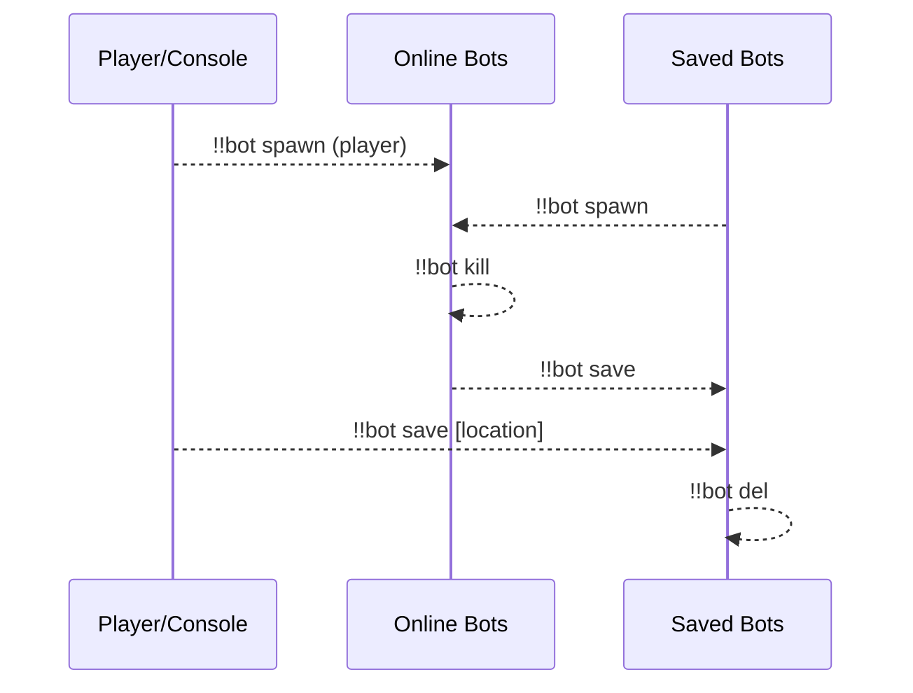
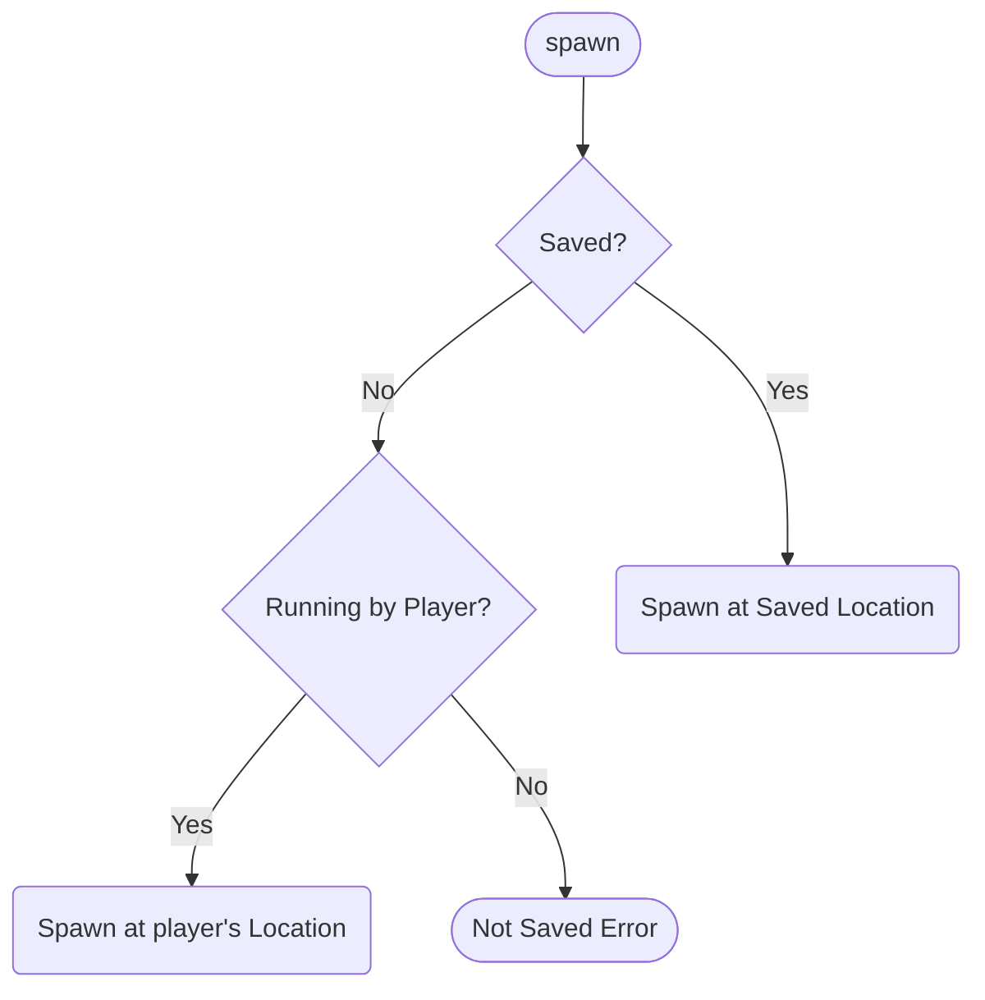
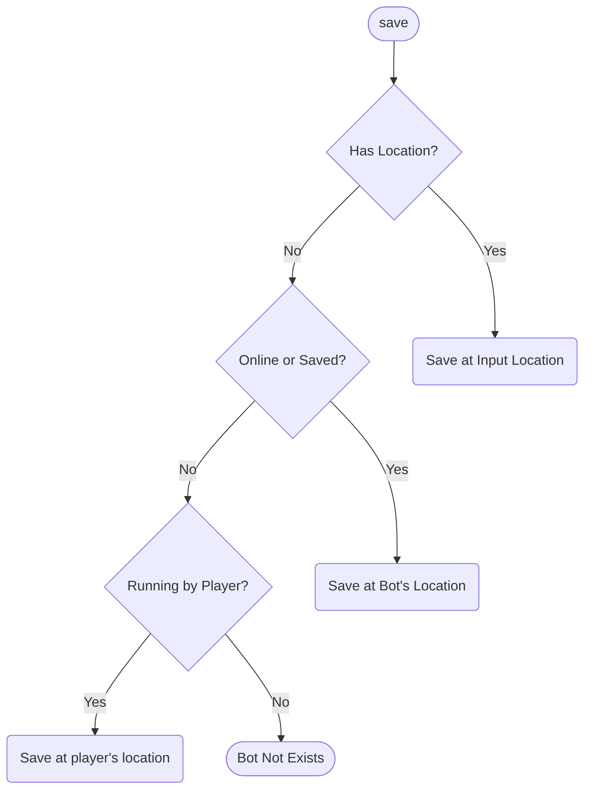
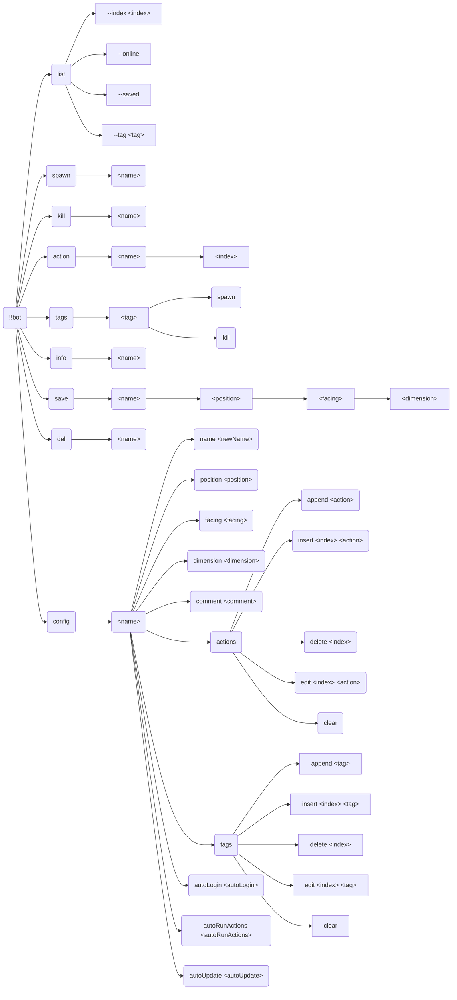

[English](readme.md) | **中文**

\>\>\> [回到索引](/readme-zh_cn.md)

## bot

### 基本信息

- 插件 ID: `bot`
- 插件名: Bot
- 版本: 1.3.1
  - 元数据版本: 1.3.1
  - 发布版本: 1.3.1
- 总下载量: 7295
- 作者: [Andy Zhang](https://github.com/AnzhiZhang)
- 仓库: https://github.com/AnzhiZhang/MCDReforgedPlugins
- 仓库插件页: https://github.com/AnzhiZhang/MCDReforgedPlugins/tree/master/src/bot
- 标签: [`工具`](/labels/tool/readme-zh_cn.md), [`管理`](/labels/management/readme-zh_cn.md)
- 描述: 最好用的地毯模组假人管理器！

### 插件依赖

| 插件 ID | 依赖需求 |
| --- | --- |
| [mcdreforged](https://github.com/Fallen-Breath/MCDReforged) | ^2.6.0 |
| [minecraft_data_api](/plugins/minecraft_data_api/readme-zh_cn.md) | ^1.4.1 |
| [more_command_nodes](/plugins/more_command_nodes/readme-zh_cn.md) | ^1.1.0 |

### 包依赖

| Python 包 | 依赖需求 |
| --- | --- |

### 介绍

# Bot

[English](https://github.com/AnzhiZhang/MCDReforgedPlugins/tree/master/src/bot/readme.md)

> 最好用的地毯模组假人管理器！

## 依赖

- [MinecraftDataAPI](https://github.com/MCDReforged/MinecraftDataAPI)
- [MoreCommandNodes](https://github.com/AnzhiZhang/MCDReforgedPlugins/tree/master/src/bot/../more_command_nodes)

## 使用方法

`!!bot` 查看帮助

`!!bot list [--index <index>] [filters]` 显示假人列表

`!!bot spawn <name>` 上线假人

`!!bot kill <name>` 下线假人

`!!bot action <name> [index]` 执行假人动作

`!!bot tags` 查看可用标签

`!!bot tags <tag> spawn/kill` 上线/下线带有标签的假人

`!!bot info <name>` 查看假人信息

`!!bot save <name> [position] [facing] [dimension]` 保存假人

`!!bot del <name>` 删除保存的假人

`!!bot config <name> <option> <value>` 配置假人

### 工作流



### list

**--index \<index\>**：页码，例如 `--index 1`，默认为 0

**--online**：显示在线假人

**--saved**：显示保存的假人

**--tag \<tag\>**：按标签过滤

### spawn

上线假人



### kill

下线假人

### action

执行假人动作

当指定 `index` 时，执行特定动作而不是全部动作

### tags

查看可用标签和上线/下线带有标签的假人

`!!bot tags` 查看可用标签

`!!bot tags <tag> spawn` 上线带有标签的假人

`!!bot tags <tag> kill` 下线带有标签的假人

### info

查看假人信息

### save

保存假人



### del

删除保存的假人

删除后会备份假人到数据目录中的 `botBin.json` 文件。如果发生误删，可以用于手动恢复。

### config

配置假人

### 完整指令树



## 配置

### gamemode

默认值: `survival`

生成假人的游戏模式

### force_gamemode

默认值: `false`

是否强制所有假人使用 `gamemode` 配置的游戏模式，如果为 `false`，只有已保存的假人会使用 `gamemode` 配置的游戏模式。

### name_prefix

默认值: `bot_`

假人名称前缀

### name_suffix

默认值: 无

假人名称后缀

### post_join_delay

默认值: `0`

假人上线后延迟处理的时间（秒），如果您使用非原版服务端，可能需要调整该值。

### permissions

使用对应指令的最低权限

## FastAPI MCDR

该插件支持 [FastAPI MCDR](https://github.com/AnzhiZhang/MCDReforgedPlugins/tree/master/src/bot/../fastapi_mcdr) 插件（>=2.0.0），当安装 FastAPI MCDR 插件后，该插件会自动注册端点，您可以通过 FastAPI 查看接口定义。

Python 包要求：

```text
pydantic>=2.0
```

您可以利用该功能实现外部控制，例如一个管理假人的网页：


### 下载

> [!IMPORTANT]
> 使用插件之前，先阅读仓库中的 README。

| 文件 | 版本 | 上传时间 (UTC) | 大小 | 下载数 | 操作 |
| --- | --- | --- | --- | --- | --- |
| [Bot-v1.3.1.mcdr](https://github.com/AnzhiZhang/MCDReforgedPlugins/releases/tag/bot-v1.3.1) | 1.3.1 | 2025/02/07 13:37:20 | 18.03KB | 1586 | [下载](https://github.com/AnzhiZhang/MCDReforgedPlugins/releases/download/bot-v1.3.1/Bot-v1.3.1.mcdr) |
| [Bot-v1.3.0.mcdr](https://github.com/AnzhiZhang/MCDReforgedPlugins/releases/tag/bot-v1.3.0) | 1.3.0 | 2024/12/20 22:08:12 | 18.03KB | 384 | [下载](https://github.com/AnzhiZhang/MCDReforgedPlugins/releases/download/bot-v1.3.0/Bot-v1.3.0.mcdr) |
| [Bot-v1.2.4.mcdr](https://github.com/AnzhiZhang/MCDReforgedPlugins/releases/tag/bot-v1.2.4) | 1.2.4 | 2024/09/15 01:24:41 | 17.87KB | 477 | [下载](https://github.com/AnzhiZhang/MCDReforgedPlugins/releases/download/bot-v1.2.4/Bot-v1.2.4.mcdr) |
| [Bot-v1.2.3.mcdr](https://github.com/AnzhiZhang/MCDReforgedPlugins/releases/tag/bot-v1.2.3) | 1.2.3 | 2024/08/28 23:51:55 | 17.88KB | 142 | [下载](https://github.com/AnzhiZhang/MCDReforgedPlugins/releases/download/bot-v1.2.3/Bot-v1.2.3.mcdr) |
| [Bot-v1.2.2.mcdr](https://github.com/AnzhiZhang/MCDReforgedPlugins/releases/tag/bot-v1.2.2) | 1.2.2 | 2024/08/27 17:06:16 | 17.83KB | 58 | [下载](https://github.com/AnzhiZhang/MCDReforgedPlugins/releases/download/bot-v1.2.2/Bot-v1.2.2.mcdr) |
| [Bot-v1.2.1.mcdr](https://github.com/AnzhiZhang/MCDReforgedPlugins/releases/tag/bot-v1.2.1) | 1.2.1 | 2024/08/27 16:08:07 | 17.82KB | 43 | [下载](https://github.com/AnzhiZhang/MCDReforgedPlugins/releases/download/bot-v1.2.1/Bot-v1.2.1.mcdr) |
| [Bot-v1.2.0.mcdr](https://github.com/AnzhiZhang/MCDReforgedPlugins/releases/tag/bot-v1.2.0) | 1.2.0 | 2024/08/26 12:49:12 | 17.64KB | 50 | [下载](https://github.com/AnzhiZhang/MCDReforgedPlugins/releases/download/bot-v1.2.0/Bot-v1.2.0.mcdr) |
| [Bot-v1.1.5.mcdr](https://github.com/AnzhiZhang/MCDReforgedPlugins/releases/tag/bot-v1.1.5) | 1.1.5 | 2024/07/01 14:40:45 | 17.13KB | 528 | [下载](https://github.com/AnzhiZhang/MCDReforgedPlugins/releases/download/bot-v1.1.5/Bot-v1.1.5.mcdr) |
| [Bot-v1.1.4.mcdr](https://github.com/AnzhiZhang/MCDReforgedPlugins/releases/tag/bot-v1.1.4) | 1.1.4 | 2024/03/15 14:08:24 | 17.14KB | 452 | [下载](https://github.com/AnzhiZhang/MCDReforgedPlugins/releases/download/bot-v1.1.4/Bot-v1.1.4.mcdr) |
| [Bot-v1.1.3.mcdr](https://github.com/AnzhiZhang/MCDReforgedPlugins/releases/tag/bot-v1.1.3) | 1.1.3 | 2024/02/27 15:11:25 | 17.14KB | 162 | [下载](https://github.com/AnzhiZhang/MCDReforgedPlugins/releases/download/bot-v1.1.3/Bot-v1.1.3.mcdr) |
| [Bot-v1.1.2.mcdr](https://github.com/AnzhiZhang/MCDReforgedPlugins/releases/tag/bot-v1.1.2) | 1.1.2 | 2024/01/15 10:46:23 | 16.84KB | 255 | [下载](https://github.com/AnzhiZhang/MCDReforgedPlugins/releases/download/bot-v1.1.2/Bot-v1.1.2.mcdr) |
| [Bot-v1.1.1.mcdr](https://github.com/AnzhiZhang/MCDReforgedPlugins/releases/tag/bot-v1.1.1) | 1.1.1 | 2023/12/31 10:51:38 | 16.77KB | 122 | [下载](https://github.com/AnzhiZhang/MCDReforgedPlugins/releases/download/bot-v1.1.1/Bot-v1.1.1.mcdr) |
| [Bot-v1.1.0.mcdr](https://github.com/AnzhiZhang/MCDReforgedPlugins/releases/tag/bot-v1.1.0) | 1.1.0 | 2023/12/21 22:10:07 | 16.75KB | 131 | [下载](https://github.com/AnzhiZhang/MCDReforgedPlugins/releases/download/bot-v1.1.0/Bot-v1.1.0.mcdr) |
| [Bot-v1.0.6.mcdr](https://github.com/AnzhiZhang/MCDReforgedPlugins/releases/tag/bot-v1.0.6) | 1.0.6 | 2023/01/19 16:58:58 | 13.6KB | 1603 | [下载](https://github.com/AnzhiZhang/MCDReforgedPlugins/releases/download/bot-v1.0.6/Bot-v1.0.6.mcdr) |
| [Bot-v1.0.5.mcdr](https://github.com/AnzhiZhang/MCDReforgedPlugins/releases/tag/bot-v1.0.5) | 1.0.5 | 2022/12/29 15:19:31 | 13.55KB | 255 | [下载](https://github.com/AnzhiZhang/MCDReforgedPlugins/releases/download/bot-v1.0.5/Bot-v1.0.5.mcdr) |
| [Bot-v1.0.4.mcdr](https://github.com/AnzhiZhang/MCDReforgedPlugins/releases/tag/bot-v1.0.4) | 1.0.4 | 2022/12/29 14:53:06 | 13.55KB | 119 | [下载](https://github.com/AnzhiZhang/MCDReforgedPlugins/releases/download/bot-v1.0.4/Bot-v1.0.4.mcdr) |
| [Bot-v1.0.3.mcdr](https://github.com/AnzhiZhang/MCDReforgedPlugins/releases/tag/bot-v1.0.3) | 1.0.3 | 2022/12/29 15:14:20 | 13.11KB | 112 | [下载](https://github.com/AnzhiZhang/MCDReforgedPlugins/releases/download/bot-v1.0.3/Bot-v1.0.3.mcdr) |
| [Bot-v1.0.2.mcdr](https://github.com/AnzhiZhang/MCDReforgedPlugins/releases/tag/bot-v1.0.2) | 1.0.2 | 2022/07/22 02:16:19 | 13.06KB | 381 | [下载](https://github.com/AnzhiZhang/MCDReforgedPlugins/releases/download/bot-v1.0.2/Bot-v1.0.2.mcdr) |
| [Bot-v1.0.1.mcdr](https://github.com/AnzhiZhang/MCDReforgedPlugins/releases/tag/bot-v1.0.1) | 1.0.1 | 2022/07/21 05:06:17 | 13.06KB | 126 | [下载](https://github.com/AnzhiZhang/MCDReforgedPlugins/releases/download/bot-v1.0.1/Bot-v1.0.1.mcdr) |
| [Bot-v1.0.0.mcdr](https://github.com/AnzhiZhang/MCDReforgedPlugins/releases/tag/bot-v1.0.0) | 1.0.0 | 2022/07/21 03:53:18 | 13.05KB | 129 | [下载](https://github.com/AnzhiZhang/MCDReforgedPlugins/releases/download/bot-v1.0.0/Bot-v1.0.0.mcdr) |
| [Bot-v0.1.0.mcdr](https://github.com/AnzhiZhang/MCDReforgedPlugins/releases/tag/bot-v0.1.0) | 0.1.0 | 2022/06/30 12:10:23 | 1.97KB | 180 | [下载](https://github.com/AnzhiZhang/MCDReforgedPlugins/releases/download/bot-v0.1.0/Bot-v0.1.0.mcdr) |

