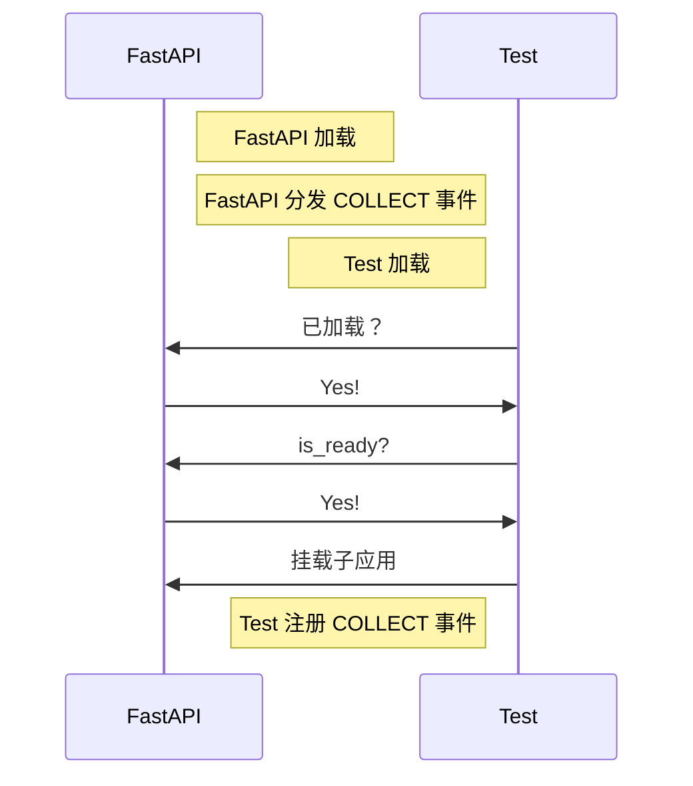
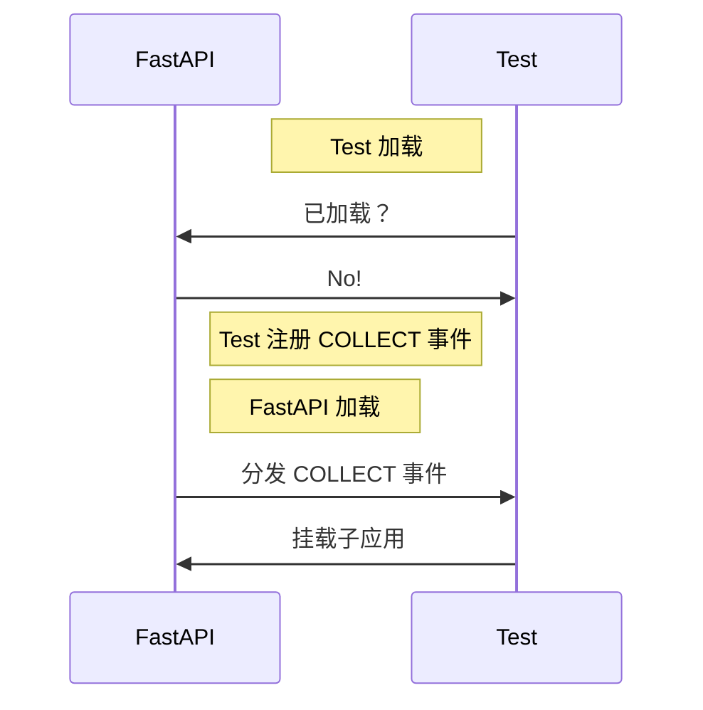
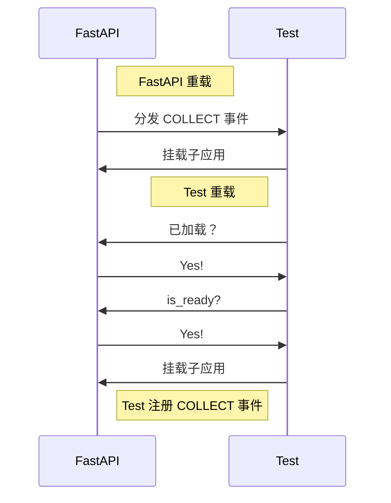

[English](readme.md) | **中文**

\>\>\> [回到索引](/readme-zh_cn.md)

## fastapi_mcdr

### 基本信息

- 插件 ID: `fastapi_mcdr`
- 插件名: FastAPI MCDR
- 版本: 2.0.0
  - 元数据版本: 2.0.0
  - 发布版本: 2.0.0
- 总下载量: 300
- 作者: [Andy Zhang](https://github.com/AnzhiZhang)
- 仓库: https://github.com/AnzhiZhang/MCDReforgedPlugins
- 仓库插件页: https://github.com/AnzhiZhang/MCDReforgedPlugins/tree/master/src/fastapi_mcdr
- 标签: [`API`](/labels/api/readme-zh_cn.md)
- 描述: 提供 HTTP API。

### 插件依赖

| 插件 ID | 依赖需求 |
| --- | --- |

### 包依赖

| Python 包 | 依赖需求 |
| --- | --- |
| [fastapi](https://pypi.org/project/fastapi) |  |
| [uvicorn](https://pypi.org/project/uvicorn) |  |

```
pip install fastapi uvicorn
```

### 介绍

# FastAPI

[English](https://github.com/AnzhiZhang/MCDReforgedPlugins/tree/master/src/fastapi_mcdr/readme.md)

> 提供 HTTP API。
> 
> 允许插件通过挂载 [子应用](https://fastapi.tiangolo.com/zh/advanced/sub-applications/) 的方式，提供统一的接口。

## 快速开始

总地来说，您需要在您的插件中做两件事：

1. 加载时检查 FastAPI 状态，如已准备好，则直接挂载子应用。
2. 注册 COLLECT 事件的监听器，以便准备好时挂载子应用。

具体地说，您需要添加以下代码：

```python
from fastapi import FastAPI

app = FastAPI()


@app.get("/test")
async def test():
    return "Hello, world!"


def on_load(server, prev_module):
    # mount if fastapi_mcdr is ready
    fastapi_mcdr = server.get_plugin_instance('fastapi_mcdr')
    if fastapi_mcdr is not None and fastapi_mcdr.is_ready():
        mount_app(server)

    # register event listener
    server.register_event_listener(
        fastapi_mcdr.COLLECT_EVENT,
        mount_app
    )


def on_unload(server):
    # save plugin id and fastapi_mcdr instance
    id_ = server.get_self_metadata().id
    fastapi_mcdr = server.get_plugin_instance('fastapi_mcdr')

    # unmount app
    fastapi_mcdr.unmount(id_)


def mount_app(server):
    # save plugin id and fastapi_mcdr instance
    id_ = server.get_self_metadata().id
    fastapi_mcdr = server.get_plugin_instance('fastapi_mcdr')

    # mount app
    fastapi_mcdr.mount(id_, app)
```

访问 <http://localhost:8080/docs> 即可查看 API 文档，各插件的子应用文档则需要访问 <http://localhost:8080/plugin_id/docs>。

## 技术细节

### 加载

理论上来说，对外提供 HTTP API 应当是一种可选功能，这便是需要检查 FastAPI 状态并同时注册 COLLECT 事件监听器的原因。下图展示了 FastAPI 插件和自定义插件先后加载的流程图：

先加载 FastAPI，再加载自定义插件：



先加载自定义插件，再加载 FastAPI：



通过这个设计，即可实现插件的软依赖，且无需考虑插件加载顺序的问题。下图展示了任意插件重载的情况：



## 标准

### COLLECT 事件

事件名：`fastapi_mcdr.collect`

该事件的 `PluginEvent` 实例也会以 `COLLECT_EVENT` 名公开。

### 公开函数

#### is_ready

插件准备好接受挂载的状态，如强行挂载则会抛出一个 `RuntimeError`。

#### mount

参数：

- `plugin_id`：插件 id。
- `app`：FastAPI 应用。

子应用会挂载在 `/<plugin_id>` 路径下，文档可以通过访问 `/<plugin_id>/docs` 查看。

参阅：[子应用 - 挂载](https://fastapi.tiangolo.com/zh/advanced/sub-applications/)

#### unmount

参数：

- `plugin_id`：插件 id。

卸载指定插件的子应用。

### 下载

> [!IMPORTANT]
> 使用插件之前，先阅读仓库中的 README。

| 文件 | 版本 | 上传时间 (UTC) | 大小 | 下载数 | 操作 |
| --- | --- | --- | --- | --- | --- |
| [FastAPIMCDR-v2.0.0.mcdr](https://github.com/AnzhiZhang/MCDReforgedPlugins/releases/tag/fastapi_mcdr-v2.0.0) | 2.0.0 | 2024/09/14 16:12:12 | 1.85KB | 204 | [下载](https://github.com/AnzhiZhang/MCDReforgedPlugins/releases/download/fastapi_mcdr-v2.0.0/FastAPIMCDR-v2.0.0.mcdr) |
| [FastAPIMCDR-v1.0.0.mcdr](https://github.com/AnzhiZhang/MCDReforgedPlugins/releases/tag/fastapi_mcdr-v1.0.0) | 1.0.0 | 2023/12/21 16:38:12 | 2.29KB | 96 | [下载](https://github.com/AnzhiZhang/MCDReforgedPlugins/releases/download/fastapi_mcdr-v1.0.0/FastAPIMCDR-v1.0.0.mcdr) |

