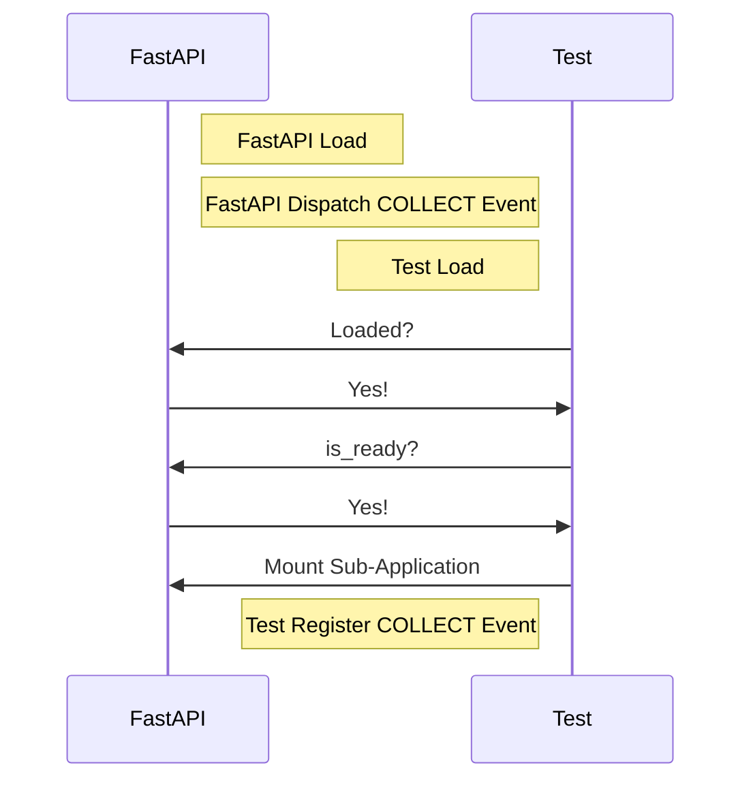
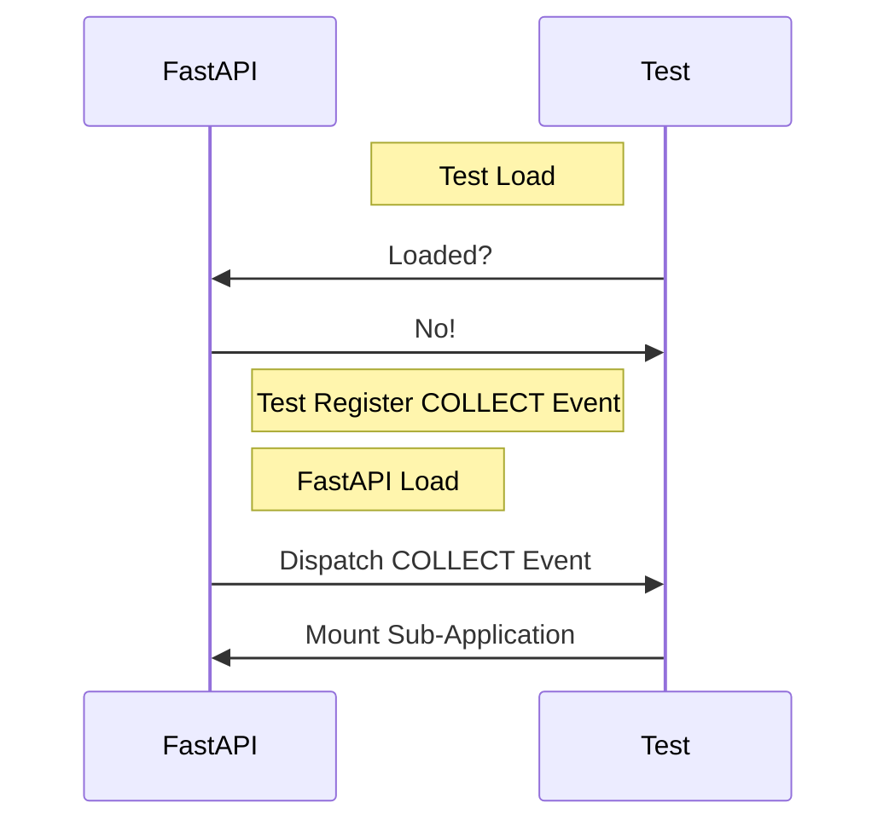
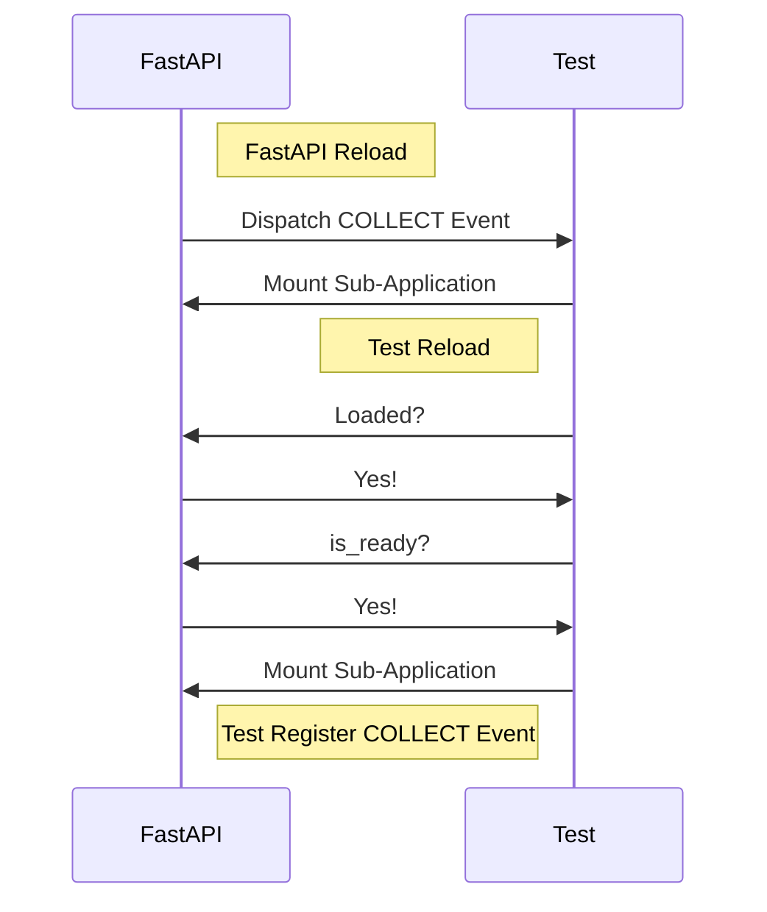

**English** | [中文](readme-zh_cn.md)

\>\>\> [Back to index](/readme.md)

## fastapi_mcdr

### Basic Information

- Plugin ID: `fastapi_mcdr`
- Plugin Name: FastAPI MCDR
- Version: 2.0.0
  - Metadata version: 2.0.0
  - Release version: 2.0.0
- Total downloads: 300
- Authors: [Andy Zhang](https://github.com/AnzhiZhang)
- Repository: https://github.com/AnzhiZhang/MCDReforgedPlugins
- Repository plugin page: https://github.com/AnzhiZhang/MCDReforgedPlugins/tree/master/src/fastapi_mcdr
- Labels: [`API`](/labels/api/readme.md)
- Description: Provides HTTP API.

### Dependencies

| Plugin ID | Requirement |
| --- | --- |

### Requirements

| Python package | Requirement |
| --- | --- |
| [fastapi](https://pypi.org/project/fastapi) |  |
| [uvicorn](https://pypi.org/project/uvicorn) |  |

```
pip install fastapi uvicorn
```

### Introduction

# FastAPI

[简体中文](https://github.com/AnzhiZhang/MCDReforgedPlugins/tree/master/src/fastapi_mcdr/readme_cn.md)

> Provides HTTP API
> 
> Allows plugins to provide a unified interface by mounting [sub-application](https://fastapi.tiangolo.com/advanced/sub-applications/).

## Quick Start

In general, there are two things you need to do in your plugin:

1. Check FastAPI's status when loading. If it's ready, directly mount the sub-application.
2. Register a listener for the COLLECT event to  mount the sub-application when it becomes ready.

Specifically, you need to add the following code:

```python
from fastapi import FastAPI

app = FastAPI()


@app.get("/test")
async def test():
    return "Hello, world!"


def on_load(server, prev_module):
    # mount if fastapi_mcdr is ready
    fastapi_mcdr = server.get_plugin_instance('fastapi_mcdr')
    if fastapi_mcdr is not None and fastapi_mcdr.is_ready():
        mount_app(server)

    # register event listener
    server.register_event_listener(
        fastapi_mcdr.COLLECT_EVENT,
        mount_app
    )


def on_unload(server):
    # save plugin id and fastapi_mcdr instance
    id_ = server.get_self_metadata().id
    fastapi_mcdr = server.get_plugin_instance('fastapi_mcdr')

    # unmount app
    fastapi_mcdr.unmount(id_)


def mount_app(server):
    # save plugin id and fastapi_mcdr instance
    id_ = server.get_self_metadata().id
    fastapi_mcdr = server.get_plugin_instance('fastapi_mcdr')

    # mount app
    fastapi_mcdr.mount(id_, app)
```

Visit <http://localhost:8080/docs> to view the API documentation, and visit <http://localhost:8080/plugin_id/docs> to view the sub application documentation for each plugin.

## Technical Details

### Loading

In theory, providing an HTTP API externally should be an optional feature. That's why checking FastAPI's status and registering an COLLECT event listener are necessary. The following diagram illustrates the process of loading FastAPI and custom plugins:

Load FastAPI first, then load custom plugins:



Load custom plugins first, then load FastAPI:



With this design, you can achieve soft plugin dependency without worrying about the order of plugin loading. The following diagram shows the scenario of any plugin being reloaded:



## Standards

### COLLECT Event

Event name: `fastapi_mcdr.collect`

An instance of `PluginEvent` for this event is also exposed as `COLLECT_EVENT`.

### Public Functions

#### is_ready

The plugin's status if ready to mount. If forcefully mounted, it will raise a `RuntimeError`.

#### mount

Arguments:

- `plugin_id`: Plugin ID.
- `app`: FastAPI App.

The sub-application will be mounted at the `/<plugin_id>` path, and the documentation can be viewed by visiting `/<plugin_id>/docs`.

See: [Sub Applications - Mounts](https://fastapi.tiangolo.com/advanced/sub-applications/)

#### unmount

Arguments:

- `plugin_id`: Plugin ID.

Unmount the sub-application of the specified plugin.

### Download

> [!IMPORTANT]
> Read the README file in plugin repository before using it.

| File | Version | Upload Time (UTC) | Size | Downloads | Operations |
| --- | --- | --- | --- | --- | --- |
| [FastAPIMCDR-v2.0.0.mcdr](https://github.com/AnzhiZhang/MCDReforgedPlugins/releases/tag/fastapi_mcdr-v2.0.0) | 2.0.0 | 2024/09/14 16:12:12 | 1.85KB | 204 | [Download](https://github.com/AnzhiZhang/MCDReforgedPlugins/releases/download/fastapi_mcdr-v2.0.0/FastAPIMCDR-v2.0.0.mcdr) |
| [FastAPIMCDR-v1.0.0.mcdr](https://github.com/AnzhiZhang/MCDReforgedPlugins/releases/tag/fastapi_mcdr-v1.0.0) | 1.0.0 | 2023/12/21 16:38:12 | 2.29KB | 96 | [Download](https://github.com/AnzhiZhang/MCDReforgedPlugins/releases/download/fastapi_mcdr-v1.0.0/FastAPIMCDR-v1.0.0.mcdr) |

