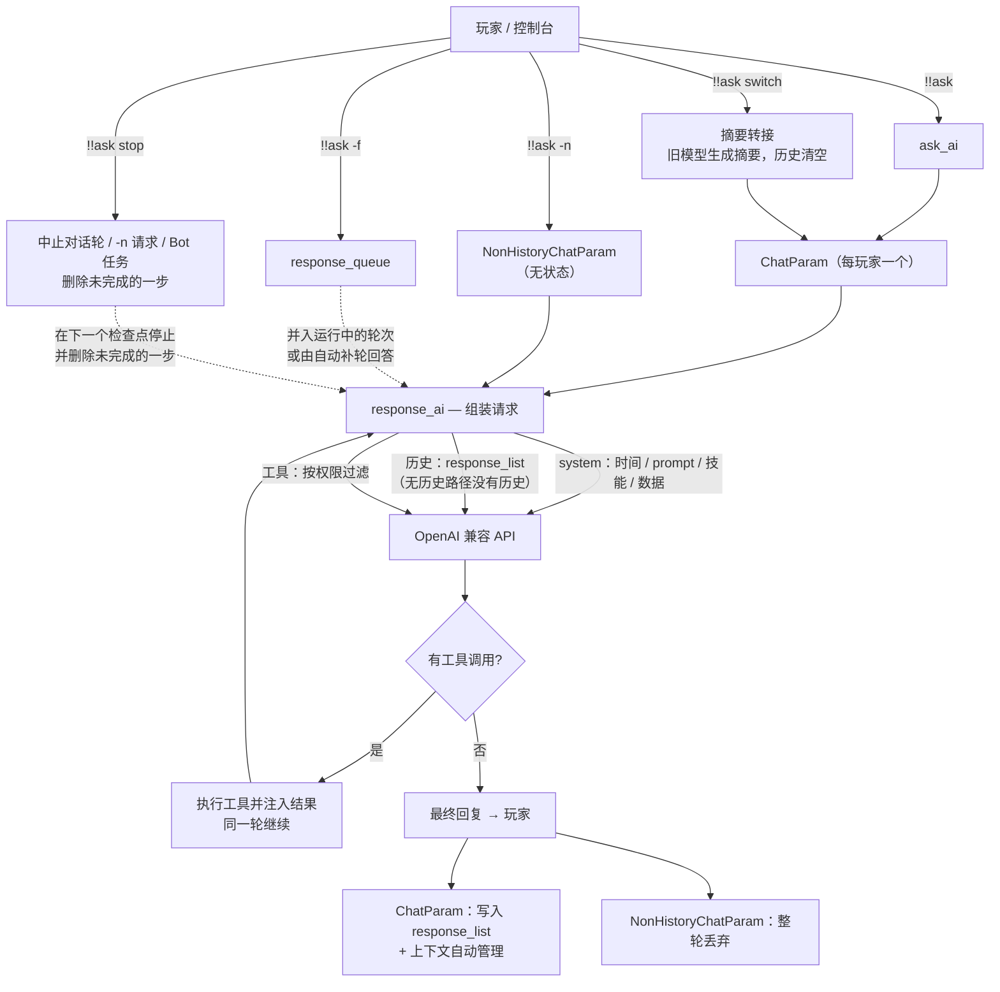
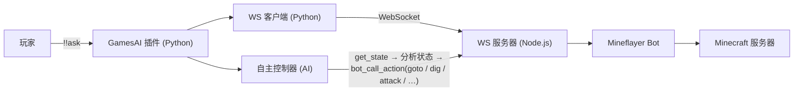

[English](readme.md) | **中文**

\>\>\> [回到索引](/readme-zh_cn.md)

## games_ai

### 基本信息

- 插件 ID: `games_ai`
- 插件名: GamesAI
- 版本: 0.7.1
  - 元数据版本: 0.7.1
  - 发布版本: 0.7.1
- 总下载量: 1224
- 作者: [yello](https://github.com/PengZixuan30)
- 仓库: https://github.com/PengZixuan30/Games_AI
- 仓库插件页: https://github.com/PengZixuan30/Games_AI/tree/main
- 标签: [`工具`](/labels/tool/readme-zh_cn.md)
- 描述: 此插件可以让你在游戏中使用AI

### 插件依赖

| 插件 ID | 依赖需求 |
| --- | --- |
| [mcdreforged](https://github.com/Fallen-Breath/MCDReforged) | \>=2.15.0 |

### 包依赖

| Python 包 | 依赖需求 |
| --- | --- |
| [openai](https://pypi.org/project/openai) |  |
| [requests](https://pypi.org/project/requests) |  |
| [websockets](https://pypi.org/project/websockets) |  |

```
pip install openai requests websockets
```

### 介绍

<div align="center">

# GamesAI for MCDReforged

[English](https://github.com/PengZixuan30/Games_AI/tree/main//README.md)  |  简体中文  |  [繁體中文](https://github.com/PengZixuan30/Games_AI/tree/main//README.zh-TW.md)

[反馈问题](https://github.com/PengZixuan30/Games_AI/issues/new)  |  [反馈想法](https://github.com/PengZixuan30/Games_AI/discussions/new/choose)  |  [加入Q群](https://qm.qq.com/q/jDQQaUPNmw)

[转至Fabric版本](https://github.com/PengZixuan30/GamesAI)

</div>

> [!NOTE]
> **GamesAI 插件/模组 QQ 交流群：849544707** — 欢迎加入交流群讨论问题、反馈建议，以及分享 prompt、skills、tools 等配置！

> [!NOTE]
> 欢迎使用版本 0.7.1！本次更新带来了**上下文自动管理**：固定的 `max_history` 配置已移除，插件会自动解析各模型的上下文窗口、从服务商返回的 `usage` 获取真实用量，并且只在上下文确实过大时才压缩对话（较早的轮次会转为摘要）。详见[本次更新](#本次更新)。

> [!NOTE]
> **切换模型现在采用"摘要转接"**（[#20](https://github.com/PengZixuan30/Games_AI/issues/20) 社区投票的方案 B1，已在 v0.7.1 实现）：`!!ask switch <model>` 会先让**旧模型**把当前对话压缩成一段中性事实摘要，清空原历史，再把摘要交给新模型。详见[切换模型时的摘要转接](#切换模型时的摘要转接)。

<details>
<summary>目录(点击展示)</summary>

- [GamesAI for MCDReforged](#gamesai-for-mcdreforged)
  - [安装](#安装)
  - [使用](#使用)
  - [AI 请求链路与对话机制](#ai-请求链路与对话机制)
    - [请求链路](#请求链路)
    - [无历史路径(`!!ask -n`)](#无历史路径ask--n)
    - [上下文自动管理](#上下文自动管理)
    - [每玩家状态](#每玩家状态)
    - [切换模型时的摘要转接](#切换模型时的摘要转接)
    - [停止正在进行的对话](#停止正在进行的对话)
  - [使用 Mineflayer Bot](#使用-mineflayer-bot)
    - [环境要求](#环境要求)
    - [指令](#指令)
    - [工作原理](#工作原理)
    - [支持的操作](#支持的操作)
    - [Bot 控制 AI 工具](#bot-控制-ai-工具)
    - [配置](#配置)
  - [配置](#配置-1)
    - [1.prefix](#1prefix)
    - [2.permission](#2permission)
    - [3.all\_ai](#3all_ai)
    - [4.default\_ai](#4default_ai)
    - [5.mineflayer\_bot](#5mineflayer_bot)
  - [工具与Skills](#工具与skills)
    - [内置工具](#内置工具)
    - [在配置文件中自定义工具](#在配置文件中自定义工具)
    - [在自己的MCDR插件中自定义工具](#在自己的mcdr插件中自定义工具)
    - [内置Skills](#内置skills)
    - [在配置文件中添加Skills](#在配置文件中添加skills)
    - [在自己的MCDR插件中注册Skills](#在自己的mcdr插件中注册skills)
  - [热重载](#热重载)
    - [触发热重载](#触发热重载)
    - [重载期间发生了什么](#重载期间发生了什么)
    - [让自己的 MCDR 插件跟随 GamesAI 热重载](#让自己的-mcdr-插件跟随-gamesai-热重载)
      - [方式一：使用 `register_self()` 自动重载（推荐）](#方式一使用-register_self-自动重载推荐)
      - [方式二：通过监听事件响应热重载](#方式二通过监听事件响应热重载)
    - [两种方式对比](#两种方式对比)
  - [故障排查](#故障排查)
    - [`!!ask` 错误](#ask-错误)
    - [Mineflayer Bot 错误](#mineflayer-bot-错误)
    - [日志与调试](#日志与调试)
  - [本次更新](#本次更新)
    - [Version 0.7.1](#version-071)
      - [🎯 核心亮点](#-核心亮点)
      - [1. 上下文自动管理](#1-上下文自动管理)
      - [2. 切换模型时的摘要转接](#2-切换模型时的摘要转接)
      - [3. `!!ask -n` 的无状态路径](#3-ask--n-的无状态路径)
      - [4. 配置与行为变更](#4-配置与行为变更)
      - [5. 其他改进](#5-其他改进)
    - [Version 0.7.0](#version-070)
      - [🎯 核心亮点](#-核心亮点-1)
      - [1. ChatParam:每玩家一个对话对象](#1-chatparam每玩家一个对话对象)
      - [2. 完整请求链路](#2-完整请求链路)
      - [3. 其他改进与修复](#3-其他改进与修复)
  - [AI 在本项目中的角色](#ai-在本项目中的角色)
  - [鸣谢与声明](#鸣谢与声明)
  - [赞助与贡献者名单](#赞助与贡献者名单)
  - [许可证](#许可证)

</details>

## 安装

在MCDR控制台中使用如下命令以安装插件

`!!MCDR plugin install games_ai`

---

或者在[MCDR插件仓库](https://mcdreforged.com/plugin/games_ai)中获取并安装到你的插件目录内

如果选择手动安装，请先安装Python包OpenAI、requests和websockets，使用如下命令安装
```bash
pip install openai requests websockets
```

## 使用

在任何地方输入命令`!!gamesai`以显示这个插件的所有功能

| 指令                                   | 用途                                      |
| ------------------------------------ | --------------------------------------- |
| `!!gamesai clear`                    | 清除玩家的历史聊天记录，历史聊天记录与公共数据库无关              |
| `!!gamesai clearall`                 | 清除所有玩家的历史聊天记录，历史聊天记录与公共数据库无关            |
| `!!gamesai reload`                   | 重新加载插件配置文件。详见[热重载](#热重载)                |
| `!!gamesai check`                    | 检查插件更新，并强制刷新上下文窗口表                      |
| `!!gamesai speedtest [model]`        | 测试 API 服务器连接延迟，不指定模型时测试全部               |
| `!!gamesai config get <key>`         | 读取一个配置项的值。                              |
| `!!gamesai config set <key> <value>` | 修改一个配置项的值（自动适配旧值类型，修改后自动触发[热重载](#热重载)）。 |

---

你也可以直接输入`!!ask`向AI提问或者聊天或者帮你做一些事情

| 指令                     | 用途                                                                                                                              |
| ---------------------- | ------------------------------------------------------------------------------------------------------------------------------- |
| `!!ask <content>`      | 向AI提问或者聊天或者帮你做一些事情，content为你想让AI做的事情或者你想问AI的问题                                                                                  |
| `!!ask -n <content>`   | 向AI提问但不使用历史记录（当前对话仍会被保存）                                                                                                        |
| `!!ask -f <content>`   | 强制提问：不等待当前轮结束，将消息并入正在运行的对话轮（别名 `-forced`）。详见[AI 请求链路与对话机制](#ai-请求链路与对话机制)。                                                      |
| `!!ask switch <model>` | 切换当前对话使用的 AI 模型，model为AI_ID或昵称。切换时清空历史，并在你下次提问前由旧模型压缩为摘要转接给新模型，详见[切换模型时的摘要转接](#切换模型时的摘要转接)。                                     |
| `!!ask stop`           | 立即停止你名下所有正在进行的对话：运行中的对话轮（含工具调用）、正在进行的 `!!ask -n` 提问、以及你委派给 Bot 的任务。未完成的一步会从历史中删除，`!!ask -f` 排队消息会被丢弃。详见[停止正在进行的对话](#停止正在进行的对话)。 |

---

输入`!!data`获取有关数据库指令的信息

> [!TIP]
> 更新到0.3.0及以上版本时会自动添加数据库

| 指令                           | 用途                                      |
| ---------------------------- | --------------------------------------- |
| `!!data write <key> <value>` | 在公共数据库内添加一条数据，其中key不能包含空格，value可以是任意字符串 |
| `!!data add <key> <value>`   | 将value追加到公共数据库中的key中，不存在时自动创建新key       |
| `!!data del <key>`           | 在公共数据库内删除一条数据，无论key是否存在                 |
| `!!data read <key>`          | 读取公共数据库中key对应的value                     |
| `!!data list`                | 读取公共数据库中的所有内容                           |
| `!!data list keys`           | 读取公共数据库中的所有key                          |

---

## AI 请求链路与对话机制

本小节说明从你输入 `!!ask` 到 AI 回复之间发生了什么,以及对话在插件内部是如何管理的。

### 请求链路

1. 执行 `!!ask <content>`(或 `!!ask -n <content>` / `!!ask -f <content>`)。
2. 插件解析你的用户名,构建带 `用户名:` / `消息:` 标签的用户消息(语言随当前语言环境)。
3. 你的**单玩家 `ChatParam` 对象**(见 `games_ai/chat_param.py`)按需惰性创建,使用 `all_ai` / `default_ai` 配置的模型。`!!ask -n` 则改用一次性的 `NonHistoryChatParam`,见[无历史路径](#无历史路径ask--n)。
4. 每一轮,`response_ai` 组装请求:
   - system 消息:当前时间、该模型的 prompt、技能列表(内置 + `skills.json` + 外部插件注册)、公共数据列表;
   - 对话历史(无历史路径不保留任何历史);
   - 按你的权限等级过滤后的工具列表。
5. 通过 `openai_api.response_chat` 与 OpenAI 兼容 API 通讯:有历史的对象每个 AI 配置持有一个客户端,无历史路径则按 `base_url` + API Key 复用客户端。
6. 若 AI 调用了工具,插件执行之、注入结果,并**在同一轮内继续**,直到 AI 给出最终文本回复。
7. 回复带上 AI 名称前缀发送给你,并写入历史;随后上下文会被自动管理(见[上下文自动管理](#上下文自动管理))。



### 无历史路径(`!!ask -n`)

`!!ask -n <content>` 回答一次提问,不留任何东西。它由 `NonHistoryChatParam` 处理 —— 这是 `games_ai/chat_param.py` 中一个自包含的类,与有历史的对象**不共享任何助手函数、属性或生命周期**。

**它没有的东西:**对话历史(`response_list`)、强制请求队列、轮次生命周期事件、工具计数、上下文管理(token 估算、用量校准、历史压缩与摘要请求),以及任何每玩家状态 —— 不会写入 `all_chat_param`,回答发出后对象即被丢弃。

**与常规路径仍然一致的部分:**

- 相同的 system 消息(时间、prompt、技能列表、公共数据),以及按你权限等级过滤的同一套工具;
- 工具调用仍会被执行并回注,**在同一轮内**继续,直到 AI 给出最终文本回复;
- 相同的回复格式与相同的错误上报(HTTP 状态码映射 + 服务商 Request ID)。

**两点值得知道的差异:**

- **单轮超窗保险** —— 没有历史可压缩,所以请求在发出前只做一次整体测量:若超过模型窗口的 **80%**,则把最新一条消息截断到剩余空间(单轮几乎不可能超窗,但超大工具结果有可能)。完整的[上下文自动管理](#上下文自动管理)只作用于有历史的路径。
- **共享 HTTP 客户端** —— 客户端按 `base_url` + API Key 缓存(最多 8 个),因此连续 `-n` 不必反复重建连接池、重复 TLS 握手。服务商返回的 `usage` 会被读取但不使用:没有历史就没有可校准的对象。

### 上下文自动管理

GamesAI 不再使用固定的 `max_history` 配置。每次请求都会与模型自身的上下文窗口进行比对,只有在确实需要时才压缩对话。

**窗口的来源**(优先级由高到低):

1. `all_ai` 中该 AI 条目的 `context_window` —— 单模型覆盖;
2. 上下文窗口表:从 [`data/context_windows.json`](https://github.com/PengZixuan30/Games_AI/blob/main/data/context_windows.json) 获取(GitHub Raw,jsDelivr 作为第二源),缓存在 `config/games_ai/cache/context_windows.json`,由启动 / 24 小时更新检查链路刷新 —— 执行 `!!gamesai check` 也会刷新,且无视 24 小时 TTL;
3. 随插件版本内置的兜底表(完全离线可用;由仓库 JSON 同步生成的模块 `games_ai/context_table_data.py`);
4. 未知模型使用保守默认值 `32768` token。

**触发条件**(每次请求**之前**与**之后**都会检查):

- 当前上下文达到窗口的 **80%**,或
- 单次请求达到窗口的 **20%**(例如一次读取日志产生的超大工具结果)。

**触发后会发生什么:**

- 最近的 **10 轮**对话始终原样保留(1 轮 = 一条用户消息及其后续 assistant/tool 消息);
- 更早的轮次被替换为一条中性、事实性的**摘要**(用当前模型生成,且不携带工具)。摘要不会模仿此前回复的风格,已有摘要会并入新摘要;
- 若仍然过大,或摘要失败,则先截断超长消息、再丢弃最旧的轮次作为最后的保险 —— 保证下一次请求一定能装得下。

真实输入量取自服务商返回的 `usage` 字段(`prompt_tokens` / `total_tokens`),本地估算会按 `base_url|model` 与之校准,几轮内即可收敛到真实数值。

执行 `!!gamesai debug` 可在 MCDR 控制台看到窗口、用量、校准系数与每一次压缩过程。

### 每玩家状态

- `all_chat_param` 为每个玩家在内存中保留一个 `ChatParam`;`!!gamesai clear` / `!!gamesai clearall` 会删除它们。
- `ChatParam` 拥有:
  - `response_list` — 对话历史;
  - `system_message` — 每轮重建(时间、prompt、技能、数据);
  - `response_queue` — `!!ask -f` 等待合并的消息队列;
  - `is_stopped` — 轮次生命周期事件(用于串行化每个玩家的轮次)。
- **`!!ask -n` 不保留任何状态**:它由 `NonHistoryChatParam` 处理,不会注册进 `all_chat_param`,回答发出后即被丢弃 —— 见[无历史路径](#无历史路径ask--n)。
- **`!!ask switch <model>`** 会为你的 `ChatParam` 重建 AI 客户端,并执行**摘要转接**:切换时立即清空原历史,并由旧模型在你**下次提问前**把这段对话压缩成一段中性事实摘要,作为新会话的第一条 system 消息注入。详见[切换模型时的摘要转接](#切换模型时的摘要转接)。
- **`!!ask -f <content>`** 在轮次仍在运行时将请求入队:运行中的轮次会合并它并继续;若轮次恰好在合并前结束,则由自动补轮回答。
- **`!!gamesai debug`** 会将请求流程日志提升到 INFO 级别显示在 MCDR 控制台(请求开始/结束、强制请求入队/合并、工具调用);未开启时同一批日志走 DEBUG 级别。

> [!NOTE]
> **社区投票结果:** [issue #20](https://github.com/PengZixuan30/Games_AI/issues/20) 的投票已结束,采用**方案 B1(摘要转接)**,已在 v0.7.1 实现 —— 新模型的回复不再被上一个模型的风格带偏,同时对话中的事实被保留下来。

### 切换模型时的摘要转接

`!!ask switch <model>` 不是简单地保留或清空对话,而是把**事实**转接过去(方案 **B1**,即 [#20](https://github.com/PengZixuan30/Games_AI/issues/20) 投票选出的方案)。压缩发生的时机与**自动上下文压缩完全一致** —— 在下一次请求之前,而不是在指令执行时:

1. 指令执行时:等待正在运行的轮次结束 → 保存当前对话与旧模型的快照 → 清空原历史 → 为新模型重建客户端与 system 消息。**不发任何 API 请求**,因此即使对话很长,指令也会立即返回;
2. **你下次提问前**(preflight 阶段,与自动压缩同一位置):由**旧模型**对快照做一次中性、事实性的总结 —— 讨论主题、已确认结论、未完成事项、用户明确提出的要求(复用上下文压缩所用的同一条摘要提示词,不带工具,60 秒超时);
3. 摘要作为**新会话的第一条 system 消息**注入,并附上一句提示:让新模型以自己的设定与风格继续,不要模仿上一个模型;
4. 随后正常回答这次提问(上下文中已包含该摘要)。

| 情形              | 行为                       | 你会看到                     |
| --------------- | ------------------------ | ------------------------ |
| 有历史             | 保存快照、清空历史、安排转接           | "……将在你下次提问前由原模型压缩为摘要转接。" |
| 下次请求前转接成功       | 摘要成为第一条 system 消息,本轮照常进行 | 无额外提示(与自动压缩一样),仅调试日志     |
| 转接失败(超时、报错、空回复) | 丢弃旧对话,本轮仍然回答             | "摘要转接失败:上一段对话已丢弃……"      |
| 下次提问前又切换了一次     | 保留最初的快照,并由当时生效的模型只总结一次   | 同上                       |
| 尚无历史            | 无可转接,永远不发额外请求            | 普通的"已切换"提示               |
| 切换到的就是当前模型      | 什么都不动                    | "你当前使用的已经是……"            |

补充说明:

- 切换前会等待正在运行的轮次结束,不会对写了一半的对话做快照;
- 切换还会重置该对话的工具计数、强制请求队列与用量/校准计数;
- 摘要请求只在你**真正再次提问时**才产生,每次切换最多一次(超时 60 秒)。它不会阻塞指令,也不会让切换失败;转接失败只是让新对话不带旧上下文;
- `!!ask stop` 不会取消已安排的转接:它属于上一段对话,而不属于运行中的轮次;`!!gamesai clear` 会连同对话对象一起清除它;
- `-n` 路径与此无关:只有带历史的路径才做摘要。见[无历史路径](#无历史路径ask--n)。

### 停止正在进行的对话

`!!ask stop` 会立即中止**你自己**名下所有正在进行的内容:

| 正在进行的内容               | 指令行为                                        |
| --------------------- | ------------------------------------------- |
| 你的对话轮(模型正在思考,或工具正在执行) | 该轮在下一个检查点停止,未完成的一步从历史中删除,`!!ask -f` 排队消息被丢弃 |
| `!!ask -n` 提问         | 放弃该请求,答案直接丢弃(无状态路径本就不保留任何内容)                |
| 你委派给自治 Bot 的任务        | 队列中的任务被移除,正在执行它的循环停止并丢弃已产生的内容               |

"未完成的一步"如何删除:

- 末尾是**工具调用组**(请求工具的 assistant 消息 + 其工具结果)时整组删除,不会残留孤立的 tool 消息;
- 否则删除**该轮追加的全部消息** —— 你的消息、由 `!!ask -f` 合并进来的消息、注入的技能提示 —— 直到上一条已完成的回答为止,等于这次提问从未发生;
- 若该轮已经产出了最终回答,该回答也会被删除。

补充说明:

- 进行中的 HTTP 请求无法真正中断,因此该轮会在下一个检查点停止:下一次请求之前、响应刚返回时,或一批工具调用之间 —— 延迟最多一次请求;
- 该指令只作用于你自己的对话(没有目标参数),也不需要额外权限;
- 当前没有任何进行中的对话时,回复"当前没有进行中的对话。";
- `!!ask stop` 是字面量指令,因此以 `stop ` 开头的提问会被当作指令(可改用 `!!ask -n stop ...` 或换个说法)——`switch` 同理。

---

## 使用 Mineflayer Bot

GamesAI 0.6.0 引入了基于 [Mineflayer](https://github.com/PrismarineJS/mineflayer) 的全自主 Minecraft 机器人。AI 可以直接控制机器人在游戏世界中寻路、挖掘、建造、合成、战斗和交互。

### 环境要求

- 服务器需安装 **Node.js >= 18** 和 **npm**
- 插件首次启动时自动安装 npm 依赖（`mineflayer`、`ws`、`vec3`、`mineflayer-pathfinder`、`mineflayer-mcefly`），并在已安装的 mineflayer 不支持当前服务器版本时（例如服务器升级后）自动刷新依赖
- 一个用于 Bot 的 Minecraft 账号（Microsoft/Mojang/离线）

### 指令

| 指令                          | 用途                                       |
| --------------------------- | ---------------------------------------- |
| `!!aibot join`              | 启用 Bot 并让其加入服务器。                         |
| `!!aibot leave`             | 让 Bot 离开服务器并禁用。                          |
| `!!aibot set <key> <value>` | 配置 Bot 身份（`username`/`password`/`auth`）。 |

### 工作原理



插件启动一个 Node.js 进程运行 WebSocket 服务器，Python WebSocket 客户端（插件内置）通过本地连接与其通信，形成 MCDR 与 Mineflayer Bot 之间的桥梁。Bot 启动后，**自主 AI 控制器**会定时读取机器人状态、检查聊天消息，并自主决定执行什么操作。

### 支持的操作

Bot 支持 20+ 种操作，通过 `bot_call_action` AI 工具调用：

| 操作                                                                         | 描述                           |
| -------------------------------------------------------------------------- | ---------------------------- |
| `goto`                                                                     | A* 寻路到坐标 `{x, y, z, range?}` |
| `efly`                                                                     | 鞘翅飞行到坐标（需装备鞘翅）               |
| `dig`                                                                      | 挖掘指定坐标的方块                    |
| `place`                                                                    | 在指定坐标放置方块                    |
| `attack`                                                                   | 按名称攻击附近实体，或攻击最近敌对生物          |
| `useOn`                                                                    | 右键实体（如村民交易）                  |
| `equip` / `unequip`                                                        | 装备/卸下盔甲或手持物品                 |
| `mount` / `dismount`                                                       | 骑乘或离开载具和动物                   |
| `craft`                                                                    | 合成物品（背包或工作台）                 |
| `lookAt`                                                                   | 看向坐标或直接设置 yaw/pitch          |
| `sleep` / `wake`                                                           | 在床上睡觉或起床                     |
| `activateBlock`                                                            | 右键方块（打开箱子、按下按钮）              |
| `setControlState`                                                          | 控制载具移动（前进/后退/跳跃）             |
| `viewContainer` / `takeFromContainer` / `putToContainer`                   | 容器管理                         |
| `openFurnace` / `furnacePutInput` / `furnacePutFuel` / `furnaceTakeOutput` | 熔炉操作                         |
| `nearbyEntities` / `findBlocks` / `getBlock`                               | 世界查询                         |
| `stop` / `stopEfly`                                                        | 停止所有移动或鞘翅飞行                  |

### Bot 控制 AI 工具

除 `bot_call_action` 外，还有以下专用 AI 工具：

| 工具                                           | 描述                                           |
| -------------------------------------------- | -------------------------------------------- |
| `bot_chat`                                   | 让 Bot 在公共聊天中发送消息。                            |
| `bot_whisper`                                | 让 Bot 向某个玩家发送私聊消息。                           |
| `bot_get_state`                              | 获取 Bot 完整状态（30+ 字段）。                         |
| `run_mineflayer_bot` / `stop_mineflayer_bot` | 启动或停止 Bot。需要达到配置的 `permission` 权限等级（0.6.4+）。 |
| `delegate_to_bot`                            | 将复杂的 Minecraft 任务委派给自主控制器。                   |

### 配置

完整配置参考见 [6.mineflayer_bot](#6mineflayer_bot)。关键要点：

- 将 `mineflayer_bot.enabled` 设为 `true`（或使用 `!!aibot join`）以启动 Bot
- `mineflayer_bot.bot.username` / `password` / `auth` — Bot 的 Minecraft 登录凭据。**用户名必须匹配 `[a-zA-Z0-9_]+`**（仅限英文字母、数字和下划线）。
- `mineflayer_bot.cycle_interval` — 自主 AI 决策间隔（秒）
- `mineflayer_bot.websocket` — 内部设置，除非明确知道用途否则不要修改

> [!NOTE]
> 修改 Bot 配置后，执行 `!!gamesai reload`（或使用 `!!aibot set` / `!!gamesai config set`）即可自动重启 Bot 并应用新配置。详见[热重载](#热重载)。

## 配置

默认配置文件结构如下:

```json
{
  "prefix": "[GamesAI]",
  "permission": 3,
  "all_ai": {
      "<Your AI ID>":{
          "prompt": "你是一名成熟、稳重的Minecraft机器人工具，你的名字叫做“GamesAI”",
          "ai_name": "[GamesAI]",
          "base_url": "<Your API Base URL>",
          "ai_model": "<Your AI Model>",
          "api_key": "<Your API Key>",
          "extra_body": {},
          "context_window": null
      }
    },
  "default_ai": "<Your AI ID>",
  "mineflayer_bot": {
      "enabled": false,
      "cycle_interval": 15.0,
      "websocket": {
          "url": "ws://127.0.0.1:8080",
          "reconnect_interval": 10,
          "timeout": 60
      },
      "bot": {
          "username": "<Your Minecraft Bot Username>",
          "password": "<Your Minecraft Bot Password>",
          "auth": "microsoft"
      }
  }
}
```

---

以下是每个参数的简介:

### 1.prefix
值的类型: str

默认值: \[GamesAI\]

填入插件的名称，以在插件的回复之前加上一个前缀，可以包含Minecraft格式化代码

### 2.permission
值的类型：int

默认值：3

执行`!!data`等指令所必须达到的权限，见[MCDR权限相关文档](https://docs.mcdreforged.com/zh-cn/latest/permission.html)

自 0.6.4 起，该值同时决定向玩家 AI 提供哪些**工具**：`perm` 高于玩家权限等级的工具不会传给 AI 模型，模型既看不到也无法调用。管理数据、技能、自定义工具或启停 Bot 的内置工具都使用该值（通过 `get_plugin_config_perm`），并在每次请求时实时读取，重载后立即生效。


### 3.all_ai
值的类型: dict

默认值：见文件

填入所有的AI信息，由多个字典组成，每个字典为一个AI模型，字典的键即为插件内部的AI_ID

**prompt**: 这项配置用于为每个AI编写提示词。使用`> xxx.md`将提示词指向`config/games_ai/prompt/xxx.md`文件，不限文件类型

**ai_name**: 这项配置与prefix功能类似，但是你现在需要单独为每一个模型设置，可以包含Minecraft格式化代码

**base_url**, **ai_model**, **api_key**: 与以前的相关配置功能相同，但是你现在需要单独为每一个模型设置

**extra_body**：请参考各API提供商对 `extra_body` 项的说明以编写。对于DeepSeek用户，想要移植原有 `thinking` 的，直接填写 `{"thinking": {"type": "enabled"}}`。不填时默认 `{}`（空）。

**context_window**（可选）：为该模型覆盖[上下文自动管理](#上下文自动管理)所使用的上下文窗口（单位 token）。留空（`null`）时使用上下文窗口表中的数值。对于窗口极大的模型，可作为成本控制开关，例如 `"context_window": 65536`。

### 4.default_ai
值的类型: str

默认值: \<Your AI ID\>

填入当用户直接使用`!!ask`时使用的模型，应该填入all_ai字典中的某一个键(即为插件内部的AI_ID)，如果错填，会导致无法正常使用`!!ask`指令

### 5.mineflayer_bot
值的类型: `dict`

默认值: 见上方

Mineflayer 自主 Bot 代理的配置项。

**enabled**: 是否在启动时拉起 Bot。需要 Node.js >= 18。

**cycle_interval**: 自主 AI 决策循环间隔秒数（默认: 15.0）。

**websocket**: 内部 WebSocket 连接参数 — `url`、`reconnect_interval`、`timeout`。

> [!WARNING]
> WebSocket 的 `url` 中 host **必须**设为 `127.0.0.1`。请确保所选端口未被占用——插件会在启动时自动检查端口冲突，若端口被占用将自动禁用 Bot。
> 除非你明确知道自己在做什么，否则我们不建议你修改 `websocket` 内的配置。

**bot**: Minecraft 账号凭据 — `username`、`password`、`auth`（microsoft/mojang/offline）。服务器地址自动从 `server.properties` 中检测。

> [!WARNING]
> `username` 必须符合正则表达式 `[a-zA-Z0-9_]+`（仅限英文字母、数字和下划线，不含空格）。若用户名包含非法字符，`!!aibot join` 将被拒绝。

> [!TIP]
> 修改配置后，使用 `!!gamesai reload` 或 `!!gamesai config set` 使更改生效。详见[热重载](#热重载)。

## 工具与Skills

> [!TIP]
> 部分工具由 [GamesAI-Extra](https://github.com/PengZixuan30/Games_AI-Extra) 插件提供——坐标点管理与位置追踪，以及（0.6.4 起）白名单管理（`get_whitelist_name`、`add_to_whitelist`、`remove_from_whitelist`）和 `search_minecraft_wiki`。安装该插件即可获得这些工具。

### 内置工具

GamesAI插件提供了很多内置的工具，见下表。如果你想要更多的工具，可以选择[向作者投稿](https://github.com/PengZixuan30/Games_AI/issues/new)、[在配置文件中自定义工具](#在配置文件中自定义工具)、或[在自己的MCDR插件中注册工具](#在自己的mcdr插件中自定义工具)。

<details>
<summary>点击查看所有的内置工具</summary>

|        工具ID         |                       传入参数                       | 用途                                                                                                                                                         |
| :-----------------: | :----------------------------------------------: | ---------------------------------------------------------------------------------------------------------------------------------------------------------- |
| get_online_players  |                        无                         | 获取服务器内在线的玩家列表。依赖于`online_player_api`插件，RCON 可用时回退为 RCON `list` 查询                                                                                          |
| get_player_position |                     `player`                     | 获取指定玩家的位置和维度。依赖于`minecraft_data_api`插件，不存在时自动关闭此工具                                                                                                         |
|     calculator      |                   `expression`                   | 简单的数学表达式计算器                                                                                                                                                |
|   item_caculator    |           `expression`,`single_limit`            | 数学表达式计算器，并将最终结果转换为物品计数法，即 盒、组、个，自动适应物品的堆叠数，不存在时默认使用64                                                                                                      |
|    ai_read_data     |                      `key`                       | 读取一条数据库内容                                                                                                                                                  |
|  ai_read_all_keys   |                        无                         | 获取数据库中所有的键                                                                                                                                                 |
|  ai_read_all_data   |                        无                         | 一次性读取数据库中所有键值对                                                                                                                                             |
|    ai_write_data    |                  `key`,`value`                   | 向数据库中写入一条数据\(覆写模式\)                                                                                                                                        |
|     ai_add_data     |                  `key`,`value`                   | 向数据库中写入一条数据\(追加模式\)                                                                                                                                        |
|     read_skills     |                     `skills`                     | 读取已注册的技能指导文件，引导 AI 执行特定任务                                                                                                                                  |
|    write_skills     |           `skills`、`summary`、`content`           | 创建或覆写一个技能文件并注册到技能索引中                                                                                                                                       |
|    modify_skills    | `skills`、`old_string`、`new_string`、`summary`（可选） | 以**正则替换**方式修改已有技能文件：`old_string` 为 Python 正则（对整份文件匹配），`new_string` 为替换文本，支持 `\1`、`\g<name>` 反向引用，所有匹配都会被替换。正则无法编译或匹配不到时，会退回按字面文本替换。传入 `summary` 会同时更新技能索引。 |
|    delete_skills    |                     `skills`                     | 删除一个技能文件并从技能索引中移除                                                                                                                                          |
|  read_custom_tools  |                        无                         | 读取当前自定义 `tools.py` 文件的内容                                                                                                                                   |
| modify_custom_tools |            `old_string`、`new_string`             | 以**正则替换**方式修改自定义 `tools.py` 文件（规则同 `modify_skills`）；改完请调用 `reload_plugin`。                                                                                 |
| append_custom_tools |                     `tools`                      | 向自定义 `tools.py` 文件末尾追加新工具代码                                                                                                                                |
|    setting_timer    |                    `duration`                    | 暂停执行指定秒数后再继续下一步操作                                                                                                                                          |
|    reload_plugin    |                        无                         | 热重载插件以应用配置、技能和自定义工具的更改，不会丢失聊天记录。详见[热重载](#热重载)                                                                                                              |
|     ai_del_data     |                      `key`                       | 删除数据库中的一条数据                                                                                                                                                |
|      bot_chat       |                    `message`                     | 让 Mineflayer 机器人在 Minecraft 聊天中发送消息。                                                                                                                       |
|     bot_whisper     |              `username`, `message`               | 让机器人私聊某个玩家。                                                                                                                                                |
|    bot_get_state    |                        无                         | 获取机器人完整状态（30+ 字段）。                                                                                                                                         |
|   bot_call_action   |                `action`, `params`                | 向机器人发送任意指令（goto，dig，place，attack 等）。                                                                                                                       |
| run_mineflayer_bot  |                        无                         | 启动 Mineflayer 机器人（如果未运行）。需要达到配置的 `permission` 权限等级。                                                                                                        |
| stop_mineflayer_bot |                        无                         | 停止 Mineflayer 机器人。需要达到配置的 `permission` 权限等级。                                                                                                               |
|   delegate_to_bot   |                      `task`                      | 将复杂的 Minecraft 任务委派给自主 Bot 控制器。                                                                                                                            |

> [!NOTE]
> 自 0.6.4 起，`perm` 高于请求玩家权限等级的工具不会提供给 AI。写入/删除数据、管理技能、管理自定义工具或启停 Bot 的工具需要达到配置的 `permission` 权限等级。
> 
> 自 0.7.1 起，与工具调用相关的、发给模型的内容全部为英文：工具 schema（名称、说明、参数）与工具返回值（含错误与权限提示）。发给玩家的进度提示仍保持本地化。

</details>

### 在配置文件中自定义工具

通过修改`config/games_ai/tools/tools.py`文件来实现自定义修改工具。

先来看看默认值如何：

```python
from mcdreforged.command.command_source import CommandSource
from games_ai.games_ai_tool import register_tool

@register_tool(description="My Custom Tool")
def my_custom_tool(source: CommandSource, ai_prefix: str):
    return "Tool execution completed"
```

> [!IMPORTANT]
> 代码中的`from games_ai.games_ai_tool import register_tool`和函数定义前的`@register_tool`必须存在。

> [!TIP]
> 在 0.5.7+ 版本中，AI 可以**自主读取、编辑和追加**自定义工具文件。只需让 AI 帮你添加新工具——它会先读取当前文件，用 `old_string` → `new_string` 做精确替换，然后通过 [热重载](#热重载) 使修改生效。

`description` 是必填项，告诉 AI 此工具的用途。`parameters` 字典（可选）定义了 AI 应传入的参数，遵循 [OpenAI function calling 格式](https://platform.openai.com/docs/guides/function-calling)。函数签名必须包含 `source: CommandSource` 和 `ai_prefix: str` 作为前两个参数，其后跟随 `parameters` 中定义的参数。

自 0.6.4 起，可选的 `perm` 参数用于设置向玩家 AI 提供该工具所需的最低权限等级——可以是 `int`，也可以是返回 `int` 的零参可调用对象（如 `get_plugin_config_perm`，动态跟随插件的 `permission` 配置）。默认值为 `0`（所有玩家可用）：

```python
from games_ai.games_ai_tool import register_tool, get_plugin_config_perm

@register_tool(description="管理员专用工具", perm=get_plugin_config_perm)
def my_admin_tool(source: CommandSource, ai_prefix: str):
    return "仅对达到配置权限等级的玩家可见"
```

权限高于玩家等级的工具根本不会传给 AI；出于安全考虑，仍应在函数内部保留 `source.get_permission_level()` 运行时检查。

> [!TIP]
> 在 `@register_tool` 旁添加 `@register_bot_tool()` 装饰器（同样从 `games_ai.games_ai_tool` 导入），可以让该工具被自主 Mineflayer Bot 控制器使用。不加则只能通过 `!!ask` 由聊天 AI 调用。

### 在自己的MCDR插件中自定义工具

如果你在开发独立的 MCDR 插件，可以直接在插件代码中注册工具，无需修改 `tools.py`：

```python
from games_ai.games_ai_tool import register_tool, register_bot_tool

@register_tool(
    description="你的自定义工具的描述",
    parameters={...}  # 可选
)
@register_bot_tool()  # 可选 — 让该工具可被 Mineflayer Bot 控制器使用
def my_plugin_tool(source: CommandSource, ai_prefix: str, ...):
    source.reply(f'{ai_prefix}正在执行我的工具...')
    return "工具执行结果"
```

> [!IMPORTANT]
> 你的插件**必须**在 `mcdreforged.plugin.json` 中将 `games_ai` 的版本依赖设为 `>= 0.4.1`，否则导入会失败。如果使用了 `@register_bot_tool()`，最低版本应为 `>= 0.6.0`。

你的插件需要在 `mcdreforged.plugin.json` 中将 `games_ai` 列为依赖，以确保 GamesAI 先加载：

```json
{
    "id": "my_plugin",
    "dependencies": {
        "mcdreforged": ">=2.15.0",
        "games_ai": ">=0.4.1"
    }
}
```

以此方式注册的工具与内置工具完全相同——AI 可以直接调用，如果需要也可以使用 `@register_bot_tool()` 标记为 Bot 可用工具。自 0.6.4 起，可选的 `perm` 参数（`int` 或返回 `int` 的零参可调用对象，如 `get_plugin_config_perm`）用于控制工具对哪个权限等级开放。

> [!NOTE]
> 自 0.6.4 起，凡是通过 `@register_tool` 注册过工具的插件，都会在 `!!gamesai reload` 时**自动重载**，其工具代码始终保持最新——无需再调用 `register_self()`。只有当你的插件需要自定义重载逻辑，或者不注册工具也想跟随重载时，才需要使用 `register_self()`。详见[让自己的 MCDR 插件跟随 GamesAI 热重载](#让自己的-mcdr-插件跟随-gamesai-热重载)。

如果你希望你的插件在 GamesAI 执行 `!!gamesai reload` 时**自动重载**——例如插件只注册了技能（没有注册工具），或需要自定义重载逻辑——在你的插件 `on_load` 中调用 `register_self()`：

```python
from games_ai.register_extra_plugin import register_self

def on_load(server, old):
    register_self(server.get_self_metadata().id)
```

这样你的插件会随 GamesAI 的配置和工具一起重载，工具代码的修改会立即生效。更多细节见[热重载](#热重载)。

### 内置Skills

GamesAI 内置了以下技能文件，AI 在执行相关操作前会自动读取：

| 技能文件                         | 描述                                                                            |
| ---------------------------- | ----------------------------------------------------------------------------- |
| `skills_management.md`       | 指导 AI 如何正确读取、写入、修改和删除技能文件。                                                    |
| `custom_tools_management.md` | 指导 AI 如何安全地读取、编辑和追加自定义工具代码 —— 其中包含一条强制步骤：在**动手写代码之前**先向用户确认需求、参数、权限等级与期望的返回值。 |
| `mineflayer_bot_guide.md`    | 指导 AI 如何操控 Mineflayer 机器人（仅在 Bot 运行时可用）。                                      |

> [!TIP]
> Skills 就像 AI 的「标准作业程序 (SOP)」——确保 AI 每次都遵循正确的工作流程。

### 在配置文件中添加Skills

Skills 技能系统让你可以编写指导文件来规范 AI 处理特定任务的方式——例如白名单管理、假人控制等。

技能文件存放在 `config/games_ai/skills/` 目录下，格式为 Markdown（`.md`）。要注册一项技能，编辑 `config/games_ai/skills/skills.json`。以下是一个示例配置（`whitelist.md` 和 `player.md` 仅为示例文件名，并非插件内置文件）：

```json
[
    {
        "file": "whitelist.md",
        "description": "添加/删除/查询白名单时都应读取此技能文件"
    },
    {
        "file": "player.md",
        "description": "创建/控制/删除假人时必须读取此技能文件"
    }
]
```

- **`file`** — 技能文件名（相对于 `skills` 文件夹）。
- **`description`** — 展示给 AI 的简短提示，说明何时应当读取此技能。

技能注册后会出现在 AI 的系统提示中。AI 可以使用 **`read_skills`** 工具在执行相关任务前读取技能文件的完整内容。

### 在自己的MCDR插件中注册Skills

你可以从自己的 MCDR 插件中以编程方式注册技能文件，使其自动出现在 AI 的系统提示中：

```python
from games_ai.external_skills_loader import register_skills

def on_load(server, old):
    register_skills(
        file_name="my_skill.md",
        description="执行 XYZ 操作前应读取此技能文件",
        content="""## 我的技能

此技能指导 AI 如何...
- 步骤 1：...
- 步骤 2：...
"""
    )
```

> [!IMPORTANT]
> 你的插件**必须**在 `mcdreforged.plugin.json` 中将 `games_ai` 的版本依赖设为 `>= 0.6.1`。

- **`file_name`** — 技能文件名（AI 的 `read_skills` 工具通过此名称定位文件）。
- **`description`** — 展示给 AI 的简短提示，说明何时应当读取此技能。
- **`content`** — 技能文件的完整 Markdown 内容。

以此方式注册的技能与 `skills.json` 中定义的技能完全相同——它们会出现在 AI 的系统提示中的「Available skills」列表里，并可通过 `read_skills` 工具读取。如果你还希望插件在 GamesAI 热重载时自动刷新，请参考[让自己的 MCDR 插件跟随 GamesAI 热重载](#让自己的-mcdr-插件跟随-gamesai-热重载)。

## 热重载

GamesAI 提供了完善的热重载机制，让你在不重启服务器的情况下应用配置、工具和技能的变更。

### 触发热重载

热重载可通过以下方式触发：

| 方式                                   | 说明                           |
| ------------------------------------ | ---------------------------- |
| `!!gamesai reload`                   | 管理员手动执行，重新加载全部配置、工具与技能。      |
| `!!gamesai config set <key> <value>` | 修改配置项后自动触发重载。                |
| AI 工具 `reload_plugin`                | AI 在修改工具代码或技能文件后调用，确保变更立即生效。 |
| `!!aibot set <key> <value>`          | 修改 Bot 配置后自动触发重载。            |

### 重载期间发生了什么

执行热重载时，插件会依次执行以下操作：

1. **重新读取配置文件** (`config/games_ai/config.json`) — 应用 `prefix`、`permission`、`all_ai`、`default_ai` 等全部配置变更(含单模型 `context_window`)。
2. **全量重建工具注册（0.6.4+）** — 彻底清空工具注册表，然后从所有来源重建：内置工具通过注册重放恢复、自定义 `tools.py` 重新导入、注册过工具的插件被重载以重新执行注册代码（见第 4、6 步）。
3. **重新加载 Skills** (`config/games_ai/skills/skills.json`) — 刷新技能索引，AI 系统提示中的可用技能列表同步更新。
4. **重新加载自定义工具** (`config/games_ai/tools/tools.py`) — 热加载自定义工具代码，无需重启 MCDR。
5. **重启 Mineflayer Bot**（如已启用）— 停止现有 Bot 进程和 WebSocket 连接，应用新配置后重新启动。
6. **重载注册过工具的插件与已注册的扩展插件** — 重载所有通过 `@register_tool` 注册过工具的第三方插件（0.6.4 起自动追踪）以及 `REGISTER_PLUGIN_LIST` 中的插件（[见下方](#让自己的-mcdr-插件跟随-gamesai-热重载)）。重载失败或找不到的插件会从重载列表中移除。
7. **派发 `games_ai.reload` 事件** — 通知所有监听了此事件的其他 MCDR 插件（[见下方](#通过监听事件响应热重载)）。

> [!NOTE]
> 热重载**不会丢失**玩家的聊天历史记录。

### 让自己的 MCDR 插件跟随 GamesAI 热重载

如果你开发了依赖 GamesAI 的 MCDR 插件（例如注册了自定义工具或技能），你可能希望插件在 GamesAI 热重载时同步刷新。GamesAI 提供了两种方式：

#### 方式一：使用 `register_self()` 自动重载（推荐）

这是最简单的方式。在你的插件 `on_load` 中调用 `register_self()`，将插件加入 GamesAI 的重载列表：

> [!NOTE]
> 自 0.6.4 起，通过 `@register_tool` 注册过工具的插件在热重载时会自动重载（由工具注册表自动追踪），因此 `register_self()` 仅适用于未注册工具的插件（如只注册技能的插件）或需要自定义重载逻辑的插件。

```python
from games_ai.register_extra_plugin import register_self

def on_load(server, old):
    register_self(server.get_self_metadata().id)
```

每次执行 `!!gamesai reload` 时，你的插件会被 MCDR 自动重载（调用 `server.reload_plugin()`）。如果重载失败，插件会被卸载并从重载列表中移除。

如果你的插件需要**自定义重载逻辑**（不仅仅调用默认的 `reload_plugin`），可以传入自定义 reloader 函数作为第二个参数。除了普通函数外，也可以传入方法（`self.xxx`）或 lambda 表达式：

```python
from mcdreforged.command.command_source import CommandSource
from games_ai.register_extra_plugin import register_self

def my_reloader(source: CommandSource):
    # 自定义重载逻辑
    server = source.get_server()
    server.logger.info("执行我的自定义重载逻辑...")
    # 例如：重新读取自己的配置文件、重建数据库连接等

def on_load(server, old):
    register_self(server.get_self_metadata().id, my_reloader)
```

> [!IMPORTANT]
> 自定义 reloader 函数的**第一个参数必须为 `CommandSource`**（如上例中的 `source`），GamesAI 会将触发热重载的命令源传入该参数。

当自定义 reloader 抛出异常时，插件会被自动卸载并从重载列表中移除，同时在日志中记录失败原因。

#### 方式二：通过监听事件响应热重载

如果你的插件不想被卸载/重载，只想在 GamesAI 热重载完成时收到通知并执行一些逻辑，可以监听 `games_ai.reload` 事件：

```python
from mcdreforged.api.all import *

def on_load(server: PluginServerInterface, old):
    server.register_event_listener("games_ai.reload", on_gamesai_reload)

def on_gamesai_reload(server: PluginServerInterface):
    server.logger.info("GamesAI 已完成热重载，我正在同步处理...")
    # 例如：重新读取 GamesAI 的最新配置
    # 例如：刷新自己缓存的工具列表
```

> [!NOTE]
> 事件回调的第一个参数始终是 `PluginServerInterface`，由 MCDR 自动补齐。

> [!TIP]
> `games_ai.reload` 事件在**重载完成后**派发，所以监听器拿到的已经是重载后的最新状态。

### 两种方式对比

`register_self()` 根据是否传入第二个参数（自定义 reloader）有不同的行为：

| 特性        | `register_self()` 不传 reloader | `register_self()` 传入自定义 reloader | 监听 `games_ai.reload` 事件 |
| --------- | ----------------------------- | -------------------------------- | ----------------------- |
| 触发时机      | 重载过程中（第 6 步）                  | 重载过程中（第 6 步）                     | 重载完成后（第 7 步）            |
| 插件行为      | MCDR 卸载后重载（`on_load` 重新执行）    | 插件保持加载，仅调用自定义函数                  | 插件不受影响                  |
| 失败处理      | 插件被卸载，从重载列表移除                 | 插件被卸载，从重载列表移除                    | 异常不会卸载插件                |
| 工具/Skills | `on_load` 自动重新注册              | 无需重新注册（插件未卸载，注册保持有效）             | 无需处理                    |
| 适用场景      | 插件需要完整刷新代码                    | 插件只需重读配置、刷新缓存等轻量操作               | 插件只需收到通知或同步状态           |

> [!NOTE]
> 注册在 GamesAI 中的工具（`@register_tool`）和 Skills（`register_skills()`）的生命周期与注册它们的插件绑定。只要插件未被 MCDR 卸载，已注册的工具和 Skills 就会一直有效。因此使用自定义 reloader 时**无需**重新注册。

## 故障排查

### `!!ask` 错误

| 症状       | 可能原因          | 解决方法                                  |
| -------- | ------------- | ------------------------------------- |
| HTTP 400 | 请求体格式错误       | 检查 `extra_body` 格式是否与 API 提供商的要求一致。   |
| HTTP 401 | API Key 无效    | 检查 AI 配置中的 `api_key`。                 |
| HTTP 404 | 模型不存在         | 检查 `ai_model` 名称是否正确。                 |
| HTTP 429 | 请求频率过高        | 稍后重试，或升级 API 套餐。                      |
| 超时/无响应   | 网络问题或 API 响应慢 | 使用 `!!gamesai speedtest` 检查延迟。尝试更换模型。 |
| 「未知函数」回复 | AI 调用了不存在的工具  | 通常无害——AI 会重试其他方法。                     |

### Mineflayer Bot 错误

| 症状                                      | 相关日志                                                                                | 解决方法                                                                                                                                                                                                                                                                 |
| --------------------------------------- | ----------------------------------------------------------------------------------- | -------------------------------------------------------------------------------------------------------------------------------------------------------------------------------------------------------------------------------------------------------------------- |
| Bot 未启动（完全没有 `[Mineflayer]` 日志）         | `Mineflayer bot is enabled but Node.js was not found`                               | 安装 Node.js >= 18。运行 `node --version` 验证。                                                                                                                                                                                                                             |
| Bot 在启动时被禁用                             | `Mineflayer requires Node.js >= 18, but found v{X}`                                 | 将 Node.js 升级到 18 或更高版本。                                                                                                                                                                                                                                              |
| Bot 在启动时被禁用                             | `WebSocket port {X} is already in use!`                                             | 在配置文件中修改 `websocket.url` 为不同端口，然后 `!!gamesai reload`。                                                                                                                                                                                                                |
| `[Bot] Kicked from server` 伴随认证原因       | `[Bot] Kicked from server. Reason:` 后跟认证错误                                          | 通过 `!!aibot set` 检查 `username`/`password`/`auth`。Microsoft 认证需确保账号已迁移。                                                                                                                                                                                               |
| Bot 卡住不动                                | `goto` 操作返回 "No path found" 错误                                                      | `goto` 操作现在会在无路径时返回错误。尝试不同的坐标。                                                                                                                                                                                                                                       |
| `[Bot] Disconnected` 后自动重连              | `[Bot] Disconnected. Reason: ...` 后跟 `Reconnecting in 5 seconds...`                 | 服务器重启或短暂断网后的正常行为。Bot 会在 5 秒后自动重连。                                                                                                                                                                                                                                    |
| `[Bot] Died, respawning...`             | `[Bot] Died, respawning...`                                                         | 正常——Bot 死亡后会自动重生，无需干预。                                                                                                                                                                                                                                               |
| Bot 不响应指令                               | 日志中无 `[WS]` 活动                                                                      | 使用 `!!aibot leave` 然后 `!!aibot join` 重启。若持续存在，检查 `websocket.url` 端口是否可访问。                                                                                                                                                                                            |
| 日志中出现 `npm install failed`              | `npm install failed (exit {X})` 或 `npm is not installed or not in PATH`             | 确保 npm 已安装且在 PATH 中。检查日志中的详细错误信息定位具体包问题。                                                                                                                                                                                                                             |
| `Server version '{X}' is not supported` | `[Bot] Error: Server version ... is not supported. Latest supported version is ...` | Minecraft 服务器升级到了已安装 mineflayer 不支持的版本。插件会自动检测到该错误，更新 npm 依赖并重启 Bot。若错误持续存在，请检查服务器能否访问 npm 源，或在 `config/games_ai/mineflayer/` 下手动执行 `npm install --no-save mineflayer ws vec3 mineflayer-pathfinder mineflayer-mcefly`，然后通过 `!!aibot leave` / `!!aibot join` 重启 Bot。 |

### 日志与调试

- 启用调试模式：`!!gamesai debug` — 显示完整 AI 提示词和工具调用结果。
- Mineflayer Bot 日志在 MCDR 控制台以 `[Mineflayer]` 前缀显示。
- OpenAI SDK HTTP 日志自动路由至 MCDR 控制台（详见 [OpenAI 日志桥接](#3-openai-日志桥接)）。
- 如果以上方法均无效，请检查 `config/games_ai/config.json` 是否存在配置错误。

## 本次更新

### Version 0.7.1

#### 🎯 核心亮点

- **🧮 上下文自动管理** — 固定的 `max_history` 配置已移除。插件会自动解析各模型的上下文窗口、从服务商返回的 `usage` 获取真实用量，并且只在上下文确实过大时才压缩对话。
- **🔀 `!!ask switch` 的摘要转接** — [#20](https://github.com/PengZixuan30/Games_AI/issues/20) 社区投票选出**方案 B1**：切换时立即清空原历史，由**旧模型**在你下次提问前把它压缩成一段中性事实摘要（与自动上下文压缩同一时机）—— 切换不再阻塞，新模型拿到事实而不沾旧风格。
- **🛑 `!!ask stop`** — 一次停止你名下所有正在进行的内容：运行中的对话轮（含工具调用）、正在进行的 `!!ask -n` 提问、以及委派给 Bot 的任务。未完成的一步会从历史中删除，不会留下写了一半的对话。
- **🪶 无状态的 `!!ask -n`** — 单次提问不再创建（然后丢弃）一个完整的对话对象：`NonHistoryChatParam` 不保留历史、队列与上下文记账，并按端点复用同一个 HTTP 客户端。
- **📊 请求用量感知** — `response_chat` 现在会返回服务商的 `usage`，插件因此能掌握每次请求的真实输入量，并按 `base_url|model` 校准本地估算。
- **🧩 新增 `context_window` 选项** — `all_ai` 中每个 AI 可选填写的窗口覆盖值，对于窗口极大的模型可作为成本控制开关。

#### 1. 上下文自动管理

每次请求都会与模型自身的上下文窗口比对，只有确实需要时才压缩对话。完整说明见[上下文自动管理](#上下文自动管理)。

- **窗口来源**：单模型 `context_window` → 远程表 [`data/context_windows.json`](https://github.com/PengZixuan30/Games_AI/blob/main/data/context_windows.json)（GitHub Raw，jsDelivr 备用，缓存 24 小时）→ 版本内置表 → 保守默认值（`32768`）。
- **触发条件**（每次请求**前后**都会检查）：当前上下文达到窗口 **80%**，或单次请求达到窗口 **20%** —— 后者用于捕捉"一次读取大日志"这类突发增长。
- **压缩方式**：最近 **10 轮**始终原样保留；更早的轮次替换为一条中性事实摘要（由当前模型生成，不带工具）。若仍不足，则截断超长消息并丢弃最旧轮次，保证下一次请求一定能装下。
- **校准**：本地 token 估算会按 `base_url|model` 与真实 `usage` 对齐，几轮内收敛。

#### 2. 切换模型时的摘要转接

`!!ask switch <model>` 现在实现 [#20](https://github.com/PengZixuan30/Games_AI/issues/20) 投票选出的**方案 B1**（投票已结束）：

- 摘要请求被**延后**，与自动上下文压缩完全一致：指令只负责清空历史并保存快照，由**旧模型**在你**下次请求之前**写出中性事实摘要（讨论主题、已确认结论、未完成事项、用户明确要求 —— 不带工具、60 秒超时）。因此切换会立即返回，不再被摘要请求阻塞；
- 原历史在切换时即被清空，旧模型的回复不再影响新模型的语气与人设；
- 摘要作为新会话的第一条 system 消息注入，并附带"请以自己的设定与风格继续"的提示；
- 延后的摘要失败时本轮仍会正常回答，并告知玩家上一段对话已被丢弃；
- 切换到当前已在使用的模型不会改动任何东西；没有历史时也不会多发请求；
- 切换前会等待运行中的轮次结束，并重置工具计数、强制请求队列与用量计数。

详见[切换模型时的摘要转接](#切换模型时的摘要转接)。

#### 3. `!!ask -n` 的无状态路径

单次提问过去会创建一个完整的 `ChatParam`（历史、队列、生命周期事件、校准状态、上下文管理），回答完就丢弃。现在改由 `NonHistoryChatParam` 处理 —— 一个自包含、什么都不保留的类：

- **不保留任何状态** —— 整轮只活在 `response_ai` 内部，返回即释放；不会注册进 `all_chat_param`，没有历史、队列、`is_stopped` 事件与工具计数；
- **不做上下文管理** —— 不做 token 估算、不做用量校准、不压缩历史，因此也不会产生额外的摘要请求；
- **回答完全一致** —— 与常规路径相同的 system 消息、相同的按权限过滤工具、相同的回复格式与错误上报；工具调用同样在同一轮内执行并回注；
- **单轮超窗保险** —— 若整个请求超过模型窗口的 80%，则把最新一条消息截断到剩余空间（有历史的路径仍然使用完整的上下文管理）；
- **共享 HTTP 客户端** —— 客户端按 `base_url` + API Key 缓存，连续 `-n` 不必每次都重建连接池并重做 TLS 握手。

细节见[无历史路径](#无历史路径ask--n)。

#### 4. 配置与行为变更

- **`max_history` 已移除** —— 旧配置文件仍可正常使用，该键会被直接忽略。
- **新增 `context_window`**（可选，位于每个 AI 条目内）—— 见 [3.all_ai](#3all_ai)。
- **新增远程表** —— `data/context_windows.json` 在本仓库维护（**249 条**，覆盖 19 家厂商与各托管平台，核验日期 2026-09-11；来源与口径见 [`data/context_windows.sources.md`](https://github.com/PengZixuan30/Games_AI/blob/main/data/context_windows.sources.md)）。插件在启动时与 24 小时更新检查时获取，并缓存到 `config/games_ai/cache/context_windows.json`；`!!gamesai check` 会无视 24 小时 TTL 强制刷新。维护者可编辑该 JSON 后执行 `python tools/build_context_table.py` 重新同步内置表并校验。
- **刷新链路合并为一条** —— 窗口表刷新与启动 / 24 小时更新检查共用同一条线程，不再单独再起一个线程；并发刷新也不会重复下载两次表。

#### 5. 其他改进

- `response_chat` 新增单次请求 `timeout`，并返回 `(message, usage)`；
- 新增 `context_table` 模块：表匹配、校验、缓存与静默离线兜底；版本内置表改放在生成式模块 `games_ai/context_table_data.py`（每条一行），不再内联在逻辑模块里；
- **内置工具的文本已全部英文化** —— 26 个内置工具的 `description` 与参数说明，**以及回传给模型的工具返回值**（执行结果、错误与权限提示）均为英文，函数调用提示词不再混用中英；只有发给玩家的提示仍保持本地化；
- **`modify_skills` 与 `modify_custom_tools` 改为编辑而非整体重写** —— 两者都接收 `old_string`（Python 正则）与 `new_string`（支持 `\1` 等反向引用），替换所有匹配而不是覆写整个文件。正则无法编译或匹配不到时退回字面文本替换；完全匹配不到则不写入任何内容并明确告知模型。`modify_skills` 仍保留可选参数 `summary`，用于同步技能索引；
- `!!gamesai debug` 会输出窗口、用量、校准系数与每一次压缩过程；
- **新增 `!!ask stop` 指令** —— 在下一个检查点中止该玩家运行中的对话轮（进行中的请求无法真正中断），从历史中删除未完成的一步，丢弃 `!!ask -f` 排队消息，同时也会停止正在进行的 `!!ask -n` 提问与委派给自治 Bot 的任务。详见[停止正在进行的对话](#停止正在进行的对话)；
- 未映射的 HTTP 错误码兜底文案改为翻译键（`games_ai.error_code_map.error_unknown`），与其它错误码一样跟随玩家语言；
- `custom_tools_management` 技能新增强制的"Step 0"：AI 必须**在编写任何工具代码之前**先向用户确认需求、参数、权限等级与期望返回值，并对有风险或不可逆的行为再次确认。

### Version 0.7.0

#### 🎯 核心亮点

- **🧠 每玩家 ChatParam 架构** — 每个玩家的对话现在由一个专属 `ChatParam` 对象管理:它拥有对话历史、系统消息、强制请求队列与轮次生命周期事件。历史处理、模型切换、强制提问都经由该对象。
- **🔀 模型切换:`!!ask switch <model>`** — 随时切换当前对话使用的 AI 模型。0.7.0 暂时**完全保留历史**;处理策略已由 [#20](https://github.com/PengZixuan30/Games_AI/issues/20) 社区投票决定(方案 B1,摘要转接),并在 0.7.1 实现。
- **⚡ 强制提问:`!!ask -f <content>`** — 在轮次仍在运行时插入问题:消息会被合并进运行中的轮次(或由自动补轮回答),无需等待上一个回复结束。
- **🗑️ 移除的命令** — `!!ask -m <model> <content>`、`!!ask --model ...` 及其 `-n` / `--no-history` 组合已被移除;请改用 `!!ask switch <model>` + `!!ask -n <content>`。
- **📋 调试日志** — `!!gamesai debug` 现在可以让完整的 AI 请求流程在 MCDR 控制台可见(模型切换、强制请求入队/合并、轮次生命周期、工具调用)。

#### 1. ChatParam:每玩家一个对话对象

`games_ai/chat_param.py` 引入 `BasicChatParam` / `ChatParam`:

- `response_list` — 该玩家的对话历史;
- `system_message` — 每轮重建(当前时间、prompt、技能列表、公共数据);
- `response_queue` — 等待合并的 `!!ask -f` 消息;
- `is_stopped` — 轮次生命周期事件,用于串行化每个玩家的轮次;
- `trim_response_list()` — 有界历史(`max_history × 2 + tool_count × 2`,已在 0.7.1 由上下文自动管理取代);
- `reload_ai_info()` — `!!gamesai reload` 后刷新 AI 配置与客户端。

所有玩家对象保存在 `all_chat_param` 中;`!!gamesai clear` / `!!gamesai clearall` 会删除它们。

#### 2. 完整请求链路

`!!ask <content>` → `ask_ai` 构建用户消息 → 玩家的 `ChatParam` → `response_ai` 组装请求(system 消息 + 历史 + 按权限过滤的工具)→ 经复用的客户端(`openai_api.response_chat`)访问 OpenAI 兼容 API → 回复发送给玩家;工具调用被执行并回填,直到 AI 给出最终文本回复。详见[AI 请求链路与对话机制](#ai-请求链路与对话机制)。

#### 3. 其他改进与修复

- `!!ask switch <model>` 现在附带本地化确认消息,并就地更新对话(0.7.0 保留历史);
- `response_chat` 改为注入 `OpenAI` 客户端(每个 AI 配置一个)并附带类型检查;Mineflayer 自主控制器已适配新签名;
- `!!gamesai reload` 会刷新现有 `ChatParam` 对象(重建客户端),并在热重载路径中刷新 `AutonomousBotController` 配置;
- 强制请求流程有了完整的调试日志(入队、合并、补轮)。

## AI 在本项目中的角色

GamesAI 本身是 AI 驱动的插件,而 AI 也在本项目自身的维护中扮演重要角色:

1. 本 README 最初由作者(yello)排版,后全部交由 AI 修改;
2. 所有翻译文件(`lang/*.yml`)均由 AI 修改;
3. 每次发布前的逻辑检查由 AI 完成;
4. 快照/开发版本中出现的问题将由 AI 排查;
5. GitHub 反馈的 issue、PR 等将先由 AI 排查问题,再交由维护者处理。

## 鸣谢与声明
特别感谢 [WangHai Server](https://github.com/Wanghai-Server) 为此插件的测试提供了基础

特别感谢 [william-song-shy (William Song)](https://github.com/william-song-shy) 为 `!!ask` 无历史模式提供的建议。

特别感谢 [ZhangZuoqian (张作乾)](https://github.com/ZhangZuoqian) 为测速指令提供的建议。

AI\(LLM\)模型生成的一切内容与此插件无关

自定义工具造成的一切后果与本插件无关

## 赞助与贡献者名单

赞助地址：[爱发电](https://ifdian.net/a/yello)

为GamesAI赞助的将会出现在下列的赞助者名单中（当前没有赞助者）：

| #   | 赞助者 | 金额  | 日期  |
| --- | --- | --- | --- |
| -   | -   | -   | -   |

## 许可证
MIT License, Copyright (c) 2026 yello

<div align = "center">

---

[回到顶部](#gamesai-for-mcdreforged)

</div>

### 下载

> [!IMPORTANT]
> 使用插件之前，先阅读仓库中的 README。

| 文件 | 版本 | 上传时间 (UTC) | 大小 | 下载数 | 操作 |
| --- | --- | --- | --- | --- | --- |
| [GamesAI-v0.7.1.mcdr](https://github.com/PengZixuan30/Games_AI/releases/tag/0.7.1) | 0.7.1 | 2026/09/11 17:30:38 | 158.52KB | 10 | [下载](https://github.com/PengZixuan30/Games_AI/releases/download/0.7.1/GamesAI-v0.7.1.mcdr) |
| [GamesAI-v0.7.0.mcdr](https://github.com/PengZixuan30/Games_AI/releases/tag/0.7.0) | 0.7.0 | 2026/08/29 17:46:11 | 112.88KB | 17 | [下载](https://github.com/PengZixuan30/Games_AI/releases/download/0.7.0/GamesAI-v0.7.0.mcdr) |
| [GamesAI-v0.6.4.mcdr](https://github.com/PengZixuan30/Games_AI/releases/tag/0.6.4) | 0.6.4 | 2026/08/22 05:15:46 | 112.68KB | 29 | [下载](https://github.com/PengZixuan30/Games_AI/releases/download/0.6.4/GamesAI-v0.6.4.mcdr) |
| [GamesAI-v0.6.3.mcdr](https://github.com/PengZixuan30/Games_AI/releases/tag/0.6.3) | 0.6.3 | 2026/08/18 09:05:58 | 107.24KB | 23 | [下载](https://github.com/PengZixuan30/Games_AI/releases/download/0.6.3/GamesAI-v0.6.3.mcdr) |
| [GamesAI-v0.6.2.mcdr](https://github.com/PengZixuan30/Games_AI/releases/tag/0.6.2) | 0.6.2 | 2026/08/10 12:54:37 | 101.42KB | 36 | [下载](https://github.com/PengZixuan30/Games_AI/releases/download/0.6.2/GamesAI-v0.6.2.mcdr) |
| [GamesAI-v0.6.1.mcdr](https://github.com/PengZixuan30/Games_AI/releases/tag/0.6.1) | 0.6.1 | 2026/08/07 06:52:54 | 92.88KB | 28 | [下载](https://github.com/PengZixuan30/Games_AI/releases/download/0.6.1/GamesAI-v0.6.1.mcdr) |
| [GamesAI-v0.6.0.mcdr](https://github.com/PengZixuan30/Games_AI/releases/tag/0.6.0) | 0.6.0 | 2026/08/06 05:28:15 | 90.59KB | 22 | [下载](https://github.com/PengZixuan30/Games_AI/releases/download/0.6.0/GamesAI-v0.6.0.mcdr) |
| [GamesAI-v0.5.11.mcdr](https://github.com/PengZixuan30/Games_AI/releases/tag/0.5.11) | 0.5.11 | 2026/07/28 04:27:12 | 54.15KB | 27 | [下载](https://github.com/PengZixuan30/Games_AI/releases/download/0.5.11/GamesAI-v0.5.11.mcdr) |
| [GamesAI-v0.5.10.mcdr](https://github.com/PengZixuan30/Games_AI/releases/tag/0.5.10) | 0.5.10 | 2026/07/22 07:03:08 | 52.39KB | 23 | [下载](https://github.com/PengZixuan30/Games_AI/releases/download/0.5.10/GamesAI-v0.5.10.mcdr) |
| [GamesAI-v0.5.9.mcdr](https://github.com/PengZixuan30/Games_AI/releases/tag/0.5.9) | 0.5.9 | 2026/07/22 06:14:53 | 53.52KB | 5 | [下载](https://github.com/PengZixuan30/Games_AI/releases/download/0.5.9/GamesAI-v0.5.9.mcdr) |
| [GamesAI-v0.5.8.mcdr](https://github.com/PengZixuan30/Games_AI/releases/tag/0.5.8) | 0.5.8 | 2026/07/21 03:22:17 | 51.09KB | 22 | [下载](https://github.com/PengZixuan30/Games_AI/releases/download/0.5.8/GamesAI-v0.5.8.mcdr) |
| [GamesAI-v0.5.7.mcdr](https://github.com/PengZixuan30/Games_AI/releases/tag/0.5.7) | 0.5.7 | 2026/07/19 03:45:10 | 50.45KB | 27 | [下载](https://github.com/PengZixuan30/Games_AI/releases/download/0.5.7/GamesAI-v0.5.7.mcdr) |
| [GamesAI-v0.5.6.mcdr](https://github.com/PengZixuan30/Games_AI/releases/tag/0.5.6) | 0.5.6 | 2026/07/14 11:32:49 | 54.39KB | 26 | [下载](https://github.com/PengZixuan30/Games_AI/releases/download/0.5.6/GamesAI-v0.5.6.mcdr) |
| [GamesAI-v0.5.5.mcdr](https://github.com/PengZixuan30/Games_AI/releases/tag/0.5.5) | 0.5.5 | 2026/07/08 11:08:15 | 51.89KB | 34 | [下载](https://github.com/PengZixuan30/Games_AI/releases/download/0.5.5/GamesAI-v0.5.5.mcdr) |
| [GamesAI-v0.5.4.mcdr](https://github.com/PengZixuan30/Games_AI/releases/tag/0.5.4) | 0.5.4 | 2026/06/05 16:23:44 | 43.34KB | 66 | [下载](https://github.com/PengZixuan30/Games_AI/releases/download/0.5.4/GamesAI-v0.5.4.mcdr) |
| [GamesAI-v0.5.3.mcdr](https://github.com/PengZixuan30/Games_AI/releases/tag/0.5.3) | 0.5.3 | 2026/05/24 08:27:26 | 41.59KB | 55 | [下载](https://github.com/PengZixuan30/Games_AI/releases/download/0.5.3/GamesAI-v0.5.3.mcdr) |
| [GamesAI-v0.5.2.mcdr](https://github.com/PengZixuan30/Games_AI/releases/tag/0.5.2) | 0.5.2 | 2026/05/24 03:31:00 | 39.75KB | 49 | [下载](https://github.com/PengZixuan30/Games_AI/releases/download/0.5.2/GamesAI-v0.5.2.mcdr) |
| [GamesAI-v0.5.1.mcdr](https://github.com/PengZixuan30/Games_AI/releases/tag/0.5.1) | 0.5.1 | 2026/05/16 14:33:47 | 37.42KB | 60 | [下载](https://github.com/PengZixuan30/Games_AI/releases/download/0.5.1/GamesAI-v0.5.1.mcdr) |
| [GamesAI-v0.5.0.mcdr](https://github.com/PengZixuan30/Games_AI/releases/tag/0.5.0) | 0.5.0 | 2026/05/10 06:56:40 | 35.83KB | 56 | [下载](https://github.com/PengZixuan30/Games_AI/releases/download/0.5.0/GamesAI-v0.5.0.mcdr) |
| [GamesAI-v0.4.2.mcdr](https://github.com/PengZixuan30/Games_AI/releases/tag/0.4.2) | 0.4.2 | 2026/05/02 14:47:09 | 23.1KB | 74 | [下载](https://github.com/PengZixuan30/Games_AI/releases/download/0.4.2/GamesAI-v0.4.2.mcdr) |
| [GamesAI-v0.4.1.mcdr](https://github.com/PengZixuan30/Games_AI/releases/tag/0.4.1) | 0.4.1 | 2026/05/01 12:03:32 | 20.61KB | 72 | [下载](https://github.com/PengZixuan30/Games_AI/releases/download/0.4.1/GamesAI-v0.4.1.mcdr) |
| [GamesAI-v0.4.0.mcdr](https://github.com/PengZixuan30/Games_AI/releases/tag/0.4.0) | 0.4.0 | 2026/04/26 05:25:45 | 20.0KB | 75 | [下载](https://github.com/PengZixuan30/Games_AI/releases/download/0.4.0/GamesAI-v0.4.0.mcdr) |
| [GamesAI-v0.3.2.mcdr](https://github.com/PengZixuan30/Games_AI/releases/tag/0.3.2) | 0.3.2 | 2026/04/18 01:20:54 | 17.06KB | 89 | [下载](https://github.com/PengZixuan30/Games_AI/releases/download/0.3.2/GamesAI-v0.3.2.mcdr) |
| [GamesAI-v0.3.1.mcdr](https://github.com/PengZixuan30/Games_AI/releases/tag/0.3.1) | 0.3.1 | 2026/04/12 06:15:12 | 14.82KB | 70 | [下载](https://github.com/PengZixuan30/Games_AI/releases/download/0.3.1/GamesAI-v0.3.1.mcdr) |
| [GamesAI-v0.3.0.mcdr](https://github.com/PengZixuan30/Games_AI/releases/tag/0.3.0) | 0.3.0 | 2026/04/11 14:21:17 | 11.37KB | 69 | [下载](https://github.com/PengZixuan30/Games_AI/releases/download/0.3.0/GamesAI-v0.3.0.mcdr) |
| [GamesAI-v0.2.1.mcdr](https://github.com/PengZixuan30/Games_AI/releases/tag/0.2.1) | 0.2.1 | 2026/04/04 04:27:04 | 8.45KB | 78 | [下载](https://github.com/PengZixuan30/Games_AI/releases/download/0.2.1/GamesAI-v0.2.1.mcdr) |
| [Game.sAI-v0.2.0.mcdr](https://github.com/PengZixuan30/Games_AI/releases/tag/0.2.0) | 0.2.0 | 2026/03/29 03:10:14 | 3.49KB | 82 | [下载](https://github.com/PengZixuan30/Games_AI/releases/download/0.2.0/Game.sAI-v0.2.0.mcdr) |

