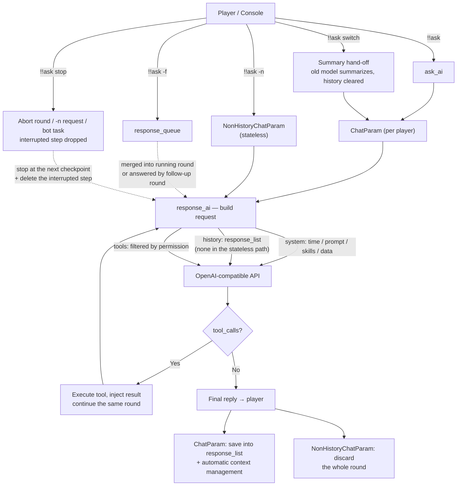
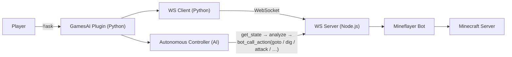

**English** | [中文](readme-zh_cn.md)

\>\>\> [Back to index](/readme.md)

## games_ai

### Basic Information

- Plugin ID: `games_ai`
- Plugin Name: GamesAI
- Version: 0.7.1
  - Metadata version: 0.7.1
  - Release version: 0.7.1
- Total downloads: 1224
- Authors: [yello](https://github.com/PengZixuan30)
- Repository: https://github.com/PengZixuan30/Games_AI
- Repository plugin page: https://github.com/PengZixuan30/Games_AI/tree/main
- Labels: [`Tool`](/labels/tool/readme.md)
- Description: This plugin allows you to use AI in the game

### Dependencies

| Plugin ID | Requirement |
| --- | --- |
| [mcdreforged](https://github.com/Fallen-Breath/MCDReforged) | \>=2.15.0 |

### Requirements

| Python package | Requirement |
| --- | --- |
| [openai](https://pypi.org/project/openai) |  |
| [requests](https://pypi.org/project/requests) |  |
| [websockets](https://pypi.org/project/websockets) |  |

```
pip install openai requests websockets
```

### Introduction

<div align="center">

# GamesAI for MCDReforged

English  |  [简体中文](https://github.com/PengZixuan30/Games_AI/tree/main//README.zh-CN.md)  |  [繁體中文](https://github.com/PengZixuan30/Games_AI/tree/main//README.zh-TW.md)

[Report an Issue](https://github.com/PengZixuan30/Games_AI/issues/new)  |  [Share an Idea](https://github.com/PengZixuan30/Games_AI/discussions/new/choose)  |  [Join QQ Group](https://qm.qq.com/q/jDQQaUPNmw)

[Go to Fabric Version](https://github.com/PengZixuan30/GamesAI)

</div>

> [!NOTE]
> **GamesAI Plugin/Mod QQ Group: 849544707** — Join us to discuss issues, share feedback, and exchange prompt, skills, tools configurations!

> [!NOTE]
> Welcome to version 0.7.1! This release brings **automatic context management**: the fixed `max_history` option is gone, each model's context window is resolved automatically, real usage is read from the provider's `usage` field, and the conversation is compressed (older rounds summarized) only when the context actually grows too large. See [What's New](#whats-new) for details.

> [!NOTE]
> **Switching models now uses a summary hand-off** (option B1 of the community vote in [#20](https://github.com/PengZixuan30/Games_AI/issues/20), implemented in v0.7.1): `!!ask switch <model>` has the **old** model compress the conversation into one neutral factual summary, clears the raw history, and passes that summary to the new model. See [Summary Hand-off on Model Switch](#summary-hand-off-on-model-switch).

<details>
<summary>Table of Contents (click to expand)</summary>

- [GamesAI for MCDReforged](#gamesai-for-mcdreforged)
  - [Installation](#installation)
  - [Usage](#usage)
  - [AI Request Pipeline \& Chat Mechanism](#ai-request-pipeline--chat-mechanism)
    - [The request chain](#the-request-chain)
    - [The stateless path (`!!ask -n`)](#the-stateless-path-ask--n)
    - [Automatic Context Management](#automatic-context-management)
    - [Per-user state](#per-user-state)
    - [Summary Hand-off on Model Switch](#summary-hand-off-on-model-switch)
    - [Stopping a Running Round](#stopping-a-running-round)
  - [Using the Mineflayer Bot](#using-the-mineflayer-bot)
    - [Prerequisites](#prerequisites)
    - [Commands](#commands)
    - [How It Works](#how-it-works)
    - [Supported Actions](#supported-actions)
    - [AI Tools for Bot Control](#ai-tools-for-bot-control)
    - [Configuration](#configuration)
  - [Configuration](#configuration-1)
    - [1.prefix](#1prefix)
    - [2.permission](#2permission)
    - [3.all\_ai](#3all_ai)
    - [4.default\_ai](#4default_ai)
    - [5.mineflayer\_bot](#5mineflayer_bot)
  - [Tools \& Skills](#tools--skills)
    - [Built-in Tools](#built-in-tools)
    - [Custom Tools via Config File](#custom-tools-via-config-file)
    - [Custom Tools in Your MCDR Plugin](#custom-tools-in-your-mcdr-plugin)
    - [Built-in Skills](#built-in-skills)
    - [Add Skills via Config File](#add-skills-via-config-file)
    - [Register Skills in Your MCDR Plugin](#register-skills-in-your-mcdr-plugin)
  - [Hot Reload](#hot-reload)
    - [Triggering a Hot Reload](#triggering-a-hot-reload)
    - [What Happens During a Hot Reload](#what-happens-during-a-hot-reload)
    - [Making Your MCDR Plugin Follow GamesAI Hot Reload](#making-your-mcdr-plugin-follow-gamesai-hot-reload)
      - [Approach 1: Auto-Reload with `register_self()` (Recommended)](#approach-1-auto-reload-with-register_self-recommended)
      - [Approach 2: Responding to Hot Reload via Event Listening](#approach-2-responding-to-hot-reload-via-event-listening)
    - [Comparison of the Two Approaches](#comparison-of-the-two-approaches)
  - [Troubleshooting](#troubleshooting)
    - [`!!ask` Errors](#ask-errors)
    - [Mineflayer Bot Errors](#mineflayer-bot-errors)
    - [Logging \& Debugging](#logging--debugging)
  - [What's New](#whats-new)
    - [Version 0.7.1](#version-071)
      - [🎯 Highlights](#-highlights)
      - [1. Automatic Context Management](#1-automatic-context-management)
      - [2. Summary Hand-off When Switching Models](#2-summary-hand-off-when-switching-models)
      - [3. A Stateless Path for `!!ask -n`](#3-a-stateless-path-for-ask--n)
      - [4. Configuration \& Behaviour Changes](#4-configuration--behaviour-changes)
      - [5. Other Improvements](#5-other-improvements)
    - [Version 0.7.0](#version-070)
      - [🎯 Highlights](#-highlights-1)
      - [1. ChatParam: One Conversation Object per Player](#1-chatparam-one-conversation-object-per-player)
      - [2. The Full Request Chain](#2-the-full-request-chain)
      - [3. Other Improvements \& Fixes](#3-other-improvements--fixes)
  - [The Role of AI in This Project](#the-role-of-ai-in-this-project)
  - [Acknowledgements \& Disclaimer](#acknowledgements--disclaimer)
  - [Sponsorship \& Contributors](#sponsorship--contributors)
  - [License](#license)

</details>

## Installation

Run the following command in the MCDR console to install the plugin:

`!!MCDR plugin install games_ai`

---

Alternatively, get it from the [MCDR Plugin Repository](https://mcdreforged.com/plugin/games_ai) and place it in your plugin directory.

If you choose to install manually, install the Python packages `openai`, `requests`, and `websockets` first:

```bash
pip install openai requests websockets
```

## Usage

Type `!!gamesai` anywhere to display all available features of this plugin.

| Command                              | Description                                                                                        |
| ------------------------------------ | -------------------------------------------------------------------------------------------------- |
| `!!gamesai clear`                    | Clear your own chat history. Chat history is unrelated to the public database.                     |
| `!!gamesai clearall`                 | Clear all players' chat history. Chat history is unrelated to the public database.                 |
| `!!gamesai reload`                   | Reload the plugin configuration file. See [Hot Reload](#hot-reload) for details.                   |
| `!!gamesai check`                    | Check for plugin updates and force-refresh the context-window table.                               |
| `!!gamesai speedtest [model]`        | Test API server connection latency. If no model is specified, all models are tested.               |
| `!!gamesai config get <key>`         | Read a configuration value.                                                                        |
| `!!gamesai config set <key> <value>` | Update a configuration value (auto type-adapts; automatically triggers [Hot Reload](#hot-reload)). |

---

You can also use `!!ask` directly to ask the AI questions, chat, or ask it to do things for you.

| Command                | Description                                                                                                                                                                                                                                                                                                           |
| ---------------------- | --------------------------------------------------------------------------------------------------------------------------------------------------------------------------------------------------------------------------------------------------------------------------------------------------------------------- |
| `!!ask <content>`      | Ask the AI a question, chat, or ask it to do something. `<content>` is what you want the AI to do or the question you want to ask.                                                                                                                                                                                    |
| `!!ask -n <content>`   | Ask the AI without using conversation history (current conversation is still saved).                                                                                                                                                                                                                                  |
| `!!ask -f <content>`   | Force-ask without waiting: the request is merged into the round that is currently running (alias: `-forced`). See [AI Request Pipeline & Chat Mechanism](#ai-request-pipeline--chat-mechanism).                                                                                                                       |
| `!!ask switch <model>` | Switch the AI model for your current conversation (`<model>` is the AI_ID or nickname). The history is cleared and the old model summarizes it right before your next request, handing the summary to the new model. See [Summary Hand-off on Model Switch](#summary-hand-off-on-model-switch).                       |
| `!!ask stop`           | Immediately stop everything you have in flight: your running round (tool calls included), a running `!!ask -n` request and a task you delegated to the bot. The interrupted step is deleted from the history and queued `!!ask -f` messages are discarded. See [Stopping a running round](#stopping-a-running-round). |

---

Type `!!data` for information about database commands.

> [!TIP]
> The database is automatically created when upgrading to version 0.3.0 or above.

| Command                      | Description                                                                                            |
| ---------------------------- | ------------------------------------------------------------------------------------------------------ |
| `!!data write <key> <value>` | Add a data entry to the public database. `<key>` must not contain spaces; `<value>` can be any string. |
| `!!data add <key> <value>`   | Append `<value>` to an existing key in the public database. Creates a new key if it does not exist.    |
| `!!data del <key>`           | Delete a data entry from the public database, regardless of whether the key exists.                    |
| `!!data read <key>`          | Read the value associated with a key from the public database.                                         |
| `!!data list`                | Read all entries in the public database.                                                               |
| `!!data list keys`           | Read all keys in the public database.                                                                  |

---

## AI Request Pipeline & Chat Mechanism

This section explains what happens between your `!!ask` and the AI's reply, and how conversations are managed internally.

### The request chain

1. You run `!!ask <content>` (or `!!ask -n <content>` / `!!ask -f <content>`).
2. The plugin resolves your username and builds the user message (labeled with `Username:` / `Message:` in your current language).
3. Your per-user `ChatParam` object (see `games_ai/chat_param.py`) is created lazily and uses the model configured by `all_ai` / `default_ai`. `!!ask -n` uses a throwaway `NonHistoryChatParam` instead — see [The stateless path](#the-stateless-path-ask--n).
4. Each round, `response_ai` assembles the request:
   - system messages: current time, the model's prompt, the skills list (built-in + `skills.json` + registered by external plugins), and the public data list;
   - conversation history (the stateless path keeps none);
   - tools filtered by your permission level.
5. The round talks to the OpenAI-compatible API through `openai_api.response_chat`. A history object owns one client per AI config; the stateless path reuses a client per `base_url` + API key.
6. If the AI calls a tool, the plugin executes it, injects the result, and **continues the same round** until the AI produces a final text reply.
7. The reply is sent with the AI's name prefix and saved into the history; the context is then managed automatically (see [Automatic Context Management](#automatic-context-management)).



### The stateless path (`!!ask -n`)

`!!ask -n <content>` answers one question and keeps nothing. It is served by `NonHistoryChatParam`, a self-contained class in `games_ai/chat_param.py` that shares no helper, attribute or lifecycle with the history objects.

**What it does not have:** dialogue history (`response_list`), the forced-request queue, the round lifecycle event, the tool counter, context management (token estimation, usage calibration, history compression, summarization requests) and any per-user state — nothing is stored in `all_chat_param`, and the object is discarded as soon as the answer is sent.

**What still matches the normal path:**

- the same system messages (time, prompt, skills list, public data) and the same tools for your permission level;
- tool calls are still executed and fed back **inside the same round**, until the AI produces a final text reply;
- the same reply format and the same error report (HTTP status mapping plus the provider's request ID).

**Two differences worth knowing:**

- **Single-round window guard** — with no history to compress, the request is simply measured before it is sent: if it would exceed **80 %** of the model's window, the newest message is truncated to the remaining room (a single round can hardly overflow a window; an oversized tool result can). The full machinery of [Automatic Context Management](#automatic-context-management) applies to the history path only.
- **Shared HTTP client** — clients are cached per `base_url` + API key (at most 8 of them), so repeated `-n` calls neither rebuild a connection pool nor repeat a TLS handshake. Provider `usage` is read but ignored, because without history there is nothing to calibrate.

### Automatic Context Management

GamesAI no longer uses a fixed `max_history` value. Instead, every request is measured against the model's own context window and the conversation is compressed only when it is actually needed.

**How the window is resolved** (highest priority first):

1. `context_window` in the AI entry of `all_ai` — per-model override;
2. the context-window table: fetched from [`data/context_windows.json`](https://github.com/PengZixuan30/Games_AI/blob/main/data/context_windows.json) (GitHub Raw, with jsDelivr as a second source), cached at `config/games_ai/cache/context_windows.json`, refreshed by the startup / 24 h update-check chain — and by `!!gamesai check`, which bypasses the 24 h TTL;
3. a table bundled with the plugin version (works fully offline; generated module `games_ai/context_table_data.py`, synced from the repository JSON);
4. a conservative default of `32768` tokens for unknown models.

**Triggers** (checked before *and* after every request):

- the current context has reached **80 %** of the window, or
- a single request has reached **20 %** of the window (for example a huge tool result such as a log file).

**What happens when a trigger fires:**

- the newest **10 rounds** are always kept verbatim (one round = one user message plus its assistant/tool messages);
- older rounds are replaced by a single neutral, factual **summary** (generated with the current model, without tools). Summaries do not imitate the previous replies' style, and an existing summary is merged into the new one;
- if the conversation is still too large, or the summary fails, oversized messages are truncated and the oldest rounds are dropped as a last resort — the next request always fits.

The real input size comes from the provider's own `usage` field (`prompt_tokens` / `total_tokens`), and the local estimate is calibrated against it per `base_url|model`, so estimates converge to the real numbers within a few rounds.

Run `!!gamesai debug` to see the window, usage, calibration factor and every compression step in the MCDR console.

### Per-user state

- `all_chat_param` keeps one `ChatParam` per player in memory; `!!gamesai clear` / `!!gamesai clearall` removes them.
- `ChatParam` owns:
  - `response_list` — the dialogue history;
  - `system_message` — rebuilt every round (time, prompt, skills, data);
  - `response_queue` — messages from `!!ask -f` waiting to be merged;
  - `is_stopped` — the round lifecycle event (used to serialize rounds per player).
- **`!!ask -n` keeps no state at all**: it is served by `NonHistoryChatParam`, which is not registered in `all_chat_param` and is dropped when the answer has been sent — see [The stateless path](#the-stateless-path-ask--n).
- **`!!ask switch <model>`** rebuilds the AI client of your `ChatParam` with a **summary hand-off**: the raw history is cleared right away, and the old model compresses it into one neutral factual summary **right before your next request** (same timing as automatic context compression), which is then injected as the first system message of the new session. See [Summary Hand-off on Model Switch](#summary-hand-off-on-model-switch).
- **`!!ask -f <content>`** queues the request while a round is still running: the in-flight round merges it and keeps going; if the round just ended before the merge, an automatic follow-up round answers it.
- **`!!gamesai debug`** switches the request-flow logs to INFO level in the MCDR console (request start/finish, forced-request queue/merge, tool calls); without it, the same logs go to DEBUG.

> [!NOTE]
> **Community vote result:** the poll in [issue #20](https://github.com/PengZixuan30/Games_AI/issues/20) is closed. Option **B1 (summary hand-off)** is implemented in v0.7.1 — the previous model's style no longer shapes the new model's replies, while the facts of the conversation are carried over.

### Summary Hand-off on Model Switch

`!!ask switch <model>` does not simply keep or wipe the conversation; it hands the facts over (option **B1**, the winning design of the poll in [#20](https://github.com/PengZixuan30/Games_AI/issues/20)). The compression runs at the **same moment as the automatic context compression** — right before the next request, never inside the command:

1. on the command itself: the switch waits for a running round to finish, keeps a snapshot of the conversation together with the old model, clears the raw history, and rebuilds everything for the new model. No API call is made, so the command returns instantly — even for a very long conversation;
2. **right before your next request** (in the preflight pass, exactly like automatic compression): the **old** model is asked for one neutral, factual summary of that snapshot — topic, settled conclusions, open items, and any explicit user requirements (the same summarization prompt as context compression, sent without tools, 60 s timeout);
3. the summary is injected as the **first system message of the new conversation**, wrapped in a note that tells the new model to continue with its own instructions and style and not to imitate the previous one;
4. the question you asked is then answered normally, with the summary in context.

| Situation                                    | What happens                                                                                      | What you see                                                                           |
| -------------------------------------------- | ------------------------------------------------------------------------------------------------- | -------------------------------------------------------------------------------------- |
| History exists                               | Snapshot kept, history cleared, hand-off scheduled                                                | "…will be compressed into a summary by the old model right before your next question." |
| Hand-off succeeds before the next request    | Summary becomes the first system message, then the round runs                                     | Nothing extra (like automatic compression), only debug logs                            |
| Hand-off fails (timeout, error, empty reply) | The old conversation is dropped, the round still runs                                             | "The summary hand-off failed: the previous conversation was dropped…"                  |
| Switching twice before the next request      | The original snapshot is kept and summarized once, by the model that was active when it was taken | Same as above                                                                          |
| No history yet                               | Nothing to hand over, no extra request ever                                                       | Plain "switched" message                                                               |
| Already using that model                     | Nothing is touched                                                                                | "You are already using AI model…"                                                      |

Notes:

- the switch waits for a running round to finish first, so a snapshot is never taken from a half-written conversation;
- switching also resets the tool counter, the forced-request queue and the usage/calibration counters of the conversation;
- the extra summarizing request is only paid when you actually ask again — and only once per switch (with a 60 s timeout). It never blocks the command and never fails the switch; a failed hand-off just leaves the new conversation without the old context;
- `!!ask stop` does not cancel a scheduled hand-off: it belongs to the previous conversation, not to the running round. `!!gamesai clear` removes it together with the conversation object;
- using `-n` costs nothing here: only the history path summarizes. See [The stateless path](#the-stateless-path-ask--n).

### Stopping a Running Round

`!!ask stop` aborts everything **you** have in flight, right away:

| What is running                                                              | What the command does                                                                                                                  |
| ---------------------------------------------------------------------------- | -------------------------------------------------------------------------------------------------------------------------------------- |
| A round of your conversation (the model is thinking, or tools are executing) | The round stops at its next checkpoint, the interrupted step is deleted from the history, and queued `!!ask -f` messages are discarded |
| A `!!ask -n` request                                                         | The request is abandoned; its answer is thrown away (the stateless path keeps nothing anyway)                                          |
| A task you delegated to the autonomous bot                                   | The queued task is removed, and the cycle executing it stops and discards what it produced                                             |

How the interrupted step is deleted:

- a trailing **tool-call group** (the assistant message that requested the tools plus its tool results) is removed as a whole, so no orphan tool message is left behind;
- otherwise **everything the interrupted round appended** is removed — your message, messages merged from `!!ask -f`, injected skill notes — stopping at the last completed answer, so an interrupted ask never happened;
- if that round had already produced its final answer, that answer is removed too.

Details:

- an in-flight HTTP request cannot be cancelled, so the round stops at the next checkpoint: before the next request, right after the response arrives, or between two tool calls of a batch. The delay is therefore at most one request;
- the command only ever touches your own conversations (no target argument), and needs no special permission;
- with nothing running it answers "There is no conversation in progress.";
- `!!ask stop` is a literal command, so a question that literally begins with `stop ` is treated as a command (use `!!ask -n stop ...` or rephrase) — the same applies to `switch`.

---

## Using the Mineflayer Bot

GamesAI 0.6.0 introduces a fully autonomous Minecraft bot powered by [Mineflayer](https://github.com/PrismarineJS/mineflayer). The AI can directly control the bot to navigate, mine, build, craft, fight, and interact with the world.

### Prerequisites

- **Node.js >= 18** and **npm** must be installed on the server
- The plugin automatically installs npm dependencies (`mineflayer`, `ws`, `vec3`, `mineflayer-pathfinder`, `mineflayer-mcefly`) on first launch, and refreshes them automatically when the installed mineflayer does not support the server version (e.g. after a Minecraft server upgrade)
- A Minecraft account for the bot (Microsoft/Mojang/offline)

### Commands

| Command                     | Description                                            |
| --------------------------- | ------------------------------------------------------ |
| `!!aibot join`              | Enable the bot and make it join the server.            |
| `!!aibot leave`             | Make the bot leave the server and disable it.          |
| `!!aibot set <key> <value>` | Configure bot identity (`username`/`password`/`auth`). |

### How It Works



The plugin launches a Node.js process running a WebSocket server. A Python WebSocket client (built into the plugin) connects to it locally, forming a bridge between MCDR and the Mineflayer bot. When the bot is enabled, an **autonomous AI controller** periodically reads the bot's state, checks chat messages, and decides what actions to take.

### Supported Actions

The bot supports 20+ actions callable via the `bot_call_action` AI tool:

| Action                                                                     | Description                                        |
| -------------------------------------------------------------------------- | -------------------------------------------------- |
| `goto`                                                                     | A\* pathfinding to coordinates `{x, y, z, range?}` |
| `efly`                                                                     | Elytra flight to coordinates (requires elytra)     |
| `dig`                                                                      | Break a block at coordinates                       |
| `place`                                                                    | Place a block at coordinates                       |
| `attack`                                                                   | Attack a nearby entity by name or nearest hostile  |
| `useOn`                                                                    | Right-click an entity (e.g. villager trading)      |
| `equip` / `unequip`                                                        | Equip/unequip armor or items to hand               |
| `mount` / `dismount`                                                       | Ride or dismount vehicles and animals              |
| `craft`                                                                    | Craft items (inventory or crafting table)          |
| `lookAt`                                                                   | Look at coordinates or set yaw/pitch directly      |
| `sleep` / `wake`                                                           | Sleep in a bed or wake up                          |
| `activateBlock`                                                            | Right-click a block (open chest, press button)     |
| `setControlState`                                                          | Control vehicle movement (forward/back/jump)       |
| `viewContainer` / `takeFromContainer` / `putToContainer`                   | Container management                               |
| `openFurnace` / `furnacePutInput` / `furnacePutFuel` / `furnaceTakeOutput` | Furnace operations                                 |
| `nearbyEntities` / `findBlocks` / `getBlock`                               | World query                                        |
| `stop` / `stopEfly`                                                        | Stop all movement or elytra flight                 |

### AI Tools for Bot Control

In addition to `bot_call_action`, these dedicated AI tools are available:

| Tool                                         | Description                                                                |
| -------------------------------------------- | -------------------------------------------------------------------------- |
| `bot_chat`                                   | Make the bot send a message in public chat.                                |
| `bot_whisper`                                | Make the bot send a private message to a player.                           |
| `bot_get_state`                              | Get the bot's full state (30+ fields).                                     |
| `run_mineflayer_bot` / `stop_mineflayer_bot` | Start or stop the bot. Require the configured `permission` level (0.6.4+). |
| `delegate_to_bot`                            | Delegate a complex Minecraft task to the autonomous controller.            |

### Configuration

See [6.mineflayer_bot](#6mineflayer_bot) for the full configuration reference. Key points:

- Set `mineflayer_bot.enabled` to `true` (or use `!!aibot join`) to launch the bot
- `mineflayer_bot.bot.username` / `password` / `auth` — the bot's Minecraft credentials. **Username must match `[a-zA-Z0-9_]+`** (letters, numbers, underscores only).
- `mineflayer_bot.cycle_interval` — how often (in seconds) the autonomous AI makes decisions
- `mineflayer_bot.websocket` — internal settings; do not modify unless you know what you are doing

> [!NOTE]
> After modifying Bot configuration, run `!!gamesai reload` (or use `!!aibot set` / `!!gamesai config set`) to automatically restart the Bot with the new settings. See [Hot Reload](#hot-reload) for details.

## Configuration

The default configuration file structure is as follows:

```json
{
  "prefix": "[GamesAI]",
  "permission": 3,
  "all_ai": {
      "<Your AI ID>":{
          "prompt": "You are a mature, reliable Minecraft bot tool named \"GamesAI\".",
          "ai_name": "[GamesAI]",
          "base_url": "<Your API Base URL>",
          "ai_model": "<Your AI Model>",
          "api_key": "<Your API Key>",
          "extra_body": {},
          "context_window": null
      }
    },
  "default_ai": "<Your AI ID>",
  "mineflayer_bot": {
      "enabled": false,
      "cycle_interval": 15.0,
      "websocket": {
          "url": "ws://127.0.0.1:8080",
          "reconnect_interval": 10,
          "timeout": 60
      },
      "bot": {
          "username": "<Your Minecraft Bot Username>",
          "password": "<Your Minecraft Bot Password>",
          "auth": "microsoft"
      }
  }
```

---

Below is a brief introduction to each parameter:

### 1.prefix
Type: `str`

Default: `[GamesAI]`

The plugin name used as a prefix in replies. May include Minecraft formatting codes.

### 2.permission
Type: `int`

Default: `3`

The minimum permission level required to execute commands like `!!data`. See the [MCDR Permission Documentation](https://docs.mcdreforged.com/en/latest/permission.html).

Since 0.6.4, this value also controls which **AI tools** are offered to a player: tools whose `perm` is above the player's level are not passed to the AI model at all, so the model cannot see or call them. Built-in tools that manage data, skills, custom tools, or the bot use this value (via `get_plugin_config_perm`), and it is re-read on every request, so changes take effect immediately after a reload.

### 3.all_ai
Type: `dict`

Default: see file

All AI configuration entries, consisting of multiple sub-dictionaries. Each sub-dictionary represents one AI model, and its key serves as the plugin's internal AI_ID.

**prompt**: Use this option to write a system prompt for each AI. Use `> xxx.md` to point the prompt to the `config/games_ai/prompt/xxx.md` file (any file type is supported).

**ai_name**: Similar to `prefix`, but set per model. May include Minecraft formatting codes.

**base_url**, **ai_model**, **api_key**: Same as previous related configuration, but now set per model.

**extra_body**: Please refer to your API provider's documentation for the `extra_body` parameter. For DeepSeek users migrating from the previous `thinking` option, use `{"thinking": {"type": "enabled"}}`. Defaults to `{}` (empty).

**context_window** (optional): Overrides the context window (in tokens) used by [automatic context management](#automatic-context-management) for this model. Leave it as `null` to use the value from the context-window table. Useful as a cost-control knob for models with a very large window, e.g. `"context_window": 65536`.

### 4.default_ai
Type: `str`

Default: `<Your AI ID>`

The model used when a player simply uses `!!ask`. Should be one of the keys in the `all_ai` dictionary (i.e. the plugin's internal AI_ID). An incorrect value will prevent `!!ask` from working properly.

### 5.mineflayer_bot
Type: `dict`

Default: see above

Configuration for the Mineflayer autonomous bot agent.

**enabled**: Whether to launch the bot on startup. Requires Node.js >= 18.

**cycle_interval**: Seconds between autonomous AI decision cycles (default: 15.0).

**websocket**: Internal WebSocket connection settings. `url`, `reconnect_interval`, and `timeout`.

> [!WARNING]
> The WebSocket `url` host **must** be `127.0.0.1`. Ensure the chosen port is not already in use — the plugin will automatically check for port conflicts on startup and disable the bot if the port is occupied.
> Do not modify the `websocket` settings unless you fully understand what you are doing.

**bot**: Minecraft account credentials — `username`, `password`, `auth` (microsoft/mojang/offline). The server address is auto-detected from `server.properties`.

> [!WARNING]
> The `username` must match the regular expression `[a-zA-Z0-9_]+` (only English letters, numbers, and underscores; no spaces). `!!aibot join` will be rejected if the username contains invalid characters.

> [!TIP]
> After modifying the configuration, use `!!gamesai reload` or `!!gamesai config set` to apply changes. See [Hot Reload](#hot-reload) for details.

## Tools & Skills

> [!TIP]
> Some tools are available via the [GamesAI-Extra](https://github.com/PengZixuan30/Games_AI-Extra) plugin — waypoint management and position tracking, and (since 0.6.4) whitelist management (`get_whitelist_name`, `add_to_whitelist`, `remove_from_whitelist`) and `search_minecraft_wiki`. Install it to get these tools.

### Built-in Tools

The GamesAI plugin provides many built-in tools, listed in the table below. If you want more tools, you can [submit a suggestion](https://github.com/PengZixuan30/Games_AI/issues/new), use [Custom Tools via Config File](#custom-tools-via-config-file), or [register tools from your own MCDR plugin](#custom-tools-in-your-mcdr-plugin).

<details>
<summary>Click to view all built-in tools</summary>

|       Tool ID       |                         Parameters                         | Description                                                                                                                                                                                                                                                                                                                                                                                            |
| :-----------------: | :--------------------------------------------------------: | ------------------------------------------------------------------------------------------------------------------------------------------------------------------------------------------------------------------------------------------------------------------------------------------------------------------------------------------------------------------------------------------------------ |
| get_online_players  |                            None                            | Get the list of currently online players. Depends on the `online_player_api` plugin; falls back to an RCON `list` query when RCON is running.                                                                                                                                                                                                                                                          |
| get_player_position |                          `player`                          | Get a player's position and dimension. Depends on the `minecraft_data_api` plugin; automatically disabled if unavailable.                                                                                                                                                                                                                                                                              |
|     calculator      |                        `expression`                        | A simple mathematical expression calculator.                                                                                                                                                                                                                                                                                                                                                           |
|   item_caculator    |                `expression`, `single_limit`                | A mathematical expression calculator that converts results into Minecraft item notation (shulker boxes, stacks, items). Automatically adapts to stack size; defaults to 64 if not specified.                                                                                                                                                                                                           |
|    ai_read_data     |                           `key`                            | Read a single entry from the database.                                                                                                                                                                                                                                                                                                                                                                 |
|  ai_read_all_keys   |                            None                            | Get all keys from the database.                                                                                                                                                                                                                                                                                                                                                                        |
|  ai_read_all_data   |                            None                            | Read all key-value pairs from the database at once.                                                                                                                                                                                                                                                                                                                                                    |
|    ai_write_data    |                       `key`, `value`                       | Write a data entry to the database (overwrite mode).                                                                                                                                                                                                                                                                                                                                                   |
|     ai_add_data     |                       `key`, `value`                       | Write a data entry to the database (append mode).                                                                                                                                                                                                                                                                                                                                                      |
|     read_skills     |                          `skills`                          | Read a registered skill instruction file to guide AI behavior for specific tasks.                                                                                                                                                                                                                                                                                                                      |
|    write_skills     |               `skills`, `summary`, `content`               | Create or overwrite a skill file and register it in the skills index.                                                                                                                                                                                                                                                                                                                                  |
|    modify_skills    | `skills`, `old_string`, `new_string`, `summary` (optional) | Edit an existing skill file by **regular-expression replacement**: `old_string` is a Python regex matched against the whole file, `new_string` is the replacement and may use backreferences such as `\1` or `\g<name>`; every match is replaced. When the pattern does not compile or matches nothing, the same text is retried as a literal string. Passing `summary` also updates the skills index. |
|    delete_skills    |                          `skills`                          | Delete a skill file and remove it from the skills index.                                                                                                                                                                                                                                                                                                                                               |
|  read_custom_tools  |                            None                            | Read the current content of the custom `tools.py` file.                                                                                                                                                                                                                                                                                                                                                |
| modify_custom_tools |                 `old_string`, `new_string`                 | Edit the custom `tools.py` file by **regular-expression replacement** (same rules as `modify_skills`); then call `reload_plugin`.                                                                                                                                                                                                                                                                      |
| append_custom_tools |                          `tools`                           | Append new tool code to the end of the custom `tools.py` file.                                                                                                                                                                                                                                                                                                                                         |
|    setting_timer    |                         `duration`                         | Pause execution for the specified number of seconds before continuing.                                                                                                                                                                                                                                                                                                                                 |
|    reload_plugin    |                            None                            | Hot-reload the plugin to apply configuration, skills, and custom tools changes without losing chat history. See [Hot Reload](#hot-reload).                                                                                                                                                                                                                                                             |
|     ai_del_data     |                           `key`                            | Delete a data entry from the database.                                                                                                                                                                                                                                                                                                                                                                 |
|      bot_chat       |                         `message`                          | Make the Mineflayer bot send a message in Minecraft chat.                                                                                                                                                                                                                                                                                                                                              |
|     bot_whisper     |                   `username`, `message`                    | Make the bot send a private message to a player.                                                                                                                                                                                                                                                                                                                                                       |
|    bot_get_state    |                            None                            | Get the bot's full state (30+ fields).                                                                                                                                                                                                                                                                                                                                                                 |
|   bot_call_action   |                     `action`, `params`                     | Send arbitrary action to the bot (goto, dig, place, attack, etc.).                                                                                                                                                                                                                                                                                                                                     |
| run_mineflayer_bot  |                            None                            | Start the Mineflayer bot if not running. Requires the configured `permission` level.                                                                                                                                                                                                                                                                                                                   |
| stop_mineflayer_bot |                            None                            | Stop the Mineflayer bot. Requires the configured `permission` level.                                                                                                                                                                                                                                                                                                                                   |
|   delegate_to_bot   |                           `task`                           | Delegate a complex Minecraft task to the autonomous bot controller.                                                                                                                                                                                                                                                                                                                                    |

> [!NOTE]
> Since 0.6.4, tools with a `perm` above the requesting player's permission level are not offered to the AI at all. Tools that write/delete data, manage skills, manage custom tools, or start/stop the bot require the configured `permission` level.
> 
> Since 0.7.1, everything sent to the model for a tool call is English: the tool schema (name, description, parameters) and the tool result, including error and permission-denied messages. The progress messages printed to players remain localized.

</details>

### Custom Tools via Config File

Customize tools by editing the `config/games_ai/tools/tools.py` file.

Let's start by looking at the default content:

```python
from mcdreforged.command.command_source import CommandSource
from games_ai.games_ai_tool import register_tool

@register_tool(description="My Custom Tool")
def my_custom_tool(source: CommandSource, ai_prefix: str):
    return "Tool execution completed"
```

> [!IMPORTANT]
> The `from games_ai.games_ai_tool import register_tool` import and the `@register_tool` decorator above the function definition **must** be present.

> [!TIP]
> In version 0.5.7+, the AI can autonomously **read, edit, and append** the custom tools file using the `read_custom_tools`, `modify_custom_tools` and `append_custom_tools` tools. Just ask the AI to add a new tool for you — it reads the current file, applies a precise `old_string` → `new_string` replacement, and applies the change via [Hot Reload](#hot-reload).

The `description` parameter is mandatory and tells the AI what the tool does. The `parameters` dictionary (optional) defines the arguments the AI should pass in, following the [OpenAI function calling schema](https://platform.openai.com/docs/guides/function-calling). The function signature must include `source: CommandSource` and `ai_prefix: str` as the first two parameters, followed by any custom parameters defined in `parameters`.

Since 0.6.4, the optional `perm` parameter sets the minimum permission level required for the tool to be offered to the player's AI — an `int`, or a zero-argument callable returning an `int` (e.g. `get_plugin_config_perm`, which follows the plugin's `permission` config dynamically). It defaults to `0` (available to everyone):

```python
from games_ai.games_ai_tool import register_tool, get_plugin_config_perm

@register_tool(description="Admin-only tool", perm=get_plugin_config_perm)
def my_admin_tool(source: CommandSource, ai_prefix: str):
    return "Only visible to players with the configured permission level"
```

Tools above the player's level are not passed to the AI at all; still keep a runtime `source.get_permission_level()` check inside the function for safety.

> [!TIP]
> Add the `@register_bot_tool()` decorator (from `games_ai.games_ai_tool`) alongside `@register_tool` to make the tool available to the autonomous Mineflayer Bot controller. Without it, the tool can only be used through `!!ask` by the chat AI.

### Custom Tools in Your MCDR Plugin

If you are developing a separate MCDR plugin, you can register tools directly from your plugin code without touching `tools.py`:

```python
from games_ai.games_ai_tool import register_tool, register_bot_tool

@register_tool(
    description="Description of your custom tool",
    parameters={...}  # optional
)
@register_bot_tool()  # optional — makes the tool available to the Mineflayer Bot controller
def my_plugin_tool(source: CommandSource, ai_prefix: str, ...):
    source.reply(f'{ai_prefix}Running my tool...')
    return "Result of the tool"
```

> [!IMPORTANT]
> Your plugin **must** require `games_ai >= 0.4.1` in its `mcdreforged.plugin.json` dependencies, otherwise the import will fail. If you use `@register_bot_tool()`, the minimum version should be `>= 0.6.0`.

Your plugin should list `games_ai` in its `dependencies` in `mcdreforged.plugin.json` to ensure GamesAI is loaded first:

```json
{
    "id": "my_plugin",
    "dependencies": {
        "mcdreforged": ">=2.15.0",
        "games_ai": ">=0.4.1"
    }
}
```

Tools registered this way are identical to built-in tools — the AI can call them directly, and you can mark them as bot-accessible with `@register_bot_tool()` if needed. Since 0.6.4, the optional `perm` parameter (an `int` or a zero-argument callable such as `get_plugin_config_perm`) controls which permission level the tool is offered at.

> [!NOTE]
> Since 0.6.4, any plugin that registers tools via `@register_tool` is **automatically reloaded** during `!!gamesai reload` so its tool code stays fresh — no `register_self()` call required. Use `register_self()` only if your plugin needs custom reload logic or wants to be reloaded without registering tools. See [Making Your MCDR Plugin Follow GamesAI Hot Reload](#making-your-mcdr-plugin-follow-gamesai-hot-reload).

If you want your plugin to be **automatically reloaded** when GamesAI runs `!!gamesai reload` even without registering tools (e.g. a skills-only plugin), or you need custom reload logic, call `register_self()` in your plugin's `on_load`:

```python
from games_ai.register_extra_plugin import register_self

def on_load(server, old):
    register_self(server.get_self_metadata().id)
```

This ensures your plugin is reloaded alongside GamesAI's configuration and tools, so any tool code changes take effect immediately. See [Hot Reload](#hot-reload) for more details.

### Built-in Skills

GamesAI ships with two **built-in skills** that the AI automatically reads before performing related operations:

| Skill File                   | Description                                                                                                                                                                                                                     |
| ---------------------------- | ------------------------------------------------------------------------------------------------------------------------------------------------------------------------------------------------------------------------------- |
| `skills_management.md`       | Guides the AI on how to read, write, modify, and delete skill files correctly.                                                                                                                                                  |
| `custom_tools_management.md` | Guides the AI on how to read, edit and append custom tool code safely — including the mandatory step of confirming the user's requirements, parameters, permission level and expected return value **before** writing any code. |
| `mineflayer_bot_guide.md`    | Guides the AI on how to control the Mineflayer bot (available only when the bot is running).                                                                                                                                    |

> [!TIP]
> Skills are like SOPs (Standard Operating Procedures) for the AI — they ensure the AI follows the correct workflow every time.

### Add Skills via Config File

You can create custom skill files to guide how the AI handles specific tasks — such as whitelist management, fake player control, and more.

Skills files are stored in `config/games_ai/skills/` as Markdown (`.md`) files. To register a skill, edit `config/games_ai/skills/skills.json`. The following is an example configuration (`whitelist.md` and `player.md` are example filenames only — they are not built-in files):

```json
[
    {
        "file": "whitelist.md",
        "description": "Read this skill before managing the whitelist"
    },
    {
        "file": "player.md",
        "description": "Read this skill before controlling fake players"
    }
]
```

- **`file`** — the skill filename (relative to the `skills` folder).
- **`description`** — a short hint shown to the AI, explaining when to read this skill.

When a skill is registered, it appears in the AI's system prompt. The AI can then use the **`read_skills`** tool to read the full contents of any skill file before performing related tasks.

### Register Skills in Your MCDR Plugin

You can register skill files programmatically from your own MCDR plugin so they appear in the AI's system prompt automatically:

```python
from games_ai.external_skills_loader import register_skills

def on_load(server, old):
    register_skills(
        file_name="my_skill.md",
        description="Read this skill before performing XYZ operations",
        content="""## My Skill

This skill guides the AI to...
- Step 1: ...
- Step 2: ...
"""
    )
```

> [!IMPORTANT]
> Your plugin **must** require `games_ai >= 0.6.1` in its `mcdreforged.plugin.json` dependencies.

- **`file_name`** — the skill's filename (used by the AI's `read_skills` tool to locate it).
- **`description`** — a short hint shown to the AI, explaining when to read this skill.
- **`content`** — the full Markdown content of the skill file.

Skills registered this way are identical to those defined in `skills.json` — they appear in the AI's system prompt under "Available skills" and are readable via the `read_skills` tool. If you also want your plugin to auto-refresh during GamesAI hot reload, see [Making Your MCDR Plugin Follow GamesAI Hot Reload](#making-your-mcdr-plugin-follow-gamesai-hot-reload).

## Hot Reload

GamesAI provides a comprehensive hot-reload mechanism that lets you apply configuration, tool, and skill changes without restarting the server.

### Triggering a Hot Reload

Hot reload can be triggered in the following ways:

| Method                               | Description                                                                                          |
| ------------------------------------ | ---------------------------------------------------------------------------------------------------- |
| `!!gamesai reload`                   | Run by an admin to reload all configuration, tools, and skills.                                      |
| `!!gamesai config set <key> <value>` | Automatically triggers a reload after modifying a config value.                                      |
| AI tool `reload_plugin`              | Called by the AI after modifying tool code or skill files to ensure changes take effect immediately. |
| `!!aibot set <key> <value>`          | Automatically triggers a reload after modifying Bot configuration.                                   |

### What Happens During a Hot Reload

When a hot reload is performed, the plugin executes the following steps in order:

1. **Re-read the configuration file** (`config/games_ai/config.json`) — Applies all changes to `prefix`, `permission`, `all_ai`, `default_ai`, etc. (including per-model `context_window`).
2. **Re-register all tools (0.6.4+)** — Completely clears the tool registry and rebuilds it from every source: built-in tools are replayed from recorded registrations, custom `tools.py` tools are re-imported, and plugins that registered tools are reloaded so their registration code runs again (see steps 4 and 6).
3. **Reload Skills** (`config/games_ai/skills/skills.json`) — Refreshes the skill index; the available skills list in the AI's system prompt is updated synchronously.
4. **Reload Custom Tools** (`config/games_ai/tools/tools.py`) — Hot-loads custom tool code without restarting MCDR.
5. **Restart the Mineflayer Bot** (if enabled) — Stops the existing Bot process and WebSocket connection, then restarts with the new configuration.
6. **Reload Plugins that Registered Tools & Registered Extension Plugins** — Reloads every third-party plugin that registered tools via `@register_tool` (tracked automatically since 0.6.4) plus every plugin in `REGISTER_PLUGIN_LIST` ([see below](#making-your-mcdr-plugin-follow-gamesai-hot-reload)). Failed or missing plugins are removed from the reload list.
7. **Dispatch the `games_ai.reload` Event** — Notifies all other MCDR plugins that are listening for this event ([see below](#responding-to-hot-reload-via-event-listening)).

> [!NOTE]
> Hot reload **does not** clear players' chat history.

### Making Your MCDR Plugin Follow GamesAI Hot Reload

If you are developing an MCDR plugin that depends on GamesAI (e.g., registering custom tools or skills), you may want your plugin to refresh alongside GamesAI during a hot reload. GamesAI offers two approaches:

#### Approach 1: Auto-Reload with `register_self()` (Recommended)

This is the simplest approach. Call `register_self()` in your plugin's `on_load` to add your plugin to GamesAI's reload list:

> [!NOTE]
> Since 0.6.4, plugins that register tools via `@register_tool` are reloaded automatically during hot reload (they are tracked by the tool registry), so `register_self()` is only needed for plugins that don't register tools (e.g. skills-only plugins) or need custom reload logic.

```python
from games_ai.register_extra_plugin import register_self

def on_load(server, old):
    register_self(server.get_self_metadata().id)
```

Each time `!!gamesai reload` is executed, your plugin will be automatically reloaded by MCDR (via `server.reload_plugin()`). If the reload fails, the plugin is unloaded and removed from the reload list.

If your plugin needs **custom reload logic** (beyond the default `reload_plugin`), you can pass a custom reloader function as the second argument. Besides regular functions, you can also pass a method (`self.xxx`) or a lambda expression:

```python
from mcdreforged.command.command_source import CommandSource
from games_ai.register_extra_plugin import register_self

def my_reloader(source: CommandSource):
    # Custom reload logic
    server = source.get_server()
    server.logger.info("Executing my custom reload logic...")
    # e.g., re-read your own config, rebuild database connections, etc.

def on_load(server, old):
    register_self(server.get_self_metadata().id, my_reloader)
```

> [!IMPORTANT]
> The custom reloader function's **first parameter must be `CommandSource`** (as shown by `source` in the example above). GamesAI passes the command source that triggered the hot reload to your function.

When the custom reloader raises an exception, the plugin is automatically unloaded and removed from the reload list, with the failure reason recorded in the log.

#### Approach 2: Responding to Hot Reload via Event Listening

If you don't want your plugin to be unloaded/reloaded, but only want to be notified when GamesAI finishes a hot reload and perform some logic, you can listen for the `games_ai.reload` event:

```python
from mcdreforged.api.all import *

def on_load(server: PluginServerInterface, old):
    server.register_event_listener("games_ai.reload", on_gamesai_reload)

def on_gamesai_reload(server: PluginServerInterface):
    server.logger.info("GamesAI hot reload completed, syncing my state...")
    # e.g., re-read GamesAI's latest configuration
    # e.g., refresh my cached tool list
```

> [!NOTE]
> The first argument to the event callback is always `PluginServerInterface`, automatically prepended by MCDR.

> [!TIP]
> The `games_ai.reload` event is dispatched **after** the reload is complete, so listeners always see the latest reloaded state.

### Comparison of the Two Approaches

`register_self()` behaves differently depending on whether a second argument (custom reloader) is passed:

| Feature          | `register_self()` without reloader            | `register_self()` with custom reloader                                 | Listening to `games_ai.reload` Event                |
| ---------------- | --------------------------------------------- | ---------------------------------------------------------------------- | --------------------------------------------------- |
| When it fires    | During reload (Step 6)                        | During reload (Step 6)                                                 | After reload completes (Step 7)                     |
| Plugin behavior  | MCDR unloads then reloads (`on_load` re-runs) | Plugin stays loaded; only custom function runs                         | Plugin unaffected                                   |
| Failure handling | Plugin unloaded, removed from reload list     | Plugin unloaded, removed from reload list                              | Exception does not unload plugin                    |
| Tools/Skills     | Auto re-registered by `on_load`               | No re-registration needed (plugin not unloaded, registrations persist) | Not needed                                          |
| Best for         | Plugins that need a full code refresh         | Lightweight operations like re-reading config or refreshing caches     | Plugins that only need a notification or state sync |

> [!NOTE]
> Tools (`@register_tool`) and Skills (`register_skills()`) registered with GamesAI are tied to the lifecycle of the plugin that registered them. As long as the plugin is not unloaded by MCDR, the registered tools and skills remain valid. Therefore, **no re-registration is needed** when using a custom reloader.

## Troubleshooting

### `!!ask` Errors

| Symptom                  | Likely Cause                        | Solution                                                                |
| ------------------------ | ----------------------------------- | ----------------------------------------------------------------------- |
| HTTP 400                 | Malformed request body              | Check `extra_body` format matches your API provider's spec.             |
| HTTP 401                 | Invalid API key                     | Verify `api_key` in your AI configuration.                              |
| HTTP 404                 | Model not found                     | Check `ai_model` name is correct for your provider.                     |
| HTTP 429                 | Rate limit exceeded                 | Wait and retry, or upgrade your API plan.                               |
| Timeout / no response    | Network issue or slow API           | Use `!!gamesai speedtest` to check latency. Try a different model.      |
| "Unknown function" reply | AI called a tool that doesn't exist | This is usually harmless — the AI will retry with a different approach. |

### Mineflayer Bot Errors

| Symptom                                          | Relevant Log Message                                                                | Solution                                                                                                                                                                                                                                                                                                                                                                                                                                 |
| ------------------------------------------------ | ----------------------------------------------------------------------------------- | ---------------------------------------------------------------------------------------------------------------------------------------------------------------------------------------------------------------------------------------------------------------------------------------------------------------------------------------------------------------------------------------------------------------------------------------- |
| Bot not starting (no `[Mineflayer]` logs at all) | `Mineflayer bot is enabled but Node.js was not found`                               | Install Node.js >= 18. Run `node --version` to verify.                                                                                                                                                                                                                                                                                                                                                                                   |
| Bot disabled on startup                          | `Mineflayer requires Node.js >= 18, but found v{X}`                                 | Upgrade Node.js to version 18 or higher.                                                                                                                                                                                                                                                                                                                                                                                                 |
| Bot disabled on startup                          | `WebSocket port {X} is already in use!`                                             | Change `websocket.url` to a different port in the config file, then `!!gamesai reload`.                                                                                                                                                                                                                                                                                                                                                  |
| `[Bot] Kicked from server` with auth reason      | `[Bot] Kicked from server. Reason:` followed by authentication error                | Verify `username`/`password`/`auth` via `!!aibot set`. For Microsoft auth, ensure the account has migrated.                                                                                                                                                                                                                                                                                                                              |
| Bot stuck / not moving                           | No path error from `goto` action                                                    | The `goto` action now returns an error if no path is found. Try different coordinates.                                                                                                                                                                                                                                                                                                                                                   |
| `[Bot] Disconnected` then reconnects             | `[Bot] Disconnected. Reason: ...` followed by `Reconnecting in 5 seconds...`        | This is normal after a server restart or network hiccup. Bot auto-reconnects after 5 seconds.                                                                                                                                                                                                                                                                                                                                            |
| `[Bot] Died, respawning...`                      | `[Bot] Died, respawning...`                                                         | Normal — the bot auto-respawns on death. No action needed.                                                                                                                                                                                                                                                                                                                                                                               |
| Bot not responding to commands                   | No `[WS]` activity in logs                                                          | Restart with `!!aibot leave` then `!!aibot join`. If persistent, check that the `websocket.url` port is accessible.                                                                                                                                                                                                                                                                                                                      |
| `npm install failed` in logs                     | `npm install failed (exit {X})` or `npm is not installed or not in PATH`            | Ensure npm is installed and available in PATH. Check the error details in the log for specific package issues.                                                                                                                                                                                                                                                                                                                           |
| `Server version '{X}' is not supported`          | `[Bot] Error: Server version ... is not supported. Latest supported version is ...` | The Minecraft server was upgraded beyond the installed mineflayer's support. The plugin detects this automatically, updates the npm dependencies and restarts the bot. If the error persists, check network access to the npm registry, or manually run `npm install --no-save mineflayer ws vec3 mineflayer-pathfinder mineflayer-mcefly` in `config/games_ai/mineflayer/`, then restart the bot with `!!aibot leave` / `!!aibot join`. |

### Logging & Debugging

- Enable debug mode: `!!gamesai debug` — shows full AI prompts and tool call results.
- Mineflayer bot logs are prefixed with `[Mineflayer]` in the MCDR console.
- OpenAI SDK HTTP logs are routed to the MCDR console automatically (see [OpenAI Logging Bridge](#3-openai-logging-bridge)).
- If all else fails, check `config/games_ai/config.json` for misconfiguration.

## What's New

### Version 0.7.1

#### 🎯 Highlights

- **🧮 Automatic Context Management** — The fixed `max_history` option is gone. Each model's context window is resolved automatically, real usage is read from the provider's `usage` field, and the conversation is compressed only when it actually grows too large.
- **🔀 Summary Hand-off on `!!ask switch`** — The community vote in [#20](https://github.com/PengZixuan30/Games_AI/issues/20) chose option **B1**: the raw history is cleared at once and the **old** model compresses it into one neutral factual summary right before your next request (same timing as automatic context compression), so the switch never blocks and the new model gets the facts without the old model's style.
- **🛑 `!!ask stop`** — Stop everything you have in flight at once: the running round (tool calls included), a running `!!ask -n` request and a task delegated to the bot. The interrupted step is deleted from the history instead of being left half-written.
- **🪶 A Stateless `!!ask -n`** — One-shot questions no longer build (and throw away) a full conversation object: `NonHistoryChatParam` keeps no history, no queue and no context bookkeeping, and reuses one HTTP client per endpoint.
- **📊 Usage-Aware Requests** — `response_chat` now returns the provider's `usage`, so the plugin knows the real input size of every request and calibrates its local estimate per `base_url|model`.
- **🧩 New `context_window` Option** — An optional per-AI value in `all_ai` that overrides the window used for context management (handy as a cost-control knob for very large-window models).

#### 1. Automatic Context Management

Every request is measured against the model's own context window; the conversation is compressed only when needed. See [Automatic Context Management](#automatic-context-management) for the full description.

- **Window resolution**: per-AI `context_window` → remote table [`data/context_windows.json`](https://github.com/PengZixuan30/Games_AI/blob/main/data/context_windows.json) (GitHub Raw with jsDelivr fallback, cached for 24 h) → version-bundled table → conservative default (`32768`).
- **Triggers** (checked before *and* after every request): the current context reaches **80 %** of the window, or a single request reaches **20 %** of the window — the latter catches sudden spikes such as reading a large log file through a tool.
- **Compression**: the newest **10 rounds** always stay verbatim; older rounds are replaced by one neutral factual summary generated by the current model (without tools). If that is still not enough, oversized messages are truncated and the oldest rounds are dropped, so the next request always fits.
- **Calibration**: local token estimates are corrected against real `usage` values per `base_url|model`, converging within a few rounds.

#### 2. Summary Hand-off When Switching Models

`!!ask switch <model>` now implements option **B1** of the poll in [#20](https://github.com/PengZixuan30/Games_AI/issues/20) (the poll is closed):

- the summary request is **deferred**, exactly like automatic context compression: the command only clears the history and keeps a snapshot, and the **old** model writes the neutral factual summary (topic, settled conclusions, open items, explicit user requirements — a no-tools request with a 60 s timeout) right before your next request. The switch therefore returns instantly and no longer blocks on a summarizing request;
- the raw history is cleared at switch time, so the previous model's replies can no longer shape the new model's tone or persona;
- the summary is injected as the first system message of the new conversation, together with a note telling the new model to continue with its own instructions and style;
- if the deferred summary fails, the round still answers; the player is told that the previous conversation was dropped;
- a switch to the model you already use touches nothing, and a conversation without history needs no extra request;
- the switch waits for a running round to finish and resets the tool counter, the forced-request queue and the usage counters.

See [Summary Hand-off on Model Switch](#summary-hand-off-on-model-switch).

#### 3. A Stateless Path for `!!ask -n`

One-shot questions used to create a full `ChatParam` (history, queue, lifecycle event, calibration state, context management) and discard it right after the answer. They are now served by `NonHistoryChatParam`, a self-contained class that keeps nothing:

- **No retained state** — the round lives inside `response_ai` and is released when it returns; nothing is registered in `all_chat_param`, and there is no history, queue, `is_stopped` event or tool counter;
- **No context management** — no token estimation, no usage calibration, no history compression, and therefore no extra summarization request;
- **Identical answers** — the same system messages, the same permission-filtered tools, the same reply format and the same error report as the normal path; tool calls are still executed and fed back inside the round;
- **Single-round window guard** — if the whole request would exceed 80 % of the model's window, the newest message is truncated to the remaining room (the history path keeps its full context management instead);
- **Shared HTTP client** — clients are cached per `base_url` + API key, so repeated `-n` calls do not pay for a new connection pool and TLS handshake each time.

See [The stateless path](#the-stateless-path-ask--n) for the details.

#### 4. Configuration & Behaviour Changes

- **`max_history` removed** — existing configuration files keep working; the key is simply ignored now.
- **`context_window` added** (optional, per AI entry) — see [3.all_ai](#3all_ai).
- **New remote table** — `data/context_windows.json` is maintained in this repository (**249 entries** covering 19 providers plus hosted platforms, verified 2026-09-11; sources and caveats in [`data/context_windows.sources.md`](https://github.com/PengZixuan30/Games_AI/blob/main/data/context_windows.sources.md)). The plugin fetches it on startup and together with the 24 h update check, and caches it at `config/games_ai/cache/context_windows.json`; `!!gamesai check` forces a refresh regardless of the 24 h TTL. Maintainers can edit the JSON and run `python tools/build_context_table.py` to re-sync the bundled table and verify it.
- **One refresh chain** — the table refresh shares the startup / 24 h update-check thread instead of running on a second thread of its own, and concurrent refreshes can no longer download the table twice.

#### 5. Other Improvements

- `response_chat` also accepts a per-request `timeout` and returns `(message, usage)`;
- New `context_table` module with table matching, validation, caching and silent offline fallback; the version-bundled table now lives in the generated `games_ai/context_table_data.py` (one entry per line) instead of being inlined into the logic module;
- **All built-in tool text is English** — the `description` and parameter descriptions of all 26 built-in tools, **and** every tool return value the model reads back (results, error and permission messages) are now English, so the function-calling prompt no longer mixes languages. Only the notices printed to players stay localized;
- **`modify_skills` and `modify_custom_tools` now edit instead of rewriting** — both take `old_string` (a Python regular expression) and `new_string` (with backreferences such as `\1`), replacing every match instead of overwriting the whole file. A pattern that does not compile or matches nothing is retried as literal text; no match means nothing is written and the model is told so. `modify_skills` keeps an optional `summary` that still updates the skills index;
- `!!gamesai debug` reports the window, usage, calibration factor and every compression step;
- **new `!!ask stop` command** — aborts the player's running round at its next checkpoint (a request in flight cannot be cancelled), drops the interrupted step from the history, discards queued `!!ask -f` messages, and also stops a running `!!ask -n` request and a task delegated to the autonomous bot. See [Stopping a Running Round](#stopping-a-running-round);
- the fallback shown for an unmapped HTTP error code is now a translation key (`games_ai.error_code_map.error_unknown`), so it follows the player's language like the other error codes;
- the `custom_tools_management` skill now requires the AI to **confirm the user's requirements, parameters, permission level and expected return value before writing any tool code** (new mandatory "Step 0"), and to ask again about risky or irreversible behaviour.

### Version 0.7.0

#### 🎯 Highlights

- **🧠 Per-User ChatParam Architecture** — Each player's conversation is now a dedicated `ChatParam` object that owns the dialogue history, system messages, a forced-request queue and a round lifecycle event. History handling, model switching and forced requests all go through this object.
- **🔀 Model Switching: `!!ask switch <model>`** — Switch the AI model of your current conversation on the fly. v0.7.0 kept the history fully; the policy was decided by the community vote in [#20](https://github.com/PengZixuan30/Games_AI/issues/20) (option B1, summary hand-off) and is implemented in v0.7.1.
- **⚡ Forced Requests: `!!ask -f <content>`** — Fire a question into a still-running round: it is merged into the in-flight round (or answered by an automatic follow-up round) without waiting for the previous reply to finish.
- **🗑️ Removed Commands** — `!!ask -m <model> <content>`, `!!ask --model ...`, and their `-n` / `--no-history` combinations are gone; use `!!ask switch <model>` + `!!ask -n <content>` instead.
- **📋 Debug Logging** — `!!gamesai debug` now makes the full AI request flow visible in the MCDR console (model switch, forced-request queue/merge, round lifecycle, tool calls).

#### 1. ChatParam: One Conversation Object per Player

`games_ai/chat_param.py` introduces `BasicChatParam` / `ChatParam`:

- `response_list` — the dialogue history of this player;
- `system_message` — rebuilt every round (current time, prompt, skills list, public data);
- `response_queue` — incoming `!!ask -f` messages waiting to be merged;
- `is_stopped` — the round lifecycle event that serializes rounds per player;
- `trim_response_list()` — bounded history (`max_history × 2 + tool_count × 2`, replaced by automatic context management in 0.7.1);
- `reload_ai_info()` — refreshes the AI config and client after `!!gamesai reload`.

All player objects are held in `all_chat_param`; `!!gamesai clear` / `!!gamesai clearall` remove them.

#### 2. The Full Request Chain

`!!ask <content>` → `ask_ai` builds the user message → the player's `ChatParam` → `response_ai` assembles the request (system messages + history + permission-filtered tools) → OpenAI-compatible API via the cached client (`openai_api.response_chat`) → reply streamed to the player; tool calls are executed and fed back until a final text reply. See [AI Request Pipeline & Chat Mechanism](#ai-request-pipeline--chat-mechanism).

#### 3. Other Improvements & Fixes

- `!!ask switch <model>` now confirms with a localized message and updates the conversation in place (history preserved in v0.7.0);
- `response_chat` now receives an injected `OpenAI` client (per-AI-config) with type checks, and the Mineflayer autonomous controller was adapted to the new signature;
- `!!gamesai reload` refreshes existing `ChatParam` objects (client rebuild) and reloads `AutonomousBotController` config in the hot-reload path;
- Forced-request flow is fully covered by debug logs (queueing, merge, follow-up round).

## The Role of AI in This Project

GamesAI is an AI-powered plugin, and AI also plays an important role in how this project itself is maintained:

1. This README was originally typeset by the author (yello) and has since been fully revised by AI;
2. All translation files (`lang/*.yml`) are maintained by AI;
3. Logic checks before each release are performed by AI;
4. Issues reported for snapshot/development builds are investigated by AI;
5. GitHub issues and PRs are first triaged by AI before reaching the maintainer.

## Acknowledgements & Disclaimer

Special thanks to [WangHai Server](https://github.com/Wanghai-Server) for providing the foundation for testing this plugin.

Special thanks to [william-song-shy (William Song)](https://github.com/william-song-shy) for suggesting the `!!ask` no-history mode.

Special thanks to [ZhangZuoqian (张作乾)](https://github.com/ZhangZuoqian) for suggesting the `!!gamesai speedtest` command.

All content generated by AI (LLM) models is unrelated to this plugin.

All consequences arising from custom tools are unrelated to this plugin.

## Sponsorship & Contributors

Sponsorship address: [Afdian](https://ifdian.net/a/yello)

Those who sponsor GamesAI will appear in the following sponsor list (currently no sponsors):

| #   | Sponsor | Amount | Date |
| --- | ------- | ------ | ---- |
| -   | -       | -      | -    |

## License

MIT License, Copyright (c) 2026 yello

<div align = "center">

---

[Back to Top](#gamesai-for-mcdreforged)

</div>

### Download

> [!IMPORTANT]
> Read the README file in plugin repository before using it.

| File | Version | Upload Time (UTC) | Size | Downloads | Operations |
| --- | --- | --- | --- | --- | --- |
| [GamesAI-v0.7.1.mcdr](https://github.com/PengZixuan30/Games_AI/releases/tag/0.7.1) | 0.7.1 | 2026/09/11 17:30:38 | 158.52KB | 10 | [Download](https://github.com/PengZixuan30/Games_AI/releases/download/0.7.1/GamesAI-v0.7.1.mcdr) |
| [GamesAI-v0.7.0.mcdr](https://github.com/PengZixuan30/Games_AI/releases/tag/0.7.0) | 0.7.0 | 2026/08/29 17:46:11 | 112.88KB | 17 | [Download](https://github.com/PengZixuan30/Games_AI/releases/download/0.7.0/GamesAI-v0.7.0.mcdr) |
| [GamesAI-v0.6.4.mcdr](https://github.com/PengZixuan30/Games_AI/releases/tag/0.6.4) | 0.6.4 | 2026/08/22 05:15:46 | 112.68KB | 29 | [Download](https://github.com/PengZixuan30/Games_AI/releases/download/0.6.4/GamesAI-v0.6.4.mcdr) |
| [GamesAI-v0.6.3.mcdr](https://github.com/PengZixuan30/Games_AI/releases/tag/0.6.3) | 0.6.3 | 2026/08/18 09:05:58 | 107.24KB | 23 | [Download](https://github.com/PengZixuan30/Games_AI/releases/download/0.6.3/GamesAI-v0.6.3.mcdr) |
| [GamesAI-v0.6.2.mcdr](https://github.com/PengZixuan30/Games_AI/releases/tag/0.6.2) | 0.6.2 | 2026/08/10 12:54:37 | 101.42KB | 36 | [Download](https://github.com/PengZixuan30/Games_AI/releases/download/0.6.2/GamesAI-v0.6.2.mcdr) |
| [GamesAI-v0.6.1.mcdr](https://github.com/PengZixuan30/Games_AI/releases/tag/0.6.1) | 0.6.1 | 2026/08/07 06:52:54 | 92.88KB | 28 | [Download](https://github.com/PengZixuan30/Games_AI/releases/download/0.6.1/GamesAI-v0.6.1.mcdr) |
| [GamesAI-v0.6.0.mcdr](https://github.com/PengZixuan30/Games_AI/releases/tag/0.6.0) | 0.6.0 | 2026/08/06 05:28:15 | 90.59KB | 22 | [Download](https://github.com/PengZixuan30/Games_AI/releases/download/0.6.0/GamesAI-v0.6.0.mcdr) |
| [GamesAI-v0.5.11.mcdr](https://github.com/PengZixuan30/Games_AI/releases/tag/0.5.11) | 0.5.11 | 2026/07/28 04:27:12 | 54.15KB | 27 | [Download](https://github.com/PengZixuan30/Games_AI/releases/download/0.5.11/GamesAI-v0.5.11.mcdr) |
| [GamesAI-v0.5.10.mcdr](https://github.com/PengZixuan30/Games_AI/releases/tag/0.5.10) | 0.5.10 | 2026/07/22 07:03:08 | 52.39KB | 23 | [Download](https://github.com/PengZixuan30/Games_AI/releases/download/0.5.10/GamesAI-v0.5.10.mcdr) |
| [GamesAI-v0.5.9.mcdr](https://github.com/PengZixuan30/Games_AI/releases/tag/0.5.9) | 0.5.9 | 2026/07/22 06:14:53 | 53.52KB | 5 | [Download](https://github.com/PengZixuan30/Games_AI/releases/download/0.5.9/GamesAI-v0.5.9.mcdr) |
| [GamesAI-v0.5.8.mcdr](https://github.com/PengZixuan30/Games_AI/releases/tag/0.5.8) | 0.5.8 | 2026/07/21 03:22:17 | 51.09KB | 22 | [Download](https://github.com/PengZixuan30/Games_AI/releases/download/0.5.8/GamesAI-v0.5.8.mcdr) |
| [GamesAI-v0.5.7.mcdr](https://github.com/PengZixuan30/Games_AI/releases/tag/0.5.7) | 0.5.7 | 2026/07/19 03:45:10 | 50.45KB | 27 | [Download](https://github.com/PengZixuan30/Games_AI/releases/download/0.5.7/GamesAI-v0.5.7.mcdr) |
| [GamesAI-v0.5.6.mcdr](https://github.com/PengZixuan30/Games_AI/releases/tag/0.5.6) | 0.5.6 | 2026/07/14 11:32:49 | 54.39KB | 26 | [Download](https://github.com/PengZixuan30/Games_AI/releases/download/0.5.6/GamesAI-v0.5.6.mcdr) |
| [GamesAI-v0.5.5.mcdr](https://github.com/PengZixuan30/Games_AI/releases/tag/0.5.5) | 0.5.5 | 2026/07/08 11:08:15 | 51.89KB | 34 | [Download](https://github.com/PengZixuan30/Games_AI/releases/download/0.5.5/GamesAI-v0.5.5.mcdr) |
| [GamesAI-v0.5.4.mcdr](https://github.com/PengZixuan30/Games_AI/releases/tag/0.5.4) | 0.5.4 | 2026/06/05 16:23:44 | 43.34KB | 66 | [Download](https://github.com/PengZixuan30/Games_AI/releases/download/0.5.4/GamesAI-v0.5.4.mcdr) |
| [GamesAI-v0.5.3.mcdr](https://github.com/PengZixuan30/Games_AI/releases/tag/0.5.3) | 0.5.3 | 2026/05/24 08:27:26 | 41.59KB | 55 | [Download](https://github.com/PengZixuan30/Games_AI/releases/download/0.5.3/GamesAI-v0.5.3.mcdr) |
| [GamesAI-v0.5.2.mcdr](https://github.com/PengZixuan30/Games_AI/releases/tag/0.5.2) | 0.5.2 | 2026/05/24 03:31:00 | 39.75KB | 49 | [Download](https://github.com/PengZixuan30/Games_AI/releases/download/0.5.2/GamesAI-v0.5.2.mcdr) |
| [GamesAI-v0.5.1.mcdr](https://github.com/PengZixuan30/Games_AI/releases/tag/0.5.1) | 0.5.1 | 2026/05/16 14:33:47 | 37.42KB | 60 | [Download](https://github.com/PengZixuan30/Games_AI/releases/download/0.5.1/GamesAI-v0.5.1.mcdr) |
| [GamesAI-v0.5.0.mcdr](https://github.com/PengZixuan30/Games_AI/releases/tag/0.5.0) | 0.5.0 | 2026/05/10 06:56:40 | 35.83KB | 56 | [Download](https://github.com/PengZixuan30/Games_AI/releases/download/0.5.0/GamesAI-v0.5.0.mcdr) |
| [GamesAI-v0.4.2.mcdr](https://github.com/PengZixuan30/Games_AI/releases/tag/0.4.2) | 0.4.2 | 2026/05/02 14:47:09 | 23.1KB | 74 | [Download](https://github.com/PengZixuan30/Games_AI/releases/download/0.4.2/GamesAI-v0.4.2.mcdr) |
| [GamesAI-v0.4.1.mcdr](https://github.com/PengZixuan30/Games_AI/releases/tag/0.4.1) | 0.4.1 | 2026/05/01 12:03:32 | 20.61KB | 72 | [Download](https://github.com/PengZixuan30/Games_AI/releases/download/0.4.1/GamesAI-v0.4.1.mcdr) |
| [GamesAI-v0.4.0.mcdr](https://github.com/PengZixuan30/Games_AI/releases/tag/0.4.0) | 0.4.0 | 2026/04/26 05:25:45 | 20.0KB | 75 | [Download](https://github.com/PengZixuan30/Games_AI/releases/download/0.4.0/GamesAI-v0.4.0.mcdr) |
| [GamesAI-v0.3.2.mcdr](https://github.com/PengZixuan30/Games_AI/releases/tag/0.3.2) | 0.3.2 | 2026/04/18 01:20:54 | 17.06KB | 89 | [Download](https://github.com/PengZixuan30/Games_AI/releases/download/0.3.2/GamesAI-v0.3.2.mcdr) |
| [GamesAI-v0.3.1.mcdr](https://github.com/PengZixuan30/Games_AI/releases/tag/0.3.1) | 0.3.1 | 2026/04/12 06:15:12 | 14.82KB | 70 | [Download](https://github.com/PengZixuan30/Games_AI/releases/download/0.3.1/GamesAI-v0.3.1.mcdr) |
| [GamesAI-v0.3.0.mcdr](https://github.com/PengZixuan30/Games_AI/releases/tag/0.3.0) | 0.3.0 | 2026/04/11 14:21:17 | 11.37KB | 69 | [Download](https://github.com/PengZixuan30/Games_AI/releases/download/0.3.0/GamesAI-v0.3.0.mcdr) |
| [GamesAI-v0.2.1.mcdr](https://github.com/PengZixuan30/Games_AI/releases/tag/0.2.1) | 0.2.1 | 2026/04/04 04:27:04 | 8.45KB | 78 | [Download](https://github.com/PengZixuan30/Games_AI/releases/download/0.2.1/GamesAI-v0.2.1.mcdr) |
| [Game.sAI-v0.2.0.mcdr](https://github.com/PengZixuan30/Games_AI/releases/tag/0.2.0) | 0.2.0 | 2026/03/29 03:10:14 | 3.49KB | 82 | [Download](https://github.com/PengZixuan30/Games_AI/releases/download/0.2.0/Game.sAI-v0.2.0.mcdr) |

