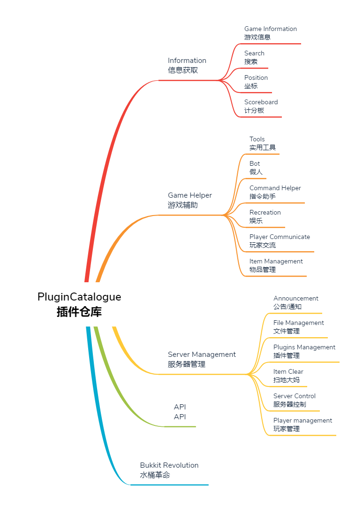

# PluginCatalogue

**English** | [中文](readme_cn.md)

A repository for listing [MCDReforged](https://github.com/Fallen-Breath/MCDReforged) plugins

Only include plugins compatible with MCDReforged

If there is any good plugin, please submit a PR, and I will invite you to this organization if necessary

--------

## Information

### Game Information

| Name | Maintainer | Function |
| - | - | - |
| [daycount](https://github.com/TISUnion/daycount) | [Fallen_Breath](https://github.com/Fallen-Breath) | `!!day` give you the number of day passed |
| [Seen](https://github.com/TISUnion/Seen/tree/MCDR) | [Pandaria98](https://github.com/Pandaria98) | Laziness ranking |
| [SeenR](https://github.com/ra1ny-yuki/mcdr-seen-refreshed) | [Ra1ny_Yuki](https://github.com/ra1ny-yuki) | Laziness ranking for **MCDR 1.x** which can identify Carpet bot) |
| [TPS](https://github.com/Da-Dog/MCDR-Plugins/tree/master/MCDR-TPS) | [Da_Dog](https://github.com/Da-Dog) | Check for server TPS |
| [Daytime](https://github.com/BelowZeroKelvin/MCDR-Daytime) | [BelowZeroKelvin](https://github.com/BelowZeroKelvin) | Show minecraft time |
| [SystemInfo](https://github.com/eagle3236/SystemInfo) | [Alex3236](https://github.com/eagle3236) | View system information|
| [Seed](https://github.com/MCDReforged/Seed) | [White_Paper_](https://github.com/AngelicaRoot) | Use"!!seed"to get seed |
| [Online](https://github.com/A-JiuA/Online) | [A-JiuA](https://github.com/A-JiuA) | A plugin for querying online players of several servers |
| [seed](https://github.com/ChunkAsgore/seed) | [ChunkAsgore](https://github.com/ChunkAsgore) | A plugin for querying server map seeds for MCDReforged. |
| [Info](https://github.com/zhang-anzhi/MCDReforgedPlugins/tree/master/Info) | [zhang_anzhi](https://github.com/zhang-anzhi) | Get useful server info(CPU/memory/world size...) |
| [SeedR](https://github.com/Van-Nya/SeedR) | [Van_Nya](https://github.com/Van-Nya) | Use `!!seed` to get seed,, reply translated message just like vanilla style (**MCDR 1.x Only**) |
| [DayCountR](https://github.com/Van-Nya/DayCountR) | [Van_Nya](https://github.com/Van-Nya) | Use `!!days` to get day count since server set up, customize **start day** and **reply msg** by config file (**MCDR 1.x Only**) |
| [daycount-NBT](https://github.com/eagle3236/daycount-NBT) | [Alex3236](https://github.com/eagle3236) | An easy-use daycount (**MCDR 1.x Only**) |

### Search

| Name | Maintainer | Function |
| - | - | - |
| [MCDR-WikiSearcher](https://github.com/GamerNoTitle/MCDR-WikiSearcher) | [GamerNoTitle](https://github.com/GamerNoTitle) | A plugin helps you search Minecraft Wiki in game and get the result on one click |
| [FastSearch](https://github.com/HackerRouter/MCDR-FastSearch/) | [HackerRouter](https://github.com/HackerRouter/) |Search something in game |
| [BilibiliParser](https://github.com/dogdie233/BilibiliParser) | [dogdie233](https://github.com/dogdie233) | Parse and print Bilibili information on server |
| [WikiRequest](https://github.com/DrLee-lihr/WikiRequest) | [DrLee_lihr](https://github.com/DrLee-lihr) | A plugin to query wiki and return the link of pages you want |

### Position

| Name | Maintainer | Function |
| - | - | - |
| [Here](https://github.com/TISUnion/Here) | [Fallen_Breath](https://github.com/Fallen-Breath) | Broadcast your position and high light yourself |
| [DeiPos](https://github.com/577fkj/MCDR-plugins) | [57767598](https://github.com/577fkj/) | Send player death position to the position owner |
| [Waypoints](https://github.com/GamerNoTitle/MCDR-Waypoints) | [GamerNoTitle](https://github.com/GamerNoTitle) | Gather your waypoints with Volexmap， save them in a database of your server and share them across the server |
| [Here-NBT](https://github.com/DancingSnow0517/Here-NBT) | [DancingSnow0517](https://github.com/DancingSnow0517) | Boardcast your position and high light yourself (Read NBT File Ver) |
| [LocationMarker](https://github.com/TISUnion/LocationMarker) | [Fallen_Breath](https://github.com/Fallen-Breath) | A server side waypoint manager |
| [Where](https://github.com/Ivan-YFw/MCDReforged-Plugins/tree/master/where) | [IvanYF](https://github.com/Ivan-YFw) | Check the coordinate of a player |
| [Markit](https://github.com/mrxiaozhuox/Markit) | [mrxiaozhuox](https://github.com/mrxiaozhuox) | Create, share and manage Your coordinates! |
| [WhoIsDied](https://github.com/linstar-fxt/MyMCDRPlugins/tree/main/WhoIsDied) | [hail122](https://github.com/linstar-fxt) | broadcast player death position (**DO NOT SUPPORT MCDR 0x**) |

### Scoreboard

| Name | Maintainer | Function |
| - | - | - |
| [StatsHelper](https://github.com/TISUnion/StatsHelper) | [Fallen_Breath](https://github.com/Fallen-Breath) | Statistic query and scoardboard maker |
| [MCDR-Auto-Scoreboard](https://github.com/AngelicaRoot/MCDR-Auto-Scoreboard) | [White_Paper_](https://github.com/AngelicaRoot) | Highly customized rolling scoreboard plugin |
| [SChanger](https://github.com/HackerRouter/MCDR-ScoreboardChanger) | [HackerRouter](https://github.com/HackerRouter/) | Change scoreboards automatically |
| [Fz-sDatapackImporter](https://github.com/Hendrix-Shen/Fz-sDatapackImporter) | [Hendrix-Shen](https://github.com/Hendrix-Shen) | A plugin for synchronizing stats data to fz-s datapack scoreboard |
| [StatsRepeat](https://github.com/DancingSnow0517/StatsRepeat) | [DancingSnow0517](https://github.com/DancingSnow0517) | Create and rotate the scoreboard |
| [MinedRanking](https://github.com/zhang-anzhi/MCDReforgedPlugins/tree/master/MinedRanking) | [zhang_anzhi](https://github.com/zhang-anzhi) | Set mined ranking on scoreboard |

## Game Helper

### Tools

| Name | Maintainer | Function |
| - | - | - |
| [Calculator](https://github.com/TISUnion/Calculator) | [Fallen_Breath](https://github.com/Fallen-Breath) | In game calculator |
| [Task](https://github.com/TISUnion/Task) | [Pandaria98](https://github.com/Pandaria98) | Shows tasks of project in progress |
| [GameMode](https://github.com/577fkj/MCDR-plugins) | [57767598](https://github.com/577fkj/) | Change a player's gamemode to spectator, Switch back will teleport him to the original position and change his mode to survival |
| [petmove](https://github.com/63815af756f0357940c666d2ae1c801d/petmove) | [63815af756f0357940c666d2ae1c801d](https://github.com/63815af756f0357940c666d2ae1c801d) | Move a pet between different players |
| [PCRC-MCDR](https://github.com/TISUnion/PCRC-MCDR) | [Fallen_Breath](https://github.com/Fallen-Breath) | Record on server plugin |
| [Gamemode](https://github.com/zhang-anzhi/MCDReforgedPlugins/tree/master/Gamemode) | [zhang_anzhi](https://github.com/zhang-anzhi) | Change to spectator mode for observe, teleport to origin position when change back to survival mode |
| [PerimeterMaker](https://github.com/wyf0762/MCDReforged-Plugins/tree/master/PerimeterMaker) | [wyf0762](https://github.com/wyf0762) | Create perimeters in creative/mirror servers, operate layer by layer to avoid lags |
| [SinglePlayerSleep](https://github.com/zhang-anzhi/MCDReforgedPlugins/tree/master/SinglePlayerSleep) | [zhang_anzhi](https://github.com/zhang-anzhi) | Enable single player sleep to skip night in server |
| [AdvancedCalculator](https://github.com/zhang-anzhi/MCDReforgedPlugins/tree/master/AdvancedCalculator) | [zhang_anzhi](https://github.com/zhang-anzhi) | Provides multiple convenient calculate in game |
| [PearlCannonHelper](https://github.com/SCT-Technology/PearlCannonHelper) | [hai_dan](https://github.com/haidanQAQ) | A tool to calculate the position of each gametick of the pearl accelerated by TNT on the pearl cannon |
| [TpDimension](https://github.com/MIZUkiYuu/MCDR-Plugins/tree/main/TpDimension) | [MIZUkiYuu](https://github.com/MIZUkiYuu) | Teleports between dimensions more easily.For example,use `!!overworld <x> <y> <z>` to specify teleport coordinates |
| [LazyTP](https://github.com/ra1ny-yuki/lazytp) | [Ra1ny_Yuki](https://github.com/ra1ny-yuki/) | Quick teleport helper, teleport between dims, teleport to waypoint quickyly and more functions |
| [DimensionConvert](https://github.com/ActiniumCraft/dimension-convert) | [Eleven](https://github.com/voidswordQQJ) | A plugin to convert dimension coordinate between nether and overworld |
| [Renewability](https://github.com/Fidelxyz/MCDR-Renewability/) | [XuanYun_Fidel](https://github.com/Fidelxyz) | Allows players to clone non-renewable items |

### Bot

| Name | Maintainer | Function |
| - | - | - |
| [CarpetBotList](https://github.com/BelowZeroKelvin/MCDR-CarpetBotList) | [BelowZeroKelvin](https://github.com/BelowZeroKelvin) | A plugin to show carpet bot |
| [AutoBot](https://github.com/SCT-Technology/AutoBot) | [MercyNaima](https://github.com/MercyNaima) | A plugin to spawn carpet BOT/BOTS |
| [MCDR-bot](https://github.com/MCDReforged/MCDR-bot) | [Fallen_Breath](https://github.com/Fallen-Breath) | Fake player support based on [pycraft](https://github.com/ammaraskar/pyCraft) |
| [Bot](https://github.com/zhang-anzhi/MCDReforgedPlugins/tree/master/Bot) | [zhang_anzhi](https://github.com/zhang-anzhi) | Storage bot list, one key to spawn or kill bot |
| [BotMono](https://github.com/Jerry-FaGe/MCDR-BotMono) | [Jerry-FaGe](https://github.com/Jerry-FaGe) | The input English, Chinese (even Pinyin) points to the same BOT and provides operation interface and simplified instructions |
| [BotKikai](https://github.com/Jerry-FaGe/MCDR-BotKikai) | [Jerry-FaGe](https://github.com/Jerry-FaGe) | Storage bot position list, one key to spawn or kill bot, and can let the bot right click |

### Command

| Name | Maintainer | Function |
| - | - | - |
| [CarpetFeatureHelper](https://github.com/TISUnion/CarpetFeatureHelper) | [Fallen_Breath](https://github.com/Fallen-Breath) | Give the ability of switching some of carpet options to non-op player |
| [CommandPermissionReload](https://github.com/DrLee-lihr/CommandPermissionReload) | [DrLee_lihr](https://github.com/DrLee-lihr) | Provides a way to execute the command by changing the '/' character in front of the command to "!!", which can be controlled by the permission system of MCDReforged |
| [kick](https://github.com/ChunkAsgore/kick) | [ChunkAsgore](https://github.com/ChunkAsgore) | A plugin for kicking out players for MCDReforged. |
| [quick_run_cmd](https://github.com/R1ckyH/quick_run_cmd) | [Ricky](https://github.com/R1ckyH) | A plugin can run command script quickly in server. |
| [CwdHelper](https://github.com/Railgun-wiki/CwdHelper) | [Railgun_ALGO](https://github.com/Railgun-wiki) | A plugin can send commend to the system in games. |
| [CommandTraverse](https://github.com/zhangtianli2006/CommandTraverse) | [zhangtianli2006](https://github.com/zhangtianli2006) | Customize command permissions, supports carpet mod. |
| [RawInput](https://github.com/zyxgad/rawinput_mcdr) | [zyxgad](https://github.com/zyxgad/) | Provide better command line interface for vanilla server(like spigot's) |

### Recreation

| Name | Maintainer | Function |
| - | - | - |
| [PlayerDropSkull](https://github.com/MCDReforged/PlayerDropSkull) | [Fallen_Breath](https://github.com/Fallen-Breath) | Player drops skull on death |
| [Hat](https://github.com/BelowZeroKelvin/MCDR-Hat) |[BelowZeroKelvin](https://github.com/BelowZeroKelvin/) | Put something on your head |
| [WebsocketBlh](https://github.com/ixiaohei-sakura/blh-blivedm) |[ixiaohei](https://github.com/ixiaohei-sakura/) | A BLHClient: using websocket to get bilibili bullet chat |
| [TwentyFourPoints](https://github.com/zhang-anzhi/MCDReforgedPlugins/tree/master/TwentyFourPoints) | [zhang_anzhi](https://github.com/zhang-anzhi) | Classic math game twenty four points |
| [Meow](https://github.com/HackerRouter/MCDR-Meow) | [HackerRouter](https://github.com/HackerRouter) | A multifunctional chat bot.(like switching some carpet options) |
| [AIchat](https://github.com/A-jiu-a/AIchat) | [A-jiuA](https://github.com/A-JiuA) | A chat bot that uses Tencent AI and Youdao translation |
| [BeaconRGB](https://github.com/Well2333/BeaconRGB-calculating-software) | [Well2333](https://github.com/Well2333) | Beacon lightcolumn dyeing auxiliary plugin |
| [Minigame](https://github.com/Jianguo-Nut/Minigame) | [Jianguo_Nut](https://github.com/Jianguo-Nut) | Make the vanilla minigames more convenient |
| [BilibiliInfo](https://github.com/CalciumSilicate/BilibiliInfo) | [CalciumSilicate](https://github.com/CalciumSilicate) | Another Bilibili plugin to parse Bilibili information and get the result on a click instead of typing BV |
| [BullshitGen](https://github.com/Van-Nya/BullshitGen) | [Van_Nya](https://github.com/Van-Nya) | Use `!!bullshit` to generate copyable bullshit article with customizable limit and key words (**MCDR 1.x Only**) |
| [MCDRpost](https://github.com/Flyky/MCDRpost) | [Flyky](https://github.com/Flyky) | A MCDR plugin for post/teleport items |
| [HomoCalc](https://github.com/Van-Nya/HomoCalc) | [Van_Nya](https://github.com/Van-Nya) | Use `!!homo` to generate expression with 114514 for **homo** (**MCDR 1.x Only**) |
| [mapitem](https://github.com/InkEcau/MCDReforgedPlugins/tree/master/mapitem) | [InkEcau](https://github.com/InkEcau) | Generate map paintings |
| [MCDR-Hat](https://github.com/B-2U/MCDR-Hat) | [B-2U](https://github.com/B-2U/) | Put something on your head (**MCDR 1.x Only**) |

### Communicate

| Name | Maintainer | Function |
| - | - | - |
| [ChatBridge](https://github.com/TISUnion/ChatBridge) | [Fallen_Breath](https://github.com/Fallen-Breath) | Boardcast chat between mc servers or even discord server |
| [FastPost](https://github.com/HackerRouter/MCDR-FastPost/) |[HackerRouter](https://github.com/HackerRouter/)| Send a message to an offline player |
| [Beep](https://github.com/TISUnion/Beep) | [LucunJi](https://github.com/LucunJi) | Beeps when someone is mentioned in text with an `@` |
| [Vote](https://github.com/Da-Dog/MCDR-Plugins/tree/master/MCDR_Vote) | [Da_Dog](https://github.com/Da-Dog) | In game Vote plugin |
| [QQChat](https://github.com/zhang-anzhi/MCDReforgedPlugins/tree/master/QQChat) | [zhang_anzhi](https://github.com/zhang-anzhi) | Connect QQ and Minecraft, with `list` function |
| [ColoredChat](https://github.com/zhang-anzhi/MCDReforgedPlugins/tree/master/ColoredChat) | [zhang_anzhi](https://github.com/zhang-anzhi) | Support display [Formatting codes](https://minecraft.gamepedia.com/Formatting_codes) in vanilla server |
| [ChatBridgeReforged](https://github.com/R1ckyH/ChatBridgeReforged) | [Ricky](https://github.com/R1ckyH) | Reforged of [ChatBridge](https://github.com/TISUnion/ChatBridge), Boardcast chat between mc servers or even discord server |

## Server Management

### Announcement

| Name | Maintainer | Function |
| - | - | - |
| [joinMOTD](https://github.com/TISUnion/joinMOTD) | [Fallen_Breath](https://github.com/Fallen-Breath) | Welcome message and server list on player joined |
| [joinMOTD++(Recommended)](https://github.com/eagle3236/joinMOTD_Plus) | [Alex3236](https://github.com/eagle3236/) | A more useful joinMOTD.(**MCDR 1.x Only**) |
| [ANN](https://github.com/Da-Dog/MCDR-Plugins/tree/master/MCDR_ANN) | [Da_Dog](https://github.com/Da-Dog) | Timed announcement |
| [CustomMOTD](https://github.com/GamerNoTitle/CustomMOTD) | [GamerNoTitle](https://github.com/GamerNoTitle) | Change your MOTD with a command(colorful content is supported) |
| [JoinMOTDR](https://github.com/Van-Nya/JoinMOTDR) | [Van_Nya](https://github.com/Van-Nya) | Send MOTD on player joined, can **deeply customize** by config file (**MCDR 1.x Only**) |
| [Notice](https://github.com/LiamSho/MCDReforgedPlugins/tree/main/Notice) | [LiamSho](https://github.com/LiamSho) | Easy-to-use announcement plugin. Multiple announcements, auto send on joining, manually broadcast, etc. (**MCDR 1.x Only**) |

### Files

| Name | Maintainer | Function |
| - | - | - |
| [QuickBackupM](https://github.com/TISUnion/QuickBackupM) | [Fallen_Breath](https://github.com/Fallen-Breath) | Backup/Restore plugin, with muti backup slot |
| [TimedQBM](https://github.com/TISUnion/TimedQBM) | [Fallen_Breath](https://github.com/Fallen-Breath) | A Quick-Backup-Multi extension for automatically trigger QBM at given interval |
| [RegionFileUpdater](https://github.com/TISUnion/RegionFileUpdater) | [Fallen_Breath](https://github.com/Fallen-Breath) | Update region files for mirror server |
| [PermanentBackup](https://github.com/MCDReforged/PermanentBackup) | [Fallen_Breath](https://github.com/Fallen-Breath) | Create permanent zipped world backup |
| [AutoBackup](https://github.com/Dark-Night-Base/AutoBackup) | [Dark-Night-Base](https://github.com/Dark-Night-Base) | Auto backup via *rsync* (tested only on Linux) |
| [AutoQuickBackup](https://github.com/XiaoHuiHui233/AutoQuickBackup) | [XiaoHuiHui233](https://github.com/XiaoHuiHui233) | Auto Backup/Restore plugin, with muti backup slot. Modified from QuickBackupM |
| [AutoUpdate](https://github.com/Da-Dog/MCDR-Plugins/tree/master/MCDR-AutoUpdate) | [Da_Dog](https://github.com/Da-Dog) | Server auto update |
| [Regularbackup](https://github.com/TANGhz17/Regularbackup) | [TANGhz17](https://github.com/TANGhz17) | A regular backup plugin(use 7zip) |
| [MirrorSync](https://github.com/wyf0762/MCDReforged-Plugins/tree/master/MirrorSync) | [wyf0762](https://github.com/wyf0762) | Sync survival server world to mirror server |
| [Size](https://github.com/AngelicaRoot/MCDR-Size-Plugin) | [White_Paper_](https://github.com/AngelicaRoot) | Use command to get your server's save size |
| [MapcrafterRender](https://github.com/zhang-anzhi/MCDReforgedPlugins/tree/master/MapcrafterRender) | [zhang_anzhi](https://github.com/zhang-anzhi) | Automatic render the `Mapcrafter` map |
| [WESchem](https://github.com/ra1ny-yuki/weschem) | [Ra1ny_Yuki](https://github.com/ra1ny-yuki/) | Copy WorldEdit schematic files quickly between sub-servers |
| [LiteFileManager](https://github.com/MCDReforged/LiteFileManager) | [Fallen_Breath](https://github.com/Fallen-Breath) | A lite weight in-game file manager |
| [Server-Updater](https://github.com/Lazy-Bing-Server/Server-Updater) | [Ra1ny_Yuki](https://github.com/ra1ny-yuki/) | Keep your vanilla server up-to-date easily |
| [AutoZipBackup](https://github.com/DGBCraft/AutoZipBackup) | [Sanluli36li](https://github.com/Sanluli36li) | Daily backup and unknown player backup base on PermanentBackup |
| [GitBackUp](https://github.com/zyxgad/gitbackup_mcdr) | [zyxgad](https://github.com/zyxgad) | A plugin using git to manage Minecraft backup |

### Plugins

The official plugin manager will be released after the release of MCDR 2.0. Please wait patiently.
<!--| Name | Maintainer | Function |
| - | - | - |
| [MCDP](https://github.com/Dark-Night-Base/MCDP) | [Dark-Night-Base](https://github.com/Dark-Night-Base) | Manage plugins via *git* |
| [pget_pure](https://github.com/MCDReforged/pget_pure) | [TiyaAnlite](https://github.com/TiyaAnlite) | A display infomation friendly plugins for helps you download or update other plugins |
| [MCDR-get](https://github.com/577fkj/MCDR-get) | [57767598](https://github.com/577fkj/) | The plugin library of MCDR |
| [pget_for_MCDR](https://github.com/zhang-anzhi/MCDReforgedPlugins/tree/master/pget_for_MCDR) | [zhang_anzhi](https://github.com/zhang-anzhi) | Download plugin in game |-->

### Item Clean

| Name | Maintainer | Function |
| - | - | - |
| [MCDR-AutoCleaner](https://github.com/Forgot-Dream/MCDR-AutoCleaner) | [Forgot-Dream](https://github.com/Forgot-Dream) | A sweeping robot that can add whitelist |
| [ClearItem](https://github.com/577fkj/MCDR-plugins) | [57767598](https://github.com/577fkj/) | Manual sweeping: after 15s delay, the items on the floor will be clean. The items will be protect for 5min if there's a player die(unless the dead player agrees to sweep the floor) . Info: the sweeping process can be interrupted at any time. You can add items on the white list(will not be clean) |
| [AutoCleaner](https://github.com/GamerNoTitle/AutoCleaner) | [GamerNoTitle](https://github.com/GamerNoTitle) | This may be the simplest auto cleaner of MCDR |

### Server Control

| Name | Maintainer | Function |
| - | - | - |
| [SimpleOP](https://github.com/MCDReforged/SimpleOP) | [Fallen_Breath](https://github.com/Fallen-Breath) | `!!op` to get op, `!!restart` to restart the server. For CMP server |
| [StartStopHelper](https://github.com/MCDReforged/StartStopHelper) | [Fallen_Breath](https://github.com/Fallen-Breath) | Help admin to start / stop / restart the server |
| [MCDR-Mirror-Server](https://github.com/GamerNoTitle/MCDR-Mirror-Server) | [GamerNoTitle](https://github.com/GamerNoTitle) | A plugin helps you sync/turn on your mirror server, for building design and redstone debug (Rcon related feature is not supported in MCDR 1.x) |
| [MWConsole](https://github.com/ixiaohei-sakura/MWConsole) | [ixiaohei](https://github.com/ixiaohei-sakura) | mcdr web console |
| [simple_test](https://github.com/R1ckyH/simple_test) | [Ricky](https://github.com/R1ckyH) | A plugin for checking simple problem of MCDR |
| [cpu_temp](https://github.com/R1ckyH/cpu_temp) | [Ricky](https://github.com/R1ckyH) | A plugin for MCDReforged to check cpu temp regularly |
| [CrashRestart](https://github.com/MCDReforged/CrashRestart) | [Fallen_Breath](https://github.com/Fallen-Breath) | A plugin to restart the server after server crashes. Maximum allowance for crashes is configurable |
| [Hibernate](https://github.com/Dark-Night-Base/Hibernate) |[Dark-Night-Base](https://github.com/Dark-Night-Base) | A plugin which hibernates your server when no one's online, and resume it when someone login |
| [StartStopHelperR](https://github.com/zhang-anzhi/MCDReforgedPlugins/tree/master/StartStopHelperR) | [zhang_anzhi](https://github.com/zhang-anzhi) | Start and stop server helper |

### Player management

| Name | Maintainer | Function |
| - | - | - |
| [Leader](https://github.com/SCT-Technology/Leader) | [MercyNaima](https://github.com/MercyNaima) | Mark you to a leader,and leads people |
| [AdvancedBan](https://github.com/zhang-anzhi/MCDReforgedPlugins/tree/master/AdvancedBan) | [zhang_anzhi](https://github.com/zhang-anzhi) | AdvancedBan, has timing |
| [AdvancedWhitelist](https://github.com/Da-Dog/MCDR-Plugins/tree/master/MCDR-AdvancedWhitelist) | [Da_Dog](https://github.com/Da-Dog) | AdvancedWhitelist with custom kick message and IP whitelist |
| [multi_whitelist](https://github.com/R1ckyH/multi_whitelist) |[Ricky](https://github.com/R1ckyH) |A plugin for control whitelist in multi servers|
| [RepairManager](https://github.com/wyf0762/RepairManager)| [wyf0762](https://github.com/wyf0762)|Manage reports for repair|
| [mcwl](https://github.com/ChunkAsgore/mcwl) | [ChunkAsgore](https://github.com/ChunkAsgore) | A whitelist management plugin for MCDReforged. |
| [Monitor](https://github.com/W-Kazdel/Monitor) | [W-Kazdel](https://github.com/W-Kazdel) | Record player coordinates, pseudo-peace notification. |
| [MonitorR](https://github.com/XiaoHuiHui233/MonitorR) | [XiaoHuiHui233](https://github.com/XiaoHuiHui233) | A plugin that regularly obtains the location of online players for recording, and sets a restricted area at the same time. |
| [WhiteList](https://github.com/zyxgad/whitelist_mcdr) | [zyxgad](https://github.com/zyxgad) | A whitelist/blacklist plugin |
| [LeaderR](https://github.com/linstar-fxt/MyMCDRPlugins/tree/main/Leader-ReForged) | [hail122](https://github.com/linstar-fxt) | migration ‘leader’ to MCDR1x(**DO NOT SUPPORT MCDR 0x**) |

## API

| Name | Maintainer | Function |
| - | - | - |
| [PlayerInfoAPI](https://github.com/TISUnion/PlayerInfoAPI) | [Fallen_Breath](https://github.com/Fallen-Breath) | Get entity information / Parse Minecraft style json. MCDR 0.x only |
| [MinecraftDataAPI](https://github.com/MCDReforged/MinecraftDataAPI) | [Fallen_Breath](https://github.com/Fallen-Breath) | A MCDReforged api plugin to get player data information and more |
| [stext](https://github.com/TISUnion/stext) | [Pandaria98](https://github.com/Pandaria98) | A library for better text display |
| [ChatColor](https://github.com/dogdie233/ChatColor) | [dogdie233](https://github.com/dogdie233) | Send color messages more simply |
| [MinecraftItemAPI](https://github.com/Forgot-Dream/MinecraftItemAPI) | [Forgot-Dream](https://github.com/Forgot-Dream) | Minecraft Blocks ID Library |
| [vault](https://github.com/zhang-anzhi/MCDReforgedPlugins/tree/master/vault) | [zhang_anzhi](https://github.com/zhang-anzhi) | Economic Preposition |
| [ConfigAPI](https://github.com/MCDReforged/ConfigAPI) | [hanbings](https://github.com/hanbings) / [zhang_anzhi](https://github.com/zhang-anzhi) | Fast create config file |
| [ProgressBar](https://github.com/Preliterate/ProgressBar) | [Preliterate](https://github.com/Preliterate) | A library for`bossbar`command |
| [OnlinePlayerAPI](https://github.com/zhang-anzhi/MCDReforgedPlugins/tree/master/OnlinePlayerAPI) | [zhang_anzhi](https://github.com/zhang-anzhi) | Online player api |
| [CoolQAPI](https://github.com/zhang-anzhi/CoolQAPI) | [zhang_anzhi](https://github.com/zhang-anzhi) | CoolQ and MCDR connect plugin develop API |
| [ItemStack](https://github.com/dogdie233/ItemStack) | [dogdie233](https://github.com/dogdie233) | An Item api like Bukkit |
| [UUIDAPI](https://github.com/zhang-anzhi/MCDReforgedPlugins/tree/master/UUIDAPI) | [zhang_anzhi](https://github.com/zhang-anzhi) | Get player UUID |
| [MinecraftItemAPI](https://github.com/zhang-anzhi/MCDReforgedPlugins/tree/master/MinecraftItemAPI) | [zhang_anzhi](https://github.com/zhang-anzhi) | A Minecraft item API |
| [JsonDataAPI](https://github.com/zhang-anzhi/MCDReforgedPlugins/tree/master/JsonDataAPI) | [zhang_anzhi](https://github.com/zhang-anzhi) | Plugin data storage API |
| [WebsocketAPI](https://github.com/BelowZeroKelvin/MCDR-WebsocketAPI) | [BelowZeroKelvin](https://github.com/BelowZeroKelvin) | Provide websocket support for other plugins |
| [RText-EXP](https://github.com/eagle3236/rtext-exp) | [Alex3236](https://github.com/eagle3236) | An RText expression implementation with color, style and hover text support |
| [DatabaseAPI](https://github.com/zhang-anzhi/MCDReforgedPlugins/tree/master/DatabaseAPI) | [zhang_anzhi](https://github.com/zhang-anzhi) | Database API |
| [LanguageAPI](https://github.com/zhang-anzhi/MCDReforgedPlugins/tree/master/LanguageAPI) | [zhang_anzhi](https://github.com/zhang-anzhi) | Language API |
| [MoreAPIs](https://github.com/HuajiMUR233/MoreAPIs) | [Huaji_MUR233](https://github.com/HuajiMUR233) | A very simple plugin that provides some (secondary wrapper) API with events |
| [PythonIsPlugin](https://github.com/HuajiMUR233/PythonIsPlugin) | [Huaji_MUR233](https://github.com/HuajiMUR233) | Let you can depend a you want python version |
| [MCDReforged-Remote](https://github.com/iXORTech/MCDReforged-Remote) | [Cubik65536](https://github.com/Cubik65536) | A MCDR plugin and a Java library, connecting QQ and Minecraft & allowing users to implement server control and other functions through the library  |

## Bukkit Revolution

| Name | Maintainer | Function |
| - | - | - |
| [Economy](https://github.com/zhang-anzhi/MCDReforgedPlugins/tree/master/Economy) | [zhang_anzhi](https://github.com/zhang-anzhi) | Economic plugin |
| [LockChest](https://github.com/Da-Dog/MCDR-Plugins/tree/master/MCDR_Lockchest) | [Da_Dog](https://github.com/Da-Dog) | A plugin that can Lock the Chest |
| [currency](https://github.com/63815af756f0357940c666d2ae1c801d/currency) | [63815af756f0357940c666d2ae1c801d](https://github.com/63815af756f0357940c666d2ae1c801d) | A currency plugin with a dynamic-price shop |
| [MagicChat](https://github.com/Da-Dog/MCDR-Plugins/tree/master/MCDR-MagicChat) | [Da_Dog](https://github.com/Da-Dog) | Show item in chat |
| [QuickAnswer](https://github.com/zhang-anzhi/MCDReforgedPlugins/tree/master/QuickAnswer) | [zhang_anzhi](https://github.com/zhang-anzhi) | Ask online player some arithmetic problems |
| [TPA](https://github.com/Da-Dog/MCDR-Plugins/tree/master/MCDR-tpa) | [Da_Dog](https://github.com/Da-Dog) | tp request plugin |
| [home](https://github.com/wyf0762/MCDReforged-Plugins/tree/master/home) | [wyf0762](https://github.com/wyf0762) | Set a home and teleport to home at any time |
| [back](https://github.com/EDHY-233/MCDR-Plugins/tree/master/back) | [EDHY-233](https://github.com/EDHY-233) | Show and teleport to player's failed place |
| [dimTeleport](https://github.com/wyf0762/MCDReforged-Plugins/tree/master/dimTeleport) | [wyf0762](https://github.com/wyf0762) | Teleport between overworld, the nether and the_end |
| [tpHelper](https://github.com/dream-rhythm/MCDRPlugin-tpHelper) | [dream-rhythm](https://github.com/dream-rhythm) | Let non-op can use tp,tpa and back to last tp Position |
| [TPN](https://github.com/hyf3513OneGO/TPN) | [hyf3513OneGO](https://github.com/hyf3513OneGO/) | Teleport between non-op players freely，show online players |
| [Telekinesis](https://github.com/Nyaacinth/Telekinesis) | [Nyaacinth](https://github.com/Nyaacinth) | Allow teleportation between non-op players, with home/back/spawn support |
